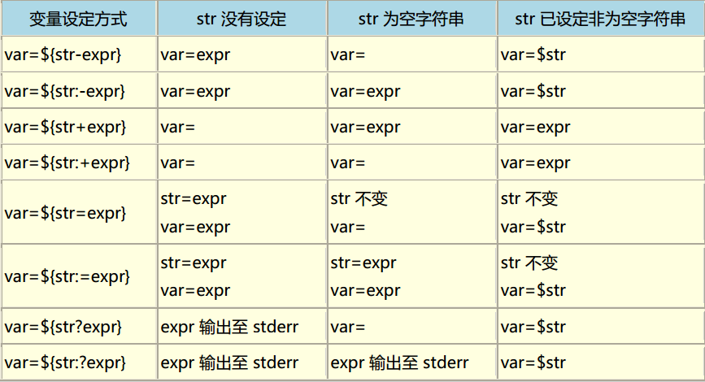

#   *Shell* 基本特性

> - *Bash Reference Manual*：<https://www.gnu.org/software/bash/manual/bash.html>

##  Shell 语法

### Shell 操作

-   Shell 读取、执行命令操作逻辑
    -   读取命令：从文件、`-c` 选项参数、用户终端读取命令
    -   分词：将命令拆分为单词、操作符
        -   别名扩展在此之前执行
    -   解析：将语块解析为简单命令、复合命令
    -   Shell 扩展：执行 Shell 扩展，将扩展后语块拆分为文件名、命令、参数
    -   重定向：执行必要的重定向，并从参数列表中移除重定向操作符、操作数
    -   执行命令
    -   部分情况下，等待命令执行完成、获取退出状态

### *Quoting*

-   引用：移除特定字符、单词的特殊含义
    -   引用被用于
        -   禁用对特殊字符的特殊处理
        -   避免对保留单词的识别
        -   避免参数扩展
    -   引用机制包括
        -   （未被引用的）转义字符 `\`：保留下个字符的字面值
            -   `\<NL>`：取消 `<NL>` 换行原义
        -   单引号引用 `'`：保留被引用字符字面值
        -   双引号引用 `"`：保留被引用字符字面值，除 `` ` ``、`$`、`\`、`!`（仅启用历史扩展时）
        -   *ANSI-C* 引用 `$'<STRING>'`：其中可使用 `\` 执行 *ANSI-C* 标准转义
        -   本地化引用 `$"<STRING>"`：`STRING` 将被本地化

####    `\`、`'`、`"`

-   `\`：转义字符
    -   放在命令同名别名前，取消 `alias`
    -   特殊符号前转义，作为普通字符输出：`$`、`\`、`*`、`!`
    -   不可打印字符的转义
        -   需使用 `echo -e` 参数、转义字符在引号内
    -   位于行尾表示连接下一行，
        -   也可以将 `\n` 视为命令结束，`\` 将 `\n` 转义普通空白符

-   `'`：将包含特殊字符的字符串作为扩起为整体
    -   保留字符的字面含义，特殊含义字符在其中视为普通字符
        -   `'` 扩起的内部无法通过 `\'` 转义输出 `'`
    -   可在字符串前加 `$` 激活 `\` 转义
        -   向字符串中添加转义序列表示的不可打印字符
        -   允许通过 `\'` 插入 `'`

-   `"`：将包含特殊字符的字符串作为扩起为整体
    -   其中大部分特殊字符变成普通字符，但如下字符
        -   `$`：引用变量
        -   `` ` ``：执行子命令
        -   `\`：转义
    -   常用于压制分词
        -   扩起包含空格文件名
        -   保持命令输出格式：`$ echo "$(cal)"`
    -   大部分情况下 `"` 扩起字符串不影响其含义，但
        -   包含 `$IFS` 的字符串字面值被扩起时视为整体，无法被 `for` 迭代


##  Shell 命令

| *Control Operator* | 开头   | 中间                  | 结尾                 |
|--------------------|--------|-----------------------|----------------------|
| `**`               |        | （短路）或执行        |                      |
| `&&`               |        | （短路）与执行        |                      |
| `&`                |        |                       | 异步（后台）执行     |
| `;`                |        | 顺序执行              |                      |
| `;;`               |        |                       | 结束分支匹配         |
| `;&`               |        |                       | 直接执行下个分支命令 |
| `;;&`              |        |                       | 尝试后续匹配         |
| `*`                | 管道符 |                       |                      |
| `*&`               |        |                       | `2>&1 *` 简写        |
| `()`               |        | Subshell 执行命令列表 |                      |
| `(())`             |        | 计算算数表达式        |                      |

| *Reserved Words*                            | 描述     |
|---------------------------------------------|----------|
| `if`、`then`、`elif`、`else`、`fi`          | 条件     |
| `time`                                      | 计时     |
| `for`、`in`、`until`、`while`、`do`、`done` | 循环     |
| `case`、`esac`                              | 选择     |
| `coproc`                                    | 协程     |
| `select`                                    | 交互     |
| `function`                                  | 函数     |
| `{`、`}`                                    | 命令组   |
| `[[`、`]]`                                  | 条件判断 |
| `!`                                         | 历史命令 |

-   *Reserved Words*/*Keyword* 关键字（命令）：对 Shell 有特殊意义，用于开始、结束复合命令
    -   关键字在脚本解析最初即被处理，较内建命令语法宽容、功能弱
    -   说明
        -   `alias` 内建命令较关键字处理更早，支持对关键字别名
        -   可通过 `$ compgen -k` 获取关键字

-   *Simple Commands* 简单命令：空白分割的一系列单词、Shell 控制符号结尾
    -   说明
        -   首个单词指定需要被执行的命令，剩余单词为参数
        -   简单命令退出状态由 *POSIX 1003.1* `waitpid` 函数提供，或者命令由信号 `N` 结束时为 `128 + N` 

-   *Pipeline* 管道（命令）：由 `|`、`|&` 分割一系列（一个或多个）命令
    -   管道中各命令串联输出、输入
        -   `|` 管道串联较命令中指定的重定向优先级更高
        -   `|&` 是 `2>&1 |` 的简写，表示标准输出、标准错误均被串联，其中标准错误优先级较命令中指定的重定向优先级低
    -   说明
        -   管道中各命令在各自 Subshell 独立进程中执行
        -   若管道非异步执行，Shell 将等待管道中所有命令执行完毕
        -   管道退出状态
            -   `pipefail` 复位：管道最后命令退出状态决定
            -   `pipefail` 置位：最后非 0 退出状态或 0

-   *Lists of Commands* 命令列表：由 `;`、`&`、`&&`、`||` 分割的一系列管道，可以 `;`、`&`、`<NL>` 结尾
    -   命令列表中命令执行方式由分割符决定
        -   `;`：顺序执行命令
        -   `<NL>` ：可多个（即多个换行），分割命令，等同于 `;`
        -   `&`：异步（后台）执行命令，被成为异步命令
            -   Shell 不等待命令执行完毕，退出状态为 0
            -   当任务控制非活跃时，异步命令标准输出缺省被重定向至 `/dev/null`
        -   `&&`、`||`：短路与、或执行
    -   说明
        -   `&&`、`||` 优先级高于 `;`、`&`
        -   命令列表退出状态为最后执行的（管道）命令

-   *Compound Commands* 复合命令：Shell 编程结构，以成对的关键字、控制符开始、结束
    -   说明
        -   复合命令的重定向对其中所有命令生效，除非被显式覆盖

```sh
coproc <NAME> <COMPOUND_COMMAND>
coproc <COMPOUND_COMMAND>
coproc <SIMPLE_COMMAND>
```

-   *Coprocess* 协程（命令）：由 `coproc` 引导的命令
    -   协程命令在 Subshell 中异步执行，并建立协程与当前 Shell 环境的双向管道
        -   管道句柄存储在协程名 `NAME` （数组）中，`NAME` 缺省为 `COPROC`
            -   `${<NAME>[0]}` 为协程标准输出描述符
            -   `${<NAME>[1]}` 为协程标准输入描述符
    -   说明
        -   简单命令不支持设置协程名 `NAME`，避免与命令名混淆（可用 `{}` 设为命令组）
        -   若命令输出输出有缓存，则需 `exec ${NAME[0]}>&-` 关闭协程标准输入才能读取协程标准输出
        -   `coproc` 命令退出状态总是 0，异步执行的协程命令退出状态则需 `wait` 后才可获取

> - Bash 中的 `coproc`：<http://blog.lujun9972.win/blog/2018/04/26/%E5%B0%8F%E8%AE%AEbash%E4%B8%AD%E7%9A%84coproc/>

### *Pipeline*

-   管道：用 `|`、`|&` 分隔命令序列
    -   前个命令的输出通过管道连接到后个命令输入
        -   优先级高于命令指定的重定向
    -   `|&` 是 `2>&1 |` 的简写
        -   命令的错误输出、标准输出均被连接
        -   错误输出的隐式重定向优先级低于任何命令指定的重定向

-   管道中命令的执行
    -   若命令异步执行，Shell 将等待整个管道中命令执行完毕
    -   管道中命令在独立的 Shell 中执行
        -   若 `shopt` 的 `lastpipe` 选项被设置，管道中最后命令可能在当前 Shell 中执行

-   管道有其整体退出状态（管道前加上 `!` 表达对管道整体退出状态取反）
    -   若 `set` 的 `pipefail` 选项为被启用，退出状态由最后命令决定
    -   否则，全部成功才返回 0，否则返回最后非 0 退出状态

### *Compound Commands*

####    *Looping Construct*

```sh
until <TEST_COMMANDS>
do
    <CONSEQUENT_COMMANDS>
done

while <TEST_COMMANDS>
do
    <CONSEQUENT_COMMANDS>
done
```

-   `until`、`while` 循环中
    -   `TEST_COMMONDS` 退出状态决定循环体 `CONSEQUENT_COMMANDS` 执行
        -   `until`：执行直至 `TEST_COMMANDS` 退出状态为 0
        -   `while`：执行直至 `TEST_COMMANDS` 退出状态非 0
    -   说明
        -   `TEST_COMMANDS`、`CONSEQUENT_COMMANDS` 均可为命令列表
        -   `CONSEQUENT_COMMANDS` 决定循环的退出状态（未执行亦为 0）
        -   `break`、`continue` 可用于控制循环执行

```sh
for <NAME> [ in [ <WORDS> ... ] ]
do
    <COMMANDS>
done

for (( <INIT_EXPR1>; <CHECK_EXPR2>; <LOOP_EXPR3> ))
do
    <COMMANDS>
don
```

-   `for` 命令包含两种风格
    -   迭代风格 `for`：为 `WORDS` 扩展结果中每个成员执行 `COMMANDS`
        -   `in WORDS` 缺省为 `in "$@"`，即迭代位置参数
    -   *C* 风格循环：类似 C `for` 循环
        -   `EXPR` 均为算数表达式
    -   说明
        -   `COMMANDS` 可为命令列表，决定循环退出状态（未执行亦为 0）
        -   `break`、`continue` 可用于控制循环执行

####    *Conditional Construct*

```sh
if <TEST_COMMANDS>
then
  <CONSEQUENT_COMMANDS>
[
elif <MORE_TEST_COMMANDS>
then
  <MORE_CONSEQUENTS>
]
[else
    <ALTERNATE_CONSEQUENTS>
]
fi
```

-   `if` 条件执行
    -   `TEST_COMMONDS` 退出状态决定执行 `CONSEQUENT_COMMANDS`、或执行 `MORE_TEST_COMMANDS` 条件
    -   说明
        -   `CONSEQUENTS` 等均可为命令列表，决定退出状态（未执行亦为 0）

```sh
case <WORD> in
    [ [(] <PTN> [|<PTN> ...]) <COMMANDS> ;; ]
    ...
esac
```

-   `case` 执行最先匹配的模式对应分支中命令
    -   格式说明
        -   `|`：分割分支内模式
        -   `)`：结束模式列表
        -   `;;`：中断后续匹配
        -   `;&`：直接执行后续分支命令
        -   `;;&`：执行后续分支匹配
    -   说明
        -   `WORD` 支持 `~` 扩展、参数扩展、命令替换、算数扩展、引用消除
        -   `nocasematch` 置位时，匹配无视大小写
        -   `*` 常被用于兜底分支
        -   `COMMANDS` 可为命令列表，决定退出状态（未执行亦为 0）

```sh
select <NAME> [ in <WORDS> ]
do 
    <COMMANDS>
done
```

-   `select` 在标准输出中输出选项菜单、获取用户输入，并执行循环体
    -   输出、输入说明
        -   `WORDS` 中每个元素增加数字选项开头打印至标准输出
        -   `PS3` 提示符用于引导客户输入
            -   若用户输入中包含输出的数字选项，则 `NAME` 置为 `WORDS` 中元素
            -   若用输入为空，则重复打印选项
            -   否则，`NAME` 置空
        -   `REPLY` 变量中存储用户实际输入
    -   `select` 回循环执行，直至显式 `break` 退出
    -   说明
        -   `in WORDS` 缺省为 `in "$@"`，即打印位置参数
        -   `select` 常与 `case` 语句搭配使用
        -   `COMMANDS` 可为命令列表，决定退出状态（未执行亦为 0）

```sh
(( <EXPR> ))
[[ <EXPR> ]]
```

-   `(())`、`[[]]` 为表达式判断结构
    -   `(())` 执行算数表达式，结果非 0 是退出状态为 0
        -   其中表达式类似被 `""` 引用执行扩展
    -   `[[]]` 执行条件表达式
        -   其中单词
            -   不执行分词、文件名扩展
            -   执行 `~` 扩展、参数变量扩展、算数扩展、命令替换、进程替换、引用消除

| 条件算符   | 描述             |
|------------|------------------|
| `<`、`>`   | 按本地化词序比较 |
| `==`、`!=` | 右侧模式匹配     |
#TODO

####    *Grouping Commands*

```sh
( <COMMAND_LIST> )
{ <COMMAND_LIST>; }
```

-   `()`、`{}` 将命令列表组合按整体执行
    -   `()` 将创建 Subshell 执行命令，对当前执行环境无副作用
    -   `{}` 在当前 Shell 环境执行命令
        -   `COMMAND_LIST` 后须有 `;`、`<NL>` 与 `}` 分割
        -   `()` 是符号而 `{}` 是关键字，`()` 不必须空白分割，但 `{}` 需要
    -   说明
        -   命令组的重定向对其中所有命令生效

##  *Shell Functions*

```sh
<FNAME> ()
<COMPOUND_COMMAND>
[REDIRECTIONS]

function <FNAME> [()]
<COMPOUND_COMMAND>
[REDIRECTIONS]
```

-   函数：给命令分组并命名，方便后续复用
    -   函数在当前 Shell 环境中类似普通命令被执行
        -   函数定义（命令）的退出状态总为 0，除非语法错误、存在同名只读函数
        -   函数执行的退出状态由函数体中最后执行的命令决定
    -   函数执行时，函数入参将被设为位置参数
        -   `#` （位置参数长度）也被同步更新
        -   `0` 保持不变
        -   `<FNAME>` 首个元素被设置为被执行函数名称
    -   格式说明
        -   `function` 关键字可以省略，但此时 `()` 不可省略
        -   `COMPOUND_COMMAND` 一般为 `{}` 包裹的命令列表，尤其是 `()` 省略场合下

## *Shell Parameters*

-   *Parameter* 参数：存储值的实体，可以是名称、数字、特殊字符
    -   *Variable* 变量：用名称标识的参数
        -   变量名规则
            -   字母、数字、下划线组成
            -   首字符必为字母、下划线
            -   不能为 Shell 中的关键字
        -   变量除值外还有属性
            -   通过 `declare` 内建命令设置
            -   变量被设置后只能通过 `unset` 移除
        -   变量值执行 `~` 扩展、参数变量扩展、命令替换、算数扩展、引用消除
            -   缺省为空字符串
    -   位置参数：数字（除 `0` 外）标识的参数
        -   位置参数在
    -   特殊参数：特殊字符标识的不可赋值参数

| 特殊参数字符 | 描述                                         |
|--------------|----------------------------------------------|
| `*`          | 位置参数（`1` 起始）                         |
| `@`          | 位置参数（`1` 起始）                         |
| `#`          | 位置参数数量                                 |
| `?`          | 最近前台执行的管道退出状态                   |
| `-`          | `set` 命令设置的选项参数                     |
| `$`          | Shell 进程号（Subshell 中为父 Shell 进程号） |
| `!`          | 最近挂入后台执行的进程号                     |
| `0`          | Shell、脚本名称                              |

-   说明
    -   未被 `""` 括起时，`$*`、`$@` 均将位置单词扩展为独立单词，并进一步执行分词、文件名扩展
    -   被 `""` 括起时
        -   `$*` 扩展为 `IFS` 连接的位置参数组成的单个字符串
        -   `$@` 扩展为 `""` 括起的独立单词

### *Variable*

-   变量赋值
    -   `<name>=<val>`：参数赋值
        -   Bash 所有值都是默认是字符串，没有数据类型概念
            -   `val` 可以是空（字符串）
            -   相邻（无空白）字符串（变量值）自动拼接
        -   `val` 会被应用如下 Shell 扩展
            -   *Tilde* 扩展
            -   参数、变量扩展
            -   命令替换
            -   算术扩展
            -   标记移除
        -   分词、花括号扩展、文件名扩展不对赋值语句应用
        -   若参数有 `integer` 属性，则 `val` 被按照算术表达式计算，即使无 `$(())` 扩展
        -   注意事项
            -   定义时不加`$`符号
            -   等号前后不能有空格
            -   已声明变量可以重新赋值
            -   值中若包含空格需要用引号扩起，否则被视为设置环境变量、再执行命令
            -   可用 `;` 分隔同一行中的多个变量声明（即多条命令）
    -   `<name>+=<val>`：自增运算赋值
        -   `name` 有 `integer` 属性时，按照算术表达式计算
        -   `name` 为字符串时，字符串扩展
        -   `name` 为数组、`val` 为数组 *compound* 赋值形式 `(...)` 时，数组扩展
    -   赋值语句也作为部分命令的参数
        -   `alias`
        -   `declare`
        -   `typeset`
        -   `export`
        -   `readonly`
        -   `local`
    -   赋值语句可以用于设置命令执行环境，不影响当前 Shell 环境
        -   这使得赋值语句可用空格分隔

-   变量值读取：`$<var-name>` / `${<var-name>}`
    -   Shell `-u` 参数未设置时
        -   若变量名未声明，则返回空字符串
        -   或者说，Bash 中不存在的值默认为空字符串

-   变量删除：`$ unset <var-name>`
    -   仅考虑值方面，等同于将变量设置为字符串 `$ <var-name>=`（Shell `-u` 标志未设置）
    -   不能删除只读变量

### 位置参数、特殊参数

-   位置参数：由数字（除 `0` 外）代表的参数
    -   向脚本、函数传递的位置参数
        -   函数内部，传递给函数的参数将覆盖脚本参数
    -   位置参数获取
        -   `$1,...,$9`：单个数字表示的位置参数
        -   `${<NUM>}`：两位及以上数字的位置参数可以用
    -   可用 `set`、`shift` 命令设置、取消
        -   `set -- <pos-param>`：设置位置参数
        -   `shift <n>`：剔除前 `n` 个位置参数

-   参数相关特殊参数：不可被再次赋值
    -   `$0`：shell执行脚本名
        -   交互式bash（即普通终端中）该参数为`-bash`
            -   则`source`执行脚本时，该参数可能非预期
        -   以下shell变量均不考虑`$0`，如
            -   函数中`$0`也是脚本名
            -   `shift`无法跳过该参数
    -   `$#`：脚本、函数参数数量
    -   `$@`：脚本、函数参数列表
        -   总是执行分词，被 `"` 括起时扩展为分词结果被括起
    -   `$*`：脚本、函数参数列表
        -   被 `"` 括起时不分词，返回单个字符串，各参数值使用 `IFS` 值的首个字符分隔
    -   `$_`：上条命令的最后一个参数

-   其他特殊参数：不可被再次赋值
    -   `$$`：当前进程的 PID
    -   `$!`：最近一个后台执行的异步命令的 PID
    -   `$?`：上条命令执行结果
    -   `$-`：当前 Shell 的启动选项（即 `set` 标志）

> - <https://runebook.dev/en/docs/bash/special-parameters>

## *Shell Expansions*

-   扩展：在命令行分割出的 Token 结果上执行扩展
    -   扩展按以下顺序执行
        -   *Brace Expansion*
        -   *Tilde Expansion*
        -   *Parameter and Variable Expansion*
        -   *Command Substitution*
        -   *Arithmetic Expansion*
        -   *Word Splitting*
        -   *Filename Expansion*
    -   说明
        -   Bash 先进行扩展，再执行命令，扩展结果与待执行命令无关
        -   分词（扩展）不对字符串字面值应用
        -   `"` 括起的字符串中，只有 Shell 参数扩展、命令替换、算术扩展会被执行
        -   扩展执行完毕后，除非引号表示自身，否则被移除
        -   此外，部分系统还支持 *Process Substitution*
        -   仅 `{}`、分词、文件名扩展、`$@`、`$*`、`${name[@]}` 会导致单词数量增加

> - Bash 允许通过 `$ set -o noglob` 关闭模式扩展功能
> - <https://runebook.dev/zh-CN/docs/bash/shell-expansions>
> - <https://wangdoc.com/bash/expansion.html>

### `{}` 花括号扩展

-   `{...}`：代表分别扩展为大括号中的所有值（与剩余部分组合）
    -   格式说明
        -   各值间用 `,` 分隔，`,` 前后不能有空格，否则扩展失效，被认为是空格分隔的参数
        -   `,` 前可置空，表示扩展项为空
        -   `,`、`{` 可用 `\` 转义视为普通字符
    -   注意事项
        -   `{}` 可以嵌套
        -   `{}` 可以和其他模式扩展联用，且总是先行扩展

-   `{<start>..<end>..<step>}`：扩展为连续序列
    -   包含首尾字符
    -   支持逆序：`{c..a}`
    -   若连续序列无法识别，则扩展失效并原样返回

### `~` *Tilde* 扩展

-   `~` 波浪线：自动扩展为用户主目录
    -   `~<user-name>`：扩展为指定用户的主目录
        -   用户不存在则原样返回

-   `~+`：一般的扩展为 `$PWD`
    -   `~+<N>`：`N` 为数字时，扩展为目录堆栈栈顶开始第 `N` 号目录

-   `~-`：扩展为 `$OLDPWD`
    -   `~-<N>`：`N` 为数字时，扩展为目录堆栈栈底开始第 `N` 号目录

### `$` 参数扩展

-   `${<param>}`：参数扩展的基本形式
    -   `param`：参数、数组引用
    -   `{}` 可选，但以下情况必须
        -   `param` 为多位数字的位置参数
        -   后跟不应被解释为名称的字符时

-   `${!<param>}`：首个字符是 `!` 且 `param` 不是 *nameref*，将引入一层间接扩展
    -   先将 `${param}` 扩展为其值，然后将其值作为参数再次扩展
    -   `${param}` 值可进行 *Tilde* 扩展、参数扩展、命令替换、算术扩展
    -   若 `param` 是 *nameref*，将扩展为 `param` 指向的变量名

    > - `$$<var-name>` 无法起到相同效果（`$$` 被解释为 Shell PID）

> - <https://runebook.dev/en/docs/bash/shell-parameter-expansion>

####    变量名扩展

-   `${!<prefix>*}`、`${!<prefix>@}`：扩展为以 `prefix` 开头的 **变量名**
    -   变量名之间以 `IFS` 首个字符分隔
    -   `${!<prefix>@}` 即使被 `"` 括起也会被分词，结果为各单词分别为括起

-   `${!<arr>[*]}`、`${!<arr>[@]}`：扩展为数组的已设置的键列表
    -   `arr` 非数组时
        -   `arr` 已声明：返回 0
        -   `arr` 未声明：返回空
    -   `${!<arr>[@]}` 即使被 `"` 括起也会被分词，结果为各单词分别为括起

####    子序列

-   `${<param>:<offset>[:<len>]}`：子序列扩展，从第 `offset`（包括）开始 `len` 个元素
    -   `param` 为 `<arr>[@]`、`<arr>[*]` 时，按元素抽取
    -   `param` 为字符串时，按字符抽取（即使其中包含 `$IFS`）
    -   特别的，`param`  为 `@` 时，表示抽取位置参数

-   抽取规则
    -   下标 `offset`：支持算术表达式
        -   起始一般的为 0，除非 `param` 为 `@`
        -   可用 `0-<len>`/` -<len>` 表示负起始（避免和默认值语法冲突）
    -   长度 `len`：支持算术表达式
        -   可为负值，但不能超过 `offset`（子序列长度小于 0 报错）

-   考虑 `file=/dir1/dir2/dir3/file.txt.bak`

    |命令|解释|结果|
    |------|------|------|
    |`${file:0:5}`|提取首个字符开始的5个字符|`/dir1`|
    |`${file:5:5}`|提取第5个字符开始的5个字符|`/dir2`|
    |`${file:5}`|提取第5个字符开始至末尾|`/dir2...`|
    |`${file:0-5}`|反向计算下标|`t.bak`|
    |`${file: -5:0-1}`|反向计算下标|`t.ba`|
    |`${file:5:0-2}`|提取第5个字符开始至`-2`下标处|`/dir2.../t.b`|

####    序列长度

-   `${#<param>}`：扩展为序列长度
    -   `param` 为字符串时，扩展为字符串长度
    -   `param` 为 `<arr>[@]`、`<arr>[*]` 时，扩建为数组 `arr` 长度
    -   特别的，`param` 为 `@`、`*` 时，扩展为位置参数数量

####    默认值

```shell
$ file=/dir1/dir2/dir3/file.txt.bak
$ null=
```

-   默认值设置
    -   `-`：变量未声明则返回默认值，否则返回其值
    -   `+`：变量已声明则返回默认值，否则返回其值（即空字符串）
    -   `=`：变量未声明则返回默认值、并设置变量值为默认值，否则仅返回其值
    -   `?`：变量未声明将默认值输出至 `stderr`，中断脚本执行
        -   缺省将输出 `parameter null or not set`
    -   `:`：以上命令中空值被视为未声明

    

    |命令|解释|示例|结果|
    |-----|-----|-----|-----|
    |`${<var-name>-<default>}`|变量**未设置**返回默认值|`${invalid-file.txt.bak}`|`file.txt.bak`|
    |`${<var-name>:-<default>}`|变量**未设置、空值**返回默认值|`${null-file.txt.bak}`|`file.txt.bak`|
    |`${<var-name>+<default>}`|变量**设置**返回默认值|`${file-file.txt.bak}`|`fil.txt.bak`|
    |`${<var-name>:+<default>}`|变量**非空**返回默认值|`${file-file.txt.bak}`|`file.txt.bak`|
    |`${<var-name>=<default>}`|变量**未设置**，返回默认值、并设置变量为默认值|`${invalid=file.txt.bak}`|`file.txt.bak`|
    |`${<var-name>:=<default>}`|变量**未设置、空值**返回默认值、并设置变量为默认值|`${null=file.txt.bak}`|`file.txt.bak`|
    |`{$<var-name>?<default>}`|变量**未设置**输出默认值至 `stderr`|`{invalid?file.txt.bak}`|`file.txt.bak`输出至stderr|
    |`{$<var-name>:?<default>}`|变量**未设置、空值**输出默认值至 `stderr`|`{$null:?file.txt.bak}`|`file.txt.bak`输出至stderr|

####    模式匹配

-   模式匹配剔除：`${<param>%<ptn>}`
    -   匹配剔除模式
        -   `#`：从左侧开始最短剔除 `ptn`
        -   `##`：从左侧开始最长（贪婪）剔除 `ptn`
        -   `%`：从右侧开始最短剔除 `ptn`
        -   `%%`：从右侧开始最长（贪婪）剔除 `ptn`
    -   `param` 为 `<arr>[@]`、`<arr>[*]` 时，依次对数组各元素匹配剔除
        -   特别的 `param` 为 `@`、`*` 时，对位置参数匹配剔除
    -   说明
        -   不改变原变量值
        -   仅在 `ptn` 中包含（模式扩展）通配符时，最短、最长匹配才有区别

    |命令|解释|结果|
    |------|------|------|
    |`${file#*/}`|去除首个`/`及其左边|`dir2/dir3/file.txt.bak`|
    |`${file##*/}`|仅保留最后`/`右边|`file.txt.bak`|
    |`${file#*.}`|去除首个`.`及其左边|`txt.bak`|
    |`${file##*.}`|仅保留最后`.`右边|`bak`|
    |`${file%/*}`|去除最后`/`及其右边|`/dir1/dir2/dir3`|
    |`${file%%*/}`|去除首个`/`及其右边|空值|
    |`${file%*.}`|去除最后`.`及其右边|`/dir1/dir2/dir3/file.txt`|
    |`${file%%*.}`|去除首个`.`及其右边|`/dir1/dir2/dir3/file.txt`|

-   模式匹配替换：`${<param>/<from-ptn>/<to-ptn>}`
    -   匹配替换模式（`to-ptn` 为空时即删除）
        -   `/<from-ptn>/<to-ptn>`：替换首个 `from-ptn` 为 `to-ptn`
        -   `//<from-ptn>/<to-ptn>`：替换全部 `from-ptn` 为 `to-ptn`
        -   `/#<from-ptn>/<to-ptn>`：`from-ptn` 必须在开头
        -   `/%<from-ptn>/<to-ptn>`：`from-ptn` 必须在结尾
    -   `param` 为 `<arr>[@]`、`<arr>[*]` 时，依次对数组各元素匹配替换
        -   特别的 `param` 为 `@`、`*` 时，对位置参数匹配替换

    |命令|解释|结果|
    |-----|-----|-----|
    |`${file/dir/path}`|替换首个`dir`为`path`|`/path1/dir2/dir3/file.txt.bak`|
    |`${file/dir/path}`|替换全部`dir`为`path`|`/path1/path2/path3/file.txt.bak`|

-   模式匹配大小写转换：`${<param>^<char>}`
    -   大小写转换模式
        -   `^<char>`：首个 `char` 被转换为大写
        -   `^^<char>`：全部 `char` 被转换为大写 
        -   `,<char>`：首个 `char` 被转换为小写
        -   `,,<char>`：全部 `char` 被转换为小写 
    -   `char` 缺省即为 `?`，匹配所有字符
    -   `param` 为 `<arr>[@]`、`<arr>[*]` 时，依次对数组各元素匹配转换
        -   特别的 `param` 为 `@`、`*` 时，对位置参数匹配转换

####    操作符扩展

-   `${<param>@<op>}`：根据 `op`（单字符）执行不同的替换
    -   各字符含义
        -   `U`：转换为大写
        -   `L`：转换为小写
        -   `u`：首字母转换为大写
        -   `Q`：扩展为可作为输入的、引号括起的字符串
        -   `E`：扩展为有 `\` 转义的参数值，类似 `$'...'`
        -   `P`：将参数值视为 *提示符控制序列* 进行扩展
        -   `A`：扩展为参数的声明语句、或 `declare` 命令字符串，并且参数被重新创建
        -   `K`：
        -   `a`：扩展为参数属性
    -   `param` 为 `<arr>[@]`、`<arr>[*]` 时，依次对数组各元素扩展
        -   特别的 `param` 为 `@`、`*` 时，对位置参数扩展

### `$` 命令扩展（替换）

-   `$(<cmd>)`、<code>`<cmd>`</code>：使用命令的标准输出替换命令本身
    -   Bash 在子 Shell 环境中执行 `cmd` 并将命令替换为命令的标准输出
        -   删除尾随换行符
        -   若输出结果没有被 `"` 括起，则扩展结果会被分词，其中嵌入换行符会被删除
    -   命令扩展可以嵌套

-   格式说明
    -   `$(<cmd>)` 中 `cmd` 所有字符组成命令
    -   <code>`<cmd>`</code> 为旧式命令扩展格式
        -   `cmd` 中 `\` 保留字面值，仅用于转义
            -   `$`：保留字面值
            -   <code>`</code>：命令扩展嵌套

> - 可以理解命令的执行结果都存储在一个匿名变量中，可以在其之前加上`$`获取其结果

### `$(())` 算术扩展

-   `$(( <expr> ))`：扩展为算术表达式 `expr` 结果
    -   `expr` 被当作 `"` 内表达式处理
    -   算术扩展可嵌套
    -   表达式参数扩展、命令替换、引号删除，结果再被计算
        -   算术扩展中参数扩展的 `$` 可被省略
    -   多个表达式时返回最后表达式结果

### `$IFS` 分词

-   分词：Bash 将 `$IFS` 中每个字符视为定界符，并将其作为字段终止符拆分为单词
    -   对未被 `"` 括起的如下扩展结果完成后应用
        -   参数扩展
        -   命令替换
        -   算术扩展
    -   字符串字面值不会被执行分词
        -   不能通过自定义 `$IFS` 得到字面值分词结果
        -   `for` 迭代、数组定义语法中，空格是字面值创建列表的唯一方法
    -   扩展之后未被引号括起的空字符串将被移除
        -   另，被括起的空字符串作为其它字符串一部分（即与其他非空字符串邻接）时，同样被移除（如：`-d""` 中 `""` 将被移除）

-   `IFS` *Internal Field Separator*：内部字段分隔符，作为分词扩展定界符
    -   `$IFS` 缺省为 ` \t\n`（*IFS空白符*）
    -   任何不在开头、结尾的 `$IFS` 字符序列用于分隔单词
        -   `$IFS` 置为空时，不分词
    -   `$IFS` 中包含任何 *IFS空白字符*
        -   扩展结果开头、结尾处 ` \t\n` 序列被忽略
        -   连续的 *IFS空白符* 序列被压缩视为至多一个定界符

> - <https://runebook.dev/en/docs/bash/word-splitting>
> - <https://zhuanlan.zhihu.com/p/36513249>

### 文件名扩展 （*Globbing*）

> - 文件名扩展一般要求参数不被引号括起

-   文件名扩展：需 Shell `noglob` 选项未被设置
    -   分词后，若词未被括起，Bash 扫描单词查找特殊匹配字符
    -   按照模式匹配规则将其替换为按字典序排序的文件名列表

-   相关 Bash 设置
    -   `nullglob`：不存在匹配文件则单词被移除，否则保持单词不变
    -   `nocaseglob`：匹配时不考虑大小写
    -   `dotglob`：`.` 开头文件（隐藏文件）无需用 `.*` 显式指定
        -   `.`、`..` 仍需手动手动指定

-   `$GLOBIGNORE`：文件名扩展结果中匹配其中模式的将被移除
    -   `nocaseglob` 被设置时，匹配时不考虑大小写
    -   `GLOBINGNORE` 有非空值时
        -   `.`、`..` 总是被忽略
        -   需要将 `.*` 添加至其中，否则相当于 `dotglob` 被设置

####  模式匹配

-   模式匹配基本规则
    -   普通字符匹配自身
    -   特殊字符用 `\` 转义匹配其字面值，此时需用引号扩起

-   `*`：匹配任意数量任意字符（包括零个字符、空字符）
    -   用于文件名扩展时，若 Bash `globstar` 选项打开
        -   `**` 匹配零层或多层子目录、所有文件
        -   `**/` 匹配零层或多层子目录、当前文件夹下文件

-   `?`：匹配任意单个字符（不包括空字符）
    -   可连用表示匹配多个字符

-   `[...]`：匹配括号中候选字符
    -   `[<start>-<end>]`：匹配连续的范围内字符
        -   允许字母范围、数字范围：`[a-c]`、`[0-9]`、`[a-c0-4]`
        -   字符排序由 `LC_COLLATE`、`LC_ALL` 决定
    -   `[^...]`、`[!...]`：匹配不在候选字符中的字符
    -   `[[:<class>::]]`：表示字符类，扩展为某类字符中一个
        -   `[[:alnum:]]`：任意英文字母、数字
        -   `[[:alpha:]]`：任意英文字母
        -   `[[:lower:]]`：小写英文字母
        -   `[[:upper:]]`：小写英文字母
        -   `[[:digit:]]`：`0-9` 间任意数字
        -   `[[:xdigit:]]`：16 进制字符
        -   `[[:graph:]]`：`A-Z`、`a-z`、`0-9`、标点
        -   `[[:punct:]]`：标点符号
        -   `[[:blank]]`：空格、*Tab*
        -   `[[:space:]]`：空格、*Tab*、*LF*、*VT*、*FF*、*CR*
        -   `[[:cntrl:]]`：*ASCII* 码中不可打印字符
        -   `[[:print:]]`：*ASCII* 码中 `32-127` 可打印字符
    -   候选字符特例
        -   `[`：可直接放在方括号内
        -   `-`：只能放在方括号内部的开头、结尾

-   量词语法：需要 Bash `extglob` 选项打开
    -   `?(<ptn>[|<ptn>])`：匹配 0 个、1 个 `ptn`
    -   `*(<ptn>[|<ptn>])`：匹配 0 个、多个 `ptn`
    -   `+(<ptn>[|<ptn>])`：匹配 1 个、多个 `ptn`
    -   `@(<ptn>[|<ptn>])`：匹配 1 个 `ptn`
    -   `!(<ptn>[|<ptn>])`：匹配 `ptn` 外内容

### 进程扩展（替换）

-   `<(<cmd>)`、`>(<cmd>)`：扩展为引用进程 `cmd` 输入、输出的文件名
    -   `<(<cmd>)`：视为临时文件，其内容为 `cmd` 的标准输出
    -   `>(<cmd>)`：视为临时文件，其内容将为作为 `cmd` 的标准输入
    -   进程替换支持嵌套

    ```sh
    $ cat <(ls)
    $ ls > >(cat)
    ```

-   格式说明
    -   `<`、`>` 与扩展之间不能出现空格，否则将被解释为重定向

> - 此扩展要求系统支持 `FIFO`、或具名文件 `/dev/fd` 方法

##  *Redirection*

-   重定向：在命令执行前，可以使用特殊符号重定向其输入、输出
    -   文件句柄的复制、打开、关闭、指向其他文件
    -   改变命令的读取、写入目标

-   重定向存续超过命令执行
    -   而，重定向符号前用文件描述符（数字）而不是文件名指定目标
    -   故，可以手动管理文件描述符的生命周期（而不依赖于命令）

### 输入、输出重定向

-   `<FD> < <WORD>`：输入重定向
    -   在文件描述符 `FD` 上以读取的方式打开文件 `WORD`
        -   `FD` 缺省为 0，即标准输入

-   `<FD> >[|] <WORD>`：输出重定向
    -   在文件描述符 `FD` 上以写入的方式打开文件 `WORD`
        -   `FD` 缺省为 1，即标准输出
    -   若文件 `WORD` 不存在则被创建，若文件存在
        -   重定向符为 `>|` 、或 `set` 的 `noclobber` 未被设置，文件被截断为空再写入
        -   若 `set` 的 `noclobber` 选项被设置且 `>`，文件 `WORD` 存在则被重定向失败
    -   `>` 替换为 `>>` 即为 *appending* 重定向

-   `<FD> <> <WORD>`：输入、输出重定向
    -   在文件描述符 `FD` 上以读取、写入的方式打开文件 `WORD`
        -   `FD` 缺省为 0，即标准输入
    -   若文件 `WORD` 不存在则被创建

-   `&> <WORD>`、`>& <WORD>`：标准输出、错误重定向至文件 `WORD`
    -   二者语义上等同于 `> <WORD> 2>&1`
        -   但 `WORD` 可能被扩展为数字、`-`，导致 `>& <WORD>` 被解释为复制
    -   `>` 替换为 `>>` 即为 *appending* 重定向

> - 以上 `WORD` 支持扩展
> - 重定向符首个字符为 `<`，缺省目标为 `0`；为 `>`，缺省目标为 `1`

### 文件描述符复制、移动、关闭

-   `<FD> <& <FD-INPUT>`：复制输入文件描述符（可读取）`FD-INPUT` 至 `FD`
    -   `FD-INPUT` 应扩展为有效的输入文件描述符，否则发生重定向错误
        -   `FD-INPUT` 扩展为 `-` 时，`FD` 被关闭

-   `<FD> >& <FD-OUTPUT>`：复制输出文件描述符（可写入）`FD-OUTPUT` 至 `FD`
    -   `FD-OUTPUT` 扩展为非数字、`-` 时，将被解释为标准输出、错误重定向
        -   `FD-INPUT` 扩展为 `-` 时，`FD` 被关闭

-   在被复制的文件描述符之后添加 `-`，则会将被复制描述符关闭
    -   `<FD> <& <FD-INPUT>-`：输入文件描述符移动
    -   `<FD> >& <FD-OUTPUT>-`：输出文件描述符移动

> - `&` 复制是必要的，否则指示单纯的多次重定向，并覆盖之前

### *Here Document*

```shell
<FD> << <TOKEN>
    # here doc content
<DELIMITER>
```

-   *Here* 文档：将 `TOKEN`、`DELIMITER` 之间的字符串重定向至 `FD`
    -   `TOKEN` 不执行变量扩展、命令替换、算术扩展、文件名扩展
    -   若 `TOKEN` 包含标记
        -   `DELIMITER` 为 `TOKEN` 执行标记移除的结果
        -   *here document* 不执行扩展
    -   若 `TOKEN` 不包含标记
        -   *here document* 执行变量扩展、命令替换、算术扩展（相应引导符需要被转义）
        -   `\n` 被忽略

-   `<<-` 作为重定向符时
    -   前导的制表符被剔除，包括包含 `DILIMITER` 行

### *Here String*

-   *Here* 字符串：`<<< <WORD>`
    -   将 `WORD` 重定向至 `FD`
    -   `WORD` 执行 *Tilde* 扩展、变量扩展、命令替换、算术扩展、标记移除
        -   结果作为字符串，末尾添加换行符


##  命令执行

### 命令执行环境

-   Shell 执行环境要素包括
    -   打开的文件：提供给 `exec` 的重定向修改，或唤醒时继承
    -   当前工作目录：`cd`、`pushd`、`popd` 设置，或唤醒时继承
    -   文件创建模式：`umask` 设置，或从父 Shell 继承
    -   当前 *traps*：`trap` 设置
    -   Shell 参数：变量赋值、`set` 设置、或从父 Shell 继承
    -   Shell 函数：执行时定义，或从父 Shell 继承
    -   Shell 选项：唤醒时指定，或 `set` 设置
    -   Bash `shopt` 设置的选项
    -   Shell 别名：`alias` 设置
    -   进程 ID，包括：后台任务 ID、`$$`、`$PPID`

-   非函数、非 Shell 内建命令执行时，于独立的 Shell 执行环境中唤醒 Shell
    -   继承以下环境元素
        -   打开的文件
        -   当前工作目录
        -   文件创建模式
        -   `export` 标记的 Shell 变量、函数，为命令 `export` 的变量
        -   被捕捉的 *traps* 的值被继承自父 Shell
    -   若命令后接 `&`、且任务控制不活动，则命令的标准输入为空文件 `/dev/null`
    -   独立 Shell 环境中命令的执行不影响其他 Shell 执行环境

-   命令替换、`()` 执行命令、异步命令、管道触发的内建命令在子 Shell 环境执行
    -   该环境是父 Shell 环境的副本，但
        -   *traps* 被重设为继承自父 Shell 环境的值
        -   非 *POSIX* 模式下，Bash 会清除继承的 `-e` 选项
    -   子 Shell 环境中命令的执行不影响父 Shell 执行环境

### 环境变量设置

-   环境变量的范畴
    -   Shell 变量
    -   可被子 Shell 继承的变量，即 `export` 标记的变量
    -   Shell 执行环境中的所有变量

-   `export`/`declare -x`：设置全局（环境）变量
    -   任何在该shell设置环境变量后，启动的（子）进程都会
        继承该变量
    -   对于常用、许多进程需要的环境变量应该这样设置
    
-   `<ENV_NAME>=... cmd`：设置临时环境变量
    -   `<ENV_NAME>=...`不能被子进程继承，所以必须在其后立刻接命令
    -   只对当前语句有效，**不覆盖** 同名变量

> - 狭义环境变量：`export`/`declare -x` 声明的变量，只有这样的变量才能默认被子进程继承
> - 广义环境变量：Shell 中所有的变量（包括局部变量）

####    `/etc/environment`

-   `/etc/environment`：设置整个系统的环境
    -   系统在登陆时读取第一个文件
    -   用于所有为所有进程设置环境变量

#### `/usr/bin/env`

-   `env`：在修改过的环境中执行命令
    -   `$ env <op> <name>=<value> <cmd>`：在设置变量 `name` 的环境中执行 `cmd`
    -   `$ env`：打印当前环境中环境变量

-   选项参数
    -   `<NAME>`：在 `PATH` 中查找 `NAME` 命令并执行，缺省打印 Shell 中环境变量
    -   `-i`/`--ignore-environment`：不带环境变量启动
    -   `-u`/`--unset=<NAME>`：从环境变量中删除变量

-   说明
    -   `env` 常用脚本的 *shebang* 行
    -   `env` 本质上是调用 `execve` 修改子进程环境变量

#   *Bash Builtin Commands*

## *Builtin*

-   *builtin* 内建命令包含在 *Bash* 工具集中
    -   可通过 `$ compgen -b` 获取内建命令
    -   可直接存取 Shell 内部变量
    -   执行效率高，无需开启新进程

> - *Bash Reference Manual*：<https://www.gnu.org/software/bash/manual/bash.html>
> - *Bash* 参考手册：<https://xy2401.com/local-docs/gnu/manual.zh/bash.html>
> - *Shell* 内建命令：<https://c.biancheng.net/view/1136.html>
> - *Bash* 内建命令：<https://linuxstory.gitbook.io/advanced-bash-scripting-guide-in-chinese/zheng-wen/part4/15_internal_commands_and_builtins>
> - *Bash* 内建命令、关键字：<https://askubuntu.com/questions/445749/whats-the-difference-between-shell-builtin-and-shell-keyword>
> - *Bash* 脚本：<https://linuxstory.gitbook.io/advanced-bash-scripting-guide-in-chinese/zheng-wen/part1>
> - *Bash* 内建命令可执行文件：<https://stackoverflow.com/questions/73348381/bash-builtins-also-available-as-separate-executables>

### *Bourne Shell Builtin*

| *Bourne Shell Builtins*                                            | 描述                          |
|--------------------------------------------------------------------|-------------------------------|
| `:`                                                                | 扩展参数列表、重定向          |
| `. filename [arguments]`                                           |                               |
| `break [n]`                                                        | 可跳出多个循环                |
| `cd [-L][[-P [-e]] [-@]] [dir]`                                    |                               |
| `continue`                                                         |                               |
| `eval [arg ...]`                                                   |                               |
| `exec [-cl] [-a name] [command [arguments ...]] [redirection ...]` |                               |
| `exit [n]`                                                         | 退出执行                      |
| `export [-fn] [name[=value] ...]`、`export -p`                     |                               |
| `getopts optstring name [arg]`                                     | 短（单字符）选项参数处理      |
| `hash [-lr] [-p pathname] [-dt] [name ...]`                        |                               |
| `pwd [-LP]`                                                        |                               |
| `readonly [-aAf] [name[=value] ...]`、`readonly -p`                | 标记变量只读，同 `declare -r` |
| `return [n]`                                                       | 返回值                        |
| `shift [n]`                                                        | 移动参数指针                  |
| `[ <ARG>... ]`                                                     |                               |
| `times`                                                            | 显示进程累计时间              |
| `trap [-lp] [[arg] signal_spec ...]`                               | 捕获 *SIGNAL* 并修改动作      |
| `umask [-p] [-S] [mode]`                                           |                               |
| `unset [-f] [-v] [-n] [name ...]`                                  | 删除变量、函数                |

-   说明
    -   以上命令是 *Bash* 自 *Bourne Shell* 继承而来，按 *POSIX* 标准实现

##  *Builtin and Reverses*

-   说明
    -   下述包含 Shell 关键字、*Bourne Shell Builtin*、*Bash* 扩展或自定的命令
    -   *Bash* 扩展或自定命令仅部分按 *POSIX* 标准实现

### 执行

| 执行                                        | 描述                     |
|---------------------------------------------|--------------------------|
| `trap [-lp] [[arg] signal_spec ...]`        | 捕获 *SIGNAL* 并修改动作 |
| `exit [n]`                                  | 退出执行                 |
| `ulimit [-SHabcdefiklmnpqrstuvxPT] [limit]` | Shell 资源限制           |
| `time [-p] pipeline`                        | 统计命令耗时             |
| `times`                                     | 显示进程累计时间         |
| `shift [n]`                                 | 移动参数指针             |
| `getopts optstring name [arg]`              | 短（单字符）选项参数处理 |

> - `getopt` 是外部命令，支持短、长选项

| 输入、输出                                                                                                        | 描述                 |
|-------------------------------------------------------------------------------------------------------------------|----------------------|
| `printf [-v var] format [arguments]`                                                                              | 格式化打印           |
| `echo [-neE] [arg ...]`                                                                                           | 打印                 |
| `read [-ers] [-a array] [-d delim] [-i text] [-n nchars] [-N nchars] [-p prompt] [-t timeout] [-u fd] [name ...]` | 读入文本行           |
| `readarray [-d delim] [-n count] [-O origin] [-s count] [-t] [-u fd] [-C callback] [-c quantum] [array]`          | 读入行并放入索引数组 |
| `mapfile [-d delim] [-n count] [-O origin] [-s count] [-t] [-u fd] [-C callback] [-c quantum] [array]`            | 同 `readarray`       |

### 环境、变量、表达式

| 变量、表达式                                        | 描述                                         |
|-----------------------------------------------------|----------------------------------------------|
| `declare [-aAfFgilnrtux] [-p] [name[=value] ...]`   | 标记变量类型                                 |
| `typeset [-aAfFgilnrtux] [-p] name[=value] ...`     | 同 `declare`                                 |
| `readonly [-aAf] [name[=value] ...]`、`readonly -p` | 标记变量只读，同 `declare -r`                |
| `unset [-f] [-v] [-n] [name ...]`                   | 删除变量、函数                               |
| `let <EXPR> [<EXPR> ...]`                           | 执行算术表达式                               |
| `(( <EXPR> ))`                                      | 同 `let`                                     |
| `local [option] name[=value]`                       |                                              |
| `variables`                                         | `Names and meanings of some shell variables` |

### 配置、环境

| Shell 配置                                                 | 描述 |
|------------------------------------------------------------|------|
| `set [-abefhkmnptuvxBCHP] [-o option-name] [--] [arg ...]` |      |
| `shopt [-pqsu] [-o] [optname ...]`                         |      |
| `export [-fn] [name[=value] ...]`、`export -p`             |      |

| Shell 信息                      | 描述 |
|---------------------------------|------|
| `help [-dms] [pattern ...]`     |      |
| `type [-afptP] name [name ...]` |      |
| `logout [n]`                    |      |

### 文件系统

| 文件系统操作                    | 描述                   |
|---------------------------------|------------------------|
| `pwd [-LP]`                     |                        |
| `pushd [-n] [+N] [-N] [dir]`    | 添加目录到目录堆栈顶部 |
| `popd [-n] [+N] [-N]`           |                        |
| `dirs [-clpv] [+N] [-N]`        |                        |
| `cd [-L][[-P [-e]] [-@]] [dir]` |                        |
| `umask [-p] [-S] [mode]`        |                        |

### 命令信息

| 历史命令                                                                               | 描述 |
|----------------------------------------------------------------------------------------|------|
| `history [-c] [-d offset] [n] or history -anrw [filename] or history -ps arg [arg...]` |      |
| `fc [-e ename] [-lnr] [first] [last] or fc -s [pat=rep] [command]`                     |      |
| `hash [-lr] [-p pathname] [-dt] [name ...]`                                            |      |

| 别名、快捷键                                                                                    | 描述 |
|-------------------------------------------------------------------------------------------------|------|
| `alias [-p] [name[=value] ... ]`                                                                |      |
| `unalias [-a] name [name ...]`                                                                  |      |
| `bind [-lpsvPSVX] [-m keymap] [-f filename] [-q name] [-u name] [-r keyseq] [-x keyseq:shell->` |      |

| 命令补全                                                                                        | 描述 |
|-------------------------------------------------------------------------------------------------|------|
| `compgen [-abcdefgjksuv] [-o option] [-A action] [-G globpat] [-W wordlist]  [-F function] [->` |      |
| `complete [-abcdefgjksuv] [-pr] [-DEI] [-o option] [-A action] [-G globpat] [-W wordlist]  [->` |      |
| `compopt [[-o][+o] option] [-DEI] [name ...]`                                                   |      |

### 任务执行

| 执行任务                                                           | 描述               |
|--------------------------------------------------------------------|--------------------|
| `builtin [shell-builtin [arg ...]]`                                | 执行 bash 内建命令 |
| `source filename [arguments]`                                      |                    |
| `. filename [arguments]`                                           |                    |
| `eval [arg ...]`                                                   |                    |
| `exec [-cl] [-a name] [command [arguments ...]] [redirection ...]` |                    |
| `command [-pVv] command [arg ...]`                                 |                    |

| 查看、控制任务                                                                | 描述 |
|-------------------------------------------------------------------------------|------|
| `enable [-a] [-dnps] [-f filename] [name ...]`                                |      |
| `jobs [-lnprs] [jobspec ...] or jobs -x command [args]`                       |      |
| `job_spec [&]`                                                                |      |
| `kill [-s sigspec] [-n signum ][ -sigspec] pid jobspec` 、`kill -l [sigspec]` |      |
| `fg [job_spec]`                                                               |      |
| `bg [job_spec ...]`                                                           |      |
| `suspend [-f]`                                                                |      |
| `disown [-h] [-ar] [jobspec ... pid ...]`                                     |      |
| `wait [-fn] [id ...]`                                                         |      |
| `caller [expr]`                                                               |      |
| `coproc [NAME] command [redirections]`                                        |      |

### 流程控制、封装

| 函数                                                     | 描述     |
|----------------------------------------------------------|----------|
| `function name { COMMANDS ; } or name () { COMMANDS ; }` | 声明函数 |
| `return [n]`                                             | 返回值   |

| 条件检查       | 描述                 |
|----------------|----------------------|
| `test <EXPR>`  | 检查条件             |
| `[ <ARG>... ]` |                      |
| `true`         | 是                   |
| `false`        | 否                   |
| `:`            | 扩展参数列表、重定向 |

| 分支、循环                                                                                         | 描述           |
|----------------------------------------------------------------------------------------------------|----------------|
| `if <COMMANDS>; then <COMMANDS>; [ elif <COMMANDS>; then <COMMANDS>; ]... [ else <COMMANDS>; ] fi` |                |
| `while <COMMANDS>; do <COMMANDS>; done`                                                            |                |
| `until <COMMANDS>; do <COMMANDS>; done`                                                            |                |
| `case <WORD> in [<PARTTERN_1>) <COMMANDS_1> ;;...] esac`                                           |                |
| `select <NAME> [in <WORD> ... ;] do <COMMANDS>; done`                                              | 交互选择       |
| `continue`                                                                                         |                |
| `break [n]`                                                                                        | 可跳出多个循环 |
| `for <NAME> [in <WORD> ... ] ; do <COMMANDS>; done`                                                | 迭代 `for`     |
| `for (( <EXP1>; <EXP2>; <EXP3> )); do <COMMANDS>; done`                                            | C 风格 `for`   |
| `{ <COMMANDS> ; }`                                                                                 | 命令组         |
| `[[ <EXPR> ]]`                                                                                     |                |

##  Bash 配置项

### `shopt`

-   `shopt`：调整 *Bash* 行为
    -   `$ shopt -s <option-name>`：打开参数
    -   `$ shopt -u <option-name>`：关闭参数
    -   `$ shopt <option-name>`：查询参数状态

-   选项
    -   `dotglob`：模式扩展结果包含隐藏文件
    -   `nullglob`：文件名扩展不存在符合条件文件时返回空（整体返回空）
    -   `extglob`：使得 *Bash* 支持 *ksh* 的部分模式扩展语法（主要是量词语法）
    -   `nocaseglob`：文件名模式扩展不区分大小写（整体不区分）
    -   `globstar`：`**` 匹配 0 个或多个子目录

### `set`

-   `set`：设置所使用的 Shell 选项、列出 Shell 变量
    -   缺省显示 **全部**  Shell 变量、函数
    -   `$ set -<op>`：根据选项标志 `op` 设置 Shell
    -   `$ set +<op>`：取消选项标志 `op`
    -   `$ set -o <option-name>`：根据选项名 `option-name` 设置 Shell
    -   `$ set +o <option-name>`：取消选项名 `option-name`
    -   `$ set -- <pos-params>`：设置位置参数为 `pos-params`

-   选项参数
    -   `-a`：输出之后所有至 `export`（环境变量）
    -   `-b`：使被终止后台程序立即汇报执行状态
    -   `-B`：执行括号扩展
    -   `-C`：重定向所产生的文件无法覆盖已存在文件
    -   `-d`： Shell 默认使用 hash 表记忆已使用过的命令以加速执行，此设置取消该行为
    -   `-e`：若指令回传值不为 0，立即退出 Shell 
    -   `-f`：取消模式扩展
    -   `-h`：寻找命令时记录其位置???
    -   `-H`：（默认）允许使用 `!` 加 *<编号>*方式执行 `history` 中记录的命令
    -   `-k`：命令后的 `=` 赋值语句，也被视为设置命令的环境变量
    -   `-m`：监视器模式，启动任务控制
        -   后台进程已单独进程组运行
        -   每次完成任务时显示包含退出的状态行
    -   `-n`：读取命令但不执行
        -   通常用于检查脚本句法错误
    -   `-p`：允许 *set-user/group-id*
        -   禁止处理 `$ENV` 文件、从文件中继承 Shell 函数
    -   `-P`：处理 `cd` 等改变当前目录的命令时，不解析符号链接
    -   `-t`：读取、执行下条命令后退出
    -   `-u`：使用未设置变量作为错误处理
    -   `-v`：输入行被读取时，显示 Shell 输出行
    -   `-x`：执行命令前先输出执行的命令、环境变量
        -   命令文本前导符为 `$PS4` 扩展值

-   `-o` 选项参数为下列之一
    -   `allexport`：同`-a`
    -   `braceexpand shell`：（默认）执行花括号扩展
    -   `emacs`：（默认）使用emacs风格命令行编辑接口
    -   `errexit`：同`-e`
    -   `errtrace`：同`-E`
    -   `functrace`：同`-T`
    -   `hashall`：同`-h`
    -   `histexpand`：同`-H`
    -   `history`：记录命令历史
    -   `ignoreeof`：读取EOF时不退出shell
    -   `interactive-comments`：允许交互式命令中出现注释
    -   `keyword`：同`-k`
    -   `monitor`：同`-m`
    -   `noclobber`：同`-C`
    -   `noexec`：同`-n`
    -   `noglob`：同 `-f`
    -   `nohash`：同 `-d`
    -   `notify`：同 `-b`
    -   `nounset`：同 `-u`
    -   `physical`：同 `-P`
    -   `pipfail`：管道命令返回值为最后返回值非 0 命令的状态，若没有非 0 返回值返回 0
    -   `posix`：改变 shell 属性以匹配标准，默认操作不同于 *POSIX1003.2* 标准
    -   `priviledged`：同 `-p`
    -   `verbose`：同 `-v`
    -   `vi`：使用 vi 风格的命令编辑接口
    -   `xtrace`：同 `-x`

> - `$-`中存放有当前已设置标志位

##  部分命令说明

### `export`

-   `export`：标记可以传递给子进程的变量
    -   `$ export <op> [<name>[=<val>]]$`：可以赋值语句作为参数

-   选项参数
    -   `-f`：标记函数
    -   `-n`：不再标记每个变量可传递给子进程
    -   `-p`：打印标记为可传递给子进程的变量

### `declare`

`declare`：声明特殊类型的变量

-   变量声明参数

    -   `-i`：声明变量为整形，给变量赋值时将执行算术运（无需 `$(()))`）
        -   可直接用于数学运算、存储运算结果
        -   被声明为整数后仍然可被赋非整形值不报错，但其结果为不可预期的整型值
    -   `-a`：声明变量为普通数组
    -   `-A`：声明变量为关联数组（下标支持字符串，类似字典）
    -   `-u`：声明变量值为大写字母
        -   自动将变量值转换为大写字母
    -   `-l`：声明变量值为小写字母
    -   `-r`：声明变量只读
        -   无法改变变量值，对齐赋值将报错
        -   只读变量无法 `unset` 移除
    -   `-x`：设置为变量为环境变量
        -   同 `export`
    -   `+`：和以上联合使用，取消定义的变量类型
    -   `-g`：在函数中创建全局变量
    -   `-n`：设置变量为 `nameref`，其他参数的引用
        -   对 `nameref` 变量的属性修改、引用、赋值、移除，都作用于其引用的参数
        -   通常用于
            -   函数内部引用其参数，并修改
            -   `for` 循环中允许被迭代对象为变量列表（无需间接扩展）

-   列出变量、函数参数
    -   `-f`：列出脚本中定义的函数名称、函数体
    -   `-F`：列出脚本中定义的函数名称
    -   `-p`：查看变量信息

### `local`

`local`：在函数中定义局部变量，覆盖全局变量

-   说明
    -   Shell 中变量作用域缺省为全局，`local` 将其限制在函数、子函数
        -   被覆盖的全局变量不会在函数内修改
        -   可以修改参数 `-`，仅在函数内部生效
    -   函数中，在其他 Shell 启动的程序不能访问局部变量
    -   退出值为 0，除非 `local` 被用在函数外

-   参数同 `declare`

### `readonly`

`readonly`：声明只读变量

-   说明
    -   不能对只读变量再赋值、移除
    -   退出值为 0，除非提供错误参数

-   参数
    -   缺省：打印所有只读变量
    -   `-f`：声明变量为函数
    -   `-p`：打印所有只读变量
    -   `-a`：声明变量为只读数组
    -   `-A`：声明变量为关联数组（下标支持字符串，类似字典）

### `unset`

`unset`：移除变量、函数

-   说明
    -   可移除数组某个成员
    -   无法移除只读变量
    -   退出值为 0，除非尝试移除只读变量

-   参数
    -   缺省：先尝试移除同名变量，无同名变量则尝试移除同名函数
    -   `-v`：移除所有 Shell 变量
    -   `-f`：移除函数
    -   `-n`：仅移除 `nameref` 变量，而不是其引用对象

### `exit`

-   `exit`：终止脚本执行，并返回退出值
    -   `$ exit <N>`：`N` 为脚本的退出值

-   参数（约定，但建议遵守）
    -   `0`：成功返回
    -   `1`：发生错误
    -   `2`：用法错误
    -   `126`：非可执行脚本
    -   `127`：命令未找到
    -   若脚本被信号 `N` 终止，返回 `128+N`

### `trap`

-   `trap`：响应系统信号，在接受到系统信号时执行指定命令
    `$ trap <do-cmd> <signal> [<signal>...]`

-   选项参数
    -   `-l`：列出所有系统信号

### `ulimit`

-   `ulimit`：控制 Shell 启动进程的可获取资源
    -   `$ ulimit [-HS] <op> <limit>`

-   参数选项
    -   `-S`：改变、报告资源的软限制
    -   `-H`：改变、报告资源的硬限制
    -   `-a`：报告当前所有限制
    -   `-b`：socket 缓冲上限
    -   `-c`：核心文件上限
    -   `-d`：进程数据区上限
    -   `-e`：调度优先级上限
    -   `-f`：Shell 及其子进程写文件上限
    -   `-i`：pending 信号上限
    -   `-k`：kqueue 分配上限
    -   `-l`：内存锁定上限
    -   `-m`：保留集上限（很多
    -   `-n`：打开的文件描述符上限
    -   `-p`：管道缓冲上限
    -   `-q`：*POSIX* 信息队列容量上限
    -   `-r`：实时调度优先级上限
    -   `-s`：堆栈上限
    -   `-t`：每秒 CPU 时间上限
    -   `-u`：用户可用进程数量上限
    -   `-v`：Shell 可用虚拟内存上限
    -   `-x`：文件锁上限
    -   `-P`：虚拟终端上限
    -   `-R`：进程阻塞前可运行时间上限
    -   `-T`：线程数上限

### `time`

-   `time`：测量指令执行耗时、资源
    -   `time` 是 Bash 的保留字，这允许 `time` 方便地测量内建、Shell 函数、管道
    -   `$TIMEFORMAT` 变量指定打印的格式

-   选项参数
    -   `-p`：按照可移植 *POSIX* 格式打印

### `shift`

-   `shift`：左移参数列表，会修改参数列表
    -   说明
        -   可用于参数数量未知时遍历参数
    -   参数
        -   `<N>`：左移参数数量，缺省 1

### `getopts`

-   `getopts`：取出脚本、函数所有配置项（即带有前置连词线 `-` 的单字符参数）
    -   用于结合 `while` 循环遍历所有参数、参数值
    -   遇到不带连词线参数时，执行失败，退出循环

-   参数：`<OPTSTR> <NAME>`
    -   `OPTSTR`：可配置参数名的汇总字符串
        -   参数字符后跟 `:`：配置项须带参数值
        -   参数字符后跟 `::`：配置项参数值可选，设置值必须紧贴参数字符
        -   字符串中首个 `:`：忽略错误
    -   `NAME`：当前取到的参数名称，即循环中临时变量
        -   参数在 `OPTSTR` 中未配置时，赋 `?`
        -   `OPTARG`：循环中存储带参数值参数的取值
        -   `OPTIDX`：原始 `$*` 中下个待处理参数位置，即已处理参数数量加 1（**包括获取的 `OPTARG`**）

```shell
function func (){
    echo OPTIND: $OPTIND
    while getopts ":a:B:cdef" opt; do
      case $opt in
        a) echo "this is -a the arg is ! $OPTARG at $OPTIND" ;;
        B) echo "this is -B the arg is ! $OPTARG at $OPTIND" ;;
        c) echo "this is -c the arg is ! $OPTARG at $OPTIND" ;;
        \?) echo "Invalid option: -$OPTARG" ;;
      esac
    done
    echo OPTIND: $OPTIND
    echo $@
    shift $(($OPTIND - 1))
    echo $@

}
func -a 23 -B 1904-03-04 343 age
```

### `echo`

-   `echo`：向标准输出输出其参数
    -   单行文本可以省略引号，多行文本需用引号扩起
    -   参数
        -   `-n`：取消末尾回车符
        -   `-e`：对引号内字符转义

    > - 存在 `echo` 同名程序

### `read`

```shell
read -p "Enter names: " name

while read line:
do
    echo $line
done <<< $string
```

-   `read`：从标准输入中读取单词，赋值给参数
    -   `$ read <op> <var1>[ <var2>...]`
    -   读取用户输入直到遇到 `-d` 指定的结束符

-   选项参数
    -   `-t`：超时秒数
    -   `-p <MSG>`：提示信息
    -   `-a <ARR>`：将用户输入存储在数组 `ARR` 中
    -   `-n <NUM>`：读取 `NUM` 数量字符，或遇到分隔符后停止读取
    -   `-N <NUM>`：读取 `NUM` 数量字符停止读取
    -   `-e`：允许用户输入是使用 *readline* 快捷键
    -   `-d <DELIMITER>`：以 `DELIMITER` 的首个字符作为用户输入结束，缺省为 `\n`
    -   `-r`：*raw* 模式，不将反斜杠作为转义符号
    -   `-u <FD>`：从文件描述符 `FD` 而不是标准输入中读取
    -   `-s`：隐藏输入

-   参数
    -   `var1`：存储用户输入的变量名，若未定义，则缺省为 `REPLY`
        -   若用户输入项（单词）少于 `read` 参数中变量数目，则额外变量值为空
        -   若用户输入项（单词）多于 `read` 参数中变量数目，则多余输入项存储在最后变量中

### `readarray`、`mapfile`

-   `readarray`/`mapfile`：从标准输入中读取行，作为数组成员
    -   读取用户输入直到遇到输入终止符 `EOF`（`C-d` 终止）

-   选项参数
    -   `-t`：删除输入行文本末尾换行符
    -   `-n <NUM>`：最多读取 `NUM` 行，缺省为 0，读取所有输入
    -   `-o <ORI>`：数组赋值起始位置
    -   `-s <START>`：忽略起始的 `START` 行
    -   `-u <FD>`：从文件描述符 `FD` 而不是标准输入中读取
    -   `-c <COUNT>`：缺省为 5000
    -   `-C <CALLBACK>`：读取 `COUNT` 行之后执行 `CALLBACK`

### `--`

-   `--`：配置项终止符，指示气配置项结束，之后 `-` 当作实体参数解释


#   *Bash* 特性

##  条件表达式

-   *Bash* 条件表达式用于 `[[` 、`test`、`[` 命令中
    -   一元表达式常用于判断文件状态
    -   二元表达式计算数值比较、字符串操作
    -   说明
        -   除非指明，否则表达式作用于符号链接目标
        -   `[[` 中 `>`、`<` 按本地化序比较，而 `test` 按 *ASCII* 序比较

| 条件表达式               | 描述                               |
|--------------------------|------------------------------------|
| `-a <FILE>`、`-e <FILE>` | 文件存在                           |
| `-b <FILE>`              | 块文件                             |
| `-c <FILE>`              | 字符文件                           |
| `-d <FILE>`              | 目录                               |
| `-f <FILE>`              | 正规文件                           |
| `-g <FILE>`              | 文件 `group-id` 置位               |
| `-h <FILE>`、`-L <FILL>` | 符号链接文件                       |
| `-k <FILE>`              | 文件 `sticky` 置位                 |
| `-p <FILE>`              | 具名管道文件 *FIFO*                |
| `-r <FILE>`              | 可读文件                           |
| `-s <FILE>`              | 大小非 0 文件                      |
| `-t <FD>`                | 文件描述符已打开，且指向终端       |
| `-u <FILE>`              | `user-id` 置位                     |
| `-x <FILE>`              | 可执行文件                         |
| `-G <FILE>`              | 被有效用户组拥有                   |
| `-N <FILE>`              | 上次读后被修改                     |
| `-O <FILE>`              | 被有效用户拥有                     |
| `-S <FILE>`              | 套接字文件                         |
| `<FILE1> -ef <FILE2>`    | 指向同一设备上 *Inode*             |
| `<FILE1> -nt <FILE2>`    | 前者更新时间更靠后（或后者不存在） |
| `<FILE1> -ot <FILE2>`    | 前后更新时间更靠前（或前者不存在） |
| `-o <OPTNAME>`           | Shell 选项置位                     |
| `-v <VARNAME>`           | 变量被设置                         |
| `-R <VARNAME>`           | 变量名引用                         |
| `-z <STR>`               | 字串长 0                           |
| `-n <STR>`、`<STR>`      | 字串长非 0                         |
| `<STR1> == <STR2>`       | 相等，执行模式匹配                 |
| `<STR1> = <STR2>`        | 同上，应用于 `test` 命令           |
| `<STR1> != <STR2>`       | 不相等                             |
| `<STR1> < <STR2>`        | 字符序靠前                         |
| `<STR1> > <STR2>`        | 字符序靠后                         |
| `<ARG1> -eq <ARG2>`      | 算术相等                           |
| `<ARG1> -ne <ARG2>`      | 算术不相等                         |
| `<ARG1> -lt <ARG2>`      | 算术小于                           |
| `<ARG1> -le <ARG2>`      | 算术小于等于                       |
| `<ARG1> -gt <ARG2>`      | 算术大于                           |
| `<ARG1> -ge <ARG2>`      | 算术大于等于                       |

##  算数运算

### 算术运算表达式

> - <https://runebook.dev/en/docs/bash/shell-arithmetic>

-   支持算术运算符：支持 `<ops>=` 自运算赋值
    -   双目：`+`、`-`、`*`、`/`、`%`、`**`
    -   单目：`++`、`--`
-   其他进制转换为 10 进制
    -   任意进制 `sys`：`<sys>#<value>`
    -   16 进制：`0x<hex>`
    -   8 进制：`0<oct>`
-   位运算：支持 `<ops>=` 自运算赋值
    -   移位：`<<`、`>>`
    -   按位：`&`、`|`、`~`、`^`
-   逻辑运算
    -   数值比较：`<`、`>`、`<=`、`>=`、`==`、`!=`
    -   逻辑与或：`&&`、`||`、`!`
    -   三目运算：`<cond>?<true-branch>:<false-branch>`

### `((...))`、`let`

-   `let`、`((...))`：计算整数算术表达式值（结果总是整数），支持赋值
    -   退出值
        -   赋值表达式退出值总为 0
        -   表达式结果为 0 则退出值 1，命令执行不成功
        -   表达式结果非 0 则退出值 0，命令执行成功
    -   参数说明
        -   可用 `()` 改变运算顺序
        -   其中变量名 `$` 可省略
        -   非有效整数变量（空、未声明、非整数值、引号扩起的字符串）被视为 0 参与运算，不报错
        -   可用 `,` 分隔多个表达式，退出值由最后表达式决定

    ```sh
    $ let foo=1+2; ((foo = 1+2))
    $ let b=16#4F; ((b=15#4F))
    $ let c=a++; ((c=a++))
    $ let d=c+1, foo*3; ((d=c+1, foo*3))
    ```

####    `let`

-   `let` 特点
    -   参数表达式如果包含空格、逻辑运算符等，需要用 `"` 扩起
    -   除 `,` 外，也可以用空格分隔多个赋值表达式

    ```sh
    let "a=3+4" "b = 4*5"
    ```

####    `((...))`

-   `((...))` 特点
    -   可用 `$` 得到算术扩展语法，扩展为运算结果
        -   多个表达式返回最后表达式值
    -   自动忽略其中空格

    ```sh
    echo $((a=4*5, b=6+7))
    ```

> - `[]` 支持算术运算，但退出状态和 `(())` 相反，不建议使用

### `/usr/bin/expr`

-   `expr`：对参数执行算术运算并 **输出至标准输出**
    -   参数说明
        -   无效整形参数参与运算将报错，变量需要 `$` 获取其值
        -   运算值、运算符之间用空格分隔

    ```sh
    $ expr 3 + 2
    ```

##  数组

> - 列表：分词结果、空格分隔的字符串
> - 数组的其他一些操作参考 *bash_expansion*

### 创建数组、关联数组

-   一次性赋值：`<arr>=(<expr>)`
    -   `expr` 为列表：各值按照顺序作为数组元素
    -   `<arr>=([idx]=<val> ...)`：按照指定序号创建元素
        -   可仅为部分元素指定下标，未指定序号元素自增
        -   未指定元素序号置空

    ```sh
    $ arr=(*sh {a,b,c}.sh)
    $ weeks=([2]=Tue Wed)
    ```

-   逐个赋值：`<arr>[<idx>]=<val>`

-   关联数组：允许使用一般字符串作为数组索引
    -   声明关联数组：`declare -A <arr>`

### 访问数组

-   `${<arr>[idx]}`：获取数组元素
    -   `$<arr>`：回直接获取数组首个元素
-   `${<arr>[@]}`：数组元素列表
    -   总是执行分词，被 `"` 括起时扩展为分词结果被括起
    -   可用于复制数组 `("${<arr>[@]}")`
-   `${<arr>[*]}`：数组元素列表
    -   被 `"` 括起时不分词，返回单个字符串，各参数值使用 `IFS` 值的首个字符分隔

## *Prompt* 控制

-   `$PROMPT_COMMANDS`：*Bash* 输出 prompt 前按顺序执行其中命令

-   prompt 控制变量
    -   `$PS0`：读取、执行命令提示
    -   `$PS1`：主提示字符串
    -   `$PS2`：次提示字符串，折行输入提示符
        -   缺省为 `>`
    -   `$PS3`：`select` 命令提示
    -   `$PS4`：`-x` 标志时，命令回显提示
        -   缺省为 `+`

-   可扩展特殊字符
    -   `\a`：响铃
    -   `\d`：日期
    -   `\D{<format>}`：`format` 作为参数传递给 `strftime`
    -   `\e`：转义字符
    -   `\h`：主机名
    -   `\H`：主机名
    -   `\j`：当前 Shell 管理的任务数量
    -   `\l`：Shell 所处终端设备名称的 basename
    -   `\n`：新行
    -   `\r`：回车
    -   `\s`：Shell 名，即 `$0` 的 basename
    -   `\t`：时间，24小时 `HH:MM:SS` 格式
    -   `\T`：时间，12小时 `HH:MM:SS` 格式
    -   `\@`：时间，12小时 *am/pm* 格式
    -   `\A`：时间，24小时 `HH:MM` 格式
    -   `\u`：用户名
    -   `\v`：Bash 版本
    -   `\V`：Bash release
    -   `\w`：当前工作目录完整路径，`$HOME` 被替换为 `~`
        -   `$PROMPT_DIRTRIM` 控制展示目录层数，缺省为 0
    -   `\W`：`$PWD` 的 basename，`$HOME` 替换为 `~`
    -   `\!`：命令的历史序号（计入从历史记录中恢复命令）
    -   `\#`：命令的命令号（不计入从历史记录中恢复命令，仅计入当前 Shell 会话中执行命令）
    -   `\$`：若有效 *uid* 为 0（即 `root` 用户）则为 `#`，否则为 `$`
    -   `\<nnn>`：八进制 `nnn` 对应 *ASCII* 字符
    -   `\\`：反斜杠
    -   `\[`：不可打印字符序列起始，常用于引导终端控制字符（*ANSI* 转义序列）
    -   `\]`：不可打印字符序列结束

> - <https://runebook.dev/en/docs/bash/controlling-the-prompt>


#   Bash 变量

Shell 变量：Shell 自行管理、分配值的变量

-   Shell 变量往往被进程读取用于自身初始化、设置，是正常运行的条件
    -   通常是系统定义好、父 Shell 传递给子 Shell
    -   所有程序都能访问环境变量，可用作进程通信
        -   在程序中设置环境变量，供其他进程访问变量
        -   父进程为子进程设置环境变量，供其访问

##  *Bourne Shell* 变量

-   *Bourne Shell* 变量：*Bash* 中与 *Bourne Shell* 使用方式相同的变量

-   常用的 *Bourne Shell* 变量有
    -   `HOME`
    -   `CDPATH`：`cd` 查找路径，`:` 分隔
    -   `IFS`：内部词分隔符，指定字符串元素之间的切分方式
        -   默认为空格、制表、回车
    -   `OPTARG`
    -   `OPTIDX`
    -   `PATH`
    -   `PS1`
    -   `PS2`

> - <https://runebook.dev/zh-CN/docs/bash/bourne-shell-variables>

##  *Bash* 变量

-   *Bash* 变量：由 *Bash* 设置、使用，其他 Shell 通常不会对其做特殊处理

-   *Bash* 配置相关变量
    -   `BASHPID`：当前 *Bash* 进程 ID
    -   `BASHOPTS`：当前 *Bash* 参数（`shopts` 设置）
    -   `SHELL`：Shell 名称
    -   `SHELLOPTS`：当前 Shell 参数（`set` 设置）

-   环境相关变量
    -   `DISPLAY`：图形环境显示器名
        -   通常为 `:0`，表示 *X Server* 的首个显示器
    -   `TERM`：终端类型名，即终端模拟器所用协议
    -   `EDITOR`：默认文本编辑器
    -   `HOME`：用户主目录
    -   `HOST`：主机名
    -   `LANG`：字符集、语言编码
        -   一般为 `zh_CN.UTF-8`
    -   `PATH`：冒号分开的目录列表，指示可执行文件搜索地址
    -   `PWD`：当前工作目录

-   用户相关变量
    -   `UID`：当前用户 ID
    -   `USER`：当前用户名
    -   `LOGNAME`：用户登录名
    -   `LANG/LANGUAGE`：语言设置

-   特殊变量：手动修改后重置也不能恢复其行为
    -   `RANDOM`：返回 0-32767 间随机数
    -   `LINENO`：当前正在执行脚本、函数的行号

#   杂项

##  特殊文件

-   部分文件名会被特殊处理（如：重定向、判断文件状态）
    -   `/dev/fd/N`：第 `N` 文件描述符
    -   `/dev/fd/<fd>`：文件描述符 `fd` 被复制
    -   `/dev/stdin`：文件描述符 `0`（标准输入）被复制
    -   `/dev/stdout`：文件描述符 `1`（标准输出）被复制
    -   `/dev/stderr`：文件描述符 `2`（标准错误）被复制
    -   `/dev/tcp/host/port`：尝试打开相应的 *TCP* socket
    -   `/dev/udp/host/port`：尝试打开相应的 *UDP* socket

##  脚本执行

### `#!`

-   *Shebang*/*Hashbang*：`#!` 字符序列
    -   脚本首行的前两个字符，因此首行也被称为 *Shebang 行*
    -   其后指定指定脚本解释器
        -   `#!` 和脚本解释器之间空格为可选
        -   大部分脚本均可使用 *Shabang* 指定解释器
    -   *Shebang 行* 不必须
        -   包含 *Shebang 行* 时，可直接将脚本作为命令执行
        -   缺少时，则需要在命令行指定解释器

-   实务中指定脚本解释器
    -   直接写明解释器路径，但依赖对解释器的位置的了解
    -   使用 `env` 命令获取解释器位置
        -   `env` 总是位于 `/usr/bin/env`
        -   减少对机器配置依赖

    ```shell
    #!/usr/bin/env python
    #!/usr/bin/env shell
    ```

### 脚本执行方式

-   `$ <file-name>`：开启脚本解释器进程，在新进程中执行脚本
    -   说明
        -   需有文件的执行权限
        -   不影响当前 Shell 环境
        -   缺省只寻找 `PATH` 路径下文件，忽略当前目录
    -   `$ <sh> <file-name>`：同直接执行脚本，但自行指定脚本解释器

-   `$ source <file-name>`：读取文件内容至 Shell 中，然后在 Shell 里执行文件内容
    -   说明
        -   需有文件读权限
        -   可直接访问、影响当前 Shell 环境
    -   可用于
        -   加载外部脚本库，之后可以直接使用其中定义变量、函数
        -   直接利用当前 Shell 环境执行脚本
    -   `$ . <file-name>`：同 `source`，`source` 的简写

-   以如下脚本为例
    ```shell
    #!/bin/bash
    echo "fisrt"
    sleep 3
    echo "second"
    ```
    -   `$ test.sh` / `$ sh test.sh`：产生两个新进程 `test.sh` 和 `sleep`
        -   在 `second` 输出之前终止，会同时终止两个进程
    -   `$ source test.sh` / `$ . test.sh`：产生一个新进程 `sleep`
        -   在 `second` 输出之前终止，只有 `sleep` 进程被终止，剩余内容继续执行

