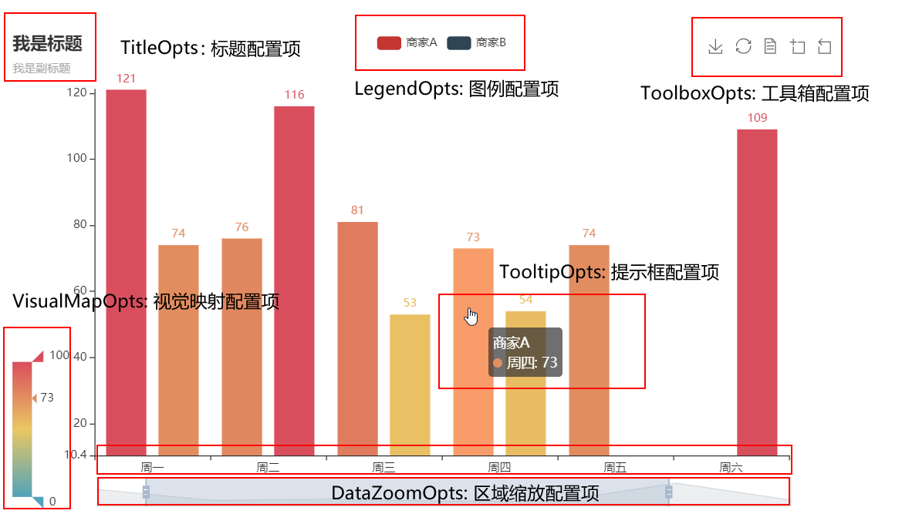

#   *PyEcharts*

##  *PyEcharts* 配置

### `Chart.options`

-   *PyEcharts*：*Echarts* 的 *Python* 封装
    -   *PyEcharts* 本质上即将 *Echarts* 配置项（**包括数据配置、控制配置**）由 *Python* `dict` 序列化为 *JSON* 格式
        -   事实上，*PyEcharts* 中图表核心即 `Chart.options` 字典中配置
        -   图表将按 `Chart.options` 中配置（序列化的 *JSON*）进行渲染
        -   即，修改 `Chart.options` 中配置项即可修改图表
    -   `Chart.options` 中选项值支持列表、单个元素
        -   对，允许重复的选项，列表中多个元素同时生效
        -   否则，列表中首个元素生效
    -   大部分选项同时支持 `XXXOpts`、等价 `dict` 作为选项值（列表元素）
        -   但，`Chart.options["title"]` 等部分仅支持 `dict`

####    数据配置

-   数据配置：即指数据点，对应 `Chart.options["series"][N]["data"]` 项
    -   对应各类图表 `add_xxx` 方法中形参 `xaxis_data`、`y_axis`、`data` 等
    -   *PyEcharts* 支持的数据格式取决于 *JSON* 支持的数据类型
        -   则，数据传入 *PyEchart* 前需自行将数据转换为 **Python 原生数据格式**
        -   即，`np.int64` 等不继承自 `int` 需要转换
    -   `RectChart` 直角坐标系图表需要配置 *X*、*Y* 两轴数据
        -   `RectChart.add_xaxis(xaxis_data)`：添加 *X* 轴数据
            -   `xaxis_data` 实参：常为列表，其中元素为字符串、日期、数值等标量值
        -   `RectChart.add_yaxis(series_name, y_axis)`：添加 *Y* 轴数据
            -   `y_axis` 实参常为列表，其中元素依赖于具体图表类型，可为标量、元组、`XXXXItem` 实例等
    -   其他图表一般只需要通过 `add(series_name, yaxis_data)` 配置单一数据

> - *PyEcharts* 数据格式：<https://pyecharts.org/#/zh-cn/data_format>

####    控制配置

-   控制配置：即指图表渲染的配置项，分为全局配置项、数据序列配置项两类
    -   全局配置项：针对图表全局的配置项，对应 `Chart.options` 整体
        -   通过 `charts.charts.chart.set_global_options` 方法指定全局配置项
        -   配置项类 `XXXOpts` 位于 `options.global_options` 模块中
    -   数据序列配置项：针对图表中某个序列数据的配置项类，对应 `Chart.options["series"]` 中元素
        -   通过 `charts.charts.chart.set_series_options` 方法指定系列配置项
            -   实质上即遍历 `Chart.options["series"]` 中每个元素、修改配置
        -   配置项类 `XXXOpts`、`XXXItems` 位于 `options.series_options` 模块中
    -   配置项形参名一般为 `xxx_opts`、`xxx_items`
        -   对应配置项类名为 `XXXOpts`、`XXXItems`
        -   配置项实参可为 `XXXOpts`、`XXXItems` 实例或 `dict` 形式，两种形式完全等价
            -   事实上，配置项类就是 `dict` 的简单封装

> - *PyEcharts* 参数传递：<https://pyecharts.org/#/zh-cn/parameters>

### 全局配置项

| 配置项类                                       | `set_global_opts` 中形参   | 含义                 |
|------------------------------------------------|----------------------------|----------------------|
| `global_options.InitOpts`                      |                            | 初始化配置项         |
| `global_options.TitleOpts`                     | `title_opts`               | 标题                 |
| `global_options.LegendOpts`                    | `legend_opts`              | 图例                 |
| `global_options.AnimationOpts`                 |                            | 动画                 |
| `global_options.RenderOpts`                    |                            | 渲染                 |
| `global_options.ArialLabelOpts`                |                            | 无障碍标签           |
| `global_options.AriaDecalOpts`                 |                            | 无障碍贴花           |
| `global_options.ToolBoxOpts`                   | `toolbox_opts`             | 工具箱配置项         |
| `global_options.ToolBoxFeatureSaveAsImageOpts` |                            | 工具箱保存图片       |
| `global_options.ToolBoxFeatureRestoreOpts`     |                            | 工具箱还原配置       |
| `global_options.ToolBoxFeatureDataViewOpts`    |                            | 工具箱数据视图工具   |
| `global_options.ToolBoxFeatureDataZoomOpts`    |                            | 工具箱区域缩放       |
| `global_options.ToolBoxFeatureMagicTypeOpts`   |                            | 工具箱动态类型切换   |
| `global_options.ToolBoxFeatureBrushOpts`       |                            | 工具箱选框组件       |
| `global_options.ToolBoxFeatureOpts`            |                            | 工具箱工具配置       |
| `global_options.BrushOpts`                     |                            | 区域组件选择组件     |
| `global_options.AxisOpts`                      | `xaxis_opts`、`yaxis_opts` | *XY* 坐标轴配置      |
| `global_options.AxisLineOpts`                  |                            | 坐标轴线             |
| `global_options.AxisTickOpts`                  |                            | 坐标轴刻度           |
| `global_options.AxisPointerOpts`               |                            | 坐标轴指示器         |
| `global_options.SingleAxisOpts`                |                            | 单轴配置             |
| `global_options.PolarOpts`                     |                            | 极坐标系             |
| `global_options.DataZoomOpts`                  | `datazoom_opts`            | 区域缩放             |
| `global_options.VisualMapOpts`                 | `visualmap_opts`           | 数据值视觉映射、过滤 |

-   全局配置项指不特定于具体数据序列的配置，即 `Chart.options` 中配置
    -   全局配置项设置方式
        -   部分全局配置项通过图表的 `.set_global_opts()` 方法配置
        -   部分全局配置项在 `.add_yaxis()` 等添加数据序列、图形类初始化时配置
    -   `Chart.options` 对任意 `Chart` 类型总存在
        -   但，部分 `Chart` 类型（如 `Grid`）无 `.set_global_opts()` 方法
        -   无 `.set_global_opts()` 方法 `Chart` 衍生图表类，直接修改 `options` 属性同样有效

| 配置项类                              | `add_yaxis` 等中形参 | 含义                           |
|---------------------------------------|----------------------|--------------------------------|
| `global_options.TooltipOpts`          | `tooltip_opts`       | 提示框                         |
| `global_options.DataSetTransformOpts` |                      | 数据集转换                     |
| `global_options.EmphasisOpts`         |                      | 高亮状态下多边形和标签样式     |
| `global_options.Emphasis3DOpts`       |                      | 3D图高亮状态下多边形和标签样式 |
| `global_options.BlurOpts`             |                      | 淡出状态下多边形和标签样式     |
| `global_options.SelectOpts`           |                      | 选中状态下多边形和标签样式     |
| `global_options.TreeLeavesOpts`       |                      | *Tree Leaves* 组件配置         |

> - 全局配置项：<https://pyecharts.org/#/zh-cn/global_options>

### 原生图形配置项类

| 原生图形配置项类                     | 含义                 |
|--------------------------------------|----------------------|
| `charts_options.GraphicGroup`        | 原生图形元素组件     |
| `charts_options.GraphicItem`         | 原生图形             |
| `charts_options.GraphBasicStyleOpts` | 原生图形基础配置     |
| `charts_options.GraphShapeOpts`      | 原生图形形状配置     |
| `charts_options.GraphImage`          | 原生图形图片配置     |
| `charts_options.GraphImageStyleOpts` | 原生图形图片样式     |
| `charts_options.GraphText`           | 原生图形文本配置     |
| `charts_options.GraphTextStyleOpts`  | 原生图形文本样式配置 |
| `charts_options.GraphicRect`         | 原生图形矩形配置     |

> - 原生图形组件：<https://pyecharts.org/#/zh-cn/global_options?id=graphicgroup%ef%bc%9a%e5%8e%9f%e7%94%9f%e5%9b%be%e5%bd%a2%e5%85%83%e7%b4%a0%e7%bb%84%e4%bb%b6>

### 系列配置项

| 配置项类                                | `add_yaxis` 等中形参 | 含义                     | 其他                         |
|-----------------------------------------|----------------------|--------------------------|------------------------------|
| `series_options.ItemStyleOpts`          | `itemstyle_opts`     | 图元样式                 |                              |
| `series_options.TextStyleOpts`          |                      | 文字样式                 |                              |
| `series_options.LabelOpts`              | `label_opts`         | 标签                     |                              |
| `series_options.LineStyle`              |                      | 线样式                   |                              |
| `series_options.SplitLineOpts`          |                      | 分割线配置               |                              |
| `series_options.SplitAreaOpts`          |                      | 分隔区域配置             |                              |
| `series_options.MarkPointOpts`          | `markpoint_opts`     | 标记点配置               |                              |
| `series_options.MarkPointItem`          |                      | 标记点配置数据项         | 可用于初始化 `MarkPointOpts` |
| `series_options.MarkLineOpts`           | `markline_opts`      | 标记线配置               |                              |
| `series_options.MarkLineItem`           |                      | 标记线配置数据项         | 可用于初始化 `MarkLineOpts`  |
| `series_options.MarkAreaOpts`           | `markarea_opts`      | 标记区域配置             |                              |
| `series_options.MarkAreaItem`           |                      | 标记区域配置数据项       | 可用于初始化 `MarkAreaOpts`  |
| `series_options.MinorTickOpts`          |                      | 次级刻度配置             |                              |
| `series_options.MinorSplitLineOpts`     |                      | 次级分割线配置           |                              |
| `series_options.Line3DEffectOpts`       |                      | 3D样式                   |                              |
| `series_options.GraphGLForceAltas2Opts` |                      | *GraphGL Atlas* 算法配置 |                              |

-   系列配置项指具体数据序列的配置，即 `Chart.options["series"]` 列表中配置
    -   `Chart.options["series"]` 中每个 `dict` 元素即代表单个数据序列
        -   `RectChart.add_yaxis` 方法实质上即向其中新增元素
        -   即，直接向其中添加元素即可增加数据序列

> - 系列配置项：<https://pyecharts.org/#/zh-cn/series_options>

##  *Pyecharts* 图表支持

| 方法                                   | 含义                                                         |
|----------------------------------------|--------------------------------------------------------------|
| `Base.add_js_funcs(*fns)`              | 新增 *JS* 代码，将渲染进 *HTML* 中执行                       |
| `Base.add_js_events(*fns)`             | 新增 *JS* 事件函数，将被渲染在 `setOption` 后执行            |
| `Base.set_colors(colors)`              | 设置全局 `Label` 颜色                                        |
| `Base.get_options()`                   | 获取全局 `options` 字典                                      |
| `Base.dump_options()`                  | 获取全局 `options` *JSON*                                    |
| `Base.dump_options_with_quotes()`      | 获取全局 `options` *JSON*（*JS* 函数带引号）                 |
| `Base.render(path,template_name,env)`  | 渲染为 *HTML* 文件                                           |
| `Base.render_embed(template_name,env)` | 渲染为 *HTML* 字符串                                         |
| `Base.render_notebook()`               | 渲染至 *Notebook*                                            |
| `Base.load_javascript()`               | 加载 *JS* 资源（仅在 *JupyterLab* 环境中需在首次渲染前加载） |

-   `pyecharts.Base` 是所有图表的基类

> - 图表 *API*：<https://pyecharts.org/#/zh-cn/chart_api>

### 直角坐标系图

| 方法                                                     | 含义            |                      |
|----------------------------------------------------------|-----------------|----------------------|
| `RectChart.add_xaxis(xaxis_data)`                        | 新增 *X* 轴数据 |                      |
| `RectChart.add_yaxis(series_name,y_axis,...)`            | 新增 *Y* 轴数据 | `Overlap` 图无此方法 |
| `RectChart.extend_axis(xaxis_data,xaxis,yaxis)`          | 扩展 *X/Y* 轴   |                      |
| `RectChart.reversal_axis()`                              | 翻转 *X/Y* 轴   |                      |
| `RectChart.overlap(chart)`                               | 层叠多图        |                      |
| `RectChart.add_dataset(source,dimensions,source_header)` | 添加数据集      |                      |

-   直角坐标系图表均继承自 `charts.RectChart`
    -   `RectChart` 类总是通过 `add_xaxis(xaxis_data)` 添加 **X 轴坐标刻度**
    -   `RectChart` 类常通过 `add_yaxis(series_name, y_axis,...)` 添加 **Y 轴数据序列**（除 `Overlap`、`HeatMap`）
        -   可多次调用、添加多组 *Y* 轴数据在同一图表中展示
            -   多组数据一般以不同颜色渲染、对应图例
        -   `y_axis` 参数即为添加的数据列表，其中元素可为多种类型
            -   基础格式：一般即为 *Y* 轴取值，按顺序与 `xaxis_data` 匹配
            -   扩展格式：前 `xindex`、后补 `extra...` 作为数据序列
                -   `xindex` 指对应的 `xaxis_data` 位序（若基础格式本身为元组，则可省略）
                -   `extra...` 可为任意、数量元素，用于帮助调整数据项渲染（被 `JsCode` 封装回调函数获取）
            -   对应的数据项类
        -   `add_yaxis` 方法中其他形参可以使用 `common.utils.JsCode` 实例作为实参
            -   `JsCode` 内应封装回调函数 `function (params) {}`
            -   回调函数参数 `params` 代表单个数据对象
                -   `param.value` 即为 `y_axis` 序列中单个数据项
    -   特殊说明
        -   `HeatMap.add_yaxis(series_name, yaxis_data, value)` 中需额外设置 **Y 轴坐标刻度**
            -   `yaxis_data` 类似 `add_xaxis(xaxis_data)` 中 `xaxis_data` 指定刻度
            -   `value` 对应一般的 `add_yaxis(series_name, y_axis)`
        -   `RectChart.overlap()` 方法返回 `charts.Overlap` 覆盖图表
            -   被重叠图表的全局配置整体被覆盖，同覆盖图表

| 类                                | 图表       | 备注                            |
|-----------------------------------|------------|---------------------------------|
| `charts.Bar(init_opts)`           | 条形图     |                                 |
| `charts.PictoriaBar(init_opts)`   | 象形条形图 | 可用 `symbol` 指定条形形状      |
| `charts.Scatter(init_opts)`       | 散点图     |                                 |
| `charts.EffectScatter(init_opts)` | 涟漪散点图 | 可用 `symbol` 指定散点形状      |
| `charts.Line(init_opts)`          | 折线图     |                                 |
| `charts.Boxplot(init_opts)`       | 箱线图     | 扩展格式中`xindex` 可选         |
| `charts.Kline(init_opts)`         | *K* 线图   | 扩展格式中 `xindex` 可选        |
| `charts.HeatMap(init_opts)`       | 热力图     |                                 |
| `charts.Overlap()`                | 层叠多图   | 通过 `Chart.overlap()` 方法创建 |

> - *PyEcharts* 直角坐标系图：<https://pyecharts.org/#/zh-cn/rectangular_charts>
> - 原生 *Javascript*：<https://pyecharts.org/#/zh-cn/javascript>

####    `add_yaxis` 数据形参 `y_axis`

| 图表            | `y_axis` 基础格式            | `y_axis` 扩展格式                              | `y_axis` 数据项类   |
|-----------------|------------------------------|------------------------------------------------|---------------------|
| `Bar`           | `[value,]`                   | `[(xindex, value, extra...)]`                  | `BarItem`           |
| `PictoriaBar`   | `[value,]`                   | `[(xindex, value, extra...)]`                  |                     |
| `Scatter`       | `[y,]`                       | `[(xindex, y, size, extra...)]`                | `ScatterItem`       |
| `EffectScatter` | `[y,]`                       | `[(xindex, y, size, extra...)]`                | `EffectScatterItem` |
| `Line`          | `[y,]`                       | `[(xindex, y, size, extra...)]`                | `LineItem`          |
| `Boxplot`       | `[(min, q1, med, q3, max),]` | `[(xindex, min, q1, med, q3, max, extra...),]` | `BoxplotItem`       |
| `Kline`         | `[(o, c, l, h),]`            | `[(xindex, o, c, l, h, extra...),]`            | `CandleStickItem`   |
| `HeatMap`       | `[(x, y, value),]`           | `[(x, y, value, extra...),]`                   | `HeatMapItem`       |

####    `add_yaxis` 其他参数

| 常用形参               | 类型                                    | 说明                 | 其他                               |
|------------------------|-----------------------------------------|----------------------|------------------------------------|
| `series_name`          | `str`                                   | 序列名               |                                    |
| `y_axis`               | `Sequence[opts.XXXItem, dict]`          | 数据                 |                                    |
| `is_selected`          | `bool`                                  | 图例默认选中（展示） |                                    |
| `xaxis_index`          | `Optional[Numeric]`                     | *X* 轴位序           | 图表中存在多个 *X* 轴时，`0` 起始  |
| `yaxis_index`          | `Optional[Numeric]`                     | *Y* 轴位序           | 图表中存在多个 *Y* 轴时，`0` 起始  |
| `polar_index`          | `Optional[Numeric]`                     | 极坐标系位序         | 图表中存在多个极坐标系时，`0` 起始 |
| `is_legend_hover_link` | `bool`                                  | 鼠标图例上悬浮时高亮 |                                    |
| `color`                | `Optional[str]`                         | 颜色                 |                                    |
| `tooltip_opts`         | `Union[opts.TooltipOpts, dict, None]`   | 提示框组件           |                                    |
| `label_opts`           | `Union[opts.LabelOpts, dict]`           | 标签配置             |                                    |
| `markpoint_opts`       | `Union[opts.MarkPointOpts, dict, None]` | 标记点配置           |                                    |
| `markline_opts`        | `Union[opts.MarkLineOpts, dict, None]`  | 标记线配置           |                                    |
| `markarea_opts`        | `Union[opts.MarkArea, dict, None]`      | 标记区域             |                                    |
| `itemstyle_opts`       | `Union[opts.ItemStyleOpts, dict, None]` | 图元样式             |                                    |
| `emphasis_opts`        | `Union[opts.Emphasis, dict, None]`      | 高亮配置             |                                    |

-   说明
    -   `charts.Overlap`、`charts.Grid` 是单个图表，其中数据序列、坐标轴位序按添加先后顺序统一计数

> - 直角坐标系图表：<https://pyecharts.org/#/zh-cn/rectangular_charts>
> - 系列配置项：<https://pyecharts.org/#/zh-cn/series_options>

### 其他基本图表

| 图表       | 类                             |
|------------|--------------------------------|
| 日历图     | `charts.Calendar(init_opts)`   |
| 漏斗图     | `charts.Funnel(init_opts)`     |
| 仪表盘     | `charts.Gauge(init_opts)`      |
| 关系图     | `charts.Graph(init_opts)`      |
| 水球图     | `charts.Liquid(init_opts)`     |
| 平行竖线图 | `charts.Parallel(init_opts)`   |
| 饼图       | `charts.Pie(init_opts)`        |
| 极坐标图   | `charts.Polar(init_opts)`      |
| 雷达图     | `charts.Radar(init_opts)`      |
| 桑基图     | `charts.Sankey(init_opts)`     |
| 旭日图     | `charts.Sunburst(init_opts)`   |
| 河流图     | `charts.ThemeRiver(init_opts)` |
| 词云图     | `charts.WordCloud(init_opts)`  |
| 树图       | `charts.Tree(init_opts)`       |
| 矩形树图   | `charts.TreeMap(init_opts)`    |

> - *PyEcharts* 基本图表：<https://pyecharts.org/#/zh-cn/basic_charts>
> - *PyEcharts* 树形图：<https://pyecharts.org/#/zh-cn/tree_charts>

### 地理图表

| 图表       | 类                                                  |
|------------|-----------------------------------------------------|
| 地理坐标系 | `charts.Geo(init_opts,is_ignore_nonexistent_coord)` |
| 地图       | `charts.Map(init_opts)`                             |
| 百度地图   | `charts.BMap(init_opts)`                            |

> - *PyEcharts* 地理图表：<https://pyecharts.org/#/zh-cn/geography_charts>

### *3D* 图表

| 图表        | 类                            |
|-------------|-------------------------------|
| *3D* 柱状图 | `charts.Bar3D(init_opts)`     |
| *3D* 折线图 | `charts.Line3D(init_opts)`    |
| *3D* 散点图 | `charts.Scatter3D(init_opts)` |
| *3D* 曲面图 | `charts.Surface3D(init_opts)` |
| *3D* 路径图 | `charts.Lines3D(init_opts)`   |
| 三维地图    | `charts.Map3D(init_opts)`     |
| *GL* 关系图 | `charts.GraphGL(init_opts)`   |

> - *PyEcharts 3D* 图表：<https://pyecharts.org/#/zh-cn/3d_charts>

### 组合图表

| 组合方式 | 类                                                |
|----------|---------------------------------------------------|
| 网格组合 | `charts.Grid(init_opts)`                          |
| 顺序分页 | `charts.Page(page_title,js_host,interval,layout)` |
| 选项卡   | `charts.Tab(page_title,js_host)`                  |
| 顺序轮播 | `charts.Timeline(init_opts)`                      |

-   组合图表与常规图表没有太大不同，以 `Grid` 为例
    -   `Grid.add_chart(Chart)` 实质上即将图表中配置选项 `Chart.options` 复制至 `Grid.options` 中（`RectChart.overlap` 行为类似）
        -   故，`.add_chart(Chart)` 之后，对原 `Chart` 修改对 `Grid` 无影响
        -   且因此，`Grid.options` 中配置项可能包含大量重复配置
    -   `Grid.options["grid"]` 列表中存储 `opt.GridOpts` 是网格布局的核心
        -   `Grid.options["grid"]` 中每个 `opt.GridOpts` 对应单个网格布局
        -   `Grid.options["aAxis"]`、`Grid.options["yAxis"]` 每个直角坐标系轴通过其 `grid_index` 项与对应网格关联
        -   `Grid.options["series"]` 每个数据序列通过 `xaxis_index`、`yaxis_index` 与对应坐标轴关联
            -   即，组合中多个图表的的坐标共用坐标轴序号，绑定数据时注意全局考虑序号
            -   且，非 `RectChart` 被 `Grid.add_chart` 添加无法与对应网格绑定（可渲染，但不受网格配置影响）

| 配置项类                        | 含义              |
|---------------------------------|-------------------|
| `global_options.GridOpts`       | `Grid` 配置项     |
| `charts_options.PageLayoutOpts` | `Page` 布局配置项 |

> - *PyEcharts* 组合图表：<https://pyecharts.org/#/zh-cn/composite_charts>

### 网页组件

| 组件 | 类                                     |
|------|----------------------------------------|
| 表格 | `components.Table(page_title,js_host)` |
| 图像 | `components.Image(page_title,js_host)` |

> - 当前 `Table`、`Image` 与 `Page` 不兼容
> - *PyEcharts* 网页组件：<https://pyecharts.org/#/zh-cn/html_components>

#   *Streamlit*

##  *Streamlit* 框架核心

-   *Streamlit*：为数据可视化特化的、前后端一体的 *Web App* 框架
    -   数据可视化特化
        -   原生支持 `pd.DataFrame` 展示、编辑
        -   原生支持图、表渲染
    -   前后端一体：框架 *Widget* 组件直接封装、处理前端渲染、前后端交互
        -   组件前端交互结果作为组件函数返回值
        -   组件交互默认触发页面重跑，根据交互结果重渲染页面
    -   极简化配置：单个 `.py` 文件即可完成全部配置
        -   组件按 `.py` 中执行顺序（即组件注册顺序），依次向下渲染
        -   `streamlit run <APP.py>` 即启动服务

### *Streamlit* 架构、渲染

-   *Streamlit* 架构、渲染
    -   前端渲染
        -   `st.write`：**自动选择合适方式** 渲染数据至前端
        -   `st.write_stream`：流式渲染迭代结果至前端
        -   *Magic* 特性：页面代码中变量、字面值将被通过 `st.write` 渲染至前端（可关闭）
    -   缓存支持
        -   `@st.cache_data` 数据缓存：序列化结果并缓存
            -   根据函数内容、参数决定是否反序列化并返回结果
                -   参数需 *hashable*，否则（形参）参数名通过 `_` 声明不参与缓存命中比对
            -   缓存结果为反序列化后结果副本，修改返回结果不影响后续调用
            -   适合数据、非共享资源等
        -   `@st.cache_resource` 资源缓存：直接缓存结果实例
            -   不会创建数据副本，全局共享相同实例
            -   适合缓存全局共享资源、无法序列化数据，如模型、数据库连接
    -   状态保持
        -   `st.session_state` 会话状态：在同一会话的多次重运行之间维护、保持状态
            -   类似 `dict`，支持属性、字段两种方式访问、设置
                -   会话状态默认可以绑定不可序列化数据
                -   可配置 `enforceSerializableSessionState` 选项以检查、并强制仅允许设置可序列化数据
            -   会话状态中属性可通过组件 `key` 参数绑定至组件（除 `st.button`、`st.file_uploader` 外）
        -   *Callback* 回调函数：组件可设置回调函数监听事件（状态改变）
            -   回调函数通过组件 `on_change`、`on_click` 参数配置（可用参数取决与组件）
            -   重跑时，回调函数 **先于页面重跑内容执行**
    -   区块控制
        -   `st.form` 表单：组合多个组件为表单，表单仅作为整体提交并触发重跑
            -   表单内组件事件不触发重跑，仅在表单提交时触发
                -   注意，表单未提交情况的重跑，表单内组件后端取值不会更新
                -   但，重跑不会重置表单内组件前端取值
                -   另，对表单内 `st.number_input`、`st.text_input`、`st.text_area` 组件，回车等也将触发表单提交
            -   表单支持上下文管理器语法、容器语法（调用方法创建内部组件）
        -   `@st.fragment` 区块：设置函数内为独立函数区块，函数内事件仅触发函数区块独立重跑
            -   `@st.fragment` 作为装饰器将函数转换为函数区块
                -   函数区块调用位置才是其中组件渲染顺序

> - *Write and Magic*：<https://docs.streamlit.io/develop/api-reference/write-magic>
> - *Streamlit Concepts*：<https://docs.streamlit.io/develop/concepts>
> - *Streamlit Architecture & execution*：<https://docs.streamlit.io/develop/concepts/architecture>

### *Streamlit* 多页面

-   *Streamlit* 多页面支持
    -   自定义多页面配置
        -   入口文件：`streamlit run` 启动文件
            -   入口文件可以包含、渲染组件，并在所有子页面中共享（渲染）
            -   即，入口文件可视为外部框架，子页面在其中渲染
        -   `st.Page` 页面：接受函数、字符串（页面文件相对入口文件路径）作为页面内容（源）
            -   可通过参数自定义导航栏标签、标题、*icon* 等
            -   或，在页面源文件（函数）（包括启动文件）中通过 `st.set_page_config` 配置
                -   `st.set_page_config` 只能调用页面源渲染最开始调用一次
        -   `st.navigation` 导航：注册、维护、配置页面 `st.Page`
            -   能且仅能在入口文件中调用一次，**并返回被选中的页面**
                -   返回页面需手动调用 `.run` 方法以执行、渲染
                -   即，逻辑上所有页面切换只是入口文件渲染内容变化
                -   即，未在 `st.navigation` 中注册页面不可能被展示
            -   接受页面列表并平铺在导航栏，或值为页面列表的字典以在导航栏对页面分组
    -   `pages` 缺省多页面配置
        -   入口文件同级 `pages` 目录下所有文件将被作页面加入导航栏
        -   此时，入口文件单独作为主页被渲染

> - Page and Navigation：<https://docs.streamlit.io/develop/concepts/multipage-apps/page-and-navigation>
> - `pages` Directory：<https://docs.streamlit.io/develop/concepts/multipage-apps/pages-directory>

### *Streamlit Widget* 组件

-   *Widget* （交互）组件：完成信息展示、动作交互的 *Streamlit* 应用核心元素
    -   组件包含三个范畴：组件函数、前端渲染实体、后端状态集合
        -   不同会话间组件相互独立
            -   不同会话间组件后端状态集合独立
        -   组件函数返回组件当前值，未交互前返回默认值
            -   返回值类型为 Python 基本类型，根据组件有所不同
            -   除 `st.button`、`st.file_uploader` 等组件外均可以自定义默认值
            -   组件函数 `key` 参数将在 `st.session_state` 注册并关联键值对，取值随组件交互取值变动
        -   组件由组件函数入参唯一标识，修改组件参数将重置组件（前端渲染实体、后端状态集合）
            -   *Streamlit* 根据函数入参为组件分配 **唯一标识**
                -   即，*Streamlit* 不允许同页面内出现参数完全一致的组件
                -   标识参数包括 `label`、`min_value`、`placeholder`、`key` 等（以及页面名称），不包括 `callback`、`disabling` 等
                -   否则，可修改 `key` 参数避免参数重复
            -   通过组件唯一标识，*Streamlit* 将维护参数不变、连续渲染的组件状态
                -   重跑时 *Streamlit* 尽量仅在前端增量更新组件，而不是整体重构组件
                    -   组件参数未修改时，组件将保持状态、维护用户输入（并渲染）
                -   未持续被渲染组件信息将被删除，包括 `st.session_state` 中组件对应键值对
                    -   未持续渲染：在某次执行过程中组件函数未被调用
    -   组件生命周期
        -   调用组件函数创建不存在组件时（通过组件唯一标识判断）
            -   根据默认值创建组件前端、后端
            -   若为组件设置 `key`，*Streamlit* 将检查 `st.session_state` 中键 **并关联**
                -   若 `key` 在 `st.session_state` 中存在且未被关联至其他组件，`st.session_state` 中该键值将被赋给组件
                -   否则，组件默认值将被赋值给 `st.session_state` 中键
                -   注意：对 `st.session_state` 中键值对手动赋值操作将解绑与组件的关联
            -   若组件包含回调函数、回调函数参数，**在此时计算回调函数参数值**
            -   组件函数返回组件值
        -   调用组件函数创建已存在组件时
            -   关联组件前端、后端
            -   若组件 `key` 在 `st.session_state` 不存在，将使用组件当前值重新创建
            -   组件函数返回组件当前值
        -   组件交互后执行流程
            -   更新 `st.session_state` 中键值对
            -   执行回调函数
            -   页面重跑，其间组件函数返回更新值
    -   页面执行过程中 **组件在组件函数调用处返回组件值**
        -   即，很多情况下 **组件交互后结果无法在页面起始处直接可用**
        -   此时，若页面中依赖组件值（交互结果）的加工逻辑先于渲染逻辑，则无法直接使用交互结果
        -   可考虑以下解决方案
            -   `st.rerun` 重跑：但可能降低效率、增加逻辑负担、重用导致结果出错
            -   `on_click` 等回调函数：回调函数参数在当前执行轮次即计算完毕，可能无法满足要求
            -   `st.container` 等容器组件占位待后续填充：逻辑上填充目标组件执行顺序（返回结果）靠后，不适合需要组件值场合

> - *Widget Behavior*：<https://docs.streamlit.io/develop/concepts/architecture/widget-behavior>
> - *API - Input Widget*：<https://docs.streamlit.io/develop/api-reference/widgets>
> - `st.rerun`：<https://docs.streamlit.io/develop/api-reference/execution-flow/st.rerun>

##  *Streamlit API*

> - *API Reference*：<https://docs.streamlit.io/develop/api-reference>
> - *API Cheet Sheet*：<https://docs.streamlit.io/develop/quick-reference/cheat-sheet>
