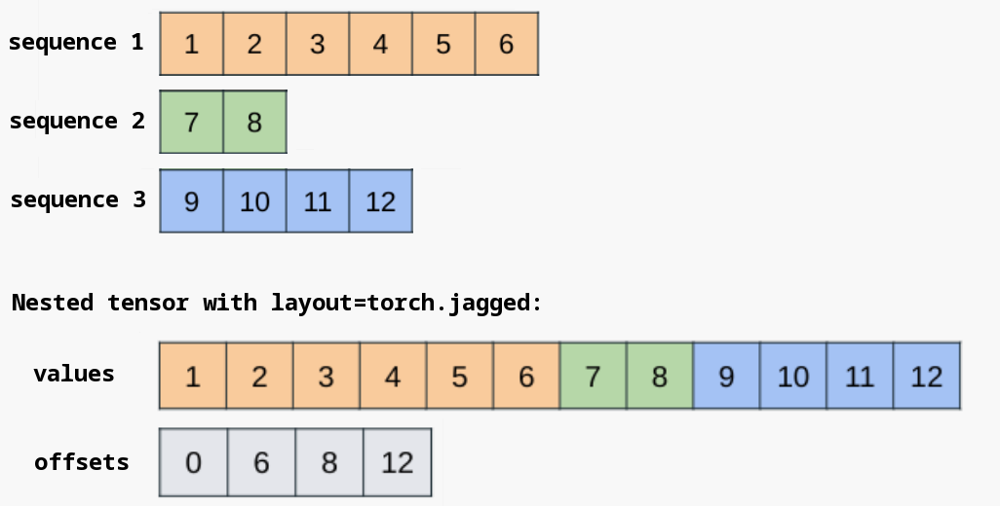

##  PyTorch

-   *PyTorch*：基于 *GPU*、*CPU* 用于深度学习的计算框架
    -   深度学习框架训练基本流程
        -   根据模型搭建计算图
        -   根据输入计算损失
        -   计算损失对模型中参数梯度：计算框架的核心，自动微分计算、更新梯度
        -   根据提梯度优化、更新模型参数
    -   *PyTorch* 核心功能（模块）
        -   `torch.Tensor` 张量
        -   `torch.autograd` 自动微分
        -   `torch.nn` 网络模块
        -   `torch.nn.functional` 函数
        -   `torch.optim` 优化器
    -   *PyTorch* 特点
        -   动态图计算
        -   支持在不同设备之间移动张量
        -   `torchvision`、`torchaudio`、`torchtext` 等包生态

###    *Computational Graphs*

-   计算图：张量、`Function` 代表节点，张量和 `Function` 之间（输入、输出）关系代表边
    -   *PyTorch* 为动态图机制，训练中 **每次迭代** 均会构建新计算图
        -   张量、函数计算即建立 *DAG*
        -   语句动态在计算图中动态添加节点、边，**并立即执行（前向传播）**
            -   *PyTorch* 通计算图捕获尝试从全局视角优化计算，在迭代的靠前（首个）轮次需要即时编译，可能较慢
        -   计算图默认在反向传播后立即被销毁
            -   即，无法二次调用 `Tensor.backward()`
    -   叶子节点 `is_leaf`：直接创建（非 `Function` 运算结果）、`require_grad` 置位的张量
        -   反向传播过程中，仅叶子节点梯度 `.grad` 被保留（用户一般只关心直接创建的张量的梯度）
        -   而，非叶子节点梯度 `.grad` 将默认被清空（仅在计算过程中被用到）
            -   置位 `retain_grad` 将保留非叶子节点梯度
            -   可利用 `Tensor.register_hook()` 注册钩子查看反向传播过程中梯度
    -   图中张量更应视为 **对应子图代表的（复合）函数**（及函数在具体输入下的取值）
        -   张量反向传播即 **复合函数链式求导**
            -   事实上，图根节点绝对值无意义，仅因其作为极小化目标（损失）而在正向传播中计算
            -   即，为极小化目标函数（根节点值）将参数沿负梯度方向优化
        -   对反向传播中某个（中间）函数（运算），**其中参数梯度仅依赖输入，即数学上的梯度的数值化带入计算**
            -   即，需要上下文暂存输入、中间结果（用于简化计算）
            -   而，函数输出对当前函数中参数梯度计算往往无意义，而作为下层函数输入
        -   反向传播简化 **参数梯度数值解** 计算
            -   仅需分别给出（简单）中间函数（内）参数偏导，应用链式法则、从根节点开始累积梯度即可
            -   否则，需得到根节点（复合函数）对各参数的偏导解析式、带入计算，即正向求解
    -   *Double Backward* 二次反向（传播）：在首次反向传播得到的计算图上再次反向传播，即二阶梯度
        -   要求计算图中 `Function` 均支持二次反向传播
        -   即，自定义函数 `Backward` 中运算均可被自动微分机制记录

> - 动态计算图：<https://jackiexiao.github.io/eat_pytorch_in_20_days/2.%E6%A0%B8%E5%BF%83%E6%A6%82%E5%BF%B5/2-3%2C%E5%8A%A8%E6%80%81%E8%AE%A1%E7%AE%97%E5%9B%BE/>
> - *How Computational Graphs are Constructed in PyTorch*：<https://pytorch.org/blog/computational-graphs-constructed-in-pytorch/>
> - *PyTorch* 中计算图是如何构建的：<https://pytorch.ac.cn/blog/computational-graphs-constructed-in-pytorch/>
> - 计算图捕获：<https://zhuanlan.zhihu.com/p/644590863>
> - *Double Backward with Custom Functions*：<https://pytorch.org/tutorials/intermediate/custom_function_double_backward_tutorial.html>


## `torch.Tensor` 张量

-   `torch.Tensor` 张量：类似 `np.ndarray` 记录模型输入、输出、参数的数据结构，支持包括 GPU 在内的硬件加速
    -   `Tensor` 支持类似于 `np.ndarray` 的各种 API
        -   `torch` 命名空间下类似 `np` 的各种初始化函数
        -   类似 `np.ndarray` 的索引、切片、连接操作
        -   支持算术运算、矩阵运算、代数运算
        -   支持在位运算（在位运算方法名常为普通运算方法名后跟 `_` 后缀）
    -   `Tensor` 运算支持 `CUDA`、`MPS`、`MTIA`、`XPU` 等加速器
        -   `Tensor` 默认创建在 *CPU* 上
        -   （需）可通过 `.to` 方法显式移至加速器
    -   *CPU* `Tensor` 可与 `np.ndarray` 共享底层存储（同步修改）
        -   通过 `Tensor.numpy`、`torch.from_numpy` 在 `Tensor`、`np.ndarray` 间切换

> - *Tensors*：<https://pytorch.org/tutorials/beginner/basics/tensorqs_tutorial.html>
> - 理解 *elementwise_kernel* 和 *TensorIterator* 的调用流程：<https://zhuanlan.zhihu.com/p/690858698>
> - *PyTorch* 常用函数常用调用方式及内部原理：<https://zhuanlan.zhihu.com/p/692723895>

### `torch.Tensor` 自动微分

| 微分属性、方法                                    | 描述                                            |
|---------------------------------------------------|-------------------------------------------------|
| `Tensor.grad`                                     | 梯度                                            |
| `Tensor.grad_fn`                                  | 反向传播函数                                    |
| `Tensor.requires_grad`                            | 梯度跟踪（计算）标志                            |
| `Tensor.is_leaf`                                  | 叶子节点标志，直接创建、`requires_grad` 置位    |
| `Tensor.requires_grad_()`                         | 切换梯度跟踪标志                                |
| `Tensor.detach()`                                 | 创建张量副本（脱离原图）                        |
| `Tensor.detach_()`                                | 从图中分离张量（即置为叶子节点，不再跟踪梯度）  |
| `Tensor.register_hook(hook)`                      | 注册反向传播钩子（钩子函数入参为 `.grad` 梯度） |
| `Tensor.register_post_accumulate_grad_hook(hook)` | 注册（反向传播中）梯度累加完后后钩子            |
| `Tensor.retain_grad()`                            | 保留（非叶子）节点梯度                          |
| `Tensor.backward([gradient,...])`                 | 反向传播                                        |

-   `torch.Tensor` 自动微分方法说明
    -   `Tensor.backward()` 方法即以张量自身为参数调用 `autograd.backward()` 函数

> - *Tensor autograd functions*：<https://docs.pytorch.org/docs/stable/autograd.html#tensor-autograd-functions>

###    张量布局

-   张量：张量在物理存储器中的布局总是线性的
    -   `device` 存储位置：内存、显存
    -   行、列优先存储
        -   张量形状 $(d_1, d_2, \cdots, d_D)$ 在二维时表示为 $(d_{col}, d_{row})$，则
            -   *Row-major Order*、*C-style Order* 行优先存储：维度级别从右往左增加
            -   *Column-major Order* 行优先存储：维度级别从左往右增加
        -   张量中元素延物理存储顺序遍历时，低级别维度 **优先变化**
    -   *Stride* 步长：某个维度上相邻的元素的物理存储上的间隔
        -   步长用于确定访问某维度上下个元素应跳过的元素数量
        -   规则张量的各维度步长可直接通过低级别维度长累乘得到
            -   连续张量即从右向左累乘维度长
    -   *Contiguous* 连续性：张量中元素逻辑存储顺序是否与物理存储顺序（行优先）一致
        -   连续张量可能带来高效的内存访问
            -   很多低级别优化都假设数据连续
        -   部分张量操作可能导致张量不再连续：`.transpose()`
        -   部分张量操作可能要求张量连续：`.view()`
            -   `Tensor.is_contiguous()`：判断张量是否连续
            -   `Tensor.contiguous()`：转换为连续张量

> - 张量在内存中的布局：<https://zhuanlan.zhihu.com/p/721855580>

###	`torch.nested`

| `torch.nested`                       | 说明                                         |
|--------------------------------------|----------------------------------------------|
| `nested.nested_tensor()`             | 从张量列表创建嵌套张量                       |
| `nested.as_nested_tensor()`          | 允许保留、反向传播张量梯度（依然有数据复制） |
| `nested.nested_tensor_from_jagged()` | 根据数据张量组件、偏移量创建 *NJT*           |
| `nested.narrow()`                    | 从张量创建 **非连续** 的 *NJT* 视图          |
| `NestedTensor.to_padded_tensor()`    | 填充 *NJT* 不规则维度转换为密集张量          |
| `NestedTensor.values()`              | *NJT* 数据张量组件                           |
| `NestedTensor.offsets()`             | *NTJ* 偏移量组件                             |
| `NestedTensor.unbind()`              | *NJT* 沿不规则维度拆分的视图                 |

-   `NestedTensor` 嵌套张量：允许不规则维度（维度大小不同）上的张量
    -   嵌套张量可简化对不规则数据的操作
        -   减少填充、掩码工作：嵌套张量适合用于表示序列数据，序列元素本身不规则
            -   *NLP* 中，句子长度可能不同
            -   *CV* 中，图像形状可能不同
        -   嵌套张量 *API* 与普通张量类似，但是需要额外实现，目前支持操作有限
            -   索引、查看：`.unbind`
            -   形状变换：`.transpose`、`.reshape`、`.unsqueeze`、`.unflatten`、`torch.cat`、`torch.stack`
            -   运算：`linear`、`bmm`、`matmul`
            -   `nn.functional`：`F.dropout`、`F.softmax`、`F.scaled_dot_product_attention`
        -   目前支持两种布局张量
            -   `torch.strided` 默认布局：支持多个不规则维度，`type` 类型为普通 `torch.Tensor`
            -   `torch.jagged` 锯齿布局 *NJT*：目前仅支持一个不规则维度，*API* 支持更好



-   *Nested Jagged Tensor* 锯齿布局嵌套张量
    -   `NestedTensor.values()`：数据张量组件，打包存储在 **连续** 的内存块中
        -   数据张量组件中元素可比 *NJT* 中元素多，即 *NJT* 可只是数据组件的部分视图（`nested.narrow`）
        -   `NestedTensor.is_contiguous()` 连续性仅指物理存储是否连续，与是否与逻辑存储顺序一致无关
    -   `NestedTensor.offsets()`：偏移量组件，指定不规则维度的边界划分
    -   *NJT* 有确定的形状 `..., j<N>, ...`，其中 `j<N>` 为不规则维度
        -   目前，仅支持 `offsets` 组件相同 *NJT* 共同运算，即使不规则维度构造相同也不支持
            -   即，`j<N>` 中编号 `N` 需相同
            -   可通过 `nested.nested_tesnor_from_jagged` 指定 `offsets` 参数共享 `offsets` 组件
        -   *NJT* 维度总是较其 `values` 组件维数多 1
            -   `values` 组件中不规则维度被 **融合进前 1 个维度**

> -	`torch.nested`：<https://docs.pytorch.org/docs/stable/nested.html>
> - `torch.nested`：<https://pytorch.ac.cn/docs/stable/nested.html>
> - *Getting Started with Nested Tensors*：<https://docs.pytorch.org/tutorials/prototype/nestedtensor.html>
> - 嵌套张量入门：<https://pytorch.ac.cn/tutorials/prototype/nestedtensor.html>
> - *Accelerating Transformers wiht Nested Tensors*：<https://pytorch.ac.cn/tutorials/intermediate/transformer_building_blocks.html>
> - 使用 *Nested Tensors* 加速 *Transformer*：<https://pytorch.ac.cn/tutorials/intermediate/transformer_building_blocks.html>

##  `torch.autograd` 自动微分

| `torch.autograd` 模块、包 | 描述                       |
|---------------------------|----------------------------|
| `autograd.function`       | 计算图函数                 |
| `autograd.functional`     | 计算图反向传播             |
| `autograd.gradcheck`      | 数值方法梯度检查           |
| `autograd.anomaly_mode`   | 自动求导时检测错误产生路径 |
| `autograd.grad_mode`      | 梯度模式控制               |
| `autograd.profiler`       | 函数统计信息               |

-   `torch.autograd` 自动微分模块：*PyTorch* 内建的微分引擎，支持任意（计算） *DAG* 的自动微分
    -   从根节点回溯（反向传播）至叶子节点，即可通过链式法则自动计算梯度
        -   图中叶子节点即输入张量，根节点即输出张量
        -   自动微分机制在前向传播中（向模型输入数据、张量运算）
            -   执行张量计算
            -   维护梯度函数
        -   自动微分机制在反向传播中（调用根节点张量 `.backward()` 方法）
            -   调用张量 `.grad_fn` 反向传播函数计算梯度
            -   维护（累加）张量 `.grad` 梯度属性
            -   依据链式法则反向传播至叶子节点
    -   *DAG* 中非叶子节点（边）即张量运算（函数），负责在前向传播中执行张量运算、在反向传播中计算梯度
        -   `autograd.Function` （计算图）函数类：自定义张量运算函数基类
            -   子类需实现 `forward(ctx, i)`、`backward(ctx, grad_output)` 两个静态方法
            -   执行运算时应调用 `apply` 静态方法（而不是直接调用 `forward`）
        -   `builtin_function_method` *Torch C* 扩展函数：`torch.add`、`torch.matmul`
        -   `function` *Python* `def` 定义函数：（基于上述 *C* 扩展函数定义）`nn.relu`、`nn.functional.binary_cross_entropy_with_logits`
    -   对不可微函数，按如下顺序取梯度
        -   可微，直接取梯度
        -   凸函数（局部），取最小范数次梯度，即最速下降方向
        -   凹函数（局部），取最大范数次梯度
        -   若函数有定义，按连续性取值，存在多值则任取其一
        -   若函数未定义，取任意值，通常为 `NaN`
        -   非函数映射在反向传播时将报错

> - *Automatic Differentiation with `torch.autograd`*：<https://pytorch.org/tutorials/beginner/basics/autogradqs_tutorial.html>
> - *Autograd Mechanics*：<https://pytorch.org/docs/stable/notes/autograd.html>
> - *Automatic Differentiation Packaged - `torch.autograd`*：<https://pytorch.org/docs/stable/autograd.html>
> - *Extending torch.autograd*：<https://pytorch.org/docs/stable/notes/extending.html#extending-torch-autograd>
> - *PyTorch* 源码解读之 `torch.autograd`：<https://zhuanlan.zhihu.com/p/321449610>

### 自动微分

| `torch.autograd` 函数                                           | 描述                             |
|-----------------------------------------------------------------|----------------------------------|
| `autograd.backward(tensor[,grad_tensors,retain_graph,...])`     | 反向传播计算、累积叶子节点的梯度 |
| `autograd.grad(outputs,inputs[,grad_outputs,retain_graph,...])` | 反向传播计算 `inputs` 节点梯度   |

-   说明
    -   `autograd.backward()`、`.grad()` 函数均是触发反向传播过程计算、累计梯度
        -   二者首个参数张量（计算流程）即计算图根节点，也即代表计算图整体
        -   `.backward()` 方法从根节点出发反向传播，但最终仅保留叶子节点梯度
        -   `.grad()` 方法可用户获取 `inputs` 参数指定的中间节点梯度

> - 自动微分机制：<https://jackiexiao.github.io/eat_pytorch_in_20_days/2.%E6%A0%B8%E5%BF%83%E6%A6%82%E5%BF%B5/2-2%2C%E8%87%AA%E5%8A%A8%E5%BE%AE%E5%88%86%E6%9C%BA%E5%88%B6/>
> - 深度学习利器之自动微分1：<https://www.cnblogs.com/rossiXYZ/p/15395775.html>
> - 深度学习利器之自动微分2：<https://www.cnblogs.com/rossiXYZ/p/15395775.html>

### `autograd.function`

| 类、函数                         | 描述                                                            |
|----------------------------------|-----------------------------------------------------------------|
| `function.Function`              | 自定义可前向、反向传播函数基类                                  |
| `function.FunctionCtx`           | 函数上下文暂存类                                                |
| `function.once_differentiable()` | 装饰 `Function.backward` 方法，声明计算图函数仅支持一次反向传播 |

-   `autograd.function` （计算图）反向传播函数类模块：定义计算图中支持正向、反向传播函数基类，及相关功能类
    -   `autograd.function.Function` （计算图）函数基类：用于自定义张量运算函数
        -   *PyTorch* 预定义张量运算函数有多种类型（并非 `autograd.Function` 子类），基本满足使用所需
            -   `builtin_function_method` *Torch C* 扩展函数：`torch.add`、`torch.matmul`
            -   `function` *Python* `def` 定义函数：（基于上述 *C* 扩展函数定义）`nn.relu`、`nn.functional.binary_cross_entropy_with_logits`
            -   预定定义运算会自动存储所需张量用于反向传播中计算梯度，可通过相应张量 `Tensor.grad_fn._saved_<XXX>` 访问
        -   故一般，`function.Function` 类（继承）常用于实现不可微张量运算、或运算依赖非 *PyTorch* 库（提升效率、减少开销）
            -   仅需继承 `function.Function`，实现 `.forward()`、`.backward()`、`.setup_context()`（可选） 三个 **类方法** 即可
            -   可视为，`function.Function` 仅简单提供命名空间组合前向、反向传播
                -   避免实例化开销
                -   需要额外上下文对象 `function.FunctionCtx` 维护函数的多次调用状态，供前向、反向传播共享信息

> - *Autograd Function*：<https://pytorch.org/docs/stable/autograd.html#function>
> - *Extending torch.autograd*：<https://pytorch.org/docs/stable/notes/extending.html#extending-torch-autograd>
> - 自定义操作 `torch.autograd.Function`：<https://zhuanlan.zhihu.com/p/344802526>
> - *Double Backward with Custom Functions*：<https://pytorch.org/tutorials/intermediate/custom_function_double_backward_tutorial.html>

####    `function.Function` （计算图）函数类

| `function.Function` 类方法           | 描述                        |
|--------------------------------------|-----------------------------|
| `Function.forward([ctx,]...])`       | 函数前向传播计算执行        |
| `Function.backward(ctx,...])`        | 函数反向传播计算执行        |
| `Function.setup_context([ctx,]...])` | 上下文设置                  |
| `Function.apply(...)`                | 调用 `forward` 在输入上应用 |

> - `ctx` 为 `autograd.function.FunctionCtx` 实例，暂存信息用于反向传播的上下文对象

-   `autograd.function.Function` 类方法说明
    -   `forward([ctx,]...)` 前向传播：执行运算，**原函数**
        -   `forward` 支持任意数量、类型参数，未实现 `setup_context` 方法时，首个参数须为 `ctx`
        -   `forward` 可返回任意值，无需仅为运算结果
        -   `forward` 中运算不会被记录至图中
            -   也即，其中运算不会被自动微分机制记录，不会在反向传播时被触发对应梯度计算
            -   仅输入张量参数（不包含列表、字典等容器中张量元素）、函数类整体将被注册至计算图中
        -   `forward` 方法不应被直接调用，应使用 `apply` （静态）方法触发
    -   `setup_context(ctx, input, output)` 设置上下文：仅负责维护 `ctx` 上下文变动，不执行计算
        -   `setup_context` 可省略，并整合至 `forward`，此时 `forward` 首个参数应为 `ctx` 上下文对象，并且负责上下文
        -   （*PyTorch 2.0* 后）`setup_context` 与 `forward` 拆分更接近 *PyTorch* 原生运算工作方式，子系统兼容性更好
    -   `backward(ctx, ...)` 反向传播：计算梯度，**导数函数**
        -   `backward` 首个参数须为 `ctx`，后续参数为 `forward` 输出张量的梯度（即反向传播中按链式规则计算的外层梯度）
            -   `backward` 不应在位修改入参
        -   `backward` 应计算、并返回 `forward` 输入对应梯度
            -   即，返回值数量应同 `forward` 入参
            -   即，`backward` 实现函数自身梯度逻辑，并（应）结合链式法则计算 `forward` 输入对应梯度
            -   无需计算梯度入参、非张量入参、不可微类型（整形）张量可（须）对应输出 `None`
        -   `backward` 方法也不应被直接调用，常在张量（损失） `Tensor.backward()` 引起的反向传播中被链式触发
            -   注意，`Function.backward` 不是 `Tensor.backward`
            -   事实上，`Function.backward` 方法将被包装为 `forward` 方法输出的张量的 `grad_fn` 属性
        -   张量 `Tensor.backward()` 反向传播参数 `create_graph` 置位时，`Function.backward()` 中运算会被记录
            -   若 `backward` 方法中运算可被自动微分机制记录，则 `Function` 支持二次反向传播
            -   即，`Function` 导函数支持求导，即支持二阶梯度
            -   可使用 `autograd.function.once_differentiable()` 装饰 `.backward` 方法，申明反向传播仅允许一次（不支持二阶梯度）

```python
class MyCube(torch.autograd.Function):
    @staticmethod
    def forward(x):
        # We wish to save dx for backward. In order to do so, it must
        # be returned as an output.
        dx = 3 * x ** 2
        result = x ** 3
        return result, dx

    @staticmethod
    def setup_context(ctx, inputs, output):
        x, = inputs
        result, dx = output
        ctx.save_for_backward(x, dx)

    @staticmethod
    def backward(ctx, grad_output, grad_dx):
        x, dx = ctx.saved_tensors
        # In order for the autograd.Function to work with higher-order
        # gradients, we must add the gradient contribution of `dx`,
        # which is grad_dx * 6 * x.
        result = grad_output * dx + grad_dx * 6 * x
        return result

# Wrap MyCube in a function so that it is clearer what the output is
def my_cube(x):
    result, dx = MyCube.apply(x)
    return result
```

####    `function.FunctionCtx`

| `FunctionCtx` 方法、属性             | 描述                                                             |
|--------------------------------------|------------------------------------------------------------------|
| `ctx.save_for_backward(*tesnor)`     | 暂存张量，仅应在 `forward` 内调用 1 次                           |
| `ctx.mark_dirty(*args)`              | 标记张量已经被修改（执行在位运算），仅应在 `forward` 内调用 1 次 |
| `ctx.mark_non_differentiable(*args)` | 标记 **输出** 为不可微，仅应在 `forward` 内调用 1 次             |
| `ctx.needs_input_grad`               | 元组，指示 `forward` 各入参是否需计算梯度                        |
| `ctx.saved_tensors`                  | 元组，`save_for_backward` 方法暂存的张量                         |

### `autograd.functional`

| `functional` 中函数                                   | 描述                           |
|-------------------------------------------------------|--------------------------------|
| `functional.jacobian(func,inputs[,create_graph,...])` | 计算雅可比矩阵                 |
| `functional.hessian(func,inputs[,create_graph,...])`  | 计算海瑟矩阵                   |
| `functional.vjp(func,inputs[,v,create_graph,strict])` | 计算 *Vector-Jacobian Product* |
| `functional.jvp(func,inputs[,v,create_graph,strict])` | 计算 *Jacobian-Vector Product* |
| `functional.vhp(func,inputs[,v,create_graph,strict)`  | 计算 *Vector-Hessian Product*  |
| `functional.hvp(func,inputs[,v,create_graph,strict])` | 计算 *Hessian-Vector Product*  |

-   `autograd.functional` （计算图）反向传播相关、梯度计算函数：定义计算图反向传播相关函数
    -   `inputs` 参数应只包含 **需计算梯度的张量** `Tensor.requires_grad`
        -   其他参数可考虑通过 `lambda` 封装、置为默认参数

> - *Autograd functional higher level API*：<https://docs.pytorch.org/docs/stable/autograd.html#functional-higher-level-api>
> - 反向传播算法实现：<https://zhuanlan.zhihu.com/p/673963942>
> - 机器学习工具自动微分之：VJP、JVP和JAX：<https://zhuanlan.zhihu.com/p/570554452>

### `autograd.gradcheck`

| `gradcheck` 中函数                                              | 描述                 |
|-----------------------------------------------------------------|----------------------|
| `gradcheck.gradcheck(func,inputs[,*,eps,...])`                  | 数值计算检查一阶梯度 |
| `gradcheck.gradgradcheck(func,inputs[,grad_outputs,*,eps,...])` | 数值计算检查二阶梯度 |

-   `autograd.gradcheck`（数值计算法）梯度检查：数值计算检查 `Function.backward()` 方法中梯度（二阶梯度）计算

> - `torch.autograd.gradcheck.gradcheck`：<https://docs.pytorch.org/docs/stable/generated/torch.autograd.gradcheck.gradcheck.html>
> - `torch.autograd.gradcheck.gradgradcheck`：<https://docs.pytorch.org/docs/stable/generated/torch.autograd.gradcheck.gradgradcheck.html>

### `autograd.anomaly_mode`

| `anomaly_mode` 中函数               | 描述                       |
|-------------------------------------|----------------------------|
| `anomaly_mode.detect_anomaly()`     | 自动微分时检测错误产生路径 |
| `anomaly_mode.set_detect_anomaly()` | 启停错误产生路径检测       |

### `autograd.grad_mode`

| `grad_mode` 中函数             | 描述                           |
|--------------------------------|--------------------------------|
| `grad_mode.set_grad_enabled()` | 切换梯度模式上下文管理         |
| `grad_mode.enable_grad()`      | 梯度模式上下文管理             |
| `grad_mode.no_grad()`          | 无梯度模式上下文管理           |
| `grad_mode.inference_mode()`   | 无梯度、清理张量模式上下文管理 |

-   `autograd.grad_mode` 梯度模式上下文管理器：管理模块运行梯度模式

####    *Grad Modes* 梯度模式

-   *Grad Modes* 梯度模式：*PyTorch* 包含可通过上下文管理器切换、影响自动梯度计算逻辑的梯度模式
    -   `grad` 梯度（默认）模式
        -   `requires_grad` 设置仅在此模式下生效，在其他模式下均被覆盖为 `False`
    -   `with torch.no_grad()` 无梯度模式：不记录运算
        -   适合不应记录运算本身，但需要运算结果场合
            -   如在优化器中更新参数时，不应记录更新操作，但需更新参数用于后续轮次前向
    -   `with torch.inference_mode()` 推断模式：不记录运算，且推断模式中创建的张量不能无法在退出后被使用
        -   极端无梯度模式，开销较无梯度模式更小
    -   注意，`nn.Module.eval()`（`nn.Module.train(False)`）为将模型切换至 **评估模式**，与梯度模式无关
        -   评估模式：决定特定层（模型）在 **前向传播过程中是否更新参数**
            -   适用于模式依赖 `nn.Dropout`、`nn.BatchNorm2d` 场合，避免模型更新数据统计值
        -   梯度模式：决定是否在前向传播中记录运算，供反向传播时更新梯度

> - *Autograd Grad Modes*：<https://pytorch.org/docs/stable/notes/autograd.html#grad-modes>

### `autograd.profiler`

| `profiler` 中函数    | 描述                       |
|----------------------|----------------------------|
| `profiler.profile()` | 函数执行统计信息上下文管理 |

-   `autograd.profiler` 函数统计信息模块：提供函数级别统计信息

## `torch.nn` 神经网络

| 模块            | 说明                 |
|-----------------|----------------------|
| `nn.modules`    | 神经网络模块包       |
| `nn.paremeter`  | 参数、缓冲区模块     |
| `nn.functional` | 神经网络模块函数模块 |

-   `torch.nn` 中包含构建神经网络所需的基本模块
    -   `nn` 命名空间已引入
        -   `nn.modules` 包、子包中定义的常用模块类
        -   `nn.parameter` 中参数类
    -   `nn.functioncal` 中函数未被引入 `nn` 命名空间


> - *What is `torch.nn` really*：<https://pytorch.org/tutorials/beginner/nn_tutorial.html>
> - `torch.nn` *API*：<https://pytorch.org/docs/stable/nn.html>
> - `torch.nn.functional` *API*：<https://pytorch.org/docs/stable/nn.functional.html>
> - *Pytorch Source Code*：<https://github.com/pytorch/pytorch/tree/main/torch/nn>

###    `nn.modules.module.Module`

```python
def DigitsRecogNeuralNetwork(nn.Module):
    def __init__(self):
        super().__init__()
        self.flatten = nn.Flatten()
        self.linear_relu_stack = nn.Sequential(
            nn.Linear(28 * 28, 512),
            nn.ReLU(),
            nn.Linear(512, 512),
            nn.ReLU(),
            nn.Linear(512, 10)
        )

    def forward(self, x):
        x = self.flatten(x)
        logits = self.linear_relu_stack(x)
        return logits
```

-   `nn.Module` 模块基类：*PyTorch* 中所有神经网络模块（层）类基类
    -   `nn.Module` 支持嵌套，即将其他模块实例作为自身属性
        -   通过重载 `__setattr__`、`__getattr__` 等方法对模块、参数、缓冲类型的特殊属性增筛查改特殊处理
        -   使用 `OrderedDict` 维护特殊属性
    -   `nn.Module` 实现有 `.__call__()` 方法，类似 `autograd.Function` 可（用于）自定义数据运算
        -   但，**拥有并维护状态**，即更新、维护内部参数
        -   事实上，`nn.modules` 包、子包中预定义模块类实现即调用对应 `F.<Function>`
            -   模块类包含、维护函数所需参数，可与容器模块嵌套使用、注册钩子函数监控前后向传播
            -   函数自由度更高，可实现（数据）参数共享等功能
        -   一般的，任选模块、函数均可
            -   需维护参数（模型）、超参（函数配置参数）、与容器模块嵌套时，**模块实例化** 可能更方便
            -   但，注意 `nn.Dropout`、`nn.BatchNorm2D` 受 `Module.eval()` 切换评估模式影响，而 `F.dropout`、`F.BatchNorm2D` 不会
    -   除预定义模块外，可继承实现自定义模块，最简单仅需重载 `.__init__()`、`.forward()` 方法
        -   `.__init__()` 方法负责初始化模块
            -   `.__init__()` 最初必须调用 `super().__init__()` 调用基类 `Module.__init__()` 初始化
            -   注册子模块、参数、缓冲、钩子等
        -   `.forward()` 即前向传播，定义模块前向传播的计算执行
            -   模块实例的 `.forward()` 不应被直接调用，应向模型实例传入数据由 `.__call__()` 负责调用
    -   `nn.Module` 支持多个环节设置钩子干预模块执行流程
        -   前向、反向传播
        -   模块状态存取

> - *Build the Neural Network*：<https://pytorch.org/tutorials/beginner/basics/buildmodel_tutorial.html>
> - `torch.nn` *API*：<https://pytorch.org/docs/stable/nn.html>
> - `nn` 与 `nn.functional` 区别：<https://www.zhihu.com/question/66782101>
> - `nn.Parameter`：<https://pytorch.org/docs/stable/generated/torch.nn.parameter.Parameter.html>
> - `torch.nn.functional` *API*：<https://pytorch.org/docs/stable/nn.functional.html>
> - *PyTorch* 源码解读之 `nn.Module`：核心网络模块接口详解：<https://zhuanlan.zhihu.com/p/340453841>

####    `nn.Module` 属性

| `Module` 实例属性、方法                | 描述                                                                      |
|----------------------------------------|---------------------------------------------------------------------------|
| `Module.training`                      | 模型训练、推理状态标志                                                    |
| `Module._parameters`                   | 训练时在反向传播过程中更新的参数                                          |
| `Module._buffers`                      | 训练时不在反向传播过程中更新的参数                                        |
| `Module._non_persistent_buffers_set`   | 无需持久化缓冲                                                            |
| `Module._backward_hooks`               | 反向传播后调用的钩子                                                      |
| `Module._forward_hooks`                | 正向传播后调用的钩子                                                      |
| `Module._forward_pre_hooks`            | 正向传播前调用的钩子                                                      |
| `Module._state_dict_hooks`             | 载入 `state_dict` 后调用的钩子                                            |
| `Module._load_state_dict_pre_hooks`    | 载入 `state_dict` 前调用的钩子                                            |
| `Module._modules`                      | 神经网络子模块                                                            |

```python
class Module:
    def __init__(self):
        self.training = True
        self._parameters = OrderedDict()
        self._buffers = OrderedDict()
        self._non_persistent_buffer_set = set()
        self._modules = OrderedDict()
        self._backward_hooks = OrderedDict()
        self._forward_hooks = OrderedDict()
        self._forward_pre_hooks = OrderedDict()
        self._state_dict_hooks = OrderedDict()
        self._load_state_dict_pre_hooks = OrderedDict()
```

####    `nn.Module` 训练、推理状态

| `Module` 实例属性、方法 | 描述                                               |
|-------------------------|----------------------------------------------------|
| `Module.train(mode)`    | 切换模型训练、推理状态，可重载以分模块设置训练状态 |
| `Module.eval()`         | 切换模型至推理状态                                 |

-   `nn.Module` 通过 `self.training` 区分训练、推理状态
    -   `Module.forward` 可根据模块训练、推理状态有不同行为
    -   `Module.train()`、`module.eval()` 方法可用于切换模块训练、推理状态
        -   `.train()` 方法默认递归调用子模块 `.train()` 方法控制子模块训练状态
        -   可通过重载 `.train()` 方法分模块设置训练状态：冻结部分模块参数、微调参数

```python
class Module:
    def training(self: T, mode: bool=True) -> T:
        self.training = mode
        for module in self.children():
            module.train(mode)
        return self

    def eval(self: T) -> T:
        return self.training(False)
```

####    `nn.Module` 属性增删查改

```python
class Module:
    def __setattr__(self, name: str, value: Union[Tensor, 'Module']):
        def remove_from(*dicts_or_sets):
            for d in dicts_or_sets:
                if name in d:
                    if isinstance(d, dict):
                        del d[name]
                    else:
                        d.discard(name)

        params = self.__dict__.get('_parameters')
        if isinstance(value, Parameter):
            # 检查子模块是否有通过 `super().__init__()` 初始化
            if params is None:
                raise AttributeError(
                    "cannot assign parameters before Module.__init__() call")
            remove_from(self.__dict__, self._buffers, self._modules, self._non_persistent_buffers_set)
            self.register_parameter(name, value)
        elif params is not None and name in params:
            if value is not None:
                raise TypeError("cannot assign '{}' as parameter '{}' "
                                "(torch.nn.Parameter or None expected)"
                                .format(torch.typename(value), name))
            self.register_parameter(name, value)
        else:
            modules = self.__dict__.get('_modules')
            if isinstance(value, Module):
                # 检查子模块是否有通过 `super().__init__()` 初始化
                if modules is None:
                    raise AttributeError(
                        "cannot assign module before Module.__init__() call")
                remove_from(self.__dict__, self._parameters, self._buffers, self._non_persistent_buffers_set)
                modules[name] = value
            elif modules is not None and name in modules:
                if value is not None:
                    raise TypeError("cannot assign '{}' as child module '{}' "
                                    "(torch.nn.Module or None expected)"
                                    .format(torch.typename(value), name))
                modules[name] = value
            else:
                buffers = self.__dict__.get('_buffers')
                if buffers is not None and name in buffers:
                    if value is not None and not isinstance(value, torch.Tensor):
                        raise TypeError("cannot assign '{}' as buffer '{}' "
                                        "(torch.Tensor or None expected)"
                                        .format(torch.typename(value), name))
                    buffers[name] = value
                else:
                    # 缺省直接设置属性
                    object.__setattr__(self, name, value)

    # 按照 Python 属性 `.` 查找链，`__getattr__` 仅在默认属性访问（`__getattribute__`）失败时被触发
    # 即，其中无需处理默认属性访问（资料器属性、`__dict__` 查找等）
    def __getattr__(self, name: str) -> Union[Tensor, 'Module']:
        if '_parameters' in self.__dict__:
            _parameters = self.__dict__['_parameters']
            if name in _parameters:
                return _parameters[name]
        if '_buffers' in self.__dict__:
            _buffers = self.__dict__['_buffers']
            if name in _buffers:
                return _buffers[name]
        if '_modules' in self.__dict__:
            modules = self.__dict__['_modules']
            if name in modules:
                return modules[name]
        raise ModuleAttributeError("'{}' object has no attribute '{}'".format(
            type(self).__name__, name))

    def __delattr__(self, name):
        if name in self._parameters:
            del self._parameters[name]
        elif name in self._buffers:
            del self._buffers[name]
            self._non_persistent_buffers_set.discard(name)
        elif name in self._modules:
            del self._modules[name]
        else:
            object.__delattr__(self, name)

    def __dir__(self):
        module_attrs = dir(self.__class__)
        attrs = list(self.__dict__.keys())
        parameters = list(self._parameters.keys())
        modules = list(self._modules.keys())
        buffers = list(self._buffers.keys())
        keys = module_attrs + attrs + parameters + modules + buffers
        # Eliminate attrs that are not legal Python variable names
        keys = [key for key in keys if not key[0].isdigit()]
        return sorted(keys)
```

| 实例属性类型       | `nn.Parameter`              | `nn.Buffer`                                         | `nn.Module`                                     |
|--------------------|-----------------------------|-----------------------------------------------------|-------------------------------------------------|
| `OrderedDict` 存储 | `self._parameters`          | `self._buffers`、`self._non_persistent_buffers_set` | `self._modules`                                 |
| 注册方法           | `self.register_parameter()` | `self.register_buffer()`                            | `self.add_module()`                             |
| 遍历访问方法       | `self.parameters()`         | `self.buffers()`                                    | `self.children()`、`self.modules()`             |
| 具名遍历访问       | `self.named_parameters()`   | `self.named_buffers()`                              | `self.named_children()`、`self.named_modules()` |

-   `nn.Module` 针对 `nn.Parameter`、`nn.Buffer`、`nn.Module` 类型属性特殊处理
    -   `self._parameters`、`self._buffers`（`self._non_persistent_buffers_set`）、`self._modules` 等属性分别维护对应类型特殊属性
        -   `self._apply()` 等方法仅处理被特殊维护的模块实例属性
        -   并实现对应注册方法 `.register_<XXX>`、迭代访问方法 `.named_<XXX>`
    -   为此，`nn.Module` 重载 `__setattr__`、`__getattr__`、`__delattr__`、`__dir__` 等魔术方法，方便属性新增、修改、删除、暴露
        -   `__setattr__` 针对 `nn.Parameter`、`nn.Buffer`、`nn.Module` 类属性（复制）特殊处理
            -   检查 `nn.Module`（父类） 是否被正确初始化
            -   处理名称重复属性：属性被 `self._parameters`、`self.__dict__` 等分别维护
            -   赋 `nn.Parameter` 类型值时，`__setattr__` 总会调用 `self.register_parameter()` 方法，其他属性则直接更新对应 `OrderedDict`（或 `__dict__`）
            -   注意，`nn.Buffer` 属性只能通过显式调用 `self.register_buffer()` 新增
                -   `__setattr__` 只能将已有缓冲重赋值为 `None`、`torch.Tensor`
                -   因为，缓冲的初始化类型就是 `torch.Tensor`、`None`，无法区分
                -   故，`self.<ATTR> = torch.Tensor` 直接为模块增加的张量属性为普通属性，在 `self._apply()` 处理状态转换时将被遗漏
    -   `nn.Module` 属性遍历访问方法说明
        -   `.named_parameters()`、`.named_buffers()` 基于 `self._named_members()` 方法实现
        -   `.parameters()` 基于 `.named_parameters()` 实现（忽略名称），`.buffers()`、`.modules()`、`.children()`类似
        -   `.named_children()` 仅遍历直接子模块，`.named_modules()` 递归遍历所有子模块

```python
class Module:
    def _named_members(self, get_member_fn,  prefix="", recurse=True):
        memo = set()
        # 递归访问则调用 `named_modules` 递归获取所有子模块
        modules = self.named_modules(prefix=prefix) if recurse else [(prefix, self)]
        for module_prefix, module in modules:
            members = get_members_fn(module)
            for k, v in members:
                if v is None or v in memo:
                    continue
                memo.add(v)
                name = module_prefix + ("." if module_prefix else "") + k
                yield name, v

    def named_modules(self, memo: Optional[Set["Module"]] = None, prefix: str = ""):
        if memo is None:
            memo = set()
        # 递归遍历子模块（计算图），需要维护、判断当前模块遍历状态
        if self not in memo:
            memo.add(self)
            yield prefix, self
            for name, module in self._modules.items():
                if module is None:
                    contiue
                    submodule_prefix = prefix + ("." + if prefix else "") + name
                    for m in module.named_modules(memo, submodule_prefix):
                        yield m

    def modules(self):
        for name, module in self.named_modules():
            yield module

    def parameters(self, recurse: bool = True) -> Iterator[Parameter]:
        for name, param in self.named_parameters(recurse=recurse):
            yield param

    def named_parameters(self, prefix: str = '', recurse: bool = True) -> Iterator[Tuple[str, Tensor]]:
        # 基于 `self._named_members` 实现
        gen = self._named_members(
            lambda module: module._parameters.items(),
            prefix=prefix, recurse=recurse)
        for elem in gen:
            yield elem
```

####    `nn.Module` 参数、缓冲、模块控制

| `Module` 实例属性、方法   | 描述                                   |
|---------------------------|----------------------------------------|
| `Module.CPU()`            | 将参数、缓存转移至 *CPU*               |
| `Module.CUDA()`           | 将参数、缓存转移至 *GPU*               |
| `Module.type()`           | 将参数、缓存转换至其他类型             |
| `Module.float()`          | 将浮点参数、缓存转换至 `float32` 类型  |
| `Module.double()`         | 将浮点参数、缓存转换至 `double` 类型   |
| `Module.half()`           | 将浮点参数、缓存转换至 `float16` 类型  |
| `Module.bfloat16()`       | 将浮点参数、缓存转换至 `bfloat16` 类型 |
| `Module.to()`             | 模块移动、类型转换                     |
| `Module._apply(function)` | 对模块、子模块中参数、缓存递归遍历应用 |
| `Module.apply(function)`  | 对模块、子模块递归应用                 |

-   `nn.Module` 通过 `Module._apply()` 方法控制参数转移、转移
    -   `.CPU()`、`.type()` 等常用方法均通过 `._apply()` 实现
    -   `._apply(function)` 为 `nn.Module` 专门为模块内 `Parameter`、`Buffer` 实现的私有方法
        -   通过 `self.children()` 递归处理子模块
        -   应用 `function` 处理 `self._parameters` 中参数及其梯度、`self._buffers` 中缓冲
    -   `.apply(function)` 以处理模块函数作为参数，递归处理全部子模块

```python
class Module:
    def _apply(self: T, fn) -> T:
        # 递归处理子模块
        for module in self.children():
            module._apply(fn)
        # 处理 `self._parameters` 中参数
        for key, param in self._parameters.items():
            if param is not None:
                with torch.no_grad():
                    param_applied = fn(param)
                should_use_set_data = compute_should_use_set_data(param, param_applied)
                if should_use_set_data:
                    param.data = param_applied
                else:
                    assert isinstance(param, Parameter)
                    assert param.is_leaf
                    self._parameter[key] = Parameter(param_applied, param.requires_grad)
                if param.grad is not None:
                    with torch.no_grad():
                        grad_applied = fn(param.grad)
                    should_use_set_data = compute_should_use_set_data(param.grad, grad_applied)
                    if should_use_set_data:
                        param.grad.data = grad_applied
                    else:
                        assert param.grad.is_leaf
                        self._parameter[key].grad = grad_applied.requires_grad_(param.grad.requires_grad)
        # 处理 `self._buffers` 中缓冲
        for key, buf in self._buffers.items():
            if buf is not None:
                self._buffers[key] = fn(buf)
        return self

    def apply(self: T, fn: Callable[["Module"], None]) -> T:
        for module in self.children():
            module.apply(fn)
        fn(self)
        return self
```

####    `nn.Module` 前向、反向传播

-   模块前向传播仅需实现模块 `.forward()` 方法，反向传播由 *PyTorch* 负责
    -   `Module.forward()` 方法不应被直接调用，向模型实例传入数据将自动调用此方法
        -   不应直接`Module.__call__()` 中会调用 `.forward()` 方法，同时负责触发相应钩子
    -   `nn.Module` 为前向、反向传播设置了 6 组钩子

| `nn.Module` 钩子注册方法                    | 钩子维护 `OrderedDict`             | 描述                   |
|---------------------------------------------|------------------------------------|------------------------|
| `Module.register_backward_hook()`           | `Module._backward_hooks`           | 当前模块反向传播钩子   |
| `Module.register_forward_pre_hook()`        | `Module._forward_pre_hooks`        | 当前模块前向传播前钩子 |
| `Module.register_forward_hook()`            | `Module._forward_hooks`            | 当前模块前向传播钩子   |
| `module.register_module_backward_hook()`    | `module._global_backward_hooks`    | 全局模块反向传播钩子   |
| `module.register_module_forward_pre_hook()` | `module._global_forward_pre_hooks` | 全局模块前向传播前钩子 |
| `module.register_module_forward_hook()`     | `module._global_forward_hooks`     | 全局模块前向传播钩子   |

```python
def _call_impl(self, *input, **kwargs):
    # Pre forward hooks.
    for hook in itertools.chain(
            _global_forward_pre_hooks.values(),
            self._forward_pre_hooks.values()):
        result = hook(self, input)
        if result is not None:
            if not isinstance(result, tuple):
                result = (result, )
            input = result

    # For JIT.
    if torch._C._get_tracing_state():
        result = self._slow_forward(*input, **kwargs)
    else:
        result = self.forward(*input, **kwargs)

    # Forward hooks.
    for hook in itertools.chain(
            _global_forward_hooks.values(),
            self._forward_hook.values()):
        hook_result = hook(self, input, result)
        if hook_result is not None:
            if not isinstance(result, tuple):
                result = hook_result

    # Backward hooks.
    if (len(self._backward_hooks) > 0) or (len(_global_backward_hooks) > 0):
        var = result
        # Get the "first" tensor.
        while not isinstance(var, torch.Tensor):
            if isinstance(var, dict):
                var = next((v for v in var.values() if isinstance(v, torch.Tensor)))
            else:
                var = var[0]
        grad_fn = var.grad_fn
        if grad_fn is not None:
            for hook in itertools.chain(
                    _global_backward_hooks.values(),
                    self._backward_hooks.values()):
                wrapper = functools.partial(hook, self)
                functools.update_wrapper(wrapper, hook)
                # Register hook to `<first_tensor>.grad_fn`
                grad_fn.register_hook(wrapper)
    return result
__call__: Callable[..., Any] = _call_impl
```

####    `nn.Module` 梯度处理

| `Module` 实例属性、方法                | 描述                 |
|----------------------------------------|----------------------|
| `Module.requires_grad_(requires_grad)` | 设置模块参数梯度需求 |
| `Module.zero_grad(set_to_none)`        | 模块参数清空         |

```python
    def requires_grad_(self: T, requires_grad: bool = True) -> T:
        for p in self.parameters():
            p.requires_grad_(requires_grad)
        return self

    def zero_grad(self: T, set_to_none: bool = False) -> None:
        for p in self.parameters():
            if p.grad is not None:
                if set_to_none:
                    p.grad = None
                else:
                    if p.grad.grad_fn is not None:
                        p.grad.detach_()
                    else:
                        p.grad.requires_grad_(False)
                    p.grad.zero_()

```

####    `nn.Module` 状态存取

| `Module` 实例属性、方法          | 描述                                                  |
|----------------------------------|-------------------------------------------------------|
| `Module.state_dict()`            | 获取模块完整状态                                      |
| `Module._save_to_state_dict()`   | 存储 `self._parameters`、`self._buffers` 中持久化缓冲 |
| `Module.load_state_dict()`       | 载入模块状态（存档点）                                |
| `Module._load_from_state_dict()` | 加载 `self._parameters`、`self._buffers`              |

-   模块存取说明
    -   可以通过重载 `._save_to_state_dict()`、`._load_from_state_dict()` 方法满足特定状态存取需求

| `nn.Module` 钩子注册方法                      | 钩子维护 `OrderedDict`              | 描述 |
|-----------------------------------------------|-------------------------------------|------|
| `Module._register_state_dict_hook()`          | `Module._load_state_dict_pre_hooks` |      | 
| `Module._regsiter_load_state_dict_pre_hook()` | `Module._load_state_dict_pre_hooks` |      |

```python
class Module:
    def _load_from_state_dict(self, state_dict, prefix, local_metadata, strict,
                              missing_keys, unexpected_keys, error_msgs):
        for hook in self._load_state_dict_pre_hooks.values():
            hook(state_dict, prefix, local_metadata, strict, missing_keys, unexpected_keys, errors_msg)
        persistent_buffers = {k: v for k, v in self._buffers.items() if k not in self._non_persistent_buffers_set}
        local_name_params = itertools.chain(self._parameters.items(), persistent_buffers.items())
        local_state = {k: v for k, v in local_name_params if v is not None}

        for name, param in local_state.items():
            key = prefix + name
            if key in state_dict:
                input_param = state_dict[key]
                if len(param.shape) == 0 and len(input_param.shape) == 1:
                    input_param = input_param[0]
                if input_param.shape != param.shape:
                    error_msgs.append('size mismatch for {}: copying a param with shape {} from checkpoint, '
                                  'the shape in current model is {}.'
                                  .format(key, input_param.shape, param.shape))
                    continue
                try:
                    with torch.no_grad():
                        param.copy_(input_param)
                except Except as ex:
                    error_msgs.append('While copying the parameter named "{}", '
                                  'whose dimensions in the model are {} and '
                                  'whose dimensions in the checkpoint are {}, '
                                  'an exception occurred : {}.'
                                  .format(key, param.size(), input_param.size(), ex.args))
            elif strict:
                missing_keys.append(key)
        if strict:
            for key in state_dict.keys():
                if key.startwith(prefix):
                    input_name = key[len(prefix):]
                    input_name = input_name.split(".", 1)[0]
                    if input_name not in self._modules and input_name not in local_state:
                        unexpected_keys.append(key)

    def load_state_dict(self, state_dict: Union[Dict[str, Tensor], Dict[str, Tensor]], strict: bool = True):
        missing_keys = []
        unexpected_keys = []
        error_msgs = []
        # copy state_dict so _load_from_state_dict can modify it
        metadata = getattr(state_dict, '_metadata', None)
        state_dict = state_dict.copy()
        if metadata is not None:
            state_dict._metadata = metadata

        def load(module, prefix=''):
            local_metadata = {} if metadata is None else metadata.get(prefix[:-1], {})
            module._load_from_state_dict(
                state_dict, prefix, local_metadata, True, missing_keys, unexpected_keys, error_msgs)
            for name, child in module._modules.items():
                if child is not None:
                    load(child, prefix + name + '.')

        load(self)
        load = None  # break load-&gt;load reference cycle
        if strict:
            if len(unexpected_keys) &gt; 0:
                error_msgs.insert(
                    0, 'Unexpected key(s) in state_dict: {}. '.format(
                        ', '.join('"{}"'.format(k) for k in unexpected_keys)))
            if len(missing_keys) &gt; 0:
                error_msgs.insert(
                    0, 'Missing key(s) in state_dict: {}. '.format(
                        ', '.join('"{}"'.format(k) for k in missing_keys)))
        if len(error_msgs) &gt; 0:
            raise RuntimeError('Error(s) in loading state_dict for {}:\n\t{}'.format(
                               self.__class__.__name__, "\n\t".join(error_msgs)))
        return _IncompatibleKeys(missing_keys, unexpected_keys)
```

### `nn.modules`


| 函数                             | 模块                     | 描述             |
|----------------------------------|--------------------------|------------------|
| `F.conv1d`                       | `nn.Conv1d`              | 卷积             |
| `F.conv_transpose1d`             | `nn.ConvTranspose1d`     | 转置卷积         |
|                                  | `nn.LazyConv1d`          | 懒卷积           |
| `F.unfold`                       | `nn.Unfold`              | 卷积拆分         |
|                                  | `nn.ReflectionPad1d`     | 填充             |
| `F.avg_pool1d`                   | `nn.AvgPool1d`           | 池化             |
| `F.lp_pool1d`                    | `nn.LPPool1d`            | 指数平均池化     |
| `F.adaptive_avg_pool1d`          | `nn.AdaptiveAvgPool1d`   | 自适应池化       |
| `F.fractional_max_pool2d`        | `nn.FractionalMaxPool2d` | 分数阶最大值池化 |
| `F.threshold`                    | `nn.Threshold`           | 线性激活函数     |
| `F.threshold_`                   |                          | 在位激活         |
| `F.softmax`                      | `nn.Softmax`             | 非线性激活函数   |
| `F.nomarlize`                    |                          | 正则化           |
|                                  | `nn.BatchNorm1d`         | 批正则化         |
|                                  | `nn.LazyBatchNorm1d`     | 懒正则化         |
| `F.linear`                       | `nn.Linear`              | 线性变换         |
| `F.dropout`                      | `nn.Dropout`             | 随机丢弃         |
| `F.embedding`                    | `nn.Embedding`           | 嵌入             |
| `F.pairwise_distance`            | `nn.PairwiseDistance`    | 配对距离         |
| `F.binary_cross_entropy`         | `nn.CrossEntropyLoss`    | 损失函数         |
| `F.pixel_shuffle`                | `nn.Pixelshuffle`        | 图像像素混淆     |
| `nn.parallel.data_parallel`      | `nn.DataParallel`        | 数据并行         |
|                                  | `nn.RNN`                 | *RNN*            |
| `F.scaled_dot_product_attention` |                          | 注意力点乘       |
|                                  | `nn.Transformer`         | *Transformer*    |

-   `nn` 模块内函数、模型类实现、组织说明
    -   处理不同维数输入的、同类型模型类往往继承自同一基类
        -   `nn.Conv1d`、`nn.Conv2d`、`nn.Conv3d`、`nn.ConvTransposeNd` 继承自 `_ConvNd`
        -   `nn.MaxPool1d`、`nn.MaxPool2d`、`nn.MaxPool3d` 继承自 `nn._MaxPoolNd`
    -   各模块类在 `nn.functional` 模块下都有对应的函数（`autograd.Function` 实例）
        -   模块类中定义维护模块所需 `nn.Parameter`
        -   模块类 `.forward` 方法中调用对应 `nn.functional` 中函数类


> - `torch.nn` *API*：<https://pytorch.org/docs/stable/nn.html>
> - `torch.nn.functional` *API*：<https://pytorch.org/docs/stable/nn.functional.html>
> - *PyTorch* 源码解读之 `nn.Module`：<https://zhuanlan.zhihu.com/p/340453841>

####    容器模块

| 模块相关类         | 描述                                       |
|--------------------|--------------------------------------------|
| `nn.Sequential`    | 顺序封装，可视为单独模块                   |
| `nn.ModuleList`    | 模块列表，不被视为单独模块，仅用于注册参数 |
| `nn.ModuleDict`    | 模块字典，同上                             |
| `nn.ParameterList` | 参数列表，同上                             |
| `nn.ParameterDict` | 参数字典，同上                             |

-   容器模块继承自 `nn.Module`，其实例作为模块实例属性时会被特殊处理
    -   使用 `list`、`dict` 维护子模块将导致子模块不可被父模块感知，在参数控制、状态存取时被忽略

####    *Batch Norm*

> - *PyTorch* 源码解读之 *BN&SyncBN*：<https://zhuanlan.zhihu.com/p/337850513>

### `nn.parameter.Parameter`

-   `nn.Parameter` 参数：`torch.Tensor` 子类
    -   作为模块属性的 `Parameter` 实例将被注册至模块参数列表，可通过 `Module.parameters()` 访问
    -   依赖 `nn.Parameter` 参数类，被嵌套模块参数可被嵌套模块统一管理（运算由自动微分机制记录）

##    `torch.optim` 优化器

| `torch.optim` 模块、包 | 描述             |
|------------------------|------------------|
| `optim.optimizer`      | 优化器           |
| `optim.lr_scheduler`   | 学习率调整策略器 |

-   `torch.optim`：包内实现有最优化算法、学习率调整策略

> - `torch.optim`：<https://pytorch.org/docs/stable/optim.html>
> - *Optimizer in PyTorch*：<https://zhuanlan.zhihu.com/p/684067397>
> - *PyTorch* 源码解读之 `torch.optim`：<https://zhuanlan.zhihu.com/p/346205754>

###    `optim.optimizer.Optimizer` 优化器基类

| `optim.optimizer.Optimizer` 方法                 | 描述               |
|--------------------------------------------------|--------------------|
| `Optimizer.step([closure])`                      | 执行优化，更新参数 |
| `Optimizer.zero_grad()`                          | 清空待优化参数梯度 |
| `Optimizer.add_param_group()`                    | 添加参数组         |
| `Optimizer.state_dict()`                         | 返回优化器状态     |
| `Optimizer.load_state_dict()`                    | 载入优化器状态     |
| `Optimizer.register_load_state_dict_pre_hook()`  |                    |
| `Optimizer.register_load_state_dict_post_hook()` |                    |
| `Optimizer.register_state_dict_pre_hook()`       |                    |
| `Optimizer.register_state_dict_post_hook()`      |                    |
| `Optimizer.register_step_pre_hook()`             |                    |
| `Optimizer.register_step_post_hook()`            |                    |

-   `optim.optimizer.Optimizer` 优化器基类
    -   （内置）优化器首个形参 `params` 需为 `nn.Parameter` 待优化参数迭代器，后续参数为优化器配置参数
        -   `Iterable[nn.Paramter]`：最常即 `Module.parameters()` 优化模型中所有参数
        -   `[(<NAME>, nn.Parameter),...]`：最常即 `Module.named_parameters()` 优化具名参数
        -   `[{"param": Iterable[nn.Parameter],...},...]`：为参数指定不同优化器参数（依旧可以指定优化器级配置参数作为默认值）
    -   `Optimizer.step([closure])`：更新参数
        -   不带参调用：适合大部分优化器，常用于 `Tensor.backward()` 反向传播更新梯度之后更新参数
        -   带闭包函数调用：适合 *LBFGS* 等每轮迭代中需要多次计算损失的优化器
            -   闭包函数（仅）需清空梯度、计算并返回损失（张量）
    -   `Optimizer.zero_grad()`：清空待优化参数梯度

### 优化器类

| `torch.optim` 优化器类                   | 描述      | *Default*  | *Foreach* 支持 | *Fused* 支持 |
|------------------------------------------|-----------|------------|----------------|--------------|
| `optim.SGD(params,lr[,momentum,...])`    | *SGD*     | *foreach*  | 1              | 1            |
| `optim.Adagrad(param[,lr,mementum,...])` | *Adagrad* | *foreach*  | 1              | *CPU-only*   |
| `optim.RMSprop(params[,lr,alpha,...])`   | *RMSprop* | *foreach*  | 1              | 0            |
| `optim.Adam(params[,lr,betas,...])`      | *Adam*    | *foreach*  | 1              | 1            |
| `optim.LBFGS(params[,lr,....])`          | *LBFGS*   | *for-loop* | 0              | 0            |

-   `torch.optim` 内置优化器处于性能、可靠性（泛用性）有多种实现（默认会使用在当前设备上最快实现）
    -   *For-loop*：遍历各参数更新
        -   直观、慢
    -   *Foreach*：将参数组组合为 *multi-tensor* 整体更新参数组
        -   较快、内存占用高、内核调用少
        -   大部分优化器的默认实现
    -   *Fused*：在一次内核调用中更新所有参数
        -   最快、融合多种操作以减少开销
        -   依赖特定硬件加速，已实现优化器较少

### `optim.lr_scheduler._LRScheduler`

| `optim.lr_schduler._LRScheduler` 方法         | 描述                       |
|-----------------------------------------------|----------------------------|
| `_LRScheduler.step()`                         | 调整学习率                 |
| `_LRScheduler.get_last_lr()`                  | 记录参数组更新后的学习率   |
| `_LRScheduler.get_lr()`                       | 更新学习率策略，需子类实现 |
| `_LRScheduler.print_lr(is_verbose,group,...)` | 显示学习率调整信息         |
| `_LRScheduler.state_dict()`                   | 获取状态信息               |
| `_LRScheduler.load_state_dict()`              | 加载状态信息               |

-   `optim.lr_scheduler` 中提供多种学习率（动态）调整器
    -   学习率策略类根据调整参考依据
        -   `lr_scheduler.LRScheduler`：（及其子类）根据 *epoch* 轮次动态调整
        -   `lr_scheduler.ReduceLROnPlateau`：（及其子类）根据验证损失动态调整
    -   `<XXX>Scheduler.step()`：调整学习率
        -   学习率调整应在优化器更新后应用
        -   多个学习率调整可以背靠背应用

```python
optimizer = optim.SGD(model.parameters(), lr=0.01, momentum=0.9)
scheduler1 = ExponentialLR(optimizer, gamma=0.9)
scheduler2 = MultiStepLR(optimizer, milestones=[30,80], gamma=0.1)

for epoch in range(20):
    for input, target in dataset:
        optimizer.zero_grad()
        output = model(input)
        loss = loss_fn(output, target)
        loss.backward()
        optimizer.step()
    scheduler1.step()
    scheduler2.step()
```

| `optim.lr_schduler._LRScheduler` 子类                         | 描述                      |
|---------------------------------------------------------------|---------------------------|
| `lr_scheduler.LRScheduler(optimizer,...)`                     | 根据 *epoch* 轮次动态调整 |
| `lr_scheduler.ReduceLROnPlateau(optimizer[,mode,factor,...])` | 自适应调整                |

### 学习率策略

| `lr_scheduler.LRScheduler` 子类                                        | 描述             |
|------------------------------------------------------------------------|------------------|
| `lr_scheduler.StepLR(optimizer,step_size[,gamma,...])`                 | 等距间隔调整     |
| `lr_scheduler.MultiStepLR(optimizer,milestones[,gamma,...])`           | 多阶段调整       |
| `lr_scheduler.ExponentialLR(optimizer,gamma[,last_epoch,...])`         | 指数衰减调整     |
| `lr_scheduler.CosineAnnealingLR(optimizer,T_max[,eta_min,...])`        | 余弦退火         |
| `lr_scheduler.CosineAnnealingWarmRestarts(optimizer,T_0[,T_mult,...])` |                  |
| `lr_scheduler.OneCycleLR(optimizer,max_lr[,total_steps,...])`          | 单三角波调整     |
| `lr_scheduler.CyclicLR(optimizer,base_lr[,max_lr,...])`                | 周期三角波调整   |
| `lr_scheduler.LambdaLR(optimizer,lr_lambda[,last_epoch,...])`          | 按轮次自定义调整 |
| `lr_scheduler.MultiplicativeLR(optimizer,lr_lambda[,last_epoch,...])`  | 按轮次自定义调整 |

## 交互

### `torch.utils.data` 数据加载

| `torch.utils.data` 模块、包 | 描述         |
|-----------------------------|--------------|
| `data.dataset`              | 数据集       |
| `data.sampler`              | 数据抽样     |
| `data.dataloader`           | 数据加载封装 |

-   *PyTorch* 包含数据集相关处理功能 `torch.utils.data` 以解耦数据预处理、模型训练
    -   `data.dataset.Dataset` 数据集：将数据源（样本、标签）封装为数据集
    -   `data.sampler.Sampler` 数据抽样：抽样方式决定从数据集中获取数据的策略
    -   `data.dataloader.DataLoader` 数据加载：数据加载调度、打包成批、批处理等

> - *Datasets & DataLoader*：<https://pytorch.org/tutorials/beginner/basics/data_tutorial.html>
> - `torch.utils.data`：<https://pytorch.org/docs/stable/data.html>
> - *PyTorch* 源码解读之 `torch.utils.data`：<https://zhuanlan.zhihu.com/p/337850513>

####    数据处理

| `torch.utils.data` 函数                          | 描述                                       |
|--------------------------------------------------|--------------------------------------------|
| `data.default_collate(batch)`                    | 根据批内元素类型，按规则将数据规范化       |
| `data.default_convert(data)`                     | 将序列中 *NumPy* 元素转换为 `torch.Tensor` |
| `data.get_worker_info()`                         | 并行工作节点信息                           |
| `data.random_split(dataset,lengths[,generator])` | 随机划分                                   |

####    `data.dataset` 数据集

| `data.dataset` 数据集类                | 描述                                               |
|----------------------------------------|----------------------------------------------------|
| `dataset.Dataset`                      | *Map-style* 风格数据集基类                         |
| `dataset.IterableDataset`              | *Iterable-style* 风格数据集基类                    |
| `dataset.TensorDataset(*tensors)`      | 按索引从 `tensors` 中各张量首维抽取切片组成元组    |
| `dataset.StackDataset(*args, **kargs)` | 按索引从各参数获取数据组成元组、字典（关键字参数） |
| `dataset.ConcatDataset(datasets)`      | 串联数据集                                         |
| `dataset.ChainDataset(datasets)`       | 串联迭代数据集                                     |
| `dataset.Subset(dataset,indices)`      | 数据集切片                                         |

-   `data.Dataset` 数据集：封装样本、标签
    -   *Map-style* 映射风格数据集：实现 `__getitem__`、`__len__` 协议，代表键（位序下标）、样本映射
        -   可通过键、下表直接访问样本
        -   可直接继承 `data.Dataset` 实现自定义数据集，代表样本迭代器
    -   *Iterable-style* 迭代风格数据集：实现 `__iter__` 协议
        -   适合随机读取开销大、块大小依赖获取数据的场合
        -   可继承 `data.IterableDataset` （继承自 `data.Dataset`）实现自定义数据集

```python
class CustomImageDataset(Dataset):
    def __init__(self, annotations_file, img_dir, transform=None, target_transform=None):
        self.img_labels = pd.read_csv(annotations_file)
        self.img_dir = img_dir
        self.transform = transform
        self.target_transform = target_transform

    def __len__(self):
        return len(self.img_labels)

    def __getitem__(self, idx):
        img_path = os.path.join(self.img_dir, self.img_labels.iloc[idx, 0])
        image = read_image(img_path)
        label = self.img_labels.iloc[idx, 1]
        if self.transform:
            image = self.transform(image)
        if self.target_transform:
            label = self.target_transform(label)
        return image, label

training_data = CustomImageDataset(labels, imgdir)
train_dataloader = DataLoader(training_data, batch_size=64, shuffle=True)
```

####    `data.sampler`

| `data.sampler` 抽样类                                                | 描述         |
|----------------------------------------------------------------------|--------------|
| `sampler.Sampler`                                                    | 抽样类基类   |
| `sampler.SequentialSampler(datasource)`                              | 顺序抽样     |
| `sampler.RandomSampler(datasource[,replacement,...])`                | 随机抽样     |
| `sampler.SubsetRandomSampler(indices,generator)`                     | 子集随机抽样 |
| `sampler.WeightRandomSampler(weights,num_samples[,replacement,...])` | 带权随机抽样 |
| `sampler.BatchSampler(sampler,batch_size,drop_last)`                 | 抽样批封装   |
| `sampler.DistributedSampler(dataset[,num_replicas,...])`             | 分布式抽样   |

####    `data.dataloader`

| `dataloader.DataLoader` 参数 | 描述                                        | 取值类型                     | 默认值  |
|------------------------------|---------------------------------------------|------------------------------|---------|
| `dataset`                    | 数据集                                      | `dataset.Dataset`            |         |
| `batch_size`                 | 批大小                                      | `int`                        | 1       |
| `shuffle`                    | 置位时通过 `sampler.RandomSampler` 随机抽样 | `bool`                       | `False` |
| `sampler`                    | 抽样策略                                    | `sampler.Sample`、`Iterable` | `None`  |
| `batch_sampler`              | 批抽样策略                                  | `sampler.BatchSampler`       | `None`  |
| `num_workers`                | 数据加载子进程数                            | `int`                        | 0       |
| `collate_fn`                 | *Map-style* 数据集批打包函数                | `callable`                   | `None`  |
| `pin_memory`                 | 将张量加载到 *CUDA* 固定内存中              | `bool`                       | `False` |
| `drop_last`                  | 丢弃最后不满足批大小批                      | `bool`                       | `False` |
| `timeout`                    | 从工作进程收集批超时时间                    | `numeric`                    | 0       |
| `worker_init_fn`             | 接受序号初始化工作进程                      | `callable`                   | `None`  |
| `prefetch_factor`            | 工作进程提前加载样本数量                    | `int`                        | 2       |
| `persistent_workers`         | 保留工作进程直至数据集迭代完成              | `bool`                       | `False` |

-   `dataloader.DataLoader`：封装 `data.Dataset`、`data.Sampler`，调度数据加载
    -   支持映射风格、迭代风格数据集 `data.Dataset`
    -   支持自定义（映射风格）数据加载顺序
        -   迭代风格数据集加载顺序由数据集自身决定
        -   映射风格由 `data.Sampler` 类负责排列样本顺序（`shuffle` 参数置位时将在内部自动构造）
    -   自动分块、整理数据
        -   `batch_size`、`batch_sampler` 均 `None` 时禁用自动分块
        -   `collate_fn` 在自动分块时处理块数据，否则处理单个样本（缺省将 `np.ndarray` 转换为张量）
    -   支持多进程数据加载
    -   支持内存固定

###    可视化

| `SummaryWriter` 方法                                                  | 描述                     |
|-----------------------------------------------------------------------|--------------------------|
| `SummaryWriter.add_scalar(tag,scalar_value,global_step,...)`          | 添加标量（折线图）       |
| `SummaryWriter.add_scalars(main_tag,tag_scalar_dict,global_step,...)` | 添加多组标量（折线图）   |
| `SummaryWriter.add_histogram(tag,values,global_step,...)`             | 添加直方图               |
| `SummaryWriter.add_image(tag,img_tensor,global_step,...)`             | 添加图片                 |
| `SummaryWriter.add_images(tag,img_tensor,global_step,...)`            | 添加多张图片             |
| `SummaryWriter.add_figure(tag,figure,global_step,...)`                | 添加 `matplotlib` 图表   |
| `SummaryWriter.add_video(tag,vid_tensor,global_step,...)`             | 添加视频                 |
| `SummaryWriter.add_audio(tag,snd_tensor,global_step,...)`             | 添加音频                 |
| `SummaryWriter.add_text(tag,snd_tensor,global_step,...)`              | 添加文本                 |
| `SummaryWriter.add_graph(model,input_to_model,...)`                   | 添加 `nn.Module` 计算图  |
| `SummaryWriter.add_embedding(mat,metadata,...)`                       | 添加 *embedding* 投影    |
| `SummaryWriter.add_pr_curve(tag,labels,predictions,...)`              | 添加 *PR* 曲线           |
| `SummaryWriter.add_custom_scalars(layout)`                            | 创建 `scalar` 表格布局   |
| `SummaryWriter.add_mesh(tag,vertices,colors,...)`                     | 添加网格、点云           |
| `SummaryWriter.add_hparams(hparam_dict,metric_dict,,...)`             | 添加超参、评估指标对比表 |
| `SummaryWriter.flush()`                                               | 刷新缓冲区至磁盘         |
| `SummaryWriter.close()`                                               | 关闭                     |

-   *PyTorch* 支持 *TensorBoard* 的可视化展示
    -   `torch.utils.tensorboard.SummaryWriter(log_dir,...)`：*TensorBoard* 可视化数据记录器
        -   `SummaryWriter` 支持多种方法添加多种类型数据，且会 **自动将原始数据加工成对应图表所需结果**
            -   `tag`：数据标签，用于区分不同数据
            -   `global_step`：全局迭代轮次，用于区分多次同名标签记录

> - *Visualizing Models, Data and Training with TensorBoard*：<https://pytorch.org/tutorials/intermediate/tensorboard_tutorial.html>
> - *How two use TensorBoard with PyTorch*：<https://pytorch.org/tutorials/recipes/recipes/tensorboard_with_pytorch.html>
> - `torch.utils.tensorboard`：<https://pytorch.org/docs/stable/tensorboard.html>
