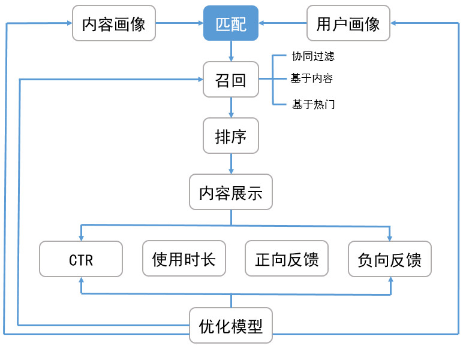

##  推荐系统架构

-   推荐系统架构
    -   *Matching* 召回：包含多个渠道的召回模型，希望从资源库中选取多样性偏好内容，缩小排序目标
        -   协同过滤
        -   主题模型
        -   内容召回
        -   热点召回
    -   *Ranking* 排序：对多个召回渠道内容打分、排序、选出最优的少量结果
        -   若召回结果仍包含大量数据，可以考虑分为两个阶段
            -   粗排：进一步剔除召回结果
            -   精排：对粗排结果再次打分、排序，得到最终推荐结果

### 协同过滤

-   *Collaborative Filtering-Based Recommendation* 协同过滤推荐
    -   模型一般为 $n$ 个物品、$m$ 个用户的表
        -   只有部分用户、物品之间有评分数据
        -   要用已有部分稀疏数据预测空白物品、数据之间评分关系，推荐高评分物品
    -   无需太多特定领域的知识，可通过基于统计的机器学习算法得到较好推荐效果，可以分为
        -   基于用户
        -   基于物品
        -   基于模型

-   *User-based CFR* 基于用户协同过滤：主要考虑用户之间相似度，找出相似用户、相似用户喜欢的物品，预测目标用户对对应物品的评分，推荐高评分物品
    -   特点：（相较于 *Item-Based）推荐**更社会化**
        -   反映用户所在小型兴趣群体中物品热门程度
        -   可帮助用户找到**新类别、惊喜**物品
    -   适合场景
        -   用户数量较少、变化慢场合，否则更新、计算用户相似度矩阵代价大
        -   时效性强、用户个性化兴趣不明显领域
        -   无需给出推荐解释
        -   示例
            -   新闻推荐：注重热门、时效、item更新快
            -   热点视频推荐
    -   方法
        -   基于规则：大众型推荐方法，如：最多用户点击、浏览
        -   基于人口统计信息：简单根据用户基本信息发现用户相关程度、推荐
        -   混合推荐
            -   结合多个推荐算法，集成算法推荐结果
            -   复杂度高

-   *Item-Based CFR* 基于项目协同过滤：考虑物品和物品之间的相似度，找到目标用户对某些物品的评分，预测用户对相似度高的类似物品评分，推荐高评分相似物品
    -   特点：（相较于 *User-Based*）推荐**更个性化**
        -   反映用户自身的兴趣传承
        -   可帮助用户深入挖掘自身兴趣
        -   准确度一般
        -   推荐多样性弱，难以带来惊喜
    -   适合场景
        -   物品数量较少、变化慢场合，否则更新、计算物品相似度矩阵代价大
        -   长尾物品丰富、个性化需求不明显
        -   需要向用户给出推荐理由
        -   示例
            -   电商
            -   电影：兴趣持久、更个性化

-   *Model-Based CFR* 基于模型协同过滤：目前最主流的协同过滤类型
    -   关联算法：找出用户-物品数据里频繁出现的项集，作频繁集挖掘，推荐频繁集、序列中其他物品
        -   *Apriori*
        -   *FPTree*
        -   *PrefixSpan*
    -   聚类算法：按照用户、物品基于一定距离度量聚类，推荐高评分同类物品、同类人群（类似于基于用户、物品协同过滤）
        -   *K-means*
        -   *BIRCH*
        -   *DBSCAN*
        -   *Spectral Clustering*
    -   分类算法：使用分类模型划分物品
        -   逻辑回归
        -   朴素贝叶斯
    -   回归算法：使用回归模型给物品预测打分，较分类更平滑
        -   线性回归
        -   决策树
        -   *SVM*
    -   矩阵分解：对 *用户-物品* 评分矩阵进行分解
        -   *FunkSVD*
        -   *BiasSVD*
        -   *SVD++*

### *Matching*

-   说明
    -   调整不同召回渠道的配比方式保证多样性

####    基于用户行为 *Matching*

-   离线协同过滤：根据用户行为日志，利用 *物品-物品* 相似度矩阵进行 *CF* 扩散作为召回
    -   视频 *Word2Vec* 计算相似度矩阵
        -   全部影片作为语料库、观看历史按时序排列视为文档，计算所有物品的词向量
            -   内容
            -   标题
            -   风格
            -   标签
        -   由词向量得到 *物品-物品* 相似度矩阵
    -   *LDA* 计算用户潜在兴趣
        -   基于概率主题模型：*文档-潜在主题-词* 三级关系，映射/类比到用户行为数据 *用户-潜在兴趣-资源*
        -   通过用户历史行为记录，提取 *LDA* 中间产物、用户的潜在兴趣向量、资源潜在主题分布向量
    -   用户短时间内的观看历史，通过 *物品-物品* 相似度矩阵进行 *CF* 扩散，提取出与用户短时间内观看历史相似的 *topN* 个物品用于召回
        -   将用户、物品关系视为二部图，考虑相似关系可以在图上传播思想，使用 *SimRank* 计算物品相似队列
        -   注意
            -   基于艾宾浩斯遗忘曲线按照时间进行降权
            -   弱化热点影片的权重
            -   矩阵分解

-   冷启动场合
    -   用户召回
        -   使用 *IMDB* 算法计算资源得分，根据不同时间周期进行得分融合、并 *A/B* 测试，选取最优时间周期组合
        -   按照 *IMDB* 得分倒排，生成热点召回数据
    -   资源召回
        -   基于资源库，统计各资源点击、播放率，按一定比例召回第点击、播放率物品

####	扩召回

-   扩召回：独立召回之外，利用额外模型扩召回部分样本
    -	此处召回一般指通过 **成熟** 的规则、模型从全体中获取部分样本
        -	召回一般为历史沉淀、专家经验规则
        -	召回的理由充足，但泛化性较差
    -	扩召回和二次排序训练用的样本是相同的，但
        -	二次排序是在召回的样本基础上再次排序
            -	目标：（全局）排序能力
            -	评价标准：*AUC*、头部准召
        -	扩召回一般是独立于召回建立的模型
            -	目标：学习召回样本的规律，完善召回机制、补充召回样本
                -	因此，扩招回也可以用召回样本作为正样本
                -	扩召回也可用于在线验证新、旧规则的有效性
            -	评价标准：额外召回准确率（对召回样本的学习能力）
                -	事实上，若采用召回样本作为正样本，则 *AUC* 为 1 的扩召回是无价值的，只是复现了召回
            -	特征：可能包含一些专供于扩召回使用的特征
            -	扩召回的正样本可能还包括人工举报、隐案等

### *Ranking*

-   *Ranking* 冷启动场合通常使用强化学习算法
    -   *Thompson Sampling*
    -   *UCB*
    -   *Epsilon-Greedy*
    -   朴素 *Bandit*
    -   *LinUCB* 算法：较 *UCB* 算法加入特征信息
    -   *COFIBA* 算法：*Bandit* 算法结合协同过滤

### 特征工程

-   特征分类
    -   按特征来源分类
        -   物品特征：资源风格、低于、类型、标签、统计特征
        -   用户特征：性别、年龄、婚姻状况、收入预测
        -   *Context* 特征：网络状态、时间段、城市
        -   交叉特征
    -   按特征更新频率、获取方式
        -   离线特征：变化缓慢，如：用户、物品基本特征、统计特征
        -   近在线特征：分钟级、小时级需要更新的特征，如：ctr
        -   在线特征：每次请求达到实时获取特征，如：网络状态、请求时间

-   特征工程
    -   特征扩充
        -   用户兴趣向量丰富用户维度上兴趣特征
            -   *LDA* 中间产物作为用户潜在兴趣向量
            -   *Word2Vec* 词向量、用户行为历史统计出用户兴趣向量
        -   资源 *Embedding* 向量丰富物品维度特征
            -   用户行为数据 *Embedding* 得到 *Word2Vec*、*LDA* 词向量
            -   资源标题 *Embedding*
        -   资源封面 *AutoEncode* 向量
            -   基于资源封面采用自编码器训练，提取隐层向量作为资源特征
    -   统计特征细化
        -   特征工程时间窗口细化：按不同时间窗口分别计算资源的统计特征
            -   丰富资源特征
            -   融入时间衰减因素
    -   在线特征交叉：交叉特征增加样本特征的区分度

