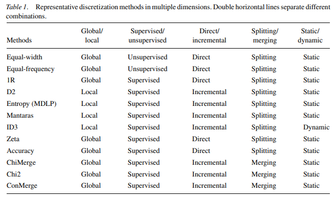
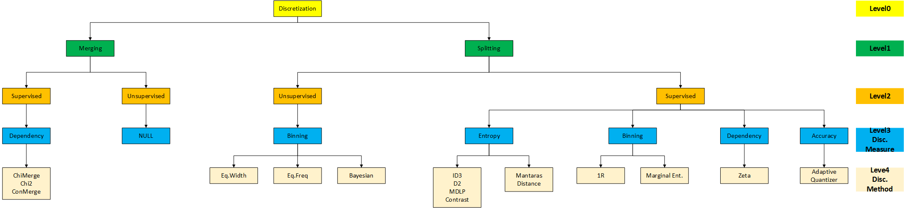
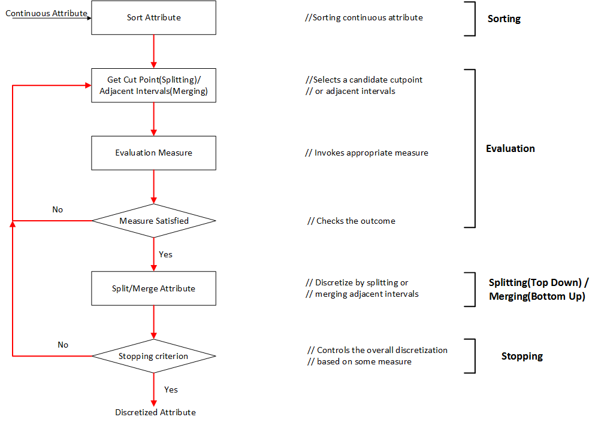
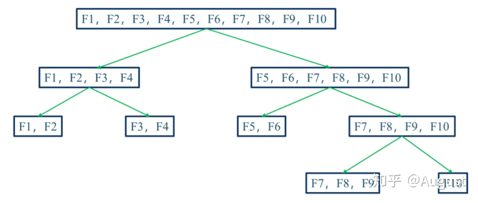
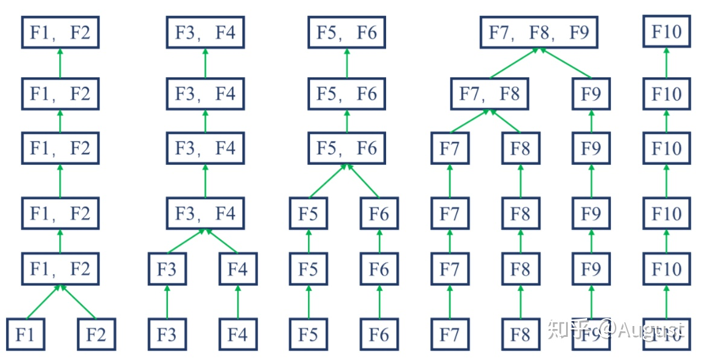
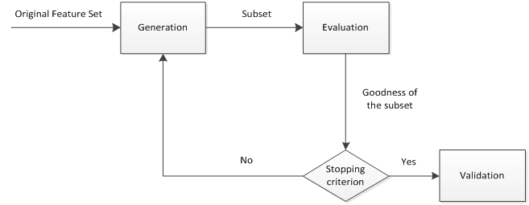
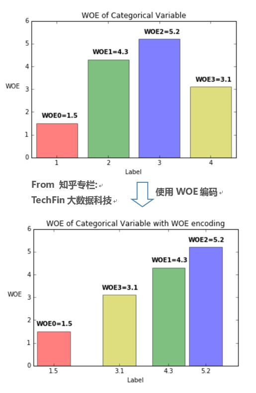

##  特征工程

-   特征工程：对原始数据进行工程处理，将其提炼为特征，作为输入供算法、模型使用
    -   本质上：表示、展示数据的过程
    -   目的：去除原始数据中的杂质、冗余，设计更高效的特征以刻画求解的问题、预测模型之间的关系
        -   把原始数据转换为可以很好描述数据特征
        -   建立在其上的模型性能接近最优
    -   方式：**利用数据领域相关知识**、**人为设计输入变量**
    -   实务中，特征工程要小步快跑、多次迭代
        -   便于及时发现问题、定位问题，如：数据穿越

-   数据、特征决定了机器学习的上限，模型、算法只是逼近上限，特征越好
    -   模型选择灵活性越高：较好特征在简单模型上也能有较好效果，允许选择简单模型
    -   模型构建越简单：较好特征即使在超参不是最优时效果也不错，不需要花时间寻找最优参数
    -   模型性能越好
        -   排除噪声特征
        -   避免过拟合
        -   模型训练、预测更快

### 数据模式

-   结构化数据：行数据，可用二维表逻辑表达数据逻辑、存储在数据库中
    -   可以看作是关系型数据库中一张表
    -   行：记录、元组，表示一个样本信息
    -   列：字段、属性，有清晰定义

-   非结构化数据：相对于结构化数据而言，不方便用二维逻辑表达的数据
    -   包含信息无法用简单数值表示
        -   没有清晰列表定义
        -   每个数据大小不相同
    -   研究方向
        -   社交网络数据
        -   文本数据
        -   图像、音视频
        -   数据流
    -   针对不同类型数据、具体研究方面有不同的具体分析方法，不存在普适、可以解决所有具体数据的方法

-   半结构化数据：介于完全结构化数据、完全无结构数据之间的数据
    -   一般是自描述的，数据结构和内容混合、没有明显区分
    -   树、图（*XML*、*HTML* 文档也可以归为半结构化数据）

> - 结构化数据：先有结构、再有数据
> - 半结构化数据：先有数据、再有结构

### 数据拼接

-   利用外键拼接不同来源的数据时，注意不同数据间粒度差异
    -   外键低于问题标签粒度时，考虑对数据作聚合操作再拼接
        -   保证拼接后用于训练的记录粒度和问题一致
        -   避免维度爆炸
        -   各数据来源数据厚薄不同，会改变数据分布
    -   外键高于、等于目标粒度时，可考虑直接直接连接

### 数据泄露

-   数据泄露：数据穿越、标签入特征
    -   数据泄露表现
        -   模型出现过拟合
    -   一般通过单变量特征评价指标定位有问题的特征
        -   线性模型
            -   单变量 *AUC* 值：超过 0.8 则高度可疑
        -   非线性模型（树）
            -   基于信息增益的特征重要性

##  数据质量、特点、处理

### 稀疏特征

-   稀疏特征
    -   产生原因
        -   数据缺失
        -   统计数据频繁 0 值
        -   特征工程技术，如：独热编码

### 缺失值

-   缺失值
    -	缺失成因
        -   随机缺失
        -   系统性缺失：需要根据数据采集特点考虑删除、业务补全
            -   信息暂时无法获取、成本高
            -   信息被遗漏
            -   属性不存在
    -   缺失值影响
        -   建模将丢失大量有用信息
        -   模型不确定性更加显著、蕴含规则更难把握
        -   包含空值可能使得建模陷入混乱，导致不可靠输出
    -   随机缺失处理
        -   直接使用含有缺失值特征：有些方法可以完全处理、不在意缺失值
            -   分类型变量可以将缺失值、异常值单独作为特征的一种取值
            -   数值型变量也可以离散化，类似分类变量将缺失值单独分箱
        -   删除含有缺失值特征
            -   一般仅在特征缺失率比较高时才考虑采用，如缺失率达到 90%、95%
        -   插值补全

####    插值补全

-   非模型补全缺失值
    -   均值、中位数、众数
    -   同类/前后均值、中位数、众数
    -   固定值
    -   矩阵补全
    -   最近邻补全：寻找与样本最接近样本相应特征补全

-   手动补全：根据对所在领域理解，手动对缺失值进行插补
    -   需要对问题领域有很高认识理解
    -   缺失较多时费时、费力

-   建模预测：回归、决策树模型预测
    -   若其他特征和缺失特征无关，预测结果无意义
    -   若预测结果相当准确，缺失属性也没有必要纳入数据集

-   多重插补：认为待插补值是随机的
    -   通常估计处待插补值
    -   再加上**不同噪声**形成多组可选插补值
    -   依据某准则，选取最合适的插补值

-   高维映射：*one-hot* 编码增加维度表示某特征缺失
    -   保留所有信息、未人为增加额外信息
    -   可能会增加数据维度、增加计算量
    -   需要样本量较大时效果才较好

-   压缩感知：利用信号本身具有的 **稀疏性**，从部分观测样本中恢复原信号
    -   感知测量阶段：对原始信号进行处理以获得稀疏样本表示
        -   傅里叶变换
        -   小波变换
        -   字典学习
        -   稀疏编码
    -   重构恢复阶段：基于稀疏性从少量观测中恢复信号

### 异常值

-   异常值/离群点：样本中数值明显偏离其余观测值的个别值
    -   异常值分析：检验数据是否有录入错误、含有不合常理的数据

####    非模型异常值检测

-   简单统计
    -   观察数据统计型描述、散点图
    -   箱线图：利用箱线图四分位距对异常值进行检测

-   $3\sigma$ 原则：取值超过均值 3 倍标准差，可以视为异常值
    -   依据小概率事件发生可能性“不存在”
    -   数据最好近似正态分布

####    模型异常值检测

-   基于模型预测：构建概率分布模型，计算对象符合模型的概率，将低概率对象视为异常点
    -   分类模型：异常点为不属于任何类的对象
    -   回归模型：异常点为原理预测值对象
    -   特点
        -   基于统计学理论基础，有充分数据和所用的检验类型知识时，检验可能非常有效
        -   对多元数据，可用选择少，维度较高时，检测效果不好

-   基于近邻度的离群点检测：对象离群点得分由其距离 *k-NN* 的距离确定
    -   *k* 取值会影响离群点得分，取 *k-NN* 平均距离更稳健
    -   特点
        -   简单，但时间复杂度高 $\in O(m^2)$，不适合大数据集
        -   方法对参数 *k* 取值敏感
        -   使用全局阈值，无法处理具有不同密度区域的数据集

-   基于密度的离群点检测
    -   定义密度方法
        -   *k-NN* 分类：*k* 个最近邻的平均距离的倒数
        -   *DSSCAN* 聚类中密度：对象指定距离 *d* 内对象个数
    -   特点
        -   给出定量度量，即使数据具有不同区域也能很好处理
        -   时间复杂度 $\in O^(m^2)$，对低维数据使用特点数据结构可以达到 $\in O(mlogm)$
        -   参数难以确定，需要确定阈值

-   基于聚类的离群点检测：不属于任何类别簇的对象为离群点
    -   特点
        -   （接近）线性的聚类技术检测离群点高度有效
        -   簇、离群点互为补集，可以同时探测
        -   聚类算法本身对离群点敏感，类结构不一定有效，可以考虑：对象聚类、删除离群点再聚类
        -   检测出的离群点依赖类别数量、产生簇的质量

-   *One-class SVM*

-   *Isolation Forest*

####    异常值处理

-   删除样本
    -   简单易行
    -   观测值很少时，可能导致样本量不足、改变分布

-   视为缺失值处理
    -   作为缺失值不做处理
    -   利用现有变量信息，对异常值进行填补
    -   全体/同类/前后均值、中位数、众数修正
    -   将缺失值、异常值单独作为特征的一种取值

> - 很多情况下，要先分析异常值出现的可能原因，判断异常值是否为**真异常值**

### 类别不平衡

-   类别不平衡
    -   影响
        -   影响模型训练效果
        -   准确度无法准确评价模型效果
    -   解决方案
        -   重抽样
        -   参数惩罚
        -   将分类问题转变为其他问题
        -   改变模型评价指标

####    重抽样

-   对数据集重采样
    -   尝试随机采样、非随机采样
    -   对各类别尝试不同采样比例，不必保持 1:1 违反现实情况
    -   同时使用过采样、欠采样

-   属性值随机采样
    -   从类中样本每个特征随机取值组成新样本
    -   基于经验对属性值随机采样
    -   类似朴素贝叶斯方法：假设各属性之间相互独立进行采样，但是无法保证属性之前的线性关系

####    参数惩罚

-   对模型进行惩罚
    -   类似 *AdaBoosting*：对分类器小类样本数据增加权值
    -   类似 *Bayesian*分类：增加小类样本错分代价，如：*penalized-SVM*、*penalized-LDA*
    -   需要根据具体任务尝试不同惩罚矩阵

####    新角度理解问题

-   将小类样本视为异常点：问题变为异常点检测、变化趋势检测
    -   尝试不同分类算法
    -   使用 *one-class* 分类器

-   对问题进行分析，将问题划分为多个小问题
    -   大类压缩为小类
    -   使用集成模型训练多个分类器、组合

> - 需要具体问题具体分析

####    模型评价

-   尝试其他评价指标：准确度在不平衡数据中不能反映实际情况
    -   混淆矩阵
    -   精确度
    -   召回率
    -   *F1* 得分
    -   *ROC* 曲线
    -   *Kappa*

### 数据量缺少

-   数据量缺少
    -   解决方案
        -   *Data Agumentation* 数据增强：根据先验知识，在保留特点信息的前提下，对原始数据进行适当变换以达到扩充数据集的效果
        -   *Fine-Tuning* 微调：直接接用在大数据集上预训练好的模型，在小数据集上进行微调
            -   简单的迁移学习
            -   可以快速寻外效果不错针对目标类别的新模型

####    图片数据扩充

-   图片数据扩充
    -   对原始图片做变换处理
        -   一定程度内随机旋转、平移、缩放、裁剪、填充、左右翻转，这些变换对应目标在不同角度观察效果
        -   对图像中元素添加噪声扰动：椒盐噪声、高斯白噪声
        -   颜色变换
        -   改变图像亮度、清晰度、对比度、锐度
    -   先对图像进行特征提取，在特征空间进行变换，利用通用数据
        扩充、上采样方法
        -   *SMOTE*

### 数据偏移

-   （训练集、测试集）数据偏移
    -   特征偏移：训练集、测试集中特征分布有差异
        -   检测方法
            -   创建新标签 $y^{'}$ 标记当前训练集、测试集
            -   分别使用特征、新标签 $y^{'}$ 训练模型
            -   若模型评估指标超过某个阈值，则视为偏移特征
                -   特征可有效区分训练集、测试集，则说明该特征对训练集、测试集有较强区分能力
                -   即特征在训练集、测试集有显著差异
        -   处理方式
    -   标签偏移：训练集、测试集中标签分布有差异
        -   检测方法：训练集、测试集中标签分布图
        -   处理方式
            -   样本赋权
            -   重抽样
    -   概念偏移：训练集、测试集中特征、标签关系发生变化
        -   检测方法：假设训练集、测试集之间关系随某模型外因素（如：时间）变化而变化
            -   类似时间线分段切分、训练多个模型，比较模型差异

> - <https://gsarantitis.wordpress.com/2020/04/16/data-shift-in-machine-learning-what-is-it-and-how-to-detect-it/>
> - <https://zhuanlan.zhihu.com/p/304018288>

##  *Feature Construction*

-   *Feature Construction* 特征构建（提取）：把原始数据中转换为具有物理、统计学意义特征，构建新的人工特征
    -   主观要求高
        -   对问题实际意义、相关领域有研究：思考问题形式、数据结构
        -   对数据敏感：需要观察原始数据
        -   分析能力强
    -   特征构建应尽可能减少信息丢失、提高后续任务效果
        -   单特征变换：根据经验结合特征特点对特征进行变换
        -   组合特征（特征交互）：混合特征创建新特征
        -   统计聚集
            -   记录内聚集：低粒度向上层粒度聚集统计
            -   跨记录聚集：个体与总体关系统计
    -   特征工程和复杂模型在某些方便不冲突
        -   虽然很多复炸模型能够学习复杂规律，类似自行构造特征
        -   但是考虑到计算资源、特征数量、学习效率，人工经验构造衍生特征是必要且有益的

> - 特征选择：表示出每个特征对于模型构建的重要性
> - 特征提取：有时能发现更有意义的特征属性
> - 有时从额外划分特征构建，其相较于特征提取，需要人为的手工构建特征，偏经验、规则

### 特征构建

-   单特征变换
    -   特征取值变换
        -   算术运算：平方、开根、对数
        -   逻辑运算：二值化
        -   小值抑制、大值抑制
            -   也可视为二值化变换再与原值交互
        -   离散化
        -   数值化
            -   时间戳：转换为（距今）时间间隔日、月、季、年（或再离散化）
        -   分类合并
        -   切分特征：分解、切分原有特征，寻找有价值的共同特性段
            -   时间戳：分割为日、月、季、半年、年、时间段
            -   拼接特征拆分
    -   特征统计聚集
        -   记录内聚集：低粒度向上层粒度聚集统计
            -   数值：和、积、均值、比例、方差（标准差、变异系数）、趋势（时序）
            -   有序：TopK、TopK 占比、分位数、插板计数
            -   分类：计数、计数比例、连续长度（时序）、段落数（时序）
        -   跨记录聚集：个体与总体关系统计
            -   数值：标准化、离散化（若依赖统计值）
            -   有序：相对位置
            -   分类：所属占比
    -   *Embedding*：稠密向量代表稀疏、类别特征
        -   *Word2Vec*
        -   *Hash* 技巧：针对文本类别数据，统计文本词表、倾向
        -   数值特征 *Embedding*
            -   *Field Embedding*：特征整体共享 *Embedding* 向量，再与特征取值相乘
            -   离散化后再 *Embedding*

-   特征组合变换
    -   特征拼接
        -   *GBDT* 生成特征组合路径
    -   特征冲突（一致性）验证
        -   匹配
        -   等于
        -   不等于
    -   关联网络特征：图传播
        -   依赖于内部、外部关联图数据
            -   节点（实体）：账户、手机号、个人
            -   边（关联关系）：交易、社会关系
            -   权重：交易频次、金额
        -   图传播可以考虑多次传播，即考虑前一次的传播结果中置信度较高者作为下次的起始节点
    -   特征交叉衍生：探索的范围较大，人工特征交叉衍生时建议最后考虑，根据经验
        -   **优先从单变量评价指标较好的特征开始**
        -   **优先从离散、连续特征中分别选择进行交叉**
            -   记录内聚集：连续特征按离散特征分组统计
        -   连续特征内部可能会做交叉衍生
        -   离散特征内部往往不做交叉衍生
            -   *one-hot* 后特征对应维数较大
            -   单个维度信息量不多，交叉后维数爆炸，不适合某些模型（树模型）

-   说明
    -   统计类指标：只能用于存在同类数据的情况下构建
        -   需要指定统计口径：时间窗口、批大小、某类型
            -   去除量纲影响
            -   衡量用户行为偏好
        -   统计类指标依赖对问题的认识，依赖统计指标的业务含义
    -   **数据变换可能需要嵌套操作**
        -   普通数值先离散化再交叉衍生
        -   低粒度普通数值、时间戳先插板计数再计算标准差、一阶趋势
    -   上述变换算子仅指逻辑算子，具体实现可能需要由多个实际算子顺次操作，尤其是分类型特征的具体实现可能依赖
        -   分类计数：分组过滤、二值化、加和

### 数据标准化

#### *Normalizaion*

| 变换              | 逻辑                                                                                             | 目标范围         |
|-------------------|--------------------------------------------------------------------------------------------------|------------------|
| *Min-Max Scaling* | $ X_{norm} = \frac {X - X_{min}} {X_{max} - X_{min}} $                                           | $[0, 1]$         |
| *Z-Score Scaling* | $ Z = \frac {X - \mu} {\sigma}$                                                                  | 均值 0、标准差 1 |
| 对数变换          | $X^{'} = lg(X)$                                                                                  |                  |
| 反余切函数变换    | $X^{'} = \frac {2 arctan(x)} {\pi}$                                                              |                  |
| *Sigmoid* 变换    | $X^{'} = \frac 1 {1 + e^{-x}}$                                                                   |                  |
| 模糊向量变换      | $X^{'} = \frac 1 2 + \frac 1 2 sin \frac {X - \frac{max(X) - min(X)} 2} {max(X) - min(X)} * \pi$ |                  |

-   归一化、标准化：将同类特征数据缩放到指定大致相同的数值区间
    -   消除样本数据、特征之间的量纲/数量级影响
        -   量级较大属性占主导地位
        -   降低迭代收敛速度：梯度下降时，梯度方向会偏离最小值，学习率必须非常下，否则容易引起**宽幅震荡**
        -   依赖样本距离的算法对数据量机敏感
    -   应用场合
        -   *BN* 层
    -   说明
        -   某些算法要求数据、特征数值具有零均值、单位方差
        -   树模型不需要归一化，归一化不会改变信息增益（比），*Gini* 指数变化

#### *Regularization*

-   *Regularization* 正则化：将样本/特征**某个范数**缩放到单位 1
    -   使用内积、二次型、核方法计算样本之间相似性时，正则化很有用
    -   说明
        -   归一化：针对单个属性，需要用到所有样本在该属性上值
        -   正则化：针对单个样本，将每个样本缩放到单位范数

$$\begin{align*}
\overrightarrow x_i & = (
    \frac {x_i^{(1)}} {L_p(\overrightarrow x_i)},
    \frac {x_i^{(2)}} {L_p(\overrightarrow x_i)}, \cdots,
    \frac {x_i^{(d)}} {L_p(\overrightarrow x_i)})^T \\
L_p(\overrightarrow x_i) & = (|x_i^{(1)}|^p + |x_i^{(2)}|^p + 
    \cdots + |x_i^{(d)}|^p)^{1/p}
\end{align*}$$

### 数值化：分类->数值

####    *Ordinal Encoding*

-   *Ordinal Encoding* 序号编码：使用一位序号编码类别
    -   一般用于处理类别间具有大小关系的数据
        -   编码后依然保留了大小关系

####    *One-hot Encoding*

-   *One-hot Encoding* 独热编码：采用N位状态位对N个可能取值进行编码
    -   独热编码后特征表达能力变差，特征的预测能力被人为拆分为多份
        -   通常只有部分维度是对分类、预测有帮助，需要借助特征选择降低维度
        -   一般用于处理类别间不具有大小关系的特征
    -   优点
        -   能处理非数值属性
        -   一定程度上扩充了特征
        -   编码后向量时稀疏向量：可以使用向量的稀疏存储节省空间
        -   能够处理缺失值：高维映射方法中增加维度表示缺失
    -   对部分模型不适合
        -   *k-NN* 算法：高维空间两点间距离难以有效衡量
        -   逻辑回归模型：参数数量随维度增加而增大，增加模型复杂度，容易出现过拟合
        -   决策树模型
            -   产生样本切分不平衡问题，切分增益非常小
                -   每个特征只有少量样本是 1，大量样本是 0
                -   较小的拆分样本集占总体比例太小，增益乘以所占比例之后几乎可以忽略
                -   较大拆分样本集的几乎就是原始样本集，增益几乎为 0
            -   影响决策树的学习
                -   决策树依赖数据统计信息，独热编码将数据切分到零散小空间上，统计信息不准确、学习效果差
                -   独热编码后特征表达能力边人为拆分，与其他特征竞争最优划分点失败，最终特征重要性会比实际值低

> - 在经典统计中，为避免完全多重共线性，状态位/哑变量会比取值数量少 1

####    *Binary Encoding*

-   *Binary Encoding* 二进制编码：先用序号编码给每个类别赋予类别 *ID*，然后将类别 *ID* 对应二进制编码作为结果
    -   本质上利用二进制类别 *ID* 进行哈希映射，得到 *0/1* 特征向量
    -   特征维度小于独热编码，更节省存储空间

####    *Weight of Evidence Encoding*

$$\begin{align*}
WOE_i & = log(\frac {\%B_i} {\%G_i}) \\
& = log(\frac {\#B_i / \#B_T} {\#G_i / \#G_T})
\end{align*}$$

> - $\%B_i, \%G_i$：分类变量取第 $i$ 值时，预测变量为 *B* 类、*G* 类占所有 *B* 类、*G* 类比例
> - $\#B_i, \#B_T$：分类变量取第 $i$ 值时，预测变量为 *B* 类占所有 *B* 类样本比例
> - $\#G_i, \#G_T$：分类变量取第 $i$ 值时，预测变量为 *G* 类占所有 *G* 类样本比例

-   *WOE* 编码：以分类变量各取值的 *WOE* 值作为编码值
    -   *WOE* 编码值能体现分类变量取值的预测能力，变量各取值 *WOE* 值方差越大，变量预测能力越强
    -   *WOE* 编码是有监督的编码方式，可以衡量分类变量各取值中
        -   *B* 类占所有 *B* 类样本比例、*G* 类占所有 *G* 类样本比例的差异
        -   *B* 类、*G* 类比例，与所有样本中 *B* 类、*G* 类比例的差异
    -   优点
        -   相较于 *one-hot* 编码
            -   特征数量不会增加，同时避免特征过于稀疏、维度灾难
            -   避免特征筛选过程中，一部分特征取值被筛选，一部分被遗弃，造成特征不完整
            -   将特征规范到**同一尺度**的数值变量，同时也便于分析特征间相关性
        -   在 *LR* 模型中，*WOE* 编码线性化赋予模型良好的解释性
            -   *WOE* 编码本身即可反应特征各取值贡献
            -   可以用于给评分卡模型中各分箱评分

###  分类化/离散化：数值->分类

-   离散化优势
    -   方便工业应用、实现
        -   离散特征的增加、减少容易，方便模型迭代
        -   特征离散化处理缺失值、异常值更方便，可直接将其映射为某取值
        -   数值化后可指定取值类型，如：*one-hot*编码为为稀疏向量
            -   內积速度快
            -   存储方便
            -   容易扩展
    -   方便引入历史经验
        -   可以自由调整离散化结果，结合机器学习和历史经验得到最终的离散化结果
    -   模型更稳健
        -   模型不再拟合特征具体值，而是拟合某个概念，能够对抗数据扰动，更稳健
        -   对异常数据鲁棒性更好，降低模型过拟合风险
        -   某些场合需要拟合参数值更少，降低模型复杂度
    -   （引入）非线性提升模型表达能力
        -   利用经验、其他信息将数值特征分段，相当于 **引入非线性**，提升线性模型表达能力
        -   方便引入交叉特征，提升模型表达能力
    -   避免特征为长尾分布、大部分取值集中在小范围，对样本

-   因此，离散化特征更适合 *LR* 等线性模型，不适合树模型、抽样模型
    -   线性模型可以充分利用离散化优势
        -   方便引入非线性等
        -   模型中所有特征都会被考虑，考虑细节、个体（包括 $L_1$ 范数也是被考虑后剔除）
    -   对*GBDT* 等树、抽样模型则不适合
        -   特征离散化后，由于抽样误差的存在，可能存在某些离散特征对 **样本预测能力非常强**，非线性模型容易给这些特征更大权重，造成过拟合
            -   如：刚好抽取的 1000 个样本中某离散特征取值为 1 者全为正样本
        -   树模型每次使用一个特征划分节点，特征数量较多不利于模型训练
            -   若单个离散化特征预测能力不强，由于树深度限制，只有少量特征被作为划分依据，模型可能不收敛、表达能力更差
            -   若单个离散化特征预测能力强，连续特征也应该也有较好效果

-   说明
    -   模型使用离散特征、连续特征，是 “海量离散特征+简单模型”、“少量连续特征+复杂模型” 的权衡
        -   **海量离散特征+简单模型**：难点在于特征工程，成功经验可以推广，可以多人并行研究
        -   **少量连续特征+复杂模型**：难点在于模型调优，不需要复杂的特征工程
    -   一般的，连续特征对预测结果影响不会突变，合理的离散化不应造成大量信息丢失
        -   且若特征存在突变，模型将难以拟合（线性模型尤其）
        -   反而更应该离散化为多个分类特征，方便引入非线性
    -   事实上，根据 *Cover* 定理，离散化增加特征维度类似于投影至高维，更可能得到较优模型（也更容易过拟合）
        -   极限角度，对所有特征、取值均离散化，则可以得到完全可分模型（除特征完全一样分类不同）
    -   分类型变量本质上无法建模，因为取值从含义上无法进行数值计算
        -   将数值型映射为分类型，往往只是中间步骤，最终会将分类型取值映射回数值型

####    分类、评价标准



-   离散化方法分类
    -   *supervised vs. unsupervised*：是否使用分类信息指导离散化过程
        -   无监督
            -   如：等距、等频划分
            -   无法较好的处理异常值、不均匀分布
        -   有监督
            -   利用分类信息寻找合适切分点、间隔
            -   根据使用分类信息的方式有许多种
    -   *dynamic vs. static*：离散化、分类是否同时进行
    -   *global vs. local*：在特征空间的局部还是全局进行离散化
    -   *spliting vs. merging*/*top-down vs. bottom-up*：自顶向下划分还是自底向上合并
    -   *direct vs. incremental*：直接根据超参数确定分箱数量还是逐步改善直到中止准则



-   离散化方法从以下 3 个方面评价
    -   *Simplicity* 简单性：切分点数量
    -   *Consistency* 一致性：最小不一致数量
        -   不一致：样本具有相同的特征取值，但分类不同
        -   最小不一致数量：各箱内样本数量减最大类别样本数量
    -   *Accuracy* 准确率：分类器进行交叉验证的准确率

####    典型过程



-   离散化典型过程
    -   *sort*：排序
    -   *evaluate*：评估分割点
    -   *split or merge*：划分、合并
    -   *stop*：停止离散化

#### 无监督

-   无监督分箱：仅仅考虑特征自身数据结构，没有考虑特征与目标之间的关系

#####    等频/等距/经验分箱

-   分箱逻辑
    -   等频分箱：排序后按数量等分
        -   避免离散化后特征仍然为长尾分布、大量特征集中在少量组内
        -   对数据区分能力弱
    -   等距分箱：取值范围等分
    -   经验分箱

-   分箱数量、边界超参需要人工指定
    -   根据业务领域经验指定
    -   根据模型指定：根据具体任务训练分箱之后的数据集，通过超参数搜索确定最优分桶数量、边界

-   分箱经验、准则
    -   若组距过大，组内属性取值差距过大
        -   逻辑上分类不能够代表组内全部样本，组内取值影响可能完全不同
    -   若组距过小，组内样本过少
        -   随机性太强，不具备统计意义上说服力
        -   特征影响跳变过多

#####    聚类分箱

-   *K-Means* 聚类
-   层次聚类

> - 聚类过程中需要保证分箱有序

#### 有监督

#####    *Binning：1R* 分箱

-   分箱逻辑、步骤
    -   将样本排序，从当前位置开始
        -   初始化：以允许的最少样本作为一箱，将箱内最多类别作为箱标签
        -   扩展：若下个样本类别与箱标签相同，则划至箱内
    -   重复以上，得到多个分箱
    -   将相邻具有相同标签的箱合并，得到最终分箱结果

#####    *Splitting*



-   基于信息熵的 *split*，具体划分依据如下
    -   *ID3*：信息增益
    -   *C4.5*：信息增益比
    -   *D2*：
    -   *Minimum Description Length Principle*：描述长度

#####    *Merge*



-   基于相关性的 *merge*，具体划分依据如下
    -   *Chimerge*：使用卡方值衡量两个相邻区间是否具有类似分布，若具有类似分布则将其合并

-   算法步骤
    -   初始化
        -   将变量升序排列
        -   为减少计算量，若初始分箱数量大于阈值 $N_{max}$，则利用等频分箱进行粗分箱
        -   缺失值单独作为一个分箱
    -   合并区间
        -   计算每对相邻区间的卡方值
        -   将卡方值最小区间合并
        -   重复以上直至分箱数量不大于 $N$（目标分箱数量）
    -   分箱后处理
        -   合并纯度为 1（只含有某类样本）的分箱
        -   删除某类样本占比超过 95% 的分箱
        -   若缺失值分箱各类样本占比同非缺失值分箱，则合并

### 降维

####    *Principal Component Analysis*

-   *PCA* 主成分分析：找到数据中主成分，用主成分来表征原始数据，达到降维目的
    -   思想：通过坐标轴转换，寻找数据分布的最优子空间
        -   特征向量可以理解为坐标转换中新坐标轴方向
        -   特征值表示对应特征向量方向上方差
            -   特征值越大、方差越大、信息量越大
            -   抛弃较小方差特征
    -   *KPCA*：核主成分分析，通过核函数扩展 *PCA*
        -   赋予 *PCA* 非线性
        -   流形映射降维方法：等距映射、局部线性嵌入、拉普拉斯特征映射
-   步骤
    -   对样本数据进行中心化处理（和统计中处理不同）
    -   求样本协方差矩阵
    -   对协方差矩阵进行特征值分解，将特征值从大至小排列
    -   取前 p 个最大特征值对应特征向量作为新特征，实现降维

####    *Linear Discriminant Analysis*

-   *LDA* 线性判别分析：寻找投影方向，使得投影后样本尽可能按照原始类别分开，即寻找可以最大化类间距离、最小化类内距离的方向
    -   相较于 *PCA*，*LDA* 考虑数据的类别信息，不仅仅是降维，还希望实现“分类”
    -   相较于 *PCA* 优点
        -   *LDA* 更适合处理带有类别信息的数据
        -   模型对噪声的稳健性更好
    -   缺点
        -   对数据分布有很强假设：各类服从正太分布、协方差相等，实际数据可能不满足
        -   模型简单，表达能力有限，但可以通过核函数扩展 *LDA* 处理分布比较复杂的数据

####    *Independent Component Analysis*

-   *ICA* 独立成分分析：寻找线性变换 $z=Wx$，使得 $z$ 各特征分量之间独立性最大
    -   思想
        -   假设随机信号 $x=As$ 由未知源信号 $s$ 经混合矩阵 $A$ 线性变换得到
        -   通过观察 $x$ 估计混合矩阵 $A$、源信号 $s$，认为源信号携带更多信息
-   步骤
    -   *PCA* 得到主成分 $Y$
    -   将各个主成分各分量标准化得到 $Z$，满足
        -   $Z$ 各分量不相关
        -   $Z$ 各分量方差为1

##  *Sampling*

-   数据抽样
    -   抽样作用
        -   提高速度、效率，将精力放在建立模型、选择模型上
        -   帮助分析特殊性问题：有些问题涉及到破坏性试验，抽取产品的一部分做耐用性实验经济有效
        -   降低成本：合理抽样可以保证在大部分信息不丢失情况下，降低数据采集、社会调查成本
    -   从效率、成本角度看，适当、合理抽样有必要
        -   数据越多信息越丰富、数据量尽量多为好
        -   抽样可以降低求解的时空代价，但是可能会丢失部分信息，可能会使分析结果产生偏差
        -   在分析阶段，若抽样误差能够接受，完全可以抽样
    -   样本应能充分代表总体
        -   一般样本容量越大，和总体的相似程度越高，样本质量越高
        -   但大样本不等于总体：理论上再大的局部抽样也不如随机抽样有代表性

###  样本评价

-   样本容量、样本质量是衡量抽样样本的两个最重要因素
    -   样本容量：抽样过程中抽取的样本数
    -   样本质量：衡量抽样样本的代表性

#### 样本质量

样本质量：抽样样本与整体的相似性

$$\begin{align*}
J(S, D) & = \frac {1} {D} \sum_{k=1}^{r} J_{k}(S, D) \\
J_{k}(S, D) & = \sum_{j=1}^{N_k}(P_{Sj} - P_{Dj})
    log \frac {P_{Sj}} {P_{Dj}} \\
Q(s) & = exp(-J)
\end{align*}$$

> - $D$：数据集，包含 $r$ 个属性
> - $S$：抽样样本集
> - $J_k=J(S, D)$：*Kullblack-Laible* 散度，数据集 $S$、$D$ 在属性 $k$ 上偏差程度，越小偏差越小
> - $Q(S) \in [0, 1]$：抽样集 $S$ 在数据集 $D$ 中的质量，越大样本集质量越高

-   若整体 $D$ 分布稀疏，容易得到 $S$ 在某些数据点观测值数为 0，得到 $I(S, D) \rightarrow infty$
    -   可以把该点和附近的点频率进行合并，同时调整总体频率分布
    -   过度合并会导致无法有效衡量数据集局部差异性

-   对于连续型变量
    -   可以把变量进行适当分组：粗糙，不利于刻画数据集直接的局部差异
    -   计算数据集各个取值点的非参估计，如核估计、最近邻估计等，再在公式中用各自的非参估计代替相应频率，计算样本质量

-   数据包含多个指标时
    -   可以用多个指标的平均样本质量衡量整体样本质量
    -   也可以根据指标重要程度，设置不同的权重

#### 样本容量

-   样本容量是评价样本的另一个重要维度
    -   样本量大、质量好、准确性高，但计算效率低
    -   样本质量差、准确性低、计算效率高
    -   样本质量提高不是线性的，高位样本容量上，边际效用往往较低
    -   同一样本容量的不同样本的样本质量也会有差异，即样本质量不是样本容量的单调函数，包含随机扰动

-   *Statistical Optimal Sample Size* 统计最优样本数
    -   根据某种抽样方法，随机产生 $R$ 个样本容量分别为 $n_i, n_i \in [1, N]$ 的样本 $S$
        -   $n_i$ 取值较小处应密度比较大，因为随着 $n_i$ 增加，样本质量趋近 1，不需要太多样本
        -   可以考虑使用指数序列产生在较大值处稀疏的序列作为 $n_i$ 序列的取值
    -   计算每个样本 $S$ 在数据集 $D$ 中的样本质量 $Q$
        -   并计算各个样本容量对应的样本质量均值 $\bar {Q_{n}}$
        -   绘制曲线 $(n, \bar {Q_{n}})$
    -   根据给定的样本质量要求，在样本容量对应样本质量的曲线上确定近似的最优样本容量

###  测试集、训练集

-   测试集、训练集划分逻辑前提
    -   在样本量足够的情况下，减少部分样本量不会影响模型精度
    -   模型评价需要使用未参与建模数据验证，否则可能夸大模型效果

-   测试集、训练集划分作用
    -   测试集直接参与建模，其包含信息体现在模型中
    -   训练集仅仅用于评价模型效果，其包含信息**未被利用**，
    -   因此，若无评价、对比模型需求，或有其他无需划分测试集即可评价模型，则划分测试集无意义

-   数据泄露
    -   特征泄露：训练过程中使用有包含有上线之后无法获取的数据
        -   时序数据中数据穿越：使用未来数据训练模型，模型将学习不应获取的未来信息
    -   记录泄露/训练数据泄露：切分数据集时训练集包含了测试集中部分数据
        -   会导致评估指标失真

#### 测试集、训练集划分

-   *Hold Out* 旁置法：将样本集随机划分为训练集、测试集，只利用训练集训练模型
    -   适合样本量较大的场合
        -   减少部分训练数据对模型精度影响小
        -   否则大量样本未参与建模，影响模型精度
    -   常用划分比例
        -   8:2
        -   7:3
    -   旁置法建立模型可直接作为最终输出模型
        -   旁置法一般只建立一个模型
        -   且使用旁置法场合，模型应该和全量数据训练模型效果差别不大

-   *N-fold Cross Validation* N折交叉验证：将数据分成 N 份，每次将其中一份作为测试样本集，其余 N-1 份作为训练样本集，重复 N 次
    -   N折交叉验证可以视为旁置法、留一法的折中
        -   克服了旁置法中测试样本选取随机性的问题：每个样本都能作为测试样本
        -   解决了留一法计算成本高的问题：重复次数少
    -   典型的“袋外验证”
        -   袋内数据（训练样本）、袋外数据（测试样本）分开
    -   N折交叉验证会训练、得到 N 个模型，不能直接输出
        -   最终应该输出全量数据训练的模型
        -   N 折建立 N 次模型仅是为了合理的评价模型效果，以 N 个模型的评价指标（均值）作为全量模型的评价

-   *Leave-One-Out Cross Validation* 留一法：每次选择一个样本作为测试样本集，剩余 N-1 个观测值作为训练样本集，重复 N 次
    -   可以看作是 N 折交叉验证的特例

###  样本重抽样

-   样本重抽样
    -   *Bootstrap* 重抽样自举
    -   *Over-Sampling* 过采样：小类数据样本增加样本数量
    -   *Under-Sampling* 欠采样：大类数据样本减少样本数量

#### *Bootstrap*

-   重抽样自举：有放回的重复抽样，以模拟多组独立样本
    -   对样本量为 $n$ 的样本集 $S$
    -   做$k$次有放回的重复抽样
        -   每轮次抽取 $n$ 个样本
        -   抽取得到样本仍然放回样本集中
    -   得到 $k$ 个样本容量仍然为 $n$ 的随机样本 $S_i，(i=1,2,...,k)$

####    *Over-Sampling*

-   *Synthetic Minority Over-sampling Technique*：过采样算法，构造不同于已有样本小类样本
    -   基于距离度量选择小类别下相似样本
    -   选择其中一个样本、随机选择一定数据量邻居样本
    -   对选择样本某属性增加噪声，构造新数据

-   *SMOTE*

-   *Borderline-SMOTE*

####    *Under-Sampling*

##  *Feature Selection*

-   特征选择：从特征集合中选择 **最具统计意义** 的特征子集
    -   特征分类
        -   *relevant feature*：相关特征，对当前学习任务有用的属性、特征
            -   特征选择最重要的是确保不丢失重要特征
        -   *irrelevant feature*：无关特征，对当前学习任务无用的属性、特征
        -   *redundant feature*：冗余特征，包含的信息可以由其他特征中推演出来
            -   冗余特征通常不起作用，剔除可以减轻模型训练负担
            -   若冗余特征恰好对应完成学习任务所需要的中间概念，则是有益的，可以降低学习任务的难度
    -   特征选择会降低模型预测能力，因为被剔除特征中可能包含有效信息
        -   保留尽可能多特征，模型性能会提升，模型更复杂、计算复杂度同样提升
        -   剔除尽可能多特征，模型性能会下降，模型更简单、降低计算复杂度
    -   特征选择原因
        -   维数灾难问题：仅需要选择一部分特征构建模型，可以减轻维数灾难问题，从此意义上特征选择和降维技术有相似动机
        -   剔除无关特征可以降低学习任务难度，简化模型、降低计算复杂度
    -   说明
        -   特征选择对象应是直接参与建模的原始特征、衍生特征
            -   特征衍生本就是加入了人工经验，其与前体特征信息不完全相同
            -   即，衍生特征自身、前体应视为独立变量分别评价



-   特征选择要点、步骤
    -   *Generation Procedure* 产生过程：搜索特征子集
    -   *Evaluation Function* 评价函数：评价特征子集优劣，**能判断划分之间差异的机制都能作为特征子集的准则**
        -   特征间、特征与标签的各类统计指标，即 *Filter* 特征筛选
        -   标签预测值、实际值差距指标（各类损失函数），即 *Wrapper* 特征筛选
    -   *Stopping Criterion* 停止准则：与评价函数相关的阈值，评价函数达到与阈值后可以停止搜索
    -   *Validation Procedure* 验证过程：在验证数据集上验证选择特征子集的有效性

### 特征子集搜索

-   特征子集搜索
    -   遍历：从初始特征集合选择包含所有重要信息的特征子集
        -   特点
            -   适合没有先验（问题相关领域）知识的情况
            -   特征数量稍多会出现组合爆炸
    -   迭代：产生候选子集、评价优劣，基于评价结果产生下个候选子集
        -   特点
            -   不断迭代，直至**无法找到更好的后续子集**
            -   需要评价得子集数量较少
            -   可能无法找到最优子集
        -   迭代搜索流程
            -   给定特征 $A=\{A_1, A_2, \cdots, A_d\}$，将每个特征视为候选子集（每个子集只有一个元素），对 $d$ 个候选子集进行评价
            -   在上轮选定子集中加入特征，选择包含两个特征的最优候选子集
            -   假定在 $k+1$ 轮时，最优特征子集不如上轮最优的特征子集，则停止生成候选子集，将上轮选定特征子集作为特征选择结果

-   特征候选子集产生方式
    -   *Complete* 完全搜索
        -   *Exhaustive* 穷尽搜索
            -   最优子集选择
        -   *Non-Exhausitive* 非穷尽搜索：特别的，贪心搜索
            -   *Sequential Forward Selection* 前向特征选择：从空集开始，逐渐增加最优特征
            -   *Sequential Backward Selection* 后向特征选择：从完整特征集合开始，逐渐剔除最差特征
            -   *Bidirectional Search Selecttion* 双向特征选择：结合前向、后向搜索
            -   *Plus-L Minus-R Selection* 增L去R特征选择：每次增加最优 $L$、剔除最差 $R$ 特征
                -   从空集开始，则需 $L > R$
                -   从全集开始，则需 $L < R$
            -   *Sequential Floating Selection* 序列浮动选择：$L,R$ 动态变动
    -   *Heuristic* 启发式搜索
        -   *Random Generation plus Sequential Selection* 随机序列选择：随机产生特征子集，在子集上执行 *SFS*、*SBS*
        -   *Simulated Anealing* 模拟退火
        -   *Genetic Algorithm* 遗传算法

### 特征子集评价

-   特征间、特征与标签的各类统计指标，即 *Filter* 特征筛选
    -   单特征自差异性
        -   *Variance* 方差：方差越大，特征自身信息量越大，对预测值区分能力越强，也越不稳定
            -	*Coefficient of Variation* 变异系数：方差去除量纲影响
        -   *Missing Values Ratio* 缺失值比率
        -   众数比率
    -   相关系数：特征内部、特征与预测值
        -   *Pearson* 积矩相关系数
            -   *Variance Inflation Factor* 方差膨胀因子：多重共线性
        -   *Kendell* 秩相关系数
        -   *Spearman* 秩相关系数
        -   卡方统计量
    -   距离指标：好的划分应使同类别距离尽量小
        -   *Relief* 特征权重
        -   *ANOVA* 方法分析
        -   聚类组内距离
    -   *IV* 值
-   标签预测值、实际值差距指标（各类损失函数），即 *Wrapper* 特征筛选
    -   划分信息增益：好的划分应减少
        -   *Gini* 指数
        -   *IG* 信息增益/互信息
        -   信息增益比
    -   混淆矩阵类指标
        -   *Accuracy* 准确率
        -   *Top PR* 头部准召
    -   排序指标
        -   *AUC*
    -   方差损失、显著性
        -   *p-value*
        -   $R^2$
        -   *AIC*
        -   *BIC*
        -   $C_p$

### *Filter*

-   *Filter* 过滤式：对数据集进行的特征选择过程与后续学习器无关，即设计统计量过滤特征，不考虑后续学习器问题
    -   通过分析特征子集内部特点衡量特征优劣，描述自变量、目标变量的关联
    -   特点
        -   时间效率高
        -   对过拟合问题较稳健
        -   倾向于选择**单个**、**冗余**特征，没有考虑特征之间相关性

-   特征过滤
    -   单特征过滤：直接选择合适特征子集评价标准处理各特征，选择满足要求特征
    -   *Relief* 算法赋权后特征选择

### *Wrapper*

-   *Wrapper* 包裹式：把最终要使用的 **学习器性能作为特征子集评价标准**，为给定学习器选择最有利其性能、特化的特征子集
    -   优点
        -   直接针对特定学习器进行优化
        -   考虑了特征之间的关联性，通常训练效果较过滤式好
    -   缺点
        -   特征选择过程中需要多次训练学习器，计算效率较低
        -   观测数据较少时容易过拟合

-   特征 *Wrapper*
    -   *Las Vegas Wrapper*：在 *Las Vegas Method* 框架下使用随机策略进行子集搜索，以最终分类器误差作为特征子集评价标准
        -   包含停止条件控制参数 $T$，避免每次子集评价训练特征子集开销过大
        -   若初始特征数量很多、$T$ 设置较大、每轮训练时间较长，算法执行很长时间都不会停止
            -   *LVM* 可能无法得到解（拉斯维加斯算法本身性质）
    -   递归特征消除法：使用基模型进行多轮训练，每轮训练消除若干权值系数的特征，再基于特征集进行下一轮训练
    -   *Stepwise* 变量选择
        -   前向变量选择
        -   后向变量选择
        -   前向-后向变量选择
        -   最优子集选择

### *Embedded*

-   *Embeded* 嵌入式：将特征选择、学习器训练过程融合，在同一优化过程中同时完成，即学习器训练过程中自动进行特征选择
    -   优点：兼具筛选器、封装器的优点
    -   缺点：需要明确 *好的选择* ，并与目标问题融合，

-   嵌入式特征选择
    -   正则化约束：$L_1$、$L_2$ 范数
        -   主要用于线性回归、逻辑回归、*SVM* 等算法
        -   *Ridge*：$L_2$ 范数
        -   *Lasso*：$L_1$ 范数
            -   除降低过拟合风险，还容易获得稀疏解
            -   参数 $\lambda$ 越大，稀疏性越大，被选择特征越少
        -   *SVM*、逻辑回归
            -   超参参数范数权重越大，稀疏性越大，被选择特征越少
    -   决策树思想：决策树自上而下选择分裂特征就是特征选择
        -   所有树结点划分属性根据先后顺序组成的集合就是选择出来的特征子集
    -   神经网络：训练时同时处理贡献度问题，不重要特征权重被剔除

##  统计指标

-   统计量：统计理论中对数据进行分析、检验的变量
    -   传统的统计量具有显式解析表达式
        -   均值：数据之和除数量
        -   中位数：数据中间者
    -   优化问题目标（损失函数）也可视为逻辑复杂的统计量
        -   损失函数：预测值（本身也视为复杂统计量）、实际值的差距
        -   一般统计量：特征自身、特征间、特征与标签的统计指标
    -   统计量同样可以理解为和数据相关 **优化问题的解**
        -   均值：离差平方和最小
        -   中位数：划分均匀

### *Pearson* 积矩相关系数

$$ \rho_{X,Y} = \frac {cov(X, Y)} {\sigma_X \sigma_Y} $$
> - $cov(X, Y)$：变量 $X, Y$ 协方差
> - $\sigma_X, \sigma_Y$：变量 $X, Y$ 方差

-   *Pearson* 积矩相关系数取值范围为 $[-1, 1]$
    -   $1, -1$ 分别表示变量成正线性、负线性函数关系

####   *Pearson* 积矩相关稀疏显著性检验

-   *Fisher* 变换
    $$ z = \frac 1 2 ln(\frac {1+r} {1-r}) = arctanh(r) $$
    > - $z$：*Pearson* 积矩相关系数的 *Fisher* 变换
    > - $r$：样本的 *Pearson* 积矩相关系数值
    -   当 $(X, Y)$ 为二元正态分布时，$z$ 近似正态分布
        -   均值：$\frac 1 2 ln(\frac {1+\rho} {1-\rho})$
        -   标准差：$\frac 1 {\sqrt {N - 3}}$

-   基于数学的近似方法
    $$ t = r \sqrt{\frac {N - 2} {1 - r^2}} $$
    -   当 $(X, Y)$ 为二元正态分布且不相关时，$t$ 服从自由度为 $n-2$的 *t-分布*

### *Spearman* 秩相关系数

$$\begin{align*}
\rho_{X, Y} & = \frac {cov(Rank(X) - Rank(Y))} {\sigma_{Rank(X)} \sigma_{Rank(Y)}} \\
& = 1 - \frac {6 \sum_i^N d_i^2} {N(N^2-1)} \\
\end{align*}$$
> - $Rank(X), Rank(Y)$：变量 $X, Y$ 的秩（应同序）（相同值秩取均值）
> - $d_i$：变量对 $X, Y$ 中，二者秩差值

-   *Spearman* 秩相关系数：变量秩的 *Pearson* 相关系数
    -   *Spearman* 秩相关系数也可以使用 *Fisher* 变换检验显著性

### *Kendell* 秩相关系数

$$\begin{align*}
\tau_a &= \frac {N_c - N_d} {N_0} \\
\tau_b &= \frac {N_c - N_d} {\sqrt{(N_0 - N_X)(N_0 - N_Y)}} \\
\tau_c &= \frac {2(N_c - N_d)} {N^2 \frac {M-1} M}
\end{align*}$$
> - $N_0 = \frac {N(N-1)} 2$：变量对数量
> - $N_c, N_d$：变量对 $X, Y$ 中有序对数量、无序对数量
> - $N_X, N_Y$：变量对 $X, Y$ 中 $X$ 取值、$Y$ 取值相同对数量
> - $M$：变量 $X, Y$ 中较小取值数量者取值数量

-   *Kendell* 秩相关系数
    -   取值范围同样为 $[-1, 1]$
        -   -1 仅在变量 $X, Y$ 取值完全反向取到
    -   有序对与无序对
        -   有序对：对 $(X_i, Y_i), (X_j, Y_j)$，满足 $X_i < X_j, Y_i < Y_j$ 或 $X_i > X_j,Y_i > Y_j$ 则为有序对
        -   无序对：对$(X_i, Y_i), (X_j, Y_j)$，满足 $X_i < X_j, Y_i > Y_j$ 或 $X_i > X_j, Y_i < Y_j$ 则为无序对

-   3 种 *Kendell* 系数说明
    -   $\tau_a$ 是 $\tau_b$ 在变量不存在取值相同时的特例
    -   $\tau_c$ 适合“层级”数据，即两个变量取值类似划分、内部细分
        -   对以下数据，$\tau_b$ 取值在 0.9 附近，而 $\tau_c$ 取 1
            |       | A  | B  | C  |
            |-------|----|----|----|
            | I-1   | 30 | 0  | 0  |
            | I-2   | 30 | 0  | 0  |
            | II-1  | 0  | 30 | 0  |
            | II-1  | 0  | 30 | 0  |
            | III-2 | 0  | 0  | 30 |
            | III-2 | 0  | 0  | 30 |

### 卡方统计量

$$ \chi^2 = \sum \frac {(A - E)^2} E $$
> - $A$：自变量、因变量组合对应频数观察值
> - $E$：自变量、因变量组合对应频数期望值

-   卡方统计量：将模型预测结果视为实际分布、先验分布（均匀分布）视为理论分布，通过观察实际与理论值的偏差确定理论正确与否
    -   卡方检验：检验定性变量之间相关性，假设两个变量确实独立，观察实际值、理论值偏差程度判断变量之间相关性
        -   若偏差足够小，认为误差是自然的样本误差，两者确实独立
        -   若偏差大到一定程度，误差不可能由偶然、测量精度导致，认为两者相关
        -   若模型预测结果同先验分布差别很大，说明模型有效，且卡方统计量值越大表示预测把握越大
    -   由于随机误差存在，卡方统计量容易
        -   夸大频数较小的特征影响
        -   相应的，取值数较少（各取值频数相对而言可能较大）特征影响容易被低估

####    卡方统计量分布证明

-   卡方统计量服从卡方分布证明
    -   考虑随机变量 $X=(x_1,\cdots,x_D)$ 服从 *Multinomial* 分布，分布参数为 $n, p=(p_1,\cdots,p_D)$
    -   考虑服从理论分布的随机变量 $X$ 协方差矩阵
        $$\begin{align*}
        \Sigma = Cov(X) &= \begin{bmatrix}
            np_1(1-p_1) & -np_1p_2 & \cdots & -np_1p_D \\
            np_2p_1 & -np_2(1-p_2) & \cdots & -np_2p_D \\
            \vdots & \vdots & \ddots & \vdots \\
            -np_Dp_1 & -np_Dp_2 & \cdots & np_D(1-p_D)
        \end{bmatrix} \\
        &= n\begin{bmatrix}
            p_1 & 0 & \cdots & 0 \\
            0 & p_2 & \cdots & 0 \\
            \vdots & \vdots & \ddots & \vdots \\
            0 & 0 & \cdots & p_D
        \end{bmatrix} - npp^T \\
        \end{align*}$$
    -   则由中心极限定理有如下依分布收敛的结论
        $$ \frac {(X - np)} {\sqrt n} \overset {D} {\rightarrow} N(0,\Sigma) $$
    -   考虑服从理论分布的随机变量 $X$ 的 $\chi^2$ 参数
        $$\begin{align*}
        \chi^2 &= \frac 1 n (X-np)^T D^2 (X-np) \\
        D &= \begin{bmatrix}
            \frac 1 {\sqrt {p_1}} & 0 & \cdots & 0 \\
            0 & \frac 1 {\sqrt {p_2}} & \cdots & 0 \\
            \vdots & \vdots & \ddots & \vdots \\
            0 & 0 & \cdots & \frac 1 {\sqrt {p_D}}
        \end{bmatrix}
        \end{align*}$$
    -   并由连续映射定理可以得到 $D\frac {x-np} {\sqrt n}$ 分布，且其协方差矩阵 $\Sigma_0$ 满足
        $$\begin{align*}
        D\frac {x-np} {\sqrt n} & \overset {D} {\rightarrow} N(0, D \Sigma D^T) \\
        \Sigma_0 &= D \Sigma D^T \\
        \Sigma_0^2 &= (E - \sqrt p {\sqrt p}^T)(E - \sqrt p {\sqrt p}^T) = \Sigma_0 \\
        \end{align*}$$
    -   由以上，$\Sigma_0$ 仅有特征值 0，1
        -   特征值 0 对应特征向量有且仅有 $\sqrt p$
        -   特征值 1 对应特征向量有 $D-1$ 个
        $$\begin{align*}
        \Sigma_0 \sqrt p - 0 \sqrt p &= \sqrt p - \sqrt p = 0 \\
        \Sigma_0 \lambda - 1 \lambda &= \lambda - \sqrt p {\sqrt p}^T \lambda
            = \sqrt p {\sqrt p}^T \lambda = 0
        \end{align*}$$
    -   则 $\chi^2$ 统计量依分布收敛于自由度为 $D-1$ 的卡方分布
        $$ \chi^2 = \sum_{d=1}^D \frac {(x_d - np_d)^2} {np_d}
            \overset {D} {\rightarrow} \chi_{D-1} $$
    -   可据此构造统计量进行卡方检验，检验实际值实际分布频率 $(a_1,\cdots,a_D)$ 是否符合该分布
        -   构造卡方统计量 $\chi^2 = \sum_{d=1}^D \frac {(x_d - na_d)^2} {na_d}$
        -   则卡方统计量在随机变量满足多项分布情况下依分布收敛于自由度为 $D-1$ 的卡方分布

> - <https://www.zhihu.com/question/309694332/answer/952401910>
> - <https://zhuanlan.zhihu.com/p/198864907>

### *Odds/Odds Ratio*

-   *Odds*：几率/优势，事件发生与不发生的概率比值
    $$ odds = \frac p {1-p} $$
    > - $p$：事件发生概率
    -   *Odds Ratio*：优势比，两组事件 *odds* 的比值
        $$ OR = \frac {odds_1} {odds_0} $$

### *Weight of Evidence* 值

$$\begin{align*}
WOE_i & = log(\frac {\%B_i} {\%G_i}) \\
& = log(\frac {\#B_i / \#B_T} {\#G_i / \#G_T}) \\
& = log(\frac {\#B_i / \#G_i} {\#B_T / \#G_T}) \\
& = log(\frac {\#B_i} {\#G_i}) - log(\frac {\#B_T} {\#G_T}) \\
& = log(\frac {\#B_i / ({\#B_i + \#G_i})}
    {\#G_i / (\#B_i + \#G_i)}) -
    log(\frac {\#B_T} {\#G_T}) \\
& = log(odds_i) - log(odds_T)
\end{align*}$$
> - $\%B_i, \%G_i$：分类变量取第 $i$ 值时，预测变量为 *B* 类、*G* 类占所有 *B* 类、*G* 类比例
> - $\#B_i, \#B_T$：分类变量取第 $i$ 值时预测变量为 *B* 类数量，所有 *B* 类总数量
> - $\#G_i, \#G_T$：分类变量取第 $i$ 值时预测变量为 *G* 类数量，所有 *G* 类样本总数量
> - $odds_i$：分类变量取第 $i$ 值时，预测变量取 *B* 类优势
> - $odds_T$：所有样本中，预测变量取 *B* 类优势
> - 其中 $log$ 一般取自然对数

-   *WOE* 值：体现分类变量各取值情况下，预测变量（二分类场景中）集中度
    -   *WOE* 值能体现分类变量取值的预测能力，变量各取值 *WOE* 值方差越大，变量预测能力越强
        -   *WOE* 越大，表明该取值对应的取 *B* 类可能性越大
        -   *WOE* 越小，表明该取值对应的取 *G* 类可能性越大
        -   *WOE* 接近 0，表明该取值预测能力弱，对应取 *B* 类、*G* 类可能性相近

####    *OR* 与 *WOE* 线性性

$$\begin{align*}
log(OR_{j,i}) &= log(odds_i) - log(odds_j) \\
&= WOE_i - WOE_j
\end{align*}$$

-   *OR* 与 *WOE* 线性性：预测变量对数优势值与 *WOE* 值呈线性函数关系
    -   预测变量在取 $i,j$ 值情况下，预测变量优势之差为取 $i,j$ 值的 *WOE* 值之差
    -   *WOE* 值编码时，分类变量在不同取值间跳转时类似于线性回归中数值型变量
    -   考虑到对数优势的数学形式，单变量 *LR* 模型中分类型变量 *WOE* 值可以类似数值型变量直接入模
        -   当然，*WOE* 值编码在多元 *LR* 中无法保证单变量分类情况下的线性
        -   或者说多变量 *LR* 中个变量系数值不一定为 1
        -   在基于单变量预测能力优秀在多变量场合也优秀的假设下，*WOE* 值编码（*IV* 值）等单变量分析依然有价值



####    *Bayes* 视角

$$\begin{align*}
ln(\frac {P(Y=1|X)} {P(Y=0|X)})
    &= ln(\frac {P(X|Y=1)p(Y=1)} {P(X|Y=0)P(Y=0)}) \\
    &= ln(\frac {P(X|Y=1)} {P(X|Y=0)}) + ln(\frac {P(Y=1)} {P(Y=0)}) \\
    & = WOE + ln(\frac {\#Bad_T} {\#Good_T}) \\
ln(\frac {P(Y=1|X_1,X_2,\cdots,X_D)}
    {P(Y=0|X_1,X_2,\cdots,X_D)})
    &= ln(\frac {P(X_1,X_2,\cdots,X_D|Y=1)P(Y=1)} {P(X_1,X_2,\cdots,X_D|Y=0)P(Y=0)}) \\
    & \overset {conditionally-independent} {=} ln (\frac {P(Y=1)} {P(Y=0)})
        + \sum_{i=1}^D ln(\frac {P(X_i|Y=1)} {P(X_i|Y=0)}) \\
ln(\frac {P(Y=1|X_1,X_2,\cdots,X_D)} 
    {P(Y=0|X_1,X_2,\cdots,X_D)})
    & \overset {semi} {=} ln (\frac {P(Y=1)} {P(Y=0)}) +
        \sum_{i=1}^D \beta_i ln(\frac {P(X_i|Y=1)} {P(X_i|Y=0)})
\end{align*}$$
> - $\frac {P(X_i|Y=1)} {P(X_i|Y=0)}$：贝叶斯因子，常用于贝叶斯假设检验

-   *Bayes* 视角中
    -   $ln(\frac {P(Y=1)} {P(Y=0)})$ 即为先验认知，*WOE* 观测数据修正，最终得到后验 $ln(\frac {P(Y=1|X)} {P(Y=0|X)})$
    -   *Naive Bayes* 中满足各特征 $X$ 关于 $Y$ 条件独立的强假设下，第二个等式成立
    -   *Semi-Naive Bayes* 中放宽各特征关于 $Y$ 条件独立假设，使用权重体现变量相关性，此时则可以得到多元 *LR* 的预测变量取值对数 *OR* 形式
        -   则多元 *LR* 场景中，*WOE* 值可以从非完全条件独立的贝叶斯因子角度理解

> - *Bayes* 理论：认识世界是循序渐进的过程，从先验认知开始，通过不断观测数据修正先验认知，得到后验认知

####    *IV* 值

$$\begin{align*}
IV_i &= (\frac {\#B_i} {\#B_T} - \frac {\#G_i} {\#G_T}) * WOE_i \\
&= (\frac {\#B_i} {\#B_T} - \frac {\#G_i} {\#G_T}) *
    log(\frac {\#B_i / \#B_T} {\#G_i / \#G_T}) \\
IV &= \sum IV_i
\end{align*}$$
> - $IV_i$：特征 $i$ 取值 *IV* 值
> - $IV$：特征总体 *IV* 值

-   *IV* 值：好坏比例加权的 *WOE*
    -   特征总体的 *IV* 值实际上是其各个取值 *IV* 值的加权和
        -   类似交叉熵为各取值概率的加权和
    -   说明
        -	*IV* 可评估分类特征的线性预测能力，但 *IV* 值过高时注意是否信息泄露
            -   $IV < 0.02$：预测能力较差，考虑剔除
            -   $0.02 < IV < 0.5$：有一定预测能力，可根据取值大小考虑保留
            -   $IV > 0.5$：可能存在信息泄露

### *Entropy*

$$ \begin{align*}
H(X) & = -E_P log P(x) \\
& = \sum_d^D P(x_d) log \frac 1 {P(x_d)} \\
& = - \sum_d^D p_d log p_d \\
\end{align*} $$
> - $p_d$：随机变量各取值对应概率
> - 事件 $i$ 发生概率 $p_d=0$：约定 $p_d log(p_d)$ 为 0
> - 其中 $log$ 以 2 为底，单位为 *bit*，以 $e$ 为底，单位为 *nat*

-   （信息）熵：在概率分布上对复杂程度/多样性/不确定性/混乱程度的度量
    -   信息论中，熵越高能传输越多信息
        -   `可携带的信息量 = 单位消息熵 * 消息长度`
        -   熵衡量系统复杂程度，提高系统确定性即削弱系统多样性，降低熵
    -   概率分布包含的信息即其复杂程度（可能取值数量）
        -   考虑按照 $(p_1,\cdots,p_D)$ 分布、长度为 $N$ 的随机变量序列，其可能排列数为 $\frac {N!} {\prod_d^D (p_d N)!}$
        -   则根据 *Stirling* 公式有
            $$\begin{align*}
            log (\frac {N!} {\prod_d^D (p_d N)!}) & = log(N!) - \sum_d^D log((p_d N)!) \\
            & \overset {\lim_{N \rightarrow \infty}} = log(\sqrt {2\pi N}
                ({\frac N e})^N) + \sum_d^D log(\sqrt {2\pi p_dN} ({\frac {p_dN} e})^{p_dN}) \\
            & = log(\sqrt {2\pi N}) + N(logN-1) - \sum_d^D log(\sqrt {2\pi p_dN}) - \sum_d^D p_dN (log(p_dN) - 1) \\
            & = log(\sqrt {2\pi N} + \sum_d^D log(\sqrt {2\pi p_dN})) + N \sum_d^D p_d log p_d \\
            & \approx N \sum_d^D p_d log p_d
            \end{align*}$$
        -   则长度为 $N$ 的随机变量串的多样性、信息量为 $H * N$，其中 $H=\sum_d^D p_d log p_d$ 概率分布的信息熵
    -   某个事件包含的信息可以用编码长度理解
        -   对概率 $p$ 事件，编码 $1/p$ 个需编码（2进制编码）长度 $log_2 \frac 1 p$
        -   则概率 $p$ 事件包含信息量可以定义为 $log \frac 1 p$，即事件包含的信息量可用表示事件需要编码的长度表示
            （底数则取决于编码元，只影响系数）
        -   则整个随机变量的信息为各事件信息量加权和
    -   熵可以视为变量取值概率的加权和
        -   只依赖随机变量 $X$ 的分布，与其取值无关，可将其记为 $H(P)$
        -   由定义 $0 \leq H(P) \leq log_2 k$
            -   $H(p) = 0$：$\exists j, p_j=1$，随机变量只能取一个值，无不确定性
            -   $H(p) = log k$：$\forall j, p_j=1/k$，随机变量在任意取值概率相等，不确定性最大
    -   *Empirical Entropy*：经验熵，熵中的概率由数据估计时（尤极大似然估计）

> - 参考链接
> > -   <https://zh.wikipedia.org/wiki/%E7%86%B5_(%E4%BF%A1%E6%81%AF%E8%AE%BA)>
> > -   <https://zhuanlan.zhihu.com/p/27876027>
> > -   <https://zhuanlan.zhihu.com/p/73710585>
> - *Stirling* 公式即用积分近似计算 $\sum logn$：<https://zhuanlan.zhihu.com/p/143992660>

####    熵的性质

-   熵的性质
    -   对称性：事件取值不影响熵
    -   极值性
        -   所有符号有同等机会出现的情况下，熵达到极大（琴生不等式）
            $$\begin{align*}
            H(X) & = E[log(\frac 1 {P(X)})] \leq log(E[\frac 1 {P(x)}]) \\
            & = log(n)
            \end{align*}$$
        -   仅有一个符号确定出现的情况下，熵达到极小 0
    -   *Continuity* 连续性：度量连续，概率微小变化只能引起熵微小变化
    -   *Normalization* 规范化：$H_2(\frac 1 2, \frac 1 2) = 1$
    -   *Grouping* 组合法则/可加和性：熵与过程如何划分无关（此即要求熵形式为对数）
        -   若子系统间相互作用已知，则可以通过子系统熵值计算系统整体熵
            $$ H(X) = H(X_1,\cdots,X_K) + \sum_{k=1}^K \frac {|X_k|} {|X|} H(X_k) $$
            > - $X_1,\cdots,X_K$：$K$ 个子系统，可以理解为将随机变量 $X$ 划分为 $K$ 种情况
            > - $H(X_1,\cdots,X_K)$：子系统相互作用熵
            -   子系统相互作用熵可以认为是，通过已知信息消除的多样性（即信息增益）
            -   子系统熵之和则是利用已知信息消除多样性之后，系统剩余混乱程度
        -   一般的，两个事件 $X,Y$ 熵满足以下计算关系
            $$\begin{align*}
            H(X, Y) & = H(X) + H(Y|X) \\
            & = H(Y) + H(X|Y) \\
            & \leqslant H(X) + H(Y) \\
            H(X|Y) & \leqslant H(X) \\
            \end{align*}$$
        -   特别的，若事件 $X, Y$ 相互独立
            $$\begin{align*}
            H(X|Y) &= H(X) \\
            H(X, Y) &= H(X) + H(Y)
            \end{align*}$$

-   可证明满足以上特性的熵定义必然为如下形式
    $$ -K \sum P(x)log(P(x)) $$
    -   在热力学、信息论等领域，熵有多种不同定义
        -   满足熵性质的测度泛函，只能具有（*Shannon* 熵和 *Hartley* 熵）或（*von Neumann* 熵和 *Shannon* 熵）线性组合的函数形式
        -   若不要求满足组合法则，还有 *Tsallis* 熵等

####    *Conditinal Entropy*

$$\begin{align*}
H(Y|X) & = \sum_{i=1}^N p_i H(Y|X=x_i) \\
H(Y|x=x_i) & = - \sum_j P(y_j|x_i) log P(y_j|x_i)
\end{align*}$$
> - $P(X=x_i, Y=y_j)=p_{i,j}$：随机变量 $(X,Y)$ 联合概率分布
> - $p_i=P(X=x_i)$
> - $H(Y|X=x_i)$：后验熵

-   条件熵：随机变量 $X$ 给定条件下，随机变量 $Y$ 的**条件概率分布的熵**对 $X$ 的数学期望
    -   特别的，考虑数据集 $D$ 被分为 $D_1,\cdots,D_m$，条件经验熵可计算如下
        $$\begin{align*}
        H(D|A) & = \sum_{m=1}^M \frac {|D_m|} {|D|} H(D_m) \\
        & = -\sum_{m=1}^M \frac {|D_m|} {|D|} \sum_{k=1}^K \frac {|D_{m,k}|} {|D_m|}
            log_2 \frac {|D_{m,k}|} {|D_m|}
        \end{align*}$$
    -   *Postorior Entropy*：后验熵，随机变量 $X$ 给定条件下，随机变量 $Y$ 的**条件概率分布的熵**
    -   *Empirical Conditional Kntropy*：经验条件熵，概率由数据估计

####    *Information Gain*、*Mutual Information*

$$\begin{align*}
g(Y|X) & = H(Y) - H(Y|X) \\
& = \sum_{x \in X} \sum_{y \in Y} P(x,y) log \frac {P(x,y)} {P(x)P(y)}
\end{align*}$$

-   *Mutual Information* 互信息、信息增益：（经验）熵与（经验）条件熵之差
    -   与数据集具体分布有关、与具体取值无关
        -   绝对大小同易受熵影响，（经验）熵较大时，互信息也相对较大
        -   由于误差存在，分类取值数目较多者信息增益较大
    -   可衡量变量 $X$ 对 $Y$ 预测能力、减少不确定性的能力
        -   信息增益越大，变量之间相关性越强，自变量预测因变量能力越强
        -   只能考察特征对整个系统的贡献，无法具体到特征某个取值
        -   只适合作全局特征选择，即所有类使用相同的特征集合

-   *Infomation Gain Ratio* 信息增益比：信息增益对原始信息熵的比值
    $$ g_R(Y|X) = \frac {g(Y|X)} {H(X)} $$
    -   考虑熵大小，减弱熵绝对大小的影响

####    *Cross Entropy*

$$\begin{align*}
H(P, Q) & = E_P[-log Q] = \left \{ \begin{array}{l}
    -\sum_{X} P(x) logQ(x), & 离散分布 \\
    -\int_X P(x) log(Q(x)) d(r(x)), & 连续分布
\end{array} \right. \\
& = H(P) + D_{KL}(P||Q)
\end{align*}$$
> - $P(x), Q(x)$：概率分布（密度）函数
> - $r(x)$：测度，通常是 $Borel \sigma$ 代数上的勒贝格测度
> - $D_{KL}(P||Q)$：$P$ 到 $Q$ 的 *KL* 散度（$P$ 相对于 $Q$ 的相对熵）

-   交叉熵
    -   信息论角度：基于相同事件测度的两个概率分布 $P, Q$，基于非自然（相较于真实分布 $P$）概率分布 $Q$ 进行编码，在事件集合中唯一标识事件所需 *bit*
        -   即，交叉熵可以看作是信息片段在错误分布 $Q$ 分布下的期望编码长度
        -   信息实际分布实际为 $P$，所以期望基于 $P$
    -   概率论角度：交叉熵衡量概率分布 $P, Q$ 之间差异
    -   交叉熵是常用的损失函数：效果等价于 *KL* 散度，但计算方便
        -   *Sigmoid* 激活函数时：相较于二次损失，收敛速度更快

### *Entropy* 衍生指标

####    *Kullback-Leibler Divergence*

$$\begin{align*}
D_{KL}(P||Q) & = E_P[(-log Q(x)) - (-log P(x))] \\
& = E_P[log P(x) - log Q(x)] \\
& = \sum_{d=1}^D P(x_d) (log P(x_d) - log Q(x_d)) \\
& = \sum_{d=1} P(x_d) log \frac {P(x_d)} {Q(x_d)}
\end{align*}$$

-   *KL* 散度/相对熵：衡量概率分布 $P, Q$ 之间差异的量化指标
    -   *KL* 散度含义
        -   原始分布 $P$、近似分布 $Q$ 之间对数差值期望
        -   若使用观察分布 $Q$ 描述真实分布 $P$，还需的额外信息量
    -   *KL* 散度不对称，分布 $P$ 度量 $Q$、$Q$ 度量 $P$ 损失信息不同
        -   从计算公式也可以看出
        -   KL散度不能作为不同分布之间距离的度量

####    *Population Stability Index*

$$\begin{align*}
PSI &= \sum_d^D (P_d - Q_d) * log \frac {P_d} {Q_d} \\
&= \sum_d^D P_d log \frac {P_d} {Q_d} + \sum_d^D Q_d log \frac {Q_d} {P_d} \\
&= D_{KL}(P||Q) + D_{KL}(Q||P)
\end{align*}$$

-   *PSI*：衡量分布 $P, Q$ 之间的差异程度
    -   是 *KL* 散度的对称操作
        -   更全面的描述两个分布的差异

### *Gini* 指数

$$\begin{align*}
Gini(p) & = \sum_{k=1}^K p_k(1-p_k) \\
    & = 1 - \sum_{k=1}^K p_k^2
\end{align*}$$
> - $p$：概率分布
> - 异质性最小：*Gini* 系数为 0
> - 异质性最大：*Gini* 系数为 $1 - \frac 1 k$

-   基尼指数：可视为信息熵的近似替代
    -   *Gini* 指数度量分布的不纯度
        -   包含类别越多，*Gini* 指数越大
        -   分布越均匀，*Gini* 指数越大
    -   条件 *Gini* 指数
        $$ Gini(Y|X) = \sum_{k=1}^K P(X=x_k)Gini(Y|X=x_k) $$
        -   性质类似信息增益

-   *Gini* 指数可以视为是熵在 1 附近的一阶泰勒展开近似
    $$\begin{align*}
    H(X) & = -E_P log P(x) \\
    & = - \sum_i^N p_i log p_i \\
    & = - \sum_i^N p_i (log (1 + (p_i-1))) \\
    & = - \sum_i^N p_i (p_i - 1 + \xi(p_i^{'}-1)) \\
    & \approx 1 - \sum_i^N p_i^2
    \end{align*}$$
    -   熵较 *Gini* 指数对不纯度判罚更重


> - 经济学领域的 *Gini* 系数更类似 *AUC* 值

### 混淆矩阵

| 真实情况\预测结果 | 正例           | 反例           |
|-------------------|----------------|----------------|
| 正例              | *TP*（真正例） | *FN*（假反例） |
| 反例              | *FP*（假正例） | *TN*（真反例） |


-   混淆矩阵：对比实际类别值、预测类别值，编制混淆矩阵
    -   基于混淆矩阵，计算各类错判率、总错判率（总错判率会受到数据不平衡性的影响）
    -   *F-Measure* *F-测度*：准率率和召回率综合值，越大越好
        $$ F-measure = \frac {(\beta^2 + 1) * P * R} {\beta^2 * P + R} $$
        > - $P = \frac {TP} {TP+FP}$：查准率、精确率
        > - $R = \frac {TP} {TP+FN}$：查全率、召回率、覆盖率
    -   *F1* 值 *F1值*：$\beta=1$ 时的 *F测度*
        $$\begin{align*}
        \frac {1} {F_{1}} &= \frac {1} {2} \left( \frac {1} {P} + \frac {1} {R} \right) \\
        \Rightarrow F_{1} &= \frac {2 * P * R} {P + R} = \frac {2 * TP} {样例总数 + TP - TN}
        \end{align*}$$

####    *Accuracy*

$$\begin{align*}
acc & = \frac 1 N sign(y_i = \hat y_i) \\
& = \frac {TP+TN} N \\
mis & = 1 - acc
\end{align*}$$
> - $y_i$：第 $i$ 样本实际类别
> - $\hat y_i$：第 $i$ 样本预测类别
> - $N$：样本数量

-   *Accuracy* 准确率、误分率：评价分类器性能一般指标
    -   对给定测试集，分类器正确分类样本数与总样本数比值
    -   即 *0-1* 损失函数时经验风险

####    *Top PR*

$$ pr_{top} = \frac {TP_{top}} {TOP} $$
> - $TOP$：指定的头部数量
> - $TP_{top}$：头部中正例数量（正例指已知原 $TOP$ 样本）

-   *Top PR* 头部准召：评估模型头部性能


### *Recevier Operating Characteristic Curve*

-   *TPR*、*FPR*
    $$\begin{align*}
    TPR &= \frac {TP} {TP+FN} \\
    FPR &= \frac {FP} {FP+TN}
    \end{align*}$$
    -   *TPR*、*FPR* 可视为对 *TP*、*FP* 用样本数量归一化的结果
        -   样本全体中正、负样本数量往往差距很大，直接比较 *TP*、*FP* 不合理
        -   考虑使用样本正、负数量归一化，即计算正比例 *TPR*、负比例 *FPR*
    -   *TPR* 越高越好，*FPR* 越低越好，但是这两个指标相互制约，两者同时增加、减小
        -   模型倾向于将样本 **判定为** 为正例，则 *TP*、*FP* 同时增加，*TPR*、*FPR* 同时变大
        -   即模型取不同阈值，会产生正相关的 *TPR*、*FPR* 的点列

-   *ROC* 曲线：不同 **正样本概率** 划分阈值下 *TPR*、*FPR* 绘制的折线/曲线
    -   *ROC* 曲线即以 *FPR* 为横坐标、*TPR* 为正坐标绘制曲线
        -   *FPR* 接近 1 时，*TPR* 也接近 1，这是不可避免的
        -   而 *FPR* 接近 0 时，*TPR* 越大越好
        -   所以模型 *ROC* 曲线下方面积越大，模型判断正确效果越好
    -   理解
        -   将正负样本的正样本概率值分别绘制在 `x=1`、`x=-1` 两条直线上
        -   阈值即为 `y=threshold` 直线
        -   *TPR*、*FPR* 则为 `x=1`、`x=-1` 两条直线在阈值直线上方点数量，与各直线上所有点数量比值

####    *Area Under Curve*

-   *AUC* 值：*ROC* 曲线下方面积，越大越好
    -   *AUC* 值实际含义：随机抽取一对正、负样本，对其中正样本的正样本预测概率值、大于负样本的正样本预测概率值的概率
        -   $=1$：完美预测，存在一个阈值可以让模型 *TPR* 为 1，*FPR* 为 0
        -   $(0.5, 1)$ ：优于随机预测，至少存在某个阈值，模型 $TPR > FPR$
        -   $=0.5$：同随机预测，无价值
        -   $[0, 0.5)$：差于随机预测，但是可以反向取预测值

-   *AUC* 计算
    -   绘制 *ROC* 曲线，计算曲线下面积
        -   给定一系列阈值（最精确时为样本数量），分别计算 *TPR*、*FPR*
        -   根据 *TPR*、*FPR* 计算 *AUC*
    -   正负样本分别配对，计算正样本预测概率大于负样本比例
        $$\begin{align*}
        auc & = \frac {\sum I(P_P > P_N)} {M * N} \\
        I(P_P, P_N) & = \left \{ \begin{array}{l}
            1, & P_P > P_N, \\
            0.5, & P_P = P_N, \\
            0, & P_P < P_N
        \end{array} \right.
        \end{align*}$$
        > - $M, N$：正、负样本数量
    -   *Mann-Witney U* 检验：即正、负样本分别配对的简化公式
        $$ auc = \frac {\sum_{i \in Pos} rank(i) - \frac {M * (M+1)} 2} {M * N} $$
        > - $Pos$：正样本集合
        > - $rank(i)$：样本 $i$ 的按正样本概率排序的秩（对正样本概率值相同样本，应将秩加和求平均保证其秩相等）

####    *Weighted-AUC*

-   *Weighted-AUC*：给 **每个样本** 赋权，计算统计量时考虑样本权重
    -   *FPR*、*TPR* 绘图
        $$\begin{align*}
        WTPR & = \frac {\sum_{i \in Pos} w_i I(\hat y_i=1)} {\sum_{i \in Pos} w_i} \\
        WFPR & = \frac {\sum_{j \in Neg} w_j I(\hat y_j=1)} {\sum_{j \in Neg} w_j}
        \end{align*}$$
        > - $WTPR, WFPR$：加权 *TPR*、加权 *FPR*
        > - $\hat y_i$：样本预测类别
        > - $w_i$：样本权重
    -   *Mann-Witney U* 检验：考虑其意义，带入权重即可得
        $$\begin{align*}
        auc = \frac {\sum_{i \in Pos} w_i * rank(i) - \sum_{i \in Pos} w_i * rank_{pos}(i)}
            {\sum_{i \in Pos} w_i * \sum_{j \in Neg} w_j}
        \end{align*}$$
        > - $rank_{pos}(i)$：正样本内部排序，样本$i$秩
        > - $Neg$：负样本集合

####    多分类 *AUC*

-   *Micro-AUC*：将每个类别视为样本标签，计算全体样本的正标签、负标签的 *AUC*
    -   $n$ 个样本的 $m$ 维标签展平， 则其中有 $n$ 个正样本、$n * (m-1)$ 个负样本
    -   $n$ 个样本的 $m$ 个分类器共 $n * m$ 个得分展平
    -   使用以上预测得分、标签计算 *AUC*
    ```python
    # one-vs-rest分类器得分
    y_score = classifer.transform(X_test)
    # 展平后计算fpr、tpr
    fpr_micro, tpr_micro, threshhold_micro = \
        skilearn.metrics.roc_curve(y_test.ravel(), y_score.ravel())
    # 利用fpr、tpr计算auc
    auc_micro = skilearn.metrics.auc(fpr_micro, tpr_micro)

    # 等价于直接调用
    auc_micro = skilearn.metrics.roc_auc_score(y_test, y_score, average="micro")
    ```

-   *Macro-AUC*：对各类别，分别以计算 *ROC* 曲线（即 *TPR*、*FPR*），计算平均 *ROC* 曲线得到 *AUC*
    -   对各类别分别计算 *TPR*、*FPR*，共 $m$ 组 *TPR*、*FPR*
    -   平均合并 *TPR*、*FPR*，计算 *AUC*
        -   方法1：合并 *FPR*、去除重复值，使用 $m$ 组 *TPR*、*FPR* 分别求合并后 *FPR* 插值
            ```python
            # 分别计算各类别fpr、tpr
            fprs, tprs = [0] * n_classes, [0] * n_classes
            for idx in range(n_classes):
                fprs[idx], tprs[idx], _ = sklearn.metrics.ruc_curve(
                    y_test[:, i], y_score[:, i])
            # 合并fpr
            all_fpr = np.unique(np.concatenate(fprs))
            mean_tpr = np.zeros_like(all_fpr)
            # 计算合并后fpr插值
            for idx in range(n_classes):
                mean_tpr += scipy.interp(all_fpr, fpr[idx], tpr[idx])
            mean_tpr /= n_classes
            auc_macro = sklearn.metrics.auc(all_fpr, mean_tpr)

            # 但是和以下结果不同
            auc_macro = sklearn.metrics.roc_auc_score(fprs)
            ```

> - 以上分类器均为 *one-vs-rest* 分类器，$m$ 个类别则 $m$ 个分类器、每个样本 $m$ 个得分

####    *KS* 值

$$ KS = max \{|TPR - FPR|\} $$

-   *Kolmogorov-Smirnov* 统计量：刻画区分正负样本能力
    -   *KS* 值体现 **最理想情况** 下，对正负样本区分能力
        -   即 *ROC* 曲线与 $TPR = FPR$ 直线的最远距离

> - *KS* 统计量来源于 *KS* 拟合优度检验，检验数据观测经验分布是否与已知理论一致

### *Squared Error*

| 名称                  | 名称               | 数学逻辑                                                       |
|-----------------------|--------------------|----------------------------------------------------------------|
| *Mean Squared Error*  | 均方误差（偏差）   | $$ MSE = \frac 1 n \sum_{i=1}^{n} (y_{i} - \hat{y_{i}})^{2} $$ |
| *Mean Absolute Error* | 平均绝对误差       | $$ MAE = \frac 1 n \sum_{i=1}^n | y_i - \hat {y_i} | $$        |
| *Mean Absolute Percentage Error*           |平均绝对百分比误差        | $$ MAPE = \frac 1 n \sum_{i=1}^n |\frac {y_i - \hat {y_i}} {y_i}| $$|
| *Symmetric Mean Absolute Percentage Error* |对称平均绝对百分比误差    | $$ MAPE = \frac 1 n \sum_{i=1}^n |\frac {y_i - \hat {y_i}} {(|y_i| + |\hat {y_i}|) / 2}| $$|

####    $R^2$

$$\begin{align*}
R^2 & = 1 - \frac {SSE} {SST} = \frac {SSR} {SST} \\
R^2_{adj} & = 1 - \frac {1 - R^2} {n - p - 1}
\end{align*}$$
> - $n, p$：样本量、特征数量
> - $SSE$：残差平方和
> - $SSR$：回归平方和、组内平方和
> - $SST$：离差平方和
> - $R^2_{adj}$：调整的$R^2$

####    *Akaike Information Criterion*

$$\begin{align*}
AIC & = -2log(L(\hat \theta, x)) + 2p \\
& = nln(SSE/n) + 2p
\end{align*}$$
> - $n, p$：样本量、特征数量
> - $\theta$：带估参数
> - $L(\theta, x)$：似然函数
> - $SSE$：残差平方和

-   *AIC* ：赤池信息准则

####    *Bayesian Information Criterion*

$$\begin{align*}
BIC & = -2log(L(\hat \theta, x)) + ln(n)p \\
& = nln(SSE/n) + ln(n)p
\end{align*}$$

-   *BIC*：贝叶斯信息准则

####    $C_p$

$$\begin{align*}
C_p & = \frac {SSE} {\hat {\sigma^2}} - n + 2p \\
& = (n - m - 1) \frac {SSE_p} {SSE_m} - n + 2p
\end{align*}$$
> - $p$：选模型特征子集中特征数量
> - $m$：所有特征数量
> - $SSE_p$：选模型中残差平方和
> - $SSE_m$：全模型中残差平方和

### *Relief* 特征权重

-   *Relief* 特征权重：基于特征对近距离样本的区分能力赋权
    -   算法赋权步骤
        -   从样本中随机样本 $R$
        -   从 $R$ 同类样本中选择最近邻样本 *Near-Hit* $H$、不同类样本中选择最近邻样本 *Near-Miss* $M$
        -   对每个特征 $i$，更新特征权重 $W_i$
            $$ W_i = W_i - dist(R_i, H_i)^2 + dist(R_i, M_i)^2 $$
            -   即，若特征距离 $dist(R_i, H_i) \leq dist(R_i, M_i)$，增加特征 $i$ 权重 $W_i$
            -   否则，降低特征 $i$ 权重 $W_i$
        -   随机抽取多个样本，迭代得到最终各特征权重 $W$
    -   说明
        -   对分类型特征，距离函数 $dist$ 可定义为
            $$dist(R_i, H_i) = \left \{ \begin{array}{l}
                1, & R_i = H_i \\
                0, & R_i \neq H_i
            \end{array} \right .$$
        -   对数值型特征，距离函数 $dist$ 可定义为
            $$ dist(R_i, H_i) = \frac {R_i - H_i} {std_i} $$
        -   *Relief* 特征权重只适合二分类问题

-   *Relief-F*：*Relief* 特征权重 $M$ 分类问题扩展
    -   算法赋权步骤
        -   从样本中随机样本 $R$（假设样本属于第 $1$ 类）
        -   从 $R$ 同类样本中选择 K-最近邻样本 *Near-Hit* $H_1, \cdots, H_K$、$M-1$ 个不同类样本中各选择 K-近邻样本 *Near-Miss* $M_{2,1}, \cdots, M_{M,K}$
        -   对每个特征 $i$，更新特征权重 $W_i$
            $$ W_i = W_i - \frac {\sum_{k=1}^K dist(R_i, H_{k,i})} {k}
                + \sum_{m=2}^{M-1} \frac {p_m} {1-p_1} \sum_{k=1}^K dist(R_i, M_{m,k,i}) $$
            > - $p_m$：第 $m$ 类样本占比，即使用样本数量加权
        -   随机抽取多个样本，迭代得到最终各特征权重 $W$
    -   说明
        -   *Relief-F* 中使用样本数量对 *Near-Miss* 样本距离加权
        -   距离函数没有使用平方距离

> - *Relief (Feature Selection)*：<https://en.wikipedia.org/wiki/Relief_(feature_selection)>
> - 特征选择之 *Relief* 算法：<https://blog.csdn.net/littlely_ll/article/details/71614826>

