##  消费信贷风控

-   业务要点
    -   业务背景
    -   产品设计
        -   交易模型
        -   营利模型
        -   信用结构
    -   风控准入
        -   风控策略
        -   客户画像
        -   信审方案
    -   管理方案
        -   运营计划
        -   租后管理
        -   资产处置
        -   客诉客服

###    消费信贷风险事件

-   消费信贷风险事件
    -   信用风险
        -   白户：账户信息缺失，没有足够数据对借款人进行风险评估
        -   黑户：账户存在逾期、失信、欺诈记录
        -   以贷养贷：放大共贷风险杠杆
        -   收入不足、不稳定
    -   欺诈风险
        -   伪造资料：第一方欺诈，伪造申请信息、资料、审贷意向蓄意骗贷
            -   伪造流水
            -   养卡套现
        -   冒用身份：第三方欺诈，冒用他人身份欺诈骗贷
            -   购号养号：名义借贷者身份信息通过黑色产业链购买、养号，作为黑产军团的一个链条
            -   账户盗用
            -   可通过信审、人脸识别、活体验证等生物信息技术核验借款人身份
        -   团伙欺诈：第三方欺诈
            -   中介欺诈：黑中介哄骗或招揽客户实施骗贷，利用风控漏洞大规模攻击
            -   传销：有组织的开展收费并发展多级下线集中骗贷，存在老客拉新，从关系网络上具有明显星状结构
            -   除业务前端管控、关联关系发现外较难识别
        -   内外勾结欺诈：第二方欺诈，企业、渠道内员工进行内部欺诈、内外勾结
            -   可通过权限管理、流程控制、操作留痕等内控合规措施控制

###  欺诈风险

-   欺诈：以故意欺瞒事实而诱使对方发生错误认识的故意行为，通常目的是使欺诈者获利
    -   欺诈事件标注：反欺诈的重要障碍是欺诈难以标注
        -   除非真正联系到本人确认或失联，很难有足够证据证明是欺诈导致的逾期，而不是信用导致逾期
        -   此外，仅能通过贷后表现推断贷前意图，一般认为欺诈导致逾期往往有以下特征
            -   *First Payment Default* 首轮欺诈：首期失联，最常作为欺诈指标
                -   对第一方、第三方欺诈，往往会发生首逾
                -   对第二方欺诈，考虑到内部人员的考核、规避等原因，有可能会正常还款 1、2 期
                -   另外，考虑到法诉欺诈认定，欺诈也可能正常还款 6 期，实际中首逾可能采用首期、首 3 期、首 6 期
            -   *Bust-out* 余额欺诈：短时间将授信刷高再获利离场
            -   催收追回率更高
        -   考虑到欺诈逾期特征，可以把首逾、催收回账户重点调查
    -   金融领域 “资金就是生产资料” 使得欺诈者的非法获利更容易
        -   收益来源环节：单个客户利润 = 贷款收益 - 资金成本 - 信用成本 - 获客成本 - 税收成本
            -   骗贷：信用成本中的风险成本
            -   羊毛：获客成本中的补贴
            -   刷量：获客成本中的广告费
            -   虚假短信：运营费用中的短信流量费

> - 互联网金融中欺诈分类：<https://zhuanlan.zhihu.com/p/31708263>
> - 消费信贷风控中的反欺诈体系：<https://zhuanlan.zhihu.com/p/96778969>
> - 大数据反欺诈：<https://zhuanlan.zhihu.com/c_147252758>

#### 反欺诈调研

-   反欺诈调研
    -   风险事件发现：从各渠道广泛收集、识别可疑事件
        -   资产、进件监控：通过时空聚集性、关联关系网识别黑中介风险、传销风险等团伙欺诈
        -   论坛、群聊卧底：监控相关论坛、讨论组，发现市场动向，理解欺诈人群的心理特征、社会身份
        -   信审、催收反馈：通过电话外呼、核验用户身份、咨询借款动机，根据用户反应发现身份伪冒
    -   欺诈场景还原：根据收集的风险事件还原欺诈场景，寻找风控系统弱点
        -   站在欺诈者立场上，找寻风控系统弱点
        -   实地调研，学习黑产手法
    -   风险规则提炼：从欺诈场景中提炼相应专家规则，拦截欺诈

####    反欺诈规则

-   反欺诈规则
    -   专家规则准确率高，但针对性强、覆盖的人群有限、性价比低，过多会导致规则集冗长，不利于维护
        -   埋点数据规则：发现、识别黑中介审贷行为
            -   中介网贷申请手法更熟练，在申请页面停留时间短
            -   人脸活体验证时存在照片翻拍、视频通话
        -   文本特征挖掘：挖掘论坛文本、通讯录名称、*WIFI* 名称中敏感信息
            -   团伙聚集点网络名称、通讯录名称等可能包含 “网贷” 等敏感信息
        -   数据交叉验证：对比不同审贷事件中同一信息、同一审贷事件中类似信息发现资料包装
            -   历史职业对比
            -   居住地、审贷地、手机归属地、*LBS* 地址等一致性
            -   收入、职业、流水匹配程度
    -   反欺诈除了常规的策略部署外，还需要考虑人性：延迟模型、规则的效用
        -   抓大放小：允许小资损，随机抽取小比例的欺诈者通过
            -   隐藏防控点，用于积累黑名单
            -   迷惑欺诈团伙
        -   虚假额度：设置虚假授信额度，但借口其他理由不放款
    -   反欺诈规则同样可按照一般规则进行评价
        -   规则欺诈命中次数、命中率
            -   规则欺诈命中次数 = 命中触发报警之后被认定为欺诈次数
            -   欺诈命中率 = 规则欺诈命中次数 / 规则报警次数
        -   综合欺诈命中次数
            -   综合欺诈次数 = 规则欺诈命中次数 + 逾期调查认定欺诈数
            -   综合欺诈命中率

####    反欺诈模型

-   反欺诈模型
    -   *First Payment Deliquency* 模型：以首逾作为目标变量建立模型
        -   基于欺诈的还款表现作为理论支撑，但是也存在一定缺陷
            -   逾期标签存在滞后性，首逾标签存在至少一个月，不利于快速响应
            -   放贷样本同总体有偏，在其上训练模型存在偏差，会低估风险
        -   入模变量一般是负面特征，如：
            -   安装负面 App 数量
            -   历史逾期次数
    -   无监督聚类：探索异常聚集审贷事件
    -   基于知识图谱的社区发现：建立关联关系网络，通过社区发现识别团伙欺诈中关系网络
        -   基于手机号（通讯录、运营商数据）、地理位置等建立知识图谱
            -   中介通讯录长常常会存储客户号码，并加以备注
            -   因为需要联系客户，运营商数据中往往会留下痕迹
        -   辅助调查人员从单个案件的调查上升到对团体的调查，提高人工审核效率
        -   通过用户之间的关联关系，给调查人员提供更多分析线索
    -   客户画像：以审贷目标、申请信息建立画像模型
        -   对有场景信贷，不同客群的审贷目标有差异，可建立相关模型检查审贷行为是否有问题

### 人工信审

-   人工信审
    -   人工信审流程需考虑产品设计、风险敞口、市场环境综合考虑
        -   提首付、担保人、证明材料等均会降低客户体验，影响转化率
    -   信审电核基本流程
        -   表明身份、电话意图
        -   基础身份核实
        -   确认审贷意愿
        -   重点问题问询
    -   注意事项
        -   避免谈及市场敏感信息，影响前端交易行为，如：评估价

-   信审电核问题主要事项
    -   问题应具体、清晰、无歧义，引导客户向预期方向回答
        -   存在歧义、认知差异的问题：导致无法确认客户回复是否合理、正确
        -   模糊问题：客户自主发挥空间大，打乱电核节奏
    -   重点问题应前置问询，避免客户随电核进程而厌烦、降低逆反防备心理
    -   对有疑义、重点方向应迅速反应，多角度深挖问询细节
        -   减少客户准备时间，提升信息可信度
        -   二次电核效果极差，正常客户逆反心理严重，欺诈客户调整时间充足
    -   及时加核配偶、联系人交叉验证

####    电核要点

-   工作真实性
    -   历史工作行业较多，且相互之间关系不大，可能是资料造假
        -   询问工作变化原因
        -   结合工作行业问询具体工作内容细节
-   还款能力
    -   收入稳定性存疑
        -   要求提供工资流水
        -   非稳定工作行业提供微信、支付宝流水
    -   负债水平存疑
        -   根据征信报告确定客户具体贷款情况，然后针对性问询贷款用途
-   人车匹配度
    -   车辆类型与客户画像、购车用途不一致
    -   购车、用车、工作场景、地点不一致
-   征信查询记录
    -   人行征信自查次数过多：非正规金融机构未接入人行征信，需要自查报告
    -   担保审查过多：可能存在代购行为，被担保人对象才为实际用车人
        -   要求增加实际用车人作为担保人
-   流水匹配度
    -   保费与被保险标的不匹配
    -   出行时间与工作类型不匹配
    -   打车频率与已有车状态不匹配
    -   收入来源、时间、频率与工作性质不符
    -   活期账户月结息可以看出资金是否有留存
        -   年息 0.15%，每万元月结息应该 8-12 元左右

####    增信补充

-   信审增信补充
    -   收入证明材料
        -   社保证明：社保基数可能比较低，不能完全体现收入水平
        -   代发工资流水
    -   收入不足、稳定性不足增信措施
        -   添加担保人情况
        -   提首付：但首付款可能通过其他信贷方式补足

##  策略体系

-   风控规则：根据输入数据做出准出决策的逻辑
    -   条件判断：决策路径独立
    -   决策表：决策路径有交集、规律
    -   决策树：决策路径不规律、可能重复检查同一数据

> - 规则引擎：接受数据输入，解释业务规则，根据业务规则、使用预定义语义做出业务决策

### 风控规则分类

-   风控规则分类
    -   制定原则
        -   业务要求：监管、公司、业务政策导向
        -   风险控制：损失收益权衡
    -   规则来源
        -   专家经验
        -   数据驱动
    -   规则强度
        -   强规则：独立决策，即单项规则准出
            -   单独规则：单一维度决策准出
            -   组合规则：多维度组合决策准出
        -   弱规则：具有一定区分度，但不决定性，常通过赋分、加总、阈值判断整体决策
            -   规则分值即衡量规则影响力
            -   赋分可以通过命中坏占比、odds 变动衡量
    -   职能目标
        -   核身认证
        -   业务准入
        -   名单控制
        -   反欺诈
        -   信用评估

####    核身认证

-   核身认证：基础认证模块，验证申请人真实性
    -   验证方式
        -   身份证信息验证
        -   人脸信息验证
        -   银行卡四要素验证
        -   运营商三要素验证

####    业务准入

-   业务准入
    -   准入限制方向
        -   年龄：18、20
        -   行业：金融、政策敏感、学生
        -   地域：河南、莆田
        -   场景：纯线上交易
    -   业务准入规则应为强拒绝规则
        -   不满足任何规则均会被拒绝
        -   规则无需经过复杂的规则衍生
        -   风控流程中首道防线
        -   不同信贷场景准入策略已经趋同，但仍有根据业务特性特化空间

####    名单控制

-   名单控制
    -   白名单：风险相对可知可控的客户构成的内部名单
        -   业务初期：通过白名单控制入口
            -   控制放量节奏
            -   降低风险
            -   通过宽松风控规则提高审批通过率
            -   通过贷前策略规则筛选白名单，协助调整贷前策略
        -   业务中期：部分客户走特殊的贷前审批流程，满足特殊审批要求
    -   内部黑名单：还款能力、还款意愿不能满足正常客户标准
        -   内部黑名单建立参考维度
            -   还款表现
            -   渠道
            -   利率
            -   失信名单
        -   黑名单主体
            -   身份证
            -   手机号
            -   邮箱
            -   银行卡
            -   IP
    -   外部机构黑名单
        -   不同三方黑名单往往会有其侧重点
            -   团伙欺诈名单
            -   公安、司法名单
            -   被执行人名单
        -   黑名单的质量需要评估
            -   客观上
                -   非公信黑名单通过一定规则圈定，但圈定规则定义、退出机制、技术实力依赖机构自身
                -   名单覆盖度依赖外部机构数据量
            -   主观上
                -   黑名单若按查得收费，机构有动力做多黑名单量
                -   机构若同时从事信贷业务，有动力标黑、截留优质客户
        -   但，效果较差、命中不高外部机构黑名单也可以考虑保留
            -   黑名单一般是查得收费，外挂较多黑名单不会提升成本
            -   黑名单可视为容错机制，黑名单不一定能所有样本上表现优秀，保留其可防止欺诈团伙等集中攻击
    -   说明
        -   自建黑名单命中率不高（二次申请概率低），且需要长期积累
        -   黑名单客户理论上应全部拒绝，但是对于导流助贷机构，业务核心是流量和客户质量，拒绝全部黑名单客群成本巨大，可能会随机、结合评分放过部分

### 规则发现

-   规则发现
    -   笛卡尔积法：分组变量两两组合制作列联表，综合各维度确定组别作为规则逻辑
        -   可能需要提前对变量分组
        -   可通过列联表等方式直观展示各规则（组别）客群情况
    -   决策树法：使用决策树划分客群，提取树根至树叶的路径作为规则逻辑
        -   可自动处理数值变量，完成阈值设置、客群划分
        -   划分结果可能缺乏业务意义，难以调整
        -   决策树深度需要控制，避免过拟合、复杂规则
    -   说明
        -   取值较多的有序变量规则往往存在后续调整空间
            -   可绘制评价指标、取值点曲线，结合业务要求、肘部法则微调规则阈值

####    规则评估

-   规则线下、离线（标签已知）效果评估：同二分类评估逻辑
    -   自身效果评估
        -   混淆矩阵
            -   *TPR*、*FPR*
            -   准确率、误拒率
        -   提升度
            -   拒绝样本中坏样本 *Lift* 提升度：一般大于 3 以上
            -   通过样本中好样本 *Lift* 提升度
        -   拒绝率（通过率）：实务中，单条规则拒绝率应小于 5%
        -   风险收益
            -   加权收益：好数量 * 好收益 + 坏数量 * 坏收益
    -   对比/增量效果评估：和其他数据源比较
        -   有效差异率：查得命中 / 其他通过且为坏样本
        -   无效差异率：查得命中 / 其他拒绝
    -   跨期稳定性

-   规则线上、在线（标签未知）效果评估：在线效果效果无法在体系内自评估，必须引入外部信息，包括：人工审核、额外数据源、扩招回机制等
    -   规则报警次数、报警率：规则报警率低、趋势走低表明规则需修正
        -   规则（触发）报警次数：命中规则后账户被拒绝次数
            -   对强规则，即为规则命中次数
            -   对弱规则，小于规则命中次数
        -   规则报警率 = 规则报警次数 / 规则命中次数
    -   规则调查次数、调查率
        -   规则调查次数 = 对案件调查分析时调查其次数（短路调查）
        -   规则调查率 = 规则调查次数 / 规则报警次数
            -   规则可以为调查提供提示，而过多不能给调查提供提示的规则反而浪费时间
            -   调查率低则因考虑其他规则替代该规则，或 `or` 合并规则
    -   规则命中次数、命中率
        -   规则命中次数 = 命中触发报警之后被认定为坏样本数
        -   规则命中率 = 规则命中次数 / 规则报警次数
    -   综合命中次数
        -   综合命中次数 = 规则命中次数 + 逾期调查认定坏样本数
        -   综合命中率 = 综合命中次数 / 规则报警次数

### 策略监控

-   策略稳定性监控
    -   通过率波动
        -   寻找通过率变动的时点
        -   计算各维度通过率波动程度 *PSI*
            -   定位各策略节点主次影响
            -   分析主要影响策略节点规则、阈值
        -   指导决策
    -   逾期率波动
        -   定位逾期率波动客群：存量客户、新增客户、MOB
        -   定位逾期波动客群特征

### 策略调整

####    *Swap Set Analysis*

-   *Swap Set Analysis*：从通过率、坏账率角度评估新、旧模型性能
    -   根据订单在新、旧模型的通过情况，可以分为三类
        -   *Swap-in Population*：旧模型拒绝但新模型接受样本
            -   核心分析点、难点：历史订单无法获取表现期
        -   *Swap-out Population*：旧模型接受但新模型拒绝样本
        -   *No Change*：新、旧模型同时接受、拒绝样本
        -   特别的，规则即简单模型
            -   规则收紧时，*Swap-in* 为空
            -   规则下探时，*Swap-out* 为空
    -   从 *Swap Set* 通过率角度评价 “新模型优于旧模型”
        -   *Swap-in Population >= Swap-out Population* 通过率不降且坏账率不升
        -   *Swap-in Population = Swap-out Population* 通过率、坏账率不变，但效率提升、成本降低

-   但，训练样本（放款样本）经过旧模型筛选有偏，*Swap-in Population* 作为拒绝样本情况未知
    -   新模型离线评估结果往往较乐观，尤其通过率越低，样本偏差影响越大
        -   变量效果错估：旧模型中信息充分利用变量在建模样本中效果不好，错漏重要变量
        -   样本代表性不强：筛选后样本表现良好，但是 **“类似”** 样本在总体中可能较差，训练样本难以代表整体
    -   灰度（*AB-Test*、冠军挑战者）切分流量，新、旧模型独立决策准入部分流量
        -   准确度高，但风险成本高
        -   实操中建议拉长灰度期，控制新模型准入量、延长表现期

> - *Swap Set* 分析风控模型更替的影响：<https://zhuanlan.zhihu.com/p/43471297>
> - 样本偏差与拒绝推断：<https://zhuanlan.zhihu.com/p/88624987>

####    *Reject Inference*

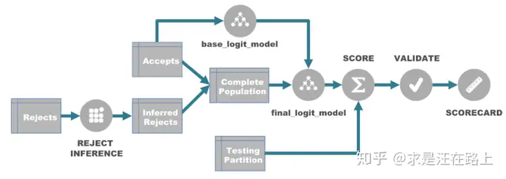

-   *Reject Inference* 拒绝推断：推断拒绝样本好坏标签，修正训练样本偏差
    -   说明
        -   旧模型拒绝样本无法获取贷后表现，只能通过拒绝推断估计坏账率
        -   拒绝推断适合放款率适中（50% 左右）场合
            -   放款率较高（90%+）时，训练样本偏差不明显，有足够代表性
            -   放款率较低（10%-）时，拒绝推断准确率较差，可能反而导致模型性能下降

-   *Data Method* 借助外部信息标签
    -   *Reject Acceptence* 捞回部分（旧）模型拒绝客户
        -   捞回客户选择应尽可能减少人工干预，确保捞回客户具有较好代表性
            -   过多人工干预，靠非量化因素筛选反而可能导致样本代表性下降，导致模型错估该类样本风险
            -   当然，为满足合规、降低风险，部分业务准入、专家经验 “硬规则” 可以用于排除 “硬准出” 样本
        -   为保证代表性，捞回样本风险更高，需要权衡短期业务风险、长期优化收益
        -   样本需要足够表现期，捞回工作需要提前规划
    -   *Cohort Performance* 同生表现：利用其他产品、机构客户表现数据标定好坏
        -   口径差异：好坏定义、时间窗口等可能不一致，需验证口径一致性
        -   数据源覆盖度有限，好标签可信度存疑
        -   数据获取成本、合规性
    -   *Reject Reason* 根据人工信审标注 **坏样本**

-   *Inference Methods* 根据放款样本、拒绝样本差异推断
    -   *Simple Augmentation* 简单扩增：硬切分拒绝样本扩充训练数据
        -   用放款样本训练模型，并对全量样本打分
        -   按评分对拒绝样本排序、设置切点、标定好坏扩充训练数据
            -   根据放款坏账率确定切点：拒绝样本坏账率应大于放款样本，根据业务经验可设置为 `2-4` 倍
        -   迭代训练直至模型打分基本稳定
    -   *Fuzzy Augmentation* 模糊扩增法：以模型预测概率加权、拆分拒绝样本扩充训练数据
        -   用放款样本训练模型，预测拒绝样本好、坏概率
        -   将拒绝样本翻倍为好、坏两组，以相应概率加权扩充训练数据
        -   迭代训练直至模型打分基本稳定
    -   *Reweighting* 重新加权
        -   用放款样本训练模型，对全量样本打分
        -   按评分对全量样本排序、分组，计算各组拒绝、放款样本数
        -   用分组总样本数、放款样本数比值对各组样本加权 $w = \frac {N_{acc} + N_{rej}} {N_{acc}}$
        -   用加权样本训练模型
    -   *Parcelling* 打包：在简单数据扩充基础上，多组划分随机打标扩充训练数据
        -   用放款样本训练模型，对全量样本打分
        -   根据打分将训练数据划分多组，计算各组训练数据坏样本比例
        -   按 **比例随机抽取** 拒绝样本划分好、坏标记，扩充训练数据
            -   根据放款坏账率确定切点：拒绝样本坏账率应大于放款样本，根据业务经验可设置为 `2-4` 倍
        -   迭代训练直至模型打分基本稳定
    -   *Bivariate Inference* 双变量推断、两阶段：将建模过程分为放款预测、好坏预测，预估拒绝样本坏账率用于加权
        -   全量样本训练放款模型，对全量样本打放款分
        -   放款样本训练逾期模型，对全量样本打逾期分
        -   全量样本按放款分等频分组，计算各组放款样本好、坏比例
        -   用各组放款分、好占比绘制散点图，按业务经验绘制期望趋势线
            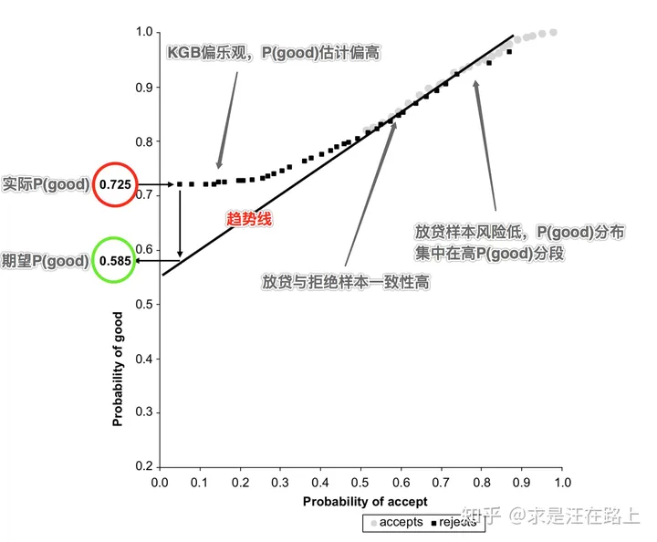
            -   高放款分段散点应与期望趋势线较接近，即放款预测、好预测一致
            -   低放款分段散点应与期望趋势线偏离，即好预测偏乐观，对低放款分段估计偏高
        -   使用低放款分段散点期望值、实际值作商得到拒绝样本坏账率修正比例
        -   在打包法中使用修正比例确定抽样比例

-   拒绝推断效果验证
    -   坏账率：模型回归测试，拒绝样本坏账率、放款样本坏账率应符合业务经验，通常在 `2-4` 倍
    -   单变量分析：添加拒绝推断样本后变量 *IV* 值上升
    -   灰度测试

> - 样本偏差与拒绝推断：<https://zhuanlan.zhihu.com/p/88624987>
> - 拒绝推断：<https://blog.csdn.net/baidu_39413110/article/details/106430745>

##  数据

### 数据质量

#### 样本（标签）质量

-   样本（标签）质量
    -   代表性（狭义）：训练样本应对总体有足够代表性，体现总体特征
        -   数理统计最基本逻辑链是通过样本推断总体，样本对总体代表性决定推断上限
        -   根据标目标客群、好坏比例采样、赋权
            -   简单随机抽样：保持内部真实客群、好坏比例
            -   客群分层抽样：适应不同客群
            -   好坏不等比抽样：建模之后再按权重还原，充分捕捉坏样本特征
    -   稳定性：样本客群应该足够稳定，受节假日、周期影响小
        -   样本稳定性决定推断结果稳定性
        -   稳定即按 *Vintage* 分组内分布稳定
            -   可用坏占比、*Lift* 值、*Odds* 等评估
    -   连续性：样本时间连续便于划分训练集、*OOT* 测试集，避免数据穿越

#### 变量（特征）质量

-   变量（特征）业务（非数理）质量
    -   *Compliant* 合规性：法律允许、来源可靠
    -   *Stable* 稳定性：数据采集、特征衍生稳定性
        -   数据源采集稳定是变量稳定性的基本前提
            -   变量是模型的基础，数据不稳定必然导致模型稳定性差
        -   变量稳定即变量 *Vintage* 分组内数据分布稳定
            -   可用两两计算 *PSI* 指标评估
            -   特别的缺失率、异常值率、固定值比率等也是稳定性的一部分
    -   *Available* 可得性：数据未来是否可以继续采集、计算
        -   涉及产品设计流程、用户授权协议、合规需求、模型应用环节
            -   业务流程更改导致埋点数据弃用、数据采集后移
            -   *RFM* 特征时间窗口支持
    -   *Interpretable* 可解释性：数据是否具有明确、清晰的业务含义，便于理解
        -   尤其是缺失值、异常值等特殊值含义
    -   *Logical* 逻辑性：不容易绕过，逻辑上应该被采用
    -   覆盖范围
        -   覆盖率、查得率：能匹配用户数 / 总用户数
    -   性价比：结合技术、业务效果、数据价格、计价方式综合计算

### 贷前数据

-   数据分类
    -   数据粒度：数据描述的主体层次，低粒度数据需聚合后才能使用
        -   客户粒度
        -   账户粒度
        -   事件粒度
            -   还款期次
            -   特殊事件
        -   渠道、金融专员、门店粒度
        -   行政区划
    -   数据时序
        -   时间序列数据
            -   还款流水数据
            -   信贷账户数据（人行征信）等
        -   面板数据
            -   进件行为数据等
    -   数据来源：数据来源影响数据可靠性
        -   业务收集数据
            -   客观信息：可通过资料佐证，无第三方欺诈情况下可信
            -   手填数据：不可信，可对这部分数据做交叉验证、关联关系，检查是否前后矛盾
            -   金融产品
            -   本次交易信息
            -   租赁物、抵质押物
            -   财报
        -   外部三方数据：三方平台根据自身业务场景所积累的数据，经脱敏加工后对外输出
            -   金融借贷
            -   消费
            -   社交网络
            -   出行、视频等其他网络行为
        -   权威公信数据
            -   人行征信数据
            -   公安、司法公开信息
            -   手机号状态：实名、本人所有、在网时长
            -   社保、公积金、税
            -   水、电、气用量
        -   设备行为、埋点数据：需结合业务逻辑制定埋点方案，采集信息、挖掘有用特征
            -   设备特征
            -   自有 App 行为数据
            -   用户 App 安装、内容、使用偏好
            -   环境、位置信息：弱金融属性数据，多用于交叉验证

> - 贷前风控策略总结：<https://www.lilso.cn/2024/07/31/dai-qian-feng-kong-ce-lue-zong-jie/>

####    基本信息

-   个人客户基本信息：来源于业务收集、人行征信
    -   超稀疏 ID 及关联网络
        -   身份证号
        -   手机号
        -   银行卡号
        -   配偶身份证号、手机号
        -   担保人身份证号、手机号
        -   联系人身份证号、手机号
    -   属性类：除部分客观可验证信息外，大部分为主观手填信息
        -   性别：男、女
        -   年龄：18、22、30、40、50
        -   婚姻状态：未婚、已婚、离异、其他
        -   收入：6W、12W、18W、24W、36W、48W、60W、100W
        -   居住类别：自有、自置、租房、借住、共同产权
        -   职业、职称
        -   所属行业：农业、工业、服务业
        -   学位、学历：初中及以下、高中、大专、本科、研究生
    -   稀疏 ID 聚集点：关联关系、聚集
        -   住址、籍贯
        -   工作单位、单位地址
        -   身份证行政区划、签发机关
        -   手机号归属地
        -   银行卡发卡行

-   法人客户基本信息
    -   超稀疏 ID 及关联网络
        -   统一社会信用代码
        -   所属行业
        -   实控人、法人代表身份证号、手机号
    -   属性类
        -   财报：营业额、利润率、流动比率、速动比率
        -   雇员人数、经营面积

####    交易信息

-   交易信息
    -   交易中介
        -   进件门店实控人、法人代表、经营地址
        -   渠道实控人、法人代表、备案区域
        -   进件提报人
    -   车辆信息
        -   VIN 码、发动机号
        -   品牌、车系、车型
        -   车类
            -   乘用车：轿车、SUV、MPV、LCV、其他
            -   商用车：载货车、客车、自卸车、牵引车、半挂车、其他
        -   车辆指导价、收车价、销售价
        -   车牌（所在地）、行驶里程、初登日期
        -   动力类型：油车、电车、混动、其他
    -   车况信息
        -   车况：事故车、泡水车、火烧车、调表车
        -   抵质押状态、违章状态、营运状态
        -   历史交易
    -   金融产品特征
        -   利率：3%、4%、5%、7%、9%、11%、13%、15%
        -   首付：1W、5W、10W、20W、30W、50W
        -   首付比例：%5、10%、20%、30%、40%
        -   融资额：5W、10W、20W、30W、50W、100W
        -   融资期限：12M、24M、36M、48M、60M
    -   进件时间
        -   进件时刻：9时前、9-12时、12-15时、15-18时、18时-21时
        -   自然粒度划分：日、周、月、年
        -   时间距今划分：近 1D、7D、15D、1M、2M、3M、6M、12M、18M、24M、36M、48M
        -   进件量距今划分：近 50单、100单、500单、1000单、3000单、5000单、10000单

####    非交易信息

-   个人客户历史金融借贷数据
    -   信贷账户情况
        -   非循环贷、信用卡、循环贷账户开立
        -   授信额度、已用额度、剩余额度、额度使用率
        -   信贷逾期、三方逾期黑名单
        -   房贷、车贷、月均还款
        -   人行评分、三方评分
    -   历史查询记录
        -   人行征信查询记录
        -   三方机构多头记录
    -   其他资负情况
        -   社保、公积金
        -   银行卡、支付宝、微信流水：收入、支出、收入来源、资金用途
        -   水、电、电信缴交情况
        -   中登网抵质押登记状态
            -   部分区域不允许车辆自物登记，债权人通过中登确保权力，中登是对抵质押的补充
        -   房产、金融资产

-   个人客户生活行为类数据
    -   应用认证：手机号微信账号认证、支付宝账号认证
    -   消费行为
        -   电商消费
        -   话费
        -   寿险保费
    -   出行行为数据：常去地点
    -   短信通道：识别内容，提取放款、逾期、催收等特征
    -   支付通道：通过支付代扣记录，提取用户收入、支出等现金流
    -   手机输入法：识别内容，提取全方位信息

#### 公开信息

-   司法被执行人信息：严重程度 `失信 > 限高 > 被执行`
    -   被执行
    -   限高：被执行人未履行给付义务时，法院采取措施限制高消费
        -   限高执行人除非违反消费禁令或其他规定，不会被失信
        -   单位被限高时，法人代表、高管也同时被限高
    -   失信：将被执行人名单纳入失信名单，进行信用惩戒
        -   失信被执行人同时会被限高
        -   单位失信时也会被限高，此时法人代表、高管不会被失信但被限高

> - “失信” 和 “限高”：<https://www.tiantailaw.com/CN/05-24274.aspx>

####    设备收集信息

-   设备特征、环境信息：弱金融属性数据，多用于交叉验证
    -   是否 *root*、*hook*
    -   品牌、价格、操作系统
    -   系统文件完整性、是否恢复出厂设置：是否为实体手机、一键新机、二手手机
        -   欺诈更倾向于使用二手手机
    -   传感器参数：是否为实体手机
        -   角度传感器
        -   压力传感器
    -   电压、电量：手机电压、电量呈上升趋势，表示账户资金需求更急迫
    -   网络类型、*WIFI* 名称
        -   网络类型：*WIFI/4G/3G*
        -   *WIFI* 名称是否命中风险关键词
    -   *LBS* 位置、*IP* 位置信息：可以降低观察精度保证容错率
        -   所处地理位置：常用于一致性校验
            -   是否为城市、数据中心
            -   *LBS* 位置、*IP* 归属地、手机号归属地等地址一致性
            -   工作时间、非工作时间等不同时间段位置
        -   相同位置、*IP*、*MAC* 地址申请数量

-   用户内容偏好
    -   App 安装列表、使用时长
    -   内容点击率、浏览时长

-   App 使用活动轨迹：取决于埋点的精细程度，可作为欺诈模型参数参与训练
    -   申请时间：夜间申请
    -   *User-agent*、代理
    -   App 行为埋点：点击次数、退出、粘贴、截图、身份证提交次数、登录设备数
        -   申请前操作次数过低：对产品了解，意图明显
        -   授信后点击次数过高：对产品有犹豫
        -   正常申请流程中较少存在中途退出申请的必要，中介需多次切换应用、复制粘贴
    -   -   中介更有可能截图制作教程、展示流程等
    -   时间间隔
        -   注册、登录、申请各步骤、用信等各阶段用时
        -   上次申请、本次申请时间间隔

> - 利用埋点进行数据采集：<https://zhuanlan.zhihu.com/p/53812343>

####    内部信贷行为

-   申贷行为：申请人粒度
    -   历史申贷记录
        -   审批阶段：初审拒绝、资审待提报、资审流程中、资审拒绝、人工信审拒绝、订单失效、已放款
        -   审批标签
            -   手机号异常：非本人、在网时间短
            -   命中公检法名单
            -   外部三方数据异常
            -   产品条件禁入
            -   人行信贷记录逾期
            -   人行查询记录异常
            -   内部关联网络
            -   内部逾期记录
            -   综合评分异常
        -   首笔放款时间
        -   最近放款时间
    -   贷前、贷后申贷行为
        -   失联、用户登录
    -   授信额度使用率

-   还款、催收：账户粒度
    -   首期逾期
        -   *FPD*、*SPD*、*TPD*、*HPD*
        -   *DPD*：1D、3D、15D、30D
    -   逾期
        -   历史最大逾期：C、M1、M2、M36、M6+
        -   历史最大连续逾期：0、1、2、3、6
        -   历史逾期期次和：0、1、3、5、10、20
        -   历史逾期期数和：0、1、3、5、10、20
        -   当前逾期：C、M1、M2、M36、M6+
        -   历史最大逾期金额：500、1000、2000、5000、10000
    -   还款
        -   近期最大还款额：500、1000、2000、5000、10000
        -   最近还款时间
        -   拆分扣款：资金紧张
        -   提前还款：资金充足、重视信用记录
    -   催收
        -   短信催收
        -   电催

### 数据衍生

-   数据衍生：基于数据特点，结合业务逻辑、数据采集逻辑，人工构建特征提高信息密度、对齐数据粒度
    -   *ID* 特征：身份证号、手机号、统一代码、VIN 码等超稀疏特征
        -   作为节点建立关联关系网络，应用聚集函数
        -   一致性校验
    -   *类别 ID* 特征：居住地、单位地址、进件渠道等稀疏特征
        -   作为节点建立关联关系网络，应用聚集函数
        -   分组归类减少取值数量
        -   特征交互衍生
        -   一致性校验
    -   定性、布尔特征：性别、婚姻状况等分类特征，被执行、失信等布尔特征
        -   特征交互衍生
    -   定量特征：年龄、逾期数、逾期金额
        -   分组离散化
        -   特征交互衍生
-   说明
    -   一致性校验可视为低粒度特征聚集，或同粒度类似特征交互
    -   *ID* 特征、*类别 ID* 特征区别在于取值数量多寡、特异性
        -   取值数量多则特异性强，其本身不适合直接作为分类特征使用（数值化效果不好，不方便后续分析）
        -   取值数量少则特异性弱，可通过分组归类作为分类特征

####    低粒度特征聚集

-   常用聚集项聚集逻辑：过滤项（分组项）选择依赖具体分析目标
    -   金额、数量、天数等定量特征
        -   作为数值型：均值、比例、方差（标准差、变异系数）、趋势（时序）
        -   作为顺序型：TopK、TopK 占比、分位数、最大值、最小值
        -   插板分组作为分类特征：计数、计数比例、连续长度（时序）、段落数（时序）
    -   订单、账户、身份证号、手机号等分类特征：计数
    -   日期、时间
        -   转换为（距今）时间间隔日、月、季、年作为数值型处理
        -   切分为月、季、年作为分类型处理
        -   插板计数作为数值型处理
    -   逾期状态、五级分类等有序状态：顺序编码后衍生顺序统计量

####    关联网络（知识图谱）

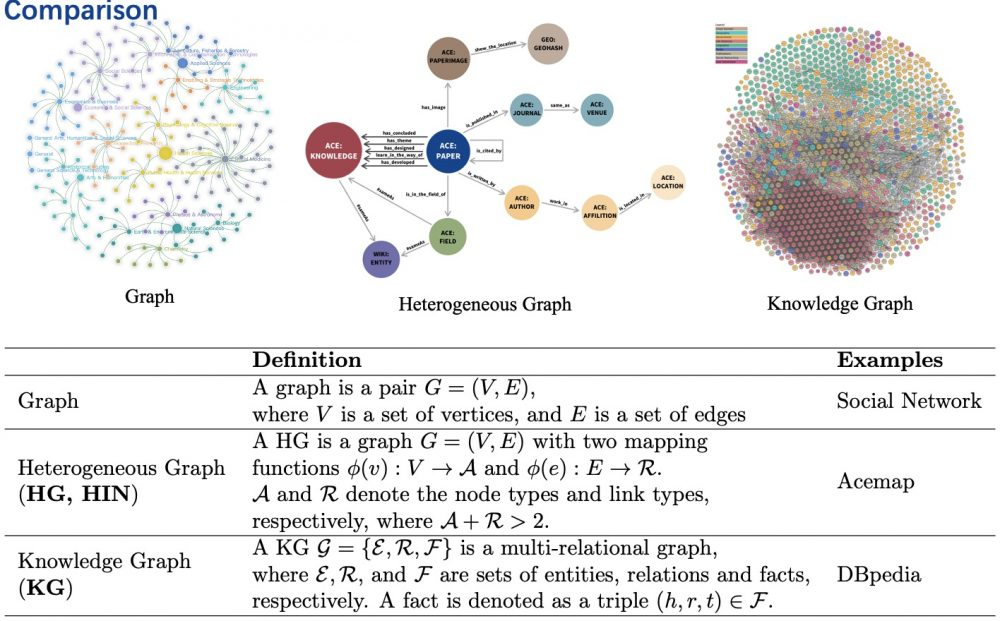

-   从维度模型角度看关联网络图谱构建，即顶点、边、属性选择
    -   维度表描述实体，表中记录对应图中顶点
        -   不同维度表对应不同类型实体
        -   每条记录对应实体，即图中顶点
        -   各列为实体属性
    -   事实表描述实体间关系，表中记录对应图中的边
        -   不同事实表对应不同类型关系
        -   每条记录对应关系，即图中边
        -   各列为关系属性
-   关联网络构建方式 **应根据需求设计**，重点关注场景中考察的实体、关系
    -   理论上，每个实体、属性（实体表中每列）都可以独立类型顶点加入图谱
        -   即，将属性值视为独立实体，实体具有某种属性视为某种关系
        -   但，可能仅会带来低特异性顶点、无意义边，提升网络复杂度
    -   关联网络图谱为异质图，其中顶点、边（无权重）有类型区分，经典图算法可能不适用
        -   对重复边，可用边属性避免重图，或者直接放弃对关系类型的区分
        -   对节点，可考虑仅使用本体性节点建图

> - 基于金融知识图谱的会计欺诈风险识别方法：<https://www.infocomm-journal.com/bdr/article/2021/2096-0271/2096-0271-7-3-00116.shtml>
> - 知识图谱中的结构信息建模：<https://www.omegaxyz.com/2021/06/17/kg_structure_modeling/>
> - 搭建知识图谱，赋能信贷业务：<https://blog.csdn.net/baidu_39413110/article/details/123142066>

#####   图谱设计

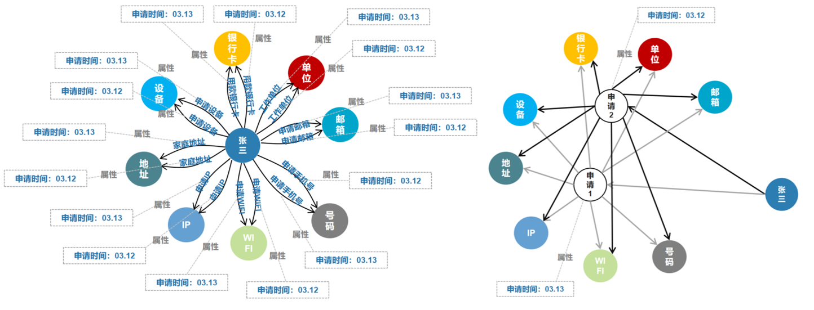

-   关联网络图谱节点、边、属性设计
    -   节点
        -   个体（身份证号）
        -   手机号、座机号
        -   行政区划、地理位置
        -   单位、公司名称
        -   交易车商、业务员
        -   *VIN* 码
        -   银行卡：银行卡号、银行卡号前缀、发卡行
        -   *MAC* 地址、*IP* 地址
        -   订单、事件：事件节点可以简化实体节点之间的关系
            -   方便刻画循环贷、多次用信等高频事件场景
            -   但，会导致网络膨胀、关联路径延长
    -   关系：来源于申请信息、人行征信记录
        -   手机号关系：自用、主动关联个体使用、被动关联个体使用
        -   个体关系：配偶、亲属、联系人、担保关系
        -   人地关系
            -   手填：住址、籍贯、户籍、单位地址
            -   衍生：身份证区划、手机号归属地、银行卡发卡行
            -   设备：设备收集 *LBS* 地址、*IP* 归属地
            -   交易备案：线下交易地址、中介备案地址
        -   人车关系：交易、抵质押
        -   人企关系
            -   工作单位、配偶工作单位
            -   社保、公积金缴交单位
        -   人商关系：交易
        -   人卡关系：划扣卡、主动打款卡
        -   网络、设备关系：申请、用信时设备收集
    -   属性：未在网络中作为节点体现的信息
        -   个体节点属性
            -   个体基本属性：年龄、收入、职业等
            -   业务交易属性：订单、时间、交易标的、金融产品等
            -   信贷行为
            -   公开信息
            -   生活行为
        -   关系属性
            -   关系类型：如上
            -   关系建立时间
            -   关联来源：申请手填、人行提供、设备收集、特征衍生

> - *IP* 地址可以比较容易变动，相同 *IP* 地址不一定存在关联关系
> - 名称、地理位置等无固定格式数据需要大量前置标准化工作

#### 数据经验估计

-   月收入估算
    -   月均话费 `* [60, 120]`
    -   寿险保单年缴费 `* [2, 4]`
    -   房贷月还款 `* [2, 4]`：房价越高系数越小
    -   车贷月还款 `* [2, 5]`
    -   公积金缴存基数 `* [1, 6]`：取决于工作单位类型
    -   支付宝、微信、银行流水
        -   对银行流水，若明细中有 *摘要* 判断收入类型，可直接计算工资性收入
        -   月均支出 `* [0.5, 6]`
        -   月均收入 `* [0.2, 1]`：系数取决于工作类型
        -   说明
            -   计算收入时，注意排除刷单
            -   微信、支付宝流水可划分转账、红包、余额宝、二维码类型，收入可只选取某类计算
    -   信用卡平均额度 `/ [2, 4]`：账龄越长分母越小，可按 12 个月、24 个月划分取分母为 2、3、4

### 资产质量分析

#### 指标口径

-   *Performance Window* 表现期：定义好坏标签的时间窗口
    -   风险需通过一定时间窗口才能表现，即信贷风险具有滞后性
        -   表现期越长信用风险暴露越彻底
        -   但，也意味着观察期离当前越远，建模样本和未来样本差异越大
    -   应当选择合适的表现期以 **覆盖足够多的坏客户**
        -   对信用卡场景的稳定客群、长期限产品，可用滚动率、账龄分析确定表现期、好坏
        -   对小额信贷产品，实务中一般结合产品期限沿用常用指标，如：表现期设置为产品期限一半

-   观察口径
    -   *Month on Book* 账龄：账户持续时间（月份数）
        -   统一观察点账龄：保证账户观察时点完全相同，但可能导致账户表现期不同（开立时间不同时）
            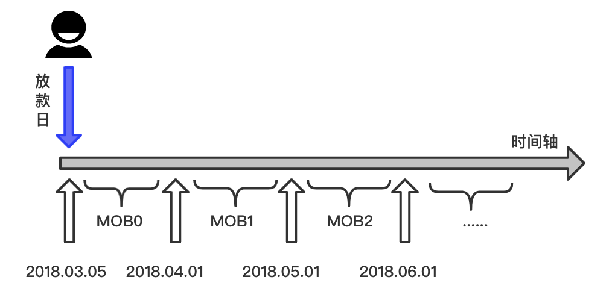
            -   *MOB0*：放款日至当月月底
            -   *MOB1*：放款后第二个完整月份
            -   *MOB2*：放款后第三个完整月份
        -   统一表现期账龄：保证账户表现期相同，但可能导致账户观察时点不同（开立时间不同时）
            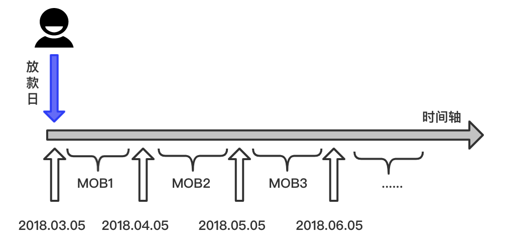
            -   *MOB1*：放款日开始30天
            -   *MOB2*：放款日开始30天至60天
    -   账户观察期末、期内、历史表现
        -   期末表现：观察期末时点账户表现
            -   体现账户观微时点状态，可能掩盖观察期内逾期情况
        -   期内表现：观微期内（上次、本次观察期末之间）账户（最差、逾期）表现
            -   体现 **观察期内** 逾期情况，但不是时点值
            -   观察期内最差表现不会被掩盖
        -   历史表现：观微期末时点前所有时间内账户表现
    -   说明
        -   上述观察口径假定为按日更新、按月还款的账户，其他情形需额外讨论

-   *Payment Delinquency* 逾期口径
    -   *Day Past Due*、*DPDx* 逾期天数：账户根据逾期天数划分阶段
        -   *C*、*M0*：当前未逾期
            -   对信用卡场景而言，*M0* 为账单日到还款日之前
            -   对信贷场景，*M0* 没有对应时间段
        -   *M1*：*DPD1 - DPD30*
        -   *M6*：逾期 151-180 日
        -   *M7*：逾期 180 日以上
            -   *M7* 一般即认为坏账
    -   逾期时点
        -   *First Payment Delinquency*、*FPDx* 首期逾期（天数）
    -   逾期率
        -   逾期率口径常用
            -   账户口径逾期率 = 逾期账户数 / 总账户数
            -   剩余本金口径逾期率 = 逾期账户剩余本金 / 全部剩余本金
        -   按观察期末、期内、历史划分，逾期率同样有类似口径划分，其中常用的有
            -   期内账户口径逾期：反映贷前准入效果
            -   期末剩余本金口径逾期：体现当前整体资产质量
    -   五级分类：正常、关注、次级、可疑、损失
        -   不良率 = (次级+可疑+损失) / 总
        -   次级、可疑、损失在银行内有明确规定，但不完全按照逾期天数划分
        -   同体系内内比较不良可行，但和不同体系间没有可比较性

> - 商业银行金融资产风险分类办法：<https://www.gov.cn/zhengce/2023-02/11/content_5750184.htm>

####    *Vintage Analysis*

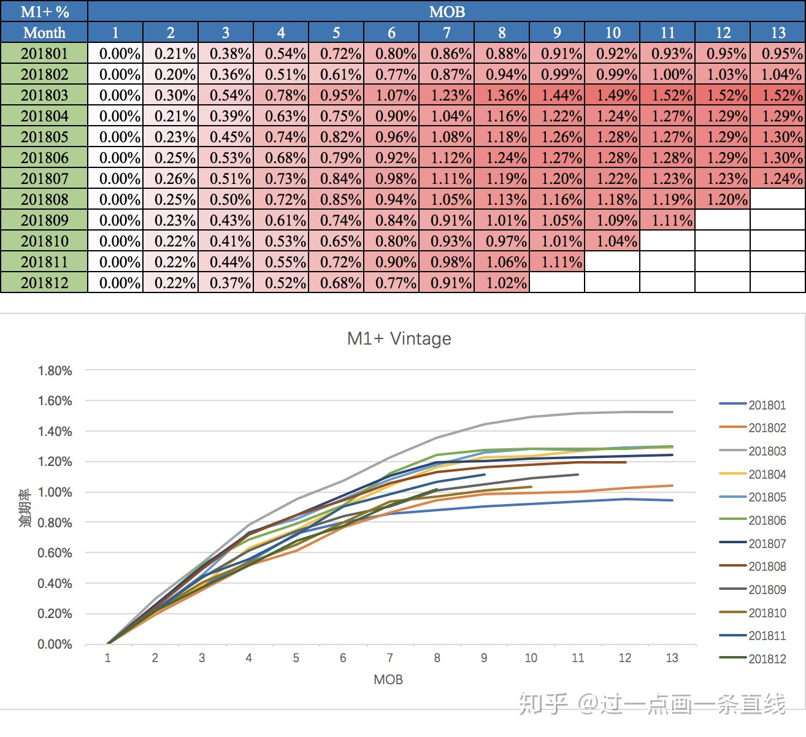

-   账龄分析：对不同时点资产分别跟踪，按照账龄长短对齐后对比，分析不同时点贷款贷后质量
    -   资产分批（账户开立时间）：假设同批次资产质量差异不大，对比不同批次逾期情况
        -   分析不同版本策略效果、不同批次资产质量
            -   风控策略收紧、放松
            -   客群变化
            -   市场环境
            -   政策法规等
    -   对齐账龄：分析逾期情况随账龄变化情况
        -   确定账户成熟期、稳定期，预估资产质量
            -   以逾期率趋于稳定所需时间作为判断客户好、坏区分所需时间
            -   以曲线平缓处对应逾期率衡量资产质量
        -   分析策略效果
            -   前几期逾期率上升快：短期风险未能控制，欺诈风险高
            -   曲线一直上升：信用风险识别能差
    -   口径说明
        -   账龄分析中逾期常用期内账户口径逾期，取值偏大，风险暴露更充分

> - *Vintage*：起源于葡萄酒品质分析，*vintage* 即指代葡萄酒的批次标签，每年对各批次抽样、记录即得到 *vintage* 曲线

####    *Roll Rate Analysis*

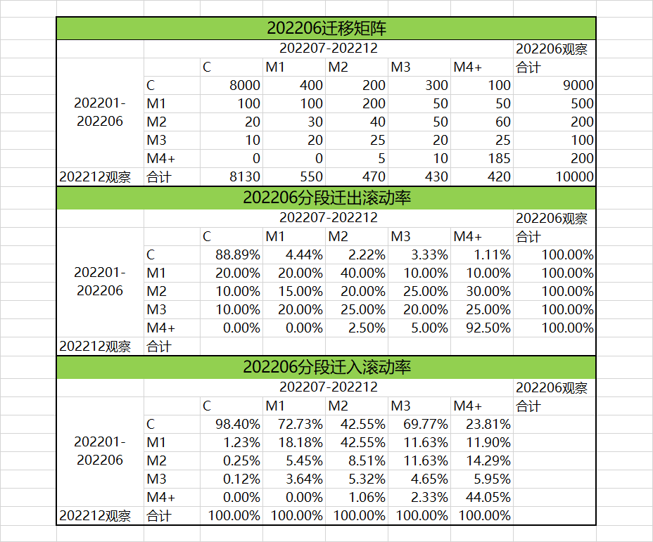

-   滚动率分析：计算违约程度（逾期）的状态转移矩阵（滚动率矩阵），分析违约程度变化规律
    -   口径说明
        -   逾期状态定义：考虑业务实际、数据情况，逾期状态可能不会覆盖 *M1-M7* 全部，可设置 *M3+* 状态
            -   前向滚动：逾期阶段更高
            -   后向滚动：逾期阶段变好、不变，即有还款行为
        -   逾期口径：常用账户口径
            -   连续的两段时期内历史最大逾期状态
            -   两端点期内逾期状态
        -   滚动率分母：一般默认取迁出
            -   迁出滚动率：起始状态作为分母，体现不同阶段资产变化情况
            -   迁入滚动率：终止状态作为分母，体现不同阶段资产来源情况
    -   滚动率矩阵体现不同阶段账户的状态转换情况，根据不同阶段滚动率绝对值、变化情况
        -   确定好坏客户标准：选择前向滚动率较高的阶段作为好坏划分点
        -   评估催收效果，评估催收方案
    -   按月计算当月大盘迁徙率：监控大盘风险变化
        -   各月迁徙率可体现当月大盘整体风险
        -   其中，*M0-M1* 迁徙率最需关注，基数大、波动意义明确

> - *Roll Rate Analysis*：<https://www.pickl.ai/blog/roll-rate-analysis-unveiling-insights-into-financial-dynamics/>
> - 滚动率与迁徙率：<https://www.lilso.cn/2023/10/29/gun-dong-lu-ji-qian-xi-lu/> 两端点期内逾期状态
> - 信贷风控中 *Vintage*、滚动率、迁徙率的理解：<https://zhuanlan.zhihu.com/p/81027037> 连续两段时期内历史最大逾期
> - *Vintage* 分析、迁徙率、滚动率、入催率：<https://www.jianshu.com/p/cedb68205c37>

####    *Flow Rate Analysis*

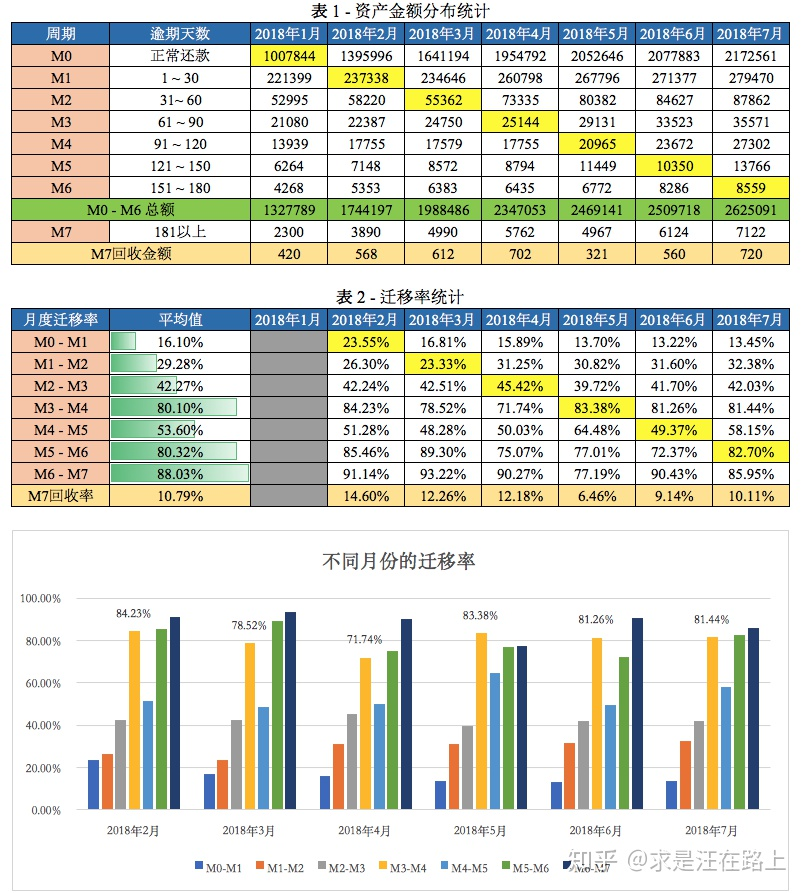

-   迁徙率分析：利用违约程度（逾期）变化计算迁徙率，分析违约程度变化规律
    -   *Flow Rate* 迁徙率 = 前等级逾期金额到下一等级逾期金额的转化率
        -   即，资产质量下滑的比例，反映资产大盘的走势
        -   常用期末余额口径
            -   *M0-M1* = 当月末 *M1* 余额 / 上月末 *M0* 余额
            -   *M1-M2* = 当月末 *M2* 余额 / 上月末 *M1* 余额
    -   迁徙率被可视为滚动率特例，即迁徙率仅关注逾期状态 **恶化**，即次月、前向滚动
        -   对信用卡、循环贷等非固定还款计划场景，账户必转换为恶化、还清之一，不存在中间状态
        -   对非循环贷等固定还款计划场景，除恶化、还清外，好转（归还部分期应还）、不变（归还 1 期应还）状态被归为未恶化
        -   除滚动率应用之外，迁徙率累乘可预测不同逾期阶段资产损失概率，用于计提拨备

> - 滚动率与迁徙率：<https://www.lilso.cn/2023/10/29/gun-dong-lu-ji-qian-xi-lu/>
> - 信贷风控中 *Vintage*、滚动率、迁徙率的理解：<https://zhuanlan.zhihu.com/p/81027037>
> - *Vintage* 分析、迁徙率、滚动率、入催率：<https://www.jianshu.com/p/cedb68205c37>

####    *Expected Loss*

-   *Expected Loss* 预期损失
    $$ EL = PD * LGD * EAD $$
    -   *Probabilty of Default* 违约概率：账户的违约概率
        -   可以把对应逾期状态至呆账状态，各状态间迁移率链式相乘得到违约概率
        -   资产质量越差，违约概率越高
    -   *Loss Given Default* 违约损失率：账户违约后，能够回收的本金比例
    -   *Exposure at Default* 违约风险敞口：账户违约后，暴露在风险中头寸
    -   *Bad Debt Reserve* 坏账准备金/拨备：把未偿清金额按照一定准备金比例储备，用于覆盖预期的未来呆账损失
        -   应该等于预期损失

##  人行征信数据

-   人行征信数据分区
    -   个人基本信息
    -   信息概要
    -   信贷交易信息明细
    -   非信贷交易信息明细：后付费业务欠费信息
    -   公共信息明细
        -   欠税记录
        -   民事判决记录
        -   强制执行记录
        -   行政处罚记录
        -   住房公积金参缴记录
        -   低保救助记录
        -   职业资格记录
        -   行政奖励记录
    -   本人声明
    -   异议标注
    -   查询记录

### 二代报告结构

| 标记  | 数据段、块 | 数据段、块描述                                        |
|-------|------------|-------------------------------------------------------|
| `PRH` | `PA01`     | 2.1 报告头                                            |
| `PIM` | `PB01`     | 2.2.1 身份信息                                        |
| `PMM` | `PB02`     | 2.2.2 配偶信息                                        |
| `PRM` | `PB03`     | 2.2.3 居住信息                                        |
| `POM` | `PB04`     | 2.2.4 职业信息                                        |
| `PSM` | `PC01`     | 2.3.1 数字解读                                        |
| `PCO` | `PC02`     | 2.3.2 信贷交易信息提示                                |
|       | `PC02A`    | 2.3.2.1 借贷交易信息提示 - 按业务类型汇总             |
|       | `PC02B`    | 2.3.2.2 违约信息概要 - 被追偿信息                     |
|       | `PC02C`    | 2.3.2.2 违约信息概要 - 呆账信息汇总                   |
|       | `PC02D`    | 2.3.2.2 违约信息概要 - 逾期（透支）信息汇总           |
|       | `PC02E`    | 2.3.2.3 授信及负债信息概要 - 非循环贷账户信息汇总     |
|       | `PC02J`    | 2.3.2.3 授信及负债信息概要 - 循环额度下分账户信息汇总 |
|       | `PC02G`    | 2.3.2.3 授信及负债信息概要 - 循环贷账户信息汇总       |
|       | `PC02H`    | 2.3.2.3 授信及负债信息概要 - 贷记卡账户信息汇总       |
|       | `PC02I`    | 2.3.2.3 授信及负债信息概要 - 贷记卡账户信息汇总       |
|       | `PC02K`    | 2.3.2.3 授信及负债信息概要 - 相关还款责任信息汇总     |
| `PNO` | `PC03`     | 2.3.3 非信贷交易信息概要                              |
| `PPO` | `PC04`     | 2.3.4 公共信息概要                                    |
| `PQO` | `PC05`     | 2.3.5 查询记录概要                                    |
| `PDA` | `PD01[]`   | 2.4.1 借贷账户信息                                    |
|       | `PD01A`    | 2.4.1 借贷账户信息 - 基本信息                         |
|       | `PD01B`    | 2.4.1 借贷账户信息 - 最新表现信息                     |
|       | `PD01C`    | 2.4.1 借贷账户信息 - 最近一次月度表现信息             |
|       | `PD01D`    | 2.4.1 借贷账户信息 - 最近24个月还款状态信息           |
|       | `PD01E`    | 2.4.1 借贷账户信息 - 最近5年内的历史表现信息          |
|       | `PD01F`    | 2.4.1 借贷账户信息 - 特殊交易信息                     |
|       | `PD01G`    | 2.4.1 借贷账户信息 - 特殊事件                         |
|       | `PD01H`    | 2.4.1 借贷账户信息 - 大额专项分期信息                 |
| `PCA` | `PD02`     | 2.4.3 授信协议信息                                    |
| `PCR` | `PD03`     | 2.4.2 相关还款责任信息                                |
| `PND` | `PE01`     | 2.5 非信贷交易信息明细                                |
| `POT` | `PF01`     | 2.6.1 欠税记录                                        |
| `PCJ` | `PF02`     | 2.6.2 民事判决记录                                    |
| `PCE` | `PF03`     | 2.6.3 强制执行记录                                    |
| `PAP` | `PF04`     | 2.6.4 行政处罚记录                                    |
| `PHF` | `PF05`     | 2.6.5 住房公积金参缴记录                              |
| `PBS` | `PF06`     | 2.6.6 低保救助记录                                    |
| `PPQ` | `PF07`     | 2.6.7 执业资格记录                                    |
| `PAH` | `PF08`     | 2.6.8 行政奖励纪录                                    |
| `POS` | `PG01`     | 2.7 标注及声明信息单元                                |
| `POQ` | `PH01`     | 2.8 查询记录                                          |

-   二代征信报告 JSON 格式报文中最终字段总为 8 字符长度，可分为 6 块
    -   *C1* 总为 `P`
    -   *C2* 单个字符 `A-Z` 标识数据类别
        -   `A`：报告标识头
        -   `B`：基本信息段
        -   `C`：报告信息概要：5 年内信息统计
        -   `D`：借贷交易信息明细：保留近 5 年
        -   `E`：非信贷交易信息明细
        -   `F`：公共信息明细
        -   `G`：异议标注及说明信息
        -   `H`：查询记录：保留近 2 年
    -   *C3-C4* 两位数字 `0-9` 标识各数据类中数据段
    -   *C5* 单个字符 `0A-Z` 标识数据段中各数据块
        -   `0`：无其他数据数据子块、字段直属于此数据块时占位
        -   `A-T`：数据段位序
        -   `Z`：标注及声明信息子块
    -   *C6* 单个字符 `A-Z` 标识字段类型
        -   `D`：枚举类型（编码类型）
        -   `J`：金额（整型）
        -   `S`：统计计数（整型）
        -   `R`：日期类型
        -   `I`：编号（数字字母串）
        -   `Q`：描述、详情（字符串）
        -   `H`：列表
    -   *C7-C8* 两位数字 `0-9` 标识字段在数据块中顺序，按数据类型从 `01` 开始编号

-   取值说明
    -   日期类取值说明
        -   `2099-12-31` 表示长期有效
        -   `0000-00-00` 表占位
    -   占位符（除空外）：`--`
    -   金额类（例如额度、金额等）数据项的取值一般均已统一折算为人民币元
        -   但，当个人作为企业相关还款责任人时，*还款责任金额* 的取值是实际币种对应的金额，在信息概要中进行汇总展示时，会按照查询信用报告时的汇率折算为人民币

### 信贷详情信息

-   信贷账户详细信息是人行征信内容主体，涉及段如下
    -   `PDA:PD01[]` 信贷账户信息单元：借贷交易最小独立主体
        -   账户类型
            -   *C1* - 催收账户（被追偿信息）：第三方为主体代偿后向主体追偿
            -   *D1* - 非循环贷账户
            -   *R1* - 循环贷账户
            -   *R2* - 贷记卡账户：信用卡账户
            -   *R3* - 准贷记卡账户：借记卡和贷记卡的综合体（存贷合一卡）
            -   *R4* - 循环额度下分帐户：授信额度循环，但每笔（账户）独立还款（类似场景贷）
        -   可根据账户数据构建统计指标
            -   账户内截面数据
                -   账户状态、账户类型、开立时点、账户数量
                -   授信额度、用信额度（比例）
            -   账户内时序数
                -   还款流水：逾期金额、逾期期数（当前、历史、连续、累计）
            -   特殊交易、特殊事件
    -   `PCA:PD02` 授信协议信息单元：主体从数据提供机构获得的授信额度信息的载体
    -   `PCR:PD03` 相关还款责任信息带院

| 信贷账户信息内容   | 信息段         | 适用账户     | 未激活 | 持续更新 | 关闭 | 呆账 |
|--------------------|----------------|--------------|--------|----------|------|------|
| `PDA:PD01[]:PD01A` | 基本信息       | 所有账户     | 必有   | 必有     | 必有 | 必有 |
| `PDA:PD01[]:PD01B` | 最新表现       | 所有账户     | 必有   | 必有     | 必有 | 必有 |
| `PDA:PD01[]:PD01C` | 最近月度       | 除 *C1* 账户 | 无     | 必有     | 无   | 无   |
| `PDA:PD01[]:PD01D` | 近 24 个月还款 | 除 *C1* 账户 | 无     | 可能     | 可能 | 可能 |
| `PDA:PD01[]:PD01E` | 近 60 个月还款 | 除 *C1* 账户 | 无     | 可能     | 可能 | 可能 |
| `PDA:PD01[]:PD01F` | 特殊交易       | 所有账户     | 无     | 可能     | 可能 | 无   |
| `PDA:PD01[]:PD01G` | 特殊事件       | *D1R2* 账户  | 无     | 可能     | 无   | 无   |
| `PDA:PD01[]:PD01H` | 大额专项分期   | *R2* 账户    | 可能   | 可能     | 可能 | 可能 |

-   说明事项
    -   日期类取值说明
        -   `2099-12-31` 表示长期有效
        -   `0000-00-00` 表占位
    -   占位符（除空外）：`--`
        -   `PD01AJ03` *共享授信额度*，对 *R23* 账户仅取 `--`
        -   `PD01AS01` *还款期数*
        -   `PD01AD10` *债权转移时还款状态*
        -   `PD01CR02` *本月应还款日* 仅取 `--`
        -   `PD02AI04` *授信限额编号*
        -   `PD02AJ03` *授信限额*
        -   `PD02AJ04` *已用额度* 仅取 `--`、0

####    账户基本信息

| 字段名     | 含义               | 账户可见性 | 备注                                              | 数据核验结果                         |
|------------|--------------------|------------|---------------------------------------------------|--------------------------------------|
| `PD01AD01` | 账户类型           | all        |                                                   | 非空                                 |
| `PD01AD02` | 业务管理机构类型   | all        |                                                   | 非空                                 |
| `PD01AD03` | 业务种类           | 除R3       |                                                   | 非空                                 |
| `PD01AD04` | 币种               | 除C1       |                                                   | 除R23外无非本币                      |
| `PD01AD05` | 还款方式           | D1,R1,R4   | “90-不区分还款方式”表汇总报送账户，不区分还款方式 | 所有D1状态均有空值                   |
| `PD01AD06` | 还款频率           | D1,R1,R4   | 还款方式为“90-不区分还款方式”时，返回“03-月”      | 非空                                 |
| `PD01AD07` | 担保方式           | 除C1       |                                                   | 大量空值                             |
| `PD01AD08` | 贷款发放形式       | D1         |                                                   | 大量空值                             |
| `PD01AD09` | 共同借款标志       | D1,R1,R4   |                                                   | 非空                                 |
| `PD01AD10` | 债权转移时还款状态 | C1         |                                                   | 非空，有取 `--`                      |
| `PD01AI01` | 账户编号           | all        | 报告内唯一，非本机构账户为空                      | 全空，已重新赋值                     |
| `PD01AI02` | 业务管理机构代码   | all        | 非本机构为空                                      | 存在D1取空                           |
| `PD01AI03` | 账户标识           | 除C1       | 征信系统内全局唯一，非本机构账户为空              | 非本机构实际取 `******`              |
| `PD01AI04` | 授信协议编号       | 除C1       | 报告内唯一                                        | 大量空值                             |
| `PD01AJ01` | 借款金额           | D1,R4,C1   |                                                   | 非空                                 |
| `PD01AJ02` | 账户授信额度       | R1,R2,R3   |                                                   | 非空                                 |
| `PD01AJ03` | 共享授信额度       | R2,R3      | 在授信机构内的共享授信额度                        | 非空，R23均有取 `--`                 |
| `PD01AR01` | 账户开立日期       | all        |                                                   | 非空                                 |
| `PD01AR02` | 账户到期日期       | D1,R1,R4   | D1R4指最后还款期；R1指额度有效期；“结清”账户为空  | 仅有关闭账户取空                     |
| `PD01AS01` | 还款期数           | D1,R4      | 非分期还款账户返回空                              | 非空，R1始终取 `--`，D1R4可取 `--`   |

####    说明：R2基本信息

-   *R2* 账户账户类型、额度
    -   `PD01AD03 == "82"` *业务类型* 为 *大额专项分期卡*
        -   *大额专项分期卡* 授信额度一般为 0
        -   但，部分机构开立账户时会直接报 `81` *贷记卡*，同时置 `PD01AJ02` *授信额度* 为 0 作为 “伪大额专项分期卡”
    -   `PD01AJ03` *共享授信额度* 指该 *R2* 账户与其他账户共享的授信额度
        -   `PD01AD04` *授信协议编号* 非空时，*共享授信额度* 始终为 `--`
            -   即，授信额度应由授信协议确定
            -   共享额度的账户归属同一份授信协议，额度被统一处理
        -   `PD01AD04` *授信协议编号* 为空时，*共享授信额度* 可能取 `--`、0、非 0 值
            -   账户授信额度由此字段决定（推测为一代征信中授信协议信息未分开报送遗留问题）
            -   账户取 `--`、0 时表示该账户与其他账户的共享授信额度在其他账户上体现（即简单加总即可得到额度和）
            -   事实上，存在同一机构下有 2 个 `PD01AD04 > 0` 账户，即可视为有 R2 账户独立授信
        -   `PD01AJ02` *账户授信额度*、`PD02AJ03` *共享授信额度* 未作校验
            -   *授信额度* 不一定小于 *共享授信额度*
            -   *授信额度* 不可直接加总估计总授信额度，常见即多币卡在报告中体现为多个账户，共享授信额度、已用额度
                -   依 `PD01AD04 == "CNY"` *币种* 剔除非本币账户
                -   依 `PD01AI03` *授信协议标识* 去重
                -   另外，也可以用 *授信协议* 中 `PD02AJ01` *授信额度* 计算额度
    -   信用卡额度说明
        -   白金卡：额度一般在 10W 以上，年费 `400-1000`，免年费一般需要年消费达到 10W
        -   非白金卡：额度一般在 5W 以下，年费为 `0` 或满足一年 `4-8` 笔消费即可

####    账户月度表现

| 字段名     | 含义                            | 账户可见性  | 备注                                                              | 数据核验结果                      |
|------------|---------------------------------|-------------|-------------------------------------------------------------------|-----------------------------------|
| `PD01CD01` | 最近月度_账户状态               | 除C1        |                                                                   | 非空                              |
| `PD01CD02` | 最近月度_五级分类               | D1,R1,R4    |                                                                   | 非空                              |
| `PD01CJ01` | 最近月度_账户余额               | 除C1        | 非R2指本金；R2包括已出单、未出单、利息、费用等                    | 非空，存在逾期账户余额非 0        |
| `PD01CJ02` | 最近月度_已用额度               | R2          | 占用循环额度部分（包含已占用但未出单部分）                        | 非空                              |
| `PD01CJ03` | 最近月度_未出单大额专项分期余额 | R2          | 未出单：未在账单中体现部分                                        | 非空，有取 `--`                   |
| `PD01CJ04` | 最近月度_本月应还款             | D1,R1,R2,R4 | D1R41到期前指月度应还总额，到期后指欠款总额，R2指出单日最低还款额 | 非空                              |
| `PD01CJ05` | 最近月度_本月实还款             | 除C1        | 两个月结日、账单日实际还款额总和，即可以大于应还，尤其是R2        | 非空                              |
| `PD01CJ06` | 最近月度_当前逾期总额           | D1,R1,R2,R4 |                                                                   | 非空                              |
| `PD01CJ07` | 最近月度_逾期31-60天未还本金    | D1,R1,R4    |                                                                   | 非空                              |
| `PD01CJ08` | 最近月度_逾期61-90天未还本金    | D1,R1,R4    |                                                                   | 非空                              |
| `PD01CJ09` | 最近月度_逾期91-180天未还本金   | D1,R1,R4    |                                                                   | 非空                              |
| `PD01CJ10` | 最近月度_逾期180天以上未还本金  | D1,R1,R4    |                                                                   | 非空                              |
| `PD01CJ11` | 最近月度_透支180天以上未付余额  | R3          |                                                                   | 非空                              |
| `PD01CJ12` | 最近月度_最近6个月平均使用额度  | R2          |                                                                   | 非空                              |
| `PD01CJ13` | 最近月度_最近6个月平均透支余额  | R3          |                                                                   | 非空                              |
| `PD01CJ14` | 最近月度_最大使用额度           | R2          |                                                                   | 非空                              |
| `PD01CJ15` | 最近月度_最大透支余额           | R3          |                                                                   | 非空                              |
| `PD01CR01` | 最近月度_月份                   | 除C1        |                                                                   | 随 `PC01CR02 == "--"` 取空        |
| `PD01CR02` | 最近月度_本月应还款日           | 除C1        | D1R41指应还款日；R23指账单日                                      | 非空，有取 `--`                   |
| `PD01CR03` | 最近月度_最近一次还款日期       | 除C1        |                                                                   | 非空                              |
| `PD01CR04` | 最近月度_信息报告日期           | 除C1        |                                                                   | 非空                              |
| `PD01CS01` | 最近月度_剩余还款期数           | D1,R1,R2,R4 | 非分期账户返回空，R2账户指未出单大额分期期数                      | 非空，D1R41有取 `--`，R2无取 `--` |
| `PD01CS02` | 最近月度_当期逾期期数           | D1,R1,R2,R4 |                                                                   | 非空                              |

-   说明
    -   **持续更新、且非 *C1* 账户** 才有月度表现段
    -   `PD01CR02` *本月应还款日* 在 *DR41* 报送时
        -   对非按月还款、到期后账户报空值
        -   若月内有多个应还款日，取最后应还日

####    说明：R2余额、还款说明

-   *R2* 账户余额（不止本金）说明
    -   `PD01CJ02` *已用额度* 指 **循环额度** 下已用部分，对应报送时 *已使用额度*
    -   `PD01CJ01` *账户余额* 指账户下所有负债，包含已出单、未出单部分，对应报送时 *余额*
        -   包括 `PD01CJ02` *已用额度*、`PD01CJ03` *未出单大额专项分期余额*、利息、费用等
        -   理论上应有 `PD01CJ01 >= PD01CJ02`，但应未做强校验（数据核验中有极少量账户不满足）
    -   `PD01CJ03` *未出单* 指未在账单中体现部分，即报送时字段 *未出单大额专项分期余额*
        -   大额专项分期一般不占用循环贷额度，仅需当期归还部分在 `PD01CJ04` *本月应还款* 中体现
    -   理论上应有 `PD01CJ01 ~= 0.9 * PD01CJ02 + PD01CJ03 + PD01CJ04`，但无任何校验
        -   存在账户 `PD01CJ01 < PD01CJ02 + PD01CJ03`
        -   存在账户 `PD01CJ01 > 0`，但 `PD01CJ02`、`PD01CJ03` 取 0、`--`
        -   存在 `PD01CJ04 > 0`，但 `PD01CJ01`、`PD01CJ02`、`PD01CJ03` 均为 0

-   *R2* 账户还款说明
    -   `PD01CJ04` *本月应还款* 指账户出单日最低还款额，对应报送时 *本期账单余额*
        -   包括
            -   循环额度部分，最低还款额一般 *已用额度* 的 `5%-10%`
            -   大额专项分期部分
        -   另外，机构给用户的实际最低还款额一般高于报送值 `PD01CJ04`，所以大部分情况下 `PD01CJ05 > PD01CJ04`
    -   `PD01CJ05` *本月实还款* 指两个账单日之间实际还款总额
        -   注意，若未在本次账单日（报告日期）前主动还款，*本月实还款* 应对应 **上个账单日** 实还款
        -   当然，可根据 `PD01BR02` *最近还款日期*、还款金额判断实还款情况
    -   `PD01CJ12` *近6个月平均使用额度* 应为 `PD01CJ02` *已用额度* 近 6 个月均值
        -   若账龄不到 6 个月，报告则分母为开立以来 *已用额度* 之后，分子为查询月、开立月之差，可能因查询当月月度表现未更新而低估
        -   若存在 *大额专项分期*，则近 6 个月均值可能因为未计入其而低估月均还款
    -   `PD01CS01` *剩余还款期数* 取值混乱
        -   存在部分账户 `PD01CJ03 > 0` *未出单余额*，但此值取 0
        -   存在部分账户无大额专项分期记录、或 `PD01CJ03 = "--"`，但是此值非空

####    账户最新表现

| 字段名     | 含义                      | 账户可见性 | 数据核验结果                                           |
|------------|---------------------------|------------|--------------------------------------------------------|
| `PD01BD01` | 最新表现_账户状态         | all        | C1、非持续更新账户非空                                 |
| `PD01BD03` | 最新表现_五级分类         | D1,R1,R4   | 非空                                                   |
| `PD01BD04` | 最新表现_还款状态         | 除C1       | 持续更新账户非空，非持续更新账户有取空                 |
| `PD01BJ01` | 最新表现_账户余额         | all        | 非关闭、转出、未激活账户非空，有逾期账户取 0           |
| `PD01BJ02` | 最新表现_最近一次还款金额 | 除C1       | 持续更新、且有 **非月度报送** 账户非空，有逾期账户取 0 |
| `PD01BR01` | 最新表现_账户关闭日期     | all        | 仅关闭账户非空                                         |
| `PD01BR02` | 最新表现_最近一次还款日期 | all        | 有还款记录账户（持续更新（除部分C1）、呆账账户）非空   |
| `PD01BR03` | 最新表现_信息报告日期     | all        | **永远非空**，持续更新账户取值同月度段 `PD01CR04`      |
| `PD01BR04` | 最新表现_转出月份         | D1         | 仅转出账户非空                                         |

-   说明
    -   所有账户均有最新表现段
    -   按报送逻辑，`PD01BJ01` *账户余额* 对 *D1R41* 指本金，对 *R23C1* 包含利息、其他费用

####    说明：账户表现

| 最新表现   | 月度表现   | 其他字段   | 含义             | 说明                                      |
|------------|------------|------------|------------------|-------------------------------------------|
| `PD01BD01` | `PD01CD01` |            | 账户状态         | 互斥，即有且仅有其中之一非空              |
| `PD01BD03` | `PD01CD02` |            | 五级分类         | 必同时空或非空                            |
| `PD01BD04` |            | `PD01ED01` | 还款状态         |                                           |
| `PD01BJ01` | `PD01CJ01` | `PD02AJ04` | 账户余额         | 非关闭、转出、未激活账户非空              |
| `PD01BJ02` | `PD01CJ05` |            | 实还金额         | 分属 *非月度*、*月度*                     |
| `PD01BR01` |            | `PD01AR02` | 账户关闭日期     |                                           |
| `PD01BR02` | `PD01CR03` |            | 最近一次还款日期 |                                           |
| `PD01BR03` | `PD01CR04` | `PD01CR01` | 信息报告日期     | 月度报告日期，二者若均有取值则总相等      |

-   最新表现不等于报送中 *非月度表现* 信息，*月度表现* 同样更新其取值
    -   账户状态：`PD01BD01`、`PD01CD01` 互斥，有且仅有其中之一非空
    -   五级分类：`PD01BD03`、`PD01CD02` 均非空，但取值可能不一致
    -   信息报告日期：`PD01BR03`、`PD01CR04` 若均有值则必相等
        -   即 `PD01BR03` 更应理解为月结日报告日期，而不是非月度报告日期
        -   故，若 `notnull(PD01CR04)` 则 `PD01BR03 == PD01CR04`
            -   若，同时 *最近还款日* 相同 `PD01BR02 == PD01CR03`，则 *余额* 相同 `PD01BJ01 == PD01CJ01`
            -   否则，*最新还款日* 大于 *报告日* `PD01BR02 > PD01CR03`，即后续有 *非月度表现*，也可以据此判断是否页面是否展示最新状态段
        -   否则，*最新还款日* 小于 *报告日* `PD01BR02 <= PD01BR03`，即无月度呆账账户、*C1* 账户
    -   最近一次还款日期
        -   *最新还款* `PD01BR02` 同时受 *非月度*、*月度* 更新
        -   *月度还款* `PD01CR03` 仅受 *月度* 更新
    -   实还金额 `PD01BJ02`、`PD01CJ05` 关系不大，前者对应 *非月度表现*、后者对应 *月度表现*
        -   `PD01CJ05` 在非关闭、转出、未激活、呆账、*C1* 账户非空
        -   `PD01BJ02` 仅在存在 *非月度* 时非空
    -   账户余额：账户摘要以 `PC01CJ01` 月度余额计算，仅 *R23* 账户以 `PD01BJ01` 最新余额补充计算
        -   `PD01BJ01` 最新余额在关闭、转出、未激活账户取空
        -   `PD01CJ01` 月度余额在关闭、转出、未激活、呆账、*C* 类账户取空

####    授信协议

| 字段名     | 含义             | 备注                                   |
|------------|------------------|----------------------------------------|
| `PD02AD01` | 业务管理机构类型 |                                        |
| `PD02AD02` | 授信额度用途     |                                        |
| `PD02AD03` | 币种             |                                        |
| `PD02AD04` | 授信协议状态     | 全空                                   |
| `PD02AI01` | 授信协议编号     |                                        |
| `PD02AI02` | 业务管理机构     |                                        |
| `PD02AI03` | 授信协议标识     | 对应 `PD01AI04`                        |
| `PD02AI04` | 授信限额编号     | 可取 `--`，与 `PD02AJ03` 同时取非 `--` |
| `PD02AJ01` | 授信额度         |                                        |
| `PD02AJ03` | 授信限额         | 可取 `--`，与 `PD02AI04` 同时取非 `--` |
| `PD02AJ04` | 已用额度         | 可取 `--`，D1指已借款金额              |
| `PD02AR01` | 生效日期         |                                        |
| `PD02AR02` | 到期日期         |                                        |

-   `PCA:PD02` 授信协议信息：主体从数据提供机构获得的授信额度信息的载体
    -   *R2100108* 授信协议段在业务授信额度可循环使用、分次使用时存在，不一定对应实体授信合同
        -   对 *D1* 账户，仅分次放款即报送时 *分次放款标志* 置位时，对应授信协议段存在
        -   对 *R431* 账户，对应授信协议段应始终存在
        -   对 *R2* 账户，非 `82` *大额专项分期卡*，则应存在对应授信协议段
    -   账户、授信协议之间应存在对应关系，可能由于一代征信遗留问题（未单独将 *个人授信协议* 单独拆分报送）
        -   *R4123* 账户（除大额专项分期账户外）理论上应有对应授信协议段，但实际上不一定存在
        -   同样的，存在无对应账户存在的的授信协议段，即存在部分 `PD02AI03` 无对应 `PD01AI04`
    -   可通过 `PD02AI03`、`PD01AI04` *授信协议标识* 与账户关联
        -   授信协议可对应多个信贷账户，即多个信贷账户共享授信额度
            -   *R4* 循环额分帐户还款账户
            -   多币种信用卡

####    说明：授信协议、账户信息

-   二代征信开始，授信协议信息、账户信息分开报送
    -   可能由此导致授信协议、账户之间校验关系较弱
        -   `PD01AD01` *账户类型*、`PD02AD02` *授信额度用途* 之间可任意对应，并无校验
            -   `30`、`31` *信用卡循环额度* 仅有极少量对应 *R4* 账户
            -   `10` *循环贷额度*、`20` *非循环贷额度* 与 *D1R41* 账户会任意对应，且存在同时对应 2 种类型正常状态账户
        -   *授信额度* `PD02AJ01` 与账户额度 `PD01AJ01` 、`PD01AJ02`、`PD01AJ03` 无校验关系
        -   *授信限额* `PD02AJ03` 并不会在账户信息中任何位置体现，不对应 `PD01AJ03` *共享授信额度*
        -   *生效日期* `PD02AR01` 可能晚于对应账户 *开立日期* `PD01AR01`
    -   但，`PD02AJ04` *已用额度* 授信协议并不在 *授信协议信息* 中报送，由 *信贷账户信息* 中报送数据计算而来
        -   对 *R2*，同一授信协议下账户应有 `sum(PD01CJ02) == PD02AJ04`
            -   但，若授信协议中包含呆账账户，则上述等式可能不成立
                -   `PD01CJ02` 实际由账户报送 *月度表现* 中 *已使用额度* 字段加总而来
                -   呆账账户虽无 *月度表现* 信息段，但仍需报送 *月度表现*，故授信协议包含呆账账户时 *已使用额度* 数据有缺，结果无法对齐
        -   对 *D1R41*，有 `sum(if(PD01AD01 = "D1", PD01AJ01, PD01BJ01)) == PD02AJ04`（需提出关闭、转出账户）
            -   因 *授信额度用途*、*账户类型* 对应混乱，*D1R41* 需统一考虑、计算方可算平
                -   *D1* 使用 `PD01AD01` *借款金额*（因此需剔除关闭、转出账户）
                -   *R41* 使用 `PD01BJ01` *最新余额*

####    说明：授信额度

-   授信额度来源于账户信息、授信协议
    -   `PD01AI04` *授信协议编号* 为空账户
        -   则，此类账户授信额度（借款金额）以账户段信息 `PD01AJ01`、`PD01AJ02`、`PD01AJ03` 为准
        -   特别的，空 `PD01AI04` *R23* 账户 `PD01AJ03` *共享授信额度* 由征信中心处理，确保同一机构共享额度的多个 *R23* 仅有一个账户取非 0 值
    -   `PD01AI04` *授信协议编号* 非空账户
        -   则，此类账户授信额度（借款金额）以授信协议信息 `PD02AJ01` 为准
        -   特别的，非空 `PD01AI04` *R23* 账户 `PD02AJ03` *共享授信额度* 始终取 `--`
        -   授信额度类型由 `PD02AD02` *授信额度用途* 确定
            -   取 `30` 时即对应 `PD01AJ03` *共享授信额度*
            -   取 `31` *独立授信额度* 应仅指该授信协议与机构内其他信用卡账户独立
                -   不代表该授信协议仅能对应单独账户
                -   数据核查表明存在对应多账户情况，但均为对应多币账户

####    大额专项分期

| 字段名     | 含义             | 备注 | 数据核验结果 |
|------------|------------------|------|--------------|
| `PD01HJ01` | 大额专项分期额度 |      | 非空，存在 0 |
| `PD01HJ02` | 已用分期额度     |      |              |
| `PD01HR01` | 分期额度生效日期 |      |              |
| `PD01HR02` | 分期额度到期日期 |      |              |

-   说明
    -   `PD01HR02` *分期额度到期日期* 不是大额分期还款结束日期，不可用于计算分期期数，可使用 `PD01CS01` *月度剩余还款期数*
        -   但，大量 `PD01AS01` 取 0、`--` 即使存在大额专项分期余额
    -   `PD01HJ01` *大额专项分期额度*、`PD01HJ02` *已用分期额度*、`PD01CJ03` *未出单大额专项分期余额* 之间无检验关系
    -   大额专项分期与账户绑定
        -   可能一份授信协议对应的多个账户只有某个账户有大额专项分期记录

####    说明：月负债计算

-   *D1R41* 账户月负债：重点在规避还款方式、还款频率、期数等影响，`PD01CJ04` *当月应还* 不具备代表性
    -   按月还款时
        -   `PD01AS01` *还款期数* 可代表全周期月数
        -   `PD01CS01` *剩余还款期数* 可代表剩余还款月数
    -   否则在非按月还款时不代表月份数，需额外计算月份数
        -   全部还款期数 `cb_max(mon_itvl(cb_fst(PD01AR02, PD01BR01), PD01AR01), 1)`
            -   结清账户中 `PD01BR01` *到期日期* 为空
            -   `PD01BR01` *关闭日期* 可能与 `PD01AR01` *开立日期* 同月，故此时补 1
            -   对提前结清，`PD01BR01` 偏小，月份数偏小
        -   剩余还款期数 `cb_max(mon_itvl(PD01AR02, cb_max(PD01CR01, PD01CR04)), 1)`
            -   `PD01CR01` *月度月份* 可能为空

-   *R2* 账户月负债：重点在规避大额专项分期影响
    -   对大额专项分期卡，类似 *D1R41*
        -   可取 `PD01CJ04` *当月应还* 或按月计算
    -   对普通贷记卡
        -   不考虑大额专项分期，最低还款额常为已用额度 `5%-10%`
        -   考虑大额专项分期，本月应可能包含大额专项分期当月应还部分，此部分为固定还款，不应按 `5%-10%` 放缩
        -   另，已用额度、本月应还波动较大，使用 6 月平均预估 `PD01CJ12` 更稳健
    -   综上：`cb_max(PD01CJ04, PD01CJ12 * 0.1)` 比较好

### 信贷摘要信息

####    说明：信贷账户摘要

| 字段       | 含义                    |
| -----------|-------------------------|
| `PC02ES01` | D1管理机构数            |
| `PC02ES02` | D1账户数                |
| `PC02EJ01` | D1授信总额              |
| `PC02EJ02` | D1余额                  |
| `PC02EJ03` | D1最近6个月平均应还款   |
| `PC02FS01` | R4管理机构数            |
| `PC02FS02` | R4账户数                |
| `PC02FJ01` | R4授信总额              |
| `PC02FJ02` | R4余额                  |
| `PC02FJ03` | R4最近6个月平均应还款   |
| `PC02GS01` | R1管理机构数            |
| `PC02GS02` | R1账户数                |
| `PC02GJ01` | R1授信总额              |
| `PC02GJ02` | R1余额                  |
| `PC02GJ03` | R1最近6个月平均应还款   |
| `PC02HS01` | R2管理机构数            |
| `PC02HS02` | R2账户数                |
| `PC02HJ01` | R2授信总额              |
| `PC02HJ02` | R2单家行最高授信额      |
| `PC02HJ03` | R2单家行最低授信额      |
| `PC02HJ04` | R2已用额度              |
| `PC02HJ05` | R2最近6个月平均使用额度 |
| `PC02IS01` | R3管理机构数            |
| `PC02IS02` | R3账户数                |
| `PC02IJ01` | R3授信总额              |
| `PC02IJ02` | R3单家行最高授信额      |
| `PC02IJ03` | R3单家行最低授信额      |
| `PC02IJ04` | R3已用额度              |
| `PC02IJ05` | R3最近6个月平均使用额度 |

-   账户摘要说明
    -   *D1* 账户摘要说明（推测）
        -   `PC02ES02`：账户数量
        -   `PC02EJ01`：账户对应授信协议 `PD02AJ01` *授信额度*、`PD01AJ01` *借款金额* 按序加总
            -   存在授信协议无对应 *D1* 账户，故不能按 `PD01AI04` *授信协议标识* 是否空拆分，直接加总所有 *非循环额度* 授信协议
        -   `PC02EJ02`：账户 `PD01CJ01` *月度余额* 、`PD01BJ01` *最新余额* 按序加总
            -   即，对呆账账户（无月度段），使用 `PD01BJ01` *最新余额* 计入
            -   授信协议（非循环额度）中 `PD02AJ04` *已用额度* 为 *借款金额*，不应使用
    -   *R4* 账户
        -   `PC02FS02`：账户数量
        -   `PC02FJ01`：账户对应授信协议 `PD02AJ01` *授信额度* 加总
            -   会低估负债，未计入无授信协议 *R4* 账户
        -   `PC02FJ02`：账户 `PD01CJ01` *月度余额* 、`PD01BJ01` *最新余额* 按序加总
    -   *R1* 账户
        -   `PC02GS02`：账户数量
        -   `PC02GJ01`：账户对应授信协议 `PD02AJ01` *授信额度* 加总
            -   会低估额度，未计入无授信协议 *R1* 账户
        -   `PC02GJ02`：账户 `PD01CJ01` *月度余额* 、`PD01BJ01` *最新余额* 按序加总
    -   *R2* 账户
        -   `PC02HS02`：账户数量
        -   `PC02HJ01`：账户对应授信协议 `PD02AJ01` *授信额度*、账户 `PD01AJ03` *共享授信额度* 按序加总#TODO
            -   同上理论上，同一机构下多个无授信协议账户 `PD01AJ03` 同时取非 0，则上述计算逻辑会高估额度，但目前尚未发现
            -   但也可能低估额度，未计入无授信协议 *R2* 账户
        -   `PC02HJ04`：账户对应授信协议 `PD02AJ04` *已用额度*、 `PD01CJ02` *月度已用额度* 、`PD01BJ01` *最新余额* 按序加总
            -   此值仅包含已出单部分额度，则无授信协议账户应使用 `PD01CJ02` *月度已用额度* 计入
                -   且，*82-大额专项分期卡* 的已出单额度亦计入其中
            -   另，`PD01BJ01` *最新余额* 仅在 `PD01CJ02` *月度已用额度* 为空时取用
                -   实际上，此时仅取 *81-贷记卡* 账户 `PD01CJ02` 匹配度更高
                -   当然，两种处理方式差别在于是否将 *82-大额专项分期卡* 呆账账户纳入，且两种处理方式都有瑕疵
    -   *R3* 账户同 *R2*，但存量较少，验证结果可靠性不高

| Check                                                                                             | Condition                                                                 | Result   |
|---------------------------------------------------------------------------------------------------|---------------------------------------------------------------------------|----------|
| `PC02ES02 == count(PD01AJ01)`                                                                     | `(PD01AD01 in ["D1"]) and (ifnull(PD02CD01, PD01BD01) not in ["3", "5"])` | 0/5354   |
| `PC02EJ01 == sum(PD01AJ01)`                                                                       | `(PD01AD01 in ["D1"]) and (ifnull(PD02CD01, PD01BD01) not in ["3", "5"])` | 204/5354 |
| `PC02EJ01 == sum(ifnull(PD02AJ01, PD01AJ01)`                                                      | `(PD01AD01 in ["D1"]) and (ifnull(PD02CD01, PD01BD01) not in ["3", "5"])` | 147/5354 |
| `PC02EJ02 == sum(ifnull(PD01CJ01, PD01BJ01))`                                                     | `(PD01AD01 in ["D1"]) and (ifnull(PD02CD01, PD01BD01) not in ["3", "5"])` | 0/5354   |
| `PC02FS02 == count(PD01AJ01)`                                                                     | `(PD01AD01 in ["R4"]) and (ifnull(PD02CD01, PD01BD01) != "3")`            | 0/2023   |
| `PC01FJ01 == sum(PD02AJ01)`                                                                       | `(PD01AD01 in ["R4"]) and (ifnull(PD02CD01, PD01BD01) != "3")`            | 0/2023   |
| `PC02FJ02 == sum(ifnull(PD01CJ01, PD01BJ01))`                                                     | `(PD01AD01 in ["R4"]) and (ifnull(PD02CD01, PD01BD01) != "3")`            | 0/2023   |
| `PC02GS02 == count(PD01AJ02)`                                                                     | `(PD01AD01 in ["R1"]) and (ifnull(PD02CD01, PD01BD01) != "3")`            | 0/8286   |
| `PC02GJ01 == sum(PD02AJ01)`                                                                       | `(PD01AD01 in ["R1"]) and (ifnull(PD02CD01, PD01BD01) != "3")`            | 0/8286   |
| `PC02GJ02 == sum(ifnull(PD01CJ01, PD01BJ01))`                                                     | `(PD01AD01 in ["R1"]) and (ifnull(PD02CD01, PD01BD01) != "3")`            | 0/8286   |
| `PC02HS02 == count(PD01AJ02)`                                                                     | `(PD01AD01 in ["R2"]) and (ifnull(PD02CD01, PD01BD01) != "4")`            | 0/6779   |
| `PC02HJ01 == sum(PD02AJ01)`                                                                       | `(PD01AD01 in ["R2"]) and (ifnull(PD02CD01, PD01BD01) != "4")`            | 146/6779 |
| `PC02HJ01 == sum(ifnull(PD02AJ01, PD01AJ03))`                                                     | `(PD01AD01 in ["R2"]) and (ifnull(PD02CD01, PD01BD01) != "4")`            | 0/6779   |
| `PC02HJ04 == sum(ifnull(PD02AJ04, PD01CJ02, PD01BJ01))`                                           | `(PD01AD01 in ["R2"]) and (ifnull(PD02CD01, PD01BD01) != "4")`            | 8/6779   |
| `PC02HJ04 == sum(ifnull(PD02AJ04, if(PD01CJ02 is null and PD01AD03 == "81", PD01BJ01, PD01CJ02))` | `(PD01AD01 in ["R2"]) and (ifnull(PD02CD01, PD01BD01) != "4")`            | 1/6779   |
| `PC02IS02 == count(PD01AJ01)`                                                                     | `(PD01AD01 in ["R2"]) and (ifnull(PD02CD01, PD01BD01) != "4")`            | 0/3      |
| `PC02IJ01 == sum(PD02AJ01)`                                                                       | `(PD01AD01 in ["R2"]) and (ifnull(PD02CD01, PD01BD01) != "4")`            | 0/3      |
| `PC02IJ01 == sum(ifnull(PD02AJ01, PD01AJ03))`                                                     | `(PD01AD01 in ["R2"]) and (ifnull(PD02CD01, PD01BD01) != "4")`            | 0/3      |
| `PC02IJ04 == sum(ifnull(PD02AJ04, PD01CJ02, PD01BJ01))`                                           | `(PD01AD01 in ["R2"]) and (ifnull(PD02CD01, PD01BD01) != "4")`            | 0/3      |

> - 上述核验逻辑中，`PD01` 账户信息段与 `PD02` 授信协议段需通过 `PD01AI04`、`PD02AI03` 关联，存在多对一情况，表达式中省略了对 `PD02AJ01`、`PD02AJ04` 加总中按授信协议去重逻辑

### 报送规范

-   报送内容包括
    -   个人基本信息
    -   个人借贷交易信息
        -   借贷账户层：个人借贷账户信息
        -   授信协议层：个人授信协议信息
        -   抵（质）押物层：抵（质）押合同信息
    -   个人担保交易信息
    -   抵（质）押物信息

####    借贷账户信息

| 段名称             | 说明                                                                                                           |
|--------------------|----------------------------------------------------------------------------------------------------------------|
| 基础段             | 描述账户标识、账户类型、借款人身份标识及信息报告日期等信息                                                     |
| 基本信息段         | 描述借贷业务种类、借款金额、还款计划，以及其他与统计相关的指标                                                 |
| 相关还款责任人段   | 描述借款人以外其他人的还款责任，包括但不限于共同借款人、保证人以及其他对本笔借款负有还款责任的个人或企业的信息 |
| 抵质押物信息段     | 描述该账户对应的抵（质）押合同标识                                                                             |
| 授信额度信息段     | 描述该账户对应的授信协议标识                                                                                   |
| 初始债权说明段     | 描述催收账户的初始债权人及债权发生转移时还款状态等信息                                                         |
| 月度表现信息段     | 描述账户的账户状态、负债信息、逾期信息、本月应还/本月实还等信息                                                |
| 大额专项分期信息段 | 描述信用卡大额专项分期的授信额度、额度生效日期、额度到期日期、已用分期金额等信息                               |
| 非月度表现信息段   | 描述账户的账户状态、负债信息、最近一次还款信息等                                                               |
| 特殊交易说明段     | 描述展期、提前还款、担保代偿等特殊交易信息                                                                     |

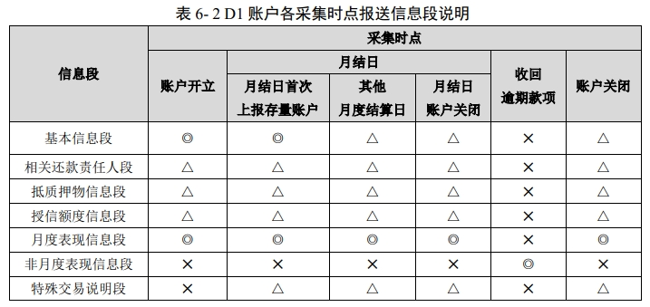
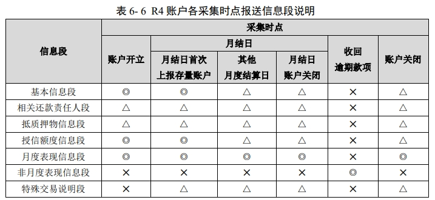
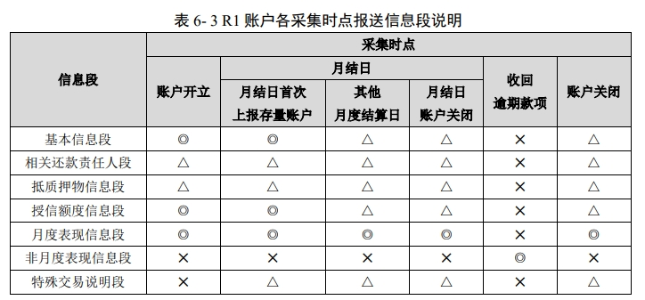
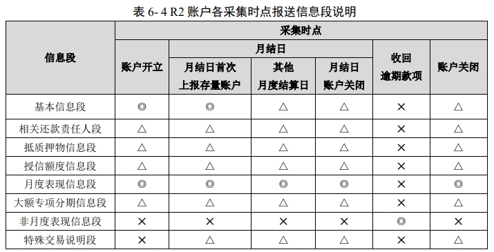
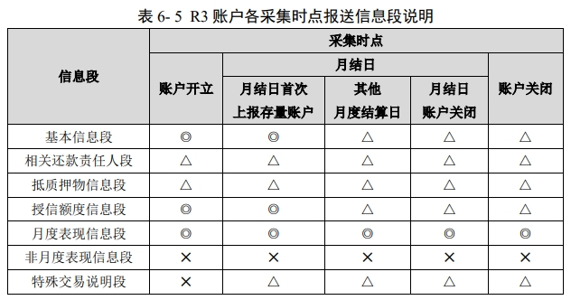

-   信息段、报送时点规范
    -   月结日：非 *C1* 账户开立后、关闭前各月需要报送的账户信息的 **信息报告日期**
        -   *D1R41* 到期前取约定还款日、宽限期，到期后取月底最后一天
        -   *R23* 取账单日：到账还款日一般为账单日后 18 日左右
        -   注意，**未核销呆账账户也需报送月度表现，即使征信报告中无月度表现信息段**
    -   非月度表现仅可能在 *收回逾期款项* 时点报送

-   账户状态、还款状态
    -   *R2101205*：账户最新记录中 *账户状态* 为 *3-关闭*、*4-销户*、*2-结束* 时，后续记录不能入库
    -   *I2100H11*：*账户状态* 为 *3-关闭*、*4-销户* 时，*余额* 应为 0
    -   *I2100H12*：*账户状态* 为 *3-关闭*、*4-销户* 时，*月度-当前还款状态* 应为 *C/G*
        -   但，状态 *C/G* 不一定对应账户关闭，已发现 *G* 后可以继续报 *7*
    -   *I2100J02*：*非月度-当前还款状态* 只能为 *N-正常*
    -   *R2101210*：若 *D1* 账户已转出，则后续信息记录不能入库

####   授信协议信息

| 段名称           | 段说明                                             |
|------------------|----------------------------------------------------|
| 基础段           | 描述授信协议标识、信息主体标识及信息报告日期等信息 |
| 共同受信人信息段 | 描述授信协议的共同受信人身份信息                   |
| 额度信息段       | 描述额度相关信息、额度期限及协议的状态信息         |

##  流水

### 微信流水

| 交易单号 | 交易时间 | 交易类型 | 收/支/其他 | 交易方式 | 金额(元) | 交易对方 | 商户单号 |
|----------|----------|----------|------------|----------|----------|----------|----------|

-   各字段说明
    -   交易单号：`10位类型数字 + 6或8位日期 + 10位或20位数字`
    -   交易时间：`yyyy-mm-dd HH:MM:SS`
    -   交易类型
        -   `群收款`
        -   `扫二维码付款`
        -   `二维码收款`
        -   `商户消费`
        -   `转账`
        -   `其他`
    -   收/支/其他
        -   `支出`
        -   `收入`
        -   `其他`：用户内部资金交易
            -   零钱充值提现
            -   零钱通存入、去除
            -   信用卡还款
            -   购买理财通
    -   交易方式
        -   `XX银行信用卡(XXXX)`
        -   `XX银行储蓄卡(XXXX)`
        -   `零钱`
        -   `零钱通`
        -   `/`：收入时占位
    -   金额：非负浮点
    -   交易对方：根据关键字判断交易类型
        -   往往结合 `收/支/其他 == 支出`
    -   商户单号
        -   `/`：转账收入、二维码收款、群收款、零钱通转出时占位

| 交易类型           | 收支 | 说明                     |
|--------------------|------|--------------------------|
| 转账               | 支出 |                          |
| 转账               | 收入 |                          |
| 扫二维码付款       | 支出 |                          |
| 二维码收款         | 收入 |                          |
| %微信红包%         | 收入 | 领取红包不区分单发、群发 |
| 微信红包（群红包） | 支出 |                          |
| 微信红包（单发）   | 支出 |                          |
| 群收款             | 支出 |                          |
| 群收款             | 收入 |                          |
| 商户消费           | 支出 |                          |
| %转入零钱通%       | 其他 |                          |
| %零钱通转出%       | 其他 |                          |
| %购买理财通%       |      |                          |
| 理财通赎回         |      |                          |
| 信用卡还款         |      |                          |
| 零钱提现           |      |                          |
| %司法%             |      | 司法冻结                 |

| 交易方式                       | 收支 | 说明         |
|--------------------------------|------|--------------|
| %信用卡%                       | 支出 |              |
| %储蓄卡%                       | 支出 |              |
| %银行%、%农信%、%农商%、%城商% | 支出 | 银行卡支出   |
| 零钱                           | 支出 |              |
| 零钱通                         | 支出 |              |
| 亲属卡                         |      | 亲属卡支出   |
| 经营账户                       |      | 经营账户支出 |
| /                              | 收入 | 其他支出占位 |

### 支付宝流水

| 收/支 | 交易对方 | 商品说明 | 收/付款方式 | 金额 | 交易订单号 | 商家订单号 | 交易时间 |
|-------|----------|----------|-------------|------|------------|------------|----------|

-   各字段说明
    -   收/支
        -   `收入`
        -   `支出`
        -   `不计收支`：取消交易、充值提现、账户转存、个人设置收支（老版本为 `其他`）
    -   交易对方：依据关键字判断建议类型
    -   商品说明：
    -   收/付款方式：
        -   `余额宝`
        -   `XX银行信用卡(XXXX)`
        -   `XX银行储蓄卡(XXXX)`
    -   金额：非负浮点
    -   交易订单号：8位日期 + 12、20、24 位数字编码
    -   商家订单号：
        -   空：转账时取空，真实消费场合非空
    -   交易时间：`yyyy-mm-dd HH:MM:SS`

-   说明
    -   支付宝流水无类似微信支付流水 `交易类型` 字段，可如下判断
        -   消费满足以下任一
            -   `交易订单号` 为空且 `收/支 == 支出`
            -   `商品说明 like %收款%` 且 `收/支 == 支出`

| 商品说明            | 商家订单号 | 收/支 | 说明       |
|---------------------|------------|-------|------------|
|                     | 非空       | 支出  | 消费       |
|                     | 空         | 支出  | 转账       |
| %收款%              |            | 支出  | 扫码支出   |
| %收款%              |            | 收入  | 二维码收入 |
| 收钱码收款          |            | 支出  | 扫码支出   |
| 收款                |            | 收入  | 二维码收入 |
| 余额宝-单次转入     |            |       | 余额宝买入 |
| 余额宝-转出到银行卡 |            |       | 余额宝赎回 |
| 余额宝% & %入%      |            |       | 余额宝买入 |
| 余额宝% & %出%      |            |       | 余额宝赎回 |
| 余额宝-转出%        |            |       | 余额宝赎回 |
| %余额宝% & %转出%   |            |       | 余额宝赎回 |
| %-买入              |            |       | 理财买入   |
| %-卖出至余额宝      |            |       | 理财赎回   |

###    流水衍生

####    消费分类

| 交易对方                        | 说明   |
|---------------------------------|--------|
| %航空%                          |        |
| %代驾%                          |        |
| %供电%                          |        |
| %燃气%                          |        |
| %供水%                          |        |
| %酒店%                          |        |
| %高速%、%ETC%                   |        |
| %保险% & %公司%                 |        |
| %购买理财通%                    |        |
| %理财通赎回%                    |        |
| %中石化%、%石油%、%加油%        |        |
| %停%                            | 停车费 |
| %退款                           |        |
| %滴滴%、%叫车%、%专车%、%快车%  |        |
| %中国铁路网络有限公司%、%12306% |        |

####    异常交易标注

-   交易判断：部分交易可能为伪造流水条目，或非正常消费行为
    -   特殊金额 `转账`、`红包`：888、888.88、8888、8888.88、666、666.66、6666、6666.66、520、1314
    -   `二维码收款` 刷单：单日、单交易对手高频交易
        -   收款金额占比 `> 0.8` 且收款次数 `> 10`
        -   收款次数占比 `> 0.8` 且收款次数 `> 10`
        -   收款金额占比 `> 0.5` 且收款次数 `> 50`
        -   收款次数占比 `> 0.5` 且收款次数 `> 50`
        -   同金额收款金额 `> 1000` 次数 `> 10`
        -   短时间内收款金额 `> 1000` 次数 `>10`
    -   单交易对手、单月 `转账收入`、`转账支出` 金额、次数较大，即互刷流水

