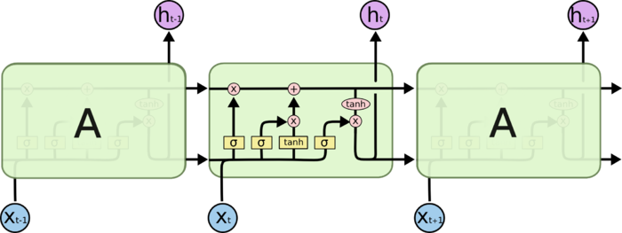
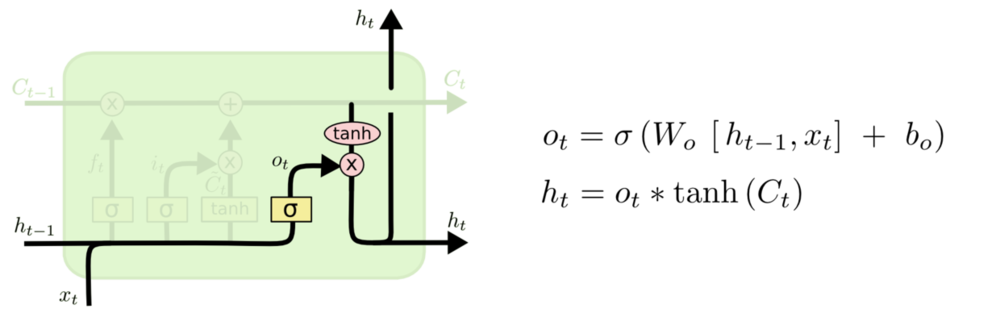
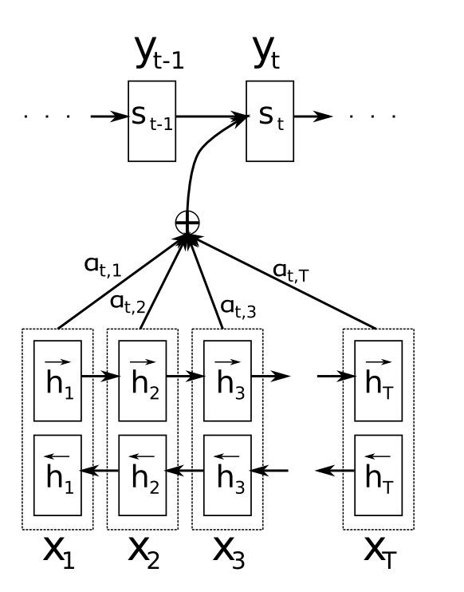

#   神经网络

##   *Back Propogation*

###  梯度消失

#   网络结构

##  *Convolutional NN*

### *Convolutional*

-   *Convolutional* 卷积：卷积区域对卷积核逐点乘积（内积）、求和作为卷积中心取值
    -   卷积通过对数据做局部变换提取更高层次的特征
        -   通道滤波：通过类似信号、过滤掉其他信号，探测局部是否有相应模式
        -   局部感知：卷积核仅覆盖部分、局部特征，类似于生物视觉中的 *Receptive Field*
    -   卷积核：卷积权值矩阵
        -   可变卷积核通过训练学习参数，以得到效果更好卷积核
        -   传统卷积核参数人为确定，用于提取确定的信息
            -   *Sobel* 算子：获取图像边缘信息
            -   *Guassian Convolutional Kernel* 高斯卷积核：高斯模糊，是实现尺度变换的唯一线性核
                $$\begin{align*}
                L(x, y, \sigma) & = G(x, y, \sigma) * I(x, y) \\
                G(x, y, \sigma) & = \frac 1 {2\pi\sigma^2}
                    exp\{\frac {-((x-x_0)^2 + (y-y_0)^2)} {2\sigma^2} \}
                \end{align*}$$
                > - $G(x,y,\sigma)$：尺度可变高斯函数
                > - $I(x,y)$：放缩比例，保证卷积核中各点权重和为 1
                > - $(x,y)$：卷积核中各点空间坐标
                > - $\sigma$：尺度变化参数，越大图像的越平滑、尺度越粗糙
    -   说明
        -   卷积实践中常用于图像数据处理

> - *Receptive Field*：感受野，视觉皮层中对视野小区域单独反应的神经元，相邻细胞具有相似和重叠的感受野，感受野大小、位置在皮层之间系统地变化，形成完整的视觉空间图
> - 1980 年 *Neocognitron* 新认知机是第一个初始卷积神经网络，是感受野感念在人工神经网络首次应用，将视觉模式分解成许多子模式（特征），然后进入分层递阶式的特征平面处理
> - 尺度空间理论：在图像领域模拟人眼观察物体的概念、方法（近大远小、近清晰远模糊），模拟图像数据多尺度特征

### *CNN*

-   *CNN* 卷积神经网络
    -   结构
        -   多核卷积：卷积核代表（提取）某特征，多各卷积核获取不同特征
        -   权值共享：给定通道、卷积核，共用滤波器参数
            -   卷积层的参数取决于：卷积核、通道数
            -   参数量远小于全连接神经网络

##  *Recurrent NN*

> - 左侧：为折叠的神经网络，右侧：按时序展开后的网络
> - $h$：循环隐层，其中神经元之间有权连接，随序列输入上一期隐层会影响下一期
> - $o$、$y$：输出预测值、实际值
> - $L$：损失函数，随着时间累加

-   *RNN* 循环神经网络
    -   循环权值连接
        -   循环隐层内神经元之间也建立权连接，一般循环隐层中神经元只和 **当前层** 中神经元建立 **单向** 权值连接
            -   空间上，不受上期非同层神经元影响
            -   时间上，不受下期神经元状态影响（训练时数据单个样本序列反向输入即为逆向状态）
        -   即，循环隐层中神经元 $t$ 期状态 $H^{(t)}$ 由当期输入、$H^{(t-1)}$ 共同决定
            $$ H^{(t)} = \phi(W_X X^{(t-1)} + W_H H^{(t-1)} + B) $$
    -   序列样本输入
        -   *RNN* 主要用于处理前后数据有关联的序列数据
            -   样本序列往往长短不一，难以拆分为独立样本通过普通 *DNN* 训练
        -   *RNN* 以内部隐状态作为定长向量存储输入信息
            -   可以处理输入、输出间隔近序列
            -   长间隔很理论上虽然能够处理，但由于梯度消失问题，实际上长期依赖会消失
            
            

-   *RNN* 网络实现结构是线性、折叠的，但逻辑结构则是展开的网
    -   序列输入
        -   实际结构：依次输入
        -   逻辑结构：序列样本整体作为一次输入，损失、反向传播都应该以完整序列为间隔
    -   权值共享
        -   实际结构：不同期的权值实际是同一组数
        -   逻辑结构：权值共享
    -   重复模块链
        -   实际结构：同一个模块
        -   逻辑结构：不同期模块之间信息流动形成链式形式

-   *Gated Feedback RNN*：循环隐层会对下期其他隐层产生影响
    

##  *Embedding*

-   *Embedding* 嵌入层：将高维空间中离散变量映射为低维稠密 *embedding* 向量表示
    -   *Embedding* 可视为查（向量）表 $Ex$
        -   *Embedding* 向量矩阵 $E$ 列向量即 *embedding* 向量
            -   对 0-1 特征，即直接使用对表中对应向量代替
            -   对一般特征，即使用数据值加权后表中向量代替
        -   *Embedding* 向量矩阵可有多个，对应不同类型特征
    -   *embedding* 向量优势
        -   更能体现样本之间关联
            -   內积（內积）体现样本之间接近程度
            -   可通过可视化方法体现样本差异
        -   更适合某些模型训练
            -   模型不适合高维稀疏向量
            -   *embedding* 向量矩阵可以联合模型整体训练，相当于提取特征
            -   *embedding* 向量也可能类似迁移学习独立训练之后直接融入模型中

> - *Embedding*：将度量空间中对象映射到另个（低维）度量空间，并尽可能**保持不同对象之间拓扑关系**，如 *Word-Embedding*

##  *Pooling*

-   *Pooling* 池化：在每个区域中选择只保留一个值
    -   **下采样** 以减小数据处理量同时保留有用的信息
        -   相邻区域特征类似，单个值能表征特征、同时减少数据量
        -   直观上即模糊图像，丢掉一些不重要的细节
    -   池化取值逻辑
        -   *Max Pooling* 最大值采样：使用区域中最大值作为代表
        -   *Average Pooling* 平均值采样：使用池中平均值作为代表

##  *Interaction*

-   *Interaction* 交互作用：人工设置特征之间交互方式
    -   *Flatten* 展平：直接拼接不同特征、展平
        -   对同特征域特征处理方式
            -   平均
            -   最大
    -   二阶交互：特征向量之间两两逐元素交互
        -   可在低层次捕获二阶交互影响，训练简单
        -   交互方式
            -   内积
            -   池化

##  *Long Short Term Memory*

-   *LSTM* 长短时记忆网络
    -   通过刻意设计、默认可以学习长期依赖信息
        -   *LSTM* 中每个重复的模块（层）称为细胞
            -   细胞结构经过特殊设计，相较于准 *RNN* 简单细胞结构能较好保留长时信息
        -   多个 *LSTM* 细胞可以组成 *block*，其中细胞门权值共享
            -   *block* 中各个细胞状态不同
            -   这个是同时刻、不同层的真权值共享，类似 *CNN* 中的卷积核
            -   减少参数个数，效率更高
    -   说明
        -   *long term memory*：长期记忆，参数
        -   *short term memory*：短期记忆，数据流
        -   *long short term memory*：长[的]短期记忆，细胞状态

### *LSTM* 标准细胞结构

$$ \begin{align*}
i^{(t)} & = \sigma(W_i[x^{(t)}, h^{(t-1)}], b_i), & input-gate \\
f^{(t)} & = \sigma(W_f[x^{(t)}, h^{(t-1)}], b_f), & forget-gate \\
o^{(t)} & = \sigma(W_o[x^{(t)}, h^{(t-1)}], b_o), & output-gate \\
\tilde C^{(t)} & = tanh((W_c[x^{(t)}, h^{(t)}])), & memory-alternates \\
C^{(t)} & = f^{(t)} \odot c^{(t-1)} + i^{(t)} \odot c^{(t)}, & new-memory \\
h^{(t)} & = o^{(t)} \odot tanh(c^{(t)}), & output
\end{align*}$$

> - $W_i, b_i, W_f, b_f, W_o, b_o$：输入门、遗忘门、输出门参数
> - $\odot$：逐项乘积
> - $x_t$：第$t$期输入
> - $i^{(t)}$：输出门权重，决定需要更新的信息
> - $f^{(t)}$：遗忘门权重，决定需要遗忘的信息
> - $o^{(t)}$：输出门权重，决定需要输出的信息
> - $h^{(t-1)}$：第$t-1$期细胞状态输出
> - $\tilde C_t$：第$t$期更新备选内容
> - $C^{(t)}$：第$t$期更新完成后细胞状态

-   *Gates* 输入、遗忘、输出门
    -   门说明
        -   当期输入 $x^{(t)}$、上期输出 $h^{(t-1)}$ 作为输入
        -   *sigmoid* 作为激活函数，得到 $[0,1]$ 间控制、权重向量
            -   `1`：完全保留
            -   `0`：完全舍弃
    -   *Forget Gate*：遗忘门，决定要从细胞状态中舍弃的信息
        
    -   *Input Gate*：输入门，决定向细胞状态中保留的信息
        
    -   *Ouput Gate*：输出门，决定从细胞状态中输出的信息
        

-   *Cell State* 细胞状态：*LSTM* 中最重要的核心思想
    -   细胞状态说明
        -   *tanh* 作激活函数，得到 $[-1,1]$ 间信息向量
            -   $h^{(t-1)}, x^t$：备选更新信息输入
            -   $C^{(t-1)}$：输出信息输入
        -   状态 $C_t$ 中历史信息比重由 $f^{(t)}$ 确定
            -   $f^{(t)} $趋近于 1 时历史信息能较好的保留
        -   与门限权重逐项乘积确定最终遗忘、输入、输出
        
    -   随着时间流动，承载之前所有状态信息，代表长期记忆
        -   通过 “三个门” 保护、控制
        -   只与外部信息少量线性交互，类似于在传送带上独立运行，其中信息容易保持不变

### *Gated Recurrent Unit*

$$\begin{align*}
r^{(t)} & = \sigma(W_r [h^{(t-1)}, x^{(t)}] + b_r), & reset gate \\
z^{(t)} & = \sigma(W_z [h^{(t-1)}, x^{(t)}] + b_z), & update gate \\
\tilde h^{(t)} &= tanh(W_h [r^{(t)} h^{(t-1)}, x^{(t)}]), & memory alternates\\
h^{(t)} & = (1 - z^{(t)}) \odot h^{(t-1)} + z^{(t)} \odot \tilde h^{(t)}, & new memory
\end{align*}$$
> - $W_r, b_r, W_z, b_z$：重置门、更新门参数
> - $h^{(t)}$：原细胞状态、隐层输出合并
> - $\tilde{h}_t$：第 $t$ 期更新备选信息
> - $r^{(t)}$：重置门权重输出，重置上期状态 $h_{t-1}$ 再作为更新门输入
> - $z^{(t)]$：更新门权重输出，当期状态 $h_t$ 中 $h_{t-1}$、 $\tilde{h}_t$ 占比（遗忘、更新的结合）

-   *GRU*
    -   合并细胞状态、隐层输出
    -   合并遗忘门、输出门为更新门

##  *Seq2Seq*

$$\begin{align*}
p(y_1, \cdots, y_{T^{'}} | x_1, \cdots, x_T) & = \prod_{t=1}^T p(y_t|c, y_1, \cdots, y_{t-1}) \\
c & = q(\{h_1, \cdots, h_T\}) \\
h_t & = f(x_t, h_{t-1})
\end{align*}$$
> - $T^{'} \neq T$：输出序列长度、输入序列长度
> - $p(y_t|\cdots)$：一般为softmax函数计算字典中各词概率
> - $c$：定长向量
> - $h_t$：隐状态
> - $q$：将隐状态映射为定长向量存储信息，如：
    $q(\cdots) = h_T$
> - $f$：根据输入映射为隐状态，如：RNN、LSTM

-   *Seq2Seq*/*Encoder-Decoder*：以 *RNN*、*LSTM* 做基元存储输入信息
    -   允许任意长度序列输入、输出学习
        -   *encoder*：将输入序列映射为定长向量
        -   *decoder*：将该定长向量映射为目标输出（通过将联合概率有序分解来定义翻译概率）
    -   采用 *LSTM*、*RNN* 结构的 *Seq2Seq* 结构很难将输入序列转化为定长向量而保存所有有效信息
        -   序列末尾对定长向量影响更大，难以学习长距离依赖
        -   随着输入序列长度增加，预测效果显著下降

### *Seq2Seq with Attention*

-   *Seq2Seq with Attention*
    -   使用 *Attention机制的 *Seq2Seq* 无需多期迭代传递信息，不存在长距离依赖

-   *BiRNN2RNN with Attention*
    -   编码器：*Bi-RNN*
    -   解码器：*Attention* 机制加权的 *RNN*
    
    $$\begin{align*}
    p(y_t | y_1, \cdots, y_{t-1}, x) & = g(y_{t-1}, s_t, c_t) \\
    s_t & = f(s_{t-1}, y_{t-1}, c_t) \\
    c_t & = \sum_{j=t}^T \alpha_{j=1}^T \alpha_{t,j} h_j \\
    \alpha_{t,j} & = softmax(e_{t,j}) \\
        & = \frac {exp(e_{t,j})} {\sum_{k=1}^T exp(e_{t,k})} \\
    e_{t,j} & = a(s_{t-1}, h_j)
    \end{align*}$$
    > - $y_t$：当前$t$时刻输出
    > - $p(y_t|\cdots)$：$t$时刻输出条件概率
    > - $s_t$：解码器$t$时刻隐状态
    > - $h_j$：编码器$j$时刻隐状态
    > - $c_t$：*expected annotation*，对输出$t$的上下文向量
    > - $T$：输入序列长度
    > - $e_{t,j}, \alpha_{t,j}$：输入$j$对输出$t$重要性，反映模型注意力分布
    > - $a$：*alignment model*，输入输出相关性模型，同整个系统联合训练的前向神经网络，*Attention* 机制核心

##  *Batch Normalization*

$$\begin{align*}
y & = BN_{\gamma, \beta}(z) = \gamma \odot \hat z + \beta \\
\hat z & = \frac {z - E(z)} {\sqrt {Var(z) + \epsilon}}
\end{align*}$$
> - $B$：mini-batch
> - $z, y$：**某层**输入向量、规范化后输入向量（即以个神经元中激活前标量值 $z=Wx+b$ 为一维）
> - $\odot$：逐元素乘积
> - $E(x)$：均值使用移动平均均值
> - $Var(x)$：方差使用移动平均无偏估计
> - $\gamma, \beta$：待学习向量，用于**恢复网络的表示能力**
> - $\epsilon$：为数值计算稳定性添加

-   *Batch Normalization*：规范化 batch 数据，使样本各特征标准化，即均值为 0、方差为 1
    -   *BN* 可以视为 *whitening* 的简化
        -   简化计算过程：避免过高的运算代价、时间
        -   保留数据信息：未改变网络每层各特征之间相关性
    -   *BN* 提高模型泛化性能，减少对 *Dropout* 的需求
        -   不同 batch 均值、方差有所不同，为网络学习过程增加随机噪声
        -   类似 *Dropout* 关闭神经元，能给网络带来噪声
        -   事实上，实际中 *BN* 效果优于 *Dropout*

-   *BN* 正则化缓解了 *ICS* 问题
    -   使得每层输入数据分布稳定
        -   实现网络层与层之间的解耦
            -   方便迁移学习
            -   加速模型学习速度：后层网络无需不断适应输入分布变化，利于提高神经网络学习速度
        -   降低模型对网络超参数、初始值敏感度，使得网络学习更加稳定
            -   简化调参过程
            -   允许使用更大的学习率提高学习效率
            $$\begin{align*}
            BN(Wu) & = BN((aW)u) \\
            \frac {\partial BN(aWu)} {\partial u} & = \frac {\partial BN(Wu)} {\partial u} \\
            \frac {BN(aWu)} {\partial aW} & = \frac 1 a \frac {\partial BN(Wu)} {\partial W}
            \end{align*}$$
            > - $a$：假设某层权重参数变动 $a$ 倍
            -   激活函数函数输入不受权重 $W$ 放缩影响
            -   梯度反向传播更稳定，权重 $W$ 的 *Jacobian* 矩阵将包含接近 1 的奇异值，保持梯度稳定反向传播
        -   允许网络使用饱和激活函数（*sigmoid*、*tanh*等），而不至于停滞在饱和处，缓解梯度消失问题
            -   深度网络的复杂性容易使得网络变化积累到上层网络中，导致模型容易进入激活函数梯度饱和区
    -   也导致数据表达能力的缺失
        -   输入数据分布均值为 0、方差为 1 时，经过 sigmoid、tanh 激活函数时，容易陷入其线性区域
        -   可引入可学习参数 $\gamma, \beta$ 以恢复数据表达能力
            -   参数 $\gamma, \beta$ 独立学习，将数据分布与之前网络计算解耦
            -   $\gamma = \sqrt {Var(z)}, \beta = E(z)$ 时为等价变换，并保留原始输入特征分布信息

> - *Whitening*：白化，对输入数据变换使得各特征同均值、同方向、不相关，可以分为 *PCA* 白化、*ZCA* 白化
> - 常用 *Normalization* 方法：<https://www.cvmart.net/community/detail/1569>

### *Internal Covariate Shift*

-   *ICS*：由于网络参数变化，引起内部节点（输入）数据分布发生变化的过程
    -   网络中层与层之间高度耦合，具有强关联性
        -   网络中任意层都可以视为单独网络
        -   上层输入可视为作为当前层外部输入
    -   随训练进行，网络中参数不断发生改变
        -   任意层中参数变化会导致之后层输入发生改变
        -   高层需要不断适应输入分布的改变，即其输入分布性质影响该层训练
        -   由此导致模型训练困难
    -   负面影响
        -   上层网络需要不断调整输入适应数据分布变换，降低网络学习效率
        -   输入数据量级不稳定、各维度数据量级差距不稳定
            -   降低学习效率
                -   小量级维度参数要求更小的学习率
                -   否则参数可能在最优解附近反复波动
            -   容易出现梯度消失，难以训练饱和非线性模型
                -   大量级维度训练过程中容易陷入梯度饱和区，参数更新速度慢，减缓网络收敛速度
                -   训练过程中参数更新更有可能使得输入移向激活函数饱和区
                -   且该效应随着网络深度加深被进一步放大
            -   参数初始化需要更复杂考虑

> - 换用 *RELU* 等非饱和激活函数等也可避免陷入梯度饱和区

### 训练、预测

-   *BN* 的训练、预测
    -   训练过程中，以 batch 统计量作为整体训练样本均值、方差估计
        -   每层均需存储均值、方差的移动平均统计量用于测试时归一化测试数据
        -   *BN* 应在全连接或卷积之后、激活函数之前，即 $ReLU(BN(input))$
        -   考虑卷积特性，可为每个 *Feature Map* 的卷积后激活函数设置不同的 *BN*
            -   即，为每个卷积核、特征图层分别学习 $\gamma, \beta$
    -   预测过程中各参数（包括均值、方差）为定值，*BN* 仅仅对数据做了线性变换
        -   使用训练总体的无偏统计量对测试数据变换（训练时存储）
            $$\begin{align*}
            \mu_{test} & = E(\mu_{batch}) \\
            \sigma^2_{test} = \frac m {m-1} E(\sigma^2_{batch})
            \end{align*}$$

##  *Layer Normalization*

$$\begin{align*}
\mu^l & = \frac 1 H \sum_{i=1}^H h_i^l \\
\sigma^l &= \sqrt {\frac 1 H \sum_{i=1}^H (h_i^l - \mu^l)^2} \\
h^l & = W^l x^{l-1} + b^l \\
LN(h^l) & = \frac {g^l} {\sigma^l} \odot (h^l - \mu^l) + b^l \\
x^l & = g(LN(h^l))
\end{align*}$$
> - $h^l$：第$l$隐层激活前值
> - $\mu^l, \sigma^l$：第 $l$ 隐层对应 *LN* 均值、方差（标量，是同层神经元激活前值统计量）

-   *Layer Normalization* 层归一化：假设各层激活前的特征分布接近，可以直接基于每层所有激活函数前输入估计均值、方差
    -   *LN* 无需批训练，在单条数据内部即可归一化
        -   相对于 *BN*，其适应范围更广
            -   循环神经网络中，*BN* 无法处理长于训练序列的测试序列
            -   *BN* 无法应用到在线学习、超大分布式模型任务，此时训练 batch 较小，计算的均值、方差无法有效代表训练总体
        -   但 *CNN* 网络边缘对应卷积核隐藏单元未被激活，假设不成立，所以 *CNN* 网络中 *LN* 效果没有 *BN* 效果好

##  *Dropout*

-   *Dropout*：**训练时**根据随机隐藏部分神经元、对应连接边避免过拟合
    -   固定概率丢弃：设置固定概率 $p$，对每个神经元以概率 $p$ 判定是否需要保留
        $$\begin{align*}
        y & = f(W * d(x) + b) \\
        d(x) & = \left \{ \begin{array}{l}
            m \odot x, & 训练阶段 \\
            px, & 测试阶段
        \end{array} \right.
        \end{align*}$$
        > - $d(x)$：丢弃函数
        > - $m \in \{0, 1\}^d$：丢弃掩码，通过概率为 $p$ 的伯努利分布随机生成
        -   常设置 $p=0.5$，此时随机生成网络最具多样性，对大部分网络、任务比较有效
    -   训练时，激活神经元数量为原来的 $p$ 倍
        -   每个 batch 分别进行 drop，相当于对每个 batch 都有独特网络
    -   预测时，所有神经元都被激活
        -   为避免造成训练、测试时网络输出不一致，需将神经元输出乘 $p$

-   *Dropout* 理论解释
    -   集成学习角度：类似 *Bagging* 技术将多个模型组合，平均不同网络输出
        -   最终网络可以近似看作是集成了指数个不同网络的组合模型
            -   每次丢弃，相当于从原网络采样得到子网络
            -   每次迭代，相当于训练不同的子网络，共享原始网络参数
        -   但只是类似，各个 drop 后的子网并不独立，在不同子网中相同神经元的权重相同
        -   多个模型组合组合可以一定程度上抵消过拟合
    -   贝叶斯学习解释：*Dropout* 网络视为参数向量 $\theta$ 随机抽样结果
        -   对需要学习的网络 $y = f(x, \theta)$，贝叶斯学习假设参数 $\theta$ 为随机向量
        -   设先验分布为 $q(\theta)$，贝叶斯角度预测结果由全概率公式
            $$\begin{align*}
            E_{q(\theta)}(y) &  = \int_q f(x, \theta) q(\theta) d\theta \\
            & \approx \frac 1 M \sum_{m=1}^M f(x, \theta_m)
            \end{align*}$$
            > - $f(x, \theta_m)$：第 $m$ 次应用丢弃方法的网络的预测结果
            > - $\theta_m$：对全部参数的采样
            > - $M$：*Dropout* 网络结构容量

-   具体 drop 设置
    -   输入层神经元丢弃率更接近 0，使得输入变化不会太大
        -   输入层神经元丢失时，相当于给数据增加噪声，提高网络稳健性
    -   循环神经网络不能直接丢弃隐状态，会损害循环网络在时间维度上的记忆能力
        -   简单方法：可以考虑对非循环连接进行随机丢弃
        -   变分丢弃法：根据贝叶斯对丢弃法是对参数的采样解释，采样参数需要每个时刻保持不变
            -   需要对参数矩阵的每个元素随机丢弃
            -   所有时刻使用相同的丢弃掩码

#   功能函数

##  激活函数

| 激活函数       | 公式                                                        | 输出范围     |
|----------------|-------------------------------------------------------------|--------------|
| *Sigmoid*      | $$ sigmoid(z) = \frac 1 {1+e^{-z}} $$                       | $(0,1)$      |
| *Hard Sigmoid* | $$
hsigmoid(z) = \left \{ \begin {array} {l}
    0 & z < -2.5 \\
    1 & z > 2.5 \\
    0.2*z + 0.5 & -2.5 \leq z \leq 2.5 \\
\end {array} \right.  $$                                                       | $(0,1)$      |
| *Swish*        | $$ swish(z) = x * sigmoid(x) $$                             |              |
| *Tanh*         | $$
\begin{align*}
tanh(z) & = \frac {sinhz} {coshz} \\
    & = \frac {e^z - e^{-z}} {e^z + e^{-z}} \\
\end{align*} $$                                                                | $(-1, 1)$    |
| *Softmax*      | $$ softmax(z_i) = \frac {e^{z_i}} {\sum_{k=1}^K e^{z_k}} $$ | $(0,1)$      |
| *Softplus*     | $$ softplus(z) = log(exp(z)+1) $$                           | $(0,+\inf)$  |
| *Softsign*     | $$ softsign(z) = \frac z {abs(z) + 1} $$                    |              |
| *ReLU*         | $$
relu(z, max) = \left \{ \begin{array} {l}
    0 & z \leq 0 \\
    z & 0 < x < max \\
    max & z \geq max \\
\end {array} \right. $$                                                        | $[0, +\inf)$ |
| *Leaky ReLU*   | $$
relu(z, \alpha, max) = \left \{ \begin {array} {l}
    \alpha z & z \leq 0 \\
    z & 0 < z < max \\
    max & z \geq max \\
\end {array} \right. $$                                                        |              |
| *Peramatric ReLU* | $$
prelu(z) = \left \{ \begin{array} {l}
    \alpha z & z < 0 \\
    z & z> 0 \\
\end{array} \right. $$                                                         |              |
| *Threshhold ReLU* | $$
trelu(z, theta)= \left \{ \begin{array} {l}
    z & z > theta \\
    0 & otherwise \\
\end{array} \right. $$                                                         |              |
| *Exponential Linear Unit* | $$
elu(z, \alpha) = \left \{ \begin{array} {l}
    z & z > 0 \\
    \alpha (e^z - 1) & x \leqslant 0 \\
\end{array} \right. $$                                                         |              |
| *Scaled ELU*   | $$ selu(z) = \lambda * elu(z, \alpha) $$                    |              |
| *MaxOut*       | $$ maxout(X) = \|X\|_{\inf} $$                              |              |

-   激活函数：根据输入内容最终决定神经元输出内容的函数
    -   激活函数通常为非线性函数，在网络中添加非线性
    -   梯度消失：激活函数导数太小（$<1$），压缩误差（梯度）变化
        -   饱和：输入值趋近正（右饱和）、负（左饱和）无穷大时，激活函数梯度趋于零的现象
    -   说明
        -   一般，激活函数输入 $z$ 常为仿射变换结果 $z= wx+b$，但仿射变换不是激活函数的范畴
        -   池化（极大值池化）也可以视为激活函数

> - 激活函数：<https://www.jiqizhixin.com/articles/2021-02-24-7>

### *Sigmoid* 激活

-   *Sigmoid* 函数
    $$ sigmoid(z) = \frac 1 {1+e^{-z}} $$
    -   输出范围：$(0, 1)$
    -   优点
        -   可微、梯度平滑，避免跳跃输出值
        -   可用于隐层激活、输出层输出
    -   缺点
        -   激活函数计算量大，*BP* 算法求误差梯度时，求导涉及除法
        -   误差反向传播时容易出现梯度消失
        -   函数收敛缓慢

-   *Tanh* 双曲正切函数
    $$ \begin{align*}
    tanh(z) & = \frac {sinhz} {coshz} \\
        & = \frac {e^z - e^{-z}} {e^z + e^{-z}} \\
    \end{align*} $$
    > - $\frac{\partial tanh(z)}{\partial z} = (1 - tanh(z))^2$
    -   特点
        -   非常类似普通正切函数，可以简化梯度计算
        -   输出间隔比 *Sigmoid* 大
        -   函数以 0 为中心，零输入被映射为 0

-   *Hard Sigmoid*
    $$ hsigmoid(z) = \left \{ \begin {array} {l}
        0 & z < -2.5 \\
        1 & z > 2.5 \\
        0.2*z + 0.5 & -2.5 \leq z \leq 2.5 \\
    \end {array} \right. $$
    -   特点
        -   计算速度比 *Sigmoid* 激活函数快

-   *Swish*
    $$ swish(z) = x * sigmoid(x) $$
    -   受 *LSTM* 中门函数启发设计的 *self-gating* 机制
    -   特点
        -   相对于 *Sigmoid* 在大正值场合梯度不会趋于饱和
        -   一阶、二阶导数光滑

-   *Maxout* 极大值池化：可视为向量的 $L_{\inf}$ 范数
    $$ maxout(x) = \|X\|_{\inf} $$
    -   说明
        -   *ReLU* 可视为 $max(0, x)$ 的极大值池化版本

> - *Swish* 激活函数：<https://juejin.cn/post/6955443033169281032>

### *Softmax* 激活

-   *Softmax*
    $$ softmax(z_i) = \frac {e^{z_i}} {\sum_{k=1}^K e^{z_k}} $$
    -   特点
        -   主要用于多分类神经网络输出
    -   工程意义：指数底
        -   可导 “极大值”：拉开数值之间差距
        -   特征对输出结果为乘性：即 $z_i$ 中输入增加会导致输出随对应权重倍数增加
        -   联合交叉熵损失避免导数溢出，提高数值稳定性
    -   理论意义：概率论、最优化
        -   *Softmax* 符合最大熵原理
        -   假设各标签取值符合多元伯努利分布，而 *Softmax* 是其 *Link Function* 的反函数
        -   光滑间隔最大函数

### *ReLU* 激活

-   *Rectfied Linear Units* 修正线性单元：单侧抑制
    $$ relu(z, max) = \left \{ \begin{array} {l}
        0 & z \leq 0 \\
        z & 0 < x < max \\
        max & z \geq max \\
    \end {array} \right. $$
    -   优点
        -   计算速度快
        -   输入为正值时无梯度饱和问题
    -   缺点
        -   *Dead ReLU* 问题：输入负值时完全失效
        -   不是以 0 为中心的函数

-   *Leaky ReLU* 带泄露的修正线性
    $$ relu(z, \alpha, max) = \left \{ \begin {array} {l}
        \alpha z & z \leq 0 \\
        z & 0 < z < max \\
        max & z \geq max \\
    \end {array} \right. $$
    > - $\alpha$：超参，建议取小值 0.01
    -   特点
        -   解决了 *ReLU* 中 $z < 0$ 时进入死区问题，同时保留了 *ReLU* 的非线性特性
        -   理论上具有 *ReLU* 所有优点，但是实际中尚未完全证明

-   *Exponential LU* 线性指数
    $$ elu(z, \alpha) = \left \{ \begin{array} {l}
        z & z > 0 \\
        \alpha (e^z - 1) & x \leqslant 0 \\
    \end{array} \right. $$
    > - $\alpha$：超参，控制负值输入何时饱和
    -   特点
        -   输出平均值接近 0
        -   解决了 *ReLU* 中 $z < 0$ 时进入死区问题
        -   $x \leq 0$ 时，$f(x)$ 随 $x$ 变小而饱和，且可通过参数 $\alpha$ 控制
        -   网络深度超超过 5 时，*ELU* 相较 *ReLU*、*LReLU* 学习速度更快、泛化能力更好

-   *Parametric ReLU*：参数化的修正线性
    $$ prelu(z) = \left \{ \begin{array} {l}
        \alpha z & z < 0 \\
        z & z> 0 \\
    \end{array} \right. $$
    > - $\alpha$：自学习参数（向量），初始值常设置为 0.25，通过
    -   特点
        -   解决了 *ReLU* 中 $z < 0$ 时进入死区问题，同时保留了 *ReLU* 的非线性特性
        -   相较于 *RLU*，在负值区域是线性运算，梯度不会趋于 0
        -   常通过 *momentum* 方法更新

##  超参配置

###  参数初始化

-   参数（权重）初始化
    -   权重 $w$ 初始化时需同时考虑前向、反向过程，加速模型训练
        -   不同层输出方差相同 $Var(a^{(l)}) = Var(a^{(l-1)})$：也即不同激活层输入方差相同 $Var(z^{(l)}) = Var(z^{(l-1)})$
        -   期望 $E(w)=0$：权重 $w$ 大小、正负缺乏先验，应初始化在 0 附近，同时有随机性
        -   方差 $Var(w)$ 合适：避免梯度消失、梯度爆炸
    -   权重随机初始化过程可视为从概率分布随机采样过程
        -   权重期望、方差控制可转化为概率分布参数控制

-   常数初始化：将所有权值初始化为常数
    -	任意常数初始化方法性能都不好，甚至无法训练
        -	反向传播算法更新参数时，各参数各维度导数一致、更新后权值一致
        -	各神经元在演化过程中对称，无法学习不同特征，退化为单神经元
    -	在激活函数选择线性激活函数时
        -	过大的初始化权重可能导致梯度爆炸
        -	过小的初始化值可能导致梯度消失

> - 权重初始化最佳实践：<https://www.cnblogs.com/shine-lee/p/11908610.html>

####	*tanh* 激活函数下

-   *tanh* 激活函数在 0 附近时近似为恒等映射，考虑恒等映射、网络输入期望为 0
    -   *Lecun 1998*：保持前向过程每层输出方差不变，则第 $l$ 权重可按如下高斯分布初始化
        $$ W^{(l)} ~ N(0, \frac 1 {n^{(l-1)}}$ $$
    -   *Xavier* 初始化：同时考虑前向、反向过程
        $$\begin{align*}
        Var(W^{(l)}) &~ N(\frac 2 {n^{(l-1)} + n^{(l)}}) \\
        Var(W^{(l)}) &~ U(- \frac {\sqrt 6} {\sqrt {n^{(l-1)} + n^{(l)}}},
            \frac {\sqrt 6} {\sqrt {n^{(l-1)} + n^{(l)}}})
        \end{align*}$$

> - *LeCun 1998*：<https://yann.lecun.com/exdb/publis/pdf/lecun-98b.pdf>
> - *Xavier*：<https://proceedings.mlr.press/v9/glorot10a/glorot10a.pdf>

####	*ReLU* 激活函数下

-   *ReLU* 系激活函数输出均大于 0，考虑前向、后向传播权重初始化方案均可
    -   *He 2015 for ReLU*
        -   前向：$$ Var(W^{(l)}) ~ N(0, \frac 2 {n^{(l-1)}}) $$
        -   反向：$$ Var(W^{(l)}) ~ N(0,  \frac 2 {n^{(l)}}) $$
    -   *He 2015 for PReLU*、*Leaky ReLU*
        -   前向：$$ Var(W^{(l)}) ~ N(0, \frac 2 {(1 + \alpha^2) n^{(l-1)}}) $$
        -   反向：$$ Var(W^{(l)}) ~ N(0,  \frac 2 {(1 + \alpha^2) n^{(l)}}) $$

> - *He*：<https://arxiv.org/abs/1502.01852>
