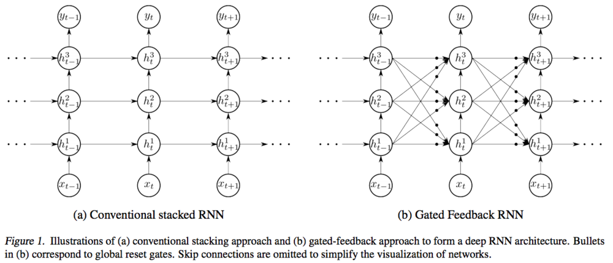
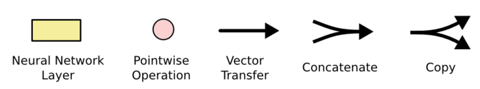
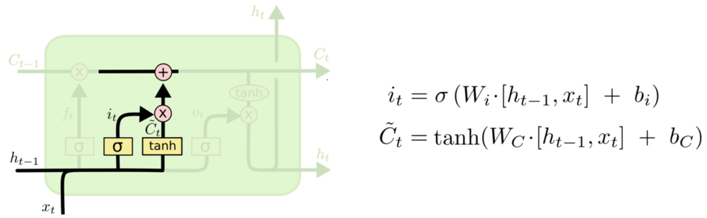
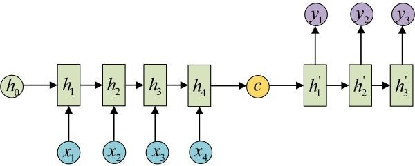
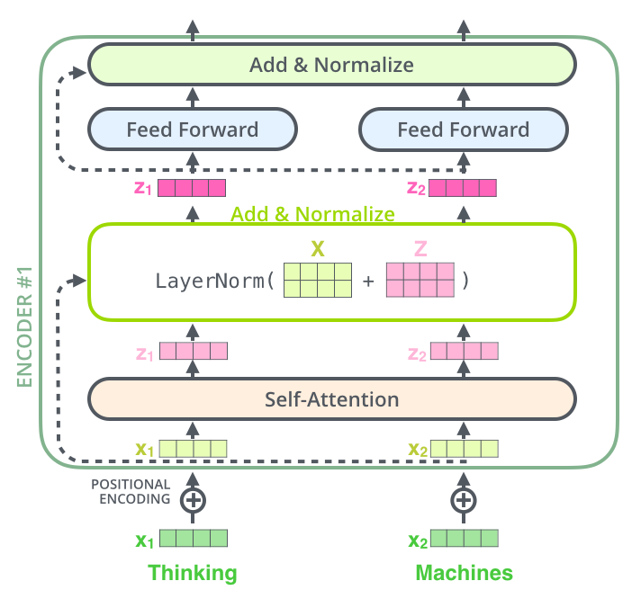

#   神经网络

##   *Back Propogation*

### 链式法则

$$ \frac {\partial z} {\partial x} = \frac {\partial z} {\partial t} \frac {\partial t} {\partial x} $$

-   *Chain Rule* 链式法则：复合函数的导数可由构成复合函数的各函数导数乘积表示
    -   神经网络（计算图）即可视为复合函数
        -   输入张量即函数自变量
        -   网络节点即构成复合函数的函数：根节点即损失函数
        -   网络边即函数、参数（输入张量、函数输出）带出执行关系
    -   *Forward-Mode Differentiation* 前向模式微分：按链式法则求根节点（复合函数）对各参数的偏导解析式，带入输入值计算（考虑均可微）
        -   直接求解析式带入求值，符合常规思路
        -   导数计算量为 $O(\prod E_i)$（$E_i$ 为第 $i$ 层网络边数）
            -   网络各层全链接时，
            -   在节点、关联多的复杂网络中计算量大
    -   *Reverse-Mode Differentiation* 反向模式微分：考虑各节点函数值已在正向传播中计算得出，按链式法则从根节点反向、依次计算对（中间）函数、（直至目标）参数偏导
        -   反向传播简化 **参数梯度数值解** 计算
            -   仅需分别给出（简单）中间函数（内）参数偏导，应用链式法则、从根节点开始累积梯度即可
            -   类似动态规划暂存结果，正向传播计算函数值即构造动态规划表，反向传播计算导数即查表、求值
        -   对反向传播中某个（中间）函数（运算），**其中参数梯度仅依赖输入，即数学上的梯度的数值化带入计算**
            -   即，需要上下文暂存输入、中间结果（用于简化计算）
            -   而，函数输出对当前函数中参数梯度计算往往无意义，而作为下层函数输入
            -   事实上，图根节点绝对值无意义，仅因其作为极小化目标（损失）而在正向传播中计算

> - *BP* 算法详解之链式法则：<https://zhuanlan.zhihu.com/p/44138371>

###  梯度爆炸、梯度消失

-   反向传播过程中，梯度以指数形式传播，梯度消失（趋于 0）、梯度爆炸（过大）问题随网络深度增加而更加明显
    -   梯度消失、爆炸原因
        -   网络深度：大于 1、小于 1 的梯度在深层网络因连乘而导致梯度消失、爆炸
        -   激活函数：*Sigmoid* 激活函数梯度不大于 0.25
        -   参数初始化：参数初始化过大、过小，导致梯度爆炸、梯度消失
    -   解决方法
        -   *Pre-Training + Fine-Tuning*：逐层预训练，再整体微调
        -   梯度剪切：设置梯度上限做截断，避免梯度爆炸
        -   参数正则化罚：避免梯度爆炸
        -   激活函数调整：换用 *ReLU* 等不会导致梯度消失、爆炸的激活函数
        -   *Batch Normalization*：输出批正则化，避免参数过大、过小导致的梯度爆炸、消失
        -   残差网络：添加跨层短接捷径，避免梯度消失

> - 梯度消失和梯度爆炸及解决方法：<https://zhuanlan.zhihu.com/p/72589432>

#   *Feed-forward Nueral Newtork*

##  *Convolutional NN*

### *Convolutional*

-   *Convolutional* 卷积：卷积区域对卷积核逐点乘积（内积）、求和作为卷积中心取值
    -   卷积通过对数据做局部变换提取更高层次的特征
        -   通道滤波：通过类似信号、过滤掉其他信号，探测局部是否有相应模式
        -   局部感知：卷积核仅覆盖部分、局部特征，类似于生物视觉中的 *Receptive Field*
    -   卷积核：卷积权值矩阵
        -   可变卷积核通过训练学习参数，以得到效果更好卷积核
        -   传统卷积核参数人为确定，用于提取确定的信息
            -   *Sobel* 算子：获取图像边缘信息
            -   *Guassian Convolutional Kernel* 高斯卷积核：高斯模糊，是实现尺度变换的唯一线性核
                $$\begin{align*}
                L(x, y, \sigma) & = G(x, y, \sigma) * I(x, y) \\
                G(x, y, \sigma) & = \frac 1 {2\pi\sigma^2}
                    exp\{\frac {-((x-x_0)^2 + (y-y_0)^2)} {2\sigma^2} \}
                \end{align*}$$
                > - $G(x,y,\sigma)$：尺度可变高斯函数
                > - $I(x,y)$：放缩比例，保证卷积核中各点权重和为 1
                > - $(x,y)$：卷积核中各点空间坐标
                > - $\sigma$：尺度变化参数，越大图像的越平滑、尺度越粗糙
    -   说明
        -   卷积实践中常用于图像数据处理
        -   *Receptive Field*：感受野，视觉皮层中对视野小区域单独反应的神经元，相邻细胞具有相似和重叠的感受野，感受野大小、位置在皮层之间系统地变化，形成完整的视觉空间图
        -   1980 年 *Neocognitron* 新认知机是第一个初始卷积神经网络，是感受野感念在人工神经网络首次应用，将视觉模式分解成许多子模式（特征），然后进入分层递阶式的特征平面处理
        -   尺度空间理论：在图像领域模拟人眼观察物体的概念、方法（近大远小、近清晰远模糊），模拟图像数据多尺度特征

### *CNN*

-   *CNN* 卷积神经网络
    -   多核卷积：卷积核代表（提取）某特征，多各卷积核获取不同特征
        -   卷积核输入通道数应为原始输入的通道数
            -   *RGB* 图像即 3 通道：单个卷积核大小（参数量）为 $3 * H * W$
            -   灰度图像即单通道：单个卷积核大小（参数量）为 $1 * H * W$
        -   卷积核数量即卷积层输出通道数，每个通道即为提取不同特征的 *Feature Map*
    -   权值共享：输入整体共用相同的卷积核参数
        -   卷积层的参数仅取决于：卷积核数量、卷积核大小
        -   参数量远小于全连接神经网络

###  *Pooling*

-   *Pooling* 池化：在每个区域中选择只保留一个值
    -   **下采样** 以减小数据处理量同时保留有用的信息
        -   相邻区域特征类似，单个值能表征特征、同时减少数据量
        -   直观上即模糊图像，丢掉一些不重要的细节
    -   池化取值逻辑
        -   *Max Pooling* 最大值采样：使用区域中最大值作为代表
        -   *Average Pooling* 平均值采样：使用池中平均值作为代表

##  *Residual Block*

$$\begin{align*}
X_{l+1} &= X_l + F(X_l, W_l) \\
\frac {\partial L} {\partial X_l} &= \frac {\partial L} {\partial X_{l+1}} \frac {\partial X_{l+1}} {\partial X_l} \\
&= \frac {\partial L} {\partial X_{l+1}} (1 + \frac {\partial F} {\partial X_l})
\end{align*}$$

-   *Residual Block* 残差块：短接链接、被短接的网络层构成残差块，即在原函数中增加恒等映射项 $X_{l+1} = X_l + F(X_l, W_l)$
    -   网络退化：随网络深度增加，（充分训练后）训练误差先迅速减少、随后增加
        -   按常理考虑，深层网络不应比浅层网络表现更差
            -   考虑 $L$ 层网络是最优网络层数，则可以构造更深的网络，使得 $L$ 后续层仅为 $L$ 层输出的恒等映射
            -   若 $L$ 层网络不是最优网络，则深层网络应可以取得更好结果
        -   网络退化原因分析
            -   网络退化不是由过拟合导致，过拟合不应导致训练误差增加
            -   网络退化不是由梯度爆炸、消失导致，单纯的添加正则化层无法缓解问题
            -   则猜测，**恒等映射不容易学习**
        -   *ResNet* 即不直接学习输入到输出的 *Underlying Mapping* $H(X)$，而是学习 *Residual Mapping* $F(X) := H(X) - X$
    -   残差块中映入恒等映射项
        -   缓解梯度消失：恒等映射在偏导中带来常数项 1，避免梯度连乘导致的梯度消失
        -   解决网络问题退化问题：恒等映射在原模型基础上改变网络结构，学习 *Residual Mapping*，缓解网络退化问题
        -   缓解梯度破碎问题：降低网络中梯度相关性下降速度，避免梯度随深度增加而表现为白噪声，缓解梯度破碎问题

> - 网络退化问题与 *ResNet*：<https://zhuanlan.zhihu.com/p/492062028>
> - *Transformer* 相关——残差模块：<https://ifwind.github.io/2021/08/17/Transformer%E7%9B%B8%E5%85%B3%E2%80%94%E2%80%94%EF%BC%885%EF%BC%89%E6%AE%8B%E5%B7%AE%E6%A8%A1%E5%9D%97/#%E6%AE%8B%E5%B7%AE%E6%A8%A1%E5%9D%97%E7%9A%84%E7%BB%93%E6%9E%84>

#  *Recursive Nueral Network*

##  *Recurrent NN*

> - 左侧：为折叠的神经网络，右侧：按时序展开后的网络
> - $h$：循环隐层，其中神经元之间有权连接，随序列输入上一期隐层会影响下一期
> - $o$、$y$：输出预测值、实际值
> - $L$：损失函数，随着时间累加

-   *RNN* 循环神经网络
    -   循环权值连接
        -   循环隐层内神经元之间也建立权连接，一般循环隐层中神经元只和 **当前层** 中神经元建立 **单向** 权值连接
            -   空间上，不受上期非同层神经元影响
            -   时间上，不受下期神经元状态影响（训练时数据单个样本序列反向输入即为逆向状态）
        -   即，循环隐层中神经元 $t$ 期状态 $H^{(t)}$ 由当期输入、$H^{(t-1)}$ 共同决定
            $$ H^{(t)} = \phi(W_X X^{(t-1)} + W_H H^{(t-1)} + B) $$
    -   序列样本输入
        -   *RNN* 主要用于处理前后数据有关联的序列数据
            -   样本序列往往长短不一，难以拆分为独立样本通过普通 *DNN* 训练
        -   *RNN* 以内部隐状态作为定长向量存储输入信息
            -   可以处理输入、输出间隔近序列
            -   长间隔很理论上虽然能够处理，但由于梯度消失问题，实际上长期依赖会消失
            
            

-   *RNN* 网络实现结构是线性、折叠的，但逻辑结构则是展开的网
    -   序列输入
        -   实际结构：依次输入
        -   逻辑结构：序列样本整体作为一次输入，损失、反向传播都应该以完整序列为间隔
    -   权值共享
        -   实际结构：不同期的权值实际是同一组数
        -   逻辑结构：权值共享
    -   重复模块链
        -   实际结构：同一个模块
        -   逻辑结构：不同期模块之间信息流动形成链式形式

-   *Gated Feedback RNN*：循环隐层会对下期其他隐层产生影响
    

##  *Long Short Term Memory*

-   *LSTM* 长短时记忆网络
    -   通过刻意设计、默认可以学习长期依赖信息
        -   *LSTM* 中每个重复的模块（层）称为细胞
            -   细胞结构经过特殊设计，相较于准 *RNN* 简单细胞结构能较好保留长时信息
        -   多个 *LSTM* 细胞可以组成 *block*，其中细胞门权值共享
            -   *block* 中各个细胞状态不同
            -   这个是同时刻、不同层的真权值共享，类似 *CNN* 中的卷积核
            -   减少参数个数，效率更高
    -   说明
        -   *long term memory*：长期记忆，参数
        -   *short term memory*：短期记忆，数据流
        -   *long short term memory*：长[的]短期记忆，细胞状态

### *LSTM* 标准细胞结构

$$ \begin{align*}
i^{(t)} & = \sigma(W_i[x^{(t)}, h^{(t-1)}], b_i), & input-gate \\
f^{(t)} & = \sigma(W_f[x^{(t)}, h^{(t-1)}], b_f), & forget-gate \\
o^{(t)} & = \sigma(W_o[x^{(t)}, h^{(t-1)}], b_o), & output-gate \\
\tilde C^{(t)} & = tanh((W_c[x^{(t)}, h^{(t)}])), & memory-alternates \\
C^{(t)} & = f^{(t)} \odot c^{(t-1)} + i^{(t)} \odot c^{(t)}, & new-memory \\
h^{(t)} & = o^{(t)} \odot tanh(c^{(t)}), & output
\end{align*}$$

> - $W_i, b_i, W_f, b_f, W_o, b_o$：输入门、遗忘门、输出门参数
> - $\odot$：逐项乘积
> - $x_t$：第$t$期输入
> - $i^{(t)}$：输出门权重，决定需要更新的信息
> - $f^{(t)}$：遗忘门权重，决定需要遗忘的信息
> - $o^{(t)}$：输出门权重，决定需要输出的信息
> - $h^{(t-1)}$：第$t-1$期细胞状态输出
> - $\tilde C_t$：第$t$期更新备选内容
> - $C^{(t)}$：第$t$期更新完成后细胞状态

-   *Gates* 输入、遗忘、输出门
    -   门说明
        -   当期输入 $x^{(t)}$、上期输出 $h^{(t-1)}$ 作为输入
        -   *sigmoid* 作为激活函数，得到 $[0,1]$ 间控制、权重向量
            -   `1`：完全保留
            -   `0`：完全舍弃
    -   *Forget Gate*：遗忘门，决定要从细胞状态中舍弃的信息
        
    -   *Input Gate*：输入门，决定向细胞状态中保留的信息
        
    -   *Ouput Gate*：输出门，决定从细胞状态中输出的信息
        

-   *Cell State* 细胞状态：*LSTM* 中最重要的核心思想
    -   细胞状态说明
        -   *tanh* 作激活函数，得到 $[-1,1]$ 间信息向量
            -   $h^{(t-1)}, x^t$：备选更新信息输入
            -   $C^{(t-1)}$：输出信息输入
        -   状态 $C_t$ 中历史信息比重由 $f^{(t)}$ 确定
            -   $f^{(t)} $趋近于 1 时历史信息能较好的保留
        -   与门限权重逐项乘积确定最终遗忘、输入、输出
        
    -   随着时间流动，承载之前所有状态信息，代表长期记忆
        -   通过 “三个门” 保护、控制
        -   只与外部信息少量线性交互，类似于在传送带上独立运行，其中信息容易保持不变

### *Gated Recurrent Unit*

$$\begin{align*}
r^{(t)} & = \sigma(W_r [h^{(t-1)}, x^{(t)}] + b_r), & reset gate \\
z^{(t)} & = \sigma(W_z [h^{(t-1)}, x^{(t)}] + b_z), & update gate \\
\tilde h^{(t)} &= tanh(W_h [r^{(t)} h^{(t-1)}, x^{(t)}]), & memory alternates\\
h^{(t)} & = (1 - z^{(t)}) \odot h^{(t-1)} + z^{(t)} \odot \tilde h^{(t)}, & new memory
\end{align*}$$
> - $W_r, b_r, W_z, b_z$：重置门、更新门参数
> - $h^{(t)}$：原细胞状态、隐层输出合并
> - $\tilde{h}_t$：第 $t$ 期更新备选信息
> - $r^{(t)}$：重置门权重输出，重置上期状态 $h_{t-1}$ 再作为更新门输入
> - $z^{(t)}$：更新门权重输出，当期状态 $h_t$ 中 $h_{t-1}$、 $\tilde{h}_t$ 占比（遗忘、更新的结合）

-   *GRU*
    -   合并细胞状态、隐层输出
    -   合并遗忘门、输出门为更新门

##  *Encoder-Decoder*

-   *Encoder-Decoder*：编码器将输入序列编码为上下文（中间）向量，再由解码器将上下文向量解码为输出序列的结构
    -   可根据任务的不同选择不同编码器、解码器（常为 *RNN*、*LSTM*、*GRU*）
        -   *Encoder* 编码器：将输入序列映射为定长的上下文向量 $c$（与输入、输出长度无关）
            -   简单编码：以编码器最终隐状态作为上下文向量
            -   *Attention* 编码：以编码器处理序列过程中各隐状态作为（生成）上下文向量
        -   *Decoder* 解码器：将该上下文向量映射为目标输出（通过将联合概率有序分解依次输出）
            -   上下文向量解码：根据上下文向量解码
            -   输出回馈解码：首个输出依赖上下文向量，后续输出依赖上个输出
            -   上下文向量+输出回馈解码：结合上下文向量、上个输出解码
    -   上下文向量 $c$ 定长：希望其能较好的概括整个输入序列语义
        -   但考虑到编码向量容量，输入信息过长时会丢失信息
        -   采用 *LSTM*、*RNN* 结构的 *Seq2Seq* 结构很难将输入序列转化为定长向量而保存所有有效信息
            -   序列末尾对定长向量影响更大，难以学习长距离依赖
            -   随着输入序列长度增加，预测效果显著下降
        -   当然，上下文向量的定长限制并不必须，*Attention* 机制中往往将输入编码为向量序列，此时依然被称为 *Encoder-Decoder* 结构

> - *Encoder-Decoder* 框架：<https://ifwind.github.io/2021/08/15/Transformer%E7%9B%B8%E5%85%B3%E2%80%94%E2%80%94%EF%BC%881%EF%BC%89Encoder-Decoder%E6%A1%86%E6%9E%B6>
> - *Encoder-Decoder* 和 *Seq2Seq*：<https://easyai.tech/ai-definition/encoder-decoder-seq2seq/>

### *Seq2Seq*

-   *Seq2Seq*：允许任意长度（可不同）输入序列、输出序列的模型
    -   *Seq2Seq* 模型序列生成过程时有多种可能候选项，需按某种方案确定生成序列
        -   *Gready Search* 贪婪搜索：每步选择生成最可能符号，直到生成终结符为止
        -   *Beam Search* 束搜索：每步中选择最可能的 $K$（束大小）个符号作为候选，为每个符号计算后续符号并从中选择 $K$ 个作为候选
            -   介于局部最优（贪婪）和全局最优束大小的折中
            -   复杂度随束大小 $K$ 增加，也越有可能生成最优序列
    -   *Seq2Seq* 的具体实现基本都属于 *Encoder-Decoder* 结构
        -   *Seq2Seq* 更强调目的，而 *Encoder-Decoder* 更强调方法
        -   若输入、输出序列长度要求相同，则为 *Sequence Labeling* 任务

> - *Seq2Seqw* 模型：<https://ifwind.github.io/2021/08/16/Transformer%E7%9B%B8%E5%85%B3%E2%80%94%E2%80%94%EF%BC%882%EF%BC%89Seq2Seq%E6%A8%A1%E5%9E%8B/>
> - 序列到序列模型 *Seq2Seq*：<https://0809zheng.github.io/2020/04/21/sequence-2-sequence.html>
> - 使用 *Seq2Seq* 实现中英文翻译：<https://zhuanlan.zhihu.com/p/76550719>

##  *Attention Mechanism*

-   *Attention Mechanism* 注意力机制：计算查询向量 $q$ 对各键向量 $k_i$ 权重（注意力得分），对值向量 $v_i$ 加权求和
    -   *Attention/Alignment Score Function* 注意力/相似得分函数
        
        -   *Soft/Global Attention* 软性、全局注意力：同时考虑所有输入序列的所有隐状态
            -   平滑、可微，但是输入序列较长时计算成本较高
            -   注意力得分一般使用 *Softmax* 函数归一化，后对值向量加权求和
        -   *Local Attention* 局部注意力：考虑输入序列一部分隐状态
            -   进一步缩小关注区域，计算量更小
        -   *Hard Attention* 硬性注意力：只考虑输入序列某个隐状态
            -   无法通过反向传播训练，需用方差缩减、强化学习训练
    -   $Q,K,V$ 向量的设计即注意力机制的核心设计，不同结构中设计思路不同
        -   $Q$ 查询向量（矩阵）：常为输入（*Embedding*）向量、线性变换（变换参数即待训练参数）
            -   当然，仿射变换也可视为注意力得分函数中的待训练参数
        -   $K,V$ 键值对向量（矩阵）：常为 *RNN* 等结构中隐状态、线性变换（变换参数待训练参数）
            -   $K,V$ 向量对即代表上下文，即注意力分配的对象
            -   $K,V$ 向量对来源（依赖）必然相同，在部分设计中 $K,V$ 取相同值

| *Score Function*                | 说明                             |
|---------------------------------|----------------------------------|
| $v^T tanh(Wq + Uk_i)$           | 加性函数，$v,W,U$ 为参数         |
| $q^T k_i$                       | 点积函数                         |
| $\frac {q^T k_i} {\sqrt {d_k}}$ | 缩放点积，$d_k$ 为查询值维度     |
| $q^T W k_i$                     | 双线性，$W$ 为参数，引入非对称性 |
| $cos(q, k_i)$                   | 余弦相似度，基于上下文           |
| $W q$                           | 线性，$W$ 为参数，无查询值向量   |

> - *Attention* 机制：<https://ifwind.github.io/2021/08/16/Transformer%E7%9B%B8%E5%85%B3%E2%80%94%E2%80%94%EF%BC%883%EF%BC%89Attention%E6%9C%BA%E5%88%B6>
> - *Attention* 机制：<https://easyai.tech/ai-definition/attention/>
> - 序列到序列模型中注意力机制：<https://0809zheng.github.io/2020/04/22/attention.html>

### *Seq2Seq with Attention*

$$\begin{align*}
p(y_t | y_1, \cdots, y_{t-1}, x) & = g(y_{t-1}, s_t, c_t) \\
s_t & = f(s_{t-1}, y_{t-1}, c_t) \\
c_t & = \sum_{j=1}^J \alpha_{t,j} h_j \\
\alpha_{t,j} & = softmax(e_{t,j}) \\
    & = \frac {exp(e_{t,j})} {\sum_{j=1}^J exp(e_{t,j})} \\
e_{t,j} & = a(s_{t-1}, h_j)
\end{align*}$$
> - $y_t$：当前 $t$ 时刻输出
> - $p(y_t|\cdots)$：$t$ 时刻输出条件概率
> - $s_t$：解码器 $t$ 时刻隐状态
> - $h_j$：编码器 $j$ 时刻隐状态，$J$ 输入序列长度
> - $c_t$：解码 $t$ 时刻上下文向量
> - $e_{t,j}, \alpha_{t,j}$：（*Softmax* 归一化前后）输入 $j$ 对输出 $t$ 重要性，反映模型注意力分布
> - $a$：注意力得分函数，*Attention* 机制核心

-   *Seq2Seq with Attention*
    -   序列到序列注意力结构
        -   查询向量为解码器上一步隐状态 $s_j$
        -   注意力向量键、值相同，均为各输入时点 *RNN*、*LSTM* 编码器隐状态 $h_i$
        -   上下文向量 $C_j$ 根据由编码器隐状态 $h_i$ 根据查询向量 $s_j$ 加权计算
        -   解码器依赖上一步隐状态 $s_j$、上下文向量 $C_j$ 解码
    -   *Attention* 机制解决了长距离依赖问题
        -   直接存储各时点隐状态，无需多期迭代传递信息，不存在长距离依赖
        -   但，输出依赖上个输出，无法并行训练
        -   而且，*Attention* 机制集中在输入、输出序列之间，未关注到输入、输出序列自身内部信息

> - *Attention* 机制：<https://ifwind.github.io/2021/08/16/Transformer%E7%9B%B8%E5%85%B3%E2%80%94%E2%80%94%EF%BC%883%EF%BC%89Attention%E6%9C%BA%E5%88%B6>
> - *Seq2Seq* 中的 *Attention*：<https://zhuanlan.zhihu.com/p/47063917>
> - 序列到序列模型中注意力机制：<https://0809zheng.github.io/2020/04/22/attention.html>

### *Self-Attention*

$$\begin{align*}
SelfAttention(Q, K, V) &= softmax(\frac {QK^T} {\sqrt {d}}) V \\
Q &= X W^Q \\
K &= X W^K \\
V &= X W^V
\end{align*}$$
> - $X$：输入向量矩阵（**行向量代表各输入向量**）
> - $Q, K, V$：查询向量矩阵、键向量矩阵、值向量矩阵
> - $W^Q, W^K, W^V$：查询向量、键向量、值向量对输入序列向量的仿射变换权重，即待训练参数

-   *Self-Attention* 自注意力：序列自身对自身，即序列内部向量之间计算注意力
    -   自注意力机制更多关注 **序列内部向量之间信息**
        -   即，查询、键值对向量矩阵 $Q,K,V$ 均由（序列内）向量做线性变换得到
        -   且，注意力得分函数一般为缩放点积 $\alpha_{i,j} = \frac {q_i k_j} {\sqrt d}$
        -   其中，$q_i k_j^T$ 即向量 $i$ 对 $j$ 注意力，$QK^T$ （*Softmax* 后结果）也被称为 *Attention* 矩阵
    -   故，自注意力支持并行计算：计算内部向量之间注意力不会相互影响
        -   但同时，序列向量（元素）之间的 **排序（位置）信息丢失**
        -   也因此，序列向量（元素）之间直接计算注意力，**没有长距离依赖**
        -   实务中序列过长时，可考虑截断注意力计算窗口，即仅对当前向量附近窗口向量计算注意力
        -   自注意力机制可通过串联堆叠提取高阶信息
    -   关于权重矩阵的说明
        -   权重矩阵 $W^Q, W^K, W^V$ 高必为输入向量维度
        -   权重矩阵 $W^Q, W^K$ 维度（宽）必须相等以计算注意力，但不影响注意力输出维度
        -   权重矩阵 $W^V$ 维度（宽）即注意力输出维度，虽不必但一般与 $W^Q, W^K$ 维度相同
    -   说明
        -   *CNN* 可看作是简化版的 *Self-Attention*
            -   *CNN* 中卷积核局限在（局部）感受野内信息，感受野即规定的卷积核大小
            -   *Self-Attention* 在序列全局学习，或学习感受野范围
        -   *Self-Attention* 和 *RNN* 都用于提取序列内部信息
            -   但，*Self-Attention* 在速度上相较于 *RNN* 系结构计算效率高、没有长距离依赖
            -   实际中，*Self-Attention* 在全面替代 *RNN*

> - *Attention* 机制：<https://ifwind.github.io/2021/08/16/Transformer%E7%9B%B8%E5%85%B3%E2%80%94%E2%80%94%EF%BC%883%EF%BC%89Attention%E6%9C%BA%E5%88%B6>
> - 从 *Seq2Seq* 到 *Attention* 模型到 *Self-Attention*（一）：<https://www.jianshu.com/p/8beafdf30f70>
> - 从 *Seq2Seq* 到 *Attention* 模型到 *Self-Attention*（二）：<https://www.jianshu.com/p/cd5b47e3cce9>
> - *Transformer* 原理深入浅出：<https://www.jianshu.com/p/c36bfb8c1a17>
> - 自注意力机制：<https://0809zheng.github.io/2020/04/24/self-attention.html>
> - *Self-Attention* 与 *Transformer*：<https://zhuanlan.zhihu.com/p/47282410>

### *Multihead Self-Attention*

$$\begin{align*}
Z_i &= softmax(\frac {Q_i K_i^T} {\sqrt {d}}) V_i \\
Z &= \begin{bmatrix} Z_i, \cdots, Z_I \end{bmatrix} W^O
\end{align*}$$
> - $Q_i, K_i, V_i, Z_i$：第 $i$ 头注意力查询向量矩阵、键向量矩阵、值向量矩阵、输出向量矩阵
> - $W^O$：多头注意力中多头注意力拼接结果仿射变换权重
> - $Z$：多注意力最终输出结果

-   *Multihead Self Attention* 多头注意力：对相同输入的多个并行自注意力机制
    -   相较于（单头）自注意力，多头注意力通过多组权重学习不同注意力模式
        -   即，多组查询向量、键值向量对输入向量的仿射变换权重，类似 *CNN* 中多卷积核
        -   直接使用更高维 $W^Q, W^K, W^V$ 替代多头（原多头横向扩展），将失去各头输出 $Z_i$ 各自计算权重的自由度
            -   考虑作为极端情况的硬注意力，多头允许对值向量分段选择、拼接，而高维单头只能选择单一值向量
        -   另外，按想象（观察）注意力矩阵（理论真实）应较为“稀疏”（非严格稀疏，表接近 0）
            -   即，序列中某向量（元素）仅关注少量其他元素
            -   即，注意力矩阵可能可由低秩矩阵近似，即 $QK^T$（计算结果）中 $Q,K$ 宽无需很大即可拟合
            -   即，权重矩阵 $W^Q_i, W^K_i$ 宽度无须很效果也足够好
    -   实务中，多头注意力输出维度（输出向量长度）会保持与输入维度一致
        -   实现上，通过拼接多头结果 $Z_i$ 再乘权重矩阵 $W^O$ 线性变换确保

> - *Attention* 机制：<https://ifwind.github.io/2021/08/16/Transformer%E7%9B%B8%E5%85%B3%E2%80%94%E2%80%94%EF%BC%883%EF%BC%89Attention%E6%9C%BA%E5%88%B6>
> - *BERT* 中，Multihead `768*64*12` 与直接使用 `768*768` 矩阵统一计算优化什么区别：<https://www.zhihu.com/question/446385446/answer/1752279087>
> - 自注意力机制：<https://0809zheng.github.io/2020/04/24/self-attention.html>
> - *Self-Attention* 与 *Transformer*：<https://zhuanlan.zhihu.com/p/47282410>

#   数据处理

##  *Embedding*

-   *Embedding* 嵌入层：将高维空间中离散变量映射为低维稠密 *embedding* 向量表示
    -   *Embedding* 可视为查（向量）表 $Ex$
        -   *Embedding* 向量矩阵 $E$ 列向量即 *embedding* 向量
            -   对 0-1 特征，即直接使用对表中对应向量代替
            -   对一般特征，即使用数据值加权后表中向量代替
        -   *Embedding* 向量矩阵可有多个，对应不同类型特征
    -   *embedding* 向量优势
        -   更能体现样本之间关联
            -   內积（內积）体现样本之间接近程度
            -   可通过可视化方法体现样本差异
        -   更适合某些模型训练
            -   模型不适合高维稀疏向量
            -   *embedding* 向量矩阵可以联合模型整体训练，相当于提取特征
            -   *embedding* 向量也可能类似迁移学习独立训练之后直接融入模型中

> - *Embedding*：将度量空间中对象映射到另个（低维）度量空间，并尽可能**保持不同对象之间拓扑关系**，如 *Word-Embedding*

##  *Interaction*

-   *Interaction* 交互作用：人工设置特征之间交互方式
    -   *Flatten* 展平：直接拼接不同特征、展平
        -   对同特征域特征处理方式
            -   平均
            -   最大
    -   二阶交互：特征向量之间两两逐元素交互
        -   可在低层次捕获二阶交互影响，训练简单
        -   交互方式
            -   内积
            -   池化

## *Position Encoding*

-   *Position Encoding* 位置编码：用向量表示每个位置，再与序列向量相加
    -   位置编码由人工设计，最好满足
        -   值域固定
        -   差值相同：两相同位置在不同（长度）序列中位置编码差值相同
-   常见位置编码方案
    -   简单位置编码
        -   位置直接作为编码：无上界，过大值可能导致元素向量本身值丢失
        -   位置使用序列长度归一化：长序列、短序列中相同位置差值的编码差值不同
    -   周期性函数 $sin(\frac {pos} {x})$ 等：参数 $x$ 取值影响效果
    -   *GPT-3* 中相对位置函数
        $$p_t^{(m)} = \begin{cases}
            sin(w^{(k)} t), & m=2k \\
            cos(w^{(k)} t), & m=2k+1
        \end{cases}$$
        > - $m$：向量中各分量位置，各分量使用频率不同
        > - $w^{(k)} = \frac 1 {10000^{2k/d}}$：向量各分量位置编码函数中频率，$d$ 为向量维度
    -   作为网络参数学习

> - *Transformer Position-Encoding*：<https://ifwind.github.io/2021/08/17/Transformer%E7%9B%B8%E5%85%B3%E2%80%94%E2%80%94%EF%BC%884%EF%BC%89Poisition%20encoding>
> - *Transformer* 的 *Position Encoding* 的总结：<https://zhuanlan.zhihu.com/p/95079337>

## *Mask* 机制

-   *Mask* 机制：利用遮蔽矩阵标记不（应）参与计算的元素
    -   避免影响计算结果：遮蔽不定长序列中的 *padding* 元素
        -   在对不定长序列 *padding* 的同时生成遮蔽矩阵
        -   此时，遮蔽矩阵被用于无需 *padding* 参与计算的场合：损失函数计算、结果输出
    -   控制序列元素（作为标签的）可见性：遮蔽序列中 **应保持未知** 的元素
        -   *NLP* 任务中的不同语言模型训练过程中对元素序列的可见性要求不同
            -   为实现并行计算，需用遮蔽矩阵控制序列元素可见性
            -   即类似，将目标序列复制多份、遮蔽，得到多份可用于训练的标签序列
        -   *Transformer* 中 *Decoder* 部分的 *Mask Multihead Self-Attention* 中：输入为待预测内容整体，在并行训练时需要分步遮蔽，确保每步不泄露需预测标签信息
            

> - *Transformer Mask* 机制：<https://ifwind.github.io/2021/08/17/Transformer%E7%9B%B8%E5%85%B3%E2%80%94%E2%80%94%EF%BC%887%EF%BC%89Mask%E6%9C%BA%E5%88%B6/>

#   *Regularization*

##  *Normlization*

-   *Normalization* 正则化：稳定数据分布，降低拟合难度、过拟合风险，加速模型收敛
    -   神经网络训练过程即学习数据分布，而（*Batch* 中）数据分布若不一致
        -   从网络整体看，网络需要（在各 *Batch* 间）找到、学习满足数据整体分布的平衡点
        -   从网络某层看，输入数据分布在变化，各层网络也需（在各 *Batch* 间）找到平衡点
        -   正则化即，通过舍弃部分 “不重要” 信息（方差），稳定数据分布
    -   基于数据可、需稳定分布的假设不同，不同正则化方法中正则化范围（数据轴方向）不同，基本流程类似
        -   沿给定轴计算均值、方差
        -   归一化至均值 0、方差 1
        -   变化重构：归一化结果线性变换（参数训练中学习）

> - 常用 *Normalization* 方法：<https://www.cvmart.net/community/detail/1569>
> - 深度学习中的五种归一化：<https://www.cnblogs.com/ariel-dreamland/p/13275897.html>

###  *Batch Normalization*

$$\begin{align*}
y & = BN_{\gamma, \beta}(z) = \gamma \odot \hat z + \beta \\
\hat z & = \frac {z - E(z)} {\sqrt {Var(z) + \epsilon}}
\end{align*}$$
> - $z, y$：**某层** 输入向量、规范化后输入向量（即以个神经元中激活前标量值 $z=Wx+b$ 为一维）
> - $\odot$：逐元素乘积
> - $E(x)$：均值使用移动平均均值
> - $Var(x)$：方差使用移动平均无偏估计
> - $\gamma, \beta$：待学习向量，用于**恢复网络的表示能力**
> - $\epsilon$：为数值计算稳定性添加

-   *Batch Normalization*：规范化 batch 数据，使样本各特征标准化，即均值为 0、方差为 1
    -   *BN* 使得每层输入数据分布稳定，缓解了 *ICS* 问题
        -   实现网络层与层之间的解耦
            -   方便迁移学习
            -   加速模型学习速度：后层网络无需不断适应输入分布变化，利于提高神经网络学习速度
        -   降低模型对网络超参数、初始值敏感度，使得网络学习更加稳定
            -   简化调参过程
            -   允许使用更大的学习率提高学习效率
            $$\begin{align*}
            BN(Wu) & = BN((aW)u) \\
            \frac {\partial BN(aWu)} {\partial u} & = \frac {\partial BN(Wu)} {\partial u} \\
            \frac {BN(aWu)} {\partial aW} & = \frac 1 a \frac {\partial BN(Wu)} {\partial W}
            \end{align*}$$
            > - $a$：假设某层权重参数变动 $a$ 倍
            -   激活函数函数输入不受权重 $W$ 放缩影响
            -   梯度反向传播更稳定，权重 $W$ 的 *Jacobian* 矩阵将包含接近 1 的奇异值，保持梯度稳定反向传播
        -   允许网络使用饱和激活函数（*sigmoid*、*tanh*等），而不至于停滞在饱和处，缓解梯度消失问题
            -   深度网络的复杂性容易使得网络变化积累到上层网络中，导致模型容易进入激活函数梯度饱和区
    -   *BN* 也导致数据表达能力的缺失
        -   输入数据分布均值为 0、方差为 1 时，经过 *Sigmoid*、tanh 激活函数时，容易陷入其线性区域
        -   可引入可学习参数 $\gamma, \beta$ 以恢复数据表达能力
            -   参数 $\gamma, \beta$ 独立学习，将数据分布与之前网络计算解耦
            -   $\gamma = \sqrt {Var(z)}, \beta = E(z)$ 时为等价变换，并保留原始输入特征分布信息
    -   *BN* 提高模型泛化性能，减少对 *Dropout* 的需求
        -   不同 batch 均值、方差有所不同，为网络学习过程增加随机噪声
        -   类似 *Dropout* 关闭神经元，能给网络带来噪声
        -   事实上，实际中 *BN* 效果优于 *Dropout*
    -   *BN* 可以视为 *Whitening* 白化在 *Batch* 训练场合的简化
        -   *Whitening* 白化：对输入数据变换使得各特征同均值、同方向、不相关，如 *PCA* 白化、*ZCA* 白化
        -   简化计算过程：仅使用 *Batch* 内进行归一化，避免过高的运算代价、时间
        -   保留数据信息：未改变网络每层各特征之间相关性

> - *Batch normalization: Accelerating deep network training by reducing internal covariate shift*：<https://arxiv.org/abs/1502.03167>
> - 模型优化之 *Batch Normalization*：<https://zhuanlan.zhihu.com/p/54171297>
> - 常用 *Normalization* 方法：<https://www.cvmart.net/community/detail/1569>

#### *Internal Covariate Shift*

-   *ICS*：由于网络参数变化，引起内部节点（输入）数据分布发生变化的过程
    -   网络中层与层之间高度耦合，具有强关联性
        -   网络中任意层都可以视为单独网络
        -   上层输入可视为作为当前层外部输入
    -   随训练进行，网络中参数不断发生改变
        -   任意层中参数变化会导致之后层输入发生改变
        -   高层需要不断适应输入分布的改变，即其输入分布性质影响该层训练
        -   由此导致模型训练困难
    -   负面影响
        -   上层网络需要不断调整输入适应数据分布变换，降低网络学习效率
        -   输入数据量级不稳定、各维度数据量级差距不稳定
            -   降低学习效率
                -   小量级维度参数要求更小的学习率
                -   否则参数可能在最优解附近反复波动
            -   容易出现梯度消失，难以训练饱和非线性模型
                -   大量级维度训练过程中容易陷入梯度饱和区，参数更新速度慢，减缓网络收敛速度
                -   训练过程中参数更新更有可能使得输入移向激活函数饱和区
                -   且该效应随着网络深度加深被进一步放大
            -   参数初始化需要更复杂考虑
-   

> - 换用 *RELU* 等非饱和激活函数等也可避免陷入梯度饱和区
> - *How Does Batch Normalization Help Optimization?*：<https://arxiv.org/abs/1805.11604>

#### 训练、预测

-   *BN* 的训练、预测
    -   训练过程中，以 *Batch* 统计量作为整体训练样本均值、方差估计
        -   每层均需存储均值、方差的移动平均统计量用于测试时归一化测试数据
        -   *BN* 应在全连接或卷积之后、激活函数之前，即 $ReLU(BN(input))$
        -   考虑卷积特性，可为每个 *Feature Map* 的卷积后激活函数设置不同的 *BN*
            -   即，为每个卷积核、特征图层分别学习 $\gamma, \beta$
    -   预测过程中各参数（包括均值、方差）为定值，*BN* 仅仅对数据做了线性变换
        -   使用训练总体的无偏统计量对测试数据变换（训练时存储）
            $$\begin{align*}
            \mu_{test} & = E(\mu_{batch}) \\
            \sigma^2_{test} & = \frac m {m-1} E(\sigma^2_{batch})
            \end{align*}$$
        -   实现中会通过滑动均值、滑动方差替代，避免记录每个 *Batch* 均值、方差

###  *Layer Normalization*

$$\begin{align*}
\mu^l & = \frac 1 H \sum_{i=1}^H h_i^l \\
\sigma^l &= \sqrt {\frac 1 H \sum_{i=1}^H (h_i^l - \mu^l)^2} \\
h^l & = W^l x^{l-1} + b^l \\
LN(h^l) & = \frac {g^l} {\sigma^l} \odot (h^l - \mu^l) + b^l \\
x^l & = g(LN(h^l))
\end{align*}$$
> - $h^l$：第$l$隐层激活前值
> - $\mu^l, \sigma^l$：第 $l$ 隐层对应 *LN* 均值、方差（标量，是同层神经元激活前值统计量）

-   *Layer Normalization* 层归一化：假设各层激活前的特征分布接近，可以直接基于每层所有激活函数前输入估计均值、方差
    -   *LN* 无需批训练，在单条数据内部即可归一化
        -   相对于 *BN*，其适应范围更广
            -   循环神经网络中，*BN* 无法处理长于训练序列的测试序列
            -   *BN* 无法应用到在线学习、超大分布式模型任务，此时训练 batch 较小，计算的均值、方差无法有效代表训练总体
        -   但 *CNN* 网络边缘对应卷积核隐藏单元未被激活，假设不成立，所以 *CNN* 网络中 *LN* 效果没有 *BN* 效果好

##  *Dropout*

-   *Dropout*：**训练时**根据随机隐藏部分神经元、对应连接边避免过拟合
    -   固定概率丢弃：设置固定概率 $p$，对每个神经元以概率 $p$ 判定是否需要保留
        $$\begin{align*}
        y & = f(W * d(x) + b) \\
        d(x) & = \left \{ \begin{array}{l}
            m \odot x, & 训练阶段 \\
            px, & 测试阶段
        \end{array} \right.
        \end{align*}$$
        > - $d(x)$：丢弃函数
        > - $m \in \{0, 1\}^d$：丢弃掩码，通过概率为 $p$ 的伯努利分布随机生成
        -   常设置 $p=0.5$，此时随机生成网络最具多样性，对大部分网络、任务比较有效
    -   训练时，激活神经元数量为原来的 $p$ 倍
        -   每个 batch 分别进行 drop，相当于对每个 batch 都有独特网络
    -   预测时，所有神经元都被激活
        -   为避免造成训练、测试时网络输出不一致，需将神经元输出乘 $p$

-   *Dropout* 理论解释
    -   集成学习角度：类似 *Bagging* 技术将多个模型组合，平均不同网络输出
        -   最终网络可以近似看作是集成了指数个不同网络的组合模型
            -   每次丢弃，相当于从原网络采样得到子网络
            -   每次迭代，相当于训练不同的子网络，共享原始网络参数
        -   但只是类似，各个 drop 后的子网并不独立，在不同子网中相同神经元的权重相同
        -   多个模型组合组合可以一定程度上抵消过拟合
    -   贝叶斯学习解释：*Dropout* 网络视为参数向量 $\theta$ 随机抽样结果
        -   对需要学习的网络 $y = f(x, \theta)$，贝叶斯学习假设参数 $\theta$ 为随机向量
        -   设先验分布为 $q(\theta)$，贝叶斯角度预测结果由全概率公式
            $$\begin{align*}
            E_{q(\theta)}(y) &  = \int_q f(x, \theta) q(\theta) d\theta \\
            & \approx \frac 1 M \sum_{m=1}^M f(x, \theta_m)
            \end{align*}$$
            > - $f(x, \theta_m)$：第 $m$ 次应用丢弃方法的网络的预测结果
            > - $\theta_m$：对全部参数的采样
            > - $M$：*Dropout* 网络结构容量

-   具体 drop 设置
    -   输入层神经元丢弃率更接近 0，使得输入变化不会太大
        -   输入层神经元丢失时，相当于给数据增加噪声，提高网络稳健性
    -   循环神经网络不能直接丢弃隐状态，会损害循环网络在时间维度上的记忆能力
        -   简单方法：可以考虑对非循环连接进行随机丢弃
        -   变分丢弃法：根据贝叶斯对丢弃法是对参数的采样解释，采样参数需要每个时刻保持不变
            -   需要对参数矩阵的每个元素随机丢弃
            -   所有时刻使用相同的丢弃掩码

#   功能函数

##  激活函数

| 激活函数       | 公式                                                        | 输出范围     |
|----------------|-------------------------------------------------------------|--------------|
| *Sigmoid*      | $$ sigmoid(z) = \frac 1 {1+e^{-z}} $$                       | $(0,1)$      |
| *Hard Sigmoid* | $$
hsigmoid(z) = \left \{ \begin {array} {l}
    0 & z < -2.5 \\
    1 & z > 2.5 \\
    0.2*z + 0.5 & -2.5 \leq z \leq 2.5 \\
\end {array} \right.  $$                                                       | $(0,1)$      |
| *Swish*        | $$ swish(z) = x * sigmoid(x) $$                             |              |
| *Tanh*         | $$
\begin{align*}
tanh(z) & = \frac {sinhz} {coshz} \\
    & = \frac {e^z - e^{-z}} {e^z + e^{-z}} \\
\end{align*} $$                                                                | $(-1, 1)$    |
| *Softmax*      | $$ softmax(z_i) = \frac {e^{z_i}} {\sum_{k=1}^K e^{z_k}} $$ | $(0,1)$      |
| *Softplus*     | $$ softplus(z) = log(exp(z)+1) $$                           | $(0,+\inf)$  |
| *Softsign*     | $$ softsign(z) = \frac z {abs(z) + 1} $$                    |              |
| *ReLU*         | $$
relu(z, max) = \left \{ \begin{array} {l}
    0 & z \leq 0 \\
    z & 0 < x < max \\
    max & z \geq max \\
\end {array} \right. $$                                                        | $[0, +\inf)$ |
| *Leaky ReLU*   | $$
relu(z, \alpha, max) = \left \{ \begin {array} {l}
    \alpha z & z \leq 0 \\
    z & 0 < z < max \\
    max & z \geq max \\
\end {array} \right. $$                                                        |              |
| *Peramatric ReLU* | $$
prelu(z) = \left \{ \begin{array} {l}
    \alpha z & z < 0 \\
    z & z> 0 \\
\end{array} \right. $$                                                         |              |
| *Threshhold ReLU* | $$
trelu(z, theta)= \left \{ \begin{array} {l}
    z & z > theta \\
    0 & otherwise \\
\end{array} \right. $$                                                         |              |
| *Exponential Linear Unit* | $$
elu(z, \alpha) = \left \{ \begin{array} {l}
    z & z > 0 \\
    \alpha (e^z - 1) & x \leqslant 0 \\
\end{array} \right. $$                                                         |              |
| *Scaled ELU*   | $$ selu(z) = \lambda * elu(z, \alpha) $$                    |              |
| *MaxOut*       | $$ maxout(X) = \|X\|_{\inf} $$                              |              |

-   激活函数：根据输入内容最终决定神经元输出内容的函数
    -   非线性：激活函数通常为非线性函数，在网络中添加非线性
        -   线性区域：*Sigmoid* 系函数 0 点附近即为线性区域，函数趋近于线性函数，非线性效果不好
    -   梯度消失：激活函数导数太小（$<1$），压缩误差（梯度）变化
    -   梯度饱和：输入值趋近正（右饱和）、负（左饱和）无穷大时，激活函数梯度趋于零的现象
        -   *Sigmoid* 系列激活函数两侧即为梯度饱和区域，容易导致梯度消失
    -   说明
        -   一般，激活函数输入 $z$ 常为仿射变换结果 $z= wx+b$，但仿射变换不是激活函数的范畴
        -   池化（极大值池化）也可以视为激活函数

> - 激活函数：<https://www.jiqizhixin.com/articles/2021-02-24-7>

### *Sigmoid* 激活

-   *Sigmoid* 函数
    $$ sigmoid(z) = \frac 1 {1+e^{-z}} $$
    -   输出范围：$(0, 1)$
    -   优点
        -   可微、梯度平滑，避免跳跃输出值
        -   可用于隐层激活、输出层输出
    -   缺点
        -   激活函数计算量大，*BP* 算法求误差梯度时，求导涉及除法
        -   存在梯度饱和区域（梯度趋于 0），反向传播时容易出现梯度消失
        -   函数收敛缓慢

-   *Tanh* 双曲正切函数
    $$ \begin{align*}
    tanh(z) & = \frac {sinhz} {coshz} \\
        & = \frac {e^z - e^{-z}} {e^z + e^{-z}} \\
    \end{align*} $$
    > - $\frac{\partial tanh(z)}{\partial z} = (1 - tanh(z))^2$
    -   特点
        -   非常类似普通正切函数，可以简化梯度计算
        -   输出间隔比 *Sigmoid* 大
        -   函数以 0 为中心，零输入被映射为 0

-   *Hard Sigmoid*
    $$ hsigmoid(z) = \left \{ \begin {array} {l}
        0 & z < -2.5 \\
        1 & z > 2.5 \\
        0.2*z + 0.5 & -2.5 \leq z \leq 2.5 \\
    \end {array} \right. $$
    -   特点
        -   计算速度比 *Sigmoid* 激活函数快

-   *Swish*
    $$ swish(z) = x * sigmoid(x) $$
    -   受 *LSTM* 中门函数启发设计的 *self-gating* 机制
    -   特点
        -   相对于 *Sigmoid* 在大正值场合梯度不会趋于饱和
        -   一阶、二阶导数光滑

-   *Maxout* 极大值池化：可视为向量的 $L_{\inf}$ 范数
    $$ maxout(x) = \|X\|_{\inf} $$
    -   说明
        -   *ReLU* 可视为 $max(0, x)$ 的极大值池化版本

> - *Swish* 激活函数：<https://juejin.cn/post/6955443033169281032>

### *Softmax* 激活

-   *Softmax*
    $$ softmax(z_i) = \frac {e^{z_i}} {\sum_{k=1}^K e^{z_k}} $$
    -   特点
        -   主要用于多分类神经网络输出
    -   工程意义：指数底
        -   可导 “极大值”：拉开数值之间差距
        -   特征对输出结果为乘性：即 $z_i$ 中输入增加会导致输出随对应权重倍数增加
        -   联合交叉熵损失避免导数溢出，提高数值稳定性
    -   理论意义：概率论、最优化
        -   *Softmax* 符合最大熵原理
        -   假设各标签取值符合多元伯努利分布，而 *Softmax* 是其 *Link Function* 的反函数
        -   光滑间隔最大函数

### *ReLU* 激活

-   *Rectfied Linear Units* 修正线性单元：单侧抑制
    $$ relu(z, max) = \left \{ \begin{array} {l}
        0 & z \leq 0 \\
        z & 0 < x < max \\
        max & z \geq max \\
    \end {array} \right. $$
    -   优点
        -   计算速度快
        -   输入为正值时无梯度饱和问题
    -   缺点
        -   *Dead ReLU* 问题：输入负值时完全失效
        -   不是以 0 为中心的函数

-   *Leaky ReLU* 带泄露的修正线性
    $$ relu(z, \alpha, max) = \left \{ \begin {array} {l}
        \alpha z & z \leq 0 \\
        z & 0 < z < max \\
        max & z \geq max \\
    \end {array} \right. $$
    > - $\alpha$：超参，建议取小值 0.01
    -   特点
        -   解决了 *ReLU* 中 $z < 0$ 时进入死区问题，同时保留了 *ReLU* 的非线性特性
        -   理论上具有 *ReLU* 所有优点，但是实际中尚未完全证明

-   *Exponential LU* 线性指数
    $$ elu(z, \alpha) = \left \{ \begin{array} {l}
        z & z > 0 \\
        \alpha (e^z - 1) & x \leqslant 0 \\
    \end{array} \right. $$
    > - $\alpha$：超参，控制负值输入何时饱和
    -   特点
        -   输出平均值接近 0
        -   解决了 *ReLU* 中 $z < 0$ 时进入死区问题
        -   $x \leq 0$ 时，$f(x)$ 随 $x$ 变小而饱和，且可通过参数 $\alpha$ 控制
        -   网络深度超超过 5 时，*ELU* 相较 *ReLU*、*LReLU* 学习速度更快、泛化能力更好

-   *Parametric ReLU*：参数化的修正线性
    $$ prelu(z) = \left \{ \begin{array} {l}
        \alpha z & z < 0 \\
        z & z> 0 \\
    \end{array} \right. $$
    > - $\alpha$：自学习参数（向量），初始值常设置为 0.25，通过
    -   特点
        -   解决了 *ReLU* 中 $z < 0$ 时进入死区问题，同时保留了 *ReLU* 的非线性特性
        -   相较于 *RLU*，在负值区域是线性运算，梯度不会趋于 0
        -   常通过 *momentum* 方法更新

##  超参配置

###  参数初始化

-   参数（权重）初始化
    -   权重 $w$ 初始化时需同时考虑前向、反向过程，加速模型训练
        -   不同层输出方差相同 $Var(a^{(l)}) = Var(a^{(l-1)})$：也即不同激活层输入方差相同 $Var(z^{(l)}) = Var(z^{(l-1)})$
        -   期望 $E(w)=0$：权重 $w$ 大小、正负缺乏先验，应初始化在 0 附近，同时有随机性
        -   方差 $Var(w)$ 合适：避免梯度消失、梯度爆炸
    -   权重随机初始化过程可视为从概率分布随机采样过程
        -   权重期望、方差控制可转化为概率分布参数控制

-   常数初始化：将所有权值初始化为常数
    -   任意常数初始化方法性能都不好，甚至无法训练
        -   反向传播算法更新参数时，各参数各维度导数一致、更新后权值一致
        -   各神经元在演化过程中对称，无法学习不同特征，退化为单神经元
    -   在激活函数选择线性激活函数时
        -   过大的初始化权重可能导致梯度爆炸
        -   过小的初始化值可能导致梯度消失

> - 权重初始化最佳实践：<https://www.cnblogs.com/shine-lee/p/11908610.html>

####    *tanh* 激活函数下

-   *tanh* 激活函数在 0 附近时近似为恒等映射，考虑恒等映射、网络输入期望为 0
    -   *Lecun 1998*：保持前向过程每层输出方差不变，则第 $l$ 权重可按如下高斯分布初始化
        $$ W^{(l)} ~ N(0, \frac 1 {n^{(l-1)}}$ $$
    -   *Xavier* 初始化：同时考虑前向、反向过程
        $$\begin{align*}
        Var(W^{(l)}) &~ N(\frac 2 {n^{(l-1)} + n^{(l)}}) \\
        Var(W^{(l)}) &~ U(- \frac {\sqrt 6} {\sqrt {n^{(l-1)} + n^{(l)}}},
            \frac {\sqrt 6} {\sqrt {n^{(l-1)} + n^{(l)}}})
        \end{align*}$$

> - *LeCun 1998*：<https://yann.lecun.com/exdb/publis/pdf/lecun-98b.pdf>
> - *Xavier*：<https://proceedings.mlr.press/v9/glorot10a/glorot10a.pdf>

####    *ReLU* 激活函数下

-   *ReLU* 系激活函数输出均大于 0，考虑前向、后向传播权重初始化方案均可
    -   *He 2015 for ReLU*
        -   前向：$$ Var(W^{(l)}) ~ N(0, \frac 2 {n^{(l-1)}}) $$
        -   反向：$$ Var(W^{(l)}) ~ N(0,  \frac 2 {n^{(l)}}) $$
    -   *He 2015 for PReLU*、*Leaky ReLU*
        -   前向：$$ Var(W^{(l)}) ~ N(0, \frac 2 {(1 + \alpha^2) n^{(l-1)}}) $$
        -   反向：$$ Var(W^{(l)}) ~ N(0,  \frac 2 {(1 + \alpha^2) n^{(l)}}) $$

> - *He*：<https://arxiv.org/abs/1502.01852>

#   *NLP*

## *Transformer*

-   *Transformer*：*N* 个 *Encoder* 层和 *N* 个 *Decoder* 层串联组合
    -   编码器层结构相同，多个解码器层结构相同
        -   编码器层、解码器层输入均为向量序列，且向量维度相同、序列长度相同（串联必要条件）
        -   编码器、解码器内部各层（划分后）输出向量维度也始终保持不变
            -   *Multi-Head Self Attention* 部分权重矩阵形状
            -   *Feed-Forward Network* 中权重矩阵形状
        -   编码器输入为原序列、解码器输入为目标序列
    -   编解码器均利用 *Multi-Head Self Attention* 提取序列信息
        -   利用 *Positional Encoding* 补足 *Self-Attention* 缺失的位置信息
        -   解码器通过 *Masked Multi-Head Self Attention* 实现序列各位置并行训练
        -   编解码器间的 *Cross Attention* 提取目标序列对原序列的注意力

> - *Transformer* 实战：<https://ifwind.github.io/2021/08/31/Transformer-BERT-%E5%AE%9E%E6%88%98/>
> - *Transformer* 模型：<https://ifwind.github.io/2021/08/18/Transformer%E7%9B%B8%E5%85%B3%E2%80%94%E2%80%94%EF%BC%888%EF%BC%89Transformer%E6%A8%A1%E5%9E%8B>
> - *Self-Attention* 与 *Transformer*：<https://zhuanlan.zhihu.com/p/47282410>
> - *Attention* 模型的应用：<https://zhuanlan.zhihu.com/p/47613793>
> - *Transformer* 模型详解：<https://zhuanlan.zhihu.com/p/338817680>
> - *Illustrated-Transformer*：<https://jalammar.github.io/illustrated-transformer/>
> - *A Survery of Transformers*：<https://arxiv.org/abs/2106.04554>
> - *Transformer* 的兄弟姐妹：<https://zhuanlan.zhihu.com/p/381899756>

### *Transformer Encoder*

-   *Encoder* 编码器
    -   *Input Embedding* 向量嵌入
        -   对原序列输入，词嵌入后即得到 2 维矩阵（每行为词向量）
    -   *Positional Encoding* 位置编码：对序列位置编码，并与词向量序列直接相加
        -   应用注意力补充信息前，补充缺失的位置信息
    -   *Multi-Head Attention* 多头自注意力
        -   注意力 $Q, K, V$ 均来自输入向量序列（矩阵）：与对应权重矩阵（第 $i$ 头） $W^Q_i, W^K_i, W^V_i$ 乘积
            -   首层自注意力输入：位置编码叠加后的词向量（首层）
            -   后续自注意力输入：前序多头自注意力模块输出
        -   使用缩放点积 $\frac {QK} {\sqrt d}$ 计算注意力得分
        -   额外的权重矩阵 $W^O_i$ 将被用于与拼接后的多头输出相乘，恢复输出向量的维度
    -   *Add & Norm* 残差（迭加原值）、层正则化
        -   缓解梯度弥散、网络退化
    -   *Position-Wise Feed-foward Network* 逐（序列）位置前馈：$ FFN(x) = ReLU(xW_1 + b_1)W_2 + b_2 $
        -   逐位置：对自注意力序列输出向量序列（叠加、正则化后）逐向量分别全连接（前馈）
            -   即，对输入矩阵逐行应用共享权值的线性变换、激活、线性变换
            -   事实上，$FFN(x)$ 可直接带入前一层输出矩阵进行计算
        -   将输入序列视为 `D * L * 1`（`D` 为向量维度、通道数，`L` 为序列长度、特征图高），则可视为两层卷积
            -   首层卷积：卷积核大小 `D * 1 * 1`，卷积核数 `N` 即首次卷积后向量维度（通道数），即 $ W_1 \in R^D * R^N $
            -   二层卷积：卷积核大小 `N * 1 * 1`，卷积核数为 `D` 以 **恢复到原向量维度**，即 $ W_2 \in R^N * R^D $
        -   *FFN* 是赋予模型非线性的核心
    -   *Add & Norm*：残差模块、层正则化

### *Transformer Decoder*

-   *Decoder* 解码器
    -   *Output Embedding* 向量嵌入
        -   对目标序列输入，词嵌入后即得到 2 维矩阵（每行为词向量）
    -   *Positional Enocoding* 位置编码
    -   *Masked Multi-Head Attention* 带遮蔽的多头自注意力：当前位置只能计算与前序位置向量注意力
        
        -   每层解码器都包含带遮蔽的多头自注意力，都保证当前位置向量不包含后续位置向量信息
        -   即，每层输出的向量序列中各向量都仅提取应已知信息
        -   确保模型的并行化训练能力：通过遮蔽将目标序列拆分为多个可并行训练的样本
    -   *Add & Norm* 残差、层正则化
    -   *Cross Attention* 编、解码器交互注意力：*Decoder* 中目标序列向量对 *Encoder* 输出向量序列的注意力
        -   $Q$ 由 *Decoder* 各层输出向量序列计算
        -   传统 *Transformer* 中，$K, V$ 由最后 *Encoder* 输出向量序列计算，但也有其他交互方式
            
    -   *Add & Norm* 残差、层正则化
    -   *Position-Wise Feed-foward Network* 逐（序列）位置前馈：$ FFN(x) = ReLU(xW_1 + b_1)W_2 + b_2 $
    -   *Add & Norm* 残差、层正则化

### *Transformer* 训练

-   *Transformer* 训练
    -   优化目标
        -   *Decoder* 最终输出经过 *Softmax* 得到各位置取各类别值的概率分布
            -   序列中每个位置的预测视为一次多分类任务
            -   单个序列本身即包含多个分类任务
        -   以预测概率分布与真实目标序列的交叉熵作为损失，极小化损失
    -   *Teacher Forcing*：训练时以真实目标序列作为 *Decoder* 输入
        -   训练时，*Decoder* 始终能使用正确的前置序列预测当前位置
        -   但实际预测中，*Decoder* 无法获取正确的前置序列，只有自身对前序的预测结果，可能累计错误
    -   *Scheduled Sampling* 计划采样：训练时按概率选择预测结果、真实序列元素，用于预测下个位置元素
        -   选择真实序列元素的概率可随训练轮次衰减
        -   但，计划采样无法并行训练：必须得到上个位置预测结果才能预测下个位置元素

> - 训练 *Transformer*：<https://ifwind.github.io/2021/08/18/Transformer%E7%9B%B8%E5%85%B3%E2%80%94%E2%80%94%EF%BC%889%EF%BC%89%E8%AE%AD%E7%BB%83Transformer>
> - *Scheduled Sampling for Sampling*：<https://arxiv.org/abs/1906.07651>

#   *CTR*

-   *Click Through Rate* 点击预测
    -   *Stacking* 类模型
        

##  *Deep Crossing*

> - *multiple residual units*：残差网络

-   *Deep Crossing*
    -   深度学习 *CTR* 中最典型、基础性模型

##  *Factorization Machine based Neural Network*

-   *FNN*
    -   使用 *FM* 隐层作为 *Embedding* 向量，避免完全从随机状态训练 *Embedding*
        -   提前训练 *Embedding* 提高模型复杂度、不稳定性
        -   输入特征为高维稀疏特征，*Embedding* 层与输入层连接数量大、训练效率低、不稳定

##  *Product-based Neural Network*

-   *PNN*
    -   在 *Embedding* 层、全连接层间加入内积层，完成针对性特征交叉
        -   *Product Layer* 内积层：在不同特征域间进行特征组合，定义有 inner、outer product 以捕捉不同的交叉信息，提高表示能力
        -   传统 *DNN* 中通过多层全连接层完成特征交叉组合，缺乏针对性
            -   没有针对不同特征域进行交叉
            -   不是直接针对交叉特征设计

##  *Wide&Deep Network*

> - *Deep Models*：基于稠密 *Embedding* 前馈神经网络
> - *Wide Models*：基于稀疏特征、特征交叉、特征转换线性模型

-   *Wide&Deep*
    -   结合深层网络、广度网络平衡记忆、泛化
        -   *Memorization* 记忆：学习频繁出现的物品、特征，从历史数据中探索相关性
            -   基于记忆的推荐通常和用户已经执行直接相关
        -   *Generalization* 泛化：基于相关性的 *Transitivity*，探索较少出现的新特征组合
            -   基于泛化的推荐更有可能提供多样性的推荐

> - <https://arxiv.org/pdf/1606.07792.pdf>

### *Google App Store* 实现

-   模型结构
    -   *LR* 部分
        $$ P(Y=1|x) = \sigma(w_{wide}^T[x, \phi(x)] + w_{deep}^T \alpha^{l_f} + b) $$
    -   *Wide* 部分：*Cross Product Transformation*
        -   输入
            -   已安装 Apps
            -   Impression Apps
            -   特征工程交叉特征
        -   优化器：带 *L1* 正则的 *FTRL*
    -   *Deep* 部分：左侧 *DNN*
        -   输入
            -   类别特征 *Embedding*：32 维
            -   稠密特征
            -   拼接：拼接后 1200 维（多值类别应该需要将 *Embedding* 向量平均、极大化）
        -   优化器：*AdaGrad*
        -   隐层结构
            -   激活函数 *Relu* 优于 *tanh*
            -   3 层隐层效果最佳
            -   隐层使用塔式结构

##  *DeepFM*

> - *Dense Embeddings*：*FM* 中各特征隐向量，*FM*、*DNN* 公用
> - *FM Layer*：*FM* 內积、求和层

$$\begin{align*}
y_{FM} &= <w, x> + \sum_i \sum_j <v_i, v_j> x_i x_j + b \\
\hat y_{DeepFM} &= \sigma(y_{FM} + y_{DNN})
\end{align*}$$

-   *DeepFM*：用 *FM* 替代 *Wide&Deep* 中 *Wide* 部分，提升其表达能力
    -   *FM*、*DNN* 部分共享 *Embedding* 层
        -   *FM* 负责一阶特征、二阶特征交叉：权重始终为 1
        -   *DNN* 负责更高阶特征交叉、非线性
    -   *LR* 同时组合 *Wide*、二阶交叉、*Deep* 三部分结构，增强模型表达能力
    -   说明
        -   *Deep&Wide* 中 *Wide* 部分有特征交叉，但依靠特征工程实现

-   实现说明
    -   *DNN* 部分隐层
        -   激活函数 *Relu* 优于 *tanh*
        -   3 层隐层效果最佳
        -   神经元数目在 200-400 间为宜，略少于 *Wide&Deep*
        -   在总神经元数目固定下，*constant结构最佳
    -   *FM Embedding* 层
        -   实验中维度为 10

##  *Deep&Cross Network*

-   *Deep&Cross*：用 *Cross* 网络替代 *Wide&Deep* 中 *Wide* 部分，提升其表达能力，提取高阶交叉特征
    -   *Cross* 网络
        -   交叉网络可以使用较少资源提取高阶交叉特征
        -   相较于 *Wide&Deep* 无需特征工程
        -   相较于 *DeepFM* 不局限于二阶交叉特征

> - <https://arxiv.org/pdf/1708.05123.pdf>

### 交叉网络

$$\begin{align*}
x_{l+1} & = f(x_l, w_l, b_l) + x_l \\
& = x_0 x_l^T w_l + b_l + x_l
\end{align*}$$
> - $x_l$：第$l$交叉层输出
> - $w_l, b_l$：第$l$交叉层参数

-   *Cross* 交叉网络：以有效地方式应用显式特征交叉，由多个交叉层组成
    -   借鉴残差网络思想
        -   交叉层完成特征交叉后，会再加上其输入
        -   则映射函数 $f(x_l, w_l, b_l)$ 即拟合残差
    -   特征高阶交叉
        -   每层 $x_0 x_l^T$ 都是特征交叉
        -   交叉特征的阶数随深度 $l$ 增加而增加，最高阶为 $l+1$
    -   复杂度（资源消耗）
        -   随输入向量维度、深度、线性增加
        -   受益于 $x_l^T w$ 为标量，由结合律无需存储中间过程矩阵

##  *Nueral Factorization Machine*

$$\begin{align*}
\hat y_{NFM}(x) & = w_0 + \sum_{i=1}^m w_i x_i + f_{DNN}(x) \\
& = w_0 + \sum_{i=1}^m + h^T f_{\sigma}(f_{BI}(\varepsilon_x))
\end{align*}$$
> - $f_{DNN}(x)$：多层前馈神经网络，包括 *Embedding Layer*、*Bi-Interaction Layer*、*Hidden Layer*、*Prediciton Layer*
> - $h^T$：*DNN* 输出层权重

-   *NFM*：用带二阶交互池化层的 *DNN* 替换 *FM* 中二阶交叉项，提升 *FM* 的非线性表达能力
    -   *Embedding Layer*：将每个特征映射为稠密向量表示
        $$ \varepsilon_x = \{x_1v_1, x_2v_2, \cdots, x_mv_m\} $$
        > - $v_i$：$k$ 维 *Embedding* 向量
        -   只需要考虑非 0 特征，得到一组特征向量
        -   特征向量会乘以特征值以反映真实值特征（一般 *Embedding* 特征取 0、1，等价于查表）
    -   *Bi-Interaction Layer*：将一组 *Embedding* 向量转换为单个向量
        $$\begin{align*}
        f_{BI}(\varepsilon_x) & = \sum_{i=1} \sum_{j=i+1} x_i v_i \odot x_j v_j \\
        & = \frac 1 2 (\|\sum_{i=1}^m x_i v_i\|_2^2 - \sum_{i=1}^m \|x_i v_i\|_2^2)
        \end{align*}$$
        > - $\odot$：逐元素乘积
        -   没有引入额外参数，可在线性时间 $\in O(kM_x)$ 内计算
        -   可以捕获在低层次二阶交互影响，较拼接操作更 *Informative*，方便学习更高阶特征交互
        -   将 *BI* 层替换为拼接、同时替换隐层为塔型 *MLP*（残差网络）则可以得到 *Wide&Deep*、*DeepCross*
            -   拼接操作不涉及特征间交互影响，都交由后续深度网络学习，实际操作中比较难训练
    -   *Hidden Layer* 隐层：普通多层嵌套权重、激活函数
        $$ f_{\sigma} = \sigma_l(\beta_l (\cdot \sigma_1(\beta_l f_{BI}(\varepsilon_X) + b_1)) + b_l) $$
        > - $l=0$ 没有隐层时，$f_{\sigma}$ 原样输出，取 $h^T$ 为全 1 向量，即可得 *FM* 模型

##  *Attentional Factorization Machines*

$$\begin{align*}
\hat y_{AFM} & = w_0 + \sum_{i=1}^m w_i x_i +
    f_{AFM}(\varepsilon) \\
& = w_0 + \sum_{i=1}^m w_i x_i + p^T \sum_{i=1}^m \sum_{j=i+1}^m
    a_{i,j} (v_i \odot v_j) x_i x_j
\end{align*}$$
> - $\varepsilon$：隐向量集，同上
> - $p^T$：*Attention* 网络输出权重

-   *AFM*：引入 *Attention* 网络替换 *FM* 中二阶交互项，学习交互特征的重要性，剔除无效的特征组合（交互项）
    -   *Pair-Wise Interaction Layer* 成对交互层：将 $m$ 个 *Embedding* 向量扩充为 $m(m-1)/2$ 个交互向量
        $$ f_{PI}(\varepsilon) = \{(v_i \odot v_j) x_i x_j\}_{(i,j) \in R_X} $$
        > - $R_X = \{(i,j) | i \in X, j \in X, j > i \}$
        > - $v_i$：$k$维embedding向量
    -   *Attention-based Pooling* 注意力池化层：压缩交互作用为单一表示时，给交互作用赋不同权重
        $$ f_{Att}(f_{PI}(\varepsilon)) = \sum_{(i,j) \in R_X} a_{i,j} (v_i \odot v_j) x_i x_j $$
        > - $a_{i,j}$：交互权重 $w_{i,j}$ 的注意力得分
        > - $\odot$：逐元素乘积
        -   考虑到特征高维稀疏，注意力得分不能直接训练，使用 *MLP Attention Network* 参数化注意力得分
            $$\begin{align*}
            a_{i,j}^{'} & = h^T ReLU(W((v_i \odot v_j) x_i x_j) + b) \\
            a_{i,j} & = \frac {exp(a_{i,j}^{'})} {\sum_{(i,j) \in R_X} exp(a_{i,j}^{'})}
            \end{align*}$$
            > - $W \in R^{t*k}, b \in R^t, h \in R^T$：模型参数
            > - $t$：attention network隐层大小

##  *Deep Interest Network*

-   *DIN*：融合 *Attention* 机制作用于DNN
    -   *Activation Unit* 激活单元
        $$\begin{align*}
        v_U(A) & = f_{au}(v_A, e_1, e_2, \cdots, e_H) \\
        & = \sum_{j=1}^H a(e_j, v_A) e_j \\
        & = \sum_{j=1}^H w_j e_j
        \end{align*}$$
        -   相较于 *AFM* 仅多了直接拼接的用户、上下文特征
            

-   模型训练
    -   *Mini-batch Aware Regularization*：以 batch 内参数平均近似 $L_2$ 约束
        $$\begin{align*}
        L_2(W) & = \sum_{i=1}^M \sum_{j=1}^B \sum_{(x,y) \in B_j}
            \frac {I(x_i \neq 0)} {n_i} \|W_i\|_2^2 \\
        & \approx \sum_{i=1}^M \sum_{j=1}^B \frac {\alpha_{j,i}} {n_i} \|W_i\|_2^2
        \end{align*}$$
        > - $W \in R^{K * M}, W_i$：*Embedding* 字典、第 $i$ *Embedding* 向量
        > - $K, M$：*Embedding* 向量维数、特征数量
        > - $B, B_j$：batch 数量、第 $j$ 个 batch
    -   则参数迭代
        $$ W_i \leftarrow w_j - \eta[\frac 1 {|B_j|} \sum_{(x,y) \in B_j}
            \frac {\partial L(p(x), y)} {\partial W_j} + \lambda \frac {\alpha_{j,i}} {n_i} W_i] $$
    -   *Data Adaptive Activation Function*
        $$\begin{align*}
        f(x) & = \left \{ \begin{array}{l}
                x, & x > 0 \\
                \alpha x, & x \leq 0
            \end{array} \right. \\
        & = p(x) * x + (1 - p(x)) * x \\
        p(x) & = I(x > 0)
        \end{align*}$$
        -   *PReLU* 在 0 点处硬修正，考虑使用其他对输入自适应的函数替代，以适应不同层的不同输入分布
            $$ p(x)  \frac 1 {1 + exp(-\frac {x - E[x]} {\sqrt{Var[x] + \epsilon}})} $$

##  *Deep Interest Evolution Network*

-   *DIEN*：引入序列模型 *AUGRU* 模拟行为进化过程
    -   *Interest Extractor Layer*：使用 *GRU* 单元建模历史行为依赖关系

