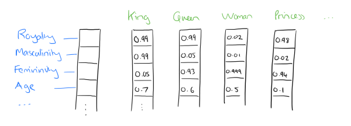

#   文本特征工程

##  文本挖掘

-   文本挖掘范畴
    -   文本处理：将非结构化数据转换为结构化数据
    -   预测建模
        -   文本分类：根据观察到的对象特征值预测其他特征值
    -   描述建模
        -   文本聚类：对数据对象进行概括，以看到数据对象的最重要特征
            -   适应范围非常广
        -   聚类分析
    -   基于相似度方法
        -   需要用户显式指定相似度函数
        -   聚类算法根据相似度的计算结果将相似文本分在同一个组
        -   每个文本只能属于一个组，因此也成为 “硬聚类”
    -   基于模型的方法
        -   文本有多个标签，也成为 “软聚类”

##  文本预处理

-   文本预处理
    -   去除噪声文档、文档中垃圾数据
    -   停用词去除
    -   词根还原（英文）
    -   分词（中文）
    -   词性标注
    -   短语识别
    -   词频统计

##  特征构建

### 语言模型

-   词向量：用向量表示词
    -   *1-of-N Representation*、*One-Hot Representation*：*One-Hot* 表示词
        
        -   特点
            -   词向量维度为整个词汇表大小
            -   简单、效率不高
    -   *Distributed Representation*：*Embedding* 思想，通过训练，将词映射到较短词向量中
        
        -   特点
            -   词向量维度自定义
            -   容易分析词之间关系

### 汉语分词

-   （汉语）分词：添加合适的显性词语边界标志，使所形成的词串反映句子本意
    -   分词是正确处理中文信息的基础
        -   词是中文语义的最小信息单位，可以更好的反映句子中信息
        -   文本基于单字，书面表达方式以汉字作为最小单位，词之间没有显性界限标志
    -   分词方法
        -   基于词典
            -   *FMM*：正向最大匹配分词
            -   *BMM*：逆向最大匹配分词
            -   *BM* 法：双向扫描法
            -   逐词遍历
        -   基于统计模型
            -   *N-最短路径*
            -   *HMM*
            -   *N元语法*
            -   由字构词的汉语分词方法

-   分词难点
    -   分词单位
        -   二字、三字以及结合紧密、使用稳定的四字成语
        -   四字词或结合紧密、使用稳定的四字词组
        -   五字、五字以上谚语、格言等（分开后如不违背原有组合意义，应切分）
    -   歧义切分
        -   交集型切分歧义
        -   组合型切分歧义
    -   未登录词识别
        -   词表词：记录在词表中的词
        -   未登录词：词表中没有的词、或已有训练语料中未曾出现词（此时也称为 *out of vocabulary*）
            -   真实文本切分中，未登录词总数大约 9 成是专有名词，其余为新词
            -   未登录词对分词精度影响是歧义词的 10 倍
        -   命名实体识别：实体名词、专业名词
            -   界定规则不存在太大分歧、构成形式有一定规律
            -   在文本中只占 8.7%，引起分词错误率 59.2%
    -   词性标注：在给定句子中判定每个词的语法范畴，确定词性并加以标注的过程
        -   *Part of Speech* 词性作为特征可以更好的识别词语之间关系
            -   词性标注计数为 *phrase chunking* 词组组块的界定、*entities and relationship* 实体与关系的识别打下良好基础，有利于深入探索文本语义信息
            -   词组的形式提高了特征向量的语义含量，使得向量更稀疏
        -   难点
            -   汉语缺乏词形态变化
            -   常用词兼类现象严重：占 11%
            -   研究者主观原因：不同语料库有不同规定、划分方法

####    词典分词方法

-   *Forward Maximum Matching Method* 正向最大匹配分词
    -   步骤
        -   记词典中最长此表包含汉字数量为 $M$
        -   从材料中选取前 $m = M$ 个汉字去作为匹配字段，查找分词词典
            -   若存在匹配词，则将其切分出
            -   否则 $m = m - 1$，重复
        -   重复直至材料分词完毕
    -   特点
        -   对交叉歧义、组合歧义没有解决办法
        -   错误切分率为 $\frac 1 {169}$

-   *Backward Maximum Matching Method* 逆向最大匹配分词：类似 *FMM*，仅从材料/句子末尾开始处理
    -   特点
        -   错误切分率 $\frac 1 {245}$，较 *FMM* 更有效

-   *Bi-direction Matching Method* 双向扫描法：比较 *FMM、BMM法切分结果，决定正确切分
    -   特点
        -   可以识别分词中交叉语义

####    *N-最短路径*

-   N-最短路径
    -   思想
        -   考虑待切分字串 $S=c_1 c_2 \cdots c_n$，其中 $c_i$ 为单个字、$n$ 为串长
        -   建立节点数为 $n+1$ 的切分有向无环图，各节点编号为 $V_0, V_1, \cdots, V_n$
            -   相邻节点间存在边
            -   若 $w=c_i c_{i+1} \cdots c_j$ 是一个词，则节点 $v_{i-1}, v_j$ 直接存在边
            -   所有边距离均为 1
        -   求有图无环图中最短路径
    -   特点
        -   算法时间复杂度为 $O(n*N*K)$
            -   $n$：字串长度
            -   $N$：最短路径数目
            -   $k$：某个字作为词末端字的平均次数

-   考虑噪声情况下改进：基于统计信息的粗分模型
    -   考虑词串 $W$ 经过信道传输，由于噪声干扰丢失词界切分标志，到输出端为字串 $C$
    -   *N-最短路径* 词语粗分模型可以改进为：求 $N$ 个候选切分 $W$，使得概率 $P(W|C)$ 为前 $N$ 个最大值
        $$ P(W|C) = \frac {P(W) P(C|W)} {P(C)} $$
        > - $P(C)$：字串概率，常数
        > - $P(C|W)$：仅有
    -   采用一元统计模型，设 $W=w_1w_2\cdots W_m$ 是字串 $S=c_1c_2\cdots c_n$ 的切分结果，则其切分概率为
        $$\begin{align*}
        P(W) & = \prod_{i=1}^m P(w_i) \\
        P^{*}(W) &= -ln P(w) = \sum_{i=1}^m (-ln P(W_i))
        \end{align*}$$
        > - $P(w_i)$：词 $w_i$ 出现概率，在大规模预料训练的基础上通过极大似然方法得到
    -   则 $-lnP(w_i)$ 可看作是词 $w_i$ 在切分有向无环图中对应距离，得到改进 *N-最短路径* 方法

####    由字构词

-   由字构词
    -   思想：将分词过程看作字分类问题，认为每个字在构造特定词语时，**占据确定的位置**
        -   中文词一般不超过 4 个字，字位数量很小
            -   首部 *B*
            -   词中 *M*
            -   词尾 *E*
            -   单独成词 *S*
        -   部分汉字按一定方式分布，有规律
        -   利用相对固定的字推断相对不定的字的位置问题
        -   虽然无法将所有词列入词典，但字基本稳定
    -   优势
        -   能平衡词表词、未登录词
        -   简化分词系统设计
            -   无需强调词表词信息
            -   无需设置特定未登录词识别模块
    -   步骤
        -   对所有字根据预定义的特征进行 **词位特征学习**，获得概率模型
        -   在带待分字串上根据字与字之间的结合紧密程度得到词位的分类结果
        -   根据词位定义直接获得最终分词结果

-   *Productivity* 能产度：字 $c_i$ 在词位 $t_j$ 的能产度定义为
    $$ P_{c_i}(t_j) = \frac {count(c_i, t_j)} \sum_{t_j \in T} count(c_i, t_j) $$
    > - $T = {B, B_2, B_3, M, E, S}$
    -   主词位：给定字在其上能产度高于 0.5 的词位
        | 标记   | B     | B2   | B3   | M    | E     | S     | 总字量 |
        |--------|-------|------|------|------|-------|-------|--------|
        | 字量   | 1634  | 156  | 27   | 33   | 1438  | 632   | 3920   |
        | 百分比 | 31.74 | 3.03 | 0.52 | 0.64 | 27.94 | 12.28 | 76.16  |
        > - *MSRA2005 语料库* 中有主词位的字量分布
    -   自由字：没有主词位的字
        -   自由字是基于词位分类的分词操作得以有效进行的的基础之一
    > - 字：不仅限于汉字，包括标点、外文字母、注音符号、数字等任何可能文字符号

##  单词向量空间模型

-   *Bag of Word* 词袋模型：将文本以词为单位切分 token 化，文档视为词的集合
    -   文章可以表示为稀疏长向量，向量每个维度代表一个单词
        -   针对有序语句，将单词两两相连
        -   词维度权重反映单词在原文章中重要程度

-   *N-gram* 模型：将连续出现的 $n, n \leq N$ 个词组成的词组 *N-gram* 作为单独特征放到向量中
    -   相较于词袋模型，考虑单词组合意义
    -   *Word Stemming*：将不同词性单词统一为同一词干形式
        -   同一个词可能有多种词性变化，却拥有相同含义

### *Vector Space Model*

-   向量空间模型
    -   用向量表示文档、句子、段落、整篇文章
        -   *Document*：文档，句子、段落、整篇文章
        -   *Term*、*Feature*：词根、词、短语、其他
        -   *Weight*：项的权重，每个特征项在文档中重要程度
    -   相似度比较
        -   内积
            $$ sim(D_1, D_2) = \sum_{k=1}^n w_{1,k} w_{2,k} $$
        -   *Cosine* 相似度
            $$ cos(D_1, D_2) = cos \theta = \frac {\sum_{k=1}^n w_{1,k} w_{2,k}}
                {\sqrt{\sum_{k=1}^n w_{1,k}^2 \sum_{k=1}^n w_{2,k}^2}} $$

####    特征加权

-   特征加权
    -   特征加权主要包括三个部分（层次）
        -   局部加权：使用词语在文档中的统计量
        -   全局加权：词语在整个数据集中的统计量
        -   标准化
    -   一般化特征加权表达式
        $$ L_d(w) G(w) N_d $$
        > - $L_d(w)$：词 $w$ 在文档 $d$ 中的局部权重
        > - $G(w)$：词 $w$ 在文档集合中的全局权重
        > - $N_d$：文档 $d$ 的标准化因子

-   权重指标
    -   布尔权重：$bw_{t,d} = \{0, 1\}$
    -   *TF* 绝对词频：$TF_{t,d} = \frac {n_{t,d}} {n_d}$
    -   *IDF* 倒排文档频度：$IDF_{t,d} = log \frac M {m_t}$
    -   *TF-IDF*：$TF-IDF_{t,d} = TF_{t,d} * IDF_{t,d}$
    -   *TF-IWF*：$TF_IWF_{t,d}= TF_{t,d} log \frac {\sum_{t=1}^T \sum_{d=1}^N n_{t,d}} {\sum_{t=1} n_{t,d}}$
    > - $t_{t,d}$：文档 $d$ 中出现特征 $t$ 的次数
    > - $t_d$：文档 $d$ 中出现总词数
    > - $m_t$：训练集中出现特征 $t$ 文档数
    > - $M$：训练集中文档总数
    > - $K$：特征总数量

####    特征筛选

-   通过文档频率进行特征选择：按文档频率大小对词条进行排序
    -   *Document Frequency* 文档频率：文本数据中包含某词条的文档数目
    -   将 *DF* 小于某阈值的词删除
        -   稀有词项全局影响力不大
        -   文档若有稀有词向，通常也会有常见词项
        -   此处与通常信息获取观念抵触：稀有信息量更大、更有代表性
    -   将 *DF* 大于某阈值的词删除
        -   太频繁词词项没有区分度
    -   容易实现、可扩展性好

##  话题向量空间模型

### *Latent Semantic Analysis*

-   *LSA*：潜在语义分析
    -   以文档词频矩阵为基础进行分析
        -   得到向量空间模型中文档、词的高维表示
        -   并通过投影形成文档、词在潜在语义空间中的相对稠密的低维表示，缩小问题规模
        -   通过这种低维表示解释出 “文档-语义-词语” 之间的联系
    -   数学描述
        -   *LSA* 将每个文本视为以词语/特征为维度的空间的点，包含语义的文本出现在空间中分布服从某种语义结构
        -   *LSA* 将每个词视为以文档为维度的空间中点
        -   文档由词语构成，词语需要放在文档中理解，体现词语和文档之间的双重概率关系
    -   文本分析中常用的降维技术
        -   特征重构方法
        -   很好解决了同义词、一词多义等现象给文本分析造成的困难
    -   理论依据、假设
        -   认为有潜在语义结构隐含在文档中词语的上下文使用模式中
        -   而文档词频共现矩阵在一定程度可以反映词和不同主题之间关系

####    *SVD* 分解降噪

-   *SVD* 分解降噪
    -   词频共现矩阵 $X=(x_{d,t})$：文档、词语的共现频率矩阵
        -   其中每行代表文档向量
        -   每列代表词语向量
        -   元素 $x_{d,t}$ 表示文档 $d$ 中词 $t$ 出现的频率
    -   对词频共现矩阵 $X$ 进行 *SVD* 分解得到 $X=U \Sigma V^T$
    -   仅保留 $\Sigma$ 中满足阈值要求的较大的前 $r$ 特征值，其余置为 0
        -   得到 $\tilde X = \tilde U \tilde \Sigma \tilde V^T$
            -   $A = \tilde X$：矩阵特征分解后的文档词频矩阵近似
            -   $T = \tilde U$：文档和潜在语义的关系矩阵近似
            -   $S = \tilde V$：词语和潜在语义的关系矩阵近似
            -   $D = \tilde \Sigma$：各潜在语义的重要程度
        -   此即达到信息过滤、去除噪声的目的

-   说明
    -   从数据压缩角度：近似矩阵是秩为 $r$ 的前提下，矩阵 $X$ 的最小二乘意义下最佳近似
    -   $r$ 值过大会增加运算量，一般选择 $r$ 使得贡献率满足
        $$ \sum_{i=1}^r d_i / \sum_{i=1}^K d_i \geq \theta $$
        > - $\theta$：阈值
        > - $K$：原始词频共现矩阵秩
    -   *LSA* 缺点
        -   *SVD* 的向量元素有正、有负，性质难以解释
        -   *SVD* 的实际意义不够明确，难以控制词义据类的效果
        -   涉及高维矩阵运算

####    相似关系计算

-   潜在语义空间中存在：词-词、文本-文本、词-文本 3 种关系，可以通过近似矩阵 $T, S, D$ 计算
    -   比较词汇两两相似度：“正向乘法”
        $$ A A^T = T S D^T D S^T T^T = T S^2 T^T $$
    -   比较文本两两相似度：“逆向乘法”
        $$ A^T A = T^T S^T D D^T S T = T^T S^2 T $$
    -   词汇、文本两两相似度：就是原始矩阵 $X$ 的近似矩阵本身 $A$
        $$ A = T * S * D^T $$

##  *Word2Vec*

-   *Word2Vec*：*Word-Embeding* 的一种实现，使用层次化 *Softmax*、负采样训练词向量
    -   *Hierarchical Softmax* 层次 *Softmax*：使用霍夫曼树代替从隐藏层到输出 *Softmax* 层的映射
        
        -   *Softmax* 需要对 $m$ 个类别求出 *Softmax* 概率，参数多、计算复杂
        -   考虑将 $m$ 个类别划分为多个二分类 *Sigmoid*，即
            -   将总类别划分为两组
            -   依次判断数据点属于哪组
            -   直至数据点所属组仅包含一个类别
        -   则多个 *Sigmoid* 划分构成一棵二叉树，树叶子节点即为 $m$ 类别
            -   二叉树结构可以由多种，最优二叉树应该使得对整个数据集而言，*Sigmoid* 判断次数最少
            -   即应该使用按照数据点频数构建的霍夫曼树

-   *Word2Vec* 中语言模型
    -   *Continuous Bag of Words*：根据上下文词语预测当前词生成概率
        -   *CBOW* 使用词袋模型
            -   特征词上下文相关从平等，不考虑和关注的词之间的距离
    -   *Skip-gram*：根据当前词预测上下文中各个词的生成概率

### 模型

-   目标似然函数
    -   输入 $x^T$ 所属类别霍夫曼编码为 $d=\{d_1,\cdots,d_M\}$，则应最大化如下似然函数
        $$\begin{align*}
        \prod_{i=1}^M P(d_i|x, w_{j_i}) & = \prod_{i=1}^M [\sigma(x^T w_{j_i} + b_{j_i})]^{d_i}
            [1 - \sigma(x^T w_{j_i} + b_{j_i})]^{1-d_i} \\
        P(d_i|x, w_{j_i}) & = \left \{ \begin{array}{l}
            1 - \sigma(x^T w_{j_i} + b_{j_i}), & d_i = 0 \\
            \sigma(x^T w_{j_i} + b_{j_i}), & d_i = 1 \end{array} \right. \\
        \sigma(z) & = \frac 1 {1 + e^z}
        \end{align*}$$
        > - $w_j, b_j$：节点 $j$ 对应 *Sigmoid* 参数
        > - $P(d_i)$：以 *Sigmoid* 激活值作为正例概率（也可以其作为负例概率，但似然函数需更改）
    -   则对数似然函数为
        $$ L = log \prod_{i=1}^M P(d_i|x, w_{j_i}) = \sum_{i=1}^M d_i log [\sigma(x^T w_{j_i} + b_{j_i})]
            {1-d_i} log [1 - \sigma(x^T w_{j_i} + b_{j_i})] $$

-   梯度计算
    -   则参数 $w_{j_M}$ 梯度如下
        $$\begin{align*}
        \frac {\partial L} {\partial w_{j_M}} & = d_M [1-\sigma(x^T w_{j_M} + b_{j_M})] x -
            (1 - d_M) \sigma(x^T w_{j_M} + b_{j_M}) x \\
        & = (d_M - \sigma(x^T w_{j_M} + b_{j_M})) x
        \end{align*}$$
    -   词向量 $x$ 梯度如下
        $$ \frac {\partial L} {\partial x} = \sum_{i=1}^M (d_i - \sigma(x^T w_{j_i} + b_{j_i})) w_{j_i} $$

####    *CBOW* 流程

-   *CBOW* 流程
    -   基于预料训练样本建立霍夫曼树
    -   随机初始化模型参数 $w$、词向量 $w$
    -   对训练集中每个样本 $(context(x), x)$（$2C$ 个上下文）如下计算，直至收敛
        -   置：$e=0, x_w=\frac 1 {2C} \sum_{c=1}^{2C} x_c$
        -   对 $x$ 的霍夫曼编码 $d=\{d_1, \cdots, d_M\}$ 中 $d_i$ 计算
            $$\begin{align*}
            \sigma_i & = \sigma(x_w^T w_{j_i} + b_{j_i}) \\
            g & = (d_i - \sigma_i) \eta \\
            e & = e + g w_{j_i} \\
            w_{j_i} & = w_{j_i} + g x_w
            \end{align*}$$
        -   更新 $2C$ 上下文词对应词向量
            $$ x_i = x_i + e $$

-   说明
    -   特征词周围上下文词均使用梯度更新，**更新输入**

####    *Skip-Gram* 流程

-   *Skip-Gram* 流程
    -   基于预料训练样本建立霍夫曼树
    -   随机初始化模型参数 $w$、词向量 $w$
    -   对训练集中每个样本 $(x, context(x))$、每个样本中上下文词向量 $x_c$（$2C$ 个上下文），训练直至收敛
        -   置：$e=0$
        -   对 $x$ 的霍夫曼编码 $d=\{d_1, \cdots, d_M\}$ 中 $d_i$ 计算
            $$\begin{align*}
            \sigma_i & = \sigma(x_c^T w_{j_i} + b_{j_i}) \\
            g & = (d_i - \sigma_i) \eta \\
            e & = e + g w_{j_i} \\
            w_{j_i} & = w_{j_i} + g x_c
            \end{align*}$$
        -   更新 $2C$ 上下文词对应词向量
            $$ x_c = x_c + e $$

-   说明
    -   考虑上下文是相互的，则 $P(x_{context}|x)$ 最大化时，$P(x|x_{context})$ 也最大
    -   为在迭代窗口（样本）内更新仅可能多词向量，应该最大化 $P(x|x_{context})$，使用梯度更新上下文 $2C$ 个词向量，**更新输出**（条件概率中更新条件）

### Negtive Sampling

-   *Negtive Sampling* 负采样
    -   思想
        -   通过负采样得到 $neg$ 个负例
        -   对正例、负采样负例建立二元逻辑回归
    -   每个词对应采样概率为词频取 $3/4$ 次幂后加权
        $$ p(x_0) = \frac {count(x_0)^{3/4}} {\sum_{x \in vocab} count(x)^{3/4}} $$
    -   对类别为$j$正例、负采样负例应有如下似然函数、对数似然函数
        $$\begin{align*}
        P(context(x), x) & = \sigma(x^T w_j)
            \prod_{i=1}^{neg} (1 - \sigma(x^T w_j)) \\
        L & = log P(context(x), x) \\
        & = \sum_{i=0}^{neg} [y_i log(\sigma(x^T w_j)) + 
            (1 - y_i) log(\sigma (x^T w_j))]
        \end{align*}$$
        > - $y_i$：样本点标签，$y_0$为正例、其余负例
    -   同普通 *LR* 二分类，得到参数、词向量梯度
        $$\begin{align*}
        \frac {\partial L} {\partial w_j} & = (y_i - \sigma(x^T w_j)) x \\
        \frac {\partial L} {\partial x} & = \sum_{i=1}^{neg} (y_i - \sigma(x^T w_j)) w_j
        \end{align*}$$

