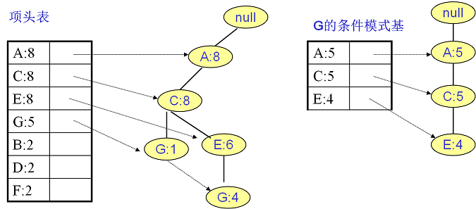
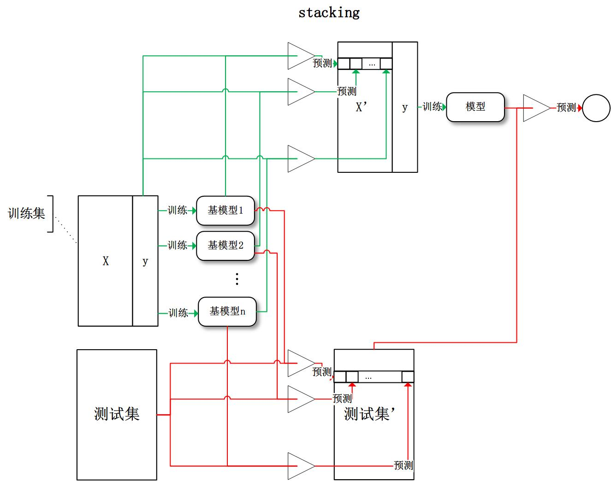
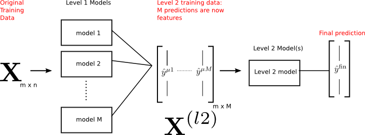
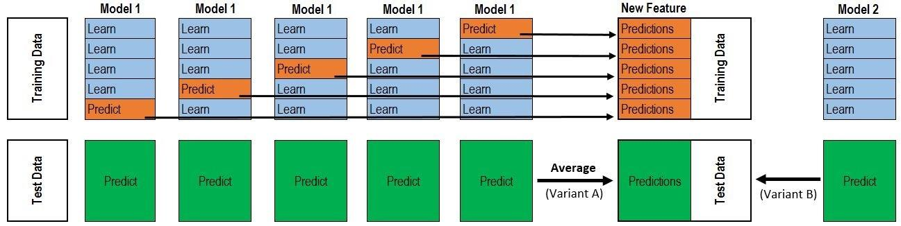
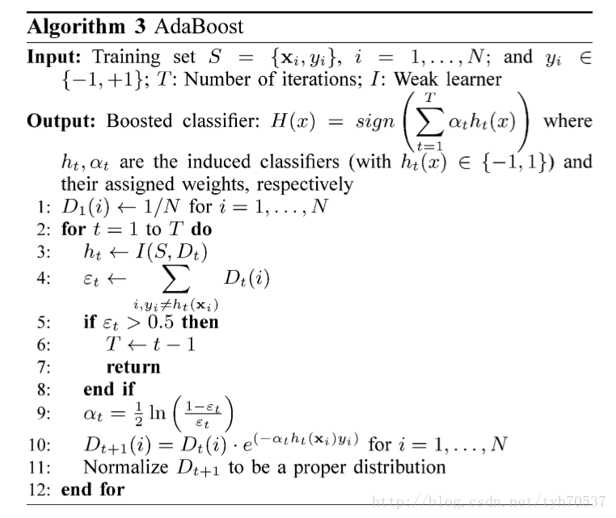

##  *Linear Regression*

-   线性回归模型 $y = A\beta$：寻找一组系数用于将自变量的线性组合表示因变量
    -   通常以最小化残差平方作为优化目标，即
        $$ \min_{\beta \in R^n} \{ ||y - A\beta||_2^2 \} $$

### 子集回归特征选择

-   子集回归：从特征中选择部分特征构成子集拟合回归模型
    -   特征子集选择独立于回归模型拟合，属于封装器特征选择
    -   最优子集回归：从所有特征子集中选择最优子集
        -   特点
            -   可以得到稀疏的模型
            -   但搜索空间离散，可变性大，稳定性差
    -   *Forward Feature Elimination* 前向变量选择：从空集开始逐渐增加剩余最优特征直至稳定
        -   步骤
            -   初始变量集合 $S_0 = \varnothing$
            -   选择具有某种最优特性的变量进入变量集合，得到 $S_1$
            -   第 $j$ 步时，从剩余变量中选择最优变量进入集合，得到 $S_{j+1}$
            -   若满足终止条件，则结束，否则重复上步添加变量
                -   $j$ 达到上限
                -   添加剩余变量均无法满足要求
    -   *Backward Feature Elimination* 后向变量选择：从全集开始逐渐剔除剩余最差特征直至稳定
        -   步骤
            -   初始变量集合 $S_0$ 包含全部变量
            -   从变量集合中剔除具有某种最差特性变量，得到 $S_1$
            -   第 $j$ 步时，从剩余变量中剔除最差变量，得到 $S_{j+1}$
            -   若满足终止条件，则结束，否则重复上步添加变量
                -   $j$ 达到上限
                -   剔除剩余变量均无法满足要求

### *Ridge Regression*

$$ \min_{\beta \in R^n} \left\{ ||y - A\beta||_2^2 + \lambda ||\beta||_2^2 \right\} $$

-   *Ridge Regression* 岭回归：在线性回归模型上添加 $L_2$ 范数
    -   作为连续收缩方法
        -   通过 *bias-variance trade-off*，岭回归较普通最小二乘预测表现更好
        -   回归过程中可半自动选择特征（集成特征选择），手动剔除低权重特征
        -   倾向于保留所有特征，无法产生疏系数模型

### *LASSO*

$$ \min_{\beta \in R^n} \left\{ ||y - A\beta||_2^2 + \lambda||\beta||_1 \right\} $$

-   *LASSO* ：在线性回归模型上添加 $L_1$ 范数
    -   特点：
        -   能够选择部分特征，产生疏系数模型
        -   特征数大于变量数 $p > n$ 时，即使所有特征都有用，*LASSO* 也只能从中挑选 $n$ 个
        -   如果存在相关性非常高的特征，*LASSO* 倾向于只从该组中选择一个特征，而且是随便挑选的
            -   极端条件下，两个完全相同的特征函数，严格凸的罚函数（如 *Ridge*）可以保证最优解在两个特征的系数相等，而 *LASSO* 的最优解甚至不唯一
    -   可通过 *LAR* 方法求解

####    *Least Angle Regression*

-   *Least Angle Regression* 最小角回归
    -   *Forward Selection*、*Forward Stepwise Regression*
        -   从所有给定特征中选择和因变量 $y$ 相关系数绝对值最大的变量 $x_{j1}$，做线性回归
            -   对于标准化后的变量，相关系数即为变量之间的内积
            -   变量之间相关性越大，变量的之间的夹角越小，单个变量能解释得效果越好
            -   此时残差同解释变量正交
        -   将上一步剩余的残差作为下一轮因变量，将剩余变量投影到残差上重复选择步骤
            -   $k$ 步之后即可选出一组变量，然后用于建立普通线性模型
        -   说明
            -   前向选择算法非常贪心，可能会漏掉一些有效的解释变量，只是因为同之前选出向量相关
    -   *Forward Stagewise* 逐步前向选择
        -   类似前向选择，选择和 $y$ 夹角最小的变量
            -   但是每次只更新较小步长
            -   每次更新后重新选择与 $y$ 夹角最小的变量，使用新变量进行更新
        -   同一个变量可能会被多次更新，即系数会逐渐增加
        -   每次更新一小步，避免了前向选择的可能会忽略关键变量

### *Elastic Net*

$$ \begin{align*}
& \min_{\beta \in R^n} \left\{ ||y - A\beta||_2^2 + \lambda_1||\beta||_1 + \lambda_2||\beta||_2^2 \right\} \\
\Rightarrow &
\min_{\beta^* \in R^p} \left\{ ||y - A^*\beta^*||_2^2 + \lambda^*||\beta^*||_1 \right\} \\

where: & y^* = \begin{pmatrix} y \\
    \vec 0_p \end{pmatrix}  \\
& A^* = \frac 1 {\sqrt {1+\lambda^2}}
    \begin{pmatrix} A \\
    \sqrt {\lambda_2} I_p \end{pmatrix} \\
& \beta^* = \sqrt {1+\lambda_2} \beta \\
& \lambda^* = \frac {\lambda_1} {1+\lambda_2} \\
\end{align*} $$

-   *Elastic Net* 弹性网：在 *Lasso* 的基础上添加系数的二阶范数约束
    -   特点
        -   能同时做变量选择和连续收缩
        -   并且可以选择一组变量
    -   弹性网可以变换为 *Lasso*，适用于所有 *Lasso* 的求解方法
        -   传统的估计方法通过二阶段估计找到参数
            -   首先设置 *Ridge* 系数 $\lambda_2$ 求出待估参数 $\beta$，然后做 *Lasso* 的收缩
            -   这种方法有两次收缩，会导致估计偏差过大，估计不准

> - *Elastic Net*：<http://www.stat.purdue.edu/~tlzhang/mathstat/ElasticNet.pdf>

##  *Naive Bayes Classifier* 

-   *Bayes Classifier* 贝叶斯分类：在训练数据集上学习联合概率分布 $P(X,Y)$，利用后验分布作为输出

###  *Naive Bayes Classifier* 

-   *Naive Bayes Classifier* 朴素贝叶斯
    -   朴素：条件概率分布有条件独立性假设，即特征在类别确定下条件独立
        -   条件独立性假设是比较强的假设，简化模型复杂度，但牺牲描述能力
    -   朴素贝叶斯模型对给定输入 $x$，以最大后验概率 $\arg\max_{c_k} P(Y = c_k | X=x)$ 作为输出
        -   输出 $Y$ 先验分布：输出 $Y$ 在无条件下的各取值可能性
            $$ P(Y=c_k), k = 1,2,\cdots,K $$
        -   特征 $X$ 在输出 $Y$ 各取值下条件概率分布，基于朴素条件独立性假设，各特征在输出 $Y$ 下条件独立的
            $$\begin{align*}
            P(X=x | Y=c_k) & = P(X^{(1)}=x^{(1)}, \cdots, X^{(D)}=x^{(D)} | Y=c_k) \\
            & = \prod_{j=1}^D P(X^{(j)}=x^{(j)}|Y=c_k)
            \end{align*}$$
        -   以上，即可建立联合概率分布 $P(X,Y)$，并计算后验概率
            $$\begin{align*}
            P(Y=c_k|X=x) & = \frac {P(X=x|Y=c_k)P(Y=c_k)} {\sum_{k=1}^K P(X=x|Y=c_k) P(Y=c_k)} \\
            & = \frac {P(Y=c_k) \prod_{j=1}^D P(X^{(j)}|Y=c_k)}
                {\sum_{k=1}^K P(Y=c_k) \prod_{j=1}^D P(X^{(j)}|Y=c_k)} \\
            \hat y &= \arg\max_{c_k} P(Y=c_k) \prod_{j=1}^D P(X^{(j)} = x^{(j)}|Y=c_k)
            \end{align*}$$

-   朴素贝叶斯模型中后验概率最大化等价于 *0-1* 损失的经验风险最小化
    -   *0-1* 损失经验风险为
        $$ \begin{align*}
        R_{emp}(f) & = E[L(Y, f(X))] \\
        & = E_x \sum_{k=1}^K L(y, c_k) P(c_k | X)
        \end{align*} $$
    -   为使经验风险最小化，对训练集中每个$X=x$ 取极小化，对每个个体 $(x,y)$ 有
        $$\begin{align*}
        f(x) & = \arg\min_{c_k} \sum_{k=1}^K L(y, c_k)
            P(c_k|X=x) \\
        & = \arg\min_{c_k} \sum_{k=1}^K P(y \neq c_k|X=x) \\
        & = \arg\min_{c_k} (1-P(y=c_k|X=x)) \\
        & = \arg\max_{c_k} P(y=c_k|X=x)
        \end{align*}$$
        即后验概率最大化

### 极大似然估计

-   极大似然估计
    -   先验概率的极大似然估计为
        $$ P(Y=c_k) = \frac {\sum_{i=1}^N I(y_i = c_k)} N, k=1,2,\cdots,K $$
        > - $N$：样本数量
        > - $K$：输出的取值数量
        > - $c_k$：输出的第 $k$ 取值
    -   条件概率的极大似然估计为
        $$ P(X^{(j)}=a_{j,l}|Y=c_k) = \frac {\sum_{i=1}^N I(x_i^{(j)}=a_{j,l}, y_i=c_k)}
            {\sum_{i=1}^N I(y_i=c_k)} $$
        > - $a_{j,l}, j=1,2,\cdots,N, l=1,2,\cdots,S_j$；第 $j$ 个特征的第 $l$ 个可能取值
        > - $S_j$：第 $j$ 个特征的可能取值数量
        > - $I$：特征函数，满足条件取 1、否则取 0

-   贝叶斯估计
    -   条件概率贝叶斯估计（可验证满足概率分布函数性质）
        $$ P_{\lambda}(X^{(j)}=a_{j,l}|Y=c_k) = \frac {\sum_{i=1}^N I(x_i^{(j)}=a_{j,l}, y_i=c_k) + \lambda}
            {\sum_{i=1}^N I(y_i=c_k) + S_j \lambda} $$
        -   $\lambda$：*Laplace Smoothing* 系数
            -   $\lambda=0$ 即极大似然估计
            -   常取 $\lambda=1$
    -   先验概率贝叶斯估计
        $$ P_{\lambda}(Y=c_k) = \frac {\sum_{i=1}^N I(y_i = c_i) + \lambda} {N + K\lambda} $$

> - 贝叶斯估计能够避免出现估计概率为 0 情况，影响计算后延概率

###  *Semi-Naive Bayes Classifier*

-   *Semi-Naive Bayes Classifier* 半朴素贝叶斯分类器：适当考虑部分特征之间的相互依赖信息
    -   *Semi-Naive Bayes*可以视为是**利用规则对变量加权**，以此来体现相关变量的协同影响
        $$ y = \arg\max_{c_k} P(Y=c_k) \prod_{j=1}^D \beta_j P(X^{(j)} = x^{(j)}|Y=c_k) $$
        -   特别的：权值为 0/1 即为变量筛选

-   *One-Depentdent Estimator* 独依赖估计：假设特征在类别之外最多依赖一个其他特征
    $$ P(X=x|Y=c_k) = \prod_{j=1}^D P(X^{(j)}=x^{(j)} | Y=c_k, pa_j) $$
    > - $pa_j$：特征$X^{(j)}$依赖的父特征
    -   若父特征已知，同样可以使用条件概率计算 $P(X^{(j)}=x^{(j)} | Y=c_k, pa_j)$
        $$ P(X^{(j)}=x^{(j)} | Y=c_k, pa_j) = \frac {P(X^{(j)}=x^{(j)}, Y=c_k, pa_j)} {P(Y=c_k, pa_j)} $$
    -   相应的，*ODE* 形式半朴素贝叶斯分类器输出结果为
        $$ y = \arg\max_{c_k} P(Y=c_k) \prod_{j=1}^D P(X^{(j)} = x^{(j)}|Y=c_k, pa_j) $$
    -   根据确定各特征父特征的不同做法，可以分为不同类型的独依赖分类器
        -   *Super-Parent ODE*：假设所有特征都依赖同一父特征
            $$ y = \arg\max_{c_k} P(Y=c_k, pa) \prod_{j=1}^D P(X^{(j)} = x^{(j)}|Y=c_k, pa) $$
            > - $pa$：所有特征共有的依赖父特征
        -   *Averaged ODE*：类似随机森林方法，尝试将每个属性作为超父特征构建 *SPODE*，以 *SPODE* 集群作为最终模型
            $$ y = \arg\max_{c_k} (\sum_{i=1}^D P(Y=c_k, X^{(i)})
                \prod_{j=1}^D P(X^{(j)} = x^{(j)}|Y=c_k, X^{(i)})) $$
            -   一般只选取训练数据足够，即取特征 $X^{(i)}$ 某个取值的样本数量大于某阈值的 *SPODE* 加入结果
        -   *Tree Augmented Naive Bayes*：基于最大带权生成树确定特征之间依赖关系
            -   计算特征之间条件互信息 $g(X^{(i)}, X^{(j)}| Y)$：刻画特征之间相关性
            -   以特征为节点、互信息为权重构建完全图
            -   选择根节点，基于完全图的构建最大带权生成树（有向边确保单一特征依赖）：仅保留强相关属性之间依赖性

##  *Factor Machine*

$$
\hat y(x) := w_0 + \sum_{i=1}^m w_i x_i + \sum_{i=1}^m
    \sum_{j=i+1}^m <v_i, v_j> x_i x_j
$$
> - $w_0$：全局偏置
> - $w_i$：变量$i$权重
> - $w_{i,j} := <v_i, v_j>$：变量 $i$、$j$ 之间交互项权重
> - $v_i$：$k$ 维向量，变量交叉影响因子

-   *Factor Machine* 因子分解机：将变量交互影响因子化，每个变量用隐向量代表、衡量其交叉影响
    -   *FM* 通过**因子化交互影响解耦交互项参数**
        -   即使没有足够数据也能较好估计高维稀疏特征交互影响参数
            -   无需大量有交互影响（交互特征取值同时非0）样本
            -   包含某交互影响数据也能帮助估计相关的交互影响
            -   **可以学习数据不存在的模式**
        -   可以视为 *embedding*，特征之间关联性用 *embedding* 向量（隐向量）內积表示
    -   模型特点
        -   参数数量、模型复杂度均为线性
            -   可以方便使用 *SGD* 等算法对各种损失函数进行优化
            -   无需像 *SVM* 需要支持向量，可以扩展到大量数据集
        -   适合任何实值特征向量，对某些输入特征向量即类似 *biased MF*、*SVD++*、*PITF*、*FPMC*
    -   模型适用及损失函数
        -   回归：直接用 $\hat y(x)$ 作为回归预测值
        -   二分类：结合 *Logit Loss*、*Hinge Loss* 损失优化
        -   Ranking：$\hat y(x)$ 作为得分排序，使用成对分类损失优化

-   模型表达能力
    -   考虑任何正定矩阵 $W$ 总可以被分解为 $W=V V^T$，则 $k$ 足够大时，*FM* 总可以表达（还原）交叉项权重矩阵 $W$
    -   *FM* 可视为 *MF* 降维的推广
        -   在 *用户-物品* 评分矩阵基础上集成其他特征
        -   特征组合发生所有变量之间
    -   实际应该选取较小的 $k$，提高泛化能力
        -   对较大 $k$，稀疏特征没有足够数据估计复杂交叉项权重矩阵 $W$

> - 另外还有d-way因子分解机，交互作用以PARAFAC模型因子化
    $$
    \hat y(x) := w_0 + \sum_{i=1}^n w_i x_i + \sum_{l=2}^d \sum_{i_1=1}
        \cdots \sum_{i_l=i_{l-1}+1}(\prod_{j=1}^l x_{i_j})
        (\sum_{f=1} \prod_{j=1}^l v_{i_j,f}^{(l)}) \\
    $$
> > -   $V^{(l)} \in R^{n * k_l}, k_l \in N_0^{+}$


### 模型求解

$$\begin{align*}
\sum_{i=1}^m \sum_{j=i+1}^m <v_i, v_j> x_i x_j & = 
    \frac 1 2 \sum_{i=1}^m \sum_{j=i}^m <v_i, v_j> x_i x_j -
    \frac 1 2 \sum_{i=1}^m <v_i, v_i> x_i^2 \\
& = \frac 1 2 (x^T V^T V x - x^T diag(V^T V) x) \\
& = \frac 1 2 (\|Vx\|_2^2 - x^T diag(V^T V) x) \\
& = \frac 1 2 \sum_{f=1}^k ((\sum_{i=1}^m v_{i,f} x_i)^ 2
    - \sum_{i=1}^m v_{i,f}^2 x_i^2) \\
\end{align*}$$
> - $V = (v_1, v_2, \cdots, v_m)$
> - $x = (x_1, x_2, \cdots, x_m)^T$

-   模型
    -   模型计算复杂度为线性 $\in O(kn)$
        -   考虑到稀疏特征，內积只需计算非零值
    -   模型可以使用梯度下降类方法高效学习
        $$\begin{align*}
        \frac {\partial \hat y(x)} {\partial \theta} & = \left \{
            \begin{array}{l}
                1, & \theta := w_0 \\
                x_i, & \theta := w_i \\
                x_i Vx - v_i x_i^2& \theta := v_i
            \end{array} \right. \\
        & = \left \{ \begin{array}{l}
                1, & \theta := w_0 \\
                x_i, & \theta := w_i \\
                x_i \sum_{j=1}^m v_{j,f} x_j - v_{i,f} x_i^2,
                    & \theta := v_{i,f}
            \end{array} \right.
        \end{align*}$$

### *Field-aware FM*

$$\begin{align*}
\hat y(x) & = w_0 + \sum_{i=0}^m w_i x_i + \sum_{a=1}^m
    \sum_{b=a+1}^m <V_{a, f_b}, V_{b, f_a}> x_a x_b \\
& = w_0 + \sum_{i=1}^M \sum_{j=1}^{M_i} w_{i,j} x_{i,j} +
    \sum_{i=1}^M \sum_{j=1}^{M_i} \sum_{a=i}^M \sum_{b=1}^{M_i}
    <V_{i,j,a}, V_{a,b,i}> x_{i,j} x_{a,b}
\end{align*}$$
> - $m$：特征数量
> - $M, M_i$：特征域数量、各特征域中特征数量
> - $V_{i,j,a}$：特征域$i$中$j$特征对特征与$a$的隐向量
> - $V_{a, f_b}$：特征$x_a$对特征$b$所属域$f_b$的隐向量

-   *FFM* 域感知因子分解机：在 *FM* 基础上考虑对特征分域，各特征对不同特征域训练分别训练隐向量
    -   *FFM* 中特征都属于特定域，相同特征域中特征性质应该相同，一般的
        -   连续特征自己单独成域
        -   离散 0/1 特征按照性质划分，归于不同特征域
    -   特征对其他域分别有隐向量表示**和其他域的隐含关系**
        -   考虑交互作用时，对不同域使用不同隐向量计算交互作用
        -   *FFM* 中隐变量维度也远远小于 *FM* 中隐向量维度
    -   模型特点
        -   模型总体类似 *FM*，仅通过多样化隐向量实现细化因子分解
        -   模型总体较 *FM* 复杂度大、参数数量多
            -   无法抽取公因子化简为线性
            -   数据量较小时可能无法有效训练隐向量


##  *Logit Regression*

-   *Logistic Function*
    $$\begin{align*}
    F(x) & = P(X \leq x) = \frac 1 {1 + e^{-(x-\mu)/\gamma}} \\
    f(x) & = F^{'}(x) = \frac {e^{-(x-\mu)/\gamma}}
        {\gamma(1+e^{-(x-\mu)/\gamma})^2}
    \end{align*}$$
    > - $\mu$：位置参数
    > - $\gamma$：形状参数
    -   图像关于的 $(\mu, \frac 1 2)$ 中心对称 $ F(-x+\mu) - \frac 1 2 = -F(x+\mu) + \frac 1 2 $
    -   曲线在靠近 $\mu$ 中心附近增长速度快，两端速度增长慢
    -   形状参数 $\gamma$ 越小，曲线在中心附近增加越快

### *Binomial Logistic Regression*

$$\begin{align*}
P(Y=1|x) & = \frac {exp(wx + b)} {1 + exp (wx + b)} \\
P(Y=0|x) & = \frac 1 {1 + exp(wx + b)} \\
P(Y=1|\hat x) & = \frac {exp(\hat w \hat x)}
    {1 + exp (\hat w \hat x)} \\
P(Y=0|\hat x) & = \frac 1 {1+exp(\hat w \hat x)}
\end{align*}$$
> - $w, b$：权值向量、偏置
> - $\hat x = (x^T|1)^T$
> - $\hat w = (w^T|b)^T$

-   *BiLR* 二项逻辑回归：形式为参数化 *Logisitic* 分布的二分类生成模型
    -   利用逻辑函数，将线性函数 $wx$ 转换为概率，将实例 $x$ 归于条件概率较大类
        -   线性函数值越接近正无穷，概率值越接近1
        -   线性函数值越接近负无穷，概率值越接近0
    -   模型优点
        -   模型输出值位于 0、1 之间，天然具有概率意义，方便观测样本概率分数
        -   可以结合 $l-norm$ 范数正则化解决过拟合、共线性问题
        -   实现简单，广泛用于工业问题
        -   分类时计算量比较小、速度快、消耗资源少
    -   模型缺点
        -   特征空间很大时，性能不是很好，容易欠拟合，准确率一般
        -   对非线性特征需要进行转换

-   逻辑回归模型策略：极大似然估计，即极小对数损失（交叉熵损失）
    $$\begin{align*}
    L(w) & = log \prod_{i=1}^N [\pi(x_i)]^{y_i}
        [1-\pi(x_i)]^{1-y_i} \\
    & = \sum_{i=1}^N [y_i log \pi(x_i) + (1-y_i)log(1-\pi(x_i))] \\
    & = \sum_{i=1}^N [y_i log \frac {\pi(x_i)}
        {1-\pi(x_i)} log(1-\pi(x_i))] \\
    & = \sum_{i=1}^N [y_i(\hat w \hat x_i) -
        log(1+exp(\hat w \hat x_i))]
    \end{align*}$$
    > - $\pi(x) = P(Y=1|x)$
    -   通常采用梯度下降、拟牛顿法求解有以上最优化问题

####    *Odds*、*Odds Ratio*

$$\begin{align*}
odd &= \frac {P(Y=1|x)} {1-P(Y=1|x)} = e^{\hat w \hat x} \\
OR_{x_i+1 / x_i} &= e^{w_i}
\end{align*}$$

-   *OR* 在逻辑回归中意义：$x_i$ 每增加一个单位，*odds* 将变为原来的 $e^{w_i}$ 倍
    -   对数值型变量
        -   多元 *LR* 中，变量对应的系数可以计算相应 *Conditional OR*
        -   可以建立单变量 *LR* ，得到变量系数及相应 *Marginal OR*
    -   对分类型变量
        -   计算变量各取值间对应的 *OR*，建立变量数值化编码模型
        -   根据变量编码方式不同，变量对应 *OR* 的含义不同，其中符合数值变量变动模式的是 *WOE* 线性编码

### *Multi-Nominal Logistic Regression*

$$\begin{align*}
P(Y=j|x) & = \frac {exp(\hat w_j \hat x)} {1+\sum_{k=1}^{K-1}
    exp(\hat w_k \hat x)}, k=1,2,\cdots,K-1 \\
P(Y=K|x) & = \frac 1 {1+\sum_{k=1}^{K-1}
    exp(\hat w_k \hat x)}
\end{align*}$$

-   *Multi-Nominal LR* 多项逻辑斯蒂回归：二项逻辑回归模型推广
    -   策略、算法类似二项逻辑回归模型

##  *Generalized Linear Model*

##  *Maximum Entropy Model*

### 最大熵模型

$$\begin{array}{l}
\max_{P \in \mathcal{C}} & -H(P)=\sum_{x,y} \tilde P(x)
    P(y|x) logP(y|x) \\
s.t. & E_P(f_i) - E_{\tilde P}(f_i) = 0, i=1,2,\cdots,M \\
& \sum_{y} P(y|x)  = 1
\end{array}$$
> - $\tilde P(X)$：样本 $X$ 边缘分布的经验分布 $\tilde P(x) = \frac {I(X=x)} N$
> - $\tilde P(X,Y)$：样本中 $X,Y$ 联合分布的经验分布 $\tilde P(x,y) = \frac {I(X=x,Y=y)} N$
> - $I(X=x), I(X=x,Y=y)$：样本中满足条件的样本点数量
> - $f_i(x,y),i=1,2,\cdots,M$：特征函数，即样本点 $(x,y)$ 存在性，可表示为
    $$ f_i(x, y) = \left \{ \begin{array}{l}
        1, & x、y满足某一事实 \\
        0, & 否则
    \end{array} \right.$$

-   *EM* 最大熵模型：关于特征函数期望相等时，条件熵最大的模型 $P(Y|X)$
    -   期望模型 $P(Y|X)$ 能获取数据中信息，则特征函数关于经验联合分布期望、模型条件期望应相等，即约束条件
        $$\begin{align*}
        E_{\tilde P} = \sum_{x,y} \tilde P(x,y)f(x,y)
        E_P(f(x)) = \sum_{x,y} \tilde P(x)P(y|x)f(x,y)
        E_P(f) & = E_{\tilde P}(f) \\
        \sum_{x,y} \tilde P(x)P(y|x)f(x,y) & = \sum_{x,y} \tilde P(x,y)f(x,y)
        \end{align*}$$
    -   考虑，满足所有约束条件的模型集合为
        $$ \mathcal{C} = \{P | E_{P(f_i)} = E_{\tilde P (f_i)}, i=1,2,\cdots,n \} $$
        定义在条件概率分布 $P(Y|X)$ 上的条件熵为
        $$ H(P) = -\sum_{x,y} \tilde P(x) P(y|x) logP(y|x) $$
        则，模型集合 $\mathcal{C}$ 中条件熵最大者即为最大是模型

### 拉格朗日对偶

-   考虑拉格朗日函数 $L(P, w)$ 是关于 $P$ 的凸函数，则原始问题、对偶问题解相同
    $$\begin{align*}
    L(P, w) & = -H(P) - w_0(1-\sum_y P(y|x)) + \sum_{m=1}^M
        w_m(E_{\tilde P}(f_i) - E_P(f_i)) \\
    & = \sum_{x,y} \tilde P(x) P(y|x) logP(y|x) + w_0 (1-\sum_y P(y|x))
        + \sum_{m=1}^M w_m (\sum_{x,y} \tilde P(x,y)f_i(x, y) - \tilde P(x)P(y|x)f_i(x,y))
    \end{align*}$$
    -   记
        $$\begin{align*}
        \Psi(w) & = \min_{P \in \mathcal{C}} L(P, w)
            = L(P_w, w) \\
        P_w & = \arg\min_{P \in \mathcal{C}} L(P, w) = P_w(Y|X)
        \end{align*}$$

-   求 $L(P, w)$ 对 $P(Y|X)$ 偏导
    $$\begin{align*}
    \frac {\partial L(P, w)} {\partial P(Y|X)} & =
        \sum_{x,y} \tilde P(x)(logP(y|x)+1) - \sum_y w_0 -
        \sum_{x,y}(\tilde P(x) \sum_{i=1}^N w_i f_i(x,y)) \\
    & = \sum_{x,y} \tilde P(x)(log P(y|x) + 1 - w_0 -
        \sum_{i=1}^N w_i f_i(x, y))
    \end{align*}$$
    偏导置 0，考虑到 $\tilde P(x) > 0$，其系数必始终为 0，有
    $$\begin{align*}
    P(Y|X) & = \exp(\sum_{i=1}^N w_i f_i(x,y) + w_0 - 1) \\
    & = \frac {exp(\sum_{i=1}^N w_i f_i(x,y))} {exp(1-w_0)}
    \end{align*}$$

-   考虑到约束 $\sum_y P(y|x) = 1$，有
    $$\begin{align*}
    P_w(y|x) & = \frac 1 {Z_w(x)} exp(\sum_{i=1}^N w_i
        f_i(x,y)) \\
    Z_w(x) & = \sum_y exp(\sum_{i=1}^N w_i f_i(x,y)) \\
    & = exp(1 - w_0)
    \end{align*}$$
    > - $Z_w(x)$：规范化因子
    > - $f(x, y)$：特征
    > - $w_i$：特征权值

-   原最优化问题等价于求解偶问题极大化问题 $\max_w \Psi(w)$
    $$\begin{align*}
    \Psi(w) & = \sum_{x,y} \tilde P(x) P_w(y|x) logP_w(y|x)
        + \sum_{i=1}^N w_i(\sum_{x,y} \tilde P(x,y) f_i(x,y)
        - \sum_{x,y} \tilde P(x) P_w(y|x) f_i(x,y)) \\
    & = \sum_{x,y} \tilde P(x,y) \sum_{i=1}^N w_i f_i(x,y) +
        \sum_{x,y} \tilde P(x,y) P_w(y|x)(log P_w(y|x) -
        \sum_{i=1}^N w_i f_i(x,y)) \\
    & = \sum_{x,y} \tilde P(x,y) \sum_{i=1}^N w_i f_i(x,y) -
        \sum_{x,y} \tilde P(x,y) P_w(y|x) log Z_w(x) \\
    & = \sum_{x,y} \tilde P(x,y) \sum_{i=1}^N w_i f_i(x,y) -
        \sum_x \tilde P(x) log Z_w(x)
    \end{align*}
    $$
    记其解为 $w^{*} = \arg\max_w \Psi(w)$ 带入即可得到最优（最大熵）模型 $P_{w^{*}}(Y|X)$

####    对偶与最大似然

-   对偶函数 $\Psi(w)$ 等价于对数似然函数 $L_{\tilde P}(P_w)$，即最大熵模型中，对偶函数极大等价于模型极大似然估计
    -   已知训练数据的经验概率分布为 $\tilde P(X,Y)$，则条件概率分布 $P(Y|X)$ 的对数似然函数为
        $$\begin{align*}
        L_{\tilde P}(P_w) & = N log \prod_{x,y} P(y|x)^{\tilde P(x,y)} \\
        & = \sum_{x,y} N * \tilde P(x,y) log P(y|x)
        \end{align*}$$
    -   省略样本数量常数 $N$ 将最大熵模型带入，可得
        $$\begin{align*}
        L_{\tilde P_w} & = \sum_{x,y} \tilde P(y|x) logP(y|x) \\
        & = \sum_{x,y} \tilde P(x,y) \sum_{i=1}^N w_i f_i(x,y) -
            \sum_{x,y} \tilde P(x,y)log Z_w(x) \\
        & = \sum_{x,y} \tilde P(x,y) \sum_{i=1}^N w_i f_i(x,y) -
            \sum_x \tilde P(x) log Z_w(x) \\
        & = \Psi(w)
        \end{align*}$$

### 改进的迭代尺度法

-   改进的迭代尺度法
    -   不断更新参数向量更新 $w+\sigma=(w_1+\sigma_1,\cdots,w_M+\sigma_M)$ 使得模型对数似然函数（对偶函数值）增加，直到找到对数似然函数极大值
    -   寻找并使用对数似然函数的下界作为迭代目标
    -   类似坐标下降，每次仅优化参数向量某个分量

-   对给定经验分布 $\tilde P(x,y)$，参数向量更新至 $w+\sigma$ 时，对数似然函数值变化为
    $$\begin{align*}
    L(w+\sigma) - L(w) & = \sum_{x,y} \tilde P(x,y)
        log P_{w+\sigma}(y|x) - \sum_{x,y} \tilde P(x,y)
        log P_w(y|x) \\
    & = \sum_{x,y} \tilde P(x,y) \sum_{i=1}^M \sigma_i
        f_i(x,y) - \sum_x \tilde P(x) log \frac
        {Z_{w+\sigma}(x)} {Z_w(x)} \\
    & \geq \sum_{x,y} \tilde P(x,y) \sum_{i=1}^M \sigma_i
        f_i(x,y) + 1 - \sum_x \tilde P(x) \frac
        {Z_{w+\sigma}(x)} {Z_w(x)} \\
    & = \sum_{x,y} \tilde P(x,y) \sum_{i=1}^M \sigma_i
        f_i(x,y) + 1 - \sum_x \tilde P(x) \sum_y P_y(y|x)
        exp(\sum_{i=1}^M \sigma_i f_i(x,y))
    \end{align*}$$
    -   不等式步利用 $a - 1 \geq log a, a \geq 1$
    -   最后一步利用
        $$\begin{align*}
        \frac {Z_{w+\sigma}(x)} {Z_w(x)} & = \frac 1 {Z_w(x)}
            \sum_y exp(\sum_{i=1}^M (w_i + \sigma_i)
            f_i(x, y)) \\
        & = \frac 1 {Z_w(x)} \sum_y exp(\sum_{i=1}^M w_i
            f_i(x,y) + \sigma_i f_i(x,y)) \\
        & = \sum_y P_w(y|x) exp(\sum_{i=1}^n \sigma_i
            f_i(x,y))
        \end{align*}$$

-   记上式右端为 $A(\sigma|w)$，则其为对数似然函数改变量的一个下界
    $$ L(w+\sigma) - L(w) \geq A(\sigma|w) $$
    -   若适当的 $\sigma$ 能增加其值，则对数似然函数值也应该增加
    -   函数 $A(\sigma|w)$ 中因变量 $\sigma$ 为向量，难以同时优化，尝试每次只优化一个变量 $\sigma_i$，固定其他变量 $\sigma_j$

-   记
    $$f^{**} (x,y) = \sum_i f_i(x,y)$$
    考虑到 $f_i(x,y)$ 为二值函数，则 $f^{**}(x,y)$ 表示所有特征在 $(x,y)$ 出现的次数，且有
    $$
    A(\sigma|w) = \sum_{x,y} \tilde P(x,y) \sum_{i=1}^M
        \sigma_i f_i(x,y) + 1 - \sum_x \tilde P(x)
        \sum_y P_w(y|x) exp(f^{**}(x,y) \sum_{i=1}^M
        \frac {\sigma_i f_i(x,y)} {f^{**}(x,y)})
    $$

-   考虑到 $\sum_{i=1}^M \frac {f_i(x,y)} {f^{**}(x,y)} = 1$，由指数函数凸性、*Jensen 不等式* 有
    $$
    exp(\sum_{i=1}^M \frac {f_i(x,y)} {f^{**}(x,y)} \sigma_i
        f^{**}(x,y)) \leq \sum_{i=1}^M \frac {f_i(x,y)}
        {f^{**}(x,y)} exp(\sigma_i f^{**}(x,y))
    $$
    则
    $$
    A(\sigma|w) \geq \sum_{x,y} \tilde P(x,y) \sum_{i=1}^M
        \sigma_i f_i(x,y) + 1 - \sum_x \tilde P(x) \sum_y
        P_w(y|x) \sum_{i=1}^M \frac {f_i(x,y)} {f^{**}(x,y)}
        exp(\sigma_i f^{**}(x,y))
    $$

-   记上述不等式右端为 $B(\sigma|w)$，则有
    $$ L(w+\sigma) - L(w) \geq B(\sigma|w) $$
    其为对数似然函数改变量的一个新、相对不紧的下界

-   求 $B(\sigma|w)$ 对 $\sigma_i$ 的偏导

    $$
    \frac {\partial B(\sigma|w)} {\partial \sigma_i} =
        \sum_{x,y} \tilde P(x,y) f_i(x,y) -
        \sum_x \tilde P(x) \sum_y P_w(y|x) f_i(x,y)
        exp(\sigma_i f^{**}(x,y))
    $$
    置偏导为 0，可得
    $$
    \sum_x \tilde P(x) \sum_y P_w(y|x) f_i(x,y) exp(\sigma_i
        f^{**}(x,y)) = \sum_{x,y} \tilde P(x,y) f_i(x,y) =
        E_{\tilde P}(f_i)
    $$
    其中仅含变量 $\sigma_i$，则依次求解以上方程即可得到 $\sigma$

####    步骤

> - 输入：特征函数 $f_1, f_2, \cdots, f_M$、经验分布 $\tilde P(x)$、最大熵模型 $P_w(x)$
> - 输出：最优参数值 $w_i^{*}$、最优模型 $P_{w^{*}}$

1.  对所有 $i \in \{1,2,\cdots,M\}$，取初值 $w_i = 0$
2.  对每个 $i \in \{1,2,\cdots,M\}$，求解以上方程得 $\sigma_i$
    -   若 $f^{**}(x,y)=C$ 为常数，则 $\sigma_i$ 有解析解
        $$ \sigma_i = \frac 1 C log \frac {E_{\tilde P}(f_i)} {E_P(f_i)} $$
    -   若 $f^{**}(x,y)$ 不是常数，则可以通过牛顿法迭代求解
        $$ \sigma_i^{(k+1)} = \sigma_i^{(k)} - \frac
            {g(\sigma_i^{(k)})} {g^{'}(\sigma_i^{(k)})} $$
        > - $g(\sigma_i)$：上述方程对应函数
        -   上述方程有单根，选择适当初值则牛顿法恒收敛
3.  更新 $w_i$，$w_i \leftarrow w_i + \sigma_i$，若不是所有 $w_i$ 均收敛，重复 2

### *BFGS* 算法

-   为方便，将对偶函数改为求极小
    $$\begin{array}{l}
    \min_{w \in R^M} f(w) = \sum_x \tilde P(x) log \sum_{y}
        exp(\sum_{i=1}^M w_i f_i(x,y)) - \sum_{x,y}
        \tilde P(x,y) \sum_{i=1}^M w_i f_i(x,y)
    \end{array}$$
    -   梯度为
        $$\begin{align*}
        g(w) & = (\frac {\partial f(w)} {\partial w_i}, \cdots,
            \frac {\partial f(w)} {\partial w_M})^T \\
        \frac {\partial f(w)} {\partial w_M} & = \sum_{x,y}
            \tilde P(x) P_w(y|x) f_i(x,y) - E_{\tilde P}(f_i)
        \end{align*}$$
    -   应用 *BFGS* 算法求解

##  *Perceptron*

$$ f(x) = sign(wx + b) $$
> - $x \in \chi \subseteq R^n$：输入空间
> - $y \in \gamma \subseteq R^n$：输出空间
> - $w \in R^n, b \in R$：*weight vector*、*bias*
> - 也可表示为 $\hat w = (w^T, b^T)^T, \hat x = (x^T + 1)^T$，则有 $\hat w \hat x = wx + b$

-   感知机：线性二分类模型（判别模型）
    -   感知机模型假设空间：定义在特征空间的所有线性分类器，即函数集合 $\{ f|f(x)=sign(wx+b) \}$
    -   线性方程 $wx+b=0$ 对应特征空间 $R^n$ 中一个 *Separating Hyperplane*
        -   超平面将特征空间划分为两个部分，其中分别被分为正、负两类
    -   常用损失函数（策略）
        -   *0-1* 损失：误分点数量最小化
        -   绝对值损失：误分类点到超平面距离和最小化
            $$ L(w,b) = -\sum_{x_i \in M} y_i(wx_i + b) $$
            > - $M$：误分类点集合
            > - 对误分类数据有 $(x_i, y_i)$，有$-y_i(wx_i + b) > 0$
    -   求解算法
        -   *SGD*

-   *Linearly Separable Data Set* 线性可分数据集：对数据集 $T=\{(x_1,y_1),\cdots,(x_N,y_N)\}$，若存在超平面 $S: wx + b=0$ 能够将正、负实例点，完全正确划分到超平面两侧，即
    $$\begin{align*}
    wx_i + b > 0, & \forall y_i > 0 \\
    wx_i + b < 0, & \forall y_i < 0
    \end{align*}$$
    则称数据集 $T$ 为线性可分数据集

##  *Support Vector Machine*

-   *SVM* 支持向量机：定义在特征空间上的间隔最大线性分类器
    -   学习策略：间隔最大化
        -   可形式化为求解凸二次规划问题，也等价于正则化的合页损失函数最小化问题
    -   *SVM* 模型数学形式与感知机相同，都是线性分类器，但间隔最大策略使其有别于感知机
        -   *SVM* 训练数据线性可分时分离超平面唯一
        -   感知机中误分类最小策略（0-1损失）得到分离超平面的解无穷多个
        -   感知机距离和最小策略（平方损失）得到分离超平面唯一，但与 *SVM* 不同
    -   *SVM* 假设输入空间、特征空间为两个不同空间
        -   其中
            -   输入空间：欧氏空间或离散集合
            -   特征空间：希尔伯特空间
            -   输出空间：离散集合
        -   线性（可分）支持向量机假设两个空间元素一一对应，并将输入空间中的输入映射为特征空间中特征向量
        -   非线性支持向量机利用，输入空间到特征空间的非线性映射（核函数）将输入映射为特征向量

-   *Support Vector* 支持向量：训练数据集中与超平面距离最近的样本点实例
    -   在线性可分支持向量机中即为使得约束条件取等号成立的点
        -   在决定分离超平面时，只有支持向量起作用，其他实例点不起作用
        -   支持向量一般很少，所以支持向量机由很少的 “重要” 训练样本决定
    -   间隔边界：超平面 $wx + b = \pm 1$
        -   支持向量位于其上
        -   两个间隔边界之间距离称为间隔 $=\frac 2 {\|w\|}$

### *Linear Support Vector Machine in Linearly Separable Case*

$$\begin{align*}
& \begin{array}{l}
    \max_{w,b} & \gamma & \\
    s.t. & \frac {y_i} {\|w\|} (wx + b) \geq \gamma, i=1,2,\cdots,N
\end{array} \\
\Rightarrow & \begin{array}{l}
    \max_{w,b} & \frac {\hat{\gamma}} {\|w\|} \\
    s.t. & y_i(wx_i + b) \geq \hat{\gamma}, i=1,2,\cdots,N
\end{array} \\
\Rightarrow & \begin{array}{l}
    \min_{w,b} & \frac 1 2 \|w\|^2 \\
    s.t. & y_i(wx_i + b) - 1 \geq 0, i=1,2,\cdots,N
\end{array} \\
\end{align*}$$

-   线性可分支持向量机、硬间隔支持向量机
    -   策略：训练数据线性可分时，通过硬间隔最大化策略学习
        -   直观含义：不仅将正负实例分开，而且对于最难分的实例点（离超平面最近的点），也有足够大的确信度将其分开
    -   最大间隔分离平面存在性：若训练数据集 $T$ 线性可分，则可将训练数据集中样本点完全正确分开的最大间隔分离超平面存在且唯一

> - *Hard-margin Maximization*：硬间隔最大化，最大化超平面 $(w,b)$ 关于线性可分训练数据集的两类样本集几何间隔最大化

#### 最大间隔分离平面存在性

-   存在性
    -   训练数据集线性可分，所以以上中最优化问题一定存在可行解
    -   又目标函数有下界，则最优化问题必有解
    -   又训练数据集中正、负类点都有，所以 $(\vec 0,b)$ 必不是最优化可行解

-   唯一性
    -   若以上最优化问题存在两个最优解 $(w_1^{*},b_1^{*})$、 $w_2^{*},b_2^{*}$
    -   显然 $\|w_1^{*}\| = \|w_2^{*}\| = c$，$(w=\frac {w_1^{*}+w_2^{*}} 2,b=\frac {b_1^{*}+b_2^{*}} 2)$ 是最优化问题的一个可行解，则有
        $$ c \leq \|w\| \leq \frac 1 2 \|w_1^{*}\| + \frac 1 2 \|w_2^{*} = c $$
    -   则有 $\|w\|=\frac 1 2 \|w_1^{*}\|+\frac 1 2 \|w_2^{*}\|$，有 $w_1^{*} = \lambda w_2^{*}, |\lambda|=1$
        -   $\lambda = -1$，不是可行解，矛盾
        -   $\lambda = 1$，则 $w_1^{(*)} = w_2^{*}$，两个最优解写为 $(w^{*}, b_1^{*})$、$(w^{*}, b_2^{*})$
    -   设 $x_1^{+}, x_1^{-}, x_2^{+}, x_2^{-}$ 分别为对应以上两组超平面，使得约束取等号、正/负类别的样本点，则有
        $$\begin{align*}
        b_1^{*} & = -\frac 1 2 (w^{*} x_1^{+} + w^{*} x_1^{-}) \\
        b_2^{*} & = -\frac 1 2 (w^{*} x_2^{+} + w^{*} x_2^{-}) \\
        \end{align*}$$
        则有
        $$ b_1^{*} - b_2^{*} = -\frac 1 2
            [w^{*}(x_1^{+} - x_2^{+}) + w^{*} (x_1^{-} - x_2^{-})] $$
    -   又因为以上支持向量的性质可得
        $$\begin{align*}
        w^{*}x_2^{+} + b_1^{*} & \geq 1 = w^{*}x_1^{+} + b_1^{*} \\
        w^{*}x_1^{+} + b_2^{*} & \geq 1 = w^{*}x_2^{+} + b_2^{*}
        \end{align*}$$
        则有 $w^{*}(x_1^{+} - x_2^{+})=0$，同理有 $w^{*}(x_1^{-} - x_2^{-})=0$
    -   则 $b_1^{*} - b_2^{*} = 0$

#### *Lagrange Duality*

-   考虑拉格朗日函数 $L(w,b,\alpha)$ 是关于 $w,b$ 的凸函数，则原始问题、对偶问题解相同
    $$ L(w,b,\alpha) = \frac 1 2 \|w\|^2 - 
        \sum_{i=1}^N \alpha_i y_i (wx_i + b) + \sum_{i=1}^N \alpha_i $$

-   考虑对偶问题 $\max_{\alpha} \min_{w,b} L(w,b,\alpha)$，求偏导置 0
    $$\begin{align*}
    \triangledown_w L(w,b,\alpha) & = w - \sum_{i=1}^N \alpha_i y_i x_i = 0 \\
    \triangledown_b L(w,b,\alpha) & = -\sum_{i=1}^N \alpha_i y_i = 0
    \end{align*}$$
    解得
    $$\begin{align*}
    w &= \sum_{i=1}^N \alpha_i y_i x_i \\
    \sum_{i=1}^N \alpha_i y_i &= 0
    \end{align*}$$

-   带入拉格朗日函数可得
    $$\begin{align*}
    L(w,b,\alpha) & = \frac 1 2 \sum_{i=1}^N \sum_{j=1}^N
        \alpha_i \alpha_j y_i y_j (x_i x_j) - \sum_{i=1}^N
        \alpha_i y_i ((\sum_{j=1}^N \alpha_j y_j x_j)x_i + b)
        + \sum_{i=1}^N \alpha_i \\
    & = -\frac 1 2 \sum_{i=1}^N \sum_{j=1}^N \alpha_i \alpha_j
        y_i y_i (x_i x_j) + \sum_{i=1}^N \alpha_i
    \end{align*}$$

-   以上函数对 $\alpha$ 极大即为对偶问题，为方便改成极小即为对偶问题
    $$\begin{align*}
    \min_{\alpha} & \frac 1 2 \sum_{i=1}^N \sum_{j=1}^N
        \alpha_i \alpha_j y_i y_j (x_i x_j) - \sum_{i=1}^N \alpha_i \\
    s.t. & \sum_{i=1}^N \alpha_i y_i = 0, \\
    & \alpha_i > 0, i = 1,2,\cdots,N
    \end{align*}$$

##### 原问题解

-   设 $\alpha^{*} = (\alpha_1^{*}, \cdots, \alpha_N^{*})$ 是上述对偶优化问题的解，可得原问题解 $w^{*}, b^{*}$
    -   由 *KKT* 条件成立有
        $$\begin{align*}
        & \triangledown_w L(w^{*}, b^{*}, \alpha^{*}) = w^{*} - \sum_{i=1}^N \alpha_i{*} y_i x_i = 0 \\
        & \triangledown_b L(w^{*}, b^{*}, \alpha^{*}) = -\sum_{i=1}^N \alpha_i^{*} y_i = 0 \\
        & \alpha^{*}(y_i (w^{*} x_i + b^{*}) - 1) = 0, i = 1,2,\cdots,N \\
        & y_i(w^{*} x_i + b) - 1 \geq 0, i = 1,2,\cdots,N \\
        & \alpha_i^{*} \geq 0, i = 1,2,\cdots,N \\
        \end{align*}$$
    -   可求得
        $$ w^{*} = \sum_i \alpha_i^{*} y_i x_i $$
    -   其中至少有一个 $\alpha_j > 0$，否则 $w^{*}=0$ 不是原问题解，且有
        $$ y_j(w^{*} x_j + b^{*}) - 1 = 0 $$
    -   注意到 $y_j \in \{-1, +1\}$，则有
        $$ b^{*} = y_j - \sum_{i=1}^N \alpha_i^{*} y_i (x_i x_j) $$

-   则
    -   分离超平面为
        $$ \sum_{i=1}^N \alpha_i^{*} y_i (x x_i) + b^{*} = 0 $$
    -   分类决策函数（对偶形式）为
        $$ f(x) = sgn(\sum_{i=1}^N \alpha_i^{*} y_i (x x_i) + b^{*}) $$
        -   即分类决策函数只依赖输入$x$ 和训练样本的内积
    -   支持向量即对偶最优化问题中，对应 $\alpha_i^{*} > 0$ 的样本点 $(x_i, y_i)$
        -   由 *KKT* 互补条件可知，对应 $\alpha_i^{*} > 0$ 的实例 $x_i$ 有
            $$ y_i(w^{*} x_i + b^{*}) - 1 = 0 $$
            即$(x_i, y_i)$在间隔边界上，同原始问题中支持向量定义一致

###  *Linear Support Vector Machine*

$$\begin{array}{l}
\min_{w,b,\xi} & \frac 1 2 \|w\|^2 + C \sum_{i=1}^N \xi_i \\
s.t. & y_i(w x_i + b) \geq 1 - \xi_i, i=1,2,\cdots,N \\
& \xi_i \geq 0, i=1,2,\cdots,N
\end{array}$$
> - $\xi_i$：松弛变量
> - $C > 0$：惩罚参数，由应用问题决定，C越大对误分类惩罚越大

-   线性支持向量机：训练数据线性不可分时，通过软间隔最大化策略学习
    -   训练集线性不可分通常是由于存在一些 *outlier*
        -   这些特异点不能满足函数间隔大于等于 1 的约束条件
        -   将这些特异点除去后，剩下大部分样本点组成的集合是线性可分的
    -   对每个样本点 $(x_i,y_i)$ 引入松弛变量 $\xi_i \geq 0$
        -   使得函数间隔加上松弛变量大于等于 1
        -   对每个松弛变量 $\xi_i$，即支付一个代价 $\xi_i$
    -   策略：软间隔最大化
        -   $\frac 1 2 \|w\|^2$ 尽量小，间隔尽量大
        -   误分类点个数尽量小
    -   线性支持向量机是凸二次规划问题，$(w,b,\xi)$ 解存在
        -   $w$ 解唯一
        -   $b$ 解可能不唯一，存在一个区间

> - *Soft-Margin Maximization*：软间隔最大化，最大化样本点几何间隔时，尽量减少误分类点数量

#### *Lagrange Duality*

-   类似的，拉格朗日对偶问题为
    $$ \begin{array}{l}
    \min_\alpha & \frac 1 2 \sum_{i=1}^N \sum_{j=1}^N \alpha_i
        \alpha_j y_i y_j (x_i x_j) - \sum_{i=1}^N \alpha_i \\
    s.t. & \sum_{i=1}^N \alpha_i y_i = 0 \\
    & 0 \leq \alpha_i \leq C, i=1,2,\cdots,N
    \end{array} $$

-   设 $\alpha^{*} = (\alpha_1^{*}, \cdots, \alpha_N^{*})$ 是上述对偶优化问题的解
    -   则存在 $j \in [1, N]$使得 $0 < \alpha_j^{*} \leq C$
    -   原始最优化问题解为
        $$\begin{align*}
        w^{*} & = \sum_{i=1}^N \alpha_i^{*} y_i x_i \\
        b^{*} & = y_j - \sum_{i=1}^N \alpha_i^{*} y_i (x_i x_j)
        \end{align*}$$
    -   则分离超平面为
        $$ \sum_{i=1}^N \alpha_i^{*} y_i (x x_i) + b^{*} = 0 $$
    -   分类决策函数（线性支持向量机对偶形式)
        $$ f(x) = sgn(\sum_{i=1}^N \alpha_i^{*} y_i (x x_i) + b^{*}) $$
        -   即分类决策函数只依赖输入$x$ 和训练样本的内积
    -   训练数据集中对应 $\alpha_i^{*} > 0$ 的样本点 $x_i$ 即为（软间隔）支持向量
        -   $\alpha_i^{*} < C$：则 $\xi_i = 0$，恰好落在间隔边界上
        -   $\alpha_i^{*} = C, 0 < \xi_i < 1$：间隔边界与分离超平面之间
        -   $\alpha_i^{*} = C, \xi=1$：分离超平面上
        -   $\alpha_i^{*} = C, \xi>1$：分离超平面误分一侧

#### *Hinge Loss*

-   线性支持向量机策略还可以视为最小化以下目标函数
    $$ \sum_{i=1}^N [1-y_i(w x_i + b)]_{+} + \lambda \|w\|^2 $$
    > - 第一项：经验风险，合页损失函数
    > - 第二项：正则化项
    -   $w$ 模越大，间隔越小，合页损失越小

-   等价证明
    -   令 $ \xi_i = [1 - y_i(w x_i + b)]_{+} $
    -   则有 $\xi_i \geq 0$，且
        $$\left \{ \begin{align*}
        & y_i(w x_i + b) = 1 - \xi_i, & y_i(w x_i + b) \leq 1 \\
        & y_i(w x_i + b) > 1 - \xi_i = 1, & y_i(w x_i + b) > 1
        \end{align*} \right.$$
    -   所以有
        $$ y_i(w x_i + b) \geq 1 - \xi_i $$
    -   则原问题两个约束条件均得到满足，此问题可写成
        $$ \min_{w,b} \sum_{i=1}^N \xi_i + \lambda \|w\|^2 $$
    -   取 $\lambda = \frac 1 {2C}$，即同原问题

###  *Non-Linear Support Vector Machine*

-   非线性支持向量机：通过非线性变换将输入空间对应一个特征空间，使得输入空间中超曲面对应于特征空间的超平面模型
    -   *Kernal Trick* 核技巧
        -   线性 *SVM* 的对偶问题中，目标函数、决策函数均只涉及输入实例、实例之间的内积
        -   考虑将内积使用核函数代替，等价于通过对应映射函数 $\phi(x)$ 变换
            -   映射函数是非线性函数时，学习的含有核函数的支持向量机是非线性模型
        -   即，将输入空间映射到特征空间（维数可能非常高）
            -   原空间中非线性可分问题在特征空间可能变得线性可分，在特征空间中学习分类模型
            -   学习隐式地通过核函数在特征空间中进行，不需要显式定义特征空间、映射函数
    -   软间隔最大化策略：在特征空间中求解线性支持向量机

> - 非线性问题：通过非线性模型才能很好进行分类的问题

####    *Lagrange Duality*

-   添加核函数的对偶问题为
    $$\begin{array}{l}
    \min_{\alpha} & W(\alpha) = \frac 1 2 \sum_{i=1}^N \sum_{j=1}^N
        \alpha_i \alpha_j y_i y_j K(x_i, x_j) - \sum_{i=1}^N \alpha_i \\
    s.t. & \sum_{i=1}^N \alpha_i y_i = 0 \\
    & 0 \leq \alpha_i \leq C, i=1,2,\cdots,N
    \end{array}$$

-   分类决策函数
    $$\begin{align*}
    f(x) & = sgn(\sum_{i=1}^{N_s} \alpha_i^{*} y_i \phi(x_i)
        \phi(x) + b^{*}) \\
    & = sgn(\sum_{i=1}^{N_s} \alpha_i^{*} y_i K(x_i, x) + b^{*})
    \end{align*}$$

###  *Sequential Minimal Optimization*

$$\begin{array}{l}
\min_\alpha & \frac 1 2 \sum_{i=1}^N \sum_{j=1}^N
    \alpha_1 \alpha_j y_i y_j K(x_i, x_j) -
    \sum_{i=1}^N \alpha_i \\
s.t. & \sum_{i=1}^N \alpha_i y_i = 0 \\
& 0 \leq \alpha_i \leq C, i=1,2,...,N
\end{array}$$

-   *SMO* 序列最小最优化算法：将上述问题不断分解为子问题求解，进而求解原问题
    -   如果所有变量的解都满足此优化问题的 *KKT* 条件，得到此最优化问题的一个可能解
        -   对凸二次规划就是最优解，因为凸二次规划只有一个稳定点
    -   否则选择两个变量，固定其他变量，构建一个二次规划
        -   目标是使得解符合 *KKT* 条件，但是因为等式约束的存在，不可能**单独改变一个变量**而保持等式约束
        -   子问题有解析解，求解速度快
        -   二次规划问题关于两个变量的解会使得原始二次规划的目标函数值变得更小，更接近原始二次规划的解
            -   *SMO* 原始论文有证明，违反 *KKT* 条件的变量可以做到
    -   可假设选择两个变量 $\alpha_1, \alpha_2$，其他变量 $\alpha_i(i=3,4,...,N)$ 是固定的，则有两变量二次规划子问题
        $$\begin{array}{l}
        \min_{\alpha_1, \alpha_2} & W(\alpha_1, \alpha_2) =
            \frac 1 2 K_{11} \alpha_1^2 + \frac 1 2 K_{22} \alpha_2^2
            + y_1 y_2 K_{12} \alpha_1 \alpha_2 - (\alpha_1 + \alpha_2)
            + y_1 \alpha_1 \sum_{i=3}^N y_i \alpha_i K_{i1}
            + y_2 \alpha_2 \sum_{i=1}^N y_i \alpha_i K{i2} \\
        s.t. & \alpha_1 y_1 + \alpha_2 y_2 = -\sum_{i=3}^N y_i \alpha_i = \zeta \\
        & 0 \leq \alpha_i \leq C, i=1,2
        \end{array}$$
        > - $K_{ij} = K(x_i, x_j), i,j=1,2,\cdots,N$
        > - $\zeta$：常数

> - 凸二次规划有很多算法可以求得全局最优解，但是在训练样本容量较大时，算法会很低效

#### 子问题求解

-   两变量二次规划取值范围
    -   由等式约束，$\alpha_1, \alpha_2$ 中仅一个自由变量，不妨设为 $\alpha_2$
        -   设初始可行解为 $\alpha_1, \alpha_2$
        -   设最优解为 $\alpha_1^{*}, \alpha_2^{*}$
        -   未经剪辑（不考虑约束条件而来得取值范围）最优解为 $\alpha_2^{**}$
    -   由不等式约束，可以得到 $\alpha_2$ 取值范围 $[L, H]$
        -   $y_1 = y_2 = \pm 1$ 时
            $$\begin{align*}
            H & = \min \{C, \alpha_1 + \alpha_2 \} \\
            L & = \max \{0, \alpha_2 + \alpha_1 - C \}
            \end{align*}$$
        -   $y_1 \neq y_2$ 时
            $$\begin{align*}
            L & = \max \{0, \alpha_2 - \alpha_1 \} \\
            L & = \min \{C, C + \alpha_2 - \alpha_1 \}
            \end{align*}$$
        >  - 以上取值范围第二项都是应用等式约束情况下，考虑不等式约束

-   两变量二次规划求解
    -   以上两变量二次规划问题，沿约束方向未经剪辑解是
        $$\begin{align*}
        \alpha_2^{**} & = \alpha_2 + \frac {y_2 (E_1 - E_2)} \eta \\
        \eta & = K_{11} + K_{22} - 2K_{12} \\
        & = \|\phi(x_1) - \phi_(x_2)\|^2
        \end{align*}$$
        剪辑后的最优解是
        $$\begin{align*}
        \alpha_2^{*} & = \left \{ \begin{array}{l}
            H, & \alpha_2^{**} > H \\
            \alpha_2^{**}, & L \leq \alpha_2^{**} \leq H \\
            L, & \alpha_2^{*} < L
        \end{array} \right. \\
        \alpha_1^{*} & = \alpha_1 + y_1 y_2 (\alpha_2 -
            \alpha_2^{*})
        \end{align*}$$
    -   记
        $$\begin{align*}
        g(x) & = \sum_{i=1}^N \alpha_i y_i K(x_i, x) + b \\
        E_j & = g(x_j) - y_j \\
        & = (\sum_{i=1}^N \alpha_i y_i K(x_i, x_j)) - y_j
        \end{align*}$$
        > - $g(x)$：*SVM* 预测函数（比分类器少了符号函数）（函数间隔）
        > - $E_j$：*SVM* 对样本预测与真实值偏差
    -   记
        $$\begin{align*}
        v_i & = \sum_{j=3}^N \alpha_j y_j K(x_i, x_j) \\
        & = g(x_i) - \sum_{j=1}^2 \alpha_j y_j K(x_i, x_j) - b i=1,2
        \end{align*}$$
        由等式约束 $\alpha_1 = (\zeta - y_2 \alpha_2) y_1$，均带入目标函数有
        $$\begin{align*}
        W(\alpha_1, \alpha_2) = & \frac 1 2 K_{11} (\zeta - y_2 \alpha_2)^2
            + \frac 1 2 K_{22} \alpha_2^2 + y_2 K_{12} (\zeta - y_2 \alpha_2) \alpha_2 - \\
        & y_1 (\zeta - \alpha_2 y_2) - \alpha_2 + v_1 (\zeta - \alpha_2 y_2) + y_2 v_2 \alpha_2
        \end{align*}$$
    -   对 $\alpha_2$ 求导置 0 可得
        $$\begin{align*}
        (K_{11} + K_{22} - 2K_{12}) \alpha_2 & = y_2 (y_2 -
            y_1 + \zeta K_{11} - \zeta K_{12} + v_1 + v_2) \\
        & = y_2 [y_2 - y_1 + \zeta K_{11} - \zeta K_{12} +
            (g(x_1) - \sum_{j=1}^2 y_j \alpha_j K_{1j} - b) -
            (g(x_2) - \sum_{j=1}^2 y_j \alpha_j K_{2j} -b )]
        \end{align*}$$
        带入 $\zeta = \alpha_1 y_1 + \alpha_2 y2$，可得
        $$\begin{align*}
        (K_11 + K_22 - 2K_{12}) \alpha_2^{**} & = y_2((K_{11} +
            K_{22} - 2K_{12}) \alpha_2 y_2 + y_2 - y_1 +
            g(x_1) - g(x_1)) \\
        & = (K_11 + K_{22} - 2K_{12}) \alpha_2 + y_2 (E_1 - E_2)
        \end{align*}$$

#### 子问题变量选择

-   *SMO* 算法每个子问题的两个优化变量中至少一个违反 *KKT* 条件
    -   外层循环选择首个变量：选择违反 *KKT* 条件最严重的样本点，将对应的变量作为第一个变量 $\alpha_1$
        -   检查样本点是否满足 *KKT* 条件
            $$\begin{align*}
            \alpha_i = 0 \Leftrightarrow y_i g(x_i) \geq 1 \\
            0 < \alpha_i < C \Leftrightarrow y_i g(x_i) = 1 \\
            \alpha_i = C \Leftrightarrow y_i g(x_i) \leq 1
            \end{align*}$$
        -   首先遍历所有满足条件的 $0 < \alpha_i < C$ 样本点，即在间隔边界上的支持向量点
        -   若没有找到违背 *KKT* 条件的样本点，则遍历整个训练集
    -   内层循环：第二个变量 $\alpha_2$ 选择标准是其自身有足够大的变化，以加快计算速度
        -   由以上推导知，$\alpha_2^{*}$ 取值依赖于 $|E_1 - E_2|$，可选择对应 $|E_1 - E_2|$ 最大的 $\alpha_2$
            -   $\alpha_1$ 已经确定，$E_1$ 已经确定
            -   $E_1 > 0$：选最小的 $E_2$
            -   $E_1 < 0$：选最大的 $E_2$
        -   但以上方法可能不能使得目标函数值有足够下降，可启发式规则继续选择 $\alpha_2$
            -   遍历间隔边界上的点
            -   遍历整个训练数据集
            -   放弃 $\alpha_1$

####    更新阈值 

-   更新阈值 
    -   $0< \alpha_1^{*} < C$ 时，由 *KKT* 条件可知
        $$ \sum_{i=1}^N \alpha_i y_i K_{i1} + b = y_1 $$
        则有 $$ b_1^{*} = y_1 - \sum_{i=3}^N \alpha_i y_i K_{i1} - \alpha_1^{*} y_1 K_{11} - \alpha_2^{*} y_2 K_{21} $$
    -   将 $E_1$ 定义式带入有
        $$ b_1^{*} = -E_1 - y_1 K_{11} (\alpha_1^{*} - \alpha_1) - y_2 K_{21} (\alpha_2^{*} - \alpha_2) + b $$
        类似的 $0 < \alpha_2^{*} < C$ 时
        $$ b_2^{*} = -E_2 - y_2 K_{22} (\alpha_2^{*} - \alpha_2) - y_1 K_{12} (\alpha_1^{*} - \alpha_1) + b $$
    -   若 $0 < \alpha_1^{*}, \alpha_2^{*} < C$，则 $b_1{*} = b_2^{*}$
        -   $\alpha_1^{*}, \alpha_2^{*}$ 均为 $0,C$，则 $[b_1^{*}, b_2^{*}]$ 中均为符合 *KKT* 条件的阈值，选择中点作为新阈值 $b^{*}$
        -   同时使用新阈值更新所有的 $E_i$ 值
            $$ E_i^{*} = \sum_S y_j \alpha_j K(x_i, x_j) + b^{*} - y_i $$
            > - $S$：所有支持向量的集合

##  *Decision Tree*

-   决策树：本质上是从训练数据中归纳出一组分类规则
    - 决策树可以看作是 *if-then* 规则的集合：体现输入、输出变量逻辑关系
        -   与训练数据不矛盾的分类规则（即能对训练数据正确分类）可能有多个、没有，需要找到矛盾较小、泛化能力较好的
        -   决策树根节点到叶节点每条路径构成一条规则
        -   路径上内部节点的特征对应规则的条件，叶节点对应规则结论
        -   决策树的路径或其对应的 *if-then* 规则集合 **互斥且完备**，即每个实例有且仅有一条路径覆盖
    -   决策树可以表示定义在特征空间、类空间上的条件概率分布
        -   决策树学习也是由训练数据集估计条件概率模型，需要寻找对训练数据有很好拟合、对未知数据有很好预测的模型
        -   此条件概率分布定义在特征空间的一个划分（有限）上
            -   决策树中一条路径（叶节点）对应划分中一个单元
            -   每个单元定义的概率分布就构成一个条件概率分布
        -   条件概率分布由 **各单元的给定条件下**，各类的条件概率分布组成
            -   $P(Y|X)$：$X$ 为表示特征的随机变量（取值各个单元），$Y$ 表示类的随机变量
            -   各叶节点上的条件概率往往偏向于某类，决策树分类时将属于该节点实例分为该类
    -   优势
        -   能有效处理分类型输入变量
        -   能够实现非线性分割
        -   模型具有可读性，分类速度块
    -   问题
        -   充分生长的决策有高方差，预测不稳定
        -   剪枝可以提高预测稳健性，但是预测精度可能会下降

-   决策树分析结论、展示方式类似一棵倒置的树
    -   决策树由 *node*、*directed edge* 组成
        -   *internal node*：内部节点，表示特征、属性
        -   *leaf node*：叶子节点，表示一个类
    -   对训练数据进行分类
        -   从根节点开始，对实例某特征进行测试，根据测试结果将实例分配到其子节点，对应该特征一个取值
        -   递归地对实例进行分配，直至到达叶子节点，将实例分到叶节点地类中
    -   对新数据的预测
        -   从决策树的树根到树叶搜索，确定数所的叶子节点
        -   利用叶子节点中训练数据集预测
            -   分类型：众数
            -   数值型：均值

### 决策树构建

| 算法       | *ID3*    | *C4.5*              | *CART*               | *CHAID*  |
|------------|----------|---------------------|----------------------|----------|
| 特征       | 分类     | 分类、连续          | 同左                 | 同左     |
| 输出       | 分类     | 分类                | 分类、回归           | 分类     |
| 连续值处理 | -        | 二分法              | 同左                 | 等距分组 |
| 分叉       | 多叉     | 多叉                | 二叉                 | 多叉     |
| 分裂指标   | 信息增益 | 信息增益比          | *GINI* 不纯度        | 相关性   |
| 前剪枝     | -        | 叶节点数量          | 树深度、节点样本数量 | -        |
| 后剪枝     | -        | 置信度、减少-误差法 | *MCCP*               | -        |

-   从所有可能决策树中选取最优决策树是 *NPC* 问题
    -   实际决策树算法通常采用启发式算法、贪心算法，近似求解最优化问题，得到 *sub-optimal* 决策树
        -   从包含所有数据的根节点开始，递归的选择当前最优特征、分割点对训练数据进行分割，使得各子数据集有当前最好分类
        -   此样本不断分组过程对应特征空间的划分、决策树的构建
    -   原则：使节点/组内观测取值异质性下降最大，从而确定
        -   最佳划分特征
        -   特征的最佳分割点

####    决策树算法要点

-   异质性衡量：划分准则
    -   信息增益
    -   信息增益比：避免信息增益倾向于取值较多特征
        -   若样本类别严格服从分布，则信息增益和信息增益比选择应完全相同
        -   但由于偶然性、样本数量等原因，各特征取值的样本数量往往不完全符合分布
        -   由信息增益定义可看出，各特征取值样本数量较小时，数量变动影响更大，而特征取值较多更可能出现各取值对应样本数量较小
    -   *GINI* 指数
    > - 研究表明，不同决策树的划分准则对泛化性能影响有限，信息增益和 *GINI* 指数理念分析表明，其仅在 2% 情况下有所不同

-   特征变量处理
    -   离散值处理
        -   全分类：各类别分别独立作为分支，构建节点
        -   切分二分：将类别分为的两组
        -   是否二分：某取值作为一个分支，其余作为另一分支
    -   连续值处理
        -   二分法：选择阈值，按照阈值将连续值分为两部分
            -   精确阈值选取：检查所有可能阈值点，即所有不同取值点的中间点
            -   近似阈值选取
        -   近似分裂算法：选取一组阈值，将特征划分至不同桶内，类似分类值处理
            -   等频阈值：分位数
            -   等距阈值：*linespace*

-   缺失值处理：异质性衡量指标计算、特征缺失样本划分问题
    -   异质性衡量指标计算：使用特征未缺失样本权重对指标加权（以信息增益为例）
        $$\begin{align*}
        g(Y|X) &= \rho * g(\tilde Y | X) \\
        & = \rho * (H(\tilde D) - \sum_v^V \tilde {r_v} H(\tilde {D^v})) \\
        H(\tilde V) &= - \sum_k^K \tilde {p_k} log \tilde {p_k} \\
        \rho &= \frac {\sum_{x \in \tilde D} w_x} {\sum_{x \in D} w_x}\\
        \tilde {p_x} &= \frac {\sum_{x \in \tilde {D_k}} w_x} {\sum_{x \in \tilde D} w_x} \\
        \tilde {r_v} &= \frac {\sum_{x \in \tilde {D^v}} w_x} {\sum_{x \in \tilde D} w_x}
        \end{align*}$$

        > - $Y, X, w_x$：样本类别，特征，样本权重
        > - $D, \tilde D, \tilde {D_k}, \tilde {D^v}$：样本全集，在特征 $X$ 上无缺失样本子集，属于 $k$ 类样本子集，在特征 $X$ 上取 $v$ 样本子集
    -   特征缺失样本划分
        -   划分至所有节点，其权重设置为 $\tilde {r_v} * w_x$
            -   $\tilde {r_v}$ 为节点 $v$ 的权重
            -   即将特征缺失样本节点权重比例划分至各节点

### 剪枝

-   树剪枝：在决策树的学习过程中，将已生成的树进行简化的过程
    -   最小化 *RSS*、最大化置信目标下，会导致庞大的树
        -   对训练数据拟合好
        -   模型复杂度越高
        -   推广能力差
        -   比较难理解、解释
    -   通过剪枝得到恰当的树，具备一定的预测精度、复杂程度恰当，代价（误差）和复杂度之间的权衡是必要的
    -   *Pre-pruning* 预剪枝：在决策树分裂过程中，不分裂不满足分裂条件的节点，限制决策树充分生长
        -   分裂条件
            -   最大深度
            -   叶节点数量
            -   样本量最小值
            -   异质性下降阈值
        -   预剪枝基于“贪心”的禁止划分，可能降低过拟合、减少时间开销，但也可能导致欠拟合
    -   *Post-pruning* 后剪枝：决策分裂完成后，根据一定规则剪去不具备普遍性的子树
        -   比预剪枝决策保留更多分支，欠拟合风险小、泛化性能好
        -   **决策树生成局部模型，决策树剪枝学习整体模型**

> - 剪枝方法、程度对泛化性能影响显著，尤其是数据带有噪声

####    自底向上剪枝

-   自底向上剪枝：自底向上剪去所有无法改善评价准则的非叶节点分支（转为叶节点）
    -   最简单后剪枝策略
    -   若已使用一定预剪策略，则该策略价值不大
    -   须在生成完全决策树之后自底向上逐个考察非叶节点，时间开销大

####    *Minimal Cost Complexity Pruning*

$$\begin{align*}
C_\alpha(T) & = C(T) + \alpha |T| \\
    & = \sum_{t=1}^{|T|} N_t H_t(T) + \alpha |T| \\
    & = -\sum_{t=1}^{|T|} \sum_{k=1}^K \frac {N_{t,k}} {N_t} log \frac {N_{t,k}} {N_t}  + \alpha|T| \\
H_t(T) & = -\sum_k (\frac {N_{t,k}} {N_t} log \frac {N_{t,k}} {N_t})
\end{align*}$$
> - $N_t$：树 $T$ 的第 $t$ 个叶子节点中样本点数量
> - $N_{t,k}$：树 $T$ 的第 $t$ 个叶子节点第 $k$ 类样本点数量
> - $H_t(T)$：树 $T$ 的第 $t$ 个叶子节点熵
> - $C(T)$：模型对训练数据的预测误差
> - $|T|$：用叶节点数量衡量的模型复杂度
> - $\alpha \geq 0$：控制模型复杂度对模型总损失影响，每个叶节点带来的复杂度

-   *Minimal Cost Complexity Pruning* 极小化损失复杂度剪枝：在给定超参 $\alpha$ 的情况下，选择结构损失函数最小树
    -   损失函数：正则化的极大似然函数
    -   剪枝步骤
        -   计算每个节点的经验熵
        -   递归的从树的叶节点向上回缩
            -   若 $C_\alpha(T_{before}) \geq C_\alpha(T_{after})$，则剪枝
            -   不断回缩直到根节点，选取损失函数最小的子树 $T_\alpha$
    -   算法可以由动态规划算法实现
        -   只需要比较节点、节点子树之间损失函数之差即可，计算可以在局部进行

-   超参 $\alpha$ 选择
    -   对给定超参 $\alpha$，存在使损失函数 $C_\alpha(T)$ 最小子树 $T_\alpha$，且此最优子树唯一
        -   $\alpha$ 偏大时，最优子树 $T_\alpha$ 偏小
        -   $\alpha=0$ 时完整树最优，$\alpha \rightarrow \infty$ 时单节点树最优
    -   对决策树种每个节点 $t$，通过以下策略生成 $g(t)$
        -   $C_{\alpha}(T^t) = C(T^t) + \alpha|T^t|$：以 $t$ 为根节点的子树 $T^t$ 损失
        -   $C_{\alpha}(t) = C(t) + \alpha$：对 $t$ 剪枝之后，仅包含单个节点 $t$ 的正则损失
        -   则 $\alpha=g(t) = \frac {C(t)-C(T^t)} {|T^t|-1}$ 时，单节点 $t$ 和子树 $T^t$ 损失相同
    -   考虑以上 $g(t)$ 序列
        -   $\alpha^t=g(t)$ 表示对 $T^{(0)}$ 中每个内部节点 $t$ 剪枝后，整体损失函数值减少程度
        -   可以证明，对以上 $\alpha > 0$ 序列排序，按 $0, \alpha^{(1)}, \cdots, \alpha^{(N)}$ 依次进行剪枝，对应最优子树序列 $T^{(0)}, T^{(1)},\cdots, T^{(N)}$ 嵌套
        -   通过交叉验证法在独立的验证数据集上对子树进行测试，选择最优决策树

#####   完整剪枝+超参选择

-   算法步骤
    > - 输入：*CART* 算法生成决策树 $T^{(0)}$
    > - 输出：最优决策树 $T_\alpha$
    -   自下而上地计算各内部节点 $t$ 对应 $C(T^t), |T^t|, g(t)$，对 $g(t)$ 升序排列得到 $\alpha^{(1)},\cdots,\alpha^{(N)}$
    -   置：$k=1, \alpha=\alpha^{(k)}, T=T^{(0)}$
    -   自上而下访问内部节点，若有 $g(t)=\alpha$，剪枝并计算新叶节点 $t$ 取值，得到对应最优树 $T^{(k)}$
        -   对于节点 $t$，其子树 $T^t$ 最大有效 $\alpha$ 也只是根节点对应 $g(t)$，更大没有价值
        -   自上而下剪枝避免无效剪枝
    -   置：$k+=1, \alpha=\alpha^{(k)}, T=T^{(k)}$
    -   若 $T$ 不是单节点树，则重复以上
    -   采用交叉验证法在子树序列中选取最优子树 $T_\alpha$

-   说明
    -   也可从 $\alpha \leftarrow \infty$ 开始，逐渐减少，**添枝** 得到子树序列

### 决策树构建算法

-   以下是一些经典的决策树（算法），但实际实现中往往不会严格按其构建决策树
    -   决策树算法常用递归描述、构建，完全决策树中止条件如下
        （往往不会应用，而是以预剪枝条件作为中止条件）
        -   节点中样本属于同一类
        -   所有特征利用完毕
        -   无法找到满足划分阈值的特征、划分点

####    *Iterative Dichotomiser 3*

-   *Iterative Dichotomiser 3* 步骤
    > - 输入：训练数据集 $D$，特征集 $A$，阈值 $\epsilon$
    > - 输出：决策树 $T$
    -   以下情况下 $T$ 为单节点树，以 $D$ 中实例数最大的类（众数） $C_k$ 作为该节点的类标记，返回 $T$
        -   $D$ 中所有实例属于同一类 $C_k$
        -   $A = \varnothing$
    -   计算 $A$ 中各特征对 $D$ 的信息增益，选择信息增益最大的特征 $A_g$
        -   若 $A_g$ 的信息增益小于阈值 $\epsilon$，则置 $T$ 为单节点树，并将 $D$ 中实例数最大的类 $C_k$ 作为节点类标记，返回 $T$
        -   否则，对 $A_g$ 每个可能值 $a_m$，将 $D$ 分割为若干非空子集 $D_i$
            -   将 $D_i$ 中实例数最多的类作为标记，构建子节点
            -   对第 $i$ 个子节点，以 $D_i$ 为训练集，以 $A-{A_g}$ 为特征集，递归的构造子树 $T_i$ 并返回

-   *Iterative Dichotomiser 3* 步骤
    -   特点
    -   只允许分类型特征，且每个特征只会被用于划分一次
        -   每次所有取值都会被用于建立子节点
        -   *ID3* 树是多叉树，各个节点的分叉个数取决于使用特征
    -   只有树的生成，容易产生过拟合
    -   以信息增益作为划分训练数据集的特征，倾向于选择取值较多的特征进行划分
        -   理论上若特征取值严格符合分布，取值数量多寡，对信息增益没有影响
        -   由于各种误差的存在，样本不可能严格符合总体分布，取值数量较多特征，各取值对应样本数量较少，误差会使得条件经验熵倾向于偏小（假设误差随机，可以大概证明）
    -   相当于用 **极大似然法** 进行概率模型的选择

####    *C4.5*

-   *C4.5*算法：*ID3* 算法继承者
    -   与 *ID3* 差别
        -   用信息增益比代替信息增益用于选择特征，并且也被用于 **前剪枝**
            -   修正 *ID3* 倾向于使用取值较多的特征值分裂结点
        -   兼容数值型特征，使用二分法处理
    -   *C4.5* 算法还包含 *C4.5Rules* 将 *C4.5* 决策树转化为符号规则
    -   各分支被重写为规则，并进行前件合并、删减
        -   最终规则集泛化性能可能优于原决策树

####    *Classification and Regression Tree*

-   *CART* 树：可用于分类和回归的二叉树
    -   特点
        -   二叉树
        -   可以用于分类、回归
            -   分类：众数代表节点，*GINI* 指数选择特征
            -   回归：均值代表节点，*MSE* 选择特征
        -   能较好的处理缺失值
    -   *CART* 回归：平方误差最小化准则
        $$ f(x) = \sum_{m=1} \hat c_m I(x \in R_m) $$
        > - $R_m$：空间划分出的第 $m$ 单元
        > - $\hat c_m=avg(y_i|x_i \in R_m)$：第 $m$ 个单元上所有实例输出变量均值，此时平方误差最小
    -   *CART* 分类：最小化基尼指数准则
        $$ Gini(D, X=a) = \frac {|D_1|} {|D|} Gini(D_1) + \frac {|D_2|} {|D|} Gini(D_2) $$
        > - $D_1 = \{(x,y) \in D, X = a\}$
        > - $D_2 = D - D_1$
        > - *CART* 树是二叉树，对分类变量只选择是否

-   *CART* 回归步骤
    > - 输入：训练数据集 $D$
    > - 输出：回归树 $f(x)$
    -   选择最优切变量 $j$、切分点 $s$，即求解
        $$ \arg\min_{j,s} [\min_{c_1} \sum_{x_i \in R_1(j,s)}
            (y_i - c_1)^2 + \min_{c_2} \sum_{x_i \in R_2(j,s)} (y_i - c_2)^2 ] $$
        > - $R_1(j,s) = \{x|x^{(j)} \leq s\}$
        > - $R_2(j,s) = \{x|x^{(j)} \geq s\}$
        > - $c_m = avg(y_i|x_i \in R_m)$：使得区域 $R_m$ 中平方误差最小，即其中样本点 $y_i$ 均值
        > - 这里通过 **遍历** 得到
    -   对两个子区域 $R_1(j,s), R_2(j,s)$ 继续重复以上步骤，直至满足停止条件
    -   将输入空间划分为 $M$ 个区域 $R_1, R_2, \cdots, R_M$，生成决策树
        $$ f(x) = \sum_{m=1} \hat c_m I(x \in R_m) $$

-   *CART* 分类步骤
    > - 输入：训练数据集 $D$，停止计算条件
    > - 输出：*CART* 决策树
    -   选择最优切变量 $j$、切分点 $s$
        $$ Gini(D, X=a) = \frac {|D_1|} {|D|} Gini(D_1) + \frac {|D_2|} {|D|} Gini(D_2) $$
        -   对每个特征 $X$，对其所有取值 $a$ 计算条件基尼指数
        -   选择条件基尼指数最小的特征、对应的切分点，将训练数据依特征分配到两个子结点中
    -   对生成两个子节点递归分裂，直至满足停止条件
    -   生成 *CART* 决策树

####    *Chi-squared Automatic Interaction Detector*

-   *CHAID* 卡方自动交叉检验法：类似 *ID3* 算法，但利用卡方统计确定特征变量
    -   通过卡方统计量选择最显著特征变量作为划分特征
        -   分类目标变量：列联分析，卡方检验
        -   数值目标变量：回归分析，F检验
    -   特征预处理
        -   分类型特征变量：根据卡方统计量显著性、组数量等考虑拆分、合并分组
        -   数值型特征变量：均分分组
    -   是从相关性显著角度确定特征变量
        -   对决策树分支优化明显
        -   可用特征变量与目标相关性显著显著性作为停止分裂的标准

> - <https://wenku.baidu.com/view/bdd3e60abed5b9f3f90f1cd6.html>
> - <https://sefiks.com/2020/03/18/a-step-by-step-chaid-decision-tree-example/>

####    *QUEST*

-   *Quick Unbiased Efficient Statical Tree*：类似 *CHAID* 算法，但对选择特征、划分点依据不同，仅能处理分类目标变量
    -   类似 *CHAID*，选择最显著（*p* 值）的特征变量作为划分特征
        -   分类特征变量：连列分析，卡方检验
        -   数值特征变量：方差分析，F检验
    -   划分点选择
        -   分类特征变量：映射为 *one-hot* 向量后，用判别分析求解划分向量，再映射回划分取值
    -   目标变量多分类
        -   为每个类别计算特征均值，使用均值聚类将其简化为二分类
        -   只需要为节点内样本的、用待划分特征计算均值
    -   运行速度快于 *CART* 树

> - <http://www.mclover.cn/blog/index.php/archives/60.html>
> - <http://www3.stat.sinica.edu.tw/statistica/oldpdf/A7n41.pdf>

##  *K-Nearest Neigbhor*

-   *k-NN* K-近邻：使用相似 $k$ 个样本点综合对给定样本进行预测
    -   基本思想
        -   在已有数据中找到与 $X_0$ 相似的若干个观测 $(X_1, X_2, ..., X_k)$，称为 $X_0$ 的近邻
        -   对近邻 $(X_1, X_2, ..., X_k)$ 的输出变量 $(y_1, y_2, ..., y_k)$，计算诸如算术平均值（加权平均值、中位数、众数），作为新观测 $X_0$ 输出变量取值$y_0$的预测值
    -   特点
        -   不具有显式学习过程、简单、直观
        -   不需要假设 $y=f(X)$ 函数体形式，实际上是利用训练数据集对特征空间进行划分
    -   *k-NN*是一种 “局部” 方法，仅适合特征空间维度较低的情况，特征选择很有必要
        -   给定 $k$ 时，样本随维度增加而分散，“近邻” 局部性逐渐丧失，近似误差变大
        -   考虑样本均匀分布在超立方体中，目标样本 $X_0$ 为原点、近邻数为样本数量一定比例 $r$
            -   则不同维度 $p$、不同近邻 $r$，近邻分布的小立方体边期望 $Ed_p(r)$
                $$\begin{align*}
                Ed_p(r) &= r^{1/p} \\
                Ed_3(0.1) &= 0.1^{1/3} = 0.46 \\
                Ed_10(0.1) &= 0.1^{1/10} = 0.79 \\
                Ed_10(0.01) &= 0.1^{1/10} = 0.63 \\
                \end{align*}$$
            -   显然，减少近邻比例（数量）没有帮助，还会使得近似误差变大，只能通过增大样本量解决

### 模型要素

-   *k-NN* 模型实际上对应于特征空间的划分，确定划分中每个点所属类
    -   特征空间划分基本要素
        -   *k* 值选择
        -   距离度量
        -   分类决策规则

####    *k* 值选择

-   *k* 值选择
    -   较小 *k* 值：相当于使用较小邻域中训练实例进行预测
        -   复杂模型，容易发生过拟合
        -   *approximation error* 较小：只有于输入实例近、相似的训练实例才会对预测结果有影响
        -   *estimation error* 较大：预测结果对近邻实例点非常敏感
    -   较大 *k* 值：相当于使用较大邻域中训练实例进行预测
        -   简单模型
        -   估计误差较小
        -   近似误差较大：同输如实例远、相似程度差的训练实例也会对预测结果有影响

-   特别的 `k=1` 只使用一个近邻做预测
    -   模型简单、效果较理想
        -   尤其适合特征空间维度较低、类别边界不规则情况
        -   只根据单个近邻预测，预测结果受近邻差异影响极大，预测波动（方差）大，稳健性低
    -   预测错误的概率不高于普通贝叶斯方法的两倍
        $$\begin{align*}
        P_e & = (1-p(y=1|X=X_0))P(y=1|X=X_0) + (1-p(y=0|X=X_0))P(y=0|X=X_0) \\
            & = 2P(y=1|X=X_0)(1-P(y=1|X=X_0)) \\
            & \leq 2(1-P(y=1|X=X_0)) \\
        \end{align*}$$
        > - $P(y=1|X=X_0)$：普通贝叶斯方法做分类预测，预测结果为 1 的概率
        > - *1-NN* 方法犯错的概率就是$X_0$、$X_i$二者实际值不同的概率

-   特别的 `k=N` 使用训练样本整体做预测
    -   无论输入实例，预测结果完全相同
        -   对分类预测，预测结果为 “众数”
        -   对回归预测，预测结果为 “平均数”
    -   模型过于简单、效果不好
        -   忽略训练实例中大量信息
        -   “稳健性”极好：预测值基本不受近邻影响，无波动

####    决策规则

-   *Majority Voting Rule* 多数表决规则：众数
    -   等价于经验风险最小化
        -   分类损失函数为 *0-1* 损失函数，分类函数为 $f: \mathcal{R^n} \rightarrow \{c_1, c_2, \cdots\}$
        -   误分类概率 $P(Y \neq f(X)) = 1 - P(Y=f(X))$
        -   给定实例 $x \in \mathcal{X}$ 的误分率为
            $$ \frac 1 k \sum_{x \in N_k(x)} I(y_i \neq c_j) = 
                1 - \frac 1 k \sum_{x \in N_k(x)} I(y_i = c_j) $$
            > - $N_k(x)$：最近邻k个实例构成集合
            > - $c_j$：涵盖$N_k(x)$区域的类别
            > - $I$：指示函数
    -   经验风险的构造中，前提是近邻被认为属于相同类别$c_j$，
        -   当然这个假设是合理的，因为 *k-NN* 方法就是认为近邻类别相同，并使用近邻信息预测
        -   $c_j$ 的选择、选择方法是模型选择的一部分，不同的 $c_j$ 会有不同的经验风险

-   均值规则


### 实现算法

-   *k-NN* 实现主要问题是对训练数据进行快速k近邻搜索，尤在特征空间维数大、训练数据量大
    -   考虑使用特殊的结构存储训练数据，减少计算距离次数，提高k近邻搜索效率

-   *Linear Scan* 线性扫描：最简单的实现方法
    -   需要计算输入实例与每个训练实例的距离，训练集较大时计算非常耗时

####    *kd* 树最近邻搜索

-   *kd* 树最近邻搜索
    > - 输入：已构造 *kd* 树
    > - 输出：目标 $X$ 的最近邻
    -   在 *kd* 树种找出包含目标点 $X$ 的叶节点的
        -   从根节点出发，比较对应坐标，递归进行访问，直到叶节点为止
        -   目标点在训练样本中不存在，必然能够访问到叶节点
    -   以此叶节点为“当前最近点”
        -   目标点在此叶节点中点所在的区域内，且区域内只有该叶节点中点
    -   回溯，并在每个节点上检查
        -   如果当前节点保存实例点比当前最近点距离目标的更近，更新该实例点为“当前最近点”
        -   检查该节点另一子区域是否可能具有更近距离的点
            -   即其是否同以目标点为圆心、当前最短距离为半径圆相交
            -   只需要比较目标点和相应坐标轴距离和最短距离即可
        -   若二者相交，则将目标节点视为**属于**该子区域中点，进行最近邻搜索，**递归向下**查找到相应叶节点，重新开始回退
        -   若二者不相交，则继续回退
    -   退回到根节点时，搜索结束，最后“当前最近点”即为最近邻点

-   说明
    -   这里涉及到回溯过程中，另一侧子域是否访问过问题，可以通过标记、比较相应轴坐标等方式判断
    -   $k>1$ 的情况类似，不过检测时使用最远近邻，新近邻需要和所有原近邻依次比较

### 加权 *k-NN*

-   特征加权 *k-NN*：计算变量的加权距离，重要变量赋予较高权重
    -   变量重要性：通过 *Backward Feature Elimination* 各变量重要性排序
        $$\begin{align*}
        FI_{(i)} &= e_i + \frac {1} {p} \quad \\
        w_{(i)} &= \frac {FI_{(i)}} {\sum_{j=1}^p FI_{(j)}}
        \end{align*}$$
        > - $p$：特征数量
        > - $e_i$：剔除变量 $i$ 之后的均方误差（错误率）
    -   加权距离：$d_w(x,y)=\sqrt {\sum_{i=1}^{p} w^{(i)}(x_i - y_i)^2}$

-   观测相似性加权 *k-NN*：与$X_0$ 越相似的观测，预测时重要性（权重）越大
    -   权重可用函数 $K(d)$ 将距离 $d$ 转换相似性，$K(d)$ 应该有特性
        -   非负：$K(d) \geqslant 0, d \in R^n$
        -   0 处取极大：$max K(d) = K(0)$
        -   单调减函数，距离越远，相似性越小
    -   说明
        -   核函数符合上述特征
        -   且研究表明除均匀核外，其他核函数预测误差差异均不明显

##  *Cluster*

-   聚类：按照某特定标准（如距离准则）把数据集分割成不同类、簇，簇内数据相似性尽可能大、不同簇间数据对象差异性仅可能大
    -   属于无监督学习，目标是把相似的样本聚集在一起
        -   通常只需要给定相似度的计算即可
        -   无需使用训练数据学习
    -   聚类算法分类
        -   *Partition Based* 基于划分
        -   *Hierarchical Methods* 基于层次
        -   基于密度
        -   基于网络
        -   基于模型
        -   模糊聚类
        -   基于约束
        -   基于粒度
        -   谱聚类
        -   核聚类
        -   量子聚类


-   聚类算法评价
    -   算法的处理能力
        -   处理大数据的能力
        -   处理噪声数据能力
        -   处理任意形状数据的能力，如：有间隙的嵌套数据
    -   算法是否需要预测条件
        -   聚类数目
        -   相关领域知识
    -   输入数据关联性
        -   结果是否和数据输入顺序相关
        -   对数据维度敏感性（是否能处理高维数据）
        -   对数据类型要求

    -   $K$ 值选择
        -   经验选择

-   聚类数量确定
    -   *Elbow Method* 肘部法则：绘制聚类数量 $K$、簇内差异折线图，选择剧烈变化的点（即肘部）的 $K$ 值
        -   簇内差异可为簇内距离和、*K-距离* 等
    -   *Silhouette Coefficient* 轮廓系数
    -   *Gap Statistic*

> - *K-距离*：距离点第 $k$ 近点距离
> - 确定聚类数量的方法：<https://cloud.baidu.com/article/3121085>

### *Hierarchical Methods*

-   *Hierarchical Methods* 层次聚类
    -   自底向上合并的层次聚类
        -   最底层开始，通过合并最相似类簇形成上层类簇
        -   全部数据点合并到同一类簇、或达到终止条件时结束
    -   自顶向下分裂的层次聚类
        -   从包含全部数据点的类簇开始，递归分裂出最相异的下层类簇
        -   每个类簇仅包含单个数据点时结束
    -   优点
        -   可解释性好：如需要创建分类方法时
        -   研究表明能产生高质量聚类，可以应用在较大 $K$ 的 *K-means* 后的合并阶段
        -   可以解决非球形类簇
    -   缺点
        -   时间复杂度高 $O(N^2 log N)$（$N$ 为数据点数目）
        -   贪心算法无法取得最优解

####    *AGENS 

-   AGENS：自下向上层次聚类
    -   组连接：组与组之间距离
        -   *Single Linkage*
        -   *Average Linkage*
        -   *Complete Linkage*
    -   算法复杂度：$n^2logn$
    -   流程
        -   每个数据点视为一类，计算两两直接最小距离
        -   合并距离最小两个两类别为新类
        -   重新计算新类、所有类之间距离
        -   重复以上，直至所有类合并为一类

####    *Divisive Analysis*

-   *DIANA*：自定向下层次聚类
    -   算法流程
        -   所有数据归为一组 $C_1=(p_1, p_2, dots, p_n)$
        -   计算所有点之间的距离矩阵，选择到其他点平均距离最大的点，记为 $q$，取该点作为新组起始点
        -   $\forall p, p \notin C_1$，计算 $d_arg(p, C_1) - d_arg(p, C_2)$
            -   若小于零则属于 $C_1$
            -   否则属于 $C_2$

####    *BIRCH*

-   *Balanced Itertive Reducing and Clustering Using Hierarchies*：利用层次方法的平衡迭代规约和聚类，利用层次方法聚类、规约数据
    -   利用 *CF* 树结构快速聚类
        -   只需要单遍扫描数据
        -   适合在数据类型为数值型、数据量大时使用

> - *BIRCH* 聚类算法原理：<https://www.cnblogs.com/pinard/p/6179132.html>

### *Partition-Based Methods*

-   基于划分的方法
    -   基本流程
        -   确定需要聚类的数目，挑选相应数量点作为初始中心点
        -   再根据预定的启发式算法队数据点做迭代
        -   直到达到类簇内点足够近、类簇间点足够远
    -   优点
        -   对大型数据集同样简单高效、时空复杂度低
    -   缺点
        -   数据集越大，结果容易越容易陷入局部最优
        -   需要预先设置k值，对初始k中心点选取敏感
        -   对噪声、离群点敏感
        -   只适合数值性
        -   不适合非凸形状
    -   影响结果因素
        -   原始问题是否可分
        -   分类数目 $K$
        -   初始点选择

####    *K-means*

$$\begin{array}{l}
\arg\min_{C_1, C_2, \dots, C_K} & \sum_{i=1}^K \sum_{x_j \in C_i} d(x_j, C_i) \\
s.t. & C_1 \cup C_2 \cup \dots \cup C_k = \Omega
\end{array}$$
> - $\Omega={X_1, X_2, \dots, X_N}$：数据点全集

-   *K-means*：极小化每个样本点到聚类中心距离之和
    -   若定义距离为平方欧式距离，则根据组间+组内=全，极小化目标就是中心点距离极大化
    -   *K-means* 最优解问题是 *NP-hard* 问题，只能采用近似方法求次优解

-   *K-means* 常见改进
    -   *K-means++*、*Intelligent K-means*、*Genetic K-means*：改进 *K-means* 对初值敏感
    -   *K-medoids*、*K-medians*：改进 *K-means* 对噪声、离群点敏感
    -   *K-modes*：适用于分类型数据
    -   *Kernel-Kmeans*：可以解决非凸问题

#####   Lloyd's Algorithm

-   *Lloyd's Algorithm*
    -   流程
        -   随机选择 $K$ 对象，每个对象初始地代表类簇中心
        -   对剩余对象，计算与各簇中心距离，归于距离最近地类簇
        -   重新计算各类簇平均值作为新簇中心
        -   不断重复直至准则函数收敛
    -   算法时间效率：$\in O(K * N^{\pi})$

### *Density-Based Methods*

-   *Density-Based Methods* 基于密度的方法
    -   相关概念
        -   核心点：半径 $eps$ 的邻域内点数量不少于阈值 $MinPts$ 的点
        -   直接可达：核心点半径 $eps$ 的领域内被称为直接可达
            -   没有任何点是由非核心点直接可达的
        -   可达：若存在 $p_1, \cdots, p_n$ 点列中相邻点直接可达，则 $p_1, p_n$ 可达
            -   非对称关系，因为核心点没有直接可达点
        -   连接性：若存在点 $o$ 可达 $p,q$，则 $p,q$ 称为（密度）连接
            -   对称关系
            -   聚类内点都是相连接的
            -   若 $p$ 由 $q$ 可达，则 $p$ 在 $q$ 所属聚类中
        -   局外点：不由任何点可达的点
    -   优点
        -   对噪声不敏感
        -   能发现任意形状聚类
    -   缺点
        -   聚类结果和参数关系很大

####    *DBSCAN*

-   *Density-Based Spatial Clustering of Applications with Noise*
    -   算法流程
        -   从任意对象点 $p$ 开始
        -   寻找合并核心点 $p$ 对象直接密度可达对象
            -   若 $p$ 是核心点，则找到聚类
            -   若 $p$ 是边界，则寻找下个对象点
        -   重复直到所有点被处理
    -   说明
        -   *DBSCAN* 用固定参数识别聚类，类簇稀疏程度不同时，相同判断标准会破坏类自然结构
            -   较稀疏类簇会被划分为多个
            -   密度大距离近多个类被合并
        -   参数影响聚类效果
            -   $eps$ 过大大多数点聚为同一簇中、过小则会导致簇分裂
            -   $MinPts$ 值过大则同簇中点被标记为噪声点、过小则有大量核心点
        -   可绘制 *K-距离* 肘部曲线，以肘部位置作为 $eps$、$MinPts$
    -   常见算法、改进
        -   *Ordering Points to Indentify Clustering Structure*：优先搜索高密度，然后根据高密度特点设置参数

### *Grid-Based Methods*

-   基于网络的方法
    -   一般流程
        -   将数据空间划分为网格单元：不同算法主要区别
        -   将数据对象集映射到网格单元中，计算各单元密度
        -   根据预设的阈值判断每个网格单元是否为高密度单元
        -   将相连的高度密度网格单元识别为类簇
    -   优点
        -   速度快，速度与数据对象个数无关，只依赖数据空间中每维上单元数目
        -   可以和基于密度算法共同使用
    -   缺点
        -   对参数敏感
        -   无法处理不规则分布的数据
        -   维数灾难
        -   聚类结果精确性低：算法效率提高的代价
    -   常见算法、改进
        -   *Statistical Information Grid*
        -   *Wave-Cluster*
        -   *Clustering-Quest*

### *Model-Based Methods*

-   基于模型的方法：为每个类簇假定模型，寻找对给定模型的最佳拟合
    -   优点
        -   对类划分以概率形式表示
        -   每类特征可以用概率表达
    -   缺点
        -   执行效率不高，尤其是分布数量多、数据量少时

### *SOM*

-   SOM：假设输入对象中存在一些拓扑结构、顺序，可以实现从输入空间到输入平面的降维映射，且映射具有拓扑特征保持性质
    -   网络结构
        -   输入层：高维输入向量
        -   输入层：2 维网络上的有序节点
    -   学习过程
        -   找到、更新与输入节点距离最短的输出层单元，即获胜单元
        -   更新邻近区域权值，保持输出节点具有输入向量拓扑特征
    -   *SOM* 算法通用流程
        -   网络初始化：初始化输出层节点权重
        -   随机选取输入样本作为输入向量，找到与输入向量距离最小的权重向量
        -   定义获胜单元，调整获胜单元邻近区域权重、向输入向量靠拢
        -   收缩邻域半径、减小学习率、重复，直到小于允许值，输出聚类结果
    -   *SOM* 常见算法
        -   概率生成模型：假设数据是根据潜在概率分布生成
            -   *Gaussian Mixture Model*
        -   基于神经网络模型的方法
            -   *Self Organized Maps*

### 模糊聚类

-   模糊聚类：样本以一定概率属于某个类
    -   优点
        -   对正态分布的数据聚类效果较好
        -   算法对孤立点敏感

####    *Fuzzy C-means*

$$ w_k(x_i) = \frac 1 {\sum_{i=1}^k} (\frac {d(x_i, \mu_k)} {d(x_i, \mu_i)})^{1/(m-2)} $$
$$\begin{array}{l}
\arg\min_{c_1,c_2,\cdots,c_C} & \sum_{i=1}^N \sum_{j=1}^C u_{i,j}^m \|x_i - c_j\|^2 \\
s.t. & \sum_{j=1}^C u_{i,j} = 1
\end{array}$$
> - $m>1$：模糊系数
> - $N$：样本数
> - $C$：聚类中心数
> - $c_j$：第 $j$ 个聚类中心
> - $u_{i,j}$：样本 $i$ 对聚类中心 $c_j$ 的隶属度，可理解为 $x_i$ 属于 $c_j$ 的概率
> - $\|*\|$：度量数据相似性（距离）的范数

-   *FCM*：使用隶属度表示样本属于某类的概率
    -   对 *K-means* 的软聚类推广
        -   *Soft Cluster* 软聚类：点可以属于多个类
        -   通过隶属度表示样本属于某类的概率
    -   算法最终输出 $C$ 个聚类中心向量、$C*N$ 模糊划分矩阵
        -   表示每个样本点对每个类的隶属度
        -   根据划分矩阵、按照最大隶属原则确定样本点归属
        -   聚类中心表示类平均特征，可以作为类代表
    -   特点
        -   算法性能依赖初始聚类中心，需要依赖其他算法快速确定初始聚类中心、或多次执行算法
        -   不能确保收敛于最优解
    -   常见算法、改进
        -   *HCM* 算法

-   算法流程
    -   标准化数据矩阵
    -   建立模糊相似矩阵，初始化隶属矩阵
    -   迭代，直到隶属度变化不大
        $$\begin{align*}
        u_{i,j} &= \frac 1 {\sum_{k=1}^C} (\frac {d(x_i, \mu_k)} {d(x_i, \mu_i)})^{1/(m-2)} \\
        c_j &= \frac {\sum_{i=1}^N u_{i,j}^m x_i} {\sum_{i=1}^N u_{i,j}^m}
        \end{align*}$$
    -   根据迭代结果，由最终隶属矩阵确定数据所属类，得到聚类结果

> - 模糊 C 均值聚类：<https://morninghi.github.io/2019/09/12/fcm/>

### 基于约束的算法

-   基于约束的算法：考虑聚类问题中的约束条件，利用约束知识进行推理
    -   约束
        -   对聚类参数的约束
        -   对数据点的约束
    -   典型算法
        -   *Clustering with Obstructed Distance*：用两点之间障碍距离取代一般的欧式距离计算最小距离

### 量子聚类

-   量子聚类：用量子理论解决聚类过程中初值依赖、确定类别数目的问题
    -   典型算法
        -   基于相关点的Pott自旋、统计机理提供的量子聚类模型：将聚类问题视为物理系统

### 核聚类

-   核聚类：增加对样本特征的优化过程，利用 *Mercer* 核把输入空间映射至高维特征空间，在特征空间中进行聚类
    -   特点
        -   方法普适
        -   性能上优于经典聚类算算法
        -   可以通过非线性映射较好分辨、提取、放大有用特征
        -   收敛速度快
    -   典型算法
        -   *SVDD* 算法
        -   *SVC* 算法

### 谱聚类

-   谱聚类：建立在图论中谱图理论基础上，本质是将聚类问题转换为图的最优划分问题
    -   算法基本流程
        -   根据样本数据集定义描述成对数据点的相似度亲和矩阵
        -   计算矩阵特征值、特征向量
        -   选择合适的特征向量聚类不同点

##  *Association Analysis*

-   关联分析、关联规则挖掘：从数据中挖掘关联关系
    -   关联关系度量标准
        -   支持度：数据关联出现概率，关联数据在数据集中出现次数占总数据集比重
            $$ Support(X, Y) = P(XY) = \frac {num(XY)} {num(All)} $$
            -   支持度高数据不一定构成频繁项集，但支持度数据肯定不能不构成频繁项集
        -   置信度：数据出现条件概率，某个数据出现、另一数据出现概率
            $$ Confidence(X \Leftarrow Y) = P(X|Y) = \frac {P(XY)} {P(Y)} $$
        -   提升度：数据之间关联关系，某数据出现、另一数据出现概率同其总体出现概率之比
            $$\begin{align*}
            Lift(X \Leftarrow Y) & = \frac {P(X|Y)} {P(X)} \\
            & = \frac {Confidence(X \Leftarrow)}{P(X)} \\
            & = \frac {P(XY)} {P(X)P(Y)}
            \end{align*}$$
            -   提升度大于 1 则为有效的强关联关系，否则为无效的强关联关系
            -   若 $X$、$Y$ 不相关，则提升度为 1

-   频繁项集：频繁出现项集合（无序）
    -   频繁项序列：频繁出现项序列（有序）
    -   频繁项集的子项集肯定也是频繁项集
    -   选择频繁数据集给定评估标准：支持度、支持度和置信度组合

> - 关联分析：<https://www.cnblogs.com/LittleHann/p/9398219.html>

### *Apriori*


-   *Apriori* 算法
    -   以支持度作为评估标准，找出数据集中最大的频繁 $k$ 项集
        -   找到符合支持度标准的频繁 $k$ 项集
        -   迭代直到无法找到项数更大的频繁项集
    -   算法特点
        -   需要频繁扫描数据、效率低

-   算法流程
    -   置 $k=1$，扫描整个数据集，以所有出现过数据作为候选1项集
    -   挖掘候选 $k$ 项集
        -   扫描数据、计算候选 $k$ 项集支持度
        -   去除支持度低于阈值 $\alpha$ 的项集得到频繁 $k$ 项集
            -   若频繁 $k$ 项集只包含 1 项，直接返回
            -   若频繁 $k$ 项集为空，返回频繁 $k-1$ 项集
        -   基于频繁 $k$ 项集连接、生成候选 $k+1$ 项集
        -   置 $k=k+1$

### *FPTree*、*FPGrowth*

-   *FPTree*：增加数据结构存储临时数据，避免 *Apriori* 算法的多次扫描数据
    -   *FPTree* 引入部分数据结构以临时存储数据
        
        -   项头表：按频繁1项集出现频数降序排列的表
        -   *FP Tree*：包含原始数据、频数的多叉树
        -   节点链表：链接项头表中频繁 1 项集、*FPTree* 中相应节点的链表
    -   特点：效率高
        -   只需要扫描两次数据
        -   使用多叉树存储临时数据，利用高频频繁项集

    -   算法流程
        -   建立项头表
            -   扫描数据，得到所有1项集频数、剔除支持度低于阈值者，并按支持度（频数）降序排列
            -   第二次扫描数据，剔除每条数据中非频繁 1 项集、在每条数据内部按支持度降序排列
            
        -   建立 *FPTree*：逐条读取处理后排序后数据，依次插入树中
            -   每条数据中排序靠前者为祖先节点
            -   若有**直系公共祖先**则公共祖先节点计数 +1
            -   新节点通过链表和项头表链接
            
        -   挖掘 *FPTree*：对项表头中每项，找到其条件模式基
            -   将子树中每个节点计数置为叶子节点计数和，则子树中节点取值即为其与当前项组合出现频数/支持度
            -   删除（当前子树内）支持度低于支持度阈值 $\alpha$ 节点
            -   剩余节点项、当前项组合即为相应频繁 $k$ 项集
            

> - 条件模式基：节点**作为叶子节点**所对应的FP子树

### *Prefix-Projected Pattern Growth*

-   *PrefixSpan* 前缀投影模式挖掘
    -   以支持度为标准，挖掘数据集中频繁序列
        -   每条数据为若干项集组成的序列，**序列内项集间有序**
        -   为方便，每条数据序列中项集中的项已排序
    -   算法流程
        -   找出所有长度 1 前缀（即所有项）、对应投影
            -   计数、剔除持度小于阈值 $\alpha$ 者，得到频繁 1 项序列
            -   置 $k=1$
        -   对每个长度为 $k$ 前缀递归挖掘
            -   若前缀对应投影为空，返回
            -   若前缀对应投影中所有项支持度均小于阈值 $\alpha$，返回
            -   同满足阈值要求阈值 $\alpha$ 要求项合并，得到新前缀
            -   置 $k=k+1$
    -   说明
        -   *Prefix*：前缀，正在处理的子序列
        -   *Projected*：投影，各数据序列中位于前缀之后子串

##  *Emsemble Learning*

| 类型     | Target         | Data                                 | parallel               | Classifier                   | Aggregation            |
|----------|----------------|--------------------------------------|------------------------|------------------------------|------------------------|
| Bagging  | 减少方差       | 基于boostrap随机抽样，抗异常值、噪声 | 模型间并行             | 同源不相关基学习器，一般是树 | 分类：投票、回归：平均 |
| Boosting | 减少偏差       | 基于误分分步                         | 模型间串行             | 同源若学习器                 | 加权投票               |
| Stacking | 减少方差、偏差 | K折交叉验证数据、基学习器输出        | 层内模型并行、层间串行 | 异质强学习器                 | 元学习器               |

-   集成学习：训练多个基模型，并将其组合起来，以达到更好的预测能力、泛化能力、稳健性
    -   *Base Learner*：基模型，基于独立样本建立的、一组具有相同形式的模型中的一个
    -   组合预测模型：由基模型组合，即集成学习最终习得模型
        -   *Homogenous Ensemble*：同源集成，基学习器属于同一类型
        -   *Heterogenous Ensemble*：异源集成，基学习器不一定属于同一类型
    -   组合预测模型稳健性更高，类似于样本均值抽样分布方差更小
    -   集成学习核心点
        -   获得多个独立样本的方法
        -   关联基模型训练方法
        -   组合多个模型的方法

-   *Probably Approximately Correct* 概率近似正确
    -   *Schapire* 证明：在 *PAC* 框架下强可学习和弱可学习是等价的
        -   *Strongly Learnable* 强可学习：一个概念（类），如果存在一个多项式的学习算法能够学习它，并且正确率很高，那么就称为这个概念是强可学习的
        -   *Weakly Learnable* 弱可学习：一个概念（类），如果存在一个多项式的学习算法能够学习它，学习的正确率仅比随机猜测略好，称此概念为弱可学习的
    -   弱学习算法要比强学习算法更容易寻找，所以具体实施提升就是需要解决的问题
        -   改变训练数据权值、概率分布
            -   提高分类错误样本权值、降低分类正确样本权值

-   模型方法可能无法直接组合，只能组合预测结果
    -   *Simple Majority Voting*、*Simple Average* 简单平均
        $$ h = \frac 1 K \sum_{k=1}^K h_k $$
        > - $h_k$：第 $k$ 个预测
    -   *Weighted Majority Voting*、*Weighted Average* 加权平均
        $$ h = \frac {\sum_{k=1}^K w_k h_k} {\sum_{k=1}^K w_k} $$
        > - $w_k$：第 $k$ 个预测权重，对分类器可以是准确率
    -   *Competing Voting*、*Largest* 使用效果最优者、最大值
    -   *Confidence Based Weighted* 基于置信度加权
        $$ h = \arg\max_{y \in Y} \sum_{k=1}^K ln(\frac {1 - e_k} {e_k}) h_k $$
        > - $e_k$：第 $k$ 个模型损失

### *Bagging*

-   *Bagging*、*Bootstrap Aggregating*，每个分类器随机从原样本中做**有放回的随机抽样**，在抽样结果上训练基模型，最后根据多个基模型的预测结果产生最终结果
    -   核心为 *Bootstrap* 重抽样自举
        -   建模阶段通过 *Boostrap* 技术获得 $K$ 个自举样本 $S_1, S_2,..., S_K$，以其为基础建立 $K$ 个相同类型模型 $T_1, T_2,..., T_K$
    -   相较于单个基学习器，Bagging的优势
        -   分类 *Bagging* 几乎是最优的贝叶斯分类器
        -   回归 *Bagging* 可以通过降低方差（主要）降低均方误差
    -   模型误差评估
        -   *Bagging* 中总有部分观测未参与建模，袋内误差估计偏乐观
        -   而袋外 *Out Of Bag* 误差可以较好的衡量模型预测误差
            -   *OOB* 观测比率：对每个基学习器中未参与建模的样本比例
            -   样本总量 $n$ 较大时有，样本不参与建模概率也即 *OOB* 观测比率
                $$ r = (1 - \frac 1 n)^n \approx \frac 1 e = 0.367 $$

-   *Bagging* 模型
    -   *Random Forest*

####    *Random Forest*

-   随机森林：随机建立多个有较高预测精度、弱相关（甚至不相关）的决策树（基础学习器），多棵决策树共同对新观测做预测
    -   *RF* 是 *Bagging* 的扩展变体，在以决策树为基学习器构建 *Bagging* 集成模型的基础上，在训练过程中引入了**随机特征选择**
        -   适合数据维度相对较低场景
        -   无需很多参数调整即可达到不错的效果
    -   步骤
        -   样本随机：*Bootstrap* 自举样本
        -   输入属性随机：对第 $i$ 棵决策树通过随机方式选取 $k$ 个输入变量构成候选变量子集 $\Theta_i$
            -   *Forest-Random Input*：随机选择 $k=log_2P+1$ 或 $k=\sqrt P$ 个变量
            -   *Forest-Random Combination*
                -   随机选择 $L$ 个输入变量 $x$
                -   生成 $L$ 个服从均匀分布的随机数 $\alpha$ 做线性组合
                    $v_j = \sum_{i=1}^L \alpha_i x_i, \alpha_i \in [-1, 1]$
                -   得到 $k$ 个由新变量 $v$ 组成的输入变量子集 $\Theta_i$
        -   在候选变量子集中选择最优变量构建决策树
            -   生成决策树时不需要剪枝
        -   重复以上步骤构建 $k$ 棵决策树，用一定集成策略组合多个决策树
    -   *RF* 优点
        -   样本抽样、属性抽样引入随机性
            -   基学习器估计误差较大，但是组合模型偏差被修正
            -   不容易发生过拟合、对随机波动稳健性较好
            -   一定程度上避免贪心算法带来的局部最优局限
        -   数据兼容性
            -   能够方便处理高维数据，“不用做特征选择”
            -   能处理分类型、连续型数据
        -   训练速度快、容易实现并行
        -   其他
            -   可以得到变量重要性排序
            -   启发式操作
            -   优化操作
    -   *RF* 缺点
        -   决策树数量过多时，训练需要资源多
        -   模型解释能力差，有点黑盒模型

### *Boosting*


-   *Boosting* 提升方法：将弱可学习算法提升为强可学习算法的组合元算法
    -   属于加法模型：即基函数的线性组合
    -   各模型之间存在依赖关系
    -   说明
        -   基分类器足够简单时，boosting表现均显著好于bagging
            -   仅靠单次决策（单个属性、属性组合）分类

#### 分类 *Boosting*

-   分类 *Boosting*
    -   构建逻辑
        -   **依次** 学习多个基分类器
        -   每个基分类器 **依之前分类结果调整权重**
        -   堆叠多个分类器提高分类准确率
    -   *Boosting* 通过组合多个误分率略好于随机猜测的分类器得到误分率较小的分类器，适合
        -   个体之间难度有很大不同：*Boosting* 能够更加关注较难的个体
        -   学习器对训练集敏感：*Boosting* 驱使学习器在趋同的、“较难” 的分布上学习，此时 *Boosting* 就和 *Bagging* 一样能够使得模型更加稳健（但原理不同）
    -   *Boosting* 能减小预测方差、偏差、过拟合
        -   不同的样本上训练的基学习器加权组合，本身就能减小学习器的随机变动
        -   基于同样的理由，*Boosting* 同时也能减小偏差
        -   基学习器过拟合对集成学习有些时候有正面效果，带来多样性使模型泛化能力更好，但要求样本量足够大

-   分类 *Boosting* 算法
    -   *AdaBoosting.M1*
    -   *AdaBoosting.M2*

#### 回归 *Boosting*

-   *回归* Boosting
    -   构建逻辑
        -   **依次** 训练多个基学习器
        -   每个基学习器以 **之前学习器拟合残差** 为目标
        -   堆叠多个学习器减少整体损失
    -   *Boosting* 组合模型整体损失（结构化风险）
        $$ R_{srm} = \sum_{i=1}^N l(y_i, \hat y_i) + \sum_{t=1}^M \Omega(f_t) $$
        > - $l$：损失函数
        > - $f_t$：基学习器
        > - $\Omega(f_t)$：单个基学习器的复杂度罚
        > - $N, M$：样本数目、学习器数目
        > - $\hat y$: 组合模型整体预测结果
    -   第 $t$ 基学习器损失
        $$\begin{align*}
        obj^{(t)} &= \sum_{i=1}^N l(y_i, \hat y_i^{(t)}) + \Omega(f_t) \\
        & = \sum_i^N l(y_i, \hat y_i^{(t-1)} + f_t(x_i)) + \Omega(f_t)
        \end{align*}$$
        > - $y^{(t)}$: 前 $t$ 基学习器组合预测结果
        > - $f_t$：第 $t$ 基学习器预测结果

-   回归 *Boosting* 算法
    -   *Gradient Boosting Decision Tree*
        -   负梯度方向优化基学习器损失
    -   *XGB*
        -   牛顿方向优化基学习器损失

#### *Additional Model*

-   加法模型：将模型 **视为** 多个基模型加和而来
    $$ f(x) = \sum_{m=1}^M \beta_m b(x,\theta_m) $$
    > - $b(x,\theta_m)$：基函数
    > - $\theta_m$：基函数的参数
    > - $\beta_m$：基函数的系数
    -   则相应风险极小化策略
        $$ \arg\min_{\beta_m, \theta_m} \sum_{i=1}^N L(y_i, \sum_{m=1}^M \beta_m b(x_i;\theta_m)) $$
        > - $L(y, f(x))$：损失函数

####    *Forward Stagewise Algorithm*

-   前向分步算法：从前往后，每步只学习加法模型中一个基函数及其系数，逐步逼近优化目标函数，简化优化复杂度
    -   即每步只求解优化
        $$ \arg\min_{\beta, \theta} \sum_{i=1}^N L(y_i, \hat f_m(x_i) + \beta b(x_i,\theta)) $$
        > - $\hat f_m$：前 $m$ 轮基函数预测值加和

-   算法步骤
    -   初始化 $f_0(x)=0$
    -   对 $m=1,2,\cdots,M$，加法模型中 $M$ 个基函数
        -   极小化损失函数得到参数 $\beta_m, \theta_m$
            $$ (\beta_m, \theta_m) = \arg\min_{\beta, \theta}
                \sum_{i=1}^N L(y_i, f_{m-1}(x_1) + \beta b(x_i, \theta)) $$
        -   更新
            $$ f_m(x) = f_{m-1}(x) + \beta_m b(x,y_M) $$
    -   得到加法模型
        $$ f(x) = f_M(x) = \sum_{i=1}^M \beta_m b(x,\theta_m) $$

### *Stacked Generalization*



-   堆栈泛化：使用**多种模型**分别训练训练，将其结果叠加作为下层模型的输入，最终得到预测输出
    -   属于异源集成模型，可以视为
        -   复合函数
            
        -   短路网络
            
        -   某种意义上，复杂模型都是 *stacking*
    -   思想
        -   不同模型侧重于获取数据不同方面的特征
            -   使用基学习器抽取数据特征进行表示学习，提取不同角度的数据高维特征
            -   考虑到使用全量训练数据训练、预测作为下层模型输入会导致过拟合，可使用K折交叉验证避免过拟合
            -   有些基学习器只使用适合其部分特征训练
                -   *GBDT*、*DNN* 适合低维稠密特征
        -   元学习器组合多个基学习器的输出
            -   从数据高维特征学习数据模式，具有更好的泛化能力，避免过拟合

-   K-折划分验证集特征 *Stacking*
    -   将训练数据 $K$ 折划分，对第 $i$ 轮划分
        -   使用模型 $M_1, M_2, \cdots, M_d$ 分别在相应训练集 $[X[:n_i,:], X[n_{i+1}:,:]]$、$[Y[:n_i], Y[n_{i+1}:]]$ 上训练
        -   在相应验证集 $X^{'}[n_i:n_{i+1}, :]$ 上验证、并记录验证结果
        -   将验证集验证结果叠加得到部分样本新特征 $N[n_i: n_{i+1}, d]$
    -   将 K 轮划分得到的部分新特征拼接得到训练集的完整新特征 $N_{n * d}$，将新特征作为输入，训练下层模型，得到最终 *stacking* 模型
    -   将测试特征如上作为输入经过两层模型预测，得到最终预测结果

####    典型案例

-   基学习器
    -   *GBDT*
        
        -   输入特征：低维稠密通用特征，对输入特征分布没有要求
        -   输出特征：各树中各节点对应元学习器一维输入特征
            -   *GBDT* 树根据熵增益（*Gini* 系数增益）划分节点，每条路径都代表一定区分能力
            -   以叶子节点（路径）作为特征，相当于自动进行特征转换、组合、选择、离散化，得到**高维组合特征**
        -   *GDBT* 相较于单棵树、*RF* 更适合作为 *stacking* 基学习器
            -   单棵树表达能力弱，无法表达多个有区分性特征组合，集成模型可将样本映射为多个特征
            -   *GBDT* 拟合残差意味着各树对样本区分度不同，对各特征区别对待更合理
    -   *DNN*
        -   输入特征：适合普通稠密特征、embedding特征
            -   模型表达能力强，能抽取有良好分布数据的深层次特征，提高模型准确性、泛化能力
            -   容易扩充其他类别特征，如：图片、文字

-   元学习器
    -   *LR*：适合低维稀疏特征，可对所有特征离散化以引入非线性
    -   *FM*：适合低维稀疏特征，*LR* 基础上自动组合二阶交叉项

##  *AdaBoost*

-   *AdaBoost*：通过改变训练样本权重，学习多个分类器，并将分类器进行线性组合，提高分类性能
    -   *Boosting* 实现
        -   改变训练数据权值或概率分布：提高分类错误样本权值、降低分类正确样本权值
        -   弱分类器组合：误差率加权多数表决
            $$ G(x) = sign(f(x)) = sign(\sum_{m=1}^M \alpha_m G_m(x)) $$
    -   特点
        -   对离群点、奇异点敏感
        -   对过拟合不敏感

### *AdaBoost* 流程



-   *AdaBoost* 流程
    -   初始化训练数据权值分布：$D_1=(w_{11}, \cdots, w_{1N}), w_{1i}=\frac 1 N$
    -   对 $m=1,2,\cdots,M$（即训练 $M$ 个弱分类器）
        -   使用具有权值分布 $D_m$ 的训练数据学习，得到基本分类器
            $$ G_m(x):\mathcal{X} \rightarrow \{-1, +1\} $$
        -   计算 $G_m(x)$ 在训练数据集上的 **加权分类误差率**
            $$\begin{align*}
            e_m & = P(G_m(x_i)) \neq y_i) \\
                & = \sum_{i=1}^N w_{mi}I(G_m(x_i) \neq y_i) \\
                & = \sum_{G_m(x_i) \neq y_i} w_{mi}
            \end{align*}$$
        -   计算 $G_m(x)$ 组合为最终分类器时权重
            $$ \alpha = \frac 1 2 log \frac {1-e_m} {e_m} $$
            > - $\alpha_m$：表示就简单分类器 $G_m(x)$ 在最终分类器中的重要性，随 $e_m$ 减小而增加（弱分类器保证$e_m \leq 1/2$）
        -   更新训练集权值分布
            $$\begin{align*}
            D_{m+1} & = (w_{m+1,1}, \cdots, w_{m+1,N}) \\
            w_{m+1,i} & = \frac {w_{mi}} {Z_m}
                exp(-\alpha y_i G_m(x_i)) = \left \{
                \begin{array}{l}
                    \frac {w_mi} {Z_m} e^{-\alpha_m}, & G_m(x_i) = y_i \\
                    \frac {w_mi} {Z_m} e^{\alpha_m}, & G_m(x_i) \neq y_i \\
                \end{array} \right. \\
            Z_m & = \sum_{i=1}^N w_{mi} exp(-\alpha_m y_i G_m(x_i))
            \end{align*}$$
            > - $Z_m$：规范化因子，是第 $m$ 轮调整后的权值之和，其使得 $D_{m+1}$ 成为概率分布
            > - 误分类样本权值相当于被放大 $e^{2\alpha_m} = \frac {e_m} {1 - e_m}$ 倍
    -   构建基本分类器线性组合
        $$ f(x) = \sum_{m=1}^M \alpha_m G_m(x) $$
        得到最终分类器
        $$ G(x) = sign(f(x)) = sign(\sum_{m=1}^M \alpha_m G_m(x)) $$
        -   $f(x)$ 符号决定分类预测结果，绝对值大小表示分类确信度
            -   故此处 $\alpha_m$ 无需规范化，和不为 1

-   说明
    -   带权样本的利用方式
        -   按权值有放回的抽样，在抽样集上进行训练
        -   等权有放回的抽样，但计算分类误差时加权
    -   基分类器可以使用任意优化策略、算法

####    *AdaBoost*、前向分步算法

-   *AdaBoost* 是基分类器损失为分类误差率组成加法模型，训练过程可视为指数函数损失函数的前向分步算法
    -   假设经过 $m-1$ 轮迭代，前向分步算法已经得到
        $$\begin{align*}
        f_{m-1}(x) & = f_{m-2}(x) + \alpha_{m-1}G_{m-1}(x) \\
        & = \alpha_1G_1(x) + \cdots + \alpha_{m-1}G_{m-1}(x)
        \end{align*}$$
    -   经过第 $m$ 迭代得到 $\alpha_m, G_m(x), f_m(x)$，其中
        $$\begin{align*}
        (\alpha_m, G_m(x)) & = \arg\min_{\alpha, G} \sum_{i=1}^N
            exp(-y_i(f_{m-1}(x_i) + \alpha G(x_i))) \\
        & = \arg\min_{\alpha, G} \sum_{i=1}^N \bar w_{m,i} exp(-y_i \alpha G(x_i))
        \end{align*}$$
        > - $\bar w_{m,i}=exp(-y_i f_{m-1}(x_i))$：不依赖 $\alpha, G$
    -   $\forall \alpha > 0$，使得损失最小应该有（提出$\alpha$）
        $$\begin{align*}
        G_m^{*}(x) & = \arg\min_G \sum_{i=1}^N \bar w_{m,i} exp(-y_i f_{m-1}(x_i)) \\
            & = \arg\min_G \sum_{i=1}^N \bar w_{m,i} I(y_i \neq G(x_i))
        \end{align*}$$
        此分类器 $G_m^{*}$ 即为使得第 $m$ 轮加权训练误差最小分类器，即 *AdaBoost* 算法的基本分类器
    -   又根据
        $$\begin{align*}
        \sum_{i=1}^N \bar w_{m,i} exp(-y_i \alpha G(x_i)) & =
            \sum_{y_i = G_m(x_i)} \bar w_{m,i} e^{-\alpha} +
            \sum_{y_i \neq G_m(x_i)} \bar w_{m,i} e^\alpha \\
        & = (e^\alpha - e^{-\alpha}) \sum_{i=1}^N (\bar w_{m,i}
            I(y_i \neq G(x_i))) + e^{-\alpha} \sum_{i=1}^N \bar w_{m,i}
        \end{align*}$$
        带入 $G_m^{*}$，对 $\alpha$ 求导置 0，求得极小值为
        $$\begin{align*}
        \alpha_m^{*} & = \frac 1 2 log \frac {1-e_m} {e_m} \\
        e_m & = \frac {\sum_{i=1}^N (\bar w_{m,i} I(y_i \neq G_m(x_i)))}
            {\sum_{i=1}^N \bar w_{m,i}} \\
        & = \frac {\sum_{i=1}^N (\bar w_{m,i} I(y_i \neq G_m(x_i)))} {Z_m} \\
        & = \sum_{i=1}^N w_{m,i} I(y_i \neq G_m(x_i))
        \end{align*}$$
        > - $w_{m,i}, Z_M$ 同 *AdaBoost* 中定义
        即为 *AdaBoost* 中 $\alpha_m$
    -   对权值更新有
        $$ \bar w_{m+1,i} = \bar w_{m,i} exp(-y_i \alpha_m G_m(x)) $$
        与 *AdaBoost* 权值更新只相差规范化因子$Z_M$

####    *AdaBoost* 训练误差

-   *AdaBoost* 算法最终分类器的训练误差一个上界
    $$ \frac 1 N \sum_{i=1}^N I(G(x_i) \neq y_i) \leq \frac 1 N \sum_i exp(-y_if(x_i)) = \prod_m^M Z_m $$
    -   证明逻辑
        -   考虑 $G(x_i) \neq y_i$时，$y_if(x_i)<0$，所以 $exp(-y_i f(x_i)) \geq 1$，则不等式部分可证
        -   右侧等式部分
            $$\begin{align*}
            \frac 1 N \sum_i exp(-y_i f(x_i))
                & = \frac 1 N \sum_i exp(-\sum_{m=1}^M \alpha_m y_i G_m(x_i)) \\
                & = \sum_i (w_{1,i} \prod_{m=1}^M exp(-\alpha_m y_i G_m(x_i))) \\
                & = \sum_i (Z_1 w_{2,i} \prod_{m=2}^M exp(-\alpha_m y_i G_m(x_i))) \\
                & = \prod_{m=1}^M Z_i \sum_i w_{M+1,i} \\
            & = \prod_{m=1}^M Z_i
        \end{align*}$$
    -   训练误差上界与基本分类器权重调整系数相关
        -   此即，*AdaBoost* 权重调整设计的依据，方便给出误差上界

-   特别的，二分类训练误差上界
    $$\begin{align*}
    Z_m & = \sum_{i=1}^N w_{m,i} exp(-\alpha y_i G_m(x_i)) \\
    & = \sum_{y_i = G_m(x_i)} w_{m,i}e^{-\alpha_m} +
        \sum_{y_i \neq G_m(x_i)} w_{m,i}e^{\alpha_m} \\
    & = (1-e_m)e^{-\alpha_m} + e_m e^{\alpha_m} \\
    & = 2\sqrt{e_m(1-e_m)} \\
    & = \sqrt{1-4\gamma_m^2}
    & \leq exp(-2\sum_{m=1}^M \gamma_m^2)
    \end{align*}$$
    > - $\gamma_m = \frac 1 2 - e_m$
    > - $\forall x \in [0, 0.5], e^{-x} > \sqrt{1-2x}$ 可得，$\sqrt{1-4\gamma_m^2} \leq exp(-2\gamma_m^2)$
    -   若 $\exists \gamma > 0,\forall \gamma_m \geq \gamma$，则
        $$ \frac 1 N \sum_{i=1}^N I(G(x_i) \neq y_i) \neq exp(-2M\gamma^2) $$
        即，*AdaBoost* 训练误差是**指数下降**的
    -   分类器下界 $\gamma$ 可以未知，*AdaBoost* 能适应弱分类器各自训练误差率，所以称为 *Adptive*

###  *Adaboost.M1*


-   *AdaBoost.M1*：*AdaBoost* 的多分类升级版
    -   *Boosting* 实现类似 *AdaBoost*
        -   改变训练数据权值或概率分布：分类错误样本权值不变、降低分类正确样本权值
            -   被上个分类器错误分类样本，权值保持不变
            -   被上个分类器正确分类样本，权值缩小比例是 *Adaboost* 平方
        -   弱分类器组合：误差率加权多数表决
            $$ H(x) = \arg\max_{y \in C} \sum_{m=1}^M ln(\frac 1 {\beta_m}) [h_m(x) = y] $$
            > - $h_t, h_t(x) \in C$：分类器
            > - $\beta_t$：分类器权重
    -   *AdaBoost.M1* 和 *AdaBoost* 基本上没有区别
        -   类别数目为 2 的 *Adaboost.M1* 就是Adaboost
        -   同样无法处理对误分率高于 0.5 的情况，而在多分类场合误分率小于 0.5 更加难以满足
        -   理论误分率上界和 *AdaBoost* 相同

-   *AdaBoost.M1* 误分率上界
    $$ h_{fin} = \frac 1 N |\{i: h_{fin}(x_i) \neq y_i \}| \leq
        \prod_{t-1}^T \sqrt {1-4\gamma^2} \leq exp(-2 \sum_{t-1}^T \gamma^2) $$
    > - $\epsilon_1,\cdots,\epsilon_t$：弱学习算法产生的伪损失
    > - $\gamma_t = 1/2 \epsilon_t$

###  *Adaboost.M2*


-   *Adaboost.M2*
    -   基于 *Adaboost.M1* 更多的利用了基分类器信息
        -   要求基学习器能够输出更多信息：输出对样本分别属于各类别的置信度向量，而不仅仅是最终标签
        -   要求基分类器更加精细衡量错误：使用伪损失代替误分率作为损失函数
    -   *Boosting* 实现
        -   改变数据权值或者概率分布
            -   使用 *Psuedo-Loss* 替代误分率，以此为导向改变权值
            -   对多分类每个错误分类概率分别计算错误占比，在此基础上分别计算误分率
        -   基分类器组合方式：同 *Adaboost.M1*
    -   *AdaBoost.M2* 特点
        -   基于伪损失的 *Adaboost.M2* 能够提升稍微好于随机预测的分类器
        -   *Adaboosting.M2* 能够较好的解决基分类器对噪声的敏感性，但是仍然距离理论最优 *Bayes Error* 有较大差距，额外误差主要来自于
            -   训练数据
            -   过拟合
            -   泛化能力
        -   控制权值可以有效的提升算法，减小最小训练误差、过拟合、泛化能力
            -   如对权值使用原始样本比例作为先验加权
        -   在某些基分类器、数据集下其分类结果不差于 *AdaBoost.M1*

-   *Psuedo-Loss* 伪损失
    $$\begin{align*}
    L & = \frac 1 2 \sum_{(i,y) \in B} D_{i,y} (1 - h(x_i, y_i) + h(x_i, y)) \\
    & = \frac 1 2 \sum_{i=1}^N D_i (1 - h(x_i, y_i) + \sum_{y \neq y_i} (w_{i,y} h(x_i, y)))
    \end{align*}$$
    > - $D$：权重分布（行和为1，但不满足列和为1）
    > > -   $D_{i,y}$：个体$x_i$中错误标签$y$的权重，代表从个体 $x_i$ 中识别出错误标签 $y$ 的重要性
    > - $B = \{(i, y)|y \neq y_i, i=1,2,\cdots,N \}$
    > - $w$：个体各错误标签权重边际分布
    > - $h(x, y)$：模型 $h$ 预测样本 $x$ 为 $y$ 的置信度
    > > -   $h(x_i,y_i)$：预测正确的置信度
    > > -   $h(x_i,y), y \neq y_i$：预测 $x_i$ 为错误分类 $y$ 置信度
    -   伪损失函数同时考虑了样本和**标签**的权重分布
    -   通过改变此分布，能够更明确的关注难以预测的个体标签，而不仅仅个体

-   *AdaBoost.M2* 训练误差上界
    $$ \frac 1 N |\{i: h_{fn}(x_i) \neq y_i \}|
        \leq (M-1) \prod_{t-1}^T \sqrt {1-4\gamma^2}
        \leq (M-1) exp(-2 \sum_{t-1}^T \gamma^2) $$
    > - $\epsilon_1,\cdots,\epsilon_t$：弱学习算法产生的伪损失
    > - $\gamma_t = 1/2 \epsilon_t$

##  *Gredient Boosting*

-   *GB*：（利用）梯度提升，将提升问题视为优化问题，前向分步算法利用最速下降思想实现
    -   基学习器训练：一阶展开拟合损失函数，基学习器整体沿负梯度方向迭代更新
        -   损失函数中，模型的样本预测值 $f(x)$ 是因变量
        -   即，$f(x)$ 应该沿着损失函数负梯度方向变化
        -   即，下个基习器应该以负梯度方向作为优化目标，即负梯度作为 **伪残差** 优化目标
    -   基学习器权重：对基学习器预测值求解最优加权系数
        -   基学习器以负梯度作为拟合目标，再通过真实残差确定加权系数
        -   加权系数即前向分布学习算法中权重
        -   类似最速下降算法中步长
    -   基学习器输出：基学习器输出结果累加
        -   基学习器输出结果必须为数值，需要可以计算梯度
        -   故，基学习器输出可以简单累加

-   通用 *GB* 流程
    -   初始化模型为常数
        $$ \hat F^{(0)} = \arg\min_{\gamma} \sum_{i=1}^N L(y_i, \gamma) $$
        > - $L(y, F(x))$：损失函数
    -   对 $m=1,2,\cdots,M$，训练 $M$ 个弱分类器
        -   计算伪残差
            $$ r_i^{(t)} = -\left [ \frac {\partial L(y, \hat F(x_i))}
                {\partial \hat F(x_i)} \right ]_{\hat F(x_i)= F^{(t-1)}(x_i)} $$
        -   基于 $\{(x_i, r_i^{(t)})\}$ 训练基学习器 $h^{(t)}(x)$
        -   计算最优系数
            $$ \gamma^{(t)} = \arg\min_\gamma \sum_{i=1}^N L(y_i, \hat F^{(t-1)}(x_i) + \gamma h_t(x_i)) $$
        -   更新模型
            $$ F^{(t)}(x) = y^{(t-1)}(x) + \gamma^{(t)} h^{(t)}(x) $$
    -   得到最终模型
        $$ F_M(x) = \sum_{t=1}^M \gamma^{(t)} h^{(t)}(x) $$

> - 梯度提升技术：<https://zh.wikipedia.org/zh-cn/%E6%A2%AF%E5%BA%A6%E6%8F%90%E5%8D%87%E6%8A%80%E6%9C%AF>

### *Gradient Boosted Desicion Tree*

-   *GBDT*：梯度提升树，以 *CART* 树为基学习器的梯度提升方法
    -   *GBDT* 流程同一般 *GB*
        -   在寻找基学习器权重时，实际上是给每个叶子节点分别重新赋输出值
            $$ c^{(t)}_j = \arg\min_{c} \sum_{x_i \in R^{(t)}_j} L(y_i, F^{(t-1)}(x_i) + c) $$
            > - $R^{(t)}_j$：第 $t$ 棵树第 $j$ 叶子节点
            > - $c^{(t)}_j$：第 $t$ 棵树第 $j$ 叶子节点输出值
        -   更新模型时
            $$\begin{align*}
            F^{(t)}(x) &= F^{(t-1)}(x) + h^{(t)}(x) \\
            h^{(t)}(x) &= \sum_{j=1}^J c^{(t)}_j I(x \in R^{(t)}_j)
            \end{align*}$$
            > - $J$：树叶子节点数量
            > - $I$：示性函数
        -   即，*CART* 通过梯度只学习树结构（即划分），叶子节点输出值完全由残差确定
    -   *GBDT* 正则化以防止过拟合
        -   设置学习率，即更新模型时按一定比例更新，给后续基模型留下学习空间
            $$ F^{(t)}(x) = F^{(t-1)}(x) + \eta h^{(t)}(x) $$
        -   子采样，一般采样比例设置为 $[0.5, 0.8]$ 之间
        -   对基学习器 *CART* 剪枝
    -   特点
        -   准确率、效率相较于 *RF* 有一定提升
        -   能够灵活的处理多类型数据
        -   *Boosting* 类算法固有的基学习器之间存在依赖，难以并行训练数据，比较可行的并行方案是在每轮选取最优特征切分时，并行处理特征

-   具体的
    -   对二分类 *GBDT*，若采用对数似然损失函数 $L(y,f(x)) = log(1 + exp(-yf(x)))$
        -   各叶子节点输出值求解较难优化，一般使用如下近似值代替
            $$ c^{(t)}_j = \frac {\sum_{x_i \in R^{(t)}_j} r^{(t)}_i}
                {\sum_{x_i \in R^{(t)}_j} |r^{(t)}_i|(1 - |r^{(t)}_i|)} $$
        -   近似解与 *XGB* 中各叶子节点最优输出类似，仅确实正则化项

> - *GBDT* 原理：<https://www.cnblogs.com/pinard/p/6140514.html>

### *XGBoost*

-   *Extreme Gradient Boost*/*Newton Boosting*：前向分步算法利用 *Newton* 法思想实现
    -   基学习器：二阶展开拟合损失函数，沿牛顿方向迭代更新
        -   损失函数中，模型的样本预测值 $\hat y_i$ 是因变量
        -   损失函数二阶展开，求第下个基学习器最优解 $f(x)$ 最小化损失函数，无需类似 *GB* 中再利用原目标函数额外求解基学习器权重
    -   损失函数：增加 $L_0$、$L_2$ 正则项以控制模型复杂度
        -   降低模型估计误差，避免过拟合
        -   $L_2$ 正则项也控制基学习器的学习量，给后续学习器留下学习空间
    -   基学习器输出：基学习器输出结果累加

> - *XGBoost* 算法原理：<https://www.cnblogs.com/pinard/p/10979808.html>

####    损失函数

-   第 $t$ 个基分类器损失函数
    $$\begin{align*}
    obj^{(t)} & = \sum_{i=1}^N l(y_i, \hat y_i^{(t)}) + \Omega(f^{(t)}) \\
    & = \sum_i^N l(y_i, \hat y_i^{(t-1)} + f^{(t)}(x_i)) + \Omega(f^{(t)}) \\
    & \approx \sum_{i=1}^N [l(y_i, \hat y^{(t-1)}) + g_i f^{(t)}(x_i)
        + \frac 1 2 h_i (f^{(t)}(x_i))^2] + \Omega(f^{(t)}) \\
    & = \sum_{i=1}^N [l(y_i, \hat y^{(t-1)}) + g_i f^{(t)}(x_i) + \frac 1 2 h_i (f^{(t)}(x_i))^2]
        + \gamma T_t + \frac 1 2 \lambda \sum_{j=1}^T {w_j^{(t)}}^2 \\
    \Omega(f^{(t)}) & = \gamma T_t + \frac 1 2 \lambda \sum_{j=1}^T {w_j^{(t)}}^2
    \end{align*}$$
    > - $f^{(t)}$：第 $t$ 个基学习器
    > - $f^{(t)}(x_i)$：第 $t$ 个基学习器对样本 $x_i$ 的取值
    > - $g_i = \partial_{\hat y} l(y_i, \hat y^{t-1})$
    > - $h_i = \partial^2_{\hat y} l(y_i, \hat y^{t-1})$
    > - $\Omega(f^{(t)})$：单个基学习器的复杂度罚
    > - $T_t$：第 $t$ 个基学习器参数数量，即 $L_0$罚
    > > -   线性回归基学习器：回归系数数量
    > > -   回归树基学习器：叶子节点数目
    > - $\gamma$：基学习器 $L_0$ 罚系数，模型复杂度惩罚系数
    > - $w_j$：第 $t$ 个基学习器参数值，即 $L_2$ 罚
    > > -   线性回归基学习器：回归系数值
    > > -   回归树基学习器：叶子节点
    > - $\lambda$：基学习器 $L_2$ 罚系数，模型贡献惩罚系数
    > - $\approx$：由二阶泰勒展开近似

####    树基学习器

-   *XGBoost Tree*：以 *CART* 为基学习器的 *XGBoost* 模型
    -   损失函数正则项
        -   树复杂度惩罚：叶子结点数量
        -   叶子节点取值作惩罚：各叶子节点取值差别不应过大，否则模型不稳定，稍微改变输入值即导致输出剧烈变化
    -   训练基 *CART* 树：在建立树同时即确认节点最优取值
        -   树分裂时以极小化损失函数为目标同时确认分裂、子节点输出值
        -   即，无需 *GB* 中额外求解基学习器权重
    -   *XGB* 防止过拟合细节
        -   *Shrinkage*：对新学习的树设置学习率 $\eta$ 收缩权重，给后续基模型留下学习空间
        -   *Column Subsampling*：列（特征）抽样（XGB也支持行抽样）
            -   效果较传统的行抽样防止过拟合效果更好 
            -   加速计算速度

-   *XGB* 本身作为工业实现，除理论设计外，更多是工程优化
    -   加权分位点采样算法：按已建立树的预测误差为样本分配权重，对误差大样本加大采样粒度
        
        -   将损失函数改写为样本损失累加形式
            $$ \sum_{i=1}^N \frac 1 2 h_i(f^{(t)}(x_i) - \frac {g_i} {h_i})^2 + \Omega(f^{(t)}) + constant $$
            -   其中 $f^{(t)}(x_i)$ 为样本点当签树预测得分
            -   将 $\frac {g_i} {h_i}$ 视为样本点 “当前标签”
            -   则 $(f^{(t)}(x_i) - \frac {g_i} {h_i})^2$ 可视为样本点 “当前损失”
            -   则 $h_i$ 可视为样本点权重
                -   对二次损失，$h_i$ 总为 2，相当于不加权
                -   对交叉熵损失，$h_i=f(x)(1-f(x))$ 为二次函数，在预测值为 0.5 时取最大，符合预期
        -   定义加权秩用于加权分位点 $(x,h)$ 抽样
            $$ r_D(z) = \frac 1 {\sum_{(x, h) \in D} h} \sum_{(x, h) \in D, x < z} h $$
    -   稀疏特征分裂算法
        
        -   为树节点指定默认分裂方向，将缺失值归于该方向
        -   缺失值按升序、降序分别归为两节点，确认最优默认分裂方向
    -   存储结构优化
        -   按列存储数据，方便并行处理
        -   设置缓存存储梯度信息
        -   数据按块划分、压缩，加快 IO 效率

####    损失函数求解

-   以树作基学习器时，第 $t$ 基学习器损失函数为
    $$\begin{align*}
    obj^{(t)} & = \sum_{i=1}^N l(y_i, \hat y_i^{(t)}) + \Omega(f^{(t)}) \\
    & \approx \sum_{i=1}^N [l(y_i, \hat y^{(t-1)}) + g_i f^{(t)}(x_i) + \frac 1 2 h_i (f^{(t)})^2(x_i)]
        + \gamma T_t + \frac 1 2 \lambda \sum_{j=1}^T {w_j^{(t)}}^2 \\
    & = \sum_{j=1}^{T_t} [(\sum_{i \in I_j} g_i) w_j^{(t)} + \frac 1 2 (\sum_{i \in I_j} h_i
        + \lambda) {w_j^{(t)}}^2] + \gamma T_t + \sum_{i=1}^N l(y_i, \hat y^{(t)}) \\
    & = \sum_{j=1}^{T_t} [G_i w_j^{(t)} + \frac 1 2 (H_j + \lambda){w_j^{(t)}}^2]
        + \gamma T_t + \sum_{i=1}^N l(y_i, \hat y^{(t)}) \\
    & = \sum_{j=1}^{T_t} [G_i w_j^{(t)} + \frac 1 2 (H_j + \lambda)(w_j^{(t)})^2]
        + \gamma T_t + \sum_{i=1}^N l(y_i, \hat y^{(t)}) \\
    \end{align*}$$
    > - $f^{(t)}, T_t$：第 $t$ 棵回归树、树叶子节点
    > - $f^{(t)}(x_i)$：第 $t$ 棵回归树对样本 $x_i$ 的预测得分
    > - $w_j^{(t)} = f^{(t)}(x)$：第 $t$ 棵树中第 $j$ 叶子节点预测得分
    > - $g_i = \partial_{\hat y} l(y_i, \hat y^{t-1})$
    > - $h_i = \partial^2_{\hat y} l(y_i, \hat y^{t-1})$
    > - $I_j$：第 $j$ 个叶结点集合
    > - $G_j = \sum_{i \in I_j} g_i$
    > - $H_j = \sum_{i \in I_j} h_i$
    -   最终，第 $t$ 棵树的整体损失等于其各叶子结点损失加和，且各叶子结点取值之间独立
        -   模型复杂度惩罚项惩罚项是针对树的，定义在叶子节点上
        -   而损失函数是定义在样本上，其中二阶项需改写与正则项中 $(w_j^{(t)})^2$ 合并
    -   则极小化损失，第 $t$ 棵树各叶子结点使得损失最小的最优取值如下
        $$ w_j^{(*)} = -\frac {\sum_{i \in I_j} g_i} {\sum_{i \in I_j} h_i + \lambda}
            = -\frac {G_j} {H_j + \lambda} $$
    -   整棵树结构分数（最小损失）带入即可得
        $$ obj^{(t)} = -\frac 1 2 \sum_{j=i}^M \frac {G_j^2} {H_j + \lambda} + \gamma T $$
    -   则在结点分裂为新节点时，树损失变化量为
        $$ l_{split} = \frac 1 2 \left [
            \frac {(\sum_{i \in I_L} g_i)^2} {\sum_{i \in I_L h_i} + \lambda}
            + \frac {(\sum_{i \in I_R} g_i)^2} {\sum_{i \in I_R h_i} + \lambda}
            - \frac {(\sum_{i \in I} g_i)^2} {\sum_{i \in I h_i} + \lambda}
        \right ] - \gamma$$
        > - $I_L, I_R$：结点分裂出的左、右结点
        -   *XGB* 树分裂时使用贪心策略，每次分裂期望最小化损失函数
        -   即，极大化上式代表的损失变化量


##  *Modeling Analysis*

### *Analytic Hierarchy Process*

-   *Analytic Hierarchy Process* 层次分析法：构建、求解一致矩阵，确定各因素权重、优劣
    -   用于对相互关联、制约、无法量化的因素构成的复杂、模糊问题做出决策
        -   量化因素重要性：权重确定
        -   比较方案优劣：优劣量化

-   分析步骤
    -   建立层次结构模型：将问题分解为目标、准则、方案等层次，构建关联关系
    -   构造各层次间判断矩阵：将各层因素直接 **两两比较** 构建（成对比较）判断矩阵 $A^{n*n}$
        -   两两比较可以从不同角度反复比较，提供更多信息，避免不全面的比较导致矛盾结果
        -   对比时采用相对尺度，减少因性质不同导致的比较困难
            -   根据实验，比较标度一般取 `1-9`，对应重要性相同、相对极端重要，避免分级太多超越人自身判断能力
            -   判断矩阵取值即 $a_{i,j} = C_i:C_j = \frac 1 {a_{j,i}} = \frac 1 {C_j:C_i}$
        -   层次结构模型中
            -   第 $k,k>1$ 层判断矩阵数量为 $k-1$ 层元素数量
            -   每个矩阵为 $n_k * n_k$ 阶方阵，$n_k$ 为第 $k$ 层元素数量
    -   层次单排序、一致性检验
        -   成对比较判断矩阵能减少其他因素干扰，客观反应因素影响力，但综合全部比较结果时，总包含一定非一致性，需要进行检验
    -   层次总排序、一致性检验
        -   即使各成对判断矩阵已经过一致性检验，综合考察层整体时非一致性可能累积

> - 层次分析模型：<http://staff.ustc.edu.cn/~rui/ppt/modeling/modeling_8.html>，其中数据结果有误

####    一致矩阵法

-   正互反矩阵：$\forall i,j, a_{i,j} > 0, a_{i,j} * a_{j,i} = 1$ 的矩阵 $A^{n*n} = (a_{i,j})$ 成为正互反矩阵
    -   正互反矩阵 $A^{n*n}$ 的最大特征根 $\lambda_{max}$ 必为正实数，且其单位特征向量 $W_{max}$ 所有分量均取正值
        -   权向量：特征向量 $W_{max}$ 归一化（和为1），其中各分量即为 **对应因素相对于上层次某因素的相对影响力**
    -   一致矩阵：$\forall \mu, a_{i,\mu} * a_{\mu,j} = a{i,j}$ 的正互反矩阵 $A^{n*n}$ 称为一致矩阵
        -   任意两行、列成比例，则秩为 1
        -   最大特征值 $\lambda_{max} = n$，其余特征值为 0
        -   最大特征值对应特征向量 $W_{max} = (w_1, \cdots, w_n)^T$，则 $a_{i,j} = \frac {w_i} {w_j}$
    -   定理：正互反矩阵 $A^{n*n}$ 为一致矩阵当且仅当最大特征值 $\lambda_{max} = n$，且非一致性矩阵时有 $\lambda_{max} > n$
        -   可据此定理检验 $A^{n*n}$ 是否为一致性矩阵，$\lambda_{max}$ 相对 $n$ 越大非一致性越严重

-   判断矩阵一致性检验
    -   计算 $CI = \frac {\lambda_{max} - n} {n - 1}$，$n$ 为支配（有关联）元素数量
    -   查表 *Random Consistency Index* 取对应 $n$ 的 *RCI* 值
        -   常用的 *RCI* 表包含 `1-15` 取值：$0, 0, 0.52, 0.89, 1.12, 1.26, 1.36, 1.41, 1.46, 1.49, 1.52, 1.54, 1.56, 1.58, 1.59$
        -   若元素数量超过 10 一般就需考虑拆分、合并，减少元素数量
    -   计算一致性比例 $CR = \frac {CI} {RI}$
        -   当 $CR < 0.1$ 时认为矩阵一致性可接受
        -   否则应适当修正判断矩阵

-   层次一致性检验
    -   做如下记述
        -   $W^{(k)}$ 为第 $k$ 层权向量
        -   $B=(W_1^{(k+1)}, \cdots, W_{M}^{(k+1)})$ 为第 $k+1$ 层各正互反矩阵权向量
            -   $M$ 为第 $k$ 层元素数量
        -   $CI_{m}$ 为第 $k+1$ 层中第 $m$ 正互反矩阵一致性比例
    -   则第 $k+1$ 层权向量为 $W^{(k+1)} = B W^{(k)}$
    -   计算层一致性比例 $CR = \sum_m^M \frac {CI_m} {RI_m} W^{(k)}_m$

> - *RCI* 通过构造元素为 `1-9`、`1/2-1/9` 随机正互反矩阵，通过蒙特卡洛算法计算随机最大特征值得到

####    层次结构类型

-   问题结构
    -   完全层次结构：上层元素与每个下层元素完全相关联的结构
        ```mermaid
        flowchart TD
            Goal --> Rule1
            Goal --> Rule2
            Goal --> Rule3
            Rule1 --> Strategy1
            Rule1 --> Strategy2
            Rule2 --> Strategy1
            Rule2 --> Strategy2
            Rule3 --> Strategy1
            Rule3 --> Strategy2
        ```
        -   一般对应量化优劣问题，量化最底层元素的优劣
        -   对于完全层次结构，上述判断矩阵阶数、数量直接如上构造、求解即可
    -   不完全层次结构：上层元素未与每个下层元素完全相关联的结构
        ```mermaid
        flowchart TD
            Goal --> Rule1
            Goal --> Rule2
            Rule1 --> Strategy1
            Rule1 --> Strategy2
            Rule1 --> Strategy3
            Rule2 --> Strategy3
            Rule2 --> Strategy4
        ```
        -   对于不完全层次结构，注意各矩阵支配元素数量，选择对应 *RCI*
        -   在量化优劣问题场合，需要考虑使用支配元素数量对权向量各分量加权（再归一化）
    -   完全不关联结构：上层元素与下层元素之间为 *1-N* 关系
        ```mermaid
        flowchart TD
            Goal --> Rule1
            Goal --> Rule2
            Rule1 --> Strategy1
            Rule1 --> Strategy2
            Rule2 --> Strategy3
            Rule2 --> Strategy4
        ```
        -   一般对应确定权重问题，确定最底层元素对最上层元素的贡献
        -   对完全不关联结构，可以直接逐层、逐节点拆分为多个不相关层次结构分别处理，减少各层判断矩阵阶数

##  *Stochastics Neighbor Embedding*

-   *SNE* 可视化降维：将样本点间相似度（距离）视为概率分布，期望降维前后样本点间相似度分布接近
    -   基本思路
        -   为 **每个样本** $x_i$ 定义 **其他样本 $x_j$ 与该样本点的相似度** 概率分布
            $$ P(j|i) = \frac {S(x_i, x_j)} {\sum_j S(x_i, x_j)}, j \neq i $$
        -   同样，对降维后数据样本点 $z_i$ 定义相似度概率分布
            $$ Q(j|i) = \frac {S^{'}(z_i, z_j)} {\sum_j S^{'}(z_i, z_j)}, j \neq i $$
        -   以降维前后相似度概率分布差异（*KL* 散度）作为损失损失函数，优化损失函数
            $$ \begin{align*}
            L(z_1, \cdots, z_N) & = \sum_i D_{KL} (P(j|i) || Q(j|i)) \\
                & = \sum_i \sum_j P(j|i) log(\frac {P(j|i)} {Q(j|i)})
            \end{align*}$$
    -   相似度概率分布模型说明
        -   为满足概率分布要求，引入相似度之和作为分母
        -   降维前后相似度度量可不一致：*t-SNE* 与 *SNE* 主要区别即相似度度量差异
            -   *SNE* 算法降维前后、*t-SNE* 算法高维部分
                $$ S(x_i, x_j) = exp(-\frac {\| x_i - x_j \|_2^2} {2 \sigma_i^2}) $$
            -   *t-SNE* 算法低维部分
                $$ S^{'}(x_i, x_j) = (1 + \| z_i - z_j \|_2^2)^{-1} $$
    -   相较于 *PCA* 降维，*SNE* 一般用于将高维数据降维到 2、3 维
        -   *SNE* 降维更加注重保留原始数据的局部特征
        -   数据可视化结果中各类数据边界明显，避免了 *PCA* 降维的拥挤现象
        

> - 降维方法之 *t-SNE*：<https://zhuanlan.zhihu.com/p/426068503>
> - *Stochastic Neighbor Embedding*：<https://papers.nips.cc/paper/2002/file/6150ccc6069bea6b5716254057a194ef-Paper.pdf>
> - *Visualizing Data Using t-SNE*：<https://jmlr.org/papers/v9/vandermaaten08a.html>

## 概率图模型

-   *Probabilistic Graph Model* 概率图模型：节点表示随机变量、边表示随机变量间概率依赖关系的图模型
    -   随机变量之间复杂相关关系将导致边缘分布等计算量过大，需要添加假设、简化模型
        -   朴素贝叶斯：$P(x_1, \cdots, x_p) = \prod P(x_i)$ 随机变量之间相互独立
        -   `n` 阶马尔可夫假设：当前随机变量仅与前 $n$ 个随机变量相关
            -   `1` 阶马尔可夫：$x_j \perp x_{i+1} | x_i, j < i$
        -   条件独立性假设：$x_A \perp x_B | x_C$，其中 $A, B, C$ 为不相交（随机变量）集合
            -   相较于朴素贝叶斯和马尔可夫假设限制较少，同时可以降低计算复杂度
            -   基于条件独立性即，建立概率图模型 *PGM*
    -   *PGM* 中的马尔可夫性质、条件独立性：概率图模型中节点（取值）仅与相邻位置（或父）节点相关，与其不相邻节点无关
        -   全局马尔可夫性：团 $A, C$ 必须经过团 $B$ 到达，则团 $A,C$ 关于团 $B$ 条件独立 $A \perp C | B$（给定 $B$，$A,C$ 独立）
        -   局部马尔可夫性：节点 $A$ 在给定全部相邻节点情况下，与非相邻节点条件独立
        -   成对马尔科夫性：节点 $A, B$ 不相邻，节点 $A,B$ 关于其余所有节点条件独立 $A \perp B | V_{rest}$
    -   概率图模型是概率论与图论结合的产物，可为统计推理、学习提供统一的灵活框架
        -   表示：刻画随机变量之间的依赖关系，反映问题的概率结构
            -   有向图：贝叶斯网络
            -   无向图：马尔可夫随机场
            -   *Clique* 团：**全连接** 节点子集
                -   节点可以包含在多个团中
                -   极大团：非其他团的真子集的团
                -   最小的团：边及边两侧节点（或单个节点）
        -   联合概率分布：联合概率分布根据链式法则可分解为条件概率乘积
            -   **根据概率图模型的条件独立假设可以简化条件概率**
            -   联合概率分布可表示为局部条件概率（有向图）、势函数（无向图）的连乘积
        -   易于在图模型建模中引入先验知识
            -   贝叶斯网络中叶子节点即先验

> - 概率图模型（一）：综述：<https://zhuanlan.zhihu.com/p/363689582>
> - 5.有向图：<https://www.zhangzhenhu.com/probability_model/4.%E6%9C%89%E5%90%91%E5%9B%BE_lecture_2.html>
> - 贝叶斯网络和马尔可夫随机场：<https://zhuanlan.zhihu.com/p/364010781>
> - 机器学习：马尔可夫随机场（*MRF*）：<https://zhuanlan.zhihu.com/p/1897719287453569250>
> - 无向图：<https://www.zhangzhenhu.com/probability_model/5.%E6%97%A0%E5%90%91%E5%9B%BE_lecture_3.html>
> - 概率图模型及理论应用：<https://oa.ee.tsinghua.edu.cn/~ouzhijian/pdf/L2-HMM-CRF.pdf>

### *Bayesian Network*


-   *Bayesian Network* 贝叶斯网络：有向无环概率图 $G=(V, E)$ 模型，适合表示变量间的因果关系
    -   网络内容
        -   边方向：父节点指向子节点（子节点依赖父节点）
        -   边含义：变量之间的依赖关系为条件概率
        -   无父节点的节点即先验信息
    -   网络结构形式
        -   *Tail-to-Tail*：满足 $A \perp C|B$，即 $B$ 确定（被观测）的情况下，$A,C$ 相互独立（$A,C$ 间依赖被 $B$ 截断）
        -   *Head-to-Tail*：满足 $A \perp C|B$，即 $B$ 确定（被观测）的情况下，$A,C$ 相互独立（$A,C$ 间依赖被 $B$ 截断）
        -   *Head-to-Head*：默认情况下 $A \perp C$，而 $B$ 确定（被观测）的情况下，$A,C$ 相关（$A,C$ 间依赖被 $B$ 联通）

> - 5.有向图：<https://www.zhangzhenhu.com/probability_model/4.%E6%9C%89%E5%90%91%E5%9B%BE_lecture_2.html>
> - 马尔可夫随机场 *Markov Random Field*：<https://zhuanlan.zhihu.com/p/361407034>
> - 概率图模型（二）：贝叶斯网络和马尔可夫随机场：<https://zhuanlan.zhihu.com/p/364010781>

####    *Local Conditional Probability*

$$\begin{align*}
P(X) &= P(x_1, \cdots, x_N) \\
&= \prod_{i=1}^N p(x_i | x_{\pi_i})
\end{align*}$$
> - $x_{\pi_i}$：随机变量 $x_i$ 的父节点集合，可为空集

-   *Local Conditional Probability* 局部条件概率：联合概率分布按节点因子化后、各节点条件概率 $P(x_i | x_{\pi_i})$
    -   显然，$P(x_i | x_{\pi_i})$ 总是归一化的条件概率分布
        -   即，联合概率分布因子化分解满足概率归一化条件
        -   虽然，贝叶斯网络中总是将联合概率分布因子化为 $P(x_i | x_{\pi_i})$ 的形式
            -   即，与有向图强调的因果关系思路一致
            -   **但从概率角度看，相关性是双向的**，同样存在条件概率 $P(x_{\pi_i} | x_i)$，仅未被用于联合概率因子化
    -   联合概率分布的按链式法则分解为条件概率乘积总是成立的
        -   仅，在条件概率独立条件下，条件概率可以进一步简化（**条件概率中作为条件的随机变量也是条件概率分布的一部分**）
        -   但（即），联合概率分布分解顺序可以任意
        -   即，需要 **找到合适分解顺序** 以充分利用概率图模型中蕴含的条件独立性简化条件概率

### *Markov Random Field*

-   *Markov Random Field* 马尔可夫随机场：无向概率图模型，包含 $G=(V, E)$ 模型
    -   *Conditional Random Field* 条件随机场：对随机变量组 $X, Y$，若随机变量组 $Y$ 为马尔可夫随机场，则称 $P(Y|X)$ 为条件随机场
        -   *Linear Chain CRF* 线性链条件随机场：若随机变量组 $Y$ 中随机变量（节点）仅前后邻接 $Y_{i-1}, Y_i$，则称为线性链条件随机场
            
        -   结构相同的线性链条件随机场：$X_i, Y_j$ 为结构相同的线性链条件随机场
            
            -   即，无向图版本 *HMM* 模型
            -   词性标注问题中，词序列 $X$、词性序列 $Y$ 即为结构相同的线性链条件随机场
    -   *Pairwise MRF* 成对马尔可夫随机场：对随机变量组 $X, Y$，若随机变量组 $Y$ 为马尔可夫随机场，$X_i$ 仅与对应 $Y_i$ 邻接
        
        -   成对马尔可夫随机场联合概率分布势函数
            $$ P(X, Y) = \frac 1 Z \prod_{i,j} \psi(X_i, X_j) \prod_i \phi(x_i, y_i) $$

> - 条件随机场 *CRF*（一）：从随机场到线性链条件随机场：<https://www.cnblogs.com/pinard/p/7048333.html>
> - 清晰理解条件随机场CRF（1）：背景与应用：<https://zhuanlan.zhihu.com/p/344356785>
> - 机器学习：条件随机场（*CRF*）：<https://zhuanlan.zhihu.com/p/1900118267395306585>
> - CRF Part 3：条件随机场和线性链条件随机场：<https://zhuanlan.zhihu.com/p/113223515>
> - 概率论与统计学8：马尔可夫随机场 *Markov Random Field*：<https://zhuanlan.zhihu.com/p/361407034>
> - 贝叶斯网络和马尔可夫随机场：<https://zhuanlan.zhihu.com/p/364010781>
> - 机器学习：马尔可夫随机场（*MRF*）：<https://zhuanlan.zhihu.com/p/1897719287453569250>
> - *Belief Propagation* 算法学习笔记：<https://zhuanlan.zhihu.com/p/589477908>

####    *Potential Function*

$$\begin{align*}
P(x) & \propto \prod_{C \in e} \psi_{x_C} (x_C) \\
    &= \frac 1 Z \prod \psi_{x_C}(x_C) \\
Z &= \sum_x \prod_{C \in e} P(x)
\end{align*}$$
> - $e, C$：定义在概率图 $G=(V, E)$ 上的（某个）团划分结果（集合）、团
> - $\psi_{x_C}$：定义在团 $C$ 上的势函数
> - $Z$：配分函数（归一化因子）

-   *Potential Function* 势函数：**定义在极大团上**、乘积线性于（随机变量全体）联合概率分布、非负值（局部）函数
    -   根据概率图模型的条件独立性质：团内节点不满足条件独立性，不同团间节点可以存在条件独立性
        -   考虑图中不相邻节点 $x_i, x_j$，有 $x_i \perp x_j | x_{rest}$，则有
            $$\begin{align*}
            P(x_{all}) & = P(x_i, x_j | x_{rest}) P(x_{rest}) \\
            & = P(x_{rest}) P(x_i | x_{rest}) P(x_{j} | x_{rest})
            \end{align*}$$
        -   即，无向概率图模型表示联合概率分布可以分解为定义在团上的 *局部函数* 乘积
    -   势函数即为联合概率分布的因子分解
        -   势函数不是（条件、边缘）概率分布函数
            -   同一无向图中不同团的势函数可以有不同形式
            -   势函数连乘结果无概率意义，但可通过归一化因子得到有意义概率值
            -   配分函数（归一化因子）往往无法计算，但条件概率、最大概率查询等场景下无需计算
        -   最大团彼此间可能存在节点重叠，但总能找到满足 **因子分解** 的势函数
            -   考虑极大团 $A, B$ 的重叠节点集合 $C$，补集为 $A_C, B_C$
            -   显然，$C, A_C, B_C$ 也为团，且 $A_C \perp B_C | C$
            -   则有
                $$\begin{align*}
                P(A, B) &= P(A_C, B_C, C) \\
                &= P(C) P(A_C|C) P(B_C|C) \\
                &= P(A) P(B_C|C) \\
                &= P(A_C|C) P(B)
                \end{align*}$$
            -   则，定义在极大团 $A,B$ 上的势函数可如上定义
        -   即，**势函数不必定义在极大团上**，甚至极大团划分无法得到较优的因子化结果
            ```mermaid
            graph LR
                A ---- B
                A ---- C
                B ---- C
                B ---- D
                C ---- D
            ```
            -   $\{A, B, C\}$、$\{B, C, D\}$ 是极大团，对应 $P(A,B,C,D) = \frac 1 Z \psi (A,B,C) \psi(B,C,D)$
            -   而，按团 $\{A\}$、$\{B, C\}$、$\{D\}$ 则可因子化联合概率为 $P(A,B,C,D) = P(B,C)P(A|B,C)P(D|B,C)$，并相应定义势函数
            -   即，概率图模型中团划分的方案有多种，对应不同的势函数定义、联合概率因子化结果（**提公因子方案不同**）
            -   但注意，对任何联合概率因子化方案，**所有极大团总必对应某个势函数因子**，非极大团可能不对应势函数因子
                -   即使，重叠节点作为（非极大）团被定义势函数作为联合概率分布因子，**重叠节点也将称为极大团中条件变量**
                -   即，**总存在某个势函数因子，其包含的随机变量与极大团包含节点一致**
                -   也即，仅定义在极大团的上势函数是因子数量最少的因子化方式
    -   势函数 $\psi$ 非负，常使用指数函数表示
        $$\begin{align*}
        \psi_{x_C}(x_C) &= e^{-E(x_C)} \\
        P(x) &= \frac 1 Z e^{-E(x_C)} \\
        &= \frac 1 Z e^{-\sum_{C \in e} E(x_C)}
        \end{align*}$$
        -   在统计物理学中，$E(x_C)$ 被称为 *Energy Function* 能量函数，表示状态 $x_C$ 的能量

> - 6.无向图：<https://www.zhangzhenhu.com/probability_model/5.%E6%97%A0%E5%90%91%E5%9B%BE_lecture_3.html>
> - 因子图、势函数：<https://www.cnblogs.com/549294286/archive/2013/06/06/3121454.html>

####    *Moral Graph*

-   *Moral Graph* 道德图：将有向图道德化得到的无向图
    -   *Moralization* 道德化：将有向图中父节点完全相互连接、去掉边方向的过程
        -   显然，节点及其父节点构成团
        -   则，至少存在极大团包含节点及其父节点
        -   则，道德图中极大团势函数可定义为其中包含的所有节点对应的吃条件概率分布因子之积
            -   此时，配分函数 $Z=1$
    -   道德化过程通过最小的额外连接，最大可能保证了原有向图的条件独立性质
        -   但，依然较原有向图丢弃了部分条件独立性
-   事实上，有向图和无向图不能等价转换（保持同样的条件独立性）
    -   带环无向图无法转换为有向无环图
        ```mermaid
        graph LR
            A ---- B
            B ---- C
            C ---- D
            D ---- A
        ```
        -   假设 $D$ 为转换后有向图最后节点，则 $A, C$ 邻接 $D$
        -   此时，总无法设计边满足 $A \perp C | B, D$
    -   *Tail-to-Tail* 结构有向图无法转换为无向图
        ```mermaid
        graph LR
            A ----> B
            C ----> B
        ```
        -   无向图无法实现：$A \perp C$ 的同时不满足 $A \perp C | B$

> - 6.无向图：<https://www.zhangzhenhu.com/probability_model/5.%E6%97%A0%E5%90%91%E5%9B%BE_lecture_3.html>

### *Factor graph*


-   *Factor Graph* 因子图：包含变量节点 $V$、因子节点 $F$ 的二分图 $G=(V, E, F)$，仅在变量节点和因子节点间存在边
    -   因子图通过因子节点，直接表达 **联合概率分布的因子化分解**
        $$ P(X) = \frac 1 Z \prod_j f_j(x_{f_j}) $$
        -   因子节点：**即定义在随机变量上、联合概率分布的因子化函数**
        -   因子（节点）函数即类似贝叶斯网络（有向图）的局部条件概率函数、马尔可夫场（无向图）中的势函数
        -   但，因子函数可在任意节点集定义、同一节点集上定义多个，对联合概率分布的分解形式更灵活
    -   转换为因子图
        -   将势函数定义为因子函数（节点），即可将马尔可夫场的转换为因子图
        -   将局部条件概率函数定义为因子函数（节点），即可将贝叶斯网络转换为因子图
        -   **同一贝叶斯网络、马尔可夫场可以转换为多种因子图（势函数、提公因子方案不同）**

> - 7.因子图：<https://www.zhangzhenhu.com/probability_model/6.%E5%9B%A0%E5%AD%90%E5%9B%BE_lecture_4.html>

###    图模型评价

-   考虑概率分布 $D$、图模型 $G$，记 $CI(D)$ 为分布 $D$ 满足的条件独立性集合，$CI(G)$ 为图 $G$ 蕴含（实现）的条件独立性集合
    -   *Independence Map* 独立图：若 $CI(G) \subset CI(D)$，则说图 $G$ 是分布 $D$ 的独立图
        -   即，分布 $D$ 满足图 $G$ 包含的所有条件独立性
        -   完全图 $G$ 是任何分布的 *I-map*
    -   *Dependence Map* 依赖图：若 $CI(D) \subset CI(G)$，则说图 $G$ 是分布 $D$ 的依赖图
        -   即，图 $G$ 满足分布 $D$ 满足的所有条件独立性
        -   无边图 $G$ 是任何分布的 *D-map*
    -   *Perfect Map* 完美图：若 $CI(G) = CI(D)$，则说图 $G$ 是分布 $D$ 的完美图
    -   通过定义图、分布蕴含的条件独立性（集）关系
        -   可用来判断转换是否足够 “好”

> - 7.因子图：<https://www.zhangzhenhu.com/probability_model/6.%E5%9B%A0%E5%AD%90%E5%9B%BE_lecture_4.html>

##  概率图模型概率推断

-   图模型概率推断
    -   将图模型中节点（随机变量）划分类型
        -   查询变量 $X_F$：待推断概率分布变量集合
        -   观测（证据）变量 $X_W$：可观测、存在观测值（证据）的变量集合
        -   隐变量 $X_E$：不是查询变量、观测变量的变量
    -   图模型中概率推断问题
        -   *Marginal Probabilities* 边缘概率分布
        -   *Conditional Probabilities* 条件概率分布
            -   引入证据势函数后，条件概率推断、边缘概率推断问题形式上相同
        -   *Maximum a Postorier Probabilities* 最大后验概率参数估计
            -   *MAP* 关注点在后验概率取极值时目标随机变量（概率分布参数）的状态，而非条件概率分布、或极值本身
            -   最大后验概率即最大条件概率，且引入证据势函数后进一步可视为最大联合概率
    -   推断算法
        -   *Exact Inference* 精确推断
            -   *Elimimation Algorithm* 变量消元法：按顺序边际化、消去证据变量、隐变量，直至得到目标节点的边缘、条件概率分布
            -   *Belief Propagation* 信念传播：节点收到领接节点消息后、延图传播消息，消息传播完毕后即可根据消息计算任意节点边缘分布、条件分布
            -   *Junction Tree Algorithm* 联结树、团树传播法：构造团树，将概率推理计算转换为团树节点之间的消息传递
        -   *Approximate Inference* 近似推断
            -   *Variational Inference(Method)* 变分法
            -   *Sampling Algorithm* 采样法

> - 8.模型推断：消元法：<https://www.zhangzhenhu.com/probability_model/8.%E6%B6%88%E5%85%83%E6%B3%95.html>
> - 机器学习（十四）：概率图模型：<https://zhuanlan.zhihu.com/p/641471097>

### 概率推断

-   条件概率 $P(X_F | X_E = \bar X_E)$ 的推断：核心即 **边际化算法消元** 求边缘概率分布
    -   根据贝叶斯（后验、条件）定理列出查询变量 $X_F$ 的条件概率
        $$ P(X_F | X_E = \bar X_E) = \frac {P(X_F, X_E = \bar X_E)} {P(X_E = \bar X_E)} $$
        -   固定（带入分布函数、选取对应分量）证据变量取值，消除联合概率分布中证据变量
        -   多组证据变量取值（多次观测）则取多个概率分布之积（条件概率分布似然）
    -   计算分子：通过 *Marginalization* 边际化方法消除概率图联合概率分布 $P(X_F, X_E, X_W)$ 中隐变量计划 $X_W$
        $$ P(X_F, X_E = \bar X_E) = \sum_{X_W} P(X_F, X_E=\bar X_E, X_W) $$
        -   消元顺序影响算法复杂度，是 *NP-Hard* 问题
        -   随机变量边际化（需带入数值）
            -   离散随机变量边际化消元即对概率求和
            -   连续随机变量边际化消元即对概率密度函数积分
    -   计算分母：边际化消除分子目标变量
        $$ P(X_E = \bar X_E) = \sum_{X_F} P(X_F, X_E=\bar X_E) $$
    -   通过条件概率公式计算条件概率分布
        -   对有向图，根据条件独立带入局部条件概率即可
        -   对无向图，带入势函数即可
            -   对条件概率问题，配分函数可以被消去
            -   对边缘概率问题，直接归一化结果即可（归一化分母即配分函数值）
-   最大后验分布 $\arg \max_{X_F} P(X_F | X_E = \bar X_E)$ 推断：核心即 **最大化消元** 求最大后验概率
    -   类似条件概率推断，但消元方法是固定随机变量取值（以最大化后验概率）
    -   最大后验估计结果可能不唯一

> - 8.模型推断：消元法：<https://www.zhangzhenhu.com/probability_model/8.%E6%B6%88%E5%85%83%E6%B3%95.html>
> - 10.最大后验估计：<https://www.zhangzhenhu.com/probability_model/11.%E6%9C%80%E5%A4%A7%E5%90%8E%E9%AA%8C%E4%BC%B0%E8%AE%A1_lecture_11.html>

####    证据势函数

-   *Evidence Potential* 证据势函数：$\sigma(x_i, \bar x_i)$ 随机变量 $x_i$ 取 $\bar x_i$ 值的示性函数
    $$ \sigma(x_i, \bar x_i) = \begin{cases}
        1 &, x_i = \bar x_i \\
        0 &, x_i \neq \bar x_i
    \end{cases} $$
    -   引入是证据势函数可以 **将推断过程中证据变量取值操作转化为求和（边缘化）操作**
        $$\begin{align*}
        P(x_i = \bar x_i, x_j) &= \sum_{x_i} P(x_i, x_j) \sigma(x_i, \bar x_i) \\
        P(x_i = \bar x_i | x_j) &= \sum_{x_i} P(x_i | x_j) \sigma(x_i, \bar x_i) \\
        P(x_j | x_i = \bar x_i) &= \sum_{x_i} P(x_j | x_i) \sigma(x_i, \bar x_i)
        \end{align*}$$
        -   即，取值固定化变量（证据变量、极大化取值变量）与边缘化变量（隐变量）形式上相同
        -   则，条件概率查询可看作边缘概率查询，二者在计算上等价
    -   类似的，可以定义整体证据势函数，得到求和形式的取值固定化概率、条件概率（忽略隐变量）
        $$\begin{align*}
        \sigma(X_E, \bar X_E) &= \prod_{x_i \in E} \sigma(x_i, \bar x_i) \\
        P(X_F, X_E = \bar X_E) &= \sum_{X_E} P(X_F, X_E) \sigma(X_E, \bar X_E) \\
            &= \sum_{X_E} (\prod_{i=1}^N p(x_i | x_{\pi_i}) \prod_{x_i \in E} \sigma(x_i, \bar x_i)) \\
        P(X_F | X_E = \bar X_E) &= \frac {P(X_F, X_E = \bar X_E)} {P(X_E = \bar X_E)} \\
            &= \frac {\sum_{X_E} P(X_F, X_E) \sigma(X_E, \bar X_E)}
                {\sum_{X_F} \sum_{X_E} P(X_F, X_E) \sigma(X_E, \bar X_E)}
        \end{align*}$$
    -   对无向图，类似的加入证据势函数，得到求和形式的取值固定化联合概率
        $$\begin{align*}
        P(X_F, X_E = \bar X_E) &= \frac 1 {Z^E} \sum_{X_E} (
            \prod_{C \in e} \psi_{X_C}(X_C)
            \prod_{x_i \in E} \sigma(x_i, \bar x_i))
        \end{align*}$$

> - 8.模型推断：消元法：<https://www.zhangzhenhu.com/probability_model/8.%E6%B6%88%E5%85%83%E6%B3%95.html>

####    消元法

-   消元法：按一定顺序消去联合概率分布中非目标随机变量，得到目标概率分布
    -   消元法步骤
        -   选择消元顺序 $I$，目标节点 $X_F$ 位于最后
        -   将所有势函数（局部概率分布）、证据势函数加入激活列表
        -   按顺序消去 $I$ 中节点
            -   对节点 $i$，选择激活列表中所有包含 $x_i$ 因子 $\psi_{\cdots, i, \cdots}$
            -   在因子乘积上对 $x_i$ 求和进行消除，得到中间因子 $m_i(\cdot)$ 加入激烈列表
            -   注意：**中间因子 $m_i(\cdot)$ 包含所有与 $x_i$ 相关、尚未消除随机变量**
    -   消元法的效率依赖于消元顺序的选择
        -   包含大量随机变量的中间因子 $m_i(\cdot)$ 将导致计算复杂
        -   一般的，优先消去证据变量、最后消去目标变量（若需归一化）
        -   对树结构概率图，按每次（先）均消除叶子节点顺序
            -   则，中间因子 $m_i(\cdot)$ 只涉及两个随机变量：待消除随机变量、父节点
            -   即，$m_i(\cdot)$ 消元后只包含父节点

> - 9.和积算法：9.2 从消元法到信息传播：<https://www.zhangzhenhu.com/probability_model/9.%E5%92%8C%E7%A7%AF%E7%AE%97%E6%B3%95_lecture_8.html#id2>
> - 概率图模型（三）：精确推理（变量消元/团树传播/信念传播/二值图切法）：<https://zhuanlan.zhihu.com/p/365538673>

####    树概率图模型

-   （无向）树：任意两节点间有且仅有一条 *路径* 的无向图
    -   树概率图中 **只有两节点、单节点组成的团**，则其联合概率分布可如下表示
        $$\begin{align*}
        P(X) &= \frac 1 Z \prod_{i \in V} \psi_i(x_i) \prod_{(i,j) \in E} \psi_{ij}(x_i, x_j) \\
        P(X_F | X_E = \bar X_E) & = \frac 1 {Z^E} \prod_{i \in V}
            \psi_i^E(x_i) \prod_{(i,j) \in E} \psi_{i,j}(x_i, x_j)
        \end{align*}$$
    -   有向树：道德图为树的有向图，即仅有一个根节点、且根节点外的节点有且只有一个父节点
        $$ P(X) = P(x_{root}) \prod_{(i,j) \in E} P(x_j | x_i) $$
        -   任意无向树可以转换为又向树：任意选择节点作为根节点、无向边改为根节点向外扩散的有向边
        -   有向树、无向树概率图模型在表达、推断方面无显著差异
            -   有向树和由其转化的无向树有相同的条件独立性
            -   即，二者联合概率分布的因子化分解本质上一样
    -   对树概率图中概率推断
        -   将目标节点作为根节点，从叶子节点逐层消元直至根节点即可得到目标节点边缘概率（条件概率）

> - 9.加和乘积算法：<https://www.zhangzhenhu.com/probability_model/9.%E5%92%8C%E7%A7%AF%E7%AE%97%E6%B3%95_lecture_8.html>

### *Belief Propagtion*、*Sum-Product Algorithm*

-   *Belief Propagtion* 信念传播算法、和积算法：复用节点间信息（消元后中间因子），降低多次求解边缘概率分布时的计算量（**动态规划思想**）
    -   信息传播协议：节点可以向某个邻居发送消息当且仅当收到其他所有邻居节点消息
        
        -   $x_j$ 向 $x_i$ 消息：（通过求和）消去节点 $x_j$ 前序邻居节点（随机变量）、及自身的中间因子 $m_{ji}(x_i, \cdots)$
        -   每条边会有往返两次消息，需要分别计算
        -   树结构概率模型为确保双向信息均被计算
            -   并行计算：检查节点 $x_i$ 的全部 $d_i$ 边，收到任意 $d_i-1$ 条边信息后即向节点发送信息，直至所有向所有节点发送信息
            -   串行计算：选定根节点，一阶段从叶子节点出发计算到根节点，二阶段从根节点出发反向计算

-   和积算法只适用于树形结构概率图
    -   无向（图）树、有向树思路类似
        $$ m_{ji}(x_i) = \sum_{x_j} (\psi_j(x_j) \psi_{ij}(x_i, x_j) \prod_{k \in N(j) \setminus i} m_{kj}(x_j)) $$
        > - $N(j)$：节点 $x_j$ 的邻接节点
        > - $m_{kj}$: 节点 $x_k$ 向 $x_j$ 传递的信息（中间因子函数）
        -   消息 $m_{ji}(x_i)$ 为子节点 $x_j$ 向父节点 $x_i$ 传递的信息（中间因子函数）
    -   因子（图）树：忽略因子节点、变量节点差别，若形成得无向图为无向树，则因子图为因子树
        $$\begin{align*}
        m^{VF}_{ij}(x_j) &= \prod_{k \in N(j) \setminus i} m^{FV}_{ki}(x_i) \\
        m^{FV}_{ji}(x_i) &= \sum_{N(j) \setminus i} (f_j(N(j)) \prod_{k \in N(j) \setminus i} m^{VF}_{kj}(x_k))
        \end{align*}$$
        > - $N(i)$：节点 $i$ 的邻接节点
        > - $m^{VF}_{ij}, m^{FV}_{ji}$：变量节点 $i$、因子节点 $j$ 之间传递的信息
        -   变量向因子消息 $m^{VF}_{ij}$ 中，仅将变量节点 $x_i$ 收到的消息连乘，**但并未求和消去 $x_i$**
        -   而，因子向变量消息 $m^{FV}_{ji}$中，将因子节点 $x_j$ 势函数、邻接变量节点消息乘积中统一消去 $N(j) \setminus i$
            -   即，因子节点充当中介汇总多变量节点消息、因子势函数
            -   并，传递消息前集中消去 “下层” 邻接节点
        -   事实上，
    -   类树结构图：若无向图极大团最多共享 1 个节点，则其可转换为树形结构的因子图，可应用和积算法
        
        -   无向图的势函数因子化方案有多种，即转换后因子图有多种，是否为树结构依赖因子化方案
    -   多重树同样可以转换为树形结构的因子图，并应用和积算法
        

> - *Polytree* 多重树：存在有多个父节点的有向无环图
> - 9.加和乘积算法：<https://www.zhangzhenhu.com/probability_model/9.%E5%92%8C%E7%A7%AF%E7%AE%97%E6%B3%95_lecture_8.html>
> - *Belief Propagation* 算法学习笔记：<https://zhuanlan.zhihu.com/p/589477908>
> - 概率图模型（三）：精确推理（变量消元/团树传播/信念传播/二值图切法）：<https://zhuanlan.zhihu.com/p/365538673>
> - 概率图模型（四）：近似推理（BP算法/图切法）：<https://zhuanlan.zhihu.com/p/367680209>

##  *Latent Variables* 隐变量问题


> - $X,Z,\theta$：分别为观测结果、隐变量、待求解参数

-   含隐变量问题可简化为求解三节点 $X,Z,\theta$ 构成的三角形贝叶斯网络中的推断问题
    -   参数最大后验估计 $\arg\max_{\theta} P(X;\theta)$
        $$\begin{align*}
        l(\theta;X) &= log P(X;\theta) \\
            &= log \sum_Z P(X,Z;\theta) \\
            &= log \sum_Z P(X|Z;\theta) P(Z;\theta) \\
        \end{align*}$$
        > - $X,Z,\theta$：证据变量（样本点取值）、隐变量、待估计参数
        -   显然，模型变量都是 *Observable Variable*、给定数据情况下，可以直接使用 *MLE*、*MAP* 求参数
        -   但贝叶斯估计思路，利用全概率公式消去隐变量 $Z$ （即计算在隐变量条件分布下期望）后
            -   形如 $log \sum_Z p(\cdots,\theta)$ 结构难以计算对参数 $\theta$ 的梯度解析式
        -   即，对含有隐变量问题，*MLE* 可能无法计算参数解析形式的最优解
            -   当然，可考虑使用 *SGD* 方法迭代求解
            -   或者，考虑对数似然函数 $l(X;\theta)$ 的变换（*EM* 算法）
    -   条件分布推断 $P(Z|X;\theta)$
        $$\begin{align*}
        P(Z|X;\theta) &= \frac {P(Z,X;\theta)} {P(X;\theta)} \\
            &= \frac {P(Z,X;\theta)} {\sum_Z P(X|Z;\theta) P(Z;\theta)} \\
        \end{align*}$$
        -   按频率学派 $\theta$ 为固定值、且 $P(Z;\theta)$ 形式已知，则问题即参数最大后验估计
        -   按贝叶斯学派 $\theta$ 为随机变量、或 $P(Z;\theta)$ 形式未知，考虑变分法求解
            -   构造分布 $P(Z;\psi)$ 拟合 $P(Z|X;\theta)$
            -   用 $KL(P(Z;\psi)||P(Z|X))$ 评估分布差异、**作为优化目标**

> - 高斯混合模型 （GMM）：宝宝级教程：<https://zhuanlan.zhihu.com/p/655018030>
> - 次梯度法解决高斯混合模型问题：<https://juejin.cn/post/7321779046615711771>

### *Expectation Maximization*

$$\begin{align*}
l(\theta) & = log P(X;\theta) \\
    & = log \sum_Z P(Z,X;\theta) \\
    & = log \sum_Z P(X|Z,\theta) P(Z;\theta)
\end{align*}$$
> - $Y,Z$：观测变量、隐随机变量，合称为完全数据

-   *EM* 算法：优化 *Q 函数* 以极大化（对数）似然在隐变量下的期望 $l(\theta;X)$，以估计参数
    -   目标：极大化观测数据（不完全数据）$Y$ 关于参数 $\theta$ 的对数似然函数
        -   模型含有 *Latent Variable*、*Hidden Variable*，似然函数将没有解析解，需迭代求解
            -   *Expection* 步：估计缺失值分布、缺失值分布下似然函数期望，构造、计算 *Q* 函数
            -   *Maximization* 步：求解极大化 *Q* 函数更新参数 $\theta$
        -   通过极大化 *Q* 函数（似然函数的一个下界）间接优化似然函数
    -   算法特点
        -   参数估计结果依赖初值，不够稳定，不能保证找到全局最优解
        -   非常简单，稳定上升的步骤能非常可靠的找到较优估计值
        -   应用广泛，能应用在多个领域中
            -   生成模型的非监督学习
        -   计算复杂、收敛较慢，不适合高维数据、大规模数据集

> - 【机器学习】EM——期望最大：<https://zhuanlan.zhihu.com/p/78311644>
> - 证据下界、*EM* 算法、变分推断、变分自编码器、混合高斯模型：<https://zhuanlan.zhihu.com/p/685814830>
> - *EM* 算法及其推广：<https://www.cnblogs.com/eryoyo/p/16772757.html>
> - 高斯混合模型 （GMM）：宝宝级教程：<https://zhuanlan.zhihu.com/p/655018030>

####    *Q 函数*

-   *Q 函数*：*EM* 算法中替代对数似然函数的优化目标
    -   变换 $l(\theta;X)$ 得到其的一个下界 $B(\theta;\theta^{(t)})$（也即 *ELBO*）
        $$\begin{align*}
        l(\theta;X) &= log P(X;\theta) \\
            &= log \int_Z P(Z,X;\theta) dZ \\
            &= log \int_Z P(Z|X;\theta^{(t)}) \frac {P(Z,X;\theta)} {P(Z|X;\theta^{(t)})} dZ \\
            &\geq \int_Z P(Z|X;\theta^{(t)}) log \frac {P(Z,X;\theta)} {P(Z|X;\theta^{(t)})} dZ \\
            &= \int_Z P(Z|X;\theta^{(t)}) log P(Z,X;\theta) dZ
                - \int_Z P(Z|X;\theta^{(t)}) log P(Z|X;\theta^{(t)}) dZ \\
            &= E_{P(Z|X;\theta^{(t)})} log P(Z,X;\theta) - E_{P(Z|X;\theta^{(t)})} log P(Z|X;\theta^{(t)}) \\
            &=: B(\theta;\theta^{(t)}) \\
        \end{align*}$$
        > - $\theta, \theta^{(t)}$：待估计参数（真值、待求解）、第 $t$ 轮迭代过程参数估计值（已估计值）
        -   利用 *Jensen 不等式* 放缩对数似然函数，**以交换 $log,\sum$ 位置，降低求解难度**
        -   下界 $B(\theta;\theta^{(t)})$ 在作为优化目标的同时，引入迭代过程中参数估计值 $\theta^{(t)}$
    -   考虑优化 $B(\theta;\theta^{(t)})$ 替代优化原对数似然
        $$\begin{align*}
        \theta^{*} &= \arg\max_{\theta} B(\theta;\theta^{(i)}) \\
            &= \arg\max_{\theta} \int_Z P(Z|X;\theta^{(t)}) log P(Z,X;\theta) dZ
                - \int_Z P(Z|X;\theta^{(t)}) log P(Z|X;\theta^{(t)}) dZ \\
            &= \arg\max_{\theta} \int_Z P(Z|X;\theta^{(t)}) log P(Z,X;\theta) dZ \\
            &=: \arg\max_{\theta} Q(\theta, \theta^{(i)}) \\
        \end{align*}$$
        -   舍去下界 $B(\theta;\theta^{(t)})$ 中无关常数，即得到真正待优化目标 $Q(\theta;\theta^{(i)})$
        -   *Q 函数* 即完全数据的对数似然函数 $log P(Z,X;\theta)$ 在隐变量条件分布 $P(Z|X;\theta^{(t)})$ 的期望

> - 不按 *VI* 中 *KL 散度* 思路，*EM* 推导过程中引入 $P(Z|X;\psi)$ 并利用 *Jensen 不等式* 得到下界比较突然，但似乎原算法即如此

#####   *Q 函数* 性质

-   定理1：考虑 $\theta^{t},t=0,\cdots$ 为使得 $Q(\theta{(t+1)};\theta^{(t)}$ 上升的序列，则 $l(\theta^{(t)}) = log P(X;\theta^{(t)})$ 是上升的
    -   由 *Q 函数*、*Jensen 不等式* 易证
        $$\begin{align*}
        0 &\leq Q(\theta^{(t+1)};\theta^{(t)}) - Q(\theta^{(t)};\theta^{(t)}) \\
            &= \int_Z P(Z|X;\theta^{(t)}) log \frac {P(Z,X;\theta^{(t+1)})} {P(Z,X;\theta^{(t)})} dZ \\
            &\leq log \int_Z P(Z|X;\theta^{(t)}) \frac {P(Z,X;\theta^{(t+1)})} {P(Z,X;\theta^{(t)})} dZ \\
            &= log \int_Z \frac {P(Z,X;\theta^{(t+1)})} {P(X;\theta^{(t)})} dZ \\
            &= log \int_Z \frac {P(Z,X;\theta^{(t+1)})} {P(X;\theta^{(t)})} dZ \\
            &= log \int_Z P(Z,X;\theta^{(t+1)}) dZ - log P(X;\theta^{(t)}) \\
            &= log P(X;\theta^{(t+1)}) - log P(X;\theta^{(t)}) \\
        \end{align*}$$
    -   即，对 *ELBO* 极大化同样能极大化对数似然
        -   显然，若 $l(\theta^{(t)})$ 有上界，则收敛至定值 $l^{*}$
        -   另外，满足一定条件下，$\theta^{(t)}$ 的收敛值 $\theta^{*}$ 是 $l(\theta)$ 的稳定点（未证明）
        -   但，也只能保证 $\theta^{(t)}$ 收敛只 $l(\theta)$ 稳定点，**而不是极大点**，可以选择多个初值迭代选择其中最优者

####    *EM 算法* 步骤

-   *EM* 算法步骤
    -   初始化：参数 $\theta$，轮次 $t=0$
    -   若 $\theta^{(t)} 未收敛
        -   *E 步*：计算 *Q 函数* $Q(\theta;\theta^{(t)}) = \int_Z P(Z|X;\theta^{(t)}) log P(Z,X;\theta) dZ$
        -   *M 步*：极大化化 *Q 函数* 求解参数值 $\theta^{(t+1)} = \arg\max_{\theta} Q(\theta;\theta^{(t)})$
            -   直接求解：对 *GMM* 等问题，可直接求出 $\theta^{(t+1)}$ 解析解，带入求值即可
            -   *ADMM*：假设参数各分量不相关，逐个优化各分量 $\theta_i^{(t+1)}$
            -   次优解替代最优解：*Q 函数* 保证若 $Q(\theta^{(t+1)};\theta^{(t)}) > Q(\theta^{(t)},\theta^{(t)})$，则对数似然也上升

####    *Gaussion Mixture Model*

$$\begin{align*}
P(X;\theta) &= \sum_{k=1}^K \alpha_k \phi(X;\mu_k,\sigma_k) \\
\end{align*}$$
> - $\alpha_k \geq 0, \sum_{k=1}^K \alpha_k=1$：从各高斯分布抽样概率的权重系数
> - $\theta_k=(\alpha_k, \mu_k, \sigma_k)$：第 $k$ 个高斯分布权重、均值、标准差
> - $\phi(y;\theta_k)$：高斯分布概率密度函数

-   *GMM* 高斯混合模型：以固定概率 $\alpha_k$ 从 $K$ 个不同高斯分布抽样
    -   *GMM* 即含有隐变量的概率图模型
        -   证据（观测）变量：$x_j, j=1,\cdots,N$ 抽样结果（样本取值）
        -   隐变量：$\gamma_j,j=1,\cdots,N$ 样本抽样所属的高斯分布
        -   模型参数：$\theta=(\alpha_1,...,\alpha_2,\theta_1,...,\theta_K)$ 各高斯分布均值、标准差、抽样权重
    -   *EM* 算法可估计 *GMM* 参数 $\theta=(\alpha_1,...,\alpha_2,\theta_1,...,\theta_K)$，类似 *K-Means* 算法
        -   *E* 步类似于 *K-Means* 中计算各点和各聚类中心之间距离
            -   *K-Means*：计算样本点、聚类中心距离，将点归类为离其最近类
            -   *EM*：（等价于）计算样本点抽样自各高斯分布的期望
        -   *M* 步类似于 *K-Means* 中根据聚类结果更新聚类中心
            -   *K-Means*：重新计算样本点、聚类中心距离，将点归类为离其最近类
            -   *EM*：更新参数
    -   带入数据点即有
        $$\begin{align*}
        \gamma_{j,k} &= \left \{ \begin{array}{l}
                1, & 第j个观测来自第k个分模型 \\
                0, & 否则
            \end{array} \right. \\
        p(y,\gamma|\theta) & = \prod_{j=1}^N p(y_j,\gamma_{j,1},\cdots,\gamma_{j,N}|\theta) \\
            & = \prod_{k=1}^{K} \prod_{j=1}^N [\alpha_k \phi(y_j|\theta_k)]^{\gamma_{j,k}} \\
            & = \prod_{k=1}^{K} \alpha_k^{n_k} \prod_{j=1}^N [\phi(y_j|\theta_k)]^{\gamma_{j,k}} \\
        log p(y, \gamma|\theta) &= \sum_{k=1}^K \left \{
            n_k log \alpha_k + \sum_{j=1}^N \gamma_{j,k}
            [log \frac 1 {\sqrt {2\pi}} - log \sigma_k - \frac 1 {2\sigma_k}(y_j - \mu_k)^2]
            \right \}
        \end{align*}$$
        > - $j=1,2,\cdots,N$：观测编号
        > - $k=1,2,\cdots,K$：高斯分布编号
        > - $n_k = \sum_{j=1}^{N} \gamma_{j,k}$
        > - $\sum_{k=1}^K n_k = N$

> - 次梯度法解决高斯混合模型问题：<https://juejin.cn/post/7321779046615711771>
> - *EM* 算法及其推广：<https://www.cnblogs.com/eryoyo/p/16772757.html>
> - 高斯混合模型 （GMM）：宝宝级教程：<https://zhuanlan.zhihu.com/p/655018030>
> - 如何简单易懂的理解变分推断：<https://www.jianshu.com/p/99d2b3183a10>

#####   *EM 算法 E 步*

-   *E 步*：确定 *Q 函数*
    -   由 *Q* 函数定义
        $$\begin{align*}
        Q(\theta, \theta^{(i)}) & = E_{P(Z|Y,\theta^{(i)})} logP(y,\gamma|\theta) \\
            & = E \sum_{k=1}^K \left \{ n_k log\alpha_k + \sum_{j=1}^N \gamma_{j,k}
                [log \frac 1 {\sqrt {2\pi}} - log \sigma_k - \frac 1 {2\sigma_k}(y_j - \mu_k)^2] \right \} \\
            & = \sum_{k=1}^K \left \{ \sum_{k=1}^K (E\gamma_{j,k}) log\alpha_k + \sum_{j=1}^N (E\gamma_{j,k})
                [log \frac 1 {\sqrt {2\pi}} - log \sigma_k - \frac 1 {2\sigma_k}(y_j - \mu_k)^2] \right \} \\
        E\gamma_{j,k} &= E(\gamma_{j,k}|y,\theta)
        \end{align*}$$
    -   记 $\hat \gamma_{j,k} = E\gamma_{j,k}$
        $$\begin{align*}
        \hat \gamma_{j,k} & = E(\gamma_{j,k}|y,\theta) = P(\gamma_{j,k}|y,\theta) \\
            & = \frac {P(\gamma_{j,k}=1, y_j|\theta)} {\sum_{k=1}^K P(\gamma_{j,k}=1,y_j|\theta)} \\
            & = \frac {P(y_j|\gamma_{j,k}=1,\theta) P(\gamma_{j,k}=1|\theta)} {\sum_{k=1}^K
                P(y_j|\gamma_{j,k}=1,\theta) P(\gamma_{j,k}|\theta)} \\
            & = \frac {\alpha_k \phi(y_j|\theta _k)} {\sum_{k=1}^K \alpha_k \phi(y_j|\theta_k)}
        \end{align*}$$
    -   带入可得
        $$
        Q(\theta, \theta^{(i)}) = \sum_{k=1}^K \left\{
            n_k log\alpha_k + \sum_{j=1}^N \hat \gamma_{j,k}
            [log \frac 1 {\sqrt{2\pi}} - log \sigma_k - \frac 1 {2\sigma^2}(y_j - \mu_k)^2]
        \right \}
        $$

#####   *EM 算法 M 步*

-   *M* 步：求新一轮模型参数 $\theta^{(i+1)}=(\hat \alpha_1,...,\hat \alpha_2,\hat \theta_1,...,\hat \theta_K)$
    $$\begin{align*}
    \theta^{(i+1)} &= \arg\max_{\theta} Q(\theta,\theta^{(i)}) \\
    \hat \mu_k &= \frac {\sum_{j=1}^N \hat \gamma_{j,k} y_j} {\sum_{j=1}^N \hat \gamma_{j,k}} \\
    \hat \sigma_k^2 &= \frac {\sum_{j=1}^N \hat \gamma_{j,k} (y_j - \mu_p)^2} {\sum_{j=1}^N \hat \gamma_{j,k}} \\
    \hat \alpha_k &= \frac {n_k} N = \frac {\sum_{j=1}^N \hat \gamma_{j,k}} N
    \end{align*}$$
    > - $\hat \theta_k = (\hat \mu_k, \hat \sigma_k^2)$：直接求偏导置 0 即可得
    > - $\hat \alpha_k$：在$\sum_{k=1}^K \alpha_k=1$ 条件下求偏导置 0 求得

### *Variation Inference*

$$\begin{align*}
q^{*}(z) &= \arg\min_{q(z) \in Q} KL(q(z) || p(z|x)) \\
KL(q(z)||p(z|x)) &= E_q log q(z) - E_q log p(z|x) \\
    &= E_q log q(z) - E_q log p(z,x) + E_q log p(x) \\
    &= E_q log q(z) - E_q log p(z,x) + log p(x) \\
    &=: log p(x) - ELBO(q) \geq 0 \\
\end{align*}$$
> - $p(z|x), z, x$：目标条件概率分布函数、隐变量、证据变量（观测结果）（省略参数变量）
> - $q(z), Q$：期望贴合 $p(z|x)$ 的拟合分布（省略参数变量）、变分（概率密度）函数族
> - $E_q(\cdot) = \int_z q(z)\cdot dz$：对拟合分布 $q(z)$ 的期望
> - $ELBO(q) \leq log p(x)$：*Evidence Lower Bound* 证据（$p(x)$）下界
> - 为突出重点，此处所有分布以函数形式而非概率分布表示，并省略变分参数

-   *Variation Inference* 变分推断：构建概率密度函数族，利用最优化方法（**迭代更新**）、根据 *KL散度* 从中选择最接近分布，近似估计目标
    -   变分：**自变量函数** 的微小扰动带来的变化，微分概念在泛函上的推广
        -   即，以函数作为待优化自变量
    -   变分（概率密度）函数族 **形式应已知、简单**（假设、限制越多、越强，模型误差越大）
        -   常为（假设）*Mean-Field Variational Family* 平均场变分函数族
            $$ q(z) = \prod_{j=1}^J q_j(z_j) $$
            -   即，隐变量之间相互独立，仅由其自身变分因子 $q_j(z_j)$ 决定
            -   此时，可考虑使用坐标下降（上升）法按轮次优化 $q_j$
        -   变分函数族具体形式取决于目标分布 $p(z|x)$
        -   注意：变分函数族本身不涉及证据变量 $x$，仅用于拟合目标条件分布 $p(z|x)$，并由此关联至相关数据、模型
    -   *KL-散度* $KL(q(z) || p(z|x))$ 度量分布之间差异
        -   *KL-散度* 非对称，$q(z)$ 作为积分项而不是 $p(z|x)$ 可简化问题（即顺序不应交换）
        -   但，**其中 $log p(x) = \int_z p(z|x) p(z)$ 难以计算，故考虑极大化 $ELBO(q)$**
            -   高维积分数值计算复杂
            -   $p(x|z),p(z)$ 形式复杂导致积分没有闭式解，$p(x,z)$ 相对而言计算简单
            -   蒙特卡罗等数值模拟近似积分计算成本高


> - *Variational Inference: A Review for Statisticians*：<https://arxiv.org/abs/1601.00670>
> - 黑盒变分推断简介：<https://zhuanlan.zhihu.com/p/66551277>
> - 变分推断——深度学习第十九章：<https://zhuanlan.zhihu.com/p/49401976>
> - 变分推断 variational inference：<https://zhuanlan.zhihu.com/p/51567052>
> - 变分推断：<https://www.zhihu.com/question/41765860>
> - *Understanding Diffusion Models: A Unified Perspective*：<https://arxiv.org/pdf/2208.11970>
> - 变分推断：<https://www.yuque.com/bystander-wg876/yc5f72/eh602n>

####    *ELBO*

$$\begin{align*}
ELBO(q) &= E_q log p(z,x) - E_q log q(z) \\
    &= lop p(x) - KL(q(z) || p(z|x)) \leq log p(x) \\
    &= E_q log p(x|z) + E_q log p(z) - E_q log q(z) = E_q log p(x|z) - KL(q(z) || p(z)) \\
\end{align*}$$

-   *ELBO* 含义：（变分推断问题中）由 $KL(q(z) || p(z|x))$ 变换得到 *ELBO* 最自然，同时
    -   $ELBO(q) = lop p(x) - KL(q(z) || p(z|x)) \leq log p(x)$ 是对数似然 $log p(x)$ 的下界
        -   则，极大化 *ELBO* 的优化可视为极大化对数似然 $log p(x)$，且同时减少变分、目标条件分布差异 $KL(q(z) || p(z|x))$
        -   即，可将 $ELBO(q)$ 作为优化目标
        -   事实上，直接从 $log p(x)$ 出发应用 *Jensen 不等式* 即可证明（也是最初变分推断的思路）
            $$\begin{align*}
            log p(x) &= log \int_z p(z,x) dz \\
                &= log \int_z q(z) \frac {p(z,x)} {q(z)} dz \\
                &\geq \int_z q(z) log \frac {p(z,x)} {q(z)} \\
                &= E_q log \frac {p(z,x)} {q(z)} = ELBO(q) \\
            \end{align*}$$
        -   且，直接从 $log p(x)$ 出发更灵活，进一步，可给出负交叉熵 $-H(q(x), p(x))$ 的下界
            $$\begin{align*}
            log p(x) &= log \int_z p(z,x) dz \\
                &\geq \int_z q(z|x) log \frac {p(z,x)} {q(z|x)} \\
                &= E_{q(z|x)} log \frac {p(z,x)} {q(z|x)} \\
            -H(q(x), p(x)) &= E_{q(x)} log p(x) \\
                &\geq E_{q(x)} (E_{q(z|x)} log \frac {p(z,x)} {q(z|x)}) \\
                &= E_{q(z,x)} log \frac {p(z,x)} {q(z|x)} \\
            \end{align*}$$
    -   $ELBO(q) = E_q log p(x|z) - KL(q(z) || p(z))$：拟合分布 $q(z)$ 下的对数条件似然 $log p(x|z)$ 的期望
        -   $E_q log p(x|z)$：对数条件似然在拟合分布 $q(z)$ 下的期望，体现隐变量 $z$ 对证据变量 $x$ 的解释程度
        -   $KL(q(z) || p(z))$：变分 $q(z)$ 与先验 $p(z)$ 的差异
    -   $ELBO(q) = E_q log p(z,x) - E_q log q(z)$：*EM* 算法中待优化的完全对数似然
        -   $q(z)$ 即对应 *EM* 算法中前一轮迭代结果 $p(z|x;\theta^{(t)})$
        -   相较于变分推断，*EM* 算法 **假定 $p(z|x)$ 是形式已知、可计算的**
            -   *E-Step* 中期望 $E_{p(z|x)} log p(x,z)$ 要求 $p(z|x)$ 可计算
            -   并在 *M-Step* 中最大化完全对数似然，以估计（经典）参数（公式中未体现）
        -   变分推断适合隐变量无法精确计算条件分布 $p(z|x)$ 场合
            -   按贝叶斯学派观点，（经典）参数被视为隐变量（$z$ 的一部分）
            -   即，$p(z|x)$ 无法精确计算，故需要从变分函数族中选择 $q(z)$ 拟合

> - *细说 ELBO*：<https://zhuanlan.zhihu.com/p/1900299484749072056>
> - *Variational Inference: A Review for Statisticians*：<https://arxiv.org/abs/1601.00670>
> - 变分推断——深度学习第十九章：<https://zhuanlan.zhihu.com/p/49401976>
> - *Understanding Diffusion Models: A Unified Perspective*：<https://arxiv.org/pdf/2208.11970>

#####   *Free Energy、F 函数*

$$ F(q,\theta) = E_q log p(z,x,\theta) - E_q log q(z) $$
> - $p(z,x,\theta) = P(Z,X;\theta)$：完全数据联合分布
> - 将参数 $\theta$ 带入 *ELBO* 并定义为 *F 函数*，**并假设 *F 函数* 为连续函数**

-   定理：对于固定 $\theta$，存在唯一分布 $q_{\theta}(z) = P(Z|X;\theta)$ 极大化 $F(q,\theta)$，并且 $q_{\theta}$ 随 $\theta$ 连续变化
    -   证明逻辑（$X,\theta$ 都是确定值）
        -   对于固定的 $\theta$，求使得 $F(q, \theta)$ 的极大，构造 *Lagrange* 函数
            $$ L(q, \lambda, \mu) = F(q, \theta) + \lambda(1 - \sum_z q(z)) - \mu q(z) $$
            -   其中 $q(z)$ 为概率密度函数，自然包含两个约束
        -   对 $q(z)$ 求偏导，得
            $$ \frac {\partial L} {\partial q(z)} = log P(Z,X;\theta) - log q(z) - 1 - \lambda - \mu $$
            置偏导为 0，有
            $$\begin{align*}
                log P(Z,X;\theta) - log q(z) & = \lambda + \mu + 1 \\
                \frac {P(Z,X;\theta)} {q(z)} & = e^{\lambda + \mu + 1}
            \end{align*}$$
        -   则使得 $F(q, \theta)$ 极大的 $q_{\theta}(z)$ 应该和 $P(Z,X;\theta)$ 成比例，由概率密度自然约束有
            $$ q_{\theta}(z) = P(Z|X;\theta) $$
            而由假设条件，$P(Z|X;\theta)$ 是 $\theta$ 的连续函数
    -   另，带入 $q(z) = P(Z|X;\theta)$ 有 $ F(q,\theta) = log P(X;\theta) = l(\theta;X) $，则
        -   若 $F(q,\theta)$ 在 $q^{*}, \theta^{*}$ 上有局部极大值，则 $l(\theta)$ 在 $\theta^{*}$ 也有局部最大值
        -   若 $F(q,\theta)$ 在 $q^{*}, \theta^{*}$ 达到全局最大，则 $l(\theta)$ 在 $\theta^{*}$ 也达到全局最大

#####   *Generalizad EM*

-   *GMM* 广义期望最大算法：两步极大化 *F* 函数
    -   *EM 算法* 可视为 *GMM 算法* 特例：可由 *F 函数* 的 **两步最大化** 达到
        -   固定 $\theta^{(t)}$，最大化 $q^{(t+1)}(z) = \arg\max_q F(q,\theta^{(t)}) = P(Z|X;\theta^{(t)})$
            -   对应 *EM 算法 E 步*：构造 *Q 函数*
            -   $q^{(t+1)}$ 带入即得目标函数 $F(q^{(t+1)},\theta)$
        -   固定 $q^{(t+1)}(z)$，最大化 $\theta^{(t+1)} = \arg\max_{\theta} F(q^{(t+1)},\theta) = \arg\max_{theta} Q(\theta,\theta^{(t)})$
            -   对应 *EM 算法 M 步*：极大化 *Q 函数*

####    *Coordinate Ascent Variational Inference*

$$\begin{align*}
ELBO(q_j) &= E_{q_j} (E_{q_{-j}} log p(z_j, z_{-j}, x)) - E_{q_j} log q_j(z_j) + const \\
q_j^{*}(z_j) &= e^{E_{q_{-j}} log p(z_j, z_{-j}, x)} \\
    &\propto e^{E_{q_{-j}} log p(z_j | z_{-j}, x)} \\
\end{align*}$$
> - $ELBO(q_j)$：固定其余隐变量，仅考虑当前待优化隐变量因子 $q_j$ 时证据下界
> - $E_{q_j}, E_{q_{-j}}$：变分因子 $q_j$下的期望、除变分因子 $q_j$ 外其他变分因子下的期望
> - $const$：不含有 $q_j$ 的常量
> - $q_j^{*}(z_j)$：隐变量因子 $q_j$ 当前步优化结果

-   *CAVI* 坐标上升变分推断：依次固定其余隐变量仅优化单个隐变量 $q_j$ 直至收敛
    -   *CAVI* 仅适合平均场变分函数族作为拟合分布族的问题
        -   此时，待优化变分因子之间无关，适合用坐标方法独立优化
    -   算法步骤
        -   初始化：变分因子 $q_j^{(0)}, j=1,\cdots,J$，轮次 $t=0$
        -   若 $ELBO(q^{(t)})$ 未收敛
            -   依次优化变分因子 $q_j^{(t)}$，取
                $$ q_j^{(t+1)} \propto e^{E_{q_{-j}} log p(z_j | z_{-j}, x)} $$
            -   计算 $ELBO(q^{(t+1)}) = E_q log p(z,x) - E_q log q^{(t+1)}(z)$

> - *Variational Inference: A Review for Statisticians*：<https://arxiv.org/abs/1601.00670>
> - 变分推断：<https://www.jianshu.com/p/b8ecabf9af07>
> - 变分推断：<https://www.zhihu.com/question/41765860>

####    *Black Box Variational Inference*

$$\begin{align*}
\nabla_q ELBO(q) &= \nabla_q E_q log p(z,x) - \nabla_q E_q log q(z) \\
    &= \frac {\partial} {\partial q} \int_z q(z) (log p(z,x) - log q(z)) dz \\
    &= \int_z \frac {\partial} {\partial q} q(z) (log p(z,x) - log q(z)) dz \\
    &= \int_z \frac {\partial} {\partial q} q(z) (log p(z,x) - log q(z)) dz \\
    &= \int_z (log p(z,x) - log q(z) - 1) dz \\
    &= \int_z q(z) * \frac {\partial log q(z)} {\partial q} (log p(z,x) - log q(z) - 1) dz \\
    &= E_q \frac {\partial log q(z)} {\partial q} (log p(z,x) - log q(z) - 1) \\
\nabla_{\theta} ELBO(\theta) &= \nabla_q ELBO(q) * \frac {\partial q(z;\theta)} {\partial \theta} \\
    &= E_q \frac {\partial log q(z;\theta)} {\partial \theta} (log p(z,x) - log q(z;\theta))
        - \int_z q(z;\theta) \frac {\partial log q(z;\theta)} {\partial \theta} dz \\
    &= E_q \frac {\partial log q(z;\theta)} {\partial \theta} (log p(z,x) - log q(z;\theta))
        - \int_z \frac {\partial q(z;\theta)} {\partial \theta} dz \\
    &= E_q \frac {\partial log q(z;\theta)} {\partial \theta} (log p(z,x) - log q(z;\theta))
        - \frac {\partial \int_z q(z;\theta) dz} {\partial \theta} \\
    &= E_q \frac {\partial log q(z;\theta)} {\partial \theta} (log p(z,x) - log q(z;\theta)) \\
\end{align*}$$
> - 期望形式：最后改写成期望形式，以利用采样方法计算梯度值
> - 参数 $\theta$：前部分省略拟合分布 $q(z)$ 中参数 $\theta$，最后按链式法则乘上 $\frac {\partial q} {\partial \theta}$ 即可

-   *BBVI* 黑盒变分推断：利用蒙特卡罗采样从变分分布中采样，用于估计 *ELBO* 对参数的梯度、更新参数
    -   *EM* 算法、*CAVI* 算法等变分推断求解算法中，需给出参数的最优解解析解、带入求值
        -   但，解析解依赖模型的条件分布、变分族
        -   一般的，模型可能难以计算隐变量条件分布 $p(z|x)$，无法给出参数最优解的解析解
    -   黑盒变分推断使用蒙特卡罗采样方法从变分分布中采样，用样本值直接估计 $\nabla_q ELBO(\theta)$
        -   初始化：变分分布族 $q(z;\theta)$，轮次 $t=0$
        -   若 $ELBO(\theta^{(t)})$ 未收敛
            -   从变分分布 $q(z;\theta^{(t)})$ 中抽样 $Z_i \sim q(z;\theta^{(t)}), i=1, \cdots, N$
            -   利用样本估计 $\nabla_{\theta} ELBO(\theta)$
                $$
                \nabla_{\theta} ELBO(\theta) \simeq \frac 1 N \sum_{i=1}^N
                    \frac {\partial log q(Z_i;\theta)} {\partial \theta} (log p(Z_i,x) - log q(Z_i;\theta))
                $$
            -   更新参数 $\theta^{(t+1)} = \theta^{(t)} + \eta \nabla_{\theta} ELBO(\theta)$
    -   黑盒变分推断问题
        -   蒙特卡洛采样估计梯度方差较大，可能导致算法不稳定
        -   采样数量需随参数数量增加而增加

> - 黑盒变分推断简介：<https://zhuanlan.zhihu.com/p/66551277>
> - *Black Box Variational Inference*：<https://moodle2.units.it/pluginfile.php/757740/mod_resource/content/1/Ranganath%20et%20al.%20-%202013%20-%20Black%20Box%20Variational%20Inference.pdf>（7.Appendix 部分推导过程有误）
> - 变分推断 variational inference：<https://zhuanlan.zhihu.com/p/51567052>
