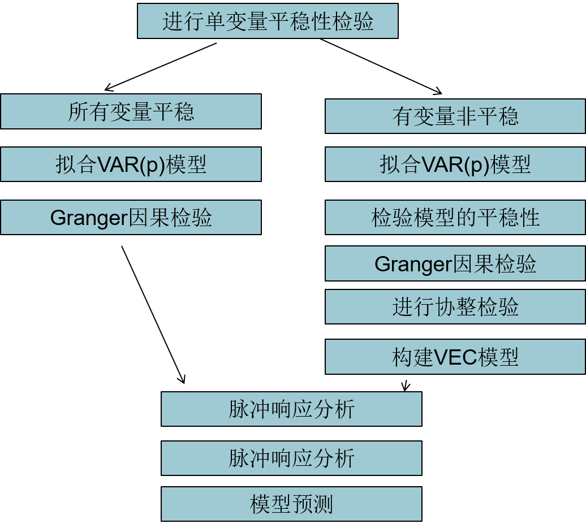

##  *Time Series Analysis*

-   时间序列数据：在不同时间点收集到的数据，反映某事物、现象随实际变化状态、程度

-   描述性时序分析：通过直观的数据比较、绘图观测，寻找序列中蕴含的发展规律
    -   操作简单、直观有效，是时序分析的第一步
    -   但是只能展示非常明显的规律性
    -   最早的时序分析方法，所有时序分析的基础
    -   帮助人们找到自然规律
        -   尼罗河的泛滥
        -   范蠡稳定粮价
        -   小麦价格指数序列
        -   太阳黑子运动规律

-   确定性时序分析：根据序列的观察特征，先构想一个序列运行的理论，默认序列按照此理论确定性运作
    -   侧重于确定性信息的提取
    -   通常不能通过分析误差自行修正模型，只能通过新的模型假定，
        推翻旧模型实现分析方法的改进
    -   假定条件决定了序列的拟合精度，如果确定性的假定条件不对，
        误差将很大，因此限制其使用范围

### 时域分析

-   确定性时域分析
    -   原理：事件的发展通常具有一定的**惯性**，用统计语言描述就是序列值之间存在一定的相关关系，即某种统计规律
    -   目的：寻找序列值之间的相关关系的统计规律，并拟合适当数学模型描述，进而用于预测
    -   特点
        -   理论基础扎实
        -   操作步骤规范
        -   分析结果易于解释
    -   常用领域
        -   宏观经济领域的 *Time Series Decomposition*
        -   确定性趋势预测
            -   趋势预测：线性趋势预测、非线性趋势预测
            -   指数平滑预测：简单、两参、三参指数平滑

-   随机性时域分析
    -   原理：假设序列为随机变量序列，利用对随机变量分析方法研究序列
    -   特点
        -   预测精度更高
        -   分析结果可解释性差
        -   是目前时域分析的主流方法

-   频域分析
    -   思想：假设任何一种无趋势的实现序列，都可以分解成若干不同频率的周期波动（借助傅里叶变换，用三角函数逼近）

### 时域分析发展

-   时域分析发展
    -   启蒙阶段
        -   *AR* 模型：*George Undy Yule*
        -   *MA* 模型、*Yule-Walker* 方程：*Sir Gilbert Thomas Walker*
    -   核心阶段
        -   *ARIMA*：经典时间序列分析方法，是时域分析的核心内容
            -   *Box & Jenkins* 书中系统的阐述了ARIMA模型的识别、估计、检验、预测原理和方法
    -   完善阶段
        -   异方差场合
            -   *ARCH*：*Robert Fry Engle*
            -   *GARCH*：*Bollerslov*
            -   *GARCH* 衍生模型
                -   *EGARH*
                -   *IGARCH*
                -   *GARCH-M*
                -   *NGARCH*
                -   *QGARCH*
                -   *TGARCH*
        -   多变量场合
            -   *ARIMAX*：*Box & Jenkins*
            -   *Co-intergration and error correction model*：*C.Granger*，协整理论
            -   *SYSLIN*：*Klein*，宏观经济连理方程组模型
            -   *Vector Autoregressive Model*：*Sims*，货币政策及其影响
        -   非线性场合
            -   *Threshold Autoregressive Model*
            -   *Artificical Neural Network*
            -   *Hebbian Learning*：神经可塑性假说
            -   *Multivariate Adaptive Regression Splines*
            -   *Linear Classifier*
            -   *Support Vector Machines*

##  确定性时序分析

### *Time Series Decomposition*

-   *Time Series Decomposition* 时间序列分解：克服其他因素干扰，单纯测度某个确定性因素（季节、趋势、交易日）的序列的影响
    -   所有序列波动可以归纳为受到以下 4 种因素影响（全部或部分）
        -   *Trend*：序列呈现的长期递增、递减的变化趋势
        -   *Circle*：序列呈现的从高到低、在由低到高的反复循环波动
            -   很多经济、社会现象确实有循环周期，但是这个周期往往很长、长度不固定
            -   如何观测值序列不够长，没有包含多个周期，周期的一部分会和趋势重合，无法准确、完整地提取周期影响
            -   在经济学领域常用的周期有
                -   基钦周期：平均 40 个月
                -   朱格拉周期：平均 10 年
                -   库兹涅茨周期：平均 20 年
                -   康德拉季耶夫周期：平均 53.3 年
        -   *Season*：和季节变化相关的稳定周期波动
        -   *Immediate*：其他不能用确定性因素解释的序列波动
        -   节假日：有些社会、经济现象显示某些 **特殊日期** 是很显著的影响因素，但是在传统因素分解模型中，没有被纳入研究
            -   股票交易受交易日影响
            -   超市销售受周末、节假日影响
            -   交通、运输、旅游同样受到周末、节假日影响
            -   如果观察时期不足够长，考虑将模型中 *Circle*（周期） 改为 *Day*（节假日）
    -   导致序列呈现不同的波动特征，即任何时间序列可以用 4 因素的某个函数进行拟合 $x_t = f(T_t, C_t, S_t, I_t)$
    -   常用模型（函数）
        -   加法模型：$x_t = T_t + C_t + S_t + I_t$
        -   乘法模型：$x_t = T_t * C_t * S_t * I_t$
        -   伪加法模型：$x_t = T_t * (S_t + D_t + I_s)$
        -   对数加法模型：$log_{x_t} = log_{T_t} + log_{S_t} + log_{D_t} + log_{I_t}$

### *Exponential Smoothing*

-   *Exponential Smoothing* 指数平滑预测方法：根据序列呈现的确定性特征，选择适当的方法对序列进行综合预测
    -   根据序列是否具有长期趋势、季节效应，可以把序列分为3大类
        -   既没有长期趋势、又没有季节效应
        -   只有长期趋势、没有季节效应
        -   有季节效应，无论是否有长期趋势

####    简单指数平滑

-   简单移动平均
    $$\begin{align*}
    \hat x_{t+1} & = \frac {x_t + x_{t-1} + \dots + x_{t_n+1}} n \\
    \hat x_{t+2} & = \frac {\hat x_t + x_t + x_{t-1} + \dots + x_{t-n+2}} n \\
    \hat x_{t+l} & = \frac {\hat x_{t+1-1} + \hat x_{t+l-2} + \dots +
        \hat x_{t+1} + x_t + \dots + x_{t-n+l}} n \\
    \end{align*}$$
    -   对无趋势、季节的水平平稳序列
        -   可以认为序列在比较短时间内，序列取值比较稳定，序列值差异主要是随机波动造成
        -   根据此假定，可以使用最近一段时间内平均值作为未来几期预测值
    -   简单移动平均假定无论时间远近，近 $n$ 期的序列观测值影响力一样

-   简单指数平滑预测
    $$\begin{align*}
    \hat x_{t+1} & = \alpha x_t + \alpha (1-\alpha) x_{t-1} +
        \alpha (1-\alpha)^2 x_{t-2} + \dots \\
    & = \alpha x_t (1-\alpha) [\alpha x_{t-1} + \alpha (1-\alpha) x_{t-2} +
        \alpha (1-\alpha)^2 x_{t-3} + \dots] \\
    & = \alpha x_t + (1-\alpha) \hat x_t
    \end{align*}$$
    -   指数平滑法构造思想
        -   考虑到事件间隔对事件发展的影响，各期权重随时间间隔增大而指数衰减
        -   实务中，对一般的随机事件，近期的结果对现在的影响更大
    -   参数设置
        -   初值：很多方法可以确定，最简单指定 $\hat x_1 = x_1$
        -   平滑系数 $\alpha$
            -   经验值在 $[0.05, 0.3]$，
                -   对于变化较缓慢的序列，取较小值
                -   对于变化迅速的序列，取较大值
            -   如果 $\alpha$ 过大，说明序列波动性过强，不适合使用简单指数平滑
    -   理论上可以预测任意期值，但是任意期预测值都是常数
        -   因为没有新的观测值提供新信息

####    *Holt* 两参数指数平滑

$$\begin{align*}
x_t & = a_0 + bt + \epsilon_t \\
& = a_0 + b(t-1) + b + \epsilon \\
& = (x_{t-1} + \epsilon_{t-1}) + b + \epsilon_t \\
& = a(t-1) + b(t)
\end{align*}$$
> - $a(t-1) = x_{t-1} - \epsilon_{t-1}$
> - $b(t) = b + \epsilon_t$

-   *Holt* 两参数指数平滑
    -   适合对含有线性趋势的序列进行修匀
    -   即分别用指数平滑的方法，结合序列最新观察值，不断修匀参数 $a, b$ 的估计值
    -   两参数递推公式
        $$\begin{align*}
        \hat a(t) & = \alpha x_t + (1-\alpha)[\hat \alpha(t-1) + \hat b(t-1)] \\
        \hat b(t) & = \beta [\hat a(t) - \hat a(t-1)] + (1-\beta) \hat b(t-1)
        \end{align*}$$
    -   序列预测公式
        $$ \hat x_{t+k} = \hat a(t) + \hat b(t)*k \\ $$
    -   初值设置
        -   $\hat a(0)=x_1$
        -   $\hat b(0)=\frac {x_{n+1} - x_1} n$

####    *Holt-Winter* 三参数指数平滑

-   三参数指数平滑：在 *Holt* 指数平滑的基础上构造，以修匀季节效应
    -   加法模型
        -   模型表达式
            $$\begin{align*}
            x_t & = a_0 + bt + c_t + \epsilon_t \\
            & = a_0 + b(t-1) + b + c_t + \epsilon_t \\
            & = (x_{t-1} - c{t-1} - \epsilon_{t-1}) + b + \epsilon_t + (Sd_j + e_t) \\
            & = a(t-1) + b(t) + c(t)
            \end{align*}$$
            > - $a(t-1) = x_{t-1} - c_{t-1} - \epsilon_{t-1}$
            > - $b(t) = b + \epsilon_t$
            > - $c_t = Sd_t + e_t, e_t \sim N(0, \sigma_e^2)$
        -   三参数递推式
            $$\begin{align*}
            \hat a(t) & = \alpha(x_t - c(t-s)) + (1-\alpha)[\hat a(t-1) + \hat b(t-1)] \\
            \hat b(t) & = \beta[\hat a(t) - \hat a(t-1)] + (1-\beta)\hat b(t-1) \\
            \hat c(t) & = \gamma[x_t - \hat a(t)] + (1-\gamma)c(t-s)
            \end{align*}$$
        -   序列预测公式
            $$ \hat x_{t+k} = \hat a(t) + \hat b(t) + \hat c(t + mod(k,s) -s) $$
    -   乘法模型
        -   模型表示式
            $$\begin{align*}
            x_t & = (a_0 + bt + \epsilon_t)c_t \\
            & = (a_0 + b(t-1) + b + \epsilon_t)c_t \\
            & = [(x_{t-1}/c{t-1} - \epsilon_{t-1})+ (b + \epsilon_{t-1})](S_j + e_t) \\
            & = [a(t-1) + b(t)]c(t)
            \end{align*}$$
            > - $a(t-1) = x_{t-1}/c_{t-1} - \epsilon_{t-1}$
            > - $b(t) = b + \epsilon_t$
            > - $c_t = S_j + e_t, e_t \sim N(0, \sigma_e^2)$
        -   三参数递推式
            $$\begin{align*}
            \hat a(t) & = \alpha(x_t / c(t-s)) + (1-\alpha)[\hat a(t-1) + \hat b(t-1)] \\
            \hat b(t) & = \beta[\hat a(t) - \hat a(t-1)] + (1-\beta)\hat b(t-1) \\
            \hat c(t) & = \gamma[x_t / \hat a(t)] + (1-\gamma)c(t-s)
            \end{align*}$$
        -   序列预测公式
            $$ \hat x_{t+k} = [\hat a(t) + \hat b(t) * k] \hat c(t + mod(k,s) -s) $$

##  *Vector Auto-Regression*

-   *VAR* 模型：向量自回归模型
    -   模型特点
        -   不以经济理论为基础
        -   结构简介明了
        -   预测精度高
    -   模型方程特点
        -   采用多方程联立的形式
        -   需要估计 $m(mp+1)$ 个参数的，对样本数量要求高
        -   模型的每个方程中，**内生变量** 对模型的全部内生变量滞后项进行回归，估计全部内生变量的动态关系
    -   模型用途
        -   脉冲响应分析
        -   方差分解

-   *VAR* 模型参数说明
    -   *VAR* 模型系数由统计相关性估计
        -   不具有逻辑上的因果关系
        -   通常不直接解读 *VAR* 模型每个方程的经济学意义
    -   *VAR* 模型参数不进行参数显著性检验，但是允许研究人员对参数施加特殊约束
    -   *VAR* 模型通常是由一系列 **非平稳序列构造的平稳系统**
        -   所以若包含非平稳变量，其中至少存在 1 个协整关系
        -   协整关系具有经济学意义，可以解读系数（所以需要进行协整检验）

### *VAR* 模型形式

-   两变量 *VAR(1)*
    -   方程组形式
        $$ \begin{cases}
        & y_{1,t} = c_1 + \pi_{1,1}y_{1,t-1} + \pi_{1,2}y_{2,t-1} + u_{1t} \\
        & y_{2,t} = c_2 + \pi_{2,1}y_{1,t-1} + \pi_{2,2}y_{2,t-1} + u_{2t} \\
        \end{cases}$$
    -   矩阵形式
        $$
        \begin{bmatrix} y_{1,t} \\ y_{2,t} \end{bmatrix} =
        \begin{bmatrix} c_1 \\ c_2 \end{bmatrix} +
        \begin{bmatrix}
            \pi_{1,1} & \pi_{1,2} \\
            \pi_{2,1} & \pi_{2,2} \\
        \end{bmatrix}
        \begin{bmatrix} y_{1,t-1} \\ y_{2,t-1} \end{bmatrix} +
        \begin{bmatrix} u_{1,t} \\ u_{2,t} \end{bmatrix}
        $$
        > - $u_{1,t}, u_{2,t} \overset {i.i.d.} {\sim} (0, \theta^2)$：随机波动项，$Cov(u_{1,t}, u_{2,t}) = 0$

-   多变量的 *VAR(k)*（含外生变量）
    $$ Y_t = C + \Pi_1 Y_{t-1} + \Pi_2 Y_{t-2} + \cdots + \Pi_k Y_{t-k} + U_t + \Phi Z_t $$
    > - $Y_t = (y_{1,t}, y_{2,t}, \cdots, y_{N,t})^T$：内生变量
    > - $C = (c_1, c_2, \cdots, c_N)^T$：常数项
    > - $\Pi_j = \begin{bmatrix}
            \pi_{11,j} & \pi_{12,j} & \cdots & \pi_{1N,j} \\
            \pi_{21,j} & \pi_{22,j} & \cdots & \pi_{2N,j} \\
            \vdots & \vdots & \ddots & \vdots \\
            \pi_{N1,j} & \pi_{N2,j} & \cdots & \pi_{NN,j} \\
        \end{bmatrix}$：内生变量待估参数
    > - $U_t = (u_{1,t}, u_{2,t}, \cdots, u_{N,t})^T \overset {i.i.d.} {\sim} (0, \Omega)$：随机波动项
    > - $Z_t = (z_{1,t}, z_{2,t}, \cdots, z_{N, t})^T$：外生变量
    -   *VAR(k)* 模型可通过变换附加伴随矩阵式，改写为 *VAR(1)*
        $$\begin{align*}
         Y_t & = \Pi_1 Y_{t-1} + \Pi_2 Y_{t-2} + \cdots + \Pi_k Y_{t-k} + U_t \\
        & = \begin{bmatrix} \Pi_1 & \Pi_2 & \cdots & \Pi_k \end{bmatrix}
            \begin{bmatrix}
                Y_{t-1} \\ Y_{t-2} \\
                \vdots \\ Y_{t-k}
            \end{bmatrix} + U_t \\
        & = AY + U_t
        \end{align*}$$

-   *SVAR*：结构 *VAR* 模型，在 *VAR* 模型基础上加入内生变量当期值
    -   即解释变量中含有当期变量
    -   两变量 *SVAR(1)*
        $$ \begin{cases}
        & y_{1t} = c_1 + \pi_{11}y_{2t} + \pi_{12}y_{1,t-1} +
            \pi_{13}y_{1,t-2} + u_1 \\
        & y_{2t} = c_2 + \pi_{21}y_{1t} + \pi_{22}y_{1,t-1} +
            \pi_{23}y_{1,t-2} + u_2 \\
        \end{cases} $$

-   含外生变量 *VAR(1)*
    $$\begin{align*}
    AY_t & = D + BY_{t-1} + FZ_t + V_t \\
    Y_t & = A^{-1}D + A^{-1}BY_{t-1} + A^{-1}FZ_t + A^{-1}v_t \\
        & = C + \Pi_1 Y_{t-1} + HZ_t + U_t
    \end{align*} $$
    > - $Y_t, Z_t, V_t$：内生变量向量、外生变量向量、误差项向量
    > - $A, D, B, F$：模型结构参数
    > - $C=A^{-1}D, \Pi_1=A^{-1}B, H=A^{-1}F, U_t=A^{-1}V_t$

####    *VAR* 模型稳定性

-   *VAR* 模型稳定性
    -   把脉冲施加在 *VAR* 模型中某个方程的 *Iinnovation* 过程上
        -   随着时间推移，冲击会逐渐消失，则模型稳定
        -   冲击不消失的则模型不稳定
    -   一阶 *VAR* 模型分析
        $$\begin{align*}
        Y_t & = C + \Pi_1Y_{t-1} + U_t \\
        & = (I + \Pi_1 + \Pi_1^2 + \cdots + \Pi_1^{t-1})C +
            \Pi_1^tY_0 + \sum_{i=0}^{t-1} \Pi_1^i U_{t-i}
        \end{align*}$$
        > - $\mu = (I + \Pi_1 + \Pi_2^2 + \cdots + \Pi_1^{t-1})C$：漂移向量
        > - $Y_0$：初始向量
        > - $U_t$：新息向量
        -   $t \rightarrow \infty$ 时有
            $$ I + \Pi_1 + \Pi_2^2 + \cdots + \Pi_1^{t-1} = (I-\Pi_1)^{-1} $$

-   两变量 *VAR(1)* 稳定条件
    $$ Y_t = C + \Pi_1 Y_{t-1} + U_t $$
    -   稳定条件
        -   特征方程 $|\Pi_1 - \lambda I|=0$ 根都在单位圆内
        -   相反的特征方程 $|I - L\Pi_1|=0$ 根都在单位圆外

-   *VAR(k)* 稳定条件
    $$\begin{align*}
    \begin{bmatrix} Y_t \\ Y_{t-1} \\ Y_{t-2} \\ \vdots \\
        Y_{t-k+1} \end{bmatrix} & =
    \begin{bmatrix} C \\ 0 \\0 \\ \vdots \\ 0 \end{bmatrix} +
    \begin{bmatrix}
        \Pi_1 & \Pi_2 & \cdots & \Pi_{k-1} & \Pi_{k} \\
        I & 0 & \cdots & 0 & 0 \\
        0 & I & \cdots & 0 & 0 \\
        \vdots & \vdots & \ddots & \vdots & \vdots \\
        0 & 0 & \cdots & I & 0
    \end{bmatrix}
    \begin{bmatrix} Y_{t-1} \\ Y_{t-2} \\ Y_{t-3} \\ \vdots \\
        Y_{t-k} \end{bmatrix} +
    \begin{bmatrix} U_t \\ 0 \\ 0 \\ \vdots \\ 0 \end{bmatrix} \\
        & = [C|0]^T + AY + U
    \end{align*}$$
    > - $A$：$Nk$ 阶方阵
    > - $N$：回归向量维度
    > - $k$：自回归阶数
    -   稳定条件
        -   特征方程 $|A - \lambda I| = 0$ 根全在单位圆内
        -   相反的特征方程 $|I - LA| = 0$ 根全在单位圆外

####    *Impulse-Response Function*

-   *Impulse-Response Function* 脉冲响应函数：描述内生变量对误差冲击的反应
    -   脉冲响应函数含义
        -   在随机误差下上施加标准查大小的冲击后，对内生变量当期值和未来值所带来的影响
        -   即将 *VAR* 模型表示为无限阶的向量 $MA(\infty)$ 过程
    -   对脉冲响应函数的解释的困难源于，实际中各方程对应误差项不是完全非相关
        -   误差相关时，其有一个共同组成部分，不能被任何特定变量识别
        -   故，左乘变换矩阵 $M$ 得到 $V_t =  MU_t$ 修正相关性（常用 *Cholesky* 分解求解）
            -   即将其协方差矩阵变换为对角矩阵 $V_t = MU_t \sim (0, \Omega)$

-   *VAR(1)* 转换为 *MA*
    $$ \begin{align*}
    Y_t & = AY_{t-1} + U_t \\
    (I - LA)Y_t & = U_t \\
    Y_t & = (I-LA)^{-1} U_t \\
        & = U_t + AU_{t-1} + A^2U_{t-2} + \cdots + A^sU_t + \cdots\\
    Y_{t+s} & = U_{t+s} + \Psi_1U_{t+s-1} + \Psi_2U_{t+s-2}
        + \cdots + \Psi_sU_t + \cdots
    \end{align*} $$
    > - $\Psi_s = A^s = \frac {\partial Y_{t+s}} {\partial U_t}$
    > - $\Psi_s[i, j] = \frac {\partial y_{i,t+s}} {\partial u_{j,t}}$：脉冲响应函数，表示其他误差项在任何时期都不变条件下，第 $j$ 个变量 $y_{j,t}$ 在对应误差项 $u_{j,t}$ 在 $t$ 期受到一个单位冲击后，对第 $i$ 个内生变量 $y_{i,t}$ 在 $t+s$ 期造成的影响

####    方差分解

-   方差分解：分析未来 $t+s$ 期 $y_{j, t+s}$ 的预测误差受不同新息冲击影响比例
    -   均方误差
        -   误差可以写为 *MA* 形式
            $$ Y_{t+s} - \hat Y_{t+s|t} = U_{t+s} + \Psi_1U_{t+s-1} +
                \Psi_2U_{t+s-2} + \cdots + \Psi_{s-1}U_{t+1} $$
        -   则预测 $s$ 期的均方误差为
            $$\begin{align*}
            MSE(\hat Y_{t+s|t}) & = E[(Y_{t+s} - \hat Y_{t+s|t}) (Y_{t+s} - \hat Y_{t+s|t})^T] \\
            & = \Omega + \Psi_1\Omega\Psi_1^T + \cdots + \Psi_{s-1}\Omega\Psi_{s-1}^T
            \end{align*}$$
            > - $\Omega = E(U_tU_t^T)$：不同期 $U_t$ 协方差阵为 0
    -   方差贡献比例
        $$\begin{align*}
        U_t &=  MV_t  \\
        &= m_1v_{1,t} + m_2v_{2,t} + \cdots + m_Nv_{N,t} \\
        \Omega & = E(U_t, U_t^T) \\
        & = (MV_t)(MV_t)^T \\
        & = m_1m_1^TVar(v_{1,t} + \cdots + m_Nm_N^TVar(v_{N,t})
        \end{align*}$$
        > - $v_{1,t}, v_{2,t}, \cdots, v_{N,t}$不相关
        -   将 $\Omega$ 带入 *MSE* 表达式中，既可以得到第 $j$ 个新息对 $s$ 期预测量 $\hat Y_{t+s|t}$ 的方差贡献比例

####    *JJ* 检验

$$\begin{align*}
Y_t & = c + \Pi_1 Y_{t-1} + \Pi_2 Y_{t-2} + \cdots + \Pi_k Y_{t-k} + u_t + \Phi D_t \\
\Delta Y_t & = y_{t-1} + \Pi Y_{t-1} + \Gamma_1 \Delta Y_{t-2}
    + \cdots + \Gamma_{k-1} \Delta Y_{t-p+1} + \epsilon_t + \Phi D_t
\end{align*}$$
> - $Y_t = (y_{1,t}, y_{2,t}, \cdots, y_{N,t})^T \sim I(1)$
> - $\Pi = \sum_{i=1}^k \Pi_i - I$
> - $\Gamma_i = -\sum_{j=i+1}^k$

-   *JJ* 检验：检验 $VAR(k)$ 模型的协整关系
    -   参考多元分析中典型相关分析的构造思想
    -   基础协整关系 = $\Pi$ 非零特征根数量
        -   基础协整关系的任意线性组合依然是协整的
        -   系统中协整关系至少为非零特征根数量

-   最大特征根检验
    -   检验统计量：*Bartlette* 统计量 $Q = -Tln(1-\lambda_i^2)$
    -   假设
        -   原假设：$H_0: \lambda_i = 0$
    -   检验流程：假设 $\lambda_1 \geq \lambda_2  \geq \cdots \lambda_m$ 是 $\Pi$ 的所有特征根
        -   从 $\lambda_1$ 开始检验是否显著不为 0
        -   直到某个 $\lambda_k$ 非显著不为0，则系统有 $k-1$ 个协整关系

-   迹检验
    -   检验统计量：*Bartlette* 统计量 $Q = -T \sum_{j=i}^m ln(1-\lambda_j^2)$
    -   假设
        -   原假设：$H_0: \sum_{j=i}^m \lambda_j = 0$
    -   检验流程
        -   从 $\sum_{j=1}^m \lambda_j = 0$ 开始检验是否显著不为 0
        -   直到某个 $\sum_{j=k}^m ln(1-\lambda_j^2)$ 非显著不为 0，说明系统存在$k-1$个协整关系

### *Vector Error Correction*

-   *VEC* 向量误差修正模型：有协整约束（有长期稳定关系）的 *VAR* 模型
    -   $N$ 变量 *VEC(k)*
        $$\begin{align*}
        \Delta Y_t & = y_{t-1} + \Pi Y_{t-1} + \Gamma_1 \Delta Y_{t-2}
            + \cdots + \Gamma_{k-1} \Delta Y_{t-p+1} + U_t + \Phi Z_t
        \end{align*}$$
        > - $\Pi = \sum_{i=1}^k \Pi_i - I$：影响矩阵
        > - $\Gamma_i = -\sum_{j=i+1}^k$
    -   *VEC(1)*
        $$\begin{align*}
        \Delta Y_{t} & = \Pi Y_{t-1} + \Gamma \Delta Y_{t-1} \\
        & = \alpha \beta^{'} Y_{t-1} + \Gamma \Delta Y_{t-1} \\
        & = \alpha ECM_{t-1} + \Gamma \Delta Y_{t-1}
        \end{align*}$$

#### 协整关系、检验

-   *Spurious Regression* 伪回归
    -   多变量分析中，平稳性非常重要，忽略序列平稳性判断，容易出现伪回归现象
    -   *Granger*、*Newbold* 的非平稳序列的伪回归随机模型实验（两个独立随机游走模型）表明
        -   非平稳场合，参数显著性检验犯弃真错误的概率远大于 $\alpha$，伪回归显著成立
        -   即 $P(|t| \geqslant t_{\alpha/2}(n) | 非平稳序列) \leqslant \alpha$

-   *Cointegration* 协整关系
    $$ y_t = \beta_0 + \sum_{i=1}^k \beta_i x_{it} + \epsilon_t $$
    > - ${x_1}, {x_2}, \cdots, {x_k}$：自变量序列
    > - $y_t$：响应变量序列
    > - ${\epsilon_t}$：平稳回归残差序列
    -   协整检验
        -   假设条件
            -   $H_0: \epsilon_t ~ I(k), k \geqslant 1$：多元非平稳序列之间不存在协整关系
            -   $H_1: \epsilon_t ~ I(0)$：多元非平稳序列之间存在协整关系
        -   建立响应序列与输入序列之间的回归模型
        -   对回归残差序列进行 *EG* 平稳性检验
    -   协整关系度量序列之间长期均衡关系

####    *Error Correction Model*

-   *ECM*：误差修正模型，解释序列短期波动关系
    $$ \Delta y_t = \beta_0 \Delta x_t + \beta_1 ECM_{t-1} + \epsilon_t $$
    -   $\beta_1 < 0$：表示负反馈机制
        -   $ECM_{t-1} > 0$：正向误差，则会导致下一期值负向变化
        -   $ECM_{t-1} < 0$：负向误差，则会导致下一期值正向变化

-   *Granger* 表述定理：如果变量 $X$、$Y$ 是协整的，则他们之间的短期非均衡关系总能用一个误差修正模型表述
    $$ \Delta Y_t = lagged(\Delta Y, \Delta X) - \lambda ECM_{t-1} + \epsilon_t $$
    -   对关系 $y_t = \beta x_t + \epsilon_t$
        $$ \begin{align*}
        y_t - y_{t-1} & = \beta x_t - \beta x_{t-1} - \epsilon_{t-1} + \epsilon_t \\
        \Delta y_t & = \beta \delta x_t - ECM_{t-1} + \epsilon_t
        \end{align*} $$
    -   响应序列当期波动 $\Delta y_t$ 主要受到三方面短期波动影响
        -   $\Delta x_t$：输出序列当前波动
        -   $ECM_{t-1}$：上一期误差
        -   $\epsilon_t$：纯随机波动
    -   *Granger* 证明协整模型、误差修正模型具有 *1-1* 对应关系

> - 实务中，响应序列与解释序列很少处于均衡点上，实际观测的是序列间短期或非均衡关系

####    *Granger* 因果关系

-   *Granger* 因果关系：序列 $X$ 是序列 $Y$ 的 *Granger* 原因，当且仅当最优线性预测函数使得下式成立
    $$ \theta^2(y_{t+1}|I_t) \leq \theta^2(y_{t+1}|I_t-X_t) $$
    > - $I_t = \{ x_t, x_{t-1}, \cdots, y_t, y_{t-1}, \cdots \}$：$t$ 时刻所有有用信息集合
    > - $X_t = \{ x_t, x_{t-1}, \cdots \}$：t时刻所有序列信息集合
    > - $\theta^2(y_{t+1}|I_t)$：使用所有可获得历史信息 （包括 ${x}$ 序列历史信息）得到的一期预测值方差
    > - $\theta^2(y_{t+1}|I_t-X_t)$：从所有信息中刻意扣除 ${x}$ 序列历史信息得到的一期预测值方差
    -   *Granger* 因果关系分类
        -   $(x, y)$：相互独立
        -   $(x \leftarrow y)$：$x$ 是 $y$ 的 *Granger* 原因
        -   $(x \rightarrow y)$：$y$ 是 $x$ 的 *Granger* 原因
        -   $(x \leftrightarrow y)$：互为因果
    -   统计意义上的因果关系和现实意义上因果关系不同
        -   统计因果关系：原因导致结果
            -   时间角度：原因发生在前，结果发生在后
            -   影响效果：$X$ 事件发生在前，且对 $Y$ 事件发展结果有意义
        -   现实意义上变量因果关系强调逻辑自洽
    -   *Granger* 检验可检验统计学意义上的 *Granger* 因果关系

#####    *Granger* 因果检验

-   *Granger* 因果检验
    -   建立回归方程
        $$ y_t = \alpha_0 + \sum_{i=1}^m \alpha_i x_{t-i} +
            \sum_{j=1}^n b_j y_{t-j} + \sum_k cz_{t-k} + \epsilon_t $$
        > - $z_t$：其他解释变量集合
        > - $\epsilon_t \sim I(0)$
    -   假设
        -   $H_0: \alpha_1 = \alpha_2 = \cdots = \alpha_m = 0$
        -   $H_1: \alpha_i 不全为0$
    -   检验统计量：*F 统计量*
        $$ F = \frac {(SSE_r - SSE_u) / q} {SSE_u/n-q-p-1} \sim F(q, n-p-q-1) $$

-   *Granger* 因果检验说明
    -   *Granger* 因果检验思想：对响应变量预测精度有显著提高的自变量，就视为响应变量的因
        -   因果性可以推出预测精度提高，但预测精度提高不能等价推出因果性
        -   即使检验结果显著拒绝原假设，也不能说明两个序列之间有真正因果关系
    -   *Granger* 因果检验是处理复杂变量关系时的工具
        -   借助因果检验信息，可以帮助思考模型结果
        -   不一定准确，但是提供信息比完全没有信息好
    -   *Granger* 因果结果说明
        -   检验结果严重依赖解释变量的延迟阶数，不同延迟阶数可能会得到不同的检验结果
        -   检验结果会受到样本随机性影响，样本容量越小随机性越大，所以最好在样本容量比较大时进行检验

### *VAR* 建模流程

-   *VAR* 建模流程
    -   进行单变量平稳性检验
    -   拟合 *VAR(p)* 模型
        -   确定模型阶数
            -   理论上初步模型阶数可以任意确定
            -   然后根据 *AIC*、*BIC*、对数似然函数值选择相对最优阶数
    -   若所有变量平稳，则 *Granger* 因果检验
        -   *VAR* 模型通过平稳性检验，理论上就可以利用模型进行分析、预测
        -   但 *VAR* 模型是超系数模型，默认所有内生变量互为因果
            -   但实际上变量之间因果关系复杂
            -   可通过 *Granger* 因果检验判断变量之间长期、短期因果关系
    -   若有变量非平稳
        -   检验模型平稳性
        -   *Granger* 因果检验
        -   协整检验：*JJ* 检验
            -   非平稳系统必然存在协整关系，具有经济学意义
            -   所以需要找出存在的基础协整关系，解读其代表的长期、短期相关影响
        -   构建 *VEC* 模型
            -   如果协整检验显示基本协整关系满秩，说明系统中每个序列都是平稳序列，直接建立VAR模型
            -   如果协整检验限制基本协整关系为 0 秩，则系统不存在协整关系，通常说明系统不平稳，需要重新选择变量， 或者适当差分后建模
            -   最常见情况是协整检验显示基本协整关系数量处于 0 至满秩中间，此时建立 $VEC$ 模型
    -   脉冲响应分析
    -   方差分析
    -   模型预测

##  *ARIMA* 模型

### 建模流程

-   白噪声检验：进行 *ARIMA* 模型拟合时，通过检验查询序列是否通过 *LB* 检验（白噪声检验）判断模型显著性，但是实际上
    -   *LB* 检验只检验了白噪声序列的纯随机性
    -   对于方差齐性没有进行检验
    -   至于零均值，可以在建模时通过拟合常数项解决

-   方差齐性变换：如果已知异方差函数的具体形式，找到其转换函数，进行方差齐性变换
    -   若异方差形式为：$\sigma_t^2 = h(\mu_t)$，寻找转换函数 $g(x)$ 满足 
        $$ g(x_t) \approx g(\mu_t) + (x_t - \mu_t)g'(\mu_t) $$
        则有
        $$\begin{align*}
        Var[g(x_t)] &\approx [g'(\mu_t)^2]Var(x_t) \\
        [g'(\mu_t)]^2 h(\mu_t) &= \sigma^2 \\
        Var[g(x_t)] &= \sigma^2 \\
        \end{align*}$$
