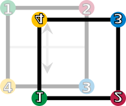

#   群

##  *Group*

-   *Group* 群：由集合 $G$ 、二元运算 $\cdot$ 构成的，符合以下四个性质（群公理）的数学结构
    -   *Closure* 封闭性：$\forall a,b \in G$，运算结果 $a \cdot b \in G$
    -   *Associativity* 结合律：$\forall a,b,c \in G$，等式 $(a \cdot b) \cdot c = a \cdot (b \cdot c)$ 成立
    -   *Identity element* 单位元：$\exists e \in G$，使得 $\forall a \in G$，总有等式 $e \cdot a = a \cdot e = a$ 成立
        -   群单位元常记为 $1$、$1_G$（来自乘法单位元）
    -   *Inverse element* 逆元：$\forall a \in G$，总有 $\exists b \in G, a \cdot b = b \cdot a = e$

-   群的阶：群 $G$ 中元素的个数，记为 $|G|$

### 群判别

-   群判别法
    -   $(G, \cdot)$ 是群 $\Leftrightarrow$ $G$ 是半群且 $\forall a,b \in G, ax=b, xa=b$ 有解且唯一
    -   考虑非空集合 $(G, * )$，当且仅当 $\forall a,b \in G, a * b^{-1} \in G$ 时，$G$ 为群

-   有限群判别定理
    -   若有限半群 $G$ 满足左、右消去律，则 $G$ 是群

### 群的衍生

-   *Magma* 原群：满足封闭性的代数结构
-   *Semigroup* 半群：满足封闭性、结合律的代数结构
-   *Monoid* 幺半群：有单位元的半群
-   交换群（*Abel* 群）：满足交换率 $\forall a,b \in G，a \cdot b = b \cdot a$ 的群 $G$
    -   对于阿贝尔群，可以把群运算记为 $+$、单位元记为 $\cdot$，此时群称为加法群

### 群案例

-   整数加法群：整数集、整数加法构成的群

-   循环群：若 $(G, * )$ 为群，若 $\exists g \in G, G = <g> = \{g^k | k \in Z\}$，则称 $G$ 关于运算 $ * $ 为循环群
    -   群 $G = \{0, 1, \cdots, n-1\}$、群上模 $n$ 的加法，称为 *n-element cyclic group*，记为 $C_n$

-   对称群：正方形的对称操作（旋转、反射）构成群，称为二面体群 $D_4$

    

### 阶

-   *Order* 阶/指数：对群 $G, g \in G$，若 $\exists n \in Z^{+}, g^n = e$，则称 $g$ 是有限阶的朴素，所有满足条件的 $n$ 中最小者称为 $g$ 的阶 $ord(g)$
    -   特别的，若不存在满足条件的整数的，则 $ord(g) = \infty$
    -   规定 $ord(e) = 0$

##  群公理的简单结论

-   群运算满足消去律：$\forall a,b \in G, \exists ax = bx$，则必然有 $a = b$

### 单位元、逆元唯一性

-   群中只能由一个单位元，而群中每个元素正好有一个逆元素

-   证明：元素 $a$ 的逆元唯一性
    -   假设 $a$ 有两个逆元 $l,r$，则

        $$\begin{align*}
        l = l \cdot e = l \cdot (a \cdot r) = (l \cdot a) \cdot r = e \cdot r = r
        \end{align*}$$

### 除法

-   除法：给定群 $G$ 中元素 $a,b$，$G$ 中存在方程 $x \cdot a = b$ 的唯一解 $x$
    -   即：$x = b \cdots a^{-1}$
    -   类似的：$G$ 中存在方程 $ a \cdot y = b$ 的唯一解 $y = a^{-1} b$

-   推论：乘以群中某个元素 $g$ 是一个双射
    -   特别的，若 $g \in G$，则有 $G$ 到自身的双射
        -   由 $g$ 引起的左平移，将 $h \in G$ 映射为 $g \cdot h$
        -   由 $g$ 引起的右平移，将 $h \in G$ 映射为 $h \cdot g$（对阿贝尔群，左右平移相同）

##  子群

-   *Subgroup* 子群：给定群 $(G, \cdot)$，若 $\exists H \subseteq G$，且单位元 $e \in H$，$H$ 中元素在运算 $\cdots$ 封闭，则 $(H, \cdot)$ 也构成群，称为 $G$ 的子群，记为 $H < G$
    -   子群中幺元、逆元就是原群中的幺元、逆元
    -   $G,{e}$ 必然是子群，称为平凡子群

### 子群判别

-   子群判别法
    -   设有群 $G$、子集 $H \subseteq G$，则 $H$ 是 $G$ 的子群，当且仅当 $\forall x,y \in H, x^{-1} y \in H$
        -   充分性
            -   单位元存在性：取 $y=x$，则 $e = x^{-1} \cdot y \in H$
            -   逆元存在性：取 $y=e$，则 $x^{-1} = xe \in H$
            -   封闭性：取 $x,y \in H$，则 $x^{-1} \in H$，有 $xy = (x^{-1})^{-1} y \in H$
            -   结合性直接继承自 $G$
        -   必要性：显然

-   有限子群判别
    -   设 $H$ 为群 $(G, \cdot)$ 的非空有限子集，则 $H < G$ 的充要条件为 $H$ 对 $\cdot$ 封闭

-   定理：任意多个子群的交集也是子群

### 子群案例

-   整数的 $n$ 倍构成整数加法群子群

### 子群性质

-   子群推论
    -   任一群不能写成两个真子群的并

### （左）陪集、同余

-   *Left coset* 左陪集：子群 $H \subseteq G$，选择 $x \in G$ 构造集合 $\{xh | h \in H\}$ 即得到子群 $H$ 关于元素 $x$ 的左陪集，记作 $xH$
    -   类似可以定义右陪集，习惯上主要研究左陪集
    -   $xH$ 可以理解为元素和集合的运算，类似可以定义集合间运算 $AB = \{ab| a \in A, b \in B\}$
    -   陪集不一定是群，如：整数加法群的子群 $nZ$ 有 $n$ 个不同的左陪集，除 $nZ$ 自身外军不是群
    -   若 $x \in H$，$H$ 为有限群，则由封闭性 $xH = H$
        -   不能直接推广到无限群，但有 $x^{'} H = xH, x^{'} \in xH$

-   定理：左陪集划分是一个等价类划分
    -   等价关系 $R$ 即为：属于同一左陪集的元素等价
        -   子集 $H$ 左陪集对应地等价关系 $R$ 可以描述为：$xRy \Rightarrow x^{-1}y \in H$

-   同余：子群 $H \subset G$，若 $x,y \in G$ 在同一左陪集中，称 $x,y$ 模 $H$ 同余
    -   特别的，整数加法群的子群 $nZ$，同余即为 $x \equiv y (mod n)$

-   拉格朗日定理：子群 $H \subset G$，则 $|H|$ 可以整除 $|G|$
    -   根据左陪集 $xH$ 定义，有 $|xH| \leq |H|$，又根据群运算唯一性，不等式取等号，则得证
    -   推论：任何有限群的 $G$ 的元素，其指数为 $|G|$ 的因子

-   *Lagrange* 定理：$G$ 是有限群，$H$ 是 $G$ 的子群，则有 $|G| = |H| [G:H]$；子群 $H$ 的阶是群 $G$ 阶的因子
    -   推论：素数阶群只有平凡子群

##  正规子群

-   正规子群：群 $G$ 有子群 $H < G$，若 $\forall h \in H, g \in G$，都有 $ghg^{-1} \in H$，则称 $H$ 为正规子群，记作 $H \triangleleft G$
    -   即：在共轭变换下不变的子群称为正规子群

### 线性群

-   设 $V$ 是数域 $P$ 上的 $n$ 维线性空间
    -   一般线性群 $GL(V)$/$GL_n(P)$：$V$ 上全体可逆线性变换的集合
    -   特殊线性群 $SL(V)$/$SL_n(P)$：$V$ 上全体行列式为 1 的线性变换的集合
        -   显然有 $SL_n(P) < GL_n(P)$

### 正规子群判别

> - 定理：群 $G$ 有子群 $H < G$，以下条件与 $H \triangleleft G$ 等价

-   共轭角度
    -   $\forall g \in G, gHg^{-1} = H$：$H$ 在 $G$ 中元素诱导的共轭变换下不变
    -   $\forall g \in G, gHg^{-1} \subseteq H$

-   陪集角度
    -   $\forall g \in G, gH = Hg$
    -   $H$ 在 $G$ 中左陪集集合、右陪集集合一致
    -   $\forall g_1,g_2 \in G, g_1H \circ g_2H = (g_1 g_2) H$
        -   $g_1H \circ g_2H$ 表示两集合中任意元素 $\circ$ 运算的结果集

-   子群对应等价关系角度
    -   $G$ 上等价关系 $\forall a,b \in G, aRb \Leftrightarrow a^{-1}b \in H$ 是同余关系
    -   $\forall g_1,g_2 \in G, g_1g_2 \in H \Longleftrightarrow g_2g_1 \in H$：$G$ 中任何两个元素，运算后结果为正规子群成员，则交换后运算结果也为正规子群成员

-   其他角度
    -   $\exists \phi \in Hom(G): ker(\phi) = H$：存在以 $H$ 为核的 $G$ 的群同态
    -   $H$ 是 $G$ 中若干共轭类的并集

### 正规子群性质

-   推论
    -   平凡子群是正规子群
    -   交换群的所有子群是正规子群
    -   指数为 2 的子群是正规子群

### 商群

-   等价关系：设 $H$ 是群 $G$ 的子群，定义等价关系 $R: aRb \Longleftrightarrow a^{-1}b \in H$
    -   $a^{-1}b \in H$ 可理解为二者商在 $H$ 内，即二者间隔符合某规律
    -   $a$ 所在的等价类 $\bar a = \{b|a^{-1}b \in H\}$
    -   单位元所在等价类 $\bar e = \{b|eb \in H\} = H$，即群自身
    -   则若 $b \in \bar a$，有 $\exists h \in H, a^{-1} b=h, b=ah$

-   左陪集：$H$ 为 $G$ 的子群，$a \in G$，则 $aH = \{ah| h \in H \}$ 称为 $a$ 代表的左陪集（类似可以定义右陪集）
    -   显然 $a \in aH$，左陪集 $aH$ 即为关于 $H$ 定义的等价关系的 $a$ 的等价类
    -   子群 $H$ 的左、右陪集要么相同，要么不交
    -   $H$ 是其左、右陪集中的唯一子群
    -   例：整数加法群 $Z$ 的子集 $mZ$ 是其子群，其左陪集定义为 $\bar i = \{p|p=mq+i, q \in Z\}$
        -   其左陪集具有空间结构：$\bar i + \bar j = \overline {i+j}$

-   定理：$H$ 为 $G$ 的子群，$a,b \in G$，则 $aH = bH \Longleftrightarrow a^{-1} b \in H$
    -   逻辑上：$aH=bH \Longleftrightarrow aRb \Longleftrightarrow a^{-1}b \in H$

-   商集：$H$ 为 $G$ 的子群，$G$ 关于等价关系 $aRb \Longleftrightarrow a^{-1}b \in H$ 的商集合称为 $G$ 对 $H$ 的左商集，也称为 $G$ 对 $H$ 的左陪集空间，记作 $G/H$；$G/H$ 的阶 $|G/H|$ 称为 $H$ 在 $G$ 中的指数，记为 $[G:H]$

> - $a^{-1}b$ 性质的优越性可以从其涉及元、逆元理解，而元、逆元可导出单位元

##  群同构

-   群同构：两个群之间的双射
    -   若两个群之间存在同构，则两个群称为同构的
    -   从群论角度，同构群有相同性质而无需区分
    -   

-   内自同构：群 $G$ 的自同构如果是 $g \in G$ 的共轭作用，称为内自同构
    -   共轭作用：$\iota_g: G \leftarrow G, x \mapsto gxg^{-1}$

### *Cayley* 定理

-   *Cayley* 定理：任何群都同一个双射变换群同构
    -   证明思路
        -   给定 $G$ 中任意元素 $a$，构造与 $a$ 有关双射：左平移映射 $ G \rightarrow G$，即 $\forall g \in G, g \rightarrow ag$
        -   证明所有左平移映射构成群 $G^{'}$
        -   证明群 $G$、$G^{'}$ 同构

##  群同态

-   群同态：若函数 $h: (G, \ast) \rightarrow (H, \cdot)$ 使得 $\forall u,v \in G$ 满足 $h(u \ast v) = h(u) \cdot h(v)$，则 $h$ 称为 $(G, \ast)$ 到 $(H, \cdot)$ 的群同态
    -   $h$ 兼容于群结构
        -   $h(e_g) = e_H$：$h$ 将群 $G$ 单位元 $e_G$ 映射至 $e_H$
        -   $\forall u \in G, h(u^{-1}) = h(u)^{-1}$
    -   $h$ 的核：映射到群 $H$ 的单位元 $e_H$ 的群 $G$ 中元素集合 $ker(h) = \{u \in G: h(u) = e_H\}$
        -   $h$ 的核是 $G$ 的正规子群
    -   $h$ 的像：$im(h) = \{h(u): u \in G\}$

##  置换群

-   置换群 $(G, \odot)$：元素为给定集 $N$ 上的置换（排列），运算 $\odot$ 为排列的复合
    -   将排列视为 $N$ 到自身的双射，置换群 $G$ 即 $N$ 到自身双射的集合
    -   置换群 $G$ 满足群公理
        -   封闭：置换复合还是置换
        -   结合：分别考虑任意 $k \in \{1,2,\cdots,n\}$ 的位置
        -   单位元：保持不变
        -   逆元：置换和状态一一对应，定义逆置换 $f^{-1}$ 为将状态恢复为初始状态，则其为逆元
    -   若 $N$ 为包含 $n$ 个元素的有限集，则置换群记为 $n$ 元置换群 $S_n$
        -   $S_n, n > 2$ 不是交换群
        -   $Z_{24}$、$S_4$ 元素数量相同，集合论上等价，但群论意义上不等价

-   对称群：包含所有 $N$ 的置换的群称为 $N$ 的对称群 $Sym(N)$
    -   $n$ 元置换群是 $n$ 元对称群的子群

-   代数方程的根具有对称性，*Galois* 定义了对应的 *Galois* 群
    -   *Sym(M)* 为 $n=|N|$ 次方程的 *Galois* 群
    -   代数方程有求根公式等价于对应群可解
        -   $n \leq 5$ 时 $Sym(N)$ 不不可解，则无求根公式
        -   $K_4=\{(1), (12)(34), (13)(24), (14)(23)\}$ 是交错群 $A_4$ 的一个交换子群（即可解群）

> - <https://zhuanlan.zhihu.com/p/265505611>

### 置换

-   置换：双射变换
    -   设 $\phi$ 是 $n$ 元集合 $M=\{a_1, a_2, \cdots, a_n\}$ 上的双射（置换）
        -   为方便记 $M={1,2,\cdots, n}$
        -   则置换 $\phi$ 可表示如下，两行分别表示原象、象

            $$ \phi = \begin{pmatrix}\
                1 & 2 & \cdots & n \\
                \phi(1) & \phi(2) & \cdots & \phi(n)
            \end{pmatrix} $$

### 轮换

-   轮换：置换 $\sigma$ 如果将 $i_1$ 变成 $i_2$，$i_2$ 变成 $i_2$，...，$i_n$ 变成 $i_1$，而其余元不变，则称为 $\sigma$ 为一个 $k-$轮换（循环）置换，记为 $\sigma = (i_1,i_2,\cdots,i_k) = (i_2,i_3,\cdots,i_k,i_1) = \cdots = (i_k,i_1,\cdots,i_{k-1})$
    -   $2-$轮换简称为兑换，恒等映射通常记为 $(1)$
    -   轮换可以视为首位相连的圆环

-   不相交轮换：没有公共数码的循环
    -   定理：不相连轮换相乘（复合）时可交换

-   定理：置换都可以写成若干个不相连的轮换之积；每个轮换都可表示为对换之积；每个置换都可以表示成若干个对换之积
    -   证明思路
        -   每个置换可将构成轮换的所有数码按连关顺序紧靠，不动数码放在最后，重复即可写成不相连的若干轮换之积
        -   $i_k$ 作为轮换尾，$i_k$ 可以利用依次和前序对换移至轮换首，而其余元素相对位置保持不变，依次考虑 $i_{k-1},i_{k_3},i_1$，则得到轮换结果
    -   定义：若置换分解为奇数个对换的乘积，称为奇置换，否则称为偶置换
        -   容易证明：置换群中，要么全偶置换，要么一半奇置换、一半偶置换
    -   定义：$S_n$ 中全体偶置换构成 $\frac {n!} 2$ 阶子群，记为 $A_n$，称为 $n$次交代（交错）群

-   定理：每个置换表示对换的乘积时，对换数量的奇偶性不变
    -   置换结果的排列奇偶性确定，与对换数量奇偶性一致

-   定理：$k-$轮换的阶为 $k$；不相连轮换乘积的阶位各因子的阶的最小公倍数

-   定理：设 $\tau = \begin{pmatrix} 1 & 2 & \cdots & n \\ i_1 & i_2 & \cdots & i_i \end{pmatrix}$，对任意置换 $\sigma$，有 $\tau = \begin{pmatrix} \sigma(1) & \sigma(2) & \cdots & \sigma(n) \\ \sigma(i_1) & \sigma(i_2) & \cdots & \sigma(i_k) \end{pmatrix}$
    -   将 $\sigma^{-1} = \begin{pmatrix} \sigma(1) & \sigma(2) & \cdots & \sigma(n) \\ 1 & 2 & \cdots & n \end{pmatrix}$ 带入即可

##  整群

> - 模运算类似的满足加、减、乘、结合律、交换律、分配律

### 指数

-   指数：考虑 $m>2,(a,m)=1$，$d$ 为满足 $a^d \equiv 1 \pmod m$ 的最小正整数，则 $d$ 称为 $a$ 的 $\pmod m$ 的指数（阶），记为 $d=\delta_m(a)$
    -   $a^d \equiv 1 \pmod m$ 在且仅在 $gcd(a,m)=1$ 时有解

-   指数性质 1：若 $a^c \equiv 1 \pmod m$，则 $\delta_m(a) | c$，特别的有 $\delta_m(a) | \phi(m)$
    -   证明逻辑：将 $c=k\delta_m(a)+r$ 带入即证

-   指数性质 2：设 $k$ 为非负整数，则有

    $$
    \delta_m(a^k) = \frac {\delta_m(a)} {gcd(\delta_m(a),k)}
    $$

    -   证明逻辑：记 $\delta_0=\delta_m(a), \delta_1=\delta_m(a^k), \delta_2=\frac {\delta_0} {gcd(\delta_0, k)}$
        -   根据指数定义有：$a^{k\delta_1} \equiv 1 \pmod m, a^{k\delta_2} \equiv 1 \pmod m$
        -   根据性质 1 有：$\delta_0 | k\delta_1, \delta_1 | \delta_2$
        -   则有 $\delta_2 = \frac {\delta_0} {gcd(\delta_0, k)} | \frac {k\delta_1} {gcd(\delta_0,k)}$
        -   考虑到 $\delta_2 \perp \frac k {gcd(\delta_0,k)}$，则有 $\delta_2 | \delta_1$
    -   特别的：若 $\delta_m(a) = \delta_1 \delta_2$，则 $\delta_m(a^{\delta_1}) = \delta_2$

-   指数性质 3：

    $$
    \delta_m(ab)=\delta_m(a)\delta_m(b) \Leftrightarrow \delta_m(a) \perp \delta_m(b)
    $$

    -   必要性
        -   显然有 $(ab)^{\delta_m(ab)} \equiv (ab)^{\delta_m(ab)\delta_m(a)} \equiv b^{\delta_m(ab)\delta_m(a)} \equiv 1 \pmod m$
            -   则有 $\delta_m(b) | \delta_m(ab)\delta_m(a)$
            -   考虑到 $\delta_m(a) \perp \delta_m(b)$
            -   则有 $\delta_m(b) | \delta_m(ab)$
        -   类似的有 $\delta_m(a) | \delta_m(ab)$
        -   综上，则 $\delta_m(a)\delta_m(b) | \delta_m(ab)$
        -   又有 $(ab)^{\delta_m(a)\delta_m(b)} \equiv 1 \pmod m$，则有 $\delta_m(ab) | \delta_m(a)\delta_m(b)$

    -   充分性
        -   显然有 $(ab)^{lcm(\delta_m(a),\delta_m(b))} \equiv 1 \pmod m$
        -   则有 $\delta_m(ab)=\delta_m(a)\delta_m(b) | lcm(\delta_m(a),\delta_m(b))$
        -   又 $lcm(\delta_m(a),\delta_m(b)) | \delta_m(a,b)$

-   指数性质 4：若 $n|m$，则有

    $$ \delta_n(a) | \delta_m(a) $$

    -   证明逻辑：$a^{\delta_m(a)} \pmod m \equiv 1 \equiv a^{\delta_n(a)} \pmod n$

-   指数性质 5：若 $m_1 \perp m_2$，则

    $$ \delta_{m_1m_2} = lcm(\delta_{m_1}(a),\delta_{m_2}(a)) $$

    -   证明逻辑
        -   由性质 4，$\delta_{m_1}(a) | \delta_{m_1m_2}(a), \delta_{m_2}(a) | \delta_{m_1m_2}(a)$
        -   又 $a^{lcm(\delta_{m_1}(a), \delta_{m_2}(a))} \equiv 1 \pmod m_1m_2$

    -   推论：若 $m_1,m_2,\cdots,m_k$ 两两互质，则 $\delta_{\prod_{i=1}^k m_i}(a) = lcm(\delta_{m_1}(a),\delta_{m_2}(a),\cdots,\delta_{m_k}(a))$

### 原根、离散对数

-   原根：若 $\sigma_m(g) = \phi(m)$，则 $g$ 为 $m$ 的原根
    -   $m$ 存在原根，当前仅当 $m=1,2,4,p^g,2p^g$，其中 $p$ 奇素数
    -   $m$ 有原根 $g$ 时，所有与 $m$ 互质的数均可用 $g$ 幂次表示，记与 $m$ 互质的数为 $g^0,g^1,\cdots,g^{\phi(m)-1}$

-   离散对数：$(a,m)=1$ 时，用 $log_{m,g}a$ 表示模 $m$ 意义下以原根 $g$ 为底 $a$ 的离散对数，满足 

    $$
    g^{log_{m,g}^a} \equiv a \pmod m
    $$

-   离散对数运算定理

    $$ log_{m,g}ab \equiv log_{m,g}a + log_{m,g}b \pmod m $$

    -   根据定义，带入原值即可证明

-   离散对数换底定理：若 $\hat g,g$ 是 $m$ 的两个原根，则

    $$ log_{\hat g} a \equiv log_{\hat g} g * log_ga \pmod m $$

-   指数与离散对数关系定理

    $$ \delta_m(a) = \frac {\phi(m)} {gcd(log_{m,g}a, \phi(m))} $$

    -   根据指数性质 2 带入 $a$ 即得

-   原根数量定理：若 $m$ 存在原根，则一定有 $\phi(\phi(m))$ 个原根
    -   证明逻辑：
        -   若存在 $g$ 为原根，根据定义 $a$ 为原根须满足 $\delta_m{a}=\phi(m)$
        -   根据指数与离散对数关系定理，则还需满足 $log_ga \perp \phi(m)$
        -   又 $0 \leq log_ga < \phi(m)$，则满足条件的 $a$ 有 $\phi(\phi(m))$

-   $\pmod m$ 原根存在性：若 $m>2$ 为素数，则 $\pmod m$ 原根必定存在

### 其他一些结论

-   若 $q$ 为素数，则 $\forall a,y \in Z^{+}$ 有 $(a \pmod p)^y \equiv a^y \pmod p$
    -   证明逻辑
        -   考虑 $a=mp+n, m \in N, 0 \leq n < p$
        -   则 $(mp+n \pmod p)^y \equiv n^y \equiv (mp+n)^y \pmod p$

-   若 $a,q$ 均为素数，则集合 $\{a^1 \pmod p, a^2 \pmod p, \cdots, a^{p-1} \pmod p\}$、$\{1,2,\cdots,p-1\}$ 相等

#   环

##  *Ring*

-   环：集合 $R$ 和定义与其上的二元运算 $+$、$\cdot$ 构成的三元组 $(R, +, \cdot)$，若它们满足
    -   $(R, +)$ 形成一个交换群，其单位元称为零元，记作 $0$
    -   $(R, \cdot)$ 形成一个半群
    -   $\cdot$ 乘法关于 $+$ 加法满足分配律
        -   乘法优先级高于加法

> - 实际中，运算符号被省略，称 $R$ 为环

### 环的衍生

|            | （除 0 元）封闭 | 单位元 | 逆元 | 交换 |
|------------|-----------------|--------|------|------|
| 交换环     | -               | -      | -    | 是   |
| 幺环       | -               | 是     | -    | -    |
| 无零因子环 | 是              | -      | -    | -    |
| 整环       | 是              | 是     | -    | 是   |
| 除环       | 是              | 是     | 是   | -    |
| 体         | 是              | 是     | 是   | 是   |

-   交换环：若环 $(R, +, \cdot)$ 中 $(R, \cdot)$ 满足交换律构成交换半群，则称 $R$ 为交换环

-   幺环：若环 $(R, +, \cdot)$ 中 $(R, \cdot)$ 构成幺半群，则称 $R$ 为幺环
    -   此时幺半群 $(R, \cdot)$ 的幺元 $1$ 也成为环的幺元

-   无零因子环：若环 $R$ 中没有非 0 的零因子，则称 $R$ 为无零因子环
    -   此定义等价于以下任意
        -   $R \setminus \{0\}$ 对乘法形成半群
        -   $R \setminus \{0\}$ 对乘法封闭
        -   $R$ 中非 0 元素的乘积非 0

-   整环：无零因子的交换幺环
    -   例
        -   整数环
        -   多项式环

-   除环：若 $R$ 为幺环，且 $R \setminus \{0\}$ 对 $R$ 上乘法形成群，则 $R$ 称为除环
    -   除环不一定是交换环（如：四元数环），交换的除环是体
    -   限制 $R$ 为幺环：保证 1 元满足作为 0 元单位元

-   唯一分解环：每个非零非可逆元都能唯一分解的整环

### 环案例

-   集环：满足以下任意条件之一的非空集集合 $R$ 是环，以交为乘法、对称差为加法、空集为零元
    -   $R$ 为集合并、差运算封闭
    -   $R$ 对集合交、对称差运算封闭
    -   $R$ 对集合交、差、无交并运算封闭

-   整数环、有理数环、实数域、复数域：交换、含单位环

-   多项式环：所有项系数构成环的多项式全体

-   方阵环

### 环的基本性质

-   $\forall a \in R, a \cdot 0 = 0 \cdot a = 0$
    -   $a \cdot 0 = a \cdot (0+0) = a \cdot 0 + a \cdot 0$
    -   $a \cdot 0 - a \cdot 0 = a \cdot 0 + a \cdot 0 - a \cdot 0$
    -   考虑到环有加法逆元，则有 $0 = a \cdot 0$

-   $\forall a,b \in R, (-a) \cdot b = a \cdot (-b) = -(a \cdot b)$
    -   $(-a) \cdot b + a \cdot b = (-a + a) \cdot b = 0$

##  环的理想

-   考虑环 $(R, +, \cdot)$ 上交换群 $(R, +)$，集合 $I \subseteq R$
    -   $(I, +)$ 构成 $(R, +)$ 的子群
    -   $\forall i \in I, r \in R$ 有 $i \cdot r \in I$
    -   $\forall i \in I, r \in R$ 有 $r \cdot i \in I$

-   环理想定义
    -   **右理想**：若 $I$ 满足上述 1、2，则称 $I$ 是 $R$ 的右理想
    -   **左理想**：若 $I$ 满足上述 1、3，则称 $I$ 是 $R$ 的左理想
    -   **（双边）理想**：若 $I$ 同时是 $R$ 的左理想、右理想
        -   交换环的理想都是双边理想
    -   **真左、右、双边理想**：$I \subset R$
    -   **极大左、右、双边理想**：不存在 $J \subset I$ 使得 $J$ 是 $R$ 的真左、右、双边理想
        -   极大双边理想不定是极大左、右理想

-   定理
    -   交换幺环 $R$ 中，理想 $I$ 是 $R$ 的极大理想的充要条件是：商环 $R \setminus I$ 是域
    -   $I$ 是环 $R$ 的左理想，则 $I$ 是 $R$ 的极大左理想的充要条件是对 $R$ 的任意不含在 $I$ 中的左理想的 $J$ 都有 $I+J=R$

> - 整数环 $Z$ 只有形如 $nZ$ 的理想

### 生成理想、主理想

-   环 $R$，子集 $A \subseteq R$，定义 $<A> = RA + AR + RAR +ZA$，则有

    > - $ZA = \{\sum_{k=1}^K m_k a_k: m_k \in Z, a_i \in A, n \geq 1\}$：$Z$ 为整数集
    > - $AR = \{\sum_{k=1}^K a_k r_k: r_k \in R, a_i \in A, n \geq 1\}$
    > - $RA = \{\sum_{k=1}^K r_k a_k: r_k \in R, a_i \in A, n \geq 1\}$
    > - $RAR = \{\sum_{k=1}^K r_k a_k r_k^{'}: r_k,r_k^{'} \in R, a_i \in A, n \geq 1\}$：$Z$ 为整数集

    -   $<A>$ 是环 $R$ 的理想，称为 $R$ 中由子集 $A$ **生成的理想**，$A$ 称为 $<A>$ 的生成元集
        -   $<A>$ 是 $R$ 中所有包含子集 $A$ 的理想的交，即包含 $A$ 的最小理想
        -   同一理想的生成元集可能不唯一
    -   生成理想特殊情况
        -   $R$ 为交换环时，$<A> = RA + ZA$
        -   $R$ 为幺环时，$<A> = RAR$
        -   $R$ 为交换幺环时，$<A> = RA$

####    主理想

-   主理想：由环中单个元素生成的理想
    -   整数环 $Z$ 中，由 $p$ 生成的主理想是极大理想的充要条件是 $p$ 是素数

-   素理想：真理想 $I$ 被称为环 $R$ 的素理想，若对于所有理想 $A, B \subseteq R$，有 $AB \subseteq I \Rightarrow A \subseteq I 或 B \subseteq I$

-   素环：若环 $R$ 的零理想时素理想，则称 $R$ 使素环（质环）
    -   无零因子环是素环
    -   交换环 $R$ 中，真理想 $I$ 是素理想的充要条件是 $R / I$ 是素环

-   半素理想：真理想 $I$ 被称为环 $R$ 的素理想，若对于所有理想 $A^2 \subseteq I \rightarrow A \subseteq I$

### 环理想性质

-   环中，左、右、双边理想的和与交依然是左、右、双边理想
-   除环中，左、右理想只有平凡左、平凡右理想
-   对于环 $R$ 的两个理想 $A$、$B$，记 $AB = \{\sum_k a_k b_k | a_k \in A, b_k \in B \}$，则有
    -   若 $A$ 是 $R$ 的左理想，则 $AB$ 是 $R$ 的左理想
    -   若 $B$ 是 $R$ 的右理想，则 $AB$ 是 $R$ 的右理想
    -   若 $A$ 是 $R$ 的左理想、$B$ 是 $R$ 的右理想，则 $AB$ 是 $R$ 的双边理想

### 环理想衍生

-   主理想环：每个理想都是主理想的整环

-   单环：极大理想是零理想的幺环

##  整环

-   整数加法群的子群 $nZ$ 的 $n$ 个左陪集（同余类）记为 $\bar r_n = \{mn+r|m \in Z\}, r=0,1,2,\cdots,n-1$
    -   完全剩余系 $R_n=\{r_0,r_1,\cdots,r_{n-1}\}$：从 $\bar 0_n, \bar 1_n, \cdots, \overline {n-1}_n$ 中分别任选元素构成集合
        -   最小非负完全剩余系 $R_n=\{0,1,2,\cdots,n-1\}$ （非负最小剩余即正余数）
        -   缩（简化）剩余系 $\Phi_n=\{c_0,c_1,\cdots,c_{\phi(n)}\}$：完全剩余系中与 $n$ 互质的数构成集合
        -   最小正缩余系：最小非负完全剩余系中与 $n$ 互质的数构成集合
    -   所有与 $n$ 互质的同余类构成一个群（反证法易证，参见欧拉定理）
        -   最小正缩余系即群中各同余类中选择最小整数构成集合

### 裴蜀定理

-   裴蜀定理：$\forall a,b \in Z$，$d$ 为 $a,b$ 最大公约数，则关于 $x,y$ 的线性丢番图方程 $ax+by=m$ 有整数解当且仅当 $d|m$
    -   方程有解时必然有无穷多个解
    -   特别的，$m=1$ 时仅当 $a,b$ 互质有解，此即为 *大衍求一术* 情况

-   证明方向
    -   若 $a,b$ 中有一个为 0，显然成立
    -   设 $A=\{xa + yb | x \in Z, y \in Z\}$
        -   显然 $A$ 不空：$|a| \in A \cap N^{+}$
    -   考虑到自然数集合良序， $A$ 中存在最小正元素 $d_0 = x_0a + y_0b$
        -   $\forall p \in A, p > 0, p=x_1a + y_1b$ 以带余除法形式记作 $p = qd_0 + r$
        -   则有 $r = p - qd_0 = (x_1 - qx_0)a + (y_1 - qy_0)b \in A$，则 $r=0$
        -   即 $d_0|p, \forall p \in A, p > 0$，特别的 $d_0|a, d_0|b$
    -   对 $a,b$ 的任意正公约数 $d$，设 $a=kd,b=ld$
        -   则有 $d_0=x_0a + y_0b=(x_0k + y_0l)d$，即 $d|d_0$，$d_0$ 为 $a,b$ 最大公约数
    -   记 $m=m_0d_0$，则方程通解为 $\{(m_0x_0 + \frac {kb} d, m_0y_0 - \frac {ka} d) | k \in Z\}$
        -   $(x_0,y_0)$ 为一组特解

> - 最大公约数可理解为变动幅度单位，则仅在线性丢番图方程右端为整数倍单位时有整数解
> - 裴蜀定理可以推广至任意环上，即当且仅当 $m$ 属于 $d$ 生成的主理想时，在环内有解
> - <https://zh.wikipedia.org/wiki/%E8%B2%9D%E7%A5%96%E7%AD%89%E5%BC%8F>

### 中国剩余定理

$$(S): \left \{ \begin{matrix}
x \equiv a_1, & (\mod m_1) \\
x \equiv a_2, & (\mod m_2) \\
\vdots \\
x \equiv a_n, & (\mod m_n)
\end{matrix} \right.$$

-   中国剩余定理：对以下一元线性同余方程组，整数的 $m_1,m_2,\cdots,m_n$ 两两互质，则对任意整数 $a_1,a_2,\cdots,a_n$ 有解
    -   解在 $M$ 取模的意义下唯一
    -   通解可写为 $x = kM + \sum_{i=1}^n a_i t_i M_i, k \in Z$，其中
        -   $M = \prod_{i=1}^n m_i$，$M_i = M/m_i, i=1,2,\cdots,n$
        -   $t_iM_i \equiv 1 (\mod m_i), i=1,2,\cdots,n$

-   证明逻辑
    -   解存在性、唯一性
        -   考虑同阶集合 $A={0,1,\cdots,M-1}$、$B={(b_1,b_2,\cdots,b_n) | 0 \leq b_i \leq m_i, i=1,2,\cdots,n}$
        -   考虑映射 $f: A \rightarrow B = (x \mod m_1, x \mod m_2, \cdots, x \mod m_n)$ 为单射
            -   若 $f(x) = f(x^{'})$，则 $\forall i,m_i | (x-x^{'})$，则 $M | (x-x^{'})$
            -   又 $-M < x - x^{'} < M$，则必有 $x - x^{'} = 0$
        -   则映射 $f$ 为双射，逆映射即为线性同余方程组的唯一解
    -   通解证明
        -   $\sum_{i=1}^n a_i t_i M_i$ 带入可验证为方程组的一个特解
        -   考虑到 $m_1,m_2,\cdots,m_n$ 两两互质，则任意两个解间相差 $M$ 整数倍
        -   即找到一个特解，根据 $m_1,m_2,\cdots,m_n$ 互质确定解的规律

####    大衍求一术

-   大衍求一术：求解 $t_i$ 的算法
    -   $t_i$ 存在性可类似中国剩余定理建立双射 $f(x)=xM_i \mod m_i, x=0,1,\cdots,m_i$ 证明
    -   大衍求一术类似辗转相除法思想，即最大公约数为 1 时辗转相除

> - 模逆元求解即为求解线性丢番图方程，更一般情况下解的存在性、通解由裴蜀定理给出
> - <https://zhuanlan.zhihu.com/p/272302805>

### 欧拉函数

-   欧拉（总计）函数 $\phi(n)$：小于等于 $n$ 的正整数数中，与 $n$ 互质的数的数目
    -   欧拉函数取值：$\phi(n) = p_1^{k_1 - 1} p_2^{k_2 - 1} \cdots p_r^{k_r - 1} (p_1 - 1)(p_2 - 1)\cdots(p_r - 1)$
        -   可以变换为 $\phi(n) = n(1 - \frac 1 {p_1}) \cdots (1 - \frac 1 {p_r})$
        -   $p_i$ 为互异的质因子，$k_i$ 为质因子的次数
        -   显然 $r=1$ 时，上述公式成立
    -   欧拉函数即 $n$ 的同余类构成的乘法群的阶

-   欧拉函数积性：若 $m,n$ 互质，则 $\phi(m,n) = \phi(m) \phi(n)$
    -   考虑 $N < mn, N = k_1 m + p = k_2 n + q$，则 $N$ 与 $m,n$ 的互质取决于 $(p,q)$
    -   考虑如下线性同余方程组，根据中国剩余定理可建立与 $N$、与 $(p,q)$ 的双射

        $$\left \{ \begin{matrix}
        N \equiv p, & (\mod m) \\
        N \equiv q, & (\mod n)
        \end{matrix} \right.$$

> - 欧拉函数的积性可用初等代数证明，即将 $0,1,\cdots,mn-1$ 排成 $m * n$ 矩阵后直接考虑 $\phi(mn)$
> - <https://zhuanlan.zhihu.com/p/35060143>

####    欧拉定理

-   欧拉定理：若 $a,n$ 互质，则有 $a^{\phi(n)} \equiv 1 (\mod n)$
    -   特别的，$n$ 为质数时，即为费马小定理 $\forall a, a^{n-1} \equiv 1 (\mod n)$

-   证明框架
    -   考虑子群 $nZ$ 的最小正缩系 $\Phi_n=\{c_0,c_1,\cdots,c_{\phi(n)}\}$
    -   若 $a,n$ 互质，则 $a\Phi_n$ 也是一个缩剩余系
        -   若 $ac_i \equiv ac_j (\mod n), i \neq j$，即 $a(c_i - c_j) \equiv 0 (\mod n), i \neq j$
        -   考虑到 $a,n$ 互质，则有 $c_i \equiv c_j (\mod n), i \neq j$，矛盾
    -   则有 $\prod_{i=1}^{\phi(n)} c_i \equiv \prod_{i=1}^{\phi(n)} ac_i \equiv a^{\phi(n)} \prod_{i=1}^{\phi(n)} c_i (\mod n)$
    -   考虑到 $\prod_{i=1}^{\phi(n)},n$ 互质，则有 $a^{\phi(n)} \equiv 1 (\mod n)$

-   应用说明
    -   欧拉定理常用于化简求解同余
        -   $a,n$ 不互质时，可考虑将 $n$ 拆分为质因子，建立线性同余方程组求解
    -   $a,n$ 互质时，欧拉定理直接有 $a^m \equiv a^{m \mod n} (\mod n)$

### *Lucas* 定理

-   *Lucas* 定理：对质数 $p$，有
    $$ C(n, m) \% p = (C(n//p, m//p) * C(n\%p, m\%p)) \% p $$
    > - $C(n, m)$：为 $n$ 中取 $m$ 的组合数，$m=0$ 时取 1
    》 - 

-   应用说明
    -   *Lucas* 定理常用于求解大组合数对素数取模问题
    -   *Lucas* 定理可以链式应用，估计模数 $p$ 范围常为 $p < 10^5$

> - *Lucas* 定理：<https://oi-wiki.org/math/number-theory/lucas/>

# Real Number

##  实数定义

-   实数定义：若 $R$ 完备，且 $(R,+,\times)$ 是有序域，则 $(R,+,\times)$ 是实数域，$R$ 是实数集，$R$ 中元素即为实数
    -   完备的有序域同构均同构于 $R$

-   数系的扩展
    -   自然数系到有理数系的扩展基于代数运算的需求
    -   有理数系到实数系的扩展是拓扑学的需求
        -   为代数体系赋予形状，定义远近、长短
        -   是建立几何和分析结构的基础
        -   有理数在实数中的稠密

-   实数 $R$ 即为有理数 $Q$ 建立在 **绝对值度量** 上的完备化
    -   与日常欧氏距离概念吻合，符合直观经验，因此实数是描述现实世界的有力工具

    > - 奥斯洛夫斯基定理：任何非平凡的有理数 $Q$ 的绝对赋值要么等价于通常实数域的绝对赋值，要么等价于 *p-进数* 的绝对赋值

### *Dedekind Property*

-   *Dedekind Completeness* 戴德金原理（以下两种表述等价），即全序集 $R$ 具有完备性的定义
    -   表述 1：$\forall A, B \subseteq R, A \neq \emptyset, B \neq \emptyset$，若 $\forall x \in A, y \in B$ 总有 $x \leq y$，则 $\forall a \in A, b \in B$ 有 $\exists c \in R, a \leq c \leq b$
    -   表述 2：若 $A,B \subseteq R$ 满足如下性质，则 $\forall a \in A, b \in B$ 有 $\exists c \in R, a \leq c \leq b$
        -   $A \neq \emptyset, B \neq \emptyset$
        -   $A \bigcup B = R$
        -   $\forall x \in A, y \in B$ 总有 $x < y$

-   戴德金原理的蕴含
    -   在数轴上任意选择一点切分，一定恰好切到实数
    -   其中 $a \leq c \leq b$ 中包含了确界
    -   戴德金原理在此即作为实数的根本性质，*Rudin* 书中则以上确界原理作为实数根本性质

-   实数完备性（即戴德金原理）蕴含阿基米德性质（以下表述等价）
    -   $\forall x \in R^{+}$ 有 $\exists n \in Z^{+}, nx > 1$
    -   $\forall x \in R^{+}, \forall y \in R^{+}$ 有 $\exists n \in Z^{+}, nx > y$
    -   $\forall y \in R$ 有 $\exists n \in Z^{+}, n > y$
    -   $\lim_{n \rightarrow \infty} \frac 1 n = 0$，即 $\forall \epsilon \in R^{+}$ 有 $\exists N \in R^{+}, \forall n > N, \frac 1 n < \epsilon$
    -   $\lim_{n \rightarrow \infty} \frac 1 {2^n} = 0$，即 $\forall \epsilon \in R^{+}$ 有 $\exists N \in R^{+}, \forall n > N, \frac 1 {2^n} < \epsilon$

-   阿基米德性质蕴含
    -   实数域中没有无穷大、无穷小的元素

### 实数（空间）完备性定理

-   上确界定理：$\forall S \in R, S \neq \emptyset$，若 $S$ 在 $R$ 内有上界，则 $S$ 在 $R$ 内有上确界

-   区间套定理：若数列 $\{a_n\}$、$\{b_n\}$ 满足条件：$\forall n \in Z^{+}, a_n \leq a_{n+1} \leq b_{n+1} \leq b_n$，$\lim_{n \rightarrow \infty} b_n - a_n = 0$，则有：$\lim_{n \rightarrow \infty} a_n = \lim_{b_n \rightarrow \infty b_n = c$，且$c$ 是在实数空间唯一

-   单调有界定理：单调有界数列收敛
-   有限覆盖定理：若开区间集 $E$ 覆盖闭区间 $[a,b]$，总可以从 $E$ 中选取有限个开区间，使其覆盖 $[a,b]$
-   聚点定理：$R$ 上无穷、有界的子集 $S$ 至少有一个聚点
-   柯西收敛准则：实数域上柯西列收敛
-   致密性定理：任意有界数列有收敛子列

> - 其中区间套定理、柯西收敛准则本身不内蕴实数域的无限性，需要补充阿基米德性质才足够强
> - <https://zhuanlan.zhihu.com/p/48859870>

