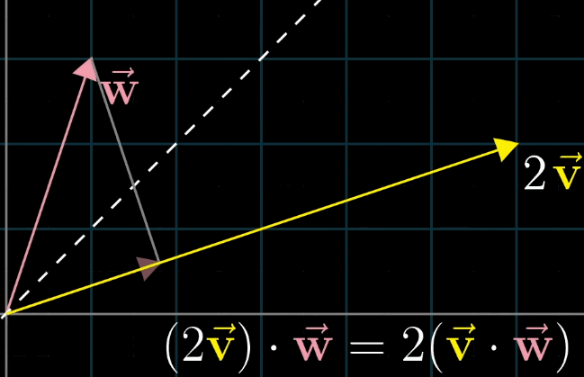
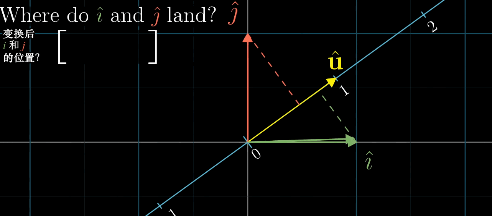

##  向量

-   线性组合
-   向量空间
-   空间的基：向量空间的一组基是张成该空间的一个线性无关向量集
-   线性相关

### 向量点积

-   向量点积性质
    -   向量的数乘等比例影响点积，则可为每个向量找到共线单位向量满足 $u \cdot u=1$
        
    -   点积等同于向量 $b$ 左乘矩阵 $a^T$，即把向量 $b$ 压缩（线性变换）至向量 $a$ 方向上
        

-   点积 $a \cdot b$ 与投影关系（假设向量 $a$ 为单位向量）
    -   投影，即将向量 $b$ **线性变换** 至 $a$ 方向上的标量
        -   则投影可以用 $1 * n$ 矩阵表示
        -   投影代表的矩阵则可通过利用基向量的变换结果求解
        
    -   向量 $a$ 本身作为单位向量
        -   坐标轴上单位向量与 $a$ 的内积即为 $a$ 该方向分量，也即 $a$ 在该轴上投影
        -   由对称性显然，坐标轴在 $a$ 方向投影等于 $a$ 在轴方向投影
        -   则投影到向量 $a$ 代表的线性变换矩阵即为 $a^T$
        
    -   扩展到一般情况
        -   考虑标量乘法对点积影响，坐标轴上向量与任意向量 $a$ 内积等价于投影
        -   投影是线性变换，则对空间一组基的变换可以推导到空间中任意向量 $b$

> - 高维空间到标量的线性变换与空间中一个向量对应，即应用线性变换等价于同该向量点积 

####    点积用途

-   向量证明基本都是都转换到点积上
    -   正定：行列式恒 $>0$
    -   下降方向：内积 $<0$
    -   方向（趋于）垂直：内积趋于0

####    求和、积分、点积、卷积

|          | 连续（函数）               | 离散（向量）                                             |
|----------|----------------------------|----------------------------------------------------------|
| 单元累计 | 积分：按值出现频率加权求和 | 求和：向量视为分段函数积分                               |
| 二元累计 | 卷积：连续卷积             | 点积：离散卷积的特殊情况，即仅向量对应位置分量乘积有定义 |

> - 卷积：累计中各点的值变为需累计的值，即二次累计

### 向量叉积

-   向量叉积意义
    -   向量叉积即寻找向量（到标量的线性变换），满足与其点积结果为张成的体积
        
    -   考虑点积性质，则向量叉积的方向与向量构成超平面垂直、模为超平面大小
        

### 约定

-   方向约定
    -   正交方向：向量空间 $R^n$ 中 $k, k \leq n$ 个向量 $q^{(1)}, \cdots, q^{(k)}$ 两两正交，则称其为 $k$ 个正交方向，若满足所有向量非 0，则称为 $k$ 个非 0 正交方向
    -   向量左右
        -   左侧：向量逆时针旋转 $[0, \pi]$ 内
        -   右侧：反左侧

##  线性方程组

### Gaussian Elimination

-   高斯消元法：初等变换 $n$ 个线性方程组为等价方程组，新方程组系数矩阵为上三角矩阵
    -   三角系数矩阵可以方便的递推求解
    -   初等变换可将系数矩阵变换为上三角矩阵，而不影响方程解

### *Jacobi Method* 

-   *Jacobi* 法：将矩阵分解为对角阵、非对角阵之和

> - 雅可比法：<https://zh.wikipedia.org/wiki/%E9%9B%85%E5%8F%AF%E6%AF%94%E6%B3%95>

### *Gauss-Seidel Method*

-   *Gauss-Seidel* 迭代：将矩阵分解为对角、上三角、下三角矩阵之和

> - 高斯赛德尔迭代：<https://zh.wikipedia.org/wiki/%E9%AB%98%E6%96%AF-%E8%B5%9B%E5%BE%B7%E5%B0%94%E8%BF%AD%E4%BB%A3>

####    *Successive Over Relaxation*

-   *SOR* 逐次超松弛迭代法：*Gauss-Seidel* 变体，分解同时增加权重 $w$ 调整分解后比例
    -   利用内在等式应用的平衡性、不动点收敛理论可以快速迭代
        -   $x$ 拆分到等式左右两侧，可以视为 $y=x$ 和另外函数交点
        -   根据不动点收敛理论可以进行迭代求解

> - 逐次超松弛迭代法：<https://zh.wikipedia.org/wiki/%E9%80%90%E6%AC%A1%E8%B6%85%E6%9D%BE%E5%BC%9B%E8%BF%AD%E4%BB%A3%E6%B3%95>

##  矩阵

-   矩阵（乘法）：对向量的线性变换
    -   对 $m * n$ 矩阵，即将 $n$ 维空间映射至 $m$ 维空间
    -   矩阵相关概念
        -   （矩阵）秩：空间维数
        -   （矩阵）零空间/核：变换（左乘矩阵）后落在原点的向量的集合
        

> - 线性变换：保持空间中坐标轴仍为直线且原点保持不变的变换
> - 此处若无特殊说明，向量均以列向量作为基础

### 特殊矩阵

> - 其中正交矩阵、三角阵、对角阵也被称为因子矩阵

-   *Orthogonal Matrix* 正交矩阵：和其转置乘积为单位阵的方阵
    -   左乘正交矩阵几何意义：等价于旋转
        
    -   酉矩阵/幺正矩阵：$n$ 个列向量是 $U$ 空间标准正交基的 $n$ 阶复方阵，是正交矩阵往复数域上的推广

-   *Diagonal Matrix* 对角阵：仅对角线非0的矩阵
    -   左乘对角阵矩阵几何意义：等价于对坐标轴缩放
        

-   *Triangular Matrix* 上/下三角矩阵：左下/右上角全为0的方阵
    -   三角阵是高斯消元法的中间产物，方便进行化简、逐层迭代求解线性方程组
    -   左乘上三角阵几何意义：等价于进行右上切变（水平斜拉）
        
    -   左乘下三角阵几何意义：等价于进行左下切变（竖直斜拉）
        

-   *Transposation Matrix* 置换矩阵：系数只由 0、1 组成，每行、列恰好有一个 1 的方阵

###  矩阵乘法

-   矩阵乘法
    -   向量左乘矩阵：即是对向量进行变换
        
    -   矩阵乘积：复合变换
        

> - 矩阵乘法应按照从右往左阅读，右侧矩阵为输入、左侧矩阵为变换（向量默认为列向量时）

### *Affline Transformation*

$$\begin{align*}
y &= Ax + b \\
y &= (A|b^T) \begin {bmatrix} x \\ 1 \end {bmatrix}
\end{align*}$$

> - $y \in R^n, x \in R^n$
> - $A \in R^{n * n}$：可视为产生旋转、放缩
> - $b \in R^n$：可视为产生平移

-   仿射变换：对向量空间进行线性变换、平移得到另一个向量空间
    -   仿射变换可以理解为：放缩、旋转、平移
    -   从仿射变换的角度，对向量空间进行仿射变换
        -   $n+1$ 对变换前、变换后向量坐标即可以求解仿射变换的全部参数
        -   变换后的向量之间仍然保留某种相关性，所以 $n+1$ 对向量坐标可以完全确定仿射变换
    -   从仿射变换几何含义，将向量空间中向量统一变换
        -   $n+1$ 个不共线 $n$ 维向量即唯一确定n维空间
        -   若所有向量变换均遵循同一“线性”变换规则，即进行相同放缩、旋转、平移，则这样的变换可以使用仿射变换表示
    -   说明
        -   $n$ 变换前、变换后向量坐标可以求解 $A$（不考虑 $b$），但第 $n+1$ 对向量坐标未必满足 $A$ 变换
        -   若 $n+2$ 对向量坐标不满足 $(A|b)$ 的解，则表示不是进行仿射变换

### *Perspective Transformation*

$$\begin{align*}
y &= P \begin {bmatrix} x \\ 1 \end {bmatrix} \\
y &= \begin {bmatrix} A & b \\ c & p_{n+1,n+1} \end {bmatrix}
    \begin {bmatrix} x \\ 1 \end {bmatrix}
\end{align*}$$

> - $P \in R^{(n+1) * (n+1)}, A \in R^{n * n}$
> - $x \in R^n, y \in R^{n+1}$：这里默认$x$第$n+1$维为1
> - $c$：可视为产生透视，若其为0向量，则退化为仿射变换
> - $p_{n+1,n+1}$：可视为决定透视放缩，所以若是已确定新向量空间的“位置”，此参数无效，即 $n+2$ 对向量坐标即可求解变换

-   透视变换：将向量空间映射到更高维度，再降维到另一向量空间
    -   透视变换虽然是向量空间变换至另一向量空间，但仍然存在一个透视“灭点”，作为所有透视线的交点
        -   对平面成像而言，“灭点”是成像平面、视角决定
    -   变换后 $y$ 维数增加，一般会再次投影、缩放回原维度空间，如原向量空间 $(R^n,1)$

> - 仿射变换可以视为是新的向量空间和原始空间“平行”的透视变换特例

####    变换矩阵求解

$$\begin{align*}
\begin {bmatrix} P & b \\ c & p_{n+1,n+1} \end {bmatrix}
    \begin {bmatrix} x \\ 1 \end {bmatrix} &=
    \gamma \begin {bmatrix} x^{'} \\ 1 \end {bmatrix} \\
\Rightarrow Px + b &= \gamma x^{'} \\
    c^Tx + p_{n+1,n+1} &= \gamma \\
\Rightarrow Px + b &= (c^Tx + p_{n+1,n+1}) x^{'}
\end{align*}$$

> - 考虑变换后再次缩放回更低维 $(R^n,1)$ 向量空间
> - $\gamma$：变换后向量缩放比例

-   可解性
    -   共 $n+2$ 对变换前、后向量坐标，即 $n*(n+2)$ 组方程
    -   对每对向量，其中 $n$ 组方程如上可以看出是齐次方程组，**不包含常数项**
    -   则对 $P \in R^{(n+1) * (n+1)}$ 中除 $p_{n+1,n+1}$ 其他项均可被其比例表示（不含常数项）

> - 当然 $p_{n+1,n+1}$ 可以置 1 参加运算，不影响结果

###  *Determinant*

-   矩阵行列式几何意义：线性变换对空间的拉伸比例
    -   行列式绝对值：拉伸的比例的绝对大小
        -   行列式为 0 时则表示空间降维，则对应线性方程组仅在方程组右侧在矩阵张成空间内，即扩展矩阵秩不增时有解
        -   则显然应有 $det(M_1 * M_2) = det(M_1) det(M_2)$
    -   行列式正负号：拉伸的方向

-   特别的，某些形状矩阵行列式有明确几何意义
    -   $2 * 2$ 矩阵 $\begin{vmatrix} a & b \\ c & d \end{vmatrix} = ad - bc$
        -   $a, d$ 分别表示 $(1,0)$、$(0,1)$ 正向放缩比例
        -   而 $b, c$ 则相应的为逆向放缩比例
        
    -   二维三点：行列式绝对值为三点构成三角形面积两倍
        $$
        \begin{vmatrix}
            x_1 & y_1 & 1 \\
            x_2 & y_2 & 1 \\
            x_3 & y_3 & 1 \\
        \end{vmatrix} = 
        x_1y_2 + x_3y_1 + x_2y_3 - x_3y_2 - x_2y_1 - x_1y_3
        $$
        > - $q_3$ 位于 $\overrightarrow{q_1q_2}$ 左侧：行列式大于0
        > - $q_3q_1q_2$ 共线：行列式值为 0
    -   三维三点：行列式为三个向量张成的平行六面体体积

###  *Eigen Value*、*Eigen Vector*

-   矩阵（变换）特征向量、特征值几何意义
    -   特征向量：在线性变换后仍然在自身生成空间中，即保持方向不变，仅是模变化的向量
    -   特征值：对应特征向量模变化的比例

-   特殊变换中的特征向量、特征值情况
    -   旋转变换：特征值为 $\pm i$，没有特征向量，即特征值为复数表示某种旋转
    -   剪切变换（$\begin{vmatrix} A^{'} & 0 \\ 0 & 1 \end{vmatrix}$$：必然有特征值为 1，且对应特征向量在坐标轴上
    -   伸缩变换（$\lambda E$）：所有向量都是特征向量

-   矩阵对角化
    -   矩阵对角化：即寻找一组基，使得线性变换对该组基向量仅引起伸缩变换
    -   定理：当且仅当 $n$ 阶矩阵 $A$ 有 $n$ 个线性无关的特征向量时，其可以对角化
        -   即变换后有 $n$ 个线性无关向量在自身生成空间中
        -   也即矩阵对应变换为线性变换

> - <https://www.bilibili.com/video/av6731067/>
> - <https://charlesliuyx.github.io/2017/10/06/%E3%80%90%E7%9B%B4%E8%A7%82%E8%AF%A6%E8%A7%A3%E3%80%91%E7%BA%BF%E6%80%A7%E4%BB%A3%E6%95%B0%E7%9A%84%E6%9C%AC%E8%B4%A8/>

### 杂项

####    广义逆阵

-   广义逆阵：矩阵 $A \in R^{m*n}$，若矩阵 $G \in R^{n*m}$ 满足 $AGA = A$，则称矩阵 $G$ 为广义逆阵
    -   广义反身逆阵 $G$
        -   $AGA = A$
        -   $GAG = G$
    -   *Moore-Penrose Pseudoinverse* $G$
        -   $AGA = A$
        -   $GAG = G$
        -   $(AG)^T = AG$
        -   $(GA)^T = GA$
    -   广义逆阵不唯一，任意广义逆阵可用于判断线性方程组 $Ax = b$ 解
        -   方程组有解当且仅当 $Gb$ 为解之一，即 $AGb = b$
        -   所有解为 $x = Gb + (I - GA)w$（$w$ 为任意向量）

> - 广义逆阵：<https://zh.wikipedia.org/wiki/%E5%B9%BF%E4%B9%89%E9%80%86%E9%98%B5#%E6%87%89%E7%94%A8>

####    *Sherman-Morrison* 公式

-   *Sherman-Morrison* 公式：设 $A$ 是 $n$ 阶可逆矩阵，$u, v$均为n为向量，若 $1 + v^T A^{-1} u \neq 0$，则扰动后矩阵 $A + u v^T$ 可逆
    $$(A + u v^T)^{-1} = A^{-1} -
    \frac {A^{-1} u v^T A^{-1}} {1 + v^T A^{-1} u}$$

####    矩阵空间

-   列空间：矩阵 $A \in R^{m*n}$ 的列空间为 $S = \{ Ax | x \in R^n \}$
-   零空间：矩阵 $A \in R^{m*n}$ 的零空间为 $S_0 = \{ x \in R^m | A^Tx = 0 \}$
    -   列空间与零空间互为正交空间
-   正交子空间：对欧式空间子空间 $V_1 \in R^n, V_2 \in R^n$，若 $\forall x \in V_1, y \in V_2$ 总有 $<x, y> = 0$，则为 $V_1, V_2$ 正交，记为 $V1 \perp V_2$

####    *Projection Matrix*

-   考虑向量 $x \in R^m$ 到矩阵 $A \in R^{m*n}$ 的列空间的投影 $p = A \hat x$，设投影矩阵为 $P \in R^{m*m}$，则应有
    $$\begin{align*}
    p &= Px \\
    A^T(x - p) &= 0 \\
    A^T(x - A \hat x) & = 0 \\
    A^Tx &= A^TA \hat x \\
    \hat x &= (A^TA)^{-1}A^Tx \\
    p &= A \hat x = A(A^TA)^{-1}A^T x \\
    \Rightarrow P &= A(A^TA)^{-1}A^T
    \end{align*}$$
    -   投影矩阵 $P$ 中逆矩阵 $(A^TA)^{-1}$ 仅在矩阵 $A$ 列满秩时存在，但可定义为广义逆矩阵以扩展至一般的矩阵
    -   投影矩阵 $P$ 有 $P^T = P, P^2 = P$（这也是投影矩阵定义）
    -   投影矩阵有如下性质
        -   $\forall x \in R^n, Px \in S$：任意向量均投影至目标空间
        -   $\forall x \in S, Px = x$：列空间内向量投影结果不变
        -   $PP = P$：投影矩阵幂等，即投影矩阵投影自身不变
    -   $I - P$ 投影至矩阵 $A$ 列空间的正交补空间，即零空间
        -   显然，零空间投影 $p^0$ 有 $p^0 = x - p = x - Px$，则可得 $I - P$ 为零空间投影矩阵
        -   另，$A^Tx = 0$ 的解空间即 $A$ 的零空间

-   另，向量 $x \in R^m$ 到矩阵 $A \in R^{m*n}$ 的列空间的投影 $p = A \hat x$ 应为如下最优化问题解
    $$\begin{align*}
    \arg\min_p & \|x - p\| \\
    s.t. & p \in A
    \end{align*}$$
    -   即，可从最优化角度求解投影矩阵

> - 投影矩阵：矩阵 $P \in R^{n*n}$，若满足 $P^T = P, P^2 = P$ 则称为投影矩阵
> - 投影矩阵：<https://www.cnblogs.com/bigmonkey/p/9897047.html>

##  矩阵求导/矩阵微分

### *Layout Conventions*

-   矩阵求导：在矩阵空间的多元微积分
    -   *numerator layout* 分子布局：微分分子的维数决定微分结果的高维度结构
        -   即例，行优先则微分矩阵行数等于分子维数
    -   *denominator layout* 分母布局：微分分母的维数为微分结果的高维度结构
    -   两种布局方式相差转置
        -   与微分分子、分母为行、或列向量无关
            -   即当微分分子、分母为向量时，行、列向量结果相同，只与维度有关
        -   此布局模式仅讨论简单单因子微分时布局模式，复合多因子应使用维度分析考虑
            -   即若严格按照计算规则，结果应该满足布局

> - 数分中 *Jaccobi* 行列式采用分子布局，以下默认为分子布局

### 维度分析

-   维度分析：对求导结果的维度进行分析，得到矩阵微分结果
    -   维度一般化：将向量、矩阵 **维度置不同值**，便于考虑转置
    -   拆分有关因子：利用 **求导乘法公式**（一般标量求导）拆分因子，分别考虑各因子微分结果
    -   变换微分因子、剩余因子（可能有左右两组），以满足矩阵运算维度要求
        -   微分因子：**按布局模式考虑维度、不转置**
        -   剩余因子：为满足最终结果符合维度布局，考虑转置
        -   若维度一般化也无法唯一确定剩余因子形式，再考虑行、列內积对应关系
    -   考虑到矩阵乘法定义（左乘矩阵行数为乘法结果行数）
        -   在行优先、分子布局中：简单微分中若微分因子为右乘矩阵、剩余因子为左乘矩阵，则类似标量 **系数在前** 求微分，否则结果需转置

####    例

-   考虑$\frac {\partial x^T A x} {\partial x}$，其中 $A \in R^{n*n}, x \in R^n$

-   维度一般化：$\frac {\partial u^T A v} {\partial x}$，其中 $A \in R^{a * b}, x \in R^n$

-   拆分有关因子，变换微分、剩余因子

    $$\begin{align*}
    \frac {\partial (u^T A) v} {\partial x} & = u^T A \frac
        {\partial v} {\partial x} \\
    \frac {\partial u^T (A v)} {\partial x} & = v^T A^T \frac
        {\partial u} {\partial x}
    \end{align*}$$

-   则有

    $$
    \frac {\partial x^T A x} {\partial x} = x^T (A^T + A)
    $$

###  对标量导数

#### 标量对标量

-   标量 $y$ （作为向量函数）对标量 $x$ 求导：$\frac {\partial y} {\partial x}$

#### 向量对标量

-   向量对标量求导：向量 $Y$关于标量 $x$ 求导（$Y$ 为行、列向量均如此）

$$
\frac {\partial Y} {\partial x} = \begin{bmatrix}
    \frac {\partial y_1} {\partial x} \\
    \frac {\partial y_2} {\partial x} \\
    \vdots \\
    \frac {\partial y_n} {\partial x}
\end{bmatrix}
$$

#### 矩阵对标量

-   矩阵 $Y$ 对标量 $x$ 求导

$$
\frac {\partial Y} {\partial x} = \begin{bmatrix}
    \frac {\partial y_{11}} {\partial x} & \frac
        {\partial y_{12}} {\partial x} & \cdots & \frac
        {\partial y_{1n}} {\partial x} \\
    \frac {\partial y_{21}} {\partial x} & \frac
        {\partial y_{22}} {\partial x} & \cdots & \frac
        {\partial y_{2n}} {\partial x} \\
    \vdots & \vdots & \ddots & \vdots \\
    \frac {\partial y_{n1}} {\partial x} & \frac
        {\partial y_{n2}} {\partial x} & \cdots & \frac
        {\partial y_{nn}} {\partial x} \\
\end{bmatrix}
$$

###  对向量导数

#### 标量对向量

-   标量 $y$ 关于向量 $X$ 求导

$$
\frac {\partial y} {\partial X} = [\frac {\partial y} 
    {\partial x_1}, \frac {\partial y} {\partial x_1},
    \cdots, \frac {\partial y} {\partial x_n}]
$$

#### 向量对向量

-   向量 $Y$ 关于向量 $X$ 求导
    -   $Y$、$X$ 为行、列向量均如此

$$
\frac {\partial Y} {\partial X} = \begin{bmatrix}
    \frac {\partial y_1} {\partial x_1} & \frac
        {\partial y_1} {\partial x_2} & \cdots & \frac
        {\partial y_1} {\partial x_n} \\
    \frac {\partial y_2} {\partial x_1} & \frac
        {\partial y_2} {\partial x_2} & \cdots & \frac
        {\partial y_2} {\partial x_n} \\
    \vdots & \vdots & \ddots & \vdots \\
    \frac {\partial y_m} {\partial x_1} & \frac
        {\partial y_m} {\partial x_2} & \cdots & \frac
        {\partial y_m} {\partial x_n}
\end{bmatrix}
$$

###  对矩阵导数

#### 标量对矩阵求导

###  微分

#### 微分形式

#### 导数、微分转换

##  *Matrix Decomposition*

-   矩阵分解：将矩阵拆解位数个矩阵乘积的运算
    -   因子矩阵通常为三角阵、对角阵、正交阵
    -   矩阵分解通常定义在实数域上，也可将因子矩阵扩充至复数域

> - 矩阵加法分解有时也被称为矩阵分解

### *LU Decomposition*

-   *LU* 分解：将方阵分解为上三角、下三角矩阵乘积 $A = LU$
    -   几何意义：由单位阵出发，经过竖直、水平切变
    -   *LU* 分解可以快速求解线性方程组，可以视为高斯消元法的矩阵形式
        -   $L$ 为消元过程中的行系数和对角线全为 1 的下三角矩阵（负系数在矩阵中为正值）
        -   $U$ 为消元结果上三角矩阵
        -   对任意向量 $b$，求解 $Ax=b$ 即等价于
            -   先求解 $Ly=b$
            -   再求解 $Ux=x$
    -   特别的可以要求某个矩阵对角线元素为 1
        -   此时，*LU* 分解实际上不需要额外存储空间，矩阵L、U可以合并存储

-   *LDU* 分解：将矩阵分解为下三角、上三角、对角矩阵乘积 $A = LDU$
    -   *LU* 分解可以方便的得到 *LDU* 分解
        -   提取对角阵、然后对应矩阵元素等比缩放即可

-   *PLU* 分解：将方阵分解为置换矩阵、下三角、上三角矩阵乘积 $A = PLU$
    -   考虑 $P^{-1}A=LU$，交换 $A$ 行即可作普通 *LU* 分解，*PLUQ* 分解类似
    -   *PLU* 分解数值稳定性好

-   *PLUQ* 分解：将方阵分解为置换矩阵、下三角、上三角、置换矩阵乘积 $A = PLUQ$

> - *Permutation Matrix* 置换矩阵：每行、每列恰好只有一个 1、其余为 0 的方阵

### *Cholesky Decomposition*

-   *Cholesky* 分解：将正定的 *Hermitian Matrix* 分解为下三角矩阵及其共轭转置乘积 $H = LL^T$
    -   相较于 *LU* 分解，*Cholesky* 分解速度更快、数值稳定性更好
    -   常用于相关分析，分解相关系数阵、协方差阵

-   *LDL* 分解：类似 *Cholesky* 分解 $H = LDL^T$

> - *Hermitian Matrix* 共轭对称矩阵，实对称矩阵即其特例
> - *Cholesky* 分解：<https://zh.wikipedia.org/wiki/%E7%A7%91%E5%88%97%E6%96%AF%E5%9F%BA%E5%88%86%E8%A7%A3>

### *Singular Value Decomposition*

-   *SVD* 奇异值分解：将矩阵分解为正交矩阵、对角矩阵、正交矩阵乘积 $M_{m*n} = U_{m*r} \Sigma_{r*r} V_{n*r}^T$
    -   特征值分解在任意矩阵上推广：相应的特征值、特征向量被称为奇异值、奇异向量
        -   $\Sigma$ 对角线元素为 $M^T M$、$M M^T$ 的特征值
            -   可视为在输入输出间进行标量的放缩控制
            -   同 $U$、$V$ 的列向量相对应
        -   $U$ 的列向量称为左奇异向量
            -   即 $M M^T$ 的特征向量
            -   与 $M$ 正交的“输入”、“分析”基向量
        -   $V$ 的列向量成为右奇异向量
            -   即 $M^T M$ 的特征向量
            -   与 $M$ 正交的“输出”基向量
    -   几何意义：由单位阵出发，旋转、缩放、再旋转

-   *SVD* 低阶近似
    -   对 $m * n$ 阶原始矩阵 $M$
        -   设其秩为 $K \leq min(m, n)$，奇异值为 $d_1 \geq d_2 \geq \cdots \geq d_K > 0$
        -   不失一般性可以设其均值为 0
    -   根据 *Eckart and Young* 的结果
        $$ \forall r \leq K, \sum_{k=1}^r d_k u_k v_k^T = \arg\min_{\bar M \in M(r)} \| M - \bar M \|_F^2 $$
        > - $u_k, v_k$：$U, V$的第$k$列向量
        > - $\|M\|_F$：矩阵的Frobenius范数

##  *QR Decomposition*

-   *QR* 分解：将矩阵分解为正交矩阵、上三角矩阵
    -   几何意义：由单位阵出发，经旋转、切变
    -   正交矩阵逆为其转置，同样可以方便求解线性方程组
