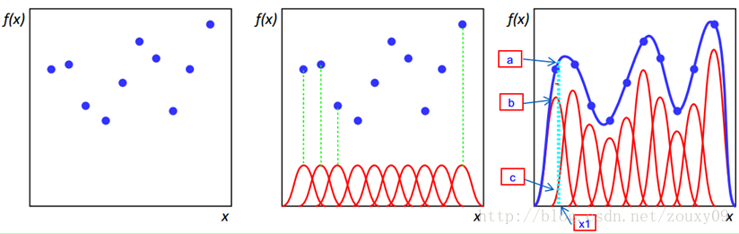
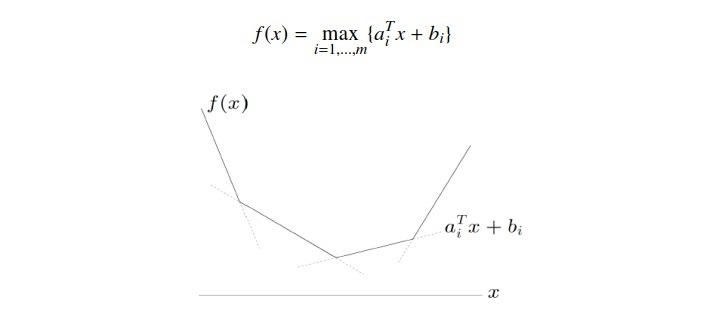
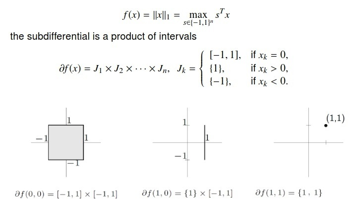

#   初等代数

##  公式

###    最大公约数、最小公倍数

-   最大公约数
    -   辗转相除法：$gcd(m, n) = gcd(n, m \mod n)$
-   最小公倍数：$lcm(m, n) = \frac {m * n} {gcd(m, n)}$

> - 辗转相除法：<https://zh.wikipedia.org/wiki/%E8%BC%BE%E8%BD%89%E7%9B%B8%E9%99%A4%E6%B3%95>

##  特殊函数

| 函数     | 表达式                                     | 说明                         |
|----------|--------------------------------------------|------------------------------|
| 伽马函数 | $\Gamma = \int_0^{\inf} t^{z-1} e^{-t} dt$ | 阶乘函数在复数域上的解析延拓 |

> - 伽马函数：<https://zh.wikipedia.org/wiki/%CE%93%E5%87%BD%E6%95%B0>
> - 伽马函数：<https://zhuanlan.zhihu.com/p/147583667>

### 齐次函数

-   齐次函数：有倍数性质的函数，若变量乘以系数 $\alpha$，则新函数为原函数乘上 $\alpha^k$ 倍
    $$
    f(\alpha x) = \alpha^k f(x)
    $$
    > - $\alpha \neq 0 \in F, x \in X$
    > - $f: X \rightarrow W$：域 $F$ 内两个向量空间之间的 $k$ 次齐次函数

    -   线性函数 $f: X \rightarrow W$ 是一次齐次函数
    -   多线性函数 $f: x_1 * x_2 * \cdots * x_n \rightarrow W$ 是 $n$ 次齐次函数
    -   欧拉定理：函数 $f: R^n \rightarrow R$ 可导、$k$ 次齐次函数，则有 $x \nabla f(x) = kf(x)$

### 凸函数

-   凸函数 $f$ 满足
    $$
    \forall x, y \in R, \forall \lambda \in (0,1), 
        f(\lambda x + (1-\lambda) y) \leq \lambda f(x) + (1-\lambda)f(y)
    $$
    -   强凸函数：不等式严格不等的凸函数
        -   为保证强凸性，常添加二次项保证，如：增广拉格朗日

### *Radial Basis Function*

-   *RBF* 径向基函数：取值仅依赖到原点距离的实值函数，即 $\phi(x) = \phi(\|x\|)$
    -   说明
        -   也可以按照距离某中心点 $c$ 的距离定义，即 $\phi(x) = \phi(\|x-c\|)$
        -   其中距离一般为使用 $L_2$ 范数，即欧式距离
        -   函数 $\phi$ 一般与 $\|x\|$ 负相关
    -   径向基函数最初用于解决多变量插值问题
        -   即以各样本为中心创建多个径向基函数
        -   多个径向基函数加权加和即得到拟合的函数曲线，可用于函数插值

-   常见径向基函数：记 $r=\|x-x_i\|$
    -   高斯函数
        $$ \phi(r) = e^{-(\epsilon r)^2} $$
    -   *Multiquadric* 多二次函数
        $$ \phi(r) = \sqrt {1 + (\epsilon r)^2} $$
    -   *Inverse Quadric* 逆二次函数
        $$ \phi(r) = \frac 1 {1 + (\epsilon r)^2} $$
    -   *Polyharmonic Spline* 多重调和样条
        $$\begin{align*}
        \phi(r) &= r^k, & k=1,3,5,\cdots \\
        \phi(r) &= r^k (ln(r))^{}, & k=2,4,6,\cdots  \\
        \end{align*}$$
    -   *Thin Plate Spline* 薄板样条（多重调和样条特例）
        $$ \phi(r) = r^2 ln(r) $$

### 指数、对数函数

-   指数函数：本质是满足 $F(x+y) = F(x)F(y)$ 的光滑函数

-   对数函数：本质是满足 $F(xy) = F(x) + F(y)$ 的光滑函数
    -   由此定义出发，可以证明对数函数的导函数为倒数函数

#   分析

##   级数

-   *Analytic Continuation* 解析延拓
    -   将解析函数从其原始定义域扩展到更大定义域，同时保持函数的解析性

-   *Analytic Function* 解析函数
    -   函数是解析函数当且仅当在定义域中每个领域内泰勒级数都收敛
    -   特点
        -   在定义域内任意点无限次可微

> - 解析函数：<https://zh.wikipedia.org/wiki/%E8%A7%A3%E6%9E%90%E5%87%BD%E6%95%B0>
> - 解析延拓：<https://zh.wikipedia.org/wiki/%E8%A7%A3%E6%9E%90%E5%BB%B6%E6%8B%93>
> - 解析延拓：<https://www.zhihu.com/question/29825258/answer/3324056111>

#   微积分

##  次梯度

-   次梯度：实变量凸函数 $f$ 在点 $x_0$ 的次梯度 $c$ 满足
    $$ \forall x, f(x) - f(x_0) \geq c(x - x_0) $$
    -   可证明凸函数 $f$ 在 $x_0$ 处所有次梯度的集合 $\partial f(x)$ 是非空凸紧集
        -   $\partial f(x) = [a, b]$，其中 $a, b$ 为单侧极限
            $$\begin{align*}
            a & = lim_{x \rightarrow x_0^{-}} \frac {f(x) - f_0(x)} {x - x_0} \\
            b & = lim_{x \rightarrow x_0^{+}} \frac {f(x) - f_0(x)} {x - x_0}
            \end{align*}$$

### 次梯度性质

-   运算性质
    -   数乘性质
        $$ \partial(\alpha f)(x) = \alpha \partial f(x), \alpha > 0 $$
    -   加法性质
        $$\begin{align*}
        f &= f_1 + f_2 + \cdots + f_m, \\
        \partial f &= \partial f_1 + \cdots + \partial f_m
        \end{align*}$$
    -   仿射性质：$f$ 为凸函数
        $$\begin{align*}
        h(x) &=  f(Ax + b) \\
        \partial h(x) &= A^T \partial f(Ax + b)
        \end{align*}$$

-   最优化性质
    -   凸函数 $f$ 在点 $x_0$ 可导，当且仅当次梯度仅包含一个点，即该点导数
    -   点 $x_0$ 是凸函数 $f$ 最小值，当且仅当次微分中包含 0
        （此性质为“可导函数极小点导数为 0 ”推广）
    -   负次梯度方向不一定是下降方向

### 次梯度案例

-   次梯度求解
    -   逐点、分段极值函数
        -   求出各点相应极值函数
        -   求各点极值函数对应梯度即为次梯度

####    *Pointwise Maximum*

$$\begin{align*}
f(x) & = max \{f_1(x), f_2(x), \cdots, f_m(x)\} \\
I(x) & = \{i | f_i(x) = f(x)\}
\end{align*}$$
> - $I(x)$：保存 $x$ 处取值最大的函数下标

-   逐点最大函数次梯度
    -   弱结果：$I(x)$ 中随机抽取，以 $f_i(x)$ 在该处梯度作为次梯度
    -   强结果
        $$ \partial f(x) = conv \cup_{i \in I(x)} \partial f_i(x) $$
        -   先求支撑平面，再求所有支撑平面的凸包
        -   可导情况实际上是不可导的特殊情况

####    分段函数

-   分段函数次梯度
    -   折点处
        $$ \partial f(x) = conv\{a_i, a_{i+1}\} = [a_i, a_{i+1}] $$
    -   非折点处
        $$\partial f(x) = {a_i}$$

####    $L_1$范数

####    *PointWise Supreme*

$$\begin{align*}
f(x) &= \sup_{\alpha \in A} f_{\alpha}(x) \\
I(x) &= \{\alpha \in A | f_{\alpha}(x) = f(x)\}
\end{align*}$$

-   逐点上确界函数次梯度
    -   弱结果：可行梯度为
        $$ \partial (\max_{\alpha} f_{\alpha}(x)) \in partial f(x) $$
    -   强结果
        $$
        \partial f(x) = conv \cup_{\alpha \in I(x)} \partial f_{alpha}(x) \subseteq \partial f(x)
        $$

####    最大特征值

$$\begin{align*}
f(x) & = \lambda_{max}(A(x)) = \sup_{\|y\|_2 = 1} \\
A(x) & = A_0 + x_1 A_1 + \cdots + x_n A_n
\end{align*}$$
> - $A_n$：对称矩阵

-   最大特征值次梯度：对确定 $\hat {x}$，$A(x)$ 最大特征值 $\lambda_{max}$、对应特征向量 $y$，则该点次梯度为
    $$(y^T A_0 y, \cdots, y^T A_n y)$$

####    *Pointwise Inferior*

$$ f(x) = \inf_y h(x, y) $$
> - $h$：凸函数

-   逐点下确界次梯度
    -   弱结果：给定$x = \hat x$，可行次梯度为
        $$ (\partial h(x, \hat y)|_{x=\hat x}, 0) \in \partial f(x) $$

####    复合函数

$$ f(x) = h(f_1(x), \cdots, f_n(x)) $$
> - $h$：凸、不降函数
> - $f_i$：凸函数

-   复合函数次梯度
    -   弱结果：给定$x = \hat x$，可行次梯度为
        $$ g = z_1 g_1 + \cdots + z_k g_k \in \partial f(\hat x) $$
        > - $z \in \partial h(f_1(\hat x), \cdots, f_k(\hat x))$
        > - $g_i \in \partial f_i(\hat x)$
    -   证明
        $$\begin{align*}
        f(x) & \geq h(f_1(\hat x) + g_1^T(x - \hat x), \cdots,
            f_k(\hat x) + g_k^T(x - \hat x) \\
        & \geq h(f_1(\hat x), \cdots, f_k(\hat x)) +
            z^T(g_1^T(x - \hat x), \cdots, g_k^T(x - \hat x)) \\
        & = f(\hat x) + g^T(x - \hat x)
        \end{align*}$$

#   概率、随机

##   随机分布

|分布|*PDF*|*CDF*|描述|
|----|------|------|-----|
|正态分布|
|*t* 分布|$ \frac {\Gamma((v+1)/2)} {\sqrt {\pi v} \Gamma(v/2)} (1 + x^2/v)^{-(v+1)/2} $|
|卡方分布|

###    特殊分布

####    *P-stable Distributions*

-   *P-stable Distribution*：若 $X_1, X_2, \cdots, X_n$ 为服从独立同分布 $D$ 随机变量，且随机变量 $\sum_i v_i X_i$ 、随机变量 $(\sum_i \|v_i\|^p)^{1/p} X$ 具有相同的分布，其中 $v_1, v_2, \cdots, v_n$ 为任意实数，则称分布 $D$ 为 *P-稳定分布*

-   说明
    -   $\forall p \in (0, 2]$，*P-稳定分布* 存在
        -   但仅 $p=1,2$ 时，有解析解
            -   $p=1$：柯西分布
                $$ c(x) = \frac 1 \pi \frac 1 {1+x^2} $$
            -   $p=2$：高斯分布
                $$ g(x) = \frac 1 {\sqrt {2\pi}} e^{-\frac {x^2} 2} $$
        -   可以从 $[0,1]$ 上均匀分布获得其他 *P-稳定分布*
            -   但是概率分布、密度函数没有解析解
    -   若向量 $a$ 中每个元素独立从 *P-稳定分布* 中抽取，则 $\|v\|_p X = (\sum_i \|v_i\|^p)^{1/p} X$ 和 $<a,v>$ 同分布
        -   可用较好计算的内积估计 $\|v\|_p$
        -   考虑到 $a(v_1 - v_2) = av_1 - av_2$，将内积和点之间 $L_p$ 范数距离 $\|v_1 - v_2\|_p$ 相联系

####    *Exponential Family of Distributions*

$$\begin{align*}
f_X(x|\theta) &= h(x) e^{\eta(\theta) T(x) - A(\theta)} \\
&= h(x) g(\theta) e^{\eta(\theta) T(x)} \\
&= e^{\eta(\theta) T(x) - A(\theta) + B(x)}
\end{align*}$$
> - $\eta(\theta)$：*Natural Parameter*，自然参数
> - $T(x)$：*Sufficient Statistic*，随机变量 $X$ 的充分统计量
> - $h(x)$：*Underlying Measure*，底层观测值
> - $A(\theta)$：*Log Normalizer*，对数规范化

-   *Exponential Family of Distributions* （单变量）指数分布族

-   说明
    -   $\eta(\theta), T(x)$：可以是向量，其内积仍为实数
    -   $\eta(\theta) = \theta$ 时，分布族为 *Canonical* 形式
        -   总是能够定义 $\eta = \eta(\theta)$ 转为此形式
    -   对数规范化 $A(\theta)$ 使得概率密度函数满足积分为 1
        $$\begin{align*}
        f(x|\theta) e^{A(\theta)} & = h(x) e^{\eta(\theta)T(x)} \\
        \int e^{A(\theta)} f(x|\theta) dx & = \int h(x) e^{\eta(\theta) T(x)} dx \\
        e^{A(\theta)} \int f(x|\theta) dx & = \int h(x) e^{\eta(\theta) T(x)} dx \\
        A(\theta) & = ln \int h(x) e^{\eta(\theta) T(x)} dx
        \end{align*}$$
    -   充分统计量 $T(x)$ 可以使用固定几个值，从大量的独立同分布数据中获取信息

-   指数分布族的导出
    -   *Bernoulli* 分布
        -   $h(x) = 1$
        -   $T(x) = x$
        -   $\eta = log \frac \theta {1 - \theta}$
        -   $A(\theta) = ln(1+e^{\theta})$
    -   *Possion* 分布
        -   $\theta = \lambda$
        -   $h(x) = \frac 1 {x!}$
        -   $\eta(\theta) = ln\lambda$
        -   $T(x) = x$
        -   $A(\theta) = \lambda$
    -   *Normal* 分布
        -   $h(x) = \frac 1 {\sqrt{2\pi\sigma^2}} e^{-\frac {x^2} {2\sigma^2}}$
        -   $T(x) = \frac x \sigma$
        -   $A(\theta) = \frac {\mu^2} {2\sigma^2}$
        -   $\eta(\theta) = \frac \mu \sigma$

> - <https://zhuanlan.zhihu.com/p/148776108>

##   随机抽样

> - 拒绝采样：<https://gaolei786.github.io/statistics/reject.html>
> - 任意分布随机数：<https://zhuanlan.zhihu.com/p/449486423>
> - 马尔可夫链：<https://www.cnblogs.com/pinard/p/6632399.html>
> - MCMC采样：<https://www.cnblogs.com/pinard/p/6638955.html>
> - MCMC采样及归一化问题：<https://kexue.fm/archives/8084>
> - *M-H* 采样：<https://en.wikipedia.org/wiki/Metropolis%E2%80%93Hastings_algorithm>

##  杂项

### 概率 *Inequality*

####    *Hoeffding Inequality*

-   *Azuma-Hoeffding Inequality*：设 ${X_i:i=0,1,2,\cdots}$ 是鞅差序列，且 $|X_k - X_{k-1}| < c_k$，则
    $$\begin{align*}
    super-martingale: &
    P(X_N - X_0 \geq t) & \leq exp \left ( \frac {-t^2} {2\sum^N_{k=1} c_k^2} \right ) \\
    sub-martingale: &
    P(X_N - X_0 \leq -t) & \leq exp \left ( \frac {-t^2} {2\sum^N_{k=1} c_k^2} \right ) \\
    martingale: &
    P(|X_N - X_0| \geq t) & \leq exp \left ( \frac {-t^2} {2\sum^N_{k=1} c_k^2} \right )
    \end{align*}$$

-   *Hoeffding Inequality*：考虑随机变量序列 $X_1, X_2, \cdots, X_N, X_i \in [a_i, b_i]$
    -   对随机变量 $\bar X = \frac 1 N \sum_{i=1}^N {X_i}$，对任意 $t>0$ 满足
        $$\begin{align*}
        P(\bar X - E \bar X \geq t) \leq exp(\frac {-2N^2t^2} {\sum_{i=1}^N (b_i - a_i)^2} ) \\
        P(E \bar X - \bar X \geq t) \leq exp(\frac {-2N^2t^2} {\sum_{i=1}^N (b_i - a_i)^2} ) \\
        \end{align*}$$
    -   对随机变量 $S_N = \sum_{i=1}^N X_i$，对任意 $t>0$ 满足
        $$\begin{align*}
        P(S_N - E S_N \geqslant t) & \leqslant exp \left ( \frac {-2t^2} {\sum_{i=1}^n (b_i - a_i)^2} \right ) \\
        P(E S_N - S_N \geqslant t) & \leqslant exp \left ( \frac {-2t^2} {\sum_{i=1}^n (b_i - a_i)^2} \right )  \\
        \end{align*}$$

> - 两不等式可用绝对值合并，但将不够精确

#### *Bretagnolle-Huber-Carol Inequility*

-   *Bretagnolle-Huber-Carol* 不等式：${X_i: i=1,2,\cdots,N} i.i.d. M(p1, p_2, \cdots, p_k)$ 服从类别为 $k$ 的多项分布
    $$ p{\sum_{i=1}^k |N_i - Np_i| \geq \epsilon} \leq
        2^k exp \left ( \frac {- n\epsilon^2} 2  \right ) $$
    > - $N_i$：第 $i$ 类实际个数

### *Likelihood*

$$ L(w|Y) = \alpha P(Y|W=w) $$

> - $Y$：观测所得结果，事件 $Y$
> - $W$：模型参数
> - $\alpha$：正常量

-   似然函数：表示统计模型参数中似然性的（参数的）函数
    -   似然函数可以理解为 **条件概率的逆反**
        -   似然：在已知某些观测所得结果上，对有关事物性质的参数进行估计
            -   似然性：某个参数为特定值的可能性
            -   单独查看某个似然值无价值，要将各种似然值一起比较
        -   概率：在已知某些参数上，预测之后观测所得到结果
    -   形式上，似然函数也是条件概率函数，但关注统计模型中参数
        -   似然函数不满足归一性，乘正常数仍然是似然函数
        -   同一似然函数代表的模型中，某个参数具有多种可能，如果存在参数使得似然函数值最大，则该值为最合理的参数值
            -   假设不同模型（经验得到），选择不同的统计模型
            -   则有不同的概率密度（分布）函数，得到不同的似然函数

-   似然函数的应用
    -   最大似然估计：选取似然函数，整理之后求最大值点
        -   实际中一般选取似然函数对数作为求解对象，结果同直接求似然函数最大值点
        -   似然函数最大值点不一定唯一，也不一定存在
        -   相较于矩估计
            -   精度较高，信息损失少
            -   计算量大
    -   似然比检验：利用似然函数检测假设、限制是否有效
        -   将加入某个限制的复杂某些的似然函数最大值和简单模型的似然函数最大值比较，检测某个参数限制是否正确
            -   若参数限制正确，则不应造成似然函数最大值的大幅变动
        -   *尼曼-尼尔森引理* 说明：似然比检验是所有具有同等显著性差异的检验中，最有统计效力的检验

####    条件概率分布似然函数

$$\begin{align*}
L_P(W|X,Y) &= \prod P(Y|X,W) \\
&= \prod_{x,y} P(Y|X,W)^{N_{x,y}} \\
&= \prod_{x,y} P(Y|X,W)^{N * \tilde P(X,Y)} \\
log(L_P(W|X,Y)) &= N \sum_{x,y} \tilde P(X,Y) log(P(Y|X,W))
\end{align*}$$
> - $P$：（所选择）统计模型的概率分布函数
> - $\tilde P$：$X,Y$ 的实际分布
> - $X,Y$：离散随机变量，$X$ 自变量观察值、$Y$ 因变量观察值
> - $W$：条件概率分布 $P$ 的参数
> - $N$，$N_{x,y}$：样本数量，取值为 $x,y$ 的样本数量

-   条件概率分布似然函数
    -   用 $(X,Y)$ 联合分布同样得到
        $$\begin{align*}
        L_P &= \prod P(X,Y|W) \\
        &= \prod P(Y|X,W) P(X|W) \\
        &= \prod P(Y|X,W) P(X) \\
        &= \prod P(Y|X,W) \prod P(X)
        \end{align*}$$
        -   考虑 $W$ 是条件分布参数，与 $X$ 分布无关，有 $P(X|W) = P(X)$
        -   再考虑似然函数乘正常数不改变性质，则结果同上
    -   对数似然函数中，样本量 $N$ 可省略

#   集合

##  集合概念

###    集合的势

-   等势：若集合 $X, Y$ 之间存在双射 $\phi: X \rightarrow Y$，则称 $X, Y$ 等势
    -   等势构成集合之间的等价关系
        -   集合 $X$ 的等势类记为 $|X|$
        -   若存在单射 $\phi: X \rightarrow Y$，则记为 $|X| \leq |Y|$
    -   可数、可列集合：与自然数集合、其子集等势的集合称为可数集合，否则称为不可数集合
        -   自然数集 $N = \{0, 1, 2, 3, \cdots\}$ 和闭区间 $[0,1]$ 不等势

> - 集合的势：<https://zhuanlan.zhihu.com/p/33770583>

###    集合关系

-   *Equivalence Relation* 等价关系：设 $R$ 是集合 $A$ 上的二元关系，若 $R$ 满足以下条件则称为定义在 $A$ 上的等价关系，并习惯性改记为 $\sim$
    -   等价关系条件
        -   自反性：$\forall x \in A, xRx$
        -   对称性：$\forall x,y \in A, xRy \Rightarrow yRx$
        -   传递性：$\forall x,y,z \in A, (xRy \wedge yRz) \Rightarrow xRz$
    -   等价类：在集合 $A$ 上定义等价关系 $R$，则 $A$ 中元素 $a$ 的等价类，为 $A$ 中等价于 $a$ 的所有元素形成的子集 $[a] = \{x \in A| aRx \}$

-   商集：$A$ 中等价关系 $R$ 的所有等价类的集合称为 $A$ 除以 $R$ 的商集，记为 $A/R$
    -   商集是集合的集合
    -   若 $A$ 有限且等价类等势，则 $A/\sim$ 的势为 $A$ 的势除以等价类的势

-   同余关系：若 $aRb, cRd \Rightarrow (ac)R(bd)$，则称 $R$ 是同余关系

###    集合的序

-   偏序、全序、良序
    -   偏序集：若集合 $A$ 上有二元关系 $\leq$ 满足以下性质，则称集合 $A$ 为偏序集，关系 $\leq$ 称为偏序关系
        -   反身性：$\forall x \in A, x \leq x$
        -   传递性：$(x \leq y) \wedge (y \leq z) \Rightarrow x \leq z$
        -   反称性：$(x \leq y) \wedge (y \leq x) \Rightarrow x = y$
    -   全序集：若 $\leq$ 是集合上的偏序关系，若对每个$x, y \in A$，必有 $x\leq y$ 或 $y \leq x$，则称集合 $A$ 为全序集，关系 $\leq$ 为全序关系
    -   良序集：若集合 $A$ 每个自己都有极小元，则称为良序集
    -   说明
        -   偏序指集合中只有部分成员之间可比较
        -   全序指集合全体成员之间均可比较
        -   良序集则是不存在无穷降链的全序集（可有无穷升链）

-   *Zermelo* 良序定理：任何集合 $P$ 都能被赋予良序
    -   *Zermelo* 良序定理和 *ZFC* 选择公理等价，可以由选择公理证明
        -   由选择公理，可以一直从集合中选择元素，建立偏序关系
        -   而集合有限，则集合和序数之间可以建立双射

###    序数

-   序数：若集合 $A$ 中每个元素都是 $A$ 的子集，则称 $A$ 是传递的。而 $A$ 对于关系 $\in$ 构成良序集，则称 $A$ 为序数
    -   满足如下形式的集合即为序数
        $$ \{\phi, \{\phi\}, \{\phi, \{\phi\}\}, \{\phi, \{\phi\}, \{\phi, \{\phi\}\}\} \}, \cdots $$
    -   序数的性质（引理）
        -   若 $\alpha$ 为序数，$\beta \in \alpha$，则 $\beta$ 也是序数
        -   对任意序数 $\alpha, \beta$，若 $\alpha \subset \beta$，则 $\alpha \in \beta$
        -   对任意序数 $\alpha, \beta$，必有 $\alpha \subseteq \beta$ 或 $\beta \subseteq \alpha$
    -   由以上，序数性质的解释
        -   序数是唯一的，都满足上述形式
        -   序数都是由自己之前的所有序数构造而来
        -   对任意序数 $\alpha$，有 $\alpha = \{\beta: \beta < \alpha \}$ （$ < $ 表示偏序关系）
    -   将 $0, 1, 2, \cdots$ 依次对应上述序数，即给出自然数和序数
        $$ 0 := \phi, 1 := \{phi\}, 2 := \{\phi, \{phi\}\}, \cdots $$

> - 序数：<https://zh.wikipedia.org/wiki/%E5%BA%8F%E6%95%B0>
> - 自然数可用于描述集合大小（势，基数）、序列中元素的位置（序，序数）

###    基数

-   基数：序数 $k$ 为基数，若对任意序数 $\lambda < k$，都有 $|\lambda| < |k|$
    -   基数是集合势的标尺
    -   数的集合的基数
        -   自然数集合基数 $\aleph_0$：最小的无限基数
        -   实数集集合基数称为 *continuum* 连续统

-   *Counter* 定理：设 $A$ 为集合，$P(A)$ 为 $A$ 的幂集，则有 $|A| \leq |P(A)|$

-   连续统假设：不存在一个集合，基数在自然数集和连续统之间
    -   哥德尔证明：连续统假设与公理化集合论体系 *Zermelo-Fraenkel set theory with the axiom of choice* 中不矛，即不能再 *ZFC* 中被证伪
    -   科恩证明：连续统假设和 *ZFC* 彼此独立，不能在 *ZFC* 公理体系内证明、证伪

> - 基数：<https://zh.wikipedia.org/wiki/%E5%9F%BA%E6%95%B0_(%E6%95%B0%E5%AD%A6)>
> - 连续统假设：<https://zhuanlan.zhihu.com/p/34097692>

##   *Convexity Set*

-   *Convex Set* 凸集：集合 $C \in R^NK$ 是凸集，如果 $\forall x_1, x_2 \in C, \lambda \in [0, 1]$ 有
    $$ \lambda x_1 + (1 - \lambda)x_1 \in C $$
    -   *Convex Hull* 凸包：对任意集合 $C$ 定义凸包
        $$ conv_C = \{ \lambda_1 x_1 + \cdots + \lambda_k x_k  |
            x_1, \cdots, x_k \in C, \sum_i^k \lambda_i = 1 \} $$
    -   对非空凸集 $C \subseteq R^N$
        -   点 $x \in R^N$ 到 $C$ 的距离为 $ D_C(x) = \min_{y \in C} \|x-y\|_2 $
        -   点 $x \in R^N$ 在 $C$ 上投影为 $ P_Cx \in C, D_C(x) = \|x - P_Cx\|_2 $
            -   $C \subseteq R^N$：闭凸集
        -   *Indicator Function* 凸集 $C$ 的示性函数为
            $$ l_C(x) = \left \{ \begin{array}
                0 & if x \in C \\
                +\infty & if x \notin C
            \end{array} \right. $$

-   *Affine Set* 仿射集：集合 $C$ 是仿射集，如果 $\forall x_1, x_2 \in C, \lambda \in R$ 有
    $$ \lambda x_1 + (1 - \lambda)x_1 \in C $$
    -   仿射集可以写成是线性子空间的仿射变换，即存在子空间 $V_0$ 使得
        $$ C = V_0 + x_0 = \{ v + x_0 | v \in V_0 \} $$
        > - 非齐次线性方程组的解是仿射子集，而期次线性方程组的解是线性子空间
    -   *Affine Hull* 仿射包：对任意集合 $C$，可定义仿射包
        $$ aff_C = \{ \lambda_1 x_1 + \cdots + \lambda_k x_k  |
            x_1, \cdots, x_k \in C, \sum_i^k \lambda_i = 1, \lambda_i \geq 0 \} $$
        -   仿射包是包含集合的最小仿射集，可代表集合真正维度
    -   相对内点：依赖仿射包定义相对内点
        $$\begin{align*}
        relint_C &= \{ x \in C | B(x,r) \cap aff_C \subset C, \exists r > 0 \} \\
        B(x,r) &= \{ y | \|y - x\| \leq r \}
        \end{align*}$$
        -   即，在集合 $C$ 降维的时，忽略缩减维度的内点

-   锥 *Cone*：$C \subset V, \forall x \in C, a>0 \Rightarrow ax \in C$
    -   *Convex Cone* 凸锥：$\forall x,y \in C, \forall a,b > 0 \Rightarrow ax + by \in C$
        -   凸锥必然是凸集
        -   非凸锥：凸锥的补集
    -   *Norm Cone* $n$ 维标准锥：$C = \{ (x,t)| \|x\|_2 \leq t, x \in R^{n-1}, t \in R \}$
    -   *Second Order Cone* 二阶锥：$C = \{ (x,t)\|Ax+b\|_2 \leq c^Tx + d \}$
        -   二阶锥相对于对标准锥做了仿射变换（平移变换）
    -   说明
        -   锥总是无界的

> - $x \in R^N$
> - $V$：向量空间
> - 凸集：<https://zhuanlan.zhihu.com/p/441144463>

# 空间：集合 + 结构

-   空间：赋予了某种结构或规则的的集合
    -   （数学、集合上）结构：附加在集合上的对象，使得集合更易操作、被赋予特殊意义
        -   常见结构
            -   代数结构
            -   拓扑
            -   度量结构
            -   序
            -   几何关系
        -   集合可以同时拥有多种、相互关联（导出）结构，丰富研究属性

##  *Topological Space*

-   *Topological Space* 拓扑空间 $(X, \tau)$
    -   其中
        -   集合 $X$：其中元素称为拓扑空间 $(X, \tau)$ 的点
        -   拓扑结构 $\tau$：涵盖开集、闭集、领域、开核、闭包、导集、滤子等概念
    -   在拓扑空间上可以形式化的定义收敛、联通、连续等概念

> - <https://zh.wikipedia.org/wiki/%E6%8B%93%E6%89%91%E7%A9%BA%E9%97%B4>

### 拓扑空间部分公理

####    开集公理

-   开集公理：$X$ 的子集的集合族 $D$ 称为开集系（其中元素称为开集），当前仅当其满足如下开集公理
    -   $o_1$：$\emptyset \in D, X \in D$
    -   $o_2$：若 $A_{\lambda} \in D, \lambda \in \Lambda$，则 $\bigcup_{\lambda \in \Lambda} A_{\lambda} \in D$（对任意并运算封闭）
    -   $o_3$：若 $A,B \in D$，则 $A \bigcap B \in D$（对有限交运算封闭）

-   由开集出发定义
    -   闭集：$X$ 的子集 $A$ 是闭集，当前仅当 $X-A$ 是开集
    -   邻域：$X$ 的子集 $U$ 是 $x$ 的邻域，当前仅当存在开集 $O$，使 $x \in O \subseteq U$
    -   开核：$X$ 的子集 $A$ 的开核 $A^{\circ}$ 等于 $A$ 包含的所有开集之并

> - 全体开集决定了空间的拓扑性质

####    闭集公理

-   闭集公理：$X$ 的子集的集合族 $F$ 称为闭集系（其中元素称为闭集），当前仅当其满足如下闭集公里
    -   $c_1$：$\emptyset \in F, X \in F$
    -   $c_2$：若 $A_{\lambda} \in F, \lambda \in \Lambda$，则 $\bigcap_{\lambda \in \Lambda} A_{\lambda} \in F$（对任意交运算封闭）
    -   $c_3$：若 $A,B \in F$，则 $A \bigcup B \in F$（对有限闭运算封闭）

-   由闭集出发定义
    -   开集：$X$ 的子集 $A$ 是开集，当前仅当 $X-A$ 是闭集
    -   闭包：$X$ 的子集 $A$ 的闭包 $\bar A$ 等于包含 $A$ 的所有闭集之交

####    邻域公理

-   邻域公理：$X$ 的映射 $U: X \rightarrow P(P(X))$（$P(X)$ 为幂集），将 $x \in X$ 映射至子集族 $U(x)$，$U(x)$ 称为 $x$ 的领域系（其中元素称为 $x$ 的领域），当且仅当 $\forall x \in X$，$U(x)$ 满足
    -   $U_1$：若 $U \in U(x)$，则 $x \in U$
    -   $U_2$：若 $U,V \in U(x)$，则 $U \bigcap V \in U(x)$（对有限交封闭）
    -   $U_3$：若 $U \in U(x), U \subseteq V \subseteq X$，则 $V \in U(x)$
    -   $U_4$：若 $U \in U(x)$，则 $\exists V \in U(x), V \subseteq U, \forall y \in V, U \in U(y)$

-   从邻域出发定义
    -   开集：$X$ 的子集 $O$ 是开集，当前仅当 $\forall x \in O, O \in U(x)$
    -   开核：$X$ 的子集 $A$ 的开核 $A^{\circ} = \{x| \exists U \in U(x), U \subseteq A \}$
    -   闭包：$X$ 的子集 $A$ 的闭包 $\bar A = \{ x| \forall U \in U(x), U \bigcap A \neq \emptyset \}$

####    闭包公理

-   闭包公理：$X$ 的幂集 $P(X)$ 上的一元运算 $c: P(x) \rightarrow P(x)$ 称为闭包运算当且仅当运算 $c$ 满足
    -   $A_1$：$A \subseteq c(A)$
    -   $A_2$：$c(c(A)) = c(A)$
    -   $A_3$：$c(A \bigcup B) = c(A) \bigcup c(B)$
    -   $A_4$：$c(\emptyset) = \emptyset$

-   由闭包出发定义
    -   闭集：$X$ 的子集 $A$ 是闭集，当前仅当 $A = \bar A$
    -   开核：$X$ 的子集 $A$ 的开核 $A^{\circ} = X - \overline {X - A}$
    -   邻域：$X$ 的子集 $U$ 是点 $x$ 的邻域，当且仅当 $x \notin \overline {X-U}$

####    开核公理

-   开核公理：$X$ 的幂集 $P(X)$ 上的一元运算 $o:P(X) \rightarrow P(X)$ 称为开核运算，当且仅当运算 $o$ 满足
    -   $l_1$：$o(A) \subseteq A$
    -   $l_2$：$o(o(A)) = o(A)$
    -   $l_3$：$o(A \hat B) = o(A) \hat o(B)$
    -   $l_4$：$o(X) = X$

-   由开核出发定义
    -   开集：$X$ 的子集 $A$ 是开集，当且仅当 $A = A^{\circ}$
    -   邻域：$X$ 的子集 $U$ 是点 $x$ 的邻域，当且仅当 $x \in U^{\circ}$
    -   闭包：$X$ 的子集 $A$ 的闭包 $\bar A = X - (X-A)^{\circ}$

####    导集公理

-   导集公理：$X$ 的幂集 $P(X)$ 上的一元运算 $d:P(X) \rightarrow P(X)$ 称为导集运算，当且仅当
    -   $D_1$：$d(\emptyset) = \emptyset$
    -   $D_2$：$d(d(A)) \subseteq d(A) \bigcup A$
    -   $D_3$：$\forall x \in X, d(A) = d(A - \{x\})$
    -   $D_4$：$d(A \bigcup B) = d(A) \bigcup d(B)$

-   由导集出发定义
    -   闭集：$X$ 的子集 $A$ 是闭集，当且仅当 $d(A) \subseteq A$

####    其他一些结论

-   $X$ 是不连通空间当且仅当 $X$ 中存在既开又闭得非空真子集

### 拓扑空间性质

-   全集 $X$ 之间可以拥有不同的拓扑（空间），形成偏序关系
    -   当拓扑 $T_1$ 的每个开集都是拓扑 $T_2$ 的开集时，称 $T_2$ 比 $T_1$ 更细、$T_2$ 比 $T_1$ 更粗
    -   仅依赖特定开集存在而成立结论，在更细的拓扑上成立；类似的，依赖特定集合不是开集成立的结论，在更粗的拓扑上也成立
    -   最粗的拓扑是由空集、全集两个元素构成的拓扑；最细的拓扑是离散拓扑

-   连续映射：拓扑空间上的映射 $f$ 称为连续映射，当且仅当其满足以下条件之一
    -   $f$ 对任何开集的原象是开集
    -   $f$ 对任何闭集的原象是闭集
    -   对点 $f(x)$ 的任一邻域 $V$，对存在点 $x$ 的邻域，使得 $f(U) \subset V$，则称 $f(x)$ 在 $x$ 处连续，连续映射即在所有点连续的映射
    -   对任一集合 $A$，$f(\bar A) \subseteq \overline{f(A)}$ 成立
    -   对任一集合 $A$，$f^{-1}(A^{\circ}) \subseteq (f^{-1}(A))^{\circ}$ 成立

-   同胚映射：两个拓扑空间间的连续双射
    -   存在同胚映射的两个空间称为同胚的，在拓扑学观点上，同胚的空间等同

### 一些概念

-   给定拓扑空间 $(X, \tau)$，$A \subseteq X$，可以定义
    -   内部：$A$ 的开核 $A^{\circ}$，其中点即为内点
    -   外部：$A$ 的闭包补集 $X - \bar A$，其中点即为外点
    -   边界：$\bar A \cap \overline {X-A}$，其中点即为边界点
    -   触点：$A$ 的闭包 $\bar A$ 中点
    -   稠密性/稠密集：当且仅当 $\bar A = X$ 时，称 $A$ 在 $X$ 中是稠密的
    -   边缘集：当且仅当 $X-A$ 在 $A$ 中稠密时，称 $A$ 时 $X$ 的边缘集
    -   疏性/疏集：当且仅当 $\bar A$ 是 $X$ 中边缘集时，称 $A$ 是 $X$ 中疏集
    -   第一范畴集：当且仅当 $A$ 可以表示为可数个疏集并时，称 $A$ 为 $X$ 中第一范畴集；不属于第一范畴集则为第二范畴集
    -   聚点：当且仅当 $x \in \overline {A-\{x\}}$ 时，$x$ 称为 $A$ 的聚点（即 $x$ 的任意邻域至少包含 $x$ 以外的 $A$ 的一个点）
    -   导集：$A$ 的所有聚点组成的集合
    -   孤立点：不是 $A$ 的聚点的 $A$ 中的点
    -   孤点集/离散集：所有点都是孤立点
    -   自密集：所有点都是聚点
    -   自密核：最大自密子集
    -   无核集：自密核为 $\emptyset$（即任意非空子集都含有孤立点）
    -   完备集：导集为自身
        -   即集合自身是没有空隙的

-   *First-countable Space* 第一可数空间：$\forall x \in X, \exists U_1,U_2,\cdots$ 使得对任意领域 $V$，$exists i \in N, U_i \subseteq V$
    -   即有可数的领域基的拓扑空间
    -   大部分常见空间为第一可数的，所有度量空间均可数

### 紧致性

-   紧致：拓扑空间 $X$ 是紧致的，若对于任意由 $X$ 开子集构成的集合族 $C$ 使得 $X = \bigcup_{x \in C} x$，总存在有限子集 $F \subseteq C$，使得 $X = \bigcup_{x \in F} x$
    -   即拓扑空间的所有开覆盖都有有限子覆盖
    -   说明
        -   紧致性是有限性之后最好的事情
        -   很多容易通过有限集合证明的结果，通过较小的改动即可转移至紧致空间上

### 稠密性

-   稠密：给定拓扑空间 $X$，对 $A \subseteq X$，若 $\forall x \in X$，$x$ 的任一邻域与 $A$ 交集不空，称 $A$ 在 $X$ 中稠密
    -   $A$ 在 $X$ 中稠密当且仅当以下之一成立
        -   唯一包含 $A$ 的闭集为 $X$
        -   $A$ 的闭包为 $X$
        -   $A$ 的补集内部是空集
    -   说明
        -   直观上，若 $X$ 中任一点可被 $A$ 中点很好逼近，则称 $A$ 在 $X$ 中稠密

##  向量空间、线性空间

-   向量空间、线性空间：定义了加法、数乘的空间
    -   给定域 $F$，$F$ 上的向量空间 $V$ 是一个集合，其上定义两种二元运算
        -   向量加法 $+: V + V \rightarrow V$：将 $u,v \in V$ 映射至 $u+v \in V$，记作 $u+v$
        -   标量乘法 $\dot: F \dot V \rightarrow V$：将 $a \in F, v \in V$ 映射至 $V$ 中另一元素，记作 $a \dot v$
    -   满足如下向量空间公理：$\forall a,b \in F, u,v,w \in V$
        -   向量加法结合律：$u+(v+w) = (u+v)+w$
        -   向量加法交换率：$u+v=v+u$
        -   向量加法单位元：$\exists 0 \in V, \forall u \in V, u+0=u$
        -   向量加法逆元素：$\forall v \in V, \exists -v \in V, v+(-v)=0$
        -   （向量）标量乘法与标量的域乘法相容：$a(bv)=(ab)v$
        -   （向量）标量乘法单位元：$\exists 1 \in F, 1v = v$
        -   （向量）标量乘法对向量加法的分配律：$a(u+v)=au+av$
        -   （向量）标量乘法对域加法的分配律：$(a+b)v=av+bv$

##  *Hausdorff Space*

-   *Hausdorff Space* 豪斯多夫空间：任意两点可由邻域分离的拓扑空间
    -   豪斯多夫空间蕴含
        -   豪斯多夫空间中极限唯一
        -   所有包含在豪斯多夫空间中的单元素集合都等于包含它的所有闭邻域的交集

> - 由邻域分离：$X$ 为拓扑空间，$x,y \in X$，若存在 $x$ 的领域 $U$、$y$ 的邻域 $V$ 使得 $U \cap V = \emptyset$，则称 $x,y$ 可由邻域分离

##  度量空间

-   度量：集合中任意两个成员间距离概念的函数
    -   度量是极限定义的基础，极限是度量趋于 0 时序列的趋近值

-   度量空间：有序对 $(V,d)$，其中 $V$ 为集合，$d: V \times V \rightarrow R$ 为 $V$ 上度量，并 $\forall x,y,z \in V$ 满足度量空间条件
    -   度量空间条件
        -   非负性：$d(x,y) \geq 0$ 且 $d(x,y) = 0 \Leftrightarrow x = y$（不可区分者同一性）
        -   对称性：$d(x,y) = d(y,x)$
        -   三角不等式：$d(x,y) \leq d(x,z) + d(z,y)$
    -   度量空间即定义了距离的空间

> - 度量空间不一定是线性空间

###    柯西列

-   *Cauthy Sequence* 柯西列：给定度量空间 $(M,d)$，序列 $x_1,x_2,\cdots$ 被称为柯西列，若 $\forall r > 0, \exists N, \forall m,n > N, d(x_m,x_n) < r$
    -   柯西列定义依赖度量空间，在该空间中柯西列总是趋近的，即距离越来越小
    -   但是柯西列不一定有极限（收敛），即在空间中无法找到趋近的点

> - 在一致空间中可定义更为抽象的柯西滤子、柯西网

###    *Complete Metric Space*

-   完备（度量）空间：空间中任何柯西列收敛于该空间内空间
    -   有理数空间不完备，如：$\sqrt 2$ 的有限位小数表示构成柯西列，但是极限不在有理数空间内
    -   完备空间的任意子空间完备，当且仅当它是闭子集
        -   实数空间是完备的，其中开区间不完备

    > - 完备空间即不存在漏洞的空间，空间中所有位置都是满的

-   完备化空间：对任意度量空间 $M$，可以构造完备度量空间 $M^{'}$，满足：若 $N$ 为任一完备度量空间、$f: M \rightarrow N$ 为一致连续函数，则存在唯一的 $f^{'}:M^{'} \rightarrow N$ 为一致连续函数使得该函数为 $f$ 的扩展
    -   $M^{'}$ 在等距同构意义下由该性质唯一决定、且唯一
    -   此定义基于 $M$ 是 $M^{'}$ 的稠密子空间的概念

    > - 还可将完备化空间定义为：包含 $M$ 的最小完备度量空间

-   完备化空间构造：通过柯西序列给原空间添加元素使其完备
    -   定义柯西列 $x=\{x_n\}, y=\{y_n\}$ 之间距离：$d(x,y) = \lim_{n \leftarrow \infty} d(x_n, y_n)$
    -   定义等价关系：距离为 0 的关系，得到等价类 $\xi_x = \{ y_n \rightarrow x \}$，其中 $y$ 为 $M$ 上柯西列
    -   定义完备空间 $M^{'} = {\xi_x: x \in M}$，则原空间 $M$ 以 $x \rightarrow xi_x$ 映射方式嵌入完备度量空间 $M^{'}$ 中

    > - *Cantor* 的实数空间即上述构造的特例，即对有理数集绝对值范数的完备化

####    P-进数

-   *p-adic number* P-进数、局部数域：有理数域完备化的一种
    -   分析方法构造 *p-进数域*
        -   *p-进赋值*：$\forall x \in Q, x = \frac a b, b \neq 0$，记 $ord_p(a)$ 为 $p$ 在 $a$ 的素因数分解中次数，定义 *p-进* 赋值 $v_p(x) = ord_p(a) - ord_p(b)$
            -   约定 $v_p(0) = +\infty$
        -   在此基础上定义度量映射 $d_p(x,y) = p^{-v_p(x-y)}$、对应诱导的范数 $|x|_p = p^{-v_p(x)}$
    -   *p-进数* 是定义在数论性质上的距离，能反映同余信息
        -   每个 *p-进数* 有唯一展开式：$\sum_{i=-v_p(x)}^{\infty} \alpha_i p^i$
    -   *p-进数* 展开式是指不同展开程度构成的序列在 *p-进空间* 中趋近于原数，而欧式距离很可能差别很大

> - P-进数：<https://zh.wikipedia.org/wiki/P%E9%80%B2%E6%95%B8>

###    紧致性

-   紧致性
    -   紧致性等价的 3 个条件（定义）
        -   自列紧集：集合中任意序列都有收敛子序列，且极限点属于该集合
        -   所有开覆盖都有有限子覆盖：无需度量空间，即紧致性是拓扑性质
        -   完备且完全有界
    -   紧致性相关定理
        -   紧致集合的闭子集也是紧致的
        -   *海涅-博雷尔* 定理：度量空间是紧致的，当且仅当该空间是完备且完全有界的

###    稠密性

-   稠密性：度量空间 $(E,d)$ 中，当 $X$ 拓扑由度量给定时，在 $X$ 中 $A$ 的闭包 $\bar A = X$ 时，$A$ 在 $X$ 中是稠密的

###    度量空间间映射

-   *Isometry* 等距同构/保距映射：对度量空间 $M_1, M_2$，映射 $f: M_1 \rightarrow M_2$ 称为等距同构，若 $\forall a,b \in M_1, d_2(f(a),f(b)) = d_1(a,b)$
    -   即在度量空间中保持距离不变的同构关系
    -   常用于将空间嵌入另一空间的构造中，如：度量空间完备化
        -   每个度量空间都等距同构于到某赋范向量空间的闭子集
        -   每个完备度量空间都等距同构到巴拿赫空间的的闭子集
        -   任意两个度量空间之间的等距同构必然是拓扑嵌入
    -   等距同构一定是单射

-   线性等距同构：在赋范向量空间之间保持范数线性映射 $\|f(v)\| = \|v\|$
    -   *马祖-玉兰* 定理：系数域为实数域的赋范空间上的等距同构一定是仿射变换

##  赋范空间

-   范数：假设 $V$ 是域 $F$ 上的向量空间，$V$ 上函数 $||\cdot||: V \rightarrow R$，满足 $\forall a \in F, \forall u,v \in V$ 满足以下条件则为范数
    -   范数条件
        -   正定、非负：$||v|| \geq 0$ 且 $||v|| = 0 \Leftrightarrow v = 0$
        -   绝对一次齐性、数乘：$p(av) = |a| ||v||$
        -   次可加性、三角不等式：$||u+v|| \leq ||u|| + ||v||$
    -   半范数：不要求 $||v|| = 0$ 当且仅当 $v = 0$
    -   范数可视为具有 “长度” 的特征（概念）的函数
        -   通过定义范数，元素本身可以度量大小
    -   范数定义比距离严格，范数要求满足数乘，根据范数可以定义距离 $d(x,y) = ||x-y||$

-   范数案例
    -   平凡半范数：$||x||=0, \forall x \in V$
    -   绝对值是实数集上的一个范数
    -   向量空间的 $\mathcal{L_p}$ 范数
        $$ \|x\|_p = (|x_1|^p + |x_2|^p + \cdots + |x_N|^p)^{1/p} $$
        > - $x \in R^n$
        -   $\mathcal{L_p}$ *Dual Norm* 对偶范数
            $$ \|x\|^{*} = \mathop \sup_{z}{x^Tz|\|z\| \leq 1} $$
            > - $x \in R^N$
            > - $\|x\|$：$x$的某个范数

-   赋范（向量）空间：定义范数的空间，即具有 “长度” 概念的向量空间
    -   半赋范向量空间 $(E,||\cdot||)$ 由向量空间 $E$ 及 $E$ 上半范数 $||\cdot||$ 构成
    -   赋范向量空间 $(E,||\cdot||)$ 由向量空间 $E$ 及 $E$ 上范数$||\cdot||$ 构成
        -   赋范空间也是度量空间
    -   范数 $||\cdot||$ 诱导的自然拓扑：由赋范向量空间 $(E,||\cdot||)$ 可自然的定义拓扑上的距离 $ E \times E \rightarrow R: d(x,y) \rightarrow ||x-y||$，由此即定义 $E$ 上的拓扑结构
        -   使得函数 $||\cdot||$ 连续的最弱拓扑
        -   自然拓扑与向量空间的线性结构相容
            -   向量加法 $+$ 在此拓扑下连续：由范数的三角不等式得出
            -   向量数乘 $\cdot$ 在此拓扑下连续：由范数线性型、三角不等式性质得出

> - 巴拿赫空间：完备的赋范空间，所有赋范空间都可以完备化

##  内积空间

-   内积 $<\cdot, \cdot>$
    -   内积条件
        -   对称性：$<x,y> = <y,x>$
        -   线性性：$<\lambda x,y> = \lambda <x,y>$
        -   正定性：$<x,x> \geq 0$ 且 $<x,x> = 0 \Leftrightarrow x = 0$
    -   内积比范数定义更具体
        -   将两个向量与标量联系，并衍生出向量 “夹角”、“长度”
        -   由内积可定义范数 $||x|| = \sqrt {<x,x>}$

-   内积空间：定义了内积的空间

-   欧式空间：定义了内积的有限维实线性空间
    -   欧式空间紧致性：对欧式空间 $R^n$ 的子集，紧致性下列四个条件等价
        -   所有开覆盖都有有限子覆盖
        -   自列紧集：集合中任意序列都有收敛子序列，且极限点属于该集合
        -   集合的所有无限子集有在集合中的聚点
        -   集合闭合、有界
            -   尽管紧致性是集合自身、其拓扑的性质，但闭合性是相对于其所在空间的

##  *Hilbert Space*

-   *Hilbert space*：假设 $K(x,y)$ 是定义在 $\mathcal{X * X}$ 上的**对称函数**，并且对任意 $x_1, x_2, \cdots, x_m \in \mathcal{X}$，$K(x,y)$ 关于其的 *Gram* 矩阵半正定，则可以根据函数 $K(x,y)$ 构成一个希尔伯特空间
    -   希尔伯特空间即完备的内积空间
        -   允许无穷维，且不限于实数域
        -   欧式空间到无穷维的推广
    -   研究对象（空间中元素）通常为函数
        -   即可视为无穷维向量（单变量函数）、矩阵（双变量函数）
        -   函数空间内积可定义为
            $$ <f, g> = \int f(x)g(x) dx $$
        -   函数空间的中元素需要满足可积性、可平方可积性，可导出函数空间中范数
            $$ ||f|| = \sqrt {<f,f>} $$

-   类似欧式空间中特征值分解，可以定义希尔伯特空间中核函数的特征值、特征向量
    $$ \int K(x,y) \phi(x)dx = \lambda \phi(y) $$
    -   对于不同特征值 $\lambda_1 \neq \lambda_2$、特征函数 $\phi_1(x), \phi_2(x)$，有
        $$\begin{align*}
        \int \lambda_1 \phi_1(x) \phi_2(x) dx &= \int \int K(y,x) \phi_1(y) dy \phi_2(x) dx \\
            &= \int \int K(x,y) \phi_2(x) dx \phi_1(y) dy \\
            &= \int \lambda_2 \phi_1(x) \phi_2(x) dx
        \end{align*}$$
        则，内积 $q(\phi_1, \phi_2) = 0$
    -   故 $(\phi_i)_{i=1}^{\infty}$ 是希尔伯特空间的一组正交基，核函数可以表示为基函数之和
        $$ K(x,y) = \sum_{i=1}^{\infty} \lambda_i \phi_i(x) \phi_i(y) $$

-   核函数的再生性
    -   考虑基为 $(\sqrt {\lambda_i} \phi_i)_{i=1}^{\infty}$ 的希尔伯特空间 $H$，则核函数 $K(x,y)$ 固定任一变量有
        $$\begin{align*}
        K(x_0, \cdot) &= \sum_{i=1}^{\infty} \sqrt {\lambda_i} \phi_i(x_0) \sqrt {\lambda_i} \phi_i \\
        K(\cdot, y_0) &= \sum_{i=1}^{\infty} \sqrt {\lambda_i} \phi_i(y_0) \sqrt {\lambda_i} \phi_i \\
        \end{align*}$$
    -   则二者内积有
        $$\begin{align*}
        <K(x_0, \cdot), K(\cdot, y_0)> &= \sum_{i=1}^{\infty} \lambda_i \phi_i(x_0) \phi_i(y_0) \\
            &= K(x_0,y_0)
        \end{align*}$$
        -   即，欧式空间（两）样本点核运算等价于在核函数对应的希尔伯特空间中元素内积
        -   即，核函数 $K(x,y)$ 等价于将 $x,y$ 映射至对应希尔伯特空间 $H$ 后内积

> - 再生希尔伯特空间与核函数：<https://jiandan94.gitee.io/2020/09/rkhs-and-kernel/>

##  *Morphism*

-   *Morphism* 态射：数学结构之间保持结构的映射
    -   不同数学领域，态射有不同形式（定义）
        -   集合论：函数
        -   群论：群同态
        -   拓扑学：连续函数、同胚
        -   光滑流形：光滑函数、微分同胚
        -   泛函：同态、同构
        -   范畴论：函子
    -   对态射、其结构的抽象研究构成范畴论
        -   范畴 $C$ 由两个类给定：对象类、态射类

-   态射必须满足两条公理
    -   存在恒等态射：对每个对象 $X$，存在态射 $id_x: X \rightarrow X$ 称为 $X$ 上的恒等态射，使得对于每个态射 $f: A \rightarrow B$ 有 $id_B \circ f = f = f \circ id_A$
    -   满足结合率：$h \circ ( g \circ f) = (h \circ g) \circ f$ 在任何操作有定义

> - 态射：<https://zh.wikipedia.org/wiki/%E6%80%81%E5%B0%84>

### 态射类型

-   *Isomorphism* 同构：令 $f: X \rightarrow Y$ 为态射，若存在态射 $g: Y \rightarrow X$ 使得 $f \circ g = id_Y$、$g \circ f = id_X$ 成立，则称 $f$ 称为一个同构
    -   $g$ 互为 $f$ 逆态射，存在则唯一
    -   若两个对象之的间存在同构，称两个对象为同构、等价

-   *Epimorphism* 满同态：态射 $f: X \rightarrow Y$ 称为满同态，若对于所有 $Y \rightarrow Z$ 的态射 $g_1, g_2$，有 $g_1 \circ f = g_2 \circ f \Rightarrow g_1 = g_2$ 成立
    -   集合范畴中，满同态通常是满射函数

-   *Monomorphism* 单同态：态射 $f: X \rightarrow Y$ 称为单同态，若对于所有 $Z \rightarrow X$ 的态射 $g_1, g_2$，有 $f \circ g_1 = f \circ g_2 \Rightarrow g_1 = g_2$ 成立
    -   集合范畴中，单同态通常是单射函数

-   *Bimorphism* 双同态：若态射 $f$ 既是满同态、也是单同态，则称为双同态
    -   每个同构都是双同态，反之不然
        -   若某个范畴中每个双同态都是同构，则称为平衡范畴
        -   交换环范畴中，包含映射是双同态，但不是同构

-   *Endomorphism* 自同态：态射 $f: X \rightarrow X$ 称为 $X$ 上的一个自同态

-   *Automorphism* 自同构：若一个自同态也是自同构的，那么称为自同构

#  杂项

## 不等式、等式

#### *Holder Inequity*

-   *Holder Inequity*：若 $p, q > 1, \frac 1 p + \frac 1 q = 1$，则 $\forall x \in R^n, y \in R^n$，有
    $$ \sum_{i=1}^n |x_i||y_i| \leq (\sum_{i=1}^n |x_i|^p)^{\frac 1 p} (\sum_{i=1}^n |y_i|^q)^{\frac 1 q} $$

> - *Holder Inquity*：<https://www.cnblogs.com/yanghh/p/13343787.html>

### *Cauthy-Schwarz* 不等式

> - <https://zhuanlan.zhihu.com/p/22004031>
> - <https://zhuanlan.zhihu.com/p/129033407>
> - <https://zhuanlan.zhihu.com/p/70315155>
> - <https://zhuanlan.zhihu.com/p/85283405>

