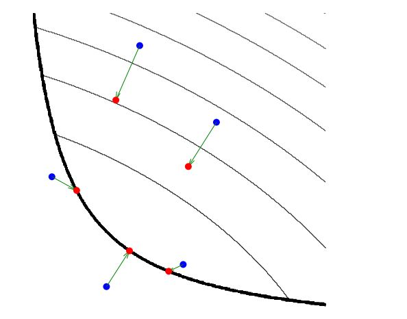
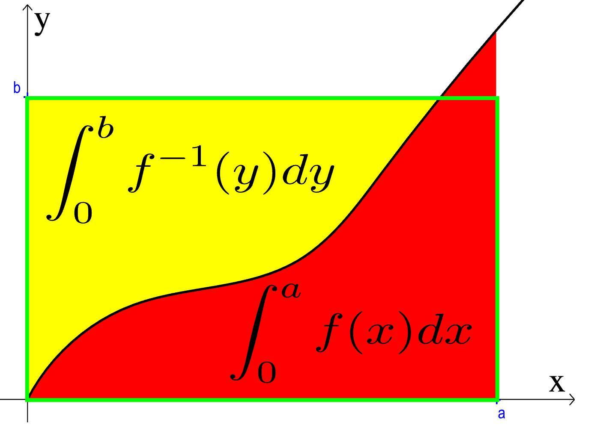
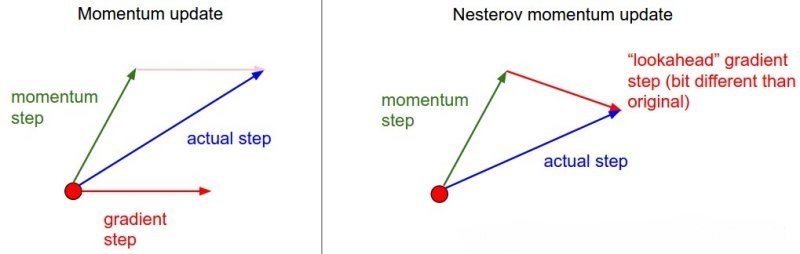

##  无约束问题

$$
\min {f(x)}, x \in R^n
$$

-   *local minimum point/solution* 局部解、局部极小点：若存在 $x^{ * } \in R^n, \epsilon > 0, \forall x \in R^n$ 使得 $\|x - x^{ * }\| < \epsilon$ 时，恒有 $f(x) \geq f(x^{ * })$，则称 $x^{ * }$ 为 $f(x)$ 的局部解
-   严格局部极小点/局部解：若 $f(x) > f(x^{ * })$，则称 $x^{ * }$ 为 $f(x)$ 严格局部极小点、局部解

### 最优性条件

-   *First-Order Necessary Condtion* 无约束问题局部解的一阶必要条件：设 $f(x)$ 有连续的一阶偏导，弱 $x^{ * }$ 是无约束问题的局部解，则
    $$ \triangledown f(x{ * }) = 0$$

-   *Second-Order Necessary Condition* 无约束问题局部解的二阶必要条件：设 $f(x)$ 有连续二阶偏导，若 $x^{ * }$ 是无约束问题的局部解，则
    -   $$\triangledown f(x^{ * }) = 0$$
    -   $$\triangledown^2 f(x^{ * })半正定$$

-   *Second-Order Sufficient Condition* 无约束问题局部解的二阶充分条件：设 $f(x)$ 有连续二阶偏导，若在 $x^{ * }$ 处满足以下，则 $x^{ * }$ 是无约束问题的 **严格局部解**
    -   $$\triangledown f(x^{ * }) = 0$$
    -   $$\triangledown^2 f(x^{ * })正定$$

##  约束问题

$$\begin{array}{l}
\min & f(x), x \in R^n \\
s.t. & c_i(x) = 0, i \in E = \{1,2,\cdots,l\}, \\
    & c_i(x) \leq 0, i \in I = \{l,l+1,\cdots,l+m\}
\end{array}$$

-   对于一般约束优化问题，记其可行域为
    $$ D = \{x| c_i(x) = 0, i \in E, c_i(x) \leq 0, i \in I\} $$

-   最优解、局部解：若 $\forall x^{*} \in D, \exists \epsilon$，使得当 $x \in D, \|x - x^{*}\| \leq \epsilon$ 时，总有
    $$ f(x) \geq f(x^{*}) $$
    则称 $x^{*}$ 为约束问题的局部解，简称为最优解

-   严格局部最优解：若 $x \in D, 0 < \|x - x^{*}\| \leq \epsilon$ 时，总有
    $$ f(x) > f(x^{*}) $$
    则称 $x^{*}$ 是约束问题的严格局部最优解

###  局部解一阶必要条件

#### 定理1

> - 设 $a_1,a_2,\cdots,a_m$ 和 $w \in R^n$，$C$ 定义如下
    $$ C = \{v |\sum_{i=1}^m \lambda_i a_i, \lambda_i \geq 0, i=1,2,\cdots,m \} $$
    若 $w \notin C$，则存在超平面 $d^T w = 0$，分离 $C$ 和 $w$，即
    $$\begin{align*}
    d^T w & \leq 0 \\
    d^T w & > 0
    \end{align*}$$

-   显然C是闭凸集，则$\exists d \in R^n, d \neq 0$，$\alpha \in R$，使得
    $$\begin{array}{l}
    d^T x \leq \alpha, &  \forall x \in C \\
    d^T w > \alpha &
    \end{array}$$

-   又 $C$ 是锥，有$0 \in C$，所以$\alpha \geq 0$，即$d^T w > 0$

-   若$\exists \bar x \in C, d^T \bar x > 0$，则 $\forall \lambda \geq 0, \lambda \bar x \in C$，则有
    $$ \lambda d^T \bar x \leq \alpha $$
    而 $\lambda \rightarrow \infty$，左端趋于无穷，矛盾

#### *Farkas* 引理

> - 设$a_1,a_2,\cdots,a_m$和$w \in R^n$，则以下两个系统有且仅有一个有解
> > -   系统I：存在 $d$ 满足
        $$\begin{align*}
        a_i^T d & \leq 0, & i=1,2,\cdots,m \\
        w^T d & > 0
        \end{align*}$$
> > -   系统II：存在非负常数 $\lambda_1,\cdots,\lambda_m$ 使得
        $$ w =\sum_{i=1}^m \lambda_i a_i $$

-   若系统II有解，则系统I无解
    -   若系统II有解，即存在 $\lambda_1,...,\lambda_m$ 且 $\lambda_i \geq 0,i=1,2,\cdot,m$，使得
        $$ w = \sum_{i=1}^m \lambda_i a_i $$
    -   若系统I有解，则有
        $$ 0 < w^T d = \sum_{i=1}^m \lambda_i a_i^T d \leq 0 $$
        矛盾，因此系统I无解

-   若系统II无解，则系统I有解
    -   系统II误解，构造闭凸锥
        $$ C = \{v |\sum_{i=1}^m \lambda_i a_i, \lambda_i \geq 0, i=1,2,\cdots,m \} $$
        显然 $w \notin C$
    -   由定理1，存在 $d$ 满足
        $$\begin{array}{l}
        d^T x \leq 0, & \forall x \in C, \\
        d^T w & > 0
        \end{array}$$

> - 此定理几何意义即，点要么在凸锥C内、边缘（系统II），要么在凸锥外（系统I）

####    推论1

> - 设 $a_1,a_2,\cdots,a_m$和$w \in R^n$，则以下系统有且仅有一个有解
> > -   系统I：存在 $d$ 满足
        $$\begin{array}{l}
        a_i^T d \leq 0, &  i=1,2,\cdots,m \\
        d_j \geq 0, &  j=1,2,\cdots,n \\
        w^T d > 0 &
        \end{array}$$
> > -   系统II：存在非负常数 $\lambda_1,...,\lambda_m$ 使得
        $$ w \leq \sum_{i=1}^m \lambda_i a_i $$

-   若系统II有解，则系统I无解
    -   若系统I有解，取d带入矛盾
-   若系统II无解，则系统I有解
    -   若系统I无解

####    推论2

> - 设 $a_1,a_2,\cdots,a_{l+m}$ 和 $w \in R^n$，则以下两个系统有且进一有一个存在解
> > -   存在d满足
        $$\begin{array}{l}
        a_i^T d = 0, & i=1,2,\cdots,l \\
        a_i^T d \leq 0, & i=l+1,l+2,\cdots,l+m \\
        w^T d > 0
        \end{array}$$
> > -   存在常数 $\lambda_1,\lambda_2,\cdots,\lambda_{l+m}$ 且 $\lambda_i \geq 0, i=l+1, l+2, \cdots, l+m$ 使得
        $$ w = \sum_{i+1}^{l+m} \lambda_i a_i $$

### 凸优化

$$\begin{array}{l}
\min_x & f(x) \\
s.t. & g_i(x) \leq 0, i=1，2,\cdots,k \\
& h_i(x) = 0, i=1,2,\cdots,l
\end{array}$$

> - $f(x), g(x)$：$R^n$ 上连续可微的凸函数
> - $h_i(x)$：$R^n$ 上仿射函数
> - 仿射函数：满足 $f(x)=ax+b, a \in R^n, b \in R, x \in R^n$

##  迭代求解

-   迭代算法：从当前迭代点向合适方向移动一定步长，然后检验目标值是否满足一定要求
    -   方向：常为使目标函数值下降方向
        -   负梯度方向（最速下降方向）
        -   *Newton* 方向：求方向的时候已确定步长，也可用做步长搜索
        -   拟 *Newton* 方向
    -   步长：常用一维搜索方法
        -   试探法
            -   *0.618* 法
            -   *Fibonacci* 方法（分数法）
            -   二分法
        -   插值法
            -   三点二次插值法
            -   二点二次插值法
            -   两点三次插值法
        -   非精确一维搜索方法
            -   *Glodstein* 方法
            -   *Armijo* 方法
            -   *Wolfe-Powell* 方法
    -   终止条件：实际计算中最优解可能永远无法迭代达到，应该采用较弱终止准则
        -   $\|\nabla f(x^{(k)})\| < \epsilon$
        -   $\|x^{(k+1)} - x^{(k)}\| < \epsilon$
        -   $|f(x^{(k+1)}) - f(x^{(k)})| < \epsilon$

### 算法通用框架

-   算法通用框架
    1.  取初始点 $x^{(1)}$，置精度要求 $\epsilon$，置 $k=1$
    2.
        -   若在点 $x^{(k)}$ 处满足某个终止准则，则停止计算得无约束优化问题最优解 $x^{(k)}$
        -   否则适当地选择 $x^{(k)}$ 处搜索方向
    3.  进行适当的一维搜索，求解一维问题
        $$ \arg\min_{\alpha} \phi(\alpha) = f(x^{(k)} + \alpha d^{(k)}) $$
    4.  置 $k=k+1$ ，转2

-   算法评价指标
    -   *Covergence* 收敛性
    -   *Sparsity* 稀疏性
    -   *Rate Of Convergence* 收敛速率

### 算法收敛性

-   收敛：序列 $\{x^{(k)}\}$ 或其一个子列（仍记 $\{x^{(k)}\}$）满足
    $$ \lim_{k \rightarrow \infty} x^{(k)} = x^{ * } $$
    -   $x^{ * }$ 为无约束问题局部解时，即为严格收敛要求
        -   但，往往只能证明 $\{x^{(k)}\}$ 任一聚点为稳定点
        -   或是更弱的
            $$ \lim_{k \rightarrow \infty} \inf \|\triangledown f(x^{(k)}) \| = 0 $$
    -   局部收敛
        -   局部收敛算法：只有初始点充分靠近极小点时，才能保证产生序列收敛
        -   全局收敛算法：对任意初始点，产生序列均能收敛

####    收敛速率

-   收敛速率：设序列 $\{x^{(k)}\}$ 收敛到 $x^{ * }$，若以下极限存在
    $$
    \lim_{k \rightarrow \infty} \frac {\|x^{(k+1)} - x^{*}\|} {\|x^{(k)} - x^{*}\|} = \beta
    $$
    -   $0 < \beta < 1$：线性收敛
    -   $\beta = 0$：超线性收敛
    -   $\beta = 1$：次线性收敛（收敛速率太慢，一般不考虑）

-   二次终止性：若某算法对任意正定二次函数，从任意初始点出发，都能经过有限步迭代达到其极小点，则称该算法有二次终止性
    -   二次终止性为算法的良好性质
        -   正定二次目标函数有某些好的性质，好的算法应该能在有限步内达到其极小点
        -   对于一般的目标函数，若其在极小点处的 *Hesse* 矩阵 $\triangledown f(x^{( * )})$，则由泰勒展开式得到
            $$\begin{align*}
            f(x) & = f(x^{*}) + \triangledown f(x^ {*})^T(x - x^{*}) \\
                & + \frac 1 2 (x - x^{*})^T \triangledown^2 f(x^{*})
                    (x - x^{*}) \\
                & + o(\|x - x^{*}\|^2)
            \end{align*}$$
            即目标函数 $f(x)$ 在极小点附近与一个正定二次函数近似，所以对正定二次函数好的算法，对一般目标函数也应该具有较好的性质

####    *Sparsity* 稀疏性

-   稀疏性：部分参数（权重）为 0
    -   稀疏性好处
        -   减少特征数量，进行特征选择
        -   降低开销，降低模型大小，减少推理计算量
        -   可解释性更好
    -   一般通过非光滑迭代获取稀疏性
        -   目标函数添加 $L_1$ 正则项
            -   数学运算结果也即按阈值截断，只是通过 $L_1$ 体现
        -   *Trunctated* 硬截断：在部分迭代轮次截断小于阈值参数置 0

-   $L_1$ 范数稀疏本质：极值、**不光滑**，即导数符号突然变化
    -   若某约束项导数符号突然变化、其余项在该点处导数为 0，为保证仍然取得极小值，解会聚集（极小）、疏远（极大）该点（类似坡的陡峭程度）
        -   即此类不光滑点会**抑制解的变化**，不光滑程度即导数变化幅度越大，抑制解变化能力越强，即吸引、排斥解能力越强
        -   容易构造压缩至任意点的约束项
        -   特殊的，不光滑点为 0 时，即得到稀疏解
    -   可以设置的多个极小不光滑点，使得解都在不连续集合中
        -   可以使用三角函数、锯齿函数等构造，但此类约束项要起效果，必然会使得目标函数非凸
            -   但是多变量场合，每个变量实际解只会在某个候选解附近，其邻域内仍然是凸的
            -   且锯齿函数这样的突变非凸可能和凸函数具有相当的优秀性质
        -   当这些点均为整数时，这似乎可以近似求解 **整数规划**
    -   说明
        -   $L_1$ 范数在参数满足一定条件下，总能对平方损失产生稀疏效果
        -   $e^{|x|}-1$、$ln(|x|+1)$ 等在 0 点泰勒展开同样得到 $L_1$ 项，故也能带来稀疏性，但计算复杂不常用

### 损失函数

-   *Singular Loss* 单点损失：模型在某个样本点上的损失
    -   单点损失度量模型 “一次” 预测的好坏
        -   代表模型在单点上的优劣，无法代表模型在总体上性质
    -   具有很强随机性
    -   单点损失一般用于在线学习场景，通过线上流式数据在线更新模型
-   全局损失：模型在全体样本点上损失
    -   度量模型在样本整体上的损失
    -   计算量大
-   *Batch Loss* 批损失：模型在某个 batch 上的损失
    -   模型在 batch 上的特征，对整体的代表性取决于 Batch 大小
        -   batch 越大对整体代表性越好、越稳定、易收敛
        -   batch 大小为 1 时，就是单点损失
        -   batch 大小为整个训练集时，就是经验（结构）风险
    -   *Batch Loss* 是学习算法中最常用的损失
        -   实际中往往是使用 *Batch Loss* 替代整体损失，表示经验风险极小化
        -   *Batch Loss* 同样可以带正则化项，表示结构风险极小化

### 参数部分更新

-   参数部分更新：每次更新一个或一组待估参数
    -   适合待估参数较少、同时估计较慢场合
        -   待估参数较多可能更新速度慢，往往需要多次迭代更新参数
        -   一般用在机器学习算法中比较多
    -   可能具有的特点
        -   适合样本量较大场合
        -   良好的并行特性：能够同时更新多个参数
            -   *Alternating Direction Method of Multipliers*
        -   采用贪心策略的算法：可能无法得到最优解
            -   前向回归
            -   深度学习：网络层次太深，有些算法采用*固化*部分网络结构，估计剩余部分
        -   能够平衡全局、局部：得到较好的解
            -   LARS

-   参数解析更新：若损失函数有解析解、样本量不大，可一步更新（计算） 完成
    -   传统参数估计场合
        -   矩估计
        -   最小二乘估计
        -   极大似然估计

### *Online Optimization*

-   在线学习：通过线上流式的数据在线更新模型，实时调整提高线上预测准确率
    -   相比普通学习的特点（需求）
        -   每次处理少数样本、一个样本
        -   处理过的样本被丢弃，不会重复参与后续训练
    -   在线学习的核心
        -   降低后悔度 *Regret*
        -   提高稀疏性 *Sparsity*
    -   一般，从梯度下降算法、近端算法等出发，针对线上流式场景改进迭代逻辑

-   *Regret* 后悔度：在线学习各轮次损失和与离线全量学习各轮次损失和之差
    $$ regret = \sum_{t=1}^T l^{(t)}(w^{(t)}) - \min_w \sum_{t=1}^T l^{(t)}(w) $$

##  梯度下降法

-   梯度下降法思想：以目标函数值下降最快方向，即梯度反方向，作为搜索方向 $d^{(k)}$
    -   设目标函数 $f(x)$ 连续可微，在 $x^{(k)}$ 泰勒展开
        $$ f(x) = f(x^{(k)}) + \nabla f(x^{(k)})(x - x^{(k)}) + o(\|x - x^{(t)}\}) $$
    -   考虑 $x^{(k+1)} = x^{(k)} + \gamma^{(t)} d^{(t)}$，带入并舍去无穷小项
        $$\begin{align*}
        f(x^{(k+1)}) &= f(x^{(t)}) + \gamma^{(t)} \nabla f(x^{(k)})^T d^{(t)} \\
        \frac {\delta f} {\delta \gamma} &= \nabla f(x^{(k)})^T d^{(t)} \\
        \end{align*}$$
    -   考虑到 $d^{(t)}$ 应为下降方向，并应用柯西不等式
        $$\begin{align*}
        -\frac {\delta f} {\delta \gamma} &= -\nabla f(x^{(k)})^T d^{(t)} \\
            &\leq \|\nabla f(x^{(k)})\| \|d^{(t)}\|
        \end{align*}$$
        最大值在 $d^{(t)}$ 与 $\nabla f(x^{(k)})$ 共线时取到，即梯度反方向

> - 梯度下降、线搜：<https://zhuanlan.zhihu.com/p/271088190>

### 最速下降算法

-   最速下降：选择合适步长 $\gamma$ 使得目标函数值最大程度减少
    -   精确线性搜索：寻找 $\arg \min_{\gamma} f(x^{(t)} + \gamma d^{(t)})$
    -   非精确搜索：保证目标函数值下降的情况下，仅仅求解 $\gamma$ 最优解近似值

-   最速下降算法
    1.  取初始点 $x^{(1)}$，置 $k=1$
    2.  -   若 $\nabla f(x^{(k)})=0$，则停止计算，得到最优解，
        -   否则置 $d^{(k)} = -\nabla f(x^{(k)})$，以负梯度作为前进方向
    3.  一维搜索，求解一维问题
        $$ \arg\min_{\gamma} f(x^{(k)} + \gamma d^{(k)}) $$
        得 $\gamma_k$ 前进步长，置
        $$ x^{(k+1)} = x^{(k)} + \gamma_k d^{(k)} $$
    4.  置 $k=k+1$，转 2

-   算法特点
    -   最速下降一阶收敛，不具有二次终止性
    -   精确线搜确定步长效率低，可考虑使用非线性搜索提高效率
    -   算法受初值、*Hessian* 矩阵（目标函数二阶近似）条件数影响

> - 条件数：矩阵最大绝对值特征值、最小绝对值特征值之比，刻画矩阵对向量变换能力
> - 矩阵条件数：<https://zhuanlan.zhihu.com/p/91393594>

### 次梯度法最优化

$$\begin{align*}
x^{(k+1)} & = x^{(k)} + \alpha_k g^{(k)} \\
f_{best}^{(k+1)} & = \min \{ f_{best}^{(k)}, f(x^{(k+1)}) \}
\end{align*}$$
> - $g^{(k)}$：函数$f$在$x^{(k)}$处次梯度

-   次梯度法最优化：求解凸函数最优化的问题的一种迭代方法
    -   特点
        -   相较于较内点法、牛顿法慢
        -   应用范围更广泛：能够用于不可微目标函数，目标函数可微时，无约束问题次梯度与梯度下降法有同样搜索方向
        -   空间复杂度更小
        -   可以和分解技术结合，得到简单分配算法
        -   通常不会产生稀疏解
    -   次梯度法选取步长方法很多，以下为保证收敛步长规则
        -   恒定步长：$\alpha_k = \alpha$
        -   恒定间隔：$\alpha_k = \gamma / \|g^{(k)}\|_2$
        -   步长平方可加、步长不可加：$\sum_{k=1}^{\infty} \alpha_k^2 < \infty, \sum_{k=1}^{\infty} \alpha_k = \infty$
        -   步长不可加、但递减：$lim_{k \rightarrow \infty} \alpha_k = 0$
        -   间隔不可加、但递减：$lim_{k \rightarrow \gamma_k} \gamma_k = 0$

##  *Newton* 法

-   牛顿法思想
    -   若 $x^{*}$ 是无约束问题局部解，则有
        $$ \nabla f(x^{*}) = 0 $$
        可求解此问题，得到无约束问题最优解
    -   原始问题是非线性，考虑求解其线性逼近，在初始点 $x^{(1)}$ 处泰勒展开
        $$ \nabla f(x) \approx \nabla f(x^{(1)}) + \nabla^2 f(x^{(1)})(x - x^{(1)}) $$
        解得
        $$ x^{(2)} = x^{(1)} - (\nabla^2 f(x^{(1)}))^{-1} \nabla f(x^{(1)}) $$
        作为 $x^{*}$ 的第二次近似
    -   不断迭代，得到如下序列
        $$ x^{(k+1)} = x^{(k)} + d^{(k)} $$
        > - $d^{(k)}$：*Newton* 方向，即以下方程解
            $$ \nabla^2 f(x^{(k)}) d = -\nabla f(x^{(k)}) $$

-   说明：类似最速下降法，牛顿法也基于当前迭代点的梯度信息选择搜索方向（牛顿方向）
    -   但牛顿法利用 *Hessian* 矩阵对梯度进行线性变换得到搜索方向，对迭代点处信息利用更充分，收敛更快
        -   梯度下降法只保留泰勒展开一阶项，即使用线性函数近似原函数
        -   牛顿法同时保留二阶项，即使用二次函数近似原函数
    -   将所有基于梯度的迭代方程写作
        $$ x^{(k+1)} = x^{(k)} + H(x^{(t)})\nabla f(x^{(t)}) $$
        -   牛顿法中：$H(x^{(t)}) = \nabla^2 f(x^{(t)})^{-1}$
        -   梯度下降法中：$H(x^{(t)}) = \gamma I$
        -   即，牛顿方向即为 $H(x)$ 椭圆范数下的最速下降方向
        -   故，牛顿法也被成为 “自适应梯度下降法”
    -   特别的，对正定二次型，牛顿法总可一步迭代得到最优解，而最速下降法依赖初值
    -   最速下降可视为求解一次函数，无极值，需要额外求解步长，而牛顿法视为求解二次函数，有极值，无需额外求解步长

> - 向量的 *A-范数*、椭圆范数：$\|x\| = \sqrt{(x, x)_A} = \sqrt{x^TAx}$，其中 $A$ 为正定矩阵
> - 牛顿法：<https://zhuanlan.zhihu.com/p/293951317>

###  *Newton* 法算法

-   *Newton* 法算法
    1.  初始点 $x^{(1)}$、精度要求 $\epsilon$，置 $k=1$
    2.  考虑 $\|\nabla f(x^{(k)})\| \leq \epsilon$
        -   若满足，则停止计算，得到最优解 $x^{(k)}$
        -   否则求解如下方程，得到 $d^{(k)}$
            $$ \nabla^2 f(x^{(k)}) d = -\nabla f(x^{(k)}) $$
    3.  如下设置，并转 2
        $$ x^{(k+1)} = x^{(k)} + d^{(k)}, k = k+1 $$

-   牛顿法特点
    -   优点
        -   在最优点附近二次收敛，一般情形下收敛也较快
        -   具有仿射不变性，对可逆仿射变换，牛顿法保持不变
        -   收敛速度与问题维度无关
        -   无需通过线性搜索确定步长
    -   缺点
        -   *Hessian* 矩阵计算、存取成本高
        -   *Hessian* 矩阵不一定可逆
        -   只有迭代点处 *Hessian* 矩阵正定才能保证搜索方向下降

###  阻尼 *Newton* 法

-   阻尼 *Newton* 法：在搜索方向上增加线性搜索，确保目标值下降
    1.  初始点 $x^{(1)}$、精度要求 $\epsilon$，置 $k=1$
    2.  考虑 $\|\nabla f(x^{(k)})\| \leq \epsilon$
        -   若满足，停止计算，得到最优解 $x^{(k)}$
        -   否则求解如下方程得到 $d^{(k)}$
            $$ \nabla^2 f(x^{(k)}) d = -\nabla f(x^{(k)}) $$
    3.  一维搜索，求解一维问题
        $$ \arg\min_{\alpha} \phi(\alpha) = f(x^{(k)} + \alpha d^{(k)}) $$
        得到 $\alpha_k$，如下设置并转 2
        $$ x^{(k+1)} = x^{(k)} + \alpha_k d^{(k)}, k = k+1 $$

-   算法特点
    -   克服 *Newton* 法目标函数值上升的缺点
    -   一定程度上克服点列可能不收敛缺点

### 修正牛顿法

-   *Goldstein-Price* 修正：牛顿方向不可行时使用负梯度方向
    -   设 $\theta_k$ 是 $<d^{(k)}, -\nabla f(x^{(k)})>$ 之间夹角，显然希望 $\theta < \frac \pi 2$
    -   则置限制条件 $\eta$，取迭代方向
        $$
        d^{(k)} = \left \{ \begin{array}{l}
            d^{(k)}, & cos\theta_k \geq \eta \\
            -\nabla f(x^{(k)}), & otherwise
        \end{array} \right.
        $$

-   *Goldfeld* 修正：*Hessian* 矩阵非正定时，使用单位矩阵修正 
    -   即，取迭代方向 $d^{(k)}$ 为以下方程的解
        $$ (\nabla^2 f(x^{(k)}) + v_k I) d = -\nabla f(x^{k}) $$
        > - $v_k$：大于 $\nabla^2 f(x^{(k)})$ 最大负特征值绝对值
    -   本质上与信赖域算法相关

-   *Gill-Murray* 修正：在 *Goldfeld* 修正基础上，通过 *Cholesky* 分解确定单位矩阵系数

-   说明
    -   经典牛顿法不够稳定，实际中更常使用修正牛顿法
    -   *Hessian* 矩阵非正定时，也一定存在负特征值、相应特征向量 $u$
        -   取负曲率下降方向作为迭代方向
            $$ d^{(k)} = -sign(u^T \nabla f(x^{(k)})) u $$
        -   $x^{(k)}$ 处负曲率方向 $d^{(k)}$ 满足
            $$ {d^{(k)}}^T \nabla^2 f(x^{(k)}) d^{(k)} < 0 $$

> - 最优化方法：<http://www.cad.zju.edu.cn/home/zhx/csmath/lib/exe/fetch.php?media=2014:csmath-07-nonlinear.pdf>
> - 修正牛顿法：<https://www.cnblogs.com/Lebesgue/p/12129760.html>

##  信赖域算法

$$\begin{align*}
f(x^{(t)}+d) &= f(x^{(t)}) + \nabla f(x^{(t)})^T d + \frac 1 2 \nabla^2 f(x^{(t)} + \lambda d) d \\
m^{(t)}(d) &= f(x^{(t)}) + \nabla f(x^{(t)})^T d + \frac 1 2 d^T B^{(t)} d \\
\Omega_{(t)} &= \{ x^{(t)} + d | \|d\| \leq \Delta^{(t)} \}
\end{align*}$$
> - $\lambda \in (0, 1)$：拉格朗日余项系数
> - $B^{(t)}$：近似 *Hessian* 矩阵的对称矩阵 
> - $\Omega^{(t)}$：信赖域，确保泰勒展开可近似目标函数的局部
> - $\Delta^{(t)} > 0$：信赖域半径，与迭代有关的的参数

-   信赖域算法：考虑泰勒展开为局部性质，在信赖域内部二阶展开近似目标函数
    -   信赖域算法每步即求解如下子问题
        $$\begin{array}{l}
        \min_{d} & m^{(t)}(d) \\
        s.t. & \|d\| \leq \Delta^{(t)}
        \end{array}{l}$$
    -   $\Delta^{(t)}$ 信赖半径的选择是决定算法收敛性的关键
        -   信赖域半径度量表示对子问题 $\min_{d} m^{(t)}(d)$ 的相信程度
            -   即，子问题近似原问题越好，信赖域半径应越大
        -   可目标函数实际实际下降量与预估下降量比值度量近似程度
            $$
            \rho^{(t)} = \frac {f(x^{(t)}) - f(x^{(t)} + d^{(t)})} {m^{(t)}(0) - m^{(t)}(d^{(t)})}
            $$
            -   可，根据下降率动态调整信赖域半径

### 信赖域算法框架

1.  初值
    -   最大半径：$\Delta_{max}$
    -   初始半径：$\Delta_0$
    -   初始点：$x^{(0)}$
2.  超参
    -   $0 \leq \eta < \bar {\rho_1} < \bar {\rho_2} < 1$
        -   $\rho_1$、$\rho_2$ 取值不敏感，可取 0.25、0.75
    -   $\gamma_1 < 1 < \gamma_2$
        -   $\gamma_1$、$\gamma_2$ 可取 0.25、2
3.  求解信赖域子问题 $\min_d m^{(t)}(d)$ 得迭代方向 $d^{(t)}$
4.  计算下降率 $\rho^{(t)}$，并更新信赖域半径
    $$\Delta^{(t+1)} = \left \{ \begin{array}{l}
        \gamma_1 \Delta^{(t)}, & \rho^{(t)} < \bar {\rho_1} \\
        \min \{ \gamma_2 \Delta^{(t)}, \Delta_{max} \}, & \rho^{(t)} < \bar {\rho_2}, \|d^{(t)}\|_2 = \Delta^{(t)} \\
        \gamma_2 \Delta^{(t)}, & otherwise
    \end{array} \right.$$
5.  更新位置（仅下降率最够大才更新），直至收敛
    $$x^{(t+1)} = \left \{ \begin{array}{l}
        x^{(t+1)} + d^{(t+1)}, & \rho^{(t)} > \eta \\
        x^{(t)}, & otherwise
    \end{array} \right.$$

### 信赖域算法理论

-   定理：$d^{*}$ 是信赖域子问题
    $$\begin{array}{l}
    \min_d & m(d) = f + g^T d + \frac 1 2 d^T B d \\
    s.t. & \|d\| \leq \Delta
    \end{array}$$
    的全局极小解，当且仅当 $d^{*}$ 可行，且存在 $\lambda \geq 0$ 使得
    $$\begin{align*}
    (B + \lambda I) d^{*} &= -g, \\
    \lambda (\Delta - \|d^{*}\|) &= 0, \\
    (B + \lambda I) &\geq 0 \\
    \end{align*}$$

##  *Non-Linear Least Squares*

$$\begin{align*}
f(x) & = \frac 1 2 \sum_{i=1}^m r^2_i(x) \\
& = \frac 1 2 r(x) r^T(x)
\end{align*}$$
> - $r_i(x)$：通常为非线性函数
> - $r(x) = (r_1(x), \cdots, r_m(x))^T$
> - $x \in R^n, m \geq n$

-   考虑目标函数梯度、*Hesse* 矩阵

    $$\begin{align*}
    \nabla f(x) & = \sum_{i=1}^m \nabla r_i(x)
        r_i(x) \\
    & = J(x)^T r(x) \\

    \nabla^2 f(x) & = \sum_{i=1}^m \nabla r_i(x)
        r_i(x) + \sum_{i=1}^m r_i \nabla^2 r_i(x) \\
    & = J(x)^T J(x) + \sum_{i=1}^m r_i(x) \nabla^2 r_i(x)
    \end{align*}$$

> - $J(x)$ 为 $r(x)$ *Jacoci* 矩阵
    $$
    J(x) = \begin{bmatrix}
    \frac {\partial r_1} {\partial x_1} &
        \frac {\partial r_1} {\partial x_2} & \cdots &
        \frac {\partial r_1} {\partial x_n} \\
    \frac {\partial r_2} {\partial x_1} &
        \frac {\partial r_2} {\partial x_2} & \cdots &
        \frac {\partial r_2} {\partial x_n} \\
    \vdots & \vdots & \ddots & \vdots \\
    \frac {\partial r_m} {\partial x_1} &
        \frac {\partial r_m} {\partial x_2} & \cdots &
        \frac {\partial r_m} {\partial x_n}
    \end{bmatrix}
    = \begin{bmatrix}
    \nabla r_1(x)^T \\
    \nabla r_2(x)^T \\
    \vdots \\
    \nabla r_m(x)^T \\
    \end{bmatrix}
    $$

### *Gauss-Newton* 法

-   *Gauss-Newton* 法：非线性最小二乘中，略去 *Newton* 法中 *Hesse* 矩阵中 $\sum_{i=1}^m r_i(x) \nabla^2 r_i(x)$ 项做近似替代
    -   即，直接求解方程组
        $$ J(x^{(t)})^T J(x^{(t)}) d = -J(x^{(t)})^T r(x^{(t)}) $$
    -   事实上，上述方程时如下如下线性最小二乘问题的最优性条件
        $$ \min_d \frac 1 2 \|J^{(t)} d + r^{(t)}\|_2^2 $$
        -   求解时，只需对 $J^{(t)}$ 做 *QR* 分解，无需计算 $(J^{(t)})^T J^{(t)}$

-   算法特点
    -   实际问题中
        -   局部解 $x^{ * }$ 对应的目标函数值 $f(x^{ * })$ 接近 0 时，采用 *Gauss-Newton* 法效果较好，此时
            -   $\|r(x^{(t)})\|$ 较小
            -   曲线 $r_i(x)$ 接近直线
            -   $\nabla^2 r_i(x) \approx 0$
        -   否则，效果一般
    -   矩阵 $J(x^{(t)})^T J(x^{(t)})$ 是半正定矩阵
        -   故，下降方向 $d^{(t)}$ 总是下降方向
        -   当 *Jacobi* 矩阵列满秩时为正定矩阵，此时虽然 $d^{(t)}$ 是下降方向
        -   但，仍需类似阻尼牛顿法增加一维搜索策略保证目标函数值不上升

> - *Gauss-Newton Algorithm*：<https://en.wikipedia.org/wiki/Gauss%E2%80%93Newton_algorithm>

### *Levenberg-Marquardt* 方法

-   *Levenberg-Marquardt* 方法
    -   在 *Gauss-Newton* 法中 $(J^{(t)})^T J^{(t)}$ 奇异时，依然可以给出下降方向
    -   对非线性最小二乘问题，即 $J(x^{(t)})$ 中各列线性相关、接近线性相关，以改为求解
        $$ (J(x^{(t)})^T J(x^{(t)}) + vI) d = -J(x^{(t)})^T r(x^{(t)}) $$
        > - $v$：迭代过程中需要调整的参数，*LM* 方法的关键即如何调整

####    定理1

> - 若 $d(v)$ 是以上方程组的解，则 $\|d(v)\|^2$ 是 $v$ 的连续下降函数，且 $v \rightarrow +\infty, \|d(v)\| \rightarrow 0$

-   说明
    -   $J(x^{(t)})^T J(x^{(t)})$ 是对称半正定矩阵，则存在正交阵
        $$ (P^{(t)})^T J(x^{(t)})^T J(x^{(t)}) P^{(t)} = \Lambda^{(t)} $$
    -   则可以解出 $\|d(v)\|^2$
        -   增大 $v$ 可以限制 $\|d^{(t)}\|$，所以 *LM* 方法也被称为阻尼最小二乘法

####    定理2

> - 若 $d(v)$ 是以上方程的解，则 $d(v)$ 是 $f(x)$ 在 $x^{(t)}$ 处的下降方向，且 $v \rightarrow + \infty$ 时，$d(v)$ 的方向与 $-J(x^{(t)})^T r(x^{(t)})$ 方向一致

-   下降方向：$\nabla f(x^{(t)}) d(v) < 0$ 即可
    -   方向一致：夹角余弦
    -   $v$ 充分大时，*LM* 方法产生的搜索方向 $d^{(t)}$ 和负梯度方向一致

####    参数调整方法

> - 使用梯度、近似 *Hesse* 矩阵定义二次函数
    $$ q(d) = f(x^{(t)}) + (J(x^{(t)})^T r(x^{(t)}))^T d + \frac 1 2 d^T (J(x^{(t)})^T J(x^{(t)})) d $$

-   其增量为
    $$\begin{align*}
    \Delta q^{(t)} & = q(d^{(t)}) - q(0) \\
    & = (J(x^{(t)})^T r(x^{(t)}))^T d^{(t)} + \frac 1 2
        (d^{(t)})^T (J(x^{(t)})^T J(x^{(t)})) d^{(t)}
    \end{align*}$$

-   目标函数增量
    $$\begin{align*}
    \Delta f^{(t)} & = f(x^{(t)} + d^{(t)}) - f(x^{(t)}) \\
    & = f(x^{(t+1)}) - f(x^{(t)})
    \end{align*}$$

-   定义 $\gamma_t = \frac {\Delta f^{(t)}} {\Delta q^{(t)}}$
    -   $\gamma_t$ 接近 1 说明 $\Delta f^{(t)}$接近$\Delta q^{(t)}$
        -   即 $f(x^{(t)} + d^{(t+1)})$ 接近 $q(d^{(t)})$
        -   即 $f(x)$ 在 $x^{(t)}$ 附近接近二次函数
        -   即使用 *Gauss-Newton* 方法求解最小二乘问题效果较好
        -   即 *LM* 方法求解时 $v$ 参数应该较小
    -   $\gamma_t$ 接近 0 说明 $\Delta f^{(t)}$ 与 $\Delta q^{(t)}$ 近似程度不好
        -   $d^{(t)}$ 不应取得过大，应减少 $d^{(t)}$ 模长
        -   应该增加参数 $v$ 进行限制
        -   迭代方向趋近于负梯度方向
    -   $\gamma_t$ 适中时，认为参数 $v$ 选取合适，不做调整
        -   临界值通常为 0.25、0.75

####    求解算法

1.  初始点 $x^{(1)}$、初始参数 $v$（小值）、精度要求 $\epsilon$，置 $t=t+1$

2.  若 $\|J(x^{(t)})^T r(x^{(t)})\| < \epsilon$，则停止计算，得到问题解 $x^{(t)}$，否则求解线性方程组

    $$
    (J(x^{(t)})^T J(x^{(t)}) + v^{(t)}I) d = -J(x^{(t)})^T
        r(x^{(t)})
    $$

    得到 $d^{(t)}$

3.  置 $x^{(t+1)} = x^{(t)} + d^{(t)}$，计算 $\gamma_t$

4.  考虑 $\gamma$
    -   若 $\gamma < 0.25$，置$v^{(t+1)} = 4 v^{(t)}$
    -   若 $\gamma > 0.75$，置$v^{(t+1)} = v^{(t)} / 2$
    -   否则置$v_{t+1} = v^{(t)}$

5.  置 $t=t+1$ ，转 2

##  *Quasi-Newton* 法

-   拟 *Newton* 法、变度量法：在迭代过程使用梯度信息构造近似 *Hessian* （逆）矩阵，避免直接求解 *Hessian* 矩阵
    -   迭代过程中，创建近似矩阵 $B^{(k)}$ 代替 *Hessian* 矩阵，即以以下方程解 $d^{(k)}$ 作为搜索方向
        $$ B^{(k)} d = - \nabla f(x^{(k)}) $$
    -   考虑到牛顿法中实际上仅需 *Hessian* 矩阵的逆矩阵，也可以直接近似 $H^{(k)} = {B^{(k)}}^{-1}$

-   拟牛顿法核心即寻找 $B^{(k)}, H^{(k)}$ 及其更新方式
    -   考虑 $\nabla f(x)$ 在 $x^{(k+1)}$ 处泰勒展开
        $$ \nabla f(x) \approx \nabla f(x^{(k+1)}) + \nabla^2 f(x^{(k+1)})(x - x^{(k+1)}) $$
    -   取 $x = x^{(k+1)}$，有
        $$\begin{align*}
        \nabla f(x^{(k+1)}) - \nabla f(x^{(k)})
            & \approx \nabla^2 f(x^{(x+1)})
            (x^{(k+1) } - x^{(k)}) \\
        \nabla^2 f(x^{(k+1)}) s^{(k)} & \approx y^{(k)}
        \end{align*}$$
        > - $s^{(k)} = x^{(k+1)} - x^{(k)}$
        > - $y^{(k)} = \nabla f(x^{(k+1)}) - \nabla f(x^{(k)})$
    -   要求 $B^{(k)}$ 近似 $\nabla^2 f(x^{(k)})$，带入并将 $\approx$ 改为 $=$
        -   得到关于 $B^{(k+1)}$ 的拟 *Newton* 方程
            $$ B^{(k+1)} s^{(k)} = y^{(k)} $$
        -   相应的，$H^{(k+1)}$ 的拟 *Newton* 方程为
            $$ H^{(k+1)} y^{(k)} = s^{(k)} $$
    -   拟 *Newton* 方程不能唯一确定 $B^{(k+1)}$，需要附加 **假设条件**（即对应不同算法）
        -   $B^{(k)}$ 近似于 $\nabla^2 f(x^{(k)})$，也对称
        -   $B^{(k+1)}$ 可由 $B^{(k)}$ 修正得到，即
            $$ B^{(k+1)} = B^{(k)} + \Delta B^{(k)} $$
            且修正项 $\Delta B^{(k)}$ 具有 “简单形式”（低秩）

-   拟牛顿法即方向即为 $\|\dot\|_{H_k}$ 椭圆范数下最速下降方向
    -   每次迭代时 $H_k$ 改变，即度量范数改变，故拟牛顿法也被称为变度量法

> - 拟牛顿法：<https://zhuanlan.zhihu.com/p/306635632>

### *Symmetric Rank One*

-   *SR1* 算法：对称、秩 1 修正 *Hessian* 逆矩阵 $\nabla H$
    -   $\Delta H^{(k)}$ 为秩 1 的对称矩阵，**可设** $\Delta H^{(k)} = \alpha uu^T$，带入拟牛顿方程有
        $$\begin{align*}
        s^{(k)} & = H^{(k+1)} y^{(k)} \\
            & = H^{(k)} y^{(k)} + (\alpha u^T y^{(k)}) u \\
        s^{(k)} - H^{(k)} y^{(k)} & = (\alpha u^T u) y^{(k)} \\
        s^{(k)} - H^{(k)} y^{(k)} & = (\alpha u^T y^{(k)}) u
        \end{align*}$$
    -   则 $u = \frac 1 {\alpha u^T y^{(k)}} (s^{(k)} - H^{(k)} y^{(k)})$，有
        $$\begin{align*}
        uu^T &= \frac 1 {\alpha^2 u^T y^{(k)} u^T y^{(k)}}
                (s^{(k)} - H^{(k)} y^{(k)}) (s^{(k)} - H^{(k)} y^{(k)})^T \\
            & = \frac {(s^{(k)} - H^{(k)} y^{(k)}) (s^{(k)} - H^{(k)} y^{(k)})^T}
                {\alpha (s^{(k)} - H^{(k)} y^{(k)})^T y^{(k)}}
        \end{align*}$$
    -   则得到修正
        $$\Delta H = \frac {(s^{(k)} - H^{(k)} y^{(k)}) (s^{(k)} - H^{(k)} y^{(k)})^T}
                {(s^{(k)} - H^{(k)} y^{(k)})^T y^{(k)}}$$

-   算法说明
    -   *SR1* 算法能近似 $\nabla^2 f(x^{(k)})^{-1}$，但是保证 $H^{(k)}$ 正定，即得到的拟牛顿方向不一定下降
    -   算法初值 $H^{(0)}$ 一般可设为单位矩阵

### *DFP* 算法

-   *DFP* 算法：对称、秩 2 修正 *Hessian* 逆矩阵 $\nabla H$
    -   $\Delta H^{(k)}$ 为秩 2 的对称矩阵，**可设** $\Delta H^{(k)} = \alpha uu^T \beta vv^T$，带入拟牛顿方程可得
        $$\begin{align*}
        s^{(k)} & = H^{(k+1)} y^{(k)} \\
            & = H^{(k)} y^{(k)} + (\alpha u^T y^{(k)}) u + (\beta v^T y^{(k)}) v \\
        s^{(k)} - H^{(k)} y^{(k)} & = (\alpha u^T u) y^{(k)} + (\beta v^T v) y^{(k)} \\
        s^{(k)} - H^{(k)} y^{(k)} & = (\alpha u^T y^{(k)}) u + (\beta v^T y^{(k)}) v \\
        \end{align*}$$
    -   *DFP* 相较于 *SR1* 自由度更高，$\alpha, \beta, u, v$ 取值无法唯一确定
        -   为方便，取 $u = s^{(k)}, v = H^{(k)}y^{(k)}$
        -   同样为方便，另 $\alpha uu^Ty^{(k)} = s^{(k)}, \beta vv^T y^{(k)} = -H^{(k)}y^{(k)}$
    -   得到修正
        $$\begin{align*}
        \Delta H^{(k)} &= \frac {s^{(k)} (s^{(k)})^T} {(s^{(k)})^T y^{(k)}}
            - \frac {H^{(k)} y^{(k)} (y^{(k)})^T H^{(k)}} {(y^{(k)})^T H^{(k)} y^{(k)}} \\
        H^{(k+1)} &= H^{(k)} + \frac {s^{(k)} (s^{(k)})^T} {(s^{(k)})^T y^{(k)}}
            - \frac {H^{(k)} y^{(k)} (y^{(k)})^T H^{(k)}} {(y^{(k)})^T H^{(k)} y^{(k)}}
        \end{align*}$$
    -   另外，运用 *Shermann-Morrison* 公式对上述 $H^{(k+1)}$ 递归运用 2 次得到
        $$\begin{align*}
        B^{(k+1)} &= (H^{(k+1)})^{-1} \\
            &= (I - \frac {y^{(k)} (s^{(k)})^T} {(s^{(k)})^T y^{(k)}}) H^{(k)}
                (I - \frac {y^{(k)} (s^{(k)})^T} {(s^{(k)})^T y^{(k)}})^T
                + \frac {y^{(k)} (y^{(k)})^T} {(s^{(k)})^T y^{(k)}} \\
        \end{align*}$$

### *BFGS* 算法

-   *BFGS* 算法：对称、秩 2 修正 *Hessian* 矩阵 $\nabla B$
    -   类似 *DFP* 算法得到修正
        $$\begin{align*}
        \Delta B^{(k)} & = \frac {y^{(k)} (y^{(k)})^T} {(y^{(k)})^T s^{(k)}}
            - \frac {B^{(k)} s^{(k)} (s^{(k)})^T B^{(k)}} {(s^{(k)})^T B^{(k)} s^{(k)}} \\
        B^{(k+1)} & = B^{(k)} + \frac {y^{(k)} (y^{(k)})^T} {(y^{(k)})^T s^{(k)}}
            - \frac {B^{(k)} s^{(k)} (s^{(k)})^T B^{(k)}} {(s^{(k)})^T B^{(k)} s^{(k)}}
        \end{align*}$$
    -   运用 *Shermann-Morrison* 公式对上述 $B^{(k+1)}$ 递归运用 2 次得到
        $$\begin{align*}
        H^{(k+1)} &= (B^{(k+1)})^{-1} \\
        &= (I - \frac {s^{(k)} (y^{(k)})^T} {(y^{(k)})^T s^{(k)}}) H^{(k)}
            (I - \frac {s^{(k)} (y^{(k)})^T} {(y^{(k)})^T s^{(k)}})^T
            + \frac {s^{(k)} (s^{(k)})^T} {(y^{(k)})^T s^{(k)}} \\
        &= H^{(k)} + (\frac 1 {(s^{(k)})^T y^{(k)}}
            + \frac {(y^{(k)})^T H^{(k)} y^{(k)}}
            {((s^{(k)})^T y^{(k)})^2}) s^{(k)} (s^{(k)})^T
            - \frac 1 {(s^{(k)})^T y^{(k)}}
            (H^{(k)} y^{(k)} (s^{(k)})^T + s^{(k)} (y^{(k)})^T H^{(k)})
        \end{align*}$$

> - *BFGS*、*DFP* 算法中，$B^{(k+1)}, H^{(k+1)}$ 迭代式高度对称，两种算法互为对偶

### *Broyden* 族

-   *Broyden* 族：*DFP*、*BFGS* 迭代式正加权组合集合
    $$\begin{align*}
    B^{(k+1), \phi} &= \phi^{(k)} B^{(k+1), DFP} + (1 - \phi^{(k)}) B^{(k+1), BFGS}, \phi_{(k)} \in [0, 1] \\
    &= B^{(k)} + \frac {y^{(k)} (y^{(k)})^T} {(y^{(k)})^T s^{(k)}}
        - \frac {B^{(k)} s^{(k)} (s^{(k)})^T B^{(k)}} {(s^{(k)})^T B^{(k)} s^{(k)}}
        + \phi_{(k)}((s^{(k)})^T B^{(k)} s^{(k)}) w^{(k)} (w^{(k)})^T \\
    w_k &= \frac {y^{(k)}} {(y^{(k)})^T s^{(k)}} - \frac {B^{(k)} s^{(k)}} {(s^{(k)})^T B^{(k)} s^{(k)}}
    \end{align*}$$

###  拟牛顿法的基本性质

#### 算法的下降性

> - 设 $B^{(k)}$（$H^{(k)}$）是正定对称矩阵，且有 $(s^{(k)})^T y^{(k)} > 0$，则由 *BFGS*（*DFS*） 公式构造的 $B^{(k+1)}$（$H^{(k+1)}$）是正定对称的

-   证明思路
    -   考虑 $B^{(k)}$ 对称正定，有 $B^{(k)} = (B^{(k)})^{1/2} (B^{(k)})^{1/2}$
    -   带入利用（广义）柯西不等式即可证

> - 若 $d^{(k)}$ 是下降方向，且一维搜索是精确的，设 $B^{(k)}$（$H^{(k)}$）是正定对称矩阵，则 *BFGS*（*DFP*）公式构造的 $B^{(k+1)}$（$H^{(k+1)}$）是正定对称的

-   证明思路
    -   精确一维搜索 $(d^{(k)})^T \nabla f(x^{(k+1)}) = 0$
    -   则有 $(s^{(k)})^T y^{(k)} > 0$

> - 定理3：若用 *BFGS*（*DFP*）求解无约束问题，设初始矩阵 $B^{(1)}$（$H^{(1)}$）是正定对称矩阵，且一维搜索是精确的，若 $\nabla f(x^{(k)}) \neq 0$，则产生搜索方向 $d^{(k)}$ 是下降方向

-   证明思路
    -   结合上 2 个结论，数学归纳法即可

-   算法下降性总结
    -   若每步迭代一维搜索精确，或满足 $(s^{(k)})^T y^{(k)} > 0$
        -   停止在某一稳定点
        -   或产生严格递减的序列 $\{f(x^{(k)})\}$
    -   若目标函数满足一定条件我，可以证明拟牛顿法产生的点列 $\{x^{(k)}\}$ 收敛到极小点，且收敛速率超线性

#### 搜索方向共轭性

-   搜索方向共轭性：用变度量法 *BFGS*（*DFP*）算法求解正定二次函数
    $$ \min f(x) = \frac 1 2 x^T G x + r^T x + \sigma $$
    若一维搜索是精确的，假设已经进行了 $m$ 次迭代，则
    -   搜索方向 $d^{(1)}, \cdots, d^{(m)}$ 是 $m$ 个非零的 $G$ 共轭方向
    -   对于 $j = 1, 2, \cdots, m$，有
        $$\begin{align*}
        B^{(m+1)} s^{(j)} &= y^{(j)} \\
        H^{(m+1)} y^{(j)} &= s^{(j)}
        \end{align*}$$
    -   且 $m = n$ 时有
        $$\begin{align*}
        B^{(n+1)} &= G \\
        H^{(n+1)} &= G^{-1}
        \end{align*}$$

#### 二次终止性

-   二次终止性：若一维搜索是精确的，则 *BFGS*（*DFP*）具有二次终止
    -   若 $\triangle f(x^{(k)}) = 0, k \leq n$，则得到最优解 $x^{(k)}$
    -   否则得到的搜索方向是共轭的，由扩展空间子定理，$x^{(n+1)}$ 是最优解

##  *Conjugate Gradient Method*

> - 共轭梯度法：<https://zhuanlan.zhihu.com/p/338838078>

### 共轭方向

-   共轭：设 $G$ 为 $n * n$ 阶正定对称矩阵，若 $d^{(1)}, d^{(2)}$ 满足
    $$(d^{(1)})^T G d^{(2)} = 0$$
    则称 $d^{(1)}, d^{(2)}$ 关于 $G$ 共轭

-   共轭方向：类似正交方向，若 $d^{(1)}, \cdots, d^{(k)}(k \leq n)$ 关于 $G$ 两两共轭，则称其为 $G$ 的 $k$ 个共轭方向
    -   特别的，$G=I$ 时，共轭方向就是正交方向

####    定理 1

-   定理 1：设目标函数为
    $$ f(w) = \frac 1 2 w^T w + r^T w + \sigma $$
    $q^{(1)}, \cdots, q^{(k)}$ 是 $k, k \leq n$ 个非零正交方向，从任意初始点 $w^{(1)}$ 出发，依次沿着以上正交方向做 **精确一维搜索**，得到 $w^{(1)}, \cdots, w^{(k+1)}$，则 $w^{(k+1)}$ 是 $f(w)$ 在线性流形
    $$
    \bar W_k = \{w = w^{(1)} + \sum_{i=1}^k \alpha_i q^{(i)} | -\infty < \alpha_i < +\infty \}
    $$
    上的唯一极小点，特别的 $k=n$ 时，$w^{(n+1)}$ 是 $f(w)$ 在整个空间上的唯一极小点

-   证明思路：
    -   $\bar W_k$ 上的存在唯一极小点 $\hat w^{(k)}$，在所有方向都是极小点，所以有
        $$ <\nabla f(\hat w^{(k)}), q^{(i)}> = 0, i=1,2,\cdots  $$
    -   将 $\hat w^{(k)}$ 由正交方向表示带入梯度，求出系数表达式
    -   解精确搜索步长，得到 $w^{(k+1)}$ 系数表达式

####    扩展子空间定理

-   扩展子空间定理：设目标函数为
    $$ f(w) = \frac 1 2 x^T G x + r^T x + \sigma $$
    $d^{(1)}, \cdots, d^{(k)}$ 是 $k, k \leq n$ 个非零正交方向，从任意初始点 $x^{(1)}$ 出发，依次沿着以上正交方向做 **精确一维搜索**，得到 $x^{(1)}, \cdots, x^{(k+1)}$，则 $x^{(k+1)}$ 是 $f(x)$ 在线性流形
    $$
    \bar x_k = \{x = x^{(1)} + \sum_{i=1}^k \alpha_i d^{(i)} | -\infty < \alpha_i < +\infty \}
    $$
    上的唯一极小点，特别的 $k=n$ 时，$x^{(n+1)}$ 是 $f(x)$ 在整个空间上的唯一极小点

-   证明思路
    -   引进变换 $w = \sqrt G x$ 即可证
    -   在以上假设下，有
        $$ <\nabla f(x^{(k+1)}), d^{(k)}> = 0, i=1,2,\cdots $$

### 共轭梯度法

$$
f(x) = \frac 1 2 x^T G x + r^T x + \sigma
$$

-   共轭梯度法：通过梯度构建共轭向量组
    1.  初始点 $x^{(1)}$，置 $k=1$
    2.  -   若 $\nabla f(x^{(1)}) = 0$，停止计算，得到极小点 $x^{(1)}$
        -   否则取
            $$ d^{(1)} = -\nabla f(x^{(1)}) $$
    3.  沿着 $d^{(k)}$ 方向进行精确一维搜索，即求解
        $$ \arg\min_{\gamma} f(x^{(k)} + \gamma d^{(k)}) $$
        得到 $x^{(k+1)} = x^{(k)} + \gamma^{(k)} d^{(k)}$
    4.  若 $\nabla f(x^{(k+1)}) \neq 0$，令
        $$ d^{(k+1)} = -\nabla f(x^{(k+1)}) + \beta^{(k)} d^{(k)} $$
        且满足 $(d^{(k)})^T G d^{(k+1)} = 0$，即二者关于 $G$ 共轭，可得
        $$
        \beta^{(k)} = \frac {\nabla f(x^{(k+1)})^T G d^{(k)}}
            {(d^{(k)})^T G d^{(k)}}
        $$

-   说明
    -   共轭梯度法中相邻两次搜索梯度正交
    -   共轭性：共轭梯度法得到 $k$ 个方向是 $G$ 的 $k$ 个共轭方向
        -   则，由扩展空间子定理，$x^{(k+1)}$ 是整个空间上极小
    -   下降性：$(d^{(k)})^T \nabla f(x^{(k)}) = - \nabla f(x^{(k)})^T \nabla f(x^{(k)}) < 0$
    -   算法二次终止性：若一维搜索是精确的，则共轭梯度法具有二次终止性
        -   对正定二次函数，共轭梯度法至多 $n$ 步终止，否则
    -   上述公式即为 *Hestenes-Stiefel* 公式，可以优化公式变换、消去矩阵（得到不同算法）
        -   形式上将算法推广到非二次型目标函数（算法收敛性证明需额外证明）
        -   降低运算复杂度
    -   重开始策略：*CG* 每迭代 $n$ 步即令下次搜索方向 $d = -\nabla f(x)$
        -   一般的优化目标中目标函数不是正定二次函数，或目标函数没有进入正定二次函数区域
            -   此时算法无法保证搜索方向共轭
            -   不同算法中 $\beta$ 不再等价
            -   除非精确线搜，否则共轭方向不保证下降性

### 共轭梯度公式

-  （二次型目标函数下）等价的共轭梯度公式
    -   *Hestenes-Stiefel* 公式
        $$
        \beta^{(k)} = \frac {\nabla f(x^{(k+1)})^T G d^{(k)}}
            {(d^{(k)})^T G d^{(k)}}
        $$
    -   *Crowder-Wolfe* 公式
        $$
        \beta^{(k)} = \frac {\nabla f(x^{(k+1)})^T (\nabla f(x^{(k+1)}) - \nabla f(x^{(k)}))}
            {(d^{(k)})^T (\nabla f(x^{(k+1)}) - \nabla f(x^{(k)}))}
        $$
    -   *Fletcher-Reeves* 公式
        $$
        \beta^{(k)} = \frac {\nabla f(x^{(k+1)})^T \nabla f(x^{(k+1)})}
            {\nabla f(x^{(k)})^T \nabla f(x^{(k)})}
        $$
    -   *Dixon* 公式
        $$
        \beta_{k} = - \frac {\nabla f(x^{(k+1)})^T \nabla f(x^{(k+1)})}
            {(d^{(k)})^T \nabla f(x^{(k)})}
        $$
    -   *Polak-Ribiere-Polyak* 公式
        $$
        \beta^{(k)} = \frac {\nabla f(x^{(k+1)})^T (\nabla f(x^{(k+1)}) - \nabla f(x^{(k)}))}
            {\nabla f(x^{(k)})^T \nabla f(x^{(k)})}
        $$
    -   *Dai-Yuan* 公式
        $$
        \beta_{k} = \frac {\nabla f(x^{(k+1)})^T \nabla f(x^{(k+1)})}
            {(d^{(k)})^T (\nabla f(x^{(k+1)}) - \nabla f(x^{(k)}))}
        $$

-   说明
    -   实践中常用 *FR*、*PRP*，大型问题中 *PRP* 算法性能较优

##  *Proximal Gradient Descent*

$$ \min_{x \in \mathcal{H}}R(x) + F(x) $$
> - $R(x)$：可微、凸函数
> - $\nabla R(x)$ 需满足 *Lipschitz continous*、利普希茨常数为$L$
> - $F(x)$：下半连续凸函函数，可能不光滑
> - $\mathcal{H}$：目标函数定义域集合，如：希尔伯特空间

-   *PGD* 近端梯度下降：分两步分别优化可微凸 $R(x)$、凸 $F(x)$，近似优化目标函数整体，不断迭代直至收敛
    -   *Gredient Step* 梯度下降步：从 $x^{(t)}$ 处沿 $R(x)$ 梯度下降达到 $x^{(t.5)}$
        $$ x^{(t.5)} = x^{(t)} - \gamma \nabla R(x^{(t)}) $$
    -   *Proximal Operator Step* 近端算子步：在 $x^{(t.5)}$ 处应用 $F(x)$ 近端算子达到 $x^{(t+1)}$
        $$\begin{align*}
        x^{(t+1)} &= prox_{F}(x^{(t.5)}) \\
        &= prox_{\gamma, F}(x^{(t)} - \gamma \nabla R(x^{(t)}))
        \end{align*}$$
        -   即，寻找 $x^{(t.5)}$ 附近且使得 $F(x)$ 较小点

-   近端算法超参数
    -   $L$ 已知时，可直接确定 $\gamma \in (0, \frac 1 L]$
    -   否则可线性迭代搜索$\gamma := \beta \gamma,\beta < 1$，直至
        $$
        F(x - PG_{\gamma F}(x)) \leq R(x) - \nabla R(x) PG_{\gamma F}(x)
            + \frac 1 2 \|PG_{\gamma F}(x)\|_2^2
        $$
        > - $PG_{\gamma F}(x)=x-prox_{\gamma F}(x-\gamma \nabla R(x))$
        > - 直接根据下述利普希茨条件须求 *Hessian* 矩阵，计算量较大

> - *Prox-Grad*：<https://www.stat.cmu.edu/~ryantibs/convexopt/lectures/prox-grad.pdf>
> - 近端梯度下降：<https://www.zhihu.com/tardis/zm/art/82622940>

###  *Proximal Operator*

$$ prox_{f}(x) = \arg\min_u (f(u) + \frac 1 2 \|u - x\|^2) $$
> - $f(x)$：凸函数

-   近端算子：寻找距离（欧式距离）点 $x$ 不太远、$f(u)$ 尽可能小的点 $u$
    -   由于 $L_2$ 范数的强凸性，近端算子也强凸，解总是唯一存在

    

-   近端算子求解
    -   对一般凸 $f(x)$，通常使用次梯度进行优化，其近端算子解有
        $$ p = prox_f(x) \Leftrightarrow x - p \in \partial f(p) $$
        -   即解变动方向 $p-x$ 为负次梯度方向
    -   对光滑凸函数 $f$，上述等式对其近端算子约简为
        $$ p = prox_f(x) \Leftrightarrow x - p = \nabla f(p) $$
        -   即解变动方向 $p-x$ 为负梯度方向
    -   特别的
        -   $f(x)=c$ 时 $prox_{f}(x) = x$

> - 近端算子：<https://zhuanlan.zhihu.com/p/139624466>
> - *Proximal Operator*：<https://en.wikipedia.org/wiki/Proximal_operator>
> - 近端算子连续可微

#### 近端算子部分性质

-   分离函数：$f$ 为分离函数（各分量独立、可加）时，有
    $$\begin{align*}
    f(x_1, \cdots, x_m) & = \sum_{i=1}^m f_i(x_i) \\
    prox_f(x_1, \cdots, x_m) & = [prox_{f_1}(x_1), \cdots, prox_{fm}(x_m)]
    \end{align*}$$
    -   考虑到近端算子中二次项中各分量无关，类似坐标下降，各分量可独立求解
    -   取 $f(x) = \|x\|_1$，即可得即软阈值算子
        $$
        (prox_{\gamma, f}(x))_i = \left \{ \begin{array}{l}
            x_i - \gamma, & x_i \geq \gamma \\
            0, & |x_i| < \gamma \\
            x_i + \gamma, & x_i \leq - \gamma
        \end{array} \right.
        $$

-   仿射函数分解：$f$ 可表示为仿射函数的复合函数 $f(x)=g(Ax+b)$ 时，有
    $$\begin{align*}
    f(x) & = g(Ax + b) \\
    prox_f(x) & = x + \frac 1 {\alpha} A^T (prox_{\alpha g}(Ax + b) - Ax - b)
    \end{align*}$$
    > - 要求 $A^T A = \alpha I, \alpha > 0$
    > - $g$：良好闭凸函数
    -   此性质证明等价于求解如下最优化问题
        $$\begin{array}{l}
        \min_y & g(y) + \frac 1 2 \|u - x\|^2 \\
        s.t. & Au + b = y
        \end{array}$$

-   第一投影定理：$f(x)$ 为示性函数时，其对应近端算子 $prox_f$ 即为投影算子
    $$\begin{align*}
    proj_C(x) &= \arg\min_{u \in C} \|u - x\|_2^2 \\
    &= \arg\min_u (f(u) + \|u-x\|_2^2) \\
    &= prox_{f}(x) \\
    f(x) & = I_C(x) = \left \{ \begin{array}{l}
            0, x \in C \\
            \infty, x \notin C
        \end{array} \right.
    \end{align*}$$

-   第二临近定理：$f$ 为良好闭凸函数，则以下三条等价
    -   $y = prox_f(x)$
    -   $x - y \in \partial f(y)$：由近端算子定义即得
    -   $\forall z, <x - y, z - y> \leq f(z) - f(y)$

-   对近端算子最小值有
    $$\begin{align*}
    \min_x prox_f(x) & = \min_x f(x) \\
    \arg\min_x prox_f(x) & = \arg\min_x f(x)
    \end{align*}$$
    -   证明思路
        $$\begin{align*}
        f(x_f) & = f(x_f) + \frac 1 2 \|x_f - x_f\|_2^2 \\
        & \geq \min_u {f(u) + \frac 1 2 \|u - x_f\|_2^2} \\
        & = prox_f(x_f) \\
        & \geq prox_f(x_p) \\
        & = f(x_p) + \frac 1 2 \|x_p - x_f\|_2^2 \\
        & \geq f(x_p) \\
        & \geq f(x_f)
        \end{align*}$$
        > - $x_f = \arg\min_x f(x)$
        > - $x_p = \arg\min_x prox_f(x)$

####    *Moreau Decomposition*

$$\begin{align*}
x &= prox_f(x) + prox_{f^{*}}(x) \\
x &= prox_{\lambda, f}(x) + \lambda prox_{\lambda, f^{*}}(x/\lambda) \lambda > 0
\end{align*}$$
> - $f^{*}$：$f$ 共轭函数
> - 原函数、共轭函数有：$(\lambda f)^{*}(y) = \lambda f^{*}(y/\lambda)$

-   *Moreau Decomposition* 将原函数、共轭函数的近端映射相关联

-   *Moreau Envolop*
    $$\begin{align*}
    M_{\gamma, f}(x) & = prox_{\gamma, f}(x) \\
    &= \arg\min_u (f(u) + \frac 1 {2\gamma} \|u - x\|^2) \\
    \nabla prox_{\gamma, f}(x) & = \frac 1 {\gamma}(x - prox_f(x))
    \end{align*}$$
    > - $\gamma > 0$：平衡参数，$\gamma = 1$ 即为普通近端算子

### 近端算法证明

$$\begin{align*}
prox_{\gamma, R}(x - \gamma \nabla F(x)) & = \arg\min_u
    (R(u) + \frac 1 {2\gamma} \|u - x + \gamma \nabla F(x)\|_2^2) \\
& = \arg\min_u (R(u) + \frac {\gamma} 2 \|\nabla F(x)\|_2^2 +
    \nabla F(x)^T (u-x) + \frac 1 {2\gamma} \|u-x\|_2^2) \\
& = \arg\min_u (R(u) + F(x) + \nabla F(x)^T (u-x) +
    \frac 1 {2\gamma} \|u - x\|_2^2) \\
& \approx \arg\min_u(R(u) + F(u))
\end{align*}$$
> - $\frac {\gamma} 2 \|\nabla F(x)\|_2^2, F(x)$：与 $u$ 无关，相互替换不影响极值
> - $0 < \gamma \leq \frac 1 L$：保证最后反向泰勒展开成立

-   说明
    -   若泰勒展开完全拟合$F(x)$，则 $prox_{\gamma R}(x-\gamma \nabla F(x))$ 解即为 “原问题最优解”
        -   近端算法中距离微调项部分可加法分离
        -   若 $R(x)$ 部分也可分离，则整个目标函数可以分离，可以**拆分为多个一元函数分别求极值**
    -   事实上，考虑泰勒展开是局部性质，$u$ 作为极小值点只能保证在 $x$ 附近领域成立
        -   即，可将近端算子解作为下个迭代点
            $$ x^{(t+1)} = prox_{\gamma R}(x^{(t)} - \gamma \nabla F(x^{(t)})) $$
        -   迭代终止条件即
            $$ \hat x = prox_{\gamma R}(\hat x - \gamma \nabla F(\hat x)) $$

####    二阶近似证明

$$\begin{align*}
F(u) & = F(x) + \nabla F(x)^T (u - x) + \frac 1 2
    (u - x)^T \nabla^2 F(\zeta)(u - x) \\
& \geq F(x) + \nabla F(x)^T (u - x) \\
& \leq F(x) + \nabla F(x)^T (u - x) + \frac L 2 \|u-x\|^2
\end{align*}$$

> - $\nabla^2 F(\zeta)$：凸函数二阶导正定
> - $\|\nabla F(u) - \nabla F(x)\|_2 \leq L \|u-x\|_2$：
    $\nabla F(x)$利普希茨连续性质

#### 反向推导

-   对 $F(x)+R(x)$ 在 $x_0$ 附近作泰勒展开
    $$ F(u)+R(u) \leq F(x) + \nabla F(x)^T (u - x) + \frac 1 {2\gamma} \|u - x\|_2^2 + R(x) $$
    > - $\lambda \in (0, \frac 1 L]$
    > - $L$：$F(x)$ 利普希茨常数
    > - $\leq$：由 *Lipschitz* 连续可取
    -   则不等式右边就是 $F(x)+R(x)$ 的一个上界，可以对将对其求极小化转化对此上界求极小
-   考虑对极小化目标添加常数项不影响极值，对不等式右侧添加与 $u$ 无关项 $\frac \gamma 2 \|\nabla F(x)\|_2^2$、剔除 $F(x)$ 凑出近端算子
    $$\begin{align*}
    prox_{\gamma R} & = \arg\min_u (R(u) + \frac {\gamma} 2
        \|\nabla F(x)\|_2^2 + \nabla F(x)^T (u-x) +
        \frac 1 {2\gamma} \|u-x\|_2^2) \\
    & = \arg\min_u (R(u) + \|u - x + \frac 1 {2\gamma} \nabla F(x)\|_2^2)
    \end{align*}$$

###  近端算法推广

-   以下算法都是近端算法的特例
    -   *shrinkage thresholding algorithm*
    -   *projected Landweber*
    -   *projected gradient*
    -   *alternating projections*
    -   *alternating-directions method of multipliers*
    -   *alternating split Bregman*

-   使用 *Bregman Divergence* 替代近端算子中欧式距离
    $$ prox_{\gamma, f}(x) = \arg\min_u (f(u) + \mu(u) - \mu(x) + <\nabla \mu(x), u - x>) $$
    -   取 $\mu(x) = \frac 1 2 \|x\|_2^2$ 时，即为普通近端算子

## *Projected Gradient Descent*

$$\begin{array}{l}
\min_{x} & F(x) \\
s.t. & x \in C
\end{array}$$
> - $F(x)$：可微、凸函数
> - $C$ 凸集

-   投影梯度下降：先执行梯度下降，再投影至目标凸集 $C$
    $$ x^{(t+1)} = proj_C(x^{(t)} - \gamma \nabla F(x^{(t)})) $$
    -   核心即求解投影算子，计算投影点
    -   而，投影点计算依赖凸集 $C$ 约束性质
    -   即，投影梯度法仅适用于约束 $C$ 上投影易于计算场合

> - 投影梯度法：<https://zhuanlan.zhihu.com/p/530260528>（其中超平面、半平面投影公式有错）

### *Projection Operator*

-   *Projection Operator* 投影算子
    $$\begin{align*}
    proj_C(x) &= \arg\min_{u \in C} \|u - x\|^2 \\
    &= \arg\min_{u \in R^N} I_C(x) + \frac 1 2 \|u-x\|^2
    \end{align*}$$
    > - $I_C$：空间 $C$ 的示性（指示）函数

> - 近端算子可视为约束为示性函数的近端算子

### 投影梯度法证明

-   由投影定理有，投影梯度方向与梯度方向反向
    $$\begin{align*}
    ((x^{(t)} - \gamma \nabla^T f(x^{(t)})) - x^{(t+1)})(x^{(t)} - x^{(t+1)}) &\leq 0 \\
    \nabla^T f(x^{(t)})(x^{(t+1)} - x^{(t)}) &\leq  -\frac 1 {\gamma} \|x^{(t+1)} - x^{(t)}\|^2
    \end{align*}$$
    -   特别的，收敛时 $x^{(t+1)} = x^{(t)}$，此时 $x^{(t)}$ 满足最优解条件
        $$ \nabla f(x^{(t)})(x - x^{(t)}) \geq 0, \forall x \in C $$

-   若 $\nabla f(x)$ *L-lipschitz* 连续，有
    $$\begin{align*}
    f(x^{(t+1)}) &\leq f(x^{(t)}) + \nabla^T f(x^{(t)})(x^{(t+1)} - x^{(t)})
        + \frac L 2 \| x^{(t+1)} - x^{(t)} \|^2 \\
    &\leq f(x^{(t)}) -\frac 1 {\gamma} \|x^{(t+1)} - x^{(t)}\|^2
        + \frac L 2 \| x^{(t+1)} - x^{(t)} \|^2 \\
    &= f(x^{(t)}) - (\frac 1 {\gamma} - \frac L 2) \|x^{(t+1)} - x^{(t)}\|^2
    \end{align*}$$
    -   即，$\gamma \in (0, 2/L)$ 时，目标函数值总下降
    -   说明
        -   $\nabla f$ 是点性质，故 $\nabla f(x^{(t)})(x - x^{(t)}) \leq 0$ 不能必然得到 $f$ 下降
        -   只有 $f$ 满足 *L-lipschitz* 连续、$\gamma$ 限制局部范围时，才能确保投影阶段 $f$ 下降
        -   即 *L-lipschitz* 连续通过规范函数光滑程度（梯度变化幅度），确保点性质可拓展到领域

> - 投影定理：$\hat x$ 是 $x$ 在凸集 $C$ 上的投影，当且仅当 $\forall y \in C, <x - \hat x, y - \hat x> \leq 0$
> > -   即，点 $x$ 在凸集 $C$ 上的投影为 $C$ 上距离 $x$ 的距离最近的点

### 典型集合的投影

-   正半轴 $R_{+}^{n}$ 上投影
    $$ proj_C(x) = \max \{ x_i, 0 \}, i=1,2,\cdots,n$$

-   超平面 $C = \{ x|A^Tx = b \}$ 上投影
    $$ proj_C(x) = x + A(A^TA)^{-1}(b - A^Tx) $$
    > - $(A^TA)^{-1}$ 仅在 $A$ 列满秩时存在，否则可用广义逆阵替代

-   到半平面 $C = \{ x| A^Tx \leq b \}$ 上投影
    $$ proj_C(x) = \begin{cases}
        x + A(A^TA)^{-1}(b - A^Tx) &, A^Tx > b \\
        x &, A^T x \leq b
    \end{cases}$$

-   $L_1$ 范数限制 $C = \{ x|\|x\|_1 \leq b \}$ 上投影
    $$\begin{align*}
    proj_C(x) &= \begin{cases}
        x_i - \lambda &, x_i > \lambda \\
        0 &, -\lambda \leq x_i \leq \lambda \\
        x_i + \lambda &, x_i < -\lambda \\
    \end{cases}, i=1,2,\cdots,n \\
    \lambda &= \begin{cases}
        0 &, \|x\|_1 \leq b \\
        s.t. \sum_{i=1}^n \max \{ |x_i| - \lambda, 0 \} = b &, \|x\|_1 > b
    \end{cases}
    \end{align*}$$

-   $L_2$ 范数限制（欧几里得球） $C = \{ x|\|x\|_2 \leq b \}$ 上投影
    $$ proj_C(x) = \begin{cases}
        \frac 1 {\|x\|_2} &, \|x\|_2 > b \\
        x &, \|x\|_2 \leq b \\
    \end{cases}$$

-   二阶锥 $C = \{(x,t)|\|x\|_2 \leq t \}$ 上投影
    $$ proj_C(x) = \begin{cases}
        (x, t) &, \|x\|_2 \leq t \\
        \frac {t+\|x\|_2} {2\|x\|_2}(x, t)^T &, -t \leq \|x\|_2 \leq t \\
        (0, 0) &, \|x\|_2 \leq -t, x \neq 0 \\
    \end{cases}$$

-   半正定锥 $C = S^n_{+}$ 上投影
    $$ proj_C(X) = \sum_{i=1}^n \max \{ 0, \lambda_i\} q_i q_i^T, i=1,2,\cdots,n $$
    > - $\lambda_i, q_i$：$X$ 特征值分解的特征值、特征向量

### 线性约束下投影梯度

$$\begin{array}{l}
\min & f(x) \\
s.t. & A_1 x \leq b_1 \\
& A_2 x = b_2
\end{array}$$
> - $[A_1^T, A_2^T]^T$ 行满秩

-   线性约束下投影梯度思路
    -   记 $x^{(t)}$ 为当前迭代点，记 $A_{11}$、$A_{12}$ 分别为紧、松约束，即
        $$\begin{align*}
        A_1 & = \begin{bmatrix} A_{1,1} \\ A_{1,2} \end{bmatrix},
        & b_1 & = \begin{bmatrix} b_{1,1} \\ b_{1,2} \end{bmatrix} \\
        A_{1,1} x^{(t)} & = b_{1,1}, & A_{1,2} x^{(t)} & \leq b_{1,2}
        \end{align*}$$
    -   记 $M = [A_{1,1}^T, A_2^T]^T, b = [b_{1,1}^T, b_2^T]^T$
        -   考虑到 $x^{(t)}$ 满足约束，即 $Mx^{(t)} = b$，则由向量加法，仅需投影梯度下降部分
        -   即，可直接得到可行下降方向 $d^{(t)} = -P_M\nabla f(x^{(t)})$
        -   $d^{(t)} != 0$ 即为 $x^{(t)}$ 可行下降方向
        -   $d^{(t)} = 0$ 时如下讨论
    -   记 $w = [u, v]^T = -(M M^T)^{-1} M \nabla f(x^{(t)})$，则有
        $$\begin{align*}
        0 & = \nabla f(x^{(t)}) + M^T w \\
        & = \nabla f(x^{(t)}) + [A_{1,1}^T, A_2^T]
            \begin{bmatrix} u \\ v \end{bmatrix} \\
        & = \nabla f(x^{(t)}) + A_{1,1}^T u + A_2^T v
        \end{align*}$$
    -   -   若 $u \geq 0$，则$x^{{(t)}}$是 *KKT* 点
            $$ \nabla f(x^{(t)}) + A_{1,1}^T u + A_{1,2}^T v = 0 $$
        -   否则记 $u$ 负分量 $u_0 < 0$，记 $\bar M$ 为 $M$ 中去除对应列矩阵，则 $\bar d^{(t)} = -P_{\bar M}\nabla f(x^{(t)})$ 为 $x^{(t)}$ 可行下降方向

-   $\bar d^{(t)} = -P_{\bar M}\nabla f(x^{(t)})$ 为 $x^{(t)}$ 可行下降方向证明思路
    -   反证法证明 $\bar d^{(t)} \neq 0$
        -   若 $\bar d^{(t)} = 0$
            $$\begin{align*}
            0 & = \nabla f(x^{(t)}) - \bar M^T (\bar M \bar M^T)^{-1} \bar M \nabla f(x^{(t)}) \\
            & = \nabla f(x^{(t)}) + \bar M^T \beta \\
            \beta & = -(\bar M \bar M^T)^{-1} \bar M \nabla f(x^{(t)})
            \end{align*}$$
        -   考虑到
            $$\begin{align*}
            0 & = \nabla f(x^{(t)}) + M^T w \\
            & = \nabla f(x^{(t)}) + u_0 \alpha_0 + \bar M^T \bar w
            \end{align*}$$
            > - $\alpha_0$：$M$ 中 $u_0$ 对应行
            则有
            $$ u_0 \alpha_0 + \bar M^T (\bar w - \beta) = 0 $$
            与 $M$ 行满秩条件矛盾，故$\bar d^{(t)} \neq 0$
    -   $\bar d^{(t)}$ 为下降方向
        $$\begin{align*}
        \nabla f(x^{(t)})^T \bar d^{(t)} & = -\nabla f(x^{(t)}) P_{\bar M} \nabla f(x^{(t)}) \\
        & = -\nabla f(x^{(t)}) P_{\bar M}^T P_{\bar M} \nabla f(x^{(t)}) \\
        & = -\|P_{\bar M} \nabla f(x^{(t)})\|_2^2 \leq 0
        \end{align*}$$
    -   $\bar d^{(t)}$ 方向可行（满足约束）
        -   由 $P_{\bar M}$ 定义：$\bar M P_{\bar M} = 0$，则
            $$\begin{align*}
            \bar M \bar d^{(t)} & = -\bar M \bar P_{\bar M} \nabla f(x^{(t)}) \\
            & = \begin{bmatrix}
                \bar A_{1,1} \\
                A_2
                \end{bmatrix} \bar d^{(t)} = 0
            \end{align*}$$
        -   则只需证明 $\alpha_0^T \bar d^{(t)} < 0$
            $$\begin{align*}
            0 & = \nabla f(x^{(t)}) + M^T w \\
            & = \nabla f(x^{(t)}) + u_0 \alpha_0 + \bar M^T \bar w \\
            \Rightarrow & = \nabla f(x^{(t)})^T \bar d^{(t)} + u_0
                \alpha_0^T \bar d^{(t)} + \bar w^T \bar M \bar d^{(t)} \\
            & = \nabla f(x^{(t)})^T \bar d^{(t)} + u_0 \alpha_0^T \bar d^{(t)}
            \end{align*}$$
        -   考虑到 $u_0 < 0$，则 $\alpha_0^T \bar d^{(t)} < 0$
        -   即，此时有紧约束变为松约束

####    算法

> - 初始化：初始点 $x^0$、$t=0$、精度参数 $\epsilon > 0$

1.  构造 $M = [A_{1,1}^T, A_2^T]^T$
    -   若 $M=0$（在可行域内），令 $d^{(t)} = -\nabla f(x^{(t)})$ 为迭代方向
    -   否则令 $d^{(t)} = -P_M \nabla f(x^{(t)})$为迭代方向
2.  若 $\|d^{(t)}\|_2^2 \geq \epsilon$
    -   若 $M$ 为空（无可下降方向），停止
    -   若 $M$ 非空、$u > 0$，停止
    -   否则，构建 $M = \bar M$ 继续
3.  若 $\|d^{(t)}\|_2^2 > \epsilon$，确定步长 $\lambda^{(t)}$
    -   显然只需保证 $A_2 x^{(t)} + \lambda^{(t)} A_2 d^{(t)} \leq b_2$ 即可
    -   若 $A_2 d^{(t)} < 0$，则 $\lambda_{(t)}$ 无约束，否则
        $$ \lambda^{(t)} = \max \{\frac {(b_2 - A_2 x^{(t)})_i} {(A_2 d^{(t)})_i}\} $$
        > - 即单纯型法中确定步长方法
4.  得到新迭代点 $x^{{(t)}+1} = x^{(t)} + \lambda^{(t)} d^{(t)}$、$t=t+1$

##  拉格朗日对偶

$$\begin{array}{l}
\min_{x \in R^n} & f(x) \\
s.t. & c_i(x) \leq 0, i = 1,2,\cdots,k \\
& h_j(x) = 0, j = 1,2,\cdots,l
\end{array}$$

> - 对偶问题：<https://zhuanlan.zhihu.com/p/133457394>
> - 对偶问题：<https://www.cnblogs.com/dreamvibe/p/4349886.html>

### *Generalized Lagrange Function*

-   *Generalized Lagrange Function* 广义拉格朗日函数 $L: R^n \times R^k \times R^l \rightarrow R$：
    $$ L(x, u, v) = f(x) + \sum_{i=1}^k u_i c_i(x) + \sum_{j=1}^l v_j h_j(x) $$
    > - $x=(x_1, x_2, \cdots, x_n) \in R^n$
    > - $u_i \geq 0, v_j$：拉格朗日乘子

-   *Lagrange Dual Function* 拉格朗日对偶函数 $L_D(u,v): R^k \times R^l \rightarrow R$：
    $$\begin{align*}
    L_D (u, v) &= \inf_{x \in R^n} L(x, u, v) \\
    &= \inf_{x \in R^n} f(x) + \sum_{i=1}^k u_i c_i(x) + \sum_{j=1}^l v_j h_j(x)
    \end{align*}$$
    -   说明
        -   $L_D$ 总为凹函数（无论原问题是否为凸问题）
        -   $u \geq 0$ 时，总有 $L_D < p^{*}$
            -   即，$L_D$ 可给出原问题最优解的下界
    -   *Lagrange Dual Problem* 拉格朗日对偶问题：拉格朗日函数极小极大问题
        $$\begin{array}{l}
        \max_{u,v} & L_D(u, v) \\
        s.t. & u \geq 0 
        \end{array}$$
        > - 记 $d^{*}$ 为对偶问题最优解

-   类似的，定义 $L_P(x): R^n \rightarrow R$
    $$\begin{align*}
    L_P (x) &= \sup_{u \in R^k, v \in R^l} L(x, u, v) \\
    &= \sup_{u \in R^k, v \in R^l} f(x) + \sum_{i=1}^k u_i c_i(x) + \sum_{j=1}^l v_j h_j(x)
    \end{align*}$$
    -   则，原问题即为拉格朗日函数极大极小问题
        $$ \min_{x} L_P(x) $$
        > - 记 $p^{*}$ 为（原）问题最优解
        -   $x$ 满足约束条件时，$L_P(x)$ 即为 $f(x)$
        -   $x$ 不满足约束时，取对应 $u_i \rightarrow \infty$、$v_j \rightarrow \infty$ 即取到 $\infty$
    -   说明
        -   *Weak Daulity* 弱对偶 $d^{*} \leq p^{*}$ 总是成立
            $$ d^{*} = \sup_{u,v: u \geq 0} \inf_x L(x,u,v) \leq
                \inf_x \sup_{u,v: u \geq 0} L(x,u,v) = p^{*} $$
        -   *Strong Duality* 强对偶 $d^{*} = p^{*}$ 需约束满足一定条件成立
        -   *Duality Gap* 对偶间隙 $p^{*} - d^{*}$
            -   *Slater's Constraint Qualification*：强对偶成立的充分条件
            -   *KKT*：强对偶成立的必要条件

### *SCQ*

-   *Slater's Constraint Qualification*：对凸优化问题
    $$\begin{array}{l}
    \min_{x \in D} & f(x) \\
    s.t. & c_i(x) \leq 0, i = 1,2,\cdots,k \\
    & Ax = b
    \end{array}$$
    若存在可行解 $x \in relint(D)$ 使得
    $$\begin{align*}
    c_i(x) < 0 &, i = 1,2,\cdots,k \\
    Ax = b
    \end{align*}$$
    则可保证强对偶性
    > - $x \in relint(D)$ 表示目标函数定义域 $D$ 的相对内点（即不考虑因 $Ax=b$ 缩减维度情况下的内点）

-   典型问题的 *SCQ*
    -   线性规划
        $$\begin{array}{l}
        \min_x & c^T x \\
        s.t. & Ax \leq b
        \end{array}$$
        *SCQ* 条件为 $\exists x, Ax < b$
    -   二次规划
        $$\begin{array}{l}
        \min_x & x^T P x \\
        s.t. & Ax \leq b
        \end{array}$$
        *SCQ* 条件为 $\exists x, Ax < b$

##  *Legendre Transformation*

勒让德变换：用 $f^{ * }(p)$ 表示凸、可导函数 $f(x)$ 的变换，其中 $p$ 是 $f(x)$ 导数

$$
f^{*}(p) = p^T x - f(x)|_{\frac {d(p^T x - f(x))} {dx} = 0}
$$

> - $x$：参数，满足 $\frac {d(p^T x - f(x))} {dx} = 0$，随 $p$ 取值改变
> - 可导：有导数；凸：导数唯一

-   勒让德变换是实变量的实值凸函数的对合变换
    -   把定义在线性空间上的函数变换至对偶空间的函数
    -   是点、（切）线之间对偶关系的应用
        -   严格凸函数中，切线、导数一一对应
        -   函数关系 $f(x)$ 可使用 $(x, y=f(x))$ 点集表示，也可用**切线集合**表示

> - *involution* 对合：对合函数 $f$ 的反函数的为自身，即 $f(f(x))=x$；对合线性变换 $V$ 满足 $V^2 = E$

### *Legendre* 变换理解（按 *Fenchel* 共轭）

-   $f^{*}(p)$：可理解为斜率为 $p$、同 $f(x)$ 有交点 $x_0$ 的直线在零点处值（截距）和 $f(x_0)$ 的最大差

    

-   $x$：可以理解为函数 $f(x)$ 上距离给定斜率为 $p$、过原点的直线 $f(x)=px$ 竖直距离最大的点

    

    > - 类似一个端点为 $0$ 的 *Bregman* 散度

-   *Legendre* 变换为对合变换，进行两次的变换得到原函数

    

    $$\begin{align*}
    f^{**}(x) & = \sup_{p \in dom(f^{*})} [x^T p - f^{*}(p)] \\
    & = \sup_{u \in dom(f)}[x^T \nabla f(u) -
        \nabla f(u)^T u + f(u)] \\
    & = \sup_{u \in dom(f)}[f(u) + \nabla f(u)^T (x-u)] \\
    & = f(x)
    \end{align*}$$

-   若视凸函数 $f(x)$ 视为积分，则其共轭 $f^{ * }(x)$ 为对另一轴积分，二者导函数互为反函数

    $$
    f(x) + f^{*}(p) = xp, p = \frac {df(x)} {dx}
    $$

> - 以上性质均按 *Fenchel* 共轭，但要求 $f(x)$ 为凸、可导函数，故等价于 *Legendre* 变换

### *Legendre* 变换最大值式定义

$$\begin{align*}
L(p, x) &= px - f(x) \\
\frac {\partial (px - f(x))} {\partial x} &= p - \frac {df(x)} {dx} = 0 \\
\Rightarrow & p = \frac {df(x)} {dx}
\end{align*}$$

-   *Legendre* 变换可以视为寻找 $px-f(x)$ 最大值（如前述）
    -   $f(x)$ 为凸函数，则 $p=\frac {df(x)} {dx}$ 是最大值点
    -   则将 $f(x)$ 导函数的反函数 $x=f^{-1}(p)$ 带入即可

### *Legendre* 变换数学性质

-   标度性质

    $$\begin{align*}
    f(x) & = a g(x) \rightarrow f^{*}(p) = a g^{*}(\frac p a) \\
    f(x) & = g(ax) \rightarrow f^{*}(p) = g^{*}(\frac p a)
    \end{align*}$$

    由此，$r$次齐次函数的勒让德变换是$s$次齐次函数，满足

    $$
    \frac 1 r + \frac 1 s = s
    $$

-   平移性质

    $$\begin{align*}
    f(x) & = g(x) + b \rightarrow f^{*}(p) = g^{*}(p) - b
    f(x) & = g(x+y) \rightarrow f*^{*}(p) = g^{*}(p) - py
    \end{align*}$$

-   反演性质

    $$
    f(x) = g^{-1}(x) \rightarrow f^{*}(p) = -p g^{*}(\frac 1 p)
    $$

-   线性变换性质

    $$
    (Af)^{*} = f^{*}A^{*}
    $$

    > - $f$：$R^n$上的凸函数
    > - $A$：$R^n \rightarrow R^m$的线性变换
    > - $A^{*}: <Ax, y^{*}> = <x, A^{*}y^{*}>$：$A$伴随算子

##  *Fenchel Conjugate* / 凸共轭

$$
f^{*}(p) = \sup_{x \in R}{p^Tx - f(x)}
$$

-   *Fenchel* 共轭是对 *Legendre* 变换的扩展，不再局限于凸、可导函数
    -   *Fenchel* 共轭可类似 *Legendre* 理解，但是适用范围更广
    -   对凸函数 *Fenchel* 共轭的共轭即为原函数，对非凸函数 *Fenchel* 共轭得到**原函数凸包**
    -   用罗尔中值定理描述极值、导数关系：兼容 *Legendre* 变换中导数支撑面

> - 非凸函数线性外包络是凸函数

### *Fenchel-Young*不等式

$$
f(x) + f^{*}(p) \geq <p, x>
$$

-   证明

    $$\begin{align*}
    f(x) + f^{*}(p) & = f(x) + \sup_{x \in dom(f)} {(x^T p - f(x))} \\
    & \geq f(x) + x^T p - f(x) = x^T p
    \end{align*}$$

-   按积分理解，仅$p$为$x$共轭时取等号

    

### *Fenchel Conjugate* 推导 *Lagrange Duality*

-   原问题 *Prime* 

    $$\begin{align*}
    & \min {f(x)} \\
    s.t. & g(x) \leq 0 \\
    \end{align*}$$

-   约束条件 $g(x) \leq 0$ 扰动函数化、求 *Fenchel* 共轭

    $$\begin{align*}
    p(u) & = \inf_{x \in X, g(x) \leq u} f(x) \\
    p^{*}(y) & = \sup_{y \in R^r} \{u^T y - p(u)\}
    \end{align*}$$

-   记 $\lambda = -y$，并将 $y=-\lambda$ 带入 $-p^{*}(y)$ 中得到

    $$\begin{align*}
    -p^{*}(y) & = \inf_{u \in R^r} \{p(u) - u^T y\} \\
    d(\lambda) & = \inf_{u \in R^r} \{p(u) + u^T \lambda\} \\
    & = \inf_{u \in R^r} \{\inf_{x \in X, g(x) \leq u} f(x)
        + \lambda^T u\}
    \end{align*}$$

    > - $\lambda = -y$

-   将 $\inf_{x \in X, g(x) \leq u}$ 外提，并考虑到约束 $g(x) \leq u$（即 $u \geq g(x)$），则

    $$\begin{align*}
    \lambda \geq 0 & \Rightarrow \lambda^T g(x) \leq \lambda u \\
    d(\lambda) & = \left \{ \begin{array}{l}
            \inf_{x \in X} \{f(x) + \lambda^T g(x)\},
                & \lambda \geq 0 \\
            -\infty, & otherwise
        \end{array} \right.
    \end{align*}$$

-   考虑 *Fenchel* 不等式

    $$\begin{align*}
    p(u) + p^{*}(-y) & \geq u^T (-y) \\
    p(0) + p^{*}(-y) & \geq 0 \\
    p(0) & \geq -p^{*}(-y) \\
    p(0) & \geq d(\lambda)
    \end{align*}$$

-   则可得 *Lagrange* 对偶 *Prime*、*Dual* 最优关系

    $$
    L(x, \lambda) = f(x) + \lambda^T g(x), \lambda \geq 0 \\
    D^{*} := \max_{\lambda \geq 0} \min_x L(x, \lambda) \leq
        \min_x \max_{\lambda \geq 0} L(x, \lambda) =: P^{*}
    $$

    

### *Lagrange Duality* 推导 *Fenchel* 对偶

> - *Fenchel* 对偶可以视为 *Lagrange* 对偶的应用

-   原问题、等价问题

    $$\begin{align*}
    & \min_x & f(x) - g(x) \\
    \Leftrightarrow & \min_{x,z} & f(x) - g(z) \\
    & s.t. & x = z
    \end{align*}$$

-   对上式取 *Lagrange* 对偶 $L(u)$、等价得到

    $$\begin{align*}
    L(u) &= \min_{x,z} f(x) - g(z) + u^T(z-x) \\
    &= -(f^{*}(u) - g^{(-u)})
    \end{align*}$$

> - *Fenchel* 对偶：寻找截距差值最大的平行切线

##  梯度下降优化器

### 随机梯度下降

-   *Stochastic Gradient Descent* 随机梯度下降：用单点损失极小化目标函数、计算梯度、更新参数
    -   *Mini-Batch SGD*：用 *Batch-Loss* 极小化目标函数、计算梯度、更新参数
        -   实际中 *SGD* 即指代此
    -   优点
        -   适合样本量较大、无法使用样本整体估计使用
        -   随机 Batch 可能越过局部极值，一定程度能避免局部最优
        -   开始阶段收敛速度快
    -   缺点
        -   限于每次只使用单 batch 中样本更新参数，batch 较小时，结果可能不稳定，往往很难得到最优解
        -   无法保证良好的收敛性，学习率小收敛速度慢，学习率过大则损失函数可能在极小点反复震荡
        -   对所有参数更新应用相同学习率，对低频特征无优化（更大的学习率）
        -   依然容易陷入局部最优点

> - 梯度下降算法背景：<https://paddlepedia.readthedocs.io/en/latest/tutorials/deep_learning/optimizers/gd.html>

####    *Online Gradient Descent*

$$ x^{(t+1)} = x^{(t)} - \eta^{(t)} g^{(t)} $$
> - $\eta^{(t)} = \frac 1 {\sqrt t}$：非增动态学习率

-   *OGD* 在线梯度下降：*SGD* 的在线版本
    -   后悔度不错
    -   但稀疏性不行：单个样本梯度下降随机性过强，$L_1$ 正则也无法完全解决

####    *Truncated Gradient*

-   梯度截断法
    -   在部分轮次，在参数低于阈值时直接截断
        $$\begin{align*}
        x^{(t+1)} &= x^{(t)} - T(\eta^{(t)} g^{(t)}, \theta) \\
        T_0(v_i, \theta) &= \left \{ \begin{array}{l}
            0, & |v_i| \leq \theta \\
            v_i, & otherwise
            \end{array} \right. \\
        \end{align*}$$
    -   按一定步长降低阈值，而非直接截断
        $$\begin{align*}
        x^{(t+1)} &= x^{(t)} - T(\eta^{(t)} g^{(t)}, \theta) \\
        T_1(v_i, \alpha, \theta) &= \left \{ \begin{array}{l}
            max(0, v_i - \alpha), & v_i \in [0, \theta] \\
            min(0, v_1 + \alpha), & v_i \in [-\theta, 0] \\
            v_i, & otherwise
            \end{array} \right. \\
        \end{align*}$$

### 叠加惯性

> - 叠加惯性：模拟物体运动时惯性，指数平滑更新步长

-   *Momentum* 冲量方法：在原始更新步上叠加上次更新步，类似指数平滑
    $$\begin{align*}
    v^{(t)} &= \gamma v^{(t-1)} + (1 - \gamma) \eta \nabla_\theta L(\theta^{(t-1)}) \\
    \theta^{(t)} &= \theta^{(t-1)} - v^{(t)}
    \end{align*}$$
    > - $t$：迭代迭代轮次
    > - $v^{(t)}$：第 $t$ 步时参数更新步长
    > - $\theta$：待优化参数
    > - $\gamma$：平滑参数
    > - $\eta$：学习率
    > - $L(\theta)$：损失函数，常为往往是 batch 损失函数

    -   更新参数时，一定程度**保持**上次更新方向
    -   可以在一定程度上保持稳定性，学习速度更快
    -   能够越过部分局部最优解

-   *Nesterov Accellerated Momentum*：冲量修正当前参数位置后计算更新步长，再叠加上次更新步
    -   即，先使用冲量修正后的 “未来” 位置计算梯度
    $$\begin{align*}
    v^{(t)} &= \gamma v^{(t-1)} + \eta \nabla_\theta L(\theta^{(t-1)} - \gamma v^{(t-1)}) \\
    \theta^{(t)} &= \theta^{(t-1)} - v^{(t)}
    \end{align*}$$

### 动态学习率

-   动态学习率
    -   学习率太小收敛速率缓慢、过大则会造成较大波动
    -   在训练过程中动态调整学习率大小
        -   模拟退火思想：达到一定迭代次数、损失函数小于阈值时，减小学习速率
    -   *Vanilla Gradient Descent*：每次迭代减小学习率 $\eta$
        -   学习率逐渐减小，避免学习后期参数在最优解附近反复震荡
            $$\begin{align*}
            \eta^{(t)} &= \frac \eta {\sqrt {t+1}} \\
            \theta^{(t)} &= \theta^{(t-1)} - \eta^{(t)} \nabla_\theta L(\theta^{(t-1)})
            \end{align*}$$

####    *AdaGrad*

$$\begin{align*}
v^{(t)}_k &= \nabla_{\theta_k} L(\theta^{(t-1)}) \\
\theta^{(t)}_k &= \theta^{(t-1)}_k - \frac \eta
    {\sqrt {\sum_{i=0}^{t} (v^{(i)}_k)^2 + \epsilon}} v^{(t)}_k \\
\end{align*}$$
> - $\epsilon$：*fuss factor*，避免分母为 0，常为 $10^{-8}$ 量级
> - $\theta^{(t)}_k$：第 $t$ 轮迭代完成后待估参数第 $k$ 个分量

-   *Adaptive Gradient*、*AdaGrad*：历史梯度平方和开根作为分母更新学习率
    -   训练中 **不同参数** 学习率随着迭代次数、梯度动态变化，使得参数收敛更加平稳
    -   参数学习率随迭代减小，且减小幅度不同
        -   其中，小梯度参数学习率下降幅度较小
        -   可结合异步更新参数，给不常更新参数更大学习率
        -   训练后期，分母中梯度平方累加，学习步长趋于 0，收敛速度慢，甚至触发阈值结束训练

-   *Adagrad* 其他形式
    -   *Hadamard* 积形式
        $$\begin{align*}
        v^{(t)} &= \nabla_{\theta} L(\theta^{(t-1)}) \\
        \theta^{(t)} &= \theta^{(t-1)}_k - \frac \eta
            {\sqrt {\sum_{i=0}^{t} (v^{(i)}) \odot v^{(i)} + \epsilon}} \odot v^{(t)}
        \end{align*}$$
        > - $\odot$：*Hadamard* 积算子，逐项乘积
    -   *Multi-Stage* 形式
        $$\begin{align*}
        v^{(t)} &= v^{(t-1)} + \nabla_{\theta} L(\theta^{(t-1)}) \odot \nabla_{\theta} L(\theta^{(t-1)}) \\
        \theta^{(t)} &= \theta^{(t-1)} - \frac {\eta} {\sqrt{v^{(t)}} + \epsilon} \odot \nabla_{\theta} L(\theta^{(t-1)})
        \end{align*}$$

> - 自适应算法与 *AdaGrad*：<https://www.hjhgjghhg.com/archives/148/>

####    *RMSProp*

$$\begin{align*}
v^{(t)} &= \gamma v^{(t-1)} + (1 - \gamma) \nabla_{\theta} L(\theta^{(t-1)}) \odot \nabla_{\theta} L(\theta^{(t-1)}) \\
\theta^{(t)} &= \theta^{(t-1)} - \frac {\eta} {\sqrt{v^{(t)}} + \epsilon} \odot \nabla_{\theta} L(\theta^{(t-1)})
\end{align*}$$
> - $\gamma$：指数平滑超参，建议设置为 0.9

-   *Root Mean Square Propagation*、*RMSProp*：在 *Adagrad* 基础上指数平滑历史梯度
    -   在 *Adagrad* 基础上赋予当前梯度更大权重
        -   历史梯度权重指数衰减
        -   避免学习速率下降太快

> - *Root Mean Square* 均方根，即指历史梯度的（指数加权）均方根（平方求和开根）
> - 优化器 *RMSProp* 与 *AdaDelta*：<https://www.hjhgjghhg.com/archives/149/>

####    *Adadelta*

$$\begin{align*}
v^{(t)} &= \gamma v^{(t-1)} + (1 - \gamma) \nabla_{\theta} L(\theta^{(t-1)}) \odot \nabla_{\theta} L(\theta^{(t-1)}) \\
m^{(t)} &= \gamma m^{(t-1)} + (1 - \gamma) \theta^{(t-1)} \odot \theta^{(t-1)} \\
\theta^{(t)} &= \theta^{(t-1)} - \eta \frac {\sqrt{m^{(t)}} + \epsilon} {\sqrt{v^{(t)}} + \epsilon} \odot \nabla_{\theta} L(\theta^{(t-1)})
\end{align*}$$
> - $\gamma$：指数平滑超参，建议设置为 0.9

-   *Adadelta*：类似 *RMSProp*，但在学习率中增加指数衰减分子
    -   说明
        -   *Adadelta* 与 *RMSProp* 独立提出，均为解决 *AdaGrad* 学习率衰减过快问题，而引入指数衰减因子
        -   学习率 $\eta$ 是工程实践中增加的超参

> - *Adadelta: An Adaptive Learning Rate Method*：<https://arxiv.org/pdf/1212.5701>
> - 优化器 *RMSProp* 与 *AdaDelta*：<https://www.hjhgjghhg.com/archives/149/>

####    *Adam*

$$\begin{align*}
v^{(t)}_k & = \gamma_1 v^{(t-1)}_k + (1 - \gamma_1)
    \nabla_{\theta_k} L(\theta^{(t-1)}) \\
s^{(t)}_k & = \gamma_2 s^{(t-1)}_k + (1 - \gamma_2)
    \nabla_{\theta_k} (L(\theta^{(t-1)}))^2 \\

\hat{v^{(t)}_k} & = \frac {v^{(t)}_k} {1 - \gamma_1^t} \\
\hat{s^{(t)}_k} & = \frac {s^{(t)}_k} {1 - \gamma_2^t} \\

\theta^{(t)}_k & = \theta^{(t-1)}_k - \frac \eta
    {\sqrt{\hat{s^{(t)}_k} + \epsilon}} \hat{v^{(t)}_k}
\end{align*}$$
> - $\gamma_1$、$\gamma_2$：通常为 0.9、0.99
> - $v^{(0)}$、$s^{(0)}$：一阶矩、二阶矩，初始值为 0

-   *Adptive Moment Estimation*、*Adam*：在 *RMSProp* 基础上增加冲量
    -   利用梯度的一阶矩 $v^{(t)}$、二阶矩 $s^{(t)}$ 动态调整每个参数学习率
    -   经过偏置矫正后，每次迭代学习率都有确定范围，参数比较平稳
        -   平滑偏差修正步 $\hat{v^{(t)}_k} = \frac {v^{(t)}_k} {1 - \gamma_1^t}$ 中
            -   若无偏置修正，初期步长将因初始步长为 0 导致迭代速度慢
            -   初始阶段，增加 $1 - \gamma_1^t$ （100）可修正初期平滑偏差
            -   并随迭代轮次 $t$ 增加，$1 - \gamma_1^t$ 增大并趋近于 1，接近普通指数平滑

> - *Adam* 优化器：<https://juejin.cn/post/7130601449381658631>

### *Forward-Backward Spliting*

-   *FOBOS* 前后项算法：损失函数 $R(x)$ 添加正则化项 $F(x)$ 以获取稀疏解
    -   按近端算法迭代求解即可
        -   梯度下降步
            -   步长常置为 $\gamma^{(t)} = \theta(\frac 1 {\sqrt t})$，即迭代轮次的函数
            -   梯度下降得到 $x^{(t.5)}$
        -   近端步即求解
            $$
            prox_{F}(x^{(t.5)}) = \arg\min_{x} (F(x) + \frac 1 2 \|x - x^{(t.5)}\|^2)
            $$
    -   *L-1 FOBOS*：取正则项 $F(x)$ 为 $L_1$ 范数 $\lambda \|x\|_1$ 即可
        -   参数更新逻辑即同软阈值算子（类似 *TG* 算法参数更新逻辑）
            $$
            x_i^{(t+1)} = \left \{ \begin{array}{l}
                x^{(t)}_i - \lambda \gamma^{(t)}, & x^{(t)}_i > \lambda \gamma^{(t)} \\
                0, & |x_i| < \lambda \gamma^{(t)} \\
                x^{(t)}_i + \lambda \gamma^{(t)}, & x^{(t)}_i < -\lambda \gamma^{(t)}
            \end{array} \right.
            $$

> - 原称 *Forward Looking Subgradient* 即 *FOLOS*，后为减少变动简称 *FOBOS*
> - *FTRL* 不太简短之介绍：<https://liam.page/2019/08/31/a-not-so-simple-introduction-to-FTRL/>

### *Regularized Dual Averaging*

$$\begin{align*}
x^{(t+1)} &= \arg\min_x \{ \frac 1 t \sum_{r=1}^t \partial R(x^{(r)}) x + F(x)
    + \frac {\beta^{(t)}} t h(x) \} \\
&= \arg\min_x \{ \bar g^{(t)} x + F(x) + \frac {\beta^{(t)}} t h(x) \}
\end{align*}$$
> - $\bar g^{(t)} = \frac 1 t \sum_{r=1}^t \partial R(x^{(r)})$：历史平均梯度
> - $R(x)$：目标函数，不可微时可使用次梯度替代梯度
> - $F(x)$：正则项
> - $\frac {\beta^{(t)}} t h(x)$：额外的严格正则项
> - $\beta^{(t)}$：非负、非降序列，常取 $\gamma \sqrt t$
> - $h(x)$：严格凸函数

-   *RDA* 正则对偶平均算法：使用 $\bar g^{(t)}x$ 替代目标函数
    -   即可视为，使用历史平均梯度替代当前梯度
        -   也即，使用原目标函数一阶展开近似替代
        -   但注意，此算法不属于近端算法，没有梯度下降下步，是直接求解目标位置
        -   使用累加梯度更新，避免因训练不充分错误截断
    -   考虑范数正则项
        -   对目标函数 $R(x)$，迭代方向为当前负梯度方向
        -   对 *RDA* 中目标函数 $\bar g^{(t)}$，迭代方向依然应是平均梯度负方向
        -   即，使用历史平均梯度替代当前梯度

-   参数更新求解结果
    -   $F(x)$ 为凸闭集 $C$ 示性函数，则
        $$
        x^{(t+1)} = \arg\min_x \{ \bar g^{(t)} x + \frac {\gamma} {\sqrt t} h(x) \}
        $$
    -   $F(x) = \lambda \|x\|_1$、$h(x) = \frac 1 2 \|x\|_2^2 + \rho \|x\|_1$，则
        $$ x_i^{(t+1)} = \left \{ \begin{array}{l}
            -\frac {\sqrt t} {\gamma} (\bar g^{(t)} - \lambda_t), & \bar g_i^{(t)} > \lambda_t \\
            0, & |\bar g_i^{(t)}| \leq \lambda_t \\
            -\frac {\sqrt t} {\gamma} (\bar g^{(t)} + \lambda_t), & \bar g_i^{(t)} < -\lambda_t \\
        \end{array} \right.$$
        > - $\lambda_t = \lambda + \frac {\gamma \rho} {\sqrt t}$

> - *Dual Averaging Method*：<https://www.microsoft.com/en-us/research/wp-content/uploads/2016/02/rda_nips09_fixed.pdf>
> - *FTRL* 不太简短之介绍：<https://liam.page/2019/08/31/a-not-so-simple-introduction-to-FTRL/>

###  *Follow the Regularized Leader*

$$\begin{align*}
x^{(t+1)} &= \arg\min_x \{ \sum_{r=1}^t \partial R(x^{(r)}) x
    + \frac 1 2 \sum_{r=1}^t \sigma^{(r)} \|x - x^{(r)}\|_2^2
    + \lambda \|x\|_1 \} \\
&= \arg\min_x \{ g^{(1:t)} x
    + \frac 1 2 \sum_{r=1}^t \sigma^{(r)} \|x - x^{(r)}\|_2^2
    + \lambda \|x\|_1 \} \\
& = \arg\min_x \{(g^{(1:t)} - \sum_{r=1}^t \sigma^{(r)} x^{(r)})x
    + \lambda \|x\|_1 + \frac 1 2 \sum_{r=1}^t \sigma^{(r)} \|x\|_2^2
    + \frac 1 2 \sigma^{(1:t)} \|x^{(r)}\|_2^2 \} \\
\end{align*}$$
> - $g^{(1:t)} = \sum_{r=1}^t \partial R(x^{(r)})$：历史梯度和
> - $\sigma^{(t)}$：近端算子项系数
> - $\sigma^{(1:t)} = \sum_{r=1}^t \sigma^{(r)}$，常取 $\sigma^{(1:t)} = \frac 1 {\eta^{(t)}}$，$\eta$ 为 *OGD* 中学习率

-   *FTRL*：合并 *L-1 FOBOS*（近端步）、*L-1 RDA* 作为优化目标
    -   目标函数中同时包含
        -   近端算子中 $\sum_{r=1}^t \|x - x^{(r)}\|_2^2$（添加额外系数）
        -   *RDA* 算法中历史梯度 $g^{(1:t)}$
        -   为保证强凸，还可以额外添加 $L_2$ 范数
    -   结合 *L-1 FOBOS*、*L-1 RDA* 优势
        -   *L-1 FOBOS* 精度更高，但是稀疏性较差
        -   *L-1 RDA* 稀疏性更好，但精度较差

-   参数更新求解结果
    $$\begin{align*}
    x_i^{(t+1)} &= \left \{ \begin{array}{l}
        -\frac 1 {\sigma^{(1:t)}} (z^{(t)}_i - \lambda), & z^{(t)}_i > \lambda \\
        0, & |z_i^{(t)}| \leq \lambda \\
        -\frac 1 {\sigma^{(1:t)}} (z^{(t)}_i + \lambda), & z^{(t)}_i < -\lambda \\
    \end{array} \right. \\
    &= \left \{ \begin{array}{l}
        -\eta^{(t)} (z^{(t)}_i - \lambda), & z^{(t)}_i > \lambda \\
        0, & |z_i^{(t)}| \leq \lambda \\
        -\eta^{(t)} (z^{(t)}_i + \lambda), & z^{(t)}_i < -\lambda \\
    \end{array} \right. \\
    z^{(t)} &= g^{(1:t)} - \sum_{r=1}^t \sigma^{(r)} x^{(r)} \\
        &= z^{(t-1)} + g^{(t)} - \sigma^{(t)}x^{(t)}
    \end{align*}$$

-   其他说明
    -   *OGD* 中学习率常定义为 $\eta^{(t)} = \frac 1 {\sqrt t}$，但可使用更优逐坐标学习率
        $$
        \eta^{(t)}_i = \frac {\alpha} {\beta + \sqrt {\sum_{r=1}^t {g^{(r)}_i}^2}}
        $$
        > - $\beta$ 常置为 1，避免初始学习率过大
        > - $\alpha$ 依赖具体问题

> - *FTRL-Proximal*：<https://static.googleusercontent.com/media/research.google.com/zh-CN//pubs/archive/41159.pdf>
> - *FTRL* 不太简短之介绍：<https://liam.page/2019/08/31/a-not-so-simple-introduction-to-FTRL/>

##  非梯度优化器

### *Coordinate Descent*

-   坐标下降法：在当前点处延一个坐标方向进行一维搜索以求得函数的局部极小值
    -   算法特点
        -   非梯度优化算法，但能提供超过一阶的信息
        -   对非可加函数，算法可能无法在较小迭代步数中求得最优解
    -   *Adaptive Coordinate Descent* 自适应坐标下降：变换坐标系使得在考虑目标函数的情况下，新坐标间尽可能不相关
        -   通过坐标系变换（如 *PCA* 编码）加速收敛、提高稳健性
            -   缩放不变性
            -   旋转不变性
        -   性能较普通坐标下降更好
    -   *Block Coordinate Descent* 块坐标下降：在当前点处在一个超平面内方向进行搜索以求得函数的局部极小值
        -   即同时更新一组坐标的坐标下降
        -   *SMO* 算法即贪心块坐标下降

-   算法思路（特点）
    -   选择线性空间中一组基作为搜索方向（优化方向从算法开始就固定）
    -   循环极小化各坐标方向上目标函数值
        $$
        x_i^{(k+1)} = \arg\min_{x \in R} f(x_1^{k+1}, \cdots,
            x_{i-1}^{k+1}, x, x_{i+1}^{k}, \cdots, x_n^k)
        $$
        > - $k$：第 $k$ 轮迭代
        > - $i$：某轮迭代中更新第 $i$ 个方向
    -   对初始值为 $x_0$ 得到迭代序列$x_1, \cdots, x_n$，对精确一维搜索类似最速下降有
        $$ F(X_0) \geq F(X_1) \geq \cdots \geq F(x_n) $$
    -   若某轮迭代中目标函数无法被有优化，说明已经达到驻点

> - *Adaptive Coordinate Descent*：<https://en.wikipedia.org/wiki/Adaptive_coordinate_descent>

##  典型问题

### 线性规划

$$\begin{array}{l}
(\min_x, \max_x) & S=c_1 x_1 + c_2 x_2 + \cdots + c_n x_n \\
s.t. & \left \{ \begin{array} {l}
        a_{1,1} x_1 + a_{1,2} x_2 + \cdots + a_{1,n} x_n (\geq = \leq) b_1 \\
        a_{2,1} x_1 + a_{2,2} x_2 + \cdots + a_{2,n} x_n (\geq = \leq) b_2 \\
        \vdots \\
        a_{m,1} x_1 + a_{m,2} x_2 + \cdots + a_{m,n} x_n (\geq = \leq) b_m
    \end{array} \right.
\end{array}$$

> - $S = c_1 x_1 + c_2 x_2 + \cdots + c_n x_n$：目标函数
> - $x_1, x_2, ..., x_n$：待求解变量
> - $b_i、c_i、a_{ij}$：实常数
> - $(\geq = \leq)$：在三种符号中取一种

-   *Linear Programming* 线性规划问题可抽象为上述一般的数学模型
    -   所有线性规划问题可以变换为如下标准形式

$$\begin{array}{l}
\min_x & S=c_1 x_1 + c_2 x_2 + \cdots + c_n x_n \\
s.t. & a_{1,1} x_1 + a_{1,2} x_2 + \cdots + a_{1,n} x_n = b_1 \\
& \vdots \\
& a_{t,1} x_1 + a_{t,2} x_2 + \cdots + a_{t,n} x_n = b_t \\
& a_{t+1,1} x_1 + a_{t+1,2} x_2 + \cdots + a_{t+1, n} x_n
    \leq b_{t+1} \\
& \vdots \\
& a_{t+l,1} x_1 + a_{t+l,2} x_2 + \cdots + a_{t+l, n} x_n
    \leq b_{t+l} \\
\end{array}$$

> - $\max_x$：目标函数取翻转换为$\min_x$
> - $\geq$：不等式左右取反转换为$\leq$

> - 线性规划一般模式都可以等价转换为标准形式

####    *Simplex Method*

-   单纯型法：利用线性规划极值点必然在单纯型顶点取得，不断迭代顶点求出极值
    -   初始化：标准化线性规划问题，建立初始表格
        -   最小化目标函数：目标函数系数取反，求极大
        -   不等式约束：加入松弛变量（代表不等式两端差值）
        -   变量非负：定义为两个非负变量之差
    -   最优测试
        -   若目标行系数都为非负，得到最优解，迭代停止
        -   基变量解在右端列中，非基变量解为 0
    -   确定主元列
        -   从目标行的前 $n$ 个单元格中选择一个非负单元格，确定主元列
        -   选择首个非负：解稳定，若存在最优解总是能取到
        -   选择绝对值最大：目标函数下降快，但有可能陷入死循环，无法得到最优解（不满足最优条件）
    -   确定主元（分离变量）（行）
        -   对主元列所有正系数，计算右端项和其比值 $\Theta$ 比率
        -   最小 $\Theta$ 比率确定主元（行）（类似的为避免死循环，总是选择首个最小者）
    -   转轴变换（建立新单纯形表）
        -   主元变 1：主元行所有变量除以主元
        -   主元列变 0：其余行减去其主元列倍主元行
        -   交换基变量：主元行变量标记为主元列对应变量
-   算法特点
    -   算法时间效率
        -   极点规模随着问题规模指数增长，所以最差效率是指数级
        -   实际应用表明，对 $m$ 个约束、$n$ 个变量的问题，算法迭代次数在 $m$ 到 $3m$ 之间，每次迭代次数正比于 $nm$
    -   迭代改进
-   *Two-Phase Simplex Method* 两阶段单纯形法：单纯型表中没有单元矩阵，无法方便找到基本可行解时使用
    -   在给定问题的约束等式中加入人工变量，使得新问题具有明显可行解
    -   再，利用单纯形法求解最小化新的线性规划问题

####    其他算法

-   大 M 算法
-   *Ellipsoid Method* 椭球算法
    -   算法时间效率
        -   可以在多项式时间内对任意线性规划问题求解
        -   实际应用效果较单纯形法差，但是最差效率更好
-   *Karmarkar* 算法
    -   内点法（迭代改进）

### 二次规划

$$\begin{array}{l}
\min_x & f(x)=\frac 1 2 x^TGx + c^Tx \\
s.t. & Ax \leq b
\end{array}$$
> - $G \in R^{n * n}$：$n$ 阶实对称矩阵
> - $A \in R^{m * n}$：$m * n$ 实矩阵
> - $b \in R^m$
> - $c \in R^n$

-   $G$ 情况分类
    -   $G$ 正定
        -   此时目标函数 $f(x)$ 为凸函数
        -   凸二次规划
        -   问题有唯一全局最小值
        -   问题可可由椭球法在多项式时间内求解
    -   $G$ 半正定
        -   此时目标函数 $f(x)$ 为凸函数
        -   半定规划
        -   若约束条件可行域不空，且目标函数在此可行域有下界，则问题有全局最小值
    -   $G$非正定
        -   目标函数有多个平稳点（局部极小），*NP-hard* 问题
-   求解算法
    -   椭球法
    -   内点法
    -   增广拉格朗日法
    -   投影梯度法

### 二阶锥规划

$$\begin{array}{l}
\min_x & f^Tx \\
s.t. & \|A_ix + b_i \|_2 \leq c_i^Tx + d_i, i=1,2,\cdots,m  \\
    & Bx=g
\end{array}$$
> - $f \in R^n$
> - $A_i \in R^{n_i * n}$，$b_i \in R^{n_i}$，$c_i \in R^{n_i}$，$d_i \in R$
> - $B \in R^{p * n}$，$g \in R^n$

-   说明
    -   $A_i=0,i=1,\cdots,m$ 时，二阶锥规划退化为线性规划
    -   一般的二阶规划可以转换为二阶锥规划
        $$
        X^TAX + qTX + C \leq 0 \Rightarrow
            \|A^{1/2}x + \frac 1 2 A^{-1/2}q\|^{1/2} \leq
            -\frac 1 4 q^TA^{-1}q - c
        $$
    -   二阶锥规划可以使用内点法在多项式时间内求解

### *Lasso*

$$\begin{align*}
L(x) &= RSS(x) + \lambda \|x\|_1 \\
&= \frac 1 2 (Ax - y)^T(Ax - y) + \lambda \|x\|_1
\end{align*}$$

-   求解算法
    -   坐标下降法：目标函数可分离，一轮迭代即可得最优解
    -   近端算法：软阈值算子

### 正定二次目标函数

$$ min f(x) = \frac 1 2 x^T G x + r^T x + \sigma $$

-   求解算法
    -   牛顿法：一轮迭代即可求得最优解
