#   风险管理与公司治理

##  风险、风险管理、风险承担

-   *Risk* 风险：未来收益不确定 *Uncertainty* 部分，**同时包括未来损失、收益**
    -   *Uncertainty* 不确定性被分为两类
        -   *(Measurable) Risk* 可计量风险：有可计算的客观概率分布
            -   行为结果不确定，但可以相对准确确定各结果发生的概率
        -   *Kightian Uncertainty* 奈特氏不确定性：缺乏确定的概率分布，无法预先评估、量化
            -   *Knight* 认为利润来源于经济活动中无法消除的这种不确定性
    -   *Risk Management* 风险管理：主动选择适合、能承受的风险类型和水平
        -   风险管理的问题
            -   正确识别风险
            -   寻找风险转移方法
        -   风险管理面临的挑战
            -   风险在有意愿、有能力承担的经济参与者中分布不均
            -   风险管理无法预防市场扰动、杜绝财务造假
            -   企业容易高估财务状况、低估衍生品风险
            -   风险管理只能降低、转移风险，不能消除整体风险
        -   *Risk Taking* 风险承担：为获取更高收益增加自身对风险的容忍度
            -   风险管理与风险承担不对立
    -   *Risk Management Process* 风险管理过程
        -   *Identity* 风险识别：*Name*、*Categorize*、*Understand*
            -   *Age-old Elephant* 存在已久但无人承认、不变公开承认的风险
            -   *Unknown Risk* 人们容易忽略未知、不可量化的风险，就像 *Meteors* 流星
                -   *Moonwalking Bears*
                -   *Underwater Icebergs*
                -   无监督机器学习可通过聚类、相关性等，帮助识别未知风险
        -   *Analyze* 风险分析：*Rank*、*Score*、*Measure*、*Quantify*
        -   *Assess Impact* 风险评估：*Effects*、*Knocks-Ons*、*Repercussions*
        -   *Manage* 风险管理：*Avoid*、*Retain*、*Mitigate*、*Transfer*
            -   风险管理策略
                -   *Avoid Risk* 避免风险
                -   *Keep/Retain Risk* 保留风险
                -   *Mitigate Risk* 降低风险
                -   *Transfer Risk* 转移风险
        -   *Evaluate* 风险评价
    -   *Risk Factor Breakdown and Interaction* 风险因素和交互：风险可以分解为关键因素，可通过分析风险因素在不同时期、压力情况下的变动和相互作用，得到风险最终损失
        -   因素相关性分析：不同风险因素之间存在相关关系
            -   *Wrong Way Risk* 错向风险：*PD*、*EAD* 同时上升
    -   *Structural Change* 市场结构变化
        -   人类系统不断受社会行为、行业趋势、监管改革、产品创新等结构变化影响
        -   结构变化导致风险因素同向变动，增加风险事件产生可能性和危害程度、尾部事件的发生概率和损失程度
    -   *Human Agency and Conflicts of Interest* 代理问题和利益冲突：股东与管理层之间出现利益冲突将滋生代理问题
        -   三道防线
            -   业务条线：直面业务风险
            -   风险部门：专门从事风险管理、日常监督
            -   内部审计：定期进行独立监督
        -   风险管理系统总存在漏洞，需要不断更新、迭代

### 风险分类

-   *Typology of Risks* 风险分类
    -   *Market Risk* 市场风险：市场风险因子变动，导致证券、其他资产价值波动带来损失的风险
        -   *Interest Risk* 利率风险
        -   *Equity Price Risk* 股权价格风险
        -   *Foreign Exchange Risk* 外汇风险、外汇敞口：汇率变动导致价值涨跌的风险
        -   *Commoidty Price Risk* 商品价格风险
        -   *Basis Risk* 基差风险：对冲工具与被对冲资产之间价格波动不同步的风险
        -   市场风险驱动因素
            -   *General Market Risk* 一般市场风险：一个资产类别价格下降，导致单个资产或投资组合价格下降的风险
            -   *Specific Market Risk* 特定市场风险：单个资产价格下降幅度超过一般资产类别价格下降幅度的风险
    -   *Credit Risk* 信用风险：交易对手未能完全履约而带来损失的风险
        -   *Default Risk* 违约风险
        -   *Bankruptcy Risk* 破产风险
        -   *Downgrade Risk* 降级风险
        -   *Settlement Risk* 结算风险
        -   *Portfolio* 信用风险增加的情况
            -   由少量大额贷款组成
            -   各贷款回报率、违约概率正相关
            -   风险敞口金额、违约概率、违约损失正相关
    -   *Liquidity Risk* 流动性风险：有清偿能力，但无法及时活动充足资金、缺少交易对手而无法按合理价格交易资产而产生的风险
        -   *Funding Liquidity Risk* 融资流动性风险：无法通过融资获得足够现金流
        -   *Market/Trading Liquidity Risk* 市场流动性风险：市场暂时失灵导致资产无法及时、足额变现
    -   *Operational Risk* 操作风险：内部流程、人员、系统不完善造成损失的风险
        -   *Legal Risk* 法律风险
            -   *Regulatory Risk* 监管、合规风险：企业违反法律监管条例而产生的风险
            -   可被归类为操作风险
        -   *Anti-Money Laundering Risk* 反洗钱
        -   *Cyber Risk* 网络风险
        -   *Rogue Trading Risk* 违规交易风险
        -   *Model Risk* 模型风险
    -   *Business Risk*  业务风险：企业生产经营过程中，因供产销等环节不确定因素导致企业资金运作迟缓、企业价值变动
        -   *Strategic Risk* 战略风险：包括对公司发展方向做出长期的重大决策
    -   *Reputation Risk* 声誉风险：公司的市场地位或品牌影响力突然下降并带来经济后果

### 风险计量

-   *Risk Aggregation* 风险计量和整合
    -   *Quantitive Measure* 定量法：通过数学模型计算衡量风险的系数指标
        -   *Sensitivity Analysis* 敏感性计量：单一风险因子微小变化时资产组合价值的变化，即敏感系数
            -   $\beta$ 值：权益产品敏感性度量
                -   $\beta$ 值：度量证券、投资组合相对市场的变化程度
                    -   评估证券系统性风险
            -   固收产品敏感性度量
                -   *Duration* 久期：利率变动时，债券价格的变化幅度
                    -   债券价格相对利率变化的敏感度
                -   *Convexity* 凸度：利率变动时，久期的变化幅度
                    -   债券价格曲线弯曲程度的度量
            -   期权敏感性度量
                -   $\delta$ 值：期权价格对标的资产价格变化的敏感度
                -   $\theta$ 值：随期权到期日临近，期权价格的变化
                -   $\gamma$ 值：期权 $\delta$ 值对资产价格变化的敏感度
                -   $vega$ 值：期权价格对标的资产价格波动的敏感度
        -   *Value at Risk* 在险价值：在一定概率水平（置信度）下，某金融资产或证券组合在未来特定时期内的最大可能损失
            -   优点
                -   风险综合指标
                -   可应用于较长事件跨度、不同类型风险管理
            -   缺点
                -   需要很多简化假设
                -   无法度量尾部损失
                    -   *Expected Shortfall* 预期缺口
                    -   *Worest-case Scenario Analysis* 最坏情景分析
    -   *Qualitive Assessment* 定性法：通过模拟情景测试的方式预测可能遭受的最大损失
        -   *Scenario Analysis* 情景分析法：假定某种现象或趋势的前提下，对预测对象可能出现的情况、引起的后果做出预测
            -   *Historical Scenario Approach* 历史情景法：根据过去历史实际已经发生的风险因素的一系列变化进行情景分析
            -   *Hypothetical Scenario Approach* 假设情景法：使用假设的风险因素变化对资产组合产生的影响
        -   *Stress Test* 压力测试：检测一个或多个风险因素在极端变化情况下，对企业资产组合的影响
        -   说明
            -   情景分析和压力测试也可以是定量的

### 风险、收益平衡

-   *Balancing Risk and Reward* 风险与收益的平衡
    -   风险与收益之间存在权衡关系 *Risk and Reward Trade-Off*
        -   更高平均回报率即承担更高风险
        -   但，风险与收益不永远是正比关系
            -   金融市场有效时，金融产品的风险和收益成正比
            -   但是在个体层面，存在高收益但低风险的投资机会
    -   *Risk Adjusted Return On Captial* 风险调整的资本回报率
        $$ RAROC = \frac {Reward} {Risk} = \frac {风险调整后的税后净收益} {经济资本} $$
        -   在计算收益时，将预期损失和非预期损失的风险成本考虑在内
        -   计算方法多样，核心即 **根据风险调整业绩**
        -   业务的 *RAROC* 应高于股权资本成本：股东为补偿风险而要求的最低资本回报率
        -   用途
            -   业务比较：比较对经济资本有不同需要的业务条线的业绩
            -   投资分析：评估未来投资的可能回报
            -   定价策略：针对细分客户制定定价策略
            -   风险管理成本/收益分析：比较风险管理的成本和收益
        -   应用困难
            -   依赖对潜在风险的计算结果
            -   公司内部对 *RAROC* 结果的争议

##  公司风险管理

-   *Enterprise Risk Management* 企业全面风险管理：从公司整体角度进行 **综合的、一体化**，为实现经营目标而使风险最优化、企业价值最大化的风险管理框架
    -   *ERM* 的成功依赖五个维度之间相互作用
        -   *Targets* 目标：包括风险偏好、风险偏好与企业战略目标的关系
        -   *Structure* 组织结构：包括董事会、风险委员会、其他风险委员会、*CRO*、公司治理框架
        -   *Metrics* 风险度量：度量指标包括公司级场景分析、压力测试、综合风险度量、*VAR*、总风险成本、特定风险指标
        -   *Strategies* 策略：公司及业务层面风险管理策略、具体战略
        -   *Culture* 文化：指公司员工的行为建立在共同目标、实践和行为的普遍认知之上
    -   *ERM* 益处
        -   更高的组织效率
        -   更优质的风险报告
        -   更优异的业绩表现
    -   *ERM* 的组成
        -   *Corporate Governance* 公司治理
        -   *Line Management* 业务条线管理
        -   *Portfolio Management* 投资组合管理
        -   *Risk Transfer* 风险转移
        -   *Risk Analytics* 风险分析
        -   *Data and Technology Resources* 数据和技术资源
        -   *Stakeholders Management* 利益相关者管理
    -   *ERM* 的工具
        -   敏感性测试：更改模型中参数/变量，查看模型结果对更改的敏感性
        -   情景分析
        -   压力测试
    -   公司风险管理的动机
        -   公司有风险管理的需求：市场波动在 1970 年代后急剧上升、全球化引入新的风险暴露，风险管理愈发重要、迫切
        -   公司有风险管理的机会：80至90年代金融风险管理工具发展，技术手段愈发丰富
    -   *ERM* 不是简单的跨风险类型和业务来整合风险
        -   而是，站在公司角度、对整个风险管理过程与战略决策关系采取更全面的方法管理风险
        -   2007-2009 年金融危机的教训：风险不能用任何单一数字表示
            -   风险是多维的，需要使用多种方法从多个角度研究
            -   风险涵盖多个风险类型、多个时间点
            -   风险要求结合专家经验和统计科学

### 公司风险管理流程

-   风险管理的 5 个方面
    -   *Identify and Define Risk Appetite* 识别风险与确定风险偏好
        -   *Risk Appetite* 风险偏好：公司愿意接受的风险类型和风险水平
            -   *Risk Appetite Statement* 风险偏好陈述书：风险偏好通过此表达，董事会审批、指导公司运营
            -   风险偏好包含将风险顶层设计与日常风险管理相关联的机制
                -   基于业务战略、资本计划
                -   针对特定风险不合理的活动
                -   商业计划制定之初需要将风险管理考虑在内
                -   商业计划制定过程中需要持续匹配战略目标与风险偏好
                -   沟通公司风险水平、风险偏好，确保可针对不同活动设置风险限制
        -   *Risk Capacity* 风险承受能力：公司能够承受最大风险水平 *Maximum Amount of Risk*
        -   *Risk Profile* 风险概况：公司目前 *currently exposed* 承担的风险水平
    -   *Map Risk and Make Choice* 匹配风险与选择策略
        -   *Risk Mapping* 匹配风险：根据公司风险偏好中的目标风险水平，进行现金流及业务规划，并明确各项业务的风险敞口及现金流水平
            -   *Business Activity*
            -   *Risk Environment*
        -   之后，选择应对业务开展过程中各项风险的策略
            -   *Risk Retain/Keep* 风险保留：在风险偏好内，选择保留一些发生可能性不大、或损失不大的风险事件
            -   *Risk Avoid* 风险回避：完全避免
            -   *Risk Mitigate* 风险降低：发生可能性较大、损失尚可的风险，通过增加抵押品等方式降低风险
            -   *Risk Transfer* 风险转移：发生可能小但损失巨大的风险，采用保险或衍生品进行转移
    -   *Operationalize Risk Appetite* 细化风险偏好：对各项业务承担的风险设置可量化的风险限制 *Risk Limit* 指标
        -   以，将风险管理目标分解为可实施和监控的对象
    -   *Implement Risk Management* 实施风险管理：采取合适的方法和工具进行风险管理
        -   具体需采用的衍生品取决于公司的业务特点和管理要求
            -   *Risk Management Toolbox* 风险管理工具箱
        -   运用金融衍生品管理风险时，需结合公司自身风险需求和
            -   衍生品自身特性
            -   交易场所
    -   *Re-evaluate Regularly to Capture Change* 事后评估：对风险管理进行事后评估，以明确风险管理前后的变化，并基于此调整、完善

####    风险治理机制

-   风险治理机制
    -   *Risk Appetite Statement* 风险偏好陈述书：公司为实现业务目标而愿意承担或避免的风险类型和风险水平的书面陈述
        -   风险偏好一般设定为明显低于风险承受能力的水平
        -   内容
            -   公司治理的组成部分
            -   沟通公司为达成业务目标而愿意接受的风险水平、类型
            -   需包含定量和定性表述：包含风险偏好、风险容忍度的量化方法
            -   帮助构建强风险文化
        -   目标
            -   保持风险、收益平衡
            -   对尾部风险和事件风险保持审慎态度
            -   获得目标信用评级
            -   关联长期资本、短期资本、战略规划和薪酬结构
            -   制定风险偏好、风险容忍度，限制业务条线、公司层面的风险暴露
            -   清晰界定风险偏好、风险承受能力、风险容忍度与风险概况之间的关系
    -   *Risk Limit* 风险限制：针对不同风险设置不同的量化指标
        -   公司日常风险暴露应远低于风险限制
        -   衡量标准由 *CRO* 提出，并交由风险委员会批准
            -   需要把风险偏好和风险限制与特定业务结合，为单项业务、单个投资组合设置风险限制
            -   包含对具体业务条线、公司总体风险限制
            -   两层级风险限制
                -   *Tier I* 限制：具体的限制，针对资产类别的限制、总体压力测试、最大回撤限制
                    -   超限时需立刻处理、更正
                -   *Tier II* 限制：宽泛限制，针对业务活动领域、信用评级、行业、期限、地区等
                    -   超限时相对不紧急，允许在几天内处理
    -   *Monitoring Risk* 风险监控：对经营活动持续监控
        -   按日对资产头寸进行估值，对估值模型涉及的假设单独检验
        -   记录交易团队对风险限制的遵守情况
        -   对例外、违规情况进行说明
    -   激励机制：将风险管理纳入高管业绩考核
    -   内控审计：确保风险管理流程建立、实施和有效性
        -   内部审计部门

####    对冲

-   *Hedge* 对冲：为转移现有头寸 *Position* 中价格风险而对 **行情相关资产进行方向相反、数量相同** 的交易
    -   说明
        -   行情相关：两种资产价格行情的市场供求关系存在一致性
            -   即，一种资产的供求关系变化会同时影响两种资产的价格，且价格变化方向一致
        -   方向相反：两笔交易买卖方向相反
            -   即，无论资产价格如何变化，总是一盈一亏
        -   对冲只能在风险因子在一定范围内波动的情况下减少风险暴露
    -   风险对冲的优点
        -   抵消资产价格变动方向对其不利的一面，降低损失、提升利润
        -   稳定现金流
        -   损失和收益更可控
    -   缺点
        -   需要专业知识和技能
        -   存在显性和隐性成本
            -   交易费用
            -   合规成本
            -   错误对冲策略
            -   流氓交易员
        -   对冲策略本身存在风险，可能带来损失
        -   过度对冲可能导致公司管理层忽略核心业务发展
        -   对冲实际上是 *Zero-Sum Game* 零和博弈，只能在较短时间内稳定收益
    -   风险对冲的各个环节失误都可能导致对冲策略失败
        -   风险管理目标设置不明确
        -   工具或策略太复杂
        -   战略披露和解释不清晰、不及时
        -   风险度量指标不合理
        -   压力测试和风险预警指标设置不合理
        -   忽略对手方风险和合同条款漏洞
        -   未考虑市场情况变化
        -   形式主义风险管理和风险对冲
        -   沟通不畅

### 公司风险治理架构

-   公司风险治理架构
    -   *Corporate Governance* 公司治理：公司对其内部控制和流程的管理，主要包含公司对股东、董事会、高管的角色和权责定义
    -   *Risk Governnance* 风险治理
        -   建立包含人员、*IT*、传达流程等资源用于定义、实现、预见风险管理
        -   建立公司内部、与外部股东、监管的透明沟通渠道
    -   *Board of Directors* 董事会
        -   主要职责
            -   保护 *Stakeholder* 利益
            -   监督高管
            -   评估公司承担风险和回报是否匹配
            -   解决高管和股东利益冲突
        -   *Agency Risk* 代理问题：股东和高管间行为目标不一致
            -   建立激励机制解决代理问题、减少代理成本、绑定股东高管利益
        -   风险管理职责
            -   参与战略规划，明确风险偏好
            -   监督，维持风险透明度
            -   确保可获得准确可靠的风险管理信息
            -   确保建立有效的风险管理体系
            -   评估公司绩效指标和薪酬管理体系
            -   对风险问题负最终责任
    -   *Risk Management Commitee* 风险管理委员会：董事会下设委员会
        -   职责
            -   设定风险偏好，并对重要风险展开独立审查，落实和监督风险偏好框架
            -   批准或审查公司风险水平
            -   监控各类风险，并及时向董事会汇报
            -   联动内外部审计，沟通董事会和高管
            -   向 *CRO* 授权日常风险相关决策
    -   *Audit Committee* 审计委员会
        -   职责
            -   确保财报、对外披露信息准确性、完整性和质量
            -   确保在非财务事项（如内部流程制度）上遵循最佳实践标准 *Best-Practice Standard*
            -   审计监管、法务、合规和风险管理活动
        -   审计委员会必须独立：独立于公司经营活动、风险管理的日常实施
            -   重点在审查
            -   主席需要非高管
    -   *Risk Advisory Director* 风险咨询董事：风险管理方面专家
        -   职责
            -   参加风险委员会、审计委员会会议
            -   帮助董事会其他成员了解公司治理和风险管理最佳实践
            -   沟通高管，联通董事会和高管
    -   *Chief Risk Officer* 首席风险官：高管
        -   职责
            -   负责日常风险管理
            -   负责风险管理方案设计
            -   沟通高管和董事会
            -   管理可能损害风险偏好或风险政策的情形，并提醒注意

### 风险文化

-   风险文化：关于风险承担、风险管理的价值、行为守则，包括企业最佳风险管理实践的落实
    -   *C-suite* *Chief* 高管层强风险文化的表现
        -   经常性沟通风险
        -   及时响应告警标识
        -   周期性排查公司风险偏好共识
        -   充分意识到公司重大风险
        -   将风险管理工作作为更大战略性计划的一部分
    -   风险管理和公司治理的最佳实践
        -   管理层和董事会保持相对独立，*CEO* 不应同时担任董事长
        -   引入 *RAD* 风险咨询董事
        -   高级风险委员会和 *CRO* 定期评估风险限制
        -   风险偏好和风险限制要分配到具体业务、风险种类
        -   记录风险管理流程
        -   科学的分析方法衡量风险
        -   审计委员会和内控部门应确保制度和流程合规

### 风险数据整合与风险报告

-   *Risk Data Aggregation* 风险数据整合：根据银行风险报告要求，定义、收集和处理风险数据，衡量银行在其风险容忍度、偏好下的风险管理效果
    -   数据分类
        -   *Internal Data* 内部数据：金融机构内部的交易数据或制造公司原材料的具体成本
            -   关注点：合理保存、真实性、准确性
        -   *External Data* 外部数据：关于经济、特定行业数据
            -   公共来源收集、外部采买
    -   风险管理得益于公司所有层面都拥有高质量的风险数据：准确性、完整性、及时性、适应性
        -   预防问题
        -   辨别风险
        -   增强风险抵抗能力
        -   提高运营效率
    -   风险数据整合原则
        -   强化风险治理与构建基础设施
            -   *Governance*
            -   *Data Architecture and IT Infrastructure*
        -   完善风险数据整合能力
            -   *Accuracy and Integrity*
            -   *Completeness*
            -   *Timeliness*
            -   *Adaptability*：满足多种使用要求
        -   风险报告
            -   *Accuracy*
            -   *Comprehensive*
            -   *Clarity and Usefulness*
            -   *Frequency*
            -   *Distribution*
        -   其他
            -   *Review*：审查上述原则
            -   *Remedial Actions and Supervisory Measures*：补救、监管措施
            -   *Home/host Cooperations*：与监管合作
    -   *BCBS 239* 中提出风险管理数据、模型相关的原则和监管要求
        -   *BCBS 239* 没有提出统一的基础设施要求，各机构可以按自身情况实现
        -   没有银行在 *BCBS 239* 的最初预期完成时间内完成要求落实
            -   低估问题的复杂性及由此带来的兼容工作量
            -   *AI* 科技应用、数据量的指数增长
            -   费用支出

##  银行、保险

-   银行
    -   业务分类
        -   *Commerical Bank* 商业银行：通过存款、贷款、汇兑、储蓄等业务，承担信用中介的金融机构
            -   *Retail Banking* 零售银行业务：服务对象为个人、小型企业
            -   *Wholesale Banking* 批发银行业务：服务对象为大企业、事业单位和社会团体，涉及金额较大
        -   *Investment Bank* 投资银行：在资本市场从事证券发行、承销、咨询、交易，以及相关的金融创新和开发等活动，为长期资金的盈余者和短缺者提供资金融通服务的机构
    -   经营模式分类
        -   分业经营模式：同一金融机构不能同时从事商业银行和投资银行业务
        -   混业经营模式：同一金融机构能同时从事商业银行和投资银行业务
            -   混业经营的银行业存在潜在利益和风险
            -   20 世纪出到现在，分业经营和混业经营理念经过周期性转变
                -   *Glass-Steagall Act* 要求商业银行、投资银行分业经营
                -   1999 年 *Glass-Steagall Act* 被废止
                -   2008 年金融危机之后，分业经营理念开始回归

### 银行面临的风险

-   银行面临的风险
    -   *Market Risk* 市场风险：由利率、股票价格、汇率以及大宗商品等因素价格波动导致的风险
        -   这些因素即 *Risk Factor* 风险因子，其价格是根据市场交易确定的
            -   因此，市场风险通常源于经济基本面改变，或经济、产业及特定的市场突发事件
            -   即，银行持有的资产或债务可能因风险因子变化而改变，银行面临市场风险
        -   银行提供 *Marketing Making* 服务，作为金融资产对手方，不会完全消灭风险敞口
    -   *Credit Risk*、*Default Risk*、*Counterparty Risk* 信用风险、违约风险、对手方风险：合约一方无法履行义务而导致交易对手造成的风险
        -   银行面临的信用风险主要源于对个人和企业的贷款
            -   银行往往把 *Expected Loss* 期望损失纳入贷款利率中
        -   此外，银行交易衍生品时面临来对手方的违约风险
            -   银行通过 *Credit Value Adjustment* 信用价值调整估计对手方违约的期望损失
    -   *Operational Risk* 操作风险：生产经营过程中由于人员、操作流程或者计算机系统有误导致的风险

### 商业银行的监管

-   商业银行的监管：旨在保护存款人并维持金融系统的信息和稳定
    -   资本金：为应对风险，需要足够资本维持运行、冲抵损失
        -   *Regulatory Capital* 监管资本：监管要求的、促进商业银行审慎经营、维持金融体系稳定而规定的商业银行必须持有的资本
            -   分不同风险计算监管资本，加总得到总监管资本
                -   不考虑风险之间相关性带来的分散化结果
        -   *Economical Capital*、*Risk Capital* 经济资本、风险资本：银行内部根据银行所承担风险计算的、需要保有的最低资本量
            -   用于衡量和预防银行的非预期损失，防止商业银行破产
            -   计量时，同样分不同风险计算经济资本
                -   但计算总经济资本时会考虑风险之间相关性
                -   故，一般而言总监管资本会大于总经济资本
            -   经济资本计量主要是帮助银行维持较高信用评级
        -   商业银行的资本金分为两类
            -   *Equity Capital*、*Going Concern Capital* 权益资本、持续经营资本：银行需要足够权益吸收未来潜在损失，维持偿付能力 *Solvency*
            -   *Debt Capital*、*Gone Concern Capital* 债务资本、破产清算资本：包括资本票据、债券，如混合债务工具和次级债券
                -   *Hybrid Debt Instrument* 混合债券工具：包括可转换债和累计优先股
                    -   具有权益的部分特征，可以不支付、延期支付利息，可用于吸收损失
                -   只有在银行倒闭时，债务资本才受影响
    -   银行资本金计量模型
        -   标准法：巴塞尔委员会制定
        -   内部模型法：银行自身制定，但需要得到监管机构的允许
        -   目前，银行必须使用标准法计量操作风险资本，市场风险和信用风险可使用内部模型法
            -   但，内部模型法计算的资本金要求不可低于标准法的 `72.5%`（二者取孰高）

####    巴塞尔委员会

-   巴塞尔委员会：1974 年成立，已经成本是事实上银行监管的国际标准制定者
    -   *Basel I*：1988年7月通过
        -   银行必须使用相同的方式计算资本金要求
        -   银行资本分为核心资本、附属资本，用于吸收贷款、衍生品合约损失
        -   银行的资本与风险加权总资产之比不低于 8%
            -   核心资本与风险加权总资产之比不低于 4%
    -   *Basel I* 修订
        -   银行必须为市场风险、信用风险持有资本金
    -   *Basel II*：2004年6月通过
        -   除市场风险、信用风险外，新增操作风险资本金要求
        -   增加监管部门监督检查、市场约束规定
            -   “三大支柱” 形成
    -   次贷危机爆发后
        -   提升银行股权资本要求
            -   核心一级资本充足率不得低于 4.5%
            -   一级资本充足率不得低于 6%
            -   总资本充足率不得低于 8%
    -   *Basel III*：2010年12月
        -   微观审慎监管加宏观审慎监管相结合
            -   资本监管、流动性监管并重
            -   资本数量和质量同步提高
            -   资本充足率和杠杆率并行
            -   长期影响和短期效应统筹兼顾

####    交易账户、银行账户

-   交易账户与银行账户
    -   *Trading Book* 交易账户：包括持有用于交易的资产和负债
        -   其中项目需纳入市场风险资本计算
    -   *Banking Book* 银行账户：包括持有至到期的资产和负债
        -   其中项目纳入信用风险资本计算
    -   若账户类型无法明确
        -   若银行拥有该金融工具的交易平台，该金融工具属于交易账户
        -   否则，该金融工具属于银行账户

####    流动性比率

$$\begin{align*}
LCR &= \frac {优质流动性资产} {未来30天的资金净流出量} > 1 \\
NSFR &= \frac {银行可用的稳定资金来源} {业务所需的稳定资金来源} > 1 \\
\end{align*}$$

-   *Liquidity Ratios* 流动性比率
    -   *Liquidity Coverage Ratio* 流动性覆盖率 `> 100%`：旨在保证银行有足够资金在 30 天压力环境中存活
        -   压力包括信用评级下调、丧失存款
    -   *Net Stable Funding Ratio* 净稳定融资比率 `> 100%`：限制资产和负债的期限错配程度
        -   银行可用的稳定资金来源指长期资金

####    存款保险

-   存款保险制度：吸收存款的金融机构根据存款数额按规定保费率，向存款保险机构投保
    -   当存款机构破产而无法满足提款要求是，有存款保险机构承担支付法定保险金的责任
    -   旨在提高金融体系稳定性，保护存款人利益
        -   但，也可能诱发道德风险，使得银行追逐更多风险

### 投资银行

-   投资银行业务
    -   *Under Written* 承销：以债务、股权或更复杂证券（如可转换债）的形式为公司筹集资金
        -   *Private Placement* 私下募集：向少数大型机构投资者出售、配售证券
        -   *Public Offering* 公开发行：向公众出售证券
            -   *Firm Commitment Offering* 包销：投资银行作为包销人承诺从发行人买入所有新发型证券，并承担后续向投资者销售证券的风险
                -   参与包销的投行可以多家
            -   *Best Effort Offering* 代销：证券发行主体委托投资银行代其向投资者销售证券
                -   投行担任经济人，不承担证券无法售出的风险，按销售额提取佣金
    -   *Initial Public Offering* 首次公开募股：企业第一次将股份向公众出售
        -   首次公开上市后，公司股票可以申请到证券交易所或报价系统挂牌交易
        -   公开发行机制
            -   投行承销：同样分为包销、代销
                -   *IPO* 前，承销投行需确定股票发行价 `= 融资后公司价值 / 股票数量`
            -   拍卖：常为 *Dutch Auction* 荷兰式拍卖，股票定价、分配完全由拍卖程序决定
                -   流程
                    -   发行人、投行制作缺少证券价格的招股说明书，确定拍卖时间、起拍价
                    -   投资人报价
                    -   竞拍结束后，选择能够把全部股票销售出去的最高价格作为结算价，所有报价人均以此价格买入
                -   特点
                    -   从市场供需角度更准确定价，避免折价发行
                    -   削减投行的对 *IPO* 定价的部分主导权，压缩投行获利空间、打破利益链条
                    -   但，投行依然需要参与拍卖程序设计
    -   *Advisory Services* 咨询服务：为企业提供关于兼并收购、股份转让以及充足等相关的咨询服务
        -   服务收购方：帮助分析目标公司的价值、收购方式
        -   服务目标公司
            -   可帮助企业实行 *Poison Pill* 毒丸策略避被收购
                -   毒丸策略：股权摊薄反收购措施
    -   *Proprietary Trading* 自营交易：参与资本市场交易活动
        -   投行作为 *Market Maker* 做市商，为投资者提供金融产品报价
        -   投行作为 *Brokerage* 经济商，接受来自零售业务的买卖指令、寻找交易对手
            -   提供投资研究服务和建议
            -   管理客户 *Discretionary Accounts* 委托账户
        -   次贷危机后，监管开始限制投行投机性交易规模

### 住房抵押贷款

-   *Mortgage* 住房抵押贷款、按揭贷款
    -   按利率分类
        -   *Adjustable-Rate Mortgages* 可变利率按揭贷款
            -   利率浮动，通常表示为 “基准利率 + 利差”
        -   *Fixed-Rate Mortgages* 固定利率按揭贷款
            -   利率固定不变
            -   对固定利率按揭贷款，银行通常赋予借款人 *Prepayment Option* 提前还款权
                -   借款人可提前还款以更低利率 *Refinancing*
                -   利率下降时，权利价值增加
    -   按是否满足三大住房贷款机构标准分类
        -   *Conforming Loan*、*Agency Loan* 标准贷款、机构贷款：贷款满足最大限额、最低首付比例、提供必要文件（财产证明或收入证明），即满足美国三大住房贷款机构的相关标准
            -   三大住房贷款机构（发行人）将以标准贷款池作为资产池发行 *Mortgaged-Backed Securities* 住房抵押贷款支持证券（*Agency MBS* 机构住房抵押贷款支持证券）
                -   资产池中贷款本身违约风险较低，生成的 *MBS* 违约风险也较低
        -   *Non-Conforming Loan*、*Non-Agency Loan* 非标准贷款、非机构贷款
            -   其他私人贷款机构将以这些非标准贷款作为基础资产，发行按揭贷款支持证券
                -   相对风险较高
    -   *Fixed-rate and Fully Amortized Mortgaged Loans* 等额本息还款：不提前还款、不违约时，每月以相等数额还款
        -   与债券不同，每期提供相同数额的现金流

####    “发起-分销” 模式证券化

-   *Originate-to-Distribute Model* “发起-分销” 模式证券化
    -   住房抵质押贷款证券化：住房抵押贷款有未来现金流，适合作为证券化的标的
    -   流程
        -   债务人抵押住房给发起人（银行）
            -   发起人放款形成对购房人的债权
        -   发起人通过抵押担保债权出售、信托的方式将房贷债权移交给给 *SPV*
            -   *SPV* 将房贷现值支付给银行
            -   贷款后续产生现金流与银行无关，将直接进入 *SPV*
                -   *SPV* 具备 *Bankruptcy Remote* 破产隔离优势
                -   银行破产不影响 *SPV*、投资人获得现金流
            -   银行将流动性较差的房贷卖出售给 *SPV*，解决了银行的 “短存长贷” 的资金期限错配问题
        -   *SPV* 汇集多个房贷形成 *Mortgage Pool* 资产池、作为基础资产证券化为 *MBS* 并委托给投行发行
            -   期间，*SPV* 会进行信用评级、信用增级
        -   投资人向购买 *MBS* 份额，*SPV* 向投资者支付本息
    -   “发起-分销” 模式相较于原 *Buy-and-Hold* “购买持有” 模式
        -   优点
            -   减少中间环节，降低融资成本
            -   提供金融资产流动性
            -   投资人对标的资产有更直接的合法要求
            -   投资人可以更好的选择适合的风险目标、收益目标、期限的产品
        -   缺点
            -   银行放松发放贷款的标准，次级贷款额度攀升

####    贷款池特征

-   贷款资产以贷款池形式存在，贷款池整体特征
    $$\begin{align*}
    WAC &= \frac {\sum 贷款利率 * 贷款价值} {\sum 贷款价值} \\
    WAM &= \frac {\sum 贷款剩余期限 * 贷款价值} {\sum 贷款价值} \\
    SMM &= \frac {当月提前还款额} {月初未偿还本金 - 本月按期应偿还本金} \\
        &= 1 - (1 - CPR)^{\frac 1 {12}} \\
    CPR &= 1 - (1 - SMM)^{12} \\
    \end{align*}$$
    -   *Weighted Average Coupon Rate* 加权平均票息率：权重为各房贷价值
    -   *Weighted Average Maturity* 加权平均到期时间：权重为各房贷价值
    -   *Single Monthly Mortality Rate* 每月提前还款率
    -   *Conditional Prepayment Rate* 条件提前还款率：年化的 *SMM*
        -   *Public Sercurities Association Prepayment Benchmark* 公共证券联合会提前还款参照标准
            -   *100 PSA* 表示标准提前还款速率：*CPR* 从首月开始，每月增加 `0.2%`，直至第 30 个月增加到 `6%` 后保持不变
            -   *N PSA* 即表示提前还款速率是标准模型的 `N/100` 倍

####    *Dollar Roll Transation*

-   *Dollar Roll Transaction* 美元滚动交易：卖出资产池募资，并在次月 **买回类似资产池**
    -   类似 *Repo* 回购交易的短期抵押融资，但与 *Repo* 不同
        -   卖出、买回的资产池不同，即使二者在票息、本金、期限等方面相同
        -   卖出的资产池当月利息收入由交易对手方获得，买入资产池也不涉及利息
            -   可将当月利息收入视为融资成本

####    *Agency MBS*

-   *Agency MBS* 继续分类
    -   *Mortgage Pass-through Security* 抵押转手证券：资产池现金流来源是借款人归还的房贷，扣付服务费等后流向投资人
        -   每个 *MPS* 投资人面临的收益、风险相同
        -   *MPS Pool* 有两种交易方式
            -   *Specified Pool* 特定资产池：交易前资产池特征已知，交易价格由此决定
            -   *To Be Anounced*、*TBA* 交易后揭晓：远期交易，交易资产池是一类资产池，结算时具体资产池才能确认
                -   远期合约中会确定
                    -   发行人 *Issuer*
                    -   抵质贷款期限 *Maturity*
                    -   月息 *Coupon*
                    -   面值 *Par Value*
                    -   发行价 *the price USD 100 of par value*
                    -   交割日期 *Settlement Date*
                -   交割日期时，卖方将选择符合要求资产池进行交割
    -   *Collateralized Mortgage Obligation* 担保抵押证券：将 *MPS* 汇总、按时间分层
        -   时间分层是针对 *MPS* 这类有提前还款风险的证券，使得不同层有不同类型的提前还款风险
            -   *Sequential CMO* 顺序支付 *CMO*（传统）：提前收回本金首先归还给第一层 *Tranche 1*
            -   *Planned Amortization Class* 计划摊销级与 *Support Tranches*、*Companion Tranches* 支持级结构
                -   在某个提前还款速率范围内，*PAC* 层投资人不承担提前还款风险，全部支持层承担
                -   支持层收益率更高
    -   *Strips MBS* *MBS* 剥离证券
        -   *Interest-Only Strip*、*IO* 纯利息证券
            -   提前还款会使得利息收入降低，导致纯利息证券价值下降
        -   *Principal-Only Strip*、*PO* 纯本金证券
            -   提前还款会使得本金提前收回，导致纯本金证券价值上升
    -   *Structured MBS* 结构化：将 *MBS* 划分不同层级，有不同获取的现金流、承担违约损失顺序
        -   三大债权评级公司将 *MBS* 划分为不同 *AAA Senior Tranche* 优先级、*A Mezzanine Tranche* 夹层级和、*Equity Tranche* 权益级
            -   优先级、夹层级、权益级按顺序获得收益

####    *MBS* 的提前还款、估值、定价

-   *MBS* 的估值与定价
    -   *MBS* 的估值与定价必须考虑提前还款期权，提前还款主要受 4 个因素影响
        -   *Refinancing* 再融资：借款人执行新的借款合约，并提前归还现有款项
            -   再融资可能性常通过 *Incentive Function* 激励函数度量
                $$ I = WAC - R $$
                > - $I$：激励
                > - $WAC, R$：贷款池的平均加权票息率、当前借款人可获得再融资利率
        -   *Turnover* 周转率：借款人置换新房屋时会发生提前还款行为
            -   有季节性
        -   *Default* 违约：借款人发行违约时，发行人若有担保义务则会对剩余本金偿付
            -   *FICO* 评分：度量借款人信用状况
                -   取值 `300 - 850` 分
                -   650 分被认为是住房抵押贷款底线
        -   *Curtailment* 削减：贷款余额剩余较少时，借款人可能会选择一次性结清
    -   可通过蒙特卡罗模拟的模拟的方式对此类含权证券定价、估值
        -   *MBS* 估值需要将 *Path-Dependent* 考虑在内
            -   再融资利率分段下降与一次性下降到同样水平，提前还款情况可能不同
        -   具体步骤
            -   根据频率、时间跨度，生成足够多利率、房屋价格变化路径
            -   对每种路径，估计提前还款率
            -   对每种路径，在考虑提前还款率情况下计算现金流
            -   对现金流折现得到各路径下的现值
            -   平均得到证券价值
    -   *Option-Adjusted Spread* 期权调整利差：*MBS* 的折现率与对应国债利率差值
        $$ OAS = ZSpread - OptionValue $$
        -   *OAS* 有均值复归的性质
        -   *OAS* 一般由蒙特卡洛模拟得到，虽然能代表含权债券的利差
            -   存在模型风险
            -   模拟过程利率调整路径有主观成分
            -   *OAS* 会时间不断变化
            -   个人提前还款行为难以预测，*MBS* 的提前还款率难以准确估计

####    FRM 例题

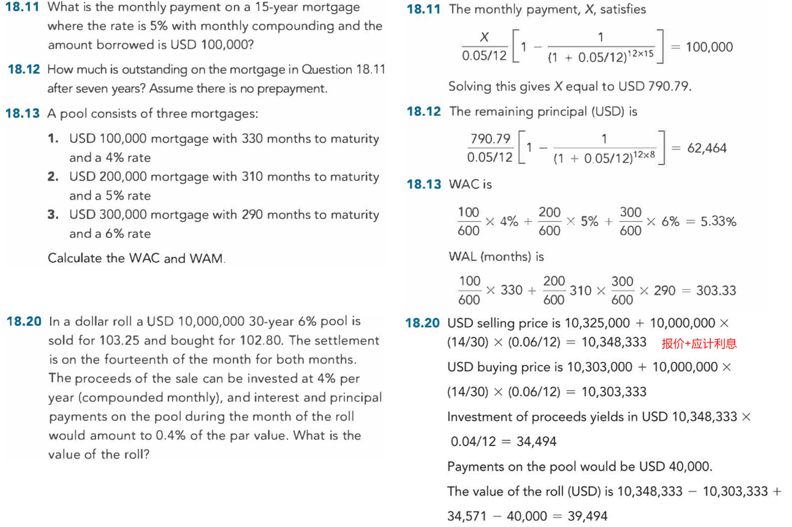

### 保险公司和养老金

-   *Insurance* 保险
    -   保险是经济补偿制度
        -   对可能发生不确定事件做预测、收取保费，建立保险基金
        -   以合同的方式将风险从被保险人转移到保险公司，由大多数人分担少数人损失
    -   保险合约涉及主体
        -   *Policy Holder* 投保人：向保险公司支付保费 *Preimums*，保险公司对约定的可能事故造成的损失承担赔偿责任
        -   被保险人：保险的承保对象
        -   受益人：保险赔偿金的受领人
    -   保险合约分类
        -   *Life Insurrance* 人寿保险：以被保险人寿命为标的，以被保险人生存或死亡为保险事故的人身保险
        -   *Property-Casualty Insurance* 财产与意外险、损害保险：以财产及其有关经济利益和投保人的损害赔偿这人为保险标的的保险
            -   狭义上，以物质财产为保险标的保险
        -   *Health Insurance* 健康险、疾病保险：以被保险人身体为标的、针对被被保险人在疾病或意外事故中所遭受的伤害或损失进行补偿的保险
            -   支付范围包括医疗费用、收入损失、丧葬费、遗属生活
            -   区别于寿险，保费随随被保险人具体情况变化
    -   保险公司主要投资工具为长期企业债券
        -   可帮助实现期限匹配策略：相较于商业票据、股权投资
        -   风险适中：相较于国债

####    人寿保险

-   *Life Insurrance* 人寿保险：以被保险人寿命为标的，以被保险人生存或死亡为保险事故的人身保险
    -   按保险期限分类
        -   *Term Life Insurance* 定期寿险、定期死亡保险：保险合约有效期内死亡
        -   *Whole Life Insurance* 终身寿险：保险期限为终生
            -   保费较定期寿险高
            -   可中途退出，得到一定的退保金，故可用于融资抵押
        -   *Endowment Life Insurance* 储蓄寿险：期限内死亡、期满都能获得保险金
    -   投资型保险（已经演变为金融投资工具）按盈余保费分类
        -   *Variable Life Insurance* 变额寿险
            -   保费固定，类似终生寿险
            -   但盈余保费由投资人投资，投资回报不固定、无最低保证
        -   *Universal Life Insurance* 万能寿险
            -   类似变额寿险，但保费不固定
            -   盈余保费用于固收产品投资
        -   *Variable-Universal Life Insurance* 变额万能寿险
    -   按被保险人分类
        -   *Individual Insurance* 个人寿险
        -   *Group Insurance* 团体寿险：保险公司签发总保单

#####   生命表

-   *Mortality Table* 生命表：保险公司根据特定人群的年龄组死亡率编制的统计表
    -   表字段
        -   *Probability of Death Within 1 Year* 一年内死亡概率：某年龄段接下来 1 年死亡概率
        -   *Survival Probability* 生存概率：一个人能存活到该年龄的概率，即前序 `1 - 死亡概率` 累乘
            -   0 岁的生存概率是 1
        -   *Life Expectancy* 预期寿命：该年龄段预期还能生存的年数
    -   生命表被用于保费计算
        -   计算保单期限内，各年死亡可能性：0.5 年、1.5 年等
        -   计算各年给付金额期望值的现值之和
        -   设每年缴纳保费 $X$
            -   第 0 年 `100%` 缴纳保费
            -   第 1 年 `1 - 死亡概率` 缴纳保费，后续同
            -   计算各年期望保费现值
        -   `给付金额现值 = 期望保费现值` 计算 $X$

|      | 男性          |                                  |          | 女性          |          |          |
|------|---------------|----------------------------------|----------|---------------|----------|----------|
| 年龄 | 1年内死亡概率 | 生存概率                         | 预期寿命 | 1年内死亡概率 | 生存概率 | 预期寿命 |
| 30   | 0.001498      | 0.97520                          | 47.86    |               |          |          |
| 31   | 0.001536      | 0.97373=0.97520 * (1 - 0.001536) | 46.93    |               |          |          |

#####   寿险风险

-   寿险需关注的风险
    -   *Longevity Risk* 长寿风险：平均实际寿命高于预期寿命产生的风险
        -   降低保险公司从年金合约获取的利润：支付年金时间延长
        -   增加人寿保险合约的利润：给付赔偿事件延后
    -   *Mortality Risk* 死亡风险
        -   增加保险公司从年金合约获取的利润
        -   降低人寿保险合约的利润
            -   死亡风险是终生寿险面临的最大风险

####    年金合约

-   *Annuity Contracts* 年金合约：投保人将一次性前期支付转换为后续一系列现金流入
    -   本质上是保险公司代投保人投资，后续将回报以年金形式返还
        -   年金可以立即收取，也可以递延收取
    -   年金合约有税收优势
        -   税务缴纳更晚、边际税率更低
    -   *Accumulation Value* 累计价值：年金投资的总额
    -   年金合约需关注的风险
        -   长寿风险

####    财产与意外险

-   *Property-Casualty Insurance* 财产与意外险、损害保险：以财产及其有关经济利益和投保人的损害赔偿这人为保险标的的保险
    -   *Property Insurance* 财产险：对财物的意外损坏进行赔偿
    -   *Casualty Insurance* 意外险：对由于被保险人的行为造成对他人伤害或损害的责任承保
    -   说明
        -   保险公司通常合并出售
        -   期限通常为 1 年
        -   保险公司若认为投保人风险上升，会提报保费
    -   财产与意外险需关注的风险
        -   许多相互独立的投保人索赔，导致预期保费增加的风险
        -   *Catastrophe Risk* 巨灾风险：保险公司可使用 *Reinsurance* 再保险、*Catastrophe Bond* 巨灾债权管理巨灾风险
            -   再保险、分保：签订分保合同，将承保的部分风险转移给再保险公司
            -   *CAT Bond* 巨灾债券：保险公司发行，债券本金、利息偿还根据巨灾发行情况而定
                -   将承保的部分风险转移给投资人
                -   巨灾债券收益与市场行业无关，更适合分散投资组合风险
            -   自然灾害是财产意外险面临的最大风险

####    健康险

-   *Health Care Insurance* 健康险、疾病保险：以被保险人身体为标的、针对被被保险人在疾病或意外事故中所遭受的伤害或损失进行补偿的保险
    -   区别于寿险，保费随随被保险人具体情况变化
    -   除需关注风险
        -   *Moral Hazard* 道德风险：风险得到保障后改变日常行为倾向
            -   保险公司可采用 *Deductible* 免赔额、*Co-insurance Provision* 共同保险条款、*Policy Limit* 保单限额管理道德风险
        -   *Adverse Selection* 逆向选择：投保人根据信息优势获取更低价格保险
            -   保险公司签订保单前需要尽可能获取投保人

####    养老金计划

-   *Pension Plan* 养老金计划：企业和职工签订的关于退休后支付养老金的协议
    -   *Defined Contribution Pensions Plan* 缴纳确定型养老金、设定提存计划：职工、公司共同定期出资，收益率取决于养老金数额和投资收益
    -   *Defined Benefit Pensions Plan* 收益确定型养老金、设定提存计划：公司有义务定期支付固定数额养老金，养老金不足部分由公司补足
        -   收益确定型养老金会同时投资股票、债券，期望获得足够大收益（而保险公司不会投资股票）

####    保险业监管

-   保险公司面临多种风险
    -   资产端投资风险：投资长期债券面临市场风险、利率风险、信用风险
    -   负债端承保风险：赔付相关的长寿风险、死亡风险
    -   保险业没有类似巴塞尔委员会的全球行业监管组织
        -   资本金要求：欧洲 *Solvency II* 监管准则
            -   *Solvency Capital* 偿付资本金：不满足要求时，需要提供补充资本金计划
            -   *Minimum Capital* 最小资本金：不满足要求时，不允许展业、存量保单被转移
            -   计量方式可采用标准法和内部模型法（需要监管批准）
        -   监管体系：美国以州监管
            -   *The National Association of Insurance Commissioners* 仅供行业交流，不强制监管

####    业绩评估

$$\begin{align*}
赔付率 &= \frac {赔付支出} {保费收入} * 100\% \\
保费费用率 &= \frac {销售费用 + 理赔费用} {保费收入} * 100\% \\
综合费用率 &= 赔付率 + 保费费用率 = \frac {赔付支出 + 销售费用 + 理赔费用} {保费收入} * 100\% \\
分红后综合费用率 &= 综合费用率 + 分红率 \\
运营费用率 &= 综合费用率 + 分红率 - 投资收益率 \\
\end{align*}$$

-   业绩评估
    -   *Loss Ratio* 赔付率
    -   *Expense Ratio* 保费费用率
    -   *Combined Ratio* 综合费用率
    -   *Combined Ratio after Dividend* 分红后综合费用率
    -   *Operating Ratio* 运营费用率

### 基金管理

| 比较     | 共同基金             | 对冲基金                                     |
|----------|----------------------|----------------------------------------------|
| *NAV*    | 每日                 | 长期                                         |
| 投资策略 | 全部披露             | 非全部披露（只向潜在客户）                   |
| 杠杆     | 有限使用             | 高杠杆                                       |
| 赎回期限 | 通常不存在锁定期     | 通常存在锁定期                               |
| 业绩     | 平均来看无法击败市场 | 牛市不佳、熊市较好（策略不是为顺应市场设计） |

####    共同基金

-   *Mutual Fund* 共同基金：一篮子证券，集中所有投资人的资金进行组合管理的方式
    -   基金价值计量
        -   *Net Asset Value* 资产净值：`基金资产价值 / 基金份额`
            -   开放式基金仅在交易日结束后计算
        -   `折价或溢价% = (二级市场交易价 - 每股NAV) / 每股NAV`
    -   *Closed-End Funds* 封闭式基金：开始运行就将不再接受新的申购，存续期间投资人不能赎回份额
        -   特点
            -   份额可以在二级市场交易，会导致交易价格和基金净值不一致，出现溢价、折价
            -   份额可以交易日内任意买卖、做空
            -   封闭期满之前无赎回压力，可用于投资长期项目
            -   在私募证券投资基金中较为常见
    -   *Open-End Funds* 开放式基金：可在基金存续期间不断申购、赎回
        -   特点
            -   申购、赎回价格按当日 `4p.m.` 基金净值计算
            -   基金总份额申购、赎回变化
                -   基金规模可以迅速扩大
                -   需要留存部分现金而无法完全投资
                -   赎回可能造成基金净值、投资标的波动
            -   适合流动性强、体量大的公募基金
        -   按投资标的分类
            -   *Money Market Funds* 货币市场基金：投资于货币市场上短期（一年内）有价证券
                -   投资标的：国库券、商业票据、银行定期存单、银行承兑汇票、政府短期债券
                -   采用红利转投资的方式
                    -   美国市场货币市场基金价值始终为 1USD 每股，超过的收益按时自动转换为份额
            -   *Bond Funds* 债券型基金：投资国债、金融债等固收金融工具
                -   产品收益稳定、低风险、低费用
            -   *Equity Funds* 股票型基金：主要投资上市公司股票
                -   *Actively Managed Funds* 主动管理型基金
                    -   战胜大盘
                    -   收费高于指数型基金
                -   *Index Funds* 指数基金：以标的指数成分股全部或部分作为投资对象
                    -   以减小 *Tracking Error* 跟踪误差为目的
                -   *Expense Ratio* 基金费率 `= 管理费用 / NAV`
            -   *Hybrid Funds* 混合型基金：投资组合包括成长性股票、收益性股票、债券
                -   实现投资多元化
    -   相较于对冲基金
        -   共同基金必须在任意交易日可赎回、或交易
        -   每日至少计算一次 *NAV*
        -   必须公布投资策略
        -   杠杆使用有限制

#####   *ETF*

-   *Exchange-Traded Funds* 交易型开放式指数基金：在交易所上市交易的、基金份额可变的开放式基金
    -   结合封闭式、开放式基金特点
        -   一级市场实物申购/赎回 *In-kind Creation/Redemption*
        -   二级市场可交易基金份额
        -   存在套利机制，避免封闭式基金存在折价、溢价问题
    -   *ETF Manager/Issuer/Sponser* 基金管理人负责创建、管理 *ETF*
    -   *Authorized Participants* 授权参与人为大型券商
        -   一级市场实物申购/赎回 *In-kind Creation/Redemption*
        -   二级市场代客买卖、做市、交易
    -   *ETF* 也分为指数基金和积极管理型基金
        -   传统 *ETF* 跟踪指数，被称为 *Beta ETF*
        -   基金管理型
            -   增强型指数基金：策略不透明
            -   *Smart Beta ETF*：策略透明，选股、权重有优化

#####   不当交易行为

-   不当交易行为
    -   *Late Trading* 逾时交易：投资者在 `4p.m.` 后交易开放式基金
    -   *Marketing Timing* 市场择时：基金经理、特权投资者利用 *NAV* 没有正确反映价值套利
    -   *Front Timeing* 抢先交易：基金经理在基金买入股票前抢先交易
    -   *Directed Brokerage* 定向经济业务：经济商向投资者推荐不合适的基金产品

####    对冲基金

-   *Hedge Funds* 对冲基金、套期保值基金、避险基金
    -   操作宗旨：利用期货、期权对相关联的股票进行风险对冲，通过杠杆获取高额回报
    -   费用
        -   *Management Fee* 管理费：通常 `2%`
        -   *Incentive Fee* 业绩激励费：通常 `20%`
        -   其他决定因素
            -   *Hurdle Rate* 预设回报率：实际回报率高于预设回报率才有业绩奖励
            -   *High-Water Mark* 高水位线条款：基金净值超过历史最高水平才能从超过最高水平的部分提取业绩报酬
                -   不得重复提取业绩报酬
                -   下期收益必须弥补上期亏损
            -   *Clawback Clause* 薪酬追回条款：业绩激励可被追回以弥补亏损
    -   其他内容
        -   *Prime Broker*：为对冲基金执行交易、向对冲基金借款的银行
            -   对冲基金的证券将寄存在该银行中作为贷款、交易的抵押物
        -   对冲基金收益不依赖市场表现，所以在熊市表现更突出
    -   交易策略
        -   *Long/Short Equity Strategy* 股票多空策略：做多低估股票、做空高估股票
        -   *Dedicated Short Strategy* 专事卖空策略：做空
        -   *Merger Arbitrage Strategy* 并购套利策略：买入被收购公司股票、卖出收购公司股票
        -   *Fixed Income Arbitrage Strategy* 固定收益套利策略：从相似的固收证券的错误定价中获取收益
        -   *Convertiable Arbitrage Strategy* 可转换证券套利策略：挖掘可转债、可转换优先股、权证的错误定价
        -   *Emerging Markets Strategy* 新兴市场策略：投资新兴市场
        -   *Global Macro Strategy* 全球宏观策略：在全世界投资
        -   *Disstress Debt Strategy* 不良证券策略：做多被低估问题公司、做空未被察觉的问题公司
        -   *Managed Futures Strategy* 管理期货策略：预测大宗商品价格

##  金融（市场）风险

-   *Mean-Variance Framework* 均值-方差分析框架：均值度量回报、回报标准差度量风险
    -   常假设回报服从正态分布
        -   但，金融资产收益分布有 *Peak* 尖峰、*Fatter Tail* 肥尾特征（相较于标准正态分布）
            -   极端值出现的可能性更大
    -   风险因子分类
        -   应转换为百分比变化的风险因子：价格（股票价格、大宗商品价格）
        -   可取原值的风险因子：利率

###  风险度量指标

-   *Risk Measure* 风险度量指标
    -   *Coherent Risk Measures* 一致性风险度量：可以用作风险指标优劣评判标准
        -   *Monotonicity* 单调性：$X_A \leq X_B \Rightarrow p(X_A) \geq p(X_B)$ ，若资产组合 A 表现永远比资产组合表现差，则资产组合A 的风险指标值应大于 B
            -   即，优质资产的风险永远小于劣质资产的风险
        -   *Homogeneity* 齐次性：$p(\lambda X) = \lambda P(X)$ 组合风险指标值应随组合头寸成比例变化
        -   *Translation Invariance* 平移不变性：$\forall c, p(X + c) = p(X) - c$，若数量为 $c$ 的现金加入资产组合，组合的风险指标值应减少 $c$
        -   *Subadditivity* 次可加性：$p(X_1 + X_2) \leq p(X_1) + P(X_2)$，资产组合的风险指标值不应大于各成分风险指标值加总
            -   即，风险度量应体现分散化的优势
    -   风险度量指标可通过 **对损失分布分位数赋权**（加总）定义（损失是收益取反）
        -   风险度量指标满足一致性，当且仅当赋权函数 $w$ 随损失分位数不减 $\forall p_1 > p_2, w(p_1) \geq w(p_2)$
            -   *Spectral Risk Measure* 谱风险度量指标：权重随分位数权重递增、反映风险厌恶水平
                -   谱风险度量指标总是一致性风险度量指标
                -   比如，可取权重满足 $w \propto e^{-(1-p) \gamma}$（$\gamma$ 反映风险厌恶水平）
        -   举例
            -   $VaR(X)$：$X\%$ 分位数权重为 `1`，其余为 `0`
                -   故，*VaR* 不是一致性风险度量指标
            -   $ES$：所有分位数等权重

###  *VaR*

-   *Value at Risk* 在险价值：在一定期间内 *Time Horizon* 和一定置信水平下 *Confidence Level*，投资组合发生的最大损失
    -   货币在险价值、百分比在险价值
        -   $VaR(X\%)$ 百分比在险价值：损失值用百分比表示
        -   $VaR(X)$ 货币值在险价值：损失值用货币值表示
    -   *VaR* 的可从损失不超过在险价值的把握（置信水平）、损失超过在险价值（显著性水平）两个角度解读
        -   置信水平角度：有 `(1-X)%` 的把握损失不超过 $VaR(X)$
        -   显著性角度角度：损失超过 $VaR(X)$ 的概率小于 `X%`
    -   *VAR* 使用限制
        -   存在模型风险，收益分布假设可能有误
        -   只能表示对应分位点的损失，不能体现更严重尾部情况，可能导致忽略概率较小的巨额损失
        -   不满足次可加性

####    *VaR* 计算

-   计算方法
    -   基于历史数据计算
        -   将历史收益数据按升序排列
        -   从最差回报开始累计频率
        -   得到对应分位数代表的 $VaR(X)$
            -   对给出收益、概率的场合，将 **收益为阶梯形状的均匀分布**
            -   对给出收益、样本点的场合，使用 **插值计算分位数**
            -   并，类似的计算对应的 *Expected Shortfall*
    -   基于收益符合正态分布假设
        $$\begin{align*}
        VaR(X\%) &= |E(R) - Z_{X\%} * \sigma| \\
        VaR(X) &= VaR(X\%) * 资产价值 = |E(R) - Z_{X\%} * \sigma| * 资产价值 \\
        \end{align*}$$
        > - $Z_{X\%}$：标准正态分布 $X\%$ 分位数，对应 $X\%$ 显著性水平、$1-X\%$ 置信水平
        -   获取资产预期收益 $E(R)$（未知则可视为 0）、标准差 $\sigma$
        -   根据正态分布性质确定 *VaR*

####    *VaR* 换算

$$\begin{align*}
VaR(New\%) &= Z_{New} * \sigma = VaR(Old\%) \frac {Z_{New}} {Z_{Old}} \\
VaR(X\%)_{J期} &= VaR(X\%)_{1期} * \sqrt J \\
\end{align*}$$

-   在正态分布假设、$E(R) = 0$ 时的 *VaR* 换算
    -   显著性水平不同换算
    -   多段时间区间收益独立同分布情况下换算
        -   假设短期限收益分布均值是 `0`，直接根据独立、同分布加总方差换算

####    *Expected Shortfall* 预期亏空

-   *Expected Shortfall* 预期亏空：**超过风险临界值之后** 的平均损失
    -   风险临界值一般即指 *VaR* 中置信水平
        -   即，*VaR* 中未体现的、最糟糕的事情发生时的平均损失
    -   *ES* 没有公认的回测体系，常与 *VaR* 交叉验证
        -   满足次可加性
        -   体现尾部风险特征

####    历史模拟法估计 *VaR*

-   *Historical Simulation* 历史模拟法
    -   *Non-Parametric* 方法，无需假设收益分布、无需估计收益参数
        -   优点
            -   容易执行
            -   风险因子之间的相关性反映在历史数据中
        -   缺点
            -   赋予历史所有观察值相同权重，可能高估早期事件影响力
            -   历史数据未必能预测未来
    -   假设历史会重演，根据 **预测未来一段时间的情况**，根据预测数据计算 *VaR*
        -   确定组合的风险因子
        -   收集过去一段时间风险因子取值，计算风险因子变化量
            -   **价值、价格类指标：将其转换为 *Percentage Change* 百分比变化**
            -   **比率类指标（利率等）：直接使用其 *Actual Change* 变化值**
        -   创造不同情景，根据情景选择历史数据（一般按顺序取即可）
            -   假设历史情景的代表的 **风险因子变化** 会重复出现
            -   并根据里历史数据中风险因子变化量，调整风险因子取值
        -   在每个情景中，基于风险因子的取值计算组合价值、损失
            -   排序后得到短期限给定置信水平下的 *VaR*、*ES*
            -   计算给定期限下、给定置信水平 *VaR*、*ES*

#####   历史权重调整

-   权重调整
    -   非等权重的历史模拟法
        -   根据各情景对应历史数据距今时间设置权重（可设置为指数递减）
        -   计算 *VaR* 时，使用累计权重达到指定置信水平对应损失值
    -   *Multivariate Density Estimation* 多元密度估计法
        -   将资产价值、收益进行归因
        -   将当前影响因子与历史数据影响因子对比
        -   赋予与当前情况更接近的历史数据更高权重
        -   计算 *VaR* 时，使用累计权重达到指定置信水平对应损失值

####    蒙特卡洛模拟法

-   *Monte Carlo Simulation* 蒙特卡洛模拟法
    -   需要先根据风险因子历史数据假设风险因子变动的联合分布
        -   优点
            -   历史数据中发现的风险因子相关性可在假设分布中反映
            -   可用于线性组合和非线性组合
            -   可设置极端参数做 *Worst Case Analysis* 最坏情况分析
        -   缺点
            -   假设风险因子变动联合分布时有模型风险，如风险因子之间相关性发生变化
            -   计算复杂
            -   历史数据估计的风险因子特性未必能预测未来
    -   具体步骤
        -   使用当前风险因子取值估计组合价值 $V_0$
        -   从假设的风险因子变动联合分布中抽样，计算风险因子新取值（抽样的是变动）
        -   根据风险因子新取值重新估值 $V_1$
        -   计算损失值 $V_1 - V_0$
        -   重复，直到确定损失分布，计算给定置信水平下 *VaR*

####    *Delta* 模型法估计 *VaR*、*ES*

$$\begin{align*}
& \Delta P = \sum_i a_i x_i =
    \begin{cases}
        \sum_i \delta_i * \Delta S_i &, 利率类风险因子: a_i = \sigma_i, x_i = \Delta S_i \\
        \sum_i \delta_i S_i * \frac {\Delta S_i} {S_i}
            &, 价格类风险因子: a_i = \sigma_i \Delta S_i, x_i = \Delta S_i / S_i \\
    \end{cases} \\
\Rightarrow & \begin{cases}
    \mu_P &= \sum_i a_i \mu_i \\
    \sigma_P^2 &= \sum_i \sum_j a_i a_j \rho_{i,j} \sigma_i \sigma_j \\
\end{cases} \\
\Rightarrow & \begin{cases}
    VaR_P &= \mu_P + \sigma_P Z_{X\%} \\
    ES_P &= \mu_P + \sigma_P \frac {e^{-\frac {-(Z_{X\%})^2} 2}} {(1 - Z_{X\%}) \sqrt {2\pi}} \\
\end{cases} \\
\end{align*}$$
> - $\Delta S_i, \Delta P$：风险因子 $i$ 变化量、**衍生品价值变化量（也即资产组合收益）**
> - $\mu_P, \sigma_P$：资产组合价值变动 $\Delta P$ 的均值、标准差
> - $\delta_i, \gamma_i$：风险因子 $i$（传导机制量）希腊字母一阶导数、二阶导数
> - $\mu_i, \sigma_i$：风险因子 $i$ （比例）变化量 $x_i$ 的均值、标准差
> - $\rho_{i,j}$：风险因子 $i,j$ （比例）变化量 $x_i, x_j$ 的相关系数

-   *Delta-Normal* 法、*Delta* 近似法：假设风险因子服从正态分布，计算资产组合 *VaR*、*ES*
    -   说明
        -   对利率类风险因子，直接用变化量原值
        -   对价格类风险因子，使用 `变化比例 = 变化量 / 规模` 作为变化量（需同步调整机制量）
    -   单个衍生品 *VaR*
        -   计算风险因子的 *VaR*
        -   通过风险因子与金融工具的价值传导机制量 $\delta, \gamma$，计算衍生品 *VaR*
    -   对投资组合的 *VaR*
        -   计算各资产的风险因子均值、标准差、相关系数
        -   计算资产组合的风险因子均值、标准差
        -   假设投资组合的风险因子服从正态分布，计算投资组合 *VaR*
    -   *Delta-Normal* 法的前提、局限
        -   风险因子变动要服从正态分布
        -   风险因子的变动能够通过 *delta* 传递给衍生品、资产组合

#####   *Delta-Gamma* 法

$$\begin{align*}
\Delta P &= \sum_i (\delta_i * \Delta S_i + \frac 1 2 \gamma_i (\Delta S_i)^2) \\
\end{align*}$$

-   *Delta-Gamma* 法：使用二阶拟合更精确估计资产组合价值变动
    -   线性衍生品：衍生品价值与风险因子变化呈线性关系
        -   衍生品价格传导机制量 $\delta = \frac {\Delta P} {\Delta S}$ 为常数
        -   线性衍生品
            -   远期、期货
                -   风险因子为标的资产价格（波动比例）
                -   传导机制量为合约规模（`* 资产价格`）等
    -   非线性衍生品：衍生品组合价值与风险因子变化呈非线性关系
        -   衍生品价格传导机制量 $\delta = \frac {\Delta P} {\Delta S}$ 不为常数
        -   非线性衍生品
            -   债券
                -   风险因子为利率
                -   传导机制量为（美元）久期 $DollarDur = ModDur * P$
                -   二阶传导机制量为凸度
            -   期权
                -   风险因子为标的资产价格（波动比例）
                -   传导机制量为期权的希腊字母 $\Delta * P$
                -   二阶传递机制量为 $\Gamma$
        -   包含非线性衍生品的资产组合即为非线性资产组合

####    FRM例题

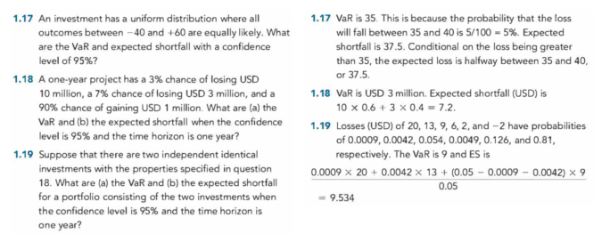
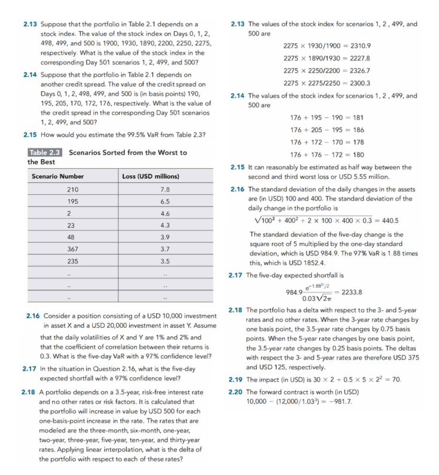

### 波动率的估计与监控

-   资产收益分布的参数（均值、方差）可能并非常数，是真实收益分布存在肥尾、非对称的主要原因
    -   参数变化
        -   *Slow Changes* 缓慢变化
        -   *Regime Changes* 剧烈变化、机制转换
    -   收益波动率：使用逐日资产收益的标准差

####    平均、移动平均标准差

-   收益波动估计
    -   *Equally Weighted* 等权重标准差 *Standard Deviation*
        $$\begin{align*}
        r_t &= \frac {S_t - S_{t-1}} {S_{t-1}} \\
        \bar r &= \frac 1 T \sum_{t=1}^T r_t \\
        \sigma^2 &= \frac 1 {T-1} \sum_{t=1}^T (r_t - \bar r)^2 \\
            &\approx \frac 1 {T-1} \sum_{t=1}^T r_t^2 \\
        \end{align*}$$
        > - $r_t, \bar r$：第 $t$ 日资产收益、资产日收益均值（为短期收益，可近似为 0）
        > - $T$：估计所用时间窗口
        -   时间窗口 $T$ 太小估计误差太大、太大容易加入过多相关性不高的历史数据
    -   *Exponentially Weighted Moving Average* 指数加权移动平均：数据权重指数递减，给予最近数据最大权重
        $$\begin{align*}
        \sigma_t^2 &= \lambda \sigma_{t-1}^2 + (1 - \lambda) r_{t-1}^2 \\
        Cov(x_t, y_t) &= \lambda Cov(x_{t-1}, y_{t-1}) + (1 - \lambda) r_{x,t-1} r_{y,t-1} \\
        \rho_t &= \frac {Cov(x_t, y_t)} {\sigma_{x,t} \sigma_{y,t}} \\
        \end{align*}$$
        > - $\lambda$：指数平均权重，建议取 `0.94`
        -   *EWMA* 方法也可用于估计两项资产收益 $X, Y$ 的协方差、相关系数

####    *GARCH*

$$\begin{align*}
\sigma_t^2 &= \alpha r_{t-1}^2 + \beta \sigma_{t-1}^2 + \gamma V_L \\
    &= \alpha r_{t-1}^2 + \beta \sigma_{t-1}^2 + w, w = \gamma V_L, \alpha + \beta < 1 \\
\alpha + \beta + \gamma &= 1 \\
E(\sigma_{T+n}^2) &= V_L + (\alpha + \beta)^t (\sigma_T^2 - V_L) \\
\end{align*}$$
> - $V_L$：长期方差水平（波动 *Volatility* 指方差，要再开根）
> - $T$：观测数据长度（即 $T$ 时刻后无观测数据）

-   *Generalizaed Autoregressive Conditional Heteroskedasticity Model* 广义条件自回归异方差模型 *GARCH(1,1)*
    -   相较于 *EWMA* 还考虑了长期方差水平 $V_L$，抑制了均值回归
        -   *EWMA* 模型可视为是 $\gamma=0$ 的特例
    -   *GARCH(1,1)* 可用于估计 $n$ 天后的方差
        -   *GARCH(1,1)* 计算的方差会体现均值复归
            -   方差存在均值复归时，$\sigma_{J期} = \sigma_{1期} * \sqrt J$ 容易错估多期收益方差
                -   $\sigma_{1期} > V_L$，则容易高估
                -   $\sigma_{1期} < V_L$，则容易低估
        -   且，$(\alpha + \beta)^2$ 越大，复归速度越慢，被称为 *Persistence Level* 维持能力

####    *Implied Volatility* 隐含波动率

-   *Implied Volatility* 隐含波动率：根据 *BSM* 期权定价模型，通过期权市场价格倒推基础资产波动率
    -   隐含波动率翻了期权投资者对基础资产的未来预期，是 *Forward Looking* 前瞻性的
        -   有时比 *EWMA*、*GARCH* 等 *Backward Looking* 效果好

####    FRM例题

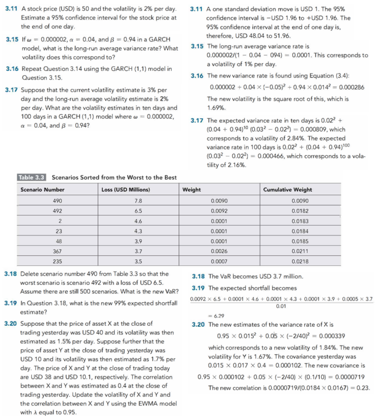

##  信用风险

### 信用评级

-   信用评级：对债务人偿债能力、偿债意愿的综合评价
    -   信用评级对评级对象违约可能性进行评价，与违约率高度相关
        -   信用评级存在排序性，评级越高违约率越低
    -   信用评级机构：按照一定标准对信用风险提供独立意见的组织
        -   *Moody's*
        -   *S&P*
        -   *Fitch*
    -   评级对象
        -   *Issuer Credit Rating* 主体信用评价：主体如期偿还全部债务的能力和意愿的综合评价
            -   主要评价主体长期违约率的大小
            -   不针对具体债务、抵押担保
        -   债项评级：对发行人发行的债务工具、金融产品的评级
            -   评定债务工具或金融产品违约可能性、违约损失严重性
            -   除考虑债务人特性外，还需考虑债务本身性质，如抵押品、担保人
    -   内部信用评级：外部评级机构提供的服务可能无法满足全部需求，金融机构可仿造外部评级机构建立内部信用评级体系

####    评级尺度

-   长期信用评级：企业、债券 *Bonds*
    | 信用质量             | *Moody's*              | *S&P*、*Fitch*        |
    |----------------------|------------------------|-----------------------|
    | 投资级 *Investment*  | `Aaa`                  | `AAA`                 |
    |                      | `Aa1`、`Aa2`、`Aa3`    | `AA+`、`AA`、`AA-`    |
    |                      | `A1`、`A2`、`A3`       | `A+`、`A`、`A-`       |
    |                      | `Baa1`、`Baa2`、`Baa3` | `BBB+`、`BBB`、`BBB-` |
    | 投机级 *Speculative* | `Ba1`、`Ba2`、`Ba3`    | `BB+`、`BB`、`BB-`    |
    |                      | `B1`、`B2`、`B3`       | `B+`、`B`、`B-`       |
    |                      | `Caa1`、`Caa2`、`Caa3` | `CCC+`、`CCC`、`CCC-` |
    |                      | `Ca`                   | `CC`                  |
    |                      | `C`                    | `C`                   |
-   短期评级：货币市场工具 *Money Market Instruments*
    | 信用质量           | *Moody's* | *S&P*         | *Fitch*       |
    |--------------------|-----------|---------------|---------------|
    | 投资级 *Prime*     | `P-1`     | `A-1+/A-1`    | `F1+/F1`      |
    |                    | `P-2`     | `A-2`         | `F2`          |
    |                    | `P-3`     | `A-3`         | `F3`          |
    | 投机级 *Non-Prime* | `NP`      | `B`、`C`、`D` | `B`、`C`、`D` |

####    评级流程

-   评级流程说明
    -   评级时点：在公开交易债券市场、货币市场工具首次发行时，给予初始评级
        -   之后定期回顾，在需要改变评级时调整
    -   评级考虑内容
        -   历史和预测的财务数据
        -   行业和经济数据、同业比较
        -   机构治理结构、管理层访谈结果等定性因素
    -   评级展望、评级观察名单是对评级结果的补充
        -   *Outlook* 评级展望：体现长期信用评级的变化趋势和风险
            -   *Positive* 正面
            -   *Negative* 负面
            -   *Stable* 稳定
            -   *Developing* 发展中：无法判断未来走向
        -   *Watchlist* 评级观察名单：目标公司短期内可能发生足以影响评级的事件
            -   *Positive* 正面
            -   *Negative* 负面
-   信用评级说明
    -   风险计量技术（时间跨度不同）会影响评级结果
        -   *Point-in-Time* 时点评级法：基于当前获得的信息反映评级对象信用风险
            -   精准，能反映市场新信息
            -   评级结果波动性较大
        -   *Through-the-Cycle* 评级法：采用一个经济周期以上的历史数据综合平价评级对象的信用风险
            -   只有能影响评级对象长期信用基本面情况出现时，评级才调整
            -   稳定，但可能会滞后与市场信息
                -   经济增长时可能低估，经济萧条时可能高估
    -   不同地域、行业公司信用评级不同
        -   相同信用评级不同行业、地域的主体违约概率相近，也会有所不同
    -   信用评级改变对股票、债券价格影响非对称 *Asymmetric Reactions*
    -   信用评级存在的问题
        -   评级费用由被评级公司支付，存在可能的利益冲突
            -   但，评级机构可能为维护自身声誉而给与公允评级
            -   信用评级上调对股票、债券价格的影响不如评级下调
        -   评级模型可能存在模型风险
        -   评级方法是公开的，让金融产品设计者可以钻空子

#####   信用评级转移矩阵

-   *Transition Matrix* 信用评级转移矩阵
    -   度量信用评级转移的工具
    -   假设期间评级转移相互独立
        -   将期初评级状态、期末评级状态相比较
        -   计算特定时间内，评级之间相互转移的概率
        -   绘制为信用评级转移矩阵
    -   *Ratings Momentum Effect* 评级趋势效应：债券评级某年上升、下降，则下一年更有可能继续上升、下降
        -   即，连续年份的信用评级转移矩阵不独立

###  信用风险计量

####    违约概率

-   *Probability of Defualt* 违约概率
    -   发行人发行的债券违约概率（每年）
        -   *Issuer Default Rate* 发行人违约概率：发行人发行的债券中违约债券数量占比
            -   衡量发行人的无法偿付情况，反馈整体经济水平
        -   *Dollar Default Rate* 金融违约概率：发行人发行的债券中违约债券票面价值占比
            -   衡量损失的货币值比例，即危害的严重程度
    -   具体发行人、或具体债券的违约概率（每年）：
        $$\begin{align*}
        P_{累计存活, 0:t} &= 1 - P_{累计, 0:t} \\
        PD_{无条件,t:t+k} &= PD_{累计,0:t+k} - PD_{累计,0:t} \\
        PD_{条件,t:t+k} &= \frac {PD_{累计,0:t+k} - PD_{累计,0:t}} {P_{累计存活,{0:t}}} \\
        \end{align*}$$
        -   *Cumulative Default Probability* 累计违约概率：发行人一段时间内的违约概率
            -   *Cumulative Survive Rate* 累计存活率 `= 1 - 累计违约概率`
        -   *Unconditional Default Probability* 无条件违约概率：发行人两个时点间的违约概率
        -   *Conditional Default Probability* 条件违约概率：发行人在 $t$ 时刻前未违约条件下，接下来 $k$ 时期的违约概率

#####   违约概率估计

-   违约概率估计
    -   假设发行人、债券短时间内是否违约（服从伯努利分布）独立不相关，即一段时间内的违约次数服从泊松分布（二项分布极限）
        -   则建立 *Default Intensity Model* 违约强度模型
            $$\begin{align*}
            P(X=x) &= \frac {(\lambda t)^x e^{-\lambda t}} {x!} \\
            P_{累计存活, 0:t} = P(X=0) &= e^{-\lambda t} \\
            P_{累计, 0:t} &= 1 - e^{-\lambda t} \\
            PD_{无条件, t:t+k} &= 1 - e^{-\lambda(t+k)} - (1 - e^{-\lambda t}) \\
            \end{align*}$$
            > - $P(X=x)$：泊松分布建模的 $t$ 时间内债券违约 $x$ 的概率
            > - $\lambda$：风险率 *Hazard Rate*
        -   债券 $t$ 内累计存活率即 $P(x=0) = e^{-\lambda t}$ 即债券 $t$ 时间内累计存活率
    -   *KMV/Merton* 模型：将公司类比为看涨期权，借助 *BSM* 估计公司违约概率
        $$ S = VN(d_1) - De^{-qt}N(d_2) $$
        > - $V, D$：公司的资产价值、负债
        -   思路
            -   将公司的资产、负债视为看涨期权的资产价格、行权价格
            -   公司违约视为看涨期权处于虚值期
            -   考虑到 $N(d_2)$ 表示行权概率，则 $1 - N(d_2)$ 表示公司违约概率

####    风险敞口

-   *Exposure* 风险敞口：金融工具在存续期间，发生风险时的金额
    -   债券的风险敞口基本就是面值
    -   银行贷款风险敞口可认为是名义本金

####    损失率

-   *Loss Rate*、*Loss Given Default* 损失率：违约后较短时间内，金融工具价值的损失与其价值的比值
    -   *Recovery Rate* 回收率 `= 1 - 损失率`：违约后较短时间内，能回收的价值与其价值的比值
        -   对债券，回收率即为违约发生后 `债券价值 / 债券面值`
    -   回收率与违约概率负相关
        -   经济衰退时，违约概率高，回收率低
        -   经济较好时，违约概率低，回收率高

####    预期损失、非预期损失

$$\begin{align*}
EL &= PD * LGD * EAD \\
EL(\%) &= PD * LGD \\
\end{align*}$$

-   损失
    -   *Expected Loss* 预期损失：（一段时间内）预期承受的平均损失
    -   *Unexpected Loss* 非预期损失：正常业务过程中无法预计到的损失，偏离预期损失的部分
        -   即，实际损失超过预期损失的部分
        -   难以被事前预测
    -   *Tail loss* 尾部损失、极端损失：超出非预期损失的部分
        -   难以在数据中找到，发生概率不高

#####   贷款组合损失

-   贷款组合损失
    $$\begin{align*}
    E(Loss_i) &= E(X_i) * EAD_i * LGD_i \\
    Var(Loss_i) &= Var(X_i) * (EAD_i * LGD_i)^2 \\
        &= (PD_i - PD_i^2) * (EAD_i * LGD_i)^2 \\
    E(Loss_p) &= \sum_{i=1}^n E(Loss_i) = \sum_{i=1}^n PD_i * EAD_i * LGD_i \\
    Var(Loss_p) &= \sum_i \sum_j \rho_{i,j} \sqrt {Var(Loss_i) * Var(Loss_j)} \\
        &= nVar(Loss) + n(n-1)\rho Var(Loss) \\
    \end{align*}$$
    > - $X_i$：第 $i$ 笔贷款是否违约的随机变量
    > - $PD_i, EAD_i, LGD_i$：第 $i$ 笔贷款逾期概率、敞口、损失率
    -   若每笔贷款的违约概率、敞口、损失率、相关系数相同且恒定，组合损失的方差可以进一步化简

####    FRM 例题

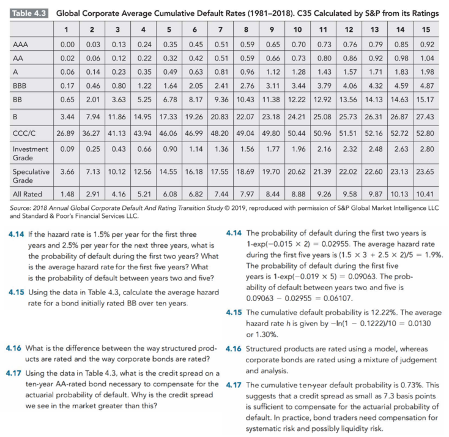
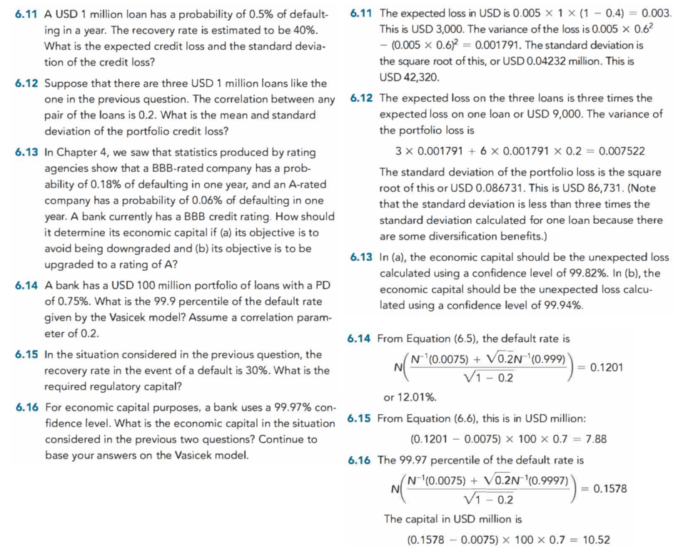

### 银行的信用风险资本

####    信用风险监管资本

-   信用风险监管资本：信用损失概率分布 99.9% 分位点对应的损失与预期损失的差额，即此情况下的 **非预期损失**
    $$ RegCap = (WCDR - PD) * EAD * LGD $$
    -   *Worst Case Default Rate* 最差情况损失违约率：经济状态处于较差的 99.9% 分位数点时对应违约概率
    -   使用内评法 *Interval Rating Based* 估计
    -   使用 *Vasicek* 模型估计 *WCDR*
        -   *Gaussian Copula Model*：通过分位点映射方法将 **违约概率影响因子** 转换为标准正态分布
        -   从满足标准正态分布的风险因子，建立针对各资产违约水平 $U_i$ 的单因子分析模型
            $$\begin{align*}
            U_i &= a_i F + \sqrt {1 - a_i^2} Z_i \\
            \Rightarrow U_i & \sim N(a_i F, 1 - a_i^2) \\
            U_i & \sim N(aF, 1 - a^2) \\
                & \sim N(\sqrt \rho F, 1 - \rho) \\
            \end{align*}$$
            > - $a_i, F, Z_i$：影响因子 $i$ 相关系数、公共因子、特殊因子
            > - $N, N^{-1}$：标准正态分布概率密度函数、概率密度函数逆函数
            > - $a, \rho = a^2$：假设所有风险因子与公共因子相关系数相同、风险因子之间的相关系数
            -   即，资产违约水平 $U_i \leq N^{-1}(PD)$ 时资产 $i$ 违约
            -   公共因子 $F$ 代表当前经济状态，取值越小经济形势水平越小、资产违约水平越小
            -   并进一步假设，各资产违约水平 $U_i$ 相同
                -   即，所有风险因子与公共因子的相关系数相同为 $a$（风险因子间相关系数相同为 $\rho = a^2$）
                -   即，在给定公共因子 $F$ 情况下，$U_i$ 依然同分布
        -   则，在给定经济状态情况下，有
            $$\begin{align*}
            给定经济情况违约概率 &= N(\frac {N^{-1}(PD) - \sqrt \rho F} {\sqrt {1 - \rho}}) \\
            WCDR &= N(\frac {N^{-1}(PD) - \sqrt \rho N^{-1}(0.001)} {\sqrt {1 - \rho}}) \\
            \end{align*}$$
            -   给定经济情况即给定公共因子 $F$ 取值
            -   公共因子 $F$ 用 **极端情况出现的概率** 表示
                -   计算信用风险监管资本即 $N^{-1}(0.001)$

####    信用风险经济资本

-   信用风险经济资本
    -   *Credit Metrics* 模型：为每个借款者赋予一个外部或内部评级
        -   期初（年初），对组合中贷款估值
        -   利用蒙特卡洛模拟贷款一年内评级变化
        -   按模拟期末（年末）结果对贷款池重新估值
        -   计算期末、期初的估值差额作为信用损失

####    信用风险分配

-   风险分配：将资产组合拆解、计算各资产对资产组合风险的贡献
    -   根据 *Euler's Theorem*，若风险度量指标满足齐次性，则可如下拆解得到风险因子 $i$ 的贡献 $Q_i$
        $$\begin{align*}
        Q_i &= \frac {\Delta F} {\Delta X_i / X_i} \\
        且，F &= \sum_{i=1}^n Q_i \\
        \end{align*}$$
        > - $X_i, \Delta X_i, \Delta X_i / X_i$：资产 $i$ 规模、规模变化量、规模变化率
        > - $Q_i$：资产 $i$ 风险指标

> - 齐次性即 $\forall X \in R^n, a \in R, F(X) = aF(X)$，则可假设 $F(X) = \sum_i X_i$，则有上述结论 $F = \sum_i Q_i$

####    信用风险度量挑战

-   度量信用风险的挑战
    -   度量衍生品信用风险挑战
        -   衍生品合约价值具有不确定性
        -   衍生品交易的对手方风险通常是 *Bilateral* 双边的
        -   衍生品交易的净额结算协议：违约时多个衍生品合约可被视为一个合约
    -   量化银行信用风险的挑战
        -   违约概率（评级）的度量：跨周期法、时点法各有侧重
        -   损失率的度量：损失率会随经济状态边改而改变
        -   信用风险敞口的度量：衍生品敞口计算复杂

####    FRM 例题

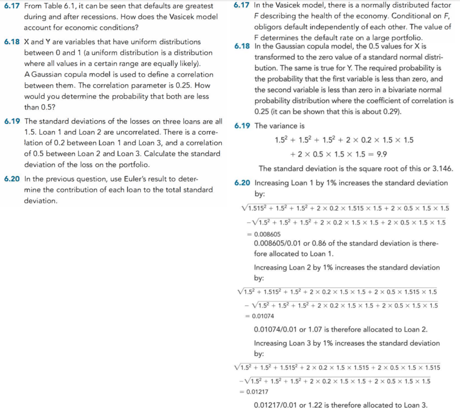

### 国家风险

-   *Country Risk* 国家风险的评估
    -   经济增长：新兴市场处于经济增长周期早期，国家风险更大
        -   衡量经济增长的指标
            -   *GDP Growth Rate* 国内生产总值增速
            -   *Real Growth Rate* 剔除通胀的的实际增速
    -   经济结构
        -   经济结构多样性：单一经济结构容易导致失衡
        -   竞争优势大小：取决于如下条件
            -   *Factor Condition* 要素条件：国家的生产要素
            -   *Demand Condition* 需求条件：本国市场对商品、服务的需求
            -   *Related and Supporting Industries* 相关及支撑产业：是否处于国际竞争力上游
            -   *Firm Strategy, sturcture, and Rivalry* 公司战略、结构和对抗表现：影响公司在国际市场竞争表现
        -   长期增长、短期增长的权衡
    -   政治风险：政治环境变化、政局不稳定、政策法规变化给投资者、企业带来经济损失的风险
        -   政权的连续性 *Continuity*
        -   腐败
        -   暴力冲突
        -   国有化 *Nationalization* 和强行征收 *Expropriation*
    -   法律风险：投资者和企业是否受限制和保护依赖法律规定

-   国家风险的评估机构
    -   专业性评估机构
        -   *Political Risk Service* 政治风险服务公司
        -   *Euromoney* 《欧洲货币》
        -   *The Economist* 《经济学人》
        -   *World Bank* 世界银行：主要考试政治因素、经济因素和金融形式
    -   评估机构提供的评估服务有局限性
        -   没有统一标准
        -   评估方法针对国家政策设计，不一定符合投资者、企业偏好
        -   评估分数只能用于排序，绝对值、差值无意义

####    主权违约风险

-   主权违约：国家或政府支持机构不能按照贷款合同条款规定的方式偿还本金和利息
    -   主权违约风险与国家风险高度相关
        -   主权违约最多的 10 个国家中，有 9 个来自拉丁美洲
    -   主权违约类别
        -   外币债券主权违约
            -   相对而言更可能发生
        -   本币债券主权违约
            -   直觉上可以无限印钞，不应该发生，但
                -   *the Gold Standard* 金本位：没有足够黄金储备金
                -   *Shared Currency* 共享货币：希腊无法印欧元
                -   *Currency Debasement* 货币贬值：权衡后货币贬值后果更严重
    -   主权违约后果
        -   经济增速下降
        -   主权评级下降，融资成本提高
        -   双边、多边贸易报复与制裁
        -   更大概率出现 *Bank Crisis* 银行危机
        -   政局动荡、更迭

####    主权违约风险评估

-   主权违约风险评估
    -   *Sovereign Rating* 国家主权信用评级：按程序、方法对主权国家的政治、经济、信用等级进行评定
        -   主权评级机构
            -   *S&P* 标准普尔
            -   *Moody's* 穆迪
            -   *Fitch* 惠誉
        -   考虑因素
            -   债务水平
            -   退休金和社保负担
            -   税收收入
            -   政治风险
            -   是否获得其他国家和机构的支持
        -   评级完成后，评级机构会对国家的本币、外币债务分别给予评级
            -   本币债务会略高于外币债务
    -   *Sovereign Credit Spread* 主权信用利差
        -   主权信用利差来自于投资承担的额外主权违约风险
            -   故，信用利差可用于描述国家主权债务违约可能性
        -   信用利差的计算来源
            -   债券市场：通过外币债券收益率减去该外币对应本币债券收益率得到
            -   *Sovereign CDS* 主权信用违约互换市场：可从 *CDS Spread* 保费中计算隐含的信用利差
                -   但，互换市场易受流动性不足、投机风险等影响，隐含的信用利差难以精确计算
        -   相较于主权信用评级
            -   更具动态性、更精确
            -   但受市场影响更大，不够稳定

##  操作风险

-   操作风险：由内部流程、人员、系统或外部事件引起的风险，包括黑客、交易员、恐怖主义、系统故障等
    -   操作风险包括法律风险，但不包括策略风险和声誉风险
    -   操作风险事件、来源分类
        -   *Internal Fraud* 内部欺诈
        -   *External Fraud* 外部欺诈
        -   *Employment Practices and Workplace Safety* 就业政策和工作场所安全：不符合就业法规和工作场所安全的行为，或导致支付索赔的行为
        -   *Damage to Physical Assets* 实物资产损坏
        -   *Clients, Products and Bussiness Practices* 客户、产品和商业行为：未能履行对客户的义务造成的损失事件
        -   *Bussiness Disruption and System Failures* 业务中断和系统故障
        -   *Execution, Delivery and Process Management* 执行、交割和流程管理：失败的交易流程管理和各方分歧造成的损失事件
    -   三大操作风险
        -   *Cyber Risk* 网络风险
        -   *Compliance Risk* 合规风险
        -   *Rogue Trader Risk* 魔鬼交易员风险
    -   管理操作风险：后续管理以降低损失频率和损失程度
        -   因果分析
        -   风险控制与自我评估
        -   关键风险指标
        -   教育
        -   保险

### 操作风险资本计量

-   操作风险资本计量
    $$\begin{align*}
    K_{BIA} &= \frac {GI_1 + GI_2 + GI_3} 3 * \alpha \\
    K_{SA} &= \frac {\sum_{i=1}^3 \sum_{s=1}^8 GI_{i,s} * \beta_s} 3 \\
    \end{align*}$$
    > - $GI$：每年总收入
    > - $\alpha$：*BIA* 权重 `15%`
    -   *Basic Indicator Approach* 基本指标法：`过去 3 年每年总收入 * 15%`
        -   负收入分子、分母同步剔除
    -   *Standardized Approach* 标准法：根据将收入划分 8 条业务条线，不同业务线权重不同
        -   同样，总收入为负数则分子、分母同步剔除
    -   *Advanced Measurement Approach* 高级计量法：将损失数据按操作风险事件、业务条线划分至 56 个单元，对每个单元损失数据进行建模、构建单元损失分布再加总
        -   损失数据来源
            -   内部损失数据：银行内部历史发生的操作风险损失数据
                -   *HFLS* 高频低损
                -   *LFHS* 低频高损
            -   外部损失数据：其他机构的损失数据
                -   数据来源
                    -   数据共享
                    -   数据供应商
                -   直接使用外部损失数据估计可能会产生偏误
                    -   大损失才会公布
                    -   银行之间规模不同
            -   情景分析数据：专家提出假设情景，并估计情景损失频率、损失程度
                -   补充低频高损的数据
            -   内控环境数据
        -   单元损失分布构建：分别构建损失频率分布、损失严重程度分布，再将二者合并
            -   *Loss Frequency* 损失频率分布：采用泊松分布建模
            -   *Loss Severity* 损失程度分布：采用对数正态分布建模
            -   用蒙特卡洛模拟法合并两个分布，得到最终单元格损失分布
    -   *Standardized Measurement Approach* 标准计量法：基于银行规模、大型操作风险损失系数计算
        -   不同银行 *AMA* 实现不同，可能导致不同的资本要求，故要求 *Basel* 协会要求弃用 *AMA* 而采用 *SMA*

### 幂律

$$ P(v > x) \approx K x^{-\alpha} $$
> - $v$：随机变量
> - $x$：随机变量分布中位于右尾部分的取值，右侧 `5%` 即 $P(v > x) > 0.95$ 时，$x$ 是合理的
> - $K$：规模参数
> - $\alpha$：尾部参数，越小右尾越肥

-   研究表明，大多数分布的尾部满足幂律公式表现出来的性质
    -   市场风险、信用风险、操作风险的资本计量中，（损失）分布右尾满足幂律

####    FRM 例题

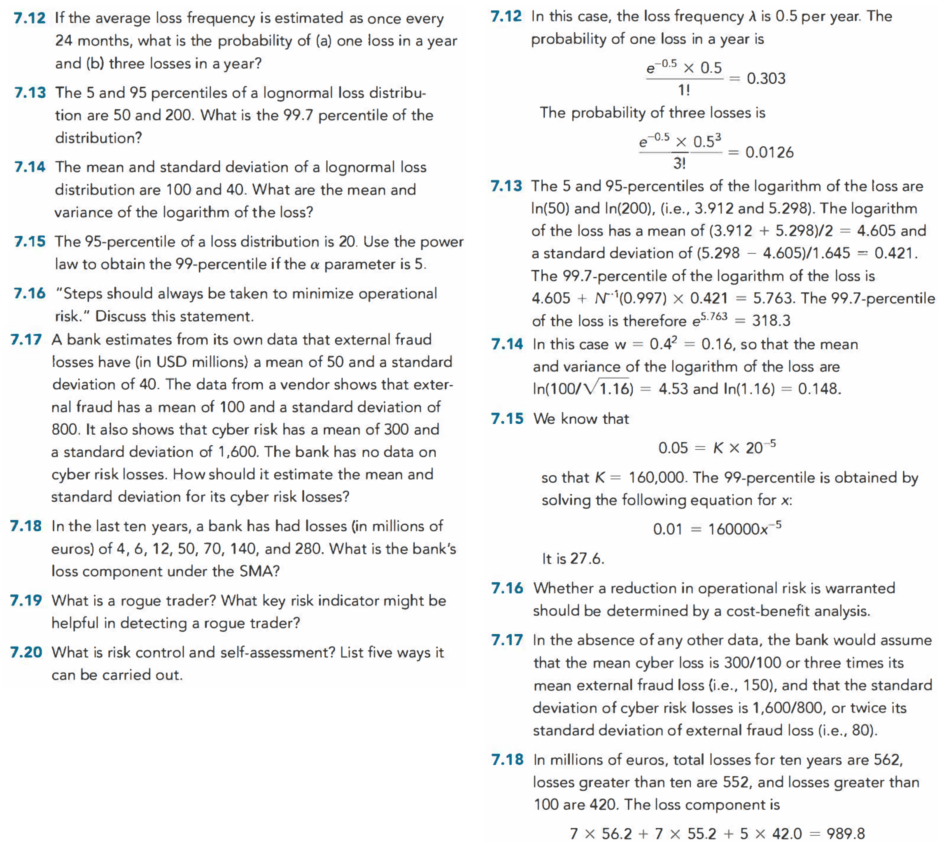

##  压力测试

-   压力测试：评估极端情景对资产组合或金融机构影响的方法
    -   通过估计金融机构面临极端情景的表现，判断是否有充足的资本金、流动资产抵御极端市场场景
    -   主要步骤
        -   情景设置
        -   测试并监督进展
        -   分析结果
        -   制定预案
    -   压力测试的覆盖程度
        -   覆盖时间：压力测试应该在多个时间跨度上进行
        -   覆盖面：压力测试覆盖是的业务条线、投资组合、风险类别，还是整个公司
    -   压力测试考虑了 *VaR*、*ES* 等方法未覆盖的极端场景
        -   前瞻性与后瞻性
            -   压力测试测试金融机构是否有充足资本金，考虑当下、聚焦未来，更有前瞻性
            -   *VaR*、*ES* 根据历史数据计算，认为未来将重复过去，有后瞻性
        -   损失分布假设
            -   压力测试只关注极端市场情况，不估计损失分布
            -   *VaR*、*ES* 需要估计损失分布、确定置信水平
        -   时间跨度
            -   考虑市场风险情况下，*VaR*、*ES* 关注较短时间跨度：10天
            -   压力测试着眼于更长时间跨度：3个月到2年
        -   情景选择范围广度
            -   压力测试只关注较少的不利情况，范围较小
            -   *VaR*、*ES* 需要反映历史的广泛场景，包括有利、不利
    -   *Stressed VaR* 压力在险价值、*Stressed ES* 压力预期亏空：将压力测试与在险价值融合
        -   与普通 *VaR*、*ES* 相比，数据从特别极端的压力时期收集（压力时期一般为 1 年）
            -   考虑压力环境，与当前市场有较大差异
            -   难以回测
        -   **压力时期中的数据间相关性通常会增大**
    -   *Reverse Stress Test* 反向压力测试：自下而上分析风险暴露、机构活动与损失的关系，识别其中风险因素
        -   帮助机构管理其活动，避免极端损失发生

### 压力测试的关键要素

-   压力测试的关键要素
    -   情景选择：首先要确定合适、足够长的时间跨度，以评估情景的全面影响
        -   *Historical Scenarios* 历史情景法：基于历史数据，并假设相关变量行为与过去相同
            -   有时，也会将风险因子乘以系数，将不利情景更极端化
        -   *Stress Key Variables* 关键变量法：假设关键变量发生较大改变
            -   关键变量包括：汇率、大宗商品价格、违约率等
        -   *Ad-hoc Stress Tests* 特定压力测试法：设置一些特定情景，以反映当前经济情况、特殊风险敞口和对未来极端时间的最新评估
            -   历史不会简单重复，需要生成、修改新场景
    -   模型构建：建立核心变量 *Core Variables* 和外围变量 *Peripheral Variables* 的关联
        -   变量在压力市场条件下相关联
        -   极端情景对整个金融市场造成的 *Knock-on Effects* 连锁反应
    -   反向压力测试：分析导致金融机构失败的极端场景
        -   即由果及因，帮助排除不合理的情景
    -   压力测试的监管：除内部压力测试，监管会要求金融机构执行特定压力测试
        -   美联储要求资产超过 500亿美元的银行执行 *Comprehensive Capital Analysis and Review*、*CCAR*
            -   银行需要考虑 4 种情景
                -   *Baseline*：经济预期共识
                -   *Adverse*：经济下降
                -   *Severely Adverse*：严重经济衰退、长期固收资产需求下降
                -   *Internal Scenario*
            -   并提交资本计划、证明模型文件、压力测试结果
            -   *CCAR* 相较于标准压力测试的提升
                -   宏观压力情景需要覆盖多个季度（9 个季度），而仅仅是某个时间点
                -   压力情景涉及多个内在相关联的因素
                -   风险因子变量随情景推进改变
                -   银行资本计划可根据情景推进而改变
                -   通过标准化情景，允许监管对比不同银行的风险暴露、系统性影响
        -   美联储要求资产在 100至500亿美元的银行执行 *DFAST* 测试
            -   *DFAST* 测试不要求提交资本计划

### 压力测试的治理

-   压力测试的治理：有效的治理流程应决定压力测试覆盖程度、充分考虑相关假设、确保压力测试结果被董事会和高观层分析并采取行动
    -   治理结构
        -   董事会和高管层应职责分离
        -   董事会负责顶层设计、最终负责，决定公司风险偏好、风险文化
        -   高管层确保董事会授权的压力测试能合规、按需调整、落地执行，并定期汇报
    -   政策、流程和文件管理
        -   金融机构应该有成文的压力测试政策与流程，并确保被严格遵守
    -   验证和独立审查
        -   压力测试模型的验证比其他模型验证更困难
    -   内部审计
        -   确保压力测试由具有合适资格的员工进行
-   巴塞尔委员会压力测试的基本原则
    -   压力测试框架应有清晰、可采纳的目标
    -   压力测试框架应有效的治理结构
    -   压力测试应被作为一项风险管理工具并影响商业决策
    -   压力测试框架应包含所有重要、相关的风险，并确保使用足够负面的压力情景
    -   资产和组织框架应能满足压力测试框架的目标
    -   应有充足的数据、稳健的 IT 系统支持压力测试
    -   评估情景影响的模型和方法论应该与目标一致
    -   压力测试模型、结果和框架应该接受挑战与定期审查
    -   应加强机构内外部关于压力测试的实践与结果的沟通

#   投资组合理论

##  现代投资组合理论和资本资产定价模型

### 现代投资组合理论

-   *Modern Portfolio Theory* 现代投资组合理论：资产的算数平均数表示资产的期望收益率，方法（标准差）表示资产风险
    -   核心假设：市场上所有投资者都是理性的，根据收益率均值、方差衡量投资组合，并期望将自身效用最大化
        -   对资本市场和资产收益率的假设
            -   市场上无税收和交易成本
            -   信息免费可获得
            -   市场参与者完全竞争
            -   资产收益率服从正态分布
    -   收益与风险的度量
        $$\begin{align*}
        E(R) &= \sum_{t=1}^T R^{(t)} P^{(t)} = \frac {R^{(1)} + \cdots + R^{(T)}} n \\
        E(R_P) &= \frac {(P_0 w_A) R_A + (P_0 w_B) R_B} {P_0} = w_A R_A + w_B R_B \\
        \sigma_P^2 &= w_A^2 \sigma_A^2 + w_B^2 \sigma_B^2 + 2 w_A w_B \rho_{A,B} \sigma_A \sigma_B \\
        w_A + w_B &= 1 \\
        \end{align*}$$
        > - $R^{(t)}, P^{(t)}$：历史第 $t$ 期收益率、出现概率（假设出现概率相同）
        > - $R_A, R_B, R_P$：单一资产 $A, B$、资产组合 $P$ 的预期收益率
        > - $P_0, w_A, w_B$：初始投资额、投资权重
        > - $\sigma_A, \sigma_B, \sigma_P$：单一资产 $A, B$、资产组合 $P$ 的方差
        > - $\rho_{AB}$：资产 $A,B$ 的收益的相关系数
        -   预期收益率 $E(R)$：资产或资产组合过去的收益的算数平均数度量风险资产或资产组合的预期收益率
            -   假设
                -   过去收益率分布与当前分布一致
                -   收益率出现概率 $P^{(t)}$ 相同
            -   持有期收益率 $R = \frac {P_1 + D_1 - P_0} {P_0} $（$P_1, P_0$ 期末价格、期初价格，$D_1$ 持有期收益）
        -   风险：风险资产或资产组合过去收益率的 *Variance* 方差 $\sigma^2$ 或 *Standard Deviation/Volatiliy* 标准差 $\sigma$
            -   即，根据过去收益率波动情况估计未来收益的不确定性
            -   只要 $\rho_{A,B} < 1$，资产组合的标准差就小于各风险资产的标准差的加权平均，可以降低方差（风险）

####    投资者类型

-   投资者类型
    -   *Risk Averse* 风险厌恶者：同样期望水平下偏好风险较小的资产组合
    -   *Risk Neutral* 风险中性者
    -   *Risk Seeking* 风险偏好者

####    资产组合可行集

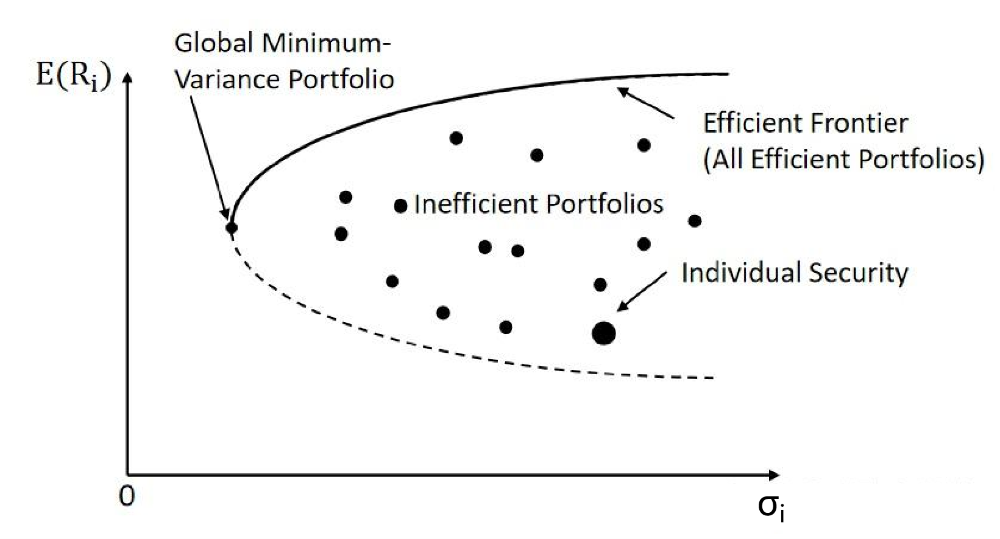

-   资产组合可行集：$N$ 种资产构建的可行集区域
    -   *Minimum-Variance Frontier* 最小方差前沿：资产组合可行集的左侧边界
    -   *Global Minimum-Variance Frontier* 全局最小方差组合：资产组合可行集的中方差最小的点
    -   *Efficient Frontier* （风险资产、马科维茨）**有效前沿**：*GMVF* 上方的最小方差前沿
        -   有效前沿上的投资组合在相同回报水平下方差最小、相同风险水平下回报最高

####    *CAL* 资本配置线

$$\begin{align*}
E(R_P) &= w_{r} E(R_r) + w_f R_f \\
\sigma_P &= w_r \sigma_r \\
w_r + w_f &= 1 \\
E(R_P) &= R_f + \frac {E(R_r) - R_f} {\sigma_r} \sigma_P \\
\end{align*}$$
> - $E(R_r), \sigma_r, R_f$：风险资产组合期望收益率、标准差，无风险资产收益率
> - $w_r, w_f$：资产组合 $P$ 中风险资产组合、无风险资产权重
> - *Sharpe Ratio* 夏普比率：$\frac {E(R_r) - R_f} {\sigma_r}$

-   *Capital Allocation Line* 资本配置线：*风险-收益* 坐标系中，以无风险利率 $R_f$ 为截距、穿过点 $(\sigma_r, E(R_r))$ 的直线
    -   点 $(\sigma_r, E(R_r))$ 将 *CAL* 分为两部分
        -   左侧部分 $0 < w_r,w_f < 1$：资本部分投资到风险资产中，剩余投入到无风险资产中
        -   右侧部分 $w_r > 1, w_f < 0$：资本全部、并额外借入无风险资本投资到风险资产中
        -   风险厌恶投资者根据自身风险偏好在 *CAL* 上选择，决定风险资产、无风险资产配置比例
    -   *CAL* 从 **简化的风险资产组合、无风险资产二元资产配置** 出发，建立 *风险-收益* 模型
        -   而，最终模型直接引入资产组合风险（波动）$\sigma_P$ 作为因变量（而不是风险资产配置比率 $w$）
        -   则，模型适用范围扩展到 **任意资产组合的预期收益与其风险的关系**
        -   并，得以引入 *CML*
    -   *Optimal CAL* 最优资本配置线：与有效前沿相切的 *CAL*
        -   加入无风险资产后，理性风险厌恶投资者将仅在 *OCAL* 上选择最优投资组合
            -   更大斜率的资产组合不存在
            -   更小斜率资产组合无效：承担每单位风险所获得收益较小
        -   *Optimal Risky Portfolio* 最优风险组合：*OCAL* 与有效前沿的切点
            -   最优风险组合仅表示 **不包含无风险资产** 情况下最优的资产配置

### *CAPM* 资产定价模型

-   *Capital Asset Pricing Model* 资产定价模型：基于风险资产预期收益均衡基础上的预测模型
    -   任何风险资产的总风险由系统性风险和非系统性风险组成
        -   *Unsystematic Risk/Firm-Specific Risk/Idiosyncratic Risk* 非系统性风险、公司特有风险、可分散风险：总风险中扣除系统性风险以外的偶发性风险
            -   可通过资产组合的多样化分散、消除
            -   成因
                -   公司经营管理水平
                -   所属产业、行业变动
                -   人事变动
                -   人为因素
        -   *Systematic Risk* 系统性风险、不可分散风险、市场风险：宏观政治和经济因素导致的风险
            -   无法通过投资组合分散、减少或者消除
            -   成因
                -   经济周期循环波动
                -   货币供给、*GDP*、通胀、利率变动
                -   大选、战争等重大政治事件
                -   财金政策、国有化政策等关系到经济活动的政策变动
    -   *CAPM* 模型核心假设：所有投资者根据资产组合理论进行投资决策
        -   市场信息均免费可用，并反映在资产价格
        -   投资者预期相同
        -   投资者根据收益率均值、方差进行投资决策
        -   市场无交易费用
        -   资产无限可分
        -   投资者可以相同无风险利率借入、贷出资金
        -   投资者都是价格接受者，即交易行为不影响资产价格

####    *Market Portfolio* 市场组合、*CML*

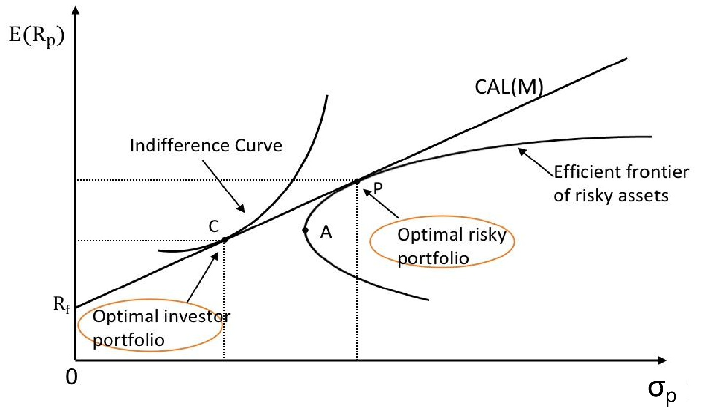

-   *Market Portfolio* 市场组合：若 **所有投资者预期具有同质性**，那所有投资者都具有相同的马科维茨有效前前沿和最优风险组合，此最优风险组合即为市场组合
    -   *Capital Market Line* 资本市场线：**投资者同质性假设** 下的 *OCAL*（所有投资者共享相同的最优资本配置线）
        $$ E(R_P) = R_f + \frac {E(R_M) - R_f} {\sigma_M} \sigma_P $$
        -   所有投资者都在 *CML* 线上，按不同权重配置市场组合 $M$、无风险资产 $R_f$
        -   *CML* 描述了有效投资组合（最优风险组合）的预期收益率与其风险之间的联系
    -   市场均衡假设下，市场组合是 **市场中所有风险资产的组合**，权重为其市值占所有风险资产市值的比重
        -   实践中，股票市场指数可视为是市场组合

####    $\beta$ 值、*Market Model*

$$\begin{align*}
\beta_i &= \frac {Cov(R_i, R_M)} {\sigma_M^2} = \frac {\sigma_i \sigma_M \rho_{iM}} {\sigma_M^2} = \rho_{iM} \frac {\sigma_i} {\sigma_M} \\
\beta_M &= \frac {Cov(R_M, R_M)} {\sigma_M^2} = \frac {\sigma_M^2} {\sigma_M^2} = 1 \\
\beta_P &= \sum_1^n w_i \beta_i = w_1 \beta_1 + \cdots + w_n \beta_n \\
\end{align*}$$
> - $R_i, R_P, R_M$：资产 $i$、投资组合 $P$、市场投资组合 $M$ 回报率
> - $\rho_{iM}$：资产 $i$ 与市场投资组合 $M$ 收益的相关系数

-   $\beta$ 值：风险资产的收益率对整个市场宏观条件的敏感系数，度量资产的系统性风险
    -   $\beta$ 值代表资产总风险中无法分散、希望得到补偿的部分
        -   $\beta$ 值可正可负，取决于资产回报 **与市场投资组合回报之间的关系**
            -   无风险资产的 $\beta$ 值为 0
            -   市场投资组合自身的 $\beta$ 值为 1
            -   $\beta > 1$ 的资产被认为是 *Aggressive* 激进的，比市场波动大
            -   $\beta < 1$ 的资产被认为是 *Defensive* 防御性的，比市场波动大
        -   也即 **资产的系统性风险**

$$ R_i^{(t)} - R_f = \alpha_i + \beta_i (R_M^{(t)} - R_f) + \epsilon_i^{(t)} $$
> - $R_i^{(t)}, R_f, R_M^{(t)}$：资产 $i$ 在 $t$ 期收益率、无风险收益率、市场组合 $M$ 在第 $t$ 期收益率
> - $\alpha_i, \beta_i, \epsilon_i^{(t)}$：截距项、$\beta$ 值、残差项

-   *Market Model*：根据实际收益率数据建立的关于资产 $i$ 超额收益 $R_i - R_f$、市场组合超额收益 $R_M - R_f$ 的线性回归模型
    -   实践中，资产 $i$ 的 $\beta$ 值即通过建立 *Market Model*、求解回归系数得到
        -   敏感度 $\beta$ 不是相关系数 $\rho$，而线性回归的系数
            -   还需要考虑资产自身波动情况
            -   即，需要额外乘以波动比例 $\rho \frac {\sigma_i} {\sigma_M}$
        -   残差项 $\epsilon$ 即非市场风险
    -   *CAPM* 模型是均衡价格模型，*Market Model* 是经验模型
        -   *CAPM* 基于预期、不可观测变量建立
        -   对，具体的某个资产，可能不满足 *CAMP* 模型，即 $\alpha_i \neq 0$

####    *SML* 证券市场线

$$ E(R_i) = R_f + \beta_i (E(R_M) - R_f) $$
> - $E(R_i), E(R_M), R_f$：风险资产 $i$ 预期收益率、市场组合 $M$ 预期收益率、无风险收益率

-   *Security Market Line* 证券市场线：**根据资产的系统性风险对资产定价**（即 *CAPM* 模型的图形表达）
    -   $\beta_i$ （自变量）是风险资产 $i$ 的 $\beta$ 值，即其 **系统性风险**
        -   $E(R_M) - R_f$：市场 *Excess Return* 超额收益、*Risk Premium* 风险溢价
        -   $\beta_i(E(R_M) - R_f)$：风险资产 $i$ 进行系统性风险调整后的市场风险溢价
    -   资产的期望收益率应等于无风险收益率加上系统性风险调整后的风险溢价
        -   非系统性风险可以通过资产分散化消除，所以市场不会对非系统性风险补偿
        -   即，**资产的非系统性风险不参与资产的风险定价**
        -   *SML* 线下方资产（组合）价格被高估 *Overpriced/Overvalued*、上方被低估 *Underpriced/Undervalued*
    -   *SML* 中仅使用资产的市场风险 $\beta$ 用作定价，忽略非系统风险部分，似乎考虑不充分，但
        -   情况 1：待考察资产只是总资产的一部分
            -   **其非市场风险部分已经被总资产中其他资产对冲**
            -   从总体角度考虑则 **所有资产均无需、不应该考虑非市场风险部分**
        -   情况 2：待考察资产总能通过对冲分散其非系统风险部分
        -   情况 3：待考察资产已充分分散（即市场组合），则只包含系统风险

####    *CML* 与 *SML*

|          | *CML*                                                | *SML*                                |
|----------|------------------------------------------------------|--------------------------------------|
| 线上资产 | **有效投资组合**                                     | 被 **正确定价** 的风险资产或投资组合 |
| 横轴     | 资产总风险 $\sigma$                                  | 系统风险 $\beta$                     |
| 斜率     | 市场组合的夏普比率 $\frac {E(R_M) - R_f} {\sigma_M}$ | 市场风险溢价 $E(R_M) - R_f$          |
| 应用     | 资产配置（市场组合、无风险资产配置）                 | 资产（证券）选择（定价）             |

-   *SML* 与 *CML* 线本身是一致的，仅因 **因变量差异而相差 $\sigma_M$ 比例**
    -   **二者都仅考虑系统风险部分**
        -   *CML* 线上资产定义市场组合，本身只包含系统性风险
        -   *SML* 线上资产忽略非系统性风险
    -   *CML* 线偏离（下）：资产的非系统性风险变动（增加）、预期收益变动
        -   连接 $(0, R_f)$、偏离点得到该资产组合 *CAL*
        -   *CML* 线上资产不存在
        -   *CML* 线本身基于市场组合（与无风险资产），**其风险被定义、被视为系统性风险**（$\beta$ 值定义、计算即依赖市场组合预期收益率 $R_M$ 计算）
    -   *SML* 线偏离（上、下）：资产的系统性风险、价值变动
        -   过偏离点、平行 *SML* 线得到：系统风险相同、有超额收益损失（未被正确定价）的股票
        -   连接 $(0, R_f)$、偏离点得到：系统风险不同、无超额收益损失（已被正确定价）的股票
    -   即，二者在线变动差异时关注的侧重点、考察原因不同

### 业绩度量

| 指标           | 风险度量                          | 理论来源 | 说明                  |
|----------------|-----------------------------------|----------|-----------------------|
| *SPI*          | 总风险 $\sigma$                   | 组合理论 | 未分散、全部资产组合  |
| *TPI*          | 系统风险 $\beta$                  | *CAPM*   | 已分散、部分资产筛选  |
| *Jensen Alpha* | 系统风险 $\beta$                  | *CAPM*   | 相同 $\beta$ 资产排序 |
| *SR*           | 下行风险 $SSD$                    |          |                       |
| *TE*           | 偏离指数风险 $\sigma_{R_P - R_B}$ |          | 配合 *IR* 评估收益    |

-   业绩度量比率
    -   *Sharpe Performance Index* 夏普比率：度量承担 **单位总风险** 可以获得的超额收益
        $$ SPI_P = \frac {E(R_P) - R_f} {\sigma_P} $$
        -   即 *CAL* 斜率
        -   单位总风险：适合评估非充分分散组合的业绩
    -   *Treynor Performance Index* 特雷诺比率：度量承担 **单位系统性风险** 可以获得的超额收益
        $$ TPI_P = \frac {E(R_P) - R_f} {\beta_P} $$
        -   对 *SML* 上资产（组合），有
            $$ E(R_M) - R_f = \frac {E(R_P) - R_f} {\beta_P} = TRI_P $$
            -   则，可通过比较资产组合、市场组合的特雷诺比率判断资产组合是否获得合理回报率
        -   单位系统风险：适合评估已充分分散组合的业绩
    -   *Jensen's Performance Index* 詹森阿尔法：资产组合超过 *CAPM* 理论预期的超额收益
        $$\begin{align*}
        \alpha_P &= R_P - (R_f + \beta_P (E(R_M) - R_F)) \\
        \end{align*}$$
        -   即，组合实际收益与 *CAPM* 计算的弥补系统性风险的理论收益的差值
            -   即，通过对 $R_P - R_F$ 回归计算 $\beta_P$ 的截距项
        -   只有 $\beta$ 相同情况下，比较 $\alpha$ 才有意义
    -   *Sortino Ratio* 索提诺比例：类似 *SPI*，使用 *Minimum Acceptable Return* 最小可接受收益率、*Semi-Standard Deviation* 半标准差替代 *SPI* 中 $R_f, \sigma_P$
        $$\begin{align*}
        SR &= \frac {E(R_P) - MAR} {\sqrt {\frac 1 N \sum_{t=1}^N min(0, R_P^{(t)} - MAR)}}
            = \frac {E(R_P) - MAR} {SSD} \\
        SSD &= \sqrt {\frac 1 N \sum_{t=1}^N min(0, R_P^{(t)} - MAR)}
        \end{align*}$$
        > - *SSD* 半标准差：低于 *MAR* 的收益率的波动性，度量收益率的下行风险
        -   适合衡量回报不对称的组合绩效：承担单位下行风险可获得的超额收益率
    -   *Tracking Error* 追踪误差：积极管理的组合收益率与基准收益率（大盘指数收益率）之间差异的标准差
        $$ TE = \sigma_{R_P - R_B} $$
        > - $R_P, R_B$：积极管理的组合收益率、基准组合的收益率
        -   度量资产组合与基准组合的风险差异
            -   跟踪指数的基金要求被要求将 *TE* 维持在固定水平之下
    -   *Infomation Ratio* 信息比率：资产组合 **相对于特定指数的超额风险** 带来的超额收益
        $$ IR = \frac {E(E_P) - E(R_B)} {\sigma_{R_P - R_B}} = \frac {E(R_P) - E(R_B)} {TE} $$
        -   可视为主动管理的超额收益
            -   配合 *TE* 用于基准管理
            -   判断主动管理资产组合偏离限定基准而承担的额外风险，是否可被足够收益弥补

##  因素模型和套利定价理论

### 因素模型

-   因素模型
    -   影响风险资产收益的因素
        -   *Macro-Economic Factor* 宏观经济因素、公共因素
            -   对所有风险资产收益率均有影响，其带来的收益的不确定性即系统风险
        -   *Firm-Specific Factor* 公司特有因素
            -   与公司个体相关，其带来的收益不确定性即非系统性风险
    -   *Single-Factor Model* 单因素模型：假设多个资产收益率仅与单个因素相关
        $$ R_i = E(R_i) + \beta_i F + \epsilon_i $$
        > - $\beta_i, F$：资产 $i$ 对公共因素的敏感程度、公共因素的偏离预期值的离差
        > - $\epsilon_i$：资产 $i$ 特有的随机干扰项
        -   即每个风险资产在一定程度上受该因素水平影响，**可用此因素变动解释所有风险资产收益的共同变动**
    -   *Multi-Factor Model* 多因素模型：使用两个或两个以上因素解释所有风险资产收益的共同变动
        $$ R_i = E(R_i) + \sum_{j} \beta_{i,j} F_j + \epsilon_i $$
        > - $\beta_{i,j}, F_j$：资产 $i$ 对公共因素 $j$ 的敏感程度、公共因素 $j$ 的偏离预期值的离差

### 套利定价理论

-   *Arbitrage Pricing Theory* 套利定价理论：**从市场的套利中确定资产价格**（而不是基于资产收益率均值、方差）
    -   基本假设
        -   资产收益率可被系统性风险因子解释
        -   市场有足够多争证券可用于分散化投资，降低非系统风险
        -   市场处于均衡状态时，不存在任何套利机会 *no arbitrage opportunity*
            -   若资产定价出现偏差，则存在套利机会
            -   投资者将通过套利迫使资产市场价格回到均衡水平（市场恢复均衡状态）
    -   *Arbitrage* 套利：无需净投资即可赚取无风险利润
        -   无须使用套利者任何资金：通过借款、卖空资产获取资金购买标的资产
        -   不承担任何风险却可以实现超额收益
    -   *Law of One Price* 一价定律：若两种金融工具在所有经济性方面（如未来现金流等）均相同，则两种金融工具价格应相同
        -   一价定律即套利定价的理论来源
        -   若一价定律被违反，则资产价格被市场高估或低估，产生套利机会

### *APT* 多因素模型

-   *APT* 多因素模型
    $$\begin{align*}
    E(R_P) &= R_f + \sum_{j} \beta_{P,j} (E(R_{P,j}) - R_f)  \\
        &= R_f + \sum_{j} \beta_{P_j} \lambda_j \\
    \lambda_j &= E(R_{P,j}) - R_f \\
    \end{align*}$$
    > - $\beta_{P,j}, \lambda_j$：投资组合 $P$ 对因素 $j$ 的敏感度、因素 $j$ 的风险溢价
    -   *Pure Factor* 纯因素组合：若资产组合 $P$ 中仅 $\beta_{P,j^{'}} = 1$，其余为 0 时，该资产组成被称为纯因素组合
    -   *APT* 模型相较于 *CAPM* 模型
        -   将资产的预期收益率的依赖由系统性风险确定为（多个）系统性风险风险因子
        -   只假设市场不存在套利机会，不要求投资者风险厌恶

-   *Fama-French Model* 法玛-费伦奇的三要素模型
    $$\begin{align*}
    E(R_i) - R_f = \alpha_i + \beta_{i,M} (E(R_M) - R_f) + \beta_{i,SMB} SMB + \beta_{i,HML} HML
    \end{align*}$$
    -   三因素
        -   $E(R_M - R_f)$：宏观经济因素的系统性风险
        -   $SMB$ 小减大：小市值股票投资组合比大市值股票投资组合多出的收益
        -   $HML$ 高减低：高 *账面-市值比 Book-to-Market Value* 股票投资组合比低 *账面-市值比* 的股票投资组合高出的收益
    -   长期研究发现：公司市值、账面-市值比可用于预测平均股票收益
        -   故，使用 *SMB*、*HML* 两个（市场整体的）公司特征 **作为多个系统性风险因素的代理变量**
        -   否则，在 *APT* 模型需要引入过多系统风险因素
    -   五因素模型额外添加
        -   $RMW$ 稳健、弱小：*Operating Profit* 营业利润稳健公司比营业利润弱小公司高出的收益
        -   $CMA$ 保守、激进：投资保守的公司比投资激进公司高出的收益

##  金融衍生品

-   *Derivatives* 衍生品：基于 *Underlying Assets* 标的资产派生而来的金融产品
    -   衍生品的本质：具有法律效力的合约 *Contract*
        -   合约规范合约双方的权利、义务
        -   *Buyer/Holder* 买方：买入衍生品合约者、衍生品合约多头、持有衍生品多头头寸 *Long Position*
            -   多头在标的资产价格上升时获利
        -   *Seller/Writer* 卖方：卖出衍生品合约者、衍生品合约空头、持有衍生品空头头寸 *Short Positiion*
            -   空头在标的资产价格下降时获利
    -   标的资产涵盖范围广阔，根据标的资产类型对衍生品分类
        -   金融衍生品
            -   权益类证券：股票
            -   固收类证券：债券
            -   货币：利率
            -   衍生品自身
                -   股票期权：以股票作为标的资产
                -   但，*FOF*、*ETF* 一般不被视为衍生品，即使其存在标的物
        -   实物资产商品
            -   大宗商品
                -   能源
                -   基础原材料
                -   农副产品
        -   其他衍生品：天气、气温、自然灾害、竞选
    -   衍生品价格依赖（衍生于）对应的标的资产，根据衍生品收益 *Payoff* 与标的资产价值关系分类
        -   *Linear Derivatives* 线性衍生品：收益与标的资产价值成线性关系
            -   远期
            -   期货
            -   互换
        -   *Non-Linear Derivatives* 线性衍生品：收益与标的资产价值成非线性关系
            -   期权
    -   衍生品应用
        -   管理各类风险
        -   公司债券中嵌入衍生品，使得公司有权提前赎回债券、债券持有前提前回售债券
        -   薪酬计划中嵌入期权
        -   投资计划中内嵌期权
        -   抵押贷款中嵌入衍生品

##  衍生品市场

| 衍生品 | 说明                                           |
|--------|------------------------------------------------|
| 远期   | 未来交易                                       |
| 期货   | 交易价可变未来交易                             |
| 互换   | 期初、期末反向交易，即无实质交易，仅存续期互换 |
| 期权   | 单方面可选交易                                 |

-   衍生品市场
    -   *Exchange-Traded Markets* 交易所交易市场、场内市场：为金融工具提供集中交易的场所和平台
        -   主要指证券交易市场、期货交易市场，流通市场的核心
            -   交易场所最初即提供会面、达成协议的场所
                -   电子化交易导致场内公开喊价交易迅速减少
                -   期权合约的结构复杂、策略多样，短期无法完全电子化，部分仍在交易大厅进行
            -   根据国家证券法律规定有组织、规范进行
        -   市场规模：按标的资产价值计量
        -   交易特点
            -   合约标准化、期限较短
            -   无违约风险
            -   监管严格
            -   交易透明
            -   连续交易，流动性较强
    -   *Over-the-Counter Markets* *OTC* 市场、场外市场：没有集中、统一的交易制度、场所，由买卖双方议价交易
        -   市场参与者
            -   *Dealer* 交易商：大型金融机构，充当买卖双方的对手方，通过低买高卖赚取差价
                -   *Interdealer Brokers* 经纪商：交易商通过经纪商与其他交易商交易，避免透露信息
            -   *End User* 最终使用者：企业、基金公司及其他金融机构，利用衍生品管理风险
        -   交易特点
            -   *Customized Contract* 合约个性化：无固定合约模板、期限较长
            -   清算方式灵活：双边结算，可自定约定清算条款、抵押品等
            -   存在违约风险
            -   缺少监管
            -   交易不透明
            -   间歇性交易，流动性较差、保证金计算困难
        -   市场规模：按名义本金计量，体量大得多

> - *Spot Market* 现货市场：衍生品对应的标的资产市场

### 市场参与者

-   市场参与者
    -   *Hedger* 对冲者：使用衍生品工具消除风险敞口
    -   *Speculators* 投机者：希望承担风险并获得回报
        -   衍生品具有高杠杆性、高风险，可以以小投资博取大收益
    -   *Arbitrageurs* 套利者：利用两个或两个以上市场间价格差异套利
        -   套利机会不会一直存在，资产价格将随将随套利活动而趋同

### 场内市场风险管理

-   交易所市场信用风险管理
    -   *Margin* 保证金制度：
        -   保证金：投资者必须向经济人、交易所存入的抵押品，以弥补合约持有人面临的信用风险
        -   管理交易者违约风险
        -   零售交易者本身需要直接、间接（通过中间交易商）与清算会员建立保证金账户
            -   初始保证金
                -   逐日结算产生利润、损失将变动保证金账户
                -   超过初始化保证金要求的资金可以被提取
                -   *Maintenance Margin* 维持保证金：初始保证金的 75%
                    -   保证金账户余额低于维持保证金水平将收到交易所 *Margin Call* 保证金催缴要求
            -   *Options on Stocks* 股票期权（*CBOE* 规定）：仅期权卖出方需缴纳
                -   *Short Call Option* 卖出看涨期权
                -   *Short Put Option* 卖出看涨期权
            -   *Short Sales* 融券
            -   *Buying on Margin* 融资
    -   *Netting* 净额结算制度：
        -   净额结算：证券登记结算机构以结算参与人为单位，对其买入、卖出交易的余额轧差，以轧差得到的净额组织结算参与人交收
        -   但交易相关各方信用质量可能不同，需要保证金制度发挥作用

####    *OTC* 市场风险管理

-   *OTC* 市场信用风险 *Credit Risk* 管理
    -   *Bilateral Netting* 双边净额结算：交易双方约定主协议 *Master Agreement*，并应用于双方交易的所有衍生品，若某方违约，则现存衍生品交易合为一笔
    -   *Collateral* 抵押担保：主协议中 *Credit Support Annex* 信用支持附件明确抵押品证券的类别、价值计量
        -   衍生合约价值每日计量，根据净额确定是否需要增加抵押品
-   其他信用风险管理手段
    -   *Special Purpose Vechicles/Entities* 特殊目的实体
        -   购买、包装证券化资产和以此为基础的证券化产品
        -   目的：实现破产隔离 *Bankruptcy Isolation*
    -   *Derivatives Product Companies* 衍生产品公司：券商、银行成立的子公司，代表母公司交易衍生品
        -   母公司通过手段使得衍生产品公司获得高评级，而自身评级可很低
    -   *Credit Default Swap* 信用违约互换：买卖双方签订的类似保险合同
        -   买方定期支付保费
        -   若合约指定实体违约，则卖方赔付

### *CCP* 机制

-   *Central Counterparties* 中央对手方机制
    -   *CCP*：在结算过程中介入证券交易买卖双方之间，成为 “买方的卖方”、“卖方的买方”，并保证交易执行
        -   合约更替：介入原始交易双方，使用两张合约替代原合约关系
        -   担保交收：优先保证合约履行，即使存在一方违约
            -   *CCPs* 不承担信用风险，违约发生后，*CCPs* 会强制平仓会员头寸
    -   *CCP* 机制的信用风险管理
        -   *Net* 净额结算：*CCP* 对每个交易者有净头寸
            -   多边净额结算一般要求结算机构作为 *CCP*，作为所有结算参与人唯一交易对手
        -   *Daily Settlment* 每日结算：每个交易日结束后，*CCP* 根据当日盈亏状态对投资者账户进行结算，并根据结算价格确定收益
            -   比较当日、前日结算价格确定多、空方盈利、亏损
                -   若市场波动剧烈，追加保证金频率将会高于一日一次
            -   亏损方将 *Variation Margin* 变动保证金支付给 *CCP*、*CCP* 支付给盈利方
                -   确保交易者当日无负债
                -   零和游戏，*CCP* 参与现金划拨，但无需动用自身资金
        -   *Initial Margin* 初始保证金：清算会员开仓时需要期货合约规定，按合约规模缴纳一定比率金额作为初始保证金
            -   清算会员可使用证券代替现金充当保证金
                -   根据市场面值、折扣比例折算
            -   *CCP* 可根据市场情况调整保证金比率
                -   *CCP* 对初始化保证金支付利息
            -   *CCP* 对保证金金额结算，清算会员仅需收支轧差后净额
        -   *Skin In The Game* 风险共担原则
            -   鼓励 *CCPs* 尝试好的保证金新制度
            -   使关于违约的各类资源相互作用，鼓励建立健康稳定的违约基金度量体系
        -   *Default Fund Contribution* 违约基金：会员违约时且其保证金无法弥补损失时，需要违约基金补偿
            -   偿付损失顺序
                -   违约方初始保证金
                -   违约方违约基金
                -   其他成员违约基金
    -   *CCPs* 优势
        -   担保交收：即使买卖中某方无法履约，*CCP* 应当先向守约方履约
            -   承接了交易双方的对手方风险，避免个别交易结算参与人违约导致连锁交收失败
        -   快速平仓：参与者可与 *CCP* 反向交易平仓
        -   风险共担：违约风险由所有会员共担，降低系统性风险
        -   提高流动性：方便的退出渠道、标准化合约，提高（场外）市场流动性
    -   *CCPs* 缺点
        -   道德风险与逆向选择：市场参与者丧失管理风险动力
        -   加剧顺周期性：追加保证金要求可能导致机构流动性枯竭
        -   信用风险评估不易：风险共担使得会员难以评估自身承担的信用风险
    -   *CCPs* 面临的风险
        -   *Correlation Risk* 相关性风险：会员违约之间的正相关性
            -   监管要求 *CCPs* 对多个会员同时违约的情景分析
        -   *Model Risk* 模型风险：场外 *CCPs* 更依赖模型计算会员吃初始保证金、追加保证金
        -   *Liquid Risk* 流动性风险：初始保证金可供投资，要保证在市场恶劣情况下的流动性

####    *OTC CPPs*

-   *OTC CCPs* 运作类似交易所 *CCPs*，在次贷危机后更广泛应用
    -   *OTC CPPs* 职能
        -   清算方式：标准化场外衍生品必须通过 *CCPs* 进行清算
        -   交易方式：标准化场外衍生品必须通过电子平台进行交易，提高价格透明度
            -   交易信息向所有市场参与者公开
        -   报告方式：场外市场交易需要统一进行报告
    -   标准化衍生品是 *CCPs* 可以负责清算的交易
        -   特征
            -   法律和经济条款标准化
            -   金融产品有统一、可接受的估值模型，用于计算追加保证金
            -   交易活跃，方便平仓
            -   有足够多历史数据，以便进行初始保证金计量
        -   标准化衍生品
            -   外汇互换 *FX Swaps*
            -   标的为指数的信用违约互换 *CDS*
    -   非标准化衍生品通常双边清算，为防止做市商通过非标化逃避 *CCPs*、监管
        -   非标准化衍生品也需要缴纳初始保证金给信托，覆盖 10天、99% 置信度的最大损失
        -   追加保证金直接支付给对手方

### FRM 例题

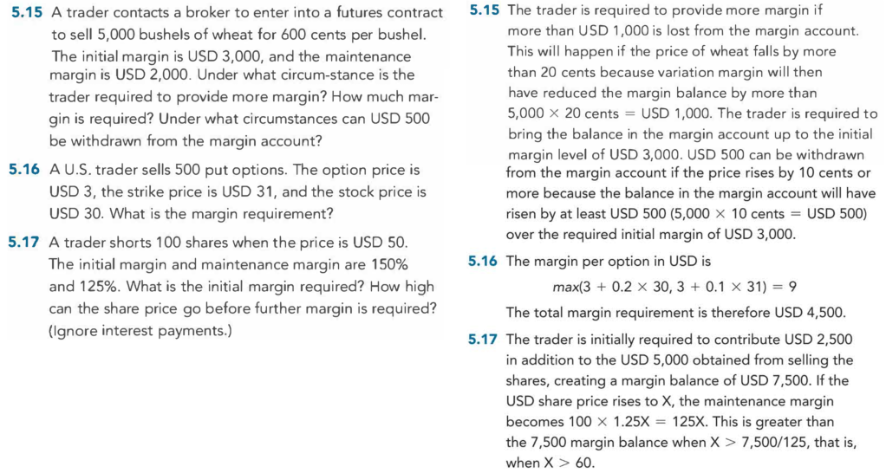

#   远期、期货、互换

##  远期、期货

| 期货合约                         | 远期合约       |
|----------------------------------|----------------|
| 场内交易                         | 场外交易       |
| 标准化合约                       | 个性化合约     |
| 清算所保证期货交易、降低违约风险 | 违约风险大     |
| 监管力度大                       | 监管力度小     |
| 保证金要求                       | 无保证金要求   |
| 每日盯市制度，确保当日无负债     | 到期时结算收益 |
| 通常在到期前平仓                 | 往往实物交割   |

> - *Closed Out* 平仓、平头寸：期货交易者买入、卖出与其所持有的期货合约的品种、数量、交割月份相同但交易方向相反的期货合约以了结期货交易的行为，即反向交易

-   *Forward* 远期合约：买卖双方约定在未来时刻，多头以 **约定价格** 从空头购买标的资产、给出资金
    -   场外衍生品合约
    -   合约中事先约定
        -   资产品级
        -   交易数量
        -   交易方式
        -   交易价格、远期价格 *Forward Price*
    -   远期合约收益 *Payoff*
        $$ Payoff =
        \begin{cases}
            S_T - K &, 多头 \\
            K - S_T &, 空头 \\
        \end{cases}$$
        > - $K, S_T$：合约约定的远期价格、到期时标的资产价格
        -   多头：收益无限、损失有限（$S_T > 0$ 且无上限）
        -   空头：收益有限、损失无限（$S_T > 0$ 有下限）

-   *Future* 期货合约：标准化 *Standardized*、在期货交易所中交易的合约
    -   标准化：在期货交易所中交易的合约关于标的资产的种类、品级、交割时间、交割数量、交割方式均标准化
    -   标的资产相较于远期合约（常为汇率、利率）更广泛
        -   农产品
        -   金属
        -   股票指数
        -   能源
        -   房地产价格指数
        -   气温
        -   数字货币
    -   期货合约与远期合约相同点
        -   签订合约时不发生现金流交换
        -   **合约价值** 随时间发生变化
            -   到期时，$S_T > K$ 则合约对多头价值 $> 0$、对空头价值 $< 0$

###  期货市场

-   期货交易所
    -   10 大期货交易所
        -   *CME* 集团：全球最大的期货交易所
        -   *the National Stock Exchange of India*
        -   *CBOE Holdings*
        -   *B3*
        -   *NASDAQ*
        -   *Eurex*
        -   *Moscow Exchange*
        -   *Shanghai Futures Exchange*
        -   *Dalian Commodity Exchange*
    -   市场 *Open Interest* 持仓量：某个时点未平仓头寸总和
        -   每个交易日，期货合约持仓量随投资者新开仓、平仓变化
        -   持仓量会从开仓到交割月份结束之间会明显冲高回落
            -   期货合约出现开始，多空双方按预测从多空方向开仓，持仓量放大
            -   交割月份到来之前，持仓量水平提前回落（期货合约基本在到期前反向平仓以了结）

####    期货合约

-   期货合约特点
    -   *Underlying Assets* 标的资产
        -   大宗商品：实际交割资产品级需要非常明确
    -   *Contract Size* 合约规模
        -   需要设计，以同时吸引零售客户、大型机构
        -   金融资产合约通常规模较大，农产品合约规模较小
    -   *Delivery Location* 交割地点
        -   大宗商品运输成本高，交割地点选择重要
        -   合约的交割地点可能影响标的资产价格
    -   *Delivery Time* 交割时间：期货合约根据交割月份命名
        -   合约具体交割时间不同
            -   有些合约交割日期固定，有些则可在交割月中任意某天
        -   交易所决定期货合约交割月份、开始交易时间、停止交易时间
    -   *Price Quotes* 报价（单位价格）
        -   交易所提供期货合约报价、最小变动价格
    -   *Price Limit* 价格限制
        -   交易所设置期货价格浮动范围，期货价格波动达到价格上下限时，暂停交易
            -   限制市场操纵
            -   但，也会妨碍真实市场价格的实现
        -   *Limit Up* 涨停：期货合约价格达到价格上限
        -   *Limit Down* 跌停：期货合约价格达到价格下限
        -   *Limit Move* 涨、跌停之间的范围
    -   *Position Limit* 持仓限额
        -   交易所规定会员或客户按单边计算的、可以持有某期货合约投机头寸的最大数量
            -   防范操纵市场价格
            -   防止市场风险过度集中于少数投机者

####    期货交割

-   交割机制
    -   *Cash Settlement* 现金交割：多空双方根据合约到期时标的资产的现货价格和合约约定价格之差结算
        -   大部分期货到期前平仓、只采取现金交割
    -   *Physical Delivery* 实物交割：合约到期时，多头支付约定金额、空头交付标的资产
        -   交割资产品种、时间、地点会影响期货市场
            -   仓储成本
        -   交割过程
            -   期货空头向交易所发起 *Delivery Notice* 交割通知
                -   *First Notice Day* 首个通知日：空头可提交交割通知的首个日期
                -   *Last Notice Day* 首个通知日：空头可提交交割通知的最后日期
                -   *Last Trading Day* 最后交易日：设置在最后通知日之前若干日
            -   交易所选择多头会员接受交割
                -   持有最久多头会员、或随机指派
                -   多头会员不能拒绝接受交割

####    期货价格

-   期货价格
    -   *Settlement Price* （每日）结算价格：当天交易收盘时的期货价格
        -   用于每日结算，决定变动保证金的转移
    -   期货价格将随期货合约临近到期而趋近于现货价格
        -   若期货价格和现货价格背离，则存在套利空间迫使价格趋于一致
    -   *Normal Market* 正向市场：长期期货合约价格高于短期期货合约价格
        -   即 $R_f > Q$，资产的收益率小于无风险收益率
    -   *Inverted Market* 反向市场、逆向市场：短期期货合约价格高于长期期货合约价格

####    市场参与者

-   市场参与者
    -   *Dealer* 经济商：负责招揽客户、与零售客户和其他客户交易的参与者
        -   *Futures Commission Merchants* 期货经纪商：依法设立的、以自己的名义代理客户进行期货交易并收取手续费的中介组织
        -   *Introducing Brokers* 介绍经纪人：只负责招揽客户，提供期货投资建议，资金管理、后续交易转交给第三方
    -   *Locals* 自由经纪人：为自己交易的投机者
        -   不是交易所会员，利用会员对交易进行清算
    -   客户
        -   *Scaplers* 现场投机者：持有头寸时间最短，根据未来极短时间的内期货价格变动的判断投机获利
        -   *Day Traders* 当日交易者：当日交易结束前结清头寸，不持有隔夜头寸
        -   *Position Traders* 头寸交易者：持有期货头寸过夜

####    期货交易指令

-   交易指令
    -   *Market Order* 市价交易指令：按市场当前能立即成交的价格快速成交
    -   *Limit Order* 限价交易指令：只有价格水平优于指定单个水平才可成交
    -   *Market-if-Touched Order* 触及市价指令：市场价格达到设定价格时，自动转化为市价交易指令
        -   成交价与设定价格无关
    -   *Stop-Loss Order* 止损交易指令、停损指令：市场价格达到预计价格水平时，即变成市价交易指令的指令
    -   *Stop-Limit Order* 止损限价交易指令：市场价格达到止损价格或更不利时，变成限价交易指令的指令
    -   *Discretionary Order* 全权委托指令：给与经济人决策权
    -   说明
        -   时效：一般为 1 天

####    期货投资会计计量

-   期货投资的会计计量
    -   传统会计准则规定，期货合约利得、损失在发生时确认
        -   用于套期保值的期货合约，其利得、损失会反映在每年的财报
        -   被对冲的标的资产，其利得、损失则在确认实现时反映
        -   将导致财报利润波动大，与套期保值初衷相悖
    -   *Hedge Accounting* 套期保值会计：将期货盈亏、对冲标的的盈亏在同一期计入损益
        -   监管对套期保值的会计使用要求严格
            -   被套期保值的标的、套期保值工具要非常明确
            -   套期保值活动必须有效（标的、工具经济关系真实存在）
        -   税务角度套期保值：交易目的是降低风险敞口
            -   期货交易可能在税务上被视为套期保值，但会计上不是
            -   监管主体对期货投资的税务处理不同

### 金融（资产）远期

-   *Financial Assets* 金融资产：机构或个人拥有的以价值形态存在的资产，是无形的、索取实物资产的权利，可在金融市场交易、有现实价格和未来估价的金融工具的总称
    -   金融资产持有成本近似为 0，在定价、估值时可仅考虑收益
    -   常见金融远期、金融期货
        -   *FX Forward* 外汇远期、期汇交易：签订合同约定买卖外汇的数量、汇率、未来交割时间，到规定交割日期时办理货币收付的外汇交易
            $$ F = S (\frac {1 + R_{YYY}} {1 + R_{XXX}})^T $$
            > - $F, S$：`XXXYYY` 货币对的远期汇率、现价汇率
        -   *Stock Index Futures* 股指期货：以股票价格指数作为标的物的期货合约
            -   $V_F$ 股指期货合约的价值：`= 期货合约价格（点数）* 合约乘数`
            -   股指期货视为：标的资产收益率固定（股票平均分红）的金融资产
            -   股指期货常被用于 *Index Arbitrage* 指数套利：同时交易股指期货和对应的一篮子股票进行无风险套利

####    金融远期定价

$$ F_0(T) = \begin{cases}
    S_0 (1 + R_f)^T &, 无现金流 - 复利 \\
    S_0 e^{R_f T} &, 无现金流 - 连续复利（有时） \\
    (S_0 - I_0) (1 + R_f)^T &, 固定收益 - 复利 \\
    S_0 (\frac {1 + R_f} {1 + Q})^T &, 固定收益率 - 复利 \\
\end{cases}$$
> - $R_f, Q$：无风险利率、标的资产收益率
> - $S_0, S_t, S_T$：期初（远期合约签订时）、$t$ 时刻、期末（远期合约到期时）标的资产的现货价格
> - $F_0(T)$：$T$ 时刻到期的远期合约价格（远期价格期初确定后不变，下标 0 仅为保持形式一致）
> - $I_0, I_t$：标的资产固定收益额在 $0$ 时刻、$t$ 时刻的现值

-   远期定价：确定远期合约中约定的、未来交易的 **标的资产价格**
    -   核心思想：无套利机会，市场将确定公平合理的远期价格，使得参与者无法在现货、远期合约的组合中找到套利机会
        -   则，资产的固定收益、收益率对降低资产的远期价格：资产收益已经实现一部分
        -   而，无风险利率将提高资产的远期价格：资产现价本可以获取无风险收益
    -   标的资产收益率为 $Q$，是假设标的资产收益可以再投资，在 $T$ 时刻 **规模扩大至 $(1+Q)^T$ 倍**
        -   从合约对冲角度
            -   则，做多标的资产时，应做空 $(1+Q)^T$ 份远期合约
            -   也即，一份远期合约对应期初 $(1+Q)^{-T}$ 份资产
        -   从资产收益复利角度：**资产（价值） $S_0$、远期合约价格 $F_0(T)$ 都是 “未来值”**
            -   资产（价值） $S_0$ 使用资产收益为 $Q$ 贴现 $\frac {S_0} {(1+Q)^T}$
            -   远期合约价格 $F_0(T)$ 使用无风险收益率 $R_f$ 贴现 $\frac {F_0(T)} {(1+R_f)^T}$

####    金融远期估值

$$\begin{align*}
V_0(T) &= 0 &, 期初 \\
V_T(T) &= S_T - F_0(T) &, 期末 \\
V_t(T) &= \begin{cases}
        S_t - \frac {F_0(T)} {(1 + R_f)^{T - t}} &, 无现金流 \\
        S_t - I_t - \frac {F_0(T)} {(1 + R_f)^{T - t}} &, 固定收益 \\
        \frac {S_t} {(1 + Q)^{T-t}} - \frac {F_0(T)} {(1 + R_f)^{T - t}} &, 固定收益率 \\
    \end{cases} &, t 时刻期中\\
\end{align*}$$
> - $V_0(T),V_t(T),V_T(T)$：$T$ 时刻到期的远期合约在期初、$t$ 时刻、期末的价值

-   *Financial Forwards Valuation* 远期估值：远期合约签订后、至到期前某个时点，远期合约合理的货币价值（多头角度）
    -   远期估值即合约标价 $t$ 时刻贴现值与标的资产 $t$ 时刻现货价格的差
        -   合约签订后，远期价格 $F_0(T)$ 已知且固定，可且需在远期估值中体现
    -   金融期货合约按日结算，每日的价值均为 0
        -   远期价格是在合约期初即已确定
            -   当然，有些情况下会指示 *Forward Price* 随时间变化，可理解为新开的远期合约价格
        -   **期货合约价格是每日变动的**，合约上没有确定价格
            -   依赖做市商报价提供市场流动性
            -   合约价格变动即确定期货多空收益
        -   按日结算的是根据当日期货合约价格确定收益、调整保证金要求
            -   保证金需要覆盖期货合约价格变动的损失

> - 期货合约的定义：<https://www.cmegroup.cn/education/318.htm>：价格是期货合约唯一的变动因素

#### 金融期货、金融远期

#TODO
-   金融远期与金融期货
    -   金融远期与金融期货因为逐日盯市制度价格会存在差异
        -   若无风险利率保持恒定，金融远期价格应与金融期货价格完全一致
        -   否则，**若利率与标的资产价格正相关，期货更有吸引力，价格更高**
            -   资产价格上升盈利时，期货按日结算收益可以再投资，期货更有吸引力
            -   资产价格下降亏损时，多头可以低利率融资补仓，期货更有吸引力
        -   反之，而利率与标的资产价格负相关，远期更有吸引力
    -   期货交割日期可由空头在交易所规定的期限范围内选择，远期交割日期不可变更
        -   若利率高于标的资产收益率，空头会选择尽早交割

####    FRM 例题

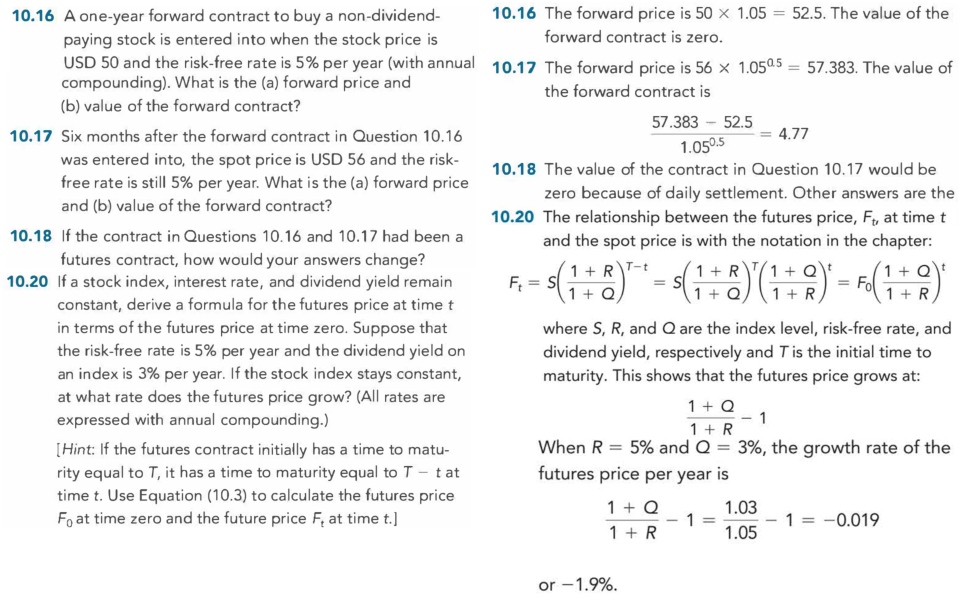

###  大宗商品远期与期货

-   大部分大宗商品属于 *Comsumption Asset* 消费资产
    -   *Comsumption Asset* 消费资产、非投资资产：不以投资为目的资产
        -   企业需要消费资产现货库存以支持生产，即使期货价格下降，企业也不能卖出现货、买入期货合约
        -   故对消费资产，无套利定价无法完全适用，但可作为远期价格上限
        -   *Investment Asset* 投资资产：以获利为目的
    -   特殊性
        -   *Storage Cost* 存储成本：仓储费用、保险费、维护费用
        -   *Transport Cost* 运输成本
        -   *Lease Rate* 租赁利率：类似金融资产做空的融资利率，但更高
        -   *Mean Reverting* 均值复归：大宗商品价格存在均值复归的价格波动规律，价格长期来看会回归均值
    -   大宗商品类型
        -   *Agricultural Commodities* 农副产品：种植类和牲畜类
            -   相较于金属类大宗
                -   存储成本高
                -   价格有季节性
        -   *Metal Commidities* 金属类：
            -   相较于农副产品大宗
                -   不受天气影响
                -   价格没有季节性波动
                -   存储成本低
            -   价格主要依赖于矿产勘探，也受其他因素影响
                -   汇率
                -   提炼技术
                -   政府管控
        -   *Energy Commodities* 能源类：原油、原油衍生物、天然气、电力
            -   原油市场份额最大
            -   天然气可无限期存储，但存储、运输成本高
            -   电力无法存储
        -   *Weather* 天气指数、温度指数期货
            -   属于非物质指期货交易品种，是气象服务的高级商业模式
            -   *Cooling Degree for a Day* `max(A - 65, 0)`（`A` 为日最高、最低气温均值）
            -   *Heating Degree for a Day* `max(65 - A, 0)`（`A` 为日最高、最低气温均值）

####    大宗商品远期定价

-   大宗商品远期定价：大宗商品可视为不提供现金流收入的资产，定价基础参照无现金流金融远期
    -   投资性资产（黄金）：做空时需借入，并缴纳 *Lease Rate* 租赁利率 $l$，可视为标的资产的收益
        $$\begin{align*}
        F_0(T) &= S_0 (\frac {1 + R_f} {1 + l})^T \\
        l &= (\frac {S_0} {F_0(T)})^{\frac 1 T} (1 + R_f) - 1
        \end{align*}$$
        -   租赁利率 $l$ 由市场上租借的供需关系决定，可由市场远期价格反推
    -   消费性资产、工业原材料：无法借出做空，无现金流远期价格可作为无套利上界，但可引入便利收益率 $Y$
        $$\begin{align*}
        F_0(T) &< (S_0 + U)(1 + R_f)^T \\
        F_0(T) &= (S_0 + U)(\frac {1 + R_f} {1 + Y})^T \\
        Y &= (\frac {S_0 + U} {F_0(T)})^{\frac 1 T} (1 + R_f) - 1
        \end{align*}$$
        > - $U$：存储成本折合到当前时刻的现值
        -   *Convenience Yield* 便利收益率 $Y$：资产持有人保留资产作为库存所能获得的潜在收益
            -   市场上资产供给充分时，企业可以迅速买入资产，便利收益率接近 0
            -   市场上资产供给紧张时，原材料库存较高在生产环节优势较高，便利收益率高
            -   便利收益率无法直接观察，可、需从远期价格反推

####    大宗商品持有成本

-   *Cost of Carry* 持有成本
    $$\begin{align*}
    C &= \frac {1 + R_f + U} {1 + Q + Y} - 1 \\
        &\approx (R_f + U) - (Q + Y) \\
        &= (R_f + U) - (Q + Y) &, 连续复利场合 \\
    F_0(T) &= S_0 e^{(C - (Q + Y)) T} &, 连续复利场合
    \end{align*}$$
    > - $U$：**利率形式表示存储成本**
    -   持有成本包括
        -   存储成本 $U$
        -   融资成本 $R_f$
        -   资产带来的收入（负成本）：收益率（租赁利率） $Q$、便利收益率 $Y$
    -   金融资产无存储成本、无便利收益率 $U=0, Y=0$
    -   投资性大宗商品无便利收益率 $Y=0$
    -   消费性大宗商品无收益率 $Q=0$

####    FRM 例题

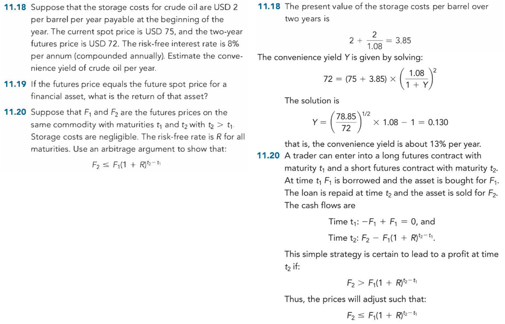

### 预期未来现货价格

$$\begin{align*}
E(S_T) &= P (1 + Q)^T \\
    &= F_0(T) (\frac {1 + Q} {1 + R_f})^T
\end{align*}$$
> - $P = \frac {F_0(T)} {(1 + R_F)^T}$：期货价格 $F_0(T)$ 现值，可用于直接投资期货底层资产
> - $E(S_T)$：期货价格现值 $P$ 投资期货底层资产的预期未来值

-   *Expected Future Spot Price* 预期未来现货价格 $E(S_T)$：市场关于期货 $F_0(T)$ 对应的底层资产的未来现货价格的预期值
    -   到期时，期货价格会与现货价格趋同
    -   但 **因为标的资产收益的风险的存在**，期货价格与未来预期现货价格往往不相等，考虑投资策略如下：
        -   投资策略 1
            -   $P$ 投资无风险资产，并做多 $F_0(T)$ 期货
            -   期末资产组合价值即为 $F_0(T)$
        -   投资策略 2
            -   $P$ 直接做多期货合约底层资产，预期收益率为 $Q$
            -   期末资产组合预期价值为 $E(S_T) = P(1 + Q)^T$
    -   根据 *CAPM* 模型 $ Q = E(R_i) = R_f + \beta_i (E(R_M) - R_f) $
        -   $\beta_i > 0$ 时资产包含系统性风险，资产收益与市场表现正相关
            -   此时，$Q > R_f$ 资产预期收益率应大于无风险利率
            -   则，期货价格应小于预期未来现货价格 $E(S_T) < Q$
        -   否则，$\beta_i < 0, Q < R_f$ 时，资产收益与市场表现负相关
            -   此时，期货价格大于预期未来现货价格 $E(S_T) > Q$
        -   即，标的资产包含系统性风险时，其收益的不确定性导致其期货价格应下降
    -   许多大宗商品系统性风险为正，但黄金例外
        -   经济形势好会导致大宗商品消费增加
        -   经济形势差时，投资者倾向于持有黄金
    -   期货价格升水、贴水
        -   *Backwardation* 贴水（一般情况）、现货溢价：期货价格低于预期未来现货价格
        -   *Contango* 升水、期货溢价：期货价格高于预期未来现货价格

### 期货对冲

-   利用期货合约可以降低资产价格变动风险，降低公司整体盈利波动性
    -   *Short Hedge* 空头对冲：已知将来需要卖出资产并希望提前锁定价格
    -   *Long Hedge* 多头对冲：已知将来需要买入资产并希望提前锁定价格
    -   对冲利弊
        -   股东通常可以分散投资并制定自身的对冲策略
        -   公司对冲前，需要深入了解整个公司的风险敞口，从公司整体的风险敞口出发
        -   对冲仅可以降低公司利润波动性

####    基差风险

$$\begin{cases}
S_t + (F_0 - F_t) &= F_0 + b_t &, Short Hedge \\
S_t - (F_t - F_0) &= F_0 + b_t &, Long Hedge \\
b_t &= S_t - F_t
\end{cases}$$
> - $F_0, F_t, S_t$：对冲开始时期货价格、平仓开始时期货价格、平仓时被对冲资产的现货价格
> - $b_t$：平仓时的基差

-   *Basis Risk* 基差风险：对冲工具与被对冲资产之间价格波动不同步的风险
    -   *Basis* 基差：现货价格减期货价格之间的值
        -   基差大于 0 时，空头对冲收益增加、多头对冲收益受损
    -   *Cross Hedege* 交叉对冲：期货合约的标的资产与被对冲资产不一致
    -   基差波动的风险无法避免
        -   尤其是企业采用替代品种对冲时，即交叉对冲
        -   需要选择合适的期货品种、测算基差风险、并及时调整对冲操作
    -   基差风险来源
        -   期货合约期限与偏好期限不匹配
            -   在期货合约到期前平仓
        -   被对冲资产与期货工具的标的资产不一致

####    对冲比率

$$\begin{align*}
\Delta S &= a + b \Delta F + \epsilon \\
\arg\min_{h} \Delta S - h \Delta F &= a + (b - h) \Delta F + \epsilon \\
\Rightarrow h^{*} &= b = \rho \frac {\sigma_S} {\sigma_F} \\
\Rightarrow N^{*} &= h^{*} \frac {Q_S} {Q_F}
\end{align*}$$
> - $\Delta S, \Delta F, \epsilon$：对冲资产价格变动、期货价格变动、残差项
> - $b, h, h^{*}$：期货价格变动与现货价格变动线性比例、对冲比率、最优对冲比率
> - $\rho, \sigma_S, \sigma_F$：现货价格变动与期货价格变动相关系数、现货价格变动标准差、期货价格变动标准差
> - $N^{*}, Q_S, Q_F$：最优期货合约数量、被对冲资产头寸数量、每份期货合约规模

-   *Hedge Ratio* 对冲比率：为规避资产价格风险，建立对冲交易头寸时确定的期货合约总头寸与被对冲资产总头寸之间的比率
    -   *Optimal Hedge* 最优对冲：使得现货资产、期货沟通的投资组合整体风险最低的对冲
    -   *Optimal Hedge Ratio* 最优对冲比率、最优套期保值比率：达到最优时的对冲比率
    -   假设：被对冲资产价格变动 $\Delta S$ 与期货价格变动 $\Delta F$ 成线性关系
        -   *Tailing the Hedge* 尾随调整：期货存在每日结算制度，需要对上述最优对冲比例、最优期货合约数量进行尾随调整
            $$\begin{align*}
            \hat h^{*} &= \hat \rho \frac {\hat \sigma_S} {\hat \sigma_F} \\
            \hat N^{*} &= \hat h^{*} \frac {V_S} {V_F}
            \end{align*}$$
            > - $\hat \rho, \hat \sigma_S, \hat \sigma_F$：每日现货价格与期货价格相关系数、现货价格每日收益率标准差、期货价格每日收益率标准差
            > - $N^{*}, V_S, V_F$：最优期货合约数量、被对冲资产总价值、期货头寸总价值 #TODO
        -   *Hedge Effectiveness* 对冲有效性：$\Delta S$ 的方差被对冲消除的比例
            -   即，$\Delta F$ 对 $\Delta S$ 的解释程度
            -   即，拟合优度 $R^2 = \rho^2$（由相关系数数值计算逻辑、线性回归估计逻辑可证）

####    股指期货对冲

-   *Stock Index Futures* 股指期货：以股票价格指数作为标的物的金融期货合约
    -   股指期货可用于对冲股票市场敞口、对冲投资组合中市场风险
        $$\begin{align*}
        N^{*} &= \beta \frac {V_A} {V_F} \\
        N^{*} &= \beta \frac {V_A} {V_F}
        \end{align*}$$
        > - $\beta$：股票投资组合的 $\beta$ 值，即与市场组合的线性回归系数、对市场风险敏感度
        > - $V_F$ 股指期货合约的价值：`= 期货合约价格（点数）* 合约乘数`
        > - $V_A$：股票投资组合的总价值
        > - $N^{*}$：完全对冲股票投资组合的系统风险时，做空估值期货合约数量

####    长期对冲

-   长期对冲
    -   大部分期货合约到期时间较短，可能无法找到与被对冲资产期限相匹配的合约
    -   *Stack and Roll Strategy* 集中式展期策略：利用一系列短期期货对长期资产头寸对冲
        -   将一系列短期对冲合约头尾相连、续短为长，实现长期对冲
        -   期货合约采取每日结算制度，导致期货合约现金流与被对冲资产现金流不匹配
            -   且，在长期对冲情况下尤为显著
            -   公司需要有足够的融资渠道，确保期货合约亏损可以及时弥补直至对冲资产利得实现

####    FRM 例题

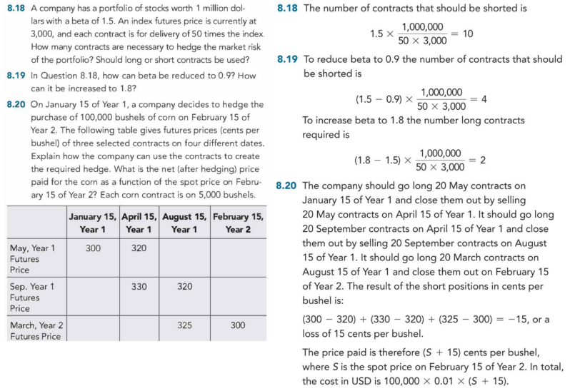

##  互换

-   *Swap Contract* 互换合约、掉期合约：合约双方依照不同参照标的相互交换一系列现金流
    -   互换本质上即一系列远期合约（互换是场外衍生品）
        -   自定义工具：根据自身需求确定标的资产、支付日期、支付流程
        -   场外交易
        -   监管宽松
        -   有违约风险
    -   说明
        -   *Notional Principal* 名义本金：计算每期支付或收取的现金流的本金金额
        -   *Tenor* 存续期：互换合约的剩余期限
        -   *Settlement Dates* 结算日：双方互相支付现金流的截止日期（一系列日期）
        -   *Financial Intermediates* 金融中介：促成互换交易的中介
    -   互换类型
        -   *Interest Rate Swap* 利率互换：一方基于名义本金已固定利率计算现金流，另一方以浮动利率计算现金流
            -   即，双方以相同名义本金分别按固定利率、浮动利率交换（向对方）支付利息（净额结算）
                -   其中固定利率也被称为互换利率
                -   *Overnight Indexed Swap* 隔夜指数互换：浮动利率取 *OIS* 利率
            -   收浮动利率、支付固定利率的互换合约：等价于浮动利率债券多头头寸与固定利率债券空头头寸的组合
        -   *Currency Swap* 货币互换、货币掉期：期初双方互换不同货币的名义本金，之后每个结算日基于两种货币分别按各自利率计息，期末再将本金反向交换
            -   即，双方交换不同货币的现金流，互相支付存续期利息
                -   期初，双方交换本金：两笔本金价值应相同，即使用即期汇率结算
                -   期中，双方互相支付利息：根据期初本金、约定利率计算，不同货币，利息不轧差结算
                -   期末，将本金换回
        -   *Equity Swap* 权益互换：将双方或一方支付的标的资产为股票或指数等权益资产的收益率
        -   *Commodity Swap* 商品互换：交换基于商品价格或价格指数的现金流
        -   *Volatility Swap* 波动率互换：以实现的波动率水平与约定的波动率水平进行互换 #TODO
        -   *Swaption* 互换期权：赋予期权买方在按约定条件进行互换的权利
        -   *Credit Default Swap* 信用违约互换：贷款方买方支付一系列现金流（保费）给卖方，仅当贷款违约时卖方支付一定金额给买方
    -   基本功能
        -   利用双方比较优势（双方贷款固定利率、浮动利率差值不同），降低融资成本
        -   将固定支出与浮动支出相互转化
    -   互换合约会产生信用风险
        -   面临信用风险的一方是在互换合约中有正收益的一方
        -   大型金融机构间的利率互换和指数 *CDS* 必须采用 *CCP*

###  外汇市场

-   *Foreign Exchange Market/Forex/FX/Currency Market* 外汇市场：买卖外汇的场所
    -   汇率标价方式：首字母缩写
        -   报价格式 `XXXYYY`、`XXX/YYY`：一定数量标价货币 `YYY` 兑换 1 单位基础货币 `XXX`
            -   `XXX` *Base Currency* 基础货币
            -   `YYY` *Quote Currency* 标价货币
            -   汇率交易商有默认基础货币、标价货币的习惯
                -   对英镑、欧元、澳元、新西兰元，美元作为标价货币
                -   其余货币，则美元作为基础货币
    -   *Spot Exchagne Rate* 即期汇率：外汇现货市场中交易基础货币的价格（4、5 小数）
        -   *Bid Exchange Rate* 外汇买入价：外汇市场中银行、交易商愿意买入基础货币的价格
        -   *Ask Exchange Rate* 外汇买入价：外汇市场中银行、交易商愿意卖出基础货币的价格
        -   *Bid-Ask Spread* 外汇买卖价差：外汇卖出价减买入价的差值
    -   *Forward Exchange Rate* 远期汇率：交易双方达成外汇买卖协议，约定在未来进行外汇实际交割所使用的汇率
        -   远期汇率通常以点数形式报价：`远期汇率 = 即期汇率 + 点数 * 1/10000`
            -   少数货币对（`USDJPY`）为将点数乘以 `1/100`
        -   远期汇率买卖价差随期限 `Maturity` 增大而增加
    -   外汇市场投资工具
        -   *Spot Foreign Exchange* 外汇现货、即期外汇：成交后在两个营业日内交割完毕
            -   完成货币调换，满足临时性付款需要，实现货币购买力国际转移
            -   调整外汇头寸比例，避免经济波动风险
            -   配合远期交易，进行外汇投机
        -   *Currency Forward* 外汇远期：约定在未来以约定价格交割外汇的合约
            -   用于规避汇率波动的不确定性，提前锁定汇率
        -   *Currency Future* 外汇期货
        -   *Foreign Exchange Swap*、*FX Swap* 外汇互换、外汇掉期
        -   *Foreign Exchange Option* 外汇期权、货币期权

####    外汇风险

-   *Fx Risk* 外汇风险：公司在国内、国外竞争力可能收到汇率变动影响
    -   *Transaction Risk* 交易风险：面临外币应付或应收款项时因汇率变动而导致经济损失的可能性
        -   债权、债务在汇率变动前已经发生，但在汇率变动后才结算
        -   交易风险源于货币、时间两个因素
    -   *Translation Risk* 折算风险：外汇汇率变动引起公司资产负债表中某些外汇资金项目金额变动
        -   公司资产和负债由外币标价，但在资产负债表上必须以所在国货币报告
        -   不影响现金流，但带来账面损益（会计风险）
    -   *Economic Risk* 经济风险：非预期汇率变动对跨国公司未来现金流现值的影响
        -   难以计量

####    汇率

-   汇率决定因素
    -   利率：利率越低本币越强
        -   *Nominal Interest Rate* 名义利率：央行或其他提供资金借贷机构所公布的、未剔除预期通货膨胀率 *Inflation Rate* 的利率
            -   即，利息的货币额与本金的货币额的比率
        -   *Real Interest Rate* 实际利率：名义利率剔除通货膨胀率后的实际回报
            $$\begin{align*}
            R_{real} &= \frac {1 + R_{norm}} {1 + R_{infl}} - 1 \\
                & \approx R_{norm} - R_{infl}
            \end{align*}$$
            > - $R_{norm}, R_{real}, R_{infl}$：名义利率、实际利率、通货膨胀率
    -   *Balance of Payments and Trade Flows* 国际收支：顺差越大、出口越多本币越强
        -   国际收支为顺差，外汇储备增加，外汇供给大于外汇需求，本币对外币升值
    -   *Inflation* 通货膨胀（整体物价水平持续性上升)：通胀越低本币越强
        -   *Purchasing Power Parity* 购买力平价理论：同样的货物在不同国家、地区的价格应当一致，否则存在套利机会
            -   理论上，即期汇率、远期汇率都应满足 *PPP*
            -   但实际上，往返套利不可行，即期汇率也不满足 *PPP*
        -   但，*PPP* 可用于预测汇率长期趋势：`XXX相对YYY的升值幅度 = YYY通货膨胀率 - XXX通货膨胀率`
    -   *Monetary Policy* 货币政策：货币紧缩本币越强
        -   通过货币供应量变动和利率变动影响汇率
            -   宽松货币政策使得利率降低，导致本币贬值
    -   注意：汇率也受其他因素影响
        -   比如，按利率平价理论，利率越低本币越强
            -   但，利率越高也可能吸引投资者兑换本币获取收益，导致本币走强

####    远期汇率、利率平价理论

$$ F = \begin{cases}
    S (\frac {1 + R_{YYY}} {1 + R_{XXX}})^T &, 复利 \\
    S e^{(R_{YYY} -  R_{XXX}) T} &, 连续复利 \\
\end{cases}$$
> - $S, F, T$：货币对 `XXXYYY` 的即期汇率、远期汇率、到期时间
> - $R_{XXX}, R_{YYY}$：`XXX`、`YYY` 货币所在国家的无风险利率

-   *Interest Rate Parity Theory* 利率平价理论：两国之间不应该有利率套利空间
    -   *Uncovered Interest Rate Parity* 无抛补利率平价：资本可以充分流动，套利行为使得以区别货币计价的相似资产收益率一致
        -   强调一段时间内任意时刻，不同货币之间没有套利空间
            -   无需通过远期、期货锁定未来汇率
            -   货币可直接期初交换、期末换回，不影响收益
    -   *Covered Interest Rate Parity* 抛补利率平价：同无抛补利率平价，但需期汇市场通过远期合约锁定未来汇率
        -   即，单独现汇市场可能不满足 “不同货币计价的相似资产收益率一致”
            -   但可通过远期合约锁定未来汇率，消除套利空间
        -   可据此根据即期汇率、无风险利率估计远期汇率

> - 如何用通俗的语言解释抛补和非抛补利率平价：<https://www.zhihu.com/question/26048327/answer/2739668103>
> - 理论平价理论：<https://baike.eastmoney.com/item/%E5%88%A9%E7%8E%87%E5%B9%B3%E4%BB%B7%E7%90%86%E8%AE%BA>

#### FRM 例题

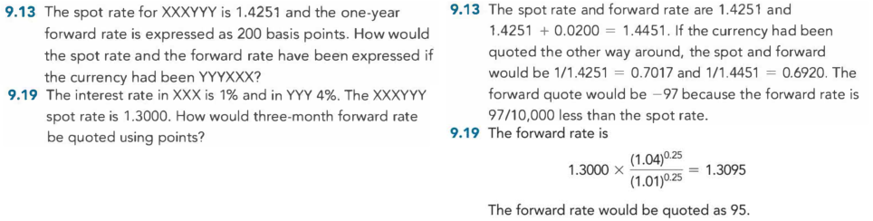

### *Interest Rate Swap* 利率互换

$$\begin{align*}
PV_{fixed bond} &= PV_{floating bond} = ParValue \\
V_t(T) &= \begin{cases}
    PV_{t,floating bound} - PV_{t,fixed bond} &, 收浮动付固定 \\
    PV_{t,fixed bond} - PV_{t,floating bond} &, 收固定付浮动 \\
\end{cases} \\
\end{align*}$$
> - $PV_{fixed bond}, PV_{floating bond}$：固定利率债券在期初的价值（现值）、浮动利率在债券期初的价值

-   *Interest Rate Swap* 利率互换：互换名义本金产生的利息现金流，不涉及本金互换
    -   利率互换 **可视为交换固定利率债券、浮动利率（市场利率 *Libor*、*SOFR*）债券现金流**
        -   一方基于名义本金以固定利率计算现金流，另一方以浮动利率计算现金流
            -   收浮动利率、支付固定利率的互换合约：等价于浮动利率债券多头头寸与固定利率债券空头头寸的组合
        -   即，双方以相同名义本金分别按固定利率、浮动利率交换（向对方）支付利息（净额结算）
            -   其中固定利率也被称为互换利率
            -   *Overnight Indexed Swap* 隔夜指数互换：浮动利率取 *OIS* 利率
    -   利率互换的定价：确定互换合约中的固定利率（互换利率）
        -   考虑到，互换合约期初价值为 0
            -   期初浮动利率债券的价值为面值
            -   **若某固定利率债券初始价值为面值（平价发行债券），则该债券票息率即为互换利率**
        -   反过来，**利率互换定义了一系列 *Par Rates Bonds* 平价发行债券（面值等于价值）**
            -   即，利率互换定价即为对应期限的平价利率
    -   利率互换估值：利率互换合约在 $t$ 时刻的价值是浮动利率债券和固定利率债券在 $t$ 时刻价值的差
        -   固定利率债券价值：根据市场利率将未来现金流贴现至 $t$ 时刻求和
        -   浮动利率债券价值有 *Pull to Par* 特征：每个结算日付息后，浮动债券利率的票息率被重置为市场利率、价值回归到面值 
            -   结算日时，浮点利率债券刚刚支付完票息，价值等于面值
            -   非结算日，计算下个结算日 `票息 = 上个结算日利率 * 时间` 贴现回当前时点
            -   债券的票息即现金流延迟支付、贴现的补偿
                -   浮动利率债券始终以市场利率（*Libor*、*SOFR*）支付票息
                -   即，**债券的票息恰好补偿面值在该期限内的贴现价值损失**
                -   故，浮动利率债券付息后价值回归面值
                -   而，**固定利率债券（平价发行）按固定票息补偿损失，所以存在价值波动**

####    互换利率

-   互换利率：互换协议中的固定利率
    -   利率互换可视为浮动利率债券和固定利率债券的现金流交换
        -   浮动利率债券特点是平价发行
        -   则，互换利率可被定义为 “平价利率”
    -   互换利率定义的 “平价利率” 与从平价发行国债得到 “平价利率” 不同      # TODO
        -   二者付息频率可能不一致
        -   国债没有对手方风险
-   *Overnight Indexed Swap* 隔夜指数互换
    -   *OIS* 是特殊的互换合约
        -   期限：5 年
        -   频率：3 个月
        -   浮动利率：3 个月内每日的隔夜利率的几何平均数
        -   *OIS rate*：固定利率支付方支付的固定利率
    -   *OIS rate* 常被用作无风险利率用于衍生品的定价
        -   市场通常认为国债利率太低而不适合作为无风险利率
            -   金融机构为满足监管要求，必须购入国债，导致国债价格升高、收益率降低
            -   美国国债的收益无需缴纳州税，导致国债价格升高

### *Currency Swap* 货币互换

-   *Currency Swap* 货币互换：期初双方互换不同货币的名义本金，之后每个结算日基于两种货币分别按各自利率计息，期末再将本金反向交换
    -   即，双方交换不同货币的现金流，互相支付存续期利息
        -   期初，双方交换本金：两笔本金价值应相同，即使用即期汇率结算
        -   期中，双方互相支付利息：根据期初本金、约定利率计算，不同货币，利息不轧差结算
        -   期末，将本金换回：即可视为期初、期末汇率相同
    -   货币互换定价：根据双方货币即期利率确定固定（平价）利率
        -   即，类似债券平价利率计算
    -   货币互换估值
        $$\begin{cases}
        V_{t,XXX}(T) &= PV_{t,XXX} - PV_{t,YYY} S_{t,YYYXXX} \\
        V_{t,YYY}(T) &= PV_{t,YYY} - PV_{t,XXX} S_{t,XXXYYY} \\
        \end{cases}$$
        > - $V_{t,XXX}(T)$：$t$ 时刻收取货币 `XXX` 的互换合约价值
        > _ $S_{XXXYYY}$：$t$ 时刻 `XXXYYY` 货币对汇率
        -   货币互换可以看作时是拥有以货币 `XXX` 计价债券的多头头寸、`YYY` 计价债券的空头头寸
            -   则，货币互换价值是两种债券转换为同一货币计价的价值差额

> - 互换最初即货币交易商为逃避英国外汇管制而发明货币互换合约

### *FX Swap* 外汇互换、汇率互换

|      | *Currency Swap*                    | *FX Swap*                        | *Interest Rate Swap*       |
|------|------------------------------------|----------------------------------|----------------------------|
| 本金 | 期初、期末互换本金                 | 期初、期末互换本金               | 不交换本金                 |
| 期限 | 1年内                              | 1至10年                          |                            |
| 利率 | 期间不计息                         | 货币双方分别按约定利率计息、支付 | 固定、浮动利率计息轧差支付 |
| 汇率 | 期初、期末汇率相同（名义本金相同） | 期初即期汇率、期末约定远期利率   |                            |

-   *Foreign Exchange Swap* 外汇互换
    -   类似货币互换，但
        -   期限：外汇互换时间一般较短，在 1 年以内（货币互换在 1 至 10 年）
        -   期间利息：外汇互换期间不涉及利息支付，只在期初、期末交换本金
        -   汇率：外汇互换期初以即期汇率交换、期末以约定远期汇率交换
    -   可用于短期、暂时获取外币现金流
        -   相较于外币贷款，利息以本币支付

### 基于波动性互换

-   基于波动性的互换 #TODO
    -   *Volatility Swap* 波动率互换
        -   标的为资产标准差波动性的互换合约，其价值为
            $$ V = \begin{cases}
                L(\sigma - \sigma_k) &, 支付固定方 \\
                L(\sigma_k - \sigma) &, 收取固定方 \\
            \end{cases}$$
            -   以事先约定的波动性 $\sigma_k$、合约持续期的实际波动性 $\sigma$ 计算互换现金流
            -   需要实现约定名义本金 $L$
    -   *Variance Swap* 方差互换
        -   标的为资产方差波动性的互换合约，其价值为
            $$ V = \begin{cases}
                L(\sigma^2 - \sigma_k^2) &, 支付固定方 \\
                L(\sigma_k^2 - \sigma^2) &, 收取固定方 \\
            \end{cases}$$

#  期权

##  期权

-   *Option* 期权
    -   场外、场内交易都有
    -   期权的买卖双方权利义务不对等：期权对买方是 “资产”、对卖方是 “负债”
        -   期权买方需要支付权利金 *Premium* 给卖方，以获得未来可以买入、卖出某项标的资产的权利
        -   期权买方决定行权时，卖方有义务以约定价格卖出、买入标的资产
        -   期权赋予买方买卖资产权利而非义务，买方可以选择行权或不行权
    -   期权合约要素
        -   *Call Option* 看涨期权：赋予买方 *Long Postion* 在未来按照约定价格买入某种资产的权利
        -   *Put Option* 看跌期权：赋予买方在未来按照约定价格卖出某种资产的权利
        -   *Exercise Price/Strike Price* 执行价格、行权价格：看涨/看跌期权合约的交易价格
        -   *Expiration Date/Maturity Date* 到期日：期权最后的有效日期（到期日后，权利消失）
    -   *European Option* 欧式期权：买方只能在期权到期日当天才能行权
        -   大部分场外交易期权为欧式期权
    -   *American Option* 美式期权：买方能在期权到期日前任意时点行权
        -   灵活性高，分析更为复杂
        -   期权费更贵
        -   大部分场内交易期权为美式期权

### 场内期权

-   场内期权
    -   场内期权交易
        -   场内期权交易依赖做市商提供流动性
            -   做市商不断报出买价、卖价
        -   交易所限制价格上限、买卖价差、持仓头寸
        -   交易员通过经纪商下单，经纪商从中收取佣金
            -   同样可以通过反向交易平仓
        -   多头头寸需行权时，交易所自动匹配相应空头头寸
            -   实值期权到期时通常自动行权
    -   *Position Limit* 仓位限制：投资者持仓仓位限制
        -   看涨多头、看跌空头头寸加总计算，看涨空头、看跌多头加总计算
    -   *Exercise Limit* 行权限制：投资者 5 天内可行权数量限制
        -   避免投资者过度影响市场

####    期权特征

-   场内期权特征
    -   期权标的资产
        -   个股期权：美式期权
        -   *ETP* 期权：类似股票期权，美式期权
            -   *Exchange Traded Products* 交易所交易产品：股票构成的投资组合，信托股份
                -   用于跟踪某个具体股票的价格表现和收益
                -   交易类似股票交易
        -   指数期权
            -   标的资产：`指数水平 * 100` 的美元价值
        -   *FLEX* 变通期权
            -   交易所挂牌的股票或指数期权，但允许用户指定合约的大部分条款，对头寸限仓要求相对宽松
    -   期权合约条款
        -   欧式期权
        -   美式期权
        -   *Exotic Options* 奇异期权、新型期权：回报取决于各种独特条款
            -   单一资产期权
                -   路径依赖性期权：收益与期权存续期间标的物价格走势有关
                -   时间依赖性期权：收益与时间、资产价格有关
                -   基于期权的期权
                -   行权收益变化的期权
            -   多个资产期权
    -   期权的期限、交易时间
        -   每年期权价格交易时间被分为 3 个周期，不同资产期权在不同周期开始交易
            -   1、4、7、10 月
            -   2、5、8、11 月
            -   3、6、9、12 月
        -   期限
            -   当月、次月、周期段内后 2 个月：每个月第 3 个周五前可以交易当月期权
            -   *Weeklys* 
            -   *Long-Term Equity Anticipation Securities*：*CBOE* 交易所交易的、期限可长达 3 年的长期期权
    -   期权的行权价：通常最接近资产价格的 3 个行权价被列出
        -   底层资产价格 `5-25USD`：行权价为 `2.5USD` 倍数
        -   底层资产价格 `25-200USD`：行权价为 `5USD` 倍数
        -   底层资产价格 `200USD` 以上：行权价为 `10USD` 倍数
    -   股票分拆需要相应行权价格按比例调减
        -   小额分红对期权影响不大
        -   若分红金额过大（超过股价的 10% ）则也需要对期权按比例调减
            -   拆股、反股分红：`P * 原股数 / 新股数`
            -   现金分红：`P * (1 - 分红现金占比)`

### 奇异期权

####    路径依赖性期权

-   路径依赖性期权：收益与期权存续期间标的物价格走势有关
    -   *Asian Option* 亚式期权、平均价格期权：收益依赖标的资产价格的某种平均值的期权
        -   时间：平均值可为一段时间内连续平均值、或若干时间点的离散平均值
        -   平均方式：算术平均值、或几何平均值
        -   结算方式：平均价格期权（更普遍）、平均执行价格期权
            -   平均价格期权、固定执行价的亚式期权：以期限内资产某段时间的平均价格替代欧式期权中到期日标的资产价格的期权
                -   一般为执行日前半年二级市场股票价格的平均价格
            -   平均执行价格期权：以期限内资产某段时间的平均价格替代欧式期权中执行价格的期权
        -   标的资产平均价格波动率总是小于单个时点的价格波动率
            -   故，亚式期权的权利金（价格）总是低于标准期权的权利金
            -   更适合作为对冲风险的工具、雇员激励计划
    -   *Barrier Option* 障碍期权：收益取决于标的资产是否达到特定障碍水平
        -   *Knock-out Option* 敲出障碍期权：标的资产价格达到特定障碍水平时期权作废，否则为标准期权
            -   *Up and out*：资产价格升高达到障碍则作废
            -   *Down and out*：资产价格下降达到障碍则作废
        -   *Knock-in Option* 敲出障碍期权：标的资产价格未达到特定障碍水平时期权作废，否则为标准期权
            -   *Up and in*
            -   *Down and in*
        -   优势
            -   价格相对便宜
            -   收益非连续
    -   *Floating Lookback Option* 回顾期权：收益取决于期限内标的资产曾达到过的最高价格或最低价格
        -   回顾期权比标准期权价格更高
            -   且，回顾观察频率越大价格越高
    -   *Forward Start Options* 远期生效期权、未来生效期权：期初支付权利金，但未来一段时期后期权才生效
        -   雇员股票期权可视为远期生效期权

> - *Static Options Replication* 静态期权复制：对障碍期权的对冲手段 #TODO

####    时间依赖性期权

-   时间依赖性期权：收益与时间、资产价格有关
    -   *Non-Standard American Option* 非标准化美式期权、*Bermuda Option* 百慕大期权
        -   只能在期权有效期内某些特定日期可提前执行
        -   存在 *Lock-out period* 锁定期，锁定期内不能行权
        -   不同时间执行有不同执行价格
    -   *Chooser Option* 任选期权：可在有效期内某个时点（期初确定）选择期权为看涨期权或看跌期权
        -   任选期权价格更高
    -   *Cliquet Option* 阶梯期权、棘轮期权：一系列远期生效期权组成
        -   一系列 *Forward Start Option* 远期期权组成的奇异期权
            -   一系列期权在前一个期权到期后按顺序依次生效
            -   每个期权价格按约定日期价格重新设置

####    基于期权的期权

-   基于期权的期权
    -   *Packages* 打包期权：标准欧式看涨期权、标准欧式看跌期权、远期合约、现金、标的资产构成的组合
        -   各类价差期权、组合期权都属于打包期权
    -   *Zero-cost Products* 零成本产品：期初不支付成本（权利金）
        -   将成本 $C$ 支付推迟到期末 $C(1 + R_f)^T$
        -   本质上，即将期权转化为远期合约：到期支付 $C(1 + R_f)^T$ 以获取期权收益
            -   也存在将期权转化为期货产品的 *Futures-style Option* 期货式期权，在交易所交易并逐日盯市
    -   *Compound Options* 复合期权：以期权合约作为标的资产的期权合约
        -   *Call Option on Call Option*：给与购买者在 $T_1$ 时刻支付 $X_1$ 做多一个执行价格为 $X_2$、$T_2$ 时刻到期的看涨期权
        -   *Put Option on Call Option*：给与购买者在 $T_1$ 时刻收到 $X_1$ 做空一个执行价格为 $X_2$、$T_2$ 时刻到期的看涨期权
        -   *Call Option on Put Option*：给与购买者在 $T_1$ 时刻支付 $X_1$ 做多一个执行价格为 $X_2$、$T_2$ 时刻到期的看跌期权
        -   *Put Option on Put Option*：给与购买者在 $T_1$ 时刻收到 $X_1$ 做空一个执行价格为 $X_2$、$T_2$ 时刻到期的看跌期权

####    收益变化期权

-   收益变化期权
    -   *Gap Options* 缺口期权：触发收益价格与计算收益的执行价格不同的欧式期权
    -   *Binary Option* 两值期权：标的资产价格达到特定价格时，卖方支付期权收益
        -   *Cash-or-Nothing Call* 现金或无价值看涨期权：到期时，标的资产价格高于执行价格时，卖方支付固定数额
        -   *Cash-or-Nothing Put* 现金或无价值看跌期权：到期时，标的资产价格低于执行价格时，卖方支付固定数额
        -   *Asset-or-Nothing Call* 资产或无价值看涨期权：到期时，标的资产价格高于执行价格时，卖方支付资产价值的数额
        -   *Asset-or-Nothing Put* 资产或无价值看跌期权：到期时，标的资产价格低于执行价格时，卖方支付资产价值的数额
        -   欧式期权可由两值期权构建
            -   欧式看涨：做多 *Asset-or-Nothing Call*、做空 *Cash-or-Nothing Call*
            -   欧式看跌：做多 *Cash-or-Nothing Put*、做空 *Asset-or-Nothing Put*

####    多资产期权

-   多资产期权
    -   *Asset-exchange Option* 资产交换期权：以某种资产交换另一个资产的权利
    -   *Basket Option* 篮子期权：标的资产为多种资产构成资产组合
        -   其价值取决于资产组合中各资产的波动率结构

####    FRM 例题

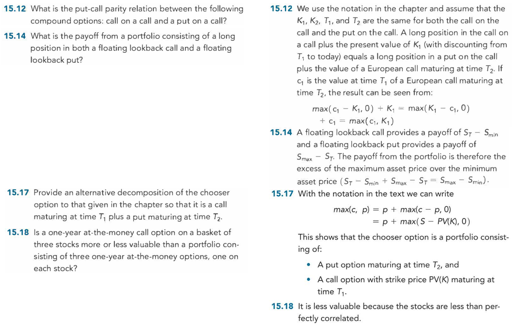

### 期权相关金融工具

-   期权相关金融工具
    -   *Warrant* 认证权证：赋予持有者在一定期限内以实现约定价格购买发行公司一定股份的权利
        -   与期权不同，是 **公司自己发行的、固定数量的期权合约**，标的资产为公司自有的股票
            -   可和债券附属发行，赋予债权人在股价上涨时获利的权利
            -   认证权证发行后在交易所交易
        -   认证权证属于 *Attached* 附加式：认证权证行权（执行价格 $K$）时，公司将发行更多 $W$ 股票，影响流动股票数量（增至 $N + W$）、股价
            -   行权后，权益总价值 $NS + WK$
            -   行权后，股价 $\frac {NS + WK} {N + W}$
            -   认证权证价值 $\frac {NS + WK} {N + W} - K = \frac N {W + N} (S - K)$
            -   行权后，股价降幅 $S - \frac {NS + WK} {N + W} \ frac W {W + N}(S - K)$
        -   而，期权为的 *Embeded*，期权行权时不影响发行股票数量
    -   *Convertible Bond* 可转换债券：赋予债券持有人将债券转换为股票的权利 *Conversion Option*
        -   可被视为时不可转债券、股票看涨期权 *Call Option on Equity* 的组合
        -   因此，可转换债券的收益可偏低
    -   *Employee Stock Option* 雇员股票期权：公司授予雇员在本公司股票上的看涨期权
        -   执行价格一般设置为股票在授予时的价格
        -   雇员股票期权特点
            -   行权之前之前需要等待、在公司工作较长时间
            -   离开公司后期权作废，若为可行权实值期权则行权
            -   不可交易
        -   可将股东和管理层利益相联系

### 期权的收益、利润

$$\begin{align*}
C &= \begin{cases}
        max(0, S - X) ,& Long-Call-Option \\
        -max(0, S - X) ,& Short-Call-Option \\
    \end{cases} \\
P &= \begin{cases}
        max(0, X - S) ,& Long-Put-Option \\
        -max(0, X - S) ,& Short-Put-Option \\
    \end{cases} \\
\pi &= \begin{cases}
        max(0, S - X) - c_0 ,& Long-Call-Option \\
        -max(0, S - X) + c_0 ,& Short-Call-Option \\
        max(0, X - S) - c_0 ,& Long-Put-Option \\
        -max(0, X - S) + c_0 ,& Short-Put-Option \\
    \end{cases}
\end{align*}$$
> - $c_0$：期权费
> - $C, P, \pi$：看涨期权收益、看跌期权收益、利润
> - $S, X$：期权的标的资产在 $T$ 时刻的价格、行权价格

-   期权收益和利润
    -   *Long Call Option* 买入看涨期权、看涨期权多头
    -   *Short Call Option* 卖出看涨期权、看涨期权空头
    -   *Long Put Option* 买入看跌期权、看跌期权多头
        -   标的资产价格 $S \geq 0$，**则看跌期权收益有上限 $X$**
        -   即，看跌期权作用类似保险
    -   *Short Put Option* 卖出看跌期权、看跌期权空头
    -   期权的货币性 *Moneyness*
        -   *In-the-money* 实值期权：当下立刻行权收益为正
        -   *At-the-money* 平值期权：当下立刻行权收益为 0
        -   *Out-of-the-money* 虚值期权：当下立刻行权收益为负

####    期权的价值

$$\begin{align*}
C_E &\geq max(S - PV(X) - PV(Divs), 0) \\
C_A &\geq max(S - X + PV(Divs), S - PV(X), 0) \\
P_E &\geq max(PV(X) + PV(Divs) - S, 0) \\
P_A &\geq max(X - S, PV(X) + PV(Divs) - S, 0) \\
X &\geq PV(X) \\
\end{align*}$$
> - $C_A, C_E, P_A, P_E$：美式看涨、欧式看涨、美式看跌、欧式看跌期权价值
> - $S, X, Divs, PV(X), PV(Divs)$：股票价格、行权价格、分红、行权价格（无风险利率）贴现值、分红贴现值

-   期权的定价与估值相同
    -   期权的价值包含：期权的内在价值、期权的时间价值两部分
        -   *Excercise Value/Intrinsic Value* 内在价值，即期权的收益 *Payoff*
            -   上述不等式右侧即期权的内在价值，内在价值是可直接计算的
                -   对美式期权，包含现时（提前）行权、到期行权、虚值期权 3 种可能性的，对应 3 种收益
                -   对欧式期权，只包含到期行权、虚值期权 2 种可能性的，对应 2 种收益
            -   **股票当前价格本身即已经包含（充分反映）市场对未来的预期**
                -   即，期权的收益已经包含市场对股票的整体预期，期权的内在价值得到市场认可
                -   即使，市场预期股票将在之后（或行权时）将上升、下降，此预期也已反映在股票价格 $S$、期权收益、期权价格中
                -   即，**美式期权现时行权可以充分代表所有时刻提前行权的行为**
        -   期权的时间价值：期权费高于行权带来的现金收益的部分，可视为是等待行权时机到来的价值
            -   或，期权的时间价值为平权期权的价值，即购买平值期权的期权费
            -   一般的，期权期限越长，时间价值越大，但有例外
                -   若期权期限内在存在大额分红，则短期限欧式看涨期权价格可能更高
                -   对深度实值欧式看跌期权（内在价值无上涨空间），短期限期权可以更早获得现金流、价值更高
            -   随行权到期日临近，时间价值逐步降低直至到期日为 0
            -   **期权合约期初行权价格与资产现货价格无关，可高可低**
                -   所以会强调 **期权费高于行权带来的现金收益的部分**
                -   期权可以交易，交易价格就是期权价值、该时点期权费，此时依然有期权费高于行权带来现金收益的部分的情况

####    美式期权、欧式期权价值对比

-   美式期权、欧式期权的价值对比
    -   标的资产不产生现金流时：美式看涨期权与欧式看涨期权价值相同
        -   美式期权不应提前行权，否则期权时间价值降为 0，不如出售期权
            -   雇员股票期权无法交易，需要提前行权
            -   存在大额分红
        -   另外，若期望期末获得资产而不是现金收益，则二者无差异
    -   标的资产产生现金流时：美式看涨期权价值高于欧式看涨期权价值
        -   标的资产现金流收益可能高于无风险收益
    -   美式看跌期权价值总高于欧式看跌期权价值
        -   标的资产现金流收益可能低于无风险收益
    -   欧式期权、美式价值的高低差异在于期间现金流差异
        -   现金总可以获得无风险收益，故美式看跌期权价值总高于欧式看跌期权

> - 由于投机、不理性的存在，实际中美式期权价格总是更高？

####    欧式期权平价公式

$$\begin{align*}
C + PV(X) &= P + S - PV(Divs) \\
C + \frac X {(1 + R_f)^T} &= P + \frac S {(1+Q)^T} - PV(Divs) \\
\Rightarrow C &= P + S - PV(X) - PV(Divs) \\
    &\geq S - PV(X) - PV(Divs) \\
\Rightarrow P &= C + PV(X) + PV(Divs) - S \\
    &\geq PV(X) + PV(Divs) - S \\
\end{align*}$$
> - $X, Divs, S$：期权行权价格、股票分红、股票价格
> - $C, P$：行权价为 $X$ 的看涨期权、看跌期权价格

-   *Put-Call Parity* 欧式期权平价公式
    -   基于无套利定价原理、一价定律得到：相同收益的资产组合的现价应相同
        -   `看涨期权 + 无风险债券 = 看跌期权 + 标的股票` 两种资产组合在任何情况下收益应相同
    -   将标的资产 $S$ 替换为远期合约 $F_0(T)$，带入得到 *Put-Call Forward Parity* 欧式期权远期平价公式
        $$\begin{align*}
        C + PV(X) &= P + PV(F_0(T)) \\
        \Rightarrow C + \frac X {(1 + R_f)^T} &= P + \frac {F_0(T)} {(1 + R_f)^T} \\
        \Rightarrow C - P &= \frac {F_0(T) - X} {(1 + R_f)^T}
        \end{align*}$$
        -   资产组合 1：欧式看涨期权、现金 $PV(X)$
        -   资产组合 2：欧式看跌期权、远期合约 $F_0(T)$、现金 $PV(F_0(T))$
            -   远期合约价格已经充分反应标的资产所有未来现金流，则无需考虑分红等期间现金流
            -   即，用现金 $PV(F_0(T))$ 替代 $S - PV(Divs)$ 整体

####    FRM 例题

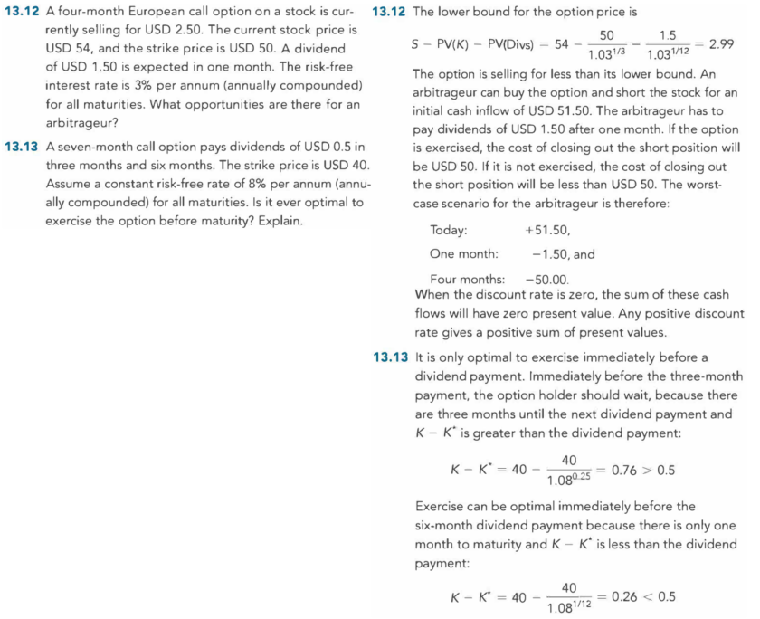

##  期权定价：二叉树模型

-   *Binominal Tree* 二叉树模型：代表期权期限内可能出现的股票价格变动路径
    -   二叉树模型特点
        -   *Path-Dependent* 依赖路径的模型：期权价值不仅取决于到期时标的资产价值，还取决于各时间点的价格路径
        -   适用于离散型数据下期权定价
    -   基本思想：在市场无套利机会、风险中性估值的假设下，构建包含期权的、具有无风险收益的资产组合确定期权价值
        -   *Risk Neutral Valuation* 风险中性估值：投资者对自己的承担的风险不要求风险补偿
        -   结合无套利假设，由风险中性估值可以引申结论
            -   **标的资产的期望收益率等于无风险收益率**：风险中性原则下，投资者不会给与风险资产更高期望收益率
            -   不存在风险补偿，期权的期望收益可用无风险利率折现

### 单步二叉树：无股息股票

$$\begin{align*}
\pi_u S_0 u + \pi_d S_0 d &= S_0 e^{R_f T}, \pi_u + \pi_d = 1 \\
\pi_u S_0 u + (1 - \pi_u) S_0 d &= S_0 e^{R_f T} \\
\Rightarrow \pi_u &= \frac {e^{R_f T} - d} {u - d} \\
C_0 &= (\pi_u C_u + \pi_d C_d) e^{-R_f T} \\
    &= (\pi_u max(S_0 u - X, 0) + \pi_d max(S_u d - X, 0)) e^{-R_f T} \\
P_0 &= (\pi_u P_u + \pi_d P_d) e^{-R_f T} \\
    &= (\pi_u max(X - S_0 u, 0) + \pi_d max(X - S_u d, 0)) e^{-R_f T} \\
\end{align*}$$
> - $S_0, S_0 u, S_0 d$：期初（0 时刻）股票价格、股票上涨情况下股票价格、股票下跌情况下股票价格
> - $\pi_u, \pi_d$：资产价格上涨、下跌概率
> - $C_u, C_d$：期权到期后，股票价格上涨、下跌时看涨期权价值
> - $P_u, P_d$：期权到期后，股票价格上涨、下跌时看跌期权价值
> - $X$：期权行权价格
> - $C_0, P_0$：期初看涨期权、看跌期权价值

-   *One-Step Tree* 单步二叉树构建：股价只经过一步波动在 $T=1$ 时刻形成上涨、下跌两种情况之一
    -   前提假设：涨幅 $u$、跌幅 $d$ 固定
        -   可取 $u = e^{\sigma \sqrt {\Delta T}}, d = e^{-\sigma \sqrt {\Delta T}}$（$\sigma$ 为 **收益波动**、标准差）
            -   即，假设资产收益较短时间 $\Delta t$ 内服从正态分布 $N(0, \sigma^2 \Delta t)$（同 *BSM* 模型假设）
            -   考虑，二叉树构建过程中 **每步收益 $R$ 方差也应为 $\sigma^2 \Delta t$**
                $$\begin{align*}
                E(R^2) - (E(R))^2 = \pi_u (u-1)^2 + \pi_d(d-1)^2 - (\pi_u(u-1) + \pi_d(d-1))^2 &= \sigma^2 \Delta t \\
                \pi_u(1 - \pi_u)(u - d)^2 &= \sigma^2 \Delta t \\
                \Rightarrow e^{R_f \Delta t}(u+d) - ud - e^{2R_f \Delta t} &= \sigma^2 \Delta t \\
                \end{align*}$$
            -   则，$u = e^{\sigma \sqrt {\Delta T}}, d = e^{-\sigma \sqrt {\Delta T}}$ （泰勒展开后近似）满足上述波动条件
                $$\begin{align*}
                u = e^{\sigma \sqrt {\Delta T}} &\approx 1 + \sigma \sqrt {\Delta T} + \frac 1 2 \sigma^2 \sqrt {\Delta T} \\
                e^{R_f \Delta T} &\approx 1 + R_f \Delta T \\
                \end{align*}$$
            -   实际应用多使用 `30-50` 步二叉树，此时 $\Delta T$ 确实较小
    -   根据无套利假设、风险中性原则，可引申得到
        -   资产期望回报率为无风险利率
        -   期权价值只包含内在价值
        -   期权期望回报率也为无风险利率（可用无风险利率折现）（折现依赖无套利假设）
    -   则有资产价格上涨概率 $\pi_u$、下跌概率 $\pi_d = 1 - \pi_u$ 也固定，且与涨辐、跌幅反比
        -   无风险收益率 $d \leq e^{R_f T} \leq u$
        -   涨跌概率即与 $e^{R_f T} - d$、$u - e^{R_f T}$ 成比例
    -   在期权到期时，**期权时间价值为 0，仅包含内在价值**
        -   对应资产价格上涨、下跌，欧式期权价值不同
        -   期权在 $0$ 时刻价值期望可根据 $\pi_u, \pi_d$ 加权、贴现得到

####    期权的 $\Delta$

$$\begin{align*}
\Delta S_0 u + P_u &= \Delta S_0 d + P_d \\
\Delta S_0 u - C_u &= \Delta S_0 d - C_d \\
\Delta &= -\frac {P_u - P_d} {S_0 u - S_0 d} \\
    &= \frac {C_u - C_d} {S_0 u - S_0 d} \\
\end{align*}$$
> - $\Delta$：为保证资产价值不变，资产组合中一份期权头寸对应的股票头寸数量
> - $P_u, P_d, C_u, C_d$：股票价格上涨、下跌时看跌期权价值，股票价格上涨、下跌时看涨期权价值

-   考虑 *Protective Put* 保护看跌期权（股票多头、看跌期权多头）（或 *Covered Call* 备保看涨期权）
    -   $\Delta$ 即二叉树模型中期权的对冲比率
        -   即，一份期权可以对冲 $\Delta$ 份资产价格变化
    -   根据无套利原则，无论股票价格上涨、下跌，在 $T=1$ 时刻资产组合价值应相等
        -   若期权 `市场价格 > 理论价格`
            -   可做空 $\Delta$ 份股票、做空 1 份看跌期权
            -   或，做多 $\Delta$ 份股票、做空 1 份看涨期权
        -   若期权 `市场价格 < 理论价格`
            -   可做多 $\Delta$ 份股票、做多 1 份看跌期权
            -   或，做空 $\Delta$ 份股票、做多 1 份看涨期权

####    期权平价公式

$$\begin{align*}
C - P &= (\pi_u C_u + \pi_d C_d) - (\pi_u P_u + \pi_d P_d) \\
    &= (\pi_u max(S_0 u - X, 0) + \pi_d max(S_0 d - X, 0)) - (\pi_u max(X - S_0 u, 0) + \pi_d max(X - S_0 d, 0)) \\
    &= \pi_u (S_0 u - X) + \pi_d (S_0 d - X) \\
    &= \frac 1 {u - d} ((e^{R_f T} - d)(S_0 u - X) + (u - e^{R_f T})(S_0 d - X)) \\
    &= \frac 1 {u - d} ((u - d)(e^{R_f T} S_0 - X)) \\
    &= e^{R_f T} S_0 - X \\
\end{align*}$$

-   二叉树模型基于无套利假设，欧式期权二叉树模型计算的（相同期限、执行价格）看涨、看跌期权价格满足期权平价公式
    -   计算 $T=1$ 时刻看涨、看跌期权价值差（简单折现即为 $T=0$ 时刻价值差）即得期权平价公式
        -   看涨、看跌期权的差价无需对 $T=1$ 时刻股价做讨论（或者，所有情况下差价表达式均应相同）
        -   计算只依赖：股票、期权预期收益率均为无风险利率 $e^{R_f T}$
            -   则，涨跌概率 $\pi_u, \pi_d$ 与涨幅负相关
            -   则，期权贴现率也为无风险利率
    -   直观上，看涨、看跌期权内在价值之间的差异被其价值实现的概率所平衡
        -   价值差异、涨跌概率的差异则是由股票价格预期收益为无风险收益的假设得到

####    两步二叉树

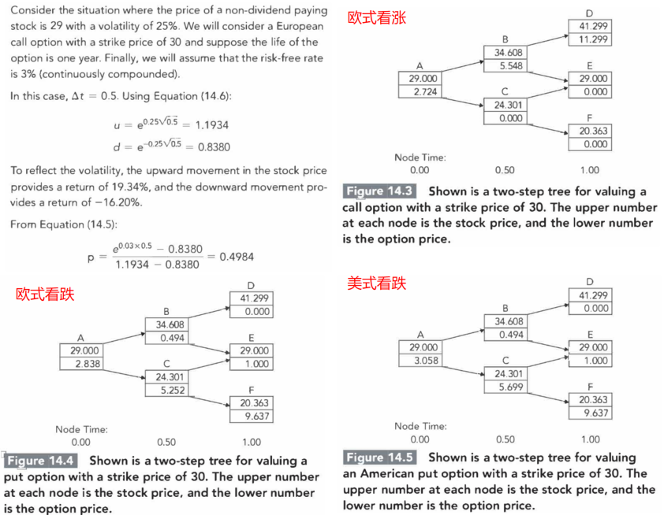

-   *Binary-Step Trees* 两步二叉树：单步二叉树模型基础上，考虑股票经过 2 步波动后到期
    -   假设同单步二叉树，但是
        -   股票价格经过 2 步波动，有三种可性能
        -   需分 2 步倒推期权价值
        -   同样假设，每步波动时点在期限内均匀分布，则 2 步二叉树中每步波动价格为
            $$\begin{align*}
            u &= e^{\sigma \sqrt{\Delta T/2}} \\
            d &= e^{-\sigma \sqrt{\Delta T/2}} \\
            \end{align*}$$
    -   美式期权可以提前行权，其两步二叉树定价方法与欧式期权不一样
        -   需要在各节点计算 **提前行权收益、贴现倒推预期收益**
        -   据此选择是否提前行权
    -   *Multi-Step Trees* 多步二叉树：单步二叉树模型基础上，考虑股票经过多步波动价格、期权价值
        -   实际中，估计期权价值时，需要 30-50 步二叉树模型

#### FRM 例题

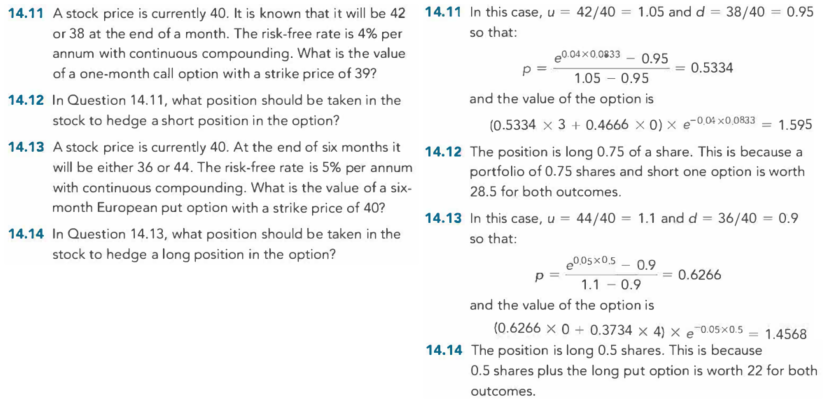
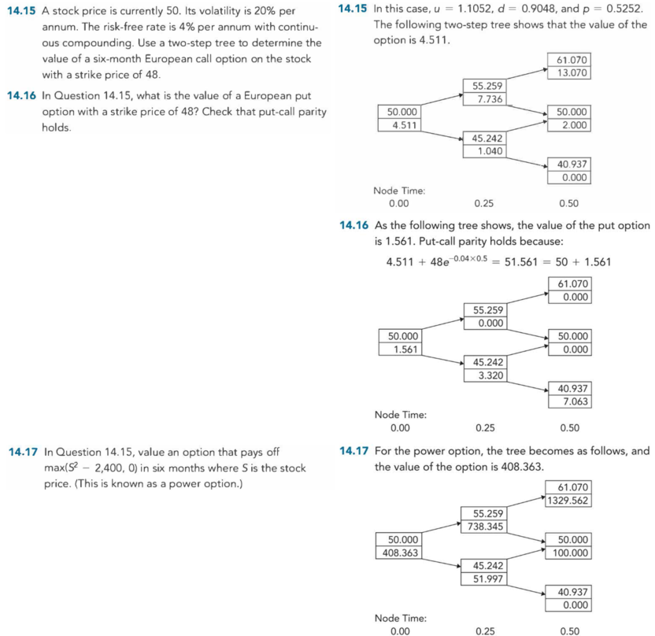

### 其他标的资产的期权定价

-   标的资产存在的预期收益将影响二叉树模型中资产价格涨、跌概率，进而影响期权定价
    -   股指期权：支付股息，分红收益率 $q$
        $$\begin{align*}
        \pi_u S_0 u + \pi_d S_0 d &= S_0 e^{(R_f - q) T} \\
        \pi_u + \pi_d &= 1 \\
        \pi_u S_0 u + (1 - \pi_u) S_0 d &= S_0 e^{(R_f - q) T} \\
        \pi_u &= \frac {e^{(R_f - q) T} - d} {u - d} \\
        \end{align*}$$
    -   外汇期权：外汇视为收益率为外国无风险利率 $r_x$ 的资产
        $$\begin{align*}
        \pi_u S_0 u + \pi_d S_0 d &= S_0 e^{(R_f - r_x) T} \\
        \pi_u + \pi_d &= 1 \\
        \pi_u S_0 u + (1 - \pi_u) S_0 d &= S_0 e^{(R_f - r_x) T} \\
        \pi_u &= \frac {e^{(R_f - r_x) T} - d} {u - d} \\
        \end{align*}$$
    -   期货期权：期货当日结算盈亏（连续复利），视为分红收益率为 $R_f$ 的股票
        $$\begin{align*}
        \pi_u &= \frac {e^{(R_f - R_f) T} - d} {u - d} \\
            &= \frac {1 - d} {u - d} \\
        \end{align*}$$

###  期权定价：*BSM* 模型

$$\begin{align*}
ln S_t &\sim N(\mu + ln S_{t-1}, \sigma^2) \\
\Rightarrow ln \frac {S_t} {S_{t-1}} &\sim N(\mu, \sigma^2) \\
u_t &\sim N(\mu, \sigma^2), u_t = ln \frac {S_t} {S_{t-1}} \\
\end{align*}$$
> - $\mu, \sigma^2$：收益分布的均值、方差

$$\begin{align*}
\forall t, \lim_{\Delta t \rightarrow 0} & \frac {S_{t + \Delta t} - S_t} {S_t}
    \sim N(\mu \Delta t, \sigma^2 \Delta t) \\
\Rightarrow & E(S_t) = \lim_{\Delta t \rightarrow 0}
    S_0 (1 + \mu \Delta t)^{t / \Delta t} = S_0 e^{\mu t} \\
\Rightarrow & \begin{cases}
    E(ln(S_t)) &= ln(S_0) + (\mu - \frac {\sigma^2} 2) t
        < ln(S_0) + \mu t = ln(E(S_t)) \\
    SD(ln(S_t)) &= \sigma \sqrt t \\
    ln(S_t) &\sim N(ln(S_0) + (\mu - \frac {\sigma^2} 2) t, \sigma^2 t) \\
\end{cases} \\
\Rightarrow & \begin{cases}
    & S_t = S_0 e^{R_t t} \\
    \Rightarrow & R_t = \frac 1 t ln(\frac {S_t} {S_0})
        \sim N(\mu - \frac {\sigma^2} 2, \frac {\sigma^2} t) \\
\end{cases} \\
\end{align*}$$
> - $\mu, \sigma^2$：较短时间 $\Delta t$ 时，股票（连续复利）年化收益率均值、方差
> - $R_t$：较长时间 $t$ 时，股票（连续复利）年化收益率（表达式更简洁）
> - $S_0, S_t$：$0$ 时刻股票价格、$t$ 时刻股票价格
> - $E(ln(S_t)) \leq ln(E(S_t))$：$t$ 时刻股票价格对数期望（小于期望对数）

-   *BSM* 模型前提假设：考虑 $\mu, \sigma^2$ 为较长时间（年）的股票收益率均值、方差
    -   无分红股票收益率在相对短时间（天、周） $\Delta t$ 内服从正态分布
        -   且，有时假设相对短时间内收益率为 0
        -   此时，相对长时间 $t$ 后 **股票价格** 服从 *Lognormal Distribution* 对数正态分布
            -   且价格上涨、下跌平稳，具有连续性
        -   即，较短时间段、较长时间段收益率分布不同、估计逻辑不同
        -   则，股票年化收益率均值 $\mu$、标准差 $\sigma$ 有两种估计方式
            -   考虑，短期限（天）股票价格序列 $S_t,t=0, 1, \cdots, T$
                $$\begin{align*}
                r_t &= \frac {S_t - S_{t-1}} {S_t},t=1, \cdots, T \\
                \Rightarrow & \begin{cases}
                    \mu = E(r_t) * 252 \\
                    \sigma = SD(r_t) * \sqrt {252}
                \end{cases}
                \end{align*}$$
            -   考虑，较长期限（周、月）股票价格序列 $S_t,t=0, 1, \cdots, T$
                $$\begin{align*}
                u_t &= ln(\frac {S_t} {S_{t-1}}),t=1, \cdots, T \\
                \Rightarrow & \begin{cases}
                    \mu = E(u_t) * 12 \\
                    \sigma = SD(r_t) * \sqrt {12}
                \end{cases}
                \end{align*}$$
                > - $u_t$：对数收益率，即 **连续复利情况下收益率算法**，$r_t$ 百分比收益率即普通复利下收益率算法
    -   其他前提假设
        -   *BSM* 模型仅可用于欧式期权：最初为不支付股息的欧式股票期权，之后扩展为离散形式支付股息的欧式股票期权、其他标的资产的欧式期权
        -   允许投资者以无风险利率、连续复利形式借贷、投资
        -   市场无摩擦
            -   无交易税收、交易成本、监管限制
            -   价格稳定、无套利机会
            -   标的资产高流动性的、可连续交易、无限分割
            -   允许卖空标的资产，所获资金可以以无风险利率投资

####    *BSM* 模型定价

$$\begin{align*}
& \begin{cases}
    C_0 &= (S_0 - PV(Divs)) e^{-qT} N(d_1) - X e^{-R_f T} N(d_2) &, 欧式看涨期权 \\
    P_0 &= X e^{-R_f T} N(-d_2) - (S_0 - PV(Divs)) e^{-qT} N(-d_1) &, 欧式看跌期权 \\
        &= X e^{-R_f T} (1 - N(d_2)) - (S_0 - PV(Divs)) e^{-qT} (1 - N(d_1)) \\
        &= X e^{-R_f T} - (S_0 - PV(Divs)) e^{-qT} + C_0 \\
\end{cases} \\
d_1 &= \frac {ln \frac {S_0 - PV(Divs)} X + (R_f - q + \frac {\sigma^2} 2) T} {\sigma \sqrt T} \\
d_2 &= \frac {ln \frac {S_0 - PV(Divs)} X + (R_f - q - \frac {\sigma^2} 2) T} {\sigma \sqrt T} \\
    &= d_1 - \sigma \sqrt T \\
\end{align*}$$
> - $N$：标准正态分布的累计分布函数
> - $q$：连续复利表示的资产的持有收益率，正值即股票股息、债券利息等收益，负值即存储费用等成本
> - $PV(Divs)$：离散支付表示的资产收益现值（与资产收益率 $q$ 最多选择其一非 0）

-   *BSM* 模型同样满足期权平价
    -   $q = 0, PV(Divs) = 0$ 时即无股息的欧式期权定价
    -   $(S_0 - PV(Divs)) e^{-q T} N(d_1)$：$T$ 时刻标的资产价值贴现
        -   $(S_0 - PV(Divs)) N(d_1)$：$T$ 时刻期望的标的资产价值
            -   其中包含标的资产的波动
            -   即，*BSM* 期权价格包含期权的内在价值和时间价值
        -   $e^{-q T}$：资产价值使用资产收益率在连续复利情况下贴现
            -   资产持有收益会降低资产未来的预期价值，降低欧式看涨期权价值、增加欧式看跌期权价值
            -   对股指期权：$q$ 即股息回报率
            -   对外汇期权：$q$ 即外汇无风险利率
            -   对期货期权：$q$ 也为无风险利率 $R_f$
        -   $PV(Divs)$：离散支付表示的资产收益现值
            -   与 $q$ 最多选择其一，均为 0 即表示无股息
    -   $X e^{-R_f T} N(d_2)$：$T$ 时刻等价与标的资产的现金（零息债券）价值贴现
        -   $X N(d_2)$：$T$ 时刻等价与标的资产的现金（零息债券）价值
            -   $N(d_2)$ 实际上表示看涨期权的行权概率
        -   $e^{-R_f T}$：现金使用无风险收益率在连续复利情况下贴现

####    FRM 例题

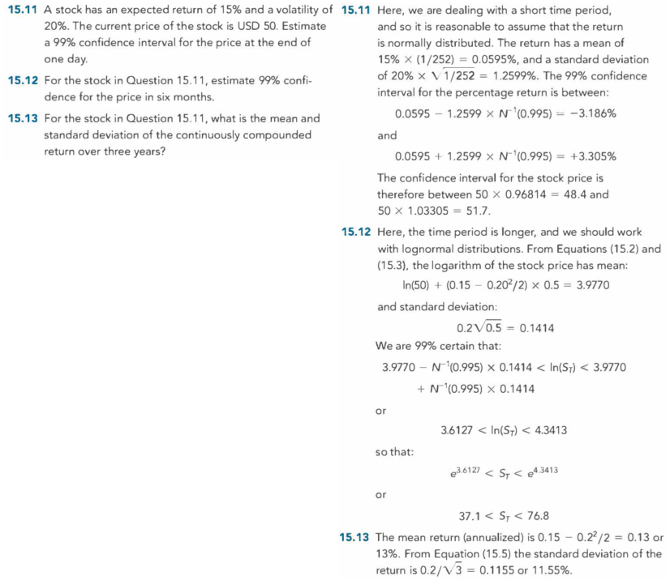
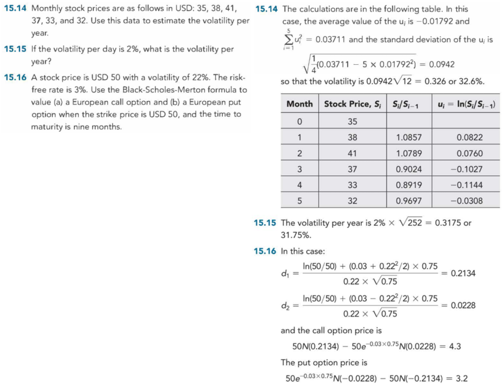
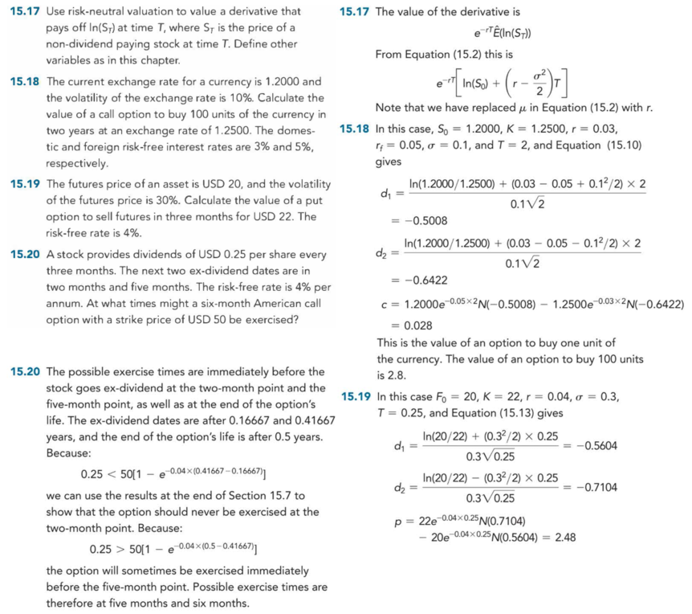

##  期权敏感度计量：期权的希腊字母 *the Greek Letters*

### $\Delta$ *Delta*

$$\begin{align*}
\Delta_C = \frac {\partial C} {\partial S}
    & = e^{-qT}N(d_1) + (S - PV(Divs) - X e^{-R_f T}) N^{'}(d_1) \frac 1 {\sigma \sqrt T S} \\
    & \approx e^{-q T} N(d_1) \geq 0 \\
\Delta_P = \frac {\partial P} {\partial S}
    & \approx -e^{-q T} N(-d_1) = e^{-qT} (N(d_1) - 1) \leq 0 \\
\end{align*}$$
> - $N^{'}$：标准正态分布的概率密度函数

-   $\Delta$ *Delta*：标的资产价格对期权价格的一阶影响（期权价格对标的资产价格的导数）
    -   $q=0$ 时，*Delta* 即无股息股票的最优对冲比率
    -   看涨期权 $\Delta_C > 0$ 与资产价格正相关
    -   看跌期权 $\Delta_P < 0$ 与资产价格负相关
    -   $\Delta$ 绝对值可代表期权内在价值对期权整体价值的影响程度
        -   实值期权的期权内在价值逐渐占主导地位，期权价格受资产价格影响大
            -   实值期权 $\Delta$ 绝对值大，趋近于 $e^{-qT}$
            -   虚值期权 $\Delta$ 绝对值小，趋于 0
            -   平值期权 $\Delta$ 约等于 `0.5`
        -   $d_1$ 随股价 $S$ 上升而上升时，$N(d_1)$ 趋近于 1
            -   欧式看涨期权趋于实值，$\Delta_C > 0$ 增大趋近于 $e^{-qT}$
            -   欧式看跌期权趋于虚值，$\Delta_C < 0$ 增大趋近于 0
        -   $d_1$ 随股价 $S$ 下降而下降时，$N(d_1)$ 趋近于 0
            -   欧式看涨期权趋于虚值，$\Delta_C > 0$ 减小趋近于 0
            -   欧式看跌期权趋于实值，$\Delta_C < 0$ 减小趋近于 $-e^{-qT}$
    -   投资组合（对标的资产）的 *Delta* 为各资产 *Delta* 的加权平均（股票价格对整个投资组合价格的影响）
        $$ \Delta_{portfolio} = \sum_{i=1}^n w_i \Delta_i $$
        -   股票自身 *Delta* 为 1
        -   远期合约 *Delta* 为 1、$e^{-qT}$
        -   期货合约 *Delta* 为 $e^{R_f T}$、$e^{(R_f - q)T}$

####    *Delta* 对冲

$$\begin{align*}
N_{call} &= -\frac {N_{stock}} {\Delta_{call}} \\
N_{put} &= -\frac {N_{stock}} {\Delta_{put}} \\
\end{align*}$$
> - $N_{stock}$：股票数量
> - $N_{call}, N_{put}$：对冲股票空头的看涨期权数量、对冲股票多头的看跌期权数量
> - 对冲中负号表示反向操作

-   对冲策略
    -   *Stop-Loss* 策略：期权空头进入实值时做多对应资产、在期权进入虚值时做空资产，否则仅只有出售期权的裸头寸
        -   需确定触发做多、做空资产的时点，即资产价格偏离行权价格的幅度
        -   但，在资产价格在行权价格附近反复波动时，资产买卖价差的成本较高
    -   *Delta Hedge*：期权空头在对每份看涨期权空头做多 $\Delta$ 份资产（看跌期权做空 $\Delta$ 份资产）
        -   *Delta Neutral* *Delta* 中性投资组合：将标的资产与期权相结合，使整个投资组合的价值不随标的资产价格变化而变化
            -   *Dynamic-Hedging* 动态对冲：标的资产价值变化较大导致投资组合不再 *Delta Neutral* 时，需要按需平衡
            -   *Static-Hedging*、*Hedge and forget* 静态对冲
        -   *Buy-high,sell-low* 涨价买入、降价卖出
            -   看涨期权 $\Delta_C > 0$ 与资产价格正相关，故资产价格升高时需要增加做多资产
            -   看跌期权 $\Delta_P < 0$ 与资产价格负相关，故资产价格升高时需要减少做空资产

### $\Gamma$ *Gamma*

$$\begin{align*}
\Gamma_C = \Gamma_P = \frac {\partial^2 C} {\partial S^2}
    & \approx \frac {e^{-q T}} {S \sigma \sqrt T} N^{'}(d_1) \geq 0 \\
\end{align*}$$

-   $\Gamma$ *Gamma*：标的资产价格对期权价格的二阶影响（期权价格对对标的资产价格的二阶偏导）
    -   标的相同、期限相同、行权价格的看涨、看跌期权 $\Gamma$ 值相等
    -   $\Gamma$ 总为正值，即 $\Delta$ 总随资产价格增大而增大
        -   看涨期权 $\Delta_C > 0$ 与资产价格正相关
            -   资产价格上涨，看涨期权内在价值主导地位越大，$\Delta_C > 0$ 越大
        -   看跌期权 $\Delta_P < 0$ 与资产价格负相关
            -   资产价格上涨，看涨期权内在价值主导地位越小，$\Delta_P < 0$ 越大（绝对值越小）
    -   $\Gamma$ 在期权平值附近取最大值，即资产价格在行权价格附近时，资产价格变动对 $\Delta$ 影响最大
        -   期权为深度实值、深度虚值时，*Gamma* 趋向于 0
    -   期限越长，期权时间价值对期权价格影响越大，*Gamma* 变化越平缓（平峰、厚尾）

####    *Gamma* 对冲

-   *Gamma* 风险：*BSM* 模型中价格连续变化假设被打破，*Delta* 中性的投资组合不再中性，出现 *Delta* 非中性敞口
    -   需要构建 *Delta Neutral* 且 *Gamma Neutral* 中性的组合头寸
        -   利用非线性金融工具（期权、债券）构建 *Gamma Neural* 中性头寸
        -   再利用线性金融工具（股票、远期）构建 *Delta Neural* 中性头寸

### $V$ *Vega*

$$ V_C = V_P = \frac {\partial C} {\partial \sigma} \approx S \sqrt T N^{'}(d_1) \geq 0 $$

-   *Vega*：标的资产价格波动对期权价格的影响（期权价格对标的资产价格波动的偏导）
    -   标的相同、期限相同、行权价格的看涨、看跌期权 *Vega* 值相等
    -   *Vega* 总为正值：期权价格与资产价格波动正相关
        -   期权平值附近时，期权的时间价值占主导地位，*Vege* 较大
            -   波动率越大，期权的时间价值越大
        -   期限越长，期权时间价值越大、对期权价值影响越大，*Vega* 越大

### $\Theta$ *Theta*

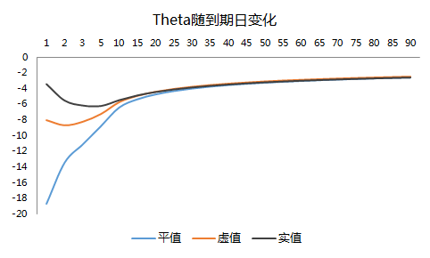

-   $\Theta$ *Theta*：期权期限对期权价格的影响（期权价格对期限的偏导）
    -   也称，*Time Decay* 时间损耗引起的期权价值的变化的敏感度
    -   *Theta* 一般为负值：期权时间价值随期限减少而减少（随时间点 $t$ 增加而减少）
        -   短期平值期权的 $\theta$ 最小 *Greatest Negative*
        -   但，深度实值看跌期权的 $\theta$ 可能为正
            -   股票价格不可能为负值
            -   深度实值看跌期权等价于面值为执行价格 $X$ 的债券，提前行权可以尽早获得现金流
    -   期限不是风险因子，无需对冲

### $\rho$ *Rho*

$$\begin{align*}
\rho_C &= \frac {\partial C} {\partial R_f} \approx XT e^{-R_f T} N(d_2) > 0 \\
\rho_P &= \frac {\partial P} {\partial R_f} \approx -XT e^{-R_f T} N(d_2) < 0 \\
\end{align*}$$

-   $\rho$ *Rho*：无风险利率对期权价格的影响（期权价格对无风险利率的偏导）
    -   看涨期权 $\rho_C > 0$ 与无风险利率正相关，看跌期权 $\rho_P < 0$ 与无风险利率负相关
        -   无风险利率越高，看涨期权延迟支付的可获得收益越大，期权价格越高
        -   无风险利率越高，看跌期权延迟收入本可获得收益越大，期权价格越低
        -   考虑 `看涨期权 + 无风险债券`、`看跌期权 + 股票`
            -   无风险利率升高时，`看涨期权 + 债券` 收益更多，看涨期权成本（价格、价值）应更高
            -   `看跌期权 + 股票` 收益更少，看跌期权组合成本（价格、价值）应更低

##  期权策略

-   期权策略：**依据资产价格变动预期，考虑如何构建期权组合以对获取该预期的收益**
    -   即，先有预期，再考虑如何构建组合在预期实现时获取收益、控制损失、降低成本
        -   收益：来源于期权行权、期权费
        -   损失控制：同时买入、卖出期权控制损失上限，但放弃超额收益
        -   降低成本：做空期权赚取期权费降低成本
    -   *Portfolio Insurance* 资产组合保险、证券组合保险：动态资产配置，确保最低回报率的同时，不失去从市场有利变动获利的机会
        -   常用即，持有资产多头头寸、看跌期权多头头寸
#TODO

### 单个期权策略

-   单个期权策略
    -   *Covered Call* 备保看涨期权 $S - C$：持有标的股票多头头寸、卖出看涨期权构成的资产组合
        -   等价于，卖出看跌期权、并持有无风险债券
        -   通过出售虚值的欧式看涨期权获取额外的期权费收益，但放弃了股价高于执行价格的收益
    -   *Protective Put* 保护看跌期权 $S + P$：持有标的股票多头头寸、买入看跌期权构成的资产组合
        -   股价上涨时获利、下跌时利用看跌期权控制损失
    -   *Structured Financial Instruments/Products* 结构化金融工具、产品：根据具体需求涉及的资产组合
        -   核心特征：对资产现金流进行重塑，以便重新分配风险
            -   通常为一个传统固收证券加至少一个衍生工具
        -   *Principal Protected Notes* 保本型证券：保证本金不受标的资产价格波动影响
            -   *Guarantee Certificate* 保证凭证：零息债券和看涨期权多头组成
                -   债券折价部分购买看涨期权

### 价差策略

-   价差策略：同时做多、做空标的相同的期权，通过期权价差、执行价差获取收益
    -   相同标的、到期时间，执行价格 $X_H > X_L$ 不同的期权价格差异
        -   对看涨期权，执行价格越低期权价格越高
        -   对看跌期权，执行价格越高期权价格越高
    -   相同标的、执行价格，到期时间 $T_2 > X_1$ 不同的期权价格差异
        -   到期时间越长，期权价格越高
    -   价差策略核心：做多的同时 `1:1` 做空，只是在行权价格、期限上有差异
        -   行权价差异的价差策略（除日历价差）**收益有上限，即价差**，损失（成本）也被控制

> - 期权策略：<https://www.cmegroup.cn/education/Optionsstrategies/>
> - *CFA* 三级知识点：<https://www.zhihu.com/column/c_1482914325425344512>

####    牛市价差

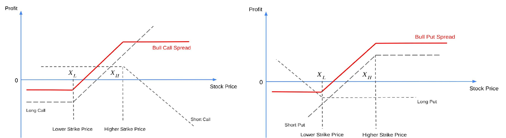

| 股价                    | 看涨多头收益 $X_L$ | 看涨空头收益 $X_H$ | 总收益      | 利润                           |
|-------------------------|--------------------|--------------------|-------------|--------------------------------|
| $S_T \leq X_L$          | 0                  | 0                  | 0           | $C_H - C_L \leq 0$             |
| $X_L \leq S_T \leq X_H$ | $S_T - X_L$        | 0                  | $S_T - X_L$ | $C_H - C_L + S_T - X_L$        |
| $S_T \geq X_H$          | $S_T - X_L$        | $-(S_T - X_H)$     | $X_H - X_L$ | $C_H - C_L + X_H - X_L \geq 0$ |

-   *Bull Spread* 牛市价差：预期资产价格上涨的行情（**总是做空高执行价期权、做多低执行价期权**）
    -   *Bull Call Spread* 牛市看涨期权价差：赚资产价格上涨收益 $X_H - X_L + C_H - C_L > 0$
        -   做多执行价格 $X_L$ 的看涨期权 $C_L$
        -   做空执行价格 $X_H > X_L$ 的看涨期权 $C_H < C_L$
    -   *Bull Put Spread* 牛市看跌期权价差：赚期权费差价 $P_H - P_L > 0$
        -   做多执行价格 $X_L$ 的看跌期权 $P_L$
        -   做空执行价格 $X_H > X_L$ 的看跌期权 $P_H > P_L$

| 股价                    | 看跌多头收益 $X_L$ | 看跌空头收益 $X_H$ | 总收益      | 利润                           |
|-------------------------|--------------------|--------------------|-------------|--------------------------------|
| $S_T \leq X_L$          | $X_L - S_T$        | $-(X_H - S_T)$     | $X_L - X_H$ | $P_H - P_L + X_L - X_H \leq 0$ |
| $X_L \leq S_T \leq X_H$ | 0                  | $-(X_H - S_T)$     | $S_T - X_H$ | $P_H - P_L + S_T - X_H$        |
| $S_T \geq X_H$          | 0                  | 0                  | 0           | $P_H - P_L \geq 0$             |

> - 注：此处利润均假设期权费在期权到期时点支付，或视为期权费在到期时未来值，下同（除盒式价差）

####    熊市价差

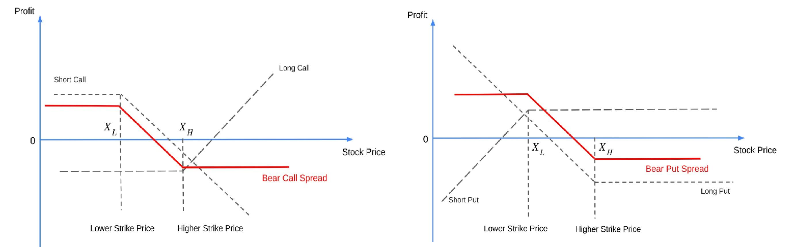

| 股价                    | 看涨多头收益 $X_H$ | 看涨空头收益 $X_L$ | 总收益      | 利润                           |
|-------------------------|--------------------|--------------------|-------------|--------------------------------|
| $S_T \leq X_L$          | 0                  | 0                  | 0           | $C_L - C_H \geq 0$             |
| $X_L \leq S_T \leq X_H$ | 0                  | $-(S_T - X_L)$     | $X_L - S_T$ | $C_L - C_H + X_L - S_T$        |
| $S_T \geq X_H$          | $S_T - X_H$        | $-(S_T - X_L)$     | $X_L - X_H$ | $C_L - C_H + X_L - X_H \geq 0$ |

-   *Bear Spread* 熊市价差：预期资产价格下跌的行情（**总是做多高执行价期权、做空低执行价期权**，可视为做空 *Bull Spread*）
    -   *Bear Call Spread* 熊市看涨期权价差：赚期权费差价 $C_L - C_H \geq 0$
        -   做多执行价格 $X_H$ 的看涨期权 $C_H$
        -   做空执行价格 $X_L < X_H$ 的看涨期权 $C_L > C_H$
    -   *Bear Put Spread* 熊市看跌期权价差：赚资产价格下降收益 $X_H - X_L + P_L - P_H > 0$
        -   做多执行价格 $X_H$ 的看跌期权 $P_H$
        -   做空执行价格 $X_L < X_H$ 的看跌期权 $P_L < P_H$

| 股价                    | 看跌多头收益 $X_H$ | 看跌空头收益 $X_L$ | 总收益      | 利润                           |
|-------------------------|--------------------|--------------------|-------------|--------------------------------|
| $S_T \leq X_L$          | $X_H - S_T$        | $-(X_L - S_T)$     | $X_H - X_L$ | $P_L - P_H + X_H - X_L \geq 0$ |
| $X_L \leq S_T \geq X_H$ | $X_H - S_T$        | 0                  | $X_H - S_T$ | $P_L - P_H + X_H - S_T$        |
| $S_T \geq X_H$          | 0                  | 0                  | 0           | $P_L - P_H \leq 0$             |

####    盒式价差

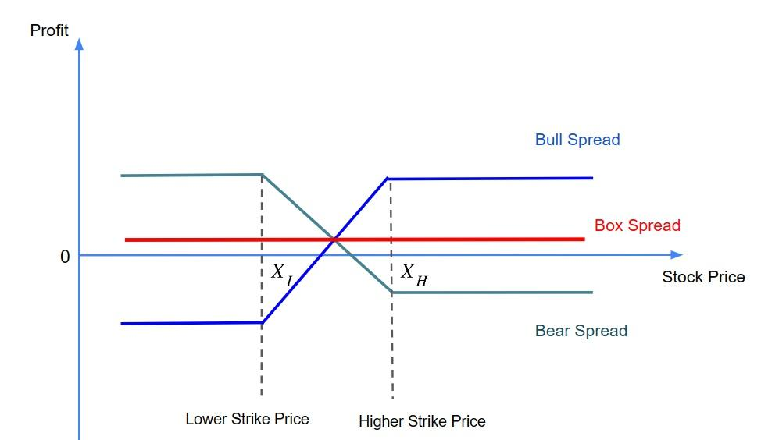

| 股价                    | 牛市价差看涨 | 熊市价差看跌 | 总收益      |
|-------------------------|--------------|--------------|-------------|
| $S_T \leq X_L$          | 0            | $X_H - X_L$  | $X_H - X_L$ |
| $X_L \leq S_T \geq X_H$ | $S_T - X_L$  | $X_H - S_T$  | $X_H - X_L$ |
| $S_T \geq X_H$          | $X_H - X_L$  | 0            | $X_H - X_L$ |

-   *Box Spread* 盒式价差：判断市场是否存在套利机会
    -   *Long Box Spread*：同时做多 *Bull Call Spread* 和 *Bear Put Spread*
        -   盒式价差的期末收益恒为 $X_H - X_L > 0$
        -   则，期权费在期初应有 $C_H - C_L + P_L - P_H < 0$ 
        -   故，期权费作为策略成本应有 $C_L - C_H + P_H - P_L = PV(X_H - X_L) = \frac {X_H - X_L} {(1 + R_f)^T}$，否则可以无风险套利
    -   *Short Box Spread*：同时做多 *Bull Put Spread* 和 *Bear Call Spread*（即，同时做空 *Bull Call Spread* 和 *Bear Put Spread*）
        -   盒式价差的期末收益恒为 $X_L - X_H < 0$
        -   则，期权费在期初应有 $C_L - C_H + P_H - P_L > 0$ （同上）
    -   相同执行价格看涨期权多头、看跌期权多头可视为一份远期合约
        -   则，盒式价差可视为价格相同的远期合约多头、远期合约空头

> - 期权策略（九）- *Box Spread*：<https://zhuanlan.zhihu.com/p/591640160>

####    蝶式价差

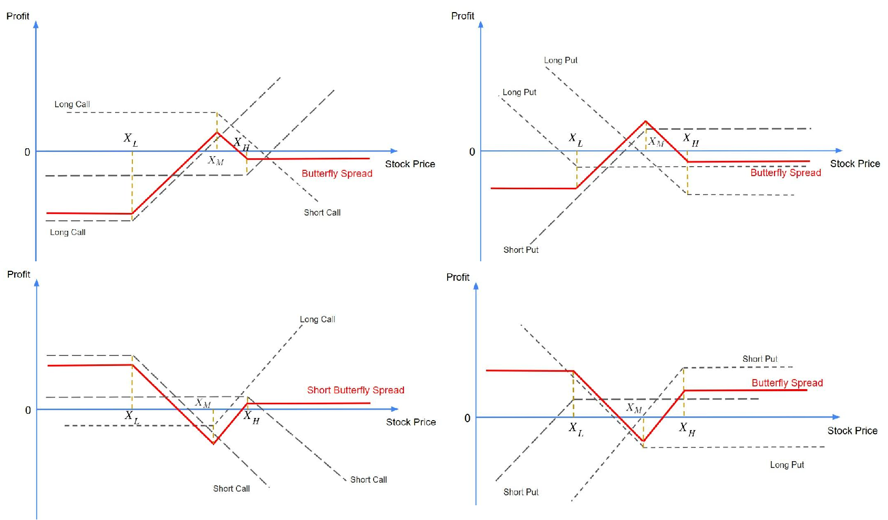

| 股价                    | 低价看涨多头 $X_L$ | 中间价看涨空头 $X_M$ | 高价看涨多头 $X_H$ | 总收益             |
|-------------------------|--------------------|----------------------|--------------------|--------------------|
| $S_T \leq X_L$          | 0                  | 0                    | 0                  | 0                  |
| $X_L \leq S_T \leq X_M$ | $S_T - X_L$        | 0                    | 0                  | $S_T - X_L \geq 0$ |
| $X_M \leq S_T \leq X_H$ | $S_T - X_L$        | $-2 * (S_T - X_M)$   | 0                  | $X_H - S_T \geq 0$ |
| $S_T \geq X_H$          | $S_T - X_L$        | $-2 * (S_T - X_M)$   | $S_T - X_H$        | 0                  |

-   *Butterfly Spread* 蝶式价差：预期资产价格波动不大，处于 $X_L, X_H$ 之间（**总是做多高低价，做空中间价**）
    -   *Butterfly Spread with Calls* 看涨期权版本
        -   做多两份执行价格 $X_L < X_H$ 看涨期权
        -   做空两份执行价格 $X_M = \frac {X_L + X_H} 2$ 看涨期权
    -   *Butterfly Spread with Puts* 看涨期权版本
        -   做多两份执行价格 $X_L < X_H$ 看跌期权
        -   做空两份执行价格 $X_M = \frac {X_L + X_H} 2$ 看跌期权
    -   蝶式价差收益为资产价格 $S_T$ 维持在 $X_L, X_H$ 之间的差价 $S_T - X_L > 0$、或 $X_H - S_T > 0$
        -   当，资产价格波动保持稳定时，蝶式价差策略可能获得较大收益
            -   $X_L \leq S_T \leq X_H$ 时，蝶式价差策略收益为正
            -   最大收益在 $S_T = X_M = \frac {X_L + X_H} 2$ 时取得，为 $X_M - X_L + 2 P_M - P_L - P_H$
        -   蝶式价差最终收益始终大于等于 0
            -   则，策略成本 $P_L + P_H - 2 P_M > 0$、$C_L + C_H - 2 C_M > 0$，否则可以无风险套利
            -   当然，按期权平价公式有 $P_L + P_M - 2 P_M = C_L + C_H - 2 C_M$

| 股价                    | 低价看跌多头 $X_L$ | 中间价看跌空头 $X_M$ | 高价看跌多头 $X_H$ | 总收益             |
|-------------------------|--------------------|----------------------|--------------------|--------------------|
| $S_T \leq X_L$          | $X_L - S_T$        | $-2 * (X_M - S_T)$   | $X_H - S_T$        | 0                  |
| $X_L \leq S_T \leq X_M$ | 0                  | $-2 * (X_M - S_T)$   | $X_H - S_T$        | $S_T - X_L \geq 0$ |
| $X_M \leq S_T \leq X_H$ | 0                  | 0                    | $X_H - S_T$        | $X_H - S_T \geq 0$ |
| $S_T \geq X_H$          | 0                  | 0                    | 0                  | 0                  |

-   *Short ButterFly Spread* **做空蝶式价差**：预期资产价格波动大
    -   将 *ButteFly Spread* 反向操作即可
    -   当资产价格波动 $S_T$ 较大，位于 $X_L, X_H$ 之外时获取正收益

> - 期权策略（十）- *Butterfly Spread*：<https://zhuanlan.zhihu.com/p/591640160>

####    日历价差

-   *Calendar Spread* 日历价差、水平价差、时间价差：预期资产价格短期不变，长期看涨、或看跌
    -   操作逻辑核心：`1:1` 做多长期、做空短期
        -   长期限 $T_L$ 看涨（或看跌）期权是目标预期，预期资产价格上涨（或下跌）
        -   反向短期限 $T_S$ 看涨（或看跌）期权用于控制（期权费）成本
    -   收益来源
        -   期权时间价差衰减差异（期货市场行为）
            -   期权的时间价值在临近到期日时消耗速度大于距到期日较远的时候
            -   则，长期限期权的时间价值在 $0 - T_S$ 之间损耗较短期限期权少
            -   即，二者之间的期权时间价值损耗差异即为收益
        -   资产价值波动率变化（资产价格隐含波动率）
            -   考虑资产价格在短期限 $T_S$ 符合预期，短期期权未行权
                -   资产波动率上升，仅存的长期限期权期权时间价值上升
                -   资产价格向预期方向变动，仅存的长期限期权内在价值上升
            -   否则，做多长期限期权收益也可用于弥补做空短期限期权损失
    -   具体的
        -   预期资产价格短期稳定，长期上涨：做多长期限 $T_L$ 看涨、做空短期限 $T_S$ 看涨
        -   预期资产价格短期稳定，长期下跌：做多长期限 $T_L$ 看跌、做空短期限 $T_S$ 看跌
    -   当然，**预期资产价格短期波动、长期稳定时，可以做空日历价差**

> - 期权交易策略：日历价差：<https://www.cmegroup.cn/education/11164.htm>
> - 也谈日历价差策略：<https://zhuanlan.zhihu.com/p/1902653465576080167>
> - 日历价差 *Calendar Spread*：<https://zhuanlan.zhihu.com/p/20902194>

### 组合策略

-   *Combination* 组合策略：由不同类型期权混合

> - 期权策略：<https://www.cmegroup.cn/education/Optionsstrategies/>
> - *CFA* 三级知识点：<https://www.zhihu.com/column/c_1482914325425344512>

####    *Straddle* 跨式组合

-   *Straddle* 跨式组合：预期资产价格大幅度偏离 $X$，但涨、跌方向不确定
    -   *(Long)Staddle* 同时 `1:1` 做多看涨、看跌期权
        -   预期资产价格未来将大幅波动，但不确定波动方向
        -   同时防御资产价格下降、上升的波动
            -   最大收益无限
            -   最大亏损为期权费 $-C-P$
            -   有两个 *Breakeven Price* 盈亏平衡点 $S_T = X - (C + P)$、$S_T = X + (C + P)$

| 股权      | 看涨多头  | 看跌多头  | 收益      |
|-----------|-----------|-----------|-----------|
| $S_T < X$ | 0         | $X - S_T$ | $X - S_T$ |
| $S_T > X$ | $S_T - X$ | 0         | $S_T - X$ |

-   *Short Staddle* 做空跨式组合：预期资产价格在 $X$ 附近
    -   即，将 *Straddle* 反向操作，同时做空看涨、看跌期权即可
        -   预期资产价格未来不会大幅波动（类似蝶式价差预期）
            -   最大收益无限
            -   收益即期权费 $C+P$
            -   有两个盈亏平衡点 $S_T = X - (C + P)$、$S_T = X + (C + P)$

####    *Straps and Strips* 带式、条式

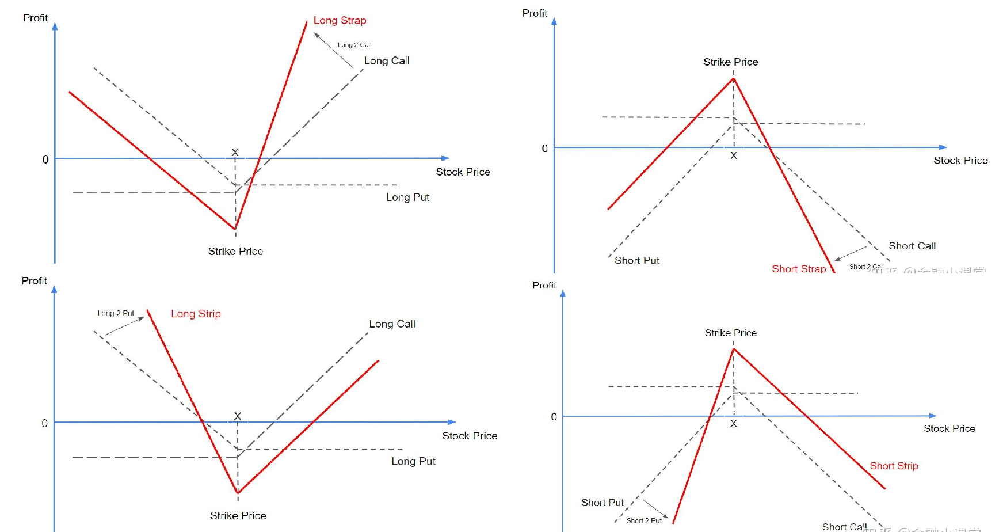

-   *Straps* 带式组合：类似 *Straddle* 预期资产价格大幅度偏离 $X$，但上涨概率更大
    -   *(Long)Straps* 同时 `n:1` 做多看涨、看跌期权
        -   预期资产价格未来将大幅波动，但价格上涨概率更大
    -   *Short Straps* 做空带式组合，同时 `n:1` 做空看涨、看跌期权
        -   预期资产价格未来不大幅波动，且价格上涨概率更小

-   *Strips* 条式组合：类似 *Straddle* 预期资产价格大幅度偏离 $X$，但下跌概率更大
    -   *(Long)Strips* 同时 `1:n` 做多看涨、看跌期权
        -   预期资产价格未来将大幅波动，但价格下跌概率更大
    -   *Short Strips* 做空带式组合，同时 `1:n` 做空看涨、看跌期权
        -   预期资产价格未来不大幅波动，**且价格下跌概率更小**

####    *Strangle* 宽跨式组合

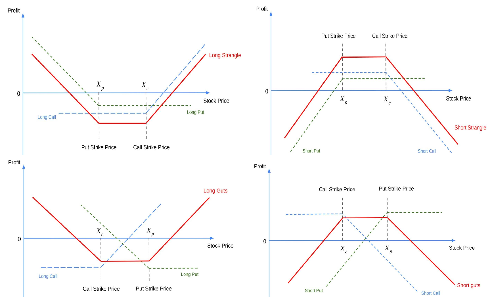

-   *Strangle* 宽跨式组合：类似 *Straddle*，但看涨行权价 $X_C > X_P$ 高于看跌行权价，以降低成本（期权费）
    -   *(Long)Strangle*：同时 `1:1` 做多看涨、看跌期权，但是 $X_C > X_P$
        -   预期资产价格未来将大幅波动，但不确定波动方向
            -   最大收益无限 $X_P - S_T$、$S_T - X_C$
            -   最大亏损为期权费 $-C-P$
            -   有两个盈亏平衡点 $S_T = X_C - (C + P)$、$S_T = X_P + (C + P)$
    -   *Short Strangle*：同时 `1:1` 做空看涨、看跌期权，但是 $X_C > X_P$
        -   预期资产价格未来不会大幅波动

| 股权              | 看涨多头    | 看跌多头    | 收益        |
|-------------------|-------------|-------------|-------------|
| $S_T < X_P$       | 0           | $X_P - S_T$ | $X_P - S_T$ |
| $X_P < S_T < X_C$ | 0           | 0           | 0           |
| $S_T > X_C$       | $S_T - X_C$ | 0           | $S_T - X_C$ |

> - 若 *Strangle* 中看涨行权价低于看跌行权价 $X_C < X_P$，被称为 *Guts*，与 *Strangle* 其实类似

#  债券

##  公司债券、国债、剥离债券

###  公司债券

-   *Corporate Bonds* 公司债券：发行人在指定日期支付事先约定比例的利息，并在到期日 **以面值偿还本金**
    -   债券发行
        -   *Public Issue* 公开发行：债券面向市场所有投资者发行
            -   特点
                -   发行对象广泛
                -   资金筹集潜力大
                -   债券发行后可在公开市场交易
                -   资产流动性高
                -   票息率更低
            -   公开发行债券主要在 *Over-the-Counter Market* 交易
                -   需要 *Dealer* 做市商提供流动性：同时报出愿意购买、出售债券的价格
        -   *Private Issue* 私募发行：债券项面向特定投资者发行
            -   特点
                -   发行费用低
                -   监管要求少
                -   完成发行时间短
                -   投资者不能在公开市场出售债券
        -   *Indenture* 契约：列示在合同条款中的，债券发行人承诺的义务、债券购买者的权利
            -   *Positive Convenant* 肯定条款：要求发行人履行的事项
            -   *Negative Convenant* 否定条款：禁止发行人行为的事项
            -   *Financial Convenant* 财务条款：需要发行人维持财务比率的事项
            -   *Corporate Bond Trustee* 公司债券信托人：作为债券持有者的利益代表
                -   通常是拥有信托部门的大型公司
                -   监管债券发行人是否履约、跟踪已发行债券、采取行动维护债券持有者收益
                -   其权利义务会在债券契约中规定
                -   其劳务报酬由债券发行人支付，可能存在委托代理问题

####    公司债券分类

-   公司债券类型
    -   按 *Issuer* 发行人分类
        -   *Internationals* 国际机构
            -   *Foreign Bond* 外国债券：外国投资机构在本国市场中发行的、以本币计价的债券
        -   *Industrials* 实业公司：实体经济中的制造业、零售业企业
        -   *Financial Insititutions* 金融机构：银行、保险公司、券商
        -   *Utilities* 公共事业机构：电力、通信、水务等公共事业机构
        -   *Transportation Companies* 交通运输机构：航空、铁路、水路、公路运输机构
    -   按 *Maturity* 到期期限分类
        -   *Commercial Paper* 商业票据、短期融资券：一年以内的短期债券
        -   *Short-term Note* 短期票据：1-5 年
        -   *Medium-term Note* 中期票据：5-12 年
        -   *Long-term Bond* 长期债券：12 年以上
    -   按 *Coupon* 票息（按期支付的利息）计算方式分类
        -   *Fixed-Rate Bonds* 固定利率债券：整个期限内，发行人按固定票息率支付票息
            -   *Zero-Coupon Bonds*、*Pure Discount Bond* 零息债券、纯折价债券：发行人不支付票息的债券，投资者折价购买
                -   票息收益的征税不同时，零息债券可能由税收优势
                -   没有再投资风险
        -   *Float-Rate Bonds* 浮动利率债券：票息率随市场基准利率浮动而变化
            -   参照的基准利率包括 *Libor*
            -   可能会设置 *Cap* 浮动上限、*Floor* 浮动下限以减少基准利率异常波动带来的风险
    -   按 *Collateral* 抵押品的性质分类
        -   *Mortgage Bonds* 房地产抵押债券：用不动产作为抵押担保的债券
            -   债券持有者可在发行人违约时要求对抵押品清算获得赔偿
            -   *After Acquired Clause* 约定后得条款：发行人签署抵押贷款协议后，一定时间内购置的任何资产都会被设置抵押
        -   *Collateral Trust Bonds* 抵押信托债券：由金融资产（股票、其他债券）担保的债券
            -   抵押资产减值 *Depreciation* 时，可要求补充抵押物、提前归还减值部分本金
        -   *Equipment Trust Certificates* 设备信托凭证/债券：通过融资方式购买某项资产的债务工具
            -   购买资产的所有人为信托人，发行人以租赁方式使用资产，本息归还完毕后信托人将资产所有权转移给发行人
                -   相较于前两者，设备信托凭证的抵押品往往具有较强的现金流产生能力，价值更稳定
                -   发行人违约时，信托人作为资产所有者可以直接将资产租赁给其他人，不涉及所有权转让、破产清算及相关费用
            -   常见于运输行业
        -   *Debenture Bond* 无抵押债券：没有特定抵押担保物品的债务工具
            -   无抵押债券的持有者将比抵押证券持有者承担更多风险
            -   *Negative Pledge Clause* 消极抵押条款：要求发行人不再将更多资产设置抵押，以保障债券持有者的受偿权益
            -   *Subordinated Debenture Bonds* 次级无抵押债券：受偿权在普通无抵押债券之下
                -   承担更多风险，要求更高收益
        -   *Guaranteed Bonds* 担保债券：第三方提供还款担保的债券
            -   担保人可以是发行人关联企业、其他金融机构
            -   担保人也存在违约风险
                -   发行人、担保人违约相关性上升时，担保效果减弱

####    公司债券清偿机制

-   公司债券到期前的清偿机制：除正常履行还本付息义务，发行人还有可能依照契约规定，在到期日前支付财产权益，以清偿债务、提升还款爆保障
    -   *Call Provisions* 赎回条款：赋予发行人在到期前某个时点，选择以约定价格赎回债券的权利
        -   对发行人有利，持有人将要求更高收益率
            -   市场利率下降时
                -   发行人倾向行使权利，以更低市场利率再融资
                -   持有人面临再投资风险
        -   *Make-whole* 的赎回条款：赎回价格等于债券持有人拥有的剩余本息的现值
            -   持有人没有额外的财务成本
    -   *Put Provisions* 回售条款：赋予债券的投资人在到期前某个时点，选择以约定价格回售债券的权利
        -   对投资人有利，持有人要求的收益率更低
            -   市场利率上升时
                -   投资人倾向行使权利，以更高本金贷出
    -   *Conversion Provision* 可转换条款：赋予债券持有人将债券转换为发行公司股票的权利
        -   对投资人有利，持有人要求的收益率更低
        -   可转债兼具债券、股票的性质，合约约定具体 *Conversion Price* 转换价格
    -   *Sinking-Fund Provision* 偿债基金条款：发行人定期将现金存储偿债基金，确保债券到期时有足够资金偿付
        -   偿债基金常被用于投资以赚取收益，对资金的风险管理有要求
            -   现代实践中改为，发行人在债券到期前定期赎回债券
        -   对投资人有利，持有人要求的收益率更低
    -   *Maintenance and Replacement Funds* 维护与替换基金条款：要求发行人追加其他资产以保证债券抵押品总额位于某一水平
        -   对投资人有利，持有人要求的收益率更低
        -   常见于公共事业行业
    -   通过出售资产和其他手段赎回：发行人可出售资产获取现金偿还债券
        -   特别的，投资人有时允许发行人将出售设置抵押的资产
    -   *Trender Offers* 要约收购：发行人提出回购特定已发行债券的要约
        -   投资人可选择是否参与收购
            -   收购价格可为固定价格、债券未来现金流现值
            -   要约收购可针对部分或全部目标债券

####    公司债券风险

-   公司债券的风险
    -   信用风险
        -   *Credit Default Risk* 信用违约风险：债券发行人无法履行债务义务（按债券契约按时、按量还款本付息）的风险
            -   实务中，对信用违约风险的衡量依赖信用评级机构给出的债券评级
        -   *Credit Spread Risk* 信用利差风险：由信用利差变化引起公司债券价格波动风险
            -   *Credit Spread* 信用利差：公司债券收益与到期日相同的国债收益率之间的差额
                -   主要受发行人信用因素影响
                -   利差越大代表债券收益率高、债券价格低
            -   信用利差扩大，公司债价格相对国债价格下跌，进而给投资者带来风险
            -   特别的，经济危机时会发生 *Flight to Quality* 安全投资转移现象，信用利差扩大
    -   *Event Risk* 事件风险：债券契约中未提及，但由于如资产减值、兼并、重组、收购和股票回购等事件发生，导致公司资本结构发行实质性变化的风险
        -   通常带来不良后果
-   *High-Yield Bonds* 高收益债券、*Junk Bonds* 垃圾债券、*Speculative Bonds* 投机级债券、*Non-Investment Grade Bonds*
    -   高期望收益率、高违约风险、被信用评级公司评定为投机级的债券
    -   发行人
        -   *Original Issuers* 首次发行人
        -   *Fallen Angels*
        -   大量举债的公司
    -   为缓解高收益债券利息支付的负担，高收益债券有时会加入特殊的支付安排
        -   *Deferred-Coupon Bonds* 延期利息债券：允许发行人在开始的一段时间内不支付票息
        -   *Step-up Bonds* 累进票息债券：票息初始利率较低
        -   *Payment-in-kind Bonds* 实物付息债券：发行人向投资人提供新的债券以代替现金支付票息
        -   *Extendable Reset Bonds* 可延长重设票息债券：票息定期重置，以将债券价格维持在某一水平
            -   通常会赋予发行人赎回债券的权利

####    公司债券预期收益率

$$ 预期收益率 = R_f + CreditSpread - ExpectedLoss $$

-   债券预期收益率：可视为是无风险债券的收益率、加上 *Credit Spread* 利差、减去预期损失率
    -   *Spread* 利差主要由 *Credit Risk* 信用风险、*Maturity* 期限、*Liquidity* 流动性决定
        -   信用风险越大，利差越大
        -   期限越长，不确定性越大，利差越大
        -   流动性越差，债券以合理价格快速变现的能力越差，利差越大
    -   *Expected Loss* 预期损失率 = `1 - 回收率`
        -   *Recovery Rate* 回收率：债券违约后的 `债券价值 / 债券面值`

### 美国国债

-   *U.S. Treasuries* 美国国债
    -   根据 *Maturity* 分类
        -   *T-Bills*：到期时间为 1 年或更短
        -   *T-Notes*：到期时间为 1-10 年
        -   *T-Bonds*：到期时间为 10 年以上
    -   *T-Bills* 满足政府短期融资需求
        -   *T-Bills* 可能出现三种价格：三种价格进一步细分为 *Quoted Price* 报价 $Q$、*Cash Price* 交易价 $C$
            -   *the Bid Quote* 买价、投标价：*Market Maker* 做市商愿意购买债券支付的价格
            -   *the Ask Quote* 卖价、投标价：*Market Maker* 做市商愿意出售债券的价格
            -   *the Mid-Market Quote* 中间市场价：买价、卖价的平均价
        -   报价方式：*T-Bills* 报价 *Quoted Price* 为折扣率
            -   对小于 1 年的短周期固定收益产品，通常为不支付票息的零息债券
            -   则，投资者可获得 “利息” 即为面值和售价之间的（年化）折扣 `(面值 - 售价) / (面值 * T)`
                -   折扣分母为面值（利率的分母应为售价）
                -   若期限不是 1 年，需要转换为折扣的年化值
        -   天数计算：1 年被视为 360 天
            -   *T-Bills* 按日计息
        -   对 100 美元的 *T-Bills*，其 *Cash Price* 交易价 $C$ 为
            $$ C = 100 - \frac n {360} Q $$
            > - $n$：*T-Bills* 距离到期的日历日的天数
    -   *T-Notes*、*T-Bonds* 中长期国债，有时均以 *T-Bonds* 指代
        -   报价方式：*T-Bonds* 以 *32nds* “32等份” 报价 $A-B = A + \frac B {32} * \frac 1 {100}$

####    天数惯例

| 债券                          | 日期计算 `月/年` |
|-------------------------------|------------------|
| 中长期国债                    | `actual/actual`  |
| 企业债、市政债                | `30/360`         |
| 货币市场工具（期限小于 1 年） | `actual/360`     |

-   天数惯例指计算月、年天数的惯例，实际计算应计利息时，应就此对每期利息做转换 `计息天数/实际付息间隔`
    -   计息天数：距上次付息日的实际计息天数
    -   实际计息间隔：两次计息间隔之间天数
    -   说明
        -   `30`：每月按 30 天计
        -   `月 actual`：每月按实际天数计
        -   `年 360`：年按 360、半年按 180 计
        -   `年 actual`：年、半年按实际天数计

####    FRM 例题

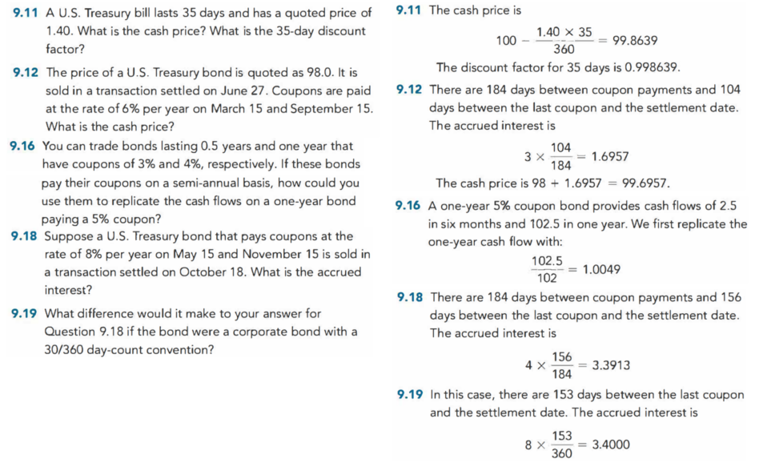

### 债券分解

-   利用一价定律将附息债券分解为多个零息债券：从金融角度（现金流、风险）找到相同的资产
    -   零息债券是应用一价定律为所有付息债券定价的基石
        -   零息债券的现金流只发生在到期日，可以很好的反映某特定时点的现金流收益状况
    -   同样，也可以用附息债券复制其他附息债券
        -   联立方程组求解即可

####    剥离债券

-   *Seperate Tradings of Registered Interest and Principal of Securities* 剥离债券：付息债券被剥离成本金和票息后分开交易的各个债券
    -   *C-STRIPS*、*TINTs*、*INTs* 来自原债券票息
    -   *P-STRIPS*、*TPs*、*Ps* 来自原债券本金
    -   剥离债券都是都是零息债券
        -   期限内的多次付息的票息被分拆为多个债券

##  利率

-   关于利率、票息率的说明
    -   *Coupon Rate* 票息率：以债券面值作为名义本金的利率
        -   对固定利率、计息频率等于复利频率的债券
            -   票息是面值本金在两次付息间隔之间需要支付利息
            -   票息率即约定好的、发行人需要按面值支付的、固定的利息率
        -   市场利率给定情况下，票息率越高，债券发行价格越高
    -   **票息是对债券现金流延迟支付、贴现损失的补偿**
        -   考虑：债券交易期初 $T_0$、债券发行价为本金 $P$、票息为 $C$
        -   对浮动利率债券，债券直接按（计息间隔对应期限）即期利率
            -   则每期票息都刚好覆盖本金在该期贴现损失
                -   贴现利率为未来实际即期利率
            -   故，浮点利率债券各付息时点价值始终为面值
        -   对固定利率债券，债券按固定票息付息
            -   即，固定利率债券可视为 **持有一系列固定率利率为 $C/2P$ 的 *FRA* 空头**
            -   **某期票息可能超过、不足覆盖本金在该期贴现损失**（贴现利率为远期利率、或未来实际即期利率）
                -   即，债券价值可能被票息带走、或贴现损失保留在债券价值中
                -   但，票息之和刚好覆盖整个期限本金贴现损失
            -   故，固定利率债券各付息时点 **债券价值增加量即该期 *FRA* 空头损失量**（也即多头收益）
                -   假设远期利率实现，债券价值半年后增量为 $\frac {R_{0.5} - C} 2 P$
                -   假设利率期限结构不变，债券价值半年后增量为 $\frac {F_{T-0.5,T} - C} 2 P$
            -   故，溢价债券价值更可能随时间降低

### 复利

$$
\begin{align*}
& \begin{cases}
    A(1 + \frac {R_d} m)^{mT} &, 离散复利 \\
    Ae^{R_c T} &, 连续复利 \\
    \end{cases} \\
R_c &= m ln(1 + \frac {R_m} m)  \\
R_m &= m (e^{\frac {R_c} m} - 1) \\
\end{align*}
$$
> - $m, T, R_d, R_c$：复利频率、期限、离散复利年利率、连续复利年利率

-   *Compound Interest* 复利：每经过一个计息周期，将上一期生成的利息加入本金之后再计利息
    -   计息周期：相邻两次支付利息的时间间隔
        -   不同计息周期对应不同的复利频率 *Compounding Frequency*
        -   超过 1 年期的债券通常有半年付息一次，即常假设对债券的计算按半年复利一次
        -   大部分债券付息频率、复利频率一致，但也有不一致的的情况（剥离债券 #TODO ？）
    -   相同年利率情况下，复利频率越大，最终本息合计值越大
        -   *Continuously Compounding* 连续复利：复利频率趋于无穷大时的复利
    -   *Equivalent Rate* 等价利率：不同复利频率下，使得最终本息合计值相同的年利率
        $$ (1 + \frac {R_1} {m_1})^{m_1} = (1 + \frac {R_2} {m_2})^{m_2} = e^{R_c} $$

> - 注意：**所有期限的利率都会、需以年化方式表达**，与复利频率无关

####    折现因子、年金、年金因子

-   *Discount Factor* 折现因子：期末 $t$ 收到一单位货币在当前的现值 $d(t)$
    -   可用于计算未来现金流在当前的现值
    -   即，类似折现率 $r$，且有 $d(t) = \frac 1 {(1 + r)^t}$
    -   *Treasury Bill* **短期国债的标价即对应期限折现因子**
        -   短期国债标价到期收到 `100USD` 的债券现值
-   *Annuity* 年金：每期出现、金额相等的一系列现金流
    -   即，一组有规律的现金流，被定义以简化现金流的表示
    -   *Annuity Factor* 年金因子：各期现金流对应的折现因子相加
        -   半年付息的情况下，期限为的 $T$ 的年金因子 $A(T) = \sum_{t=1}^{2T} d(\frac t 2)$
    -   *Perpetuity* 永续年金：无限期、每期期末支付的年金

### 债券利率

####    即期利率

-   *Spot Rate*、*Zero-Coupon Interest Rate*、*Zero Rate* 即期利率、零票息利率、零利率：零息债券的（年化）收益率（到期一次性收到本息的利率）
    -   即期利率可作为折现率，用于债券定价
        $$ P = \sum_{t=1}^T \frac C {(1 + Z_t)^t} + \frac {FV} {(1 + Z_T)^T} $$
        > - $Z_t, T$：第 $t$ 期即期利率（按年复利）、期限
        > - $C, FV$：票息、到期日面值（除票息的现金流）
    -   即期利率的计算
        -   *Direct Way* 直接法：通过对应期限零息债券价格（和面值）直接计算
            -   长期限债券较少为零息债券
            -   仅适合 1 年期内即期利率，即货币市场工具
        -   *Bootstrap* 自举法：将附息债券分解为多个零息债券，从短期即期利率开始，**带入前序结果** 依次计算更长期即期利率
            -   可以计算长期即期利率
            -   需通过多支债券价格共同计算（债券即期利率应相同，如归属同一发行人）
        -   注意：自举法计算（大于半年）即期利率时，**复利频率和付息频率是不一致的**
            -   即期利率是零息债券年化收益率
            -   但，实际中债券付息频率为半年
            -   通过自举法分解附息债券得到的剥离债券，是理想化的长期限零息债券
                -   期限内不付息，但各期限均 **按目标期限的即期利率、按原债券付息频率复利计息**
                -   到期后按面值支付

####    远期利率

$$\begin{align*}
e^{R_1 T_1} e^{F_{1,2} (T_2 - T_1)} &= e^{R_2 T_2} \\
\Rightarrow F_{1,2} &= \frac {R_2 T_2 - R_1 T_1} {T_2 - T_1}
\end{align*}$$
> - $R_1, R_2$：$T_1$ 时刻的即期利率、$T_2$ 时刻即期利率（连续复利）
> - $F_{1,2}$：$T_1$ 到 $T_2$ 时刻的远期利率（连续复利）

-   *Forward Rate* 远期利率：根据当前即期利率确定的、隐含的 *Implied* 未来即期利率
    -   远期利率是对未来一段时间 $T_1, T_2$ 间资金收益的 **期望的利率** $F_{12}$
        -   现金流开始于未来、结束于未来
        -   真正未来 $T_1$ 时刻，$T_2$ 时点即期利率可能与计算的远期利率 $F_{1,2}$ 有差异
        -   若对 $T_1$ 时点（至 $T_2$）的即期利率有其他预期，可以通过交易策略获利
            -   预期实际即期利率小于远期利率：短融长投
            -   预期实际即期利率大于远期利率：长融短投
    -   *Maturity Effects* 期限效应
        -   若远期利率期限结构不变（6 个月后各远期利率与当前时点远期利率相同）
            -   此假设下，**6 个月后的债券与当前时点已付息 1 期的债券相同**
                -   即，**将债券价值随时间变动转换为长、短期限债券价值对比**
                -   即，对比用初始债券、与已付息 1 期债券现金流即可
                -   进一步，初始债券可视为是 `已付息债券 + 最末期（票息率为约定利率）FRA空头`
            -   若 $F_{T-0.5, T} > C$，则 6 个月后债券价格应上升
                -   远期利率大于票息率，则 *FRA* 价值为正、空头亏损
            -   若 $F_{T-0.5, T} < C$，则 6 个月后债券价格应下降
        -   即，远期利率呈上升趋势，则 6 个月后债券价格更有可能上升（远期利率增大 $F_{T-0.5, T}$ 更有可能超过票息率 $C$）
            -   思路 1：**利率上升即贴现率变大，尽早收回本金更好，短期限债券价格更高**
            -   思路 2：**利率上升，新发债券收益更高，长期限债券价格价格更低**

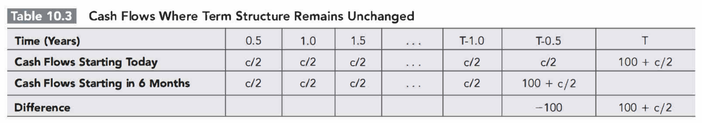

####    平价利率

$$\begin{align*}
M * \frac p 2 \sum_{t=1}^{2T} d(\frac t 2) + M * d(T) &= M \\
\frac p 2 \sum_{t=1}^{2T} d(\frac t 2) + d(T) &= 1 \\
\frac p 2 A(T) + d(T) &= 1 \\
\end{align*}$$
> - $M, p$：**平价发行、每半年付息** 债券面值、平价利率
> - $d(\frac t 2), A(T)$：折现因子、年金因子

-   *Par Rates*、*Par Yield* 平价利率、平价收益率：债券平价发行（债券价格等于票面价格）时的票息率（也即预期收益率）
    -   也即，**平价发行债券的预期收益率**（或者其实理解为预期收益率更方便）
        -   不同期限即期利率（远期利率）不同，平价利率可视为是即期利率的某种平均
        -   使得，即使不同时点即期利率不同，债券票息可以保持一致
    -   说明
        -   **平价利率同样有对应期限、期限结构**

####    即期利率、远期利率、平价利率

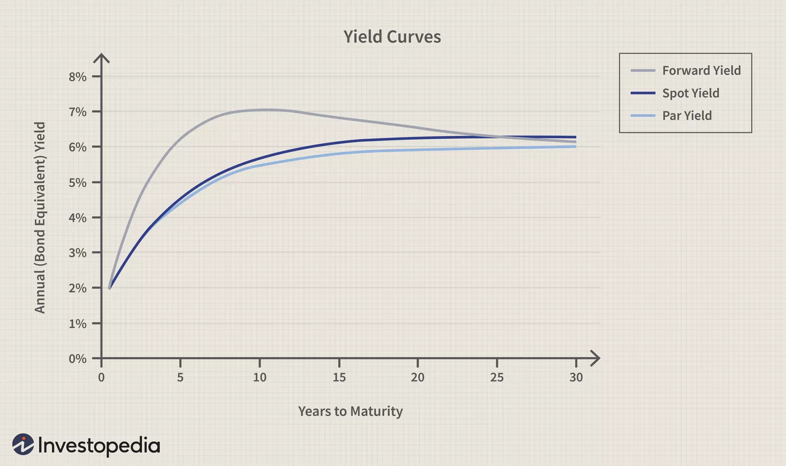

-   即期利率、远期利率、平价利率的关系
    -   即期利率 $Z_T$ 是远期利率（序列 $F_{t-1, t}, t=1, \cdots, T$）的几何平均（按年复利）
        $$ 1 + Z_T = \sqrt[T] {\prod_{t=1}^T (1 + F_{t-1,t})} $$
    -   平价利率 $p_T$ 是即期利率（序列 $Z_t, t=1, \cdots, T$）某种平均（按年复利）
        $$ p_T \sum_{t=1}^{T} \frac 1 {(1 + Z_t)^t} + \frac 1 {(1 + Z_T)^T} = 1 $$
        -   平价利率可视为即期利率的平均
    -   变化趋势
        -   若远期利率随时点不断上升，则即期利率、平价利率随期限不断上升，但幅度更小（即期利率位于二者中间）
        -   若远期利率随时点不断下降，则即期利率、平价利率随期限不断下降，但幅度更小（即期利率位于二者中间）

### 利率的期限结构

-   利率的期限结构：利率大小与时间之间的关系
    -   期限结构的变化分类
        -   *Parallel Shift* 平行移动：所有期限的收益率变化相同数额
            -   利率期限结构曲线保持形状、斜率不变
        -   *Flattening Term Structure* 平坦化期限结构
            -   *Bull Flattener* 牛市平坦变化：长短期利率均下降，但长期利率下降更多
            -   *Bear Flattener* 熊市平坦变化：长短期利率均上升，但短期利率上升更多
        -   *Steepening Term Structure* 陡峭化期限结构
            -   *Bull Steepener* 牛市陡峭变化：长短期利率均下降，但短期利率下降更多
            -   *Bear Steepener* 熊市陡峭变化：长短期利率均上升，但长期利率上升更多
    -   利率期限结构曲线的形状决定因素
        -   *Expectation Theory* 预期理论：利率期限结构理论展现了市场对未来利率的期望
            -   若市场预期未来利率将上涨，则利率期限结构曲线斜率为正
            -   并且，此理论认为 **市场中远期利率应当等于市场对未来即期利率的预期值**
        -   *Market Segmentation Theory* 市场分割理论：债券市场可根据期限细分为不同市场，不同债券处于相互分割的市场中，各分割市场相互独立，利率由各分割市场的供需决定
            -   理论假定：债券投资者只关注特定期限的债券，但是实际不成立
            -   此外，理论无法解释不同期限债券利率的同步波动现象
        -   *Liquidity Preference Theory* 流动性偏好理论：利率期限结构与不同期限债券的风险程度相关
            -   理论假定：投资者偏好短期债券以保证流动性，故长期限债券需要支付补偿
            -   即，大部分情况下，利率期限结构曲线斜率总为正
            -   且，远期利率大于未来即期利率的预期值

####    熊市、牛市

-   熊市、牛市
    -   熊市：利率整体上涨、债券价格下跌的市场
    -   牛市：利率整体下跌、债券价格上涨的市场
    -   熊市与 “利率期限结构上升，债券价格随时间更可能上升” 不矛盾
        -   变化内容不同
            -   熊市强调：市场利率整体随时间变化
            -   期限结构：某个时点利率随期限呈上升、下降趋势
        -   因果关系不同
            -   熊市强调：债券价格价格下降（因）导致债券收益率下降（果）
            -   期限结构：远期利率呈上升趋势（因）更可能导致债券价格随时间上升（果）
        -   对比对象不同
            -   熊市：同一债券，债券收益率越低价格越高
            -   期限结构：同一债券，债券价格随时间变化
                -   或，对比相同票息率、不同期限债券，债券远期利率上升、短期限债券价格较高

### FRM 例题

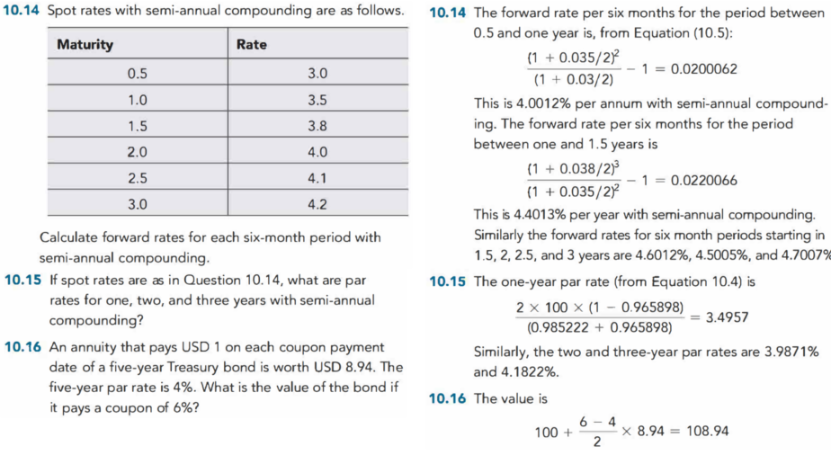
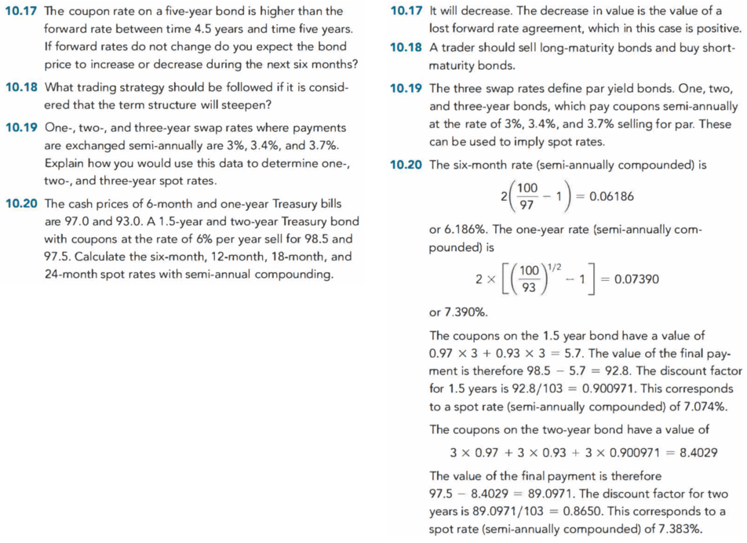

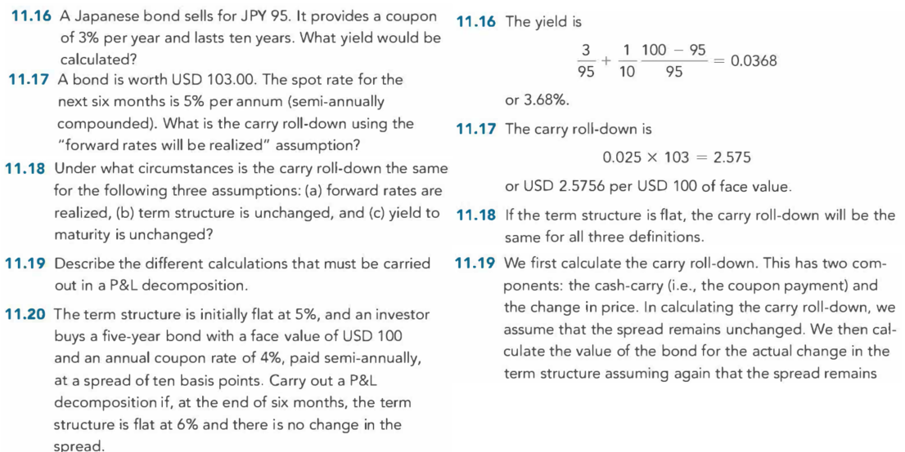

##  债券收益率

$$\begin{align*}
P &= \sum_{t=1}^{mT} \frac {CF_t} {(1+r)^t} = \begin{cases}
        \sum_{t=1}^{mT} \frac {CF_t} {(1 + y/m)^t} &, 期间利率 r 通过单利调整到年化 y \\
        \sum_{t=1}^{mT} \frac {CF_t} {(1 + y)^{t/m}} &, 期间利率 r 通过复利调整到年化 y \\
    \end{cases} \\
    &= \sum_{t=1}^{mt} \frac {CF_t} {(1 + z_t)^t}
\end{align*}$$
> - $P, CF$：债券价格、各期现金流
> - $m$：年内付息频率
> - $r, y$：期间利率（未年化）、到期（年化）收益率 *YTM*，按年复利则 $r=y$

-   *Yield-To-Maturity* 到期收益率：已知某债券市场价格，根据假设持有至到期的现金流计算得到的收益率 $y$
    -   债券折溢价
        -   若 `YTM > 票息率`：债券处于折价状态，债券价格小于面值
        -   若 `YTM = 票息率`：债券处于平价状态，债券价格等于面值
        -   若 `YTM < 票息率`：债券处于溢价状态，债券价格大于面值
        -   *Pull to Par Effect* 回归面值现象：债券价值会随时间推移回到面值
            -   债券到期时总需要支付面值（不计最后一起票息）
            -   故，债券无论折价、溢价，到期时价值都等于面值
    -   收益率是根据 **债券交收现金流计算的平价利率**，即以现金流为权重对即期利率的某种 “平均”
        -   债券真正核心的是现金流，收益率只是对债券现金流的描述
            -   美国国债按半年复利、对债券现金流计算收益率
            -   日本国债按单利、对债券现金流计算收益率
            -   相同现金流的美国国债、日本国债，因描述习惯不同而收益率不同
        -   而，现金流只取决于票息、面值以及价格
            -   票息、面值在债券发行之处即已确定
            -   唯一可变量为债券价格
        -   平价发行债券的票息率即为其 *YTM*
            -   债券价格（债券的即期利率）变化使得 *YTM* 不等于票息率
            -   若债券价格（净价）保持为面值，*YTM* 始终为票息率
    -   关于美国国债收益率半年付息的 *YTM* 使用单利、或复利调整到年的说明             # TODO
        -   二者计算得到期间收益率是相同 $YTM_{单利}/m = (1 + YTM_{复利})^{1/m} - 1$，仅是折算到年化 *YTM* 有差异
        -   计算上，考虑到实际中多为半年付息，二者结果相差不大
        -   逻辑上，个人觉得单利调整计算更方便，本来就是名义上调整到年化，没必要名义上做成复利

> - 债券价值与期限没有任何关系，**长期限债券的额外票息就是对后续现金流延迟支付、贴现的补偿**

###    利差、*G-Spread*、*Z-Spread*

-   *Spread* 利差：债券收益率之差
    -   债券收益率可以分解为两部分：基准收益率和（基准）利差
        -   基准收益率通常使用国债收益率，反映 *GDP*、*CPI*、银根松紧等宏观经济因素，影响市场所有债券
        -   （基准）利差即债券收益率超过国债收益率的部分，反映债券特定围微观因素
    -   *G-Spread*：债券与对应期限的国债 **收益率差额**
        -   若市场没有对应期限国债，可通过线性插值计算
    -   *Z-Spread*、*Zero-Volatility Spread*、*Static Spread* 零波动利差、静态利差：以国债 **即期利率曲线** 为基准的利差
        $$ PV = \sum_{t=1}^T \frac {FV_t} {(1 + z_t + Z)^t} $$
        > - $z_t$：国债即期利率，假设按年付息
        > - $Z$：固定的 *Z-Spread*
        -   假设债券的折现率是通过各期国债的 **即期利率加上相等差额** 等到，此差额即为 *Z-Spread*

### 债券交易价、报价

-   债券交易价、报价
    -   *Full Price*、*Dirty Price* 交易价、全价、脏价：债券未来现金流在债券交割日的现值之和
        -   若债券交易日在付息日，交易价可以直接使用现金流折现
            -   **折现需使用 *YTM* 计算**，不能使用票息率
        -   否则，先根据现金流折现至上个付息日，再 **根据天数复利至交易日**
            -   **折现、复利需使用 *YTM* 计算**（不使用票息率）
                -   债券价格随时间变化，相应的 *YTM* 也在发生变化
                -   仅在平价债券发行时，*YTM* 才为票息率
            -   天数计算惯例
                -   政府债券：`真实天数 / 真实天数`，以上个付息日开始的实际天数、付息周期的实际天数计算
                -   *Company Bonds* 企业债和 *Municipal Bonds* 市政债：`30 / 360`，假定每月 30 天、每年 360 天
    -   *Flat Price*、*Clean Price* 报价、平价、净价：`报价 = 交易价 - 应计利息`
        -   *Accrued Interest* 应计利息：债券发行人应当支付但实际并未支付给投资者的利息
            $$ 应计利息 = 单次票息 * \frac t T $$
            > - $T, t$：上个付息日距离下个付息日天数、债券交割日距离上个付息日天数
    -   交易价、报价的说明
        -   在付息日时，债券价格将在票息支付后出现 “下跳”，下跳金额即单次票息的金额
            -   票息累计是连续计算，而实际的现金票息支付只在付息日、是离散的
            -   即，两个付息日之间，债券的交易价格将随票息累计而逐渐上升
            -   由此，导致交易价不连续，不适合作为报价
        -   为此，市场假设票息按天支付，从交易价中减去按日支付的票息作为报价
            -   在不同付息日间，由于利息积累，全价逐渐上升，并在付息日 “下跳”
            -   报价相对平坦、连续
                -   在付息日，报价与交易价相同
            -   由于回归面值效应，折价、溢价债券的报价会逐渐靠近面值

### 债券损益分解

-   债券损益分解
    -   债券的回报
        -   *Gross Realized Return* 总实际回报：一定期限持有债券获得的全部收益
            -   总实际回报率：`总实际回报 / 买入债券价格`（期限内收益率，不必年化）
                $$ R_{t,t+1} = \frac {P_{t+1} - P_t + C} {P_t} $$
                > - $R_{t, t+1}$：$t$ 时刻至 $t+1$ 时刻的债券总实际回报率
                > - $P_t, P_{t+1}$：$t$ 时刻债券价格、$t+1$ 时刻债券价格
                > - $C$：票面利息收入、票面利息再投资收入之和
            -   总实际回报可分解为三部分
                -   资本利得和损失（债券净价价差）
                -   票面利息收入
                -   票面利息再投资收入
        -   *Net Realized Return* 净实际回报：`总实际回报 - 融资成本`
            -   净实际回报率：`净实际回报 / 买入债券价格`（期限内收益率，不必年化）
                $$ R_{t,t+1} = \frac {P_{t+1} - B_{t+1} + C} {P_t} $$
                > - $B_{t+1}$：$t+1$ 时刻需归还的融资借款本息
    -   *Profit and Loss* 债券的损益分解：债券自身带来的损益、利率环境带来的损益
        -   *Carry Roll-Down*：“利率环境不发生变化” 时，持有债券所能获得的收益
            -   损失分解
                -   *Cash-carry*：现金性的利息收益
                -   价差变化：*利率环境未发生变化* 时，债券价格随时间推移发生的变化
            -   “利率环境不发生变化” 是一类假设，以下场景均可视为是利率环境不发生变化，但实际市场不同
                -   远期利率的实现：由当前即期利率计算的隐含远期利率就是未来的即期利率
                -   即期利率的期限结构不变：未来时刻的即期利率期限结构与当前一致
                -   债券 *YTM* 不变：即期利率、债券价格、未来现金流等可能变化，但 *YTM* 不变
                -   个人估计实现
        -   利率环境：利率环境发生变化，导致债券价格变化所带来的损益
            -   损益分解
                -   基准利率变化带来的损益
                -   利差变化带来的损益
                -   融资成本变化带来的损益

### FRM 例题

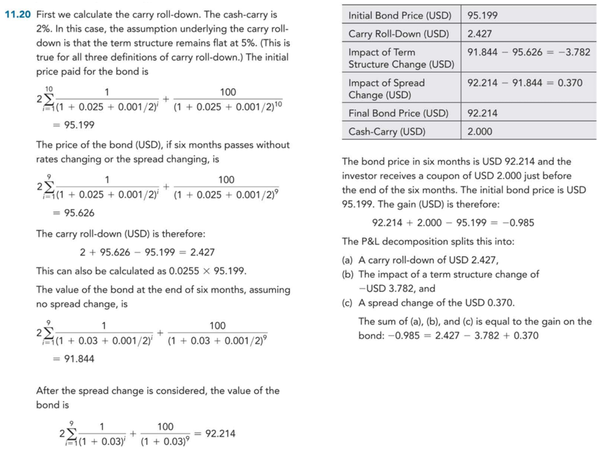

##  久期、凸度

### 久期

-   *Duration* 久期
    -   度量债券价格对利率（或基准利率）变动的敏感程度
        -   直觉上好像
        -   使用时，假设 *YTM*、或基准利率以外的因素保持不变
    -   久期说明
        -   久期是债券价格和（某种）利率的一阶拟合
            -   度量利率对债券价格变化的线性影响
            -   当利率的期限结构大幅变化时，线性关系不再成立，通过久期对债券价格的估计将不再准确
        -   久期某种程度上可视为是债券现金流重心
            -   期限越长，久期越大
            -   票息越高，久期越小
        -   久期是债券价格对 *YTM* 的导数（变换），且 *债券价格-YTM* 曲线为下凸、递减
            -   债券 *YTM* 越大，久期越小

####    收益率久期

$$\begin{align*}
MacDur &= \frac {\sum_{t=1}^{mT} PV(CF_t) \frac t m} {\sum_{t=1}^{mT} PV(CF_t)} \\
    &= \frac {\sum_{t=1}^{mT} \frac {CF_t} {(1 + y/m)^{t/m}} \frac t m} {\sum_{t=1}^{mT} PV(CF_t)} \\
ModDur &= -\frac {\Delta P / P} {\Delta y} = -\frac {\partial P} {P \partial y} \\
    &= -\frac 1 P \sum_{t=1}^{mT} \frac {-\frac t m * CF_t} {(1 + y/m)^{t+1}} \\
    &= \frac 1 {(1 + y/m)P} \sum_{t=1}^{mT} \frac {CF_t \frac t m} {(1 + y/m)^t} \\
    &= \begin{cases}
        \frac {MacDur} {1 + y/m} &, 离散复利 \\
        MacDur &, 连续复利 \\
    \end{cases} \\
DollarDur &= -\frac {\Delta P} {\Delta y} = -\frac {\partial P} {\partial y} = ModDur * P \\
\Delta P &\approx -ModDur * \Delta y * P = -DollarDur * \Delta y \\
\end{align*}$$
> - $P=PV(CF_t)$：$t$ 时刻现金流现值，即债券价格
> - $P$：债券的全价（上述公式中均假设付息日开始的完整周期现金流，净价与全价相等）
> - $m$：一年内复利频次
> - $\Delta P, \Delta y$：债券价格变化额、债券收益率变化量
> - 修正久期 $ModDur$ 本来就是导数取反，所以计算 $\Delta P$ 需要再取一次反

-   *Yield Duration* 收益率久期：债券价格变化对于债券到期收益率的变化的敏感程度
    -   *Macaulay Duration* 麦考利久期：折现现金流的加权平均回收时间
        -   对零息债券，其麦考利久期等于其到期期限
        -   对附息债券，其麦考利久期小于其到期期限
        -   久期某种程度上可视为是债券现金流重心
            -   期限越长，久期越大
            -   票息越高，久期越小
    -   *Modified Duration* 修正久期：债券价格变化率对 **到期收益率** 的弹性（导数除以原值）取反
        -   修正久期即，到期收益率变化一个单位对应的债券价格变化率
        -   离散复利下，债券价格变化率 $\Delta P / P$ 近似有 $\Delta P / P \approx -ModDur \Delta y$
        -   连续复利下，修正久期等于麦考利久期，近似有 $\Delta P / P \approx -MacDur \Delta y$
    -   *Money Duration*、*Dollar Duration* 现金久期、美元久期：债券价格对 **到期收益率** 的导数取反
        -   现金久期即，到期收益率变化一个单位对应的债券价格变化额
        -   离散复利下，债券价格变化 $\Delta P$ 近似有 $\Delta P \approx -DollarDur \Delta y$
    -   此处，收益率久期虽然通过导数定义
        -   但似乎倾向于所有久期都衍生自麦考利久期
            -   即，麦考利久期是连续复利情况下的久期
            -   而，修正久期初最初定义即 $MacDur / (1 + y/m)$，离散复利场合情况下的久期
        -   即，**只有债券不含权，即债券价格只为现金流折现时**，收益率久期符合 “价格对收益率导数”
            -   即，收益率久期不适用含权债券
            -   当然，可赎回、可回购含权债券，行权的不确定性将导致现金流的不确定性，*YTM* 也不确定
        -   也因此，将收益率久期理解为导数时，必然有解析解（即各收益率久期定义式）
            -   所以，收益率久期基本都是将现金流带入定义式、从麦考利久期开始计算
            -   而，较少根据导数定义式 $\frac {\Delta P} {\Delta y}$、扰动 *YTM* $\Delta y$ 计算数值解
            -   但是，依然会根据 $ModDur * \Delta y * P$ 由 *YTM* 扰动计算债券价格波动

####    曲线久期、有效久期

$$\begin{align*}
EffDur &= -\frac {\partial P} {\partial r} \\
    &= \frac {P_{-\Delta r} - P_{+\Delta r}} {2 * \Delta r * P_0}
\end{align*}$$
> - $r$：年化（即期）利率
> - 注意：这里的导数数值解是上、下均扰动做差得到

-   *Curve Duration* 曲线久期：债券价格变化对债券利率期限结构曲线变化的敏感程度
    -   *One Factor Assumption* 单因子模型假设：短时间内单个利率的偏移可以 **确定** 所有的利率的变动，即可以描述整个利率期限结构曲线的变化
        -   这里是 **“确定”**、不是决定，是指已知某个利率变动，则其余利率变动可计算
        -   对应最简单的单因子模型即，利率曲线的平行移动，所有利率变动相同幅度
    -   *Effective Duration* 有效久期：所有即期利率共同变化较小的量（即利率期限结构曲线平行移动）时，债券价格变化率（百分比变化）
        -   注意：这里的导数数值解是上、下均扰动做差得到
    -   相较于收益率久期，曲线久期从价格变化计算，即直接从导数定义
        -   即，曲线久期适用于含权债券
        -   所以，曲线久期常根据导数定义式 $\frac {\Delta P} {\Delta y}$、（即期）利率扰动 $\Delta r$ 计算数值解

####    *DV01*、*01 Measures*

$$\begin{align*}
DV01 &= - \frac {\Delta P} {10000 * \Delta r} \\
    &= \Delta P_{-1BP} - \Delta P{+1BP} \\
    &= \frac {DollarDur} {10000} \\
    &= \frac {Dur * P} {10000} \\
\end{align*}$$
> - $r$：年化利率
> - $P$：**债券现值（价格）（不是债券面值）**
> - 注意：这里的 *DV01* 数值解是上、下均扰动 `1BP` 做差得到

-   *Dollar Value of 1 Basis Point*、*DV01* 基点价值：**某利率** 变化一个基点时债券价格变化额
    -   *Yield Based DV01*：债券 *YTM* 变化一个基点时，债券价格变化额
    -   *DVDZ*、*DPDZ*：债券所有即期利率变化一个基点时，债券价格变化额
    -   *DVDF*、*DPDF*：债券所有远期利率变化一个基点时，债券价格变化额

### *Convexity* 凸度

$$\begin{align*}
MacConv &= \frac {\sum_{t=1}^{mT} (t/m)^2 * PV(CF_t)} {\sum_{t=1}^{mT} PV(CF_t)} \\
ModConv &= \frac {\Delta^2 P} {P (\Delta y)^2} = \frac {\partial^2 P} {P (\partial y)^2} \\
    &= \frac 1 P \sum_{t=1}^{mT} \frac {\frac {t(t+1)} {m^2} * CF_t} {(1 + y/m)^{t+2}} \\
    &\approx \frac 1 {(1 + y/m)^2 P} \sum_{t=1}^{mT} \frac {CF_t (\frac t m)^2} {(1 + y/m)^t} \\
    &= \begin{cases}
        \frac {MacConv} {(1 + y/m)^2} &, 离散复利 \\
        MacConv &, 连续复利 \\
    \end{cases} \\
\Delta P &\approx (- ModDur * \Delta y + \frac 1 2 * ModConv * (\Delta y)^2) * P \\
EffConv &= \frac {P_{-\Delta y} + P_{+\Delta y} - 2P_0} {(\Delta Curve)^2 * P_0} \\
\end{align*}$$
> - 修正久期 $ModDur$ 本来就是导数取反，所以计算 $\Delta P$ 需要再取一次反

-   凸度：度量 *债券价格-YTM* 曲线的凸性（二阶影响）
    -   *Macaulay Convexity* 麦考利凸度
    -   *Modified Convexity* 修正凸度
        -   结合修正久期、修正凸度根据利率变化更准确估计不含权债券价格变化
        -   注意
            -   **修正的凸度的原始定义似乎就是直接由麦考利凸度而来，不要直接使用导数解析式**
    -   *Effective Convextity* 有效凸度
        -   结合有效久期、有效凸度根据历史数据估计含权债券价格变化
    -   凸度会使得通过仅使用久期根据收益率变化估计债券价格变化不准确
        -   但，正凸度会使得债券价格变化出现 “涨多跌少” 的效果
            -   收益率上升时，债券价格下跌幅度较久期估计结果少
            -   收益率下降时，债券价格上升幅度较久期估计结果多

####    含权债券凸度

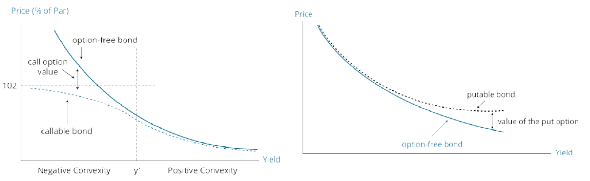

-   *Callable Bond* 可赎回债券在收益率低时通常具有 *Negative Convexity* 负凸度
    -   债券价格升到约定回购价格（收益率下降）时，发行人会行使赎回权（再以低利率发行新债券）
    -   即，低收益率情况下、可赎回债券价格上升趋近回购价格时
        -   约定回购价格将是债券价格上限，限制了债券价格上升
        -   债券凸度将由正变负
-   *Putable Bond* 可回售债券通常有更大正凸度，尤其是高收益率时
    -   可回售债券有回售条款兜底，投资者可以行使回售权
    -   即，高收益率情况下、可回售债券价格下降趋近回购价格时
        -   约定回售价格限制债券价格下限，限制债券价格下降
        -   可回售债券凸度相较于普通债券更大

### 资产组合的久期、凸度、对冲

$$\begin{align*}
ModDur_P &= \sum_{i=1}^N w_i * ModDur_i \\
ModConv_P &= \sum_{i=1}^N w_i * ModConv_i \\
DV01_P &= \sum_{i=1}^N DV01_i \\
\end{align*}$$

-   资产组合的久期、凸度
    -   资产组合的修正久期、修正凸度：各债券修正久期、修正凸度按市场价值的加权平均
        -   **久期相同的组合，现金流越分散的组合凸度越大**
            -   （麦考利）凸度与债券期限平方线性相关，故凸度绝对值往往大于久期绝对值
            -   则若久期加权和相等，分散资产组合的凸度更大
        -   久期相同的 *BarBell Portfolio* 杠铃型组合比 *Bullet Portfolio* 子弹型组合凸度大
            -   *BarBell Portfolio* 杠铃型组合：组合中久期集中在长久期、短久期
            -   *Bullet Portfolio* 子弹型组合：组合中久期集中在中等久期
            -   当利率曲线平行移动（利率期限结构变化相同幅度）时，正凸度 “涨多跌少” 的性质将使得杠铃型组合表现更好
                -   当然，利率曲线不是平行移动时，收益表现不确定
    -   资金组合的 *DV01* ：组合中各资产 *DV01* 直接加总即可
        -   *DV01* 计算中已经包含价格，权重已经体现
    -   对零息债券
        -   有效久期与等于修正久期相同
        -   但，有效凸度与收益率凸度定义不同，二者有计算结果差异
        $$\begin{align*}
        ModDur = EffDur &= \frac T {(1 + C/2)} \\
        EffCov &= \frac {T^2} {(1 + C/2)^2} \\
        ModCov &= \frac {T(T+0.5)} {(1 + C/2)^2} \\
        \end{align*}$$
        > - $T, C$：债券期限、债券票息率

####    久期、凸度对冲

-   基于久期、凸度的对冲
    -   基于久期的对冲：利用对冲工具使得整个组合久期为 0，起到风险对冲的效果
        -   利率小幅度变化时，债券组合的价格将保持不变
    -   基于久期、凸度的对冲：利用对冲工具使得整个组合久期、凸度均为 0，使得整个组合在利率较大幅度变化时对冲效果较好
        -   但，若利率的期限结构发生非平行移动时，组合依旧面临风险

### FRM 例题

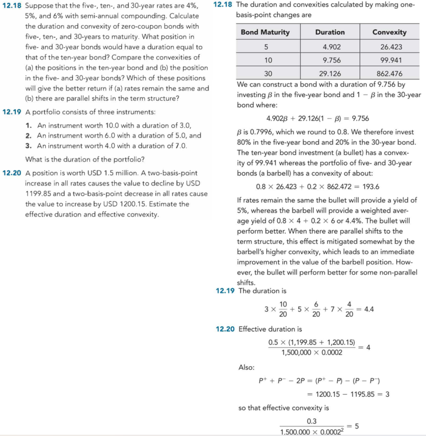

##  利率期限结构非平行移动的建模、对冲

-   借助主成分分析 *PCA* 思路
    -   多个期限的利率变动可以由少数几个因子在大部分程度上解释
        $$ \sigma_p = \sqrt {\sum_{i=1}^n \sigma_i=^2 F_i} $$
        > - $F_i$：公共因子 $i$ 波动的风险敞口
        > - $\sigma_i$：公共因子 $i$ 方差

### 利率风险对冲    #TODO

-   利率风险对冲
    -   基于久期的对冲：持有资产的久期与利率期货头寸久期总和为 0
        $$ N = - \frac {E_V} {E_F} $$
        > - $E_V$：即期利率变动 1BP 时，资产价值变动
        > - $E_F$：即期利率变动 1BP 时，每份期货工具价值变动
        -   等价于，基于 *01 Measures* 的对冲：即期利率变动 1BP 时，持有资产价值、用于对冲期货工具价值变动相互抵消
        -   基于久期对冲局限性
            -   利用期货工具对冲假设：基于资产面临的利率风险中的利率与对冲工具对应利率完全正相关
            -   同样，只适合即期利率曲线小幅度平移场合

### *Partial 01s*

-   *Key Rate 01*、*KR01*、*Partial 01* 关键利率基点价值、偏基点价值：某个关键（即期）利率变化 `1BP` 时，债券价格变化量
    -   *Key Rate Shifts* 关键利率变动（假设）：整个利率期限结构的变化由几个 “关键利率” 的变化所带动，且关键利率对周围期限利率的影响线性递减，直至到另一个关键利率处影响减为 0
        -   此假设即将全部的利率的变动需要由多个因子描述，即多因子模型假设
            -   端点关键利率两侧利率视为与端点关键利率同步变动
            -   两关键利率中间的利率根据期限差异做线性插值
        -   假设即期利率包含 `1, 2, 3, 4, 5, 10, 15` 年，其中 `2, 3, 5` 为关键利率
            -   `2` 年即期利率增加 1BP，则 `1,2` 增加 1BP
            -   `3` 年即期利率增加 1BP，则 `3,4` 增加 1BP
            -   `5` 年即期利率增加 1BP，则 `4` 增加 0.5BP、`5,10,10` 增加 1BP
    -   所有关键利率基点价值 *KR01* 相加即为即期利率变动的 *DV01*、*DVDZ*
        $$ DVDZ = \sum KR01_i $$
    -   同样的此模型假设下，需使用工具对 *KR01* 对冲
        -   若组合存在 $n$ 个关键利率风险敞口，需要 $n$ 种对冲工具对冲（方程组才有解）
        -   若因成本等原因不将所有 *KR01* 对冲至 0，则应根据各 *KR01* 相关性、调整组合、降低投资组合价值标准差 $\sigma_p$
            $$ \sigma_p = \sqrt {\sum_{i=1}^n \sum_{j=1}^n \rho_{i,j} \sigma_i \sigma_j KR01_i KR01_j} $$
            > - $\sigma_i$：关键利率 $i$ 标准差
            > - $\rho_{i,j}$：关键利率 $i,j$ 相关系数

### 基于平价利率的 *KR01*

-   同样的，也可以在平价利率定义关键利率变动、基点价值
    -   此时，定义在平价利率上的 *KR01* 之和即为 *Yield-based DV01*
    -   且，定义在平价利率上的 *KR01* 对冲更方便
        -   无需考虑债券现金流，可直接对对应的期限的 *KR01* 进行对冲

### *Forward Bucket 01*

-   *Forward Bucket 01*、*B01* 远期局部基点价值：某段的远期利率变化 `1BP` 时，债券价格变化量
    -   *Bucket Approach* 局部法：将利率期限结构分段为多个远期利率，各段远期利率均变化 *Bucket Shift*
        -   关键利率变动的建模变体
        -   首个 *B01* 一般比最后 *B01* 大
            -   较近期的远期利率影响现金流比较远期的远期利率多
            -   故，较近期的利率变动影响更大、*B01* 更大
    -   通用的，远期局部基点价值之和即为远期利率变动的 *DV01*、*DVDF*
        $$ DVDF = \sum B01_i $$

### *01 Measures*、*Duration Measures*

-   类似前述 *DV01* 和久期之间关系，定义与前述 *01 Measures* 相应的 *Duration Measures*
    $$\begin{align*}
    Dur = \frac {10000 * 01Measure} P \\
    \end{align*}$$

### FRM 例题

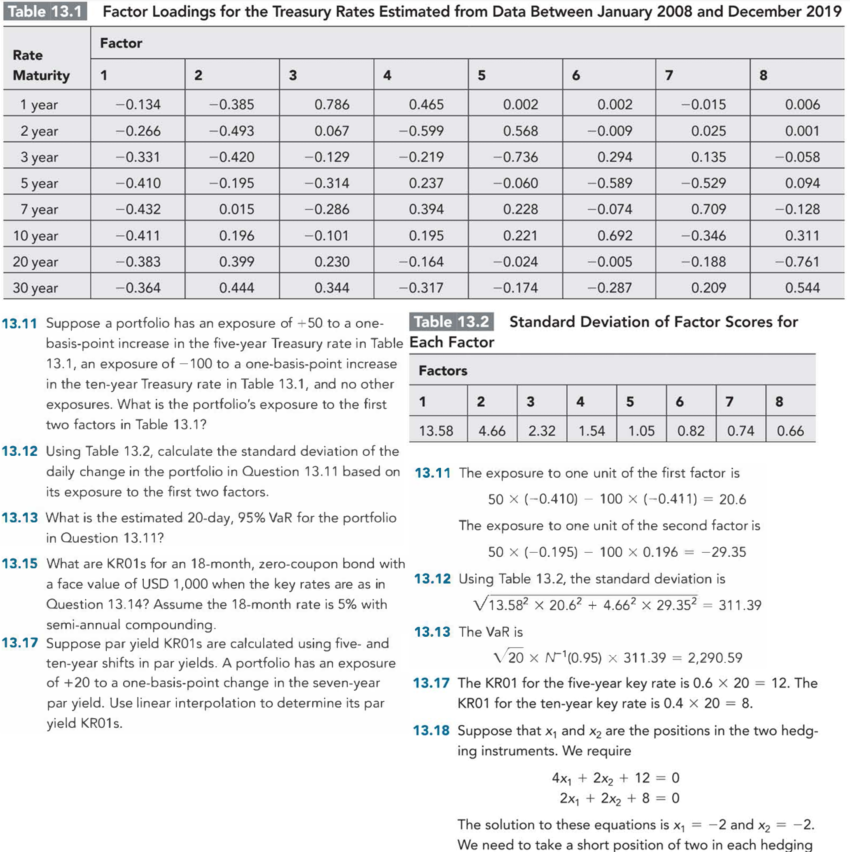
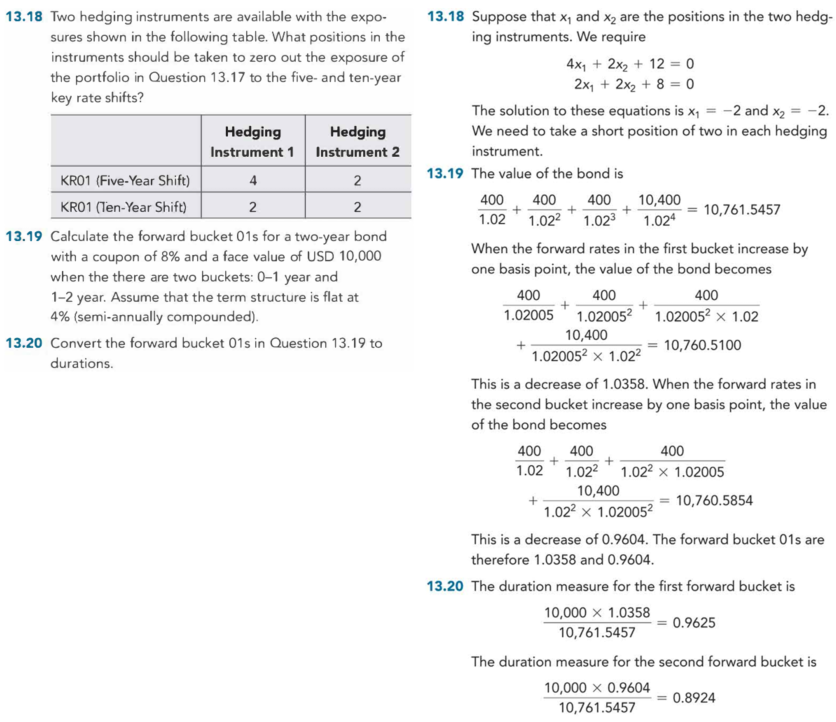

##  利率衍生品

### 市场利率

-   市场利率
    -   *Goverment Borrowing Rate* 政府借款利率：政府以本币标价对外借款所支付的利率
        -   发达国家的政府借款利率（如 *Treasury Rate* 美国国债利率）被认为是没有风险的，作为无风险利率为金融产品定价提供参考
    -   *Overnight Interbank Borrowing Rate* 隔夜银行间贷款利率：银行间为调剂准备金而进行拆借行为时所用的利率
        -   美国的 *Effective Federal Funds Rate* 有效美联储基准利率
        -   英国的 *Sterling Overnight Index Average* 英镑隔夜指数平均利率
        -   欧元区 *Euro Overnight Index Average* 欧元隔夜指数平均利率
    -   *Repo Rate* 回购利率：有担保的借款利率
        -   回购协议约定，回购方（证券出售方）可在未来某个特定时间以特定价格回购该证券
        -   即，回购交易可以视为质押贷款
            -   回购方收到的价款视为贷款
            -   证券出售价格与回购价格之间的差额即为利息
        -   *repo-based Secured Overnight Financing Rate*、*SOFR* 隔夜回购利率（美国）
            -   从某月开始一定期限的 *SOFR* 通过收集该该月开始一定期限的隔夜回购利率计算后得到
                -   故，该期限 *SOFR* 在期初未知
    -   *London Interbank Offered Rate*、*Libor* 伦敦银行间同业拆借利率：银行间无担保的短期信用借贷利率（的估计值）
        -   *Libor* 被用作数百万亿美元交易的参考利率
            -   利率在每个交易期公布
            -   拆借标的包括 10 多种货币
            -   期限为 1 天到 1 年
        -   *Libor* 在已经被弃用并被 *SOFR* 等利率替代
            -   大型银行可能操纵其 *Libor* 报价
            -   银行没有足够的同业借款对不同货币、期限的借款利率做出准确估计

### *FRA* 利率远期

$$ 多方现金流 = \frac {(合约年化利率 - 实际年化利率) * 借款期限 * 本金} {1 + 实际年化利率 * 借款期限} $$

-   *Forward Rate Agreement* 远期利率协议：标的为利率（通常 *Libor*、*SOFR*）的场外远期合约
    -   常用于利率风险管理
        -   *FRA* 多头：未来以约定利率借入虚拟贷款
        -   *FRA* 空头：未来以约定利率发放虚拟贷款
        -   虚拟贷款：贷款不实际发生，多空双方仅结算利息差
    -   合约现金流
        -   现金结算时点为借款期期初（远期合约到期时点）
        -   现金流均以单利计算、折现
        -   表示方法：`9x12 FRA` 表示 9 个月后贷款开始、12 个月后贷款终止
            -   实际年化利率即 9 个月后的年化利率
            -   借款期限即 3 个月

### 美国国债期货

$$\begin{align*}
多方支付金额 &= 合约价格 * 交割债券转换因子 + 交割债券应计利息 \\
空方净成本 &= 交割债券全价 - 多方支付金额 \\
    &= (交割债券报价 + 交割债券应计利息) - (合约价格 * 交割债券转换因子 + 交割债券应计利息) \\
    &= 交割债券报价 - 合约价格 * 交割债券转换因子 \\
\end{align*}$$

-   美国国债期货
    -   国债期货标价类似国债 “32等分” 标记，但精度更高
        $$ A-BBC = A + \frac {BB + 最接近C的1/8} {32} * \frac 1 {100} $$
        -   $A$：标价整数部分
        -   $BB$：2 位整数，`1/32` 倍数
        -   $C$：1 位整数，对应首位为 $C$ 的 `1/8` 倍数加总至 $BB$
        -   例：$ 108-127 = 108 + \frac {12 + 0.75} {32} = 108.390625 $
    -   标的资产是假想的标准券：面值 `10万` 美元、票息率 `6%`、半年付息、剩余期限 `6-10` 年
        -   合约价格即此假想标准券的价格
    -   实物交割期货，**但实际上可交割债券可有多种（剩余期限在一定期限内均可）**
        -   不同债券现金流（票息）不同，实际报价也不同
        -   债券需要按 `YTM = 6%`、每年复利 2 次折现计算现值，得到 `交割债券转换因子`
            -   即，交割债券与标准券的价值比例
            -   面值 `1USD` 的交割债券现金流按 `YTM=6%`、年复利 2 次折现即为 `交割债券转换因子`
        -   合约空方会选择净成本最小的债券用于交割
            -   债券熊市时，债券风险偏高、长期收益率相较短期收益率升高幅度更大，长久期债券价格可能更低
                -   国债收益率高于 `6%` 时，长期、低票息债券净成本更低
                -   国债收益率低于 `6%` 时，短期、高票息债券净成本更低
                -   即期利率期限结构上升时，长期债券交割成本更低
                -   即期利率期限结构下降时，短期债券交割成本更低

### *Eurodollar Futures* 欧洲美元期货、*SOFR Futures*

-   *Eurodollar Futures* 欧洲美元期货合约
    -   合约说明
        -   面值：100 万美元
        -   到期时间：每年 3、6、9、12 月，1 年以内
        -   天数计算：`actual / 100`
        -   合约报价方式为 `100-R`
            -   其中 `R%` 为欧洲美元拆借利率
            -   `1BP` 变化对应 `100000 * 0.0001 * 0.25 = 25USD` 收益或损失（3 个月利息）
            -   利率上涨则合约价格下降，多头（即 *FRA* 中借款方）损失
    -   欧洲美元期货与 *FRA* 的差异
        -   *FRA* 会对利息差额折现，欧洲美元期货不折现（期货按日结算也没必要折现）
        -   结算时间点不同（期货按日结算，远期合约到期日结算）导致期货合约的隐含利率高于实际远期利率
            -   可通过期货利率计算远期利率
                $$ 远期利率 = 期货隐含利率 - \frac 1 2 \sigma^2 T(T + 0.25) $$
                > - $\sigma$：1 年期标的利率标准差
                > - $T$：期货合约剩余期限，使用 `actual/actual` 计算
    -   欧式美元期货收益计算依赖 *Libor*，但 *Libor* 被废弃，故欧洲美元期货也被废弃，由 *SOFR Futures* 替代
        -   报价利率改为使用 *SOFR* 利率

> - *Eurodollar* 欧洲美元：在美国境外的美元
> - 欧洲美元利率：银行间进行欧洲美元拆借的利率，类似 *Libor*

### FRM 例题

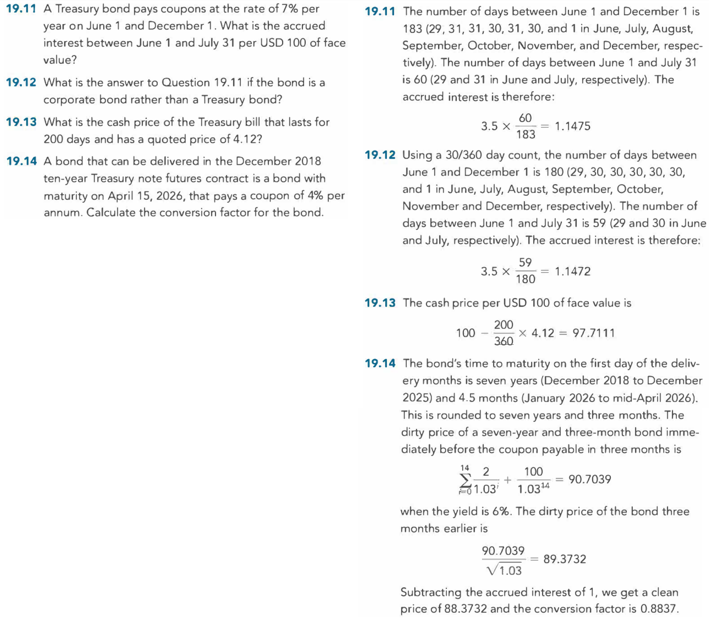

