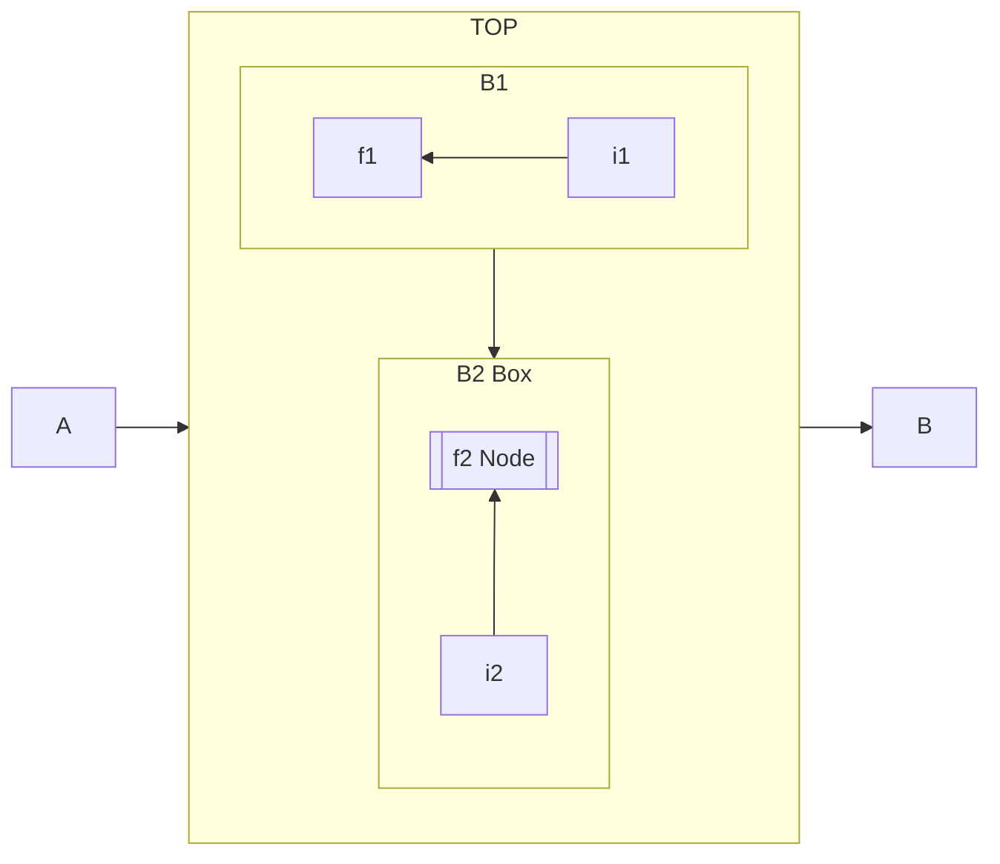
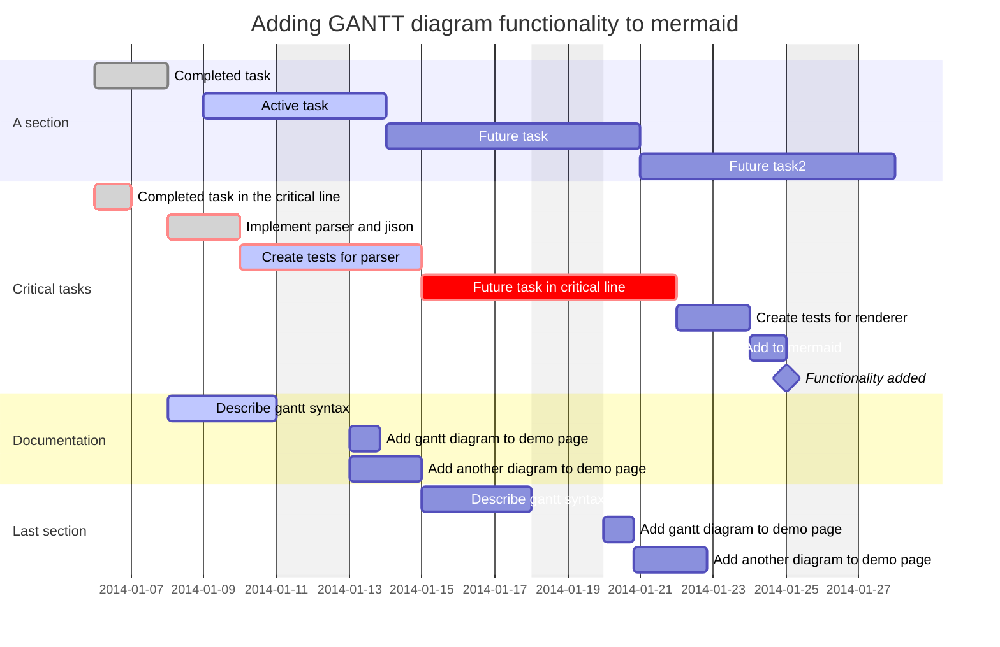
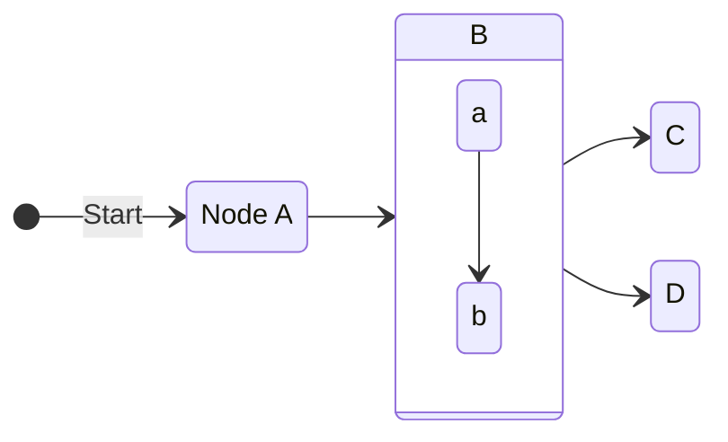
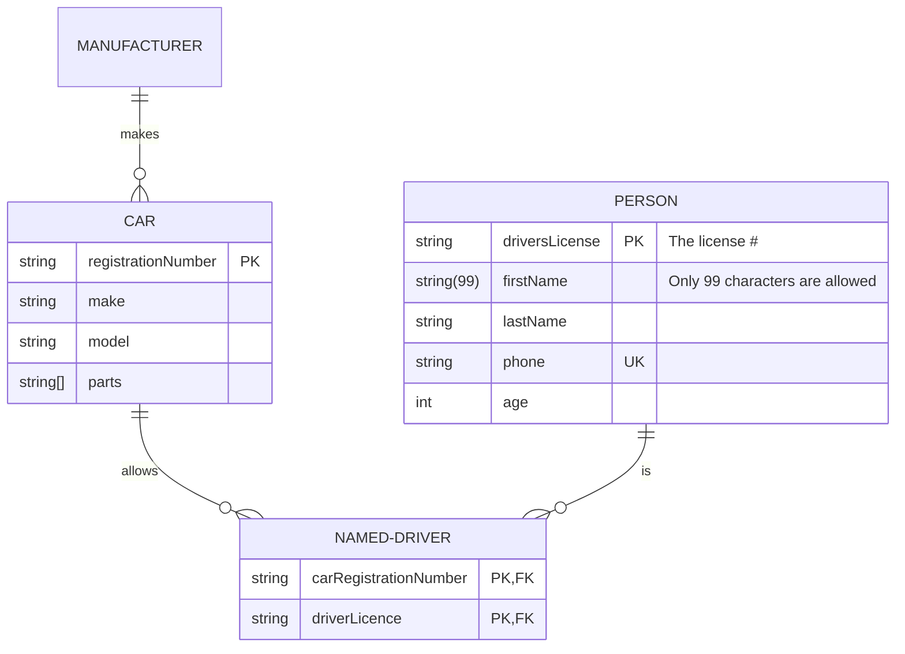
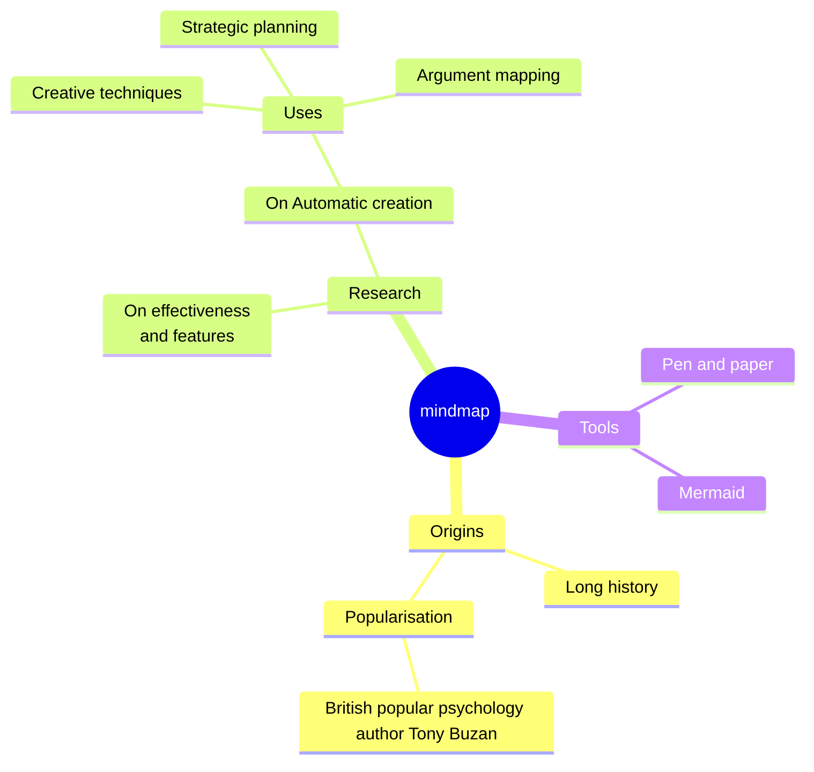
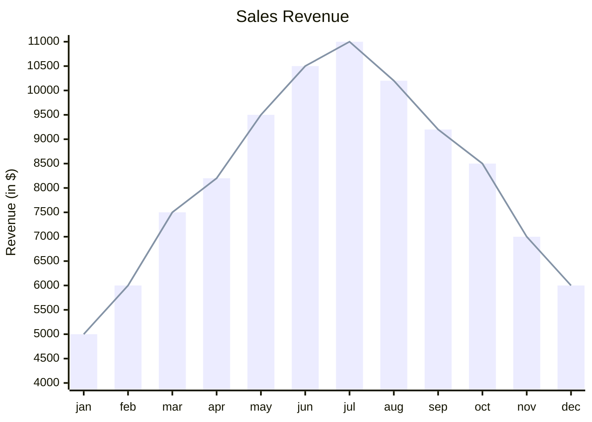

##  *Markdown*

-   *Markdown* 是轻量级标记语言，基于 *Email*、*usenet* 的格式标记
    -   排版语法简洁，易读易写
    -   同时，*Markdown* 语法没有统一标准，如：
        -   子列表缩进数量
        -   块级引用、标题钱是否需要空行
        -   缩进式代码块前是否有空行
        -   列表项在在何种情况下包含在 `<p>` 标签内
    -   即，存在各种方言
        -   *Kramdown*
        -   *Vfmd*
        -   *CommonMark*：强定义的 *Markdown* 规范，定义许多 *Markdown* 细节
            -   *CommonMark Spec*：*CommonMark* 规范
        -   *Github Flavored Markdown*：*CommmonMark* 的严格超集
            -   所有未在 *CommmonMark Spec* 中指定的特性均视为扩展

> - *Markdown: Syntax*：<https://daringfireball.net/projects/markdown/syntax>
> - *CommonMark Spec*：<https://spec.commonmark.org/current/>
> - *CommonMark Spec v0.18* 中文：<http://yanxyz.github.io/commonmark-spec/>
> - *Github Flavored Markdown Spec*：<https://github.github.com/gfm/>
> - *Markdown* 语法中文：<https://markdown.com.cn/basic-syntax/>

###    字符与行

-   *CommonMark Spec* 不指定编码，行由字符而不是字节组成（编码处理依赖具体解析器）
    -   字符：*Unicode* 代码点
        -   空白字符：空格 `\u0020`、制表符 `\u0009`、换行 `\u000A`、竖向制表符 `\u000B`、换页 `\u000C`、回车 `\u000D`
        -   *Unicode* 空白字符：*Unicode* 中 `Zs` 类中代码点，加上制表符 `\u0009`、换行 `\u000A`、换页 `\u000C`、回车 `\u000D`
        -   行结束符：换行 `\u000A`、回车 `\u000D`、回车换行（取决于操作系统）
        -   非空白字符：除空格外字符串
        -   *ASCII* 标点符号
        -   标点符号
        -   制表符：制表符被用于定义块结构时被视为 4 个空格
    -   行：零或多个字符，以行结尾符结尾
        -   空行：只包含空格 `\u0020`、制表符 `\u0009` 或不包含字符的行
        -   空白：一串一个或多个空白字符
        -   *Unicode* 空白：一串一个或多个 *Unicode* 空白字符

-   块、内联元素
    -   块：优先级始终高于内联元素
        -   容器块：可包含其他块
        -   叶块：仅能包含其他内联元素
    -   内联元素：

> - 任何字符串都是有效的 *CommonMark* 文档，文档可视为连续的块

### 示例总结

``````md
>   引用
> > 嵌套引用
> - 引用嵌套列表项
> > -   引用嵌套引用嵌套列表项

-   无序列表项：三类引用链接
    -   全引用链接：[链接描述][链接标签]
    -   空引用链接：[链接标签][]
    -   短引用链接：[链接标签]
-   无序列表项：三类引用链接
    -   全引用链接：![图片描述][图片标签]
    -   空引用链接：![图片标签][]
    -   短引用链接：![图片标签]

1.  有序列表
    10. 有序列表项内联链接：[内联链接描述](URI "标题")
    11. 有序列表项内联图片：[内联图片描述](URI "标题")

[链接标签]: URI_LINK "链接标题"
[图片标签]: URI_IMG "图片标题"
``````

### 叶块

####    分割线

-   *Themetic Breaks* 分隔线
    -   即渲染为 *HTML* `<hr/>`
    -   格式要求：连续 3 个以上 `-`、`*`、`_` 引导建立分隔线
        -   连续的字符必须相同
        -   各符号后可以有任意空格
        -   开头不可包含其他字符
    -   解析规则
        -   可缩进 1-3 个空格
        -   分割线前后无需空行
        -   分割线可中断段落
        -   `---` 优先被解释为 *Setext* 标题底线
        -   分割线优先级高于列表项，可通过使用不同字符在列表项中添加水平线

####    标题

-   *ATX* 形式标题
    -   即渲染为 *HTML* `<h1></h1>`、`<h6></h6>`
    -   格式要求：包含开始序列、标题内容、关闭序列组成
        -   开始序列：`1-6` 个 `#` 表示 `1-6` 阶标题
            -   解析规则
                -   可缩进 1-3 个空格
                -   后不可直接跟非空白字符串
        -   关闭序列：空格加上任意个 `#`，后面只能为空格
        -   标题内容：解析前删除收尾空格
    -   解析规则
        -   前后无需空行，可中断段落
        -   标题可为空

-   *Setext* 形式标题
    -   即渲染为 *HTML* `<h1></h1>`、`<h6></h6>`
    -   格式要求：由一行文本（包含非空白字符）及 *setext* 式标题底线组成
        -   *setext* 标题底线：由长度任意的 `-`、`=` 组成
            -   `=` 表示最高阶标题，即输出 `<h1></h1>`
            -   `-` 表示次阶标题，即输出 `<h2></h2>`
    -   解析规则
        -   一般前后无需空行，但是无法中断段落
        -   标题内容看缩进 1-3 个空格，无需与底线对齐
        -   底线可缩进 1-3 个空格，末尾可跟空格，内部不可跟空格

####    代码块

-   缩进式代码块
    -   即渲染为 *HTML* `<pre><code></code></pre>`
    -   格式要求：由空行隔开的数个缩进块
        -   缩进块：多个非空行，每行缩进 4 个或多个空格
    -   解析规则
        -   代码块内容即行字面内容
            -   包含末尾行结束符
            -   不包含缩进的 4 个空格
            -   不包含前后空行
        -   不可中断段落，在段落后时需要空行分隔
        -   首行可以缩进 4 个以上空格

-   栅栏式代码块
    -   即渲染为 *HTML* `<pre><code></code></pre>`
    -   格式要求：开始、结束代码栅栏及中间内容组成
        -   代码栅栏：至少 3 个连续 `` ~ ``、`` ` `` 组成
            -   开始、结束栅栏最多缩进 3 个空格，栅栏字符必须相同、长度相等
        -   信息字符串：开始栅栏行之后文本
            -   首个单词被指定为代码语言，并添加 `language-` 前缀作为 `<code>` 标签中 `class` 值
            -   前后空格被删除
    -   解析规则
        -   栅栏行中内容按字面值对待，不会解析为内联元素
        -   栅栏行可缩进，其中内容行被删除相同数量缩进
        -   可中断段落，前后无需空行

> - 栅栏式代码块中信息字符串可指示渲染器使用指定渲染效果

####    *HTML* 块

-   *HTML* 块
    -   格式要求：以 *HTML* 块标签、*HTML* 注释、处理指令、声明、*CDATA* 开始，结束于空行或输入结束
        -   *HTML* 块标签：包括开始标签、结束标签，名称区分不大小写
    -   内容按原生 *HTML* 处理，输出时不转义
    -   解析规则
        -   开始行最多缩进 3 个空格，后续行可任意缩进
        -   块级 *HTML* 元素需用空行与周围内容隔开
        -   开始、结束标签不能缩进
        -   块内禁止空行
            -   避免解析结束标签
            -   方便在 *HTML* 标签内的插入 *Markdown* 内容

####    链接引用定义

-   链接引用定义
    -   链接引用不对应结构，而用于渲染引用链接、引用图像
    -   格式要求：由链接标签 + `:` + 可选的空白 + 链接目标 + 可选的空白 + 链接标题
        -   链接目标不可省略
        -   链接标题、链接目标需用空白隔开
            -   链接标题可包含多行，但不可包含空行
            -   链接标题后不可包含非空白字符
    -   解析规则
        -   最多缩进 3 个空格
        -   不可中断段落，可直接跟在其他块后
        -   其后无需空行，多个链接引用定义可放在一起，无需空行隔开
        -   链接、链接定义位置无需保序
        -   标签匹配不区分大小写，匹配到多个定义时使用首个

####    段落、空行

-   段落
    -   格式要求：连续的、不可解析为其他块的非空行即为段落
    -   即渲染为 *HTML* `<p></p>`
    -   解析规则：合并行、删除收尾空白即段落原生内容
        -   段落可包含多行，但不可包含空行
        -   段落间多个空行无效果
        -   段落首行最多缩进 3 个空格：否则生成缩进式代码块
        -   段落首行后的行可缩进任意宽度：缩进式代码块不能中断段落

-   空行：块间空行被忽略，除非用于判断列表松紧

### 容器块

-   容器块：包含其他块作为其内容的块
    -   块引用
    -   列表：列表项的容器

####    块引用

-   块引用
    -   格式要求：由块引用标记按如下 3 条规则确定的块
        -   块引用标记：由 0-3 个空格缩进、`>`、可选空白组成
            -   块引用中包含缩进式代码块时，块引用标记同时包含 `>` 后空格，即共需 5 个空格
        -   基本规则：若一组行组成一组块，则在各行前添加块引用标记得到包含一系列块的块引用
            -   `>` 后空格可省略
        -   懒惰规则：若一组行组成块引用，且删除行首块引用标记可得到段落连续行，则删除结果也为块引用
            -   即，可全部、**部分** 省略段落连续行前的块引用标记 `>`
            -   但不适用于判定块结构的行
                -   块引用首行
                -   块引用中包含其他块结构标记
            -   块引用可同时包含基本行、懒惰行
        -   连续规则：连续块引用需用空行隔开
            -   空行将始终中断块引用
            -   即，可通过空行决定是否将块引用分开
    -   即渲染为 *HTML* `<blockquote></blockquote>`
    -   解析规则
        -   块引用可为空，开始结束可为空行
        -   通常块引用前后无需空行，但懒惰模式下块引用与之后段落间需空行
        -   块引用可中断段落
        -   块引用可嵌套

####    列表项、列表

-   列表项格式要求：由列表项标记按如下 5 条规则确定的块
    -   列表项标记
        -   无序列表标记：`-`、`+`、`*` ，即输出为 `<ol><li></li><ol>`
        -   有序列表标记：数字接 `.`、`)`，即输出为标签 `<ul><li></li></ul>`
    -   基本列表项：若一组行组成一组块，块以非空白字符开始、其中无多于一个的空行，将列表标记、至少一个空格加至首行行首、后续行缩进相同量得到列表项
        -   块中空白行无需缩进
        -   列表项有序、无序由列表标记类型决定
        -   后续行缩进量 = 标记长度 + 空格数量，列表项包含在其他块内时不一定严格对齐
    -   缩进代码块开头列表项：若一组行组成一组块，块以缩进代码块开始，将列表标记、至少一个空格加至首行行首、后续行缩进标记长度+1得到列表项
        -   块中空白行无需缩进
        -   列表项有序、无序由列表标记类型决定
        -   后续行缩进量 = 标记长度 + 1
    -   空行开头列表项：：若一组行组成一组块，块以缩进代码块开始，将列表标记、至少一个空格加至首行行首、后续行缩进标记长度+1得到列表项
        -   块中空白行无需缩进
        -   块中须无多于一个空行
    -   缩进规则：若一组行构成列表项，各行缩进 1-3 个空格仍为原列表项
    -   懒惰规则：若一组行构成列表项，缩进后非空白字符为段落连续行，删除全部、部分缩进仍为原列表项

-   列表
    -   格式要求：数个同类列表项组成
        -   松列表：内容由 `<p>` 包裹
            -   列表项以空行隔开
            -   任意列表项包含两个及以上、且以空行隔开的块元素
    -   即渲染为 *HTML* `<ol></ol>`、`<ul></ul>`
    -   解析规则
        -   列表项标记需类型相同
            -   有序列表开始数字由首项数字决定
        -   列表项可用单个空行隔开，两个以上空行将结束嵌套列表
        -   列表可中断段落

### 内联元素

-   内联元素从字符流开始到结尾连续解析
    -   转义：任意 *ASCII* 符号可用反斜杠转义
    -   实体：所有有效 *HTML* 实体（除代码块、内联代码外）原样识别
        -   命名实体：`&NAME;`
        -   十进制实体：`&#DIGIT;` 
        -   十六进制实体：`&#XDIGIT;`

####    内联代码

-   内联代码
    -   格式要求：反引号串开始、同样长度反引号串结束
        -   反引号串可为任意长度
        -   反引号串间文本删除首尾空格及行结束符、空白合并为空格即为内联代码内容
    -   即渲染为 *HTML* `<code></code>`
    -   解析规则
        -   内联代码反引号比其他内联结构优先级高
            -   其中不能使用反斜杠转义，反斜杠保持字面值
            -   可通过多种长度的反引号串在内联代码中展示反引号
        -   内联代码、*HTML* 标签、自动链接优先级相同

####    强调、着重强调

-   修辞和强调
    -   格式要求：定界符按一些规则确定的强调
        -   定界符：前后无 `*`、`_` 的 `*`、`_`
        -   左侧定界符：定界符后没有 *Unicode* 空白、标点符号，或之前没有 *Unicode* 空白、标点符号、行开始部分
        -   右侧定界符：定界符前没有 *Unicode* 空白、标点符号，或之后没有 *Unicode* 空白、标点符号、行开始部分
        -   部分规则
            -   左侧定界符开始强调、右侧定界符结束强调
            -   单个 `*`、`_` 强调
            -   两个 `**`、`__` 着重强调
    -   强调渲染为 *HTML* 标签 `<em></em>`，着重强调渲染为 *HTML* 标签 `<strong></strong>`
    -   解析规则
        -   符号包裹内测若有空格则会当作普通符号
        -   可 `\*`、`\_` 转义的方式输出普通符号

#### 链接

-   链接格式要求：包含链接描述、链接目标、可选的链接标题
    -   链接描述：`[]` 包裹的内联元素
        -   不能包含其他链接
        -   其中可使用方括号、反斜杠转义
        -   优先级弱于内联代码、自动链接、*HTML* 标签
        -   优先级强于强调
    -   链接目标：`<>` 包裹的字符串、或非空非控制 *ASCII* 字符串
        -   `<>` 包裹时：不包含换行符、未转义 `<>`
        -   无 `<>` 包裹时：字符串不包含 *ASCII* 空白字符、控制字符
            -   包含圆括号时，需成对出现或反斜杠转义
    -   链接标题：`""`、`''`、`()` 包括的字符串
        -   可包含多行，但不可包含空行
        -   其中对应 `"`、`'`、`()` 被包含时需反斜杠转义

-   链接可分为内联链接、引用链接
    -   即渲染为 *HTML* `<a href="URI" title="TITLE">DESCRIPTION</a>`
    -   内联链接：内联链接直接在元素内指明链接目标、标题
        -   链接描述 + `(` + 可选空白 + 可选链接目标 + 可选链接标题 + 可选空白 + `)`
            -   链接不可嵌套
    -   引用链接：引用链接匹配文档其他位置的 *链接引用定义*
        -   链接标签：`[]` 包裹、不可包含未转义 `[]`
            -   标签按如下流程标准化后匹配链接引用定义
                -   *Unicode* 大小写转换
                -   连续空白合并
            -   多个匹配时使用文档中首条匹配
            -   链接标签内容解析为内联元素
            -   链接 *URI*、标题由匹配的链接引用定义
        -   引用链接格式
            -   全引用链接：链接描述 + 可选空白 + 链接标签
                -   全引用链接优先于短引用链接
            -   空引用链接：链接描述 + 可选空白 + `[]`
                -   链接标签即为链接文本
            -   短引用链接：链接标签

####    图像

-   图像
    -   即渲染为 *HTML* ``
    -   格式要求类似链接：包含图像描述、图像目标、可选的图像标题
        -   图像描述：`![]` 包裹的内联元素
            -   其中可包含链接
            -   渲染为 *HTML* 时作为图像标签 `alt` 属性
            -   只推荐使用纯文本作为图像描述
        -   支持内联、引用
            -   内联格式图像目标、标题：`(URI "TITLE")`
            -   引用格式图标目标、标题同链接引用定义

####    自动链接

-   自动链接
    -   即渲染为 *HTML* `<a href=URI>URI</a>`
    -   格式要求：`<URI>` 尖括号包裹的绝对 *URI*、*Email* 地址
        -   绝对 *URI*：协议 + `:` + 资源描述组成
            -   支持协议包括 `http`、`coap`、`dns`、`file` 等
    -   解析规则
        -   自动链接不可包含空白，可使用 *base64* 转义
        -   反斜杠转义无效

####    原生 *HTML*

-   原生 *HTML*
    -   位于 `<>` 间文本按原生 *HTML* 标签处理，渲染为 *HTML* 时不转义
        -   支持任意自定义标签
    -   解析规则
        -   标签可带属性
        -   标签名称、属性名、属性值无效时不解析为 *HTML* 标签（`<>` 被转义）

####    换行

-   硬换行：隔开块中的内联元素
    -   即渲染为 *HTML* `<br/>`
    -   格式要求
        -   换行符不在内联代码或*HTML* 内、前有两个以上空格、不在块末尾
        -   换行符前有 `\` 反斜杠
    -   解析规则
        -   换行符可签出现在强调、链接及其他可包含行内元素的结构中
        -   换行符不可出现在内联代码、*HTML* 标签内
        -   不适用于段落或其他块末尾

-   软换行
    -   即渲染为 *HTML* 行结束符、空格
    -   格式要求：不被解析为硬换行即软换行
    -   解析规则
        -   解析器可提供选项将软换行视同硬换行处理

##  *Github Flavored Markdown*

-   *GFM* 是由 *Github* 支持的 *Markdown* 方言
    -   *Github Flavored Markdown*：*CommmonMark* 的严格超集
        -   所有未在 *CommmonMark Spec* 中指定的特性均视为扩展

``````md
-   *GFM* 任务项列表
    -   [x] 已完成事项[^gfm]
    -   [ ] 未完成事项

|TH1    |TH2    |TH3    |Th4    |
|-----|:----|:---:|----:|
|默认   |靠左   |居中   |靠右   |

[^gfm]: Github Flavored Markdown 任务项列表
``````

> - *Github Flavored Markdown*：<https://github.github.com/gfm/>

### 新增元素

####    表格

-   表格
    -   格式要求
        -   `|`: 表格列、纵向边界
            -   可用 `\` 反斜杠转义以在表格内体现
            -   表格两侧 `|` 不必须，但建议添加
            -   `|` 与表格内容间空白被忽略
        -   `-`: 表头和内容边界, 可用 `:` 指示对齐方式
            -   `-----`: 默认左对齐
            -   `:----`: 左对齐
            -   `:---:`: 居中对齐
            -   `----:`: 右对齐
    -   即渲染为 *HTML* `<table><thead></thead><tbody></tbody></table>`
    -   解析规则
        -   表格会被空行、其他块元素中断

####    任务列表项

-   任务列表项
    -   格式要求：以任务列表项标记开始的段落为首块的列表项
        -   任务列表项标记：可选数量空白 + `[` + 空白或 `x` + `]`
    -   即渲染为 *HTML* `<ul><li><input disabled="" type="checkbox"></li></ul>`
        -   `[x]`、`[ ]` 决定列表是被选中

####    内联元素增强

-   *GFM* 在 *CommonMark* 上新增内联元素解析逻辑
    -   删除线：
        -   格式要求：`~~ ~~` 包裹内容
        -   即渲染为 *HTML* `<del></del>`
    -   自动链接：支持除 `<>` 外更多情况的自动链接解析
        -   `www.` 自动链接：`http` 将被自动插入
        -   `https://`、`http://` 自动链接
        -   *Email* 自动链接：`mailto:` 将被自动插入
        -   部分协议：`mailto:`、`xmpp:`
    -   支持禁用部分原生 *HTML* 标签
    -   脚注链接、脚注引用定义：类似短引用链接、链接引用定义
        -   脚注链接格式要求：`[^FOOTER]`
        -   脚注引用定义格式要求：`[^FOOTER] : DESCRIPTION`
        -   解析规则
            -   脚注引用定义会作为独立块在页面底部独立被渲染
            -   脚注将被自动使用右上角数字脚本标注

## *Mermaid*

-   *Mermaid*：受 *GFM* 启发，通过文字、代码实现图解
    -   语法结构
        -   代码信息字符串指定为 `mermaid`
        -   首行指明图解类型
    -   通过缩进确定层级

-   *Mermaid* 元素通用（部分）支持项
    -   `click ID ACTION` 为节点支持点击交互，`ACTION` 可为回调函数、链接
        -   `call CALLBACK()`：调用回调函数
            -   `call` 关键字可省略
        -   `href URI POSITION`：打开链接
            -   `href` 关键字可省略
            -   `URI` 需用 `""` 包裹
            -   `POSITION` 支持 `_self`、`_blank`、`_parent`、`_top`
    -   `%%` 引导注释
    -   图解中节点支持自定义形状、设置类、添加 icon
        -   节点形状由包裹的描述的符号确定
        -   `:::CLASS`：设置类
        -   `::icon(ICON)`：添加 icon
    -   `direction` 指定布局方向
        -   `TB`、`TD`：由上至下
        -   `BT`：由下至上
        -   `RL`：由右至左
        -   `LR`：由左至右（默认）

|符号|节点形状|
|-----|-----|
|`()`       |圆角矩形（默认）|
|`[]`       |直角矩形（默认）|
|`([])`     |半圆矩形|
|`[[]]`     |嵌套矩形|
|`[()]`     |圆柱体|
|`(())`     |圆形|
|`((()))`   |嵌套圆形|
|`>]`       |缺角矩形|
|`{}`       |菱形|
|`{{}}`     |矮六边形|
|`[//]`     |平行四边形|
|`[\\]`     |平行四边形|
|`[/\]`     |上窄梯形|
|`[\/]`     |下窄梯形|


> - <https://mermaid.js.org/intro/>

###    *Flowchart*

-   *Flowchart* 流程图：`flowchart DIRECTION` 指定
    -   `DIRECTION` 流程图布局方向
        -   `TB`、`TD`：由上至下
        -   `BT`：由下至上
        -   `RL`：由右至左
        -   `LR`：由左至右（默认）
    -   流程图中包含组件
        -   节点
        -   连线
        -   子图



> - *Flowchart*：<https://mermaid.js.org/syntax/flowchart.html>

####   流程图节点

-   节点包含三种配置
    -   *id*：节点标识符
        -   流程图通过 *id* 确定节点连接方式
    -   节点形状
    -   节点描述：被节点形状包裹
        -   缺省即节点 *id*
        -   节点文本包含非 *Unicode* 文本、关键字符号时需用 `""` 包裹
        -   支持 *Markdown* 语法、实体编码

####    流程图连接线

-   `---` 为基础实线连接线
    -   可选线形
        -   点虚线：`-.-`
        -   加粗线：`===`
        -   `~~~`：不可见线（可用于改变节点位置）
    -   可选端点、双向端点
        -   `-->`：箭头
        -   `--o`：实心圆端点
        -   `--x`：`x` 端点
    -   连接线长度
        -   1 长度：`---`、`-.-`、`===`
        -   2 长度：`----`、`-..-`、`====`
        -   3 长度：`-----`、`-...-`、`=====`
    -   连接线注释：`--TEXT---`、`---|TEXT|`
    -   连接逻辑
        -   支持链式连接
        -   `&` 可用于声明可析取连接关系

####   流程子图

-   `subgraph` 开启流程子图段、`end` 显式结束
    -   类似节可设置 *id*、描述 `[]`，但无法设置形状
    -   支持嵌套
    -   通过 `direction` 关键字指定渲染方向

### *Gantt*

-   *Gantt* 甘特图：`gantt` 指定
    -   全局配置项
        -   `title TITLE`：可选标题
        -   `dateFormat FORMAT`：代码输入日期格式 `YYYY-MM-DD`
        -   `axisFormat FORMAT`：时间轴输出日期格式 `%Y-%m-%d`
        -   `tickInterval INTERVAL`：时间轴间隔
        -   `excludes DAY_OF_THE_WEEK`：时间轴排除日期，支持 `weekends`、`Monday` 等
            -   被渲染为灰色背景
        -   `todayMarker BOOL`：当天标记
            -   被渲染为红色实线
    -   `section SECTION_DESCRIPTION`：任务区块
        -   区块间会渲染为不同颜色
        -   `section` 区块间通过空行分隔
    -   `DESC : PRIORITY, STATES, ID, START, DURATION`：任务项
        -   `DESC`：任务描述
        -   `PRIORITY`：可选的任务优先级，可取值
            -   `crit`
            -   `milestone`：里程碑时点，渲染为具体时点，可设置 `DURATION` 折半持续时间
        -   `STATES`：可选的任务状态，可取值 `acitve`、`done`
        -   `ID`：可选的任务 *id*，用于被其他任务定位时间
        -   `START`：可选的任务开始时点，有多种取值方式，缺省为上个任务结束时点
            -   `dateFormat` 格式指定的具体时间点
            -   `after ID`、`before ID` 依赖其他任务的时间点
        -   `DURATION`：任务持续时间，有多种取值方式
            -   `dateFormat` 格式指定的具体时间点
            -   相对开始时点的持续时间：`Ns`、`NM`、`Nh`、`Nd`、`Nw`、`Nm`、`Ny`



> - *Gantt*：<https://mermaid.js.org/syntax/gantt.html>

### *State Diagram*

-   *State Diagram* 状态图：`stateDiagram-v2` 指定
    -   状态图总包含组件
        -   状态节点、节点注释
        -   `direction DIRECTION`：布局方向
        -   `--> : DESC`：状态转换关系
            -   `DESC`：关系描述
        -   `--`：分隔并发状态
            -   被分隔部分将被渲染为被包裹状态



> - *State Diagram*：<https://mermaid.js.org/syntax/stateDiagram.html>

####    状态节点

-   状态节点
    -   普通状态节点
        -   `ID`：无描述状态节点
        -   `state "DESC" as ID`：包含描述的状态节点
        -   `ID: DESC`：包含描述的状态节点
    -   `[*]`：开始、结束状态节点
    -   `state` 关键字可用于定义嵌套（子）状态图、特殊节点
        -   `state ID {...}`：定义嵌套状态
            -   `ID`：嵌套状态图 *id*
            -   `...`：状态图内容，可包含布局顺序
        -   `state ID NODE_TYPE`：定义特殊节点（实际仅渲染不同），取值包括
            -   `<<choice>>`：选择节点
            -   `<<fork>>`：分叉节点
            -   `<<join>>`：合流节点
    -   `note POSITION of ID: NOTE`：为指定节点添加注释
        -   `POSITION`：相对位置，可取值 `right`、`left`
        -   `NOTE`：注释文本
            -   仅包含一行时可直接在 `:` 写明
            -   也可以省略冒号，另起一行，以 `end note` 显式声明结尾

### *Entity Relation Diagram*

-   *ER* 实体关系图：`erDiagram` 指定
    -   `ENTITY: {TYPE FIELD KEY DESCRIPTION}`：实体定义
        -   `ENTITY`：实体名称，需唯一
            -   可包含多组字段定义，字段定义之间换行区分
        -   `TPYE`：字段类型
        -   `FILED`：字段名
        -   `KEY`：字段属性键，如 `PK` 主键、`FK` 外键等
        -   `DESCRIPTION`：字段描述，包含特殊字符时需用 `""` 包裹
    -   `ENTITY LR--RR ENTITY : DESCRIPTION`：描述实体之间关系
        -   `LR`、`RR`：实体在关系中势（数量）
        -   `DESCRIPTION`：关系描述

| 符号         | 势      |
|--------------|---------|
| `\|o`、`o\|` | 0 或 1  |
| `\|\|`       | 1       |
| `}o`、`o{`   | 0 或 多 |
| `}\|`、`\|{` | 1 或 多 |



> - *ER Diagram*：<https://mermaid.js.org/syntax/entityRelationshipDiagram.html>

### *Mindmap* 思维导图

-   *Mindmaps* 思维导图：`mindmap` 指定
    -   `root((ROOTNAME))`：根节点
    -   非根节点通过缩进判断层次、所属关系
        -   类似流程图支持设置节点形状、添加 icon、设置 `class`



> - *Mindmap*：<https://mermaid.js.org/syntax/mindmap.html>

### *XYChart*

-   *XYChart* 条线图：`xychart-beta` 指定
    -   `title TITLE`：标题
    -   `x-axis TITLE [LABLE, ]`：*X 轴* 坐标刻度
    -   `y-axis TITLE MIN --> MAX`：*Y 轴* 坐标刻度
    -   `bar [VAL, ]`：条形图值
    -   `line [VAL, ]`：线图值



> - *XYChart*：<https://mermaid.js.org/syntax/xyChart.html>

