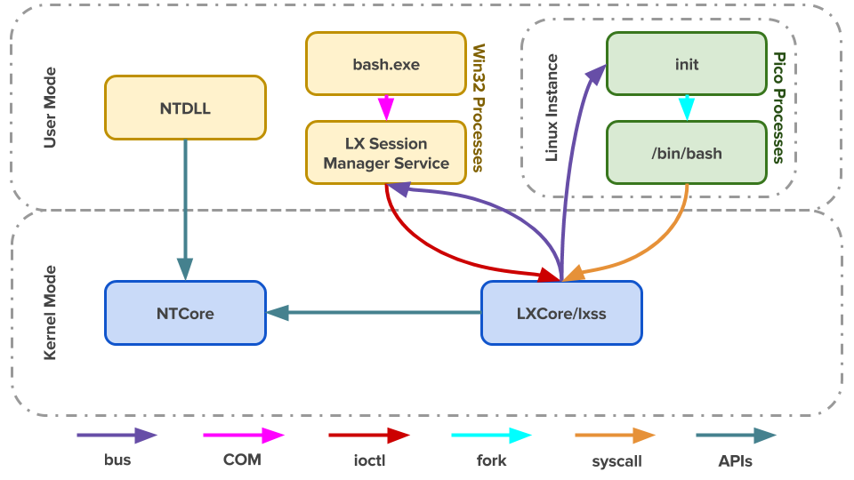

##  *Win* 平台类 *Unix* 工具链

| 维度                  | *Cygwin*           | *MSYS*          | *MSYS2*         | *WSL 1*               | *WSL 2                |
|-----------------------|--------------------|-----------------|-----------------|-----------------------|-----------------------|
| 实现方式              | 用户态 DLL 翻译    | 用户态 DLL 翻译 | 用户态 DLL 翻译 | 内核 syscall 翻译     | 真正的 Linux 内核 VM  |
| 有无 Linux 内核       | 无                 | 无              | 无              | 无                    | 有                    |
| POSIX 兼容性          | 最好（在翻译层中） | 基本够用        | 好              | 好但有缺口            | 完整                  |
| 原生 Windows 程序编译 | 可以但有依赖       | MinGW 支持      | MinGW 支持      | 不适用                | 不适用                |
| 包管理                | `setup.exe`        | 无（手动）      | `pacman`        | `apt` 等 Linux 包管理 | `apt` 等 Linux 包管理 |
| Docker 支持           | 不支持             | 不支持          | 不支持          | 不支持                | 支持                  |
| Windows 文件访问      | 直接访问           | 直接访问        | 直接访问        | 直接访问（快）        | 通过 `/mnt`（较慢）   |
| 性能开销              | 中（DLL 翻译）     | 中              | 中              | 低                    | VM 开销，但已优化     |
| 当前状态              | 维护中             | 已过时          | 活跃开发        | 仍可用但推荐 WSL2     | 推荐方案              |

### *Cygwin*

-   *Cygwin*：在 Windows 上提供完整 POSIX 兼容环境
    -   原理：通过一个核心共享库 `cygwin1.dll` 实现 POSIX API 到 Win32 API 的翻译
        -   故，Linux 程序需要针对 Cygwin 重新编译，链接此 DLL
        -   编译出的可执行文件为 *Win32 PE* 格式封装，只能在 *Windows* 下执行
        -   应用程序不直接请求内核，而是调用 Cygwin 运行库
    -   包管理：自带 `setup.exe` 安装器，包数量丰富
    -   特点
        -   编译出的程序是 Windows 原生 `.exe`，但依赖 `cygwin1.dll`
        -   POSIX 兼容性最好（`fork`、信号、路径等都尽量模拟）
        -   体积较大，性能有一定损耗
        -   可以运行大部分 Unix 程序，但不是真正的 Linux 内核
    -   典型用途
        -   在 Windows 上完整运行 Unix 工具链、移植 Unix 软件
        -   随着 *Linux* 系统发展，目前的 *Cygwin* 不仅仅提供 *POSIX* 兼容，因此多了更多模拟层依赖关系

### *MSYS*、*MinGW*

-   *Minimal SYStem*：提供最小化的 *POSIX shell* 环境
    -   *MSYS* 目的是构建出不依赖 *Cygwin DLL* 的原生 Windows 程序
        -   早期从 Cygwin 代码分叉而来（约 2001 年），做了大量裁剪
        -   与 *Cygwin* 的大而全不同，*MSYS* 以小巧玲珑为目标
    -   *MSYS* 是 *MinGW* 的配套 Shell 环境
        -   提供 `bash`、`make`、`autoconf` 等构建工具

####    *MSYS2*

-   *MSYS2：MSYS 的现代化继承者，基于更新版本 Cygwin 代码开发
    -   包管理：使用 `pacman`，生态活跃
    -   提供三套子环境（通过不同的启动器/前缀区分）
        | 子环境    | 编译目标                           | 运行时依赖          |
        |-----------|------------------------------------|---------------------|
        | *MSYS2*   | 链接 `msys-2.0.dll`（类似 Cygwin） | 需要 `msys-2.0.dll` |
        | *MINGW64* | 原生 64-bit Windows 程序           | 无额外依赖          |
        | *MINGW32* | 原生 32-bit Windows 程序           | 无额外依赖          |
    -   特点：包丰富、更新活跃、同时兼顾 POSIX 构建环境和原生编译
    -   典型用途
        -   `Git for Windows` 即基于 MSYS2 构建

####    *MinGW*

-   *Minimalist GNU for Windows*：*GCC* 编译器工具链
    -   主要提供针对 *win32* 应用的 *GCC*、*GNU binutils* 等工具
        -   提供 Windows 平台的头文件（`windows.h` 等）和导入库，让 GCC 能链接 Windows API
    -   产出纯原生、不依赖第三方 DLL 的 Win32 可执行文件
        -   直接调用 Win32 API / MSVCRT，无额外运行时依赖
-   *MinGW-w64*：新一代的 *MinGW*
    -   最初分叉仅为添加 64 位支持，目前已经是 *MinGW* 的事实标准
        -   目前使用 *MinGW* 场景基本都是 *MinGW-w64*
    -   相较于 *MinGW*
        -   支持更多的 *API*，支持 64 位应用开发
        -   支持 POSIX 线程 `pthreads` 模型选择
        -   支持 `SEH`、`SJLJ`、`Dwarf` 异常处理模型
        -   能交叉编译（在 Linux 上编译 Windows 程序）
        -   头文件覆盖更完整（包括 DirectX、WinRT 等）

| 维度            | *MinGW(-w64)*          | *MSVC(Visual Studio)* | *Clang/LLVM*       |
|-----------------|------------------------|-----------------------|--------------------|
| 编译器          | GCC                    | cl.exe                | clang              |
| C++ 标准库      | libstdc++              | MSVC STL              | libc++ 或 MSVC STL |
| ABI 兼容        | 与 MSVC 不兼容         | Windows 标准 ABI      | 可选               |
| 链接的 C 运行时 | MSVCRT / UCRT          | UCRT                  | 灵活               |
| 产物            | 原生 Windows 程序      | 原生 Windows 程序     | 原生 Windows 程序  |
| 典型用途        | 开源项目移植、交叉编译 | Windows 原生开发      | 跨平台、工具链开发 |

### *WSL*



-   *Windows Subsystem Linux*：Windows 内核级别对 Linux `syscall` 系统调用的翻译
    -   原理：微软在 *Windows NT* 内核中实现了 *Linux syscall* 兼容层（`lxcore.sys`、`lxss.sys`），将 Linux 系统调用翻译为 NT 内核调用
        -   Linux 应用程序进程被包裹在 *Pico Process* 中，其发出的所有系统调用会被直接送往 *Kernel Mode* 中的 `lxcore.sys`、`lxss.sys`
        -   故，可以直接执行 *ELF* 格式封装的 *Linux* 可执行程序
        -   以 `ls/dir` 命令为例
            -   内核调用逻辑不同
                -   在 Linux 下调用 `getdents` 内核调用
                -   在 Windows 下调用 `NtQueryDirectoryFile` 内核调用
            -   WSL 兼容逻辑
                -   在 WSL 中执行 `ls` 仍然调用 `getdents`
                -   WSL 收到请求，将系统调用转换为 *NT* 内核接口 `NTQueryDirectoryFile`
                -   *NT* 内核收到 WSL 请求，返回执行结果
                -   WSL 将结果包装后返回
    -   但 `syscall` 兼容性始终存在缺口，相较于真正 *Linux* 内核
        -   *Docker*、部分驱动等涉及未实现的内核特性软件如法使用
        -   *Raw socket* 相关相关操作容易出错
        -   *I/O* 性能相对孱弱，但直接访问 Windows 文件系统的 *I/O* 性能好
        -   启动快，资源占用小

> - *WSL1* 起于 2016 年 Windows10 1607+，*WSL2* 起于 2019 年 Windows10 1903+
> - *WSL* 功能需要在 `启用或关闭 Windows 功能` 中启用 `适用于 Linux 的 Windows 子系统` 手动启用

####    *WSL2*

-   *WSL2*：在轻量级 *Hyper-V* 虚拟机中运行真正的 Linux 内核
    -   原理：微软自己维护了一个 Linux 内核，运行在优化过的轻量 VM 中
    -   特点
        -   完整的 Linux 内核，`syscall` 兼容性接近 100%
            -   可以运行 Docker
            -   支持真正的 Linux 发行版：Ubuntu、Debian、Arch 等
        -   使用 `.vhdx` 虚拟磁盘提高文件系统性能
            -   Linux 原生文件系统中 *I/O* 操作极快
            -   但访问 Windows 磁盘 `/mnt` *I/O* 相对较慢
        -   内存可动态回收：WSL2 的 VM 会自动释放未用内存

##  *WSL1* 基本使用

### WSL、Windows 互操作

-   WSL、Windows 文件互操作
    -   文件系统
        -   Windows 所有盘符挂载在 WSL 中 `/mnt` 目录下
        -   WSL 中所有数据存放在 `%HOME%/AppData/Local/Packages/{linux发行包名}/LocalState` 中
            -   WSL1 文件可直接查看（但不要在 Windows 下直接修改，避免造成权限错误）
            -   WSL2 使用 `.vhdx` 虚拟磁盘整体管理
    -   端口、环境变量
        -   WSL 与 Windows 共享端口
        -   WSL 继承 Windows 的部分环境变量，如：`PATH`
    -   WSL 可直接调用、启动 Windows 命令程序（已位于 `PATH` 环境变量中）
        -   类似，*Windows CMD* 可通过 `wsl` 命令直接执行 WSL Shell 命令
        -   甚至，WSL Shell 命令、Windows 命令可通过 `|` 通信

```shell
PS> wsl [-e] ls -al             # wsl带参数执行
$ which ipconfig.exe            # 在WSL中调用Windows命令行程序（在`$PATH`中）
$ notepad.exe                   # 在WSL中启动Windows应用（在`$PATH`中）
$ cat foo.txt | clip.exe        # 通过pipes通信
PS> ipconfig | wsl grep IPv4
```

### WSL 文件权限问题

-   为 WSL1，Windows 实现了两种文件系统用于支持不同使用场景
    -   *VolFs*：着力于在 Windows 文件系统上提供完整的 Linux 文件系统特性
        -   通过各种手段实现了对 *Inodes*、*Directory Entries*、*File Objects*、*File Descriptors*、*Special File Types* 的支持
        -   为支持 *Inodes*，*VolFS* 会把文件权限等信息保存在 *NTFS Extended Attributes* 中
            -   在 Windows 中新建的文件缺少此扩展参数，有些编辑器也会在保存文件是去掉这些附加参数
            -   在 Windows 中修改 WSL 中文件，将导致 *VolFs* 无法正确获得文件 metadata
        -   WSL 中 `/` 就是VolFs文件系统
    -   *DrvFs*：着力提供于Windows系统的互操作性
        -   从 Windows的文件权限（即 `文件->属性->安全选项卡` 中的权限）推断出文件对应 Linux 权限
        -   所有 Windows 盘符挂在在 WSL 中 `/mnt` 是都使用 *DrvFs* 文件系统
        -   由于 *DrvFs* 文件权限继承机制很微妙，结果就是所有文件权限都是 `0777`
            -   所以 `ls` 结果都是绿色的
            -   早期 *DrvFs* 不支持 metadata，在 *Build 17063* 之后支持文件写入 metadata，但是需要重新挂载磁盘
        -   可以通过设置 *DrvFs* metadata 设置默认文件权限
            -   一般通过 `/etc/wsl.conf` 配置 *DrvFs* 自动挂载属性，而不直接命令行手动挂载

```shell
$ sudo umount /mnt/e
$ sudo mount -t drvfs E: /mnt/e -o metadata
# 此时虽然支持文件权限修改，但默认权限仍然是*0777*
$ sudo mount -t drvfs E: /mnt/e -o metadata,uid=1000,gid=1000,umask=22,fmask=111
# 此时磁盘中默认文件权限为*0644*
```

> - <https://blogs.msdn.microsoft.com/wsl/2016/06/15/wsl-file-system-support/>
> - <https://blogs.msdn.microsoft.com/commandline/2018/01/12/chmod-chown-wsl-improvements/>

### *AutoMatically Configuring WSL*

```cnf
 # `/etc/wsl.conf`
[automount]
enabled = true                  # 是否自动挂载
mountFsTab = true               # 是否处理`/etc/fstab`文件
root = /mnt/                    # 挂载路径
options = "metadata,umask=023,dmask=022,fmask=001"      # DrvFs 挂载选项，若需要针对不同drive配置，建议使用`/etc/fstab`
[network]
generateHosts = true
generateResolvConf = true
[interop]
enabled = true                  # 是否允许WSL载入windows进程
appendWindowsPath = true
[user]
default = root                  # 默认登录用户
```

-   *WSL* 通过 `/etc/wsl.conf` 文件配置行为
    -   磁盘挂载说明
        -   如果需要给不同盘符设置不同挂载参数，需要再修改 `/etc/fstab`

```cnf
 # /etc/fstab
E: /mnt/e drvfs rw,relatime,uid=1000,gid=1000,metadata,umask=22,fmask=111 0 0
```

> - <https://blogs.msdn.microsoft.com/commandline/2018/02/07/automatically-configuring-wsl/>
> - <https://devblogs.microsoft.com/commandline/automatically-configuring-wsl/>

##  *WSL2*

### *WSL2* 压缩、迁移

-   *WSL2* 使用 `.vhdx` 虚拟磁盘：磁盘大小自动增长但不会自动减少
    -   即使删除内部文件，`.vhdx` 在宿主机上仍保持峰值大小
        -   可将 `.vhdx` 设置为 `sparse` 模式，但似乎有风险
    -   故，若 *WSL2* 实际占用大小较小，可通过 `diskpart` 压缩虚拟磁盘大小释放空间
        -   `diskpart` 是 *Win* 系统工具，可直接在 *PowerShell* 中输入命令启动
            -   `diskpart` 压缩磁盘完毕后，必须显式 `detach` 磁盘，否则即使退出工具依然无法启动 *WSL2*
        -   压缩前最好先检查、删除文件，为压缩提供空间
    -   若无压缩空间，只能尝试迁移 *WSL2*
        -   原生命令迁移
            -   只适合 *Win11*
        -   打包导出，再在合适位置重新导入（并删除原实例）
            -   打包导出后可跨机器导入
            -   导入后可能需要修改 `/etc/wsl.conf` 恢复默认用户
    -   注意事项
        -   压缩、迁移前应做好备份
            -   `diskpart` 压缩后出现过 *WSL2* 崩溃问题，电脑整体重启后才恢复
        -   同样，删除原实例前最好先检查重新导入的实例是否正常
            -   则同机器迁移时，新导入实例必须重命名
        -   压缩、导出前需关闭 *WSL2*
            -   直接 `exit` *WSL2* 依然可能在后台运行，需要 `wsl --shudown`、`wsl --temrinate <dist-name>` 显式关闭
            -   总应 `wsl -l -v` 检查运行状态

```shell
wsl -l -v                                                   # 检查 *WSL2* 各实例状态
wsl --shutdown                                              # 关闭 *WSL2* 全部实例
wsl --terminate <dist-name>                                 # 关闭指定实例
wsl --export <dist-name> <tar-file-name>                    # 导出实例为 `.tar` 文件
wsl --import <new-dist-name> <dest-path> <tar-file-name>    # 导入 `.tar` 文件为新实例
wsl --manage <dist-name> --move <dest-path>                 # 移动实例至目标位置
wsl --unregister <dist-name>                                # 注销（删除）实例

diskpart                                                    # 启动 `diskpart` 工具，后续为 `diskpart` 工具中命令
select vdisk
file="C:\Users\21945\AppData\Local\Packages\<DIST-NAME>\LocalState\ext4.vhdx"
attach vdisk readonly
compact vdisk
detach vdisk                                                # 必须显式卸载
exit                                                        # 退出 `diskpart`
```

> - *WSL2* 磁盘瘦身与空间自动回收指南：<https://zhuanlan.zhihu.com/p/2001292650641367095>
> - 如何将 *WSL2* 镜像无损迁移至非系统盘：<https://www.cnblogs.com/mq0036/p/19723674#tid-z8MDNe>

##  Windows 终端模拟器

-   除 Windows 自带 *CMD*、*Windows Terminal* 外，有其他终端模拟器
    -   *wsl-terminal*：专为 WSL 开发的终端模拟器，基于 *mintty*、*wslbridge*，稳定易用
        -   受限于 *wslbridge*的 原因，WSL-Terminal 必须在 *NTFS* 文件系统中使用
        -   *mintty* 本身依赖 *CMD*，包括字体等在内配置受限于 *CMD*
    -   *ConEmu*：老牌终端模拟器，功能强大
    -   *Hyper*：基于 *Electron* 的跨平台终端模拟器

> - *wsl-terminal*：<https://github.com/goreliu/wsl-terminal>
> - *ConEmu*：<https://conemu.github.io>
> - *Hyper*：<https://hyper.is>

### *WSL-Terminal*

-   WSL-Terminal中包含一些快捷工具
    -   `tools` 目录中包含一些脚本，可以通过 `wscripts.exe` 执行修改注册列表，添加一些功能
        -   添加 WSL 中 *Vim*、*Emacs* 等到右键菜单
        -   添加 *在 WSL 中打开文件夹* 到右键菜单
    -   `run-wsl-file.exe` 可以用于在快捷执行 WSL 脚本，只需要将其选择为文件打开方式
    -   `vim.exe` 可以用 WSL 中 *Vim* 打开任何文件
        -   一般是配合 `tools/` 中脚本在右键注册后使用
    -   配置文件
        -   配置文件`etc/wsl-terminal.conf`
        -   主题文件`etc/themes/`
        -   *mintty*配置文件`etc/mintty`

> - <https://zhuanlan.zhihu.com/p/22033219>
> - <https://www.zhihu.com/question/36344262/answer/67191917>、
> - <https://www.zhihu.com/question/38752831>
