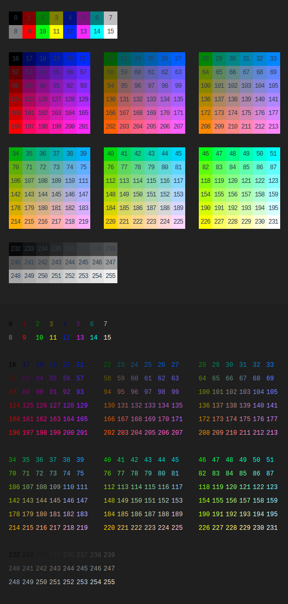

##  字符、字符集、编码

### 字符、字符集

-   *Abstract Charater Repertoire* 抽象字符集：*ACR*，抽象字符的集合
    -   抽象字符集特点
        -   集合表明无序性
        -   有时也简称为字符集 *charater set*
        -   有开放（字符不会改变）和封闭之分（会扩张）
    -   字符：字母、数字、标点、表意文字（汉字）、符号或其他文本形式的 “原子”
    -   抽象字符：抽象的字符，包括空白、不可打印的字符
        -   对于某些语言中，抽象字符应该还包括发音字符
        -   如：印度语中单词“नमस्ते”
            -   有6个字符['न', 'म', 'स', '्', 'त', 'े']，
            -   其中4、6两个字符在单词不出现，是发音字符
-   *Coded Character Set* 编码字符集：*CCS*，每个所属字符都分配了码位的抽象字符集
    -   特点
        -   亦经常简称为字符集 *charater set*（同 *ACR*）
        -   字符与码位的一一映射
        -   可以更加方便的引用字符集中的某个元素
    -   *Code Point* 码位：抽象字符集中与字符关联的数字编号
        -   一般是非负整数
        -   习惯上有16进制表示

####    常见字符集

-   *ACSII* 字符集
    -   128 个抽象字符，封闭字符集
    -   主要包括
        -   控制字符：回车、退格、换行
        -   可显示字符：英文大小写、阿拉伯数字、西文符号
    -   一般字符集都是兼容ascii编码字符集，即相同字符的码位相同
-   *ISO-8859-X*：扩展的 *ASCII* 字符集
    -   涵盖了大多数西欧语言字符、希腊语
-   *GBXXXX*：国标系列字符集
    -   每个标准包含的字符数量不同、对应的编码方案也不不完全相同
    -   *GB2312*：信息交换用汉字编码字符集基本集
        -   包含汉字覆盖 99.75% 的使用频率
        -   人名、古汉语等罕用字不能处理
    -   *GBK*：汉字内码扩展规范
        -   包括 21003 个汉字
        -   支持国际标准 *ISO/IEC10646-1* 和国家标准 *GB13000-1* 中全部中日韩汉字
        -   包含了 *BIG5* 编码中的所有汉字
        -   兼容 *GB2312*
    -   *GB18030*：信息技术中文编码字符集
        -   其中收入汉字 70000 余个
        -   以汉字为主并包含多种我国少数民族文字（如藏、蒙古、傣、彝、朝鲜、维吾尔文等）的超大型中文编码字符集强制性标准
        -   兼容 *GBK*
-   *Big5* 字符集：主要包含台湾、香港地区繁体字

-   *Universal Character Set*、*Unicode*、*UCS* 统一字符集、Unicode 字符集：*ISO/IEC 10646* 定义的编码字符
    -   开放字符集，码位无上限，容纳一切字符，包括 *emoji* 等
    -   *UCS* 中码位不是连续分配的
        -   目前为止，分为 `0x0000~0x10FFFF` 共 17 个平面
        -   其中 0 平面 `0x0000~0xFFFF` 称为 *Basic Multilingual Plane*
            -   `BMP` 中码位只有 16bit 长度，能够节约大量存储空间，有战略意义
            -   因此“常用”语言的常用字符放在`BMP`，其他不常用的字符只能放在其他平面
    -   *Unicode* 本身是指一系列用于计算机表示所有语言字符的标准

###  字符编码

-   *Character Encoding Form* 字符编码表：将码位映射为码元序列
    -   *fixed-length-encoding*：定长编码，对每个码位（字符）赋予长度同为m的码元（位串）
    -   *variable-length-encoding*：变长编码，允许对不同码位赋予不同长度的码元
    -   说明
        -   封闭字符集符号有限，可定长编码直接确定一一对应的编码表
        -   开放字符集包括符号无上限，无法定长码元表示码位，必须有某种方式将码位一一映射为码元序列
        -   当然，封闭字符集出于节约成本考量，也可能使用变长编码如：*Huffman* 编码
-   *Character Encoding Schema* 字符编码方案：字符编码表 + 字节序列化方案
    -   将码位映射为字节流，即通常意义上编码、解码即指 *CES*，需确认以下问题
        -   大小端序问题：码元高位还是低位字节在前
            -   *Byte Order Mark* 字节序标：放置于编码字节开始处的特殊字节序列，表明序列大小端序
                -   `0xFFFE`：小端序，低位在前
                -   `0xFEFF`：大端序，高位在前
        -   字节序标记问题：不同程序之间端序交流
    -   所有字符串存储介质中，磁盘、**内存** 都采用某种具体 *CES* 实现存储
        -   Java、Python3 这样的偏上层语言，字符串对象在内存中通常采用 *UTF-16*
        -   C 这样偏底层语言，基本上按照源文件的编码确定
            -   即，将源文件中对应字符串对应字节
            -   但，现在 C/C++ 中还有一种宽字符 `w_char` 类型
        -   大部分提供 *Unicode* 处理语言会自动处理字符，不仅仅是字节
            -   在考虑字符串问题时，可抽象的忽略具体存储方式，认为存储的就是“码位”本身
            -   内存、磁盘（文件）等需存储字符串场合，总是需要使用特定 *CES* 得到字节流，避免长度问题
-   *Transfer Encoding Syntax* 传输编码语法 *TES*
    -   有时候需要对字节流再次编码以进行传输
        -   如：某些字符不允许出现在传输流中
        -   *Base64 编码*：将字节流映射成 64 个安全字符集组成的字符流

> - 码元：能用于处理或交换编码文本的最小比特组合（位串）
> - *CES* 真正的应用层面方案，需要给出具体存储方案实现，*ACR*、*CCS*、*CCF* 都是理论上的协议
> - 对于 *ASCII* 字符集来说 *CEF*、*CES* 基本相同，但对 *Unicode* 字符集而言差别较大

#### *Unicode* 定义的 *CEF*、*CES*

-   *Unicode* 为开放字符集，只能采用变长编码，常用即 *Unicode Transfromation Format*
    -   编码本质思想：预留标记位值使码元序列的长度实现变长
    -   *UTF-8*：码元为 1B，不存在字节序问题
        -   对 *BMP* 中字符一般需要 *1-3B*，*BMP* 外需要 4B
        -   兼容 *ASCII* 编码表（不仅仅是兼容编码字符集）
        -   指代 *CES* 和 *CEF* 没有什么区别，*CEF* 只有一种实现方式
    -   *UTF-16*：码元为 2B，指代 *CES* 和 *CEF* 时有歧义
        -   对 *BMP* 中字符一般需要 2B，*BMP* 外需要 4B
        -   *UTF-16 Encoding Schema*（字节流）
            -   *UTF-16-le*：*utf-16* 编码表小端版本
            -   *UTF-16-be*：*utf-16* 编码表大端版本
            -   *UTF-16*：*utf-16* 编码表带 *BOM* 版本，大小端均可
    -   *UTF-32*：码元为 4B
        -   *UTF-16 Encoding Schema*（字节流）
            -   *UTF-32le*：
            -   *UTF-32be*
            -   *UTF-32*

> - 兼容 *ASCII* 编码表指，*ASCII* 编码方案可以使用 *UTF-8* 解码方案直接解码；而一般意义上编码字符集兼容（大部分方案满足）仅指，对应字符码位相同
> - *UTF* 历史上是指 *CES*，而 *UTF-X* 现在可以同时指代 *CES* 和 *CEF*，是 *Unicode* 族标准 *CEF* 方案
> - *UTF-16 CES* 表示 *BMP*（包含大部分常用字符）只需要 2B，权衡了内存占用、处理便捷，适合作为内存中字符串的编码方案
> - *UTF-8* 无需 *BOM*，但 MS 会在 *UTF-8* 中添加 *BOM* 以与其 *ANSI* 区分

-   *Unicode* 还有两种非标准 *CES*
    -   *UCS-2*：使用 2B 定长序列化码位
        -   可以视为 *UTF-16* 的子集
        -   不支持 *BMP* 外的字符表示
    -   *UCS-4*：使用 4B 定长序列化码位
        -   可以视为 *UTF-32* 的子集

> - <https://www.cnblogs.com/malecrab/p/5300503.html>

#### 其他字符集 *CES* 方案

-   *US-ASCII*、*GBK* 都有自己的编码方案，只是编码方案太简单，以至于 *CCS*、*CEF*、*CES* 三层合一
    -   *ASCII* 编码方案：1B 的低 7 位表示一个字符
    -   *ISO-8895-1* 编码方案：1B 表示一个字符
    -   *GB2312* 编码方案：2B 表示一个汉字
        -   第一个字节：区字节，高位字节
        -   第二个字节：位字节，低位字节
    -   *GBK* 编码方案：2B 表示一个汉字
        -   兼容 *GB2312* 方案
        -   编码范围：`0x8140~0xFEFE` 中剔除 `0xxx7F`
    -   *GB18030* 编码方案：变长字节 1B、2B、4B
        -   兼容 *GBK* 方案
    -   *Big5* 编码方案：2B 表示一个汉字
        -   字节顺序类似 *GB2312*

#####    *ANSI* 编码

-   *ANSI* 编码：各个国家、地区独立制定、兼容 *ASCII* 编码，但彼此之间不兼容的编码方案，微软**统称为ANSI编码**
    -   *ANSI* 编码一般代表系统（仅 Windows）默认编码方式，在不同系统中
        指不同的编码方案
        -   英文操作系统：*ISO-8859-1*
        -   简体中文：*GBxxxx* 编码
        -   繁体中文：*Big5* 编码
        -   日文：*Shift JIS* 编码
    -   系统默认 *ANSI* 编码可以通过设置系统 `Locale` 更改

> - Windows 下系统 `Locale` 决定代码页，用户 `Locale` 决定数字、数字、货币、时间与日期格式

#### *Prefix-Free Code*

-   （自由）前缀码：所有代码码元都不是另一个字符码元的前缀
    -   可以简单扫描位串直到得到一组有效码元，转换为相应字符
    -   这样编码表可以很容易用一棵（编码）二叉树表示
        -   树左向边标记为 0、右向边标记为 1
        -   叶子节点表示字符，根节点到叶子节点路径为其码元
        -   树中叶子节点到其他叶子节点的简单路径不存在，即码元不可能为其他码元前缀
        -   所以任何二叉树对应一套编码表
    -   这种编码方案一般用于产生 **平均长度最短** 的位串
        -   因此这类编码方案以 bit 为单位，而不是以 byte 为单位

#####    *Huffman Encoding*

-   哈夫曼编码：*Prefix-Free Code* 的一种
    -   若字符独立出现，则哈夫曼编码是最优编码（最短长度编码）
    -   根据字符出现频率进行编码
        -   需要事先知道字符出现概率
        -   可以事先扫描给定文本，对文本中字符出现字符计数
        -   将较短位串分配给高频字符、较长位串分配给低频字符
    -   需要把编码树信息包含在编码文本中才能正确解码
-   *Adaptive Huffman Encoding*：利用已经处理字符串动态更新编码

> - 构造哈夫曼树的贪婪算法参见组合问题

###  常见问题辨析

#### 输入

-   所有的输入都是经过 *CES* 编码的字节流（包括数字）
    -   文件输入流：文件编码方案决定
    -   标准输入流（终端）：终端编码方案决定
    -   管道传输流：由管道输入端的编码方案决定

-   两种处理方式
    -   将输入视为字节流，不做任何处理，直接按字节存储在内存中
        -   将输入字节流视为其自身编码方案字节流，直接储存
    -   将输入视为字符串，尝试解码
        -   若解码发现无法解释位串
            -   *strict*：报错
            -   *replace*：将违规字符替换为有效字符
                -   替换为某种`?`：很多应用采用此方式，是乱码发生的主要原因
                -   有些也替换为形如 `\uXXXX`，表示 *Unicode* 码位的字符串
            -   *ignore*：忽略该位串
        -   而解码后字符串的在内存中的存储，取决于解释器、编译器、系统等处理主体的编码方案

> - 以上只是对真正有字符串类型的语言 Python、Java 有这样区分
> - 对于没有字符串类型的语言 C 并没有真正意义上的字符串，只有字节串，不涉及解码、自身字符串内存存储的问题，仅有换行符转义问题（若处理换行符被视为解码）

#### 输出

-   所有输出都是编码后字节流（包括数字）
    -   文件输出流：`write`
    -   标准输出流（终端）：`print`
    -   管道传输流
    -   注意
        -   输出的字节流编码方案和处理主体在内存中编码方案不一定相同，和程实现、平台等因素都有关，比如很多默认输出编码方案为 *utf-8*
        -   同样的，输出流是对于其接收者而言仅仅是字节流，需要自行决定如何处理字节流
        -   此输出是指传递给 **直接输出外部** 的输出，有些语言在输出前会隐式调用函数生成字符串

#### 其他问题

#####    乱码

-   乱码主要有以下 3 种可能
    -   读取乱码：真正的乱码
        -   读取时没有正确解码，内容被替换，打印输出
    -   存储乱码：保存时已经是“乱码”，其实也不能算是乱码
        -   读取时没有正确解码，内存中内容已经被错误，保存后内容保持错误
        -   内存中数据正确，但保存使用的编码方案不支持某些字符，内容被替换
    -   缺少字体库

> - 乱码不是其实已经是将不能打印的字符剔除、替换，能看到的乱码已经是程序认为 “正确解码的字符串”

#####    换行符处理

-   **逻辑换行** 与 “换行控制字符串” 不完全一致
    -   常用的换行相关控制字符
        -   `<CR>` 回车（常用转义 `\r`）
        -   `<NL>` 新行（常用转义 `\n`）
    -   各系统逻辑换行使用不同控制字符表示
        -   Windows：`\r\n`
        -   Linux：`\n`（代码中常用）
    -   Windows 下很多编程语言设计中，以字符串模式读取字节流时会自动将 `\r\n` 替换为 `\n`、写出字节流时替换回 `\r\n`
        -   Python 这种原生支持字符串语言，这个特性可以看作字符串解码的行为
        -   C 这种原生只支持字节串的语言，这个特性可能是二进制、字符串读写的唯一区别

#### 案例

-   以 *UTF-8* 编码方案 *CES* 为例
    -   输入的所有的内容都是由 *UTF-8* 编码方案编码的字节流
    -   处理主体获取字节序列，根据指令处理字节序列
        -   比如字节序列编码和处理主体编码不同，将其解码为主体编码方案
        -   比如按照约定将字节序列转变为不同类型的数据
    -   输出则是将需要输出的内容（包括数字等）转换字节流传给底层函数

##  控制字符集、转义序列

###  *C0*、*C1* 控制字符集

-   *CO* 控制字符集码位范围：`0x00 - 0x1F`
    -   *ISO 646 ASCII* 中定义控制字符标准
    -   码位限定在 1byte 可以表示，避免终端机需要实现状态机处理多字节控制序列
    -   现只有少数控制字符被使用，常用的包括
        -   `<NL>`/`<LF>` 换行符：`0x0A`，开启新行
        -   `<CR>` 回车符：`0x0D`，指针移至行首
        -   `<ESC>` 退出：`0x1B`
-   *C1* 控制字符集码位范围：`0x80 - 0x9F`
    -   扩展的 *ASCII* 中考虑到 7bits、8bits 环境兼容性，7bits、8bits 码值应可以相互转换
        -   考虑到，对 `0x21 - 0x7E` 间的可打印字符
            -   7bits 环境中：通过 `<SI>`、`<SO>` 移位状态控制 `0x21 - 0x7E` 代表不同图像字符
            -   8bits 环境中：可使用最高位标识两组不同图像字符
        -   而 `0x00 - 0x1F` 间的 *C0* 控制字符不受 `<SI>`、`<SO>` 移位状态影响
            -   即 8bits 环境中，`0x80 - 0x9F` 码位未被使用，可被用作额外的控制字符
            -   即，*C1* 控制字符集即由 *C0* 控制字符集作为低位、最高位置 1
            -   同时，`0x1B 0x40 - 0x1B 0x5F` 也被用于在 7bits 环境中代表 *C1* 控制字符
        -   另外，`0xA0 - 0xFF` 间字符为兼容性保持未定义
    -   *C1* 控制字符集定义时间线
        -   *ECMA-35*、*ISO 2022* 中初次提出
        -   *ECMA-48*、*ISO/IEC 6429* 中提出通用 *C1* 控制字符集
        -   *ISO 8859* 在兼容的情况下为 `0xA0 - 0xFF` 定义字符集
    -   *C1* 码位在经常被私有编码方案（*Windows-1252*、*Mac Os Roman*）用于提供额外的可打印字符
    -   *ISO/IEC 8859 ASCII* 扩展标准中指定
-   说明
    -   *C0* 控制字符码位范围之外，还有定义有两个具备控制符特点的字符
        -   `<Del>`：`0x7F`
        -   `<Space>`：`0x20`
    -   `<NL>`/`<LF>`、`<CR>` 在早起打字机上联用表示如今“完整”换行动作
        -   `<LF><CR>` 也是现今 *DOS*/*Win* 下的换行标识符（序列）
        -   而 *Unix* 系统下则仅使用 `<CR>` 表示换行
        -   老式 *mac* 则使用 `<LF>` 表示换行（不常见）
    -   *Unicode* 中控制字符码位兼容 *ISO/IEC 2022*，但
        -   仅对 *U+001C - U+001F*、*U+0009 - U+000D*、*U+0085* 限定语义
        -   其余控制字符语义对 *Unicode* 透明，留给高层协议

> - *C0*、*C1* 控制字符集：<https://zh.wikipedia.org/wiki/C0%E4%B8%8EC1%E6%8E%A7%E5%88%B6%E5%AD%97%E7%AC%A6>
> - *C0 and C1 control codes*：<https://en.wikipedia.org/wiki/C0_and_C1_control_codes>

### *ANSI C* 标准转义

-   非打印（包括控制）字符可以通过其 *ASCII* 码位 16 进制、8 进制表示
    -   `\0<OOO>`：八进制数 `OO` 码位字符
    -   `\x<HH>`：十六进制数 `HH` 码位字符

-   针对常用 *C0* 控制字符（非打印字符），有如下简写方式
    -   `\a`：`<Bel>` 响铃
    -   `\b`：`<BS>` 退格
    -   `\f`：`<FF>` 进纸
    -   `\n`：`<LF>`/`<NL>` 换行
    -   `\r`：`<CR>` 回车
    -   `\t`：`<TAB>` 制表符
    -   `\v`：`<VT>` 垂直制表符
    -   `\e`：`<Esc>` 退出

> - 此处未列出全部 *ANSI C* 标准转义序列，如 `\\` 自身、`\uXXXX` Unicode 字符

###  *ANSI Escape Sequences*

-   *ANSI Escape Sequences*：一种 *In-band Signaling* 的转义序列标准，用于控制终端上 **光标位置、颜色、其他选项**
    -   在文本中嵌入的 *ANSI* 转义序列，终端会将 *ANSI* 转义序列解释为相应指令，而不是普通字符
    -   *ANSI* 转义序列使用 *ASCII* 中字符传递所有信息
    -   *ANSI* 转义序列可能与 *C0* 控制字符效果类似
        -   `<LF>`、`<ESC> E`都有换行效果

-   *ANSI* 转义序列有不同长度，但都
    -   以 *ASCII* 字符 `<ESC>`（码位 `0x1b`, 转移序列 `\x1b`、`\e`、`\033`） 开头
    -   第二字节则是 `0x45 - 0x5F`（*ASCII* `@A-Z[\]^_`）范围内的字符

-   标准规定，在 8bits 环境中
    -   *ANSI* 转义序列前两个字节的序列可以合并为 `0x80 - 0x9F` 范围内的单个字节（即 *C1* 控制字符）
    -   但在现代设备上，*C1* 控制字符码位被用于其他目的，一般不被用作转义序列
        -   *UTF-8* 编码对 `0x80` 及以上字符本就需要 2bytes
        -   *Windows-1252* 编码将 *C1* 控制字符码位挪作他用

> - *In-band signaling* 带内信令：信令、通信内容使用同一通道
> - <https://zh.wikipedia.org/wiki/ANSI%E8%BD%AC%E4%B9%89%E5%BA%8F%E5%88%97>
> - <https://www.gnu.org/software/screen/manual/html_node/Control-Sequences.html>

| 部分序列（省略 `<ESC>`） | 对应 *C1* 字符 | 名称                                | 效果                                       |
|--------------------------|----------------|-------------------------------------|--------------------------------------------|
| `N`                      | `0x8E`         | *SS2 - Single Shift 2*              | 从替代 *G2* 字符集中选择字符               |
| `O`                      | `0x8F`         | *SS3 - Single Shift 3*              | 从替代 *G3* 字符集中选择字符               |
| `P`                      | `0x90`         | *DCS - Device Control String*       | 控制设备                                   |
| `D`                      |                |                                     | 仅换行，不重置光标至行首                   |
| `E`                      |                |                                     | 换行并充值光标至行首，类似 `<LF>`          |
| `H`                      |                |                                     | 制表，类似 `<TAB>`                         |
| `M`                      |                |                                     | 翻转换行，回到上一行                       |
| `X`                      | `0x98`         | *SOS - Start of String*             | 引用由 *ST* 终止的一串文本参数             |
| `^`                      | `0x9E`         | *PM - Privacy Message*              | 引用由 *ST* 终止的以穿文本参数             |
| `_`                      | `0x9F`         | *APC - Application Program Command* | 引用由 *ST* 终止的一串文本参数             |
| `c`                      | -              | *RIS - Reset to Initial State*      | 类似`clear`命令                            |
| `[`                      | `0x9B`         | *CSI - Control String Sequence*     | 控制序列导入器，某些终端中也可以使用`0x9D` |
| `\`                      | `0x9C`         | *ST - String Terminator*            | 终止其他控件得字符串                       |
| `]`                      | `0x9D`         | *OCS - Operating System Command*    | 启动操作系统使用的控制字符串               |
| `%G`                     |                |                                     | 选择 *UTF8* 作为字符集                     |
| `#8`                     |                |                                     | *DEC* 屏幕校准测试，使用`E`填充整个终端    |

### *Control Sequence Introducer*

-   `<ESC>[`：控制序列导入器
    -   格式：`<ESC>[` + 若干参数字节 + 若干中间字节 + 一个最终字节

-   参数字节：常为一系列分号分隔的数字，如：`1;2;3`
    -   缺少的数字视为 0
    -   某些序列（*CUU*）把 0 视为 1，以使缺少参数情况下有意义

-   控制序列中一部分字符定义“私有”，方便终端制造商插入私有序列
    -   参数字节 `<=>?` 的使用：`<ESC>[?25h`、`<ESC>[?251` 打开、关闭光标显示
    -   最终字节 `0x70 - 0x7F`

| 组成部分 | 字符范围    | ASCII字符            |
|----------|-------------|----------------------|
| 参数字节 | `0x30~0x3F` | `0-9:;<=>?`          |
| 中间字节 | `0x20~0x2F` | ` 、!"#$%&'()*+,-./` |
| 最终字节 | `0x40~0x7E` | `@A-Z[]^_a-z{}~`, \` |

####    光标移动

| 序列内容（省略 `<ESC>[`）      | 名称                                     | 效果                                                           |
|--------------------------------|------------------------------------------|----------------------------------------------------------------|
| `[N]A`、`[N]B`、`[N]C`、`[N]D` | *CU[UDFB] - Cursor Up/Down/Forward/Back* | 光标移动`N`格，在屏幕边缘则无效                                |
| `[N]E`/`[N]F`                  | *Cursor Next Line/Previous Line*         | 光标移动至下`N`行/上`N`行开头                                  |
| `[N]G`                         | *Cursor Horizontal Absolute*             | 光标移动到第`N`列                                              |
| `[N;M]H`                       | *CUP - Cursor Position*                  | 光标绝对位置                                                   |
| `[N;M]f`                       | *Horizontal Vertical Position*           | 同 *CUP*                                                       |
| `[N]J`                         | *Erase in Display*                       | 清除屏幕部分区域：0 - 光标至末尾；1 - 开头至光标；2 - 整个屏幕 |
| `[N]K`                         | *Erase in Line*                          | 清除行内部分区域                                               |
| `[N]S`                         | *Scroll Up*                              | 整页向上滚动 `N` 行                                            |
| `[N]T`                         | *Scroll Down*                            | 整页向下滚动 `N` 行                                            |
| `s`                            | *Save Cursor Position*                   | 保存光标当前位置                                               |
| `u`                            | *Restore Cursor Position*                | 恢复光标位置                                                   |

####    窗口

| 序列内容（省略 `<ESC>[`） | 名称                   | 效果                                 |
|---------------------------|------------------------|--------------------------------------|
| `5i`                      | -                      | 打开辅助端口，通常用于本地串行打印机 |
| `4i`                      | -                      | 关闭辅助端口，通常用于本地串行打印机 |
| `6n`                      | *Device Status Report* | 以 `<ESC>[n;m]R` 报告光标位置        |

### *CSI* - *Select Graphic Rendition*

-   `<ESC>[<N>m`：*SGR* 选择图形再现
    -   `N`：图形样式参数，多个参数用 `;` 分隔，缺省为 0
    -   `m`：图形渲染 *CSI* 最终字节

####    格式

| 样式取值（*CSI-SGR* 中 `N` 取值） | 显示效果                                       | 取消值 |
|-----------------------------------|------------------------------------------------|--------|
| 0                                 | 所有属性值重置为默认值，用于取消对后续输出影响 |        |
| 1                                 | 高亮或粗体                                     | 22     |
| 2                                 | 半亮                                           | 22     |
| 4                                 | 下划线                                         | 24     |
| 5                                 | 缓慢闪烁                                       | 25     |
| 6                                 | 快速闪烁，可能不支持                           | 25     |
| 7                                 | 反显，前景、背景色交换                         | 27     |
| 8                                 | 隐藏，前景、背景色相同，可能不支持             | 28     |
| 9                                 | 删除线                                         | 29     |
| 53                                | 上划线                                         | 55     |
| 11-19                             | 选择替代字体                                   |        |

####    颜色

-   3/4 位色
    -   设置格式：`<ESC>[<COLOR>m`
    -   可通过反显 `7` 实现背景色、高亮 `1` 实现多高亮色

    | 前景色值 | 背景色值 | 颜色                     | 高亮前景色值 | 高亮背景色值 |
    |----------|----------|--------------------------|--------------|--------------|
    | 30       | 40       | 黑色                     | 90           | 100          |
    | 31       | 41       | 红色                     | 91           | 101          |
    | 32       | 42       | 绿色                     | 92           | 102          |
    | 33       | 43       | 黄色                     | 93           | 103          |
    | 34       | 44       | 蓝色                     | 94           | 104          |
    | 35       | 45       | 紫红色                   | 95           | 105          |
    | 36       | 46       | 青蓝色                   | 96           | 106          |
    | 37       | 47       | 白色                     | 97           | 107          |
    | 38       | 48       | 控制使用 8bits 位、RGB色 |              |              |
    | 39       | 49       | 默认颜色                 |              |              |

    

-   8 位色
    -   设置格式：实务中 `5` 可替换为为任何非 `2` 值或置空
        -   `<ESC>[38;5;<FG_8>m`：设置256位前景色
        -   `<ESC>[48;5;<BG_8>m`：设置256位背景色
    -   预定义 8bits 色情况
        -   *0-7*：标准颜色，对应 `30-37` 3/4 位色
        -   *8-15*：高强度颜色，同 `90-97` 3/4 位色
        -   *16-231*：`16 + 36*r + 6*g + b`（$0 \leq r,g,b \leq 5$ 得到 6 * 6 * 6 立方）
        -   *232-255*：24 阶灰阶

    

-   24 位色
    -   设置格式
        -   `<ESC>[38;2;<R>;<G>;<B>m`：选择 *RGB* 前景色
        -   `<ESC>[48;2;<R>;<G>;<B>m`：选择 *RGB* 辈景色
    -   支持情况
        -   支持 `libvte` 的终端上支持 *ISO-8613-3* 的 24bits 前景色、背景色设置，如 *Xterm*、*Konsole*
        -   4bits 色的替代版本是 *ISO/IEC 8613-6* 采用的 *ITU* 的 *T.416* 信息技术

-   字符内容体系结构有一个不太受支持的替代版本
    -   `<ESC>[38:2:<Color-Space-ID>:<r>:<g>:<b>:<unused>:<CS tolerance>:<Color-Space: 0="CIELUV";1="CIELAB">m`：选择 *RGB* 前景色
   | -   `<ESC>[48:2:<Color-Space-ID>:<r>:<g>:<b>:<unused>:<CS tolerance>:<Color-Space: 0="CIELUV";1="CIELAB">m`：选择 *RGB* 背景色 |

> - 以上 3/4 位色、8 位色、24 位色可以混用：`\e[38;2;255;155;66;43;m` 使用 24 位色、3/4 位色分别设置前、背景色

