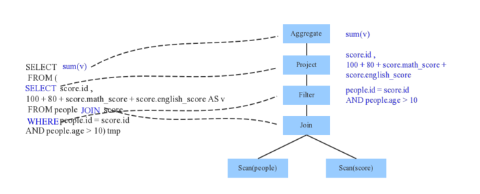
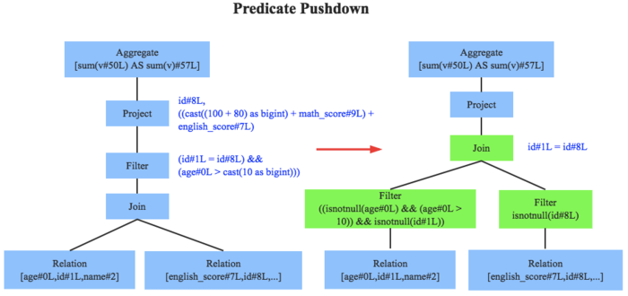
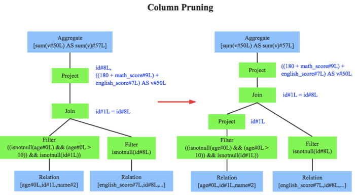
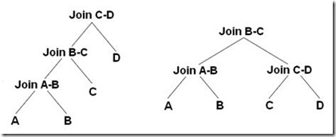

##  数据存储

-   数据存储实体
    -   *Data Source* 数据源：多源数据集成
    -   *Online Transactional Processing* 数据库
        -   关系数据库
        -   非关系数据库
    -   *Online Analysis Processing* 数据库
    -   *Data Warehouse* 数据仓库
    -   *Data Mart* 数据集市：数据仓库的数据子集、聚集数据
    -   前台数据分析工具
        -   报表工具
        -   多维分析工具
        -   数据挖掘工具

###  关系型数据库

#### 关系数据库范式

-   （关系数据库）*Normal Form* 范式：设计数据库关系模式时的规范（级别），以解决数据冗余、更新异常、插入异常、删除异常等问题
    -   *1NF*：域应为原子性的
        -   即，每列应为不可分割原子数据项，不可为集合、数组、记录等
            -   某个属性有多个值时应拆分为不同属性
    -   *2NF*：*1NF* + 非码属性必须完全依赖（候选）码
        -   即，在 *1NF* 基础上消除非码属性对主码的部分依赖
            -   若非码属性仅依赖主码部分属性，则属性、主码部分属性应抽出作为单独实体
    -   *3NF*：*2NF* + 任何非码属性不依赖其他非码属性
        -   即，在 *2NF* 基础上消除传递依赖
        -   即，关系中不应包含已在其他关系中包含的非主关键字信息
    -   *BCNF*：*3NF* + 任何码属性不依赖码属性子集
        -   修正的 *3NF*，使得数据库冗余程度更小

-   说明
    -   依赖：属性值由其他属性值决定、部分决定
        -   完全依赖：完全决定
        -   部分依赖：部分决定
        -   传递依赖：通过中间属性依赖
    -   （候选）码：若除表中除属性（组）*K* 外所有属性均完全依赖于 *K*，则称 *K* 为（候选）码
        -   表中可有多个码，实际为方便会选择其中一个作为主码
        -   包含在任何码中的属性即为码属性（主属性）
    -   关系数据库中有各种范式间递次规范
        -   实务中，数据库模式满足 *3NF*、*BCNF* 即可

> - <https://www.zhihu.com/question/24696366>

### 数据仓库

-   数据平台演进
    -   用途：经营分析 -> 数据化精细运营
    -   数据粒度：高汇总 -> 细粒度、明细
    -   时间：T+1 -> 实时
    -   结果：海量、临时需求
        -   面向最终用户、自助式产品
    -   目标
        -   实施：梳理数据来龙去脉，简化数据加工、存储、分析、建模等数据相关工作
        -   管理：管理入口，通过数据管理口径、项目、工程
        -   使用：用户可以一站式获取所需数据、数据应用能力

####  数据仓库数据模型

-   经典数据仓库模型
    -   范式模型、*ER* 实体关系模型：遵循关系数据库 *3NF* 范式、用实体管关系描述的数据模型
        -   设计思路自上而下，建模能力要求高
        -   无数据冗余、方便解耦
        -   维护成本高
        
    -   维度模型：从分析决策需求出发、围绕事实维度构建的数据模型
        -   按数据组织类型可细分
            -   星型模型：事实表为中心、维度直接关联至事实表
            -   雪花模型：星形模型基础上，维度表关联其他维度表
            -   星座模型：星形模型基础上，多张事实表共享维度表
        -   相对范式模型缩减了规范化表，降低数据模型复杂度
        
    -   *Data Vault*：围绕 *Hub* 关键核心业务实体、*Link* 关系、*Satellite* 实体属性建立的数据模型

#### 维度建模

-   概念
    -   *Fact* 事实：业务中发生的操作性、可度量事件的记录
    -   *Dimension* 维度：与事实相关联、描述环境的记录
        -   维度表需包含单一主键列用于与事实表关联
        -   维度表通常为扁平型、非规范表，包含大量低粒度、可枚举属性
    -   *Granularity* 粒度：数据层级
        -   对事实数据，除最底层事件粒度由数据源确定，上层粒度需人为划分
        -   对维度数据，内蕴层级划分
        -   低粒度数据可以 *ROLLUP* 得到高粒度数据
    -   *Index* 指标：对事实的度量

-   *Slowly Changing Dimensions* 缓慢变化维：随时间缓慢变化的维度
    -   维度属性值不变，即仅新增记录但不修改已有记录
        -   保留原始值
    -   维度属性值可修改
        -   重写，仅保留最新值
        -   增加新纪录，并区分历史、最新状态：全量快照、拉链表
        -   增加新属性用于记录（有限）历史状态

#### 数据分层

-   数据分层
    -   清晰数据结构
    -   简化复杂问题：拆解任务
    -   减少重复开发：通过通用中间层减少重复计算
    -   追踪数据血缘
    -   屏蔽数据异常、统一数据口径


-   数据分层结构
    -   *Opertional Data Store* 数据运营层、贴源层：从数据源中 *ETL*
        -   多保持数据源的数据分类方式
            -   业务数据
            -   埋点日志
            -   消息队列
        -   不会进行过多的数据清洗，方便后续数据溯源
    -   *Data Warehouse* 数据仓库层、*Common Data Model* 数据公共层：根据 *ODS* 层数据建立数据模型，具体可以细分
        -   *DW Detail* 数仓细节层：运营层、数仓层之间的隔离层
            -   进行更深入数据清洗、规范
            -   保持 *ODS* 层数据粒度
        -   *DW Middle* 数仓中间层：聚合等加工的中间结果层
            -   方便复用公共指标，减少重复加工
            -   可按需退化粒度、减少维度
        -   *DW Service* 数仓服务层、*Data Market* 数据集市：按主题汇总、分析的服务层
            -   包含数量较少、单张表内容较多宽表
            -   方便后续查询、分析、数据分发
    -   *Application Data Service* 数据应用层：为数据产品、数据分析等线上需求供数
        -   对性能要求较高
        -   更适配业务需求
    -   实务中，5 层的分类较繁琐，可以合并为为 3 层
        -   *ODS* 贴源层：*ETL* 保持数据粒度
        -   *DW* 数仓层：数据加工、建模、分区
        -   *ADS* 应用层

> - 数据仓库分层：<https://dantezhao.gitbooks.io/data-warehouse-in-action/content/di-liu-zhang-ru-he-you-ya-di-she-ji-shu-ju-fen-ceng.html>
> - 数据仓库分层：<https://zhuanlan.zhihu.com/p/439523657>
> - 数据仓库分层：<https://zhuanlan.zhihu.com/p/341591615>
> - 数据仓库分层：<https://juejin.cn/post/6969874734355841031>

#### *FS—LDM* 模型

-   *FS-LDM* 模型：*Teradata* 基于金融行业机构抽象出 10 大主题
    -   当事人：服务或感兴趣的任意对象，包括团体、个人
    -   机构：分支机构、部门、职员信息
    -   产品：提供的产品和服务，包括期限、条件等
    -   协议：因提供产品和服务而与客户建立的契约关系，如账户、借据
    -   事件：与客户间的资金、非资金活动信息
    -   财务：机构内部财务、风险管理信息
    -   地理区域：包括国家、邮编等
    -   渠道：与客户交易、接触的渠道
    -   市场营销：为保持客户留存、拓展客户使用的营销策略、计划、促销等
    -   资产：当事人持有的有形、无形资产信息

##  数据库结构

-   内部组件结构
    -   Server 层
        -   连接器：管理连接与权限校验
        -   查询缓存
        -   分析器：词法分析、语法分析
        -   优化器：生成执行计划、选择索引
        -   连接器：调用存储引擎获取查询结果
        -   其他
            -   内置函数
            -   存储过程
            -   触发器
            -   视图
    -   引擎层：磁盘读写、数据结构化存储

> - MySQL 内部组件结构：<https://juejin.cn/post/7138688524567445534>

###  *Parser*

-   *Parser* 分析器：将 SQL 语句切分为 token，根据一定语义规则解析成 *Abstract Syntax Tree*

#### 查询计划/树



-   查询计划：由一系列内部操作符组成，操作符按照一定运算关系构成查询的一个执行方案
    -   形式上：二叉树
        -   树叶是每个单表对象
        -   两个树叶的父节点是连接操作符连接后的中间结果
        -   每个结点即临时“关系”
    -   查询的基本操作：选择、投影、连接
        -   选择、投影的优化规则适用于 *select-projection-join* 操作和非 *SPY* 操作
        -   连接操作包括两表连接、多表连接

-   结点类型
    -   单表结点：从物理存储到内存解析称逻辑字段的过程
        -   考虑数据获取方式
            -   直接 IO 获取
            -   索引获取
            -   通过索引定位数据位置后再经过IO获取相应数据块
    -   两表结点：内存中元组进行连接的过程
        -   完成用户语义的局部逻辑操作，完成用户全部语义需要配合多表连接顺序的操作
        -   不同连接算法导致连接效率不同
        -   考虑两表
            -   连接方式
            -   代价
            -   连接路径
    -   多表中间结点：多个表按照“最优”顺序连接过程
        -   考虑代价最小的“执行计划”的多表连接顺序

####    *Schema Catalog*

-   元数据信息：表的模式信息
    -   表的基本定义：表名、列名、数据类型
    -   表的数据格式：json、text、parquet、压缩格式
    -   表的物理位置

##  查询优化技术

-   查询优化：求解给定查询语句的高效（查询）执行计划过程
    -   目标：在数据库查询优化引擎生成执行策略的过程中，尽量减小查询总开销
    -   执行计划：操作符按一定运算关系构成的查询（二叉）树
        -   叶子节点：单表对象
        -   双儿子非叶子节点：连接操作符连接后的中间结果
        -   单儿子非叶子节点：非连接操作符中间结果
        -   根节点：查询输出结果
    -   （狭义）数据库查询优化
        -   查询重写规则：核心是代数（逻辑）优化，即依据关系代数的等价变换做逻辑变换
            -   语法级：查询语句层、基于语法进行优化
            -   代数级：使用形式逻辑、关系代数原理进行优化
            -   语义级：根据完整性约束，对查询语句进行语义理解，推知可优化操作
        -   查询算法优化：核心是物理优化，即数据读取、表连接方式、排序等技术对查询进行优化
            -   基于经验规则：根据经验规则简化、排除查询计划（子路径）
            -   基于代价：根据代价评估模型选择代价最小查询计划（子路径）

> - 查询优化是 SQL 层面上的局部优化，区别于数据库调优的全局优化
> - <https://zhuanlan.zhihu.com/p/149090843>

### 查询重写规则

-   查询重写：查询语句的等价转换
    -   基于关系代数，关系代数的等价变换规则为查询重写提供了理论支持
    -   查询重写后，查询优化器可能生成多个连接路径，可以从候选者中择优
    -   目标
        -   将查询转换为等价、效率更高的形式
            -   低效率谓词转换为高效率谓词
            -   消除重复条件
        -   将查询重写为等价、简单、不受表顺序限制的形式，为物理查询阶段提供更多选择
    -   优化方向
        -   过程性查询转换为描述性查询：视图重写
        -   复杂查询尽可能转换为多表连接查询：嵌套子查询、外连接、嵌套连接等
        -   低效率谓词转换为高效率谓词：等价谓词重写
        -   利用（不）等式性质简化 `where`、`having`、`on` 条件

### 查询算法优化

-   查询算法优化：优化
    -   查询计划树中节点优化方向
        -   单表：数据获取方式
            -   直接 I/O
            -   索引
            -   索引定位再 I/O
        -   两表连接：连接方式
            -   Hash 连接：Hash 建表方、Hash 方式
            -   归并连接
            -   嵌套循环连接：内、外循环
        -   多半连接：连接顺序

####    *Rule-Based Optimizer*

-   *RBO*：基于规则的优化器
    -   对 *AST/LP* 进行遍历，模式匹配能够满足特定规则的结点，进行等价转换，得到等价的另一棵树
        -   剪枝：删除一些无用计算
        -   合并：合并多个计算步骤
    -   特点
        -   操作简单、能快速确定连接方式
        -   基于 *RBO* 生成的执行计划不能确保是最优的
            -   启发式规则只能排除一些明显不好的存取路径
        -   规则虽然有效，但对数据分布变化不敏感
    -   经验式、启发式的固定变换，手动设置（硬编码）在数据库中规则决定 *SQL* 执行计划

-   经典 *RBO* 规则包括
    -   *Project Pushdown* 投影下推：只读取、查询所需列，降低 I/O 负载
    -   *Predicate Pushdown* 谓词下推：下推过滤条件至查询计划早期阶段，跳过不满足条件行
        
    -   *Constant Folding* 常量累加
        
    -   *Column Pruning*列值裁剪
        
    -   *Combine Limits* Limits 合并
    -   单表自身 *Inner-Join* 降为 *Semi-Join*

####    *Cost-Base Optimizer*

-   *CBO* 基于成本的优化器：计算可行执行计划代价，选择代价最小者
    -   需评估资源消耗包括
        -   数据表统计数据
            -   *Cardinality* 基、势：结果集的行数，可代表 SQL 执行成本值
            -   唯一值数量
            -   空值数量
            -   平均、最大长度
        -   SQL 执行路径 I/O
        -   网络资源
        -   CPU 使用情况
    -   执行信息获取方式取决于不同平台、数据库
        -   执行 SQL 前抽样分析数据
        -   每次执行 SQL 都会记录统计信息
    -   *CBO* 本身需要耗费一定资源，需要平衡 *CBO* 和查询计划优化程度
        -   数据表的数据统计资源耗费
        -   优化查询计划即时资源耗费，如果组合情况比较多则花费判断时间较多

### 查询代价估计模型

$$\begin{align*}
cost &= cost_{IO}+ cost_{CPU} \\
    &= P * t_{CPUPerPage} + W * T
\end{align*}$$

> - $P$：计划访问的页数
> - $t_{CPUPerPage}$：读取页的时间花费
> - $T$：访问的元组数（应包括索引），反映因页上解析元组结构的 CPU 消耗
> - $W$：*Selectivity* 选择率、权重因子，表明 IO、CPU 的相关性

-   *Selectivity* 选择率：施加指定谓语条件后，返回结果集的记录数占未施加任何谓语条件的原始结果集记录数的比率
    -   其精确程度直接影响最优计划的选择
    -   估计方法
        -   *Non-Parametric Method*：非参方法，使用 *ad-hoc* 数据结构、直方图维护属性值分布
        -   *Parametric Method*：参数方法，使用预先估计的分布函数逼近真实分布
        -   *Curve Fitting*：曲线拟合法，使用多项式函数、最小标准差逼近属性值分布
        -   *Sampling*：抽样法，从数据库中抽取部分元组，针对样本进行查询，收集统计数据
            -   需要足够多样本被测试才能达到足够精度
        -   综合法

### 广义查询优化技术

-   广义数据库查询优化还包括
    -   查询重用：尽可能利用先前执行的结果，以节约全过程时间、减少资源消耗
        -   查询结果的重用：分配缓冲块存放 SQL 语句、最后结果集
        -   查询计划的重用：缓存查询语句执行计划、相应语法树结构
        -   优势：节约 CPU、IO 消耗
        -   弊端
            -   结果集很大会消耗放大内存资源
            -   同样 SQL 不同用户获取的结果集可能不完全相同
    -   并行（数据库系统）查询优化：除考虑查询策略执行代价外，需考虑查询工作并行化
        -   查询能否并行取决于
            -   系统中可用资源
            -   CPU 数目
            -   运算中特定代数运算符
        -   查询并行可以分为
            -   操作内并行：将同一操作如单表扫描、两表连接、排序操作等分解为多个独立子操作
            -   操作间并行：一条SQL查询语句分解为多个子操作
    -   分布式（数据库系统）查询优化重点：查询策略优化 + 局部处理优化
        -   查询策略优化：主要是数据传输策略优化
            -   主要考虑因素：数据的通信开销
            -   主要目标：以减少传输次数、数据量
        -   局部处理优化：传统单结点数据库的查询优化技术
        -   代价估计模型：总代价 = I/O 代价 + CPU 代价 + 通信代价

##  单表扫描算法

##  两表连接算法

### *Nested Loop Join*

-   嵌套循环连接：扫描外表，读取记录根据 `join` 字段上的索引去内表中查询
    -   适合场景
        -   外表记录较少（`<1w`）
        -   内表已经创建索引、性能较好
        -   `inner`、`left outer`、`left semi`、`left antisemi join`
    -   嵌套循环连接算法：搜索时扫描整个表、索引
        -   外部循环逐行消耗外部输入表，当其数据量很大时可以并行扫描内表
        -   内表被外表驱动：内部循环为每个外部行执行，在内表中搜索匹配行
        ```c
        for each row R1 in the outer table:
            for each row R2 in the inner table:
                if R1 join with R2:
                    return (R1, R2)
        ```
    -   基于块嵌套循环连接算法：每次 IO 申请以“块”为单位尽量读入多个页面，改进获取元组的方式
        -   内存循环最后一个块使用后作为下次循环循环使用的第一个块可以节省一次 IO
        ```c
        for each chunk c1 of t1
            if c1 not in memory:
                read chunk c1 to memory
            for each row r1 in chunk c1:
                for each chunk c2 of t2:
                    if c2 not in memory:
                        read chunk c2 into memory
                    for each row r2 in c2:
                        if r1 join with r2:
                            return(R1, R2)
        ```
    -   索引嵌套循环连接算法：在内表中搜索时使用索引，可以加快连接速度
        -   为查询临时生成临时索引（作为查询计划的一部分），查询完成后立刻将索引破坏

### *(Sort)Merge Join*

-   排序归并连接：将两表按关联字段排序后连接
    -   适合场景
        -   连接字段已经排序，如 B+ 树索引
        -   `inner`、`left outer`、`left semi`、`left anti semi`、`right outer`、`right semi`、`right anti semi`、`union`
        -   等值、非等值连接，如 `!=`、`<>`
    -   算法
        -   对两表按关联字段进行排序（升序为例）
        -   从每个表分别迭代取记录开始匹配
        -   若符合关联条件，放入结果集
        -   否则，丢弃关联字段较小记录，取对应表中下条记录继续匹配，直到整个循环结束

```c
while c1.not_empty() and c2.not_empty():
    if r1 join with r2:
        add (r1, r2) to result
    else:
        skip smaller (r1, r2)
return result
```

### *Hash Join*

-   哈希连接：对两表关联字段进行哈希，按哈希值连接
    -   特点
        -   哈希连接 CPU、内存耗费巨大，还会造成大量异步 I/O
        -   内存小、数据偏斜严重时，散列冲突会比较严重，影响算法效率
    -   适合场景
        -   两表数据量相差非常大
        -   CPU、内存资源充足
        -   等值、不等值连接
-   （内存）哈希连接流程
    -   建表阶段：使用左表记录中关联字段构造哈希表
        -   哈希表需要频繁访问，最好能全部加载在内存中，因此尽量选择小表建表
    -   探测阶段：在已建立哈希表的桶（链）中匹配右表中记录


####    *Grace Hash Join*

-   *GHJ* 磁盘分块哈希连接流程
    -   将两表按照相同hash函数分配至不同分片中
        -   在磁盘上为各分片、表建立相应文件
        -   对表输入计算哈希值，根据哈希值写入分片、表对应文件
    -   再对不同分片进行普通（内存）哈希连接
        -   若分片依然不能全部加载至内存，可以继续使用 *GHJ*
    -   改进效率要点
        -   建表分片过程中，尽量多把完整分片保留在内存中
        -   探测表分片时，对应分片可以直接进行探测操作

```cpp
grace_hash_join(t1, t2):
    // Grace Hash Join实现
    // 输入：待join表t1、t2
    for row in t1:
        hash_val = hash_func(row)
        N = hash_val % PART_COUNT
        write row to file t1_N

    for row in t2:
        hash_val = hash_func(row)
        N = hash_val % PART_COUNT
        write row to file t2_N

    for i in range(0, PART_COUNT):
        join(t1_i, t2_i)
```

-   分片数量 `PART_COUNT` 决定磁盘 I/O 效率
    -   分片数量过小：无法起到分治效果，分片仍然需要进行嵌套 *GHJ*，降低效率
    -   分片数量过大：磁盘是块设备，每次刷盘刷一定数量块才高效，频繁刷盘不经济
    -   即分片数量在保证刷盘经济的情况下，越大越好，这需要优化器根据表统计信息确定
-   特点
    -   有磁盘 I/O 代价，会降低效率，尽量避免使用
    -   适合参与连接表非常大，无法同时载入内存中

### 分布式连接算法

-   *Shuffle Hash Join*：按照连接键分区，各结点独立、并行哈希连接
    -   类似分布式 *GHJ*，不同块位于不同结点
    -   *Shuffle* 阶段：表按连接键分区，相同连接键记录重分布到同一结点
    -   哈希连接阶段：各结点使用本地数据独立并行哈希连接
    

-   *Broadcast Hash Join*：将小表广播分发到大表所在的结点上，各节点独立、并行哈希连接
    -   适合小表很小，可以直接广播的场合
    -   广播阶段：
    -   哈希连接阶段：
    

-   *Sort Merge Join*：按照连接键分区，各节点独立、并行 *SMJ*
    -   *Shuffle* 阶段：表按连接键分区，相同连接键记录重分布到同一结点
    -   排序节点：各结点并行对本地数据排序
        -   Spark 当前使用 *Sort-Based Shuffle*，Shuffle 后各分区数据已经排序完毕，无需再次排序
    -   归并阶段：各节点对排序好表数据执行连接操作
    

##  多表连接算法

-   多表连接算法：评估各连接方式资源消耗，找到最优连接顺序（执行路径）
    -   表连接顺序对于查询结果没有影响，但是对资源消耗、性能影响巨大
    -   连接排列随连接表数目阶乘增加，不可能穷举分析，常使用启发式算法搜索
        -   无限制情况下不少于 $\frac {C(n-1,2(n-1))} {n}$，即 $n-1$ 节点不同二叉树数量（未考虑多表连接键相同）

### *Dynamic Programming*

-   动态规划算法：依次求解各数量表最优连接顺序，直到求出最终结果
    -   构造第一层关系：每个关系的最优路径就是关系的最优单表扫描方式
    -   迭代依次构造之后 $k=2,\cdots$ 层关系连接最优
        -   *Left-Deep* 左深连接树方式：将第 $k-1$ 层每个关系同第 $1$ 层关系连接
        -   *Bushy* 紧密树连接方式：将第 $m=k/2,m>2$ 层每个关系同第 $k-m$ 层关系连接
    -   说明
        -   并未穷举分析所有可能连接顺序，需对连接顺序加以限制才可正常构造动态规划表
            -   上述左深树、紧密树即为限制连接方式
            -   否则，每层需需遍历下层一半分支
        -   *System R* 算法：在动态规划算法上，保留子树查询最优、次优查询计划用于上层查询计划生成



### *Greedy Algorithm*

-   贪心算法：认为每次连接表的连接方式都是最优的，即从未连接表中选择使得下次连接代价最小者
    -   贪心连接规则
        -   常量表最前，其他表按可访问元组数量升序排序
        -   每次连接主要求解待连接表单表扫描的代价
    -   求解结束后，局部最优查询计划即为左深树

##  数据库表设计

### 拉链表

|biz_id     |field1     |t_start        |t_end          |
|-----|-----|-----|-----|
|1          |A1         |2022-06-01     |2023-05-01     |
|2          |B          |2022-05-02     |9999-12-31     |
|1          |A2         |2022-05-02     |9999-12-31     |

-   拉链表：通过维护数据生效时间、失效时间保存数据历史状态、最新状态的表设计
    -   核心字段
        -   生效时间 `t_start`：数据有效期开始时间点
        -   失效时间 `t_end`：数据有效期结束时间点，常有以下设计
            -   `9999-12-31`：当前生效数据
            -   其他取值：数据失效时将 `9999-12-31` 更新为失效时点值，即失效时间比在当前时点前
        -   通过筛选生效时间、失效时间即可确认任意时间数据快照
    -   拉链表数据确认数据更新逻辑
        -   业务系统维护数据记录更新情况（如更新时间戳），拉链表据此新增记录、设置失效时间
        -   拉链表自行比较自身、业务系统数据是否有更新，维护效率依赖于表字段数量，实务中
            -   仅比较部分重要字段
            -   分重要字段设置多张拉链表
    -   说明
        -   拉链表常用于备份、记录缓慢变化维
            -   作为业务系统表的在数仓的快照备份
        -   拉链表仅能达到失效时间粒度的历史状态保存，无法回溯更低粒度历史状态
        -   拉链表随时间同样性能下降，可
            -   在生效时间、失效时间上设置索引
            -   建立两张拉链表分别存储所有记录、最新变化记录

> - 拉链表：<https://dantezhao.gitbooks.io/data-warehouse-in-action/content/di-si-zhang-la-lian-biao.html>

