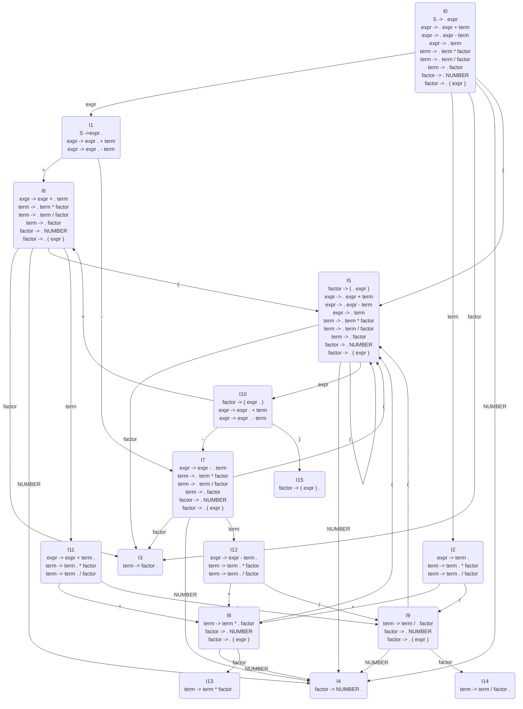
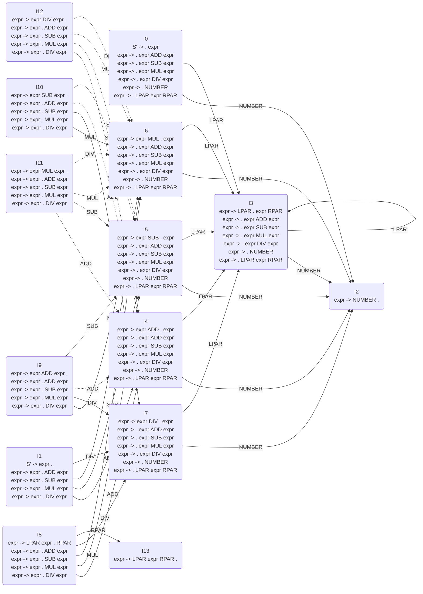

##  语言、语法

-   *Formal Language* 形式语言：字母表 $\Omega$ 上某些有限长字符串的集合
    -   *Formal Grammer* 形式语法：描述形式语言根据 *Syntax* 构造合法字符串的方式
    -   说明
        -   形式语言只关注语言的语法，忽略语言的语义
        -   语言是字母表能构成的所有串的集合的一个子集

> - *Grammer*、*Syntax* 区别：<https://www.zhihu.com/question/31370551>
> - *Formal Language*：<https://en.wikipedia.org/wiki/Formal_language>
> - *Formal Grammer*：<https://en.wikipedia.org/wiki/Formal_language>

| *Chomsky* 层级 | 文法       | 语言                         | 极小识别器                 | 产生式               |
|----------------|------------|------------------------------|----------------------------|----------------------|
| 0 型           | 无限制     | *Recursively Enumerable*     | *Turing Machine*           | 左侧包含非终结符     |
| 1 型           | 上下文相关 | *Context-Sensitive*          | *Linear Bounded Automaton* | `aBc -> aCc`         |
| 2 型           | 上下文无关 | *Context-Free*               | *Pushdown Automaton*       | `A -> aBc`           |
|                | `LR(K)`    | *Deterministic Context-Free* | *Deterministic PDA*        | 前看 `K` 后无歧义    |
| 3 型           |            | *Regular*                    | *Finite-state Machine*     | `A -> aB`、`A -> Ba` |

-   正规语言、正则语言
    -   正则语言的形式化定义
        -   空集合 $\emptyset$ 是正则语言
        -   只包含空串的语言 $\{ \epsilon \}$ 是正则语言
        -   $\forall a \in \Omega, \{a\}$ 是正则语言
        -   若 $A, B$ 是正则语言，则 $A \cdot B$、$A \cup B$、$A^{\*}$ 都是正则语言
    -   说明
        -   正则语言对 $\cdot$ 连接、$\cup$ 并、$\*$ *Kleene* 星封闭
        -   可用 *FSA* 识别的语言就是正则语言

> - “上下文无关文法”理解：<https://www.zhihu.com/question/21833944>
> - 正则语言：<https://www.lumin.tech/articles/regular-language/>
> - 形式语言：<https://zh.wikipedia.org/zh-hans/%E5%BD%A2%E5%BC%8F%E8%AF%AD%E8%A8%80>

##  自动机

> - 计算机：<https://www.nosuchfield.com/2017/01/05/Computation-of-computers/>

### 有限自动机

-   *Finite State Machine/Automaton* （有限）（状态）自动机：表示有限个状态以及在状态间转移、动作的数学模型
    -   概念
        -   状态：存储过去信息，反映系统开始到现在时刻的输入变化
        -   条件、输入、事件：*FSA* 的外部输入
        -   动作：自动机的行为，满足条件后触发
            -   转移动作：状态变更，用须满足的转移发生条件描述
            -   进入动作
            -   退出动作

-   *Deterministic FSA*：对每个状态、每个输入 **有且仅有** 一个转移的 *FSM*
    -   无冲突即状态、输入给定时，转移是确定的
    -   同时，还要求无遗漏，即每个状态对每个可能输入都需有动作
        -   无动作可认为转移到自身
    -   说明
        -   *DFSA* 常被用于软、硬件实现词法分析、模式匹配之类问题

-   *Non-Deterministic FSA*：对每个状态、输入有多个转移的 *FSM*
    -   在形式理论中，*DFSA*、*NFSA* 等价，即对给定 *NFSA* 可构造等价的 *DFSA*
        -   将 *DFSA* 中转移的多个结果状态集集合视为新状态
        -   考察状态集合，按原状态机动作确定的状态集转移、转移结果
        -   重复直到所有状态集合处理完毕
    -   另，*NFSA* 可认为是存在 **自由转移** 的 *DFSA*
        -   将上述状态集集合拆分为单个状态元素，则其中状态元素之间即可视为无代价自由转移
            -   注意：状态集合中拆分出现状态元素、状态机中单独状态不再为相同状态
    -   *NFSA* 可推广位概率自动机，为每个状态指派概率

> - *Finite State Machine*：<https://en.wikipedia.org/wiki/Finite-state_machine>
> - 有限自动机：<https://www.nosuchfield.com/2017/01/05/Finite-automaton/>
> - *NDFA to DFA Conversion*：<https://www.tutorialspoint.com/automata_theory/ndfa_to_dfa_conversion.htm>
> - *NDFA* 转换为 *DFA*：<https://zhuanlan.zhihu.com/p/31158595>

-   *PushDown Automaton* 下推自动机：自带栈的有限状态机

### *LR(0)*

> - *First* 和 *Follow*：<https://www.cnblogs.com/yuanting0505/p/3761411.html>
> - *LALR Parsing*：<https://web.stanford.edu/class/archive/cs/cs143/cs143.1128/handouts/140%20LALR%20Parsing.pdf>
> - *CS143.1128 Handouts*：<https://web.stanford.edu/class/archive/cs/cs143/cs143.1128/handouts/>
> - *LR(0)、SLR(1)、LR(1)、LALR(1)*：<https://blog.csdn.net/weixin_42815609/article/details/107631357>

### 示例

### LALR 示例

| State | NUMBER | ADD | SUB | MUL | DIV | LPAR | RPAR | $  |
|-------|--------|-----|-----|-----|-----|------|------|----|
| I0    | I2     |     |     |     |     | I3   |      |    |
| I1    |        | I4  | I5  | I6  | I7  |      |      |    |
| I2    |        | R5  | R5  | R5  | R5  |      | R5   | R5 |
| I3    | I2     |     |     |     |     | I3   |      |    |
| I4    | I2     |     |     |     |     | I3   |      |    |
| I5    | I2     |     |     |     |     | I3   |      |    |
| I6    | I2     |     |     |     |     | I3   |      |    |
| I7    | I2     |     |     |     |     | I3   |      |    |
| I8    |        | I4  | I5  | I6  | I7  |      | I13  |    |
| I9    |        | R1  | R1  | I6  | I7  |      | R1   | R1 |
| I10   |        | R2  | R2  | I6  | I7  |      | R2   | R2 |
| I11   |        | R3  | R3  | R3  | R3  |      | R3   | R3 |
| I12   |        | R4  | R4  | R4  | R4  |      | R4   | R4 |
| I13   |        | R6  | R6  | R6  | R6  |      | R6   | R6 |

