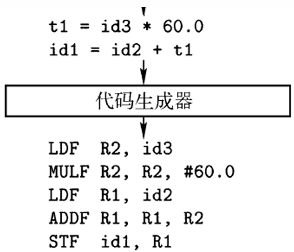

##  语言、语法（文法）

-   *Formal Grammer* 形式文法：描述形式语言根据 *Syntax* 构造合法字符串的方式
    -   *Formal Language* 形式语言：字母表 $\Sigma$ 上某些有限长字符串的集合
        -   形式语言只关注语言的语法，忽略语言的语义
        -   语言是字母表能构成的所有串的集合的一个子集
    -   文法结构
        -   终结符：组成串基本符号，即词法单元名称
        -   非终结符：表示串集合的语法变量
            -   在程序设计语言中即某个程序结构，如语句
        -   开始符号：指定非终结符
            -   对应串集合即为文法语言
        -   产生式：描述将终结符和非终结符组成串的方法
            -   形式：`左部 -> 右部`、`头 -> 体`

> - 下述使用小写字母表示终结符、大写字母表示非终结符、`S` 表示开始符号、希腊字母表示符号串
> - *Grammer*、*Syntax* 区别：<https://www.zhihu.com/question/31370551>
> - *Formal Language*：<https://en.wikipedia.org/wiki/Formal_language>
> - *Formal Grammer*：<https://en.wikipedia.org/wiki/Formal_language>
> - 形式语言：<https://zh.wikipedia.org/zh-hans/%E5%BD%A2%E5%BC%8F%E8%AF%AD%E8%A8%80>

| *Chomsky* 层级 | 文法       | 语言                         | 极小识别器                 | 产生式               |
|----------------|------------|------------------------------|----------------------------|----------------------|
| 0 型           | 无限制     | *Recursively Enumerable*     | *Turing Machine*           | 左侧包含非终结符     |
| 1 型           | 上下文相关 | *Context-Sensitive*          | *Linear Bounded Automaton* | `aBc -> aCc`         |
| 2 型           | 上下文无关 | *Context-Free*               | *Pushdown Automaton*       | `A -> aBc`           |
|                | `LR(K)`    | *Deterministic Context-Free* | *Deterministic PDA*        | 前看 `K` 后无歧义    |
| 3 型           | 正规文法   | *Regular*                    | *Finite-state Machine*     | `A -> aB`、`A -> Ba` |

-   上下文说明
    -   上下文相关文法：产生式应用需考虑上下文
        -   文法包含左边不只有 **单个** 非终结符（包含其他符号）的产生式
            -   文法定义中产生式需考虑非终结符前后串（即上下文），满足条件才可应用推导
    -   上下文无关文法：产生式应用无需考虑上下文
        -   文法中所有产生式的左边只有 **单个** 非终结符（没有其他符号）
            -   文法定义中产生式可直接应用推导，无需考虑非终结符前后串（即上下文）
    -   正规文法：左线性或右线性文法
        -   文法中每个产生式形式都为右线性或左线性
            -   右线性：`A -> aB`、`A -> a`
            -   左线性：`A -> Ba`、`A -> a`

> - “上下文无关文法”理解：<https://www.zhihu.com/question/21833944>
> - 计算机：<https://www.nosuchfield.com/2017/01/05/Computation-of-computers/>
> - 图灵机与计算问题：<https://www.nosuchfield.com/images/20170109/turing.pdf>

### *BNF*

```c
<symbol> ::= __expression__
```

-   *Backus-Naur Form* 巴科斯范式：用于描述形式文法（产生式）的（元）标记
    -   *BNF* 描述如何组合不同符号产生符合语法的序列
        -   `<symbol>`：非终结符
        -   `::=`：左侧符号可以被右侧表达式替代
        -   `__expression__`：一个或多个（`|` 分隔）由终结符或非终结符构成的序列
    -   常见的 *BNF* 表示中
        -   终结符一般以 `<>` 括起
        -   非终结符（字面值）以 `""` 括起
    -   *Extended BNF* 扩展的 *BNF*：在 *BNF* 基础上增加 `*`、`+` 算符
        -   `*` 不多于1实例：`r?` 等价于 $\epsilon|r$
        -   `+` 非零实例：`r+` 等价于 `rr*`

> - *Buakus-Naur Form*：<https://en.wikipedia.org/wiki/Backus%E2%80%93Naur_form>

### 文法推导


-   推导 $\Rightarrow$：将待处理串中某个非终结符替换为该非终结符某个产生式的体
    $$\begin{align*}
    A & \rightarrow \gamma \\
    B & \rightarrow \alpha A \beta \\
    B & \Rightarrow \alpha \gamma \beta
    \end{align*}$$
    -   最左、最右推导：每次推导中，应用产生式的非终结符左侧、右侧仅含终结符
    -   文法、句子、语言
        -   句型：从开始符号出发，不断推导即可得文法不同句型
        -   句子：不包含非终结符的句型
        -   语言：句子的集合
    -   语法分析树：推导的图形表示形式
        -   根节点：开始符号
            -   语法分析树可对应多个推导序列，但对应唯一最左、最右推导（即先左、先右的深度优先遍历唯一）
        -   叶子节点：非终结符、终结符或 $\epsilon$
            -   （推导完成或未完成的语法分析树中）叶子节点序列即为一个句型
        -   内部节点：非终结符符
            -   表示某个产生式的一次应用

### 程序设计语言

-   程序设计语言
    -   静态、动态语言
        -   静态：支持编译器静态决定
        -   动态：只允许程序运行时决定
    -   作用域：程序文本的区域，`x` 作用域指在该文本范围内对 `x` 使用均指向该声明
        -   静态作用域：静态阅读程序可确定
        -   动态作用域：运行时确定
    -   环境与状态
        -   环境：名称到存储位置的映射
        -   状态：存储位置到值的映射
-   程序语言单词符号
    -   基本字、关键字：`begin`、`end`、`if`、`while`
    -   标识符、名称：变量名、过程名
    -   常量、常数
    -   运算符：`+`、`-`、`*`、`/`、`<`、`>`
    -   界符：`,`、`;`、`()`

#### 编译

-   *Compiler* 编译器：读入源语言程序、输出目标语言程序（通常可执行）
    -   编译器结构
        -   *Analysis* 分析、*Front End* 前端：机器（架构）无关
            -   将源程序分解为组成要素、语法结构
            -   根据语法结构创建源程序中间表示
            -   收集源程序相关信息，存放至符号表
        -   *Synthesis* 综合、*Back End* 后端：机器（架构）相关
            -   根据中间表示、符号表构造目标程序
    -   编译器提升点
        -   多态、动态绑定、模板等程序语言设计要求
        -   降低执行开销
        -   针对硬件优化

> - *Interpreter* 解释器：根据输入直接执行源语言程序中的指定操作，不生成目标程序
> - 编译原理：<https://cs.nju.edu.cn/changxu/2_compiler/slides/Chapter_1.pdf>

####    编译流程


-   *Lexical Analysis*、*Scanning* 词法分析、扫描：读入源程序字符流，输出有意义的 *Lexeme*
    
    -   词法分析过程相对简单，可通过有穷自动机高效实现
    -   *Token* 词法单元：包括 *Token Name*、*Attribute Value* 两部分
        -   *Token Name* 词法单元名称：词法单元种类，供语法分析器确定序列结构
        -   *Attribute Value* 属性值（链接）：指向相应符号表条目，供语义分析、代码生成步骤使用
    -   *Pattern* 模式：描述词法单元的对应词素可能具有的形式
        -   可用正则表达式描述模式
    -   *Lexeme* 词素：源程序语言中的字符序列，即词法单元实例
        -   与某个词法单元模式匹配
        -   同一模式匹配的不同词素通过属性值区分
-   *Syntax Analysis*、*Parsing* 语法分析、解析：根据词素中符号名称创建 *Syntax Tree* 语法树
    
    -   检查词法单元序列是否合法，报告错误信息、生成语法树
        -   语法树：表示词素流的语法结构
    -   自顶向下语法分析器
        -   从左至右、逐个扫描词法单元
        -   从语法树根部开始构造
        -   通常处理 *LL* 文法
    -   自底向上语法分析器
        -   从左至右、逐个扫描词法单元
        -   从语法树叶子开始构造
        -   通常处理 *LR* 文法
-   *Semantic Analysis* 语义分析：根据语法树、符号表信息，检查源程序是否满足语义约束，收集类型信息
    
    -   收集类型信息：用于代码生成、类型检查、类型转换
-   中间代码生成：根据语义分析输出，生成类机器语言中间表示，常为 *Three-Address Code* 三地址代码
    
    -   三地址代码：最多包含三个运算分量，容易转换为机器语言指令
-   中间代码优化：分析、改进中间代码质量
    
-   代码生成：将中间表示映射到目标语言
    
    -   寄存器选择
    -   指令选择

##  正规文法、自动机

### 正规文法

-   正规语言、正则语言：可用正规式、自动机描述（识别）的语言（词串集合，即正规集）
    -   正则语言的形式化定义（此外都不是正则语言）
        -   空集合 $\emptyset$ 是正则语言
        -   只包含空串的语言 $\{ \epsilon \}$ 是正则语言
        -   $\forall a \in \Sigma, \{a\}$ 是正则语言
        -   若 $A, B$ 是正则语言，则 $A \cdot B$、$A \bigcup B$、$A^{*}$ 都是正则语言（即对运算封闭）
            -   $A \cdot B$ 连接：语言 $A, B$ 集合元素作笛卡尔积拼接
            -   $A \bigcup B$ 并：语言 $A, B$ 求并
            -   $A{*}$ *Kleene* 星：语言 $A$ 中元素重复任意多次

| 正规式文法          | 正规式              |
|---------------------|---------------------|
| `A -> xB`、`B -> y` | `A -> xy`           |
| `A -> xA`、`A -> y` | `A -> x*y`          |
| `A -> x`、`A -> y`  | $A \rightarrow x|y$ |

-   正规式、正则式：借助如下 *Kleene* 闭包、连接、或运算，对正规文法的更紧凑表示
    -   正则式算符
        -   `*` 闭包：任意有限次自重复连接
        -   `.` 连接：可省略，满足结合律，$\epsilon$ 是连接恒等元
        -   `|` 或（选择）：满足交换律、结合律、分配律
        -   说明
            -   `(`、`)` 规定优先级
            -   优先级顺序同上序
            -   上述运算均为左结合（对应左线性正规文法）
    -   正规文法与正规式之间可以等价转换
        -   $r = 0(0|1)*$ 即等价于
            $$\begin{align*}
            S & \rightarrow 0A \\
            A & \rightarrow 0A \\
            A & \rightarrow 1A \\
            A & \rightarrow \epsilon
            \end{align*}$$
    -   正规集：可用正规式 `r`（正轨文法）产生（表示）的（词串）集合 `L(r)`
        -   若两个正规式 $r_1$、$r_2$ 表示的正规集相同，则称两个正规式等价
    -   一般意义上 *正则表达式* 增加以下扩展算符，表达式更简洁，表达能力不变
        -   `+` 非零实例：`r+` 等价于 `rr*`
        -   `?` 不多于1实例：`r?` 等价于 $\epsilon|r$
        -   `[]` 字符选择：`[abcd]` 等价于 `a|b|c|d`
        -   `-` 范围：`[a-d]` 等价于 `a|b|c|d`

> - 结合性：相同优先级的算符在表达式中组合顺序，大部分算符左结合，即从左至右先出现算法先应用，少部分赋值、指数算符右结合
> - 正则语言：<https://zh.wikipedia.org/wiki/%E6%AD%A3%E5%88%99%E8%AF%AD%E8%A8%80>
> - 正则语言：<https://www.lumin.tech/articles/regular-language/>
> - 词法分析、正规式、正规文法：<https://blog.csdn.net/star_of_science/article/details/106793275>
> - 词法分析：<https://cs.nju.edu.cn/changxu/2_compiler/slides/Chapter_3.pdf>

### 有限自动机

-   *Finite State Machine/Automaton* （有限）（状态）自动机：表示有限个状态以及在状态间转移、动作的数学模型
    -   *FA* 可以用五元组 $M = (K, \Sigma, f, S, Z)$ 定义
        -   状态、有穷状态集 $K$：存储过去信息，反映系统开始到现在时刻的输入变化
            -   初态 $S$：对应进入动作
            -   终态集 $Z$：对应退出动作
        -   条件、输入、事件、有穷字母表 $\Sigma$：*FSA* 的外部输入
        -   动作、转换函数 $f$：自动机的行为，用转移发生条件描述
-   *Deterministic FA/FSM*：对每个状态、每个输入 **有且仅有** 一个转移的 *FSM*
    -   具有无冲突、无遗漏性质的 *FSM* 即为 *DFA/DFSM*
        -   无冲突：状态、输入给定时，转移是确定的，即对一个状态对一个输入只有一个转移规则
            -   即，无 $\epsilon$ 转移
        -   无遗漏：每个状态对每个可能输入都需有转移规则
            -   此约束较为严苛，一般只要求 *DFA* 完成工作所需规则即可
    -   即对 *DFA*
        -   初态 $S$ 唯一
        -   转移函数 $f$ 输出为状态集 $K$ 中元素
-   *Non-Deterministic FA/FSM*：存在状态、输入有多个转移的 *FSM*
    
    -   *NFA* 即为不满足无冲突、无遗漏性质的 *DFA*
        -   初态 $S$ 不唯一
        -   转移函数 $f$ 输出为状态集 $K$ 子集
    -   在形式理论中，*DFA*、*NFA* 等价，即对给定 *NFA* 可构造等价的 *DFA*
        -   将 *NFA* 中 $\epsilon$ 转移的多个结果状态集集合视为新状态，按原 *NFA* 动作确定的状态集转移、转移结果构建 *DFA*
            -   *NFA* 对应的 *DFA* 不唯一，但最小化 *DFA* 唯一
        -   *NFA* 可认为是存在 **自由转移** 的 *DFA*：将 *DFA* 状态集集合拆分为单个状态元素，则其中状态元素之间即可视为无代价自由转移
            -   注意：此时状态集合中拆分出现的状态元素、与状态机中原单元素状态不为相同状态
            -   也因此，*NFA* 可推广为概率自动机，为每个状态指派概率
    

> - 有限自动机：<https://www.nosuchfield.com/2017/01/05/Finite-automaton/>
> - 词法分析、正规式、正规文法：<https://blog.csdn.net/star_of_science/article/details/106793275>
> - *Finite State Machine*：<https://en.wikipedia.org/wiki/Finite-state_machine>

###    *NFA* 转换 *DFA*

```python
DS = deque([e_closure(s_0), ])
T = {}
while DS:
    dc = DS.popleft()
    dca = e_cloure(move(dc, a))
    T[dc, a] = dca
    if dca not in T:
        DS.append(dca)
```

-   子集法 *NFA* 转换、*NFA* 确定化
    -   闭包 $\epsilon-closure$：$\epsilon$ 转换（无代价转换）的状态集合
        -   $\epsilon-cloure(s)$：从状态 `s` 出发，只通过 $\epsilon$ 转换（无代价转换）到达的状态集合
        -   $\epsilon-cloure(D) = \bigcup_{s \in D} \epsilon-closure(s)$：状态集 $D$ 闭包
        -   $move(D, a)$：从状态集 $D$ 中任意状态 $s$ 出发，通过 $a$ 转换达到的状态集合
    -   确定化步骤
        -   将初态闭包 $\epsilon-closure(s_0)$ 加入待处理列表 `DS`
            -   多初态可考虑增加可无代价转换至原初态的新初态 $s_0$
        -   依次考虑 `DS` 中每个闭包集 `DC`
            -    对每个输入 $a$，计算 $DC_a = \epsilon-cloure(move(DC, a))$，记录状态转换 $T[DC, a] = DC_a$
            -    若 $DC_a$ 未处理过，加入待处理列表 `DS`
            -   重复直至所有 `DS` 处理完毕
        -   状态转换表 $T$ 确定化 *DFA*
-   最小化 *DFA*：不含无关状态、等价状态的 *DFA*
    -   多余状态：死状态（从初态不可达）、多余状态（不可到达终态）
    -   等价状态：不可区分状态，即满足以下条件
        -   兼容性、一致性：同是终态或非终态
        -   传播性、蔓延性：在相同条件下转换达到的状态相等价
    -   最小化步骤
        -   划分终态、非终态两组 $S_0, S_1$
        -   检查组 $S_i$ 中各状态对各输入 $a_j$ 转换后状态 $move(S_i, a_j)$
            -   若将转换后状态集 $move_(S_i, a_j)$ 不为任意已有组子集，则转换后状态所属组划分
        -   重复，直至状态组划分不变，此时各组内状态不可区分

> - *NFA* 到 *DFA* 的转换：<https://www.cnblogs.com/wkfvawl/p/13040653.html>
> - *NDFA* 转换为 *DFA*：<https://zhuanlan.zhihu.com/p/31158595>
> - *NDFA to DFA Conversion*：<https://www.tutorialspoint.com/automata_theory/ndfa_to_dfa_conversion.htm>
> - *DFA* 最小化算法：<https://www.cnblogs.com/winlere/p/16115073.html>

### *FA* 与正规式


-   正规文法、正规式、有限自动机三者等价
    -   *FA* 常被用于实现词法分析、模式匹配

### *FA* 与正规文法


-   正规文法转换为 *FA* 规则
    -   左线性正规文法转换规则
        -   增加初态节点，开始符号节点作为终态节点
        -   $A \rightarrow a$：引初态到 $A$ 的边，标记为 $a$
        -   $A \rightarrow Ba$：引 $B$ 到 $A$ 的边，标记为 $a$
    -   右线性正规文法转换规则
        -   增加终态节点，开始符号节点作为初态节点
        -   $A \rightarrow a$：引 $A$ 到终态的边，标记为 $a$
        -   $A \rightarrow aB$：引 $A$ 到 $B$ 的边，标记为 $a$

##  上下文无关文法、下推自动机

-   *Context-Free Grammer* 上下文无关文法：文法中非终结符总可以被产生式体替换，而无需考虑上下文
    -   上下文无关文法可以描述程序设计语言大部分语法，部分规范需要使用语法分析器检查
        -   如：*标识符先声明后使用* 无法使用 *CFG* 文法描述

> - 语法分析：<https://cs.nju.edu.cn/changxu/2_compiler/slides/Chapter_4.pdf>

### 文法设计

-   *Ambiguity* 二义性：若文法可以某个句子生成多棵语法分析树，则文法是二义的
    -   程序设计语言通常是无二义的，但有些二义性可以方便文法或语法分析器设计
        -   二义性可通过设置算符（产生式）的优先级、结合性以规避冲突，即引入文法外规则对文法分析表中冲突项进行指定
        -   否则，需要文法将引入过多非终结符、形如 `expr -> factor` 的产生式
    -   文法二义性消除无规律可循
-   *Left Recursive* 左递归：若文法存在推导后推导式形如 `A -> Aa`，则文法是左递归的
    -   单步左递归（生成式本身左递归）消除：`A -> Aa | b` 转换为 `A -> bB`、$B \rightarrow aB | \epsilon$
    -   通用多步左递归消除
        -   依次考虑非终结符 $A$，推导替换其产生式中最左非终结符
        -   应用单步左递归消除方法消除其中立即左递归
    -   说明
        -   多步左递归消除后文法难以找到和原文法之间的对应关系，难以进行语义处理
-   左公因子：两个产生式有相同前缀时，无下个输入符号信息时无法确定应应用的产生式（即 *移入-规约* 冲突）
    -   提公因子文法变换
        -   对每个非终结符 `A`，寻找其产生式体最长公共前缀 $\alpha$、无公共前缀产生体 $\gamma$
        -   $A \rightarrow \alpha\beta_1 | \cdots |\alpha\beta_2 | \gamma$
        -   $A \rightarrow \alpha B | \gamma$、$B \rightarrow \beta_1 | \cdots | \beta_2$

> - 不同层级文法可以产生相同语言，即使所需的识别器强度不同，有时可以通过修改文法以降低识别器要求

### 下推自动机

-   *PushDown Automaton* 下推自动机：自带栈的有限状态机
    -   栈赋予自动机数据存储能力（*FA* 无计数能力）
        -   *PDA* 在执行状态转移时还需要维护栈
        -   栈顶元素也是转移规则内容，即转移规则需同时描述输入、栈顶元素
    -   由此，*PDA* 实现自我控制，建立规则、栈之间的反馈循环
        -   栈中内容遵守规则
        -   规则执行影响栈内容
-   *Deterministic PDA* 确定性下推自动机：无冲突、无遗漏（同样要求不严格）的 *PDA*
    
-   *Non-Deterministic PDA* 非确定性下推自动机：无确定性约束的 *PDA*
    
    -   *NPDA* 行为不同于 *DPDA*，不存在二者相互转换的算法
        -   上述 *DPDA* 可用于由分割符 `m` 的回文检测，*NPDA* 可用于无分隔符回文检测，但不可由 *DPDA* 实现

> - 下推自动机：<https://www.nosuchfield.com/2017/01/07/Pushdown-automata>

## 自顶向下语法分析

-   自顶向下语法分析：从根节点开始创建语法分析树
    -   先序深度优先的创建各节点，对应最左推导
    -   基本步骤
        -   确定句型最左边非终结符应应用的产生式：核心问题
        -   使用该产生式与输入符号串进行匹配
            -   可视为扫描输入串、确定对应子串的过程
            -   开始符号过程结束、输入串扫描完毕则分析成功完成


> - 语法分析：<https://cs.nju.edu.cn/changxu/2_compiler/slides/Chapter_4.pdf>

### 递归自顶向下分析

```python
productions = dict()
terminals = set()
def recur_analyze(sym, sent, pos=0):
    for production in productions[sym]:
        cur = pos
        for term in production:
            if term in terminals:
                if term != sent[cur]:
                    break
                cur += 1
            else:
                ncur = recur_analyze(term, sent, cur)
                if ncur == -1:
                    break
                else:
                    cur = ncur
        else:
            return cur
    return -1
```

-   **递归** 自顶向下分析：语法分析视为一组过程
    -   每个非终结符对应一个过程，该过程负责扫描对应结构
        -   若可应用的产生式不唯一，可能需要回溯
    -   从开始符号对应的过程开始，整个输入串扫描完毕时即分析完成
    -   递归自顶向下语法分析无法处理左递归文法

### *LL(1)* 文法

-   *LL(1)* 文法
    -   对 *CFG* 文法的中同一非终结符的任意两个产生式 $A \rightarrow \alpha | \beta$，满足以下 3 条件
        -   不存在终结符 `a` 使得 $\alpha$、$\beta$ 都可以推导出以 `a` 开头的串
        -   $\alpha$、$\beta$ 最多只有一个可以推导出空串
            -   以上两条件即 $FIRST(\alpha) \bigcap FIRST(\beta) = \Phi$
        -   若 $\beta$ 可以推导出空串，则 `a` 不能推导出以 $FOLLOW(A)$ 中任何终结符开头的串
            -   此即，若 $\epsilon \in FIRST(\beta)$，则 $FIRST(\alpha) \bigcap FOLLOW(A) = \Phi$
    -   *LL(1)* 文法可通过当前输入符号（即前看 1）唯一确定需应用产生式，*LL(1)* 文法必定不是二义的
        -   对 *LL(1)* 文法，通过前看 1 选择合适产生式，**递归自顶向下分析时不会产生回溯**

#### *Lookahead*、*FIRST*、*FOLLOW*

-   *Leadahead* 前看（输入）符号确定产生式：通常只前看 1 个符号
    -   考虑当前句型为 $x A \beta$，输入为 `xa`，已经匹配 `x`、下个输入为 `a`
    -   则选择产生式 $A \rightarrow \alpha$ 的必要条件为
        -   $\alpha \Rightarrow a\cdots$：产生式以 `a` 开头
        -   $\alpha \Rightarrow \epsilon, \beta \Rightarrow a\cdots$：产生式为空、后继以 `a` 开头
-   $FIRST(\alpha)$：从 $\alpha$ 推导得到的句型中、首个终结符的集合
    -   对终结符 `x`，`FIRST(x) = {x}`
    -   对非终结符 $X \rightarrow \alpha_1 | \cdots | \alpha_n $，$FIRST(X) = \bigcup FIRST(\alpha_i)$
    -   对符号串 $\alpha = X_1 \cdots X_n$，$FIRST(\alpha)$ 按如下规则添加元素
        -   加入 $FIRST(X_1)$ 所有非 $\epsilon$ 符号
        -   若 $FIRST(X_i)$ 包含 $\epsilon$，加入 $FIRST(X_{i+1})$ 中所有非 $\epsilon$ 符号
        -   若 $\epsilon$ 在所有 $FIRST(X_i)$ 中，即 $\alpha \Rightarrow \epsilon$ 则加入 $\epsilon$
-   $FOLLOW(B)$：在某些句型中紧跟在 `B` 右侧的终结符的集合
    -   $FOLLOW(S)$ 中初始添加右端结束标记 `$`
    -   按如下规则迭代，直至所有 *FOLLOW* 集不增长
        -   若存在产生式 $A \rightarrow \alpha B \beta$，则 $FIRST(\beta)$ 中所有非 $\epsilon$ 加入 $FOLLOW(B)$
        -   若存在产生式 $A \rightarrow \alpha B$、或 $A \rightarrow \alpha B \beta$ 且 $\epsilon \in FIRST(\beta)$，则 $FOLLOW(A)$ 中所有符号加入 $FOLLOW(B)$

> - *FIRST*、*FOLLOW* 即期望通过前看 1 输入，确定需应用的产生式，对递归、非递归分析均有意义
> - *FIRST* 和 *FOLLOW*：<https://www.cnblogs.com/yuanting0505/p/3761411.html>

####    预测分析表

-   预测分析表 `M` 的构造
    -   对文法中的每个产生式 $A \rightarrow \alpha$
        -   对 $FIRST(\alpha)$ 中每个终结符 `a`，将 $A \rightarrow \alpha$ 加入 `M[A, a]`
        -   若 $\epsilon \in FIRST(\alpha)$，对 $FOLLOW(A)$ 中每个非终结符 `b`，将 $A \rightarrow \alpha$ 也加入 `M[A, b]` 中
    -   剩余空白条目置 `error`

#### *LL(1)* 非递归的预测分析


-   分析表驱动（非递归）预测分析
    -   自顶向下分析过程中
        -   匹配句型左侧所有终结符
        -   对句型左侧非终结符，选择（尝试）产生式展开（替换）
        -   匹配成功终结符无需考虑（*LL(1)* 文法特点），只需记住句型余下部分、尚未匹配的符号串
            -   展示动作总是最左非终结符
    -   故，可以使用栈逆序（栈底为最右侧符号）存储尚未匹配符号串（即下推自动机），实现非递归预测分析
        -   初始化时，栈中仅包含开始符 `[$, S]`（右侧为栈顶）
        -   若栈顶元素为终结符，匹配
        -   若栈顶为非终结符
            -   根据当前输入符号、预测分析表选择合适产生式（唯一）展开
            -   即，在 **栈顶** 用产生式体（逆序）替换原非终结符

## 自底向上语法分析

-   自底向上语法分析：从叶子节点开始向上构造语法分析树
    -   自底向上语法分析过程：对输入从左至右扫描、自底向上的构造语法分析树的过程
        -   可视为从输入串规约为文法开始符号的过程
        -   即，最右推导的 **逆序过程**
    -   *Handle* 句柄：最右句型中和某个产生式体相匹配的子串
        -   句柄即最右推导构造语法树 **过程中**，当前推导、展开的子树，即 **最左下子树**
            -   构造过程中每棵树（叶子节点）对应一个最右句型
            -   句柄右边只有终结符：右侧子树已完成推导、展开
            -   句柄的规约也即得到最右句型的最后一步最右推导的逆
        -   若文法无二义性，每个最右句型有且只有一个句柄（即最右推导合法逆序唯一）
        -   *Shift-Reduce* 框架中，**规约所用各句柄次序为最右推导构造语法树过程中逆序**

> - 语法分析：<https://cs.nju.edu.cn/changxu/2_compiler/slides/Chapter_4.pdf>

### *Shift-Reduce 移入-规约*

-   *Shift-Reduce 移入-规约* 框架
    -   主要分析动作
        -   *Shift* 移入：将下个输入符号移入栈顶
        -   *Reduce* 规约：与产生式体相匹配的（栈内）子串（句柄）匹配为该产生式头部的非终结符
            -   句柄总在栈顶：**最右推导逆序即最左规约，则从左往右扫描入栈，必然只能在栈顶出现句柄**
            -   栈规约动作：即弹出句柄对应符号，压入规约目标非终结符
        -   *Accept* 接受：分析过程完成
        -   *Error* 报错：出行语法错误
    -   核心问题，即可能冲突
        -   规约时点、*移入-规约冲突*：根据栈内内容、后续 `k` 输入符号，无法确定应规约或移入（栈）
        -   规约目标、*规约-规约冲突*：根据栈内内容、后续 `k` 输入符号，无法确定规约应采用的产生式
> - 语法分析：<https://cs.nju.edu.cn/changxu/2_compiler/slides/Chapter_4.pdf>
    -   使用栈保存规约、扫描移入的文法符号
        -   栈中符号（自底向上）、待扫描符号构成最右句型
        -   开始时刻：栈内只包含 `$`
        -   结束时刻：栈内包含 `S$`，输入为 `S`
        -   分析过程中不断移入符号时，识别到句柄时规约

###  *LR* 语法分析


-   *LR(k)* 语法分析：前看 `k` 的最左扫描、最右推导
    -   `k` ：前看（输入）符号数量
        -   `k` 增大时，语法分析器规模迅速增加
        -   `k=0,1` 时已可以解决很多语法分析问题
    -   特点
        -   由语法分析表驱动：表格可以自动生成
        -   可以处理几乎所有的 *CFG* 文法，可分析文法是 *LL(k)* 的真超集
        -   最通用的 **无回溯** *移入-规约* 分析技术

> - *CS143.1128 Handouts*：<https://web.stanford.edu/class/archive/cs/cs143/cs143.1128/handouts/>
> - *LR(0)、SLR(1)、LR(1)、LALR(1)*：<https://blog.csdn.net/weixin_42815609/article/details/107631357>

####    *LR* 语法分析表

-   *LR* 语法分析表包含 *ACTION* 动作、*GOTO* 转换两部分
    -   *ACTION* 表项
        -   行：状态 $I$
        -   列：终结符 $a$
        -   表中元素：状态 $I$、下个输入为 $a$ 时应采取动作、及应跳转状态
            -   移入 $J$：新状态 $J$ 入栈
            -   规约 $A \rightarrow \alpha$：栈顶 $\alpha$ 规约为 $A$ 入栈，后查找 *GOTO* 表确定应跳转状态
            -   接受：接受输入
            -   报错：发现输入中错误
    -   *GOTO* 表项
        -   行：状态 $I$
        -   列：**非终结符** $A$
        -   表中元素：状态 $I$、规约得到 $A$ 时应跳转状态，即 $GOTO(I, A)$ 函数取值

### *LR(0)* 文法分析

####    *LR(0)* 项

-   *Item* 项 $[A \rightarrow \alpha \cdot \beta]$：文法产生式以及指示扫描、规约位置的点
    -   项表示已经扫描、规约到了 $\alpha$，并期望接下来输入经过扫描、规约得到 $\beta$
    -   产生式 $A \rightarrow \epsilon$ 只对应一个项 $A \rightarrow \cdot$
-   *Augmented Grammer* 增广文法 $G^{'}$：在文法 $G$ 中新增开始符号 $S^{'}$、产生式 $S^{'} \rightarrow S$ 得到
    -   增广文法与原文法语言相同
    -   按 $S^{'} \rightarrow S$ 规约即将输入符号串规约为开始符号
-   *Closure* 项集闭包 $CLOSURE(I)$：所有可接受输入相同的项的集合
    -   文法 $G$ 的项集 $I$ 按以下规则构造
        -   将 $I$ 中各项加入 $CLOSURE(I)$
        -   若 $A \rightarrow \alpha \cdot B \beta$ 在 $CLOSURE(I)$ 中，若 $B \rightarrow \gamma$ 为产生式，将 $B \rightarrow \cdot \gamma$ 加入
        -   重复，直至没有项加入
-   *GOTO* 函数：$GOTO(I, X)$ 为 $I$ 中所有形如 $A \rightarrow \alpha \cdot X \beta$ 的项，对应项 $A \rightarrow \alpha X \cdot \beta$ 的集合的闭包
    -   其中 $X$ 为任意语言符号（可为终结符、非终结符）
    -   规范项集族：从初始项集 $S^{'} \rightarrow \cdot S$ 闭包开始，包含所有项集闭包的 *GOTO* 函数表
-   *Viable Prefix* **可行前缀**：可出现在语法分析器栈中、没有越过句型句柄最右端的最右句型的前缀
    -   即，句柄（待归并串）、及句柄左侧构成的子串
    -   即，合法的、可以出现在栈中的串
-   有效项：若存在最右推导过程 $S \Rightarrow \alpha A \omega \Rightarrow \alpha \beta_1 \beta_2 \omega$，则称项 $A \rightarrow \beta_1 \beta_2$ 是可行前缀 $\alpha \beta_1$ 的有效项
    -   即，可行前缀（位置）、及其对应的句柄（产生式）对应的项
    -   冲突即，当前（栈内）可行前缀对应多个有效项要求执行不同动作
        -   *移入-规约冲突*：有效项分别要求规约（栈内已包含句柄）、移入（栈内尚未包含句柄）
        -   *规约-规约冲突*：有效项规约产生式不同

####    *LR(0)* 自动机

-   *LR(0)* 自动机
    -   基于 *LR(0)* 规范项集族（*GOTO* 函数）构造 *LR(0)* 自动机
        -   规范 *LR(0)* 项集族每个项集对应 *LR(0)* 中一个状态
        -   状态转换：若 $GOTO(I, X) = J$ ，则 $I$ 到 $J$ 有 $X$ 的转换
        -   开始状态：$CLOSURE(\{S^{'} \rightarrow \cdot S\})$ 项集闭包
    -   *LR(0)* 自动机运行
        -   考虑 *LR(0)* 自动机从开始状态读入符号串 $\gamma$ 运行到状态（项集） $J$
        -   若存在项 $\exists A \rightarrow \alpha \cdot \in J$，则
            -   $\gamma$ 后添加（符合语法）终结符即得到一个最右句型
            -   $\gamma$ 的后缀 $\alpha$ 是上述最右句型句柄，可以规约得到 $A$
            -   对应自动机，转移（回退）到截去 $\alpha$ 状态，**且下个输入为** $A$
        -   若存在项 $\exists B \rightarrow \alpha \cdot X \beta \in J$，则
            -   $\gamma$ 后添加 $X\beta$、（符合条件）终结符即得到一个最右句型
            -   $\alpha X \beta$ 是上述最右句型句柄，但当前句柄未出现，需要移入（输入字符）
            -   对应自动机，根据下个输入执行状态转移
-   移入、规约过程即为自动机识别句型过程
    -   需要额外栈保存自动机状态（已识别符号）（**以实现规约时状态回退**），即实际为下推自动机
        -   规约：栈顶产生式式体长度的元素弹出
        -   移入：新状态入栈
    -   且，识别过程过程自动机状态序列与文法符号序列对应，无需额外存储文法符号
    -   纯（无前看）基于 *LR(0)* 自动机的文法分析 **总是（无条件）规约优先**，基本无实用价值

###    *SLR* 文法分析

-   *SLR* 文法分析：根据前看 1 输入、*FOLLOW* 集减少 *规约-移入* 冲突
    -   以 *LR(0)* 自动机为基础构造 *SLR* 文法分析表
        -   构造增广文法 $G^{'}$ 的 *LR(0)* 规范项集族 $\{I_0, \cdots, I_n\}$，对应各状态
        -   如下对状态 $i$，构造 *ACTION*、*GOTO* 表项
            -   若 $A \rightarrow \alpha \cdot a \beta \in I_i$，且 $GOTO(I_i, a) = I_j$，则 `ACTION[i, a]` 置为移入状态 $j$
            -   若 $A \rightarrow \alpha \cdot \in I_i$，则对所有 $\forall a \in FOLLOW(A)$，`ACTION[i, a]` 置为按 $A \rightarrow \alpha$ 规约
            -   若 $S^{'} \rightarrow S \in I_i$，将 `ACTION[i, $]` 置为接受
            -   若 $GOTO(I_i, A) = I_j$，置 `GOTO[i, A]` 为移入状态 $j$
        -   空白条目置为报错
    -   *SLR* 文法分析并未修改 *LR(0)* 自动机，仅以 *FOLLOW* 集作为规约条件，**限制（借助栈的）自动机状态回退（栈元素弹出）**
    -   合并项集不会导致 *移入-规约* 冲突，但会导致 *规约-规约* 冲突
        -   若合并后存在 *移入-规约* 冲突，因为合并的项集具有相同核心，则合并前也存在冲突
        -   仅在下个输入符号 $a \in FOLLOW(A)$ 时，可按 $A \rightarrow \beta$ 规约
            -   但 $a \in FOLLOW(A)$ 由包含 `A` 的所有生成式的 **求并** 得到，仅是规约的必要条件，而非充分条件
            -   若栈内符号为 $\alpha \beta$，但 $\beta Aa$ 不为可行前缀，即使 $a \in FOLLOW(A)$，依然不应按 $A \rightarrow \beta$ 规约
            -   即，*SLR* 规约条件可以更严格，以降低冲突可能性
        -   即，前看 1 的受限规约以减少冲突
    -   *SLR* 文法：使得 *SLR* 分析表没有冲突的文法

####    *SLR* 文法示例

```bnf
S ::= expr
expr ::= expr + term | expr - term | term
term ::= term * factor | term / term | factor
factor ::= NUMBER | ( expr )
```


###    *LR(1)* 文法分析

-   规范 *LR(1)* 方法：将 **规约所需前看符号** 作为项一部分构造项集
    -   即相较于 *SLR*，将 *FOLLOW* 集按产生式拆分、并入项中
        -   进一步限制规约动作，减少冲突
        -   可充分利用前看符号限制规约以减少冲突
    -   *LR(1)* 状态可视为由 *LR(0)* 状态按规约前看符号分裂而来
        -   在精确指明归纳时点同时，导致状态数量剧增

> - 语法分析：<https://github.com/PiperLiu/CS-courses-notes/blob/master/Compilers_%E7%BC%96%E8%AF%91%E5%8E%9F%E7%90%86/src/slides/%E7%AC%AC7%E8%AE%B2%20%E8%AF%AD%E6%B3%95%E5%88%86%E6%9E%90_4.pdf>

####    *LR(1)* 项

-   *Item* 项 $[A \rightarrow \alpha \cdot \beta, a]$：包含 *LR(0)* 项、以及前看符号两个分量
    -   `a` 为前看符号，可为终结符、`$`
    -   `a` 前看符号表示，若需要按 $A \rightarrow \alpha \beta$ 规约，规约时下个输入符号需为 `a`
    -   $\beta$ 非空时，移入动作无需考虑 `a`，`a` 传递至下个状态
-   有效项：若存在最右推导过程 $S \Rightarrow \alpha A \omega \Rightarrow \alpha \beta_1 \beta_2 \omega$，且 $a$ 是 $\omega$ 的首个符号，或 $\omega$ 为空且 $a = \$$，则称项 $[A \rightarrow \beta_1 \beta_2,a]$ 是可行前缀 $\alpha \beta_1$ 的有效项
    -   若 $[A \rightarrow \alpha \cdot B \beta, a]$ 对可行前缀 $\gamma$ 有效，则满足以下条件之一时 $[B \rightarrow \cdot \theta, b]$ 对 $\gamma$ 有效
        -   则 $b$ 为 $\beta \omega$ 首个符号
        -   $\beta \omega$ 为空且 $b = \$$
        -   $\beta$ 为空，$b = a$
    -   若 $[A \rightarrow \alpha \cdot B \beta, a]$ 对可行前缀 $\gamma$ 有效，则 $[A \rightarrow \alpha B \cdot \beta, a]$ 对可行前缀 $\gamma B$ 有效
-   *Closure* 项集闭包 $CLOSURE(I)$
    -   文法 $G$ 的项集 $I$ 按以下规则构造
        -   将 $I$ 中各项加入 $CLOSURE(I)$
        -   若 $[A \rightarrow \alpha \cdot B \beta, a]$ 在 $CLOSURE(I)$ 中，若 $B \rightarrow \gamma$ 为产生式，将 $[B \rightarrow \cdot \gamma, \forall b \in FIRST(\beta a)]$ 加入
        -   重复，直至没有项加入
    -   对 *LR(1)* 项集中任意项 $[A \rightarrow \alpha \cdot B \beta, a]$，总有 $a \in FOLLOW(A)$
        -   注意，事实上 *LR(1)* 分析中 **不会直接使用到** 不够精确的 *FOLLOW*
    -   对应的 *GOTO*、规范项集族、自动机同 *LR(0)*

####    *LR(1)* 文法分析表

-   *LR(1)* 文法分析表
    -   *LR(1)* 文法分析表以 *LR(1)* 自动机为基础构造
        -   构造增广文法 $G^{'}$ 的规范 *LR(1)* 规范项集族 $\{I_0, \cdots, I_n\}$，对应各状态
        -   如下对状态 $i$，构造 *ACTION*、*GOTO* 表项
            -   若 $[A \rightarrow \alpha \cdot a \beta, b] \in I_i$，且 $GOTO(I_i, a) = I_j$，则 `ACTION[i, a]` 置为移入状态 $j$
            -   若 $[A \rightarrow \alpha \cdot, b] \in I_i$，则 `ACTION[i, b]` 置为按 $A \rightarrow \alpha$ 规约
            -   若 $[S^{'} \rightarrow S, \$] \in I_i$，将 `ACTION[i, $]` 置为接受
            -   若 $GOTO(I_i, A) = I_j$，置 `ACTION[i, A]` 为跳转至状态 $j$
        -   空白条目置为报错
    -   *LR(1)* 文法：使得 *LR(1)* 分析表没有冲突的文法

### *LALR(1)* 语法分析

-   规范 *LR(1)* 方法：寻找、合并有相同核心的 *LR(1)* 的项集
    -   项集核心：*LR(1)* 项的首个分量（即其中 *LR(0)* 项部分）
        -   通过合并 *LR(1)* 项集规范中相同核心项集
            -   保持了 *LR(1)* 项中前看符号信息
            -   减少状态数到 *SLR(1)* 状态数水平
        -   合并项集不会导致 *移入-规约* 冲突，但会导致 *规约-规约* 冲突
            -   若合并后存在 *移入-规约* 冲突，因为合并的项集具有相同核心，则合并前也存在冲突
    -   从规约限制角度，*LALR(1)* 可视为介于 *SLR*、*LR(1)* 之间
        -   *SLR* 基于非终结符整体 *FOLLOW* 限制规约
        -   *LR(1)* 基于单个产生式 *FOLLOW* 限制规约
        -   *LALR(1)* 基于 *LR(0)* 项集 *FOLLOW* 限制规约

> - *LALR Parsing*：<https://web.stanford.edu/class/archive/cs/cs143/cs143.1128/handouts/140%20LALR%20Parsing.pdf>

####    *LALR(1)* 文法分析表

-   *LALR(1)*  文法分析表
    -   以 *LR(1)* 规范项集族（*GOTO* 函数）为基础构造 *LALR(1)* 语法分析表
        -   构造增广文法 $G^{'}$ 的 *LR(1)* 规范项集族 $\{I_0, \cdots, I_n\}$，对应各状态
        -   对 *LR(1)* 中每个核心，将具有该核心项集替换为其并集得到合并项集族 $\{J_0, \cdots, J_m\}$
            -   `GOTO(I, X)` 结果只由项 `I` 核心决定，即被合并 `I` 的 *GOTO* 结果也可合并
            -   即，`GOTO(J, X)` 关系对合并项集依然成立
        -   如下对状态 $i$，同 *SLR* 文法分析构造 *ACTION*、*GOTO* 表项
            -   若 $A \rightarrow \alpha \cdot a \beta \in J_i$，且 $GOTO(J_i, a) = J_j$，则 `ACTION[i, a]` 置为移入状态 $j$
            -   若 $A \rightarrow \alpha \cdot \in J_i$，则对所有 $\forall a \in FOLLOW(A)$，`ACTION[i, a]` 置为按 $A \rightarrow \alpha$ 规约
            -   若 $S^{'} \rightarrow S \in J_i$，将 `ACTION[i, $]` 置为接受
            -   若 $GOTO(J_i, A) = J_j$，置 `GOTO[i, A]` 为移入状态 $j$
        -   空白条目置为报错
    -   *LALR* 文法：使得 *LALR* 文法分析表没有冲突的文法
        -   处理语法正确输入时，*LALR* 语法分析与 *LR* 语法分析的动作序列完全相同
        -   处理语法错误输入时，*LALR* 语法分析可能多执行规约动作，但是不会多执行移入

####    *LALR(1)* 示例

| State | NUMBER | ADD | SUB | MUL | DIV | LPAR | RPAR | `$` |
|-------|--------|-----|-----|-----|-----|------|------|-----|
| I0    | I2     |     |     |     |     | I3   |      |     |
| I1    |        | I4  | I5  | I6  | I7  |      |      |     |
| I2    |        | R5  | R5  | R5  | R5  |      | R5   | R5  |
| I3    | I2     |     |     |     |     | I3   |      |     |
| I4    | I2     |     |     |     |     | I3   |      |     |
| I5    | I2     |     |     |     |     | I3   |      |     |
| I6    | I2     |     |     |     |     | I3   |      |     |
| I7    | I2     |     |     |     |     | I3   |      |     |
| I8    |        | I4  | I5  | I6  | I7  |      | I13  |     |
| I9    |        | R1  | R1  | I6  | I7  |      | R1   | R1  |
| I10   |        | R2  | R2  | I6  | I7  |      | R2   | R2  |
| I11   |        | R3  | R3  | R3  | R3  |      | R3   | R3  |
| I12   |        | R4  | R4  | R4  | R4  |      | R4   | R4  |
| I13   |        | R6  | R6  | R6  | R6  |      | R6   | R6  |

```bnf
S ::= expr
expr ::= expr + expr | expr - expr | expr * expr | expr / expr | ( expr ) | NUMBER
```


> - 实线为 *LALR(1)* 自动机中状态转移，虚线表示先规约而后可达的状态转移

## *Earley* 算法

## *CYK* 算法


