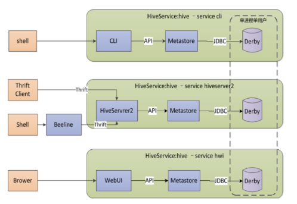

##  Hadoop

-   *Hadoop*：*Apache* 的一个分布式计算、java 语言实现的开源框架
    -   现在大量计算机组成的集群中对海量数据进行分布式计算
    -   被设计为可以检测、处理应用层面的失误，提供构建于电脑集群上的可靠服务，而不是依赖硬件的可靠性
-   *Hadoop* 核心包括 *HDFS*、*MapReduce*、*YARN*
    -   *Hadoop Common*：支持其它*Hadoop*模块的公用组件
    -   *Hadoop Distributed File System*：虚拟文件系统
    -   *Yet Another Resource Negotiator*：通用任务、集群资源分配框架、编程模型
        -   *YARN* 将 *MapReduce1.0* 中 *Jobtracker* 职能划分为多个独立实体，改善扩展性
        -   *YARN* 是独立的资源分配框架
            -   支持 *Spark*、*Storm* 其他通用计算框架
            -   支持不同的 *YARN* 应用在同一个集群上共存
    -   *MapReduce2*：*YARN* 基础上的大数据集并行处理系统（框架）


### Hadoop 文件系统

-   Hadoop 有抽象文件系统概念
    -   接口定义在 Java 抽象类 `org.apche.hadoop.fs.FileSystem` 中
    -   据此实现对多种类型文件系统的兼容
    -   *HDFS* 可认为只是其中的一个实现

|文件系统|URI方案|Java实现|描述|
|-----|-----|-----|-----|
|Local|`file`|`fs.LocalFileSystem`|使用客户端校验和本地磁盘文件系统，没有使用校验和文件系统`RawLocalFileSystem`|
|HDFS|`hdfs`|`hdfs.DistributedFileSystem`|HDFS设计为与MapReduce结合使用实现高性能|
|HFTP|`hftp`|`hdfs.HftpFileSystem`|在HTTP上提供对HDFS只读访问的文件系统，通常与distcp结合使用，以实现在运行不同版本HDFS集群之间复制数据|
|HSFTP|`hsftp`|`hdfs.HsftpFileSystem`|在HTTPS上同以上|
|WebHDFS|`Webhdfs`|`hdfs.web.WebHdfsFileSystem`|基于HTTP，对HDFS提供安全读写访问的文件系统，为了替代HFTP、HFSTP而构建|
|HAR|`har`|`fs.HarFileSystem`|构建于其他文件系统之上，用于文件存档的文件系统，通常用于需要将HDFS中的文件进行存档时，以减少对NN内存的使用|
|hfs|`kfs`|`fs.kfs.kosmosFileSystem`|CloudStore（前身为Kosmos文件系统）类似于HDFS（GFS），*C++*编写|
|FTP|`ftp`|`fs.ftp.FTPFileSystem`|由FTP服务器支持的文件系统|
|S3（原生）|`S3n`|`fs.s3native.NativeS3FileSystem`|由Amazon S3支持的文件系统|
|S3（基于块）|`S3`|`fs.sa.S3FileSystem`|由Amazon S3支持的文件系统，以块格式存储文件（类似于HDFS），以解决S3Native 5GB文件大小限制|
|分布式RAID|`hdfs`|`hdfs.DistributedRaidFileSystem`|RAID版本的HDFS是为了存档而设计的。针对HDFS中每个文件，创建一个更小的检验文件，并允许数据副本变为2，同时数据丢失概率保持不变。需要在集群中运行一个RaidNode后台进程|
|View|`viewfs`|`viewfs.ViewFileSystem`|针对其他Hadoop文件系统挂载的客户端表，通常用于联邦NN创建挂载点|

### 文件系统接口

-   Hadoop 文件系统对外暴露多种类型接口，一般使用 *URI* 方案选择合适的文件系统实例进行交互
    -   命令行：`$ hadoop fs ...` 命令
    -   C 语言：`libhdfs` 库，Java `FileSystem` 接口类的镜像
    -   网络访问：*HDFS* 后台进程可直接服务客户端请求
    -   融入本地文件系统：*FUSE* 项目
        -   允许 Hadoop 文件系统作为 Unix 标准文件系统进行挂载、交互

```bash
$ hadoop fs -copyFromLocal file hdfs://localhost/user/xyy15926/file
    # 调用Hadoop文件系统的shell命令`fs`
    # `-copyFromLocalFile`则是`fs`子命令
    # 事实上`hfds://localhost`可以省略，使用URI默认设置，即
        # 在`core-site.xml`中的默认设置
    # 类似的默认复制文件路径为HDFS中的`$HOME`

$ hadoop fs -copyToLocal file file
```


### *Hadoop* 生态项目

-   *Ambari*：用于部署（供应）、管理、监控 *Hadoop* 集群的 Web 工具
    -   提供仪表盘用于查看集群健康程度
    -   能够直观的查看 *MapReduce*、*Pig*、*Hive* 应用特点，提供易用的方式考察其执行情况
-   *HBase*：*Hadoop* 项目子项目，高可靠、高性能、面向列、可伸缩的分布式存储系统
    -   适合非结构化数据存储
    -   可用于在廉价服务器上搭建大规模结构化存储集群
-   *Hive*：数据仓库工具
    -   支持部分 SQL 语句直接查询
    -   速度较慢，适合作为数据仓库
-   *Pig*：大规模数据高层分析工具（类似于*Hive*）
    -   提供 SQL-Like 语言 *PigLatin*
-   *Zookeeper*：针对大型分布式应用设计的分布式、开源协调系统
    -   提供功能：配置维护、名字服务、分布式同步、组服务
    -   封装好复杂、易出错的关键服务
    -   提供简单易用、功能稳定、性能高效的接口（系统）
    -   解决分布式应用中经常遇到的数据管理问题
    -   简化分布式应用协调及管理难度，提供高性能分布式服务
-   *Spark*：基于内存计算的开源集群计算系统
-   *Mahout*：的机器学习、数据挖掘的分布式框架
    -   使用 *MapReduce* 实现了部分数据挖掘算法，解决了并行挖掘问题
        -   包括聚类、分类、推荐过滤、频繁子项挖掘
-   *Cassandra*：分布式 *NoSQL* 数据库系统
    -   集 *BigTable* 数据模型、*Dynamo*的完全分布式架构于一身
-   *Avro*：数据序列化、传输工具
    -   支持数据密集型、大批量数据交换应用
-   *Chukwa*：监控大型分布式系统的开源数据收集系统
-   *Tez*：基于 *YARN* 的泛用数据流编程平台
    -   提供强力、灵活的引擎用于执行任何 *DAG* 任务，为批处理和交互用例处理数据
-   *Sqoop*：*Hadoop*、关系型数据库中数据迁移工具
-   *Impala*：实时查询开源项目
-   *Phoenix*：基于 *HBase* 的关系型数据库
    -  支持 SQL 查询
    -   支持包括二级索引在内的丰富特性，借鉴关系型数据库优化查询方法
-   *Oozie*：工作流引擎服务器，用于管理、协调运行在 *Hadoop* 平台的任务
-   *Cloudera Hue*：基于 Web 的监控、管理系统
-   *Hama*：*BSP* 并行计算框架
    -   可用于包括图、矩阵、网络算法在内的大规模、大数据计算
-   *Flume*：分布的、可靠的、高可用的海量日志聚合系统
-   *Giraph*：可伸缩的分布式迭代图处理系统
-   *Crunch*：用于创建 *MapReduce* 流水线（程序）
    -   类似于 *Hive*、*Pig*，提供了用于实现如连接数据、执行聚合、排序记录等常见任务的模式库
    -   简化 *MapReduce* 的思考方式
-   *Whirr*：运行于云服务的类库，提供高度互补性
-   *Bigtop*：对 *Hadoop* 及其周边生态打包、分发、测试的工具
-   *HCatalog*：基于 *Hadoop* 的数据表、存储管理
    -   实现中央的元数据、模式管理
    -   跨越 *Hadoop*、关系型数据库，利用*Pig*、*Hive*提供关系视图
-   *Llama*：让外部服务器从*YARN*获取资源的框架
-   *Hadoop Streaming*：通过标准输入输出流实现 *MapReduce* 其他语言支持

##  HDFS

-   *HDFS* 设计模式
    -   数据读取、写入：不更新、只追加、不支持多用户写入
        -   *Namenode* 将元数据存储在内存中，可存储文件上限受限于 *NameNode* 内存
        -   为高数据吞吐量应用优化
            -   更看重数据集整体吞吐延迟
            -   返回首条结果延迟可能提高
    -   硬件：*HDFS* 无需高可靠硬件
        -   被设计为即使节点故障也能继续运行

### 数据块

-   数据块：*HDFS* 同样使用块作为独立存储单位，块大小默认为 64MB
    -   文件也被划分为同样大小的块
        -   小于块大小的文件不会占据整个块空间
    -   对分布式文件系统块进行抽象的好处
        -   文件大小可以大于网络中任意一个磁盘的容量
        -   使用抽象块而非整个文件作为存储单元，简化了存储子系统的设计
            -   简化存储管理，块大小固定，计算磁盘能存储块数目相对容易
            -   文件的元信息无需和块一起存储，可由其他系统单独管理
        -   适合数据备份，进而提高容错能力、可用性

### *NameNode*

-   *NameNode*：*HDFS* 系统中的管理者
    -   集中存储 *HDFS* 元信息
        -   维护文件系统的文件树、全部的文件和文件夹的元数据
        -   管理文件系统的命名空间：创建、删除、修改、列出所有文件、目录
        -   上层模块根据 *NameNode* 上的元信息，即可确认数据块副本、位置，据此分配计算任务，减少数据移动开销
    -   执行数据块的管理操作
        -   把文件映射到所有的数据块
        -   创建、删除数据块
        -   管理数据块副本、副本位置
    -   负责 *DataNode* 的成员管理
        -   接受 *DataNode* 的注册
        -   接受 *DataNode* 周期性的心跳信号

####    元数据存储

-   *NameNode* 将元数据存储在主存中以支持搞笑存取操作
    -   同时持久化至本地文件系统
        -   `FsImage`：命名空间镜像文件，保存整个文件系统命名空间、文件到数据块的映射信息
        -   `EditLog`：编辑日志文件，记录对文件系统元信息的所有更新操作
    -   *NameNode* 启动时
        -   读取 `FsImage`、`EditLog` 文件
        -   把 `EditLog` 的所有事务日志应用到从 `FsImage` 文件中装载的旧版本元信息上
        -   生成新的 `FsImage` 并保存
        -   截短 `EditLog`

####    可恢复性

-   *NameNode* 可恢复性
    -   多个文件系统备份：多位置备份文件系统元信息的持久化版本
    -   *Secondary NameNode*：负责周期性使用 `EditLog` 更新 `FsImage`
        -   保存 `FsImage`、`EditLog` 文件副本，并定时更新、合并、送回至主 *NameNode*
        -   保存的状态总是滞后于主节点，宕机后需要从别处获取缺失部分
    -   宕机恢复：启动拥有文件系统数据副本 *NameNode*，并配置 *DataNode*、客户端
        -   将命名空间映像导入内存中
        -   重做编辑日志
        -   接收到足够多的来自 *DataNode* 的数据块报告，并退出安全模式

####    高可用性

-   *NameNode* 可通过配置 *Active-Standby NameNode* 实现进一步高可用性
    -   *Active-Standby NameNode* 硬件配置应相当
        -   *NodeNode* 失效后，*Active-Standby NameNode* 会无间断接管任务并开始服务
    -   *Active-Standby NameNode*、*NameNode* 之间需要通过高可用的共享存储 *JounalNode* 实现 `Editlog` 共享
    -   *DataNode* 需要同时向二者发送数据块处理报告，因为数据块映射信息存储在NN内存中
    -   客户端需要使用特定机制处理 *NameNode* 失效问题

### *DataNode*

-   *DataNode*：*HDFS* 中保存数据的节点
    -   数据被切割为多个数据块，以冗余备份的形式存储在多个 *DataNode* 中
        -   *DataNode* 之间可以拷贝数据副本，从而可以重新平衡每个节点存储数据量、保证数据可靠性（副本数量）
    -   *DataNode* 与 *NameNode* 通讯均为主动发起，*NameNode* 被动应答和完成管理
        -   定期报告数据块元信息
        -   心跳信号
        -   新节点注册

### 联邦 *HDFS*

-   联邦 *HDFS* 可以添加 *NameNode* 突破单节点内存瓶颈
    -   每个 *NameNode* 维护命名空间卷，包括
        -   命名空间的元数据
        -   命令空间下的文件的所有数据块
        -   数据块池
    -   命名空间卷间相互独立、不通信，任一失效也不会影响其他
    -   数据块池不再切分，集群中 *DataNode* 需要注册到每个 *NameNode*

### 读、写文件

-   读文件流程
    -   客户端程序向 *NameNode* 请求
        -   要读取的文件名
        -   开始偏移量
        -   读取范围
    -   *NameNode* 返回落在读取范围内的数据块的位置信息
        -   根据与客户端的临近性进行排序
        -   客户端一般选择最临近的 *DataNode* 发送读取请求
-   写文件流程
    -   客户端向 *NameNode* 请求，确定应存取的 *DataNode*
    -   客户端直接和 *DataNode* 进行通讯，使用 *Data Transfer* 协议传输数据
    -   创建文件时，客户端把文件数据缓存在临时本地文件上
        -   当本地文件累计超过一个数据块大小时，客户端程序联系 *NameNode*
        -   *NameNode* 更新文件系统的 *NameSpace*，返回新分配的数据块的位置信息
        -   客户端根据此信息本文件数据块从临时文件刷到 *DataNode* 进行保存

##  Hadoop 平台上的列存储

-   列存储的优势
    -   更少的 IO 操作：读取数据的时候，投影下推、谓词下推可减少 IO 操作
    -   更大的压缩比：每列中数据类型相同，可以针对性的编码、压缩
    -   更少缓存失效：每列数据相同，可以使用更适合的 CPU 流水线的编码方式，减少缓存失效

### *Record Columnar File Format*

-   *Record Columnar File Format*：FB、中科院联合开发，首个
    -   允许按行查询，同时提供列存储的压缩效率的列存储格式
        -   具备相当于行存储的数据加载速度、负载适应能力
        -   读优化可以在扫描表格时，避免不必要的数据列读取
        -   使用列维度压缩，有效提升存储空间利用率
    -   具体存储格式
        -   首先横向分割表格，生成多个 RowGroup，大小可以由用户指定
        -   在 RowGroup 内部，按照列存储一般做法，按列把数据分开，分别连续保存
            -   写盘时，*RCFile* 针对每列数据，使用 *Zlib/LZO* 算法进行压缩，减少空间占用
            -   读盘时，*RCFile* 采用延迟解压策略，即查询时跳过不需要列的解压缩、反序列化

### *Optimized Row Columnar File*

-   *ORC*：对 *RCFile* 优化的存储格式
    -   支持更加丰富的数据类型
        -   包括 `DateTime`、`Decimal`
        -   Hive 的各种复合类型，包括：`Struct`、`List`、`Map`、`Union`
    -   自描述的列存储文件格式
        -   为流式读操作进行了优化
        -   支持快速查找少数数据行
    -   类型感知的列存储文件格式
        -   文件写入时，针对不同的列的数据类型，使用不同的编码器进行编码，提高压缩比
            -   整数类型：*Variable Length Compression*
            -   字符串类型：*Dictionary Encoding*
    -   引入轻量级索引、基本统计信息
        -   包括各数据列的最大（小）值、总和、记录数等信息
        -   在查询过程中，通过谓词下推，可以忽略大量不符合查询条件的记录

####    文件结构

-   *ORC* 文件由多个 *Stripe*、包含辅助信息的 *File Footer*、以及 *Postscript* 构成
    -   *Stripe* 即 *ORCFile* 中划分的 RowGroup
        -   可扩展的长度只受 *HDFS* 约束，默认大小为256MB
            -   大尺寸、对串行 IO 的优化，能提高数据吞吐量、读取更少的文件，减轻 *NameNode* 负担
        -   *Stripe* 包含 *Index Data*、*Row Data*、*Stripe Footer*
            -   *Index Data*：统计数据、偏移量
            -   *Row Data*：数据，由若干 *Data Stream* 构成
            -   *Stripe Footer*：*Data Stream* 位置信息、数据编码方式
    -   *File Footer*：*ORCFile* 文件中所有 *Stripe* 的元信息
        -   各 *Stripe* 位置、行数、数据类型
        -   *Stripe* 聚集结果：记录数、极值、总和
    -   *Postscript*：存储压缩参数

### Parquet

-   *Parquet*：Hadoop 生态系统中的所有项目，提供支持高压缩率的列存储格式
    -   兼容各种数据处理框架
        -   MapReduce
        -   Spark
        -   Cascading
        -   Crunch
        -   Scalding
        -   Kite
    -   支持多种对象模型
        -   Avro
        -   Thrift
        -   Protocol Buffers
        -   Hive Serde
        -   Pig Tuple
        -   SparkSQL Internal Row
    -   支持各种查询引擎
        -   Hive
        -   Impala
        -   Presto
        -   Drill
        -   Tajo
        -   HAWQ
        -   IBM Big SQL

####    Parquet 组件

-   Parquet 组件
    -   *Storage Format*：存储格式，定义了 *Parquet* 内部的数据类型、存储格式
    -   *Object Model Converter*：对象转换器，完成对象模型与 *Parquet* 数据类型的映射
    -   *Object Model*：对象模型，可以理解为内存中的数据表示

####    Parquet 数据模式

-   Parquet 数据模式可以用多叉树表达
    -   通过把多个模式结构按树结构组合，提供对复杂类型支持
        -   每个节点代表一种数据类型，树根代表最终数据类型
        -   节点可包含多个子节点 *Field*
        -   叶子节点数量即文件中实际列数，父节点则是在表头组合成数据模式
    -   每个 *Field* 包含三个属性
        -   *Repetition*：*Field* 出现的次数
            -   `required`：必须出现 1 次
            -   `optional`：出现 0 次或 1 次
            -   `repeated`：出现 0 次或多次
        -   *Type*：数据类型
            -   Primitive：原生类型
            -   Group：衍生类型
        -   *Name*：*Field* 名称

####    Parquet 文件结构

-   Parquet 文件结构
    -   *Row Group*：按照行将数据表格划分多个单元，每个行组包含一定行数
        -   行组包含该行数据各列对应的列块
        -   更大的行对应更大的列块，利于磁盘串行 IO
        -   为方便读取整个行组，行组大小常设置为 HDFS 块大小，占据整块
    -   *Column Chunk*：每个行组中每列保存在一个列块中
        -   行组中所有列连续的存储在行组中
        -   不同列块使用不同压缩算法压缩
        -   列块存储时保存相应统计信息，极值、空值数量，用于加快查询处理
        -   列块由多个页组成
    -   *Page*：压缩、编码的单元
        -   列块的不同页可以使用不同的编码方式

##  Hadoop 计算模型

### *YARN*

-   *Yet Another Resource Negotiator*：通用任务、集群资源分配框架、编程模型
    -   *YARN* 将 *MapReduce1.0* 中 *Jobtracker* 职能划分为多个独立实体，改善其扩展瓶颈
        -   根据资源预留要求、公平性、*Service Level Agreement* 等标准，优化整个集群的资源利用
    -   *YARN* 作为通用资源管理层，可支持包括 *MapReduce2.0* 在内的数据批处理框架
        -   批处理：MapReduce
        -   交互式处理：Tez
        -   迭代处理：Spark
        -   实时流处理：Storm
        -   图数据处理：GraphLab/Giraph
    -   *YARN* 允许不同的 *YARN* 应用在同一个集群上共存，提高可管理性、利用率

####    YARN中实体

-   *ResourceManager*：管理集群上的资源使用
    -   *AppplicatonManager*：接受、监控任务
        -   接受客户端提交的作业
        -   判断启动该作业的 *ApplicationMaster* 所需的资源，并请 *Scheduler* 分配容器
        -   监控 *ApplicationMaster* 状态，并在失败时重启
    -   *Scheduler*：分配资源、调度
        -   将作业所需资源封装成容器
        -   根据调度算法，在某个 *NodeManager* 上启动作业的 *ApplicationMaster*
        -   收到 *ApplicationMaster* 任务完成汇报之后，回收资源、返回执行结果

-   *NodeManager*：监控、管理当前节点资源
    -   职能
        -   抽象本节点资源（CPU、内存、磁盘、网络等），并定时向 *Scheduler* 汇报
        -   接受并处理 *ApplicationMaster* 的任务启动、停止等请求
    -   *ApplicationMaster*：管理集群上运行任务生命周期
        -   每个作业对应单独 *ApplicationMaster*，同样也需要在容器中执行
        -   计算作业所需资源，并向 *Scheduler* 申请
        -   运行在作业执行期间，监控整个作业执行过程
            -   监控作业相关的容器、任务状态
            -   任务失败则回收资源重新生成任务，成功则释放资源
            -   任务执行完毕后回报 *Scheduler*
    -   *Containers* 容器：资源的集合，为资源隔离提出的框架
        -   任务对应容器，只能在容器中运行
        -   容器按任务所需分配内存，由 *NodeManager* 确保任务使用资源不超限


####    作业执行过程

-   作业提交
    -   从 *ResourceManager* 获取新的作业 ID
    -   作业客户端检查作业输出说明，计算输入分片（也可以配置在集群中产生分片）
    -   将作业资源复制到 *HDFS*
    -   调用 *ResourceManager* 上的 `submitApplication` 方法提交作业
-   作业初始化
    -   *ResourceManager* 收到调用 `submitApplication` 消息后，将请求传递给内部 *Scheduler* 分配容器
    -   *NodeManager* 在容器中启动作业的 *ApplicationMaster*，初始化作业
    -   *ApplicationMaster* 创建多个簿记对象用于接受任务进度、完成报告，保持对作业进度的跟踪
    -   *ApplicationMaster* 接受输入分片，为分片创建一个 *Map* 对象，及由 `mapreduce.job.reduces` 属性确定的 *Reduce* 任务对象
    -   *ApplicationMaster* 评估任务大小决定如何运行作业
    -   *ApplicationMaster* 在任务执行之前通过作业的 `setup` 方法设置作业的 `OutputCommiter`，建立作业输出目录
-   任务分配
    -   若作业不适合作为单机任务运行，*ApplicationMaster* 为各任务向 *Scheduler* 请求容器
        -   每个 *Map* 任务的数据本地化信息，特别是输入分片所在的主机、机架信息，供 *Scheduler* 决策调度
            -   理想化情况下任务分配到数据本地化节点
            -   否则优先使用机架本地化
        -   任务内存需求
-   任务执行
    -   *ApplicationMaster* 与任务容器所在 *NodeManager* 通信启动容器
    -   任务由 `YarnChild` 执行，执行任务前需要将任务所需资源本地化
        -   作业的配置
        -   JAR 文件
        -   来自分布式缓存的文件
    -   对于 *Streaming*、*Pipes* 程序，`YarnChild` 启动 *Streaming*、*Pipes* 进程，使用标准输入输出、socket 与其通信（以 *MapReduce1.0* 方式运行）
-   进度和状态更新
    -   任务定期通过 `umbilical` 接口向 *ApplicationMaster* 汇报进度、状态（包括计数器）
    -   客户端定期查询 *ApplicationMaster* 接受进度更新
-   作业完成
    -   客户端定期调用作业 `waitForCompletion` 检查作业、或注册回调
    -   作业完成后 *ApplicationMaster*、任务容器清理工作状态

### *MapReduce*

-   *MapReduce* 计算模型
    -   核心思路：将输入映射为键值对，并对键值对执行规约得到结果
        -   *Map* 映射：处理键值对二元组，负责数据转换、过滤
            -   *Map* 过程相互独立、不通信，适合可独立计算任务
        -   *Reduce* 规约：处理 *Map* 输出，负责聚集、总结
        -   *Shuffle* 混淆：根据键分组、排序
            -   *Map Shuffle*：对 *Map* 结果分区、排序、分割，并合并输出（至文件）
            -   *Reduce Shuffle*：复制 *Map* 输出，并排序、合并
    -   特点
        -   提供原语少：需要用户处理更多逻辑，易用性差
        -   抽象层次低：数据处理逻辑隐藏在用户代码中，可读性差
        -   表达能力有限：复杂数据处理任务，如：机器学习算法、SQL 连接查询很难表示用 *MapReduce* 计算默认表达

#### *MapReduce* 执行过程

-   *MapReduce* 执行引擎直接基于 *HDFS*
    -   *JobTracker*：在 *NameNode* 上执行，分解作业为数据处理任务并分发给 *TaskTacker*
        -   发送任务原则：尽量把任务推送到离数据最近、空闲节点上
        -   也可通过 *Speculative Execution* 模式，在多个节点上启动同一个任务
    -   *TaskTracker*：在 *DataNode* 上运行，执行数据处理 *Map*、*Reduce* 任务
        -   可能需要从其他 *DataNode* 中获取需要数据
        -   *TaskTracker* 拥有一定数量的任务槽，活动的 *Map*、*Reduce* 任务占用其一
            -   不考虑任务运算量大小，所有Task视为相同
            -   可能导致某 *TaskTracker* 负载过高，会影响整体的执行效率
    -   优势
        -   方便扩展：能够运行在普通服务器构成的超大规模集群上
        -   突破 IO 瓶颈：将 IO 分散在集群各节点上，提高 IO 效率
    -   除 *MapReduce* 计算模型本身问题外
        -   数据处理延迟大
            -   *MapReduce* 作业在 *Map*、*Reduce* 执行过程中，需要把中间结果存盘
            -   作业间也需要通过磁盘实现作业间的数据交换
        -   资源利用率低
            -   任务调度方法远未达到优化资源利用率的效果，给每个 *TaskTracker* 分配任务的过程比较简单

-   *MapRedudce2.0* 相较于 *MapReduce1.0* 框架
    -   *Map* 端内存缓冲：存储 *Map* 输出结果
        -   缓冲区快满时需要以临时文件方式存放到磁盘中
        -   服务结束后再任务产生所有临时作合并为正式输出文件，等待 *Reduce* 任务拉取

### Tez

-   *Tez*：提供 *DAG* 表示大数据处理模型的执行框架
    -   Tez 中 *DAG* 的每个顶点建模为 *Input*、*Processer*、*Output* 模块的组合
        -   *Input*、*Output*：决定数据格式、输入、输出
        -   *Processor*：包装数据转换、处理逻辑
            -   通过 *Input* 从其他顶点、管道获取数据输入
            -   通过 *Output* 向其他顶点、管道传送生成数据
        -   将 *Input*、*Processor*、*Output* 模块组合成顶点，建立 *DAG* 数据处理工作流，执行特定数据处理逻辑
    -   Tez 自动把 *DAG* 映射到物理资源，将其逻辑表示扩展为物理表示，并执行其中的业务逻辑
        -   Tez 能为每个节点增加并行性，即使用多个任务执行节点的计算任务
        -   Tez 能够根据执行过程中信息（数据采样），动态优化执行计划、资源使用、提高性能
            -   去除连续作业之间的写屏障
            -   去除工作流中多余的 *Map* 阶段

> - *YARN* 被抽出作为独立的资源分配框架使得 Tez 成为可能

####    Tez *DAG*

| |*MapReduce*|Tez *DAG*|
|------|------|------|
|操作原语|*Map*、*Reduce*|较多|
|抽象层次|低|高|
|表达能力|差|强|
|易用性|需手动处理作业之间依赖关系，易用性差|*DAG* 本身体现数据处理流程|
|可读性|处理逻辑隐藏在代码中，没有整体逻辑|较好|

-   Tez *Directed Acyclic Graph* 中包含更多操作原语，表达能力强于 *MapReduce*
    -   *DAG* 由顶点、边构成
        -   顶点：数据处理任务，反映一定的业务逻辑，即如何对数据进行转换和分
        -   边：数据在不同的顶点间的传递
    -   Tez *DAG* 原语抽象层次较高
        -   可读性、易用性更好
        -   Tez *DAG* 部分计算模型也由 *Map*、*Reduce* 任务构成，但无需成对出现
    -   消除某些处理逻辑中不必要任务
        -   提高了数据处理效率
        -   减少中间结果的磁盘 I/O
        -   减少 *Reduce* 任务等待 *Map* 的同步障碍

####    Tez 执行过程

-   Tez 执行过程
    -   初始化例程，提供上下文、配置信息给 Tez 运行时
    -   对每个顶点的每个任务（任务数量根据并行度创建）进行初始化
    -   执行任务 *Processor* 直到所有任务完成，则节点完成
    -   *Output* 把从 *Processor* 接收到的数据，通过管道传递给下游顶点的 *Input*
    -   直到整个 *DAG* 所有节点任务执行完毕

##  HBase

||HBase|Bigtable|
|-----|-----|-----|
|存储系统|HDFS|GFS|
|数据处理|Hadoop MapReduce|MapReduce|
|协同服务|Zookeeper|Chubby|
|RDBMS数据导入|Sqoop|-|

-   HBase：高可靠、高性能、面向列、可伸缩的分布式数据库系统
    -   利用 HBase 技术可以在廉价硬件上搭建大规模非结构化数据管理集群
    -   HBase 借鉴 Google Bigtable 技术实现的开源软件
    -   HBase 访问接口
        -   Native Java API：常用、高效的访问方式
        -   HBase Shell：HBase 命令行工具，适合用于管理 HBase
        -   Thrift Gateway：利用 Thrift 序列化技术，支持 C++、PHP、Python 多种语言异构系统访问
        -   REST Gateway：支持 *REST* 风格 HTTP API 访问
        -   Pig：支持 Pig Latin语言操作HBase中数据
            -   最终被转换为MapReduce Job处理HBase表数据
            -   适合做数据统计
        -   Hive：支持用户使用 *HiveQL* 访问HBase
    -   可以在 HBase 系统上运行 MapReduce 作业，实现数据批处理
        

###  HBase 数据结构


-   *Table*：HBase 的表格，类似关系型数据库中的表格，但有所不同
    -   HBase 中有两张特殊的表格
        -   `.META.`：记录用户表 Region 信息，自身可以有多个 Region
        -   `-ROOT-`：记录 `.META.` 表 Region 信息，自身只能有一个 Region
    -   *Row Key* 行键：*Table* 行主键，记录按照此排序
    -   *Column* 列、*Column Family* 列簇：构成 *Table*
        -   列簇可以由任意多个列组成
        -   列簇支持动态扩展，无需预先定义列数量、类型
        -   所有列均以二进制格式存储，用户需要自行进行类型转换
    -   *Timestamp* 时间戳：每次数据操作对应的时间戳，可视为是数据的版本号
    -   *Region* 分区：表记录数不断增加而变大后，逐渐分裂出的多个分区
        -   每个分区由 `[startkey, endkey)` 表示
        -   不同分区被分配给相应 *RegionServer* 进行管理（存储）

###  HBase 架构


-   *HBase Client* 使用 *HBase RPC* 机制同 *HMaster*、*HRegionServer* 进行通信
    -   对于管理类操作，通过 *RPC* 机制访问 *HMaster*
    -   对于读写操作，通过 *RPC* 机制访问 *HRegionServer*
-   *HMaster*：负责表、分区管理工作
    -   管理用户对增、删、查、找操作
    -   管理 *HRegionServer* 负载均衡，调整 *Region* 分布
        -   在 *HRegionServer* 停机后，负责失效 *HRegionServer* 上分区迁移
    -   负责分区分裂、新分区分配
-   *HRegionServer*：负责响应用户 I/O 请求，向 *HDFS* 文件系统写数据
    -   管理一系列 *HRegion* 对象
    -   *HRegion*：对应表分区，由多个 *HStore* 组成
    

-   *HStore*：对应列簇，*HBase* 存储核心模块
    -   列簇即集中存储单元
        -   最好将具备共同 IO 特性的列放在同一列簇中，可提高 IO 效率
    -   *HStore* 包含两种类型
        -   *MemStore*：有序内存缓存，存满之后持久化至磁盘为 *StoreFile*
        -   *StoreFile*：对 *HFile* 的轻量级包装
    -   *StoreFile* 文件数量达到阈值时会触发 *Compact* 合并操作，合并多个 *StoreFile*
        -   合并过程中会执行版本合并、数据删除
        -   即，HBase 其实只有增加数据，更新、删除操作都是后续 *Compact* 过程中进行的
        -   则，写操作只要写入内存即可立即返回，保证 IO 性能
    -   *StoreFile* 文件大小超过阈值之后会触发分裂操作
        -   当前分区分裂成 2 个分区，父分区下线
        -   子分区会被 *HMaster* 分配到相应 *HRegionServer* 上，实现负载均衡
-   *HLog*：*HRegionServer* 日志记录
    -   写入 *MemStore* 时，会同时写入数据至 *HLog* 中
        -   *HLog* 定时删除已持久化到 *StoreFile* 中的数据
        -   避免节点宕机导致的 *MemStore* 中内存数据丢失
    -   *HRegion* 意外宕机后
        -   *HMaster* 按分区拆分日志文件，重新分配失效分区
        -   接收到新分区 *HRegionServer* 会尝试恢复需处理的日志文件

###  HBase 存储结构


-   *HFile*：是 Hadoop 二进制格式文件，实现键值对数据存储
    -   *HFile* 不定长，长度固定的只有 *Trailer*、*FileInfo* 部分
        -   *Trailer*：含有指针指向其他数据块起点
        -   *FileInfo*：记录文件元信息
            -   *AVG_KEY_LEN*
            -   *AVG_VALUE_LEN*
            -   *LAST_KEY*
            -   *COMPARATOR*
            -   *MAX_SEQ_ID_KEY*
        -   *DataIndex*：记录每个 Data 块起始点
        -   *Meta Index*：记录每个 Meta 块起始点
        -   *Data Block*：HBase IO 基本单元
    -   数据块由 *Magic* 信息、键值对组成
        -   大小可以在创建表时通过指定，大块利于顺序遍历、小块利于随机查询
        -   *Magic* 信息：数据块开头，存储随机数字防止数据块损坏
        -   键值对：结构固定的字节串
            -   定长数值表示键、值长度
            -   键中包含 *RowKey*、列簇、*Qualifier*、时间戳、操作
                -   固定长度 *RowKey* 长度、*RowKey*
                -   固定长度列簇长度、列簇
                -   *Qualifier*
                -   固定长度 *Timestamp*、*KeyType*
            -   值部分即二进制数据
        
    -   为了提高效率，*HRegionServer* 中实现了基于 *LRU* 的块缓冲机制

-   *HLogFile*：HBase 中 *Write Ahead Log* 存储格式
    -   本质上是 *Hadoop Sequence File*，存储键值对
    -   *Sequence File* 键：*HLogKey* ，记录了写入数据的归属信息
        -   表、分区
        -   顺序编号：起始值为 0，最近存入文件系统中的顺序编号
        -   时间戳：写入时间
    -   *Squence File* 值：*HFile* 中键值对

##  Zookeeper


-   *Zookeeper*：用于构建可靠的、分布式群组的协调软件服务
    -   提供群组成员维护、领导人选举、工作流协同、分布式系统同步、命名、配置信息维护等服务
    -   提供广义的分布式数据结构：锁、队列、屏障、锁存器
    -   促进终端间松耦合，提供最终一致的、类似传统文件系统中文件、目录的 *Znode* 视图，提供基本操作，如：创建、删除、检查 *Znode* 是否存在
    -   提供事件驱动模型，客户端能观察到 *Znode* 的变化
    -   可运行多个 *Zookeeper Ensemble* 以获得高可用性
        -   每个服务器上的 *Ensemble* 都持有分布式系统内存副本，为客户端读取请求提供服务


##  Flume


-   *Flume* ：分布式日志收集系统，收集日志、事件等数据资源，并集中存储
    -   适合场景
        -   从多个网站服务器收集日志信息
        -   从多个服务器获取数据
        -   收集社交网站事件数据
    -   *Reliablity* 可靠性：*Flume* 提供了 3 种数据可靠性选项
        -   *End-to-End*：使用磁盘日志、接受端确认的方式，保证接收数据最终到导致目的地
        -   *Store on Failure*：目的地不可用时，将数据保存在本地硬盘
            -   但进程如果出问题，可能丢失部分数据（发送后目的地不可用）
        -   *Best Effort*：不做任何 QoS 保证
    -   *Scalability* 易扩展性
        -   *Flume* 三大组件都是可伸缩的
        -   *Flume* 对事件的处理不需带状态，容易实现扩展性
    -   *Avaliablity* 高可用性：*Flume* 引入 *Zookeeper* 用于保存配置数据
    -   *Manageablity* 易管理性：可配置多个 *Master*，管理大量节点
    -   *Extensibility* 可开发性：可以基于 Java 添加各种新功能
        -   实现 `Source` 子类，自定义数据接入方式
        -   实现 `Sink` 子类，将数据写入特定目标
        -   实现 `SinkDecorator` 子类，对数据进行一定的预处理

### Flume 组件、结构


-   *Source*、*Agent*：采集数据，产生数据流
    -   在数据发生器服务器上的独立 *JVM* 守护进程，接受数据并以 *Event* 格式传递给 *Channel*
    -   支持多种数据源、接收方式
        -   *Avro Source*：支持 *Avro RPC* 协议，内置支持
        -   *Thrift Source*：支持 *Thrift* 协议
        -   *Exec Source*：支持 Unix 标准输出
        -   *JMS Source*：从 *JMS*（消息、主题）读取数据
        -   *Spooling Directory Source*：监控指定目录内数据变更
        -   *Twitter 1% firehose Source*：通过 API 持续下载 Twitter 数据
        -   *Netcat Source*：监控端口，接收流经端口的每个文本行数据
        -   *Sequence Generator Source*：序列生成器数据源
        -   *HTTP Source*：基于 `POST`、`GET` 方式数据源，支持 JSON、BLOB 格式
    -   收集数据模式
        -   *Push Source*：外部系统向 *Flume* 推送数据
        -   *Polling Source*：*Flume* 主动从外部系统拉取数据
-   *Channel*、*Collector*：暂存容器，缓存接收到的 *Event* 格式的数据，直到被 *Sink* 消费
    -   支持多路径流量、多管道接入流量、多管道接出流量、上下文路由
        -   *Channel* 基于事务传递 *Event*，保证数据在收发时的一致性
        -   *Channel* 可以和任意数量 *Source*、*Sink* 连接
    -   主要 *Channel* 类型有
        -   *JDBC Channel*：数据持久化在数据库中，内置支持 *Derby*
        -   *File Channel*：数据存储在磁盘文件中
        -   *Memory Channel*：数据存储在内存中
        -   *Spillable Memory Channel*：优先存在内存中，内存队列满则持久到磁盘中
        -   *Custom Channel*：自定义 *Channel* 实现
-   *Sink*、*Storage Tier*：将从 *Channel* 接收数据存储到集中存储器中

> - Flume 新、旧版本的组件功能、数据流结构都有区别，但 3 大组件仅功能略有差异


### *Flume Event*

-   Flume 事件：封装传输数据，内部数据传输最小基本单元、事务处理基本单位
    -   由装载数据的字节串、可选头构成
        -   数据对 Flume 是不透明的
        -   事件头：键值对字符串无需集合，可在上下问路由中使用扩展

##  Kafka

-   *Kafka*：分布式、分区的、可复制的 *Message System*（提交日志服务）
    -   得益于特有的设计，Kafka具有高性能、高可扩展的特点
    -   完全分布式系统，易于横向扩展、处理极大规模数据
    -   同时为发布、订阅提供极高吞吐能力
    -   支持多订阅，出现失败状态时，可以自动平衡消费者
    -   将消息持久化到磁盘，保证消息系统可靠性，可用于消息批量消费应用、实时应用
    -   适合场景
        -   *Messaging*：消息传递，作为传递消息队列（*ActiveMQ*、*RabbitMQ* 等）替代品，提供高吞吐能力、高容错、低延迟
        -   *Website Activity Tracking*：网站活动跟踪，要求系统必须快速处理产生消息
        -   *Metric*：度量，把分布式各个应用程序的运营数据集中，进行汇总统计
        -   *Streaming Processing*：流数据处理
        -   *Event Sourcing*：事件溯源，把应用程序状态变化以时间顺序存储，需要支持大量数据
        -   *Commit Log*：日志提交，作为分布式系统提交日志的外部存储服务

###  Kafka 架构


-   *Topic* 话题：消息的分类机制，向 Kafka 发布消息必须指定话题
    -   Kafka 按照 *Topic* 维护接收到的消息
        -   话题被划分为一系列分区
        -   每个 *Topic* 维护一个分区日志文件存储消息
-   *Producer* 生产者：向 Kafka 发布消息的进程
    -   生产者需要指定消息分配至哪个分区
        -   采用 *Round-Robin* 方式方便均衡负载
        -   根据应用的语义要求，设置专用分区机制进行消息分区
-   *Broker* 代理：*AMQP* 客户端，保存已经发布消息的服务器进程
    -   一组代理服务器即构成 Kafka 集群
    -   Kafka 代理是无状态的，无法知晓消息是否被消费、应删除
        -   消费者需要自行维护已消费状态信息
            -   允许消费者可以重复消费已消费数据
            -   违反队列约定，但实际应用中很多消费者有这种特征
        -   代理使用简单的、基于时间的 *Serice Level Agreement* 策略，消息超时自动删除
    -   Kafka 代理将紧密耦合的系统设计解耦，可以对未及时处理的消息进行缓存
        -   提高了吞吐能力
        -   提供了分区、复制、容错支持
    -   Kafka 代理可通过 Zookeeper 与其他 Kafka 代理协同
        -   系统中新增代理或代理故障失效时，Zookeeper 通知生产者、消费者
        -   生产者、消费者据此开始同其他代理协同工作
        
-   *Consumer* 消费者：向 Kafka 订阅 *Topic*、处理 Kafka 消息的进程
    -   可以订阅多个话题，从代理拉取数据，消费已经发布的消息
    -   Kafka 通过设置消费者组 *Consumer Group* 提供对上述两种消息系统模型的支持
        -   消费者被分组，同组只能有一个消费者消费同一信息
        -   一般的，话题被多个消费者组订阅，组内有多个消费者实例，以扩展处理能力、容错
        -   极端情况下
            -   消费者实例隶属于同一个消费者组， 类似于 *队列模型*
            -   消费者实例隶属于不同的消费者组，类似于 *发布-订阅模型*
        

> - *Queuing* 队列模型：多消费者从单服务器读取信息，每个消息仅可被其中一个消费者消费
> - *Publish Subscribe* 发布订阅模型：消息被广播给所有消费者
> - *the Advanced Message Queuing Protocal* 标准开放的应用层消息中间件协议：定义通过网络发送的字节流的数据格式

###  消息分区、存储、分发

-   分区：有序的、不可更改、可在末尾不断追加的消息序列
    -   每个分区由单独的一组服务器处理，负责该分区数据管理、消息请求，支持多个副本以支持容错
        -   每个分区中有一台服务器作为 leader、若干服务器作为 follower
            -   领导者负责分区读、写请求
            -   跟随者以被动的方式领导者数据进行复制
        -   领导者失败，则追随者之一在 Zookeeper 协调下成为新领导
        -   为保证负载均衡，每个服务器担任部分分区领导者、其他分区追随者
    -   分区优势
        -   允许 Kafka 处理超过一台服务器容量的日志规模
        -   分区作为并行处理基本单元，允许 Kafka 进行并行处理
        -   通过保证每个分区仅由一个消费者消费，可以保证同一分区内消息消费的有序
            -   可设置多分区，保证在不同消费者之间负载均衡
            -   分区内外保证消息有序、数据分区处理对大部分实际应用已经足够

-   Kafka 存储布局非常简单
    -   分区存储
        -   话题每个分区对应一个逻辑日志，每个日志为相同的大小的一组分段文件
        -   消息由代理追加到对应分区最后一个段文件中
        -   发布消息数量达到设定值、经过一段时间后，段文件真正写入磁盘，然后公开给消费者
        
    -   *Sequential ID Number*：唯一标识分区中消息，为消息在分区中偏移量
        -   偏移量是增量的但不连续（消息长度不固定）
        -   偏移量标识每个消费者目前处理到某分区消息队列的位置，对分区消息队列处理依赖于其（消息通过日志偏移量公开）
        -   偏移量由消费者控制，所以消费者可以以任何顺序消费消息
            -   可以回推偏移量重复消费消息
            -   设计消费者仅仅查看分区末尾若干消息，不改变消息
                其他消费者可以正常的消费
        -   从消息分区机制、消费者基于偏移量消费机制，可以看出 Kafka 消息消费机制不会对集群、其他消费者造成影响

##   Storm

-   *Storm*：是分布式、高容错的实时流数据处理的开源系统
    -   Storm 为流数据处理设计，提供高容错性、可靠消息处理
        -   保证每个消息只能得到一次完整处理
        -   任务失败时会负责从消息源重试消息

###  Storm 架构


-   Storm 架构
    -   *Nimbus*：负责分配代码、布置任务、故障检测
    -   *Supervisor*：监听、开始、终止工作进程
    -   *Nimbus*、*Supervisor* 都是无状态的，不负责维护客户端两次调用之间状态维护
        -   两者之间的协调由 Zookeeper 完成

###  Storm 编程模型

-   Storm 编程模型
    -   *Topology* 计算拓扑：封装实时计算应用程序处理逻辑
        -   *Spout* 消息源：消息元组生产者，消息源可以是可靠的、不可靠的
            -   可靠的消息源：消息元组未被成功处理后，可重新发送
            -   不可靠的消息源：消息元组发送之后彻底丢弃
        -   *Bolt* 消息处理者：封装所有的消息处理逻辑
            -   过滤、聚集等：输入、输出元组无需一一对应
            -   消息元组处理确认告知
        -   每个 *Spout*、*Bolt* 转换为若干个任务在整个集群里执行
            -   同一 *Spout*、*Bolt* 下任务共享一个内核线程
    -   *Stream* 数据流：没有边界的元组序列
        -   元组序列以分布式的方式，并行的创建、处理
        -   数据分发策略：在 *Spout*、*Bolt* 任务间的数据分发
            -   *Shuffle Grouping*：洗牌式分组，上游 *Spout* 数据流元组随机分发到下游 *Bolt* 任务
            -   *Fields Grouping*：按指定字段进行分组
            -   *All Grouping*：*Spout* 数据元组分发给所有下游 *Bolt*
            -   *Global Grouping*：*Spout* 数据元组分发给最小 ID 的 *Bolt* 任务
            -   *Non-Grouping*：类似 *Shuffle*，把具有 *Non-Grouping* 设置 *Bolt* 推到其订阅的上游 *Spout*、*Bolt*
            -   *Direct Grouping*：元组生产者决定下游 *Bolt* 任务
            -   *Local or Shuffle Grouping*：如果目标 *Bolt* 任务中有工作在同一进程中，元组分配给这些任务，否则同 *Shuffle*
            -   *Partial Key Grouping*：类似 *Fields Grouping*，但是在下游 *Bolt* 中做负载均衡
    -   消息处理保证：Storm 追踪由每个 *Spout* 元组产生的元组树执行情况
        -   *Tuple Tree* 元组树：元组从 *Spout* 生产开始，经计算拓扑形成、根据血缘关系形成元组树
            -   元组树中所有节点都被成功处理了，才说明元组被完全处理
        -   计算拓扑有消息超时设置，元组树未在给定时间内完全执行，则元组被标记为执行失败并执行重发

##  Hive

| |Hive|传统关系型数据库|
|------|------|-------|
|数据存储|HDFS 分布式文件系统|服务器本地文件系统|
|查询处理|MapReduce 计算模型|自行设计的查询处理模型|
|应用场景|海量数据分析处理|高性能查询，实时性好|
|数据更新|不支持对具体数据行修改，只能覆盖、追加|支持|
|事务处理|不支持|支持|
|索引支持|不支持，一般需要对数据进行全部扫描|支持，多种索引|
|扩展能力|基于 Hadoop 平台，存储、计算强大的扩展能力|扩展性较差|
|数据加载|*Writing Time Schema*：数据加载时无需进行模式检查，在读取数据时对数据以一定模式进行解释|*Reading Time Schema*：要求数据必须符合数据库表结构|

-   *Hive*：Hadoop 平台上的数据仓库，面向结构化数据分析
    -   将**结构化**数据文件映射为一张**数据库表**
    -   提供完整的 SQL 查询功能，所用语言称为 *HiveQL*
        -   Hive 将 HiveQL 转换为 MapReduce 作业执行
        -   Hive 相当于一个在 Hadoop 平台上的 *SQL Shell*
        -   HiveQL 学习成本低，可用于快速实现简单数据分析、统计，避免开发 *MapReduce* 程序

### Hive服务端组件

####    Driver

-   *Driver*：将 HiveQL 查询语句进行解析、编译、优化、生成执行计划，并调用 MapReduce 计算模型执行
    -   *Compiler*：编译器
    -   *Optimizer*：优化器
    -   *Executor*：执行器

####    MetaStore

-   *MetaStore* 元信息管理器：负责存储元数据在关系型数据库 *MetaStore Database*
    -   元数据包括 Hive 创建的数据库、表等元信息
    -   *MetaStore* 实际上就是 *Thrift* 服务
        -   *MetaStore* 客户端（*Hive Shell*、*Spark Shell* 等）和服务端通过 *Thrift* 协议进行通信
        -   客户端通过连接 *MetaStore* 服务，实现对元数据的存取
        -   通过 *Thrift* 获取元数据，屏蔽了访问 *MetaStore Database* 所需的驱动、url、用户名、密码等细节
    -   *MetaStore* 服务可以独立运行，可以让多个客户端同时连接、甚至安装到远程服务器集群，保持 Hive 运行的健壮性

-   *MetaStore* 服务部署方式
    -   *Embedded Metastore Server(Database Derby)* 内嵌模式：使用内嵌的 *Derby* 数据库存储元数据
        -   不需要额外起 *Metastore* 服务
        -   仅支持单客户端连接，不适合生产环境
        -   *Derby* 默认会在调用 `hive` 命令所在目录的 `metastore_db` 文件中持久化元数据
        
    -   *Local Metastore Server* 本地元存储：外部数据库独立于 Hive 部署，Hive 服务使用 JDBC 访问元数据
        -   *MetaStore* 服务与 Hive 在同一进程中启动
        
    -   *Remote Metastore Server* 远程元存储：类似于本地元存储，但单独启动 *MetaStore* 服务
        -   和 Hive 运行在不同的进程（甚至主机）中
        -   需在每个客户端配置连接到该 *MetaStore* 服务
        

####    *HiveServer2*

-   *HiveServer2*：远程客户端可以通过 *HiveServer2* 执行 Hive 查询并返回结果
    -   基于 *Thrift RPC* 实现
    -   支持多客户端并发、身份验证
        -   可以使用 JDBC、ODBC、Thrift 连接 *HiveServer2*
        -   *HiveServer28* 能独立访问元数据，不依赖于 *MetaStore* 服务

### Hive 客户端

-   Hive 客户端
    -   *Command Line Interface*：允许用户交互式的使用 Hive
    -   *THrift Client*、*Beeline*：基于 *Thrift* 的 JDBC 客户端
        -   包括 JDBC、ODBC 驱动程序
    -   *WEB GUI*：允许用户通过网络图形界面访问 Hive
        -   需要首先启动 *Hive Web Interface* 服务

###  Hive 查询处理

-   Hive 查询流程
    -   用户提交 *HiveQL* 至 *Driver*
    -   *Driver* 把查询交给 *Compiler*，*Compiler* 使用 *MetaStore* 中元信息检查、编译
    -   *Optimizer* 优化查询计划
    -   *Executor Engine* 将查询计划转换为 *MapReduce* 作业后调用MapReduce执行
    -   *MapReduce* 存取 HDFS 对数据进行处理，查询结果返回 Driver

### 数据类型

-   数据类型
    -   基础数据类型
        -   `Integer`
        -   `Float`
        -   `Double`
        -   `String`
    -   复杂数据类型：通过嵌套表达复杂类型
        -   `Map`
        -   `List`
        -   `Struct`
    -   还允许用户自定以类型、函数扩展系统

### 数据存储模型

-   Hive 数据存储模型同传统关系型数据库
    -   *Database*：相当于关系型数据库中的 *Namespace*
        -   将不同用户数据隔离到不同的数据库、模式中
    -   *Table* 表格：逻辑上由存储的数据、描述数据格式的相关元数据组成
        -   表格数据存放在 HDFS 中，创建表格、加载数据之前，表格在 HDFS 中就是一个目录
            -   托管表：数据文件存放在 Hive 数据仓库中，即 HDFS 中目录，数据文件默认存放路径
            -   外部表：数据文件可以存放在其他文件系统中
        -   元数据存储在 *MetaStore* 服务指定关系型数据库中
    -   *Partition*：根据“分区列”的值，对表格数据进行粗略划分
        -   存储上：是 Hive 中表格主目录的子目录，名字即为定义的分区列名字
        -   逻辑上：分区不是表中的实际字段，是虚拟列
            -   根据虚拟列（可能包含多个实际字段）划分、存储表格数据
            -   同一虚拟列中字段通常应该经常一起被查询，这样在需要存取部分数据字段时，可以只扫描部分表
    -   *Bucket*：数据文件将按照规律拆分成多个文件
        -   桶即表、分区目录中文件
        -   常 Hash 函数实现数据分桶，创建表时需要指定桶数量、分桶列
        -   Hive 可以使用分桶信息提高查询效率


