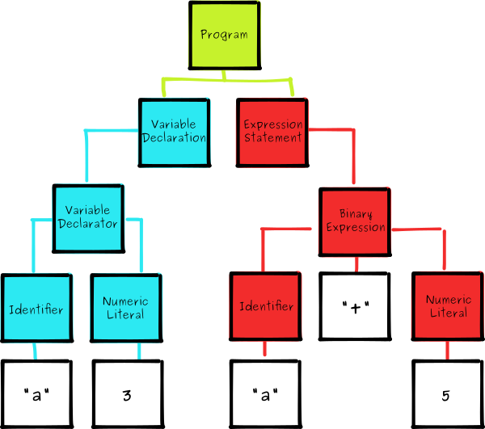

##  编程范型

### *Functional Programming*

-   函数式编程：使用纯函数
    -   程序使用紧密的函数调用表示，这些函数可以进行必要计算，但是不会执行会改变程序状态（如：赋值）的操作
    -   函数就是数据值，可以像对待其他数据值一样对其进行操作
-   纯函数：没有副作用、表达式对所有引用透明度表达式也是引用透明的函数
    -   执行过程中除了根据输入参数给出运算结果外没有其他影响
    -   输入完全由输入决定，任何内部、外部过程的状态改变不会影响函数执行结果

> - *reference transparency*：引用透明，表达式可以用其结果取代而不改变程序含义

##  *Abstarct Syntax Tree*




-   *AST*：抽象语法树，源代码的抽象语法结构的树状表示形式
    -   *AST* 定义了代码的结构，可以通过操纵 *AST* 精准定位到各种语句、实现
        -   代码分析、检查：语法、风格、错误提示
        -   代码结构优化：代码格式化、高亮、自动补全
        -   优化变更代码：改变代码结构
    -   基本上语言中每种结构都与一种 *AST* 对象相对应
        -   不同解释器会有独有的 *AST* 格式

##  类型系统


-   语言类型
    -   *Strongly Typed*：强类型，偏向于不能容忍隐式类型转换
    -   *Weakly Typed*：弱类型，偏向于容忍隐式类型转换
    -   *Statically Typed*：静态类型，编译时就知道每个变量类型，因为类型错误而不能做的事情是语法错误
    -   *Dynamically Typed*：动态类型，编译时不知道每个变量类型，因为类型错误而不能做的事情是运行时错误
    -   语言类型说明
        -   静态类型语言不定需要声明变量类型
            -   *Explicitly Typed*：显式静态类型，类型是语言语法的一部分，如：C
            -   *Implicitly Typed*：隐式静态类型，类型由编译时推导，如：ML、OCaml、Haskell
        -   类型绑定
            -   强类型倾向于**值类型**，即类型和值绑定
            -   弱类型倾向于**变量类型**，类型和变量绑定，因而偏向于容忍隐式类型转换

> - <https://www.zhihu.com/question/19918532/answer/23217475>
> - <https://zhuanlan.zhihu.com/p/55926585/>
> - <http://lucacardelli.name/papers/typesystems.pdf>

##  *Polymorphism*

-   多态：能将相同代码应用到多种数据类型上方式
    -   相同对象收到不同消息、不同对象收到相同消息产生不同动作

### *Ad-hoc Polymorphism*

-   *Ad-hoc Polymorphism*：接口多态，为类型定义公用接口
    -   函数重载：函数可以接受多种不同类型参数，根据参数类型有不同的行为

> - *Ad-hoc*：表示专为某特定问题、任务设计的解决方案，不考虑泛用、适配其他问题

### *Parametric Polymorphism*

-   *Parametric Polymorphism*：参数化多态，使用抽象符号代替具体类型名
    -   定义数据类型范型、函数范型
    -   参数化多态能够让语言具有更强表达能力的同时，保证类型安全
    -   例
        -   C++：函数、类模板
        -   Rust：trait bound

> - 在函数式语言中广泛使用，被简称为 *Polymorphism*

### *Subtyping*

-   *Subtyping/Inclsion Polymorphism*：子类多态，使用基类实例表示派生类
    -   子类多态可以用于限制多态适用范围
    -   子类多态一般是动态解析的，即函数地址绑定时间
        -   非多态：编译期间绑定
        -   多态：运行时绑定
    -   例
        -   C++：父类指针
        -   Rust：trait bound

##  变量设计

### *Lvalue*、*Rvalue*

-   左值、右值
    -   *Location value* 可寻址、左值：引用内存中能够存储数据的内存单元的表达式
        -   左值常为变量，强调内存中位置、作为对象的身份
        -   左值都在内存中有固定地址、持久状态
            -   左值声明后，地址不会改变，地址中存储的内容可能发生改变
            -   左值的地址是一个指针值，可以被存储在内存中的、像数据一样被修改
    -   *Readable value* 可读取、右值：非左值表达式
        -   右值常为字面常量、表达式求职过程中创建的临时对象，强调值、作为对象内容
        -   右值在内存中没有固定地址，无法持久存在
        -   多数情况下，需要右值处可使用左值替代，反之不可

> - 左值、右值最初源自C，即字面意义上可位于赋值符号 `=` 左、右的表达式

### 对象级别

-   一等对象：满足以下条件的程序实体
    -   在运行时创建
    -   能赋值给变量、数据结构中的元素
    -   能作为参数传递给函数
    -   能作为函数返回结果
-   高阶函数：以其他函数作为参数、返回函数作为结果的函数

### 短路求值

-   短路求值：布尔运算 `and`、`or` 中若结果已经确定，则不继续计算之后表达
    -   `x and y`：首先对 `x` 求值
        -   若 `x` 为假停止计算
        -   否则继续对 `y` 求值再判断
    -   `x or y`：首先对 `x` 求值
        -   若 `x` 为真则停止计算
        -   否则继续对 `y` 求值再判断
    -   表达式返回值取决于语言实现
        -   返回布尔值：C/C++
        -   返回 `x`、`y` 中最后求值者结果：Python

##  函数设计技巧

###  *Hook/Callback*

-   *Hook* 钩子：在执行流执行到挂载点时，挂起原执行流，转而执行的其他函数
    -   分离实现与调用：可在默认执行流外实现钩子函数影响默认执行流
        -   降低耦合程度
        -   提升灵活性、扩展性
    -   挂载点：原执行流中检查、执行钩子函数的位置、数据结构
    -   注册钩子：逻辑上将钩子与挂载点关联，使得钩子函数在挂载点能被执行
        -   遍历全局变量
        -   传参
    -   典例
        -   虚函数
        -   函数指针：在执行时才动态重载确定执行逻辑
        -   *Callback* 回调函数：调用者向被调用者传参注册钩子函数

```c
#include<stdlib.h>
#include<stdio.h>

// `get_next_value_hook` 就是函数指针，通过传参注册钩子
void populate_array(
    int *array, 
    size_t array_size,
    int (*get_next_value_hook)(void)
){
    for (size_t i=0; i<array_size; i++){
        array[i] = get_next_value();
    }
}

int get_next_random_value(){
    return rand();
}

int main(){
    int array[10];
    // 这里 `get_next_random_value` 就是钩子函数
    poppulate_array(array, 10, get_next_random_value);
    for(int i=0; i<10; i++){
        printf("%d\n", array[i]);
    }
    printf("\n");
    return 0;
}
```

```python
import random

 # Python 类似通过传参注册钩子
populate_array(l, len, func):
    for i in range(len):
        l[i] = func()

get_next_random_value():
    return random.random()

def test():
    l = [0] * 10
    # `get_next_random_value` 就是钩子函数
    populate_array(l, 10, get_next_random_value)
    print(l)
```

### *Closure*

-   闭包：一个函数及与其相关的上下文
    -   实现方式
        -   在函数定义内使用外部变量，如：Python 函数定义
        -   使用特定数据结构实现闭包，如：C++ 函数类

###  *Cache*

-   *Cache* 缓冲
    -   固定大小：存储空间有上限
    -   快速获取：插入、查找操作必须快速，最好 $\in O(1)$
    -   达到存储空间上限时可以替换已有缓冲项

#### *Least Recently Used Cache*


-   *LRU Cache*：优先排除 *least recently* 缓冲条目
    -   数据结构
        -   *Hashmap* 存储键、节点地址：常数时间查找
        -   双向链表存储数据：利用地址可常数时间插入、删除
    -   操作逻辑
        -   缓冲条目每次被获取后，移至双向链表头
        -   缓冲区满后，删除双向链表最后节点条目，新条目插入表头

> - <https://medium.com/@krishankantsinghal/my-first-blog-on-medium-583159139237>

##  多重继承

-   多重继承：类可同时继承多个类的行为、特征
    -   多重继承问题
        -   结果复杂化：相较于单一继承明确的父类，多重继承父类和子类之间的关系比较复杂
        -   优先顺序模糊：子类同时继承父类和“祖先类”时，继承的方法顺序不明确
        -   功能冲突：多重继承的多个父类之间可能有冲突的方法
    -   实务中，往往在多重继承基础上添加额外规定以缓解问题
        -   规格继承
        -   实现继承

> - <https://www.zhihu.com/question/20778853/answer/55925253>

### 规格继承

-   规格继承：使用 `inteface`、`traits` 等无实现父结构实现多重继承
    -   规定
        -   类只能单一继承父类
        -   但，可继承多个 `interface`、`traits`，其中只能包含方法，而没有具体实现
    -   缺点
        -   继承自 `interface`、`traits` 方法总需重新实现

####    *Delegate*

-   *Delegate* 代理：通过代理类弥补规格继承中重复实现的问题
    -   实现方式
        -   为 `interface itf` 实现一个公用实现 `class impl`
        -   对继承自 `itf` 的类 `itf_cls` 声明一个 `itf` 类型的变量 `itf_var`
        -   将公用实现的一个实例赋值给 `itf_var`
        -   则，`itf_cls` 中 `interface itf` 方法的实现就可以直接使用 `itf_var` 调用 `impl` 中方法

```java
interface itf{
    pulic void itf_func()=0;
}

class itf_impl implements itf{
    public void itf_func(){
    }
}

class itf_cls implements itf, others{
    itf itf_var;

    public itf_cls(String args[]){
        itf_var = new itf_impl;
    }

    public void func(){
        itf_var.func();
    }
}
```

###   实现继承

-   实现继承：允许继承多个均包含方法、实现的父结构
    -   即，普遍意义上多重继承，有多重继承的所有问题

####   *Mixin*

-   *Mixin* 混入：每个类 **逻辑上** 继承自单个类，但混入多个 *Mixin 类*
    -   *Mixin* 类应满足
        -   *Mixin 类* 承担单一职责
        -   *Mixin 类* 对宿主类（子类）无要求
        -   宿主类不因去掉 *Mixin 类* 而受到影响
    -   *Mixin* 思想同规则继承，均将父类划分为 **逻辑父类、逻辑特性族**
        -   但，规格继承在规则层面禁止（普遍意义）多重继承
        -   而，*Mixin* 并没有从规则上真正禁止多重继承，而是通过规范约束
        -   *Mixin* 对开发者要求更严格，需要自查是否符合 *Mixin* 原则

```python
class MixinCls:
    pass

class SubCls(SuperCls, MixinCls1, MixinCls2):
    pass
```


