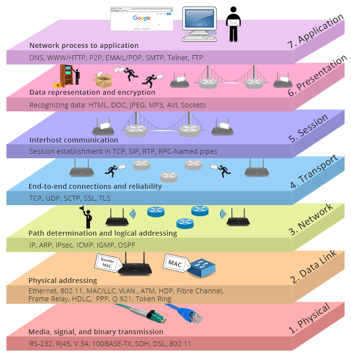
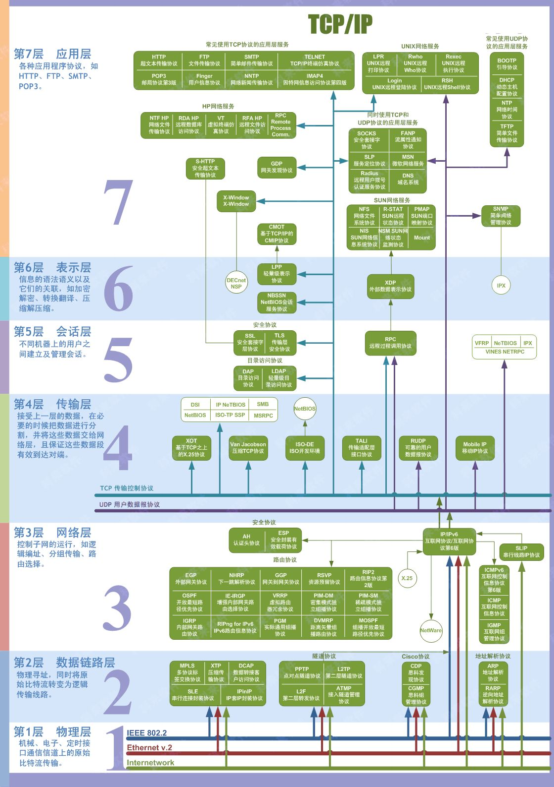
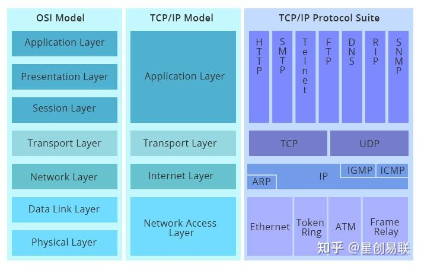
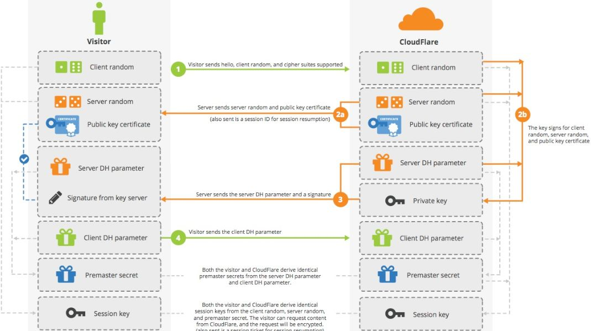

##  网络模型

### *Open System Interconnection*

-   *OSI Reference Model*：*ISO* 制定的标准化模型，表征和标准化网络通信中涉及的软硬件分工、交互方式
    -   *Application Layer* 应用层：与软件交互、按需提供通信功能
        -   定义终端应用协议
    -   *Presentaion Layer* 表示层：检查数据确保兼容通信资源
        -   转换数据格式
        -   加解密数据
        -   压缩数据
    -   *Session Layer* 会话层：建立、管理、维护、终止应用间连接
        -   验证身份、验证数据送达
    -   *Transport Layer* 传输层：通过一个或多个网络在主机间传递数据序列
        -   保持服务质量确保数据交付
        -   流量控制
    -   *Network Layer* 网络层：通过逻辑寻址、交换处理数据包路由
        -   根据报文内容、目标地址确定传递路由
        -   在某节点拆分报文、分别发送报文段、其他节点重组报文
    -   *Data Link Layer* 数据链路层：在直接相连的节点间链路间传输数据
        -   打包、解包数据帧
        -   定义物理连接的设备间建立连接、终止连接的协议
        -   可分为 *LLC*、*MAC* 两个子层
            -   *Logical Line Control* 逻辑链路控制层：识别、封装网络层协议，控制错误检查、帧同步
            -   *Media Access Control* 媒体访问控制层：控制网络设备媒体访问权限、数据传输权限
    -   *Physical Layer* 物理层：定义数据连接的电气、物理规范
        -   在物理介质中传输、接受非结构化原始数据
        -   控制比特率

> - 网络：包含多个节点的媒介，其中每个节点有地址

### *TCP/IP* 模型

-   *TCP/IP* 模型
    -   *Application Layer* 应用层：提供访问其他层的能力，定义应用间数据交换协议
        -   *DNS*
        -   *FTP*
        -   *HTTP*
        -   *IMAP*
        -   *POP*
        -   *SMTP*
        -   *SNMP*
        -   *Telnet*
    -   *Transport Layer* 传输层：为应用层提供会话、数据通信服务
        -   *TCP* 协议：提供一对一、面向连接、可靠的通信服务
        -   *UDP* 协议：提供一对一或一对多、无连接、不可靠的通信服务
    -   *Internet Layer* 互联网层：负责主机寻址、打包、路由
        -   *IP*：负责 *IP* 寻址、路由、数据包分段和重组
        -   *ARP*：负责发现网络访问层地址
        -   *ICMP*：负责提供诊断功能、报告数据包传送失败错误
        -   *IGMP*：负责 *IP* 组播组的管理
    -   *Network Access Layer* 网络接入层：发送、接收 *TCP/IP* 数据包
        -   被设计独立于特定网络记录，可用于连接不同类型网络

### *OSIRM*、*TCP/IP* 说明

-   *OSIRM* 是通用的、协议独立的，而 *TCP/IP* 是基本 *Internet* 开发的标准协议
-   *TCP/IP* 是先有实现（为解决特定问题）再有模型，可视为 *OSIRM* （概念模型）的简化实现
    -   *TCP/IP* 应用层类似 *OSIRM* 中应用层、表示层、会话层组合
    -   *TCP/IP* 传输层包含 *OSIRM* 传输层、会话层部分职责
    -   *TCP/IP* 网络访问层包含 *OSIRM* 数据链路层、物理层
        -   但数据链路层中排序、确认职责由 *TCP/IP* 传输层负责

> - <https://zhuanlan.zhihu.com/p/441680495>
> - <https://zhuanlan.zhihu.com/p/370618261>
> - <https://zhuanlan.zhihu.com/p/469082755>

###   网络设备硬件

> - 以下划分仅从逻辑上划分，高层设备可物理上兼并底层设备功能，身兼多职

-   物理层
    -   *RP repeater* 中继器：连接网络线路的装置，信号放大器
        -   最简单的网络互联设备
        -   主要完成物理层功能
            -   双向转发两个网络节点的物理信号
            -   在物理层上按位传递信息
            -   完成信号的复制、调整、放大
            -   延长网络的长度
    -   *Hub* 集线器：多口中继器
        -   局域网中的星形连接点
        -   实现多台机器之间的互联
            -   基本功能是分发，把一个端口接收到所有信号向所有端口分发
            -   有些在分发前将弱信号重新生成
            -   有些会整理信号的时序以提供所有的端口间的同步数据通信
-   数据链路层
    -   *Bridge* 网桥/桥接器：连接两个局域网的存储转发设备
        -   工作在数据链路层
        -   用于完成具有相同、相似体系结构、数量不多 *LAN* 的连接
            -   根据 *MAC* 地址转发帧
                -   对所接收的信息帧只作少量包装，不做任何修改
                -   可以采用另外一种协议转发信息
                -   网桥有足够大的缓冲空间，以满足高峰期要求
                -   具有寻址、路径选择能力
            -   有效的连接两个 *LAN*
                -   限制本地通信在本网段内
                -   转发相应信号至另一网段
    -   *Switch* 二层交换机：采用交换技术增加数据输入输出总和、安装介质的带宽
        -   可以理解为高级的网桥，拥有网桥的功能，性能比网桥强
        -   交换机转发延迟很小，能经济把网络分成小的冲突网域
-   网络层
    -   *Router* 路由器：网络层上的连接
        -   路由器在网络上处于关键地位
            -   路由器能够跨越不同的网络类型
            -   在逻辑上将整个互联网分割成独立的网络单位
        -   为每个数据帧寻找最佳传输路径，把数据（*IP* 报文）传送到正确的网络
            -   *IP* 数据报的转发，包括数据报的寻址、传送
            -   子网隔离，抑制广播风暴
            -   维护路由表，与其他路由器交换路由信息，这是*IP*报文转发基础
            -   *IP* 数据报的差错处理、简单的拥塞控制
            -   对 *IP* 数据报的过滤、记账
    -   *Gateway* 网关：协议转换器，网络层上具有协议转换功能的设施
        -   网关不一定是一台设备，可能在一台主机中实现网关功能
        -   用于一下场合的异构网络互联
            -   异构型局域网
            -   局域网与广域网的互联
            -   广域网与广域网的互联
            -   局域网与主机相连（主机操作系统、网络操作系统不同时）
        -   网关分类
            -   协议网关：在使用不同协议的网络区域间做协议转换
            -   应用网关：在使用不同数据格式的网络区域间翻译数据
            -   安全网关：各种技术的融合，有重要且独特的保护作用，处理范围从协议级过滤到应用级过滤

##  *Secure Shell*

-   *SSH* 安全外壳协议：创建在应用层、传输层上的安全协议，为 Shell 提供安全的传输、使用环境
    -   *SSH* 使用标准客户端-服务器模型
        -   标准端口是 22
        -   服务器端需要开启 `sshd` 守护进程接受连接
    -   *SSH* 是目前较为可靠，专为远程登录会话和其他网络服务提供安全性的协议
        -   防止远程管理过程中的信息泄露
        -   可以压缩数据，加快传输速度
    -   *SSH* 协议工作流程
        -   连接建立：客户端向服务器端发起 *TCP* 连接，三次握手
        -   协议协商：双方互发支持的 *SSH* 版本信息，选择较小版本
        -   算法协商：双方互发支持的算法列表，确定使用的算法
        -   密钥交换：利用协商好的密钥交换算法生成、交换数据加解密密钥
        -   用户认证
            -   密码认证：通过前述加密通道传输
            -   公钥认证：需要提前将客户端公钥存储至 `authorized_keys` 文件中
        -   服务请求：客户端向服务器端发起请求，请求服务器提供某种应用
            -   客户端发送 `SSH_MSG_CHANNEL_OPEN`，请求与服务器建立会话通道，即 session
            -   服务器端收到消息后，若支持该通道类型，则回复 `SSH_MSG_CHANNEL_OPEN_CONFIRMATION`，建立会话通道
            -   会话通道建立后，客户端可以申请 shell、subsystem 类型的会话，对应 *SSH*、*SFTP* 类型的服务
        -   数据传输、连接关闭

> - *openSHH* 是最广泛应用的 *SSH* 实现

##  *Transport Layer Security*、*Secure Sockets Layer*

-   *TLS*、*SSL*：为网络通信提供安全、数据完整性保障的安全协议
    -   *TLS* 协议工作流程
        -   客户端发送 *ClientHello*，包含协议版本、加密算法、*Client Random* 到服务器端
        -   服务器端返回 *ServerHello*，包含公钥、证书、*Server Random*
        -   客户端使用 *CA* 证书验证服务器返回证书无误后，生成 *Premaster Secret*
            -   *Premaster Secret* 用公钥加密后发送给服务器端
            -   结合 *Client Random*、*Server Random*、*Premaster Secret* 生成对称密钥
        -   服务器端用私钥解密得到 *Premaster Secret*
            -   结合 *Client Random*、*Server Random*、*Premaster Secret* 生成对称密钥
            -   用对称密钥加密
    -   说明
        -   *SSL* 是 *TSL* 前身，但现在很多场合仍然使用 *SSL* 代指 *TLS*
        -   *HTTPS* 协议中 *S: Secure* 即使用 *SSL/TLS* 加密数据包

##  *Certificate*、*Certificate Authority*

-   *CA* 数字证书认证机构：负责发放、管理数字证书的权威机构，承担公钥体系中公钥合法性检验责任的受信任第三方
    -   *CA* 本质就是两对（非对称）密钥，分别负责（私钥）签发用户证书、服务器证书
        -   任何个体都可以作为自签证书的 *CA*，但不权威、不被信任
        -   理论上可以用一对密钥同时签发，但是实操中不灵活、不安全
    -   客户端将信任的 *CA* 的根证书（公钥）存储在本地
        -   根证书是 *CA* 自己的证书，是证书链的开头
        -   根证书没有机构为其签名，都是自签名证书
        -   *CA* 会通过 *intermediate-certificate* 替代根证书签名，保证根证书私钥绝对不可访问

-   证书包含信息
    -   明文信息：现实中，真正 *CA* 需要通过线上、线下渠道验证信息真实性
        -   申请者公钥
        -   申请者组织信息、个人信息
        -   *CA* 信息
        -   有效时间
        -   证书序列号
    -   密文签名
        -   计算上述公开信息摘要
        -   *CA* 私钥加密信息摘要得到密文即为签名

-   数字证书认证机构、证书验证流程
    -   证书信任链
        -   客户端得到服务器端返回的证书，读取得到服务器端证书发布机构
        -   客户端查找发布机构证书，非根证书就递归直到获取根证书
        -   回溯解密证书合法性
    -   证书验证流程
        -   客户端 C 向服务器端 S 发送请求，S 返回证书文件
        -   客户端 C 读取证书明文信息
            -   采用相同的摘要函数计算信息摘要
            -   利用 *CA* 公钥解密签名数据，与摘要函数结果对比，一致则可确认证书合法性
        -   客户端 C 验证明文信息是否与预期符合

