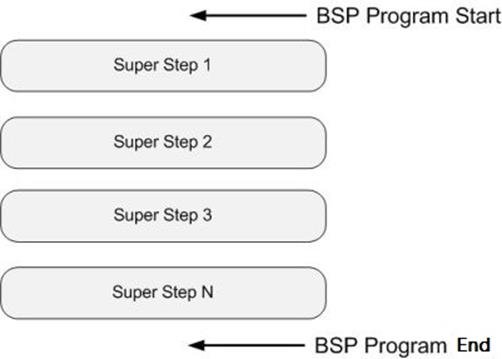
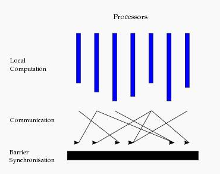
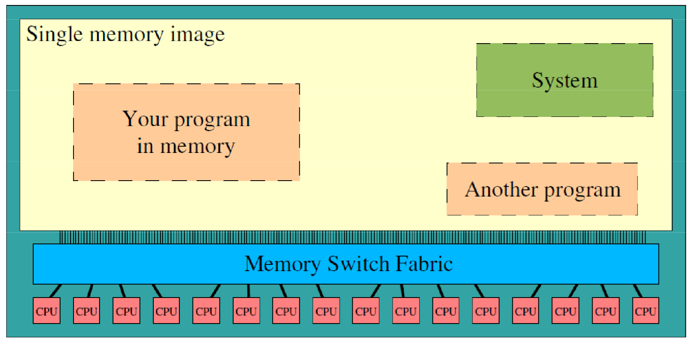
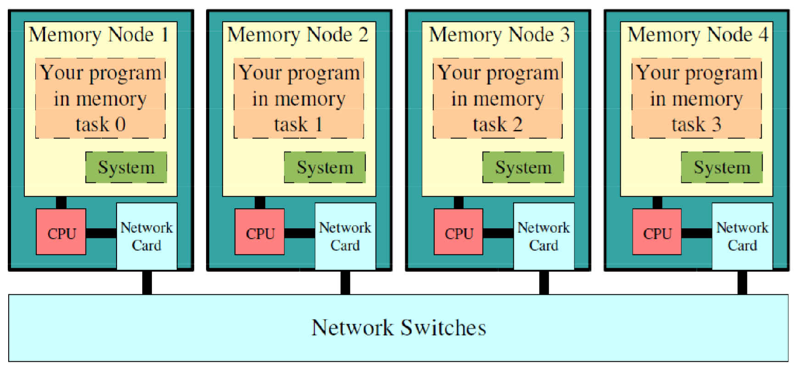
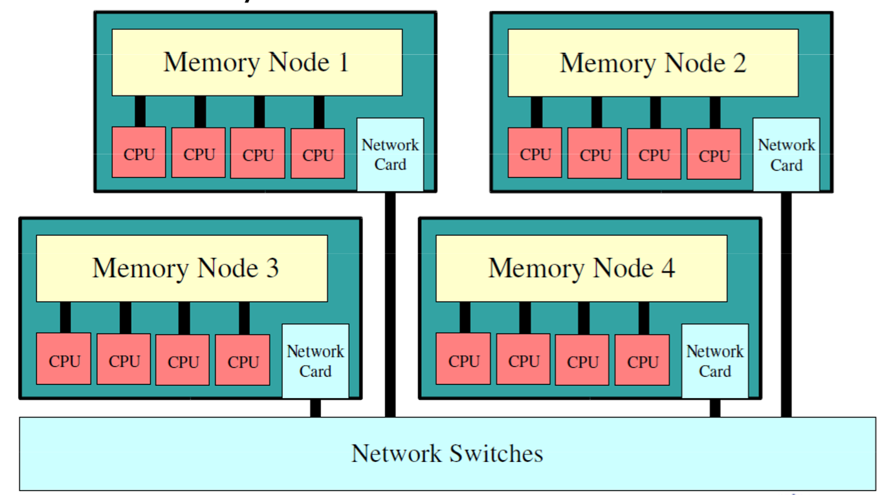

##  并行计算模型

### *Parallel Random Access Machine*

-   *PRAM* 随机存取并行机器模型：也称共享存储的 *SIMD* 模型，从串行的 *RAM* 模型直接发展起来
    -   模型假定
        -   容量无限大的共享存储器
        -   有限个或无限个功能相同的处理器，具有简单的算术运算和逻辑判断功能
        -   任何时刻各处理器都可以通过共享存储单元相互交互数据
    -   根据处理器对共享存储单元同时读、同时写的限制，*PRAM* 模型可细分
        -   *PRAM Exclusive-Read and Exclusive-Write*：不允许同时读、写
        -   *PRAM Concurrent-Read and Exclusive-Write*：允许同时读、不允许同时写
        -   *PRAM Concurrent-Read and Concurrent-Write*：允许同时读和同时写，进一步按写入限制
            -   *Common PRAM-CRCW*：只允许所有的处理器同时写相同的数
            -   *Priority PRAM-CRCW*：只允许最优先的处理器先写
            -   *Aribitrary PRAM-CRCW*：允许任意处理器自由写
            -   *Sum PRAM-CRCW*：往存储器中写的实际内容是所有处理器写的数的和
    -   优点
        -   适合于并行算法的表达、分析和比较
        -   使用简单，很多关于并行计算机的底层细节，比如处理器间通信、存储系统管理和进程同步都被隐含在模型中
        -   易于设计算法和稍加修改便可以运行在不同的并行计算机系统上
    -   缺点
        -   模型中使用了全局、单一共享存储器、局存容量较小
            -   不足以描述分布主存多处理机的性能瓶颈
            -   共享单一存储器的假定，不适合分布存储结构的MIMD机器
        -   *PRAM* 模型是同步的
            -   意味着所有的指令都按照锁步的方式操作
            -   耗时长、不能反映现实中很多系统的异步性；
        -   假设不现实
            -   模型假设每个处理器可在单位时间访问共享存储器的任一单元，要求处理机间通信无延迟、无限带宽和无开销，忽略资源竞争和有限带宽
            -   假设处理机有限或无限，对并行任务的增大无开销

### *Bulk Synchronous Parallel*

-   *BSP* 模型：异步 *MIMD-DM*（Distributed Memory）模型
    -   *BSP* 模型支持消息传递系统，块内异步并行，块间显式同步
    -   模型基于一个 master 协调，所有 worker 同步(lock-step)执行，数据从输入的队列中读取 

####    模型描述

-   模型可以用 `p`/`s`/`g`/`i` 4个参数进行描述
    -   `p`：处理器的数目(带有存储器)。
    -   `s`：处理器的计算速度。
    -   `g`：选路器吞吐率 `time_steps / packet`
        -   `time_steps`：每秒本地完成的局部计算数目
        -   `packet`：通信网络每秒传送的数据量
    -   `i`：全局同步时间开销 *Barrier Synchronization Time*

####    模型结构

-   *BSP* 程序同时具有水平和垂直两个方面的结构
    -   垂直上：*BSP* 程序由一系列串行的 *superstep* 超步组成
    -   从水平上看：在一个超步中，所有的进程并行执行局部计算
    -   超步可分为三个阶段
        -   本地计算阶段：每个处理器只对存储本地内存中的数据进行本地计算
        -   全局通信阶段：对任何非本地数据进行操作
        -   栅栏同步阶段：等待所有通信行为的结束

####    特点

-   模型特点
    -   模型将计算划分为一个一个的超步，避免死锁
    -   处理器和路由器分开，强调了计算任务和通信任务的分开
        -   路由器仅仅完成点到点的消息传递，不提供组合、复制和广播等功能
        -   掩盖具体的互连网络拓扑、简化了通信协议
    -   *BSP* 模型中若计算和通信可以合适的平衡（例如 `g=1`），则可编程性较一般 *MIMD-DM* 较好
    -   采用障碍同步的方式以硬件实现的全局同步是在可控的粗粒度级，从而提供了执行紧耦合同步式并行算法的有效方式，而程序员并无过分的负担
-   模型缺点
    -   模型中，在超级步开始发送的消息，即使网络延迟时间比超级步长度短，该消息也只能在下一个超级步才能被使用
    -   全局障碍同步假定是用特殊的硬件支持的，但很多并行机中可能没有相应的硬件
-   其他
    -   *BSP* 模型起到为软件和硬件之间架起一座类似于冯·诺伊曼机的桥梁的作业，因此BSP模型也常叫做桥模型
    -   *BSP* 模型上曾直接实现了一些重要的算法（如矩阵乘、并行前序运算、FFT和排序等），均避免自动存储管理的额外开销
    -   为 *PRAM* 模型所设计的算法，都可以采用在每个 *BSP* 处理器上模拟一些 *PRAM* 处理器的方法来实现。

### LogP模型

-   *LogP* 模型：分布存储、点到点的多处理机模型

####    模型描述

-   *LogP* 模型通信网络由 4 个主要参数描述
    -   `L` Latency：源处理机与目的处理机进行消息通信所需要的等待或延迟时间的上限，表示网络中消息的延迟
    -   `O` Overhead：处理机准备发送或接收每个消息的时间开销
        -   包括操作系统核心开销和网络软件开销
        -   在这段时间里处理不能执行其它操作
    -   `G` Gap：处理机连续两次发送或接收消息时的最小时间间隔，其倒数即微处理机的通信带宽
    -   `P` Processor：处理机/存储器模块个数

> - 以处理器周期为时间单位，`L`、`O`、`G` 可以表示成处理器周期整数倍

####    特点

-   模型特点
    -   抓住了网络与处理机之间的性能瓶颈：带宽
        -   `g` 反映了通信带宽，单位时间内最多有 `L/g` 个消息能进行处理机间传送
    -   处理机之间异步工作，并通过处理机间的消息传送来完成同步
    -   对多线程技术有一定反映。每个物理处理机可以模拟多个虚拟处理机 *Virtual Processor*
        -   某个 *VP* 有访问请求时，计算不会终止
        -   *VP* 的个数受限于通信带宽和上下文交换的开销、网络容量，至多为 `L/g`
    -   消息延迟不确定，但延迟不大于 `L`
        -   消息经历的等待时间是不可预测的
        -   但在没有阻塞的情况下，最大不超过 `L`
    -   可以预估算法的实际运行时间
-   模型不足
    -   对网络中的通信模式描述的不够深入，有些现象未描述、考虑
        -   重发消息可能占满带宽
        -   中间路由器缓存饱和等未加描述
    -   主要适用于消息传递算法设计
        -   对于共享存储模式，则简单地认为远地读操作相当于两次消息传递
        -   未考虑流水线预取技术、缓存引起的数据不一致性、缓存命中率对计算的影响
    -   未考虑多线程技术的上下文开销
    -   用点对点消息路由器进行通信，这增加了编程者考虑路由器上相关通信操作的负担

##  并行算法基本设计策略

-   设计思路
    -   串改并：发掘和利用现有串行算法中的并行性，直接将串行算法改造为并行算法
        -   最常用的设计思路但并不普适
        -   好的串行算法一般无法并行化（数值串行算法可以）
    -   全新设计：从问题本身描述出发，不考虑相应的串行算法，设计全新并行算法
    -   借用法：找出求解问题和某个已解决问题之间的联系，改造或利用已知算法应用到求解问题上
-   设计技术
    -   分治设计技术：将复杂问题划分成较小规模特性相同的子问题
        -   且子问题类型和原问题类型相同
        -   通常用递归完成分治算法
    -   平衡树设计技术
        -   以树的叶结点为输入，中间结点为处理结点
        -   由叶向根或由根向叶逐层进行并行处理
    -   倍增设计技术
        -   递归调用时，所要处理数据之间的距离逐步加倍
        -   经过 k 步后即可完成距离为 $2^k$ 的所有数据的计算
    -   流水线技术
        -   将算法路程分成 `p` 个前后衔接的任务片段，一个任务片段完成后，其后继任务片段可以立即开始
        -   则可以引入流水线的思想来处理多条数据

### 并行编程模型

-   根据同步方式不同，并行编程模型可分为
    -   数据并行模型：相同操作同时作用于不同数据
    -   共享变量模型：用共享变量实现并行进程间通信
    -   消息传递模型：驻留在不同节点上的进程通过网络传递消息相互通信，实现进程之间信息交换、协调步伐、控制执行等

| 特征         | 数据并行            | 共享变量     | 消息传递           |
|--------------|---------------------|--------------|--------------------|
| 代表         | *HPF*               | *OpenMP*     | *MPI*、*PVM*       |
| 可移植性     | *SMP*、*DSM*、*MPP* | *SMP*、*DSM* | 所有流行并行计算机 |
| 并行力度     | 进程级细粒度        | 线程级细粒度 | 进程级粗粒度       |
| 并行操作方式 | 松散同步            | 异步         | 异步               |
| 数据存储     | 共享存储            | 共享存储     | 分布式存储         |
| 数据分配方式 | 半隐式              | 隐式         | 显示               |
| 难度         | 较简单              | 简单         | 难                 |
| 可扩展性     | 一般                | 较差         | 好                 |

### 并行计算机体系架构

####    *Shared Memory*

####    *Distributed Memory*

####    *Hybrid*

