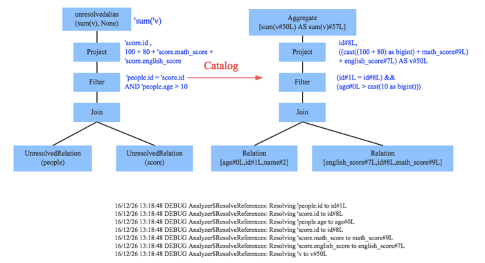
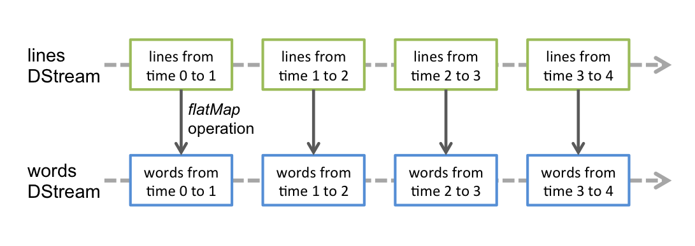

##  Spark特性

-   *Spark* 特点
    -   数据处理速度快：得益于 Spark 的内存处理技术、*DAG* 执行引擎
    -   内存计算：尽量把数据（中间结果等）驻留在内存中，必要时才写入磁盘，避免 I/O 操作，提高处理效率
        -   支持数保存部分在内存、部分在磁盘
    -   *DAG* 执行引擎
        -   执行任务前，根据任务之间依赖关系生成 *DAG* 图，优化数据处理流程（减少任务数量）、减少 I/O 操作
        -   除了简单的 *Map*、*Reduce*，Spark 提供了超过 80 个数据处理的处理原语
        -   对于数据查询操作，Spark 采用延迟评估方式执行，帮助优化器对整个数据处力工作流进行优化
    -   易用性、API支持：支持各种编程语言，提供了简洁、一致的编程接口
        -   Spark 使用 Scala 编写，经过编译后在 JVM 上运行
    -   通用性：支持以 *DAG* 形式表达的复杂数据处理流程，对数据进行复杂处理操作
        -   Spark 生态圈 *DBAS* 包含组件，支持批处理、流数据处理、图数据处理、机器学习
    -   兼容性
        -   *Data Storage*
            -   一般使用 HDFS、Amazon S3 等分布式系统存储数据
            -   支持 Hive、Hbase、Cassandra 等数据源
            -   支持 Flume、Kafka、Twitter 等流式数据
        -   *Resource Management*
            -   能以 YARN、Mesos 等分布式资源管理框架为资源管理器
            -   也可以使用自身资源的管理器以 *Standalone Mode* 独立运行
        -   使用支持
            -   可以使用 Shell 程序，交互式的对数据进行查询
            -   支持流处理、批处理
        -   数据类型、计算表达能力
            -   Spark 可以管理各种类型的数据集：文本

### 核心组件

> - *Spark Streaming*、*Spark SQL*、*Spark GraphX*、*Spark MLLib* 为 *BDAS* 所包含的组件

-   *Spark Streaming*：提供对实时数据流高吞吐、高容错、可扩展的流式处理系统
    -   采用 Micro Batch 数据处理方式，实现更细粒度资源分配，实现动态负载均衡
    -   可以对多种数据源（Kafka、Flume、Twitter、ZeroMQ），进行包括 *Map*、*Reduce*、*Join* 等复杂操作
-   *Spark SQL*：结构化数据查询模块
    -   通过 JDBC API 暴露 Spark 数据集，让客户程序可以在其上直接执行 SQL 查询
    -   可以连接传统的 BI、可视化工具至数据集
-   *Spark GraphX*：图数据的并行处理模块
    -   扩展 *RDD* 为*Resilient Distributed Property Graph*，将属性赋予各个节点、边的有向图
    -   支持对图数据进行 *ExploratoryAnalysis*、*Iterative Graph Computation*
    -	提供包括子图、顶点连接、信息聚合等操作在内的基础原语，用于简化图形分析任务
        -	提供了一系列操作
            -	*Sub Graph*：子图
            -	*Join Vertices*：顶点连接
            -	*Aggregate Message*：消息聚集
            -	*Pregel API* 变种
        -	经典图处理算法
            -	*PageRank*
-   *Spark MLLib*：可扩展的机器学习模块
    -   大数据平台使得在全量数据上进行学习成为可能
    -   实现包括分类、回归、聚类、关联过滤、降维等算法
-   *BlinkDB*：近似查询处理引擎
    -   可以在大规模数据集上，交互式执行 SQL 查询
    -   允许用户在查询精度、响应时间之间做出折中
    -   *BlinkDB* 给出近似结果同时给出、*Error Bar* 标签，帮助决策
-   *Tachyon*：基于内存的分布式文件系统
    -   支持不同处理框架
        -   可在不同计算框架之间实现可靠的文件共享
        -   支持不同的上层查询处理框架，可以以极高的速度对集群内存中的文件进行访问
    -   将 *workset* 文件缓存在内存中，避免对磁盘的存取

###  Spark 实体


-   Spark 实体
    -   *Driver*：执行应用主函数、创建 *Spark Context* 的节点
    -   *Cluster Manager*：为每个 *Driver* 中的应用分配资源
    -   *Worker*：数据处理的节点

##  Spark 编程模型

```scala
val warehouseLocation = "file:${system:user.dir}/spark-warehouse"
val spark = SparkSession
    .builder()
    .appName("App")
    .config("spark.sql.warehouse.dir", warehouseLocation)
    .enableHiveSupport()
    .getOrCreate()
spark.conf.set("spark.executor.memory", "2g")
```

-   `SparkSession`：Spark2.0 中新入口，封装有 `SparkContext`、`SQLContext`、`HiveContext`
    -   `SparkContext`：Spark 应用程序执行的入口、封装 Spark 应用执行环境
        -   负责和 *Cluster Manager* 的交互、协调应用
            -   所有的 Spark 应用作为独立进程运行，由各自的 *SparkContext* 协调
            -   *SparkContext* 向 *ClusterManager* 申请在集群中 *Worker* 创建 *Executor* 执行应用
        -   *Executor*：在 *Worker* 节点上执行任务的工作进程
            -   任务有独立的 *Executor*，负责初始化执行环境、向 *ClusterManager* 汇报任务状态
    -   `SQLContext`：SparkSQL 入口
    -   `HiveContext`：Spark 通往 Hive 的入口
    -   `StreamingContext`：SparkStreaming 入口

### 共享变量

-   *Share Variable* 共享变量：在节点间共享的值、数据集
    -   *Broadcast Variable* 广播变量 `sc.broadcast`：缓存在各个节点上，不随着计算任务调度的发送变量拷贝
        -   可以避免大量的数据移动
    -   *Accumulator* 收集变量/累加器 `sc.accumulator`：用于实现计数器、计算总和
        -   各任务可以执行增加操作，但仅 *Driver Program* 客户程序可读取
        -   累加符合结合律，所以集群对收集变量的累加没有顺序要求，能够高效应用于并行环境
        -   Spark 原生支持数值类型累加器，可以自定义类型累加器

### 数据源

|数据源|描述|说明|
|-----|-----|-----|
|`sc.textFile(?fileName:String,?slices:Int): RDD[String]`|文本文件| |
|`sc.wholeTextFile(?directoryName: String): Map[String, RDD[String]]`|目录| |
|`sc.SequenceFiles(fileName: String)`|满足文件| |

> - `slices`：切片数目，缺省为每个文件块创建切片，不能设置小于文件块数目的切片值

-   Spark基于文件的方法，原生支持
    -   文件目录
    -   压缩文件：`gz`
    -   简单通配符
        |通配符|含义|
        |-----|-----|
        |`[]`：范围|
        |`[^]`|范围补集|
        |`?`|单个字符|
        |`*`|0、多个字符|
        |`{}`|**整体或选择**|

###	Directed Asycled Graph


-   Spark 同样使用 *DAG* 表示计算流程、维护 `RDD` 之间依赖关系
    -	窄依赖：每个父 `RDD` 最多被一个子 `RDD` 分区使用
        -	即，父 `RDD` 分区经过转换操作进入子 `RDD` 同一分区
        -	窄依赖可单节点完成，无需 *Data Shuffling* 在网络上进行数据传输
    -	宽依赖：多个子 `RDD` 分区依赖同一个父 `RDD` 分区
        -	即，父 `RDD` 分区经过转换操作进入子 `RDD` 不同分区
        -	宽依赖一般涉及 *Data Shuffling*，无法单节点完成
        -	涉及宽依赖操作
            -	`groupByKey`
            -	`reduceByKey`
            -	`sortByKey`
    -   窄依赖可以在单节点内完成，在 *DAG* 优化中更有利
        -   节点数据丢失恢复时，重算数据利用率更高，没有冗余计算
        -   允许集群中节点以流水线方式执行运算


-   *DAG Scheduler*：*Stage-Oriented* 的 *DAG* 执行调度器
    -   *DAG Scheduler* 根据依赖类型将将 *DAG* 划分为相互依赖的 *Stage*
        -   阶段：可多节点并行的一组任务，每个任务对应一个 `RDD` 分区
        -   划分规则：从 *DAG* 起始节点开始的，遇到宽依赖即切分为 *Stage*
        -   考虑缓存、位置因素，阶段中任务以 *Task Set* 形式交由 *Task Scheduler* 执行
    -	容错处理
        -	*DAG Scheduler* 负责处理阶段间 *Shuffle* 数据丢失，重新执行前置阶段以重建数据
        -   *Task Scheduler* 处理阶段内失败

###  SparkSQL

####    *Catalyst* 优化器


-   *Catalyst* 优化器：利用 Scala 模式匹配、*quasi-quotes* 机制构建的可扩展查询优化器
    -   *Parser* 解析器：将 *SQL* 语句切分为 token，根据一定语义规则解析为 *AST*
        -   Spark2.x 中开始采用第三方语法解析器工具 *ANTLR4*
        
    -   *Analyzer* 分析器：借助数据元数据将 *Unresolved Logical Plan* 解析为 *Logical Plan*
        -   根据元数据确定 *ULP* 中 token 含义
        -   为 *AST* 中节点绑定数据类型、函数
        
    -   *Optimizer* 优化器：使用查询优化技术对生成 *Optimized Logical Plan*
    -   *Planner* 计划器：将 *OLP* 转换为 Spark 能执行执行的 *Physical Plan*
        -	物理计划实际上是逻辑计划中耗时最小的算法实现
        

###  Spark Streaming

-   `StreamingContext` *Spark Streaming*：提供对实时数据流高吞吐、高容错、可扩展的流式处理系统
    -   可以对多种数据源（Kafka、Flume、Twitter、ZeroMQ），进行包括 *Map*、*Reduce*、*Join* 等复杂操作
    -   采用 *Micro Batch* 数据处理方式，实现更细粒度资源分配，实现动态负载均衡
        -   离散化数据流为为小的 *RDDs* 得到 `DStream` 交由 Spark 引擎处理
        -   数据存储在内存实现数据流处理、批处理、交互式一体化
        -   故障节点任务将均匀分散至集群中，实现更快的故障恢复

```scala
import org.apache.spark.streaming.StreamingContext
class StreamingContext(?conf: SparkConf, ?slices: Int){
    // 开始接受、处理流式数据
    def start()
    // 结束流式处理过程
    def stop(?stop_spark_context=True)
    // 等待计算完成
    def awaitTermination()
}
import org.apache.spark.{SparkContext, SparkConf}
import org.apache.spark.streaming.Seconds
val conf = new SparkConf().setAppName("app name").setMaster(master)
val ssc = new StreamingContext(conf, Seconds(1))
```

##	RDD

-   `RDD` *Resilient Distributed Dataset*：容错的、不可变、分布式、确定可重复计算的数据集
    -   `RDD` 实现更通用的迭代、并行计算框架
        -	`RDD` 可分配在集群中的多个节点中以支持并行处理
            -   `RDD` 会被分块分布至多个节点上
        -	`RDD` 是无结构的数据表，可以存放任何数据类型
        -	`RDD` 不可变，`RDD` 转换只是返回新 `RDD`（*Lineage* 容错机制要求）
    -	`RDD` 采用基于 *Lineage* 的容错机制
        -	每个 `RDD` 记住确定性操作的 *Lineage*，即从其他 `RDD` 转换而来的路径
            -	`RDD` 损坏时，Spark 可以从上游 `RDD` 重新计算、创建其数据
            -	若所有 `RDD` 的转换操作是确定的，则最终转换数据一致
        -	容错语义
            -	输入源文件：Spark 运行在 HDFS、S3 等容错文件系统上，从任何容错数据而来的 `RDD` 都是容错的
            -	接收者：可靠接收者告知可靠数据源，保证所有数据总是会被恰好处理一次
            -	输出：输出操作可能会使得数据被重复写出，但文件会被之后写入覆盖
    -   `RDD` 操作可分为三类
        -   *Transformation* 转换：从已有数据集创建新数据集
            -	返回新 *RDD*，原 *RDD* 保持不变
            -	延迟执行：先记录相关数据集，仅当动作操作被执行时，相关前置转换操作才被启动
        -   *Action* 动作：在数据集上进行计算后返回值到驱动程序
            -	施加于一个 *RDD*，通过对 *RDD* 数据集的计算返回新的结果
                -	默认每次执行动作时重新计算，可使用 `cache`、`persist` 持久化至内存、硬盘中
        -   *Manipulation* 控制

###	RDD Transformation


> - 绿色、黑色：单、多 *RDD* 窄依赖转换
> - 紫色：*KV shuffle* 转换
> - 黄色：重分区转换
> - 蓝色：特例转换

|*Transformation*|描述|说明|
|-----|-----|-----|
|`map(func)`|遍历转换| |
|`flatMap(func)`|遍历转换，并展平结果| |
|`mapPartitions(func)`|类似 `map`，但在分片上独立运行| |
|`mapPartitionsWithIndex(func)`|类似 `mapPartitions`，但在分片上独立运行| |
|`filter(func)`|过滤| |
|`union(otherDataset)`|并集| |
|`intersection(otherDataset)`|交集| |
|`groupByKey([numTasks])`|按键分块再聚集| |
|`reduceByKey(func[,numTasks])`|预聚合，按键分组再聚合| |
|`sortByKey([ascending,numTasks])`| |
|`sortBy(func[,ascending,numTasks])`| |
|`join(otherDataSet[,numTasks])`|返回 `(K,(V,W))`| |
|`cogroup(otherDataset[,numTasks])`|返回 `(K,(Seq(V),Seq(W))`| |
|`coalesce(numPartions)`|指定 `RDD` 分区数| |
|`repartition()`|重分区|
|`repartitionAndSortWithinPartitions(partitioner)`|充分区并按键排序| |
|`pipe()`| | |
|`aggregateByKey()`| | |

|*Action*|描述|说明|
|-----|-----|-----|
|`count()`|计算元素个数| |
|`countByKey()`|键计数，返回 `(K,int)`| |
|`countByValue()`|值计数，返回 `(V,int)`| |
|`collect()`|数组形式返回所有元素| |
|`reduce(func)`|逐对聚合| |
|`first()`|首个元素| |
|`take(n)`|前 `n` 个元素| |
|`takeOrdered(n[,ordering])`|排序后前 `n`| |
|`foreach(func)`|逐元素执行 `func`| |
|`foreachPartition(func)`|逐分区执行 `func`| |
|`saveAsTextFile(path)`|持久化为 textfile| |
|`saveAsSequenceFile(path)`|持久化为 sequencefile| |
|`saveAsObjectFile(prefix[,suffix])`|以 Java 序列化方式保存| |
|`saveAsHadoopFile(prefix[,suffix])`|保存为 Hadoop 文件| |
|`print`|打印（各） `RDD` 前 10 条元素|

|Output Operation|RDD|DStream|
|-----|-----|-----|
|`saveAsObjectFile(prefix[, suffix])`|保存为序列化文件|命名为`<prefix>-TIME_IN_M.<suffix>`|
|`saveAsTextFile(prefix[, suffix])`|保存为文本文件||

|*Manipulation*|描述|说明|
|-----|-----|-----|
|`cache()`|缓存算子结果在内存中|性能提升等价于 *Memory-Only*|
|`persist()`|根据 `StorageLevel` 持久化数据| |
|`checkpoint()`|检查点宕机容错|还可切断 *RDD* 依赖关系|

> - `numTasks`：默认使用Spark默认并发数目
> - Spark `RDD` 算子：<https://www.cnblogs.com/ronnieyuan/p/11768536.html>


###	DataFrame

-	`DataFrame`：类似关系型数据库中表，数据被组织到具名列中
	-	高抽象层次：相较于 `RDD` 是对分布式、结构化数据集的高层次抽象
        -   脱胎于 `sql.SchemaRDD`，在数据存储层面对数据进行结构化描述
        -	可通过特定 API 集成过程性处理、关系处理
            -   延迟执行，利于对关系操作、数据处理工作流进行深入优化
            -	结构化的 `DataFrame` 可重新转换为无结构的 `RDD` 数据集
	-	静态类型安全：相较于 SQL 查询语句，在编译时即可发现语法错误
    -	可通过不同数据来源创建 `DataFrame`
        -	`RDD` 数据集
        -	结构化数据文件
        -	JSON 数据集
        -	Hive 表格
        -	外部数据库表

-	`Dataset`：有明确类型数据、或无明确数据类型集合
	-	相较于 `DataFrame`，也可组织半结构化数据
        -   `DataFrame` 可视为无明确数据类型 `Dataset[Row]` 别名，每行是无类型 JVM 对象
        -   运行速度较慢
	-	静态类型、运行时类型安全：相较于 `DataFrame`，集合元素有明确类型，在编译时即可发现分析错误

### Discreted Stream



-   `DStream` *Discreted Stream*：代表持续性的数据流，是 *Spark Streaming* 的基础抽象
    -   `DStream` 可视为（时间上）连续的 `RDD` 流，每个 `RDD` 包含时间段内数据
        -   `DStream` 操作也是映射到内部 `RDD` 上分别进行（部分如 `transform` 等则以 `RDD` 为基本单元）
        -   `DStream` 转换操作仍然得到 `DStream`
        -   最终结果也是以批量方式生成的 batch
    -   可从外部输入源、已有 `DStream` 转换得到
    -   *Recevier*：与输入流 `DStream` 相关联处理数据
        -   作为长期任务运行，占用独立计算核，若分配核数量不够，系统将只能接收数据而不能处理
        -   *Reliable Receiver*：支持应答，数据收到、且被正确复制至 Spark
        -   *Unreliable Receiver*：不支持应答

####	DStream Window Action

|`DStream` *Window Action*|描述|
|-----|-----|
|`window(windowLength, slideInterval)`|基于DStream产生的窗口化批数据产生DStream|
|`countByWindow(windowLength, slideInterval)`|返回滑动窗口数|
|`reduceByWindow(func, windowLength, slideInterval)`||
|`reduceByKeyAndWindow(func, windowLength, slidenInterval[, numTasks])`||
|`reduceByKeyAndWindow(func, invFunc, windowLength, slideInterval[, numTasks])`|须提供`invFunc`消除离开窗口RDD对reduce结果影响|
|`countByValueAndWindow(windowLength, slideInterval[, numTasks])`||

> - `windowLength`：窗口长度
> - `slideInterval`：滑动间隔

> - 以上操作默认会持久化RDD至内存，无需手动调用`persist`等方法


####    数据流来源

|方法|描述|
|-----|-----|
|`ssc.ScoketTextStream(?host: String, ?port: Int)`|套接字连接流|
|`ssc.actorStream(actorProps: ?, actorName: String)`|*Akka* 中 *Actor* 流|
|`ssc.queueStream(queueOfRDDs: Seq[RDD])`|`RDD` 队列数据流|
|`ssc.fileStream[keyClass, valueClass, inputFormatClass](dataDirectory: String)`| |
|`ssc.textFileStream(dataDirectory)`| |
|`kafkaUtils.createStream()`|*Kafka* 事件流|

-   说明
    -   文件系统流：文件流无需运行`receiver`
        -   `StreamingContext` 将监控目标目录，处理目录下任何文件（不包括嵌套目录）
            -   文件须具有相同数据格式
            -   文件需要直接位于目标目录下
            -   已处理文件追加数据不被处理

####    性能调优

-   性能调优
    -   减少批数据处理时间
        -   创建多个 *Receiver* 接收输入流，提高数据接受并行水平
        -   提高数据处理并行水平
        -   减少输入数据序列化、*RDD* 数据序列化成本
        -   减少任务启动开支
    -   设置正确的批容量，保证系统能正常、稳定处理数据
    -   内存调优，调整内存使用、应用的垃圾回收行为

#### Checkpoint

```scala
// 设置checkpoint存储信息目录
def ssc.checkpoint(?checkpointDirectory: String)
// 从checkpoint中恢复（若目录存在）、或创建新streaming上下文
def StreamingContext.getOrCreate(?checkPointDirectory: String, ?functionToCreateContext: () => StreamingContext)
```

-   Checkpoint 足够信息到容错存储系统提供高容错，以便从程序逻辑无关错误中恢复
    -   备份信息包括
        -   *Metadata Checkpointing*：流计算的定义信息，用于恢复 *worker* 节点故障
        -   *Configuration*：Streaming 程序配置
        -   *DStream Operation*：Streaming 程序操作集合
        -   *Imcomplete Batches*：操作队列中未完成批
        -   *Data Checkpointing*：中间生成的 `RDD`，在有状态的转换操作中必须，避免 `RDD` 依赖链无限增长
    -   需要开启 Checkpoint 场合
        -   使用有状态转换操作：`updateStateByKey`、`reduceByKeyAndWindow`等
        -   从程序的 Driver 故障中恢复


