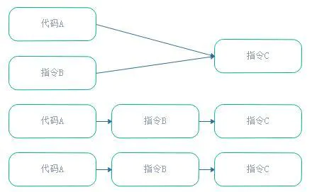
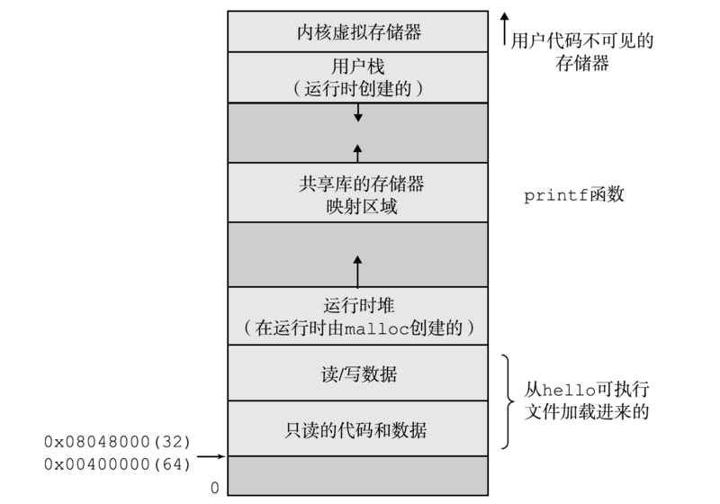
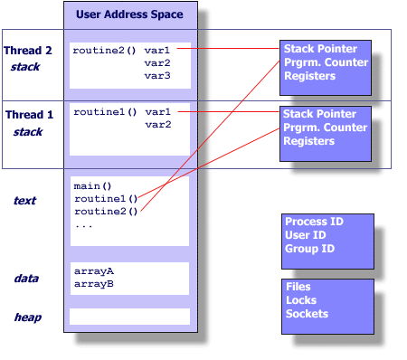

##  并发和并行

> - *Parallel*：并行，**同时做** 多件事情，侧重执行、实现
> - *Concurrent*：并发，**能够处理** 多件事情，侧重结构、逻辑

-   并行、并发分别侧重物理实现、逻辑设计
    -   并行角度：硬件技术的 **物理限制瓶颈**
        -   单计算核心能力不足，所以需要多核并行运算
        -   进程、线程可认为是实现并行的基本逻辑实体
    -   并发角度：程序执行的 **逻辑重用需求**
        -   程序要求重用一组逻辑，所以需要将一组指令集打包，重复调用该组指令集
        -   子程序、协程可认为是方便重用的基本逻辑实体，因此更应是语言内建机制
            -   子程序：无状态保存，同样重入得到同样结果
            -   协程：有保存状态，重入会改变协程状态，结果可能不同
        -   并发问题可以使用并行方式解决，也可以串行解决
            -   100 并发任务同时运行在 4 核 CPU 上，最多可能有 4 个并发任务并行处理，其余只能是串行处理

-   线程作为任务执行的实体，可以认为是子程序、协程的具体执行
    -   内核线程：作为可以独立执行的实体，逻辑上更会被设计为完成独立任务
        -   即，没有保存状态需求，因此多是子程序的具体执行
    -   用户线程：则用程序负责调度，二者执行实例均可
    -   某种意义上，线程、子程序是相对应的执行实体、逻辑实体

##  子程序、协程

-   子程序可以看作时协程的特例
    -   只有一个状态，每次进入时局部状态重置
    -   唯一入口点
-   协程可视为子程序的组成
    -   维护自身状态，所以 **逻辑上不独立** ，应该是作为被调用对象
    -   对于每次返回部分结果值的协程（也称生成器迭代器），可以直接视为类似链表之类的数据结构
        -   在某些语言中可以所有数据都是类，从这个角度这也都是统一的

| |子程序|协程|
|-----|-----|-----|
|生命周期|后进先出|完全取决于需要|
|入口点|起始处|起始处、`yield`返回出口点|
|返回值|调用结束后返回全部|可每次`yield`返回部分值|

> - 现代指令集通常提供对调用栈的指令支持，便于实现可递归
    调用的子程序，在提供续体的语言环境（如*Scheme*），恰好
    可用此抽象状态表示实现协程

### *Subroutine*/*Procedure*/*Function*/*Routine*/*Method*

-   子程序：打包为整体、用于执行特定任务的指令集序列
    -   子程序是依赖可重入能力的弱化版本
        -   一旦唤醒，于起始点开始执行
        -   一旦退出，子程序结束
        -   子程序实例只返回一次，两次激活间不保存状态
    -   子程序中局部变量在每次**调用/重入**函数时都是相同的
        -   **相同输入得到相同输出**

> - *procedure*：过程，有时特指无返回值、仅有副作用

####    线程安全

-   线程安全：子程序在多线程环境调用时，能够正确处理多个线程之间的共享变量，使程序功能能正确完成
    -   线程安全函数应该为每个调用其的线程分配专门空间，存储需要单独保存的状态
    -   *Atomicity*：原子性，操作不会被线程调度机制打断，一旦开始就会运行到结束，中间不会有任何线程切换
        -   可以通过 *lock*、*synchronized* 确保原子性
    -   *Visibility*：可见性，某线程修改变量值后，其他线程能够立刻感知
        -   一般可以通过 `volatile` 保证可见性，强制要求被修改值从寄存器同步至主存
        -   *lock*、*synchronized* 也可以通过限制其他线程访问变量的方式保证可见性
    -   *Ordering*：有序性/一致性，程序按照代码顺序执行
        -   可以通过 `volatile` 保证一定的有序性
        -   也可通过 *lock*、*synchronized* 提供单线程执行环境保证有序性

####    Instruction Reorder



-   指令重排：编译器对无相互依赖的指令重新排序执行
    -   `as-if-serial` 语义：指令可以为优化而重排序，但是必须保证最终执行结果不变
        -   规则：重排序过程不破坏数据依赖关系
        -   只能保证单线程执行结果有效，但不保证多线程并发执行的正确性
    -   `happens-before` 原则：保证前后两个操作间不会被重排序，
        -   程序次序规则：线程中每个操作 *happens-before* 该线程中任意后续操作
        -   锁定规则：锁的解锁 *happens-before* 加锁
        -   `volatile` 变量规则：`volatile` 变量写操作 *happens-before* 其读操作
        -   传递规则：若 A *happens-before* B、B *happens-before* C，则 A *happens-before* C
        -   线程启动规则：线程对象启动 *happens-before* 线程中每个动作
        -   线程中断规则：线程中断方法的调用 *happens-before* 被中断线程代码检测到的中断事件的发生
        -   线程终结规则：线程中所有操作 *happens-before* 线程的终止检测
        -   对象终结规则：对象的初始化 *happens-before* 其 *final* 方法的开始

> - *happens-before* 原则被 *JVM* 用于规定（跨线程）操作之间偏序关系，若操作之间的关系可以由此原则退出，则两个操作有序

####    *Reentrant*

-   可重入函数：对于相同（合法）的函数参数，多次重复调用（包括执行过程中被中断再重入）结果总是可预期的
    -   可重入需要满足条件
        -   不在函数内部使用静态或全局数据，所有数据都由函数调用者提供
            -   全局变量区
            -   中断向量表
        -   使用本地数据，或制作全局数据的本地拷贝保护全局数据
        -   不返回静态或全局数据
        -   不调用不可重入函数
    -   不可重入后果主要体现在信号处理函数这样需要重入情况中
        -   若在信号处理函数中使用了不可重入函数，则可能导致程序错误
    -   可重入函数总是线程安全的，反之不一定成立
        -   线程安全可以通过“并发不冲突”实现
        -   可重入则要求“并行不冲突”

> - A computer program or routine is described as reentrant if it can be safely executed concorrently; that is, the routine can be re-entered while it is already running

### *Coroutine*

-   协程：为 **非抢占式** 多任务产生子程序的程序组件，允许执行过程中挂起、恢复
    -   挂起、恢复：协程可以通过 `yield` （让步）调用其他协程暂时退出，之后可在退出位置恢复执行
        -   从协程角度看，这是调用其他协程而不是退出
        -   但实际是各协程之间是对称的，而不像子程序调用中 *主调-被调* 关系
        -   这即暗含
            -   协程可包含多个入口点
            -   允许在不同入口点暂停、开始执行程序
    -   局部状态维护：协程实例保持上次退出时状态
        -   则协程被唤醒时状态可能不同
        -   可能同时有多个给定协程实例
        -   即，协程将原在子程序外、输入状态管理工作交由自身逻辑维护

> - 原生不支持协程的语言也可以使用循环等构建
> - 经典状态机、对象已经具有协程特性

####    用途

-   协程可以简化异步代码的实现，使得需要使用 *异步+回调* 的代码可以使用看似同步方式写出
    -   协程本身只涉及 **状态保存、过程重入**，和并发/异步无关系
    -   但协程本身蕴含的状态保存使得状态切换几乎无成本，适合高并发任务
-   协程在线程中调度完全由用户控制，可以视为用户态轻量级线程
    -   避免陷入 **无效内核级别上下文切换** 造成的性能损失
    -   较线程在 *IO* 密集任务上性能上更好

##  进程、线程

> - 这里仅讨论理论上的异同，不考虑各平台具体实现

| |Process|Thread|Coroutine|
|-----|-----|-----|-----|
|调度、创建、切换、维护|内核（系统）|内核、自身|自身|
|切换开销、速度|大、慢|小、快|无|
|易用性|需要考虑进程退出、僵尸进程|只需要管理进程即可|无需管理|
|资源共享|独立|同进程内线程共享资源|除局部变量外均共享|
|通信|IPC较复杂：环境变量、文件、系统端口|较简单：共享内存|结果调用|
|移植性|差|好|好|
|健壮性|好，进程死亡不影响其他进程|差，线程死亡会导致进程（及线程）死亡|

-   进程、线程、协程可以看作是控制权（资源、调度）逐渐从系统已经移交到自身的过程
    -   进程：具有独立功能的程序关于某数据集合的一次运行活动
    -   线程/子程序：进程内某特定任务的执行活动
    -   协程：推广的、协作式、多任务的子程序

> - 移植性：基于进程分支多进程和windows模型有很大冲突，往往不能在windows平台上使用

### *Process*

-   进程：具有独立功能的程序关于某数据集合的一次运行活动
    -   进程是处于运行期的程序和相关资源的总称
        -   程序：代码、指令
        -   运行：对 CPU 的占用，逐渐发展为线程，标识进程中指令的执行
        -   资源：执行上下文，由进程内线程共享
    -   从系统调度方面看
        -   进程是系统进行 **资源分配、调度的独立单位**
        -   在系统中有进程控制块（进程描述符）描述进程相关信息，系统通过此控制块控制系统相关行为
    -   从资源分配方面看
        -   有独立的存储空间（虚拟寻址空间）
            -   独享的用户空间
            -   进程专用的“共享内核空间”
        -   可执行的程序代码

> - 线程可能对系统是可感知的，则进程不定是资源分配的基本单位
> - Linux 线程实现即类似进程，但不包含独立存储空间

####    调度角度

-   从调度角度
    -   内核跟踪进程运行所需的状态信息（上下文）
        -   主存、虚拟内存内容
        -   寄存器文件值
        -   栈
        -   文件句柄
    -   调度：分配 CPU 执行进程
        -   内核决定 CPU 控制权在进程间的转移
    -   上下文切换：进程状态的记录、恢复、切换
        -   保存当前进程上下文、恢复新进程上下文
        -   通过处理器在进程间切换，实现单个 CPU 逻辑并发、实际串行执行多个进程
        -   上下文进程间切换开销比较大，但相对比较稳定安全

####    资源角度

> - 独立内存空间/虚拟地址空间：每个进程**“独占的”**使用
    内存、看到一致的存储器



-   用户空间
    -   程序代码、数据：对所有进程，代码从同一固定位置开始，
        直接按照可执行目标文件的内容初始化
    -   （运行时）堆：可在运行时动态扩展、收缩
    -   共享库：共享库代码和数据，如：C标准库、数学库
    -   栈：用于实现函数调用，运行时动态扩展、收缩，位于虚拟
        地址空间顶部

-   内核空间
    -   内核虚拟存储器：内核总是驻留在内存中，为其保留地址
        空间顶部
    -   不允许程序读写区域内容或直接调用内核代码定义的函数

### *Thread*

-   线程：进程执行实体，进程中包含指令的执行活动

####    调度角度

> - 线程是CPU调度、分派的基本单位，有时被称为轻量级进程
    （在Linux系统中也是按照轻量级进程实现）

-   线程引入逻辑
    -   进程内部可能存在多个不同 task，task 需要共享进程数据
    -   同时 task 操作的数据具有独立性，多个 task 不需要按照时序执行
    -   task 间需根据不同策略进行调度，因此产生了线程概念，并被引入作为内核调度基本单位

-   线程：比进程更小的、能独立运行的基本单位
    -   线程能/是“独立运行”，但不一定能被内核感知到，也一定由内核调度
    -   只能说线程是针对某个 task 的执行活动

####    资源角度



-   线程运行在进程的上下文中，共享同样代码和全局数据
    -   进程代码段、公有数据
    -   进程打开的文件描述符、信号的处理器
    -   进程当前目录
    -   进程用户ID、进程组ID

-   线程还独享某些个性以实现并发性
    -   线程ID：进程中唯一标识
    -   寄存器组值：线程间并发运行，线程有不同运行线索，切换时需要保存当前线程的寄存器集合状态
    -   线程堆栈：独立函数堆栈保证线程内函数调用可以正常执行，不受其他线程影响
    -   错误返回码：线程的系统调用错误可能未及时处理，独立 错误返回码避免其被其他线程修改
    -   线程的信号屏蔽码：线程感兴趣的信号不同，因此信号屏蔽码应由自己管理
    -   线程优先级：线程需要像进程被调度，需要有相应的优先级

##  线程实现理论

### *User-Level Thread*

-   用户级线程：由用户程序自身负责支持、调度
    -   相当于实现自己的线程调度内核，实现线程数据结构、创建、销毁、调度维护
        -   即使内核不支持线程，也可通过库函数支持在系统中实现真实的多线程
        -   用户级线程调度只在用户态进行，减少内核态、用户态切换开销
            -   适合大规模用户线程并发
    -   用户线程运行在内核（可感知的）进程内，对内核透明
        -   内核仅负责进程调度，当线程进行系统调用而阻塞时，系统会阻塞整个进程
        -   用户空间没有时钟中断机制，若线程长时间不释放 CPU，会导致阻塞（进程中）其他线程

### *Kernel-Level Thread*

-   内核级线程：系统内核支持的线程，通过内核完成线程切换
    -   系统负责线程的创建、销毁、调度、维护
        -   内核通过操纵调度器对线程进行调度，并负责将线程的任务映射到各个处理器上
        -   程序可以直接使用系统调用已实现线程，无需实现线程调度、对 CPU 资源抢占使用
        -   降低整个进程被完全阻塞的风险
    -   内核线程需要内核支持
        -   创建、销毁、调度、维护往往都需要系统调用，代价较高
        -   需要消耗内核资源，不能大量创建
    -   **内核级线程作为用户线程在内核中调度、执行的桥梁**
        -   某种意义上，用户线程可视为逻辑任务、内核级线程为执行实体
        -   用户线程总需要和内核级线程关联（系统调用）才可被调度、执行

> - 内核级线程亦被称为 *Light Weighted Process*，源自 Linux 线程模型实现类似轻量级进程

##  通用调度算法

-   调度算法考虑要点
    -   从任务角度，调度需要考虑
        -   *Responsiveness*
        -   *Schedule Overload*
        -   *Starvation-Freedom*：饥饿避免
        -   *Fairness*
    -   内核调度除考虑任务（线程）外，还会考虑进程因素
        -   *Gang Scheduling*：尽量将同进程中线程同时调度，而非随机从多个进程中挑选 CPU 数量线程调度
        -   *Space Sharing*：将 CPU 划分，各进程仅允许占用部分 CPU 执行并发
    -   耗时相差不大的任务队列相对容易处理，而任务情况复杂时难以处理
        -   耗时相差大
        -   IO 任务、计算任务混合

### 朴素方法

-   *First-In-First-Out* 先进先出：按任务在队列中的顺序依次调用，仅在任务结束后才会切换
    -   优点
        -   最少任务切换开销
        -   最大吞吐量（总处理效率）
        -   朴实公平
    -   缺点
        -   平均响应时间高
-   *Shortest Task First/Shortest Remained Time Task* 最短耗时任务优先：优先调度耗时短任务
    -   优点
        -   平均相应时间短：长耗时任务不断推移，必然统计出较短平均响应时间
    -   缺点
        -   不公平，长耗时任务难被调度，容易饥饿
        -   频繁任务切换，调度额外开销大
-   *Round Robin* 时间片轮转：给队列中每个任务分配时间片，时间片结束切换任务
    -   优点
        -   每个任务可以得到公平调度
        -   耗时短任务即使在耗时长任务之后也可以较快得到执行
    -   缺点
        -   任务切换引起的调度开销大，需要多次切换任务上下文
        -   时间片不好设置
            -   时间片足够小则退化为 *SFJ*
            -   时间片足够大则退化为 *FIFO*
        -   需要知道任务（剩余）执行时间

### *(Weighted) Max-Min Fairness*

-   （带权重的）最大最小公平：资源按照权重分配，超过需求资源继续按权重分配给未满足需求
    -   具体方案
        -   每轮开始将资源按照权重分配
        -   若需求大于被分配资源则推迟执行，进入下轮
        -   若需求小于被分配资源则执行，并将多余资源继续按照权重分配给无法执行资源

### *Multi-level Feedback Queue*

-   多级反馈队列：监控任务处理耗时，若任务未用尽分配资源则提高优先级，否则降低其优先级
    -   具体方案
        -   任务、分片时长具有相对应的不同优先级
            -   分片时长越长优先级越低
            -   高级优先级任务可以抢占低优先级任务
            -   新任务位于高优先级任务
        -   同一优先级任务使用 *Round Robin*
            -   事实上仅有最低优先级任务使用 *Round Robin* 算法，其他优先级都是 *FIFO*
            -   时间片用完后任务结束则正常退出系统，否则优先级下滑一等级
            -   若是主动让出 CPU（IO等），则停留在当前优先级或提升
    -   多核场景
        -   应为每个 CPU 分配单独 *MFQ*，否则容易争抢 *MFQ* 锁
        -   同时，采用 *Affinity Scheduling* 保证任务尽量相同核上执行，避免 CPU 缓存频繁失效

##  同步问题

###  函数通信

-   函数通信方式
    -   简单通信方式：允许进程向其他进程发送简单信息
        -   命令行参数
        -   信号：受控于操作系统的非同步事件机制
        -   Shell 环境变量
        -   程序退出状态码
        -   简单文件
    -   匿名管道：允许**共享文件描述符**的线程、进程传递数据
        -   仅在进程内部存在，通常和进程分支合用作为父进程、子进程之间的通信手段、线程之间通信
        -   依赖于类 Unix 下进程分支模型，可移植性差
    -   具名管道 *FIFO*：映射到系统的文件系统，允许不相关程序进行交流
        -   是真正的外部文件，通过标准文件接口实现
        -   可以独立启动，局限于本地进程通信时可以替代套接字
        -   相较于普通外部文件，操作系统同步化 *FIFO* 访问，使之适合 *IPC*
    -   套接字 *socket*：映射到系统级别端口号
        -   允许远程联网机器程序之间交流
        -   可移植性较好，几乎所有平台都支持
    -   共享内存：消息保存在函数外部，不随着函数栈清除消失
        -   全局变量
        -   类中变量

####  锁、死锁

-   锁
    -   线程/进程调度本质上是不确定的
    -   并行编程中错误使用锁机制可能会导致随机数据损坏、其他异常行为，即 **竞争条件**
    -   最好在临界区（对临界资源进行操作的部分代码）使用锁

-   死锁：多个进程执行过程中，由于竞争资源、彼此通信而造成的阻塞
    -   避免、预防方案
        -   尽可能保证每个进程只能同时保持一个锁
        -   为程序中每个锁分配唯一 ID，然后只允许按照**升序规则**使用多个锁
            -   按对象 ID 有序加锁不会产生循环依赖，而循环依赖时死锁必要，从而避免进入死锁状态
            -   可以数学上证明，这样能保证程序不会进入死锁状态
    -   检测、恢复方案
        -   引入看门狗计数器：
            -   线程正常运行时每隔一段时间重置计数器
            -   没有发生死锁时正常运行
            -   一旦发生死锁，无法重置计数器导致计数器超时，程序通过重启恢复自身状态

### 生产者-消费者问题/缓存绑定问题

-   生产者-消费者问题/缓存绑定问题
    -   场景：生产者生成数据放入缓存，消费者从缓存获取、移除、消费数据
        -   若缓存满：生产者者停止工作
        -   若缓存空：消费者停止消费
        -   消费者从缓存中取走数据，通知生产者工作
        -   生产者向缓存中放入数据，通知消费者消费
    -   核心：保证不让生产者在缓存已满时放入数据、不让消费者在缓存为空时读取数据
        -   不完善的解决方案会造成死锁：生产者、消费者均等待对方唤醒

####    信号量解决方案

```c
semaphore mutex = 1
semaphore fill_count = 0
semaphore empty_count = BUFFER_SIZE

producer():
    while true:
        item = produce_item()
        down(empty_count)
        down(mutex)
        put_item_into_buffer(item)
        up(mutex)
        up(fillcount)

consumer():
    while true:
        down(fill_count)
        down(mutex)
        item = remove_item_from_buffer()
        up(mutex)
        up(empty_count)
        consume_item(item)
```

-   通过信号量解决死锁问题
    -   `mutex` 信号量：互斥信号量，确保只有一个生产者、消费者操作缓存区，单一消费者、生产者可省略此信号量
    -   `fill_count` 信号量：已使用缓存区数量
    -   `empty_count` 信号量：空闲缓存区数量

####    状态监控解决方案

```c
item_count = 0
condition full
condition empty

add(item):
    while item_count == BUFFER_SIZE:
        wait(full)

    item_count = item_count + 1
    put_item_into_buffer(item)

    if item_count == 1:
        notify(empty)

remove():
    while item_count == 0:
        wait(empty)

    item_count = item_count - 1
    item = remove_item_from_buffer()

    if item_count == BUFFER_SIZE - 1:
        notify(full)

produer():
    while true:
        item = produce_item()
        add(item)

consumer():
    while true:
        item = remove()
        consume_item(item)
```

-   互斥信号没有保护关键区，监控方法更好

####    其他

-   协调生产者、消费者的关闭
    -   可在在队列中放置特殊的值，消费者读到时终止执行，结束消费者线程
    -   有多个消费者时，消费者读取特殊值之后可将特殊值放回队列中继续传递，直至关闭所有消费者

### 哲学家就餐问题

-   哲学家就餐问题
    -   场景：哲学家围坐在圆桌旁，只能吃饭、思考，每两个哲学家之间只有一根筷子，只有同时拿到左右两根筷子才能正常吃饭
    -   核心：实际计算机问题中，筷子视为共享资源

####    服务生

-   引入服务生判断资源是否能被获取
    -   引入服务生，哲学家必须经过其允许才能拿起筷子
    -   服务生知道有哪些筷子正在被使用，能够判断是否会死锁

####    资源分级

-   为资源（筷子）分配偏序关系（分级）
    -   解决方案
        -   约定所有资源（锁）都按此偏序（常量分级）获取、相反顺序释放
        -   且保证不会有无关资源同时被同一工作获取
    -   对应问题场景
        -   哲学家只能先拿左右筷子中编号较小者、先放下筷子中编号较大者
        -   哲学家只能拿左右侧筷子：不会有无关资源被同一工作获取
    -   策略不总是实用的
        -   所需资源列表可能事先不知道
        -   效率不高，可能需要先释放已获取资源、获取低编号资源、重新获取资源

####    *Chandy/Misra* 解法

-   *Chandy/Misra* 解法：标记资源，保留未使用资源、交出已使用资源，初始所有资源置为已使用
    -   对应问题场景
        -   每根筷子分为干净、脏，最初所有筷子都脏
        -   对每对竞争同一筷子的哲学家，新拿筷子给编号较低者
        -   当哲学家需要某筷子时
            -   向其竞争对手发送请求
            -   拥有筷子的哲学家收到请求
                -   若筷子干净则保留
                -   否则擦干净交出
        -   哲学家吃完东西后，筷子变脏
            -   若有哲学家之前请求过该筷子，擦干净交出
    -   有很大并行性，适合任意大问题

### 读者-写者问题

-   读者-写者问题
    -   背景：多线程同时访问共享内存地址，线程写入时其他线程不能读取、写入，多个线程可以同时读取
    -   一般使用 *readers-writer lock* 解决问题
        -   读者优先
            -   若共享内存被读取，其他读者可以立即、同时读取
            -   若一直有读者开始读取，则写者会一直被插队、无法修改
        -   写者优先
            -   如果写者在排队，应该尽快写入共享内存
            -   若一直有写者准备写入，则读者会一直被插队、无法读取
        -   限定时间
            -   共享内存区的锁定权要在限定时间内结束
            -   能避免读者、写者一直排队

### 熟睡的理发师问题

-   熟睡的理发师问题
    -   背景：理发店只有一名理发师、一张理发时坐的椅子、若干普通椅子供顾客等待
        -   没有顾客时理发师在理发椅子上睡觉，顾客到达后离开、或者叫醒理发师
        -   有顾客时，理发师为别人立法，顾客达到后若有空闲普通椅子则坐下休息、否则离开
        -   理完发后，任选顾客开始理发
    -   问题核心
        -   理发师等待顾客、顾客等待理发师，造成死锁
        -   有顾客不按顺序等待，让某些顾客永远不能理发

####    3信标解决

```c
semaphore customer = 0
semaphore barber = 0
semaphore mutex = 1
empty_chairs = BUFFER_SIZE

barber():
    while true:
        if empty_chairs == BUFFER_SIZE:
            sleep()

        down(mutex)
        item = get_customer_from_chairs()
        empty_chairs += 1
        up(mutex)

        down(barber)
        cut_hair(item)
        up(barber)

customer():
    while true:
        down(mutex)
        if empty_chairs > 0:
            empty_chairs -= 1

        else:
            wait() or leave()

        up(mutex)
```

### 三个烟鬼问题

-   三个烟鬼问题
    -   问题背景：香烟需要：烟草、卷烟纸、火柴，三个烟鬼分别有无限各一种，不吸烟协调人会随机安排两个烟鬼各拿出一份材料放在桌上，另外一个烟鬼拿到材料卷烟、抽
        -   桌上空了后，协调人就随机要求烟鬼拿出材料
        -   烟鬼只会在抽完手中烟后才会卷另一只
        -   若烟草、卷烟纸在桌上，有火柴的烟鬼在吸烟，直到该烟鬼吸完烟拿走桌上材料才会继续


