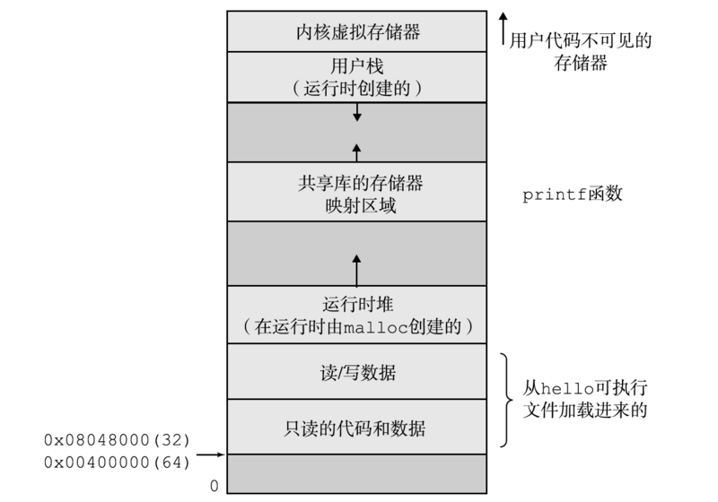
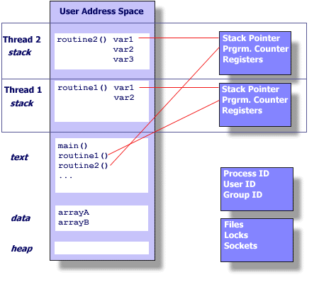
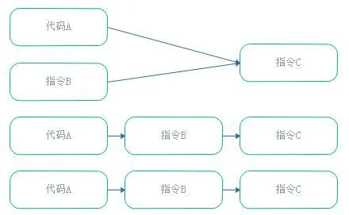

##  *Parallel* 并发、*Concurrent* 并行

-   *Parallel* 并行侧重物理实现、*Concurrent* 并发侧重逻辑设计
    -   *Concurrent* 并发：**能够处理** 多件事情，侧重结构、逻辑
        -   并发：程序执行的 **逻辑重用需求**
            -   程序要求重用一组逻辑，所以需要将一组指令集打包，重复调用该组指令集
        -   并发问题可以使用并行方式解决，也可以串行解决
            -   100 并发任务同时运行在 4 核 CPU 上，最多可能有 4 个并发任务并行处理，其余只能是串行处理
    -   *Parallel* 并行：**同时做** 多件事情，侧重执行、实现
        -   并行角度：硬件技术的 **物理限制瓶颈**
            -   单计算核心能力不足，所以需要多核并行运算

### 资源：进程、线程

####    *Process*

-   *Process* 进程：具有独立功能的程序关于某数据集合的一次运行活动
    -   进程是处于运行期的程序和相关资源的总称
        -   程序：代码、指令
        -   运行：对 CPU 的占用，逐渐发展为线程，标识进程中指令的执行
        -   资源：执行上下文，进程内线程共享
    -   资源分配角度：进程是独立的程序代码、拥有独立的虚拟寻址空间
        -   虚拟寻址空间（存储空间）：每个进程 **“独占的”** 使用全部内存、看到一致的存储器
            -   虽然，进程物理上仅能占据部分内存
            -   但，进程在逻辑上可用全部内存资源，即虚拟寻址空间，包括用户空间、内核空间
            -   虚拟寻址空间的虚拟地址由内核映射为实际的物理地址
        -   独立用户空间
            -   程序代码、数据：对所有进程，代码从同一固定位置开始，直接按照可执行目标文件的内容初始化
            -   （运行时）堆：可在运行时动态扩展、收缩
            -   共享库：共享库代码和数据，如：C标准库、数学库
            -   栈：用于实现函数调用，运行时动态扩展、收缩，位于虚拟地址空间顶部
        -   共享内核空间
            -   内核虚拟存储器：内核总是驻留在内存中，为其保留地址空间顶部
            -   不允许程序读写区域内容或直接调用内核代码定义的函数
    -   系统调度角度：进程、内核线程是系统进行调度的独立单位
        -   内核跟踪进程运行所需的状态信息（上下文）
            -   主存、虚拟内存内容
            -   寄存器文件值
            -   栈
            -   文件句柄
        -   在系统中有进程控制块（进程描述符）描述进程相关信息，系统通过此控制块控制系统相关行为
        -   *Linux* 线程模型中，内核线程（轻量级进程）对系统是可感知的
            -   此时，内核线程与进程类似是系统调度的最小单位
            -   但，内核线程与同一进程下其他线程共享进程资源，无独立内存空间



####    *Thread*

-   *Thread* 线程：进程执行实体，进程中包含指令、完成具体任务的执行活动
    -   线程概念起源于对进程内并行执行多个任务的需求
        -   进程内部可能存在多个需共享数据、用途（代码）不同 *Task* 任务
        -   且，*Task* 操作的数据具有一定独立性
            -   多个 *Task* 不需要完全按照时序先后执行
            -   *Task* 间需（可）根据不同策略进行调度
        -   则，进程内独立执行某个具体任务的执行实体称为线程
    -   资源角度：以 *Linux* 线程模型为例
        -   线程运行在进程的上下文中，共享同样代码和全局数据
            -   进程代码段、公有数据
            -   进程打开的文件描述符、信号的处理器
            -   进程当前目录
            -   进程用户ID、进程组ID
        -   线程还独享某些个性以实现并发性
            -   线程ID：进程中唯一标识
            -   寄存器组值：线程间并发运行，线程有不同运行线索，切换时需要保存当前线程的寄存器集合状态
            -   线程堆栈：独立函数堆栈保证线程内函数调用可以正常执行，不受其他线程影响
            -   错误返回码：线程的系统调用错误可能未及时处理，独立 错误返回码避免其被其他线程修改
            -   线程的信号屏蔽码：线程感兴趣的信号不同，因此信号屏蔽码应由自己管理
            -   线程优先级：线程需要像进程被调度，需要有相应的优先级
    -   调度角度：线程是比进程更小的、能独立运行的基本单位
        -   线程 “独立执行”，但不一定能被内核感知、由内核调度
            -   内核线程：内核可感知、负责调度、分派，有时被称为轻量级进程
            -   用户线程：内核无感知，由某个运行时负责调度、分派



### 调度：用户线程、内核线程

####    用户线程

-   *User-Level Thread* 用户级线程：由用户程序自身负责支持、调度
    -   相当于实现自己的线程调度内核，实现线程数据结构、创建、销毁、调度维护
        -   即使内核不支持线程，也可通过库函数支持在系统中实现真实的多线程
        -   用户级线程调度只在用户态进行，减少内核态、用户态切换开销
            -   适合大规模用户线程并发
    -   用户线程运行在内核（可感知的）进程内，对内核透明
        -   内核仅负责进程调度，当线程进行系统调用而阻塞时，系统会阻塞整个进程
        -   用户空间没有时钟中断机制，若线程长时间不释放 CPU，会导致阻塞（进程中）其他线程

####    内核线程

-   *Kernel-Level Thread*、*Lighted Weighted Process* 内核级线程：系统内核支持的线程，通过内核完成线程切换
    -   系统负责线程的创建、销毁、调度、维护
        -   内核通过操纵调度器对线程进行调度，并负责将线程的任务映射到各个处理器上
        -   程序可以直接使用系统调用已实现线程，无需实现线程调度、对 CPU 资源抢占使用
        -   降低整个进程被完全阻塞的风险
    -   内核线程需要内核支持
        -   创建、销毁、调度、维护往往都需要系统调用，代价较高
        -   需要消耗内核资源，不能大量创建
    -   **内核级线程作为用户线程在内核中调度、执行的桥梁**
        -   某种意义上，用户线程可视为逻辑任务、内核级线程为执行实体
        -   用户线程总需要和内核级线程关联（系统调用）才可被调度、执行

####    线程通用调度算法

-   调度算法考虑要点
    -   从任务角度，调度需要考虑
        -   *Responsiveness*
        -   *Schedule Overload*
        -   *Starvation-Freedom*：饥饿避免
        -   *Fairness*
    -   内核调度除考虑任务（线程）外，还会考虑进程因素
        -   *Gang Scheduling*：尽量将同进程中线程同时调度，而非随机从多个进程中挑选 CPU 数量线程调度
        -   *Space Sharing*：将 CPU 划分，各进程仅允许占用部分 CPU 执行并发
    -   耗时相差不大的任务队列相对容易处理，而任务情况复杂时难以处理
        -   耗时相差大
        -   IO 任务、计算任务混合

#####   朴素方法

-   *First-In-First-Out* 先进先出：按任务在队列中的顺序依次调用，仅在任务结束后才会切换
    -   优点
        -   最少任务切换开销
        -   最大吞吐量（总处理效率）
        -   朴实公平
    -   缺点
        -   平均响应时间高
-   *Shortest Task First/Shortest Remained Time Task* 最短耗时任务优先：优先调度耗时短任务
    -   优点
        -   平均相应时间短：长耗时任务不断推移，必然统计出较短平均响应时间
    -   缺点
        -   不公平，长耗时任务难被调度，容易饥饿
        -   频繁任务切换，调度额外开销大
-   *Round Robin* 时间片轮转：给队列中每个任务分配时间片，时间片结束切换任务
    -   优点
        -   每个任务可以得到公平调度
        -   耗时短任务即使在耗时长任务之后也可以较快得到执行
    -   缺点
        -   任务切换引起的调度开销大，需要多次切换任务上下文
        -   时间片不好设置
            -   时间片足够小则退化为 *SFJ*
            -   时间片足够大则退化为 *FIFO*
        -   需要知道任务（剩余）执行时间

#####   *(Weighted) Max-Min Fairness*

-   （带权重的）最大最小公平：资源按照权重分配，超过需求资源继续按权重分配给未满足需求
    -   具体方案
        -   每轮开始将资源按照权重分配
        -   若需求大于被分配资源则推迟执行，进入下轮
        -   若需求小于被分配资源则执行，并将多余资源继续按照权重分配给无法执行资源

#####   *Multi-level Feedback Queue*

-   多级反馈队列：监控任务处理耗时，若任务未用尽分配资源则提高优先级，否则降低其优先级
    -   具体方案
        -   任务、分片时长具有相对应的不同优先级
            -   分片时长越长优先级越低
            -   高级优先级任务可以抢占低优先级任务
            -   新任务位于高优先级任务
        -   同一优先级任务使用 *Round Robin*
            -   事实上仅有最低优先级任务使用 *Round Robin* 算法，其他优先级都是 *FIFO*
            -   时间片用完后任务结束则正常退出系统，否则优先级下滑一等级
            -   若是主动让出 CPU（IO等），则停留在当前优先级或提升
    -   多核场景
        -   应为每个 CPU 分配单独 *MFQ*，否则容易争抢 *MFQ* 锁
        -   同时，采用 *Affinity Scheduling* 保证任务尽量相同核上执行，避免 CPU 缓存频繁失效

### 非抢占：协程

####    *Coroutine* 协程

-   *Coroutine* 协程：实现 `yield`、`resume` 机制，可 **主动暂停、满足条件后恢复执行**（并在其间传递数据）的计算单元
    -   协程核心即：`yield` 让步主动暂停，被运行时 `resume` 后在暂停位置恢复执行
        -   故，协程不适合直接由内核调度，总依赖于某个外部运行时监听事件、调度执行
        -   事实上，“用户线程” 基本都按非抢占式的协程逻辑实现
            -   且，用户显然清楚何时需要暂停、等待依赖完成
            -   故，非抢占式的协程逻辑更合适 “用户线程” 模型
    -   显然，协程需要维护自身状态、存在多个执行入口点（以实现挂起后恢复执行）
        -   故，协程逻辑上应为、可视为状态机
            -   状态：每个 `yield`、`await` 挂起、转移控制权处对应状态机各状态
            -   状态转移：状态机各状态维护协程内部状态、并转移自身状态
        -   运行时执行协程，即匹配状态机状态、从对应状态开始执行
    -   协程逻辑上不可独立（状态转移），其实现总是依赖于外部运行时
        -   在 `yield` 点协程返回值、保存内部状态、挂起，控制权转移至运行时，等待恢复执行的条件
        -   运行时 `resume` 协程时，协程获取值、恢复状态、继续执行
        -   运行时核心是事件监听、维护任务队列
            -   协程挂起前注册至计时、*IO*（网络、文件）等事件
            -   运行时监听事件、唤醒协程、将协程加入就绪任务队列
            -   运行时轮询就绪任务队列、`resume` 恢复协程执行

####    协程与异步

-   主动挂起、调度恢复的非抢占式特性，使得协程合适异步编程场合、简化异步代码实现
    -   主动挂起：等待依赖的异步任务完成时自动挂起，避免空转浪费资源
        -   协程在线程中调度完全由用户控制，可以视为、常实现为 *用户态轻量级线程*
            -   避免陷入 **无效内核级别上下文切换** 造成的性能损失
            -   较线程在 *IO* 密集任务上性能上更好
        -   尤其是无栈协程状态切换、任务切换（控制权转移）几乎无成本，适合高并发任务
    -   调度恢复：依赖的异步任务完成后被调度、自动恢复后续执行，无需回调函数
        -   使得需要使用 *异步+回调* 的代码可以使用看似同步方式写出
        -   即，引入 `await <CoR>` 机制（时点）
            -   `await` 类似 `yield` 指示保存状态、转移控制权的挂起点
            -   但，`await` 不输出、接受值，而蕴含 **等待依赖的异步任务 `CoR` 完成** 的语义（异步运行时负责唤醒）
            -   即，`await` 可视为：`loop` 循环内检查条件，不满足条件时 `yield NUL`、否则 `break`

####    有栈、无栈协程

-   协程实现按拥有独立调用栈，可将协程分为无栈协程、有栈协程
    -   *Stackful Coroutine* 有栈协程：拥有独立调用栈的协程实现
        -   有栈协程更接近、即为 *用户线程* 概念，对应函数
            -   协程执行即线程对应函数执行，函数执行过程中 `yield` 移交控制权
            -   协程切换时，需要保存、恢复整个调用栈，开销较大
            -   协程状态保存由运行时控制
        -   有栈协程视为在运行时处理中断、恢复
            -   逻辑更灵活、但开销更大
            -   运行时无需显式提供上下文，上下文即协程调用栈
    -   *Stackless Coroutine* 无栈协程：无独立调用栈、依赖运行时调用栈的协程实现
        -   无栈协程接近、即为 *状态机* 概念，对应类
            -   协程执行即类方法执行，方法执行完毕、返回控制权回到运行时
            -   协程切换即运行时执行其他协程类方法，协程自身不存在需要保存的调用栈
            -   协程状态保存逻辑在协程内部、由自身控制，无需运行时干预
        -   无栈协程可视为在编译时处理中断、恢复
            -   即，编译时按 `yield` 点拆分执行逻辑为独立函数（方法）、对应状态机状态转移动作
            -   运行时可能需要显式提供上下文，帮助状态机恢复执行

> - 从头到尾理解有栈协程实现原理：<https://zhuanlan.zhihu.com/p/94018082>
> - 浅谈有栈协程和无栈协程：<https://zhuanlan.zhihu.com/p/347445164>
> - 有栈协程和无栈协程的区别：<https://www.cnblogs.com/chhblogs/p/18677679>

####    进程、线程、协程

|            | *Process*                  | *Kernel-Thread*                | *User-Thread* | *Stackless-Coroutine*  |
|------------|----------------------------|--------------------------------|---------------|------------------------|
| 调度、创建 | 内核                       | 内核                           | 运行时        | 运行时                 |
| 资源       | 各进程独立                 | 进程内共享                     | 进程内共享    | 进程内共享             |
| 状态维护   | 内核                       | 内核                           | 运行时        | 自身                   |
| 开销       | 大                         | 较小                           | 小            | 极小                   |
| 切换速度   | 慢                         | 较快                           | 快            | 极快（等同于函数调用） |
| 通信       | 环境变量、文件、系统端口   | 共享内存                       | 函数返回值    | 函数返回值             |
| 易用性     | 需要考虑进程退出、僵尸进程 | 只需要管理进程即可             | 运行时管理    | 运行时管理             |
| 移植性     | 差                         | 好                             | 好            | 好                     |
| 健壮性     | 好，进程死亡不影响其他进程 | 差，线程死亡会导致进程整体死亡 |               |                        |

-   说明
    -   进程、内核线程、用户线程（有栈协程）、无栈协程（状态机）是执行层面资源、调度的控制权逐渐转移至自身
        -   进程：独立任务、独立资源
        -   内核线程：内核抢占式调度，进程内线程共享资源
        -   用户线程、有栈协程：运行时协作式调度（主动让出 *CPU* 执行），切换时运行时维护调用栈（上下文）
        -   无栈协程、状态机：切换时无需维护调用栈（逻辑中断点已被处理为方法终点）
    -   用户线程、无栈协程实现方式较多，此处仅考虑不跨线程执行
        -   实际上，用户线程、无栈协程可能跨内核线程调度
        -   此时，用户线程、无栈协程的切换、通信需要跨内核线程
    -   进程移植性差在于，基于进程分支多进程和 *Win* 平台模型有很大冲突，难以使用

####    协程、协程函数

|          | 子程序             | 协程                         |
|----------|--------------------|------------------------------|
| 状态     | 无状态维护         | 维护自身状态                 |
| 处理逻辑 | 相同输入、相同输出 | 相同输入可能不同输出         |
| 入口点   | 起始处             | 起始处、`yield` 恢复点       |
| 终点     | 函数终点           | 协程函数终点、`yield` 挂起点 |
| 返回值   | 调用结束后返回全部 | 可每次 `yield` 返回部分值    |

-   协程指协程函数（协程类）的具体执行，协程函数（协程类）是协程的抽象逻辑，类似线程、函数关系
    -   普通函数：无状态维护，同样重入得到同样结果
        -   普通函数可以看作时协程函数的特例：无状态保存，同样重入得到同样结果
            -   只有一个状态，每次进入时局部状态重置
            -   唯一入口点
        -   可认为，线程是普通函数的并行实体
    -   协程函数、协程类：有状态维护，重入时协程状态不同、结果可能不同
        -   协程函数可视为子程序函数的组成部分
            -   协程维护自身状态，所以 **逻辑上不独立运行**，应该是作为被调用对象
            -   对于每次返回部分结果值的协程（也称生成器迭代器），可以直接视为类似链表之类的数据结构
        -   可认为，协程是协程函数、协程类的并行实体
            -   类似普通函数可以嵌套、串行调用执行
            -   协程函数、协程类同样可以嵌套、串行执行
            -   仅当，协程函数、协程类在运行时内作为协程（任务）注册、被调度，才有成为并行意义的协程

#####   *Subroutine* 子程序

-   *Subroutine*、*Procedure*、*Function*、*Routine*、*Method* 子程序、普通函数：打包为整体、用于执行特定任务的指令集序列
    -   子程序是依赖可重入能力的弱化版本
        -   一旦唤醒，于起始点开始执行
        -   一旦退出，子程序结束
        -   子程序实例只返回一次，两次激活间不保存状态
    -   子程序中局部变量在每次 **调用、重入** 时都是相同的
        -   若外部环境（全局变量）不变化，子程序相同输入得到相同输出
        -   但事实上，子程序可能会有副作用，即对执行环境有影响
            -   进而导致，相同输入无法得到相同输出
            -   *Procedure*：过程，有时特指无返回值、仅有副作用的子程序

##  数据同步

### *Thread Safe* 线程安全

-   线程安全：子程序在多线程环境调用时，能够正确处理多个线程之间的共享变量，使程序功能能正确完成
    -   并发编程中为保证数据（共享变量）一致性，要满足 3 条件、或解决 3 个问题
        -   *Atomicity* 原子性：操作（一组操作）要么全部执行、且执行过程不被打断，要么不执行
        -   *Visibility* 可见性：多个线程访问同一变量时，若某线程修改变量值，其他线程可以立刻看到修改后值
        -   *Ordering* 有序性：程序（指令）严格按代码先后顺序执行
    -   或为各线程分配专门空间，存储需要单独保存的状态

####    *Atomicity* 原子性

-   *Atomicity* 原子性：操作（一组操作）要么全部执行、且执行过程不被打断，要么不执行
    -   原子性问题来源于内核对线程的切换、调度
        -   线程尝试读取共享变量值、计算新值、写回共享变量值时，可能被内核打断
        -   此时，若其他线程执行类似任务，将同样基于旧值计算
        -   则，两线程先、后写回共享变量将导致 **前者计算结果被覆盖、计算动作被无效**
    -   原子性保证依赖内核、*CPU* 提供原子类型、原子操作保证
        -   利用原子类型构建包含共享变量、原子类型的锁（互斥锁为例）
            -   原子类型值表示锁状态
            -   加锁、解锁即对原子类型值原子地 *Compare And Swap* 比较并交换（整体原子操作）
        -   线程访问共享变量流程
            -   *CAS* 操作检查锁状态、尝试加锁
            -   若加锁失败，等待（`while` 内循环执行 *CAS* 检查锁状态、尝试加锁）
            -   直至加锁成功，其他线程未获取锁、无法访问数据
            -   更新完毕后解锁
        -   （包括状态检查）加锁、解锁为原子操作、不会被打断
            -   则，不存在线程加锁、解锁被无效
            -   即，不存在多个线程同时 “加锁成功”，同时开始修改共享变量
        -   当然对简单数据，可直接利用对应原子类型、原子操作确保原子性

> - 彻底搞懂内存屏障，让程序运行更有序：<https://zhuanlan.zhihu.com/p/1947046219965768745>
> - 内存屏障与锁的实现：<https://zhuanlan.zhihu.com/p/11966809061>
> - `sys::sync::mutex::futex.rs` 源码：<https://doc.rust-lang.org/stable/src/std/sys/sync/mutex/futex.rs.html>

####    *Visibility* 可见性

-   *Visibility* 可见性：多个线程访问同一变量时，若某线程修改变量值，其他线程可以立刻看到修改后值
    -   可见性问题来源于计算硬件体系中 *CPU Cache* 高速缓存、*RAM* 主存副本拷贝机制
        -   内存由所有线程共享，对其中数据修改对所有线程可见
        -   但因速度差异，*CPU* 不直接从 *RAM* 读取数据，而是将数据从 *RAM* 中拷贝至 *Cache*、再读取
        -   而，线程对高速缓存中的数据修改可能未刷回内存，对其他线程不可见
    -   可见性保证依赖 *Memory Barrior* 内存屏障
        -   *Memory Barrior* 内存屏障（指令）：内存屏障前内存读写操作、必然在内存屏障之后读写操作之前完成
            -   阻止屏障两侧指令重排序
            -   强制要求 *Cache* 中脏数据写回 *RAM*、失效 *Cache*
        -   `volatile` 标记值即显式的内存屏障机制
            -   访问 `volatile` 值前须先执行前序与 `volatile` 值相关的内存操作
            -   则，`volatile` 标记值修改将对所有线程可见

> - 彻底搞懂内存屏障，让程序运行更有序：<https://zhuanlan.zhihu.com/p/1947046219965768745>
> - 内存屏障与锁的实现：<https://zhuanlan.zhihu.com/p/11966809061>

####    *Ordering* 有序性

-   *Ordering* 有序性：程序（指令）严格按代码先后顺序执行
    -   *Instruction Reorder* 指令重排序：指令执行顺序重排，在保证程序最后执行结果不变情况下提升效率
        -   指令重排序会考虑指令之间的数据依赖，确保存在数据依赖的指令之间相对保序
        -   但多线程场景下，共享变量之间数据依赖跨线程
            -   指令重排序仅能保证单线程场景的执行结果不变
            -   但，某线程中指令重排序可能带来其他线程 **依赖逻辑错误、执行结果异常**
    -   指令重排序在锁内原子变量的内存顺序约束、`volatile` 机制下不会影响多线程执行结果
        -   锁状态检查：避免共享变量被多线程同时修改
        -   锁内原子变量内存顺序约束：多个线程临界区整体有序执行
            -   线程临界区内共享变量可能不满足其他线程临界区的逻辑依赖
            -   但加锁确保，临界区内多个共享变量整体更新后，其他线程临界区才能开始执行
        -   `volatile` 标记值内存屏障：易变、共享变量值修改对所有线程可见

> - Java 并发编程：`volatile` 关键字解析：<https://www.cnblogs.com/dolphin0520/p/3920373.html>
> - 彻底搞懂内存屏障，让程序运行更有序：<https://zhuanlan.zhihu.com/p/1947046219965768745>
> - 内存屏障与锁的实现：<https://zhuanlan.zhihu.com/p/11966809061>
> - `sys::sync::mutex::futex.rs` 源码：<https://doc.rust-lang.org/stable/src/std/sys/sync/mutex/futex.rs.html>

### 原子操作、指令

####    *Instruction Reorder* 指令重排



-   指令重排：编译器对无相互依赖的指令重新排序执行
    -   `as-if-serial` 语义：指令可以为优化而重排序，但是必须保证最终执行结果不变
        -   规则：重排序过程不破坏数据依赖关系
        -   只能保证单线程执行结果有效，但不保证多线程并发执行的正确性
    -   `happens-before` 原则：保证前后两个操作间不会被重排序，
        -   程序次序规则：线程中每个操作 *happens-before* 该线程中任意后续操作
        -   锁定规则：锁的解锁 *happens-before* 加锁
        -   `volatile` 变量规则：`volatile` 变量写操作 *happens-before* 其读操作
        -   传递规则：若 A *happens-before* B、B *happens-before* C，则 A *happens-before* C
        -   线程启动规则：线程对象启动 *happens-before* 线程中每个动作
        -   线程中断规则：线程中断方法的调用 *happens-before* 被中断线程代码检测到的中断事件的发生
        -   线程终结规则：线程中所有操作 *happens-before* 线程的终止检测
        -   对象终结规则：对象的初始化 *happens-before* 其 *final* 方法的开始

> - *happens-before* 原则被 *JVM* 用于规定（跨线程）操作之间偏序关系，若操作之间的关系可以由此原则退出，则两个操作有序

####    *Memory Order*

-   内存顺序：原子操作相关的内存访问（指令执行）顺序
    -   `Relaxed` 无顺序约束：指令执行顺序可被任意优化
    -   `Acquire` 约束：确保 `Load` 原子变量（获取锁）前，知悉 **相关线程（`Store` 同一原子变量）** 对所有变量修改
        -   当前线程内，所有（`Load` 操作后）读、写操作不可重排序至当前 `Load` 操作前
        -   涉及对同一原子变量 `Release` 的其他线程中所有写操作，对当前的线程可见
        -   说明
            -   `Acquire` 约束仅对原子类型的 `Load` 载入操作生效，对 `Store` 存储操作等同于 `Relaxed` 约束
    -   `Release` 约束：确保 `Store` 原子变量前（释放锁）所有变量修改 **对相关线程（`Load` 同一原子变量）** 可见
        -   当前线程内，所有（`Store` 操作前的）读、写操作不可重排序至当前 `Store` 操作后
        -   当前线程中的所有写操作，对涉及对同一原子变量 `Load` 的其他线程可见
        -   说明
            -   `Release` 约束仅对原子类型的 `Store` 载入操作生效，对 `Load` 存储操作等同于 `Relaxed` 约束
    -   `AcqRel` 约束：知悉其他线程对所有变量修改、自身所有变量修改对其他线程可见
        -   `AcqRel` 约束结合对 `Acquire`、`Release` 约束，一般用于 `Read-modify-write` 操作
            -   `Load` 时要求 `Acquire` 约束
            -   `Store` 时要求 `Release` 约束
        -   `AcqRel` 约束对 `Load` 操作等价于 `Acquire`、对 `Store` 操作等价于 `Release`
    -   `SeqCst` *Sequentialy-Consistent* 约束：在 `AcqRel` 约束基础上要求，所有线程看到的所有 `SeqCst` 约束操作顺序一致
        -   `Acquire`、`Release` 仅 **成对地约束对同一原子变量** 读、写相关的线程顺序
            -   但，对不同原子变量的读、写相关线程整体操作顺序无限制
        -   `SeqCst` 要求所有 `SeqCst` 约束的操作（即使不同原子变量）对不同线程的顺序一致

```rust
let x = AtomicBool::new(false);
let y = AtomicBool::new(false);
let z = AtomicI32::new(0);
let write_x = thread::spawn(|| x.store(true, Ordering::SeqCst));
let write_y = thread::spawn(|| y.store(true, Ordering::SeqCst));
let write_x_then_y = thread::spawn(|| {                                 // 若实际 `x`、`y` 先后更新，此处 `z+1`
    while !x.load(Ordering::SeqCst) {}
    if y.load(Ordering::SeqCst) { z.fetch_add(1, Ordering::Relaxed); }
})
let write_y_then_x = thread::spawn(|| {                                 // 若实际 `y`、`x` 先后更新，此处 `z+1`
    while !y.load(Ordering::SeqCst) {}
    if x.load(Ordering::SeqCst) { z.fetch_add(1, Ordering::Relaxed); }
})
write_x.join();
write_y.join();
write_x_then_y.join();
write_y_then_x.join();
assert_eq(z.load(Relaxed), 1);                                        // 但若无 `SeqCst` 保证，`z` 可能为 0、2
```

> - `std::memory_order`：<https://en.cppreference.com/w/cpp/atomic/memory_order.html#Release-Acquire_ordering>
> - `std::sync::atomic::Ordering`：<https://doc.rust-lang.org/stable/std/sync/atomic/enum.Ordering.html>
> - C++ 什么场景下一定要使用 `seq_cst` 内存序：<https://www.zhihu.com/question/8811713845/answer/75716283973?utm_psn=1874990550719004672>
> - How do `memory_order_seq_cst` and `memory_order_acq_rel` differ?：<https://stackoverflow.com/questions/12340773/how-do-memory-order-seq-cst-and-memory-order-acq-rel-differ>

### 跨线程通信

-   跨线程通信方式
    -   简单通信方式：允许进程向其他进程发送简单信息
        -   命令行参数
        -   信号：受控于操作系统的非同步事件机制
        -   Shell 环境变量
        -   程序退出状态码
        -   简单文件
    -   匿名管道：允许 **共享文件描述符** 的线程、进程传递数据
        -   仅在进程内部存在，通常和进程分支合用作为父进程、子进程之间的通信手段、线程之间通信
        -   依赖于类 Unix 下进程分支模型，可移植性差
    -   具名管道 *FIFO*：映射到系统的文件系统，允许不相关程序进行交流
        -   是真正的外部文件，通过标准文件接口实现
        -   可以独立启动，局限于本地进程通信时可以替代套接字
        -   相较于普通外部文件，操作系统同步化 *FIFO* 访问，使之适合 *IPC*
    -   套接字 *socket*：映射到系统级别端口号
        -   允许远程联网机器程序之间交流
        -   可移植性较好，几乎所有平台都支持
    -   共享内存：消息保存在函数外部，不随着函数栈清除消失
        -   全局变量
        -   类中变量

### 锁、死锁

-   锁：（操作系统）控制资源申请、线程调度的标记、限制机制
    -   线程/进程调度本质上是不确定的
        -   并行编程中错误使用锁机制可能会导致随机数据损坏、其他异常行为，即 **竞争条件**
        -   最好在临界区（对临界资源进行操作的部分代码）使用锁
    -   锁常通过原子类型、操作实现：原子操作确保锁自身状态是原子化、一步切换的，不会被操作系统调度打断
        -   阻塞方式：资源不足时是否通知操作系统
            -   自旋、`while` 循环检查锁状态并阻塞：不通知操作系统，在 `while` 循环中不断检查、尝试获取锁
            -   系统调用：通知操作系统挂起自身，要求操作系统在满足条件时调度、恢复执行
                -   当然，操作系统可能假唤醒、或恢复后条件又改变
                -   故，实际上系统调用也常在 `while` 循环内
        -   访问限制：是否允许多个线程访问
            -   互斥：只允许单个线程访问
            -   读写、多读单写：允许多个线程同时读取、或单个线程写入
    -   3 种操作系统层面、原子操作基础的底层锁
        -   *Spin* 自旋锁：申请不到资源时执行死循环（忙等待）、不通知操作系统（与其他 2 种锁不同）
            -   可避免线程因 “资源不足” 而进入休眠队列、避免不必要的上下文切换
            -   只有确定在 1 个时间片以内可以请求到锁才能提高效率，否则 *CPU* 将空转 1 个时间片
                -   故，只适用于多线程平台
            -   自旋锁会影响操作系统线程调度，使用时必须非常谨慎
        -   *Mutex* 互斥锁：申请不到资源时通知操作系统、休眠，只允许单个线程访问
        -   *Read-Write Lock* 读写锁：申请不到资源时通知操作系统、休眠，允许多个线程读、或仅单个线程写
            -   读写锁分为读锁、写锁，适合能明确区分读、写操作的场景
                -   读优先锁：读申请优先获取锁，即使前面已有写申请阻塞
                -   写优先锁：写申请优先获取锁，写申请阻塞时读申请获取锁失败
                -   公平读写：将读、写申请按队列先进先出方式获取、释放锁

> - 如何理解互斥锁、条件锁、读写锁以及自旋锁：<https://www.zhihu.com/question/66733477/answer/246760992>
> - 互斥锁、自旋锁、读写锁、悲观锁、乐观锁的应用场景：<https://zhuanlan.zhihu.com/p/246114725>

####    死锁

-   死锁：多个进程执行过程中，由于竞争资源、彼此通信而造成的阻塞
    -   避免、预防方案
        -   尽可能保证每个进程只能同时保持一个锁
        -   为程序中每个锁分配唯一 ID，然后只允许按照**升序规则**使用多个锁
            -   按对象 ID 有序加锁不会产生循环依赖，而循环依赖时死锁必要，从而避免进入死锁状态
            -   可以数学上证明，这样能保证程序不会进入死锁状态
    -   检测、恢复方案
        -   引入看门狗计数器：
            -   线程正常运行时每隔一段时间重置计数器
            -   没有发生死锁时正常运行
            -   一旦发生死锁，无法重置计数器导致计数器超时，程序通过重启恢复自身状态

##  并发问题

### 生产者-消费者问题/缓存绑定问题

-   生产者-消费者问题/缓存绑定问题
    -   场景：生产者生成数据放入缓存，消费者从缓存获取、移除、消费数据
        -   若缓存满：生产者者停止工作
        -   若缓存空：消费者停止消费
        -   消费者从缓存中取走数据，通知生产者工作
        -   生产者向缓存中放入数据，通知消费者消费
    -   核心：保证不让生产者在缓存已满时放入数据、不让消费者在缓存为空时读取数据
        -   不完善的解决方案会造成死锁：生产者、消费者均等待对方唤醒

####    信号量解决方案

```c
semaphore mutex = 1
semaphore fill_count = 0
semaphore empty_count = BUFFER_SIZE

producer():
    while true:
        item = produce_item()
        down(empty_count)
        down(mutex)
        put_item_into_buffer(item)
        up(mutex)
        up(fillcount)

consumer():
    while true:
        down(fill_count)
        down(mutex)
        item = remove_item_from_buffer()
        up(mutex)
        up(empty_count)
        consume_item(item)
```

-   通过信号量解决死锁问题
    -   `mutex` 信号量：互斥信号量，确保只有一个生产者、消费者操作缓存区，单一消费者、生产者可省略此信号量
    -   `fill_count` 信号量：已使用缓存区数量
    -   `empty_count` 信号量：空闲缓存区数量

####    状态监控解决方案

```c
item_count = 0
condition full
condition empty

add(item):
    while item_count == BUFFER_SIZE:
        wait(full)

    item_count = item_count + 1
    put_item_into_buffer(item)

    if item_count == 1:
        notify(empty)

remove():
    while item_count == 0:
        wait(empty)

    item_count = item_count - 1
    item = remove_item_from_buffer()

    if item_count == BUFFER_SIZE - 1:
        notify(full)

produer():
    while true:
        item = produce_item()
        add(item)

consumer():
    while true:
        item = remove()
        consume_item(item)
```

-   互斥信号没有保护关键区，监控方法更好

####    其他

-   协调生产者、消费者的关闭
    -   可在在队列中放置特殊的值，消费者读到时终止执行，结束消费者线程
    -   有多个消费者时，消费者读取特殊值之后可将特殊值放回队列中继续传递，直至关闭所有消费者

### 哲学家就餐问题

-   哲学家就餐问题
    -   场景：哲学家围坐在圆桌旁，只能吃饭、思考，每两个哲学家之间只有一根筷子，只有同时拿到左右两根筷子才能正常吃饭
    -   核心：实际计算机问题中，筷子视为共享资源

####    服务生

-   引入服务生判断资源是否能被获取
    -   引入服务生，哲学家必须经过其允许才能拿起筷子
    -   服务生知道有哪些筷子正在被使用，能够判断是否会死锁

####    资源分级

-   为资源（筷子）分配偏序关系（分级）
    -   解决方案
        -   约定所有资源（锁）都按此偏序（常量分级）获取、相反顺序释放
        -   且保证不会有无关资源同时被同一工作获取
    -   对应问题场景
        -   哲学家只能先拿左右筷子中编号较小者、先放下筷子中编号较大者
        -   哲学家只能拿左右侧筷子：不会有无关资源被同一工作获取
    -   策略不总是实用的
        -   所需资源列表可能事先不知道
        -   效率不高，可能需要先释放已获取资源、获取低编号资源、重新获取资源

####    *Chandy/Misra* 解法

-   *Chandy/Misra* 解法：标记资源，保留未使用资源、交出已使用资源，初始所有资源置为已使用
    -   对应问题场景
        -   每根筷子分为干净、脏，最初所有筷子都脏
        -   对每对竞争同一筷子的哲学家，新拿筷子给编号较低者
        -   当哲学家需要某筷子时
            -   向其竞争对手发送请求
            -   拥有筷子的哲学家收到请求
                -   若筷子干净则保留
                -   否则擦干净交出
        -   哲学家吃完东西后，筷子变脏
            -   若有哲学家之前请求过该筷子，擦干净交出
    -   有很大并行性，适合任意大问题

### 读者-写者问题

-   读者-写者问题
    -   背景：多线程同时访问共享内存地址，线程写入时其他线程不能读取、写入，多个线程可以同时读取
    -   一般使用 *readers-writer lock* 解决问题
        -   读者优先
            -   若共享内存被读取，其他读者可以立即、同时读取
            -   若一直有读者开始读取，则写者会一直被插队、无法修改
        -   写者优先
            -   如果写者在排队，应该尽快写入共享内存
            -   若一直有写者准备写入，则读者会一直被插队、无法读取
        -   限定时间
            -   共享内存区的锁定权要在限定时间内结束
            -   能避免读者、写者一直排队

### 熟睡的理发师问题

-   熟睡的理发师问题
    -   背景：理发店只有一名理发师、一张理发时坐的椅子、若干普通椅子供顾客等待
        -   没有顾客时理发师在理发椅子上睡觉，顾客到达后离开、或者叫醒理发师
        -   有顾客时，理发师为别人立法，顾客达到后若有空闲普通椅子则坐下休息、否则离开
        -   理完发后，任选顾客开始理发
    -   问题核心
        -   理发师等待顾客、顾客等待理发师，造成死锁
        -   有顾客不按顺序等待，让某些顾客永远不能理发

####    3信标解决

```c
semaphore customer = 0
semaphore barber = 0
semaphore mutex = 1
empty_chairs = BUFFER_SIZE

barber():
    while true:
        if empty_chairs == BUFFER_SIZE:
            sleep()

        down(mutex)
        item = get_customer_from_chairs()
        empty_chairs += 1
        up(mutex)

        down(barber)
        cut_hair(item)
        up(barber)

customer():
    while true:
        down(mutex)
        if empty_chairs > 0:
            empty_chairs -= 1

        else:
            wait() or leave()

        up(mutex)
```

### 三个烟鬼问题

-   三个烟鬼问题
    -   问题背景：香烟需要：烟草、卷烟纸、火柴，三个烟鬼分别有无限各一种，不吸烟协调人会随机安排两个烟鬼各拿出一份材料放在桌上，另外一个烟鬼拿到材料卷烟、抽
        -   桌上空了后，协调人就随机要求烟鬼拿出材料
        -   烟鬼只会在抽完手中烟后才会卷另一只
        -   若烟草、卷烟纸在桌上，有火柴的烟鬼在吸烟，直到该烟鬼吸完烟拿走桌上材料才会继续

##  并行

### *Reentrant* 可重入

-   可重入函数：对于相同（合法）的函数参数，多次重复调用（包括执行过程中被中断再重入）结果总是可预期的
    -   可重入需要满足条件
        -   不在函数内部使用静态或全局数据，所有数据都由函数调用者提供
            -   全局变量区
            -   中断向量表
        -   使用本地数据，或制作全局数据的本地拷贝保护全局数据
        -   不返回静态或全局数据
        -   不调用不可重入函数
    -   不可重入后果主要体现在信号处理函数这样需要重入情况中
        -   若在信号处理函数中使用了不可重入函数，则可能导致程序错误
    -   可重入函数总是线程安全的，反之不一定成立
        -   线程安全可以通过 “并发不冲突” 实现
        -   可重入则要求 “并行不冲突”

> - A computer program or routine is described as reentrant if it can be safely executed concorrently; that is, the routine can be re-entered while it is already running
